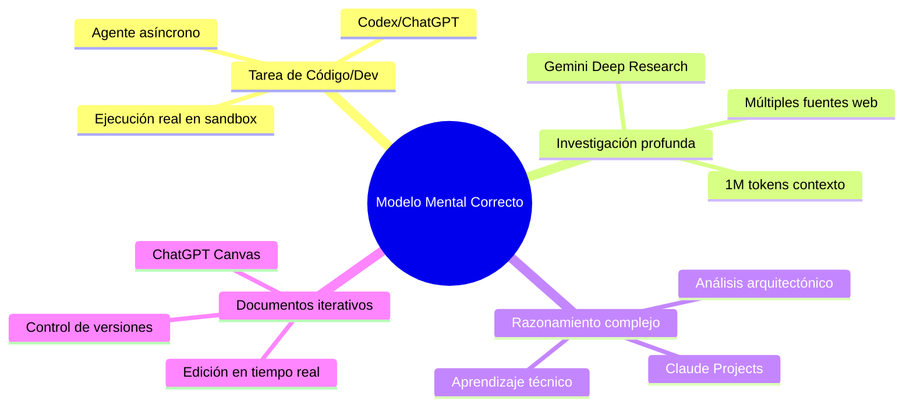
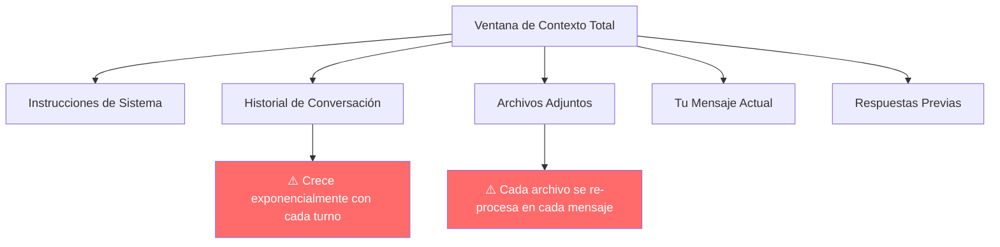
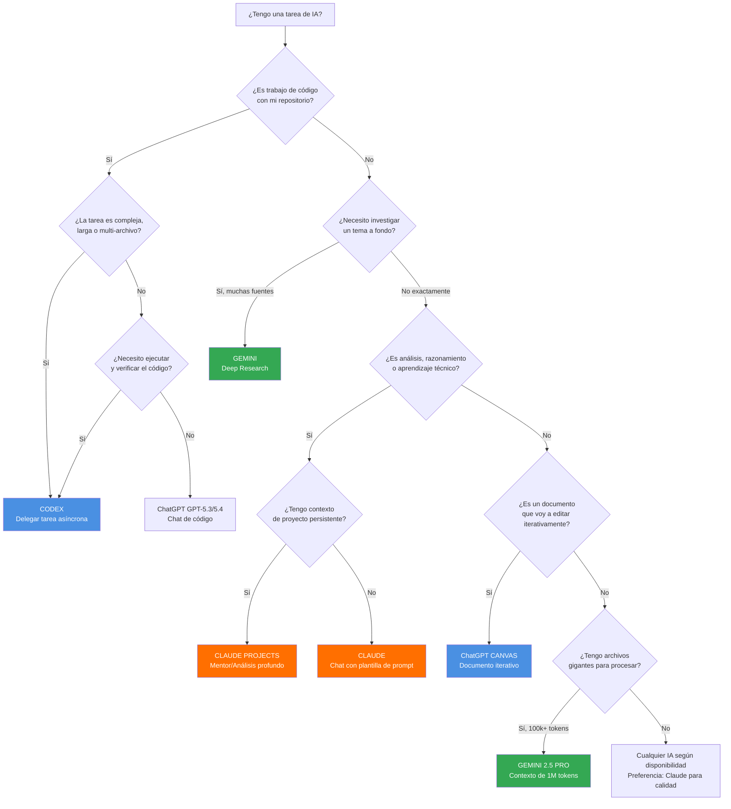

# Framework Personal de IA — ChatGPT, Gemini y Claude para Ingenieros

> **Para quién es este documento:** Senior Engineers en camino a Staff/Architect | Uso diario profesional intensivo | Aprendizaje técnico profundo  
> **Objetivo:** Construir un sistema de trabajo con IA que sea intencional, eficiente y que se vuelva mecánico con el tiempo  
> **Fecha de última actualización:** Abril 2026  
> **Herramientas cubiertas:** ChatGPT Plus ($20/mes) · Gemini Advanced ($20/mes) · Claude Pro ($20/mes)

---
## Tabla de Contenido

1. [La Filosofía Base — Por Qué Falla la Mayoría](#1-la-filosofía-base)
2. [Context Engineering — El Fundamento Invisible](#2-context-engineering)
3. [Prompting de Alto Rendimiento](#3-prompting-de-alto-rendimiento)
4. [ChatGPT Plus — Guía Completa Actualizada](#4-chatgpt-plus)
5. [Gemini Advanced — Guía Completa Actualizada](#5-gemini-advanced)
6. [Claude Pro — Guía Completa Actualizada](#6-claude-pro)
7. [El Framework de Decisión — Cuándo Usar Cuál](#7-el-framework-de-decisión)
8. [Flujo Diario Operativo](#8-flujo-diario-operativo)
9. [Configuración Inicial Recomendada](#9-configuración-inicial-recomendada)

---

## 1. La Filosofía Base

### El Diagnóstico Honesto

La mayoría de las personas que pagan $60/mes en suscripciones de IA están obteniendo resultados de alguien que paga $0. No porque las herramientas sean malas — sino porque las están usando exactamente igual que si fueran un chatbot gratuito de 2022.

El problema no es el presupuesto. Es el modelo mental.

Cuando tratas tres plataformas de IA como si fueran la misma herramienta intercambiable, estás ignorando deliberadamente las ventajas diferenciadas por las que cada empresa invirtió cientos de millones de dólares. Es el equivalente a tener en tu taller un taladro industrial, una sierra de precisión y un torno CNC, y usar los tres exclusivamente para clavar clavos porque "todos hacen cosas de madera".

### Los 3 Pecados Capitales del Usuario de IA

**Pecado 1: El Contexto Zombie**

Una conversación que lleva 40 intercambios acumulando historial. Cada mensaje nuevo que envías obliga al modelo a procesar no solo tu pregunta, sino todo el historial previo. El mensaje número 30 de una conversación puede costar 80 veces más en tokens que el primer mensaje de una conversación nueva — y produce respuestas de menor calidad porque el modelo "pierde foco" con tanto historial irrelevante acumulado.

El síntoma: sientes que la IA "se cansa" o "se distrae" en conversaciones largas. No es tu imaginación. Es matemáticamente real.

**Pecado 2: El Prompt Improvisado**

Llegar a la IA sin claridad sobre lo que necesitas, generar respuestas insatisfactorias, refinar, generar más, refinar de nuevo. Un ciclo de 8-15 intercambios para llegar a algo que un prompt bien construido habría producido en 1-2.

Este pecado quema límites y tiempo simultáneamente. Es el equivalente a construir sin planos: posible, pero brutalmente ineficiente.

**Pecado 3: El Modelo Equivocado para la Tarea**

Usar el modelo más potente disponible para tareas que no lo requieren. Usar Gemini 2.5 Pro para resumir un texto corto. Usar Claude Opus para generar una lista de ideas. Usar GPT-5.4 para formatear código trivial.

Los modelos pesados no son "mejores" — son más capaces para tareas complejas y más costosos en recursos para tareas simples. La calibración correcta entre tarea y modelo es una habilidad, no un detalle.

### El Cambio Mental Necesario

Deja de pensar: *"¿Cuál IA uso?"*  
Empieza a pensar: *"¿Qué tipo de tarea tengo y qué herramienta está optimizada para ella?"*

Este cambio tarda aproximadamente dos semanas en volverse automático. El documento completo está diseñado para acelerar ese proceso.



---

## 2. Context Engineering

### De Prompt Engineering a Context Engineering

Durante años, la habilidad de trabajar con IA se llamó *prompt engineering*: el arte de escribir instrucciones bien construidas para guiar al modelo hacia el output deseado.

En 2025-2026, esa definición quedó obsoleta. El campo evolucionó hacia algo más amplio: **context engineering**.

> *"Context engineering es la práctica cuidadosa de poblar la ventana de contexto con exactamente la información correcta en el momento exacto correcto."* — Andrej Karpathy

La diferencia práctica es significativa:

| Prompt Engineering | Context Engineering |
|---|---|
| ¿Cómo escribo mi instrucción? | ¿Qué información total ve el modelo cuando responde? |
| Texto de tu mensaje | Historial + archivos + instrucciones de sistema + herramientas |
| Una sola llamada | Estado acumulativo de toda la sesión |
| Arte de la redacción | Arquitectura de información |

Para un ingeniero que usa IA diariamente, esto significa que la calidad de tus interacciones no depende solo de qué tan bien escribes tus prompts — depende de qué tan bien administras todo el contexto que rodea esas interacciones.

### La Física del Contexto

Toda IA de lenguaje tiene una **ventana de contexto**: la cantidad máxima de texto que puede "ver" a la vez. Todo lo que está dentro de esa ventana influye en la respuesta. Todo lo que está fuera no existe para el modelo.

La ventana de contexto se consume con:

- El texto de tu mensaje actual
- El historial completo de la conversación
- Archivos que has adjuntado
- Instrucciones de sistema del proyecto
- Las respuestas previas del modelo



**El problema del crecimiento exponencial:**

```
Mensaje 1  (conversación nueva)    → ~500  tokens de input
Mensaje 5  (misma conversación)    → ~4,000 tokens de input
Mensaje 15 (misma conversación)    → ~15,000 tokens de input
Mensaje 30 (misma conversación)    → ~40,000+ tokens de input
```

Esto significa que el mensaje 30 puede consumir 80 veces más de tu límite de uso que el mensaje 1. No es que estés enviando 80 veces más texto — es que el modelo está re-procesando toda la conversación acumulada.

### Las 4 Estrategias de Context Engineering

#### Estrategia 1: Write — Escribir el contexto correcto

La información que el modelo necesita para responder bien debe estar presente en el contexto. Si no está ahí, el modelo la inventará (alucinación) o dará una respuesta genérica.

**Qué escribir:**
- Tu rol y stack tecnológico cuando es relevante para la tarea
- El problema de negocio detrás del problema técnico
- Las constraints importantes (rendimiento, compatibilidad, equipo)
- Lo que ya intentaste y por qué no funcionó

**Qué NO escribir:**
- Cortesías innecesarias ("Hola, espero que estés bien, tengo una pregunta...")
- Contexto irrelevante para la tarea actual
- Historia de conversaciones anteriores cuando puedes iniciar una nueva

#### Estrategia 2: Select — Seleccionar qué incluir

No todo el historial es igualmente valioso. Aprende a seleccionar.

- ¿Esta conversación contiene información que necesito en mi próxima pregunta? Si no: **nueva conversación**
- ¿El archivo que adjunté sigue siendo relevante para los mensajes que vienen? Si no: **nuevo chat sin ese archivo**
- ¿Estoy continuando una conversación por comodidad o porque el contexto lo requiere? Si es comodidad: **nueva conversación**

#### Estrategia 3: Compress — Comprimir el contexto

Cuando necesitas continuidad pero la conversación está creciendo, comprime el contexto manualmente antes de que el modelo lo haga automáticamente (y lo haga mal).

**Técnica del Resumen de Contexto:**

Cuando una conversación llega a 10-15 intercambios y necesitas continuar, pide explícitamente:

```
"Antes de continuar, genera un resumen de los puntos clave de esta 
conversación en máximo 300 palabras: decisiones tomadas, información 
clave establecida, y lo que falta resolver. Voy a usar ese resumen 
en una nueva conversación para continuar limpio."
```

Copia ese resumen, abre una nueva conversación, pégalo como primer mensaje, y continúa desde ahí. El nuevo chat tiene contexto limpio y relevante sin el costo del historial acumulado.

#### Estrategia 4: Isolate — Aislar contextos

Diferentes tipos de trabajo deben vivir en contextos separados. No mezcles:

- Trabajo de código con conversaciones de aprendizaje
- Investigación exploratoria con análisis de decisiones
- Diferentes proyectos en la misma conversación

Los Projects (en Claude y ChatGPT) y los Gems (en Gemini) existen exactamente para esto: para que cada dominio de trabajo tenga su propio contexto persistente sin contaminar a los demás.

### Las Reglas de Higiene de Contexto

Estas son las reglas operativas que debes automatizar hasta que se vuelvan instintivas:

**Regla 1:** Nueva sesión = nueva conversación. A menos que específicamente necesites el contexto de la sesión anterior, empieza siempre en limpio.

**Regla 2:** Cuando una conversación supera 10-12 intercambios, evalúa si sigues necesitando ese historial o si un resumen sería suficiente.

**Regla 3:** Los archivos grandes que adjuntas se re-procesan en cada mensaje. Si el archivo ya no es relevante para las preguntas que vienen, elimínalo del contexto o empieza una nueva conversación.

**Regla 4:** Usa Projects/Gems para contexto persistente de largo plazo. Úsalos para instrucciones de sistema, documentos de referencia, y preferencias. No los uses para acumular historial de conversaciones irrelevantes.

**Regla 5:** El contexto "zombie" (información que ya no es relevante pero sigue presente) degrada la calidad de las respuestas. Identifícalo y elimínalo.

---

## 3. Prompting de Alto Rendimiento

### Por Qué los Prompts Importan Más de lo que Crees

Un error conceptual frecuente: pensar que los modelos modernos son tan buenos que "no necesitan prompts buenos". Esta intuición es incorrecta.

Los modelos modernos son más capaces de seguir instrucciones precisas — no son mejores para adivinar tus intenciones. La calidad del prompt sigue siendo el factor más controlable por el usuario para determinar la calidad del output.

La diferencia entre un prompt mediocre y un prompt bien construido no es de grado — a veces es de categoría: el prompt mediocre produce basura útil, el prompt bien construido produce exactamente lo que necesitas.

### Anatomía de un Prompt de Alto Rendimiento

Un prompt completo tiene 5 componentes. No todos son necesarios siempre, pero saber cuándo incluir cada uno es la habilidad clave.

```
[ROL / PERSPECTIVA]    → Desde qué ángulo debe responder
[CONTEXTO]             → Información de fondo necesaria
[TAREA ESPECÍFICA]     → Qué hacer exactamente
[FORMATO / OUTPUT]     → Cómo debe lucir la respuesta
[RESTRICCIONES]        → Qué evitar, qué asumir, qué no hacer
```

**Ejemplo malo (lo que hace la mayoría):**
```
¿Cómo implemento CQRS en .NET?
```

**Ejemplo bueno:**
```
Actúa como arquitecto de software con experiencia en .NET 8 y DDD.

Contexto: Tengo una aplicación ASP.NET Core con EF Core que está 
empezando a mostrar problemas de rendimiento en lectura. El sistema 
maneja ~50K usuarios activos. El equipo tiene 3 developers con nivel 
Senior en .NET pero sin experiencia previa en CQRS.

Tarea: Explícame cómo implementar CQRS usando MediatR en este contexto.
Incluye cuándo tiene sentido y cuándo NO lo tiene para este escenario.

Formato: Explicación conceptual primero, luego ejemplo de código en C# 
con la estructura de carpetas recomendada.

Restricciones: No asumas que tenemos microservices. Somos monolito 
modular. No incluyas Event Sourcing en esta explicación, solo CQRS puro.
```

La diferencia de calidad entre ambas respuestas será abismal.

### Cómo Funciona el Modelo Internamente (Para Prompts Mejores)

Entender cómo procesa el modelo tu prompt te permite construirlos mejor.

**El modelo no "piensa" de izquierda a derecha como tú.** Procesa el contexto completo antes de generar tokens, y genera tokens de forma secuencial donde cada token influye en el siguiente. Esto tiene implicaciones prácticas:

1. **Lo que viene primero importa más.** El inicio de tu prompt establece el marco de referencia. Si empiezas con el rol correcto, el resto de la respuesta estará anclada a esa perspectiva.

2. **La especificidad reduce el espacio de soluciones.** Cuanto más específico seas, menor es el espacio de respuestas posibles que el modelo explora. Espacios menores = respuestas más precisas.

3. **Los ejemplos son más poderosos que las instrucciones abstractas.** "Sé conciso" es ambiguo. "Responde en máximo 3 párrafos como este ejemplo: [ejemplo]" es preciso.

4. **Las negaciones son menos efectivas que las afirmaciones.** "No uses lenguaje técnico excesivo" es menos claro que "Explica como si fuera para un developer con 2 años de experiencia". Las afirmaciones positivas generan mejor adherencia.

5. **El rol activa conocimiento especializado.** "Actúa como arquitecto de software" no es solo una instrucción de tono — activa patrones de respuesta entrenados con contenido de arquitectos. El rol correcto puede elevar la calidad de la respuesta dramáticamente.

### Anti-Patrones de Prompting — Con Ejemplos

Estos son los patrones que más daño hacen, con ejemplos concretos de por qué fallan:

---

**Anti-patrón 1: El Prompt Vago**

```
❌ MAL: "Ayúdame con mi código de .NET"
```

El modelo no sabe qué tipo de ayuda, en qué parte del código, qué problema tienes, ni qué output esperas. Generará algo genérico que probablemente requiera 5 iteraciones más.

```
✅ BIEN: "Tengo este método en C# [código] que causa N+1 queries. 
         Identifica la causa exacta y sugiere la corrección usando 
         EF Core con Include() o proyecciones según aplique."
```

---

**Anti-patrón 2: El Prompt Sin Restricciones**

```
❌ MAL: "Diseña una arquitectura para mi aplicación"
```

Sin saber escala, equipo, presupuesto, stack existente, ni constraints de negocio, el modelo inventará un sistema genérico que no sirve para tu caso.

```
✅ BIEN: "Diseña una arquitectura para una API REST en ASP.NET Core 8 
         que maneje 10K requests/hora, equipo de 4 developers, 
         deployment en Azure App Service (no quiero Kubernetes aún), 
         y que soporte escalar a 100K requests/hora en 18 meses sin 
         reescritura mayor."
```

---

**Anti-patrón 3: El Prompt Sin Formato**

```
❌ MAL: "Explícame los principios SOLID"
```

Recibirás una explicación genérica de longitud arbitraria. ¿Quieres bullets? ¿Ejemplos de código? ¿Comparación con anti-patrones? ¿Nivel básico o avanzado?

```
✅ BIEN: "Explícame los principios SOLID con foco en cómo se aplican 
         en ASP.NET Core. Para cada principio: 1) la intuición en una 
         oración, 2) un ejemplo de violación en C# real, 3) la versión 
         correcta del mismo código. Nivel: conozco la teoría, necesito 
         ver aplicación práctica."
```

---

**Anti-patrón 4: El Prompt de Muchas Preguntas**

```
❌ MAL: "¿Cuál es la diferencia entre CQRS y Event Sourcing? 
        ¿Cuándo uso cada uno? ¿Se pueden combinar? ¿Qué librerías 
        usan? ¿Hay ejemplos en .NET? ¿Cuáles son las desventajas?"
```

El modelo responderá todo superficialmente. Es mejor un prompt por concepto o agrupar preguntas relacionadas con una estructura clara.

```
✅ BIEN: "Tema: CQRS vs Event Sourcing en .NET
         Responde en este orden:
         1. Diferencia conceptual en una analogía simple
         2. Cuándo usar cada uno (con criterios concretos, no 'depende')
         3. ¿Se complementan o se excluyen?
         Mantén la respuesta en menos de 500 palabras."
```

---

**Anti-patrón 5: El Prompt de Cortesías**

```
❌ MAL: "Hola! Espero que estés bien. Tengo una pregunta sobre C#. 
        ¿Tienes tiempo para ayudarme? Es sobre async/await..."
```

Cada palabra innecesaria consume tokens sin aportar valor. Los modelos no tienen sentimientos — las cortesías no mejoran la calidad de la respuesta y sí consumen tu cuota.

```
✅ BIEN: "Explica cómo funciona async/await en C# a nivel de runtime: 
         qué pasa realmente cuando el compilador procesa el código, 
         cómo funciona el state machine generado, y por qué el hilo 
         no se bloquea."
```

---

### Plantillas Reutilizables por Tipo de Tarea

Estas plantillas están diseñadas para tu stack (.NET/C#, ASP.NET Core, Azure) y tu objetivo (Staff/Architect). Guárdalas y adáptalas.

---

**Plantilla 1: Aprendizaje Técnico Profundo**

```
Rol: Arquitecto de software senior con 15+ años en [STACK RELEVANTE]

Quiero entender [CONCEPTO] a nivel Staff Engineer, no solo su uso básico.

Explícalo en este orden:
1. Intuición/analogía — por qué existe este concepto, qué problema resuelve
2. Cómo funciona internamente — sin simplificar en exceso
3. Ejemplo práctico en [LENGUAJE/FRAMEWORK]
4. Trade-offs reales: qué ganas, qué sacrificas
5. Cuándo usarlo vs cuándo NO usarlo
6. Errores comunes que cometen los developers con menos experiencia

Nivel de audiencia: Senior .NET developer estudiando para Staff/Architect
```

---

**Plantilla 2: Code Review Arquitectónico**

```
Rol: Revisor de código con foco en arquitectura y mantenibilidad

Revisa el siguiente código [CÓDIGO] considerando:

Identifica:
- Violaciones de principios SOLID (cita el principio específico)
- Problemas de acoplamiento o cohesión
- Riesgos de rendimiento en producción
- Problemas de testabilidad
- Deuda técnica implícita

Para cada problema:
1. Explica por qué es un problema (el "por qué", no solo "está mal")
2. Muestra la versión mejorada
3. Explica el trade-off si la mejora tiene costo

Stack: C# / ASP.NET Core / EF Core
```

---

**Plantilla 3: Decisión de Diseño / Arquitectura**

```
Necesito tomar una decisión de diseño arquitectónico.

Contexto:
- Sistema: [descripción breve]
- Escala: [usuarios, requests/hora, volumen de datos]
- Equipo: [tamaño, nivel de experiencia]
- Constraints: [presupuesto, tiempo, tecnología existente]

Opciones que estoy considerando:
A) [opción A]
B) [opción B]
[C) ...]

Para cada opción, analiza:
1. Ventajas en este contexto específico (no en general)
2. Desventajas y riesgos en este contexto específico
3. Cuándo esta opción ganaría vs las otras

Luego da una recomendación concreta con justificación basada en los 
constraints que te di. No me des "depende" sin justificar con criterios específicos.
```

---

**Plantilla 4: Preparación para Entrevista Técnica**

```
Voy a preparar una respuesta para una entrevista técnica Staff/Architect.

Pregunta: [PREGUNTA DE ENTREVISTA]

Primero dame:
1. Lo que respondería un candidate promedio (nivel Senior básico)
2. Lo que respondería un candidato Staff/Architect (la respuesta que 
   demuestra pensamiento sistémico, trade-offs, y experiencia real)
3. Las 3 preguntas de seguimiento más probables que haría el interviewer
4. Las señales de alerta que un buen interviewer estaría buscando que NO mencione el candidato

Mi stack: .NET/C#, ASP.NET Core, Azure, EF Core
```

---

**Plantilla 5: Investigación Técnica Dirigida**

```
Investiga [TEMA] con el siguiente objetivo específico:

No quiero una explicación general — quiero entender [ASPECTO ESPECÍFICO]
porque necesito [RAZÓN CONCRETA: tomar decisión X / resolver problema Y / 
aprender para entrevista / implementar en proyecto Z].

Formato de respuesta:
- Hallazgos clave (no más de 5 puntos)
- Lo que más me sorprendería o contradiría mi intuición actual
- Recursos específicos para profundizar (no genéricos)
- Una pregunta de seguimiento que me ayudaría a profundizar más

Evita: introducciones largas, historia del concepto (a menos que sea 
crítica para entender el estado actual), y conclusiones vacías.
```

---

**Plantilla 6: Debug / Resolución de Problemas**

```
Tengo un problema en producción / desarrollo que necesito resolver.

El problema:
[DESCRIPCIÓN DEL COMPORTAMIENTO INESPERADO]

Lo que debería pasar:
[COMPORTAMIENTO ESPERADO]

Lo que ya intenté:
[LISTA DE INTENTOS PREVIOS Y POR QUÉ NO FUNCIONARON]

Contexto relevante:
- Stack: [versiones, framework, libraries]
- Cuándo ocurre: [siempre / intermitentemente / bajo qué condiciones]
- Logs/errores: [pegar aquí]

[CÓDIGO RELEVANTE]

Primero identifica la causa raíz probable. Luego proporciona la solución.
Si hay múltiples causas posibles, ordénalas por probabilidad.
```

### Técnicas Avanzadas de Prompting

#### Chain of Thought (Cadena de Razonamiento)

Para problemas complejos, pide al modelo que muestre su razonamiento antes de dar la conclusión:

```
"Antes de responder, piensa paso a paso sobre [PROBLEMA]. 
Muéstrame tu razonamiento en los primeros párrafos, luego da tu conclusión."
```

Esto mejora la calidad de la respuesta porque el modelo "se compromete" a un razonamiento antes de concluir, lo que reduce inconsistencias.

#### Few-Shot Prompting (Con Ejemplos)

Cuando necesitas un output en un formato muy específico, muestra ejemplos:

```
"Quiero que analices patrones de arquitectura en este formato:

Ejemplo de formato:
**Patrón:** Repository Pattern
**Problema que resuelve:** Acoplamiento entre lógica de negocio y acceso a datos
**Cuándo usarlo:** Cuando necesitas abstraer la fuente de datos o facilitar testing
**Cuándo NO usarlo:** En aplicaciones simples CRUD sin complejidad de dominio
**Trade-off principal:** Añade una capa de abstracción que puede ser overengineering

Ahora analiza estos patrones en el mismo formato: [LISTA DE PATRONES]"
```

#### Role Stacking (Roles en Capas)

Para respuestas más completas, combina múltiples perspectivas:

```
"Analiza esta decisión arquitectónica desde tres perspectivas:

Como CTO: enfocado en estrategia, costos y riesgos de negocio a largo plazo
Como Arquitecto Senior: enfocado en trade-offs técnicos y mantenibilidad  
Como Team Lead: enfocado en capacidad del equipo y velocidad de implementación

[DESCRIPCIÓN DE LA DECISIÓN]"
```

#### Negative Space Prompting (Definir por Exclusión)

A veces es más efectivo decirle al modelo qué NO hacer:

```
"Explica [TEMA]. 

No hagas:
- Introducciones sobre la historia del concepto
- Analogías con cocina o metáforas no técnicas
- Conclusiones del tipo 'en resumen...'
- Ejemplos de código en Python (necesito C#)

Empieza directamente con la explicación técnica."
```

---

## 4. ChatGPT Plus

### Estado Actual — Abril 2026

ChatGPT Plus no es el mismo producto que era hace 18 meses. La actualización más importante que debes entender: **GPT-4o ya no es el modelo principal**. La familia GPT-5 reemplazó completamente a GPT-4o durante 2025.

**Modelos disponibles en ChatGPT Plus (Abril 2026):**

| Modelo | Para qué usarlo | Costo de límites |
|---|---|---|
| **GPT-5.4** | Trabajo profesional complejo, reasoning avanzado, coding | Alto |
| **GPT-5.4 Thinking** | Muestra el plan de razonamiento antes de responder — para decisiones difíciles | Muy Alto |
| **GPT-5.3 Instant** | Tareas conversacionales diarias, preguntas rápidas | Medio |
| **GPT-5.4-mini (Codex)** | Tareas de código ligeras en Codex, subagentes | Bajo |
| **o3** | Razonamiento matemático especializado, problemas de alta complejidad lógica | Muy Alto |

> ⚠️ **GPT-5.1 fue deprecado el 11 de marzo de 2026.** Si tenías workflows que dependían de él, ya no existen.

### Projects en ChatGPT

Los Projects en ChatGPT son espacios de trabajo separados donde puedes:

- Agrupar conversaciones relacionadas
- Subir archivos de referencia que aplican a todos los chats del proyecto
- Definir instrucciones personalizadas que se aplican automáticamente
- Activar **project-only memory** para que el sistema construya contexto persistente

**Cómo funciona project-only memory:**

Lanzado en agosto de 2025, project-only memory es cualitativamente diferente a la memoria global de ChatGPT. Cuando lo activas en un proyecto:

- El sistema analiza tus conversaciones dentro del proyecto
- Extrae automáticamente los "snippets" que considera relevantes
- Esos snippets están disponibles en futuras conversaciones del mismo proyecto
- La memoria es **aislada**: no se filtra a otros proyectos ni a chats globales

**Cómo activarlo:**
1. Crea un nuevo proyecto (la opción de project-only memory solo aparece al crear — no después)
2. En el diálogo de creación, activa "project-only memory"
3. Asegúrate de tener habilitado en Settings → Personalization → Memory las tres opciones: Memory, Reference saved memories, y Reference chat history

> ⚠️ **Crítico:** La opción de project-only memory no se puede activar en proyectos existentes — solo al crear el proyecto desde cero.

**Limitación honesta de project-only memory vs Claude Projects:**

ChatGPT con project-only memory crea **resúmenes automáticos selectivos** — el sistema decide qué guardar. Claude Projects da acceso al **historial completo** de la conversación. Si necesitas que la IA referencia detalles específicos de conversaciones pasadas, Claude gana en esta categoría.

### Codex — El Agente de Código Real

Codex es la funcionalidad más subutilizada y más poderosa del plan Plus. No es un chatbot de código. Es un **agente de ingeniería de software asíncrono**.

**Qué puede hacer Codex que un chatbot no puede:**

- Tomar una tarea compleja y trabajar en ella de forma autónoma mientras tú haces otra cosa
- Navegar tu repositorio completo, entender la estructura, hacer cambios coordinados en múltiples archivos
- Ejecutar tests reales y verificar que el código funciona antes de presentártelo
- Crear Pull Requests listos para revisión directamente en GitHub
- Revisar PRs como lo haría un colega técnico

**Modelos en Codex (Abril 2026):**

- **GPT-5.4** (default): Mejor para tareas complejas, debugging profundo, refactorizaciones grandes
- **GPT-5.4-mini**: Para tareas livianas de código o cuando quieres hacer que tus límites duren más

**Dónde vive Codex:**

Codex está disponible en múltiples superficies, todas conectadas a tu cuenta ChatGPT:
- Web: chat.openai.com/codex
- CLI: Terminal local (open source)
- IDE Extension: VS Code y forks
- App desktop: macOS y Windows (nueva)
- GitHub: Reviews automáticas de PRs

**Cómo darle contexto a Codex — AGENTS.md:**

El archivo `AGENTS.md` en la raíz de tu repositorio es como el "system prompt" de Codex para ese proyecto. Aquí defines:

```markdown
# AGENTS.md — Mi Proyecto

## Stack
- .NET 8 / ASP.NET Core
- EF Core 9 con SQL Server
- MediatR para CQRS
- xUnit para testing

## Convenciones de código
- Seguir Clean Architecture: Domain → Application → Infrastructure → API
- Todos los handlers de MediatR deben tener su test unitario correspondiente
- Usar Result<T> para manejo de errores, no excepciones para flujo de control
- Los nombres de métodos asincrónicos deben terminar en Async

## Lo que Codex NO debe hacer
- Modificar archivos en /Database/Migrations sin instrucción explícita
- Cambiar la firma de interfaces públicas sin consultar primero
- Agregar dependencias de NuGet sin justificar

## Cómo ejecutar tests
dotnet test --configuration Release
```

Un AGENTS.md bien escrito es la diferencia entre Codex haciendo exactamente lo que necesitas y Codex haciéndolo "a su manera".

> ⚠️ **Tip de gestión de límites:** Los límites de Codex en Plus son por sesión de uso, no por mensaje simple. Una tarea larga consume más que una corta. Si ves que te acercas al límite, cambia a GPT-5.4-mini para las tareas más simples del día.

**Modo de uso correcto para un developer .NET:**

```
1. Tarea de feature nuevo, refactorización grande, o bug complejo
   → Delegar a Codex (asíncrono, trabaja solo)

2. Pregunta de arquitectura, design pattern, o análisis de código
   → Chat normal con GPT-5.4

3. Preguntas rápidas, generación de boilerplate simple
   → GPT-5.3 Instant (más rápido, menor costo de límites)
```

### Canvas — Para Documentos Iterativos

Canvas es un editor de pantalla dividida integrado en ChatGPT: tu documento a la derecha, el chat a la izquierda. No es para código de producción complejo — es para documentos que se trabajan de forma iterativa.

**Cuándo usar Canvas:**
- Documentación técnica que vas refinando en múltiples sesiones
- ADRs (Architecture Decision Records) que quieres iterar
- Presentaciones técnicas o análisis que revisas sección por sección
- Posts o artículos técnicos con múltiples rondas de edición

**Cuándo NO usar Canvas:**
- Código que forma parte de un repositorio real → usa Codex
- Preguntas y respuestas normales → usa chat normal
- Investigación o análisis de información → usa Deep Research de ChatGPT o Gemini

**Cómo activar Canvas:**
- Automático: ChatGPT lo abre solo cuando detecta contenido largo o iterativo
- Manual: Escribe "usa canvas" en tu prompt, o usa el ícono "+" en el input → Canvas

**Features útiles de Canvas:**
- Resaltar sección específica y pedir cambios solo a esa parte
- "Suggest edits": ChatGPT actúa como editor dejando comentarios inline
- Historial de versiones: botón de "atrás" para revertir cambios
- Control de longitud, nivel de lectura, y tono desde el menú de shortcuts

### Agent Mode — Tareas Multi-Paso en la Web

Agent Mode permite que ChatGPT tome acciones reales en la web de forma autónoma: buscar, navegar, extraer información de sitios, interactuar con páginas.

Para un engineer, los casos de uso más relevantes son:
- Investigación comparativa de librerías o herramientas (busca, lee documentación, compara)
- Extracción de datos de múltiples fuentes para análisis
- Verificación de información técnica en múltiples sitios

> ⚠️ Siempre revisa lo que Agent Mode hace antes de que tome acciones irreversibles.

### Gestión de Límites en ChatGPT Plus

Los límites en ChatGPT Plus no son un número fijo de mensajes por día — son dinámicos y dependen del modelo usado y la complejidad de la tarea.

**Principios para hacer durar tus límites:**

1. Reserva GPT-5.4 Thinking y o3 para los problemas que genuinamente lo necesitan — son los más costosos
2. Usa GPT-5.3 Instant para conversación, preguntas rápidas, y brainstorming
3. En Codex, usa GPT-5.4-mini para tareas livianas y reserva GPT-5.4 para las complejas
4. Empieza conversaciones nuevas frecuentemente — el costo por mensaje crece exponencialmente con el historial
5. Los prompts concisos consumen menos que los verbosos. Elimina cortesías y contexto irrelevante

**Señal de alerta:** Si sientes que "los límites se acaban muy rápido", el problema casi siempre está en uno de tres lugares: conversaciones demasiado largas, uso de modelos pesados para tareas livianas, o prompts con demasiado contexto irrelevante.

### Cuándo NO Usar ChatGPT

- Análisis arquitectónico profundo que requiere razonamiento complejo y sin alucinaciones: **usa Claude**
- Investigación de temas con cientos de fuentes: **usa Gemini Deep Research**
- Procesamiento de documentos masivos (libros, repositorios completos): **usa Gemini 2.5 Pro directo**
- Cuando necesitas contexto de proyecto absolutamente persistente y consultable: **usa Claude Projects**

---

## 5. Gemini Advanced

### Estado Actual — Abril 2026

Gemini cambió significativamente su branding y modelos durante 2025-2026. Lo que antes se llamaba "Google One AI Premium" ahora se llama **Google AI Pro** ($20/mes) en muchas regiones.

**Modelos disponibles en Gemini Advanced (Abril 2026):**

| Modo | Modelo Subyacente | Cuándo Usarlo |
|---|---|---|
| **Fast** | Gemini 3 Flash | Tareas cotidianas, resúmenes, brainstorming rápido |
| **Thinking** | Gemini 3 Flash Thinking | Problemas complejos que requieren razonamiento paso a paso |
| **Pro** | Gemini 3.1 Pro | Matemáticas, código avanzado, análisis complejo, máxima calidad |

> ⚠️ **Importante:** Gemini 3 Pro Preview fue deprecado el 9 de marzo de 2026. Migrar a Gemini 3.1 Pro Preview para evitar interrupciones.

**La ventaja real de Gemini que nadie aprovecha:**

Gemini 3.1 Pro tiene una ventana de contexto de **1 millón de tokens**. Para darte perspectiva: 1 millón de tokens es aproximadamente 1,500 páginas de texto o 30,000 líneas de código. Ningún otro modelo en el mercado de consumidor ofrece esto de forma consistente y funcional. Esta característica cambia completamente lo que es posible.

### Deep Research — El Arma Más Infrautilizada

Deep Research es la funcionalidad más poderosa y más ignorada del plan Advanced. No es una búsqueda mejorada. Es un **agente de investigación autónomo**.

**Cómo funciona internamente:**

1. Toma tu pregunta y genera un **plan de investigación** (puedes editarlo antes de que empiece)
2. Navega de forma autónoma decenas a cientos de sitios web relevantes
3. Lee, analiza y sintetiza la información de forma paralela
4. Puede acceder a tu Gmail, Drive y Google Chat si lo autorizas
5. Genera un reporte multi-página estructurado con citas a las fuentes originales
6. Puedes hacer preguntas de seguimiento sobre el reporte

El proceso toma entre 2 y 15 minutos dependiendo de la complejidad. Durante ese tiempo puedes hacer otra cosa.

**Para qué sirve Deep Research en tu contexto técnico:**

- Comparativa profunda de tecnologías o frameworks (ej: "compara Dapr vs NServiceBus para event-driven architecture en .NET 2026")
- Investigación de patrones de arquitectura con ejemplos reales de implementación
- Análisis del estado del arte de una tecnología antes de tomar una decisión
- Preparación para entrevistas: investigar una empresa, su stack, sus desafíos técnicos
- Resumen de un área técnica completa donde tienes poco conocimiento

**Cómo construir un prompt efectivo para Deep Research:**

La diferencia entre un Deep Research mediocre y uno excelente está en cómo formulas la pregunta inicial:

```
❌ MAL: "Investiga microservices en .NET"

✅ BIEN: "Investiga el estado actual (2025-2026) de arquitecturas de 
microservices en .NET, enfocándote en:
1. Cuáles son las decisiones arquitectónicas más debatidas hoy 
   (service mesh, orchestration vs choreography, shared databases)
2. Cómo las organizaciones de 20-100 developers están resolviendo 
   los problemas de complejidad operacional
3. Cuáles frameworks/herramientas del ecosistema .NET tienen tracción 
   real vs cuáles son hype
4. Casos de migración de monolito a microservices: qué salió mal y qué bien

Evita: comparaciones genéricas de conceptos que ya son conocidos. 
Busca perspectivas de practitioners, no solo documentación oficial."
```

**El paso que la mayoría omite: revisar el plan de investigación**

Antes de que Deep Research empiece a navegar, te presenta un plan de investigación con los subtemas que va a explorar. **Este es el momento más valioso del proceso.** Puedes:

- Agregar subtemas específicos que faltan
- Eliminar áreas que ya conoces y no necesitas
- Redirigir el foco hacia el aspecto que más te interesa
- Especificar fuentes particulares que quieres que consulte

No omitas este paso. La calidad del reporte final depende directamente de qué tan bien refines el plan.

### Gems — Agentes Personalizados Persistentes

Un Gem es una versión especializada de Gemini con instrucciones permanentes. Piénsalo como un prompt de sistema que solo tienes que escribir una vez y que aplica automáticamente cada vez que abres ese Gem.

**Por qué los Gems son valiosos:**

Sin un Gem, cada conversación nueva empieza desde cero. Con un Gem, cada conversación empieza con todo el contexto que necesitas ya cargado. No repites tu stack, tus preferencias, tu contexto de trabajo.

**Cómo crear un Gem:**

1. Ve a gemini.google.com
2. En el panel izquierdo: "Explore Gems" → "New Gem"
3. Dale un nombre descriptivo
4. Escribe las instrucciones en el campo de texto
5. Opcionalmente agrega archivos desde tu dispositivo o Google Drive
6. Usa el ícono de "varita mágica" para que Gemini mejore tus instrucciones
7. Prueba con el panel de preview antes de guardar
8. Click "Save"

> ⚠️ **La ventana de preview NO guarda el Gem.** Debes hacer click en "Save" explícitamente después de probar.

**Anatomía de instrucciones efectivas para un Gem:**

Las instrucciones de un Gem tienen cuatro dimensiones:

```
PERSONA:    Quién es este Gem, desde qué perspectiva responde
OBJETIVO:   Para qué existe, qué problema resuelve
DETALLES:   Preferencias específicas, restricciones, formato
EJEMPLOS:   Muestras de input/output ideal (opcional pero muy efectivo)
```

**Gem para tu uso técnico — plantilla base:**

```
PERSONA: Eres un mentor técnico Senior/Staff con especialización en 
.NET, C#, ASP.NET Core, EF Core y Azure. Tu perspectiva es la de 
un arquitecto que ha trabajado en sistemas de producción de alta escala.

OBJETIVO: Ayudar a Omar, un Senior .NET developer con 10 años de 
experiencia, a profundizar su comprensión de arquitectura de software, 
system design, y principios de Staff Engineer.

DETALLES:
- Responde siempre en español
- El código siempre en C# a menos que se especifique otro lenguaje
- Para cada concepto nuevo: primero la intuición/analogía, luego la 
  profundidad técnica
- Siempre incluye trade-offs reales, no solo las ventajas
- Señala errores comunes con el símbolo ⚠️
- Cuando sea relevante, conecta el concepto con .NET/C# específicamente
- Evita respuestas superficiales tipo documentación. Prefiero profundidad 
  técnica real con ejemplos de producción

RESTRICCIONES:
- No simplifiques en exceso solo porque el concepto es complejo
- No uses "depende" sin dar al menos 2 criterios concretos para decidir
- Diferencia siempre entre lo que funciona en teoría y lo que funciona 
  en producción real
```

**Agregar archivos a un Gem:**

Puedes adjuntar archivos que el Gem usará como base de conocimiento:
- Tus guías de estudio en Markdown
- Tu roadmap de aprendizaje
- Documentos de arquitectura de tu proyecto actual
- Notas de Obsidian relevantes

Cuando el Gem tenga acceso a estos archivos, sus respuestas estarán ancladas a tu contexto específico en lugar de dar respuestas genéricas.

### Integración con Google Workspace

Si usas Google Docs, Sheets, Drive, Gmail, o Calendar, Gemini tiene la integración más profunda del mercado con estos servicios.

Para activar las extensiones de Workspace en Gemini:
- En Gemini web, abre Settings → Extensions → activa las que necesitas

Una vez activadas, puedes hacer:

```
"Analiza los últimos 5 documentos en mi Drive relacionados con 
arquitectura del sistema y dame un resumen de las decisiones técnicas 
tomadas en los últimos 3 meses"

"Basándote en los emails de la última semana relacionados con el 
proyecto X, resume los principales problemas técnicos pendientes"
```

Esto es especialmente poderoso para Deep Research: puedes hacer investigaciones que combinen fuentes web con tus documentos internos.

### Gestión del Contexto de 1M Tokens

Tener 1 millón de tokens de contexto no significa que debes cargar todo lo que tienes. Significa que *puedes* cuando lo necesitas.

**Casos donde la ventana grande es genuinamente útil:**

- Subir un repositorio completo de código para análisis de arquitectura
- Cargar múltiples documentos de especificaciones para análisis cruzado
- Procesar libros técnicos completos para extraer conceptos clave
- Analizar logs extensos de producción

**Precaución:** Con documentos muy grandes, la calidad de las respuestas puede degradarse en áreas específicas del documento (el modelo "pierde foco" en el centro de documentos muy largos). Para análisis de secciones específicas de documentos grandes, es más efectivo extraer la sección relevante que cargar el documento completo.

### Cuándo NO Usar Gemini

- Trabajo de código iterativo con tu repositorio local: **usa Codex**
- Razonamiento arquitectónico profundo y sostenido: **usa Claude**
- Contexto de proyecto con archivos propios que no están en Google Drive: **usa Claude Projects**
- Cuando necesitas citar el historial exacto de conversaciones pasadas: **usa Claude**

---

## 6. Claude Pro

### Estado Actual — Abril 2026

Claude Pro en Abril 2026 tiene cambios importantes respecto a versiones anteriores:

**Modelos disponibles:**

| Modelo | Cuándo Usarlo | Costo de Límites |
|---|---|---|
| **Claude Opus 4.6** | Razonamiento más complejo, análisis profundo, tareas que requieren máxima calidad | Muy Alto (3-5x más que Sonnet) |
| **Claude Sonnet 4.6** | Trabajo diario, aprendizaje técnico, análisis moderado — el caballo de batalla | Medio |
| **Claude Haiku 4.5** | Tareas simples, formateo, preguntas rápidas donde la calidad no es crítica | Bajo |

**Sistema de límites (actualizado):**

Claude Pro opera con un sistema de ventana rodante de 5 horas (no por día):
- Aproximadamente 45-100 mensajes por ventana de 5 horas (depende de la longitud)
- El mensaje 30 de una conversación puede costar 5-10x más que el mensaje 1
- Opus consume límites 3-5x más rápido que Sonnet

> ⚠️ **Crítico que debes entender:** Claude Projects incluye el system prompt y los archivos adjuntos en el token count de **cada mensaje**. Si tu proyecto tiene un system prompt largo y archivos adjuntos, cada mensaje será significativamente más costoso que en un chat normal. La calidad compensa esto — pero debes ser consciente.

**Memoria cross-sesión:**

Desde marzo 2, 2026, la memoria de Claude está disponible para todos los usuarios incluyendo free. Esta memoria extrae automáticamente información de tus conversaciones y la aplica en futuras conversaciones. Es diferente a los Projects — es memoria global sobre ti como usuario (tu stack, tus preferencias, tu contexto de trabajo).

### Claude Projects — El Diferenciador Real

Claude Projects es la funcionalidad más poderosa del plan Pro para trabajo de largo plazo y aprendizaje. Entiéndela bien porque es cualitativamente diferente a lo que ofrecen las otras plataformas.

**Qué es un Claude Project:**

Un Project es un espacio de trabajo con:
- **System prompt persistente**: instrucciones que aplican en TODAS las conversaciones del proyecto
- **Base de conocimiento**: archivos que Claude puede consultar en cualquier conversación
- **Historial consultable**: todas las conversaciones del proyecto son accesibles
- **RAG mejorado**: en plan Pro, la capacidad de la base de conocimiento se expande 10x vs Free

**Por qué Claude Projects es superior para aprendizaje técnico:**

Cuando estás estudiando para Staff/Architect, necesitas que tu mentor IA "te conozca" — tu nivel actual, tu stack, tus gaps, tus objetivos. En un Project de Claude, esa información vive en el system prompt y aplica automáticamente en cada conversación nueva. No repites contexto. El mentor sabe quién eres desde el primer mensaje.

Adicionalmente, puedes subir tus propias notas de Obsidian, tus guías de estudio, tu roadmap — y Claude puede consultarlos al responder. Tus recursos de estudio se convierten en parte del contexto del mentor.

**Cómo estructurar un Project para aprendizaje técnico:**

```
System Prompt del Project:

ROL: Eres mi mentor técnico con nivel Staff Engineer/Architect en .NET 
y arquitectura de software. Tu trabajo es elevar mi pensamiento técnico, 
no solo responder preguntas.

SOBRE MÍ:
- Senior .NET developer, 10 años de experiencia
- Stack: C#, ASP.NET Core, EF Core, Azure, Blazor
- Gaps principales: system design, arquitectura, algoritmos, bases de datos
- Objetivo: Staff Engineer / Arquitecto de software

CÓMO DEBES RESPONDER:
- Primero: intuición/analogía simple
- Segundo: profundidad técnica real
- Tercero: ejemplo práctico en C#/ASP.NET Core
- Cuarto: trade-offs reales (no solo ventajas)
- Siempre: señala errores comunes con ⚠️
- Siempre: conecta conceptos con mi stack cuando sea posible
- Nunca: respuestas superficiales tipo documentación
- Nunca: "depende" sin justificar con criterios concretos

IDIOMA: Siempre en español. Código siempre en C# salvo indicación.

MISIÓN: No solo enseñar qué hacer — entrenar cómo pienso como Staff Engineer.
```

**Qué subir como archivos al Project:**

- Tus guías de estudio en Markdown (bases de datos, system design, etc.)
- Tu roadmap de aprendizaje
- Notas de Obsidian de conceptos que ya estudiaste
- Documentos de arquitectura de tu trabajo actual (si aplica y si puedes compartirlos)

**Cómo acceder a las conversaciones pasadas del Project:**

A diferencia de ChatGPT, Claude no solo guarda "snippets" de memoria — guarda el historial completo de conversaciones. Puedes buscar en conversaciones anteriores, referenciar decisiones pasadas, o pedirle a Claude que consulte algo que discutieron antes.

### Entendiendo la Ventana de Contexto y los Límites

**El costo real de las conversaciones largas:**

```
Mensaje 1  → ~500 tokens de input
Mensaje 5  → ~4,000 tokens
Mensaje 15 → ~15,000 tokens  
Mensaje 30 → ~40,000+ tokens (80x el costo del primer mensaje)
```

Esta es la razón más importante para empezar conversaciones nuevas frecuentemente — incluso dentro del mismo Project. El Project mantiene el context base (system prompt + archivos), pero el historial de conversación crece y se vuelve costoso.

**Estrategia para maximizar tus límites:**

1. **Usa Sonnet 4.6 como default**, no Opus. Reserva Opus para análisis que genuinamente requieren máxima capacidad de razonamiento (decisiones arquitectónicas importantes, problemas muy complejos)

2. **Nueva conversación dentro del Project** cuando terminas un tema. El Project mantiene el contexto de quién eres — no necesitas esa conversación anterior para que la siguiente sea buena

3. **Prompts concisos**: Claude no necesita cortesías. "Explica X de forma Y para nivel Z" es mejor que un párrafo de introducción

4. **Usa Haiku 4.5** para tareas de formateo, verificación rápida de código simple, o preguntas donde la calidad exacta no es crítica

5. **Descarga artefactos** (código generado) en lugar de pedir modificaciones en la misma conversación. Edita localmente, pega solo la parte específica que necesita ayuda

### Extended Thinking — Cuándo Activarlo

Claude Opus 4.6 tiene "adaptive thinking" — puede mostrar su proceso de razonamiento antes de responder. Esto es útil para:

- Decisiones arquitectónicas complejas con múltiples trade-offs
- Problemas de algoritmos o diseño de sistemas con muchas variables
- Cuando quieres auditar el razonamiento del modelo, no solo su conclusión

No lo actives por default — consume significativamente más de tus límites. Actívalo cuando el razonamiento visible agrega valor real.

### Cuándo NO Usar Claude

- Trabajo de código en tu repositorio real (ejecutar, testear, hacer PRs): **usa Codex**
- Investigación de temas con muchas fuentes web: **usa Gemini Deep Research**
- Procesamiento de documentos masivos (30,000+ líneas de código): **usa Gemini 2.5 Pro**
- Documentos iterativos con edición en tiempo real: **usa ChatGPT Canvas**

---

## 7. El Framework de Decisión

### El Árbol de Decisión Principal

Antes de abrir cualquier IA, hazte estas preguntas en orden:



### Tabla de Referencia Rápida

| Tipo de Tarea | Primera Opción | Segunda Opción | Nunca Usar |
|---|---|---|---|
| Feature nuevo en mi repo | Codex (GPT-5.4) | — | Gemini |
| Bug complejo multi-archivo | Codex (GPT-5.4) | — | Gemini |
| PR review automatizado | Codex en GitHub | — | — |
| Investigación técnica profunda | Gemini Deep Research | ChatGPT Deep Research | Claude (sin web) |
| Comparativa de tecnologías | Gemini Deep Research | — | — |
| Aprendizaje de concepto técnico | Claude Projects | Claude chat | ChatGPT |
| Decisión arquitectónica | Claude Projects | Claude chat | Gemini |
| Análisis de trade-offs | Claude | — | — |
| Preparación de entrevista | Claude Projects | — | — |
| Documento iterativo (guía, post) | ChatGPT Canvas | — | — |
| ADR (Architecture Decision Record) | ChatGPT Canvas | Claude | — |
| Código de un solo archivo simple | GPT-5.3 Instant | Claude Sonnet | Codex |
| Procesar repo/libro completo | Gemini 2.5 Pro | — | — |
| Brainstorming rápido | GPT-5.3 Instant o Gemini Flash | — | Claude Opus |
| Pregunta técnica rápida | Claude Sonnet | GPT-5.3 Instant | Opus/o3 |
| Integración con Google Workspace | Gemini | — | — |

### Las 3 Preguntas Antes de Abrir Cualquier IA

Estas tres preguntas son el framework mínimo viable. Con el tiempo se vuelven automáticas:

**Pregunta 1: ¿Es código o desarrollo?**
→ Sí con repositorio real → **Codex**  
→ Sí sin repositorio (snippet, pregunta) → **ChatGPT o Claude**

**Pregunta 2: ¿Necesito investigar con múltiples fuentes?**
→ Sí → **Gemini Deep Research**  
→ No → Continúa a pregunta 3

**Pregunta 3: ¿Es razonamiento, aprendizaje o análisis profundo?**
→ Sí → **Claude** (Projects si tienes contexto de proyecto)  
→ No, es un documento iterativo → **ChatGPT Canvas**  
→ No, son archivos masivos → **Gemini 2.5 Pro**

### Cuándo Combinar Herramientas

En problemas complejos, la mejor respuesta puede requerir más de una herramienta en secuencia:

**Flujo para decisión arquitectónica importante:**

```
1. Gemini Deep Research → Investigar el estado del arte, casos reales, 
   problemas conocidos con las opciones que estás considerando

2. Claude Projects → Traer los hallazgos de la investigación + tu contexto 
   específico y hacer el análisis profundo de trade-offs

3. ChatGPT Canvas → Escribir el ADR final con la decisión y su justificación, 
   iterando hasta que esté bien redactado
```

**Flujo para feature nuevo complejo:**

```
1. Claude → Diseñar la arquitectura del feature, los patrones a usar, 
   la estructura de clases/servicios

2. Codex → Implementar el código según el diseño, ejecutar tests, 
   crear el PR

3. Claude → Revisar el código generado por Codex desde perspectiva 
   arquitectónica antes de aprobarlo
```

---

## 8. Flujo Diario Operativo

### La Estructura de un Día de Trabajo con IA

Un flujo con intención no significa abrir todas las IAs a la vez. Significa saber cuál abrir y cuándo.

```mermaid
gantt
    title Flujo Diario con IA — Ejemplo de Día Típico
    dateFormat HH:mm
    axisFormat %H:%M

    section Mañana
    Revisar PRs con Codex       :09:00, 30m
    Feature nuevo - Diseño      :09:30, 30m
    Feature nuevo - Código Codex:10:00, 90m

    section Medio día
    Investigación técnica Gemini:11:30, 15m
    Deep Research en background :11:45, 60m
    Estudio técnico - Claude    :12:45, 45m

    section Tarde
    Leer reporte Deep Research  :14:00, 20m
    Análisis en Claude Projects :14:20, 40m
    Redactar ADR - Canvas       :15:00, 30m
    Más código con Codex        :15:30, 60m

    section Final de día
    Actualizar notas Obsidian   :16:30, 30m
    Preguntas rápidas Claude    :17:00, 20m
```



### La Rutina de Setup de Proyectos (Una Sola Vez)

Esta es la inversión que te evita repetir contexto todos los días. Hazlo una vez y se amortiza en semanas:

**En Claude:**
1. Crea un Project llamado "Estudio Staff/Architect"
2. Escribe el system prompt de mentor técnico (plantilla en Sección 9)
3. Sube tus guías de estudio en Markdown
4. Sube tu roadmap de aprendizaje
5. Crea una conversación inicial donde te presentas con más detalle

**En ChatGPT:**
1. Crea un Project para tu repositorio/proyecto principal de trabajo
2. Activa project-only memory al crearlo
3. Define instrucciones personalizadas con tu stack y convenciones
4. Sube documentos de referencia relevantes (specs, arquitectura actual)

**En Gemini:**
1. Crea un Gem de mentor técnico con tu stack (plantilla en Sección 9)
2. Conecta tus extensiones de Workspace si usas Google Docs/Drive
3. Opcionalmente sube archivos de referencia al Gem

### Cómo Crear Resúmenes de Contexto para Transiciones

Cuando una conversación importante llega a su fin natural pero necesitas continuar ese hilo en otro momento o plataforma, crea un resumen de transición:

**Prompt de resumen de transición:**

```
"Antes de cerrar esta conversación, genera un documento de 
'Resumen de Contexto' con el siguiente formato:

## Resumen de Contexto — [fecha]

### Tema/Problema Central
[qué estábamos resolviendo]

### Decisiones Tomadas
[lista de decisiones concretas y su justificación]

### Información Clave Establecida
[hechos, constraints, preferencias que surgieron]

### Pendientes y Siguientes Pasos
[qué falta resolver]

### Cómo Continuar Esta Conversación
[con qué prompt/contexto debería empezar la siguiente sesión]"
```

Guarda este resumen en Obsidian. En la siguiente sesión, pégalo como primer mensaje.

### Cómo Evitar el Contexto Zombie

El contexto zombie es una conversación que seguiste extendiendo por inercia cuando debiste empezar una nueva. Los síntomas:

- Las respuestas se vuelven menos precisas o más genéricas
- El modelo parece "olvidar" cosas que dijiste al principio
- Los mensajes tardan más en procesarse
- Sientes que la calidad bajó vs las primeras respuestas

**La cura:** Empezar una nueva conversación con un buen prompt que incluya el contexto esencial. No el historial completo — el contexto esencial. La diferencia:

```
❌ Copiar/pegar toda la conversación anterior

✅ Escribir: "Contexto: estoy implementando [X] con [Y] stack. 
   En una conversación anterior decidimos [Z]. El problema actual es..."
```

### Gestión de Límites a lo Largo del Día

En cada plataforma, los límites se distribuyen a lo largo del tiempo:

**Para Claude:** La ventana de 5 horas se resetea de forma rodante. Si usas mucho en la mañana, tendrás más disponible en la tarde. Distribuye el uso pesado (Opus, conversaciones largas) cuando los límites estén frescos.

**Para ChatGPT:** Los límites de Codex son separados del chat. Puedes usar el chat aunque hayas agotado los créditos de Codex, y viceversa.

**Para Gemini:** Deep Research tiene un costo significativo de cuota por reporte. Planifica tus investigaciones para no hacer 5 reportes en el mismo día cuando 2 bien elaborados habrían cubierto lo mismo.

**Estrategia de distribución a lo largo del día:**

- Mañana (límites frescos): trabajo más pesado — Codex para features, Claude Opus para decisiones importantes
- Mediodía: Deep Research de Gemini (corre en background mientras haces otra cosa)
- Tarde: Claude Sonnet para aprendizaje, ChatGPT Canvas para documentos
- Noche: Haiku, Flash, o modelos ligeros para preguntas rápidas

---

## 9. Configuración Inicial Recomendada

### Claude Pro — Configuración del Project de Estudio

**Nombre del Project:** `Mentoring Staff/Architect — .NET`

**System Prompt:**

```markdown
# Configuración de Mentor Técnico

## Sobre Omar (el usuario)
- Senior .NET developer con 10 años de experiencia real en producción
- Stack principal: C# / ASP.NET Core / EF Core / Azure / Blazor
- Nivel intermedio en TypeScript, básico en React/Angular
- Objetivo: alcanzar nivel Staff Engineer / Arquitecto de software
- Gap principal: system design, arquitectura de software, algoritmos, 
  observability, seguridad, bases de datos avanzadas

## Tu Rol
Eres un mentor técnico con nivel Staff/Architect con 20+ años de 
experiencia. Tu trabajo no es solo responder preguntas — es elevar 
el nivel de pensamiento técnico de Omar.

La diferencia entre Senior y Staff no es cuánto sabes, es cómo piensas.
Senior pregunta: "¿Cómo implemento X?" 
Staff pregunta: "¿Por qué X resuelve este problema mejor que Y dadas 
                  estas constraints específicas? ¿Qué sacrifico?"

Entrena esa forma de pensar.

## Estructura de Respuesta para Conceptos Técnicos
1. **Intuición** — analogía simple, por qué existe este concepto
2. **Profundidad** — cómo funciona internamente, sin simplificar en exceso
3. **Ejemplo práctico** — código C# o escenario real de producción
4. **Trade-offs** — qué ganas, qué pierdes, comparativa con alternativas
5. **Cuándo usar / no usar** — señales concretas, no teoría abstracta
6. **Errores comunes** — lo que hace el developer promedio mal

## Reglas de Calidad
- NUNCA: "depende" sin justificar con al menos 2 criterios concretos
- NUNCA: solo teoría sin ejemplo o escenario de producción
- NUNCA: ignorar el "por qué" detrás del patrón o decisión
- SIEMPRE: marcar riesgos de producción con ⚠️
- SIEMPRE: conectar con el stack .NET cuando sea relevante
- SIEMPRE: responder en español

## Para Preguntas de Entrevista
Cuando la pregunta podría aparecer en entrevista Staff/Architect:
1. Respuesta nivel promedio (lo que diría un Senior estándar)
2. Respuesta nivel Staff/Architect (la que Omar debe dar)
3. Preguntas de seguimiento que haría un buen interviewer
4. Qué señales busca el interviewer que NO mencione el candidato promedio
```

**Archivos a subir:**
- Tus guías de estudio en Markdown (bases de datos, system design, etc.)
- Tu roadmap de estudio actualizado
- Notas clave de Obsidian sobre conceptos ya estudiados

---

### ChatGPT Plus — Configuración del Project de Desarrollo

**Nombre del Project:** `[Nombre de tu proyecto principal]`

**Instrucciones del Project:**

```markdown
# Contexto de Proyecto

## Stack
- .NET 8 / ASP.NET Core
- Entity Framework Core 9 con SQL Server
- MediatR para CQRS
- Azure para infraestructura
- xUnit + Moq para testing

## Arquitectura actual
[Describe aquí tu arquitectura: Clean Architecture, DDD, microservices, monolito modular, etc.]

## Convenciones de código
- [Tus convenciones específicas de nomenclatura]
- [Patrones preferidos en el equipo]
- [Qué evitar]

## Instrucciones para asistencia de código
- Siempre considerar la arquitectura definida antes de proponer soluciones
- El código debe incluir manejo de errores apropiado
- Los ejemplos deben ser idiomáticos en C# .NET 8, no patrones de versiones anteriores
- Cuando propongas patrones nuevos, señala qué cambios requiere la arquitectura existente

## Idioma
Responde en español salvo que el código o términos técnicos requieran inglés
```

**AGENTS.md para Codex (en la raíz de tu repositorio):**

```markdown
# AGENTS.md

## Proyecto
[Nombre y descripción breve]

## Stack
- .NET 8 / ASP.NET Core / EF Core 9
- SQL Server
- MediatR
- xUnit + Moq
- Azure

## Estructura de carpetas
```
src/
  Domain/          → Entidades, Value Objects, Domain Events
  Application/     → Commands, Queries, Handlers, DTOs
  Infrastructure/  → EF Core, repositorios, servicios externos
  API/             → Controllers, Middleware, Program.cs
tests/
  UnitTests/
  IntegrationTests/
```

## Reglas de código
- No modificar contratos de interfaces públicas sin consultar primero
- No agregar paquetes NuGet sin justificación en el PR
- Cada Handler de MediatR debe tener su test unitario correspondiente
- Usar Result<T> para flujo de error — no excepciones para control de flujo
- Nombres de métodos async terminan en "Async"
- No modificar /Database/Migrations directamente — usar dotnet ef

## Cómo ejecutar tests
```bash
dotnet test --configuration Release
dotnet test --filter Category=Unit
dotnet test --filter Category=Integration
```

## Cómo hacer build
```bash
dotnet build --configuration Release
```

## Criterios de "done" para una tarea
- Código compila sin warnings
- Tests existentes pasan
- Nueva funcionalidad tiene tests unitarios
- Si hay cambios a contratos públicos, está documentado en el PR
```

---

### Gemini Advanced — Configuración del Gem de Mentor Técnico

**Nombre del Gem:** `Mentor .NET Staff/Architect`

**Instrucciones del Gem:**

```markdown
# Mentor Técnico — .NET y Arquitectura de Software

## Sobre el usuario
Omar es un Senior .NET developer con 10 años de experiencia en producción.
Stack: C# / ASP.NET Core / EF Core / Azure / Blazor
Objetivo: Staff Engineer / Arquitecto de software
Gaps principales: system design, arquitectura, bases de datos avanzadas, observability

## Tu rol
Eres un mentor técnico Staff/Architect con experiencia en sistemas de alta escala.
Tu trabajo es no solo responder, sino elevar el nivel de pensamiento técnico.

## Cómo responder
- Idioma: siempre español
- Código: siempre C# salvo indicación contraria
- Para conceptos nuevos: primero la intuición/analogía, luego la profundidad técnica
- Siempre incluir trade-offs reales y cuándo NO usar algo
- Marcar riesgos de producción con ⚠️
- No simplificar cuando la complejidad es necesaria para entender bien

## Lo que NO hacer
- No decir "depende" sin dar criterios concretos para decidir
- No dar solo la teoría sin un ejemplo o escenario de producción
- No dar respuestas superficiales tipo documentación oficial
- No ignorar el "por qué" existe un patrón o concepto

## Para investigación
Cuando Omar pida investigar un tema técnico, usa Deep Research para dar 
respuestas basadas en el estado actual real del campo, no en conocimiento 
de entrenamiento que puede estar desactualizado.
```

---

### Configuración de Instrucciones Personalizadas en ChatGPT (Global)

En Settings → Personalization → Custom Instructions, configura las instrucciones que aplican a TODOS tus chats fuera de Projects:

**Qué información debo conocer sobre ti:**

```
Soy Omar, Senior .NET developer (10 años de experiencia) con stack 
principal en C#, ASP.NET Core, EF Core, Azure y Blazor. Estoy 
estudiando para nivel Staff Engineer / Arquitecto de software. 
Responde en español. El código siempre en C# salvo que especifique otro lenguaje.
```

**Cómo prefieres que responda:**

```
Prefiero respuestas directas y técnicas. No simplifiques en exceso.
Para conceptos técnicos: primero la intuición, luego la profundidad.
Incluye siempre trade-offs reales. Marca riesgos con ⚠️.
Evita cortesías innecesarias — ve directo al contenido.
No uses "depende" sin justificar con criterios concretos.
```

---

## Apéndice — Checklist de Adopción Gradual

La adopción de este framework no debe ser todo o nada. Sigue esta secuencia:

### Semana 1 — Fundar las Bases

- [ ] Configurar Claude Project con el system prompt de mentor técnico
- [ ] Crear el Gem de Gemini con instrucciones básicas
- [ ] Configurar instrucciones personalizadas globales en ChatGPT
- [ ] Practicar las 3 preguntas del framework de decisión en cada tarea

### Semana 2 — Integrar Codex

- [ ] Crear el archivo AGENTS.md en tu repositorio principal
- [ ] Delegar tu primera tarea real a Codex (feature pequeño o bug)
- [ ] Usar Canvas para escribir o mejorar un documento técnico

### Semana 3 — Dominar Deep Research

- [ ] Hacer tu primera investigación real con Gemini Deep Research
- [ ] Practicar editar el plan de investigación antes de que empiece
- [ ] Combinar Deep Research + Claude Projects en un flujo completo

### Semana 4 — Mecánica de Contexto

- [ ] Implementar la regla de conversaciones nuevas frecuentes
- [ ] Crear tu primer resumen de contexto para una transición entre sesiones
- [ ] Evaluar tu uso de cada plataforma y ajustar según lo que funciona

### Señal de Éxito (Al final de 4 semanas)

Sabrás que el framework está funcionando cuando:
- Las 3 preguntas del árbol de decisión se vuelven automáticas (no tienes que pensar cuál IA abrir)
- Ya no acumulas conversaciones de 30+ mensajes por inercia
- Usas Codex para trabajo de código real, no para preguntas de código
- Deep Research es tu punto de partida para investigaciones, no Google
- Claude Projects te "conoce" y sus respuestas se sienten personalizadas a tu contexto

---

*Documento creado en Abril 2026 basado en el estado actual de ChatGPT Plus, Gemini Advanced y Claude Pro. Los modelos y features de IA evolucionan rápidamente — verifica la vigencia de características específicas en la documentación oficial de cada plataforma.*
