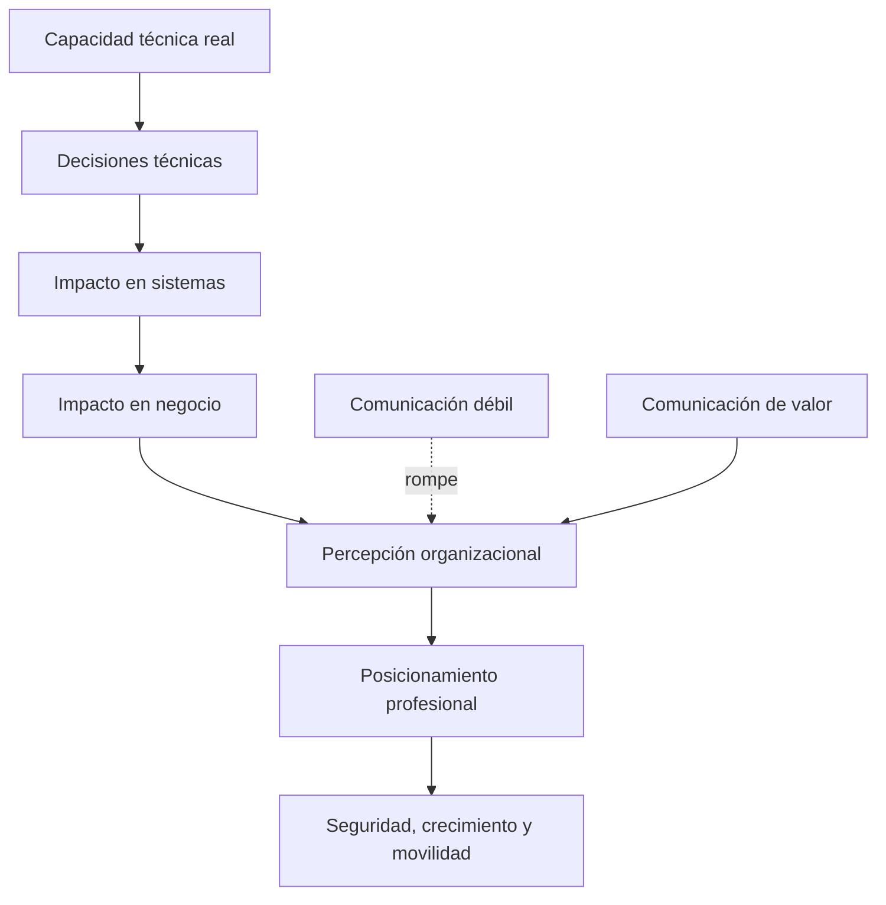
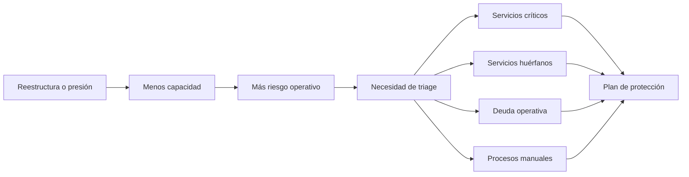
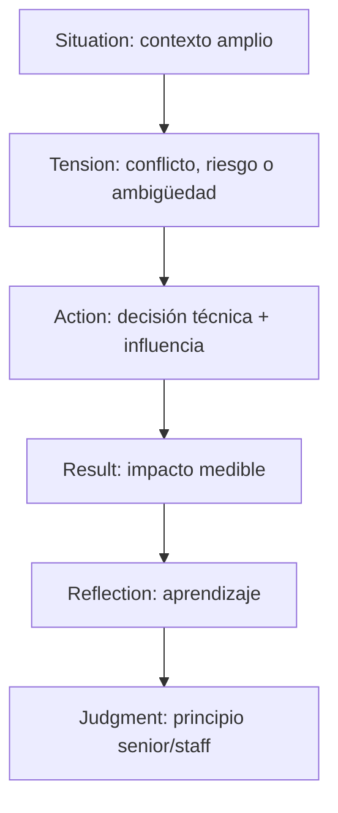
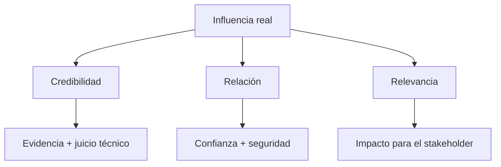
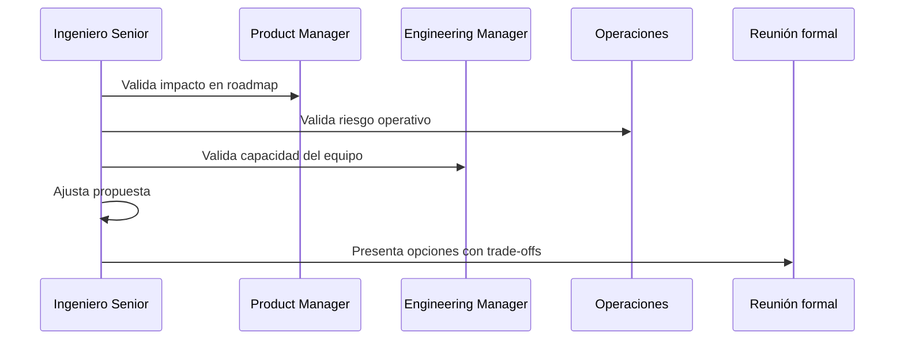
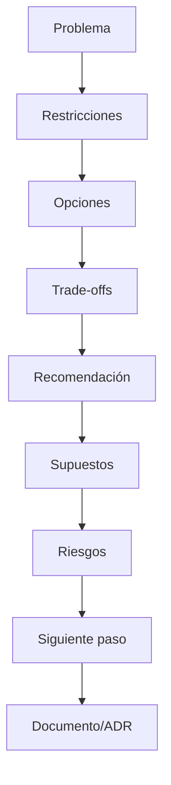
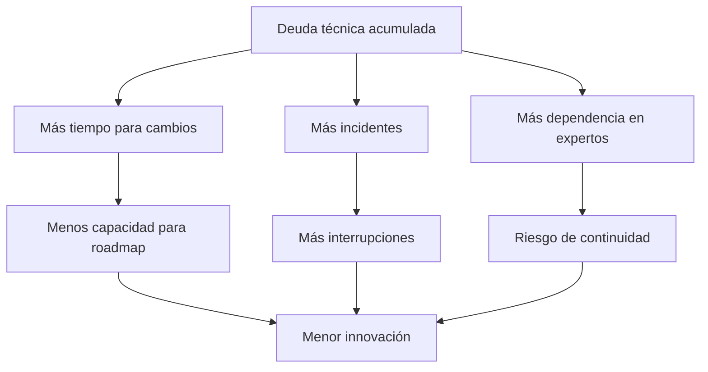

# Guía avanzada de comunicación de valor, influencia y posicionamiento profesional para ingenieros de software senior

> **Propósito del documento**  
> Este documento es un programa práctico de entrenamiento para que un ingeniero de software senior traduzca su valor técnico en impacto de negocio, mejore su posicionamiento profesional en entornos inciertos y desarrolle comunicación de nivel Staff/Principal.  
>
> No es una guía motivacional. No es una lista de frases bonitas. Es un sistema de trabajo para operar mejor en situaciones reales: riesgo laboral, entrevistas senior/staff, influencia sin autoridad, reuniones técnicas, conversaciones con negocio y evaluación de impacto.

---

## Tabla de contenido

1. [Contexto y premisa central](#1-contexto-y-premisa-central)
2. [Mapa general del programa](#2-mapa-general-del-programa)
3. [La tesis principal: el valor senior no está en escribir más código](#3-la-tesis-principal-el-valor-senior-no-está-en-escribir-más-código)
4. [Modelo mental: del output técnico al outcome de negocio](#4-modelo-mental-del-output-técnico-al-outcome-de-negocio)
5. [Prioridad 1: posicionamiento profesional en entornos de riesgo](#5-prioridad-1-posicionamiento-profesional-en-entornos-de-riesgo)
6. [Prioridad 2: narrativa profesional para entrevistas Senior/Staff](#6-prioridad-2-narrativa-profesional-para-entrevistas-seniorstaff)
7. [Prioridad 3: influencia sin autoridad](#7-prioridad-3-influencia-sin-autoridad)
8. [Prioridad 4: liderazgo técnico visible en reuniones técnicas](#8-prioridad-4-liderazgo-técnico-visible-en-reuniones-técnicas)
9. [Prioridad 5: comunicación con negocio y stakeholders no técnicos](#9-prioridad-5-comunicación-con-negocio-y-stakeholders-no-técnicos)
10. [Prioridad 6: performance reviews y visibilidad continua](#10-prioridad-6-performance-reviews-y-visibilidad-continua)
11. [Frameworks reutilizables de comunicación](#11-frameworks-reutilizables-de-comunicación)
12. [Patrones de frases para reuniones reales](#12-patrones-de-frases-para-reuniones-reales)
13. [Sistema de documentación personal de impacto](#13-sistema-de-documentación-personal-de-impacto)
14. [Simulaciones prácticas](#14-simulaciones-prácticas)
15. [Plan de entrenamiento de 8 semanas](#15-plan-de-entrenamiento-de-8-semanas)
16. [Errores críticos a evitar](#16-errores-críticos-a-evitar)
17. [Checklist de operación semanal](#17-checklist-de-operación-semanal)
18. [Bibliografía y fuentes](#18-bibliografía-y-fuentes)

---

# 1. Contexto y premisa central

Tu situación no es simplemente: “quiero comunicarme mejor”.

El problema real es más específico:

- Estás en un entorno con incertidumbre organizacional.
- El negocio pesa mucho en la toma de decisiones.
- Existe presión por demostrar valor.
- La narrativa externa sobre IA puede reducir erróneamente la ingeniería a “generar código”.
- Tu valor técnico existe, pero puede no estar siendo percibido con la fuerza adecuada.
- Necesitas proyectarte como alguien que reduce riesgo, mejora decisiones, protege continuidad y desbloquea resultados de negocio.

La habilidad central a desarrollar no es “hablar más”. Es **comunicar valor bajo presión**.

Eso implica poder responder con claridad cuando alguien pregunta, explícita o implícitamente:

- ¿Por qué esto importa?
- ¿Qué riesgo reduce?
- ¿Qué costo evita?
- ¿Qué decisión facilita?
- ¿Qué capacidad futura desbloquea?
- ¿Qué pasa si no lo hacemos?
- ¿Por qué tú eres una persona clave para la organización?

---

# 2. Mapa general del programa

El entrenamiento se organiza según tus prioridades declaradas:

1. **Situaciones de riesgo**: despidos, reestructuras, presión financiera, necesidad de justificar valor.
2. **Entrevistas Senior/Staff**: narrativa de impacto, juicio técnico, liderazgo, influencia, resultados.
3. **Influencia sin autoridad**: mover decisiones sin ser jefe formal.
4. **Reuniones técnicas**: proyectar liderazgo sin dominar la conversación de forma torpe.
5. **Reuniones con negocio**: traducir complejidad técnica a lenguaje ejecutivo.
6. **Performance reviews**: convertir evidencia dispersa en narrativa clara de impacto.



La idea central es simple pero incómoda:

> En niveles senior/staff, el impacto que no se comunica bien compite en desventaja contra el impacto que sí se comunica bien.

No basta con hacer buen trabajo. Hay que hacerlo visible, entendible y relevante para quien toma decisiones.

---

# 3. La tesis principal: el valor senior no está en escribir más código

Un ingeniero junior suele ser evaluado por completar tareas.

Un ingeniero senior es evaluado por entregar soluciones complejas con autonomía.

Un ingeniero Staff/Principal es evaluado por mejorar el sistema completo: técnico, humano y organizacional.

## 3.1 Comparación de niveles

| Nivel | Pregunta dominante | Valor principal | Riesgo común |
|---|---|---|---|
| Junior | ¿Puede ejecutar tareas? | Aprende y entrega bajo guía | No entender contexto |
| Mid | ¿Puede resolver problemas definidos? | Autonomía creciente | Optimizar solo su parte |
| Senior | ¿Puede liderar soluciones complejas? | Diseño, ownership, calidad | Quedarse solo en lo técnico |
| Staff | ¿Puede mover sistemas y personas? | Influencia, alineación, estrategia | Ser invisible si no comunica |
| Principal | ¿Puede moldear dirección organizacional? | Decisiones transversales, visión, leverage | Alejarse demasiado de la ejecución |

## 3.2 El código es evidencia, no toda la historia

El código es importante. Pero en niveles altos, el código es solo una de las formas en que se materializa una decisión.

Antes del código hay:

- análisis de problema;
- lectura de restricciones;
- negociación de alcance;
- identificación de riesgos;
- selección de trade-offs;
- coordinación con otros equipos;
- evaluación de costo de oportunidad;
- diseño de caminos reversibles;
- prevención de fallos futuros.

Después del código hay:

- adopción;
- soporte;
- operación;
- medición;
- mantenimiento;
- aprendizaje organizacional;
- transferencia de conocimiento.

La narrativa profesional fuerte no dice:

> “Hice una migración.”

Dice:

> “Reduje el riesgo operativo de una plataforma crítica, disminuí el tiempo de recuperación ante fallos y liberé capacidad del equipo que antes se consumía en soporte manual.”

---

# 4. Modelo mental: del output técnico al outcome de negocio

Uno de los errores más frecuentes en ingeniería es comunicar outputs como si fueran outcomes.

## 4.1 Output vs outcome

| Output técnico | Outcome de negocio |
|---|---|
| Refactoricé un módulo | Reduje el costo de cambio en una zona crítica |
| Mejoré cobertura de pruebas | Reduje riesgo de regresiones en releases frecuentes |
| Optimicé una consulta | Mejoré experiencia de usuario y reduje costo de infraestructura |
| Migré a .NET 8/9/10 | Mejoré soporte, seguridad, performance y mantenibilidad |
| Automatizamos despliegue | Reducimos lead time y riesgo operacional |
| Documenté decisiones | Reduje dependencia de conocimiento tribal |

## 4.2 Fórmula base de traducción

Usa esta fórmula:

```text
Decisión técnica
→ efecto operativo
→ efecto organizacional
→ efecto de negocio
→ riesgo de no hacerlo
```

Ejemplo:

```text
Decisión técnica:
Automatizar pruebas de regresión.

Efecto operativo:
Menos validación manual antes de liberar.

Efecto organizacional:
El equipo puede desplegar con más confianza y menos coordinación ad hoc.

Efecto de negocio:
Menor time-to-market y menos interrupciones por bugs en producción.

Riesgo de no hacerlo:
Cada release seguirá dependiendo de validaciones frágiles, lentas y difíciles de escalar.
```

## 4.3 Métricas útiles para traducir valor

Las métricas DORA siguen siendo una base fuerte para conectar ingeniería con negocio: deployment frequency, change lead time, failed deployment recovery time y change failure rate. DORA también explica la dualidad throughput/stability: los equipos fuertes no eligen entre velocidad y estabilidad; trabajan para mejorar ambas.[^dora-metrics][^dora-history]

| Dimensión | Métrica técnica | Traducción ejecutiva |
|---|---|---|
| Velocidad | Lead time for changes | Tiempo para convertir decisión en valor |
| Frecuencia | Deployment frequency | Capacidad de responder al mercado |
| Estabilidad | Change failure rate | Riesgo de introducir fallos |
| Recuperación | Failed deployment recovery time / MTTR | Costo y duración del impacto operativo |
| Calidad operativa | SLO / error budget | Confiabilidad percibida por clientes |
| Eficiencia | Tiempo en KTLO | Capacidad disponible para innovación |
| Mantenibilidad | Tiempo de onboarding / cambio | Costo futuro de evolución |

## 4.4 La frase que debes dominar

> “Esto no es solo una mejora técnica; es una forma de reducir el costo/riesgo/tiempo necesario para que el negocio pueda operar y cambiar.”

Ejemplos:

- “Esta automatización no solo mejora el pipeline; reduce el riesgo de liberar defectos en una ventana donde el negocio necesita moverse más rápido.”
- “Este refactor no es cosmético; reduce el costo de cambiar reglas de negocio que hoy están acopladas a infraestructura.”
- “Esta documentación no es burocracia; reduce el riesgo de dependencia en personas específicas.”

---

# 5. Prioridad 1: posicionamiento profesional en entornos de riesgo

Tu máxima prioridad declarada es la situación de riesgo: reestructuras, presión, posible movimiento laboral y necesidad de no ser percibido como prescindible.

En estos contextos, el error fatal es creer que el valor se defenderá solo.

No se defiende solo.

## 5.1 Cómo piensa la organización en modo riesgo

Cuando una empresa entra en presión, las conversaciones cambian:

| En estabilidad | En riesgo |
|---|---|
| ¿Qué podemos construir? | ¿Qué debemos proteger? |
| ¿Qué features agregamos? | ¿Qué costos reducimos? |
| ¿Qué arquitectura ideal queremos? | ¿Qué riesgos no podemos permitirnos? |
| ¿Qué sería elegante? | ¿Qué es suficiente, seguro y sostenible? |
| ¿Quién produce mucho? | ¿Quién evita fallos costosos? |

Esto no significa que la calidad ya no importe. Significa que la calidad debe explicarse como protección de negocio.

## 5.2 Las cuatro señales de valor en crisis

En ambientes inciertos, un ingeniero se vuelve más visible cuando comunica y demuestra que puede:

1. **Proteger continuidad**  
   Mantener sistemas críticos operando.

2. **Reducir riesgo**  
   Identificar fallos probables antes de que exploten.

3. **Recuperar capacidad**  
   Eliminar fricción, deuda y trabajo manual que consume al equipo.

4. **Crear claridad**  
   Ayudar a que otros decidan mejor en medio de la ambigüedad.

## 5.3 Matriz de posicionamiento bajo riesgo

| Tipo de trabajo | Si lo comunicas mal | Si lo comunicas bien |
|---|---|---|
| Refactor | “Está puliendo código” | “Está reduciendo costo de cambio en zona crítica” |
| Soporte/incidentes | “Apaga fuegos” | “Protege continuidad de negocio” |
| Documentación | “Hace tareas administrativas” | “Reduce dependencia y riesgo de salida de personal” |
| Coordinación | “Está en juntas” | “Desbloquea decisiones entre equipos” |
| Automatización | “Mejora herramientas” | “Recupera capacidad operativa y reduce errores manuales” |
| Mentoring | “Ayuda a otros” | “Multiplica capacidad del equipo” |

## 5.4 El concepto de “trabajo pegamento”

Tanya Reilly popularizó el concepto de “glue work”: tareas como coordinación, documentación, onboarding, seguimiento, comunicación y desbloqueo que permiten que el equipo funcione. Este trabajo puede ser muy valioso, pero también puede volverse invisible o incluso perjudicar carrera si no se gestiona deliberadamente.[^being-glue]

La clave no es dejar de hacer glue work. La clave es convertirlo en evidencia de liderazgo técnico.

### Ejemplo débil

> “Estuve ayudando con coordinación entre equipos.”

### Ejemplo fuerte

> “Detecté que el retraso principal no era técnico, sino falta de alineación entre API, datos y producto. Organicé la decisión pendiente, documenté los acuerdos y reduje dos semanas de bloqueo potencial.”

## 5.5 Triage arquitectónico en reestructuras

Cuando una empresa reduce gente o cambia prioridades, el Staff mindset cambia de “construir más” a “sostener mejor”.

Checklist de triage:

- ¿Qué servicios quedaron sin dueño claro?
- ¿Qué procesos dependen de una sola persona?
- ¿Qué componentes no tienen monitoreo suficiente?
- ¿Qué sistemas tienen documentación insuficiente?
- ¿Qué tareas operativas consumen demasiada capacidad?
- ¿Qué proyectos deberían pausarse porque su costo operativo supera su valor?
- ¿Qué decisiones de arquitectura ya no son válidas bajo el nuevo tamaño del equipo?



## 5.6 Cómo hablar en crisis sin sonar alarmista

La habilidad crítica es **hacer visible el riesgo sin parecer que estás creando drama**.

Estructura:

```text
1. He observado X.
2. El riesgo no es inmediato en todos los escenarios, pero sí relevante si ocurre Y.
3. El impacto sería Z.
4. Propongo una mitigación proporcional: A.
5. Esto nos permite proteger B sin detener C.
```

Ejemplo:

> “He observado que el módulo de facturación depende de conocimiento concentrado en dos personas. No es un riesgo urgente si el equipo se mantiene estable, pero en un contexto de rotación o reestructura puede afectar continuidad. Propongo documentar los flujos críticos y automatizar las validaciones principales. Esto protege operación sin detener el roadmap.”

## 5.7 Tu mapa personal de indispensabilidad

No se trata de volverte “irremplazable” en el sentido tóxico de guardar conocimiento. Eso es peligroso. Se trata de ser percibido como alguien que **reduce fragilidad organizacional**.

| Pregunta | Respuesta que debes poder demostrar |
|---|---|
| ¿Qué riesgos entiendes que otros no ven? | Riesgos técnicos, operativos, de proceso, de dependencia |
| ¿Qué decisiones ayudas a tomar? | Trade-offs, priorización, secuenciación |
| ¿Qué capacidad desbloqueas? | Menos retrabajo, menos soporte, más autonomía |
| ¿Qué conocimiento institucional conviertes en sistema? | Documentación, guías, patrones, ADRs |
| ¿A quién haces mejor? | Mentoring, revisiones, estándares |
| ¿Qué costo evitas? | Incidentes, demoras, deuda, duplicidad |

---

# 6. Prioridad 2: narrativa profesional para entrevistas Senior/Staff

Una entrevista senior/staff no evalúa solo si sabes tecnología. Evalúa si sabes operar en ambigüedad, influir, tomar decisiones con restricciones y explicar impacto.

## 6.1 La diferencia entre Senior y Staff en entrevista

| Senior fuerte | Staff fuerte |
|---|---|
| “Diseñé e implementé X” | “Identifiqué que X era el cuello de botella organizacional/técnico” |
| “Resolví un problema complejo” | “Convertí un problema ambiguo en una dirección ejecutable” |
| “Lideré al equipo técnicamente” | “Alineé múltiples equipos con incentivos distintos” |
| “Mejoré performance” | “Reduje costo/riesgo/latencia y habilité una capacidad estratégica” |
| “Tomé ownership” | “Cambié la forma en que la organización toma decisiones en esa área” |

## 6.2 Framework STAR+R+J

El STAR clásico se queda corto para roles Staff. Usa:

- **S — Situation**: contexto técnico, negocio y organizacional.
- **T — Tension / Task**: tensión real, no solo tarea asignada.
- **A — Action**: acciones técnicas y de influencia.
- **R — Result**: impacto medible o evidencia concreta.
- **R — Reflection**: qué aprendiste y cómo cambió tu criterio.
- **J — Judgment**: qué principio de decisión revela esta historia.



## 6.3 Ejemplo de mala respuesta vs buena respuesta

### Pregunta

“Cuéntame de una vez que lideraste una decisión técnica difícil.”

### Respuesta débil

> “Tuvimos que migrar un sistema legacy. Yo propuse hacerlo por fases, creé algunos servicios nuevos y ayudé al equipo a implementar la solución. Al final salió bien.”

Problemas:

- No hay negocio.
- No hay tensión.
- No hay trade-offs.
- No hay impacto.
- No hay juicio.

### Respuesta fuerte

> “El sistema legacy procesaba operaciones críticas, pero cualquier cambio tomaba demasiado tiempo porque las reglas de negocio estaban acopladas a infraestructura antigua. El riesgo no era solo técnico: el negocio necesitaba adaptar reglas con más frecuencia y el equipo ya estaba consumiendo demasiado tiempo en validaciones manuales.  
>
> Evalué tres opciones: reemplazo completo, extracción gradual por dominio o estabilización mínima. Recomendé extracción gradual porque reducía riesgo operativo y permitía entregar valor incremental. Para alinear a producto y operaciones, presenté el plan como reducción de lead time y riesgo de regresiones, no como modernización técnica.  
>
> El resultado fue que pudimos aislar los flujos más críticos, reducir el tiempo de cambio en esa zona y dejar documentación de decisiones para que otros equipos entendieran el criterio. La lección fue que en sistemas legacy el problema rara vez es ‘tecnología vieja’; normalmente es costo de cambio, riesgo de operación y falta de claridad sobre qué parte conviene tocar primero.”

## 6.4 Banco de historias Staff-Level

Debes construir entre 12 y 20 historias. No improvisarlas el día de la entrevista.

| Tema | Pregunta típica | Señal fuerte |
|---|---|---|
| Ambigüedad | “Describe un problema mal definido” | Convertiste caos en dirección |
| Desacuerdo | “Cuéntame de un conflicto técnico” | Influiste sin imponer |
| Crisis | “Háblame de un incidente” | Priorizaste contención, aprendizaje y sistema |
| Trade-off | “Velocidad vs calidad” | Mostraste criterio contextual |
| Mentoring | “Cómo elevas a otros” | Multiplicaste capacidad |
| Deuda técnica | “Cómo priorizas refactor” | Lo tradujiste a riesgo/costo |
| Stakeholders | “Trabajaste con negocio” | Adaptaste lenguaje y expectativas |
| Fallo | “Algo que salió mal” | Aprendizaje sin defensividad |
| Arquitectura | “Decisión de diseño importante” | Mostraste opciones y consecuencias |
| Ownership | “Proyecto sin dueño claro” | Tomaste liderazgo proporcional |

## 6.5 Plantilla para crear una historia

```markdown
## Historia: [Título corto]

### Contexto
- Sistema / equipo:
- Situación de negocio:
- Restricciones:
- Stakeholders:

### Tensión
- Qué estaba en juego:
- Qué conflicto existía:
- Qué riesgo había:

### Opciones consideradas
1. Opción A:
   - Ventaja:
   - Riesgo:
2. Opción B:
   - Ventaja:
   - Riesgo:
3. Opción C:
   - Ventaja:
   - Riesgo:

### Acción
- Qué hice técnicamente:
- Cómo alineé personas:
- Cómo comuniqué:
- Qué documento/reunión/decisión facilité:

### Resultado
- Métrica:
- Evidencia:
- Cambio observado:

### Reflexión
- Qué aprendí:
- Qué haría distinto:
- Qué principio me dejó:

### Frase ejecutiva
“Esta historia demuestra que puedo...”
```

## 6.6 Tu narrativa base

Debes tener una narrativa compacta de 60–90 segundos.

Formato:

```text
Soy un ingeniero senior especializado en [dominio/stack], pero mi valor principal no está solo en implementar soluciones, sino en convertir problemas técnicos ambiguos en decisiones claras, sostenibles y alineadas al negocio.

He trabajado en [tipo de sistemas/proyectos], donde he tenido que equilibrar estabilidad, velocidad, deuda técnica, restricciones de negocio y colaboración entre áreas.

Mi fortaleza está en analizar el problema completo, proponer trade-offs realistas y ayudar a que los equipos tomen mejores decisiones técnicas sin perder de vista impacto, riesgo y capacidad futura.
```

Versión más fuerte:

> “Mi perfil combina profundidad técnica en .NET/Azure/backend con criterio de arquitectura y comunicación de negocio. Me interesa operar en problemas donde no basta con programar: hay que entender restricciones, priorizar riesgos, alinear stakeholders y diseñar soluciones sostenibles. En mis mejores contribuciones no solo entregué código; reduje fragilidad, aclaré decisiones y habilité que el equipo pudiera moverse con menos dependencia y más confianza.”

---

# 7. Prioridad 3: influencia sin autoridad

Influir sin autoridad no significa manipular. Significa lograr que una decisión avance porque otros entienden el problema, confían en tu criterio y ven el beneficio de actuar.

## 7.1 Las fuentes reales de influencia

| Fuente | Cómo se gana | Cómo se pierde |
|---|---|---|
| Credibilidad técnica | Buen juicio, consistencia, evidencia | Opiniones fuertes sin datos |
| Claridad | Explicar simple sin simplificar de más | Divagar, sonar abstracto |
| Confianza | Cumplir, escuchar, no ridiculizar | Sorprender, culpar, exponer |
| Relevancia | Conectar con prioridades del otro | Hablar solo de tus intereses |
| Timing | Intervenir en el momento correcto | Llegar tarde o saturar |
| Coalición | Alinear aliados antes de decidir | Forzar consenso en vivo |

## 7.2 El triángulo de influencia



Si tienes credibilidad pero no relación, puedes parecer brillante pero difícil.

Si tienes relación pero no credibilidad, puedes caer bien pero no mover decisiones.

Si tienes credibilidad y relación, pero no relevancia para el negocio, te escuchan… pero no priorizan.

## 7.3 Influencia por preguntas

Una técnica Staff es guiar sin imponer.

En lugar de:

> “Esa arquitectura está mal.”

Usa:

> “¿Qué pasaría si este volumen se duplica y el equipo que mantiene este componente ya no está disponible?”

En lugar de:

> “Tenemos que hacer refactor.”

Usa:

> “¿Cuánto tiempo del equipo estamos dispuestos a seguir invirtiendo en soporte manual antes de recuperar esa capacidad?”

En lugar de:

> “No podemos prometer esa fecha.”

Usa:

> “¿Queremos optimizar por fecha fija, por alcance completo o por riesgo bajo? Podemos elegir dos, pero no las tres sin aumentar costo.”

## 7.4 El patrón de alineación previa

Muchas decisiones no se ganan en la reunión grande. Se ganan antes.

Proceso:

1. Identifica quién puede bloquear.
2. Entiende su preocupación real.
3. Ajusta el framing.
4. Consigue desacuerdos temprano.
5. Llega a la reunión con el conflicto ya reducido.



## 7.5 Cómo manejar desacuerdo sin perder autoridad

Estructura:

```text
1. Acknowledge:
Entiendo la preocupación.

2. Reframe:
Creo que el punto central no es X, sino Y.

3. Evidence:
La evidencia que tenemos es Z.

4. Options:
Veo tres caminos posibles.

5. Recommendation:
Mi recomendación es B porque balancea mejor riesgo y velocidad.

6. Invite:
¿Hay alguna restricción que no esté considerando?
```

Ejemplo:

> “Entiendo la preocupación por no retrasar el release. Creo que el punto central no es si refactorizamos o no, sino cuánto riesgo aceptamos en un flujo que ya generó incidentes. La evidencia es que tres de los últimos cinco defectos vienen de esa zona. Veo tres caminos: liberar sin cambios, poner validaciones mínimas o aislar el componente crítico. Recomiendo la segunda opción para no detener el release y reducir el riesgo inmediato. ¿Hay alguna restricción de negocio que cambie esa recomendación?”

---

# 8. Prioridad 4: liderazgo técnico visible en reuniones técnicas

En reuniones técnicas, el error común es hablar mucho para demostrar seniority.

El objetivo no es hablar más. Es **elevar la calidad de la decisión**.

## 8.1 Conductas que proyectan liderazgo Staff

| Conducta | Señal que envía |
|---|---|
| Resume el problema antes de opinar | Entiende contexto |
| Separa hechos de suposiciones | Mejora claridad |
| Expone trade-offs | Tiene juicio |
| Pregunta por restricciones | Piensa sistémicamente |
| Propone siguiente paso concreto | Desbloquea acción |
| Documenta decisión | Crea memoria organizacional |
| Reconoce contribuciones | Genera confianza |

## 8.2 Intervenciones de alto valor

### Cuando la discusión se vuelve demasiado técnica

> “Antes de entrar más a implementación, quiero confirmar el criterio de decisión: ¿estamos optimizando por tiempo de entrega, estabilidad operativa o flexibilidad futura?”

### Cuando hay muchas opiniones

> “Veo tres posturas: velocidad, mantenibilidad y bajo riesgo. Propongo evaluarlas contra el impacto en release, operación y costo de cambio.”

### Cuando nadie decide

> “Parece que tenemos suficiente información para una decisión reversible. Mi propuesta es avanzar con opción B, documentar supuestos y revisar en dos semanas con datos.”

### Cuando se está ignorando riesgo

> “No creo que esto bloquee la entrega, pero sí quiero dejar explícito el riesgo: si este supuesto falla, el impacto será en operación, no solo en desarrollo.”

## 8.3 Modelo de decisión técnica visible



## 8.4 Plantilla de intervención Staff en reunión

```text
Para ordenar la decisión:

1. El problema que estamos resolviendo es...
2. Las restricciones principales son...
3. Las opciones reales son...
4. El trade-off central es...
5. Mi recomendación es...
6. El riesgo que aceptamos es...
7. El siguiente paso concreto sería...
```

---

# 9. Prioridad 5: comunicación con negocio y stakeholders no técnicos

Hablar con negocio no significa “hacerlo simple porque no entienden”. Significa traducir el nivel de abstracción.

Negocio no necesita todos los detalles internos. Necesita saber:

- impacto;
- riesgo;
- costo;
- opciones;
- recomendación;
- decisión requerida.

## 9.1 What / So What / Now What

Este framework es muy útil en comunicación ejecutiva:

| Parte | Pregunta | Ejemplo |
|---|---|---|
| What | ¿Qué está pasando? | “El flujo de pagos tiene dependencias manuales en validación.” |
| So What | ¿Por qué importa? | “Esto aumenta riesgo de fallos y limita la frecuencia de cambios.” |
| Now What | ¿Qué hacemos? | “Propongo automatizar validaciones críticas antes del siguiente release mayor.” |

## 9.2 Formato ejecutivo de una actualización

```text
Resumen:
[Una frase sobre el estado real.]

Impacto:
[Qué significa para negocio.]

Riesgo:
[Qué puede salir mal si no se atiende.]

Opciones:
[A, B, C con trade-offs.]

Recomendación:
[La opción sugerida y por qué.]

Decisión requerida:
[Qué necesitas del stakeholder.]
```

## 9.3 Ejemplo

### Versión técnica débil

> “Tenemos problemas con dependencias y necesitamos refactorizar el servicio porque está muy acoplado.”

### Versión negocio fuerte

> “El servicio actual está haciendo que cada cambio en reglas de negocio requiera validaciones manuales y pruebas extensas. Esto aumenta el tiempo de entrega y el riesgo de errores en producción. Tenemos tres opciones: seguir igual y aceptar lentitud, hacer una estabilización mínima o rediseñar gradualmente el flujo crítico. Recomiendo estabilización mínima ahora y rediseño gradual después del release.”

## 9.4 Cómo hablar de deuda técnica

McKinsey ha reportado que CIOs estiman que la deuda técnica puede representar 20–40% del valor de su estate tecnológico y que 10–20% del presupuesto destinado a productos nuevos puede desviarse a resolver problemas derivados de esa deuda.[^mckinsey-tech-debt] CISQ estimó que el costo de pobre calidad de software en EE. UU. llegó al menos a 2.41 billones de dólares en 2022, con deuda técnica acumulada de alrededor de 1.52 billones.[^cisq] Stripe reportó que desarrolladores gastaban una cantidad significativa de horas semanales lidiando con mantenimiento, bad code y deuda técnica.[^stripe-devcoef]

El punto no es citar números para asustar. El punto es aprender a expresar deuda técnica como:

- costo de oportunidad;
- riesgo operativo;
- freno de velocidad;
- dependencia de personas;
- aumento de incidentes;
- menor capacidad de innovación.

### Fórmula

```text
Deuda técnica = interés que paga el negocio por decisiones pasadas que hoy hacen más caro cambiar, operar o crecer.
```

### Ejemplo

> “No estoy proponiendo refactor por preferencia técnica. Estoy proponiendo reducir un costo recurrente: hoy este módulo consume aproximadamente X horas por sprint en soporte y validación manual. Si lo estabilizamos, recuperamos capacidad para roadmap y reducimos riesgo de fallos.”

## 9.5 La deuda técnica como impuesto a la innovación



---

# 10. Prioridad 6: performance reviews y visibilidad continua

Aunque lo pusiste al final, el performance review es el lugar donde se cobra o se pierde valor acumulado.

El problema: muchas personas llegan al review con una lista de tareas. Tú necesitas llegar con una narrativa.

## 10.1 Estructura de narrativa trimestral

```text
Este trimestre mi impacto se concentró en tres áreas:

1. Reducción de riesgo:
   - Evidencia:
   - Resultado:

2. Recuperación de capacidad:
   - Evidencia:
   - Resultado:

3. Mejora de alineación/decisión:
   - Evidencia:
   - Resultado:

Además, identifiqué estos riesgos futuros:
- Riesgo 1:
- Riesgo 2:

Y propongo enfocarme el siguiente periodo en:
- Prioridad 1:
- Prioridad 2:
```

## 10.2 No reportes tareas; reporta capacidad creada

| Tarea | Narrativa de impacto |
|---|---|
| “Hice reviews” | “Elevé calidad y reduje riesgo de defectos en cambios críticos” |
| “Apoyé a otro equipo” | “Desbloqueé dependencia transversal que estaba retrasando X” |
| “Documenté API” | “Reduje tiempo de onboarding y dependencia de soporte directo” |
| “Corregí bugs” | “Estabilicé flujo crítico y protegí experiencia de usuario” |
| “Participé en arquitectura” | “Ayudé a seleccionar trade-off que balancea velocidad y mantenibilidad” |

---

# 11. Frameworks reutilizables de comunicación

## 11.1 Framework RCT: Riesgo, Costo, Tiempo

Úsalo para traducir cualquier problema técnico.

```text
Riesgo:
¿Qué puede salir mal?

Costo:
¿Qué nos cuesta hoy o nos costará después?

Tiempo:
¿Qué demora, bloquea o acelera?
```

Ejemplo:

> “El riesgo es liberar regresiones en un flujo crítico. El costo es seguir usando capacidad del equipo en validación manual. El tiempo afectado es el lead time de cambios, que se mantiene alto mientras no automaticemos.”

## 11.2 Framework OTR: Opciones, Trade-offs, Recomendación

```text
Opción A:
- Ventaja:
- Costo:
- Riesgo:

Opción B:
- Ventaja:
- Costo:
- Riesgo:

Opción C:
- Ventaja:
- Costo:
- Riesgo:

Recomendación:
- Recomiendo X porque...
```

Este framework te posiciona como alguien que decide, no solo opina.

## 11.3 Framework CRI: Contexto, Riesgo, Impacto

Para alertas:

```text
Contexto:
Qué está pasando.

Riesgo:
Qué podría pasar.

Impacto:
Por qué importa.

Mitigación:
Qué propongo.
```

## 11.4 Framework 1-3-1

Para comunicar rápido:

- 1 problema
- 3 opciones
- 1 recomendación

Ejemplo:

> “Tenemos un problema: el release depende de validaciones manuales. Veo tres opciones: liberar igual, reducir alcance o automatizar validaciones mínimas. Recomiendo la tercera porque protege fecha y reduce riesgo.”

## 11.5 Framework de decisión reversible vs irreversible

```text
¿La decisión es reversible?
- Sí: avancemos con experimento controlado.
- No: necesitamos más evidencia y alineación.
```

Esto evita parálisis en decisiones de bajo riesgo y aumenta rigor en decisiones críticas.

---

# 12. Patrones de frases para reuniones reales

## 12.1 Para sonar estratégico sin sonar pretencioso

- “El trade-off real no es técnico vs negocio; es riesgo ahora vs costo después.”
- “Antes de decidir implementación, confirmemos qué resultado estamos optimizando.”
- “Esto no bloquea, pero sí cambia el perfil de riesgo.”
- “Podemos hacerlo, pero quiero separar factibilidad técnica de conveniencia operativa.”
- “La pregunta no es si es posible; es si es sostenible con la capacidad actual.”
- “Mi recomendación es pragmática: reducir riesgo sin detener el avance.”
- “Para evitar una decisión localmente óptima, revisemos el impacto en operación y mantenimiento.”

## 12.2 Para defender calidad sin sonar purista

- “No estoy buscando perfección; estoy buscando reducir una fuente recurrente de riesgo.”
- “Podemos aceptar deuda, pero deberíamos hacerlo explícitamente y con fecha de revisión.”
- “La deuda no es el problema; el problema es deuda invisible sin dueño.”
- “Si decidimos acelerar, propongo documentar qué riesgo aceptamos y cómo lo vamos a contener.”

## 12.3 Para negociar alcance

- “Con la fecha fija, necesitamos ajustar alcance o aceptar más riesgo. Mi recomendación es ajustar alcance.”
- “Podemos entregar una versión segura si reducimos estos dos elementos no críticos.”
- “Prefiero prometer menos y proteger el flujo crítico que entregar todo con fragilidad.”
- “Si todo es prioridad, el sistema real de priorización será el incidente más ruidoso.”

## 12.4 Para responder a presión

### “¿Por qué esto tarda tanto?”

> “La implementación no es lo único que consume tiempo. El costo real está en validar que el cambio no rompa flujos críticos. Podemos acelerar reduciendo alcance, automatizando validaciones o aceptando más riesgo. Mi recomendación es reducir alcance y proteger el flujo principal.”

### “¿No puede hacerlo la IA?”

> “La IA puede acelerar partes de la implementación, pero no reemplaza el juicio sobre restricciones, riesgos, integración, operación y responsabilidad del sistema. El valor aquí no es solo escribir código; es decidir qué código conviene escribir, cómo integrarlo y cómo evitar que cree más riesgo.”

### “¿Por qué necesitamos refactor?”

> “No necesitamos refactor por estética. Lo necesitamos porque el diseño actual aumenta el costo de cada cambio y nos hace depender de validaciones manuales. La propuesta es reducir ese costo recurrente, no perseguir perfección técnica.”

### “¿Podemos saltarnos pruebas?”

> “Podemos hacerlo, pero quiero que sea una decisión consciente. Saltarnos pruebas reduce tiempo hoy, pero aumenta probabilidad de fallo en producción. Si aceptamos ese riesgo, propongo acotar el release y preparar rollback.”

## 12.5 Para elevar discusión técnica

- “¿Cuál es el criterio de éxito?”
- “¿Qué supuesto, si falla, nos cuesta más?”
- “¿Quién operará esto en seis meses?”
- “¿Qué parte de esta decisión es reversible?”
- “¿Qué estamos optimizando: velocidad, confiabilidad, costo o flexibilidad?”
- “¿Qué riesgo estamos aceptando explícitamente?”
- “¿Qué señal nos dirá que debemos cambiar de dirección?”

---

# 13. Sistema de documentación personal de impacto

Para posicionarte, necesitas evidencia. No memoria. Evidencia.

## 13.1 Crea un “Impact Log”

Archivo semanal:

```markdown
# Impact Log - Semana del [fecha]

## 1. Decisiones donde influí
- Decisión:
- Stakeholders:
- Mi contribución:
- Resultado:

## 2. Riesgos identificados o mitigados
- Riesgo:
- Impacto potencial:
- Mitigación:
- Estado:

## 3. Capacidad recuperada
- Fricción eliminada:
- Horas/tiempo aproximado:
- Equipo afectado:

## 4. Trabajo glue visible
- Coordinación:
- Bloqueo resuelto:
- Evidencia:

## 5. Historias para entrevistas
- Situación:
- Tensión:
- Acción:
- Resultado:
- Aprendizaje:
```

## 13.2 Thinking Notes

Una thinking note es una nota corta que muestra tu razonamiento.

Ejemplo:

```markdown
## Thinking Note: estabilización previa al release X

Estoy considerando dos rutas:

1. Liberar con el flujo actual y reforzar monitoreo.
2. Automatizar validaciones mínimas antes de liberar.

La opción 1 protege fecha, pero mantiene riesgo de regresión.
La opción 2 consume 2 días adicionales, pero reduce riesgo en el flujo más crítico.

Mi recomendación es opción 2 porque el costo de un defecto en producción sería mayor que el costo de retrasar validación técnica.
```

Beneficio:

- hace visible tu criterio;
- reduce malentendidos;
- crea memoria organizacional;
- muestra seniority sin autopromoción vacía.

## 13.3 ADRs ligeros

No todos los equipos toleran documentos largos. Usa ADRs ligeros:

```markdown
# ADR: [Decisión]

## Contexto
Qué problema estamos resolviendo.

## Decisión
Qué decidimos.

## Alternativas consideradas
- A:
- B:
- C:

## Trade-offs
Qué ganamos y qué aceptamos.

## Riesgos
Qué puede salir mal.

## Revisión
Cuándo revisaremos la decisión.
```

---

# 14. Simulaciones prácticas

Estas simulaciones sirven para entrenarte. No basta leerlas; debes responderlas en voz alta o por escrito.

## Simulación 1: Reestructura y sistemas huérfanos

### Contexto

La empresa redujo equipo. Dos personas clave salieron. Un sistema interno crítico quedó sin dueño claro. Producto quiere mantener roadmap igual.

### Tu objetivo

Comunicar riesgo sin sonar negativo y proponer acción.

### Respuesta modelo

> “Quiero separar dos cosas: el roadmap sigue siendo importante, pero la capacidad operativa cambió. Con la salida de personas clave, hay componentes que quedaron con conocimiento concentrado y bajo ownership. Mi preocupación no es bloquear roadmap, sino evitar que un incidente nos obligue a pausar todo después. Propongo un triage de una semana para mapear servicios críticos, dueños, documentación mínima y riesgos operativos. Con eso podemos decidir qué seguimos, qué pausamos y qué estabilizamos.”

### Qué demuestra

- ownership;
- pensamiento sistémico;
- protección de negocio;
- comunicación madura en crisis.

## Simulación 2: Entrevista Staff - influencia sin autoridad

### Pregunta

“Cuéntame de una vez que influenciaste una decisión sin tener autoridad formal.”

### Respuesta modelo

> “En un proyecto transversal, cada equipo optimizaba por su propio roadmap y eso generaba duplicidad en integración. Yo no tenía autoridad sobre esos equipos, así que primero hablé con cada responsable para entender sus restricciones. Detecté que el desacuerdo no era técnico, sino de riesgo: producto quería velocidad, plataforma quería consistencia y operaciones quería menor carga de soporte.  
>
> Preparé una propuesta con tres opciones y trade-offs, usando impacto en lead time, soporte y ownership. En la reunión no presenté ‘mi solución’, sino el mapa de consecuencias. Eso permitió que el grupo eligiera una opción intermedia: estandarizar el contrato común y permitir variación controlada por dominio.  
>
> El resultado fue menos retrabajo, más claridad de ownership y una decisión aceptada por equipos que originalmente estaban en conflicto. La lección fue que influir sin autoridad depende menos de convencer con fuerza y más de representar correctamente las restricciones de todos.”

## Simulación 3: Stakeholder pregunta por retraso

### Pregunta

“¿Por qué no está listo si técnicamente parecía simple?”

### Respuesta modelo

> “La parte visible parecía simple, pero al integrar encontramos dependencias con validaciones manuales y un flujo que afecta operación. Podríamos terminar la implementación rápido, pero el riesgo estaría en producción. Mi recomendación es no tratar esto como retraso de código, sino como ajuste de riesgo. Podemos entregar una versión acotada esta semana y dejar el flujo más sensible para una entrega controlada con pruebas adicionales.”

## Simulación 4: Defensa de deuda técnica

### Pregunta

“¿Por qué invertir en esto si no genera una feature visible?”

### Respuesta modelo

> “Porque hoy está consumiendo capacidad que debería ir a features. Esta zona ha generado soporte recurrente, validaciones manuales y dependencia de pocas personas. Si reducimos esa fricción, el beneficio no es una pantalla nueva; es recuperar velocidad sostenible para el roadmap y reducir probabilidad de fallos en cambios futuros.”

## Simulación 5: IA y percepción de reemplazo

### Pregunta

“Con IA, ¿por qué necesitamos tantos ingenieros senior?”

### Respuesta modelo

> “La IA puede acelerar generación de código y análisis, pero los riesgos principales en sistemas reales siguen siendo humanos y organizacionales: entender restricciones, decidir trade-offs, integrar con sistemas existentes, proteger operación, validar impacto y asumir responsabilidad. Un senior fuerte no compite con IA escribiendo más líneas; usa IA para acelerar partes del trabajo y aporta juicio sobre qué debe construirse, por qué, en qué orden y con qué riesgos.”

---

# 15. Plan de entrenamiento de 8 semanas

## Semana 1: Diagnóstico de comunicación actual

Objetivo:

- identificar dónde pierdes claridad;
- detectar frases técnicas sin traducción;
- mapear situaciones de riesgo.

Ejercicios:

1. Escribe 5 contribuciones recientes.
2. Traduce cada una a riesgo/costo/tiempo.
3. Graba una explicación de 2 minutos.
4. Reescribe usando What/So What/Now What.

Entregable:

```markdown
Mis 5 contribuciones traducidas a impacto
```

## Semana 2: Impact Log y evidencia

Objetivo:

- empezar documentación de impacto;
- crear evidencia para reviews y entrevistas.

Ejercicios:

1. Crear archivo Impact Log.
2. Registrar 3 decisiones donde influiste.
3. Registrar 3 riesgos detectados.
4. Crear 1 thinking note pública o privada.

Entregable:

```markdown
Impact Log Semana 2
```

## Semana 3: Riesgo y posicionamiento

Objetivo:

- aprender a comunicar riesgo sin alarmismo.

Ejercicios:

1. Identificar 3 riesgos actuales.
2. Escribir CRI para cada uno.
3. Practicar respuesta en reunión.

Entregable:

```markdown
Mapa de riesgos comunicables
```

## Semana 4: Influencia sin autoridad

Objetivo:

- preparar conversaciones antes de reuniones importantes.

Ejercicios:

1. Identificar stakeholder bloqueador.
2. Mapear motivaciones.
3. Preparar 1-3-1.
4. Practicar preguntas de influencia.

Entregable:

```markdown
Mapa de stakeholders y estrategia
```

## Semana 5: Reuniones técnicas

Objetivo:

- elevar calidad de decisión.

Ejercicios:

1. En cada reunión, hacer al menos una intervención de clarificación.
2. Documentar una decisión.
3. Separar hechos/suposiciones/trade-offs.

Entregable:

```markdown
ADR ligero o thinking note
```

## Semana 6: Comunicación ejecutiva

Objetivo:

- hablar en términos de opciones, impacto y decisión.

Ejercicios:

1. Tomar un tema técnico.
2. Preparar resumen ejecutivo de 5 líneas.
3. Presentarlo en formato What/So What/Now What.
4. Añadir opciones y recomendación.

Entregable:

```markdown
Executive Brief técnico
```

## Semana 7: Story Bank para entrevistas

Objetivo:

- crear narrativa senior/staff.

Ejercicios:

1. Crear 10 historias STAR+R+J.
2. Identificar 3 historias fuertes.
3. Practicar respuestas de 3 minutos.
4. Preparar narrativa base de perfil.

Entregable:

```markdown
Story Bank v1
```

## Semana 8: Simulación integral

Objetivo:

- unir todo bajo presión.

Ejercicios:

1. Simulación de entrevista Staff.
2. Simulación de reunión con negocio.
3. Simulación de defensa de decisión técnica.
4. Retroalimentación y ajuste.

Entregable:

```markdown
Plan personal de mejora continua
```

---

# 16. Errores críticos a evitar

## 16.1 Hablar de tecnología como fin

Mal:

> “Necesitamos migrar porque la versión nueva es mejor.”

Mejor:

> “Necesitamos migrar porque la versión actual aumenta riesgo de soporte, limita actualizaciones de seguridad y hace más costoso mantener compatibilidad.”

## 16.2 Defender calidad como estética

Mal:

> “El código está feo.”

Mejor:

> “El diseño actual hace que cada cambio requiera tocar múltiples zonas, lo que aumenta riesgo y tiempo de validación.”

## 16.3 Ser el héroe silencioso

Mal:

> resolver todo sin documentar, sin explicar, sin transferir.

Mejor:

> resolver, documentar criterio, compartir aprendizaje y reducir dependencia.

## 16.4 Confundir visibilidad con autopromoción

Visibilidad madura:

- muestra impacto;
- reconoce a otros;
- explica decisiones;
- reduce incertidumbre;
- comparte contexto.

Autopromoción vacía:

- exagera;
- busca crédito sin evidencia;
- habla solo de esfuerzo;
- no conecta con resultados.

## 16.5 Llegar tarde a la conversación

Si esperas a que la decisión esté tomada, solo podrás quejarte.

Influencia temprana:

- detecta decisiones en formación;
- conversa antes;
- entiende restricciones;
- ajusta mensaje;
- llega con opciones.

## 16.6 Usar jerga como escudo

Si la explicación depende de tecnicismos para sonar importante, no es buena comunicación ejecutiva.

La comunicación fuerte simplifica sin mentir.

---

# 17. Checklist de operación semanal

Cada semana responde:

## Riesgo

- [ ] ¿Qué riesgo técnico/operativo detecté?
- [ ] ¿Lo comuniqué de forma proporcional?
- [ ] ¿Propuse mitigación?

## Impacto

- [ ] ¿Qué capacidad recuperé?
- [ ] ¿Qué costo evité?
- [ ] ¿Qué decisión facilité?
- [ ] ¿Qué bloqueo reduje?

## Influencia

- [ ] ¿Con quién hablé antes de la reunión importante?
- [ ] ¿Entendí la motivación del stakeholder?
- [ ] ¿Presenté opciones y trade-offs?

## Visibilidad

- [ ] ¿Documenté una decisión?
- [ ] ¿Escribí una thinking note?
- [ ] ¿Registré evidencia en mi Impact Log?

## Carrera

- [ ] ¿Esta semana generé una historia para entrevistas?
- [ ] ¿Puedo explicar mi contribución en 60 segundos?
- [ ] ¿Estoy proyectando criterio senior/staff o solo ejecución?

---

# 18. Bibliografía y fuentes

[^dora-metrics]: DORA, “DORA’s software delivery performance metrics”, 2026. https://dora.dev/guides/dora-metrics/

[^dora-history]: DORA, “A history of DORA’s software delivery metrics”, 2026. https://dora.dev/insights/dora-metrics-history/

[^dora-vsm]: DORA, “Value stream mapping for software delivery”, 2024. https://dora.dev/guides/value-stream-management/

[^dora-cd]: DORA, “Capabilities: Continuous delivery”. https://dora.dev/capabilities/continuous-delivery/

[^dora-learning]: DORA, “Capabilities: Learning culture”. https://dora.dev/capabilities/learning-culture/

[^being-glue]: Tanya Reilly, “Being Glue”. https://www.noidea.dog/glue

[^staffeng-what]: StaffEng, “What do Staff engineers actually do?”. https://staffeng.com/guides/what-do-staff-engineers-actually-do/

[^staffeng-stories]: StaffEng, Staff Engineer stories and guides. https://staffeng.com/

[^staff-archetypes]: Will Larson / StaffEng ecosystem: Staff-plus archetypes commonly referenced as Tech Lead, Architect, Solver and Right Hand. See StaffEng stories and summaries: https://staffeng.com/

[^infoq-staff]: InfoQ, “Transitioning into the Staff+ Engineer Role - from Player to Coach”, 2022. https://www.infoq.com/articles/transitioning-staff-plus-coach/

[^remote-staff]: Remote Engineering, “What does a staff engineer do?”, 2025. https://engineering.remote.com/blog/staff-engineers-at-remote/

[^mckinsey-tech-debt]: McKinsey, “Tech debt: Reclaiming tech equity”, 2020; and “Tame tech debt to modernize your business”, 2023. https://www.mckinsey.com/capabilities/tech-and-ai/our-insights/tech-debt-reclaiming-tech-equity and https://www.mckinsey.com/capabilities/tech-and-ai/our-insights/breaking-technical-debts-vicious-cycle-to-modernize-your-business

[^cisq]: Consortium for Information & Software Quality, “The Cost of Poor Software Quality in the US: A 2022 Report”. https://www.it-cisq.org/the-cost-of-poor-quality-software-in-the-us-a-2022-report/

[^stripe-devcoef]: Stripe, “The Developer Coefficient”, 2018. https://stripe.com/files/reports/the-developer-coefficient.pdf

[^sec-knight]: U.S. Securities and Exchange Commission, “SEC Charges Knight Capital With Violations of Market Access Rule”, 2013. https://www.sec.gov/newsroom/press-releases/2013-222

[^knight-order]: U.S. SEC Administrative Proceeding on Knight Capital Americas LLC, 2013. https://www.sec.gov/files/litigation/admin/2013/34-70694.pdf

[^executive-comm-2026]: Talaera, “Executive Communication Skills: A Complete Guide for Leaders”, 2026. https://www.talaera.com/leadership/executive-communication-skills/

[^poppulo-exec]: Poppulo, “Executive Communication Strategy: Framework & Best Practices”, 2025. https://www.poppulo.com/blog/executive-communication-strategy

[^pragmatic-layoffs]: Gergely Orosz, The Pragmatic Engineer, “Preparing for Layoffs in Tech”, 2022. https://newsletter.pragmaticengineer.com/p/preparing-for-layoffs

---

## Cierre operativo

La habilidad que este programa busca construir no es “hablar bonito”. Es **hacer visible el valor real de la ingeniería cuando hay presión, ambigüedad y decisiones importantes**.

Tu meta no es convertirte en vendedor de humo.

Tu meta es poder decir, con claridad y evidencia:

> “Mi trabajo reduce riesgo, mejora decisiones, protege continuidad, recupera capacidad y permite que el negocio cambie con menos fricción.”

Cuando puedas demostrar eso de forma consistente, tu posicionamiento cambia.
