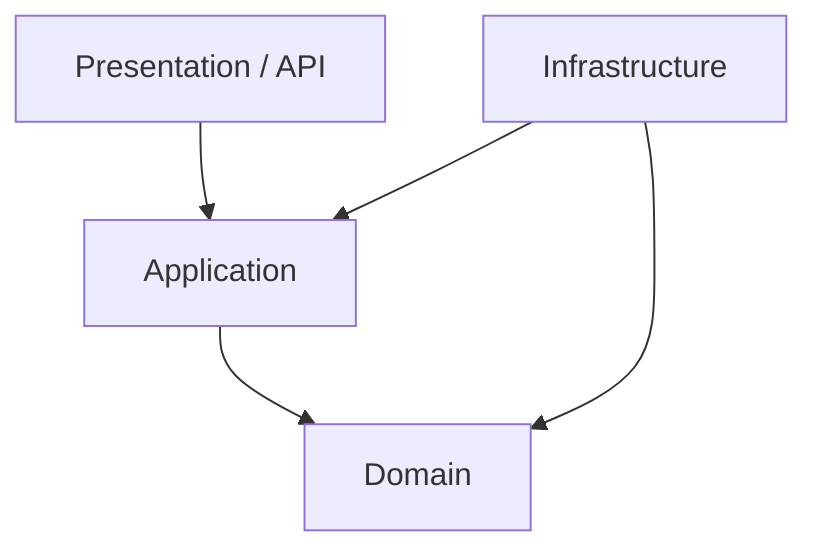
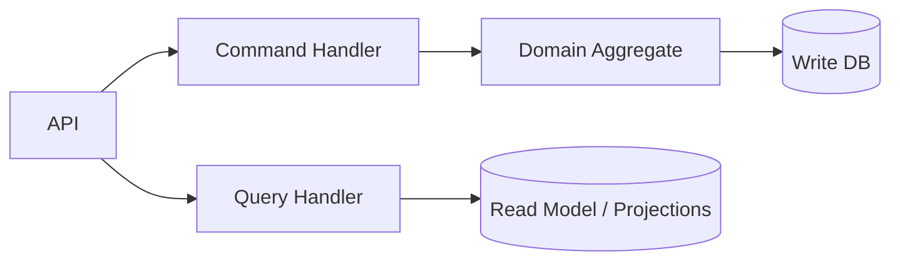
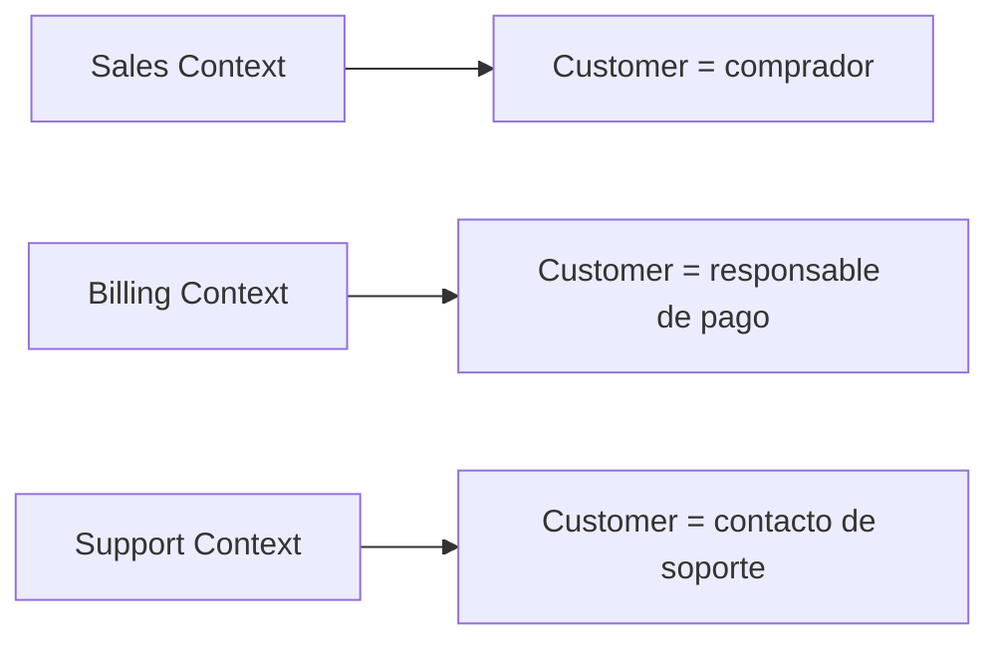
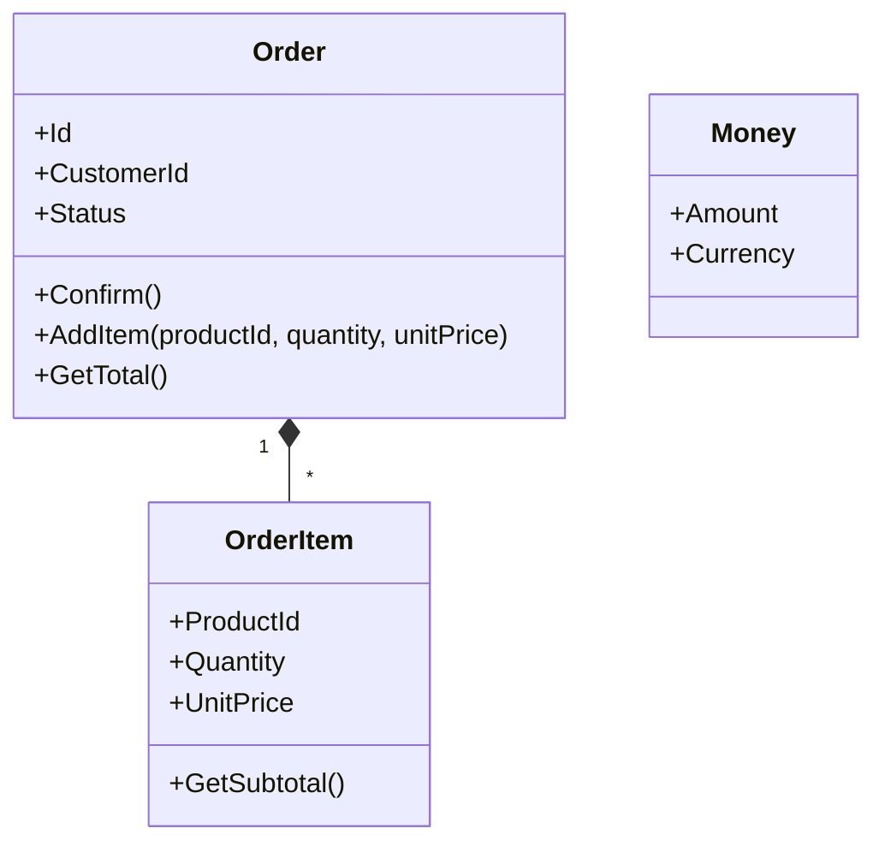
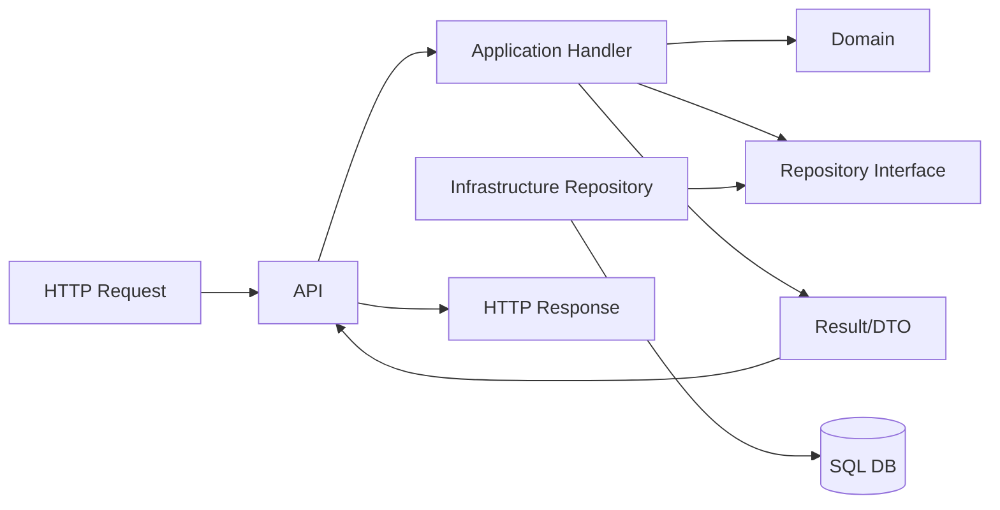
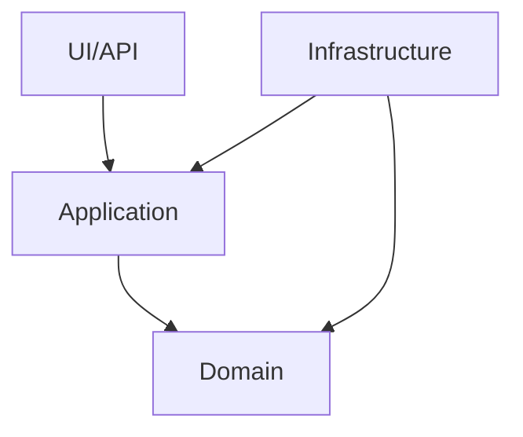
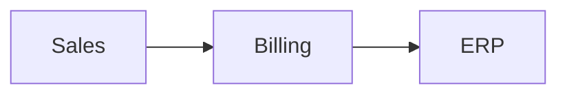
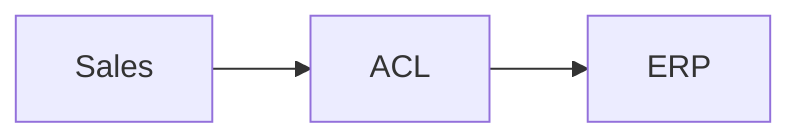
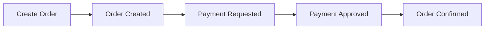
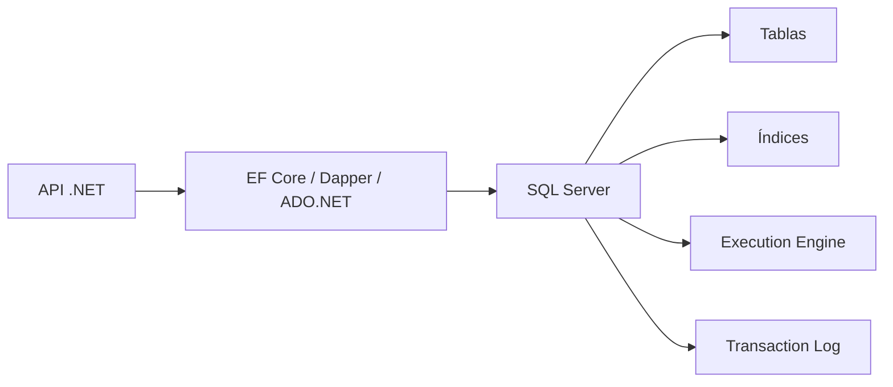

# Guía de Arquitectura y Diseño para [[guia_dotnet_entrevista_completo|Entrevistas .NET]]
## Fase 5 — [[Patrones de diseño]], [[roadmap_zero_to_hero_updated|Clean Architecture]], [[DDD]] y principios

> **Propósito de este documento**
>
> Este segundo documento continúa la guía base de [[guia_dotnet_entrevista_completo|.NET]], pero cambia el enfoque:
>
> - ya no está centrado en framework/runtime
> - ahora está centrado en **pensar, diseñar, modelar y justificar decisiones**
>
> Esta fase está hecha para que puedas:
>
> - entender patrones sin memorizarlos como recetario
> - explicar principios de diseño con criterio
> - distinguir [[arquitectura limpia]] real vs “diagrama bonito”
> - aterrizar [[DDD]] sin humo ni palabras vacías
> - defender decisiones en [[roadmap_zero_to_hero_updated|entrevistas]] de nivel senior, staff y arquitectura
>
> La intención no es solo que “te sepas los nombres”, sino que **sepas cuándo usar algo, cuándo no, qué problemas resuelve y qué problemas introduce**.

---

# Índice general

1. Cómo estudiar esta fase  
2. Qué son los principios de diseño y por qué importan  
3. [[SOLID]] a profundidad  
4. Otros principios esenciales: [[DRY]], [[KISS]], [[YAGNI]], [[SoC]], [[GRASP]], composición sobre herencia  
5. Qué es realmente un [[patrón de diseño]]  
6. Cómo pensar patrones sin caer en “pattern mania”  
7. Patrones creacionales  
8. Patrones estructurales  
9. Patrones de comportamiento  
10. Patrones arquitectónicos aplicados a [[guia_dotnet_entrevista_completo|.NET]]  
11. [[roadmap_zero_to_hero_updated|Clean Architecture]] explicada de verdad  
12. Capas, dependencias y reglas de dirección  
13. Casos de uso / application services / interactors  
14. [[Entities]], [[Value Objects]] y [[Aggregates]]  
15. [[Repositories]] y [[Unit of Work]]: cuándo sí y cuándo no  
16. [[DTOs]], mapeo y contratos  
17. [[CQRS]] dentro de una arquitectura limpia  
18. [[Vertical Slice Architecture]]  
19. [[DDD]] explicado sin humo  
20. [[Ubiquitous Language]]  
21. [[Bounded Contexts]]  
22. [[Entidades]] vs [[Value Objects]]  
23. [[Aggregates]] y [[Aggregate Roots]]  
24. [[Domain Services]]  
25. [[Domain Events]]  
26. Specifications  
27. Anti-corruption Layer  
28. Ejemplo completo de dominio: e-commerce / órdenes  
29. Cómo aterrizar Clean Architecture + DDD en .NET  
30. Errores comunes y anti-patrones  
31. Preguntas difíciles de entrevista y respuestas modelo  
32. Checklist final de estudio

---

# 1. Cómo estudiar esta fase

Esta fase no debe estudiarse como lista de definiciones.

Debes estudiar cada tema en cuatro niveles:

## Nivel 1 — Definición clara
Entender qué es el concepto.

## Nivel 2 — Problema que resuelve
Por qué alguien inventó ese principio, patrón o enfoque.

## Nivel 3 — Trade-offs
Qué ganas y qué pagas al usarlo.

## Nivel 4 — Caso real
Cuándo lo aplicarías en una app empresarial [[guia_dotnet_entrevista_completo|.NET]].

## Método recomendado

Para cada tema pregúntate:

- ¿qué acoplamiento reduce?
- ¿qué complejidad agrega?
- ¿cómo se vería en código?
- ¿qué error evita?
- ¿qué error puede crear si lo uso mal?
- ¿es útil aquí o solo suena bonito?

## Regla de oro de esta fase

> **Un principio o patrón no es valioso porque exista.  
> Es valioso si reduce complejidad accidental sin destruir claridad.**

---

# 2. Qué son los principios de diseño y por qué importan

Los principios de diseño son guías mentales para construir software más:

- mantenible
- extensible
- testeable
- entendible
- estable frente a cambio

No son leyes físicas.  
No son mandamientos absolutos.  
No son cosas para citar en entrevista y ya.

Sirven para tomar mejores decisiones cuando el código empieza a crecer y cambiar.

## El problema real que resuelven

Al inicio, casi cualquier código parece “funcionar”.

El dolor aparece cuando:

- cambia el negocio
- agregas casos nuevos
- entra más gente al proyecto
- necesitas pruebas
- aparecen bugs en cascada
- una decisión local rompe otra parte

Los principios existen para ayudarte a evitar ese crecimiento caótico.

## Ejemplo simple

Código sin principios:

```csharp
public class OrderService
{
    public void Process(Order order)
    {
        // valida
        // calcula impuestos
        // guarda en DB
        // envía email
        // llama ERP
        // genera PDF
        // escribe logs
    }
}
```

A simple vista “funciona”.  
Pero mezcla demasiadas responsabilidades.

En poco tiempo será difícil:

- probarlo
- extenderlo
- cambiar una sola parte
- reutilizar comportamiento
- entender qué falla

## Qué evalúan en entrevista

No quieren oír solo:

> “SOLID es importante.”

Quieren ver si entiendes que:

- el software cambia
- el diseño busca absorber cambio
- el acoplamiento mata evolución
- la claridad es un activo
- sobreingeniería también es un problema

---

# 3. SOLID a profundidad

SOLID es probablemente el conjunto de principios más citado y peor explicado en entrevistas.

Vamos uno por uno, con problema, sentido real, ejemplos y trampas.

---

## 3.1 S — Single Responsibility Principle (SRP)

### Definición útil
Una clase o módulo debe tener **una sola razón para cambiar**.

### Ojo
No significa “hacer clases diminutas por deporte”.  
No significa “un método por archivo”.  
Significa que las responsabilidades de cambio deben estar cohesionadas.

### Ejemplo malo

```csharp
public class InvoiceService
{
    public void CreateInvoice(Order order)
    {
        // lógica de negocio
    }

    public void SaveToDatabase(Invoice invoice)
    {
        // persistencia
    }

    public void SendEmail(Invoice invoice)
    {
        // comunicación externa
    }

    public string BuildPdf(Invoice invoice)
    {
        // formato / documento
    }
}
```

### ¿Qué está mal?
Esta clase puede cambiar por razones distintas:

- cambia lógica de negocio
- cambia base de datos
- cambia proveedor de email
- cambia formato PDF

Tiene múltiples razones de cambio.

### Refactor conceptual

```csharp
public class InvoiceCalculator
{
    public Invoice CreateInvoice(Order order) { /* ... */ }
}

public interface IInvoiceRepository
{
    Task SaveAsync(Invoice invoice);
}

public interface IInvoiceNotifier
{
    Task NotifyAsync(Invoice invoice);
}

public interface IInvoiceDocumentGenerator
{
    byte[] GeneratePdf(Invoice invoice);
}
```

### Qué mejora
- responsabilidades separadas
- pruebas más simples
- cambios más localizados
- dependencias más claras

### Trampa común
Llevar SRP al extremo y partir una lógica sencilla en veinte clases artificiales.

### Cómo responder en entrevista

> “SRP no lo interpreto como ‘hacer clases pequeñas por sí mismas’, sino como agrupar comportamiento que cambia por la misma razón. Mi meta es cohesión real, no fragmentación cosmética.”

---

## 3.2 O — Open/Closed Principle (OCP)

### Definición útil
El software debería estar **abierto a extensión, pero cerrado a modificación** en los puntos donde cambian comportamientos.

### Qué significa de verdad
No que nunca toques código existente.  
Eso sería absurdo.  
Significa que, en puntos previsibles de variación, tu diseño debe permitir agregar comportamientos sin reescribir el núcleo cada vez.

### Ejemplo malo

```csharp
public class DiscountCalculator
{
    public decimal Calculate(CustomerType type, decimal amount)
    {
        switch (type)
        {
            case CustomerType.Regular:
                return amount * 0.95m;
            case CustomerType.Premium:
                return amount * 0.90m;
            case CustomerType.Vip:
                return amount * 0.85m;
            default:
                return amount;
        }
    }
}
```

Cada vez que agregas un tipo nuevo, modificas la clase.

### Mejora con estrategia

```csharp
public interface IDiscountStrategy
{
    decimal Apply(decimal amount);
}

public class RegularDiscountStrategy : IDiscountStrategy
{
    public decimal Apply(decimal amount) => amount * 0.95m;
}

public class PremiumDiscountStrategy : IDiscountStrategy
{
    public decimal Apply(decimal amount) => amount * 0.90m;
}

public class VipDiscountStrategy : IDiscountStrategy
{
    public decimal Apply(decimal amount) => amount * 0.85m;
}
```

Y un resolver/orquestador:

```csharp
public class DiscountService
{
    private readonly IReadOnlyDictionary<CustomerType, IDiscountStrategy> _strategies;

    public DiscountService(IReadOnlyDictionary<CustomerType, IDiscountStrategy> strategies)
    {
        _strategies = strategies;
    }

    public decimal Calculate(CustomerType customerType, decimal amount)
    {
        return _strategies[customerType].Apply(amount);
    }
}
```

### Qué ganas
- agregas nuevos descuentos sin reescribir el cálculo central
- pruebas aisladas por estrategia
- menos `switch` enormes

### Qué pagas
- más clases
- un poco más de estructura
- no siempre vale la pena para dos casos estables

### Respuesta madura

> “OCP lo aplico donde hay variación predecible. Si el negocio cambia frecuentemente por tipo de estrategia, conviene diseñar extensión. Si es algo estable y pequeño, no fuerzo abstracciones innecesarias.”

---

## 3.3 L — Liskov Substitution Principle (LSP)

### Definición útil
Las subclases deben poder sustituir a la clase base sin romper el comportamiento esperado.

### Interpretación práctica
Si heredas, el consumidor debe poder usar el subtipo sin sorpresas inválidas.

### Ejemplo clásico problemático

```csharp
public class Bird
{
    public virtual void Fly()
    {
    }
}

public class Sparrow : Bird
{
    public override void Fly()
    {
        Console.WriteLine("Flying");
    }
}

public class Penguin : Bird
{
    public override void Fly()
    {
        throw new NotSupportedException();
    }
}
```

### Qué está mal
`Penguin` no cumple la expectativa del contrato `Bird.Fly()`.

La herencia está mal modelada.

### Alternativa mejor
Separar capacidades:

```csharp
public interface IBird
{
}

public interface IFlyingBird : IBird
{
    void Fly();
}

public class Sparrow : IFlyingBird
{
    public void Fly()
    {
        Console.WriteLine("Flying");
    }
}

public class Penguin : IBird
{
}
```

### Señal importante
LSP suele indicar que tu herencia es incorrecta, no que debas lanzar excepciones desde el override.

### En código empresarial real
Esto pasa cuando una clase base define operaciones que algunos subtipos no pueden cumplir de verdad.

### Respuesta de entrevista

> “LSP me ayuda a detectar herencias mentirosas. Si un subtipo necesita romper precondiciones, devolver comportamientos especiales inesperados o lanzar `NotSupportedException` para operaciones base, probablemente el modelo de herencia está mal.”

---

## 3.4 I — Interface Segregation Principle (ISP)

### Definición útil
Los clientes no deben depender de interfaces que no usan.

### Ejemplo malo

```csharp
public interface IOfficeDevice
{
    void Print(Document document);
    void Scan(Document document);
    void Fax(Document document);
}
```

Y luego una impresora simple:

```csharp
public class BasicPrinter : IOfficeDevice
{
    public void Print(Document document) { }

    public void Scan(Document document)
    {
        throw new NotSupportedException();
    }

    public void Fax(Document document)
    {
        throw new NotSupportedException();
    }
}
```

### Qué está mal
La interfaz obliga a depender de operaciones irrelevantes.

### Mejor diseño

```csharp
public interface IPrinter
{
    void Print(Document document);
}

public interface IScanner
{
    void Scan(Document document);
}

public interface IFax
{
    void Fax(Document document);
}
```

### Beneficio
- contratos más precisos
- menos acoplamiento
- menos implementaciones falsas

### En arquitectura real
Interfaces demasiado gordas suelen aparecer en servicios “God Interface” tipo:

- `IUserService`
- `IOrderManager`
- `IPlatformService`

con decenas de métodos.

### Respuesta madura

> “ISP me hace pensar en contratos orientados al consumidor. Prefiero interfaces pequeñas y cohesionadas, para que cada cliente dependa solo de lo que realmente necesita.”

---

## 3.5 D — Dependency Inversion Principle (DIP)

### Definición útil
Los módulos de alto nivel no deben depender de módulos de bajo nivel; ambos deben depender de abstracciones.

### Qué significa realmente
Tu lógica de negocio no debería quedar atada a detalles tecnológicos.

### Ejemplo malo

```csharp
public class OrderProcessor
{
    private readonly SqlServerOrderRepository _repository;
    private readonly SmtpEmailSender _emailSender;

    public OrderProcessor(SqlServerOrderRepository repository, SmtpEmailSender emailSender)
    {
        _repository = repository;
        _emailSender = emailSender;
    }
}
```

### Problemas
- alto acoplamiento a infraestructura
- pruebas más difíciles
- cambiar almacenamiento o email impacta directamente

### Mejor diseño

```csharp
public interface IOrderRepository
{
    Task SaveAsync(Order order);
}

public interface IEmailSender
{
    Task SendAsync(string to, string subject, string body);
}

public class OrderProcessor
{
    private readonly IOrderRepository _repository;
    private readonly IEmailSender _emailSender;

    public OrderProcessor(IOrderRepository repository, IEmailSender emailSender)
    {
        _repository = repository;
        _emailSender = emailSender;
    }
}
```

### Ojo importante
DIP no significa “crear interfaces para todo”.

La abstracción debe existir donde hay un límite o variación útil:

- infraestructura
- dependencia externa
- policy/capability variable
- punto que quieres aislar en pruebas

### Cómo responder en entrevista

> “DIP busca que el centro del negocio dependa de contratos, no de detalles concretos. Lo aplico especialmente en los límites con infraestructura, proveedores externos y mecanismos de persistencia, no como obligación dogmática para cualquier clase.”

---

# 4. Otros principios esenciales

SOLID no es todo.  
Hay más principios muy útiles.

---

## 4.1 DRY — Don’t Repeat Yourself

### Definición útil
Evita duplicar conocimiento o lógica de forma innecesaria.

### Matiz importante
No toda repetición visual es duplicación peligrosa.  
A veces abstraer demasiado pronto crea más daño que beneficio.

### Ejemplo de duplicación peligrosa
Misma fórmula de cálculo de impuestos copiada en 5 lugares.

### Ejemplo de falsa obsesión DRY
Dos métodos parecidos pero con intención distinta, unidos a la fuerza en una abstracción confusa.

### Respuesta madura

> “DRY me importa especialmente cuando se duplica conocimiento de negocio. Pero no fuerzo una abstracción prematura solo porque dos bloques se parezcan visualmente.”

---

## 4.2 KISS — Keep It Simple, Stupid

### Idea
Prefiere la solución más simple que resuelva bien el problema.

### Ojo
Simple no es “chafa” ni “sin diseño”.  
Simple significa:

- menos piezas
- menos sorpresa
- más claridad
- menos costo cognitivo

### Anti-ejemplo
Implementar event sourcing, CQRS completo y microservicios para una app interna de tres pantallas.

---

## 4.3 YAGNI — You Aren’t Gonna Need It

### Idea
No construyas hoy lo que quizá necesites mañana si aún no hay evidencia.

### Qué evita
- sobreingeniería
- puntos de extensión imaginarios
- abstracciones vacías
- capas por “si algún día”

### Cuidado
No debe usarse para justificar diseño pobre.  
La clave es distinguir entre:
- preparación razonable
- infraestructura especulativa

---

## 4.4 Separation of Concerns (SoC)

### Idea
Separar preocupaciones distintas en módulos distintos.

Ejemplos de concerns:

- negocio
- persistencia
- UI
- integración externa
- validación
- observabilidad

### Beneficio
Reduce mezcla caótica y facilita cambios localizados.

---

## 4.5 Composición sobre herencia

### Idea
En muchos casos es mejor combinar comportamientos que heredar de una clase base rígida.

### Por qué
La herencia acopla fuerte y propaga cambios de arriba hacia abajo.

### Ejemplo
En vez de una jerarquía enorme de `DiscountProcessorBase`, `SpecialDiscountProcessorBase`, etc., usar estrategias inyectables.

---

## 4.6 GRASP (visión útil)

GRASP incluye ideas como:

- Information Expert
- Creator
- Controller
- Low Coupling
- High Cohesion
- Polymorphism
- Indirection
- Protected Variations

No necesitas recitarlas todas de memoria, pero sí captar su espíritu:
- poner responsabilidad donde tiene sentido
- reducir acoplamiento
- aumentar cohesión
- proteger puntos variables

---

# 5. Qué es realmente un patrón de diseño

Un patrón de diseño no es una plantilla obligatoria ni un snippet famoso.

Es una **solución recurrente a un problema recurrente en cierto contexto**, con trade-offs conocidos.

## Tres partes que importan

- problema
- contexto
- solución con consecuencias

## Qué NO es
- una receta universal
- una moda
- una certificación de “código profesional”
- algo que debas meter para impresionar

## Cómo pensar patrones bien

Pregunta siempre:

- ¿qué problema está resolviendo?
- ¿ese problema existe aquí?
- ¿el patrón reduce complejidad o la sube?
- ¿este equipo entenderá el diseño?
- ¿hay una opción más simple?

---

# 6. Cómo pensar patrones sin caer en pattern mania

Hay un error muy común: cuando alguien aprende patrones y luego quiere meterlos en todo.

Eso produce:

- demasiadas clases
- diseño artificial
- complejidad innecesaria
- poca claridad

## Señales de pattern mania

- “Hice una factory para crear dos objetos simples”
- “Metí mediator, decorator, observer y strategy para una pantalla CRUD”
- “Todo tiene interfaz aunque no haya variación real”
- “El código quedó elegante, pero nadie sabe seguirlo”

## Regla sana

> **Primero entiende el problema real.  
> Luego busca la solución más simple que lo resuelva.  
> Si un patrón encaja naturalmente, úsalo.**

---

# 7. Patrones creacionales

Los patrones creacionales resuelven cómo crear objetos sin acoplar demasiado al detalle de construcción.

---

## 7.1 Factory Method

### Problema que resuelve
No quieres que el cliente conozca la lógica exacta de creación.

### Ejemplo simple

```csharp
public interface IPaymentProcessor
{
    Task ProcessAsync(decimal amount);
}

public class StripePaymentProcessor : IPaymentProcessor
{
    public Task ProcessAsync(decimal amount) => Task.CompletedTask;
}

public class PaypalPaymentProcessor : IPaymentProcessor
{
    public Task ProcessAsync(decimal amount) => Task.CompletedTask;
}

public static class PaymentProcessorFactory
{
    public static IPaymentProcessor Create(string provider)
    {
        return provider switch
        {
            "stripe" => new StripePaymentProcessor(),
            "paypal" => new PaypalPaymentProcessor(),
            _ => throw new ArgumentException("Proveedor no soportado")
        };
    }
}
```

### Cuándo sirve
- selección de implementación según configuración
- ocultar detalle de construcción
- encapsular reglas de creación

### Cuándo no
- si DI ya resuelve elegantemente el problema
- si solo agrega capa inútil

### En .NET moderno
Muchas veces DI + registros + keyed services o resolvers cubren parte del caso.

---

## 7.2 Abstract Factory

### Problema
Necesitas crear familias de objetos relacionados.

### Ejemplo conceptual
Para exportación:
- generador PDF
- generador CSV
- formatter específico
- naming strategy

### Interfaz

```csharp
public interface IReportExportFactory
{
    IReportFormatter CreateFormatter();
    IReportWriter CreateWriter();
}
```

### Cuándo sirve
- familias consistentes de componentes
- distintos entornos/proveedores/temas de UI

### Costo
- más abstracción
- puede ser demasiado para casos simples

---

## 7.3 Builder

### Problema
Construcción compleja o con muchos pasos/opciones.

### Ejemplo

```csharp
public class EmailMessage
{
    public string To { get; init; } = string.Empty;
    public string Subject { get; init; } = string.Empty;
    public string Body { get; init; } = string.Empty;
    public List<string> Attachments { get; init; } = new();
}
```

Builder:

```csharp
public class EmailMessageBuilder
{
    private readonly EmailMessage _message = new();

    public EmailMessageBuilder To(string to)
    {
        _message.To = to;
        return this;
    }

    public EmailMessageBuilder Subject(string subject)
    {
        _message.Subject = subject;
        return this;
    }

    public EmailMessageBuilder Body(string body)
    {
        _message.Body = body;
        return this;
    }

    public EmailMessageBuilder AddAttachment(string file)
    {
        _message.Attachments.Add(file);
        return this;
    }

    public EmailMessage Build() => _message;
}
```

### Cuándo sirve
- objetos con muchas opciones
- construcción paso a paso
- validación de armado

### Cuándo no
- objetos triviales
- records simples con named arguments suficientes

---

## 7.4 Singleton

### Qué resuelve
Garantiza una sola instancia global.

### Problema
Se abusa muchísimo.

### Cuándo podría servir
- un servicio realmente stateless compartido
- cache global controlada
- config inmutable

### Riesgos
- estado global oculto
- pruebas difíciles
- acoplamiento implícito
- problemas de concurrencia

### En .NET moderno
Muchas veces el lifetime singleton en DI resuelve mejor el caso que implementar el patrón manualmente.

### Respuesta madura

> “Conozco Singleton, pero evito verlo como patrón por defecto. Prefiero controlarlo a través del contenedor de DI y usarlo solo donde el ciclo de vida global tiene sentido real.”

---

## 7.5 Prototype

### Idea
Crear nuevos objetos copiando otro ya existente.

### Cuándo sirve
- objetos costosos de armar
- configuraciones base reutilizables

### Uso real
Menos común en apps empresariales típicas, pero útil conceptualmente.

---

# 8. Patrones estructurales

Ayudan a componer clases/objetos y a dar forma a relaciones.

---

## 8.1 Adapter

### Problema
Quieres usar una clase existente pero su interfaz no encaja con lo que espera tu sistema.

### Ejemplo real
Tienes un proveedor externo:

```csharp
public class LegacyPaymentGateway
{
    public void Execute(decimal totalAmount) { }
}
```

Tu sistema espera:

```csharp
public interface IPaymentGateway
{
    Task ChargeAsync(decimal amount);
}
```

Adapter:

```csharp
public class LegacyPaymentGatewayAdapter : IPaymentGateway
{
    private readonly LegacyPaymentGateway _legacy;

    public LegacyPaymentGatewayAdapter(LegacyPaymentGateway legacy)
    {
        _legacy = legacy;
    }

    public Task ChargeAsync(decimal amount)
    {
        _legacy.Execute(amount);
        return Task.CompletedTask;
    }
}
```

### Beneficio
- aíslas legado/terceros
- mantienes contrato interno limpio

### Conexión con arquitectura
El adapter es muy común en infraestructura y anti-corruption layers.

---

## 8.2 Facade

### Problema
Un subsistema tiene demasiadas piezas y quieres exponer una interfaz simple.

### Ejemplo
En vez de que el controller coordine:
- validación
- pricing
- inventory
- payment
- persistence
- notification trigger

creas un facade o application service:

```csharp
public class CheckoutFacade
{
    public Task<CheckoutResult> ProcessAsync(CheckoutRequest request)
    {
        // orquestación
        return Task.FromResult(new CheckoutResult());
    }
}
```

### Beneficio
Reduce complejidad de consumo.

### Riesgo
Si lo cargas demasiado, puede volverse God Service.

---

## 8.3 Decorator

### Problema
Quieres agregar comportamiento sin modificar la clase original.

### Muy útil en .NET
Para:
- logging
- caching
- retry
- authorization
- metrics

### Ejemplo conceptual

```csharp
public interface IOrderQueryService
{
    Task<OrderDto?> GetByIdAsync(int id);
}

public class OrderQueryService : IOrderQueryService
{
    public Task<OrderDto?> GetByIdAsync(int id)
    {
        return Task.FromResult<OrderDto?>(null);
    }
}

public class CachedOrderQueryService : IOrderQueryService
{
    private readonly IOrderQueryService _inner;

    public CachedOrderQueryService(IOrderQueryService inner)
    {
        _inner = inner;
    }

    public async Task<OrderDto?> GetByIdAsync(int id)
    {
        // buscar cache
        return await _inner.GetByIdAsync(id);
    }
}
```

### Cuándo sirve mucho
- cross-cutting concerns
- pipeline de comportamiento
- casos donde no quieres contaminar la clase base

### En .NET real
MediatR pipelines, Polly wrappers y muchos middleware tienen espíritu decorator.

---

## 8.4 Composite

### Problema
Quieres tratar objetos individuales y grupos de objetos de la misma manera.

### Ejemplo
Estructuras jerárquicas:
- menú
- carpeta/archivo
- categorías anidadas

### Menos frecuente en apps CRUD básicas, pero conceptualmente valioso.

---

## 8.5 Proxy

### Problema
Controlar acceso a un objeto real.

### Ejemplos
- lazy loading
- remote proxy
- authorization proxy
- caching proxy

### En .NET
EF lazy loading proxies es un ejemplo conocido.

---

# 9. Patrones de comportamiento

Se enfocan en colaboración entre objetos y flujo de responsabilidades.

---

## 9.1 Strategy

### Problema
Tienes varias variantes de un algoritmo.

### Ejemplo de descuentos, impuestos, cálculo de envío, etc.

```csharp
public interface IShippingCostStrategy
{
    decimal Calculate(Order order);
}

public class StandardShippingStrategy : IShippingCostStrategy
{
    public decimal Calculate(Order order) => 99m;
}

public class FreeShippingStrategy : IShippingCostStrategy
{
    public decimal Calculate(Order order) => 0m;
}
```

### Cuándo sirve
- reglas de negocio variables
- selección por contexto
- evitar condicionales grandes

---

## 9.2 Command

### Idea
Encapsular una operación como objeto.

### En .NET moderno
Muy relevante en:
- CQRS
- colas
- jobs
- acciones reintentables

```csharp
public record CreateOrderCommand(int CustomerId, List<OrderItemInput> Items);
```

Handler:

```csharp
public class CreateOrderCommandHandler
{
    public Task<int> Handle(CreateOrderCommand command, CancellationToken ct)
    {
        return Task.FromResult(1);
    }
}
```

### Beneficio
- separa intención
- facilita pipelines
- pruebas enfocadas

---

## 9.3 [[Observer]]

### Idea
Un sujeto notifica a observadores cuando ocurre algo.

### Ejemplo moderno
Events, domain events, event handlers, publishers/subscribers.

### Cuidado
Puede volver el flujo difícil de seguir si se usa sin trazabilidad.

---

## 9.4 Chain of Responsibility

### Idea
Pasar una solicitud por una cadena de componentes, cada uno con oportunidad de actuar.

### Ejemplos en .NET
- middleware pipeline
- validadores encadenados
- pipelines de request handling

### Muy importante para entrevistas
Porque conecta patrón clásico con [[guia_dotnet_entrevista_completo|ASP.NET Core]] y con MediatR pipeline behaviors.

---

## 9.5 Template Method

### Idea
Clase base define esqueleto del algoritmo y subclases completan pasos.

### Cuidado
Demasiada herencia puede volverlo rígido.

### En código moderno muchas veces se prefiere composición o strategy.

---

## 9.6 Mediator

### Problema
Muchos objetos se llaman entre sí y generan acoplamiento en red.

### Solución
Centralizar interacción a través de un mediador.

### En .NET
MediatR popularizó una interpretación muy útil:
- commands
- queries
- handlers
- pipeline behaviors

### Beneficio
- reduce acoplamiento directo
- organiza flujos
- facilita cross-cutting via pipeline

### Riesgo
- abuso y sobrefragmentación
- “anemic request/handler soup” si todo se vuelve un handler sin criterio

---

## 9.7 Specification

### Problema
Las reglas de filtrado/validación complejas se repiten o quedan enterradas en queries y ifs.

### Ejemplo conceptual

```csharp
public interface ISpecification<T>
{
    Expression<Func<T, bool>> Criteria { get; }
}
```

Implementación:

```csharp
public class ActiveCustomerSpecification : ISpecification<Customer>
{
    public Expression<Func<Customer, bool>> Criteria =>
        customer => customer.IsActive;
}
```

### Beneficios
- encapsulas reglas
- reusas criterios
- expresas intención

### Cuidado
No lo vuelvas framework por sí mismo si el dominio no lo necesita.

---

# 10. Patrones arquitectónicos aplicados a .NET

Aquí ya salimos del patrón de clase y vamos a cómo organizas sistemas.

## Algunos patrones relevantes

- Layered Architecture
- Clean Architecture
- Hexagonal / Ports and Adapters
- Onion Architecture
- Vertical Slice Architecture
- CQRS
- Event-Driven
- Modular Monolith

## Idea clave
No son banderas de equipo.  
Son herramientas para organizar cambio y complejidad.

---

# 11. Clean Architecture explicada de verdad

Muchísima gente la explica como “dibujito de círculos” y ahí termina.

Vamos a aterrizarla.

## Idea central

La lógica de negocio debe quedar protegida de detalles externos como:

- UI
- base de datos
- framework
- servicios externos
- infraestructura

## Regla central

**Las dependencias de código apuntan hacia adentro.**

Es decir:
- el centro no conoce los detalles externos
- lo externo depende del centro
- el negocio no depende de EF, HTTP, controllers o Redis

## Diagrama mental



## Capas típicas

### Domain
El corazón del negocio:
- entidades
- value objects
- reglas del dominio
- invariantes
- domain services
- domain events

### Application
Coordina casos de uso:
- commands
- queries
- handlers
- orquestación
- puertos/interfaces

### Infrastructure
Implementa detalles:
- EF Core
- email
- storage
- brokers
- proveedores externos

### Presentation
HTTP/API/UI:
- controllers
- minimal APIs
- request/response contracts

## Lo que Clean Architecture NO significa

- no significa tener 20 proyectos obligatoriamente
- no significa “todo con interfaces”
- no significa que el dominio viva aislado en un vacío idealizado
- no significa que la app sea automáticamente buena

## Qué sí significa

Que los detalles externos no mandan sobre el negocio.

---

# 12. Capas, dependencias y reglas de dirección

## Regla de dependencia

Una capa externa puede depender de una interna.  
La interna no debe depender de la externa.

### Correcto
- API depende de Application
- Infrastructure depende de Application/Domain
- Domain no depende de EF Core ni ASP.NET Core

### Incorrecto
- Domain referencia directamente `DbContext`
- Domain conoce `HttpContext`
- Entity tiene atributos de framework web
- Use case depende de clase concreta de email provider

## Por qué importa
Si tu negocio depende de detalles, queda secuestrado por ellos.

## Ejemplo incorrecto

```csharp
public class Order
{
    public void Save(AppDbContext dbContext)
    {
        dbContext.Orders.Add(this);
    }
}
```

Aquí el dominio quedó acoplado a infraestructura.

## Ejemplo correcto conceptual
La entidad sabe comportarse, no persistirse.  
Persistencia la resuelve un puerto/repositorio desde afuera.

---

# 13. Casos de uso / Application Services / Interactors

Esta capa mucha gente la entiende mal.

## Qué hace Application

No contiene el corazón profundo del dominio, pero sí coordina un caso de uso.

Ejemplo:

- recibir un command
- cargar aggregate
- ejecutar reglas del dominio
- persistir cambios
- publicar evento / devolver resultado

## Qué NO debería hacer
- no debería meter SQL crudo de forma arbitraria mezclado con reglas
- no debería convertirse en un “script gigante”
- no debería contener lógica de UI
- no debería ser puro pass-through sin valor

## Ejemplo de caso de uso

```csharp
public record CreateOrderCommand(int CustomerId, List<CreateOrderItemDto> Items);

public class CreateOrderHandler
{
    private readonly IOrderRepository _repository;
    private readonly IUnitOfWork _unitOfWork;

    public CreateOrderHandler(IOrderRepository repository, IUnitOfWork unitOfWork)
    {
        _repository = repository;
        _unitOfWork = unitOfWork;
    }

    public async Task<int> Handle(CreateOrderCommand command, CancellationToken ct)
    {
        var order = Order.Create(command.CustomerId, command.Items
            .Select(i => new OrderItem(i.ProductId, i.Quantity, i.UnitPrice))
            .ToList());

        await _repository.AddAsync(order, ct);
        await _unitOfWork.SaveChangesAsync(ct);

        return order.Id;
    }
}
```

## Qué se ve aquí
- la intención del caso de uso es clara
- application orquesta
- el dominio crea y valida
- infraestructura queda detrás de puertos

---

# 14. Entities, Value Objects y Aggregates

Esta tríada es central en DDD y arquitectura.

## Entity

Objeto con identidad y continuidad en el tiempo.

Ejemplo:
- Order
- Customer
- Invoice

Aunque cambie alguna propiedad, sigue siendo la misma entidad.

```csharp
public class Customer
{
    public int Id { get; private set; }
    public string Name { get; private set; } = string.Empty;
}
```

## Value Object

Objeto definido por sus valores, no por identidad.

Ejemplos:
- Money
- Address
- DateRange
- EmailAddress

Si dos value objects tienen los mismos valores, son equivalentes conceptualmente.

```csharp
public sealed class Money : IEquatable<Money>
{
    public decimal Amount { get; }
    public string Currency { get; }

    public Money(decimal amount, string currency)
    {
        Amount = amount;
        Currency = currency;
    }

    public bool Equals(Money? other)
    {
        return other is not null &&
               Amount == other.Amount &&
               Currency == other.Currency;
    }

    public override bool Equals(object? obj) => Equals(obj as Money);
    public override int GetHashCode() => HashCode.Combine(Amount, Currency);
}
```

## Aggregate

Conjunto de objetos del dominio que se tratan como una unidad de consistencia.

### Ejemplo
Order + OrderItems

No quieres modificar `OrderItem` arbitrariamente desde cualquier lugar sin respetar invariantes del pedido.

## Aggregate Root

Es la puerta de entrada al aggregate.

En este caso:
- `Order` sería aggregate root
- `OrderItem` sería entidad interna del aggregate

---

# 15. Repositories y Unit of Work: cuándo sí y cuándo no

Tema muy preguntado y muy mal usado.

## Repository

Abstracción para obtener y guardar aggregates o entidades de dominio.

### Cuándo aporta valor
- cuando protege el dominio del detalle de persistencia
- cuando modela acceso alineado al lenguaje del dominio

### Ejemplo útil

```csharp
public interface IOrderRepository
{
    Task<Order?> GetByIdAsync(int id, CancellationToken ct);
    Task AddAsync(Order order, CancellationToken ct);
}
```

### Cuándo se vuelve mala idea
Cuando haces un repositorio genérico inflado tipo:

```csharp
IRepository<T>
```

con métodos genéricos que solo duplican EF y esconden capacidades útiles.

## Unit of Work

Coordina persistencia de un conjunto de cambios como unidad.

### Ojo
EF Core ya cumple mucho del espíritu de Unit of Work vía `DbContext`.

### Respuesta madura

> “No siempre agrego un Unit of Work explícito encima de EF Core si no aporta valor. EF ya modela mucho de esa responsabilidad. Prefiero introducir abstracción cuando el dominio o la arquitectura la justifican, no por formalismo.”

---

# 16. DTOs, mapeo y contratos

## DTO

Data Transfer Object.

Sirve para:
- entrada/salida de APIs
- transporte entre capas
- evitar exponer entidades internas

## Por qué no devolver entidades directo siempre
- expones detalles internos
- filtras propiedades que no querías
- acoplas contratos externos al dominio
- haces más frágil la evolución

## Ejemplo

```csharp
public record CreateOrderRequest(int CustomerId, List<CreateOrderItemRequest> Items);
public record OrderResponse(int Id, decimal Total, string Status);
```

## Mapeo
Puede ser:
- manual
- con herramienta
- híbrido

### Regla útil
Si el mapeo es simple y crítico, el mapeo manual suele ser clarísimo.  
No conviertas mapping en magia innecesaria.

---

# 17. CQRS dentro de una arquitectura limpia

CQRS encaja muy bien cuando lectura y escritura empiezan a tener tensiones distintas.

## Escritura
- commands
- validación
- aggregates
- transacción
- invariantes

## Lectura
- DTOs
- queries optimizadas
- joins/proyecciones
- quizá sin pasar por aggregate completo

## Diagrama simple



## Beneficios
- lectura rápida y enfocada
- escritura protegida por reglas del dominio
- menos presión por un único modelo que haga todo

## Cuidado
No lo apliques de forma teatral a un CRUD simple.

---

# 18. Vertical Slice Architecture

Muy relevante hoy.

## Idea
Organizar el código por feature/caso de uso, no solo por capas técnicas.

En vez de:

- Controllers
- Services
- Repositories
- DTOs

todos separados por carpeta, puedes tener:

- Orders/Create
- Orders/GetById
- Orders/Cancel

Cada slice contiene lo necesario para esa funcionalidad.

## Beneficios
- más cercanía entre piezas que colaboran
- mejor navegación
- menos “capa por reflejo”
- muy compatible con CQRS/MediatR

## Riesgos
- si no hay disciplina, duplicación desordenada
- si el dominio es rico, aún necesitas modelado coherente compartido

## Respuesta madura

> “Vertical Slice me gusta mucho para organizar casos de uso y reducir fricción de navegación. Lo combino bien con CQRS. Pero si hay dominio complejo compartido, sigo cuidando el modelado central para no fragmentar reglas críticas.”

---

# 19. DDD explicado sin humo

DDD suele polarizar:
- algunos lo idolatran
- otros lo odian porque solo conocieron versiones teatrales

Vamos al punto.

## Qué es DDD realmente

**Domain-Driven Design es una forma de modelar software complejo poniendo el foco en el dominio del negocio, su lenguaje, sus límites y sus reglas.**

No es solo:
- aggregates
- events
- carpetas con nombre fancy

Es sobre entender profundamente el negocio y traducirlo a un modelo útil.

## Cuándo brilla
- dominios complejos
- reglas de negocio densas
- múltiples conceptos parecidos pero no iguales
- evolución continua
- lenguaje de negocio rico

## Cuándo no necesitas tanto DDD
- CRUD simple
- backoffice pequeño
- herramientas internas sencillas
- dominio trivial

## Lo más importante de DDD
No son los diagramas.  
Es el **lenguaje compartido y el modelado correcto de límites**.

---

# 20. Ubiquitous Language

## Qué es
Un lenguaje compartido entre negocio y tecnología.

Debe ser:
- preciso
- consistente
- vivo
- visible en el código

## Ejemplo
Si el negocio habla de:
- Order
- Reservation
- Settlement
- Cancellation Window

tu código debería reflejar eso.  
No inventes nombres genéricos vagos como:
- DataManager
- ProcessThing
- ItemInfo

## Beneficio
Reduce malentendidos y alinea decisiones.

## En entrevista
Explicar ubiquitous language te hace ver muy maduro, porque muestra que entiendes que el software representa negocio, no solo estructuras de datos.

---

# 21. Bounded Contexts

Uno de los conceptos más importantes de DDD.

## Idea
No todo significado es global.  
La misma palabra puede significar cosas distintas en distintos contextos.

## Ejemplo
“Customer” puede significar:

- prospecto en marketing
- comprador en ventas
- pagador en facturación
- titular de soporte en atención

Pretender una sola clase “Customer” universal para todo puede ser un desastre.

## Bounded Context
Define el límite dentro del cual un modelo y un lenguaje tienen significado coherente.

## Beneficio
- evita mega modelos ambiguos
- reduce acoplamiento semántico
- clarifica integración entre áreas

## Diagrama conceptual



## Respuesta madura

> “Bounded Context me ayuda a evitar el espejismo de un único modelo universal. Prefiero modelos coherentes dentro de su contexto e integración explícita entre contextos.”

---

# 22. Entidades vs Value Objects

Aunque ya los introdujimos, aquí los aterrizamos con más criterio.

## Cuándo algo es Entity
- importa su identidad
- lo sigues en el tiempo
- puede cambiar propiedades y seguir siendo “lo mismo”

## Cuándo algo es Value Object
- importa su valor completo
- es inmutable idealmente
- se reemplaza entero
- igualdad por contenido

## Ejemplo
Una dirección en muchos sistemas conviene como value object.

¿Por qué?
- “Address #123” no suele ser identidad de negocio propia
- importa la combinación de calle, ciudad, CP, etc.
- se compara por valor

---

# 23. Aggregates y Aggregate Roots

Este tema sí debes poder defenderlo.

## Qué problema resuelve un aggregate
Evita que las reglas del dominio queden rotas por cambios dispersos.

## Ejemplo
Supón una orden con ítems.

Reglas:
- no puedes tener cantidad negativa
- no puedes cerrar orden sin ítems
- total debe coincidir con suma de ítems
- no puedes modificar ítems si ya está pagada

Si cualquier parte del sistema pudiera alterar `OrderItem` por fuera, romperías invariantes.

## Entonces
Haces de `Order` la aggregate root.

Todo cambio pasa por métodos controlados del aggregate root:

```csharp
public class Order
{
    private readonly List<OrderItem> _items = new();

    public IReadOnlyCollection<OrderItem> Items => _items.AsReadOnly();
    public OrderStatus Status { get; private set; }

    public void AddItem(int productId, int quantity, decimal unitPrice)
    {
        if (Status != OrderStatus.Draft)
            throw new InvalidOperationException("No se puede modificar la orden en este estado.");

        if (quantity <= 0)
            throw new ArgumentOutOfRangeException(nameof(quantity));

        _items.Add(new OrderItem(productId, quantity, unitPrice));
    }

    public void Confirm()
    {
        if (_items.Count == 0)
            throw new InvalidOperationException("Una orden sin ítems no puede confirmarse.");

        Status = OrderStatus.Confirmed;
    }
}
```

## Qué muestra esto
- el aggregate protege invariantes
- no expones setters públicos peligrosos
- el modelo habla negocio

## Regla práctica
Los límites del aggregate deben diseñarse pensando en consistencia e invariantes, no en conveniencia de navegación ORM.

---

# 24. Domain Services

## Qué son
Servicios del dominio para lógica de negocio que no encaja naturalmente dentro de una sola entidad o value object.

## Cuándo sí tiene sentido
Si la lógica:
- es claramente de negocio
- involucra varias entidades/conceptos
- no pertenece naturalmente a uno solo

## Ejemplo
Cálculo de política de elegibilidad compleja, pricing especial, reglas de aprobación, etc.

```csharp
public interface IDiscountPolicyService
{
    Money CalculateDiscount(Customer customer, Order order);
}
```

## Cuidado
No conviertas “Domain Service” en basurero de toda lógica que no supiste modelar.

---

# 25. Domain Events

## Qué son
Eventos que representan algo relevante que ocurrió en el dominio.

Ejemplos:
- OrderCreated
- PaymentAuthorized
- CustomerUpgraded
- InvoiceIssued

## Para qué sirven
- desacoplar reacciones
- expresar hechos del dominio
- disparar procesos posteriores

## Muy importante
Un domain event no es lo mismo que un integration event externo, aunque pueden relacionarse.

### Domain event
Vive dentro del dominio o aplicación local.

### Integration event
Se publica hacia otros sistemas/contextos.

## Beneficio
Te permite reaccionar a hechos sin meter todo en el método principal.

## Riesgo
Si lo usas en exceso y sin trazabilidad, el flujo se vuelve invisible.

---

# 26. Specification

Ya lo tocamos como patrón, pero en DDD tiene un sabor especial.

## Para qué sirve
Encapsular reglas complejas de selección o validación de forma reutilizable y expresiva.

## Ejemplo conceptual
“Cliente activo con crédito disponible y sin bloqueos”.

En vez de repartir esa regla en múltiples `if` o `Where`, puedes encapsularla.

## Beneficio
- intención clara
- reuso
- composición

## Cuidado
No construyas un mini-ORM paralelo por moda.

---

# 27. Anti-corruption Layer

Concepto muy importante cuando integras sistemas o bounded contexts diferentes.

## Problema
Un sistema externo tiene:
- nombres raros
- semántica distinta
- contratos pobres
- modelo incompatible

No quieres contaminar tu dominio con ese lenguaje externo.

## Solución
Poner una capa de traducción/adaptación.

### Ejemplo
ERP externo habla de:
- `cli_cod`
- `mov_tipo`
- `doc_num`

Tu dominio quiere:
- CustomerId
- TransactionType
- DocumentNumber

La anti-corruption layer traduce entre ambos.

## Beneficio
Proteges tu modelo interno de semántica ajena o mala.

---

# 28. Ejemplo completo de dominio: e-commerce / órdenes

Ahora vamos a unir varias piezas.

## Requerimiento
Un cliente crea una orden con ítems.  
La orden:
- debe tener al menos un ítem
- no puede modificarse después de confirmada
- calcula total
- puede emitir un evento al confirmarse

## Modelo



## Código ejemplo

```csharp
public class Order
{
    private readonly List<OrderItem> _items = new();

    public int Id { get; private set; }
    public int CustomerId { get; private set; }
    public OrderStatus Status { get; private set; } = OrderStatus.Draft;
    public IReadOnlyCollection<OrderItem> Items => _items.AsReadOnly();

    private Order()
    {
    }

    public Order(int customerId)
    {
        if (customerId <= 0)
            throw new ArgumentOutOfRangeException(nameof(customerId));

        CustomerId = customerId;
    }

    public void AddItem(int productId, int quantity, decimal unitPrice)
    {
        if (Status != OrderStatus.Draft)
            throw new InvalidOperationException("Solo se puede modificar una orden en borrador.");

        if (productId <= 0)
            throw new ArgumentOutOfRangeException(nameof(productId));

        if (quantity <= 0)
            throw new ArgumentOutOfRangeException(nameof(quantity));

        if (unitPrice < 0)
            throw new ArgumentOutOfRangeException(nameof(unitPrice));

        _items.Add(new OrderItem(productId, quantity, unitPrice));
    }

    public decimal GetTotal()
    {
        return _items.Sum(x => x.GetSubtotal());
    }

    public void Confirm()
    {
        if (_items.Count == 0)
            throw new InvalidOperationException("La orden debe tener al menos un ítem.");

        if (Status != OrderStatus.Draft)
            throw new InvalidOperationException("Solo se puede confirmar una orden en borrador.");

        Status = OrderStatus.Confirmed;

        // aquí podría registrarse un Domain Event: OrderConfirmed
    }
}

public class OrderItem
{
    public int ProductId { get; }
    public int Quantity { get; }
    public decimal UnitPrice { get; }

    public OrderItem(int productId, int quantity, decimal unitPrice)
    {
        ProductId = productId;
        Quantity = quantity;
        UnitPrice = unitPrice;
    }

    public decimal GetSubtotal() => Quantity * UnitPrice;
}

public enum OrderStatus
{
    Draft = 0,
    Confirmed = 1,
    Cancelled = 2
}
```

## Qué cosas positivas ves aquí
- setters no expuestos libremente
- el aggregate root protege reglas
- la lógica habla en lenguaje de negocio
- no depende de EF, HTTP ni framework
- el diseño es expresivo

---

# 29. Cómo aterrizar Clean Architecture + DDD en .NET

Ahora lo llevamos a una estructura realista.

## Estructura conceptual de proyectos

```text
src/
  MyApp.Api
  MyApp.Application
  MyApp.Domain
  MyApp.Infrastructure
```

## Responsabilidades

### `MyApp.Domain`
- entidades
- value objects
- enums
- domain services
- domain events
- reglas de negocio

### `MyApp.Application`
- commands
- queries
- handlers
- DTOs
- puertos/interfaces
- validación de caso de uso
- orquestación

### `MyApp.Infrastructure`
- EF Core
- repositorios concretos
- email sender
- storage
- adapters
- integración externa

### `MyApp.Api`
- controllers/minimal APIs
- auth web
- binding HTTP
- middleware
- contratos externos

## Flujo típico



## Qué no hacer
- meter toda la lógica de negocio en handlers
- crear interfaces por reflejo sin uso
- exponer EF entities como contrato externo
- convertir Application en script gigante sin modelo de dominio
- crear 25 capas para un CRUD pequeño

## Regla de equilibrio
Si el dominio es simple, una versión más ligera de la arquitectura basta.  
Si el dominio es complejo, la separación paga dividendos.

---

# 30. Errores comunes y anti-patrones

## 30.1 Anemic Domain Model
Entidades vacías con puros getters/setters y toda la lógica afuera en servicios gigantes.

### Problema
El “dominio” no modela nada; solo carga datos.

## 30.2 Service God Object
Una clase tipo `OrderService` con 40 métodos y mil responsabilidades.

## 30.3 Repository genérico por formalismo
Duplica EF y añade fricción.

## 30.4 Interfaces para todo
`IWhatever` aunque no haya variación ni necesidad.

## 30.5 Clean Architecture teatral
Muchos proyectos, muchas carpetas, poca claridad real.

## 30.6 DDD cosmético
Usar palabras como aggregate y bounded context sin entender reglas ni límites.

## 30.7 Over-abstraction
Diseñar para todos los futuros imaginarios.

## 30.8 Herencia abusiva
Jerarquías rígidas donde composición era mejor.

## 30.9 Domain contaminado por infraestructura
Entidades que conocen `DbContext`, atributos web, clases de framework.

## 30.10 Reglas del negocio dispersas
Un poco en UI, un poco en DB, un poco en API, un poco en services.

---

# 31. Preguntas difíciles de entrevista y respuestas modelo

## Pregunta 1
**¿Qué diferencia hay entre Clean Architecture y Layered Architecture?**

### Respuesta modelo
> “Layered Architecture organiza por capas, pero no siempre protege bien la dirección de dependencias ni aísla el dominio de detalles. Clean Architecture va más allá al poner reglas explícitas sobre la dirección de dependencias: el negocio no depende de infraestructura ni framework. En la práctica, una layered bien hecha puede acercarse mucho, pero Clean Architecture enfatiza con más fuerza la independencia del núcleo.”

---

## Pregunta 2
**¿Qué problema resuelve DDD realmente?**

### Respuesta modelo
> “DDD ayuda cuando el problema no es tecnológico sino de complejidad del dominio. Su valor está en construir un modelo alineado con el lenguaje del negocio, definir límites claros y proteger invariantes. No lo aplicaría con el mismo peso en un CRUD trivial, pero sí en dominios ricos con reglas cambiantes y conceptos que deben modelarse con precisión.”

---

## Pregunta 3
**¿Cuándo usarías Value Objects?**

### Respuesta modelo
> “Cuando un concepto se define por sus valores y no por identidad propia. Me gustan para representar nociones como dinero, dirección, rango de fechas o email, porque hacen el modelo más expresivo y permiten centralizar validaciones e igualdad por valor.”

---

## Pregunta 4
**¿Qué opinas de los repositorios genéricos con EF Core?**

### Respuesta modelo
> “Soy escéptico. Muchas veces solo ocultan EF Core y quitan expresividad. Prefiero repositorios orientados al dominio o casos donde la abstracción realmente proteja al modelo y exprese intención. Si no aporta eso, es burocracia.”

---

## Pregunta 5
**¿Cómo decides entre una arquitectura más simple y Clean Architecture?**

### Respuesta modelo
> “Lo decido según complejidad del dominio, ritmo de cambio, tamaño del sistema y necesidad de aislar detalles. Para un CRUD pequeño puedo usar una estructura más simple. Para un sistema con reglas de negocio complejas, integraciones y evolución prolongada, una separación más cuidada paga mucho.”

---

## Pregunta 6
**¿Qué significa realmente Open/Closed en proyectos reales?**

### Respuesta modelo
> “No significa que nunca toques código existente, sino que en puntos de variación previsibles el diseño permita extender sin romper el núcleo cada vez. Lo aplico donde hay estrategias o políticas cambiantes; no lo fuerzo cuando la variación es mínima o hipotética.”

---

## Pregunta 7
**¿Vertical Slice reemplaza Clean Architecture?**

### Respuesta modelo
> “No necesariamente. Vertical Slice es una forma de organizar por feature/caso de uso. Puede convivir muy bien con principios de Clean Architecture. La diferencia es que Vertical Slice optimiza navegación y cercanía del cambio, mientras Clean se enfoca en proteger el núcleo y la dirección de dependencias.”

---

## Pregunta 8
**¿Cómo evitas que DDD se vuelva puro humo?**

### Respuesta modelo
> “Manteniéndolo atado a problemas reales del dominio. Si no mejora lenguaje, límites, reglas e invariantes, no está aportando. Prefiero un DDD pragmático que modele bien lo importante, antes que llenar el proyecto de términos sofisticados sin efecto práctico.”

---

# 32. Checklist final de estudio

Debes poder explicar con claridad, sin leer:

## Principios
- SRP real vs clases diminutas artificiales
- OCP y extensión razonable
- LSP como detector de herencia rota
- ISP e interfaces cohesionadas
- DIP sin caer en interfaces para todo
- DRY, KISS, YAGNI, SoC y composición sobre herencia

## Patrones
- qué problema resuelve cada patrón
- cuándo sí conviene
- cuándo sería sobreingeniería
- cómo se ve en .NET moderno

## Clean Architecture
- qué capas tiene
- cómo fluyen dependencias
- por qué el dominio no debe depender de infraestructura
- qué hace la capa application
- cuándo no necesitas la versión más pesada

## DDD
- ubiquitous language
- bounded contexts
- entity vs value object
- aggregate y aggregate root
- domain service
- domain events
- anti-corruption layer

## Aplicación real
- cómo modelar un caso como órdenes, pagos o pricing
- cómo estructurar proyectos .NET
- cómo justificar decisiones en entrevista

---

# Ejercicio de práctica recomendado

Para fijar esta fase, implementa un mini sistema con estas características:

1. Dominio: órdenes
2. Entidades:
   - Order
   - OrderItem
3. Value Objects:
   - Money
   - EmailAddress o Address
4. Casos de uso:
   - CreateOrder
   - ConfirmOrder
   - GetOrderById
5. Arquitectura:
   - Api
   - Application
   - Domain
   - Infrastructure
6. Agrega:
   - un repository orientado al dominio
   - DTOs de request/response
   - un domain event `OrderConfirmed`
   - un decorator de logging o caching sobre una query
   - una strategy para descuentos
   - un adapter para proveedor externo ficticio de pagos

Si puedes construir eso explicando por qué cada pieza existe, ya no estarás estudiando patrones como teoría: los estarás **usando con criterio**.

---

# Cierre de la fase 5

Esta fase es de las más importantes de toda la preparación porque aquí se nota si un candidato:

- solo sabe usar herramientas
- o realmente entiende diseño

Cuando dominas esta fase, tus respuestas empiezan a cambiar de tono.

Ya no dices solo:
- “uso services”
- “uso repositorios”
- “uso Clean Architecture”

Empiezas a decir:
- “quiero proteger invariantes”
- “quiero aislar infraestructura”
- “este bounded context no debe mezclar semántica con otro”
- “esta abstracción sí aporta porque aquí hay variación real”
- “este patrón reduce acoplamiento en este punto concreto”

Y eso se nota muchísimo en entrevistas serias.

---

# Próximas fases sugeridas para este segundo documento

1. **Fase 6 — SQL Server y [[guia_databases_fundamentos_produccion|bases de datos]] para entrevistas**
   - joins
   - índices
   - execution plans
   - [[guia_databases_fundamentos_produccion|transacciones]]
   - locking
   - isolation levels
   - tuning real

2. **Fase 7 — Simulador de entrevistas de arquitectura y diseño**
   - preguntas
   - respuestas modelo
   - ejercicios guiados
   - evaluación de decisiones

3. **Fase 8 — Preparación de respuestas habladas**
   - cómo responder con claridad
   - storytelling técnico
   - cómo defender trade-offs
   - cómo contestar cuando no sabes algo


---

# Fase 5 — EXPANSIÓN AVANZADA (Nivel Arquitecto)

> Esta expansión lleva los conceptos a un nivel donde puedes:
> - defender decisiones en entrevistas difíciles
> - detectar malos diseños rápidamente
> - diseñar sistemas reales con criterio

---

# 33. Clean Architecture vs Hexagonal vs Onion

Muchas veces se mencionan como cosas distintas, pero en esencia comparten núcleo.

## Similitudes

Todas buscan:

- aislar el dominio
- separar infraestructura
- controlar dependencias
- permitir testabilidad
- evitar acoplamiento a frameworks

## Diferencias prácticas

| Arquitectura | Enfoque |
|-------------|--------|
| Clean | capas + dirección de dependencias |
| Hexagonal | puertos y adaptadores |
| Onion | dominio en el centro |

## Diagrama unificado



## Respuesta madura

> “Las veo como variaciones del mismo principio: proteger el dominio. La diferencia está más en cómo organizas el código que en el objetivo.”

---

# 34. DDD Estratégico vs Táctico

## DDD Táctico

- entidades
- value objects
- aggregates
- repositories
- domain services

👉 lo que ya vimos

## DDD Estratégico

Aquí es donde subes de nivel:

- bounded contexts
- context mapping
- relaciones entre sistemas
- integración
- lenguaje compartido

---

## 34.1 Context Mapping

Define cómo se relacionan bounded contexts.

### Tipos

| Tipo | Descripción |
|-----|------------|
| Shared Kernel | código compartido |
| Customer/Supplier | un contexto depende de otro |
| Anti-Corruption Layer | traducción |
| Open Host Service | API pública |
| Published Language | contratos definidos |

## Ejemplo



Pero con ACL:



---

# 35. Invariantes de dominio (clave en entrevistas)

## Qué son

Reglas que SIEMPRE deben cumplirse.

## Ejemplo

- una orden no puede estar confirmada sin items
- un pago no puede ser negativo
- un cliente bloqueado no puede comprar

## Dónde deben vivir

👉 en el dominio (NO en controller, NO en DB)

## Ejemplo correcto

```csharp
public void Confirm()
{
    if (!_items.Any())
        throw new InvalidOperationException("No items");

    Status = OrderStatus.Confirmed;
}
```

## Error común

Validar solo en frontend o en API.

---

# 36. Event Storming (nivel arquitectura real)

## Qué es

Técnica para entender el dominio usando eventos.

## Flujo

1. identificar eventos (OrderCreated, PaymentApproved)
2. identificar comandos
3. identificar actores
4. identificar agregados
5. identificar límites

## Ejemplo



## Beneficio

- alinea negocio y tecnología
- descubre complejidad oculta

---

# 37. Consistencia por Aggregate

## Regla clave

👉 Un aggregate debe ser consistente internamente.

## NO

No garantizas consistencia global inmediata entre múltiples aggregates.

## Ejemplo

- Order consistente
- Payment consistente

Pero entre ambos:

👉 eventual consistency

---

# 38. Transacciones vs Eventos

## Transacción

- fuerte consistencia
- misma DB

## Evento

- eventual consistency
- desacople

## Decisión

Depende de:

- criticidad
- latencia
- complejidad

---

# 39. Diseño de invariantes complejos

## Ejemplo

“No permitir compra si crédito < monto”

Dónde vive?

👉 Domain Service

```csharp
public class CreditPolicyService
{
    public void Validate(Customer customer, Order order)
    {
        if (customer.Credit < order.Total)
            throw new Exception("Crédito insuficiente");
    }
}
```

---

# 40. Anti-patrones avanzados

## 40.1 Fat Application Layer

Toda lógica en handlers.

## 40.2 Entities como DTOs

Sin comportamiento.

## 40.3 Over CQRS

Separar lectura/escritura sin necesidad.

## 40.4 Fake Clean Architecture

Capas pero todo acoplado igual.

---

# 41. Diseño real en .NET (estructura recomendada)

```text
Orders/
  Create/
    Command.cs
    Handler.cs
    Validator.cs
    Endpoint.cs
  GetById/
    Query.cs
    Handler.cs
```

## Beneficio

- alta cohesión
- fácil navegación

---

# 42. Comparación práctica de enfoques

| Enfoque | Cuándo usar |
|--------|------------|
| CRUD simple | app pequeña |
| Clean Architecture | dominio complejo |
| Vertical Slice | features claras |
| DDD | negocio complejo |

---

# 43. Cómo responder en entrevista (nivel experto)

Cuando te pregunten:

👉 “¿Cómo diseñarías X?”

No digas:

❌ “uso Clean Architecture”

Di:

> “Primero defino el dominio, sus invariantes y límites. Luego organizo la aplicación de forma que el núcleo de negocio no dependa de infraestructura. Uso patrones solo donde reducen complejidad y separo responsabilidades para mantener el sistema evolutivo.”

---

# 44. Señales de senior vs mid

## Mid

- habla de herramientas
- menciona patrones
- copia estructuras

## Senior

- habla de trade-offs
- habla de límites
- habla de evolución
- justifica decisiones

---

# 45. Meta-principio (lo más importante)

> **El mejor diseño no es el más “correcto”.  
> Es el que reduce complejidad REAL en el contexto REAL.**

---

# Cierre final de la expansión

Si dominas TODO este documento:

Ya no eres solo un dev que “usa .NET”.

👉 Eres alguien que:
- modela negocio
- diseña sistemas
- toma decisiones
- entiende complejidad

Y eso es exactamente lo que buscan en entrevistas de alto nivel.


---

# Fase 6 — SQL Server y bases de datos para entrevistas .NET
## Nivel profundo, práctico y orientado a rendimiento real

> Esta fase está diseñada para convertir SQL Server de “talón de Aquiles” en una fortaleza real.
>
> La meta no es solo que reconozcas comandos o definiciones, sino que puedas:
>
> - entender cómo piensa una base de datos relacional
> - leer y diseñar consultas con criterio
> - detectar por qué una query es lenta
> - entender índices, joins, transacciones y locking de verdad
> - responder entrevistas con seguridad y ejemplos reales
>
> Esta fase sí está pensada como material de estudio serio.
> Léela con calma, prueba ejemplos y vuelve varias veces.

---

# Índice general de la fase 6

1. Cómo pensar una base de datos relacional  
2. Qué es SQL Server dentro de una arquitectura real  
3. Diseño lógico vs diseño físico  
4. Claves primarias, foráneas, uniqueness y nullability  
5. Normalización y desnormalización  
6. Tipos de datos y por qué importan  
7. El modelo mental de una consulta SQL  
8. `SELECT`, `FROM`, `WHERE`, `GROUP BY`, `HAVING`, `ORDER BY`  
9. `INNER JOIN`, `LEFT JOIN`, `RIGHT JOIN`, `FULL JOIN`, `CROSS JOIN`, `SELF JOIN`  
10. Joins: cuándo usar cada uno y errores comunes  
11. Subqueries, CTEs y tablas derivadas  
12. `UNION` vs `UNION ALL`  
13. `EXISTS` vs `IN` vs `JOIN`  
14. Funciones de agregación  
15. Window Functions (`ROW_NUMBER`, `RANK`, `SUM OVER`, etc.)  
16. Paginación (`OFFSET/FETCH`, keyset pagination)  
17. Vistas, funciones y stored procedures  
18. Parámetros y parametrización  
19. El optimizador de consultas y el plan de ejecución  
20. Scan vs Seek  
21. Índices: concepto general  
22. Clustered Index  
23. Nonclustered Index  
24. Included Columns y Covering Index  
25. Índices compuestos y orden de columnas  
26. SARGability  
27. Estadísticas y cardinalidad  
28. Parameter Sniffing  
29. Lectura de execution plans  
30. Missing indexes: ayuda útil, no verdad absoluta  
31. Temp tables vs table variables  
32. Transacciones  
33. ACID explicado bien  
34. Isolation Levels  
35. Locking, blocking y deadlocks  
36. Row versioning, snapshot y read committed snapshot  
37. Concurrencia y patrones de actualización  
38. `MERGE`: por qué debes tratarlo con cuidado  
39. Bulk operations y batching  
40. Particionamiento  
41. Mantenimiento de índices y fragmentación  
42. SQL anti-patterns comunes  
43. Diseño de consultas para APIs .NET  
44. Cómo investigar una query lenta  
45. Preguntas difíciles de entrevista y respuestas modelo  
46. Casos reales de producción  
47. Ejercicios guiados de estudio  
48. Checklist final de dominio

---

# 1. Cómo pensar una base de datos relacional

Antes de hablar de sintaxis, índices o tuning, necesitas un modelo mental correcto.

Una base de datos relacional no es solo “un lugar donde guardas datos”.
Es un sistema diseñado para:

- persistencia
- integridad
- consulta eficiente
- concurrencia
- consistencia
- recuperación

## Qué significa “relacional”

Relacional implica que los datos se modelan en relaciones (tablas) y que existe una semántica fuerte entre conjuntos de datos.

Ejemplo:

- `Customers`
- `Orders`
- `OrderItems`
- `Products`

No son tablas aisladas.
Están conectadas por relaciones:

- un cliente tiene muchas órdenes
- una orden tiene muchos ítems
- un ítem apunta a un producto

## Qué error comete mucha gente

Pensar que SQL Server es “un diccionario grande” donde haces búsquedas como si fuera memoria.

No.
Una query tiene costo.
Cada join, scan, sort, lookup, agregación o bloqueo cuesta.

## Mentalidad correcta

Cuando consultas una base relacional, no debes pensar:

> “quiero estos objetos”.

Debes pensar:

> “qué conjunto de datos necesito, cómo está modelado, y cuál es la forma más barata y consistente de obtenerlo”.

---

# 2. Qué es SQL Server dentro de una arquitectura real

En entrevistas muchas veces se habla de SQL Server como si fuera una caja negra.

Tú debes verlo como una pieza crítica del sistema.

## SQL Server en la vida real

SQL Server suele ser:

- fuente de verdad transaccional
- motor de consultas
- coordinador de concurrencia y locks
- soporte de integridad referencial
- motor de ejecución optimizada
- actor importante en rendimiento global

## En un sistema .NET típico



## Lo que esto implica

Cuando una API es lenta, no siempre la culpa es:

- C#
- EF Core
- Blazor
- la red

Muchas veces el cuello real está en:

- mala consulta
- índice incorrecto
- scan costoso
- lock contention
- plan de ejecución deficiente
- parameter sniffing
- exceso de roundtrips

---

# 3. Diseño lógico vs diseño físico

## Diseño lógico

Es cómo modelas la información:

- entidades
- relaciones
- restricciones
- reglas de negocio

Ejemplo:
- `Customer`
- `Order`
- `OrderItem`

## Diseño físico

Es cómo vive eso en el motor:

- tipos de datos
- índices
- orden de columnas
- particiones
- archivos
- compresión
- estadísticas

## Por qué importa distinguirlos

Puedes tener un diseño lógico correcto pero físicamente ineficiente.

Ejemplo:
Una tabla puede representar bien “Order”, pero si:
- usa tipos de datos exagerados
- no tiene índices adecuados
- tiene columnas muy anchas
- mezcla datos calientes y fríos

entonces su rendimiento será malo.

## Respuesta de entrevista

> “Distingo entre modelado lógico y diseño físico. El primero representa correctamente el negocio; el segundo determina cómo se comporta en rendimiento, almacenamiento y consulta.”

---

# 4. Claves primarias, foráneas, uniqueness y nullability

## Primary Key

Identifica de forma única una fila.

Ejemplo:

```sql
CREATE TABLE Customers
(
    CustomerId INT NOT NULL PRIMARY KEY,
    Name NVARCHAR(200) NOT NULL
);
```

## Qué debe cumplir una primary key ideal

- única
- estable
- no nula
- corta si es posible
- adecuada al patrón de acceso

## Foreign Key

Garantiza integridad entre tablas relacionadas.

```sql
CREATE TABLE Orders
(
    OrderId INT NOT NULL PRIMARY KEY,
    CustomerId INT NOT NULL,
    CONSTRAINT FK_Orders_Customers
        FOREIGN KEY (CustomerId) REFERENCES Customers(CustomerId)
);
```

## Beneficios de las foreign keys

- protegen integridad
- evitan datos huérfanos
- ayudan a expresar el modelo
- el optimizador puede beneficiarse de cierta información estructural

## Unique Constraints

Sirven cuando algo no es la PK, pero debe ser único.

Ejemplo:
- email
- número de factura
- combinación `(TenantId, ExternalOrderId)`

## Nullability

Este tema sí importa mucho.

### `NULL` significa
“valor desconocido” o “ausencia de valor”, no necesariamente cadena vacía ni cero.

### Diseño correcto
No pongas `NULL` por comodidad.
Cada columna debe responder:
- ¿es obligatoria?
- ¿qué significa que falte?

## Error común
Columnas importantes como `Status`, `CreatedAt`, `Amount`, `TenantId` permitiendo NULL sin razón.

Eso complica:
- lógica
- filtros
- índices
- integridad semántica

---

# 5. Normalización y desnormalización

## Normalización

Busca reducir redundancia y anomalías de actualización.

### Beneficios
- integridad
- menos duplicación
- consistencia
- menor riesgo de divergencia

### Ejemplo
No repetir el nombre del cliente en cada tabla si puedes referenciar `CustomerId`.

## Desnormalización

Consiste en introducir redundancia controlada por motivos de rendimiento o consulta.

### Beneficios
- menos joins
- lecturas más rápidas en ciertos casos
- reporting más cómodo

### Riesgos
- inconsistencia
- lógica extra para mantener sincronía
- más complejidad de actualización

## Respuesta madura

> “Normalizar me da integridad y claridad del modelo. Desnormalizo solo cuando hay un motivo concreto de rendimiento o lectura, y asumo explícitamente el costo de mantener consistencia.”

---

# 6. Tipos de datos y por qué importan

Esto suele subestimarse muchísimo.

## Por qué elegir bien el tipo importa

Afecta:

- almacenamiento
- memoria
- índices
- ancho de fila
- velocidad de comparación
- cardinalidad y estadísticas

## Ejemplos típicos

### `INT` vs `BIGINT`
No uses `BIGINT` solo “por si acaso” si no hay evidencia de necesitarlo.  
Columnas y claves más grandes aumentan costo en índices y joins.

### `NVARCHAR(MAX)`
Evítalo como valor por defecto para texto normal.
Si la columna usualmente guarda 100 o 200 caracteres, diseña eso.

### `DATETIME` vs `DATETIME2`
En muchos diseños modernos, `DATETIME2` suele ser mejor opción por rango y precisión.

### `DECIMAL(p,s)`
Muy importante en dinero.
Evita `FLOAT` para montos monetarios por problemas de precisión binaria.

## Regla sana

> El tipo de dato debe modelar correctamente el dominio y minimizar costo innecesario.

---

# 7. El modelo mental de una consulta SQL

Muchos problemas nacen porque la gente no entiende qué está expresando una query.

## SQL es declarativo

Tú describes **qué** datos quieres.
El motor decide **cómo** obtenerlos, usando el optimizador.

## Pero eso no significa que el “cómo” no te importe
Sí te importa, porque la forma en que escribes la consulta influye mucho en el plan posible.

## Ejemplo

```sql
SELECT CustomerId, Name
FROM Customers
WHERE IsActive = 1;
```

Aquí declaras:
- conjunto objetivo: `Customers`
- columnas requeridas: `CustomerId`, `Name`
- condición: `IsActive = 1`

El motor luego decide:
- scan o seek
- qué índice usar
- si necesita sort
- cómo estimar cardinalidad

---

# 8. `SELECT`, `FROM`, `WHERE`, `GROUP BY`, `HAVING`, `ORDER BY`

Hay un orden sintáctico y otro lógico.

## Orden sintáctico

```sql
SELECT ...
FROM ...
WHERE ...
GROUP BY ...
HAVING ...
ORDER BY ...
```

## Orden lógico (mental)

1. `FROM`
2. `WHERE`
3. `GROUP BY`
4. `HAVING`
5. `SELECT`
6. `ORDER BY`

## Por qué importa

Porque ayuda a entender por qué ciertas expresiones sí o no funcionan en determinadas partes de la consulta.

## Ejemplo

```sql
SELECT CustomerId, COUNT(*) AS TotalOrders
FROM Orders
WHERE Status = 'Confirmed'
GROUP BY CustomerId
HAVING COUNT(*) >= 5
ORDER BY TotalOrders DESC;
```

## Explicación por etapas

### `FROM Orders`
Partes de la tabla base.

### `WHERE Status = 'Confirmed'`
Filtras antes de agrupar.

### `GROUP BY CustomerId`
Agrupas por cliente.

### `HAVING COUNT(*) >= 5`
Filtras grupos ya agregados.

### `SELECT`
Proyectas resultado final.

### `ORDER BY`
Ordenas la salida.

## Error común
Usar `HAVING` para cosas que debían ir en `WHERE`.

---

# 9. Tipos de JOIN

Este tema sí lo debes dominar a nivel intuitivo y técnico.

Usaremos tablas conceptuales:

- `Customers`
- `Orders`

---

## 9.1 INNER JOIN

Devuelve solo filas con coincidencia en ambas tablas.

```sql
SELECT c.CustomerId, c.Name, o.OrderId
FROM Customers c
INNER JOIN Orders o
    ON c.CustomerId = o.CustomerId;
```

### Cuándo usarlo
Cuando solo te interesan relaciones existentes.

### Ejemplo de negocio
“Muéstrame clientes que sí tienen órdenes”.

---

## 9.2 LEFT JOIN

Devuelve todas las filas de la tabla izquierda y las coincidencias de la derecha.
Si no hay coincidencia, la derecha va en NULL.

```sql
SELECT c.CustomerId, c.Name, o.OrderId
FROM Customers c
LEFT JOIN Orders o
    ON c.CustomerId = o.CustomerId;
```

### Cuándo usarlo
Cuando quieres conservar toda la izquierda, incluso sin relación.

### Ejemplo
“Muéstrame todos los clientes, tengan o no órdenes”.

---

## 9.3 RIGHT JOIN

Es el espejo de LEFT JOIN, pero suele usarse menos porque normalmente puedes reescribirlo más claramente con LEFT JOIN invirtiendo orden.

---

## 9.4 FULL JOIN

Devuelve coincidencias y también no coincidentes de ambos lados.

### Cuándo podría servir
Comparaciones, conciliación, análisis de diferencias.

### Menos común en CRUD cotidiano, pero útil conceptualmente.

---

## 9.5 CROSS JOIN

Producto cartesiano entre ambas tablas.

```sql
SELECT *
FROM Sizes
CROSS JOIN Colors;
```

### Uso válido
Generación de combinaciones.

### Riesgo
Explosión de filas si se usa sin intención.

---

## 9.6 SELF JOIN

Una tabla se une consigo misma.

### Ejemplo
Jerarquías de empleados/manager.

```sql
SELECT e.EmployeeId, e.Name, m.Name AS ManagerName
FROM Employees e
LEFT JOIN Employees m
    ON e.ManagerId = m.EmployeeId;
```

---

# 10. Joins: cuándo usar cada uno y errores comunes

## Error 1: usar LEFT JOIN y luego filtrar mal en WHERE

Ejemplo problemático:

```sql
SELECT c.CustomerId, c.Name, o.OrderId
FROM Customers c
LEFT JOIN Orders o
    ON c.CustomerId = o.CustomerId
WHERE o.Status = 'Confirmed';
```

## Qué pasa aquí
Ese filtro en `WHERE` elimina filas donde `o` es NULL.
En la práctica, muchas veces conviertes el LEFT JOIN en INNER JOIN lógico.

## Si querías conservar todos los clientes
Debes considerar el filtro en el `ON` o tratar explícitamente los NULL.

```sql
SELECT c.CustomerId, c.Name, o.OrderId
FROM Customers c
LEFT JOIN Orders o
    ON c.CustomerId = o.CustomerId
   AND o.Status = 'Confirmed';
```

## Error 2: joins sin índice útil
Aunque la sintaxis sea correcta, si la columna de join no tiene soporte adecuado, puedes pagar scans muy costosos.

## Error 3: duplicación inesperada
Si unes con tablas uno-a-muchos sin pensar, duplicas filas del lado “uno”.

---

# 11. Subqueries, CTEs y tablas derivadas

## Subquery

Consulta dentro de otra consulta.

```sql
SELECT *
FROM Orders
WHERE CustomerId IN
(
    SELECT CustomerId
    FROM Customers
    WHERE IsActive = 1
);
```

## CTE (Common Table Expression)

Sirve para expresar lógica intermedia de forma más legible.

```sql
WITH ActiveCustomers AS
(
    SELECT CustomerId, Name
    FROM Customers
    WHERE IsActive = 1
)
SELECT ac.CustomerId, ac.Name, o.OrderId
FROM ActiveCustomers ac
JOIN Orders o
    ON ac.CustomerId = o.CustomerId;
```

## Tabla derivada

Subquery en el `FROM`.

```sql
SELECT x.CustomerId, x.TotalOrders
FROM
(
    SELECT CustomerId, COUNT(*) AS TotalOrders
    FROM Orders
    GROUP BY CustomerId
) x;
```

## Cuándo usar cada una

### CTE
- para claridad
- para dividir lógica compleja
- para recursividad si aplica

### Subquery
- cuando la intención es simple y local

### Tabla derivada
- cuando necesitas un conjunto intermedio en `FROM`

## Importante
CTE no significa automáticamente mejor rendimiento.
Es una herramienta de legibilidad, no una garantía de optimización mágica.

---

# 12. `UNION` vs `UNION ALL`

## `UNION`
Combina resultados y elimina duplicados.

## `UNION ALL`
Combina resultados y conserva duplicados.

## Diferencia importante
Eliminar duplicados cuesta.
Muchas veces `UNION ALL` es más barato.

## Regla
Usa `UNION` solo cuando realmente necesitas deduplicación.

---

# 13. `EXISTS` vs `IN` vs `JOIN`

Tema clásico de entrevista.

## `EXISTS`
Ideal cuando quieres saber si existe relación, no traer datos completos.

```sql
SELECT c.CustomerId, c.Name
FROM Customers c
WHERE EXISTS
(
    SELECT 1
    FROM Orders o
    WHERE o.CustomerId = c.CustomerId
);
```

## `IN`
Útil para conjuntos relativamente claros.

```sql
SELECT *
FROM Orders
WHERE CustomerId IN
(
    SELECT CustomerId
    FROM Customers
    WHERE IsActive = 1
);
```

## `JOIN`
Útil cuando necesitas columnas de ambas tablas o combinar conjuntos explícitamente.

## Respuesta madura

> “No los comparo solo como sintaxis intercambiable. `EXISTS` es muy expresivo para semi-joins y presencia. `JOIN` lo uso cuando realmente necesito combinar conjuntos. `IN` puede ser claro, pero siempre pienso en semántica y plan, no solo en gusto personal.”

---

# 14. Funciones de agregación

## Principales
- `COUNT`
- `SUM`
- `AVG`
- `MIN`
- `MAX`

## Ejemplo

```sql
SELECT CustomerId,
       COUNT(*) AS TotalOrders,
       SUM(TotalAmount) AS TotalAmount,
       AVG(TotalAmount) AS AverageAmount
FROM Orders
GROUP BY CustomerId;
```

## Error común
Olvidar cómo cambian el shape de la consulta:
cuando agregas, ya no estás trabajando a nivel fila individual, sino de grupo.

---

# 15. Window Functions

Este tema eleva mucho tu nivel.

## Qué son
Funciones que operan sobre una “ventana” de filas relacionadas sin colapsar el resultado como `GROUP BY`.

## Ejemplo con `ROW_NUMBER`

```sql
SELECT OrderId,
       CustomerId,
       CreatedAt,
       ROW_NUMBER() OVER(PARTITION BY CustomerId ORDER BY CreatedAt DESC) AS rn
FROM Orders;
```

## Qué hace
Numera órdenes por cliente, de la más reciente a la más antigua.

## Caso útil
“Traer la última orden de cada cliente”:

```sql
WITH RankedOrders AS
(
    SELECT OrderId,
           CustomerId,
           CreatedAt,
           ROW_NUMBER() OVER(PARTITION BY CustomerId ORDER BY CreatedAt DESC) AS rn
    FROM Orders
)
SELECT OrderId, CustomerId, CreatedAt
FROM RankedOrders
WHERE rn = 1;
```

## Otras muy útiles
- `RANK`
- `DENSE_RANK`
- `SUM(...) OVER(...)`
- `COUNT(...) OVER(...)`
- `LAG`
- `LEAD`

## Por qué importan
Resuelven problemas analíticos elegantemente sin subqueries pesadas ni lógica procedural extra.

---

# 16. Paginación: OFFSET/FETCH vs Keyset Pagination

## OFFSET/FETCH

```sql
SELECT OrderId, CreatedAt
FROM Orders
ORDER BY CreatedAt DESC
OFFSET 100 ROWS FETCH NEXT 20 ROWS ONLY;
```

## Problema
Mientras más profundo el offset, más costoso puede ser.
La base puede tener que recorrer muchas filas para llegar a la página deseada.

## Keyset Pagination

En lugar de decir “salta 100”, dices:
“dame los siguientes 20 después de este valor conocido”.

```sql
SELECT TOP (20) OrderId, CreatedAt
FROM Orders
WHERE CreatedAt < @LastSeenCreatedAt
ORDER BY CreatedAt DESC;
```

## Ventajas
- mucho más eficiente en listas grandes
- mejor estabilidad con datos cambiando

## Cuándo usar keyset
- timelines
- catálogos grandes
- historial
- APIs infinitas

---

# 17. Vistas, funciones y stored procedures

## Vistas

Consultas guardadas como objeto reutilizable.

### Cuándo sirven
- simplificar consultas repetidas
- exponer una forma consistente de leer datos
- abstraer joins frecuentes

### Riesgo
Esconder complejidad y luego nadie recuerda qué hay detrás.

## Funciones

Pueden devolver escalar o tabla.

### Cuidado
Algunas funciones pueden afectar mucho el plan o performance si se usan mal.

## Stored Procedures

Lógica SQL encapsulada en el servidor.

### Cuándo sirven
- compatibilidad legado
- operaciones complejas
- permisos controlados
- batch processing
- tuning específico

### Respuesta madura

> “No soy dogmático entre ORM y stored procedures. Elijo según legibilidad, control, patrón de acceso y necesidad real de optimización o encapsulación. Lo importante es que el acceso a datos sea mantenible y eficiente.”

---

# 18. Parámetros y parametrización

Este tema es crítico tanto por seguridad como por rendimiento.

## Beneficios de parametrizar

- evita SQL injection
- permite reutilización de planes
- separa datos de la consulta

## Ejemplo malo

```sql
'SELECT * FROM Users WHERE Name = ''' + @Name + ''''
```

## Ejemplo correcto
Usar parámetros desde ADO.NET, Dapper, EF, etc.

## Parameterization y planes
La forma en que los parámetros llegan puede afectar el plan elegido y enlaza con parameter sniffing.

---

# 19. El optimizador de consultas y el plan de ejecución

Este tema es el corazón del tuning real.

## Qué hace el optimizador

SQL Server no ejecuta tu query “línea por línea” como la escribiste.
Analiza alternativas y elige un plan estimado de menor costo según:

- índices disponibles
- estadísticas
- cardinalidad estimada
- predicados
- joins
- sorts
- agregaciones

## Qué es un execution plan

Es la representación de cómo SQL Server decidió ejecutar la consulta.

Puede incluir operadores como:

- Index Seek
- Index Scan
- Key Lookup
- Nested Loops
- Hash Match
- Sort
- Stream Aggregate
- Parallelism

## Lo importante
Cuando tuneas SQL, no tuneas solo la sintaxis.
Tuneas:
- shape de la consulta
- selectividad
- índices
- sargability
- estimaciones
- cardinalidad

---

# 20. Scan vs Seek

## Seek
Acceso dirigido a una parte específica del índice.

### Bueno cuando
- el predicado es selectivo
- el índice soporta la consulta
- la búsqueda puede navegar directo

## Scan
Recorrido amplio o completo del índice/tabla.

### Ojo
Scan no siempre es malo.
Si necesitas gran parte de la tabla, un scan puede ser razonable.

## Error común de entrevista
Decir “seek bueno, scan malo” como regla absoluta.

## Respuesta madura

> “Prefiero seeks cuando la consulta es selectiva y el índice lo permite. Pero un scan puede ser la mejor opción si necesito una gran proporción de filas. Lo importante es entender costo y volumen, no satanizar operadores.”

---

# 21. Índices: concepto general

Un índice es una estructura que permite localizar datos más eficientemente, a cambio de costo en:

- almacenamiento
- inserts
- updates
- deletes
- mantenimiento

## Analogía sana
No es “un turbo gratis”.
Es como el índice de un libro:
- acelera encontrar temas
- cuesta mantenerlo cuando cambia el contenido

## Error común
Pensar “si una query es lenta, agrego más índices”.
Demasiados índices también dañan escritura y mantenimiento.

---

# 22. Clustered Index

## Qué es
Define el orden físico/lógico principal de las filas de la tabla según esa clave.

### Regla práctica
Solo hay uno por tabla.

## Buena elección típica
Una PK numérica creciente puede funcionar bien en muchos escenarios transaccionales.

## Qué debes cuidar
- tamaño de la clave
- estabilidad
- patrón de inserción
- si causa page splits o fragmentación

## Ejemplo

```sql
CREATE CLUSTERED INDEX IX_Orders_OrderId
ON Orders(OrderId);
```

## Ojo importante
Si el clustered key es muy ancho, ese valor se arrastra también a nonclustered indexes como row locator.
Eso afecta almacenamiento y costo.

---

# 23. Nonclustered Index

## Qué es
Estructura separada que permite buscar por otras columnas.

## Ejemplo

```sql
CREATE NONCLUSTERED INDEX IX_Orders_CustomerId_CreatedAt
ON Orders(CustomerId, CreatedAt);
```

## Cuándo sirve
Cuando consultas frecuentemente por:
- customer
- fecha
- status
- tenant
- combinaciones concretas

## Trade-off
Cada índice extra:
- ocupa espacio
- ralentiza escritura
- requiere mantenimiento

---

# 24. Included Columns y Covering Index

## Included Columns

Permiten agregar columnas no clave al índice para cubrir consultas sin ensanchar la clave principal.

```sql
CREATE NONCLUSTERED INDEX IX_Orders_CustomerId
ON Orders(CustomerId)
INCLUDE (Status, TotalAmount, CreatedAt);
```

## Qué es “covering”
Que la consulta pueda resolverse completamente desde el índice, sin volver a la tabla/base structure por columnas faltantes.

## Beneficios
- menos lookups
- menos I/O
- consultas frecuentes más baratas

## Riesgo
No convertir cada query en un índice gigante.
Debes priorizar hot paths reales.

---

# 25. Índices compuestos y orden de columnas

Tema muy importante.

## Ejemplo

```sql
CREATE NONCLUSTERED INDEX IX_Orders_TenantId_Status_CreatedAt
ON Orders(TenantId, Status, CreatedAt);
```

## Por qué el orden importa
El índice funciona mejor cuando tus filtros/orden siguen el prefijo izquierdo de la clave.

## Si el índice es `(TenantId, Status, CreatedAt)`
consultas por:
- `TenantId` ✅
- `TenantId + Status` ✅
- `TenantId + Status + CreatedAt` ✅
- solo `Status` ❌ no igual de aprovechable
- solo `CreatedAt` ❌ peor aún

## Regla práctica
Ordena columnas pensando en:
- selectividad
- predicados frecuentes
- ordenamiento
- joins

---

# 26. SARGability

Este es uno de los conceptos más valiosos del tuning.

## Qué significa
Que una condición pueda aprovechar adecuadamente un índice.

## Ejemplo sargable

```sql
WHERE CreatedAt >= '2026-01-01'
  AND CreatedAt < '2026-02-01'
```

## Ejemplo NO sargable

```sql
WHERE YEAR(CreatedAt) = 2026
```

## Por qué
Al aplicar una función sobre la columna, el motor muchas veces no puede usar el índice eficientemente para buscar por rango.

## Otro ejemplo malo

```sql
WHERE UPPER(Email) = 'TEST@MAIL.COM'
```

## Idea clave
No transformes la columna del lado izquierdo si quieres que el índice ayude bien.

## Respuesta de entrevista

> “SARGability significa escribir predicados de forma que el optimizador pueda explotar el índice. Evito funciones sobre columnas filtradas cuando eso destruye la posibilidad de seeks eficientes.”

---

# 27. Estadísticas y cardinalidad

## Estadísticas

Son metadatos que ayudan al optimizador a estimar cuántas filas devolverá un predicado.

## Cardinalidad

Es la estimación del número de filas esperadas en distintas etapas del plan.

## Por qué importa
Si el optimizador cree que una consulta devolverá 10 filas pero en realidad devuelve 2 millones, puede elegir un plan terrible.

## Ejemplo de impacto
- elegir Nested Loops cuando debió elegir Hash Join
- subestimar memoria para sort/hash
- hacer lookups masivos no previstos

## Respuesta madura

> “Las estadísticas son vitales porque el optimizador decide con base en estimaciones. Un mal cardinality estimate puede arruinar un plan incluso si la consulta parece correcta.”

---

# 28. Parameter Sniffing

Tema estrella de entrevistas de SQL Server.

## Qué es

Cuando SQL Server compila un plan usando los valores iniciales de ciertos parámetros y luego reutiliza ese plan para otros valores distintos.

## Problema

Si el valor inicial representa un caso muy selectivo, el plan puede ser bueno para ese caso pero malísimo para uno muy amplio, o al revés.

## Ejemplo conceptual
Un SP consulta órdenes por `CustomerId`.

- cliente A tiene 2 órdenes
- cliente B tiene 2 millones

Si el plan se compila con A, quizá elija un seek + lookups.
Luego reutilizarlo para B puede ser desastroso.

## Posibles estrategias
- recompile puntual
- reescritura
- optimización de índices
- query hints con mucho cuidado
- separar casos extremos

## Respuesta de entrevista

> “Parameter sniffing no significa que parametrizar sea malo. Significa que el plan óptimo depende del valor y a veces el plan reutilizado ya no representa bien casos distintos. Hay que diagnosticar antes de aplicar soluciones.”

---

# 29. Lectura de execution plans

## Cosas básicas que debes mirar

- operadores costosos
- scans inesperados
- key lookups masivos
- sorts caros
- warnings
- estimated vs actual rows
- memory grant
- parallelism
- joins elegidos

## Señales típicas de problema

### Estimated rows muy diferentes de actual rows
Indica problema de estadísticas, cardinalidad o forma de la consulta.

### Key Lookup repetido millones de veces
Tal vez falta cubrir la consulta.

### Sort costoso
Quizá falta índice alineado con ordenamiento.

### Hash Match grande
Puede ser razonable o puede indicar volumen enorme/intermedio caro.

## Regla
No te obsesiones con el porcentaje gráfico de “cost”.
Úsalo como pista, no como verdad absoluta.

---

# 30. Missing indexes: ayuda útil, no verdad absoluta

SQL Server puede sugerir índices faltantes.

## Útiles para
- detectar oportunidades
- inspirar análisis inicial

## Peligros
- no consideran costo total de escritura
- no consolidan bien múltiples sugerencias
- pueden proponer índices redundantes
- no entienden tu workload completo

## Respuesta madura

> “Tomo missing index suggestions como pista inicial, no como instrucción automática. Antes de crear el índice reviso workload, selectividad, redundancia e impacto en escrituras.”

---

# 31. Temp tables vs table variables

## Temp tables (`#Temp`)
- suelen tener estadísticas más útiles
- mejor para volúmenes medianos/grandes
- más flexibles en muchos escenarios de tuning

## Table variables (`@TableVar`)
- útiles para volúmenes pequeños o uso específico
- históricamente pueden dar peores estimaciones en ciertos casos

## Regla práctica
No elijas por preferencia estética.
Elige según volumen, plan y necesidad real.

---

# 32. Transacciones

Una transacción agrupa operaciones como unidad lógica.

## Propiedades esperadas
- todo o nada
- consistencia del estado
- manejo de concurrencia
- durabilidad

## Ejemplo

```sql
BEGIN TRANSACTION;

UPDATE Accounts
SET Balance = Balance - 100
WHERE AccountId = 1;

UPDATE Accounts
SET Balance = Balance + 100
WHERE AccountId = 2;

COMMIT TRANSACTION;
```

## Si algo falla
Debe haber rollback adecuado.

## Muy importante
No hagas transacciones largas sin necesidad.
Cuanto más tiempo están abiertas:
- más locks sostienen
- más bloquean
- más riesgo de contención

---

# 33. ACID explicado bien

## Atomicity
Todo se completa o nada se aplica.

## Consistency
La transacción lleva la base de un estado válido a otro válido.

## Isolation
Las operaciones concurrentes no deben interferir incorrectamente.

## Durability
Una vez confirmado el commit, los cambios persisten incluso ante fallos razonables del sistema.

## Matiz importante
Isolation no significa “sin concurrencia”.
Significa que el sistema define cómo aislar interacciones concurrentes con garantías específicas.

---

# 34. Isolation Levels

Este tema es vital.

## READ UNCOMMITTED
Permite dirty reads.
Muy débil.

## READ COMMITTED
Nivel común por defecto tradicional.
Evita leer datos no confirmados, pero puede permitir non-repeatable reads y phantoms.

## REPEATABLE READ
Protege lecturas repetidas de cambios en filas ya leídas, pero aún puede haber phantoms.

## SERIALIZABLE
Mayor aislamiento clásico; puede reducir mucha concurrencia por locks más fuertes/rangos.

## SNAPSHOT
Usa versionado para leer una vista consistente sin bloquear tanto lecturas/escrituras como locking tradicional.

## Respuesta madura

> “Elijo isolation level según balance entre consistencia y concurrencia. No asumo que más aislamiento siempre sea mejor: también puede reducir throughput y aumentar bloqueos.”

---

# 35. Locking, blocking y deadlocks

## Locking
Mecanismo para proteger recursos concurrentes.

## Blocking
Una sesión espera porque otra sostiene un lock incompatible.

## Deadlock
Dos o más procesos quedan esperando entre sí de forma circular.

## Ejemplo conceptual de deadlock

- Transacción A bloquea fila 1 y quiere fila 2
- Transacción B bloquea fila 2 y quiere fila 1

SQL Server detecta el ciclo y mata una de las transacciones como víctima.

## Cómo prevenir deadlocks
- acceso en orden consistente
- transacciones cortas
- índices correctos
- reducir scans grandes dentro de transacción
- tocar menos filas
- evitar mezcla desordenada de recursos

## Respuesta de entrevista

> “Deadlocks no se resuelven solo con retries. El retry es mitigación; la solución real suele implicar revisar orden de acceso, duración de transacciones, índices y footprint de locks.”

---

# 36. Row versioning, snapshot y read committed snapshot

## Idea
En vez de que las lecturas dependan solo de locks tradicionales, SQL Server puede usar versiones de filas para dar lecturas consistentes.

## Beneficios
- menos bloqueo lector/escritor
- mejor concurrencia en workloads mixtos

## Costo
- uso de tempdb/version store
- complejidad operativa
- no resuelve todo mágicamente

## Cuándo es interesante
Sistemas con mucha contención entre lecturas y escrituras.

---

# 37. Concurrencia y patrones de actualización

## Patrón 1: update directo
Útil en casos simples.

## Patrón 2: optimistic concurrency
Usar `rowversion` o check de versión.

### Beneficio
Detectas colisiones de actualización.

## Patrón 3: upsert cuidadoso
Crear o actualizar según existencia.
Debe diseñarse con cuidado para no generar carreras.

## Respuesta madura

> “Cuando múltiples actores pueden tocar el mismo registro, me gusta pensar explícitamente en estrategia de concurrencia: locking, optimistic checks, idempotencia y alcance de transacción.”

---

# 38. `MERGE`: por qué debes tratarlo con cuidado

`MERGE` promete combinar insert/update/delete en una sola sintaxis.

## Problema
Aunque puede ser útil, históricamente ha sido delicado y propenso a comportamientos complejos o sorpresas si se usa sin mucho cuidado.

## Recomendación práctica
No usarlo solo porque “se ve elegante”.
Evalúa:
- claridad
- concurrencia
- plan
- necesidad real

A veces operaciones separadas bien diseñadas son más seguras y legibles.

---

# 39. Bulk operations y batching

## Cuándo importan
- cargas masivas
- sincronización
- importaciones
- reprocesos

## Beneficios del batching
- menos roundtrips
- mejor throughput
- menor overhead por operación

## Riesgos
- transacciones gigantes
- locks prolongados
- log muy pesado
- impacto en otros workloads

## Regla
Busca equilibrio entre tamaño del lote y operación segura.

---

# 40. Particionamiento

## Qué es
Dividir datos lógicamente en segmentos para facilitar manejo y acceso en tablas muy grandes.

## Cuándo puede servir
- tablas gigantes por fecha
- retención por periodos
- cargas/archivos históricos
- mantenimiento por rango

## Ojo
No es herramienta mágica de rendimiento general.
Debe alinearse con patrón de acceso y mantenimiento.

---

# 41. Mantenimiento de índices y fragmentación

## Fragmentación
El índice puede degradarse estructuralmente por patrones de escritura, splits, etc.

## Qué hacer
- monitorear
- reorganizar o reconstruir según criterio
- no automatizar ciegamente sin entender workload

## Ojo
No toda fragmentación duele igual.
Depende de:
- tamaño
- patrón de acceso
- tipo de almacenamiento
- memoria
- scans vs seeks

---

# 42. SQL anti-patterns comunes

## 42.1 `SELECT *`
Problemas:
- más datos de los necesarios
- planes menos eficientes
- fragilidad ante cambios de esquema
- mayor ancho de red/memoria

## 42.2 Funciones sobre columnas filtradas
Rompen sargability.

## 42.3 Cursores innecesarios
Muchas tareas set-based pueden resolverse mejor sin cursor.

## 42.4 `OR` mal usados en filtros complejos
Puede complicar planes y selectividad.

## 42.5 Falta de índices en joins y filtros clave
Query correcta, rendimiento terrible.

## 42.6 Demasiados índices
Escrituras lentas, mantenimiento costoso.

## 42.7 Transacciones largas
Bloqueo y contención.

## 42.8 Hacer lógica excesiva en la app con datasets gigantes
En vez de pedir a SQL que haga trabajo set-based eficiente.

---

# 43. Diseño de consultas para APIs .NET

Aquí conectamos con tu mundo real.

## Regla 1
No traigas más columnas que las necesarias.

## Regla 2
No materialices en .NET lo que SQL puede resolver mejor set-based.

## Regla 3
Paginación seria, no traer miles de filas “por si acaso”.

## Regla 4
Diseña índices alrededor de:
- filtros
- joins
- ordenamientos
- accesos calientes

## Regla 5
No escondas una mala query detrás de EF o Dapper esperando milagros.

## Ejemplo bueno
Una API que lista órdenes quizá solo necesita:

- OrderId
- CreatedAt
- Status
- TotalAmount
- CustomerName

No todo el aggregate entero con 20 joins e includes.

---

# 44. Cómo investigar una query lenta

Este proceso es oro puro para entrevistas y producción.

## Paso 1: entiende el caso de uso
- ¿qué pantalla/proceso falla?
- ¿qué volumen maneja?
- ¿es lectura o escritura?
- ¿es ocasional o hotspot?

## Paso 2: captura la consulta real
No la “idea” de la consulta: la consulta real que ejecuta el sistema.

## Paso 3: mide
- duración
- CPU
- logical reads
- row count
- frecuencia

## Paso 4: revisa execution plan
Busca:
- scans inesperados
- lookups masivos
- cardinalidad mala
- sorts
- joins costosos

## Paso 5: revisa índices
- ¿existe índice adecuado?
- ¿está cubriendo?
- ¿es redundante?
- ¿el orden ayuda?

## Paso 6: revisa sargability
- ¿hay funciones sobre columnas?
- ¿conversiones implícitas?
- ¿predicados mal escritos?

## Paso 7: revisa concurrencia
A veces “la query es lenta” porque está bloqueada, no porque ejecute mal.

## Paso 8: cambia una cosa a la vez
No hagas 10 cambios juntos y luego no sepas qué ayudó.

## Respuesta de entrevista

> “No tuneo a ciegas. Primero identifico la consulta real, su frecuencia y su plan de ejecución. Luego separo si el problema es I/O, CPU, cardinalidad, índices, bloqueo o diseño de consulta. Medir antes de cambiar es parte del trabajo.”

---

# 45. Preguntas difíciles de entrevista y respuestas modelo

## Pregunta 1
**¿Cuál es la diferencia entre clustered y nonclustered index?**

### Respuesta modelo
> “El clustered index define la organización principal de la tabla y por eso solo puede haber uno. Los nonclustered son estructuras separadas para accesos alternativos. La clave clustered además suele formar parte del locator de los nonclustered, así que elegir una clustered key muy ancha tiene impacto amplio.”

---

## Pregunta 2
**¿Qué es sargability y por qué importa?**

### Respuesta modelo
> “Es la capacidad de un predicado para aprovechar eficientemente un índice. Si aplico funciones sobre la columna filtrada, muchas veces impido seeks y empujo al motor a scans más costosos. Es clave para escribir consultas que escalen.”

---

## Pregunta 3
**¿Seek siempre es mejor que scan?**

### Respuesta modelo
> “No. Si necesito gran parte de la tabla, un scan puede ser razonable. Lo importante es el volumen esperado y el costo total del plan. Un seek más millones de lookups también puede ser peor que un scan.”

---

## Pregunta 4
**¿Qué es parameter sniffing?**

### Respuesta modelo
> “Es cuando un plan compilado usando ciertos valores de parámetros se reutiliza para otros valores con distribución muy distinta. El plan puede ser óptimo para un caso y pésimo para otro. No es un problema de parametrizar en sí, sino de sensibilidad del plan al valor.”

---

## Pregunta 5
**¿Cuándo usarías `EXISTS` en vez de `JOIN`?**

### Respuesta modelo
> “Cuando me interesa saber si existe relación, no traer columnas de la tabla relacionada. `EXISTS` expresa bien ese semi-join y evita algunos problemas de duplicación lógica que a veces aparecen con `JOIN`.”

---

## Pregunta 6
**¿Cómo investigarías una query lenta?**

### Respuesta modelo
> “Primero capturo la consulta real y su frecuencia. Después miro métricas básicas y execution plan. Reviso estimaciones vs filas reales, scans, lookups, sorts, índices y sargability. También verifico si está bloqueada. No asumo que el problema es la query antes de separar rendimiento puro de contención.”

---

## Pregunta 7
**¿Qué diferencia hay entre blocking y deadlock?**

### Respuesta modelo
> “Blocking es espera normal por locks incompatibles. Deadlock es espera circular entre sesiones donde ninguna puede continuar, así que el motor elige una víctima. Todo deadlock implica bloqueo, pero no todo bloqueo es deadlock.”

---

## Pregunta 8
**¿Cuándo desnormalizarías?**

### Respuesta modelo
> “Cuando hay una necesidad concreta de lectura o rendimiento que no se resuelve razonablemente con el modelo normalizado, y estoy dispuesto a pagar el costo de mantener redundancia. No desnormalizo por intuición ni por moda.”

---

# 46. Casos reales de producción

## Caso 1: API lenta al listar órdenes

### Síntoma
El endpoint de órdenes tarda 4 segundos.

### Investigación
La query:
- trae demasiadas columnas
- hace `SELECT *`
- usa `ORDER BY CreatedAt DESC`
- no tiene índice útil para ese orden
- además devuelve página profunda con `OFFSET`

### Mejora
- proyectar columnas exactas
- índice alineado al filtro y orden
- evaluar keyset pagination

### Lección
No era “problema de .NET”.
Era shape de query + índice + estrategia de paginación.

---

## Caso 2: stored procedure a veces rapidísimo, a veces lentísimo

### Sospecha
Parameter sniffing.

### Diagnóstico
Mismo SP, parámetros con distribuciones muy distintas.

### Lección
El problema no estaba en “SQL Server es inconsistente”, sino en sensibilidad del plan al parámetro.

---

## Caso 3: deadlocks en actualizaciones de inventario

### Causa
Dos procesos tocan recursos en orden distinto.

### Mejora
- ordenar acceso
- reducir duración de transacción
- revisar índices
- tocar menos filas

### Lección
Reintentar ayuda, pero no reemplaza rediseño.

---

## Caso 4: dashboard consume mucha CPU en DB

### Causa
Agregaciones pesadas, sin índices y con joins innecesarios.
Además se ejecuta cada pocos segundos.

### Posibles mejoras
- índices
- preagregación/materialización
- caché
- separar modelo de lectura

### Lección
No todo se resuelve con “más potencia al servidor”.

---

# 47. Ejercicios guiados de estudio

## Ejercicio 1 — joins

Con tablas:
- Customers
- Orders
- OrderItems
- Products

Escribe consultas para:

1. clientes con al menos una orden
2. clientes sin órdenes
3. total gastado por cliente
4. última orden de cada cliente
5. productos nunca vendidos

## Ejercicio 2 — índices

Diseña índices para:

- listar órdenes por `TenantId`, `Status`, `CreatedAt DESC`
- buscar cliente por email
- obtener items de una orden
- consultar pagos por referencia externa única

Y justifica:
- columnas clave
- orden
- includes si aplica

## Ejercicio 3 — tuning
Toma una query lenta y analiza:

- columnas necesarias
- joins necesarios
- filtros sargables
- índice candidato
- seek/scan esperado
- si hay key lookup
- si la paginación es sana

## Ejercicio 4 — transacciones
Describe qué isolation level elegirías para:

1. lectura crítica financiera
2. dashboard de reporting
3. checkout con alta concurrencia
4. proceso batch nocturno

## Ejercicio 5 — explicación hablada
Explica en voz alta, sin leer:

- clustered vs nonclustered
- seek vs scan
- sargability
- parameter sniffing
- blocking vs deadlock
- `EXISTS` vs `JOIN`

---

# 48. Checklist final de dominio

Debes poder explicar sin leer:

## Fundamentos
- qué hace una base de datos relacional
- diferencia entre diseño lógico y físico
- PK, FK, unique y nullability

## Consultas
- orden lógico de una query
- joins y cuándo usar cada uno
- `EXISTS` vs `IN` vs `JOIN`
- `UNION` vs `UNION ALL`
- subqueries, CTEs, tablas derivadas
- window functions

## Índices
- clustered
- nonclustered
- covering index
- include columns
- orden de columnas
- sargability

## Optimización
- estadísticas
- cardinalidad
- execution plans
- scans vs seeks
- key lookups
- parameter sniffing
- missing indexes como pista, no como dogma

## Concurrencia
- transacciones
- ACID
- isolation levels
- locking
- blocking
- deadlocks
- row versioning

## Diseño real
- cómo diseñar queries para APIs
- cómo investigar una query lenta
- cuándo desnormalizar
- cuándo considerar caché o lectura separada

---

# Cierre de la fase 6

SQL Server deja de ser un “tema oscuro” cuando entiendes tres cosas:

1. cómo está modelado el dato  
2. cómo el motor estima y ejecuta una consulta  
3. cómo la concurrencia y los índices cambian el costo real

Si dominas esta fase, ya no verás SQL como un conjunto de comandos.
Lo verás como una herramienta de diseño, rendimiento y consistencia.

Y ahí cambia por completo cómo respondes en entrevistas y cómo atacas problemas reales.

---

# Siguiente fase sugerida

La fase natural después de esta sería:

## Fase 7 — Simulador de entrevistas de arquitectura, SQL y diseño
Con:
- preguntas difíciles
- escenarios de debugging
- system design
- respuestas modelo
- evaluación tipo entrevistador real


---

# Fase 6 — EXPANSIÓN PROFUNDA (Nivel experto SQL Server)

> Esta sección profundiza en lo que realmente diferencia a alguien que “sabe SQL”
> de alguien que **resuelve problemas reales en producción**.

---

# 49. Operadores de execution plan (lectura real)

Cuando ves un execution plan, debes reconocer estos:

## Nested Loops
- bueno para conjuntos pequeños
- malo si se repite millones de veces

## Hash Match
- bueno para conjuntos grandes
- consume memoria
- puede ser costoso si no hay memoria suficiente

## Merge Join
- eficiente si datos ya están ordenados
- menos común sin índices adecuados

## Key Lookup
- acceso adicional a tabla base
- peligroso si se repite muchas veces

## Sort
- costoso si no hay índice alineado

## Parallelism
- SQL divide trabajo en varios threads
- bueno pero puede indicar costo alto

---

# 50. Ejemplo real de tuning paso a paso

## Query mala

```sql
SELECT *
FROM Orders
WHERE YEAR(CreatedAt) = 2026;
```

## Problemas
- no sargable
- rompe índice
- genera scan

## Mejora

```sql
WHERE CreatedAt >= '2026-01-01'
AND CreatedAt < '2027-01-01'
```

## Resultado
- permite index seek
- reduce I/O

---

# 51. Índices: ejemplos reales de diseño

## Caso: listar órdenes por cliente

Consulta:

```sql
SELECT OrderId, CreatedAt, Status
FROM Orders
WHERE CustomerId = @CustomerId
ORDER BY CreatedAt DESC;
```

## Índice ideal

```sql
CREATE NONCLUSTERED INDEX IX_Orders_CustomerId_CreatedAt
ON Orders(CustomerId, CreatedAt DESC)
INCLUDE (Status);
```

## Por qué
- CustomerId filtra
- CreatedAt ordena
- Status cubre

---

# 52. GUID vs INT como clave

## INT
- compacto
- eficiente
- secuencial (si identity)
- menos fragmentación

## GUID
- más grande
- más fragmentación
- útil en sistemas distribuidos

## Respuesta madura

> “Prefiero claves numéricas para rendimiento en la mayoría de casos. Uso GUID cuando necesito unicidad global o generación distribuida.”

---

# 53. Page Splits y Fill Factor

## Problema
Insertar en medio de páginas provoca splits.

## Consecuencia
- fragmentación
- I/O extra

## Fill Factor
Permite dejar espacio en páginas para inserts futuros.

```sql
WITH (FILLFACTOR = 80)
```

## Trade-off
- menos splits
- más espacio usado

---

# 54. Estadísticas y actualización

## Problema
Estadísticas desactualizadas → malas estimaciones.

## Solución
- auto update stats
- mantenimiento manual en sistemas críticos

---

# 55. Memory Grants

## Qué es
Memoria asignada para operaciones como sort o hash.

## Problema
- subestimación → spills a disco
- sobreestimación → desperdicio

---

# 56. TempDB (crítico)

TempDB se usa para:

- sorts
- hash
- versiones de fila
- tablas temporales

## Problemas comunes
- contención
- falta de tamaño/configuración

---

# 57. Wait Stats (diagnóstico real)

SQL Server usa waits para indicar cuellos de botella.

Ejemplos:

- PAGEIOLATCH → I/O lento
- CXPACKET → paralelismo
- LCK_M_ → locking
- WRITELOG → log lento

## Uso
Te ayudan a entender dónde está el problema real.

---

# 58. Query Store

## Qué es
Historial de queries y planes.

## Para qué sirve
- detectar regresiones
- comparar planes
- analizar rendimiento histórico

---

# 59. Deadlock Graph

Cuando ocurre deadlock, puedes ver:

- quién bloquea
- qué recursos
- orden de acceso

## Clave
No solo reintentar → entender patrón.

---

# 60. EF Core y SQL Server (muy importante)

## Error común

Pensar que LINQ siempre genera SQL óptimo.

## Ejemplo peligroso

```csharp
context.Orders
    .Where(o => o.CreatedAt.Year == 2026)
```

👉 genera SQL NO sargable.

## Mejor

```csharp
var start = new DateTime(2026,1,1);
var end = new DateTime(2027,1,1);

context.Orders
    .Where(o => o.CreatedAt >= start && o.CreatedAt < end)
```

---

# 61. N+1 Problem

## Problema

```csharp
foreach (var order in orders)
{
    var items = context.OrderItems
        .Where(x => x.OrderId == order.Id)
        .ToList();
}
```

## Resultado
- múltiples queries
- mal rendimiento

## Solución
- joins
- includes
- queries agregadas

---

# 62. Batch vs chatty calls

## Malo
1000 queries pequeñas

## Mejor
1 query bien diseñada

---

# 63. Diseño de índice basado en uso real

No diseñes índices para tablas.
Diseña índices para queries.

---

# 64. Regla de oro de performance

> La mejor query no es la más elegante.
> Es la que hace menos trabajo.

---

# 65. Checklist experto SQL

Si puedes explicar esto sin leer, ya estás en nivel alto:

- execution plan operators
- sargability real
- diseño de índices con intención
- parameter sniffing
- waits y diagnóstico
- EF vs SQL real
- N+1 problem
- tuning paso a paso

---

# Cierre final de expansión SQL

Si dominas esto:

👉 SQL deja de ser tu debilidad  
👉 se vuelve una ventaja competitiva real  

Y algo importante:

> En entrevistas, SQL no se trata de sintaxis.
> Se trata de **pensamiento de datos, rendimiento y consistencia**.
, rendimiento y consistencia**.
