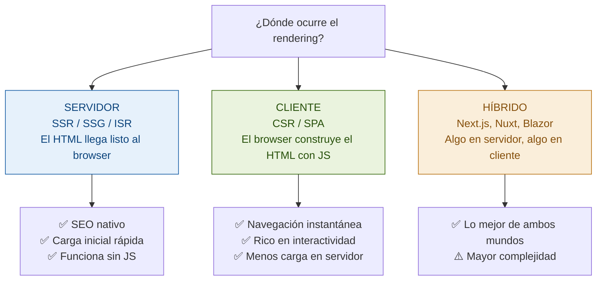
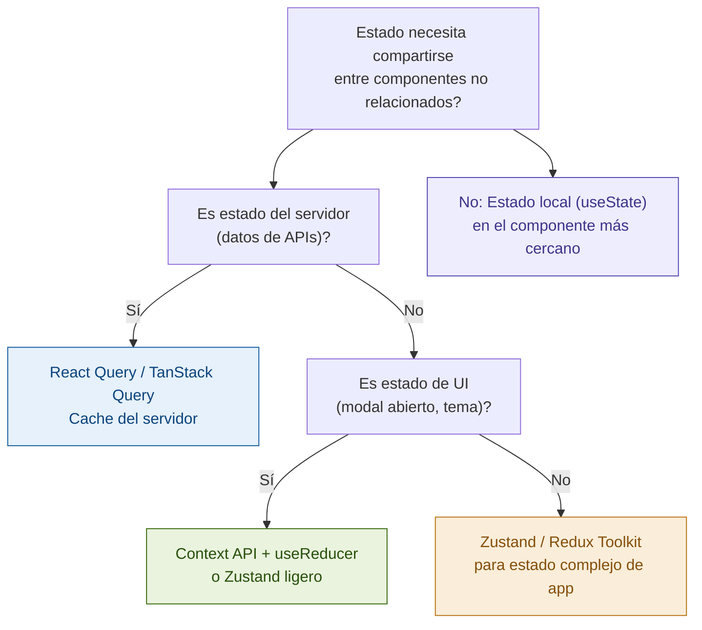
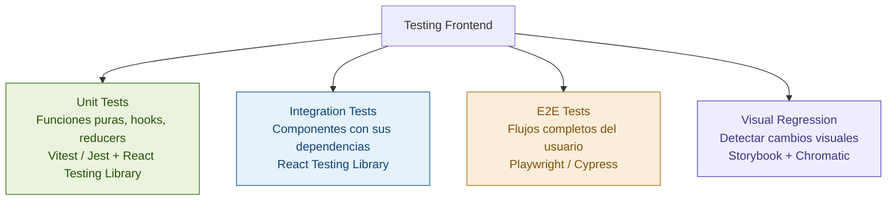
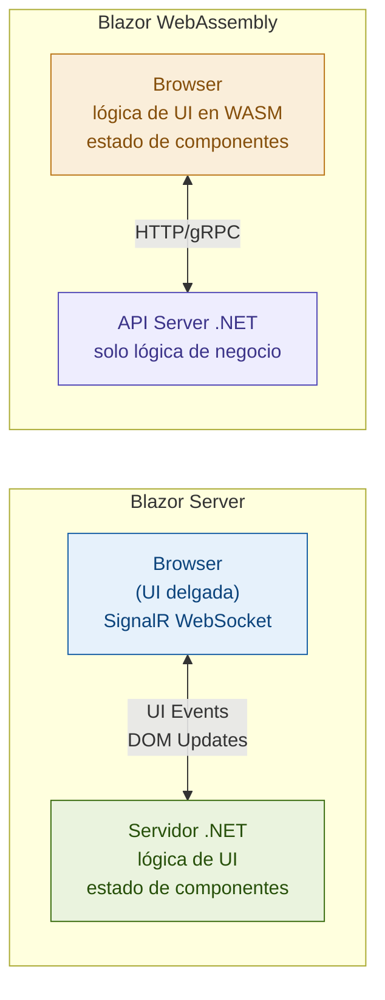
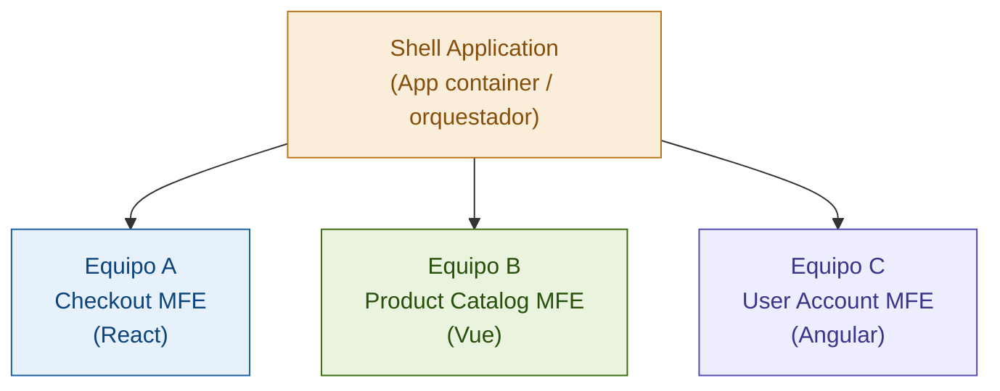

# Guía Frontend para Arquitecto
## Cómo piensa un Staff Engineer sobre el frontend

> **Propósito de este documento**
>
> El frontend no es "hacer que se vea bonito". Para un Staff/Arquitecto, el frontend
> es un sistema distribuido con sus propios desafíos de estado, rendimiento, seguridad,
> testing y arquitectura. Las decisiones que tomas en el frontend tienen consecuencias
> directas en la experiencia del usuario, la velocidad del equipo y la mantenibilidad.
>
> Al terminar esta guía podrás:
> - Elegir entre CSR, SSR, SSG e ISR con argumentos técnicos sólidos
> - Diseñar la arquitectura de estado de una aplicación React compleja
> - Aplicar TypeScript avanzado para crear APIs type-safe entre capas
> - Posicionar Blazor como diferenciador estratégico en el ecosistema .NET
> - Diseñar una arquitectura de micro-frontends cuando realmente tiene sentido
> - Tomar decisiones de performance con métricas reales (Core Web Vitals)
> - Diseñar una estrategia de testing frontend comparable a la del backend

---

## Índice General

1. [Cómo estudiar esta guía](#1-cómo-estudiar)
2. [El modelo mental del arquitecto frontend](#2-modelo-mental)
3. [CSR, SSR, SSG e ISR — la decisión más importante](#3-rendering-strategies)
4. [React — arquitectura de componentes y estado](#4-react-arquitectura)
5. [Estado global — cuándo y con qué](#5-estado-global)
6. [TypeScript avanzado — tipos como herramienta de arquitectura](#6-typescript-avanzado)
7. [Patrones de comunicación con el backend](#7-comunicacion-backend)
8. [Performance frontend — Core Web Vitals y optimización](#8-performance)
9. [Seguridad frontend — XSS, CSRF y autenticación](#9-seguridad-frontend)
10. [Testing frontend — de unitario a E2E](#10-testing-frontend)
11. [Blazor — el diferenciador en el ecosistema .NET](#11-blazor)
12. [Blazor WebAssembly vs Blazor Server — la decisión correcta](#12-blazor-wasm-vs-server)
13. [Blazor en producción — patrones avanzados](#13-blazor-avanzado)
14. [Micro-frontends — cuándo tiene sentido y cuándo no](#14-micro-frontends)
15. [Module Federation — la implementación técnica](#15-module-federation)
16. [Design Systems — la infraestructura que escala equipos](#16-design-systems)
17. [Accesibilidad (a11y) — correcta y medible](#17-accesibilidad)
18. [Internacionalización (i18n) — diseñada desde el inicio](#18-internacionalización)
19. [Build tooling — Vite, webpack y el ecosistema moderno](#19-build-tooling)
20. [Frontend en el pipeline CI/CD](#20-frontend-cicd)
21. [Python para scripting y herramientas de ingeniería](#21-python)
22. [Node.js y TypeScript en el backend — cuándo tiene sentido](#22-nodejs-backend)
23. [Checklist final y plan de práctica](#23-checklist-final)

---

## 1. Cómo estudiar esta guía

Esta guía tiene tres audiencias internas que conviven:

**Si eres fuerte en .NET y débil en frontend (React/TypeScript):** Lee todo en orden. Las secciones 2-10 construyen el modelo mental. Las secciones 11-13 son tu diferenciador actual (Blazor). Las secciones 14-20 son el nivel arquitectónico.

**Si ya usas React pero quieres el nivel arquitectónico:** Revisa rápido las secciones 3-5, profundiza en 6-10, y luego ve directo a 14-20.

**Para entrevistas Staff/Arquitecto:** Las secciones 3, 5, 8, 14, y 16 son las que más aparecen. Domínalas primero.

**Recursos integrados en esta guía:**

> 🎓 **Pluralsight — React y TypeScript:**
> **"React 18 Fundamentals"** — base si React es nuevo para ti
> **"TypeScript 5 Fundamentals"** — esencial para las secciones 6 y 7
> Úsalos antes de las secciones 4-6.

> 🎓 **Pluralsight — Blazor (tu diferenciador):**
> **"Blazor: Getting Started"** — base sólida
> **"Blazor WebAssembly: A Practical Guide"** — para producción
> Críticos para las secciones 11-13.

> 🎓 **Pluralsight — Arquitectura frontend avanzada:**
> **"Micro-frontends: The Nitty-Gritty"**
> Para las secciones 14-15. Ver después de dominar las secciones básicas.

> 🎓 **Educative.io:**
> **"React for Front-End Developers"**
> Para construir base sólida de React antes de los patrones avanzados.

---

## 2. El Modelo Mental del Arquitecto Frontend

### El frontend es un sistema distribuido

La mayoría de los ingenieros de backend subestiman el frontend porque lo ven como "HTML y CSS con algo de JavaScript". La perspectiva de Staff Engineer es diferente.

**El frontend tiene sus propios desafíos de sistemas distribuidos:**

```
Estado distribuido:
El estado de la aplicación vive en múltiples lugares simultáneamente:
- El servidor (la fuente de verdad)
- El cache del browser (localStorage, IndexedDB, Service Worker)
- El estado de React/Angular/Blazor (in-memory, en el cliente)
- La URL (los parámetros de query son estado)
- Múltiples tabs del browser (cada uno con su propio estado)

Sincronizar todo esto correctamente es tan difícil como sincronizar
estado en microservicios distribuidos.
```

**Los problemas de rendimiento del frontend son únicos:**

```
Red:
- El usuario descarga código (JS, CSS, imágenes) antes de ver algo
- La latencia de red es variable (WiFi, 4G, 3G, zonas rurales)
- Los recursos se parsean y ejecutan en el hilo principal del browser

CPU:
- JavaScript es single-threaded
- Una tarea larga bloquea el hilo y congela la UI
- El browser necesita tiempo de CPU para renderizar (layout, paint, composite)

Memoria:
- Los memory leaks en el browser son silenciosos y acumulativos
- Los event listeners no removidos son la causa más común
```

### La pregunta que define las decisiones de arquitectura frontend

**¿Quién tiene el control del rendering?**



Esta pregunta guía casi todas las decisiones de arquitectura frontend. Si no la respondes primero, las decisiones de framework, caching, y deployment no tienen base sólida.

---

## 3. CSR, SSR, SSG e ISR — La Decisión Más Importante

### La intuición de cada estrategia

Imagina que tienes que servir un menú de restaurante a clientes:

**CSR:** Le das al cliente los ingredientes y la receta. Ellos cocinan en su mesa. La primera vez tarda más, pero después son rápidos.

**SSR:** El chef cocina el plato por encargo. Cada petición se prepara fresca. Siempre tendrán el plato listo, pero el chef es el cuello de botella.

**SSG:** El restaurante cocina todos los platos posibles por adelantado. Servir es instantáneo, pero no puedes servir platos que no preparaste de antemano.

**ISR:** Como SSG pero con reabastecimiento. El plato de la vitrina se sirve inmediatamente, y si ya tiene más de X horas se prepara uno nuevo en paralelo para la próxima vez.

### CSR — Client-Side Rendering

```
Flujo:
1. Browser pide HTML → Servidor devuelve HTML vacío con <script>
2. Browser descarga el bundle de JavaScript (500KB - 2MB típicamente)
3. JavaScript parsea y ejecuta
4. React monta los componentes
5. Se hace una petición a la API para los datos
6. La UI finalmente muestra contenido

Tiempo hasta contenido útil: 2-5 segundos en conexión lenta
```

```html
<!-- Lo que recibe el browser con CSR: HTML casi vacío -->
<!DOCTYPE html>
<html>
<body>
  <div id="root"></div>  <!-- Todo el contenido lo construye JS -->
  <script src="/static/js/main.abc123.js"></script>
</body>
</html>
```

**Cuándo CSR es la respuesta correcta:**
- Aplicaciones internas (dashboards, admin panels, ERPs) — SEO no importa
- Aplicaciones altamente interactivas (editores, herramientas, juegos)
- Cuando el usuario está autenticado y los datos son privados
- Cuando necesitas comportamiento offline (PWA con Service Workers)

**Cuándo CSR NO es la respuesta correcta:**
- E-commerce público — Google necesita indexar los productos
- Blogs, sitios de marketing, landing pages — el SEO es crítico
- Cuando los usuarios tienen conexiones lentas o dispositivos lentos

### SSR — Server-Side Rendering

```
Flujo:
1. Browser pide /productos/123
2. Servidor recibe la request, llama a la DB, genera HTML completo
3. Browser recibe HTML completo — puede mostrarse inmediatamente
4. Browser descarga JavaScript (hidratación)
5. JavaScript "toma control" del HTML estático — ahora es interactivo

Tiempo hasta contenido visible: ~200-500ms (mucho más rápido que CSR)
```

**El problema de la hidratación:** La "hidratación" es el proceso donde React toma un HTML ya renderizado en el servidor y lo convierte en una app interactiva. Durante este proceso, la página se ve pero no responde a clicks — el "uncanny valley" del SSR.

```tsx
// Next.js — SSR con getServerSideProps
export async function getServerSideProps(context: GetServerSidePropsContext) {
  const productId = context.params?.id as string;

  // Llamada directa a la DB o servicio interno (no pasa por la API pública)
  const product = await productService.getById(productId);

  if (!product) return { notFound: true }; // 404 automático

  return {
    props: { product: JSON.parse(JSON.stringify(product)) }
  };
}

export default function ProductPage({ product }: { product: Product }) {
  return (
    <div>
      <h1>{product.name}</h1>
      <p>{product.description}</p>
      <AddToCartButton productId={product.id} />
    </div>
  );
}
```

**Cuándo SSR es la respuesta correcta:**
- Páginas con datos que cambian constantemente (precios en tiempo real, inventario)
- Contenido personalizado por usuario que también necesita SEO
- Cuando el tiempo de carga inicial es crítico y los datos son muy dinámicos

### SSG — Static Site Generation

```
Flujo en build time:
1. El build process llama a todas las fuentes de datos
2. Genera HTML estático para cada página posible
3. Los archivos HTML se suben a un CDN

Flujo en runtime:
1. Browser pide la página → CDN devuelve HTML estático desde el edge
2. Latencia: 10-50ms (desde el CDN más cercano al usuario)

Tiempo hasta contenido visible: < 100ms
```

```tsx
// Next.js — SSG con getStaticProps y getStaticPaths
export async function getStaticPaths() {
  const products = await productService.getAllIds();
  return {
    paths: products.map(p => ({ params: { id: p.id.toString() } })),
    fallback: 'blocking'  // Si no existe la página, SSR la primera vez y cachear
  };
}

export async function getStaticProps({ params }: GetStaticPropsContext) {
  const product = await productService.getById(params!.id as string);
  return {
    props: { product },
    revalidate: 3600  // ISR: regenerar si tiene más de 1 hora
  };
}
```

**Cuándo SSG es la respuesta correcta:**
- Blogs, documentación, landing pages, sitios de marketing
- Páginas cuyo contenido cambia poco (una vez al día o menos)
- Cuando el performance máximo (CDN edge) es la prioridad

**Cuándo SSG NO funciona:**
- Páginas con datos que cambian frecuentemente
- Cuando tienes millones de páginas únicas (build time sería días)
- Contenido personalizado por usuario

### ISR — Incremental Static Regeneration

ISR combina lo mejor de SSG y SSR:

```
Primera visita: sirve el HTML estático del CDN (o genera si no existe)
Visita dentro del período de revalidación: sirve el HTML cacheado
Visita después del período:
  - Sirve el HTML viejo INMEDIATAMENTE (no hace esperar al usuario)
  - En background, regenera la página con datos frescos
  - La PRÓXIMA visita ya ve el contenido actualizado
```

```tsx
export async function getStaticProps() {
  const products = await fetchProductsFromDB();
  return {
    props: { products },
    revalidate: 60  // Regenerar si la página tiene más de 60 segundos
    // El usuario nunca espera la regeneración — siempre recibe la versión cacheada
  };
}
```

### La tabla de decisión completa

| Estrategia | SEO | Performance | Datos frescos | Costo infra | Complejidad |
|---|---|---|---|---|---|
| **CSR** | ❌ Difícil | ❌ Carga inicial lenta | ✅ Siempre fresco | ✅ Solo CDN | ✅ Simple |
| **SSR** | ✅ Excelente | ✅ Bueno | ✅ Siempre fresco | ❌ Servidor activo | ⚠️ Media |
| **SSG** | ✅ Excelente | ✅✅ Máximo | ❌ Solo en build | ✅ Solo CDN | ✅ Simple |
| **ISR** | ✅ Excelente | ✅✅ Muy bueno | ✅ Con lag config. | ✅ Mayormente CDN | ⚠️ Media |

**La respuesta de Staff Engineer en entrevista:**
*"La elección de estrategia de rendering depende de tres factores: si el SEO es necesario, qué tan frescos deben estar los datos, y el costo de infraestructura aceptable. Para e-commerce público con precios frecuentes, usaría ISR o SSR. Para blog/documentación, SSG puro. Para admin interno autenticado, CSR es suficiente y más simple."*

---

## 4. React — Arquitectura de Componentes y Estado

### El modelo mental correcto de React

React no es un framework — es una librería de UI. Esto significa que no te dice cómo estructurar tu app, manejar el estado global, o comunicarte con el servidor.

**El modelo mental de React en una frase:** La UI es una función del estado.

```
UI = f(state)

Cada vez que el estado cambia, React recalcula qué parte de la UI debe actualizarse.
No manipulas el DOM directamente — describes cómo debería verse la UI dado un estado,
y React hace el trabajo de actualizar el DOM eficientemente.
```

### Tipos de componentes — la taxonomía que ordena el caos

```
Presentational (Dumb) Components:
→ Solo reciben props y renderizan UI
→ Sin lógica de negocio, sin llamadas a APIs, sin estado complejo
→ Fáciles de testear y reutilizar
→ Ejemplo: Button, Card, Avatar, Badge, Modal, Table

Container (Smart) Components:
→ Orquestan la lógica y el estado
→ Pasan datos a los presentational components
→ Hacen llamadas a APIs, manejan side effects
→ Ejemplo: UserProfileContainer, OrderListContainer

Page Components:
→ El punto de entrada de una ruta
→ Componen containers y presentational components
→ En Next.js: los archivos en /pages o /app

Layout Components:
→ Estructuran el layout sin contenido propio
→ Sidebar, Header, Footer, Grid layouts
```

### Hooks — el modelo de composición de React

```tsx
// useState — estado local del componente
function Counter() {
  const [count, setCount] = useState(0);
  return (
    <button onClick={() => setCount(prev => prev + 1)}>
      Count: {count}
    </button>
  );
}
```

```tsx
// useEffect — side effects (llamadas a API, subscripciones, timers)
function UserProfile({ userId }: { userId: string }) {
  const [user, setUser] = useState<User | null>(null);
  const [loading, setLoading] = useState(true);

  useEffect(() => {
    let cancelled = false;  // Evitar race conditions

    const fetchUser = async () => {
      setLoading(true);
      const data = await userService.getById(userId);
      if (!cancelled) {     // Solo actualizar si el componente sigue montado
        setUser(data);
        setLoading(false);
      }
    };

    fetchUser();

    // Cleanup — se ejecuta cuando el componente se desmonta
    // o antes de ejecutar el effect de nuevo
    return () => { cancelled = true; };
  }, [userId]);  // Re-ejecutar si userId cambia

  if (loading) return <Spinner />;
  if (!user) return <NotFound />;
  return <UserCard user={user} />;
}
```

```tsx
// useCallback + useMemo — estabilizar referencias para performance
function ExpensiveList({ items, onSelect }: Props) {
  // useMemo: solo recalcular cuando items cambie
  const sortedItems = useMemo(
    () => [...items].sort((a, b) => b.priority - a.priority),
    [items]
  );

  // useCallback: solo recrear la función si onSelect cambia
  const handleSelect = useCallback((id: string) => {
    onSelect(id);
    analytics.track('item_selected', { id });
  }, [onSelect]);

  return (
    <ul>
      {sortedItems.map(item => (
        <ListItem key={item.id} item={item} onSelect={handleSelect} />
      ))}
    </ul>
  );
}
```

### Custom Hooks — el patrón de composición más poderoso

```tsx
// Custom hook para fetching con estados loading/error/data
function useAsync<T>(asyncFn: () => Promise<T>, deps: unknown[]) {
  const [state, setState] = useState<{
    data: T | null;
    loading: boolean;
    error: Error | null;
  }>({ data: null, loading: true, error: null });

  useEffect(() => {
    let cancelled = false;
    setState(prev => ({ ...prev, loading: true, error: null }));

    asyncFn()
      .then(data => {
        if (!cancelled) setState({ data, loading: false, error: null });
      })
      .catch(error => {
        if (!cancelled) setState({ data: null, loading: false, error });
      });

    return () => { cancelled = true; };
  // eslint-disable-next-line react-hooks/exhaustive-deps
  }, deps);

  return state;
}

// El componente no sabe nada de fetch, loading, o error handling
function ProductList() {
  const { data: products, loading, error } = useAsync(
    () => productService.getAll(),
    []
  );

  if (loading) return <Skeleton count={5} />;
  if (error) return <ErrorMessage error={error} />;
  return <Grid items={products!} renderItem={p => <ProductCard product={p} />} />;
}
```

### React.memo — cuándo y cuándo NO

```tsx
// React.memo — evitar re-render si las props no cambiaron
// SOLO usar cuando el componente es costoso de renderizar
const ExpensiveChart = React.memo(function ExpensiveChart({ data }: Props) {
  const processedData = processDataForChart(data); // Operación costosa
  return <Chart data={processedData} />;
});

// ❌ Error común — React.memo no ayuda si el padre pasa nuevas referencias
function Parent() {
  const data = [1, 2, 3];              // Nueva referencia en cada render
  const handler = () => doSomething(); // Nueva función en cada render
  return <ExpensiveChart data={data} onClick={handler} />;
  // React.memo siempre ve que data y handler son "nuevos" → siempre re-renderiza
}

// ✅ Correcto — estabilizar referencias con useMemo y useCallback
function Parent() {
  const data = useMemo(() => [1, 2, 3], []);
  const handler = useCallback(() => doSomething(), []);
  return <ExpensiveChart data={data} onClick={handler} />;
}
```

---

## 5. Estado Global — Cuándo y Con Qué

### El modelo de decisión



### El error más común: poner todo en Redux

```tsx
// ❌ Antipatrón: datos del servidor en Redux
dispatch(fetchUsers());    // Redux hace la llamada
dispatch(setUsers(data));  // Redux guarda los datos
// Resultado: código complejo para algo que React Query hace en 3 líneas

// ✅ Correcto: separar estado del servidor de estado de UI
// Estado del servidor  → React Query
// Estado de UI         → useState / useReducer / Zustand
// Solo poner en estado global lo que es genuinamente estado de la aplicación
```

### Context API + useReducer — para estado de UI moderado

```tsx
type Theme = 'light' | 'dark';
type ThemeAction = { type: 'TOGGLE' } | { type: 'SET'; theme: Theme };

const ThemeContext = createContext<{
  theme: Theme;
  dispatch: Dispatch<ThemeAction>;
} | null>(null);

function themeReducer(state: Theme, action: ThemeAction): Theme {
  switch (action.type) {
    case 'TOGGLE': return state === 'light' ? 'dark' : 'light';
    case 'SET': return action.theme;
    default: return state;
  }
}

export function ThemeProvider({ children }: { children: ReactNode }) {
  const [theme, dispatch] = useReducer(themeReducer, 'light');
  return (
    <ThemeContext.Provider value={{ theme, dispatch }}>
      {children}
    </ThemeContext.Provider>
  );
}

// Hook de acceso tipado — no exponer el Context directamente
export function useTheme() {
  const context = useContext(ThemeContext);
  if (!context) throw new Error('useTheme must be used within ThemeProvider');
  return context;
}
```

**El problema de rendimiento del Context:** Cuando el valor del Context cambia, todos los componentes que lo consumen se re-renderizan. Solución: separar contexts por frecuencia de cambio.

```tsx
// ❌ Un Context con múltiples valores que cambian independientemente
const AppContext = createContext({ user: null, theme: 'light', cartCount: 0 });
// Cuando cartCount cambia, componentes que solo usan user también re-renderizan

// ✅ Separar Contexts por frecuencia de cambio
const UserContext = createContext<User | null>(null);         // Cambia poco
const ThemeContext = createContext<Theme>('light');           // Cambia poco
const CartContext = createContext<{ count: number }>(null!);  // Cambia frecuente
```

### Zustand — estado global simple y performante

```tsx
import { create } from 'zustand';
import { devtools, persist } from 'zustand/middleware';

interface CartStore {
  items: CartItem[];
  addItem: (product: Product) => void;
  removeItem: (productId: string) => void;
  clearCart: () => void;
  totalPrice: () => number;
}

const useCartStore = create<CartStore>()(
  devtools(             // Redux DevTools en desarrollo
    persist(            // Persistir en localStorage
      (set, get) => ({
        items: [],

        addItem: (product) => set(state => {
          const existing = state.items.find(i => i.productId === product.id);
          if (existing) {
            return {
              items: state.items.map(i =>
                i.productId === product.id
                  ? { ...i, quantity: i.quantity + 1 }
                  : i
              )
            };
          }
          return {
            items: [...state.items, { productId: product.id, product, quantity: 1 }]
          };
        }),

        removeItem: (productId) => set(state => ({
          items: state.items.filter(i => i.productId !== productId)
        })),

        clearCart: () => set({ items: [] }),

        totalPrice: () =>
          get().items.reduce((sum, item) => sum + item.product.price * item.quantity, 0)
      }),
      { name: 'cart-storage' }
    )
  )
);

// Uso — sin Provider, sin connect(), sin dispatch
function AddToCartButton({ product }: { product: Product }) {
  const addItem = useCartStore(state => state.addItem);
  // Solo re-renderiza cuando addItem cambia (es estable en Zustand)
  return <button onClick={() => addItem(product)}>Add to Cart</button>;
}

function CartBadge() {
  const count = useCartStore(state => state.items.length);
  // Solo re-renderiza cuando el número de items cambia
  return <span>{count}</span>;
}
```

### Redux Toolkit — para estado complejo en equipos grandes

```tsx
import { createSlice, createAsyncThunk, PayloadAction } from '@reduxjs/toolkit';

export const fetchOrders = createAsyncThunk(
  'orders/fetchAll',
  async (_, { rejectWithValue }) => {
    try {
      return await orderService.getAll();
    } catch (error) {
      return rejectWithValue((error as ApiError).message);
    }
  }
);

const ordersSlice = createSlice({
  name: 'orders',
  initialState: {
    items: [] as Order[],
    loading: false,
    error: null as string | null,
  },
  reducers: {
    // Immer permite mutar directamente (produce un nuevo objeto por debajo)
    addOrder: (state, action: PayloadAction<Order>) => {
      state.items.push(action.payload);
    },
    removeOrder: (state, action: PayloadAction<string>) => {
      state.items = state.items.filter(o => o.id !== action.payload);
    },
  },
  extraReducers: (builder) => {
    builder
      .addCase(fetchOrders.pending, (state) => { state.loading = true; })
      .addCase(fetchOrders.fulfilled, (state, action) => {
        state.loading = false;
        state.items = action.payload;
      })
      .addCase(fetchOrders.rejected, (state, action) => {
        state.loading = false;
        state.error = action.payload as string;
      });
  }
});
```

---

## 6. TypeScript Avanzado — El Sistema de Tipos como Herramienta de Arquitectura

### Más allá del tipado básico

En el nivel Senior, TypeScript se usa para "no cometer errores de tipo".
En el nivel Staff/Arquitecto, TypeScript se usa para **hacer que los errores sean imposibles de cometer** y para documentar la intención del diseño directamente en el código.

### Tipos de utilidad — la librería estándar

```typescript
interface User {
  id: string;
  name: string;
  email: string;
  role: 'admin' | 'editor' | 'viewer';
  createdAt: Date;
  updatedAt: Date;
}

// Partial<T> — todos los campos opcionales
type UserUpdatePayload = Partial<User>;
// Útil para: operaciones PATCH donde no todos los campos son requeridos

// Pick<T, K> — seleccionar solo algunos campos
type UserSummary = Pick<User, 'id' | 'name' | 'email'>;
// Útil para: DTOs, respuestas de API que no necesitan todos los campos

// Omit<T, K> — todos los campos EXCEPTO algunos
type CreateUserPayload = Omit<User, 'id' | 'createdAt' | 'updatedAt'>;
// Útil para: payloads de creación (el servidor genera id y timestamps)

// Record<K, V> — objeto con claves de tipo K y valores de tipo V
type UsersByRole = Record<User['role'], User[]>;
// { admin: User[], editor: User[], viewer: User[] }

// Exclude<T, U> — excluir tipos de una union
type NonAdminRole = Exclude<User['role'], 'admin'>;
// Resultado: 'editor' | 'viewer'

// ReturnType + Awaited — extraer el tipo de retorno
async function getUser(): Promise<User> { return null!; }
type UserResult = Awaited<ReturnType<typeof getUser>>; // User
```

### Tipos genéricos — el nivel arquitectónico

```typescript
// Respuestas paginadas type-safe — reutilizable con cualquier entidad
interface PaginatedResponse<T> {
  data: T[];
  pagination: {
    page: number;
    pageSize: number;
    total: number;
    totalPages: number;
  };
}

type PaginatedUsers = PaginatedResponse<User>;
type PaginatedOrders = PaginatedResponse<Order>;
```

```typescript
// Discriminated union para async state — el patrón más útil para UI
type AsyncState<T, E = Error> =
  | { status: 'idle' }
  | { status: 'loading' }
  | { status: 'success'; data: T }
  | { status: 'error'; error: E };

// TypeScript narrowing automático en el switch
function OrderStatus({ state }: { state: AsyncState<Order[]> }) {
  switch (state.status) {
    case 'idle':    return <div>Selecciona un filtro</div>;
    case 'loading': return <Spinner />;
    case 'success': return <OrderList orders={state.data} />;
    // TypeScript sabe que state.data es Order[] aquí
    case 'error':   return <ErrorMessage error={state.error} />;
    // TypeScript sabe que state.error es Error aquí
  }
}
```

```typescript
// Branded Types — prevenir confusión entre primitivos del mismo tipo base
type UserId = string & { readonly __brand: 'UserId' };
type OrderId = string & { readonly __brand: 'OrderId' };

function createUserId(id: string): UserId { return id as UserId; }

function getUser(id: UserId): User { return null!; }
function getOrder(id: OrderId): Order { return null!; }

const userId = createUserId('user-123');
const orderId = 'order-456' as OrderId;

getUser(userId);    // ✅
getOrder(orderId);  // ✅
getUser(orderId);   // ❌ TypeScript Error: 'OrderId' no es assignable a 'UserId'
// Hace imposible pasar un OrderId donde se espera un UserId
```

```typescript
// Template Literal Types — tipos derivados de strings
type HttpMethod = 'GET' | 'POST' | 'PUT' | 'DELETE' | 'PATCH';
type ApiEndpoint = `/api/v1/${string}`;

function apiCall<T>(method: HttpMethod, endpoint: ApiEndpoint): Promise<T> {
  return fetch(endpoint, { method }).then(r => r.json());
}

apiCall('GET', '/api/v1/users');    // ✅
apiCall('GET', '/api/users');       // ❌ Error: debe empezar con /api/v1/
apiCall('UPDATE', '/api/v1/users'); // ❌ Error: 'UPDATE' no es HttpMethod
```

### Zod — validación en runtime con type inference

TypeScript solo existe en compile time. En runtime, los datos de APIs pueden tener cualquier forma. Zod valida en runtime y genera tipos TypeScript automáticamente.

```typescript
import { z } from 'zod';

// Definir el schema de validación
const OrderSchema = z.object({
  id: z.string().uuid(),
  customerId: z.string().min(1, 'Customer ID es requerido'),
  items: z.array(z.object({
    productId: z.string().uuid(),
    quantity: z.number().int().positive(),
    unitPrice: z.number().positive(),
  })).min(1, 'Debe tener al menos un item'),
  status: z.enum(['pending', 'processing', 'shipped', 'delivered', 'cancelled']),
  createdAt: z.string().datetime(),
});

// Inferir el tipo TypeScript del schema — fuente única de verdad
type Order = z.infer<typeof OrderSchema>;

// Validar datos en runtime
async function fetchOrder(id: string): Promise<Order> {
  const response = await fetch(`/api/orders/${id}`);
  const data = await response.json();

  const result = OrderSchema.safeParse(data);
  if (!result.success) {
    console.error('Invalid order data:', result.error.flatten());
    throw new Error('Datos del servidor tienen formato inesperado');
  }

  return result.data; // Type: Order — completamente seguro
}

// Schema para formularios — reutilizando el schema base
const CreateOrderSchema = OrderSchema.omit({
  id: true,
  status: true,
  createdAt: true,
});
type CreateOrderPayload = z.infer<typeof CreateOrderSchema>;
```

---

## 7. Patrones de Comunicación con el Backend

### TanStack Query (React Query) — estado del servidor

```
Sin React Query, para cada llamada a API necesitas:
- useState para loading, data y error
- useEffect para hacer la llamada
- Lógica de cleanup para evitar race conditions
- Lógica de refetch cuando el usuario vuelve al tab
- Lógica de invalidación cuando los datos cambian
→ 30-50 líneas de código por cada fetching de datos

Con React Query: 3-5 líneas.
```

```tsx
import { useQuery, useMutation, useQueryClient } from '@tanstack/react-query';

// useQuery — fetching y caching automático
function OrderList() {
  const { data: orders, isLoading, isError, error } = useQuery({
    queryKey: ['orders'],         // Clave de cache
    queryFn: orderService.getAll,
    staleTime: 5 * 60 * 1000,    // Datos "frescos" por 5 minutos
    gcTime: 10 * 60 * 1000,      // En cache por 10 minutos sin uso
    retry: 3,
    refetchOnWindowFocus: true,   // Refetch cuando el usuario vuelve al tab
  });

  if (isLoading) return <OrdersSkeleton />;
  if (isError) return <ErrorMessage error={error as Error} />;
  return <ul>{orders!.map(order => <OrderItem key={order.id} order={order} />)}</ul>;
}

// useMutation — operaciones de escritura con invalidación de cache
function CreateOrderForm() {
  const queryClient = useQueryClient();

  const { mutate, isPending } = useMutation({
    mutationFn: orderService.create,
    onSuccess: (newOrder) => {
      // Invalidar el cache — forzar refetch en el próximo acceso
      queryClient.invalidateQueries({ queryKey: ['orders'] });
      // O actualizar el cache directamente (optimistic):
      queryClient.setQueryData(['orders'], (old: Order[] | undefined) =>
        old ? [...old, newOrder] : [newOrder]
      );
      toast.success('Orden creada');
    },
    onError: (error: ApiError) => toast.error(error.message),
  });

  return (
    <form onSubmit={(e) => { e.preventDefault(); mutate(formValues); }}>
      <button type="submit" disabled={isPending}>
        {isPending ? 'Creando...' : 'Crear Orden'}
      </button>
    </form>
  );
}
```

```tsx
// Optimistic Updates — actualizar la UI antes de que el servidor confirme
function LikeButton({ postId, initialLiked }: Props) {
  const queryClient = useQueryClient();

  const { mutate } = useMutation({
    mutationFn: (liked: boolean) => postService.toggleLike(postId, liked),

    onMutate: async (liked) => {
      await queryClient.cancelQueries({ queryKey: ['posts', postId] });
      const previousPost = queryClient.getQueryData<Post>(['posts', postId]);

      // Actualizar optimistamente
      queryClient.setQueryData<Post>(['posts', postId], old => ({
        ...old!,
        liked,
        likeCount: liked ? old!.likeCount + 1 : old!.likeCount - 1
      }));

      return { previousPost }; // Para rollback si falla
    },

    onError: (err, variables, context) => {
      queryClient.setQueryData(['posts', postId], context?.previousPost);
      toast.error('No se pudo guardar el like');
    },

    onSettled: () => {
      queryClient.invalidateQueries({ queryKey: ['posts', postId] });
    }
  });

  return <button onClick={() => mutate(!initialLiked)}>Liked</button>;
}
```

### Generación de clientes tipados desde OpenAPI

```bash
# Generar cliente TypeScript desde el OpenAPI spec del servidor .NET
npx @hey-api/openapi-ts \
  --input https://api.miapp.com/swagger/v1/swagger.json \
  --output src/api/client \
  --client axios
```

```typescript
// El cliente generado incluye tipos exactos del servidor
// Si el backend cambia el schema, TypeScript lo detecta en el frontend
import { OrdersService } from '@/api/client';

const orders = await OrdersService.getOrders({ page: 1, pageSize: 20 });
// orders.data tiene el tipo exacto del servidor — siempre en sync
```

---

## 8. Performance Frontend — Core Web Vitals y Optimización

### Core Web Vitals — las métricas que usa Google para SEO

```
LCP — Largest Contentful Paint
  ¿Cuándo aparece el contenido principal?
  Objetivo: < 2.5 segundos
  Causas de LCP lento: imágenes sin optimizar, JS bloqueante, TTFB alto

INP — Interaction to Next Paint (reemplazó a FID en 2024)
  ¿Cuánto tarda la página en responder a input del usuario?
  Objetivo: < 200ms
  Causas: JavaScript bloqueando el hilo principal, event listeners costosos

CLS — Cumulative Layout Shift
  ¿Se mueve el contenido mientras carga?
  Objetivo: < 0.1
  Causas: imágenes sin dimensiones fijas, ads que se cargan tarde, web fonts
```

### Técnicas de optimización de mayor impacto

#### 1. Code Splitting — no cargar lo que no se necesita

```tsx
import { lazy, Suspense } from 'react';

// HeavyEditor solo se descarga cuando el usuario lo necesita
const HeavyEditor = lazy(() => import('./HeavyEditor'));

function ArticlePage({ article }: Props) {
  const [editing, setEditing] = useState(false);

  return (
    <div>
      <h1>{article.title}</h1>
      {editing && (
        <Suspense fallback={<EditorSkeleton />}>
          <HeavyEditor content={article.body} />
          {/* HeavyEditor se descarga solo cuando editing es true */}
        </Suspense>
      )}
    </div>
  );
}
```

#### 2. Image Optimization

```tsx
// Next.js Image — optimización automática
import Image from 'next/image';

function ProductCard({ product }: Props) {
  return (
    <Image
      src={product.imageUrl}
      alt={product.name}
      width={400}
      height={300}
      // Convierte automáticamente a WebP/AVIF (30-50% más pequeño)
      // Genera múltiples tamaños para diferentes dispositivos (srcset)
      // Lazy loading nativo — solo carga cuando entra al viewport
      priority={false}   // true solo para el LCP element (above the fold)
      placeholder="blur"
      blurDataURL={product.blurHash}
    />
  );
}
```

#### 3. Virtualización — renderizar solo lo visible

```tsx
import { FixedSizeList } from 'react-window';

// Sin virtualización: 10,000 filas en el DOM → el browser colapsa
// Con virtualización: solo renderiza ~20 filas visibles

function VirtualizedList({ items }: { items: Item[] }) {
  return (
    <FixedSizeList
      height={600}
      itemCount={items.length}
      itemSize={50}
      width="100%"
    >
      {({ index, style }) => (
        // Solo los items visibles se renderizan — performance constante
        <div style={style}>{items[index].name}</div>
      )}
    </FixedSizeList>
  );
}
```

#### 4. Bundle Analysis

```bash
# Next.js
npx @next/bundle-analyzer

# Vite
npx source-map-explorer 'dist/assets/*.js'
# Muestra un treemap de qué librerías ocupan más espacio
```

```typescript
// Antipatrón: importar toda la librería
import _ from 'lodash';           // Importa TODO lodash — 70KB
_.debounce(fn, 300);

// Correcto: import específico
import debounce from 'lodash/debounce'; // Solo debounce — 2KB
```

---

## 9. Seguridad Frontend

### XSS — Cross-Site Scripting

```tsx
// ❌ VULNERABLE — insertar HTML crudo del usuario o de APIs no confiables
function UserComment({ comment }: { comment: string }) {
  return <div dangerouslySetInnerHTML={{ __html: comment }} />;
  // Si comment = "<script>steal(document.cookie)</script>"
  // El script se ejecuta en el browser de la víctima
}

// ✅ CORRECTO — React escapa automáticamente el contenido en JSX expressions
function UserComment({ comment }: { comment: string }) {
  return <div>{comment}</div>;
  // React convierte < > & " en entidades HTML — el script no se ejecuta
}

// Si NECESITAS renderizar HTML (contenido de un CMS):
import DOMPurify from 'dompurify';

function CMSContent({ html }: { html: string }) {
  const sanitized = DOMPurify.sanitize(html, {
    ALLOWED_TAGS: ['p', 'b', 'i', 'em', 'strong', 'a', 'ul', 'li', 'ol'],
    ALLOWED_ATTR: ['href', 'target'],
  });
  return <div dangerouslySetInnerHTML={{ __html: sanitized }} />;
}
```

### Dónde guardar tokens — la decisión crítica

```
localStorage:
✅ Persiste entre sessions
❌ Accesible desde JavaScript → vulnerable a XSS
❌ Si hay XSS, el atacante roba el token y lo usa desde otro dominio

Cookies HttpOnly:
✅ NO accesibles desde JavaScript
✅ Se envían automáticamente con cada request
✅ Inmune a XSS
❌ Vulnerables a CSRF si no se protegen (usar SameSite=Strict)

RECOMENDACIÓN: Cookies HttpOnly para tokens de autenticación.
NUNCA localStorage para access tokens.
```

```typescript
// next.config.ts — Content Security Policy
const ContentSecurityPolicy = `
  default-src 'self';
  script-src 'self';
  style-src 'self' 'unsafe-inline';
  img-src 'self' data: https://cdn.miapp.com;
  connect-src 'self' https://api.miapp.com;
`.replace(/\s{2,}/g, ' ').trim();

const securityHeaders = [
  { key: 'Content-Security-Policy', value: ContentSecurityPolicy },
  { key: 'X-Frame-Options', value: 'DENY' },
  { key: 'X-Content-Type-Options', value: 'nosniff' },
];
```

---

## 10. Testing Frontend

### La pirámide de testing



### React Testing Library — probar comportamiento, no implementación

```tsx
// ❌ Antipatrón — probar implementación interna
test('should set isLoading to true when clicking submit', () => {
  const { result } = renderHook(() => useOrderForm());
  act(() => result.current.handleSubmit());
  expect(result.current.isLoading).toBe(true);
  // Prueba la implementación, no el comportamiento del usuario
});

// ✅ Correcto — probar desde la perspectiva del usuario
test('should show loading spinner when submitting order', async () => {
  const mockCreate = vi.fn().mockImplementation(
    () => new Promise(resolve => setTimeout(resolve, 1000))
  );
  vi.mocked(orderService.create).mockImplementation(mockCreate);

  render(<CreateOrderForm />);

  await userEvent.type(screen.getByLabelText('Customer'), 'John Doe');
  await userEvent.click(screen.getByRole('button', { name: /crear orden/i }));

  // El usuario ve un spinner
  expect(screen.getByRole('progressbar')).toBeInTheDocument();
  await waitForElementToBeRemoved(() => screen.queryByRole('progressbar'));
});
```

### Playwright — E2E testing moderno

```typescript
// playwright.config.ts
export default defineConfig({
  testDir: './e2e',
  fullyParallel: true,
  retries: process.env.CI ? 2 : 0,
  use: {
    baseURL: process.env.E2E_BASE_URL ?? 'http://localhost:3000',
    trace: 'on-first-retry',
    screenshot: 'only-on-failure',
  },
  projects: [
    { name: 'chromium', use: { ...devices['Desktop Chrome'] } },
    { name: 'Mobile Safari', use: { ...devices['iPhone 14'] } },
  ],
});

// e2e/checkout.spec.ts
test('should complete purchase with valid payment', async ({ page }) => {
  await page.goto('/products');

  await page.getByTestId('product-laptop')
            .getByRole('button', { name: 'Add to Cart' })
            .click();

  await expect(page.getByTestId('cart-badge')).toHaveText('1');

  await page.getByRole('link', { name: 'Checkout' }).click();
  await page.getByLabel('Full Name').fill('Omar García');
  await page.getByRole('button', { name: 'Place Order' }).click();

  await expect(page.getByTestId('order-confirmation')).toBeVisible({ timeout: 10000 });
  await expect(page.getByTestId('order-number')).toContainText('ORD-');
});
```

---

## 11. Blazor — El Diferenciador en el Ecosistema .NET

### Por qué Blazor es estratégicamente importante

Como developer .NET con 10 años de experiencia, Blazor es tu ventaja competitiva en el frontend. Puedes construir interfaces ricas con C# y .NET que ya dominas.

**Cuándo Blazor es la respuesta correcta:**
- El equipo es predominantemente .NET y no hay recursos JavaScript
- La aplicación es interna (admin panel, ERP, herramientas de negocio)
- Se necesita compartir modelos y validaciones entre frontend y backend
- Hay requisitos de seguridad que hacen preferible código en el servidor
- Se necesita integración profunda con librerías .NET

**La ventaja de compartir código:**

```csharp
// Este modelo se usa en TRES lugares con Blazor:
// 1. La entidad de dominio en el backend
// 2. El contrato de la API
// 3. La validación en el frontend (Blazor WebAssembly)
// En React necesitas duplicar las validaciones en TypeScript/Zod

public class CreateOrderRequest
{
    [Required(ErrorMessage = "El cliente es requerido")]
    [StringLength(100, MinimumLength = 3)]
    public string CustomerName { get; set; } = string.Empty;

    [Required]
    [MinLength(1, ErrorMessage = "Debe incluir al menos un producto")]
    public List<OrderItemDto> Items { get; set; } = new();

    [FutureDate(ErrorMessage = "La fecha de entrega debe ser futura")]
    public DateTime DeliveryDate { get; set; }
}
```

### El modelo de componentes de Blazor

```razor
@* OrderCard.razor — Componente con parámetros tipados *@

<div class="order-card @(IsSelected ? "selected" : "")">
    <div class="order-header">
        <h3>Orden #@Order.Id</h3>
        <OrderStatusBadge Status="@Order.Status" />
    </div>
    <div class="order-body">
        <p>Cliente: @Order.CustomerName</p>
        <p>Total: @Order.Total.ToString("C")</p>
    </div>
    <div class="order-actions">
        <button class="btn btn-primary"
                @onclick="HandleSelect"
                disabled="@IsLoading">
            @if (IsLoading)
            {
                <span class="spinner-border spinner-border-sm"></span>
            }
            else
            {
                <span>Ver Detalle</span>
            }
        </button>
    </div>
</div>

@code {
    [Parameter, EditorRequired]  // EditorRequired: error en compile si no se pasa
    public Order Order { get; set; } = null!;

    [Parameter]
    public bool IsSelected { get; set; } = false;

    [Parameter]
    public EventCallback<Order> OnSelected { get; set; }

    private bool IsLoading { get; set; } = false;

    private async Task HandleSelect()
    {
        IsLoading = true;
        await OnSelected.InvokeAsync(Order);
        IsLoading = false;
    }
}
```

### Gestión de estado en Blazor

```csharp
// Estado de servicio inyectable — equivalente a Zustand/Redux para Blazor
public class CartState
{
    private readonly List<CartItem> _items = new();

    // Evento que notifica a los componentes suscriptos cuando el estado cambia
    public event Action? OnChange;

    public IReadOnlyList<CartItem> Items => _items.AsReadOnly();
    public decimal TotalPrice => _items.Sum(i => i.Price * i.Quantity);

    public void AddItem(Product product, int quantity = 1)
    {
        var existing = _items.FirstOrDefault(i => i.ProductId == product.Id);
        if (existing != null)
            existing.Quantity += quantity;
        else
            _items.Add(new CartItem { ProductId = product.Id, Product = product, Quantity = quantity });

        NotifyStateChanged();
    }

    public void RemoveItem(string productId)
    {
        _items.RemoveAll(i => i.ProductId == productId);
        NotifyStateChanged();
    }

    private void NotifyStateChanged() => OnChange?.Invoke();
}

// Registrar como Scoped
builder.Services.AddScoped<CartState>();
```

```razor
@inject CartState Cart
@implements IDisposable

<div>
    <span>@Cart.Items.Count items — @Cart.TotalPrice.ToString("C")</span>
</div>

@code {
    protected override void OnInitialized()
    {
        Cart.OnChange += StateHasChanged;  // Re-renderizar cuando el estado cambie
    }

    public void Dispose()
    {
        Cart.OnChange -= StateHasChanged;  // SIEMPRE desuscribirse para evitar memory leaks
    }
}
```

---

## 12. Blazor WebAssembly vs Blazor Server — La Decisión Correcta

### La diferencia fundamental



### Tabla de decisión completa

| Criterio | Blazor Server | Blazor WebAssembly |
|---|---|---|
| **Carga inicial** | ✅ Muy rápida (solo HTML + SignalR) | ❌ Lenta (~5-10MB runtime .NET) |
| **Funciona offline** | ❌ No — requiere conexión permanente | ✅ Sí — PWA posible |
| **Latencia de UI** | ⚠️ Depende de la red | ✅ Instantánea (UI local) |
| **Escalabilidad** | ❌ Estado en servidor limita usuarios | ✅ Sin estado en servidor |
| **Acceso directo a DB** | ✅ Sin API layer | ❌ Necesita API |
| **Seguridad del código** | ✅ Código C# nunca llega al cliente | ❌ WASM puede inspeccionarse |
| **Mejor para** | Apps internas, usuarios bajos | Apps públicas, muchos usuarios |

### .NET 8 — Interactive Render Modes (el futuro)

```razor
@* Mezclar modos de rendering en la misma aplicación *@
@page "/products"

<h1>Nuestros Productos</h1>
<ProductCatalog />  @* SSR por defecto — excelente para SEO *@

@* Componente interactivo via SignalR (Blazor Server) *@
<AddToCartButton @rendermode="InteractiveServer" Product="@product" />

@* Componente que corre en WebAssembly *@
<ProductConfigurator @rendermode="InteractiveWebAssembly" Product="@product" />
```

---

## 13. Blazor en Producción — Patrones Avanzados

### Tiempo real con SignalR

```csharp
// Hub de SignalR
public class OrderHub : Hub
{
    public async Task SubscribeToOrder(string orderId)
    {
        await Groups.AddToGroupAsync(Context.ConnectionId, $"order-{orderId}");
    }
}

// Notificar desde el backend
public class OrderService(IHubContext<OrderHub> hubContext)
{
    public async Task UpdateOrderStatusAsync(string orderId, OrderStatus newStatus)
    {
        await db.UpdateStatusAsync(orderId, newStatus);
        await hubContext.Clients
            .Group($"order-{orderId}")
            .SendAsync("OrderStatusChanged", new { orderId, status = newStatus });
    }
}
```

```razor
@inject HubConnection Hub
@implements IAsyncDisposable

<div class="order-tracker">
    <OrderStatusTimeline Status="@currentStatus" />
</div>

@code {
    [Parameter] public string OrderId { get; set; } = string.Empty;
    private OrderStatus currentStatus = OrderStatus.Pending;

    protected override async Task OnInitializedAsync()
    {
        Hub.On<OrderStatusUpdate>("OrderStatusChanged", async update =>
        {
            currentStatus = update.Status;
            await InvokeAsync(StateHasChanged);  // Thread-safe UI update
        });

        await Hub.StartAsync();
        await Hub.InvokeAsync("SubscribeToOrder", OrderId);
    }

    public async ValueTask DisposeAsync()
    {
        await Hub.InvokeAsync("UnsubscribeFromOrder", OrderId);
        await Hub.DisposeAsync();
    }
}
```

### JavaScript Interop para librerías sin alternativa en C#

```csharp
// Para librerías JS sin equivalente en .NET (Chart.js, mapas, PDF viewers)
public class ChartInterop(IJSRuntime js) : IAsyncDisposable
{
    private IJSObjectReference? _module;

    public async Task InitializeAsync(string elementId, ChartConfig config)
    {
        _module = await js.InvokeAsync<IJSObjectReference>(
            "import", "./js/chart-interop.js");
        await _module.InvokeVoidAsync("createChart", elementId, config);
    }

    public async Task UpdateDataAsync(string elementId, double[] newData)
    {
        await _module!.InvokeVoidAsync("updateChart", elementId, newData);
    }

    public async ValueTask DisposeAsync()
    {
        if (_module != null) await _module.DisposeAsync();
    }
}
```

---

## 14. Micro-frontends — Cuándo Tiene Sentido y Cuándo No

### La intuición

Los micro-frontends aplican los principios de los microservicios al frontend: cada equipo puede desarrollar, deployar y mantener su parte del frontend de forma independiente.



### El argumento honesto

```
Los micro-frontends resuelven problemas de ORGANIZACIÓN, no de tecnología:

✅ Tienen sentido cuando:
- Tienes múltiples equipos (5+) trabajando en el mismo frontend
- Los equipos necesitan deployar sus partes independientemente
- Necesitas mezclar diferentes frameworks (legado Angular + nuevo React)
- Las partes tienen ciclos de vida de desarrollo muy diferentes

❌ NO tienen sentido cuando:
- Tienes un solo equipo o equipo pequeño (< 4-5 personas)
- El producto está en etapa temprana y el dominio aún no está bien definido
- No tienes CI/CD maduro para múltiples deployments independientes
- La UX requiere transiciones muy fluidas entre secciones (SPA feeling crítico)

El costo real:
→ Complejidad operacional: múltiples builds, deployments, repos
→ Performance: cargar múltiples frameworks es costoso (React + Vue + Angular)
→ Consistencia: sin un Design System maduro, la UI fragmenta
→ Testing de integración: probar la interacción entre MFEs es difícil
```

### Los cuatro enfoques de implementación

**1. Build-time integration — el más simple:**
```json
// Los MFEs son paquetes npm. Integración en build time.
{ "dependencies": { "@company/checkout-mfe": "^2.1.0" } }
// Ventaja: simple, performance óptima
// Desventaja: todos deben deployarse juntos cuando cambia uno
```

**2. Runtime via iframes — el más aislado:**
```html
<iframe src="https://checkout.miapp.com" title="Checkout" />
// Aislamiento total. Desventaja: UX pobre, comunicación compleja.
```

**3. Web Components — el estándar web:**
```typescript
class CheckoutWidget extends HTMLElement {
  connectedCallback() {
    const root = this.attachShadow({ mode: 'open' });
    ReactDOM.render(<CheckoutApp />, root as unknown as Element);
  }
}
customElements.define('checkout-widget', CheckoutWidget);
// En el shell: <checkout-widget user-id="123" />
```

**4. Module Federation — el más popular en producción** (ver sección 15)

---

## 15. Module Federation — La Implementación Técnica

### Qué es Module Federation

Module Federation permite que una aplicación cargue código de otra aplicación en runtime, como si fuera código local.

```typescript
// vite.config.ts del Shell (host)
import federation from '@originjs/vite-plugin-federation';

export default defineConfig({
  plugins: [
    react(),
    federation({
      name: 'shell',
      remotes: {
        // Cargar cada MFE en runtime desde su propio dominio
        checkoutMFE: 'https://checkout.miapp.com/assets/remoteEntry.js',
        catalogMFE:  'https://catalog.miapp.com/assets/remoteEntry.js',
      },
      shared: {
        // Librerías compartidas — solo se descargan una vez
        react: { singleton: true, requiredVersion: '^18.0.0' },
        'react-dom': { singleton: true, requiredVersion: '^18.0.0' },
      }
    })
  ]
});

// vite.config.ts del MFE de Checkout (remote)
export default defineConfig({
  plugins: [
    react(),
    federation({
      name: 'checkoutMFE',
      filename: 'remoteEntry.js',
      exposes: {
        './CheckoutFlow': './src/CheckoutFlow',
        './CartButton': './src/components/CartButton',
      },
      shared: {
        react: { singleton: true, requiredVersion: '^18.0.0' },
        'react-dom': { singleton: true, requiredVersion: '^18.0.0' },
      }
    })
  ]
});
```

```tsx
// Shell — carga el componente del MFE en runtime
const CheckoutFlow = lazy(() => import('checkoutMFE/CheckoutFlow'));

function App() {
  return (
    <Router>
      <Route path="/checkout">
        <Suspense fallback={<PageLoader />}>
          <CheckoutFlow
            userId={currentUser.id}
            onOrderComplete={(orderId) => navigate(`/orders/${orderId}`)}
          />
        </Suspense>
      </Route>
    </Router>
  );
}
```

### Comunicación entre MFEs — el problema más difícil

```typescript
// EventBus compartido — comunicación desacoplada
class MFEEventBus extends EventTarget {
  emit<T>(eventName: string, data: T): void {
    this.dispatchEvent(new CustomEvent(eventName, { detail: data }));
  }

  on<T>(eventName: string, handler: (data: T) => void): () => void {
    const listener = (e: Event) => handler((e as CustomEvent<T>).detail);
    this.addEventListener(eventName, listener);
    return () => this.removeEventListener(eventName, listener);
  }
}

// Exponer en window para que todos los MFEs accedan
(window as any).__MFE_EVENT_BUS__ = new MFEEventBus();

// MFE del Cart emite
(window as any).__MFE_EVENT_BUS__.emit('cart:item-added', {
  productId: 'prod-123', quantity: 1, price: 99.99
});

// MFE del Header escucha
const cleanup = (window as any).__MFE_EVENT_BUS__.on('cart:item-added', (event: CartEvent) => {
  setCartCount(prev => prev + event.quantity);
});
useEffect(() => cleanup, []);
```

---

## 16. Design Systems — La Infraestructura que Escala Equipos

### Por qué es una decisión de arquitectura

```
Sin Design System:
- Equipo A implementa su Button con borde de 4px
- Equipo B implementa su Button con borde de 6px
- Equipo C usa Bootstrap que no match el branding
- Cada fix de accesibilidad se hace 3 veces

Con Design System:
- Un solo Button mantenido por el equipo de plataforma
- Un fix de accesibilidad beneficia a toda la organización
- Todos los equipos ven la misma UI
```

### Estructura de un Design System maduro

```
design-system/
├── tokens/                     # La base — valores, no componentes
│   ├── colors.ts               # --color-primary: #1a56db
│   ├── typography.ts           # --font-size-lg: 1.125rem
│   └── spacing.ts              # --spacing-4: 1rem
├── components/
│   ├── primitives/             # Building blocks básicos
│   │   ├── Button/
│   │   │   ├── Button.tsx
│   │   │   ├── Button.test.tsx
│   │   │   ├── Button.stories.tsx
│   │   │   └── index.ts
│   │   └── Input/ Text/ Stack/
│   ├── composite/              # Combinaciones de primitivos
│   │   └── FormField/ DataTable/ Modal/
│   └── patterns/               # Patrones de UX complejos
│       └── SearchCombobox/ FileUploader/ MultiStepForm/
├── hooks/                      # Lógica compartida
└── utils/
```

### Design Tokens — la base de la consistencia

```typescript
// tokens/colors.ts — fuente única de verdad
export const colors = {
  semantic: {
    primary: 'var(--color-blue-600)',
    primaryHover: 'var(--color-blue-700)',
    error: 'var(--color-red-600)',
    success: 'var(--color-green-600)',
    textPrimary: 'var(--color-gray-900)',
    textSecondary: 'var(--color-gray-500)',
    border: 'var(--color-gray-200)',
  }
} as const;

// Los componentes usan colores semánticos, no directos
// Cambiar el primary de azul a morado = cambiar UN valor en tokens
```

---

## 17. Accesibilidad (a11y) — Correcta y Medible

### Por qué es una decisión de arquitectura

La accesibilidad es un requisito legal en muchos países (ADA en USA, WCAG 2.1 en Europa), y los fallos afectan a millones de personas.

```tsx
// ❌ Antipatrón — usar divs con onClick
function DangerButton({ onClick, children }: Props) {
  return <div onClick={onClick} style={{ cursor: 'pointer' }}>{children}</div>;
  // No activable con teclado, lectores de pantalla no lo reconocen como botón
}

// ✅ Correcto — elementos HTML semánticos
function DangerButton({ onClick, children, isLoading, disabled }: Props) {
  return (
    <button
      onClick={onClick}
      disabled={disabled || isLoading}
      aria-busy={isLoading}
      className="btn btn-danger"
      // Activable con Tab, Enter y Space
      // Lectores de pantalla anuncian: "Botón: [contenido]"
    >
      {isLoading ? <Spinner aria-hidden="true" /> : null}
      {children}
    </button>
  );
}
```

```tsx
// Formularios accesibles — label conectado con input
function EmailField({ error }: { error?: string }) {
  const inputId = useId();
  const errorId = `${inputId}-error`;

  return (
    <div>
      <label htmlFor={inputId}>
        Correo electrónico
        <span className="sr-only">requerido</span>
      </label>
      <input
        id={inputId}
        type="email"
        aria-required="true"
        aria-invalid={!!error}
        aria-describedby={error ? errorId : undefined}
        autoComplete="email"
      />
      {error && (
        <p id={errorId} role="alert" aria-live="polite">{error}</p>
      )}
    </div>
  );
}
```

### Testing automatizado de accesibilidad

```typescript
// Integrar axe-core en todos los tests de componentes
import { toHaveNoViolations } from 'jest-axe';
expect.extend(toHaveNoViolations);

test('OrderForm debe ser accesible', async () => {
  const { container } = render(<OrderForm onSubmit={vi.fn()} />);
  const results = await axe(container);
  expect(results).toHaveNoViolations();
});
```

---

## 18. Internacionalización (i18n) — Diseñada desde el Inicio

### Por qué es una decisión de día 0

```
El costo de añadir i18n a una app existente con 500 componentes:
→ Buscar todos los strings hardcodeados (miles)
→ Refactorizar cada componente
→ Probar layouts con textos más largos (alemán es ~30% más largo que inglés)
→ Meses de trabajo

El costo de diseñarla desde el inicio:
→ Una semana de configuración
→ El hábito de usar t('key') en lugar de strings directos
```

```tsx
import { useTranslation } from 'react-i18next';

function OrderSummary({ order }: { order: Order }) {
  const { t, i18n } = useTranslation('orders');

  // Números y monedas via Intl — siempre
  const formattedPrice = new Intl.NumberFormat(i18n.language, {
    style: 'currency',
    currency: order.currency,
  }).format(order.total);

  // Fechas via Intl — siempre
  const formattedDate = new Intl.DateTimeFormat(i18n.language, {
    dateStyle: 'long',
  }).format(new Date(order.createdAt));

  return (
    <div>
      <h2>{t('summary.title')}</h2>
      <p>{t('summary.total', { amount: formattedPrice })}</p>
      <p>{t('summary.date', { date: formattedDate })}</p>
      {/* Pluralización correcta */}
      <p>{t('summary.itemCount', { count: order.items.length })}</p>
    </div>
  );
}

// locales/es/orders.json
// { "summary": { "itemCount_one": "{{count}} artículo", "itemCount_other": "{{count}} artículos" } }
```

---

## 19. Build Tooling — Vite, Webpack y el Ecosistema Moderno

### La evolución

```
webpack (2016-):
- El estándar durante años. Altamente configurable.
- Bundle-first: re-bundle completo en cada cambio → dev server lento en proyectos grandes
- Todavía el más común en proyectos legacy

Vite (2021-):
- El nuevo estándar para proyectos nuevos
- Dev mode usa ES Modules nativos del browser (no bundle en desarrollo)
- HMR casi instantáneo: < 50ms vs 3-5s en webpack
- Build de producción usa Rollup

Turbopack (2022-):
- Sucesor de webpack escrito en Rust, integrado en Next.js 14+
- Aún en desarrollo activo pero muy promisorio
```

```typescript
// vite.config.ts — configuración production-ready
import { defineConfig, splitVendorChunkPlugin } from 'vite';
import react from '@vitejs/plugin-react-swc'; // SWC: compilador más rápido que Babel
import tsconfigPaths from 'vite-tsconfig-paths';

export default defineConfig({
  plugins: [
    react(),
    tsconfigPaths(),
    splitVendorChunkPlugin(),
  ],
  build: {
    sourcemap: true,
    rollupOptions: {
      output: {
        manualChunks: {
          'react-vendor': ['react', 'react-dom', 'react-router-dom'],
          'data-vendor': ['@tanstack/react-query', 'axios', 'zod'],
        }
      }
    },
    chunkSizeWarningLimit: 1000,
  },
  server: {
    proxy: {
      '/api': {
        target: 'http://localhost:5000',  // API de .NET en desarrollo local
        changeOrigin: true,
      }
    }
  }
});
```

---

## 20. Frontend en el Pipeline CI/CD

```yaml
# Azure DevOps — Frontend CI Stage
- stage: FrontendCI
  jobs:
    - job: Build
      steps:
        - task: NodeTool@0
          inputs:
            versionSpec: '20.x'

        # ci en lugar de install: reproducible, respeta lock file
        - script: npm ci
          displayName: "Install dependencies"

        # Type checking separado del build para mejor feedback
        - script: npm run type-check
          displayName: "TypeScript type check"

        - script: npm run lint
          displayName: "ESLint"

        - script: npm run test:coverage
          displayName: "Tests with coverage"

        # Verificar cobertura mínima
        - script: npx nyc check-coverage --lines 80 --functions 80 --branches 70
          displayName: "Enforce coverage thresholds"

        - script: npm run build
          displayName: "Production build"
          env:
            VITE_API_URL: $(API_URL)

        # Verificar que el bundle no creció demasiado
        - script: npx bundlesize
          displayName: "Bundle size check"

        # Storybook + Chromatic para visual regression
        - script: |
            npm run build-storybook
            npx chromatic --project-token=$(CHROMATIC_TOKEN) --exit-zero-on-changes
          displayName: "Visual regression tests"

- stage: E2ETests
  dependsOn: FrontendCI
  jobs:
    - job: Playwright
      steps:
        - script: npx playwright install --with-deps chromium
        - script: npx playwright test
          env:
            E2E_BASE_URL: "https://staging.miapp.com"
        - task: PublishTestResults@2
          inputs:
            testResultsFormat: 'JUnit'
            testResultsFiles: 'test-results/junit.xml'
```

---

## 21. Python para Scripting y Herramientas de Ingeniería

### El rol estratégico de Python junto a .NET

```
Cuándo Python tiene sentido junto a .NET:
✅ Scripts de automatización (procesamiento de datos, generación de código)
✅ Machine Learning / Data Science (numpy, pandas, PyTorch)
✅ Prototipado rápido de algoritmos antes de implementar en .NET
✅ Integración con APIs de ML/IA (mejor SDK Python para OpenAI, Azure Cognitive)
✅ Análisis ad-hoc de datos de producción

Cuándo NO usar Python en tu contexto:
❌ Web APIs de producción de alto tráfico → usa .NET (mejor performance)
❌ Microservicios del negocio principal → mantén el equipo en .NET
❌ Cuando ya existe una solución .NET equivalente
```

```python
# Patrones de Python más útiles para un Staff Engineer .NET

# 1. Análisis de logs de producción
import json
from pathlib import Path

def find_slow_endpoints(log_dir: str, threshold_ms: int = 500) -> dict:
    logs_path = Path(log_dir)
    slow_endpoints: dict[str, list[float]] = {}

    for log_file in logs_path.glob("*.json"):
        with open(log_file) as f:
            for line in f:
                entry = json.loads(line)
                if entry["duration_ms"] > threshold_ms:
                    endpoint = entry["path"]
                    slow_endpoints.setdefault(endpoint, []).append(entry["duration_ms"])

    return {
        endpoint: {
            "count": len(durations),
            "avg_ms": round(sum(durations) / len(durations), 1),
            "p99_ms": sorted(durations)[int(len(durations) * 0.99)],
        }
        for endpoint, durations in slow_endpoints.items()
    }

# 2. Generación de datos de prueba via la API
import httpx
import asyncio

async def seed_test_orders(count: int = 100):
    async with httpx.AsyncClient(base_url="http://localhost:5000") as client:
        tasks = [
            client.post("/api/orders", json={
                "customerId": f"test-customer-{i}",
                "items": [{"productId": "prod-1", "quantity": 1}]
            })
            for i in range(count)
        ]
        responses = await asyncio.gather(*tasks)
        created = sum(1 for r in responses if r.status_code == 201)
        print(f"Created {created}/{count} orders")

asyncio.run(seed_test_orders(100))

# 3. Análisis con pandas
import pandas as pd

def analyze_order_metrics(csv_path: str):
    df = pd.read_csv(csv_path, parse_dates=["created_at"])

    # Revenue diario
    daily_revenue = df.groupby(df["created_at"].dt.date)["total"].sum()

    # Tasa de conversión por región
    conversion = df.groupby("region").apply(
        lambda g: (g["status"] == "completed").mean()
    )

    return {
        "daily_revenue": daily_revenue.to_dict(),
        "conversion_by_region": conversion.to_dict(),
    }
```

---

## 22. Node.js y TypeScript en el Backend — Cuándo Tiene Sentido

### El modelo mental correcto — complemento, no reemplazo

```
Cuándo Node.js tiene sentido en tu arquitectura junto a .NET:
✅ BFF (Backend for Frontend): capa delgada de API específica para el frontend
   que agrega, transforma y autentica requests antes de pasarlos a microservicios .NET
✅ Real-time servers: WebSocket servers para chat, colaboración, notificaciones
✅ Serverless: Azure Functions con TypeScript para triggers de eventos
✅ Cuando el equipo frontend ya domina TypeScript y el servicio es simple

Cuándo NO usar Node.js:
❌ Servicios con alta CPU (procesamiento de imágenes, cálculos) → .NET
❌ Cuando ya tienes el dominio bien implementado en .NET
❌ Para reemplazar microservicios .NET que ya funcionan bien
```

### BFF Pattern — Backend for Frontend en TypeScript

```typescript
// El BFF vive entre el frontend y los microservicios .NET
// Responsabilidades: autenticación, agregación, transformación

import Fastify from 'fastify';
const app = Fastify({ logger: true });

// El BFF agrega datos de múltiples microservicios en una llamada
app.get('/api/dashboard', async (request, reply) => {
  const userId = (request as any).user.id; // JWT validado por middleware

  // Llamadas paralelas a los microservicios .NET
  const [orders, profile, notifications] = await Promise.all([
    orderServiceClient.getRecentOrders(userId, { limit: 10 }),
    userServiceClient.getProfile(userId),
    notificationServiceClient.getUnread(userId),
  ]);

  // El frontend recibe un único payload optimizado
  return {
    user: {
      id: profile.id,
      name: profile.displayName,
      avatar: profile.avatarUrl,
    },
    recentOrders: orders.items.map(transformOrderForUI),
    unreadNotifications: notifications.count,
  };
});
```

---

## 23. Checklist Final y Plan de Práctica

### Checklist de conocimiento

**Estrategias de Rendering:**
- [ ] Explico CSR, SSR, SSG e ISR con sus trade-offs y casos de uso específicos
- [ ] Justifico la elección de estrategia para e-commerce, blog y dashboard interno
- [ ] Entiendo qué es la hidratación y por qué puede causar problemas de UX

**React y Estado:**
- [ ] Distingo entre estado local, estado de servidor, y estado de UI global
- [ ] Uso React Query para estado del servidor en lugar de Redux
- [ ] Entiendo cuándo usar Context API vs Zustand vs Redux Toolkit
- [ ] Explico el problema de performance del Context y cómo resolverlo
- [ ] Sé cuándo usar useMemo, useCallback, y React.memo — y cuándo NO

**TypeScript:**
- [ ] Uso los tipos de utilidad (Partial, Omit, Pick, Record, ReturnType)
- [ ] Entiendo y uso discriminated unions para state management
- [ ] Sé crear y usar Branded Types para prevenir bugs de tipo
- [ ] Uso Zod para validación en runtime con inferencia de tipos

**Performance:**
- [ ] Conozco los Core Web Vitals y qué los afecta
- [ ] Implemento code splitting con lazy() y Suspense
- [ ] Optimizo imágenes correctamente (dimensiones, lazy loading, formatos)
- [ ] Uso virtualización para listas largas

**Seguridad:**
- [ ] Entiendo por qué localStorage no es seguro para tokens
- [ ] Sé usar cookies HttpOnly correctamente
- [ ] Entiendo cómo React previene XSS por defecto y cuándo no previene
- [ ] Implemento Content Security Policy

**Blazor:**
- [ ] Explico la diferencia técnica entre Blazor Server y WebAssembly
- [ ] Justifico cuándo Blazor es la respuesta correcta vs React
- [ ] Implemento gestión de estado en Blazor con servicios inyectables
- [ ] Uso SignalR para tiempo real en Blazor
- [ ] Conozco el modelo de Interactive Render Modes de .NET 8

**Arquitectura:**
- [ ] Explico micro-frontends y cuándo tienen sentido (equipos, no tecnología)
- [ ] Conozco Module Federation y sus trade-offs
- [ ] Entiendo qué es un Design System y por qué es una decisión de arquitectura
- [ ] Diseño un BFF cuando hay múltiples frontends o agregación de microservicios

### Plan de práctica — 4 semanas

**Semana 1 — Fundamentos React + TypeScript:**
- Pluralsight: "React 18 Fundamentals"
- Pluralsight: "TypeScript 5 Fundamentals"
- Ejercicio: Implementar los 4 tipos de rendering en Next.js con el mismo componente
- Ejercicio: Convertir una app simple de JS a TS con tipos avanzados (Branded Types, Zod)

**Semana 2 — Estado y Comunicación:**
- Educative: "React for Front-End Developers"
- Ejercicio: App de gestión de órdenes con React Query + Zustand
- Ejercicio: Generar un cliente TypeScript desde el OpenAPI spec de una API .NET
- Ejercicio: Implementar un optimistic update con React Query

**Semana 3 — Blazor Profundo (tu diferenciador):**
- Pluralsight: "Blazor: Getting Started"
- Pluralsight: "Blazor WebAssembly: A Practical Guide"
- Proyecto: Construir el mismo dashboard de órdenes en Blazor WebAssembly y comparar con React
- Ejercicio: Implementar tiempo real con SignalR en Blazor

**Semana 4 — Arquitectura Frontend:**
- Pluralsight: "Micro-frontends: The Nitty-Gritty"
- Ejercicio: Configurar Module Federation entre dos apps Vite
- Ejercicio: Crear un Design System básico con Storybook y tokens de diseño
- Mock interview: Diseña el frontend de un e-commerce de alto tráfico (rendering, estado, performance, testing)

### Recursos — secuencia óptima

> 🎓 **Pluralsight — Semana 1:**
> **"React 18 Fundamentals"** — base sólida de React moderno con hooks
> **"TypeScript 5 Fundamentals"** — el sistema de tipos desde fundamentos a avanzado

> 🎓 **Educative.io — Semana 2:**
> **"React for Front-End Developers"**
> Profundiza en patrones de estado y comunicación con el servidor.

> 🎓 **Pluralsight — Semana 3 (tu diferenciador):**
> **"Blazor: Getting Started"** seguido de
> **"Blazor WebAssembly: A Practical Guide"**
> Críticos para las secciones 11-13. Complementan tu experiencia .NET actual.

> 🎓 **Pluralsight — Semana 4:**
> **"Micro-frontends: The Nitty-Gritty"**
> Para la arquitectura a gran escala. Ver después de dominar React y Blazor.

---

*Guía generada como parte del plan de entrenamiento Staff/Arquitecto — Versión 1.0*
*Prerequisitos: guia_dotnet_arquitectura_patrones_expanded.md (arquitectura y patrones)*
*Complementa: guia_system_design_framework.md, guia_observability_security_devops.md*
