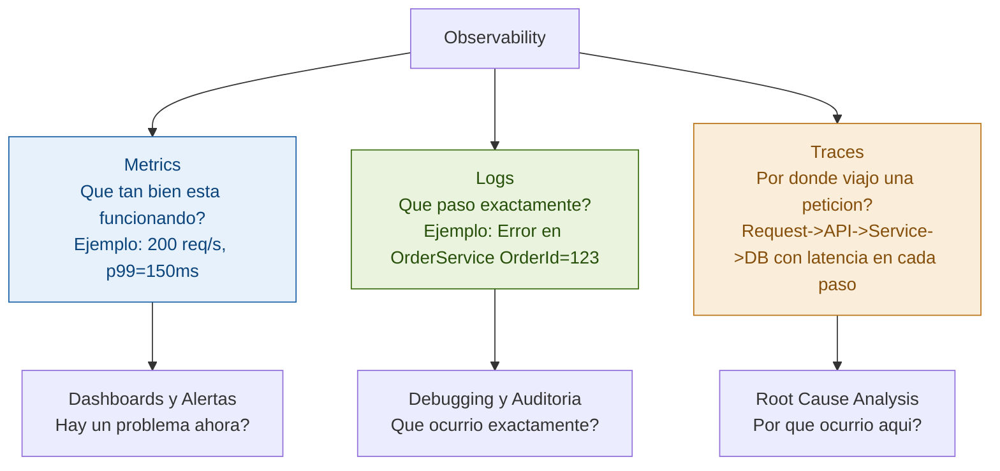
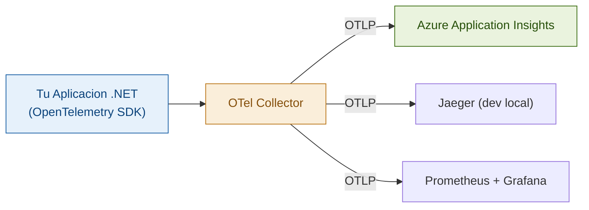
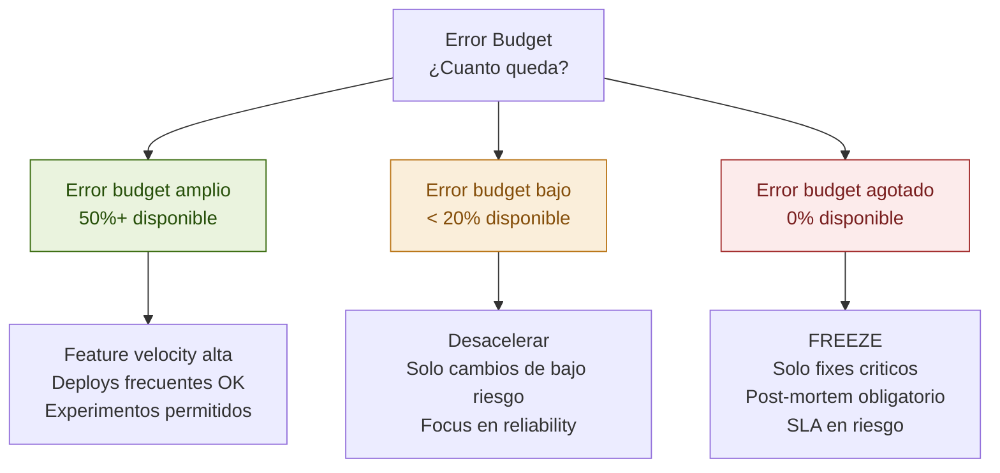
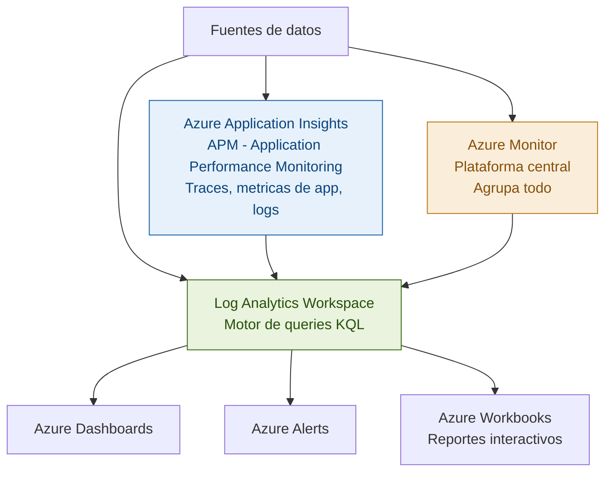
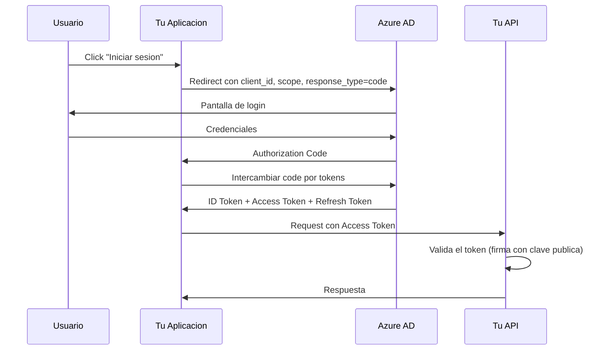
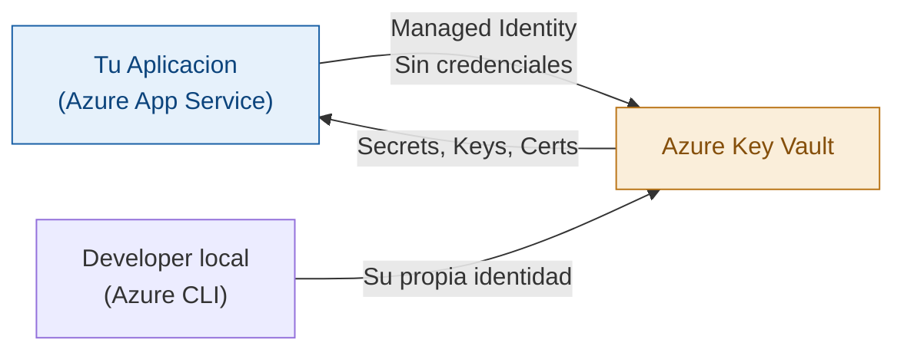
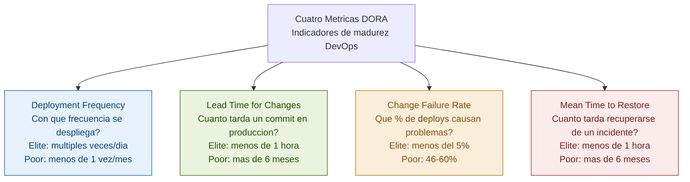
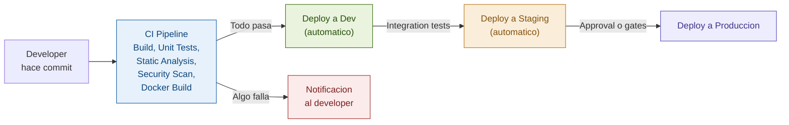
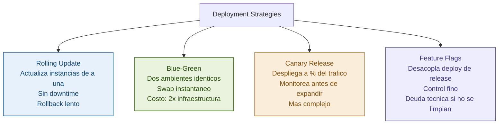

# Guía de Observability, Seguridad y DevOps — Visión de Producción
## Lo que todo Staff Engineer necesita saber para operar sistemas reales

> **Propósito de este documento**
>
> Un Senior Engineer sabe construir sistemas que funcionen en su máquina.
> Un Staff Engineer sabe construir sistemas que funcionen en producción, que fallen de forma
> predecible, que sean seguros por diseño, y que puedan evolucionar sin romper todo.
>
> Esta guía cubre las tres disciplinas que hacen la diferencia:
> - **Observability:** Entender qué está pasando dentro del sistema en producción
> - **Seguridad:** Diseñar sistemas que resistan ataques por defecto, no por suerte
> - **DevOps / CI-CD:** Entregar software con confianza, velocidad y reversibilidad
>
> Al terminar podrás:
> - Implementar los tres pilares de observabilidad (metrics, logs, traces) en .NET/Azure
> - Definir y medir SLOs, SLAs y error budgets como lo hace un SRE
> - Identificar y mitigar las vulnerabilidades OWASP Top 10 en APIs .NET
> - Diseñar una pipeline CI/CD completa para microservicios en Azure DevOps
> - Aplicar threat modeling para evaluar el riesgo de una arquitectura
> - Hablar de estas disciplinas con autoridad en entrevistas de Staff/Architect

---

## Indice General

1. Como estudiar esta guia
2. Observability vs Monitoring
3. Los tres pilares: Metrics, Logs, Traces
4. Metrics en profundidad
5. Logging estructurado
6. Distributed Tracing
7. OpenTelemetry en .NET
8. SLIs, SLOs, SLAs y Error Budgets
9. Azure Monitor y Application Insights
10. Alerting
11. Fundamentos de Seguridad para Arquitectos
12. OWASP Top 10
13. Autenticacion y Autorizacion
14. Secrets Management
15. Threat Modeling
16. Seguridad en APIs
17. Fundamentos de DevOps
18. CI/CD
19. Pipeline CI/CD en Azure DevOps
20. Infrastructure as Code
21. Containerizacion con Docker
22. Kubernetes conceptual
23. Deployment Strategies
24. Feature Flags
25. Preguntas de entrevista
26. Checklist final

---

## 1. Como estudiar esta guia

**Primera semana:** Secciones 2-10 (Observability). Lo mas inmediatamente aplicable.

**Segunda semana:** Secciones 11-16 (Seguridad). Fundamental para produccion.

**Tercera semana:** Secciones 17-24 (DevOps/CI-CD). El contexto operacional.

> Pluralsight — Para Observability:
> **"Monitoring and Observability for Development and DevOps"**
> Complementa las secciones 2-10. Demos en Azure Monitor y Application Insights.

> Pluralsight — Para Seguridad en .NET:
> **"Securing ASP.NET Core 6 with OAuth2 and OpenID Connect"** de Kevin Dockx
> El curso mas completo de auth moderno para .NET. Usalo con las secciones 13-16.

> Pluralsight — Para CI/CD en Azure:
> **"Azure DevOps Fundamentals"** y **"Implementing CI/CD with Azure Pipelines"**
> Usalos con las secciones 18-19.

> Pluralsight — Para contenedores:
> **"Docker and Kubernetes: The Big Picture"** de Nigel Poulton
> Vision conceptual excelente. Usalo antes de leer las secciones 21-22.

> Educative.io — Para IaC:
> **"Infrastructure as Code: Terraform for Beginners"**
> Complementa la seccion 20 con ejercicios practicos.

---

## 2. Observability vs Monitoring

### La intuicion

El **monitoring** es hacerle preguntas predefinidas al sistema: el servidor esta caido, el CPU esta al 90%. Son preguntas que defines antes de saber cual sera el problema.

La **observability** es la capacidad de entender el estado interno del sistema solo a partir de sus outputs externos — logs, metricas, trazas. La diferencia clave: con observability puedes hacer preguntas que nunca habias pensado antes.

**El test de observability:** Si ocurre un problema completamente nuevo en produccion, puedes diagnosticarlo y entender la causa raiz sin deployar nuevo codigo de debugging? Si si, tu sistema es observable.

```
Monitoring tradicional:
"La CPU esta al 95%" -> Alert -> Reiniciamos el servidor -> Problema "resuelto"
-> Sin entender por que subio la CPU. Volvera a pasar.

Observability:
"La CPU esta al 95%" + traces muestran que hay 1000x mas llamadas al endpoint /search
+ logs muestran que todas vienen del mismo user_agent -> un bot
+ metrics muestran que el query de busqueda hace full table scan
-> Entiendes exactamente que paso, por que, y como resolverlo de raiz.
```

### Por que la observability es una habilidad de Staff Engineer

Un Senior sabe hacer que el codigo funcione. Un Staff sabe como el codigo se va a comportar en produccion cuando tiene millones de usuarios, y como va a fallar cuando algo no esperado ocurre.

En entrevistas Staff:
- "Como sabrias si este sistema esta degradado antes de que los usuarios te reporten?"
- "Como encuentras la causa raiz de un error que ocurre en 0.01% de las requests?"
- "Como mides si tu nuevo servicio cumple su SLO?"

---

## 3. Los Tres Pilares de Observability

Los tres pilares son complementarios, no intercambiables:



**La trampa mas comun:** Tener solo logs. Los logs son buenos para investigar un problema especifico, pero son costosos de procesar a escala para tendencias (metricas hacen eso mejor), y no muestran el flujo a traves de multiples servicios (traces hacen eso).

**El flujo de diagnostico ideal:**
1. Metricas alertan que hay un problema (error rate subio al 5%)
2. Traces muestran en que servicio y endpoint esta el problema
3. Logs dan el detalle exacto del error en ese contexto

---

## 4. Metrics — Que Medir y Como

### La intuicion

Las metricas son mediciones numericas del comportamiento del sistema, agregadas en el tiempo. La analogia: los logs son como un diario personal (cada evento registrado), las metricas son como un registro de temperatura diaria (un numero que resume el dia).

### Los cuatro tipos de metricas de Prometheus

**Counter:** Solo puede crecer. Para eventos acumulativos.

```csharp
private static readonly Counter _requestsTotal = Metrics
    .CreateCounter("http_requests_total", "Total HTTP requests",
        new CounterConfiguration
        {
            LabelNames = new[] { "method", "endpoint", "status_code" }
        });

_requestsTotal.WithLabels("GET", "/api/orders", "200").Inc();
```

**Gauge:** Puede subir y bajar. Para valores que representan un estado actual.

```csharp
private static readonly Gauge _activeConnections = Metrics
    .CreateGauge("db_active_connections", "Conexiones activas a la base de datos");

_activeConnections.Set(connectionPool.ActiveCount);
```

**Histogram:** Distribuye observaciones en buckets. El mas util para latencia.

```csharp
private static readonly Histogram _requestDuration = Metrics
    .CreateHistogram("http_request_duration_seconds", "Duracion de requests",
        new HistogramConfiguration
        {
            LabelNames = new[] { "method", "endpoint" },
            Buckets = new[] { 0.005, 0.01, 0.025, 0.05, 0.1, 0.25, 0.5, 1, 2.5, 5, 10 }
        });

using var timer = _requestDuration.WithLabels("GET", "/api/orders").NewTimer();
```

### Los Golden Signals de Google SRE — las 4 metricas que importan

```
1. LATENCIA — Cuanto tiempo tarda en responder?
   Medir p50, p95, p99 — no solo el promedio
   El promedio oculta los percentiles altos
   Un p99 de 5 segundos significa que 1 de cada 100 usuarios espera 5 segundos

2. TRAFICO — Cuantas peticiones por segundo?
   Requests/segundo, mensajes/segundo, bytes/segundo
   La baseline te permite detectar anomalias (spike = posible ataque o viral)

3. ERRORES — Que porcentaje de peticiones falla?
   Error rate = errores / total de requests
   Distinguir entre errores 4xx (cliente) y 5xx (sistema)
   Los errores silenciosos (200 con datos incorrectos) son los mas peligrosos

4. SATURACION — Que tan lleno esta el sistema?
   CPU, memoria, disco, connection pool, queue depth
   Predice problemas antes de que ocurran
```

### USE Method para infraestructura (Brendan Gregg)

Para cada recurso (CPU, disco, red, memoria):
- **U**tilization: que % esta siendo usado?
- **S**aturation: hay trabajo pendiente esperando?
- **E**rrors: cuantos errores estan ocurriendo?

### RED Method para servicios (Tom Wilkie)

Para servicios orientados a requests:
- **R**ate: requests por segundo
- **E**rrors: requests que fallan por segundo
- **D**uration: distribucion de latencia

```csharp
// Golden Signals automaticos en ASP.NET Core
builder.Services.AddMetrics();

app.UseHttpMetrics(options =>
{
    options.RequestDuration.Enabled = true;
    options.RequestCount.Enabled = true;
    options.InProgress.Enabled = true;
});

app.MapMetrics("/metrics");

// Metricas custom de negocio
public class OrderService
{
    private static readonly Counter _ordersCreated = Metrics
        .CreateCounter("orders_created_total", "Total ordenes creadas",
            new CounterConfiguration { LabelNames = new[] { "payment_method", "region" } });

    private static readonly Histogram _orderTime = Metrics
        .CreateHistogram("order_processing_duration_seconds", "Tiempo de procesamiento");

    private static readonly Gauge _pendingOrders = Metrics
        .CreateGauge("orders_pending_count", "Ordenes pendientes");

    public async Task<Order> CreateOrderAsync(CreateOrderRequest request)
    {
        using var timer = _orderTime.NewTimer();
        var order = await ProcessOrderAsync(request);
        _ordersCreated.WithLabels(request.PaymentMethod, request.Region).Inc();
        _pendingOrders.Inc();
        return order;
    }
}
```

---

## 5. Logging Estructurado — Mas alla del Console.WriteLine

### Por que el logging de texto plano es un problema

```csharp
// No hacer esto — dificil de buscar y analizar
_logger.LogError("Error procesando orden 123 del usuario 456: SQL timeout");

// Hacer esto — cada campo es searchable y aggregable
_logger.LogError(
    "Error procesando orden. {OrderId} {UserId} {ErrorType} {Duration}",
    orderId, userId, "SqlTimeout", duration);
```

### Serilog — el estandar de facto en .NET

```csharp
// Program.cs
Log.Logger = new LoggerConfiguration()
    .MinimumLevel.Information()
    .MinimumLevel.Override("Microsoft", LogEventLevel.Warning)
    .Enrich.FromLogContext()
    .Enrich.WithMachineName()
    .Enrich.WithEnvironmentName()
    .Enrich.WithCorrelationId()
    .WriteTo.Console(new JsonFormatter())
    .WriteTo.ApplicationInsights(
        TelemetryConfiguration.Active,
        TelemetryConverter.Traces)
    .CreateLogger();

builder.Host.UseSerilog();
```

```csharp
// Uso correcto del logging estructurado
public async Task<Order> CreateOrderAsync(CreateOrderRequest request)
{
    using var logScope = _logger.BeginScope(new Dictionary<string, object>
    {
        ["UserId"] = request.UserId,
        ["CorrelationId"] = request.CorrelationId,
        ["Operation"] = "CreateOrder"
    });

    _logger.LogInformation(
        "Iniciando creacion de orden. Items: {ItemCount}, Total: {Total:C}",
        request.Items.Count, request.EstimatedTotal);

    try
    {
        var order = await ProcessAsync(request);
        _logger.LogInformation(
            "Orden creada. OrderId: {OrderId}, Duration: {DurationMs}ms",
            order.Id, stopwatch.ElapsedMilliseconds);
        return order;
    }
    catch (InsufficientInventoryException ex)
    {
        // Errores de negocio son Warning — no son bugs
        _logger.LogWarning(
            "Inventario insuficiente. ProductId: {ProductId}, Requested: {Requested}",
            ex.ProductId, ex.RequestedQuantity);
        throw;
    }
    catch (Exception ex)
    {
        // Errores inesperados son Error
        _logger.LogError(ex, "Error inesperado al crear orden. Request: {@Request}", request);
        throw;
    }
}
```

### Niveles de logging — cuando usar cada uno

| Nivel | Cuando usar | En produccion |
|---|---|---|
| **Trace** | Flujo detallado paso a paso | NUNCA — demasiado verboso |
| **Debug** | Info util para debugging | Solo en dev o diagnostico temporal |
| **Information** | Eventos normales del negocio | Si — flujo feliz e hitos importantes |
| **Warning** | Algo inesperado pero el sistema sigue | Si — errores de negocio, reintentos |
| **Error** | Un error rompe la operacion actual | Si — debe generar alerta |
| **Critical** | El sistema no puede continuar | Si — alerta inmediata |

**Alert fatigue:** Si todo es Error cuando deberia ser Warning, las alertas reales se pierden en el ruido.

### Correlation IDs — el hilo que conecta los logs

```csharp
// Middleware para agregar/propagar Correlation ID
public class CorrelationIdMiddleware : IMiddleware
{
    public async Task InvokeAsync(HttpContext context, RequestDelegate next)
    {
        var correlationId = context.Request.Headers["X-Correlation-ID"].FirstOrDefault()
                         ?? Guid.NewGuid().ToString("N");

        context.Response.Headers["X-Correlation-ID"] = correlationId;

        using (LogContext.PushProperty("CorrelationId", correlationId))
        using (LogContext.PushProperty("RequestPath", context.Request.Path))
        {
            await next(context);
        }
    }
}

// Al llamar a otros servicios, propagar el Correlation ID
public class HttpServiceClient
{
    public async Task<T> GetAsync<T>(string url)
    {
        var correlationId = _httpContextAccessor.HttpContext?
            .Request.Headers["X-Correlation-ID"].FirstOrDefault();
        _httpClient.DefaultRequestHeaders.TryAddWithoutValidation("X-Correlation-ID", correlationId);
        return await _httpClient.GetFromJsonAsync<T>(url);
    }
}
```

---

## 6. Distributed Tracing — Seguir una Peticion

### La intuicion

En microservicios, cuando el usuario experimenta lentitud, donde esta el problema? El Distributed Tracing responde creando un "arbol" de spans que muestra cada operacion, en que servicio ocurrio, cuanto tardo cada uno.

```
Trace completo de "Crear orden":
--- POST /api/orders [245ms total]
    +-- Auth validation [3ms]
    +-- OrderService.CreateOrder [240ms]
        +-- InventoryService.Reserve [45ms]
        |   +-- DB query: SELECT inventory WHERE... [40ms]  <- AQUI el problema
        +-- PaymentService.Process [150ms]
        |   +-- HTTP call: payment-gateway.com [145ms]
        +-- DB INSERT order [10ms]
```

### Conceptos clave

**Trace:** El arbol completo de la peticion, con un Trace ID unico.

**Span:** Una operacion individual dentro del trace con:
- Nombre de la operacion
- Timestamp de inicio y fin
- Atributos (metadata)
- Status (OK, Error)
- Parent Span ID

**Context Propagation:** Como el Trace ID viaja entre servicios via HTTP headers:
```
W3C Trace Context (el estandar):
traceparent: 00-4bf92f3577b34da6a3ce929d0e0e4736-00f067aa0ba902b7-01
```

---

## 7. OpenTelemetry en .NET — El Estandar que Unifica Todo

### Por que OpenTelemetry importa

Antes de OTel, cada vendor (Datadog, New Relic, Application Insights) tenia su propio SDK. Cambiar de vendor significaba reescribir todo el codigo de instrumentacion.

OpenTelemetry separa:
- **Instrumentacion** (el codigo que genera telemetria) — en tu aplicacion
- **Exportador** (a donde va la telemetria) — configurable sin cambiar el codigo



### Implementacion completa en ASP.NET Core

```csharp
// Packages:
// OpenTelemetry.Extensions.Hosting
// OpenTelemetry.Instrumentation.AspNetCore
// OpenTelemetry.Instrumentation.Http
// OpenTelemetry.Instrumentation.SqlClient
// Azure.Monitor.OpenTelemetry.AspNetCore

builder.Services.AddOpenTelemetry()
    .ConfigureResource(resource => resource
        .AddService(serviceName: "OrderService", serviceVersion: "1.5.0"))

    .WithTracing(tracing => tracing
        .AddAspNetCoreInstrumentation(options =>
        {
            options.RecordException = true;
            // No trazar health checks — ruido sin valor
            options.Filter = (httpContext) =>
                !httpContext.Request.Path.StartsWithSegments("/health");
        })
        .AddHttpClientInstrumentation()
        .AddSqlClientInstrumentation(options =>
        {
            options.SetDbStatementForText = true;
            options.RecordException = true;
        })
        .AddSource("OrderService.*")
        .AddAzureMonitorTraceExporter())

    .WithMetrics(metrics => metrics
        .AddAspNetCoreInstrumentation()
        .AddHttpClientInstrumentation()
        .AddRuntimeInstrumentation()
        .AddMeter("OrderService.Metrics")
        .AddPrometheusExporter()
        .AddAzureMonitorMetricExporter());

builder.Logging.AddOpenTelemetry(logging =>
{
    logging.AddAzureMonitorLogExporter();
});
```

### Instrumentacion manual

```csharp
public class OrderService
{
    private static readonly ActivitySource ActivitySource =
        new ActivitySource("OrderService.Orders", "1.0.0");

    private static readonly Meter Meter =
        new Meter("OrderService.Metrics", "1.0.0");

    private static readonly Counter<long> _ordersCreated =
        Meter.CreateCounter<long>("orders_created_total");

    private static readonly Histogram<double> _processingTime =
        Meter.CreateHistogram<double>("order_processing_duration_ms", unit: "ms");

    public async Task<Order> CreateOrderAsync(CreateOrderRequest request)
    {
        using var activity = ActivitySource.StartActivity("CreateOrder");
        activity?.SetTag("order.user_id", request.UserId);
        activity?.SetTag("order.items_count", request.Items.Count);

        var sw = Stopwatch.StartNew();
        try
        {
            var order = await ProcessOrderAsync(request);
            activity?.SetTag("order.id", order.Id);
            activity?.SetStatus(ActivityStatusCode.Ok);
            _ordersCreated.Add(1, new TagList { ["region"] = request.Region });
            return order;
        }
        catch (Exception ex)
        {
            activity?.SetStatus(ActivityStatusCode.Error, ex.Message);
            activity?.RecordException(ex);
            throw;
        }
        finally
        {
            _processingTime.Record(sw.ElapsedMilliseconds,
                new TagList { ["region"] = request.Region });
        }
    }
}
```

> Pluralsight ahora: **"Monitoring and Observability for Development and DevOps"**. Su modulo de OpenTelemetry en .NET complementa exactamente lo que acabas de leer con demos hands-on.

---

## 8. SLIs, SLOs, SLAs y Error Budgets

### El framework de Google SRE

**SLI (Service Level Indicator):** Una medicion especifica del comportamiento.
```
Ejemplos:
- % de requests respondidas en < 200ms
- % de requests que retornan 2xx
- requests exitosas por segundo
```

**SLO (Service Level Objective):** El objetivo de confiabilidad.
```
Ejemplos:
- "El 99.9% de requests al checkout deben responder en < 500ms"
- "El 99.95% de requests deben ser exitosas (no 5xx)"
- "Disponibilidad del 99.9% mensual"
```

**SLA (Service Level Agreement):** El contrato legal con el cliente. Generalmente mas laxo que el SLO interno porque si se viola hay consecuencias contractuales.

**Error Budget:** El tiempo o porcentaje de "fallas permitidas" dado un SLO.

```
SLO: 99.9% de disponibilidad mensual
Un mes = 43,800 minutos
Error budget = (1 - 0.999) x 43,800 = ~43.8 minutos de downtime permitido/mes

Si llevas 30 minutos de downtime, te quedan 13.8 minutos.
Si el proximo deploy causa 20 minutos mas -> VIOLAS el SLO.
El error budget detiene los deploys cuando se agota.
```

### Como usar el Error Budget para decisiones



**El error budget como herramienta de conversacion:** Cuando un manager presiona para deployar algo riesgoso, la respuesta ya no es intuicion — es "tenemos 8 minutos de error budget y este deploy tiene 30% de probabilidad de causar 15 minutos de degradacion".

### Implementar SLO tracking en Application Insights

```csharp
public class SloTrackingMiddleware : IMiddleware
{
    private readonly TelemetryClient _telemetry;

    public async Task InvokeAsync(HttpContext context, RequestDelegate next)
    {
        var sw = Stopwatch.StartNew();
        await next(context);
        sw.Stop();

        var isSuccess = context.Response.StatusCode < 500;
        var isFast = sw.ElapsedMilliseconds < 500; // SLO: p99 < 500ms

        _telemetry.TrackMetric("slo.availability",
            isSuccess ? 1.0 : 0.0,
            new Dictionary<string, string>
            {
                ["endpoint"] = context.Request.Path,
                ["status_code"] = context.Response.StatusCode.ToString()
            });
    }
}
```

```kusto
// KQL — calcular SLO de disponibilidad de los ultimos 30 dias
customMetrics
| where name == "slo.availability"
| where timestamp > ago(30d)
| summarize
    total_requests = count(),
    successful_requests = countif(value == 1.0)
| extend
    availability_slo = round(successful_requests * 100.0 / total_requests, 3),
    error_budget_used_pct = round((1 - successful_requests * 1.0 / total_requests) * 100 / 0.1, 1)
// Si error_budget_used_pct > 100: violaste el SLO del mes
```

---

## 9. Azure Monitor y Application Insights

### El ecosistema de observabilidad en Azure



### KQL — Kusto Query Language

```kusto
// Error rate por endpoint — ultimas 24 horas
requests
| where timestamp > ago(24h)
| where cloud_RoleName == "OrderService"
| summarize
    total = count(),
    errors = countif(resultCode >= "500"),
    p50_ms = percentile(duration, 50),
    p99_ms = percentile(duration, 99)
    by name, bin(timestamp, 1h)
| extend error_rate = round(errors * 100.0 / total, 2)
| where error_rate > 1
| order by error_rate desc
```

```kusto
// Ver todos los eventos de un trace especifico (distributed trace completo)
union requests, dependencies, traces, exceptions
| where operation_Id == "4bf92f3577b34da6a3ce929d0e0e4736"
| order by timestamp asc
| project timestamp, itemType, name, duration, success, message
```

```kusto
// Detectar dias con error rate inusualmente alto
requests
| where timestamp > ago(30d)
| summarize
    daily_errors = countif(resultCode >= "500"),
    daily_total = count()
    by bin(timestamp, 1d)
| extend daily_error_rate = daily_errors * 100.0 / daily_total
| extend avg_rate = avg(daily_error_rate)
| extend is_anomaly = daily_error_rate > 2 * avg_rate
| where is_anomaly
```

### Application Insights en .NET

```csharp
builder.Services.AddApplicationInsightsTelemetry(options =>
{
    options.ConnectionString = builder.Configuration["ApplicationInsights:ConnectionString"];
    options.EnableAdaptiveSampling = true;
    options.EnableQuickPulseMetricStream = true; // Live metrics en tiempo real
});

// Inicializer — agregar contexto a toda la telemetria
public class CustomTelemetryInitializer : ITelemetryInitializer
{
    public void Initialize(ITelemetry telemetry)
    {
        telemetry.Context.GlobalProperties["Environment"] =
            Environment.GetEnvironmentVariable("ASPNETCORE_ENVIRONMENT");
        telemetry.Context.GlobalProperties["Version"] =
            Assembly.GetExecutingAssembly().GetName().Version?.ToString();
    }
}
```

---

## 10. Alerting — Cuando Despertar a Alguien a las 3am

### El principio fundamental

**Solo alertar cuando se requiere accion humana inmediata.**

Si tu sistema genera 50 alertas al dia y el equipo las ignora porque "siempre hay alertas", tienes alert fatigue. La alerta real importante se pierde en el ruido.

**Alertar sobre sintomas del usuario, no sobre causas:**

```
MAL: "CPU al 90%"
     - No necesariamente afecta al usuario
     - Puede ser un job de mantenimiento legitimo
     - No requiere accion inmediata si el sistema responde bien

BIEN: "Error rate > 2% en los ultimos 5 minutos en /api/checkout"
     - El usuario esta siendo afectado directamente
     - Requiere investigacion inmediata
     - Tiene contexto claro sobre que investigar
```

### Los cuatro sintomas que siempre deben generar alerta

```
1. Error rate elevado:
   error_rate > 2% por 5 minutos
   -> Usuarios experimentando errores

2. Latencia elevada (percentil alto):
   p99_latency > 2000ms por 5 minutos
   -> Usuarios experimentando lentitud

3. Error budget casi agotado:
   error_budget_consumed > 80% del mes
   -> En riesgo de violar el SLO

4. Servicio no disponible:
   health_check_failing por 2 minutos
   -> Posible downtime completo
```

### Runbooks — que hacer cuando llega una alerta

Cada alerta debe tener un runbook: una guia de pasos para investigar y resolver. Sin runbook, la alerta llega a las 3am y el ingeniero de turno no sabe que hacer.

```markdown
# Runbook: Alta tasa de errores en OrderService

## Senales de activacion
- Error rate > 2% por > 5 minutos en /api/orders

## Diagnostico inicial (< 5 minutos)
1. Abrir Application Insights -> Live Metrics -> buscar spikes
2. KQL: exceptions | where timestamp > ago(10m) | summarize count() by type
3. Ver si hay deploys recientes: Azure DevOps -> Release history

## Causas comunes
- SQL timeout: revisar queries lentos en SQL Insights
- Dependency failure: ver que servicio externo esta fallando
- OOM: escalar instancias o revisar memory leak

## Escalacion
- Si no se resuelve en 30 min: escalar al lead del equipo
- Si hay degradacion de datos: involucrar al DBA inmediatamente
- Si el error budget se agota: congelar deploys, notificar al PM
```

---

## 11. Fundamentos de Seguridad para Arquitectos

### Security by Design

La seguridad que se agrega al final es cara, fragil e incompleta. La seguridad por diseno es parte del proceso de arquitectura desde el inicio.

**El triangulo CIA:**
- **Confidencialidad:** Solo autorizados pueden ver los datos
- **Integridad:** Los datos no son modificados sin autorizacion
- **Disponibilidad:** El sistema esta disponible cuando se necesita

### Principios fundamentales

**Principle of Least Privilege:** Cada componente tiene solo los permisos minimos necesarios.

```csharp
// MAL — conexion a DB con permisos de administrador
"Server=db;Database=OrdersDB;User=sa;Password=admin123"

// BIEN — usuario de aplicacion con permisos minimos
// El usuario 'orders_app' solo puede: SELECT, INSERT, UPDATE en sus tablas
// No puede: DROP, CREATE, acceder a otras bases de datos
```

**Defense in Depth:** Multiples capas de seguridad. Si una falla, las otras contienen el dano.

```
Capa 1: WAF — bloquea ataques conocidos en el borde
Capa 2: API Gateway — rate limiting, autenticacion de API keys
Capa 3: JWT Validation — autenticacion del usuario
Capa 4: Authorization Policies — control de acceso
Capa 5: Input Validation — sanitizacion de datos
Capa 6: Parameterized Queries — prevencion de SQL Injection
Capa 7: Audit Logging — registro de acciones sensibles
Capa 8: Encryption at Rest — datos encriptados en la DB
```

**Zero Trust Architecture:** No confiar en nada por default, ni siquiera el trafico interno. Verificar identidad y autorizacion en cada operacion, incluso entre microservicios.

**Fail Secure:** Cuando el sistema falla, fallar en el estado mas seguro. Si no puedes verificar el permiso, deniega el acceso.

---

## 12. OWASP Top 10

OWASP publica periodicamente los 10 tipos de vulnerabilidades mas criticas. Conocerlos es obligatorio para cualquier developer que construye APIs.

### A01: Broken Access Control — el mas critico

```csharp
// VULNERABLE — cualquier usuario autenticado puede ver cualquier orden
[HttpGet("orders/{orderId}")]
public async Task<IActionResult> GetOrder(int orderId)
{
    var order = await db.Orders.FindAsync(orderId);
    return Ok(order); // Sin verificar que es del usuario actual!
}

// SEGURO — verificar que el recurso pertenece al usuario
[HttpGet("orders/{orderId}")]
[Authorize]
public async Task<IActionResult> GetOrder(int orderId)
{
    var userId = User.GetUserId(); // Del JWT
    var order = await db.Orders
        .Where(o => o.OrderId == orderId && o.UserId == userId) // Filtro critico
        .FirstOrDefaultAsync();

    if (order == null)
        return NotFound(); // No revelar si existe para otro usuario

    return Ok(order);
}
```

### A02: Cryptographic Failures

```csharp
// NUNCA — MD5 o SHA1 para contrasenas
user.PasswordHash = MD5.HashData(Encoding.UTF8.GetBytes(password));

// BIEN — bcrypt/Argon2 (lentos por diseno — hace brute force costoso)
var passwordHasher = new PasswordHasher<User>();
user.PasswordHash = passwordHasher.HashPassword(user, password);

// NUNCA loggear datos sensibles
_logger.LogInformation("Login: {email} {password}", email, password);

// BIEN
_logger.LogInformation("Login exitoso. UserId: {UserId}", user.Id);

// Datos sensibles NUNCA en URLs (aparecen en logs del servidor)
// GET /api/users?ssn=123-45-6789  <- MAL
// POST /api/users/verify Body: { "ssn": "..." } <- BIEN
```

**Datos que siempre deben encriptarse:**
- Contrasenas: hasheadas con bcrypt/Argon2, nunca reversible
- Datos de tarjeta: usar tokenizacion (Stripe, Azure Payment Processing)
- Datos en reposo: Azure SQL TDE habilitado por default
- Datos en transito: TLS 1.2+ obligatorio, nunca HTTP en produccion

### A03: Injection — SQL, Command, LDAP

```csharp
// VULNERABLE a SQL Injection
var query = $"SELECT * FROM Orders WHERE CustomerId = '{userId}'";
// Si userId = "'; DROP TABLE Orders; --" ejecuta la inyeccion

// SEGURO — EF Core siempre usa parametros, nunca vulnerable
var orders = await context.Orders
    .Where(o => o.CustomerId == userId)
    .ToListAsync();

// Con ADO.NET — parametros explícitos
using var cmd = connection.CreateCommand();
cmd.CommandText = "SELECT * FROM Orders WHERE CustomerId = @CustomerId";
cmd.Parameters.AddWithValue("@CustomerId", userId); // NUNCA concatenar

// VULNERABLE a Command Injection
var filename = Request.Form["filename"];
Process.Start("bash", $"-c 'cat /uploads/{filename}'");
// Si filename = "../etc/passwd" -> expone el sistema

// SEGURO — validar antes de usar
if (!Regex.IsMatch(filename, @"^[a-zA-Z0-9\-_]+\.(pdf|jpg|png)$"))
    return BadRequest("Nombre de archivo invalido");
```

### A04: Insecure Design — problemas de arquitectura

El mas relevante para un Staff Engineer. No es un bug de codigo — es un diseno que no considera la seguridad.

```
Ejemplos de insecure design:
- Sistema de recuperacion de contrasenas que envia la contrasena actual por email
  (si puedes recuperarla, no esta bien hasheada)
- API que acepta user_id en el body en lugar del JWT
  (el cliente no deberia poder elegir su propio user_id)
- Sistema de pagos sin audit log
  (no puedes investigar fraudes si no registras quien hizo que)
- Carga de archivos que solo valida la extension, no el contenido real
```

### A05: Security Misconfiguration

```csharp
// MAL — configuraciones por defecto en produccion
app.UseDeveloperExceptionPage(); // Expone stack traces al usuario

// BIEN
if (app.Environment.IsDevelopment())
    app.UseDeveloperExceptionPage();
else
    app.UseExceptionHandler("/error");

// Remover headers que revelan info del stack
app.Use(async (context, next) =>
{
    context.Response.Headers.Remove("X-Powered-By");
    context.Response.Headers.Remove("Server");
    context.Response.Headers["X-Content-Type-Options"] = "nosniff";
    context.Response.Headers["X-Frame-Options"] = "DENY";
    context.Response.Headers["Content-Security-Policy"] = "default-src 'self'";
    await next();
});
```

### A06: Vulnerable Components

```bash
# Verificar vulnerabilidades en paquetes NuGet
dotnet list package --vulnerable
dotnet list package --outdated

# En GitHub Actions
- name: Scan vulnerable packages
  uses: github/codeql-action/analyze@v3
```

### A07: Authentication Failures

```csharp
// MAL — tokens JWT sin expiracion
var token = new JwtSecurityToken(signingCredentials: creds);
// Sin expires! El token vive para siempre

// BIEN — tokens con expiracion corta + refresh tokens
var accessToken = new JwtSecurityToken(
    issuer: "https://auth.myapp.com",
    audience: "https://api.myapp.com",
    claims: userClaims,
    expires: DateTime.UtcNow.AddMinutes(15), // 15 minutos
    signingCredentials: signingCredentials
);
// Refresh token: larga duracion, almacenado en DB, puede revocarse

// MAL — sin rate limiting en login (permite brute force)
[HttpPost("auth/login")]
public async Task<IActionResult> Login(LoginRequest request)
{
    // Sin control de reintentos -> atacante puede probar millones de contrasenas
}

// BIEN
[HttpPost("auth/login")]
[RateLimit(permitLimit: 5, window: 60)] // 5 intentos por minuto por IP
public async Task<IActionResult> Login(LoginRequest request)
{
    var failures = await GetRecentFailedAttempts(request.Email);
    if (failures >= 10)
        return StatusCode(429, "Demasiados intentos. Espera 15 minutos.");
}
```

### A08-A10: Otros ataques importantes

**A08 - Integridad de datos:**
```csharp
// Validar que los datos deserializados son lo que esperas
public record CreateOrderRequest
{
    [Required][StringLength(50)] public string CustomerId { get; init; }
    [Required][Range(1, 100)] public int Quantity { get; init; }
    // NUNCA incluir campos que el usuario no deberia poder establecer:
    // public string Status  <- el servidor establece esto
    // public decimal Total  <- el servidor calcula esto
}
```

**A09 - Logging de seguridad:** Siempre loggear: intentos de login, permission denied, exports masivos.

**A10 - SSRF (Server-Side Request Forgery):**
```csharp
// VULNERABLE — el atacante puede enviar URLs internas
[HttpPost("fetch-image")]
public async Task<IActionResult> FetchImage([FromBody] string imageUrl)
{
    var content = await httpClient.GetAsync(imageUrl);
    // http://169.254.169.254/metadata -> metadata del servidor con credenciales!
}

// SEGURO — validar dominio antes de hacer el request
[HttpPost("fetch-image")]
public async Task<IActionResult> FetchImage([FromBody] string imageUrl)
{
    if (!Uri.TryCreate(imageUrl, UriKind.Absolute, out var uri))
        return BadRequest("URL invalida");

    var allowedHosts = new[] { "images.myapp.com", "cdn.myapp.com" };
    if (!allowedHosts.Contains(uri.Host))
        return BadRequest("Dominio no permitido");

    if (IsPrivateIpAddress(uri.Host))
        return BadRequest("IPs privadas no permitidas");

    var content = await httpClient.GetAsync(uri);
    return Ok(await content.Content.ReadAsStringAsync());
}
```

---

## 13. Autenticacion y Autorizacion a Profundidad

### AuthN vs AuthZ

**Autenticacion (AuthN):** Quien eres? — Verificar identidad.
**Autorizacion (AuthZ):** Que puedes hacer? — Verificar permisos.

### JWT — JSON Web Tokens a profundidad

```
JWT tiene tres partes separadas por puntos:
eyJhbGciOiJSUzI1NiJ9.eyJzdWIiOiJ1c2VyMTIzIn0.SIGNATURE

Header: { "alg": "RS256", "typ": "JWT" }
        RS256 (asimetrico) es mas seguro que HS256 (simetrico)

Payload: {
  "sub": "user123",
  "email": "carlos@empresa.com",
  "roles": ["OrderManager"],
  "iss": "https://auth.myapp.com",    // Issuer
  "aud": "https://api.myapp.com",     // Audience
  "iat": 1715000000,                  // Issued At
  "exp": 1715000900                   // Expiration (15 min)
}

IMPORTANTE: El payload es solo Base64, no encriptado.
NUNCA pongas datos sensibles en el JWT.
El JWT garantiza integridad (no fue modificado), no confidencialidad.
```

### OAuth2 y OpenID Connect



### Implementacion en ASP.NET Core

```csharp
// JWT Bearer Authentication
builder.Services
    .AddAuthentication(JwtBearerDefaults.AuthenticationScheme)
    .AddJwtBearer(options =>
    {
        options.Authority = "https://login.microsoftonline.com/{tenant-id}/v2.0";
        options.Audience = "api://my-api-client-id";
        options.TokenValidationParameters = new TokenValidationParameters
        {
            ValidateIssuer = true,
            ValidateAudience = true,
            ValidateLifetime = true,
            ValidateIssuerSigningKey = true,
            ClockSkew = TimeSpan.FromMinutes(1)
        };
    });

// Autorizacion con politicas
builder.Services.AddAuthorization(options =>
{
    options.AddPolicy("CanManageOrders", policy =>
        policy.RequireAuthenticatedUser()
              .RequireClaim("scope", "orders.write")
              .RequireRole("OrderManager", "Admin"));

    options.AddPolicy("CanViewReports", policy =>
        policy.RequireAuthenticatedUser()
              .RequireAssertion(ctx =>
                  ctx.User.HasClaim("department", "Finance") ||
                  ctx.User.IsInRole("Director")));
});
```

```csharp
// Resource-based authorization — para un recurso especifico
public class OrderAuthorizationHandler : AuthorizationHandler<OwnerRequirement, Order>
{
    protected override Task HandleRequirementAsync(
        AuthorizationHandlerContext context,
        OwnerRequirement requirement,
        Order resource)
    {
        var userId = context.User.GetUserId();
        if (resource.UserId == userId || context.User.IsInRole("Admin"))
            context.Succeed(requirement);
        return Task.CompletedTask;
    }
}

[HttpGet("orders/{id}")]
public async Task<IActionResult> GetOrder(int id)
{
    var order = await db.Orders.FindAsync(id);
    if (order == null) return NotFound();

    var authResult = await _authorizationService
        .AuthorizeAsync(User, order, "OrderOwner");

    if (!authResult.Succeeded) return Forbid();
    return Ok(order);
}
```

> Pluralsight ahora: **"Securing ASP.NET Core 6 with OAuth2 and OpenID Connect"** de Kevin Dockx. Es el recurso mas completo de auth moderno en .NET con demos hands-on de Azure AD.

---

## 14. Secrets Management — Nunca un Secreto en el Codigo

### El problema

Un secreto en el codigo fuente es una brecha garantizada:
- Git mantiene el historial — aunque lo remueves, sigue ahi
- El repo puede hacerse publico accidentalmente
- Cualquier developer con acceso al repo tiene acceso al secreto de produccion
- No puedes rotar el secreto sin cambiar el codigo

### Azure Key Vault con Managed Identity



**Managed Identity:** En lugar de que tu aplicacion tenga credenciales para acceder a Key Vault, tiene una identidad de Azure AD asignada. Azure verifica que es la aplicacion correcta sin credenciales que puedan ser robadas.

```csharp
// appsettings.json — NO poner secretos aqui
{
  "KeyVault": {
    "Uri": "https://myapp-kv.vault.azure.net/"
    // Solo la URI — el acceso esta controlado por RBAC de Azure
  }
}

// Program.cs — cargar secretos desde Key Vault al startup
builder.Configuration.AddAzureKeyVault(
    new Uri(builder.Configuration["KeyVault:Uri"]),
    new DefaultAzureCredential()); // Managed Identity en Azure, Azure CLI en local

// En desarrollo local — .NET User Secrets (nunca commitear)
dotnet user-secrets set "ConnectionStrings:Database" "Server=localhost;..."

// El codigo es identico en ambos ambientes
var connectionString = builder.Configuration["ConnectionStrings:Database"];
// Azure: viene de Key Vault. Local: viene de User Secrets.
```

```csharp
// Acceder a secretos en tiempo de ejecucion (para rotacion dinamica)
public class PaymentService
{
    private readonly SecretClient _secretClient;

    public async Task ProcessPaymentAsync(PaymentRequest request)
    {
        // Si el API key se rota, el proximo request usa el nuevo key
        // sin necesidad de redesplegar
        var apiKeySecret = await _secretClient.GetSecretAsync("PaymentGateway-ApiKey");
        var apiKey = apiKeySecret.Value.Value;
        await CallPaymentGatewayAsync(request, apiKey);
    }
}
```

### Lo que NUNCA debe estar en el codigo

```
NO:   Connection strings de base de datos
NO:   API keys de servicios externos (Stripe, Twilio, SendGrid)
NO:   JWT signing keys y certificates
NO:   OAuth client secrets
NO:   SSH private keys
NO:   Encryption keys

SI:   URLs publicas de endpoints
SI:   Nombres de recursos Azure (sin credenciales)
SI:   Feature flags
SI:   Configuracion no sensible
```

---

## 15. Threat Modeling — Pensar Como el Atacante

### La intuicion

Threat modeling identifica sistematicamente los posibles ataques antes de construir el sistema o hacer cambios significativos. Es mas barato encontrar una vulnerabilidad en el diseno que en produccion.

### El framework STRIDE

```
S - Spoofing (Suplantacion)
    Atacante se hace pasar por otro usuario o sistema
    Contra-medidas: AuthN fuerte, mTLS entre servicios, JWT firmado

T - Tampering (Manipulacion)
    Atacante modifica datos en transito o en reposo
    Contra-medidas: HTTPS, firmas digitales, checksums, audit logs

R - Repudiation (Repudio)
    Atacante niega haber realizado una accion
    Contra-medidas: Audit logs con firma digital, non-repudiable event logs

I - Information Disclosure (Divulgacion de informacion)
    Atacante accede a datos que no deberia ver
    Contra-medidas: Autorizacion, encriptacion, data masking en logs

D - Denial of Service (Negacion de servicio)
    Atacante hace que el sistema no este disponible
    Contra-medidas: Rate limiting, WAF, CDN, circuit breakers

E - Elevation of Privilege (Escalacion de privilegios)
    Atacante obtiene mas permisos de los que deberia
    Contra-medidas: Least privilege, RBAC, access reviews regulares
```

### El proceso en 4 pasos

```
1. MODELAR el sistema
   Dibujar el diagrama de flujo de datos (DFD)
   Identificar todos los componentes, interacciones y datos
   Marcar los limites de confianza (trust boundaries)

2. IDENTIFICAR amenazas
   Por cada componente e interaccion, aplicar STRIDE
   "Que haria un atacante aqui?"
   No filtrar por probabilidad todavia — listar todo

3. MITIGAR amenazas
   Por cada amenaza: como la prevenimos?
   Si no podemos prevenirla: como la detectamos?
   Si no podemos detectarla: cual es el impacto si ocurre?

4. VALIDAR
   Las mitigaciones son suficientes?
   Hay amenazas que aceptamos con justificacion documentada?
```

### Ejemplo: Threat Model de una API de pagos

| Amenaza | Descripcion | Mitigacion |
|---|---|---|
| **Spoofing** | Atacante suplanta a otro usuario | JWT con firma RS256, validar sub claim |
| **Tampering** | Modificar monto del pago en transito | HTTPS (TLS) — integridad garantizada |
| **Repudiation** | Usuario niega haber hecho un pago | Audit log inmutable con timestamp |
| **Info Disclosure** | Respuesta expone datos de tarjeta | Tokenizacion — nunca devolver PAN completo |
| **DoS** | Flood de requests de pago | Rate limiting: 10 pagos/minuto por usuario |
| **EoP** | Usuario normal accede a pagos de otros | IDOR prevention: filtrar por userId del JWT |

---

## 16. Seguridad en APIs y Comunicacion entre Servicios

### mTLS — autenticacion mutua entre microservicios

En microservicios, no solo el cliente autentica al servidor — el servidor tambien autentica al cliente. Previene que un servicio comprometido llame a cualquier otro servicio interno.

```
Flujo mTLS entre OrderService e InventoryService:
1. OrderService inicia conexion -> presenta su certificado
2. InventoryService verifica el certificado de OrderService
3. InventoryService presenta su certificado -> OrderService lo verifica
4. Solo si ambas verificaciones pasan: comunicacion establecida

En Azure: Azure Service Bus con Managed Identity logra esto sin gestionar certificados.
En K8s: Istio o Linkerd service mesh lo hace automaticamente.
```

### Input Validation

```csharp
public record CreateOrderRequest
{
    [Required(ErrorMessage = "El CustomerId es requerido")]
    [StringLength(50, MinimumLength = 1)]
    [RegularExpression(@"^[a-zA-Z0-9\-]+$")]
    public string CustomerId { get; init; }

    [Required]
    [Range(1, 1000)]
    public int Quantity { get; init; }

    [Required]
    [Range(0.01, 99999.99)]
    public decimal UnitPrice { get; init; }
}

// FluentValidation — validaciones complejas de negocio
public class CreateOrderValidator : AbstractValidator<CreateOrderRequest>
{
    public CreateOrderValidator()
    {
        RuleFor(x => x.CustomerId).NotEmpty().MaximumLength(50);
        RuleFor(x => x.Quantity).GreaterThan(0).LessThanOrEqualTo(1000);

        // Validacion de negocio asincrona
        RuleFor(x => x)
            .MustAsync(async (request, ct) =>
            {
                var creditLimit = await creditService.GetLimitAsync(request.CustomerId);
                return (request.Quantity * request.UnitPrice) <= creditLimit;
            })
            .WithMessage("El total excede el limite de credito");
    }
}
```

---

## 17. Fundamentos de DevOps — La Cultura Antes que las Herramientas

### Que es DevOps realmente

DevOps no es un conjunto de herramientas — es una cultura que elimina la pared entre Desarrollo y Operaciones. El equipo que construye el software tambien es responsable de operarlo en produccion.

### Las cuatro metricas de DORA



Estas metricas son el resultado de decisiones de arquitectura y proceso. Un sistema con coupling fuerte, sin tests automatizados, y con deployments complejos tendra Deployment Frequency baja — sin importar que herramientas uses.

---

## 18. CI/CD — Continuous Integration y Delivery

### La diferencia entre CI, CD (Delivery) y CD (Deployment)

**Continuous Integration:** Cada commit activa build y tests automaticamente. Detectar problemas en minutos, no dias.

**Continuous Delivery:** El codigo siempre esta en estado que podria desplegarse. El despliegue final es manual.

**Continuous Deployment:** El despliegue a produccion tambien es automatico cuando todos los checks pasan.



### La jerarquia de tests en el pipeline

```
Unit Tests         -> 100ms por test -> Correr en cada commit
                    Prueban logica de negocio en aislamiento
                    Sin dependencias externas (mocks)
                    Coverage objetivo: 80%+ de logica de negocio

Integration Tests  -> 1-10s por test -> Correr en cada push
                    Con contenedores Docker (Testcontainers)
                    Prueban interaccion real con DB, servicios

E2E Tests         -> 10-60s por test -> Correr en staging
                    Playwright, Selenium
                    Los 5-10 flujos mas criticos de negocio

Performance Tests -> Minutos         -> Antes de cada release a prod
                    k6, NBomber
                    Verificar que SLOs se cumplen bajo carga
```

**La regla absoluta:** Si un test falla -> el pipeline se detiene -> no se despliega. Sin excepciones.

---

## 19. Pipeline CI/CD Completa en Azure DevOps

```yaml
# azure-pipelines.yml

trigger:
  branches:
    include: [ main, develop ]
  paths:
    exclude: [ '**/*.md', 'docs/**' ]

variables:
  buildConfiguration: 'Release'
  dockerRegistry: 'mycompany.azurecr.io'
  imageName: 'order-service'
  azureSubscription: 'Azure-Production-Connection'

stages:

- stage: CI
  displayName: 'Build, Test y Analisis'
  jobs:
  - job: BuildAndTest
    pool:
      vmImage: 'ubuntu-latest'
    steps:

    - task: UseDotNet@2
      inputs:
        version: '8.0.x'

    - script: dotnet restore
      displayName: 'Restore NuGet packages'

    - script: dotnet build --configuration $(buildConfiguration) --no-restore
      displayName: 'Build'

    - script: |
        dotnet test tests/OrderService.UnitTests           --configuration $(buildConfiguration)           --no-build           --logger trx           --results-directory $(Agent.TempDirectory)/TestResults           --collect:"XPlat Code Coverage"
      displayName: 'Unit Tests'

    - task: PublishTestResults@2
      inputs:
        testResultsFormat: 'VSTest'
        testResultsFiles: '$(Agent.TempDirectory)/TestResults/**/*.trx'

    - script: dotnet list package --vulnerable --include-transitive
      displayName: 'Security: Verificar paquetes vulnerables'

    - task: Docker@2
      displayName: 'Build y Push Docker image'
      inputs:
        containerRegistry: '$(dockerRegistry)'
        repository: '$(imageName)'
        command: 'buildAndPush'
        Dockerfile: 'src/OrderService/Dockerfile'
        tags: |
          $(Build.BuildId)
          $(Build.SourceBranchName)-latest

- stage: DeployDev
  displayName: 'Deploy a Desarrollo'
  dependsOn: CI
  condition: succeeded()
  jobs:
  - deployment: DeployToDev
    environment: 'Development'
    strategy:
      runOnce:
        deploy:
          steps:
          - task: AzureWebAppContainer@1
            inputs:
              azureSubscription: '$(azureSubscription)'
              appName: 'order-service-dev'
              containers: '$(dockerRegistry)/$(imageName):$(Build.BuildId)'

          - script: |
              sleep 30
              curl -f https://order-service-dev.azurewebsites.net/health/ready || exit 1
            displayName: 'Smoke test: health check'

- stage: DeployStaging
  displayName: 'Deploy a Staging'
  dependsOn: DeployDev
  condition: and(succeeded(), eq(variables['Build.SourceBranch'], 'refs/heads/main'))
  jobs:
  - deployment: DeployToStaging
    environment: 'Staging'
    strategy:
      runOnce:
        deploy:
          steps:
          - task: AzureWebAppContainer@1
            inputs:
              azureSubscription: '$(azureSubscription)'
              appName: 'order-service-staging'
              containers: '$(dockerRegistry)/$(imageName):$(Build.BuildId)'

          - script: |
              k6 run tests/performance/order-load-test.js                 --env BASE_URL=https://order-service-staging.azurewebsites.net
            displayName: 'Performance tests'

- stage: DeployProduction
  displayName: 'Deploy a Produccion'
  dependsOn: DeployStaging
  condition: succeeded()
  jobs:
  - deployment: DeployToProduction
    environment: 'Production'
    strategy:
      runOnce:
        deploy:
          steps:
          - task: AzureWebAppContainer@1
            inputs:
              azureSubscription: '$(azureSubscription)'
              appName: 'order-service-prod'
              containers: '$(dockerRegistry)/$(imageName):$(Build.BuildId)'
              deployToSlotOrASE: true
              slotName: 'staging'

          - script: |
              sleep 60
              curl -f https://order-service-prod-staging.azurewebsites.net/health/ready
            displayName: 'Gate: Verificar slot de staging'

          - task: AzureAppServiceManage@0
            displayName: 'Swap slots — zero-downtime deployment'
            inputs:
              azureSubscription: '$(azureSubscription)'
              Action: 'Swap Slots'
              WebAppName: 'order-service-prod'
              SourceSlot: 'staging'

          - script: |
              sleep 30
              curl -f https://order-service-prod.azurewebsites.net/health/ready
            displayName: 'Post-deploy: Verificar produccion'
```

> Pluralsight ahora: **"Implementing CI/CD with Azure Pipelines"**. Tiene demos completos del portal de Azure DevOps, environments con approvals, y gate conditions. Complementa perfectamente el YAML anterior.

---

## 20. Infrastructure as Code — Terraform y Bicep

### Por que IaC es obligatorio para Staff Engineer

Sin IaC: "Como esta configurado el firewall de produccion?" -> "No se, alguien lo cambio hace 6 meses"

Con IaC: La infraestructura esta en codigo con historial en Git. Staging y produccion son identicos. Crear un nuevo ambiente es ejecutar un comando.

### Bicep — IaC nativa para Azure

```bicep
// main.bicep — infraestructura completa de un microservicio
param environment string = 'dev'
param location string = resourceGroup().location
param serviceName string = 'order-service'

var appServiceSkuName = environment == 'prod' ? 'P2v3' : 'B1'

// App Service Plan
resource appServicePlan 'Microsoft.Web/serverfarms@2022-09-01' = {
  name: '${serviceName}-plan-${environment}'
  location: location
  sku: {
    name: appServiceSkuName
  }
  kind: 'linux'
  properties: { reserved: true }
}

// Web App con Managed Identity
resource webApp 'Microsoft.Web/sites@2022-09-01' = {
  name: '${serviceName}-${environment}'
  location: location
  identity: { type: 'SystemAssigned' }
  properties: {
    serverFarmId: appServicePlan.id
    httpsOnly: true
    siteConfig: {
      linuxFxVersion: 'DOTNETCORE|8.0'
      minTlsVersion: '1.2'
      ftpsState: 'Disabled'
      healthCheckPath: '/health/ready'
      appSettings: [
        { name: 'ASPNETCORE_ENVIRONMENT', value: environment }
        { name: 'KeyVault__Uri', value: keyVault.properties.vaultUri }
      ]
    }
  }
}

// Key Vault
resource keyVault 'Microsoft.KeyVault/vaults@2023-07-01' = {
  name: '${serviceName}-kv-${environment}'
  location: location
  properties: {
    sku: { family: 'A', name: 'standard' }
    tenantId: subscription().tenantId
    enableRbacAuthorization: true
    enableSoftDelete: true
    softDeleteRetentionInDays: environment == 'prod' ? 90 : 7
  }
}

// Dar acceso de lectura de secretos al Managed Identity de la app
resource keyVaultRoleAssignment 'Microsoft.Authorization/roleAssignments@2022-04-01' = {
  name: guid(keyVault.id, webApp.id, 'Key Vault Secrets User')
  scope: keyVault
  properties: {
    roleDefinitionId: subscriptionResourceId(
      'Microsoft.Authorization/roleDefinitions',
      '4633458b-17de-408a-b874-0445c86b69e6')
    principalId: webApp.identity.principalId
    principalType: 'ServicePrincipal'
  }
}

output webAppUrl string = 'https://${webApp.properties.defaultHostName}'
```

```bash
# Deploying desde el pipeline
az deployment group create   --resource-group rg-order-service-prod   --template-file main.bicep   --parameters environment=prod
```

### Bicep vs Terraform

| Criterio | Bicep | Terraform |
|---|---|---|
| Solo Azure | Nativo | Provider de terceros |
| Multi-cloud | No — solo Azure | Si — AWS, GCP, Azure, K8s |
| Ecosistema de modulos | Azure Verified Modules | Terraform Registry (enorme) |
| Recomendacion | Proyectos solo-Azure | Multi-cloud o equipos con Terraform experience |

> Educative.io ahora: **"Infrastructure as Code: Terraform for Beginners"**. Ejercicios interactivos que complementan los conceptos de esta seccion.

---

## 21. Containerizacion con Docker

### Dockerfile optimizado para .NET 8

```dockerfile
# Multi-stage build — clave para imagenes pequenas y seguras

# STAGE 1: Build — imagen grande con el SDK
FROM mcr.microsoft.com/dotnet/sdk:8.0-alpine AS build
WORKDIR /src

# Copiar archivos de proyecto primero — optimiza el cache de layers
# Si el codigo cambia pero las dependencias no, esta layer se reutiliza
COPY ["src/OrderService/OrderService.csproj", "src/OrderService/"]
RUN dotnet restore "src/OrderService/OrderService.csproj"

COPY . .
WORKDIR /src/src/OrderService
RUN dotnet publish "OrderService.csproj" -c Release -o /app/publish     --no-restore /p:UseAppHost=false

# STAGE 2: Runtime — imagen pequena sin el SDK
FROM mcr.microsoft.com/dotnet/aspnet:8.0-alpine AS runtime
WORKDIR /app

# Seguridad: no correr como root
RUN addgroup --system --gid 1001 appgroup &&     adduser --system --uid 1001 --ingroup appgroup appuser
USER appuser

# Solo el output del build — no el codigo fuente ni herramientas de build
COPY --from=build /app/publish .

ENV ASPNETCORE_URLS="http://+:8080"
ENV ASPNETCORE_ENVIRONMENT="Production"

EXPOSE 8080

HEALTHCHECK --interval=30s --timeout=10s --retries=3     CMD wget -qO- http://localhost:8080/health/live || exit 1

ENTRYPOINT ["dotnet", "OrderService.dll"]
```

**Por que Alpine:** Las imagenes Alpine son ~5x mas pequenas que Debian/Ubuntu. Menos superficie de ataque, pulls mas rapidos.

**Por que multi-stage:** La imagen final solo contiene el runtime y el binario (~100MB), no el SDK completo (~700MB). Sin multi-stage estarias publicando las herramientas de compilacion en produccion.

---

## 22. Kubernetes Conceptual — Cuando y Por Que

### La intuicion

Kubernetes es un orquestador de contenedores: gestiona donde corren, cuantas instancias existen, como escalan, y como se conectan. Es el "sistema operativo" del datacenter.

**Cuando K8s tiene sentido:**
- Multiples servicios (10+) que necesitan escalar independientemente
- Tu organizacion tiene expertise operacional para gestionarlo
- Los beneficios de automatizacion superan el overhead de complejidad

**Cuando K8s es overkill:**
- 2-3 servicios — Azure App Service o Container Apps es suficiente
- Sin equipo dedicado de platform engineering
- Etapas tempranas de un producto

### Los recursos esenciales

```yaml
# Deployment — gestiona replicas de Pods
apiVersion: apps/v1
kind: Deployment
metadata:
  name: order-service
spec:
  replicas: 3
  selector:
    matchLabels:
      app: order-service
  template:
    spec:
      containers:
      - name: order-service
        image: myregistry.azurecr.io/order-service:1.5.0
        ports:
        - containerPort: 8080
        resources:
          requests:
            memory: "128Mi"
            cpu: "100m"
          limits:
            memory: "256Mi"
            cpu: "500m"
        livenessProbe:           # K8s reinicia el Pod si este falla
          httpGet: { path: /health/live, port: 8080 }
          initialDelaySeconds: 30
        readinessProbe:          # K8s no envia trafico al Pod si este falla
          httpGet: { path: /health/ready, port: 8080 }
          initialDelaySeconds: 10
```

```yaml
# HorizontalPodAutoscaler — escala automaticamente
apiVersion: autoscaling/v2
kind: HorizontalPodAutoscaler
spec:
  scaleTargetRef:
    apiVersion: apps/v1
    kind: Deployment
    name: order-service
  minReplicas: 3
  maxReplicas: 20
  metrics:
  - type: Resource
    resource:
      name: cpu
      target:
        type: Utilization
        averageUtilization: 70  # Escala cuando CPU promedio supera 70%
```

> Pluralsight ahora: **"Docker and Kubernetes: The Big Picture"** de Nigel Poulton. La mejor introduccion conceptual a K8s.

---

## 23. Deployment Strategies — Como Desplegar Sin Miedo



### Rolling Update

```yaml
strategy:
  type: RollingUpdate
  rollingUpdate:
    maxUnavailable: 0   # Nunca menos Pods que los deseados
    maxSurge: 1         # Permite 1 Pod extra durante el update
```

**Truco critico:** Durante el rollout coexisten dos versiones. Los cambios de API deben ser retrocompatibles. Las migrations de DB deben seguir el patron expand-contract:
```
1. Agregar columna nullable (la version vieja la ignora, la nueva la usa)
2. Deployar la version nueva
3. Migrar datos a la nueva columna
4. Hacer la columna NOT NULL (ambas versiones ahora la usan)
```

### Blue-Green — el mas seguro para cambios criticos

Dos ambientes identicos. Cuando estas listo, el switch es instantaneo.

**En Azure App Service:** Los deployment slots son exactamente esto. Deploy al slot "staging", verifica, luego "Swap" — instantaneo y el slot anterior queda para rollback inmediato.

### Canary — para minimizar el blast radius

```
Dia 1:  1% del trafico -> nueva version
Dia 2:  Si metricas OK -> 10%
Dia 3:  Si metricas OK -> 50%
Dia 4:  Si metricas OK -> 100%
En cualquier punto: si metricas degradadas -> volver al 0%
```

**En Azure:** Azure Container Apps tiene traffic splitting nativo para canary.

---

## 24. Feature Flags — Desacoplar Deployment de Release

### La intuicion

Una feature flag es un interruptor que habilita/deshabilita funcionalidad en produccion sin un nuevo deployment.

**Sin feature flags:**
- Feature en branch separado durante 3 semanas
- Merge conflicts enormes al integrar
- No puedes deployar hasta que la feature este completa

**Con feature flags:**
- Feature desarrollada directamente en main
- El codigo esta en produccion, pero la feature esta desactivada
- Cuando esta lista: activas el flag
- Si algo sale mal: desactivas el flag — sin rollback

### Implementacion con Azure App Configuration

```csharp
// Program.cs
builder.Services.AddAzureAppConfiguration();
builder.Services.AddFeatureManagement();

builder.Configuration.AddAzureAppConfiguration(options =>
{
    options.Connect(connectionString)
           .UseFeatureFlags(ff =>
           {
               ff.CacheExpirationInterval = TimeSpan.FromMinutes(5);
           });
});
```

```csharp
// Feature flag simple en el codigo
public class CheckoutController : ControllerBase
{
    private readonly IFeatureManager _featureManager;

    [HttpPost("checkout")]
    public async Task<IActionResult> Checkout(CheckoutRequest request)
    {
        if (await _featureManager.IsEnabledAsync("NewCheckoutFlow"))
            return await ProcessWithNewFlowAsync(request);

        return await ProcessWithOldFlowAsync(request);
    }
}
```

```json
// Configuracion en Azure App Configuration — targeting para canary
{
  "id": "NewCheckoutFlow",
  "enabled": true,
  "conditions": {
    "client_filters": [
      {
        "name": "Microsoft.Targeting",
        "parameters": {
          "Audience": {
            "Users": ["omar@company.com"],
            "Groups": [{ "Name": "BetaTesters", "RolloutPercentage": 100 }],
            "DefaultRolloutPercentage": 10
          }
        }
      }
    ]
  }
}
```

**La deuda tecnica:** Pon fechas de expiracion en los flags y limpia el codigo cuando la feature es estable.

---

## 25. Preguntas de Entrevista

### Pregunta 1: "Como diseñarias un sistema de observabilidad para microservicios?"

**Respuesta nivel Staff:**

"El objetivo es poder responder cualquier pregunta sobre el comportamiento del sistema sin necesidad de redesplegar. Estructuraria la observabilidad en tres capas complementarias.

La primera capa son las metricas — implementaria los Golden Signals de Google SRE: latencia (p50, p95, p99), tasa de error, trafico y saturacion. En .NET usaria OpenTelemetry exportando a Azure Application Insights. Las metricas responden a 'hay un problema ahora?'

La segunda capa es el logging estructurado con Serilog. Cada log incluye campos searchable como CorrelationId, UserId, OrderId — no texto plano. Un Correlation ID propagado entre servicios permite ver todos los logs relacionados con una sola request en Log Analytics con KQL.

La tercera capa es el distributed tracing con OpenTelemetry. Cada request genera un trace que muestra que servicios toco y cuanto tardo cada operacion. Cuando llega una alerta de latencia alta, el trace dice inmediatamente donde esta el problema.

Las alertas se configuran sobre sintomas del usuario — error rate > 2%, latencia p99 > 2s — no sobre causas como CPU al 90%.

El elemento que diferencia a un Staff Engineer: definiria SLOs explicitos y mediria el error budget. Si el error budget esta al 80%, detenemos features y enfocamos en reliability — es una conversion objetiva con el negocio."

### Pregunta 2: "Como harias un deployment sin downtime?"

**Respuesta nivel Staff:**

"La estrategia depende del tipo de cambio.

Para la mayoria de deploys normales uso Rolling Updates en Kubernetes — actualizo instancias de a una, con readiness probes que garantizan que el trafico solo va a Pods listos. El truco: los cambios deben ser retrocompatibles y las migrations de DB deben seguir expand-contract para que dos versiones coexistan.

Para cambios de mayor riesgo — cambios en el flujo de pago — usaria Blue-Green. En Azure App Service: deploy al slot de staging, ejecuto smoke tests y performance tests, luego Swap instantaneo. El slot anterior queda como fallback.

Para features nuevas que no se como van a comportarse bajo carga real, usaria Canary con Feature Flags: el codigo esta en produccion pero activo la feature para el 1% del trafico. Monitoreo metricas. Si son buenas, incremento gradualmente. Si se degrada, desactivo el flag — sin rollback.

El elemento que un Senior no siempre considera: las database migrations. Agregar una columna NOT NULL sin default en una tabla con datos existentes rompe el rolling update a mitad. La solucion expand-contract resuelve esto: primero agregar nullable, desplegar codigo que la maneja, luego hacerla NOT NULL."

### Pregunta 3: "Como manejas un incidente de seguridad de acceso no autorizado?"

**Respuesta nivel Staff:**

"El incidente tiene fases: Contencion, Investigacion, Remediacion y Comunicacion.

Inmediatamente evaluo si el acceso sigue ocurriendo. Si si, contencion primero — revocar credenciales comprometidas, desactivar el endpoint afectado. La contencion tiene prioridad sobre la investigacion.

Para la investigacion, uso audit logs en Application Insights — KQL para ver que UserId accedio a que recursos, desde que IP, en que timestamp. Correlaciono con logs de autenticacion para ver anomalias (geolocalizacion inusual, horario inusual). Los correlation IDs permiten ver el trace completo de requests sospechosas.

La investigacion responde: que datos fueron expuestos, durante cuanto tiempo, a quien. Esta informacion es critica para la comunicacion.

Para la remediacion: si fue IDOR, arreglo el codigo para verificar ownership, audito todos los endpoints similares, y agrego test de regresion. Si fue credenciales comprometidas, roto los secretos en Key Vault.

La comunicacion: internamente a stakeholders inmediatamente. Externamente, GDPR requiere notificar a la autoridad de proteccion de datos en 72 horas si fue brecha significativa.

El post-mortem sin culpas identifica la causa raiz — vulnerabilidad de codigo, proceso de access review fallido, o falta de alertas de seguridad — y agregamos las defensas faltantes."

---

## 26. Checklist Final y Plan de Estudio

### Checklist de Observability

- [ ] Implemento los cuatro Golden Signals en mis APIs (latencia, trafico, errores, saturacion)
- [ ] Uso logging estructurado con Serilog — no texto plano
- [ ] Propago Correlation IDs entre servicios
- [ ] Tengo distributed tracing con OpenTelemetry en Application Insights
- [ ] Mis alertas son sobre sintomas del usuario, no sobre causas de infraestructura
- [ ] Puedo escribir queries KQL basicos para investigar incidentes
- [ ] Defino SLOs y mido el error budget
- [ ] Tengo runbooks para las alertas criticas

### Checklist de Seguridad

- [ ] Verifico ownership antes de devolver recursos (prevencion de IDOR)
- [ ] Nunca concateno inputs en queries SQL (EF Core o parametros ADO.NET)
- [ ] Los secretos estan en Azure Key Vault, no en el codigo
- [ ] Uso Managed Identity para acceder a Key Vault
- [ ] Los JWT tienen expiracion corta (15-60 min) con refresh tokens
- [ ] Rate limiting en endpoints de autenticacion
- [ ] Loggeo eventos de seguridad: login fallidos, permission denied, exports masivos
- [ ] Verifico vulnerabilidades en NuGet como parte del pipeline

### Checklist de DevOps / CI-CD

- [ ] Cada commit a main activa el pipeline automaticamente
- [ ] Pipeline incluye: build, unit tests, integration tests, security scan, Docker build
- [ ] Deploys van por ambientes: dev -> staging -> produccion
- [ ] Produccion requiere approval o gates automaticos
- [ ] Tengo al menos una estrategia de deployment sin downtime
- [ ] La infraestructura esta definida como codigo (Bicep o Terraform)
- [ ] Uso Feature Flags para desacoplar deployment de release
- [ ] Los secretos de todos los ambientes estan en Key Vault

### Plan de estudio — 3 semanas

**Semana 1 — Observability:**
- Leer secciones 2-10 de esta guia
- **Pluralsight:** "Monitoring and Observability for Development and DevOps"
- Implementar OpenTelemetry en un proyecto actual o demo
- Crear un dashboard basico en Application Insights con KQL

**Semana 2 — Seguridad:**
- Leer secciones 11-16 de esta guia
- **Pluralsight:** "Securing ASP.NET Core 6 with OAuth2 and OpenID Connect" de Kevin Dockx
- Auditar un proyecto buscando OWASP Top 10
- Configurar Azure Key Vault y migrar un secreto de la configuracion

**Semana 3 — DevOps:**
- Leer secciones 17-24 de esta guia
- **Pluralsight:** "Azure DevOps Fundamentals" + "Implementing CI/CD with Azure Pipelines"
- Crear un pipeline CI/CD completo para un proyecto
- **Pluralsight:** "Docker and Kubernetes: The Big Picture" — contexto de contenedores

---

*Guia generada como parte del plan de entrenamiento Staff/Arquitecto — Version 1.0*
*Prerequisitos: guia_databases_fundamentos_produccion.md, guia_system_design_framework.md*
*Complementa: roadmap_zero_to_hero_updated.md, guia_dotnet_arquitectura_patrones_expanded.md*
