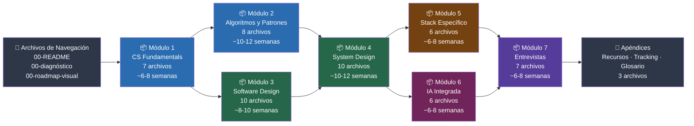

# zero-to-hero-v2 — Punto de Entrada al Sistema

> Este no es un roadmap genérico. Es un curriculum estructurado, calibrado para un perfil específico,
> con un objetivo específico: llevar a un Senior .NET/C# de 10 años de experiencia al nivel
> Staff Engineer / Software Architect en 8-12 meses de ejecución real.
> Si eres otro estudiante con otro perfil, este sistema funcionará parcialmente —
> pero no fue diseñado para ti.

---

## ¿Qué es este sistema?

La mayoría de los recursos de aprendizaje para ingeniería de software caen en una de dos trampas:
son demasiado superficiales (una lista de links con videos de YouTube y libros sin orden ni criterio)
o demasiado rígidos (un curso con ruta fija que no respeta lo que ya sabes ni lo que necesitas en realidad).

Este sistema hace algo diferente. Toma las decisiones difíciles por ti —qué aprender, en qué orden,
con qué recurso, en qué profundidad— y las justifica con criterios técnicos reales, no con popularidad
ni con lo que está de moda.

**El resultado concreto al que apunta este sistema:**

- Poder diseñar sistemas distribuidos a escala y defender trade-offs en una entrevista de 45 minutos
- Tener un modelo mental sólido de algoritmos y estructuras de datos suficiente para pasar
  coding interviews en empresas tech sólidas y FAANG
- Entender arquitectura de software con la profundidad que se espera de un Staff Engineer:
  no solo saber los patrones, sino saber cuándo NO usarlos y qué costo tiene cada decisión
- Poder integrar sistemas de IA como componente de producción, no solo como herramienta de desarrollo
- Hablar el idioma de los entrevistadores de nivel Staff en 2026

**Lo que este sistema NO es:**

- Un conjunto de notas para estudiar pasivamente
- Un sustituto de la práctica activa (código, diseño, simulacros)
- Un recurso para consumir en orden lineal sin pensar
- Una garantía — es un mapa, no un taxi

---

## Estructura del sistema — Los 7 módulos

El sistema está organizado en 60 archivos Markdown navegables en Obsidian.
Los archivos están diseñados para leerse en secuencia dentro de cada módulo,
pero los módulos tienen dependencias entre sí que debes respetar.

**Regla crítica de dependencias:**
El Módulo 1 desbloquea todo lo demás. Módulos 2 y 3 pueden solaparse después de completar M1.
El Módulo 4 requiere tener M2 y M3 en un nivel mínimo. M5, M6 y M7 son la cima —
no sirve de nada intentar llegar ahí sin los fundamentos.

---

## Leyenda de símbolos del sistema

Todos los archivos del curriculum usan este sistema de símbolos de forma consistente.
Memoriza estos símbolos ahora — están diseñados para que puedas escanear un archivo
y saber instantáneamente qué tipo de información estás viendo.

| Símbolo | Significado |
|---------|-------------|
| 📚 | Libro recomendado — leer el capítulo o sección indicada |
| 🎯 | Recurso de suscripción activa (AlgoMonster, AlgoExpert, Pluralsight, Codecademy) |
| 🆓 | Recurso gratuito de alto valor — no requiere suscripción |
| ⚠️ | Advertencia crítica — no omitir, indica un error común o riesgo de producción |
| 💡 | Insight de nivel Staff — perspectiva que diferencia Senior de Staff |
| 🏁 | Checkpoint — criterio concreto y medible para avanzar al siguiente archivo |
| 🔗 | Link a archivo relacionado del sistema |
| 🧪 | Ejercicio práctico obligatorio — no opcional, no se puede saltar |

---

## Principios del curriculum

Estos no son decorativos. Entender estos principios cambia la forma en que usas el sistema.

### 1. Patrones sobre memorización

El enfoque de moler problemas al azar en LeetCode tiene un problema central: desarrolla
reconocimiento de problemas específicos, no intuición algorítmica transferible. Cuando aparece
un problema con una pequeña variación que no has visto antes, el modelo mental falla.

Este curriculum prioriza patrones porque los patrones son transferibles. Cuando identificas
que un problema es del tipo "sliding window con constraint dinámico", tienes una clase de solución,
no solo una solución. Esto es lo que los entrevistadores de nivel Staff están evaluando en 2026:
no si memorizaste la solución, sino si puedes derivarla bajo condiciones que no esperabas.

La consecuencia práctica: AlgoMonster como andamiaje de patrones, NeetCode 150 como consolidación
con volumen, LeetCode solo en las últimas 2 semanas antes de una entrevista específica para
inteligencia de empresa. Este orden no es arbitrario.

### 2. Universal antes que específico

Los primeros 4 módulos de este curriculum son agnósticos al stack. Esto es intencional y tiene
una razón técnica profunda: los conceptos de system design, algoritmos, y arquitectura de software
son universales. La implementación en .NET es un detalle, no el modelo mental.

Un Staff Engineer que solo sabe diseñar sistemas en C# no puede evaluar si la propuesta de su
equipo de Python es correcta. No puede tomar decisiones de migración. No puede liderar a ingenieros
con stacks distintos. El modelo mental universal viene primero — la implementación específica viene
después, ya que tienes la base para anclarla.

El Módulo 5 es donde finalmente profundizamos en .NET avanzado, Azure, y los demás stacks
del perfil. Esperar hasta ese punto no significa ignorar tu stack actual — significa construir
el marco conceptual correcto antes de llenarlo con detalles específicos de implementación.

### 3. Profundidad secuencial

Cada módulo asume que el anterior fue completado con honestidad. No existe un atajo que permita
saltar de M1 a M4 sin consecuencias — las consecuencias son gaps de modelo mental que se
manifiestan exactamente cuando más los necesitas: en una entrevista de system design o ante
una decisión arquitectónica bajo presión.

La profundidad secuencial también significa que la profundidad importa más que la velocidad.
Completar un archivo en 2 días con comprensión profunda vale más que completar 5 archivos
en una semana con comprensión superficial. Los checkpoints al final de cada archivo
son el mecanismo de control para esto.

### 4. Trade-offs sobre respuestas

Un Senior Engineer busca la respuesta correcta. Un Staff Engineer busca la decisión correcta
para el contexto específico, y sabe que a veces no existe una respuesta objetivamente correcta —
solo decisiones con trade-offs distintos.

Cada decisión técnica en este curriculum viene acompañada de su contraparte: cuándo NO usar
esta solución, qué pierdes al elegirla, en qué contexto se convierte en el problema en vez
de la solución. Este es el cambio de mentalidad más importante que este curriculum intenta producir.

Si al final de este sistema puedes articular con precisión los trade-offs de CQRS vs arquitectura
monolítica bien estructurada, de Kafka vs Azure Service Bus, de B-Trees vs LSM-Trees, entonces
el curriculum cumplió su función. Si solo puedes listar ventajas sin hablar de costos,
el trabajo no está terminado.

### 5. Ejecución sobre acumulación

El riesgo más común en sistemas de estudio autodidacta no es la falta de recursos —
es la acumulación de recursos sin ejecución. Guardar guías, añadir libros a la lista,
subrayar notas, ver videos. Todo esto genera la ilusión de progreso sin el progreso real.

El progreso real se mide en una sola métrica: ¿puedes resolver el problema sin ayuda?
¿Puedes diseñar el sistema en la pizarra sin consultar? ¿Puedes responder la pregunta
de entrevista en tiempo real?

Los ejercicios marcados con 🧪 en este curriculum no son opcionales. Los checkpoints 🏁
son los únicos criterios válidos para avanzar. La tentación de avanzar antes de alcanzar
el checkpoint es exactamente el error que produce gaps de conocimiento invisibles
que solo se manifiestan bajo presión.

---

## Cómo navegar el sistema

**Paso 1 — Diagnóstico antes de entrar:**
Lee y completa [00-diagnostico.md](./00-diagnostico.md) antes de abrir cualquier módulo.
No asumas tu nivel basándote en percepción — el diagnóstico tiene preguntas técnicas concretas
que te darán una medición real.

**Paso 2 — Roadmap visual como referencia:**
[00-roadmap-visual.md](./00-roadmap-visual.md) es el mapa que consultas cuando necesitas ver
el contexto global: en qué punto del sistema estás, qué tan lejos está el objetivo, qué
recursos aplican en esta fase.

**Paso 3 — Overview de módulo siempre primero:**
Cada módulo tiene un archivo `XX-00-overview.md`. Léelo completo antes de abrir cualquier
otro archivo del módulo. El overview explica qué vas a aprender, por qué en ese orden,
y cómo los archivos se conectan entre sí.

**Paso 4 — Recursos en el punto exacto de consumo:**
Los recursos (libros, plataformas, videos) están referenciados inline en el punto donde los
necesitas, no al final en una tabla. Cuando el archivo diga 🎯 AlgoMonster — Módulo "Sliding Window",
ábres AlgoMonster en ese momento, no después. El orden de consumo está diseñado para que
los recursos se refuercen mutuamente.

**Paso 5 — Claude como mentor activo:**
Este curriculum está diseñado para usarse en conjunto con sesiones de entrenamiento en Claude.
Usa sesiones separadas para:
- Validar tu comprensión de un concepto (escríbelo con tus palabras, pídele que lo evalúe)
- Práctica de mock interviews (system design, coding, behavioral)
- Preguntas de profundización sobre trade-offs que el archivo no cubre
- Revisión de código o diseños que hagas en los ejercicios prácticos

**Regla de sesiones:** cada sesión de entrenamiento con Claude debe ser una sesión nueva
o estar en un proyecto dedicado. No mezcles sesiones de "creación de notas" con sesiones
de "entrenamiento activo" — el contexto se degrada y la calidad de ambos sufre.

---

## Tiempo estimado por módulo

| Módulo | Archivos | Duración estimada | Prerequisitos | Solapamiento posible |
|--------|----------|-------------------|---------------|----------------------|
| Navegación (este archivo + 2) | 3 | 1-2 días | Ninguno | No |
| M1 — CS Fundamentals | 7 | 6-8 semanas | Ninguno | No |
| M2 — Algoritmos y Patrones | 8 | 10-12 semanas | M1 completo | Con M3 (semana 5+) |
| M3 — Software Design | 10 | 8-10 semanas | M1 completo | Con M2 (semana 5+) |
| M4 — System Design | 10 | 10-12 semanas | M2 + M3 en nivel mínimo | No |
| M5 — Stack Específico | 6 | 6-8 semanas | M4 completo | Con M6 parcialmente |
| M6 — IA Integrada | 6 | 6-8 semanas | M4 completo | Con M5 parcialmente |
| M7 — Entrevistas | 7 | 6-8 semanas | M5 + M6 en nivel mínimo | No |
| Apéndices | 3 | Referencia permanente | — | Siempre disponibles |

**Total estimado:** 8-12 meses dependiendo de ritmo de estudio, tiempo disponible
y profundidad de gaps iniciales identificados en el diagnóstico.

---

> **Siguiente paso obligatorio:** [Completar 00-diagnostico.md →](./00-diagnostico.md)
> No abras el Módulo 1 hasta completar el diagnóstico.
