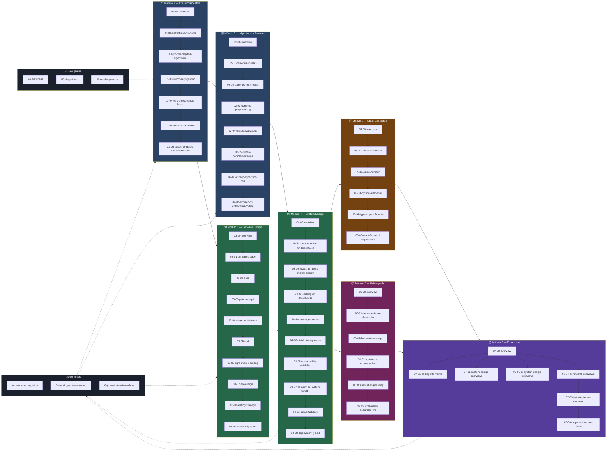
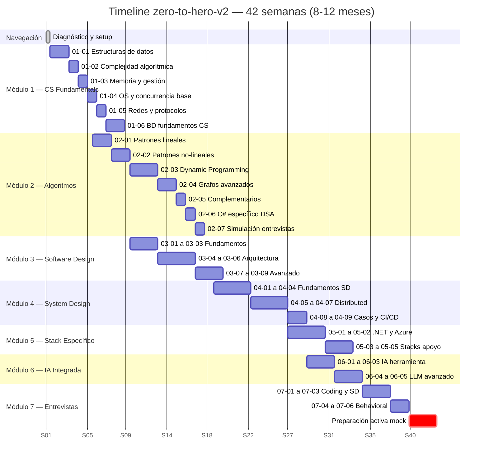

# 00-roadmap-visual — Mapa Panorámico del Sistema

> Consulta este archivo cuando necesites ver el mapa grande.
> No es para estudiar — es para orientarte dentro del sistema.
> ¿Dónde estás? ¿Qué sigue? ¿Qué recurso aplica ahora?
> Esas tres preguntas tienen respuesta aquí.

---

## Sección 1 — Diagrama de dependencias entre módulos

Este diagrama muestra el sistema completo: archivos de navegación, módulos,
dependencias, y los apéndices como infraestructura transversal.

Las dependencias son técnicas, no arbitrarias — están justificadas en cada overview de módulo.



**⚠️ Dependencias no negociables:**
- M2 y M3 requieren M1 completo (no parcialmente)
- M4 requiere M2 mínimo hasta `02-03` y M3 hasta `03-04`
- M6 requiere M4 completo — no hay atajo aquí
- Los Apéndices son referencia permanente, disponibles desde el inicio

---

## Sección 2 — Timeline de 8-12 meses

Este diagrama muestra la distribución temporal de los módulos.
Los solapamientos mostrados son intencionales y posibles cuando se alcanzan los checkpoints.



**Nota sobre solapamientos:**
- M2 y M3 se solapan a partir de la semana 5 del curriculum (cuando M1 está completo)
- M5 y M6 tienen solapamiento parcial en las semanas 29-32
- El Módulo 7 incluye práctica activa de mock interviews que debe continuar mientras
  se avanza en los archivos teóricos

---

## Sección 3 — Mapa de recursos por módulo

Esta tabla muestra qué recurso de suscripción o referencia aplica en cada módulo.
El nivel de uso está indicado para ayudarte a planificar tu tiempo con cada plataforma.

| Módulo | AlgoMonster 🎯 | AlgoExpert 🎯 | Pluralsight 🎯 | Codecademy 🎯 | ByteByteGo 🆓 | DDIA 📚 | NeetCode 🆓 | MIT OCW 🆓 |
|--------|--------------|--------------|----------------|--------------|--------------|---------|-------------|-----------|
| M1 — CS Fundamentals | ✅ Intensivo | 〇 Complem. | 〇 Complem. | — | — | 〇 Cap. 1-3 | — | ✅ Lect. 1-6 |
| M2 — Algoritmos | ✅ Intensivo | 〇 Complem. | — | — | — | — | ✅ Intensivo | 〇 Complem. |
| M3 — Software Design | — | — | ✅ Intensivo | — | — | — | — | — |
| M4 — System Design | — | 〇 Systems | ✅ Intensivo | — | ✅ Intensivo | ✅ Completo | — | — |
| M5 — Stack Específico | — | — | ✅ Intensivo | ✅ Python/TS | — | 〇 Cap. espec. | — | — |
| M6 — IA Integrada | — | — | 〇 Complem. | — | 〇 AI posts | — | — | — |
| M7 — Entrevistas | 〇 Repaso | ✅ Intensivo | — | — | ✅ Intensivo | — | ✅ Intensivo | — |

**Leyenda:**
- ✅ Uso intensivo — recurso principal para este módulo, abre la plataforma junto con el archivo
- 〇 Complementario — recurso de apoyo, consume cuando el archivo lo indica inline
- — No aplica en este módulo

**Recursos adicionales por módulo (sin suscripción):**

| Módulo | Recurso adicional clave |
|--------|------------------------|
| M4 | Google SRE Book 🆓 — capítulos de Observability y Reliability |
| M6 | LLM Engineering Handbook 📚, AI Engineering (Chip Huyen) 📚, DeepLearning.AI 🆓 |
| M7 | Hello Interview 🆓 (YouTube), LeetCode free 🆓 (2 semanas pre-entrevista únicamente) |

---

## Sección 4 — Progresión de habilidades a lo largo del curriculum

Esta tabla muestra cómo evolucionan las habilidades clave en cada módulo.
La progresión es acumulativa — cada módulo construye sobre el anterior.

```
Leyenda de progresión:
○ = No cubierto aún
◔ = Fundamentos (puedo definir el concepto)
◑ = Aplicación (puedo usarlo en un contexto específico)
◕ = Dominio (puedo tomar decisiones y explicar trade-offs)
● = Visión Staff (puedo diseñar sistemas, ver el impacto sistémico)
```

| Habilidad | M1 | M2 | M3 | M4 | M5 | M6 | M7 |
|-----------|----|----|----|----|----|----|-----|
| Algoritmos y DSA | ◔ | ◑ | ◑ | ◑ | ◕ | ◕ | ● |
| Software Design | ◔ | ◔ | ◕ | ◕ | ● | ● | ● |
| System Design | ◔ | ◔ | ◑ | ◕ | ◕ | ◕ | ● |
| Distributed Systems | ○ | ◔ | ◔ | ◕ | ◕ | ◕ | ● |
| .NET Avanzado | ◔ | ◔ | ◑ | ◑ | ● | ● | ● |
| Azure | ◔ | ○ | ◔ | ◑ | ● | ◕ | ● |
| IA Integrada | ○ | ○ | ○ | ◔ | ◔ | ◕ | ◕ |
| Mentalidad Staff | ◔ | ◑ | ◑ | ◕ | ◕ | ◕ | ● |

**Lectura de la tabla:**
Los saltos más grandes ocurren en M3→M4 (donde el model mental de system design se construye)
y en M4→M5 (donde todo lo universal se ancla en el stack específico).
La mentalidad Staff no es un módulo — se desarrolla progresivamente a través de todo el sistema.

---

## Sección 5 — Señales de progreso por fase

Estas son las señales concretas y medibles que indican que estás progresando correctamente.
No son métricas genéricas — son señales de que el modelo mental correcto se está formando.

### Fase M1 — CS Fundamentals completado correctamente cuando:

- 🏁 Puedes explicar por qué acceder a un elemento en un array es O(1) y en una linked list es O(n),
  con la referencia al modelo de memoria de la CPU, no solo "porque es así"
- 🏁 Puedes dibujar en papel cómo funciona una tabla hash con colisiones y resolución por encadenamiento
- 🏁 Puedes explicar qué ocurre en el hardware cuando haces `await` en C# y por qué no bloquea el thread
- 🏁 Puedes describir qué es un TCP handshake y por qué HTTP/2 lo reduce a un solo round-trip

### Fase M2 — Algoritmos consolidado correctamente cuando:

- 🏁 Ves un problema de "ventana variable con constraint" y reconoces el patrón Sliding Window
  antes de leer los constraints del enunciado
- 🏁 Puedes implementar BFS y DFS sobre un grafo con lista de adyacencia, desde memoria, en C#,
  en menos de 10 minutos
- 🏁 Puedes analizar la complejidad de espacio de tu propia solución recursiva y saber cuándo
  la stack de llamadas es un problema real en producción
- 🏁 Puedes explicar por qué Dynamic Programming no es "memorizar subproblemas" sino
  "identificar subestructura óptima solapada" — y la diferencia importa

### Fase M3 — Software Design consolidado correctamente cuando:

- 🏁 Lees código que viola SRP y puedes articular el problema concreto que causará en 6 meses,
  no solo "viola el principio"
- 🏁 Puedes describir cuándo CQRS es la solución correcta y cuándo es over-engineering,
  con criterios de decisión específicos (tamaño del equipo, divergencia de modelos, etc.)
- 🏁 Puedes diseñar el modelo de dominio de un sistema de e-commerce en DDD en 30 minutos,
  identificando Aggregates, Entities, Value Objects y Bounded Contexts
- 🏁 Puedes explicar la diferencia entre una API REST bien diseñada y una que solo usa HTTP

### Fase M4 — System Design consolidado correctamente cuando:

- 🏁 Puedes diseñar un Rate Limiter distribuido en 45 minutos con al menos 3 aproximaciones
  técnicas distintas y los trade-offs de cada una
- 🏁 Puedes explicar el CAP Theorem con un escenario de partición de red real, no con definiciones
- 🏁 Dado un sistema que tiene problemas de latencia, puedes diagnosticar si el problema es
  el cacheo, la base de datos, la red, o el procesamiento — y proponer soluciones específicas
- 🏁 Puedes diseñar la arquitectura de mensajería de un sistema de pagos con requisitos de
  exactamente-una-vez (exactly-once delivery) y justificar las decisiones

### Fase M5-M6 — Stack Específico + IA consolidado cuando:

- 🏁 Puedes implementar un pipeline RAG funcional en .NET con Azure OpenAI,
  con chunking estratégico, embeddings, y recuperación semántica
- 🏁 Puedes explicar cuándo fine-tuning supera a RAG con un argumento técnico, no comercial
- 🏁 En una revisión de código, puedes identificar si EF Core generará N+1 queries,
  un cartesian explosion, o si necesita un query compilado

### Fase M7 — Listo para entrevistar cuando:

- 🏁 Completas un problema de LeetCode medium en 25 minutos explicando en voz alta
  tu proceso de pensamiento, incluyendo complejidad de tiempo y espacio al final
- 🏁 Diseñas un sistema estilo "Diseña YouTube" en 45 minutos con estimaciones de escala,
  decisiones de base de datos justificadas, y discusión de trade-offs — sin que te pregunten
- 🏁 En una pregunta behavioral, puedes narrar una historia de impacto técnico que demuestre
  razonamiento de Staff: impacto transversal, decisiones con incertidumbre, y lecciones aprendidas
- 🏁 No te bloqueas en una entrevista. Tienes un proceso para manejar el bloqueo: verbalizar
  lo que sí sabes, pedir un hint estratégicamente, proponer una solución subóptima y mejorarla

---

## Guía de uso de este archivo

**Cuándo abrir este archivo:**
- Al inicio del curriculum (para entender el sistema completo)
- Al terminar un módulo (para ver qué sigue y qué recurso aplica)
- Cuando te sientes perdido o sin momentum (para reorientar)
- Para mostrar a alguien más el alcance del sistema

**Cuándo NO abrir este archivo:**
- Como sustituto de abrir el archivo del módulo actual
- Para "planificar" sin ejecutar
- Cuando deberías estar resolviendo un ejercicio práctico

---

> **¿Ya completaste el diagnóstico?** → [00-diagnostico.md](./00-diagnostico.md)
>
> **¿Listo para empezar?** → [Módulo 1 — Overview](./modulo-01-cs-fundamentals/01-00-overview.md)
>
> **¿Buscando un recurso específico?** → [A-recursos-completos](./apendices/A-recursos-completos.md)
