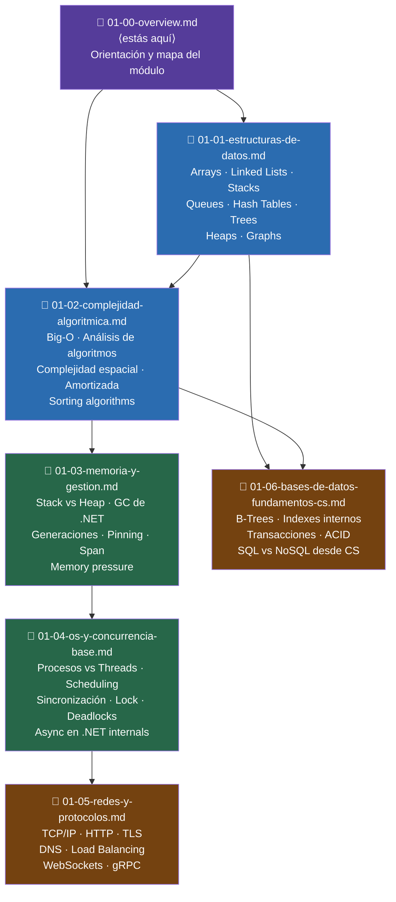

# Módulo 1 — CS Fundamentals: Overview

> **Lee este archivo completo antes de abrir cualquier otro archivo del módulo.**
> Es la diferencia entre estudiar con un mapa y estudiar perdido.

---

## Por qué este módulo existe — y por qué tú lo necesitas

Tienes 10 años de experiencia en .NET. Escribes código que funciona en producción. Diseñas APIs. Manejas concurrencia con `async/await`. Tu código no es el problema.

El problema es este: en una entrevista Staff, un ingeniero te pregunta "¿por qué `Dictionary<string, T>` tiene acceso O(1) amortizado?" y tu respuesta honesta —si eres completamente sincero contigo mismo— es "porque la documentación lo dice" o "porque siempre ha sido así".

Esa respuesta mata candidatos Staff. No porque el entrevistador sea cruel. Sino porque la respuesta revela algo estructural: entiendes el comportamiento observable de las herramientas que usas, pero no el mecanismo que produce ese comportamiento. Y un Staff Engineer, por definición, es alguien que puede razonar sobre mecanismos, no solo sobre comportamientos.

**La diferencia concreta:**

Un Senior Developer ve `List<T>.Add()` y piensa "agrega el elemento al final".  
Un Staff Engineer ve `List<T>.Add()` y piensa "O(1) amortizado — el resize ocurre en O(n) pero tan raramente que el costo promedio colapsa a O(1). El factor de crecimiento es 2x para minimizar el número total de copias. Si el `Capacity` inicial está mal calibrado en mi caso de uso, estoy pagando múltiples resizes que son completamente evitables."

Ese modelo mental —saber el mecanismo interno y sus implicaciones— es lo que este módulo construye desde cero.

**Ejemplos concretos de preguntas que este módulo hace posibles responder:**

- *"¿Cuándo usarías `LinkedList<T>` en lugar de `List<T>` en C#? Dame un escenario real."*  
  Sin este módulo: respuesta genérica. Con este módulo: análisis de memoria contigua vs dispersa, coste de iteración de cache, cuándo la inserción O(1) real vale más que el O(1) amortizado de `List<T>`.

- *"¿Por qué Binary Search requiere que el array esté ordenado? ¿Qué propiedad explota exactamente?"*  
  Sin este módulo: "porque así funciona". Con este módulo: explicación de la propiedad de monotonicidad, por qué permite descartar mitades completas, la conexión con B-Trees en bases de datos.

- *"Tienes 10 millones de URLs. Necesitas saber en O(1) si una URL ya fue visitada. ¿Qué estructura usas y por qué no un `HashSet<T>` estándar en este caso?"*  
  Sin este módulo: "un `HashSet`". Con este módulo: análisis de memoria (un `HashSet` de 10M strings consume GB), introducción al concepto de Bloom Filter como alternativa probabilística, trade-off precisión vs espacio.

- *"¿Qué pasa internamente cuando inserto el elemento 1025 en un `List<T>` que fue creado con capacidad inicial de 1024?"*  
  Sin este módulo: "no sé, funciona". Con este módulo: descripción del proceso de resize, la copia de elementos, por qué la complejidad amortizada se mantiene O(1) pese al costo puntual de O(n).

Estos no son ejercicios académicos. Son exactamente el tipo de preguntas que diferencian una oferta Staff de un rechazo con feedback "buena implementación pero falta profundidad técnica".

---

## Diagrama del módulo — 7 archivos, sus dependencias y flujo recomendado

**Notas sobre el diagrama:**

- `01-01` y `01-02` son los archivos más densos del módulo. No avances a los siguientes sin haber pasado los checkpoints de ambos.
- `01-03` es el puente más natural para tu experiencia .NET — aprovecha lo que ya sabes del GC y Span<T> para profundizar en los fundamentos de memoria.
- `01-06` cierra el módulo con bases de datos desde la perspectiva de CS (estructuras internas, B-Trees, índices), no desde la perspectiva de SQL.

---

## Duración y carga de trabajo

**Duración total del módulo:** 6-8 semanas de estudio activo

La variación depende de qué tan profundo vayas en la práctica de implementación. Si solo lees y entiendes, 6 semanas. Si implementas todas las estructuras desde cero en C# y resuelves los ejercicios asociados, 8 semanas. La segunda opción es el camino correcto.

**Distribución semanal recomendada:**

| Semana | Archivos | Foco |
|--------|----------|------|
| 1-2 | `01-01` — Estructuras de datos | Leer + implementar Arrays, Linked Lists, Stacks, Queues desde cero |
| 2-3 | `01-01` continuación + `01-02` inicio | Hash Tables, Trees, Heaps, Graphs + inicio de complejidad |
| 3-4 | `01-02` — Complejidad algorítmica | Análisis formal, sorting algorithms, complejidad amortizada |
| 4-5 | `01-03` — Memoria y gestión | GC de .NET, Stack vs Heap, Span<T> — tu zona de confort ampliada |
| 5-6 | `01-04` — OS y concurrencia base | Threads, scheduling, async internals — conecta con tu experiencia async/await |
| 6-7 | `01-05` — Redes y protocolos | TCP/IP, HTTP, TLS — fundamentos que system design asume que sabes |
| 7-8 | `01-06` — Bases de datos CS | B-Trees, índices, transacciones desde primeros principios |

**Distribución diaria dentro de cada semana:**

Un bloque de estudio efectivo para este módulo tiene esta estructura:
- **20-30 min:** Teoría (leer la sección del archivo del día)
- **30-45 min:** Implementación (escribir código desde cero, no copiar)
- **15-20 min:** AlgoMonster o revisión de complejidad de lo implementado

No intentes sesiones de 3+ horas. El material de estructuras de datos requiere consolidación — el cerebro necesita tiempo entre sesiones para integrar conceptos de mecanismo interno.

**Cuándo puede comenzar el solapamiento M1 → M2:**

En la semana 5-6, cuando hayas completado `01-01` y `01-02` con sus checkpoints, puedes comenzar a abrir el `02-00-overview.md` del Módulo 2 en paralelo. No antes. `01-03` a `01-06` pueden solaparse con el inicio de M2 porque su contenido es más adyacente a tu experiencia existente y requiere menos reconstrucción de modelo mental.

---

## Recursos del módulo

| Recurso | Qué cubre en este módulo | Archivo donde se usa | Tipo |
|---------|--------------------------|---------------------|------|
| AlgoMonster | Patrones de estructuras de datos, implementaciones guiadas con repetición espaciada | `01-01`, `01-02` | 🎯 Suscripción activa |
| AlgoExpert | Práctica complementaria, explicaciones en video de estructuras específicas | `01-01` | 🎯 Suscripción activa |
| Pluralsight | Memory management en .NET, concurrencia, GC internals | `01-03`, `01-04` | 🎯 Suscripción activa |
| MIT OCW 6.006 | Complejidad algorítmica formal, modelos de cómputo — Lectures 1-6 | `01-02` | 🆓 Gratuito |
| NeetCode.io (YouTube) | Videos de estructuras de datos con explicación de internals | `01-01` | 🆓 Gratuito |
| NeetCode.io (YouTube) | Sorting algorithms visualizados | `01-02` | 🆓 Gratuito |

---

## Checklist de salida del módulo

Estos son los criterios para saber que el Módulo 1 está completo. No son indicadores de progreso — son el umbral mínimo de competencia. Si no puedes hacer cada uno de estos ítems sin consultar código de referencia, el módulo no está terminado.

### Estructuras de datos

- [ ] Puedo implementar un array dinámico en C# desde cero con resize automático, explicando por qué el factor de crecimiento 2x es óptimo
- [ ] Puedo implementar una `LinkedList<T>` simple y doble en C#, explicando exactamente por qué la inserción es O(1) en la cabeza pero O(n) en posición arbitraria
- [ ] Puedo implementar un `Stack<T>` usando un array y usando un linked list, explicando el trade-off de memoria entre ambas implementaciones
- [ ] Puedo implementar una `Queue<T>` con array circular, explicando por qué el array circular evita el desperdicio de espacio que tiene una queue con array lineal
- [ ] Puedo implementar una `HashTable` simple con chaining en C# desde cero, explicando qué es el load factor y por qué el threshold de 0.75 es el estándar
- [ ] Puedo explicar por qué `Dictionary<K,V>` tiene O(1) promedio y cuándo degenera a O(n) — y qué lo causa
- [ ] Puedo implementar un BST en C# con insert, search y inorder traversal, explicando cuándo degenera a O(n) y qué lo previene
- [ ] Puedo implementar un MinHeap en C# con insert y extractMin, explicando el proceso de heapify-up y heapify-down
- [ ] Puedo implementar representación de grafo por lista de adyacencia y por matriz de adyacencia en C#, explicando cuándo cada representación es superior

### Complejidad algorítmica

- [ ] Puedo calcular la complejidad Big-O de cualquier función C# con loops simples, loops anidados de tamaños distintos, y recursión básica — sin ayuda
- [ ] Puedo explicar la diferencia entre O, Ω y Θ con un ejemplo concreto para cada notación
- [ ] Puedo demostrar matemáticamente por qué `List<T>.Add()` es O(1) amortizado usando el método agregado (aggregate method)
- [ ] Puedo comparar MergeSort, QuickSort y HeapSort en términos de tiempo y espacio, explicando por qué QuickSort es O(n²) en peor caso y por qué aun así se prefiere en práctica
- [ ] Puedo decir de memoria la complejidad de las operaciones principales de `List<T>`, `Dictionary<K,V>`, `HashSet<T>`, `SortedDictionary<K,V>` y `LinkedList<T>` en .NET

### Memoria y gestión

- [ ] Puedo explicar qué información va al Stack y qué va al Heap en un programa C# con ejemplos concretos de tipos de valor y referencia
- [ ] Puedo explicar por qué el GC de .NET mueve objetos durante una compactación y qué implica eso para punteros — y por qué `GCHandle` o `fixed` existen como solución
- [ ] Puedo explicar las 3 generaciones del GC y por qué la mayoría de objetos deben morir jóvenes para que el GC sea eficiente

### OS y concurrencia

- [ ] Puedo explicar la diferencia entre un proceso y un thread a nivel de sistema operativo, y cómo eso se traduce al modelo de `Task` en .NET
- [ ] Puedo explicar qué es un deadlock, dar un ejemplo de código C# que lo produce, y describir las 4 condiciones necesarias para que ocurra
- [ ] Puedo explicar qué pasa internamente cuando hago `await` en C# — no solo "suspende el método", sino el mecanismo de continuación y el rol del SynchronizationContext

### Redes

- [ ] Puedo explicar el TCP handshake de 3 pasos y por qué importa para el diseño de sistemas (latencia de primera conexión, connection pooling)
- [ ] Puedo explicar qué hace TLS y en qué capa del stack ocurre — y por qué HTTP/2 lo requiere

### Bases de datos (fundamentos CS)

- [ ] Puedo explicar por qué los índices de bases de datos relacionales usan B-Trees y no arrays ordenados o hash tables
- [ ] Puedo explicar qué es ACID y dar un ejemplo concreto de qué pasa si falta cada propiedad

---

> **Siguiente archivo:** [01-01-estructuras-de-datos.md →](./01-01-estructuras-de-datos.md)
