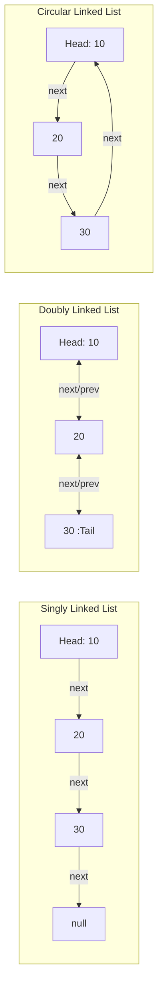
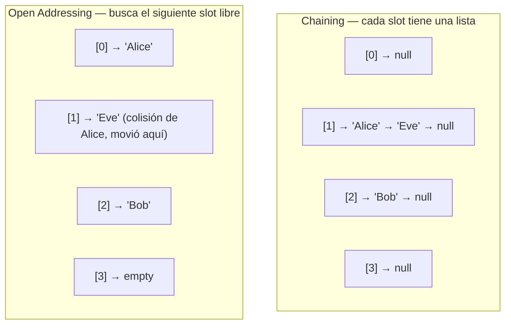
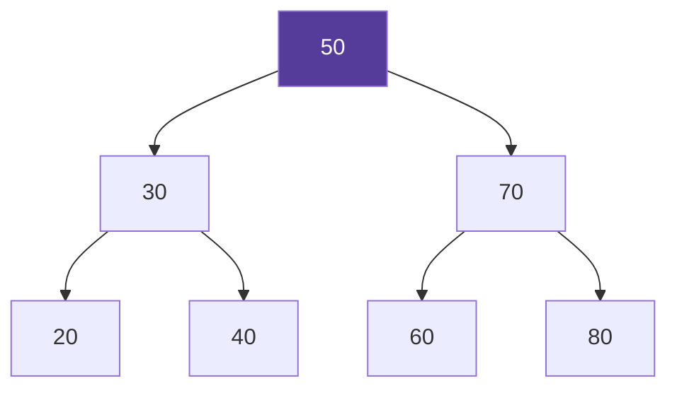

# 01-01 — Estructuras de Datos

> **Prerequisito:** Haber leído [01-00-overview.md](./01-00-overview.md)  
> **Principio de este archivo:** Cada estructura se explica desde adentro. No cómo usarla — por qué funciona como funciona.

🎯 **Antes de empezar:** Abre AlgoMonster y localiza la sección "Data Structures". La usarás en paralelo con este archivo — el momento exacto para cada estructura está indicado inline.

---

## Arrays

### Intuición

Un array es la estructura de datos más simple posible: una secuencia de cajas del mismo tamaño, colocadas una junto a la otra en memoria. La clave está en "una junto a la otra" — memoria contigua. Eso es lo que hace a los arrays especiales y lo que explica todos sus comportamientos.

### Mecanismo interno

Cuando declaras `int[] nums = new int[5]` en C#, el runtime reserva un bloque continuo de memoria de exactamente `5 × sizeof(int) = 20 bytes`. El runtime recibe la dirección de inicio de ese bloque — llamémosla `base_addr`.

Para acceder a `nums[i]`, el CPU calcula:

```
dirección = base_addr + (i × sizeof(int))
```

Esta operación es una sola instrucción de CPU. No importa si `i = 0` o `i = 4999`. El cálculo es idéntico. Por eso el acceso a un array es **O(1)** — no es una optimización, es aritmética de punteros.

**¿Por qué la búsqueda es O(n)?**

Si el array no está ordenado, no puedes usar esa aritmética para saber dónde está un valor específico. Tienes que revisar elemento por elemento hasta encontrarlo (o llegar al final). En el peor caso, n comparaciones: O(n).

**Arrays estáticos vs dinámicos:**

Un `int[]` en C# es un array estático — su tamaño se fija al crearlo y no cambia. Un `List<T>` es un array dinámico — internamente tiene un array que crece cuando se llena.

⚠️ **Error común:** Confundir `List<T>` con una lista enlazada. `List<T>` es un array dinámico, no una linked list. La mayoría de sus operaciones tienen la misma complejidad que un array.

### Implementación — Array dinámico en C# desde cero

```csharp
using System;

public class DynamicArray<T>
{
    private T[] _data;
    private int _count;
    
    // Capacidad inicial arbitraria — en producción, calibrar según el caso de uso
    public DynamicArray(int initialCapacity = 4)
    {
        _data = new T[initialCapacity];
        _count = 0;
    }

    public int Count => _count;
    public int Capacity => _data.Length;

    // O(1) amortizado — la mayoría de las veces no hay resize
    public void Add(T item)
    {
        if (_count == _data.Length)
            Resize();
        
        _data[_count] = item;
        _count++;
    }

    // O(1) — aritmética de punteros directa
    public T Get(int index)
    {
        if (index < 0 || index >= _count)
            throw new IndexOutOfRangeException();
        return _data[index];
    }

    // O(n) — todos los elementos posteriores al índice deben moverse un lugar
    public void InsertAt(int index, T item)
    {
        if (index < 0 || index > _count)
            throw new IndexOutOfRangeException();
        
        if (_count == _data.Length)
            Resize();
        
        // Mover elementos hacia la derecha para abrir espacio
        for (int i = _count; i > index; i--)
            _data[i] = _data[i - 1];
        
        _data[index] = item;
        _count++;
    }

    // O(n) — en el array backing, hay que copiar todo al nuevo array
    private void Resize()
    {
        // Factor 2x: minimiza el número total de resizes a lo largo del tiempo
        // Prueba matemática: con factor 2x, el costo amortizado de Add es O(1)
        int newCapacity = _data.Length * 2;
        T[] newData = new T[newCapacity];
        
        // Array.Copy es más eficiente que un loop manual — usa memcopy bajo el capó
        Array.Copy(_data, newData, _count);
        _data = newData;
    }
}
```

### Trade-offs

| Operación | Complejidad | Por qué |
|-----------|-------------|---------|
| Acceso por índice | O(1) | Aritmética de punteros directa |
| Búsqueda (desordenado) | O(n) | Revisión secuencial obligatoria |
| Inserción al final | O(1) amortizado | O(n) solo cuando hay resize |
| Inserción en posición i | O(n) | Desplazamiento de elementos |
| Eliminación en posición i | O(n) | Desplazamiento de elementos |

**Cuándo usar arrays:**
- Acceso frecuente por índice
- Tamaño conocido o aproximado al momento de creación
- Necesitas eficiencia de caché (memoria contigua = cache hits)
- Implementando estructuras más complejas internamente

**Cuándo NO usar arrays:**
- Muchas inserciones/eliminaciones en posiciones arbitrarias — usa una estructura diferente
- Tamaño completamente impredecible con alta variabilidad — el overhead de resizes frecuentes se acumula

---

## Linked Lists

### Intuición

Si los arrays son cajas en fila contigua, una linked list es una cadena de notas donde cada nota dice "el siguiente dato está en esta dirección". No hay contigüidad. Cada nodo vive en cualquier parte de la memoria y apunta al siguiente.

Esa diferencia tiene consecuencias profundas en todo: cómo se accede, cómo se inserta, cómo el CPU la maneja.

🎯 **AlgoMonster → sección "Linked List":** Abre este módulo ahora y trabájalo en paralelo con esta sección.

### Mecanismo interno

Cada nodo en una linked list contiene dos cosas:
1. El valor (el dato que queremos guardar)
2. Un puntero (referencia en C#) al siguiente nodo

Para acceder al elemento en posición `i`, debes partir desde el `head` (primer nodo) y seguir `i` punteros. No hay atajos. Por eso el acceso es **O(n)**.

Sin embargo, **insertar o eliminar en la cabeza** solo requiere redirigir un puntero. Eso es O(1) real — no amortizado. Siempre O(1).

**Tres variantes:**



- **Singly:** Cada nodo conoce solo al siguiente. Recorrido solo hacia adelante.
- **Doubly:** Cada nodo conoce al siguiente Y al anterior. Permite recorrido en ambas direcciones. Costo: el doble de punteros.
- **Circular:** El último nodo apunta de vuelta al primero. Útil para buffers circulares y round-robin scheduling.

### Implementación — Singly LinkedList en C# desde cero

```csharp
public class Node<T>
{
    public T Value { get; set; }
    public Node<T>? Next { get; set; }

    public Node(T value)
    {
        Value = value;
        Next = null;
    }
}

public class SinglyLinkedList<T>
{
    private Node<T>? _head;
    private Node<T>? _tail;
    private int _count;

    public int Count => _count;

    // O(1) — solo redirigir el puntero head
    public void AddToFront(T value)
    {
        var newNode = new Node<T>(value);
        newNode.Next = _head;
        _head = newNode;
        
        if (_tail == null) _tail = newNode;
        _count++;
    }

    // O(1) — mantenemos referencia al tail
    public void AddToEnd(T value)
    {
        var newNode = new Node<T>(value);
        if (_tail == null)
        {
            _head = _tail = newNode;
        }
        else
        {
            _tail.Next = newNode;
            _tail = newNode;
        }
        _count++;
    }

    // O(n) — hay que recorrer para encontrar el nodo previo al índice
    public void InsertAt(int index, T value)
    {
        if (index == 0) { AddToFront(value); return; }
        if (index == _count) { AddToEnd(value); return; }
        
        var current = _head;
        for (int i = 0; i < index - 1; i++)
        {
            if (current == null) throw new IndexOutOfRangeException();
            current = current.Next;
        }
        
        var newNode = new Node<T>(value);
        newNode.Next = current!.Next;
        current.Next = newNode;
        _count++;
    }

    // O(1) en cabeza, O(n) en posición arbitraria
    public bool Remove(T value)
    {
        if (_head == null) return false;

        // Caso especial: es el primer elemento
        if (EqualityComparer<T>.Default.Equals(_head.Value, value))
        {
            _head = _head.Next;
            if (_head == null) _tail = null;
            _count--;
            return true;
        }

        // Caso general: buscar el nodo anterior al que queremos eliminar
        var current = _head;
        while (current.Next != null)
        {
            if (EqualityComparer<T>.Default.Equals(current.Next.Value, value))
            {
                if (current.Next == _tail) _tail = current;
                current.Next = current.Next.Next;
                _count--;
                return true;
            }
            current = current.Next;
        }

        return false;
    }

    // O(n) — sin índice, sin atajos
    public T Get(int index)
    {
        var current = _head;
        for (int i = 0; i < index; i++)
        {
            if (current == null) throw new IndexOutOfRangeException();
            current = current.Next;
        }
        return current?.Value ?? throw new IndexOutOfRangeException();
    }
}
```

### Trade-offs

| Operación | Linked List | List\<T\> (array) |
|-----------|-------------|-------------------|
| Acceso por índice | O(n) | O(1) |
| Insertar en cabeza | O(1) | O(n) |
| Insertar al final | O(1) con tail ref | O(1) amortizado |
| Insertar en posición i | O(n) para llegar + O(1) para insertar | O(n) para desplazar |
| Eliminación en cabeza | O(1) | O(n) |
| Uso de caché del CPU | Pobre (memoria dispersa) | Excelente (memoria contigua) |

⚠️ **El error más caro en producción:** Usar `LinkedList<T>` de .NET pensando que es más rápido para colecciones grandes porque "la inserción es O(1)". En práctica, la memoria dispersa de los nodos causa cache misses constantes. Un `List<T>` con acceso secuencial es frecuentemente más rápido en términos de tiempo real porque el prefetcher del CPU puede anticipar los accesos. La complejidad Big-O no lo captura todo.

💡 **Cuándo `LinkedList<T>` gana de verdad:** Cuando tienes una referencia directa al nodo (no al índice) y necesitas insertar o eliminar en esa posición. El `LinkedList<T>.AddAfter(node, value)` de .NET es O(1) genuino si ya tienes el `LinkedListNode<T>`. Si tienes que buscar el nodo primero, ya pagaste O(n) de todas formas.

---

## Stacks

### Intuición

Un Stack es una estructura LIFO (Last In, First Out). El último elemento que entra es el primero que sale. Piénsalo como el call stack del CPU al ejecutar tu programa: cuando llamas a un método, el frame entra al stack; cuando termina, sale. Los métodos siempre terminan en orden inverso al que empezaron.

Casos de uso reales donde LIFO es exactamente lo que necesitas:
- **Parsing de expresiones:** Verificar que `{[()]}` esté correctamente balanceado
- **Undo/Redo:** Cada acción se apila; deshacer saca la última acción
- **Navegación hacia atrás en browser:** Las URLs visitadas se apilan
- **DFS iterativo:** Simular la recursión del compilador con un stack explícito
- **Evaluación de expresiones:** Convertir infix a postfix notation

### Implementación — Stack en C# desde cero con array

```csharp
public class ArrayStack<T>
{
    private T[] _data;
    private int _top; // índice del elemento superior actual

    public ArrayStack(int initialCapacity = 16)
    {
        _data = new T[initialCapacity];
        _top = -1; // -1 indica stack vacío
    }

    public int Count => _top + 1;
    public bool IsEmpty => _top == -1;

    // O(1) amortizado — misma lógica de resize que el array dinámico
    public void Push(T item)
    {
        if (_top == _data.Length - 1)
            Resize();
        
        _data[++_top] = item;
    }

    // O(1) — simplemente decrementar el índice superior
    public T Pop()
    {
        if (IsEmpty) throw new InvalidOperationException("Stack is empty");
        T item = _data[_top];
        _data[_top] = default!; // Evitar memory leak — liberar referencia para GC
        _top--;
        return item;
    }

    // O(1) — leer sin remover
    public T Peek()
    {
        if (IsEmpty) throw new InvalidOperationException("Stack is empty");
        return _data[_top];
    }

    private void Resize()
    {
        var newData = new T[_data.Length * 2];
        Array.Copy(_data, newData, _data.Length);
        _data = newData;
    }
}
```

**¿Stack con array o con linked list?**

- **Array:** Mejor rendimiento de caché (acceso contiguo), O(1) amortizado en push/pop. Recomendado.
- **Linked list:** O(1) real garantizado (sin amortización), pero peor rendimiento de caché y overhead de memoria por puntero en cada nodo.

Para uso general, el stack con array es superior. El stack con linked list solo gana si el tamaño máximo es absolutamente impredecible y no puedes aceptar ni un solo resize.

**`Stack<T>` de .NET:** Implementado internamente con un array. El comportamiento es exactamente lo que describes arriba. Úsalo. No implementes el tuyo en producción a menos que necesites comportamiento especializado.

---

## Queues

### Intuición

Una Queue es FIFO (First In, First Out). El primero que entra es el primero que sale — como una fila real. Casos de uso donde FIFO es la estructura natural:

- **BFS (Breadth-First Search):** Explorar nivel a nivel requiere procesar en orden de llegada
- **Task queues:** Procesamiento de mensajes en orden de recepción
- **Buffer de red:** Paquetes procesados en orden de llegada
- **Rate limiting:** Peticiones en cola procesadas en orden

### El problema del array lineal como queue

Si usas un array lineal con un índice de frente y uno de fin, eventualmente el frente del array queda "vacío" (ya fue consumido) pero no puedes reutilizar ese espacio sin reorganizar todos los elementos. Solución: **array circular**.

### Implementación — Queue con array circular en C#

```csharp
public class CircularQueue<T>
{
    private T[] _data;
    private int _front;  // índice del primer elemento
    private int _rear;   // índice del último elemento
    private int _count;

    public CircularQueue(int capacity = 16)
    {
        _data = new T[capacity];
        _front = 0;
        _rear = -1;
        _count = 0;
    }

    public int Count => _count;
    public bool IsEmpty => _count == 0;

    // O(1) — usamos módulo para "circular" el índice al llegar al final
    public void Enqueue(T item)
    {
        if (_count == _data.Length)
            Resize();
        
        _rear = (_rear + 1) % _data.Length;
        _data[_rear] = item;
        _count++;
    }

    // O(1) — tomar del frente y avanzar el índice de frente
    public T Dequeue()
    {
        if (IsEmpty) throw new InvalidOperationException("Queue is empty");
        
        T item = _data[_front];
        _data[_front] = default!;
        _front = (_front + 1) % _data.Length;
        _count--;
        return item;
    }

    public T Peek() => IsEmpty 
        ? throw new InvalidOperationException("Queue is empty") 
        : _data[_front];

    private void Resize()
    {
        // Al hacer resize hay que "desenrollar" el array circular
        T[] newData = new T[_data.Length * 2];
        for (int i = 0; i < _count; i++)
            newData[i] = _data[(_front + i) % _data.Length];
        
        _data = newData;
        _front = 0;
        _rear = _count - 1;
    }
}
```

**`Queue<T>` vs `ConcurrentQueue<T>` en .NET:**
- `Queue<T>`: No thread-safe. Para uso en un solo thread.
- `ConcurrentQueue<T>`: Thread-safe, lock-free. Para producir/consumir desde múltiples threads. Tiene overhead ligero pero evita la necesidad de locks externos.

**Deque (Double-ended queue):** Permite insertar y eliminar por ambos extremos — es un array dinámico con O(1) en frente y final. Útil para sliding window problems. En .NET, no existe un `Deque<T>` nativo; se usa `LinkedList<T>` o se implementa manualmente.

🎯 **AlgoMonster → sección "Queue":** Trabaja los ejercicios de BFS en esta sección después de entender la implementación.

---

## Hash Tables

### Intuición

¿Cómo haces que buscar un elemento sea O(1) en lugar de O(n)? Transformas el elemento en un número (su hash) y usas ese número como índice directo en un array. En vez de buscar, calculas dónde debería estar.

Eso es una hash table en esencia: un array donde los índices se derivan de los keys mediante una función hash.

🎯 **AlgoMonster → sección "Hash Map / Hash Set":** Abre esta sección ahora y completa la introducción antes de seguir.

### Mecanismo interno

**La función hash:**

Una función hash toma un key de cualquier tipo y produce un entero. Las propiedades que necesita:
1. **Determinismo:** El mismo key siempre produce el mismo hash
2. **Distribución uniforme:** Los hashes deben distribuirse uniformemente sobre el rango posible para minimizar colisiones
3. **Velocidad:** Calcular el hash debe ser O(1)
4. **Efecto avalancha:** Un cambio pequeño en el key produce un hash completamente diferente

Para convertir el hash en un índice dentro del array de tamaño `n`:
```
índice = Math.Abs(hash) % n
```

**Colisiones:**

Dado que hay infinitos keys posibles y un array finito, dos keys distintos pueden producir el mismo índice. Eso es una colisión. Las dos estrategias principales para manejarlas:



**Chaining:** Cada slot del array contiene una lista (linked list u otra estructura). Las colisiones se agregan a la lista de ese slot.
- Ventaja: Puede crecer sin límite
- Desventaja: Overhead de memoria por los punteros de la lista, y poor cache performance cuando las cadenas se alargan

**Open addressing:** Cuando hay colisión, busca el siguiente slot disponible según alguna estrategia (linear probing, quadratic probing, double hashing).
- Ventaja: Mejor uso de caché (todo en el mismo array)
- Desventaja: Performance degrada mucho cuando el array está casi lleno

**Load factor — la métrica clave:**

El load factor es `elementos / capacidad`. Cuando supera un threshold (típicamente 0.75), se hace resize y se hace rehashing de todos los elementos.

Por qué 0.75: con un load factor de 0.75, el 25% del array está vacío, lo que estadísticamente mantiene la longitud promedio de las cadenas (chaining) o el número de probes (open addressing) en un nivel aceptable. Con load factor 1.0, el riesgo de colisiones en cadena se dispara.

### Implementación — HashTable con chaining en C# desde cero

```csharp
using System;
using System.Collections.Generic;

public class SimpleHashTable<TKey, TValue>
{
    // Cada slot del array contiene una lista de pares (key, value)
    private List<(TKey Key, TValue Value)>[] _buckets;
    private int _count;
    private const double LoadFactorThreshold = 0.75;

    public SimpleHashTable(int initialCapacity = 16)
    {
        _buckets = new List<(TKey, TValue)>[initialCapacity];
        _count = 0;
    }

    private int GetBucketIndex(TKey key)
    {
        int hash = key?.GetHashCode() ?? 0;
        return Math.Abs(hash) % _buckets.Length;
    }

    // O(1) promedio — O(n) peor caso si todas las keys van al mismo bucket
    public void Set(TKey key, TValue value)
    {
        if ((double)_count / _buckets.Length >= LoadFactorThreshold)
            Resize();

        int index = GetBucketIndex(key);
        _buckets[index] ??= new List<(TKey, TValue)>();

        // Actualizar si la key ya existe
        for (int i = 0; i < _buckets[index].Count; i++)
        {
            if (EqualityComparer<TKey>.Default.Equals(_buckets[index][i].Key, key))
            {
                _buckets[index][i] = (key, value);
                return;
            }
        }

        // Key nueva
        _buckets[index].Add((key, value));
        _count++;
    }

    // O(1) promedio
    public bool TryGet(TKey key, out TValue value)
    {
        int index = GetBucketIndex(key);
        var bucket = _buckets[index];
        
        if (bucket != null)
        {
            foreach (var (k, v) in bucket)
            {
                if (EqualityComparer<TKey>.Default.Equals(k, key))
                {
                    value = v;
                    return true;
                }
            }
        }

        value = default!;
        return false;
    }

    private void Resize()
    {
        var oldBuckets = _buckets;
        _buckets = new List<(TKey, TValue)>[oldBuckets.Length * 2];
        _count = 0;

        // Rehash todos los elementos — necesario porque los índices cambian con el nuevo tamaño
        foreach (var bucket in oldBuckets)
        {
            if (bucket == null) continue;
            foreach (var (key, value) in bucket)
                Set(key, value);
        }
    }
}
```

**`Dictionary<K,V>` de .NET internamente:**

.NET usa open addressing con double hashing (no chaining). Guarda los entries en un array contiguo para mejor cache performance. Mantiene un array separado de "buckets" que mapea hash → índice en el array de entries. Versión .NET 6+: usa `Dictionary<K,V>` con SIMD-accelerated comparisons en tipos primitivos. La complejidad teórica es la misma O(1) promedio, pero los constantes son más bajos que una implementación ingenua con chaining.

⚠️ **Cuándo degrada a O(n):** Si todos tus keys tienen el mismo hash (implementación maliciosa de `GetHashCode()` que siempre retorna el mismo valor, o colisión intencional en sistemas web), todos los elementos caen en el mismo bucket y cada lookup es O(n). En sistemas web de producción con `Dictionary` que acepta input del usuario como key, esto es un vector de DoS. .NET lo mitiga con hashing randomizado por proceso (hash randomization).

---

## Trees

### Intuición

Un árbol es una estructura jerárquica de nodos. A diferencia de una linked list (que es lineal — cada nodo tiene un sucesor), cada nodo en un árbol puede tener múltiples hijos. La jerarquía permite dividir y descartar subconjuntos completos durante la búsqueda — eso es el secreto de O(log n).

🎯 **AlgoMonster → sección "Binary Tree / BST":** Abre esta sección al llegar a los Binary Trees.

### Binary Tree

Cada nodo tiene máximo 2 hijos: izquierdo y derecho. Las terminologías precisas:

- **Raíz (root):** El nodo sin padre
- **Hoja (leaf):** Nodo sin hijos
- **Altura del árbol:** Número máximo de aristas desde la raíz a una hoja
- **Profundidad de un nodo:** Número de aristas desde la raíz a ese nodo
- **Árbol completo:** Todos los niveles están llenos excepto posiblemente el último

### BST — Binary Search Tree

Un BST es un Binary Tree con una propiedad adicional:

> Para cualquier nodo N: todos los valores en el subárbol izquierdo son < N.Value, y todos los valores en el subárbol derecho son > N.Value.

Esta propiedad de ordenamiento es lo que permite búsquedas O(log n): en cada nodo, descartas la mitad del árbol.



Para buscar 60: ¿Es 60 > 50? Sí → ir a la derecha. ¿Es 60 < 70? Sí → ir a la izquierda. Encontrado. 2 comparaciones para encontrar en 7 elementos.

### Implementación — BST en C# desde cero

```csharp
public class BSTNode<T> where T : IComparable<T>
{
    public T Value;
    public BSTNode<T>? Left;
    public BSTNode<T>? Right;

    public BSTNode(T value) => Value = value;
}

public class BinarySearchTree<T> where T : IComparable<T>
{
    private BSTNode<T>? _root;

    // O(log n) promedio — O(n) peor caso (árbol degenerado)
    public void Insert(T value)
    {
        _root = InsertRecursive(_root, value);
    }

    private BSTNode<T> InsertRecursive(BSTNode<T>? node, T value)
    {
        if (node == null) return new BSTNode<T>(value);
        
        int comparison = value.CompareTo(node.Value);
        if (comparison < 0)
            node.Left = InsertRecursive(node.Left, value);
        else if (comparison > 0)
            node.Right = InsertRecursive(node.Right, value);
        // Si comparison == 0: ya existe, no insertar duplicados
        
        return node;
    }

    // O(log n) promedio
    public bool Contains(T value)
    {
        var current = _root;
        while (current != null)
        {
            int comparison = value.CompareTo(current.Value);
            if (comparison == 0) return true;
            current = comparison < 0 ? current.Left : current.Right;
        }
        return false;
    }

    // Inorder traversal: visita los nodos en orden ascendente (Left → Node → Right)
    // O(n) — visita cada nodo exactamente una vez
    public IEnumerable<T> InorderTraversal()
    {
        var result = new List<T>();
        InorderRecursive(_root, result);
        return result;
    }

    private void InorderRecursive(BSTNode<T>? node, List<T> result)
    {
        if (node == null) return;
        InorderRecursive(node.Left, result);
        result.Add(node.Value);
        InorderRecursive(node.Right, result);
    }
}
```

**Cuándo el BST degenera a O(n):**

Si insertas elementos ya ordenados (1, 2, 3, 4, 5, ...), el árbol degenera en una lista enlazada — cada nodo solo tiene hijo derecho. La búsqueda se convierte en O(n).

**¿Qué lo previene?** Árboles auto-balanceados:
- **AVL Tree:** Mantiene que la diferencia de altura entre subárboles izquierdo y derecho nunca supera 1. Rebalancea con rotaciones.
- **Red-Black Tree:** Garantiza que el árbol no está más de 2x más alto que el caso óptimo. Más permisivo que AVL, más rápido en inserciones. `SortedDictionary<K,V>` en .NET usa Red-Black Tree internamente.

### Trie

Un Trie es un árbol donde cada arista representa un carácter. Los nodos no guardan la palabra completa — la construyes siguiendo el path desde la raíz.

Cuándo usar Trie en lugar de `HashSet<string>`:
- Autocompletar: encontrar todas las palabras con un prefijo dado es O(prefijo.Length) — en un HashSet sería O(n × prefijo.Length)
- Validación de prefijos en tiempo constante
- Cuando el dominio es un conjunto finito de strings con muchos prefijos en común (ahorra memoria vs guardar cada string completo)

---

## Heaps y Priority Queues

### Intuición

Un Heap es un árbol binario completo con una propiedad extra: cada nodo es mayor (max-heap) o menor (min-heap) que sus hijos. Eso garantiza que el mínimo (o máximo) siempre está en la raíz — accesible en O(1).

Cuándo necesitas esto: cuando frecuentemente necesitas el elemento de mayor o menor prioridad, pero el conjunto cambia constantemente (nuevos elementos entran, el mínimo/máximo actual sale).

Si solo necesitas el mínimo una vez, ordena el array (O(n log n)). Si lo necesitas múltiples veces mientras el conjunto cambia, un Heap es la herramienta.

🎯 **AlgoMonster → sección "Heap / Priority Queue":** Trabaja esta sección en paralelo.

### Mecanismo interno — Representación con array

Un Heap binario completo puede representarse eficientemente en un array sin punteros. La relación padre-hijo se codifica en los índices:

```
Para un nodo en índice i (1-indexed):
  - Padre: i / 2
  - Hijo izquierdo: 2 * i
  - Hijo derecho: 2 * i + 1

Para 0-indexed (más común en código):
  - Padre: (i - 1) / 2
  - Hijo izquierdo: 2 * i + 1
  - Hijo derecho: 2 * i + 2
```

**Insert (heapify-up):** Agregar al final del array, luego comparar con el padre y subir hasta que la propiedad heap se satisfaga. Máximo log(n) comparaciones (altura del árbol). O(log n).

**Extract-Min (heapify-down):** Sacar la raíz (el mínimo), poner el último elemento en la raíz, luego comparar con los hijos y bajar. Máximo log(n) comparaciones. O(log n).

### Implementación — MinHeap en C# desde cero

```csharp
public class MinHeap<T> where T : IComparable<T>
{
    private List<T> _data = new();

    public int Count => _data.Count;
    public bool IsEmpty => _data.Count == 0;

    // O(1) — el mínimo siempre está en la raíz
    public T Peek()
    {
        if (IsEmpty) throw new InvalidOperationException();
        return _data[0];
    }

    // O(log n) — insertar al final y hacer heapify-up
    public void Insert(T item)
    {
        _data.Add(item);
        HeapifyUp(_data.Count - 1);
    }

    // O(log n) — extraer raíz, poner último elemento arriba, heapify-down
    public T ExtractMin()
    {
        if (IsEmpty) throw new InvalidOperationException();
        
        T min = _data[0];
        int lastIndex = _data.Count - 1;
        
        _data[0] = _data[lastIndex];
        _data.RemoveAt(lastIndex);
        
        if (_data.Count > 0)
            HeapifyDown(0);
        
        return min;
    }

    private void HeapifyUp(int index)
    {
        while (index > 0)
        {
            int parentIndex = (index - 1) / 2;
            if (_data[index].CompareTo(_data[parentIndex]) < 0)
            {
                Swap(index, parentIndex);
                index = parentIndex;
            }
            else break;
        }
    }

    private void HeapifyDown(int index)
    {
        int size = _data.Count;
        while (true)
        {
            int smallest = index;
            int left = 2 * index + 1;
            int right = 2 * index + 2;

            if (left < size && _data[left].CompareTo(_data[smallest]) < 0)
                smallest = left;
            if (right < size && _data[right].CompareTo(_data[smallest]) < 0)
                smallest = right;

            if (smallest == index) break;

            Swap(index, smallest);
            index = smallest;
        }
    }

    private void Swap(int i, int j) => (_data[i], _data[j]) = (_data[j], _data[i]);
}
```

**`PriorityQueue<TElement, TPriority>` en .NET (.NET 6+):** Implementado como un quaternary heap (4 hijos por nodo en lugar de 2) para mejor performance de caché. Úsalo en producción. La API es `Enqueue(element, priority)` y `Dequeue()` retorna el elemento con menor priority.

```csharp
// Ejemplo con PriorityQueue nativo de .NET 6+
var pq = new PriorityQueue<string, int>();
pq.Enqueue("tarea baja", 10);
pq.Enqueue("tarea urgente", 1);
pq.Enqueue("tarea media", 5);

// Retorna "tarea urgente" — menor priority value = mayor prioridad
string siguiente = pq.Dequeue();
```

---

## Graphs

### Terminología precisa

Un grafo es un conjunto de **vértices** (nodos) conectados por **aristas** (edges). No asumas jerarquía — los grafos son más generales que los árboles.

- **Dirigido vs no dirigido:** En un grafo dirigido, las aristas tienen dirección (A → B no implica B → A). En no dirigido, la conexión es bidireccional.
- **Weighted vs unweighted:** En un grafo weighted, cada arista tiene un peso (costo, distancia, latencia). En unweighted, todas las aristas tienen el mismo peso implícito.
- **Ciclo:** Un path que regresa al nodo de origen.
- **DAG:** Directed Acyclic Graph — grafo dirigido sin ciclos. Frecuente en task dependencies, build systems, pipelines.

### Representaciones en C#

**Opción 1: Matriz de adyacencia**

```csharp
// Grafo no dirigido con 5 vértices, representado como matriz
int[,] adjacencyMatrix = new int[5, 5];

// Agregar arista entre vértice 0 y vértice 1
adjacencyMatrix[0, 1] = 1;
adjacencyMatrix[1, 0] = 1; // bidireccional para no dirigido

// Para grafos weighted: guardar el peso en lugar de 1
adjacencyMatrix[0, 1] = 7; // costo de ir de 0 a 1 es 7
```

**Opción 2: Lista de adyacencia**

```csharp
// Grafo no dirigido con 5 vértices usando lista de adyacencia
var adjacencyList = new Dictionary<int, List<int>>();

// Inicializar todos los vértices
for (int i = 0; i < 5; i++)
    adjacencyList[i] = new List<int>();

// Agregar arista entre vértice 0 y vértice 1
adjacencyList[0].Add(1);
adjacencyList[1].Add(0); // bidireccional

// Para weighted graphs: (vértice destino, peso)
var weightedGraph = new Dictionary<int, List<(int dest, int weight)>>();
```

### Trade-offs entre representaciones

| Característica | Matriz de adyacencia | Lista de adyacencia |
|----------------|---------------------|---------------------|
| Espacio | O(V²) | O(V + E) |
| Verificar si hay arista entre u y v | O(1) | O(grado de u) |
| Iterar sobre vecinos de un vértice | O(V) | O(grado del vértice) |
| Agregar arista | O(1) | O(1) |
| Óptimo para grafos | Densos (E ≈ V²) | Dispersos (E << V²) |

**¿Cuándo usar cada una?**

- **Matriz de adyacencia:** Cuando el grafo es denso (muchas aristas) y necesitas verificar frecuentemente si existe una arista específica. Floyd-Warshall (shortest paths entre todos los pares) usa matriz de adyacencia.
- **Lista de adyacencia:** La default en casi todos los casos. Grafos del mundo real (redes sociales, maps, dependency graphs) son dispersos. Una red social con 1M usuarios raramente tiene V² conexiones.

💡 **En system design:** Los grafos aparecen en más lugares de lo que parece. Un sistema de resolución de dependencias (npm, NuGet) es un DAG. El call graph de microservicios es un grafo dirigido. Los rate limiters distribuidos con graph-based flow control existen. Cuando ves "relaciones entre entidades", piensa si un grafo es la abstracción correcta.

---

## Tabla de Complejidades — Referencia Permanente

| Estructura | Acceso | Búsqueda | Inserción | Eliminación | Espacio |
|------------|--------|----------|-----------|-------------|---------|
| Array (estático) | O(1) | O(n) | N/A | N/A | O(n) |
| Array dinámico (`List<T>`) | O(1) | O(n) | O(1) amort. fin / O(n) posición | O(n) | O(n) |
| Singly Linked List | O(n) | O(n) | O(1) cabeza / O(n) posición | O(1) con ref / O(n) sin ref | O(n) |
| Doubly Linked List | O(n) | O(n) | O(1) cabeza o cola / O(n) posición | O(1) con ref / O(n) sin ref | O(n) |
| Stack (array) | O(n) | O(n) | O(1) amort. (push) | O(1) (pop) | O(n) |
| Queue circular | O(n) | O(n) | O(1) amort. (enqueue) | O(1) (dequeue) | O(n) |
| Hash Table (`Dictionary`) | N/A | O(1) prom / O(n) peor | O(1) prom / O(n) peor | O(1) prom / O(n) peor | O(n) |
| BST (balanceado) | O(log n) | O(log n) | O(log n) | O(log n) | O(n) |
| BST (degenerado) | O(n) | O(n) | O(n) | O(n) | O(n) |
| Heap (min/max) | O(1) peek | O(n) | O(log n) | O(log n) extractMin/Max | O(n) |
| Trie | O(m) | O(m) | O(m) | O(m) | O(alphabet × n × m) |
| Grafo — mat. adyacencia | O(1) | O(V) | O(1) | O(1) | O(V²) |
| Grafo — lista adyacencia | O(grado) | O(V+E) | O(1) | O(E) | O(V+E) |

*m = longitud del key en Trie, V = vértices, E = aristas*

---

> **🏁 Checkpoint:** Antes de avanzar al siguiente archivo, debes poder implementar cualquiera de las estructuras de esta tabla en C# desde cero sin consultar código de referencia. Si no puedes, regresa a la sección correspondiente y practica.  
> **Siguiente archivo:** [01-02-complejidad-algoritmica.md →](./01-02-complejidad-algoritmica.md)
