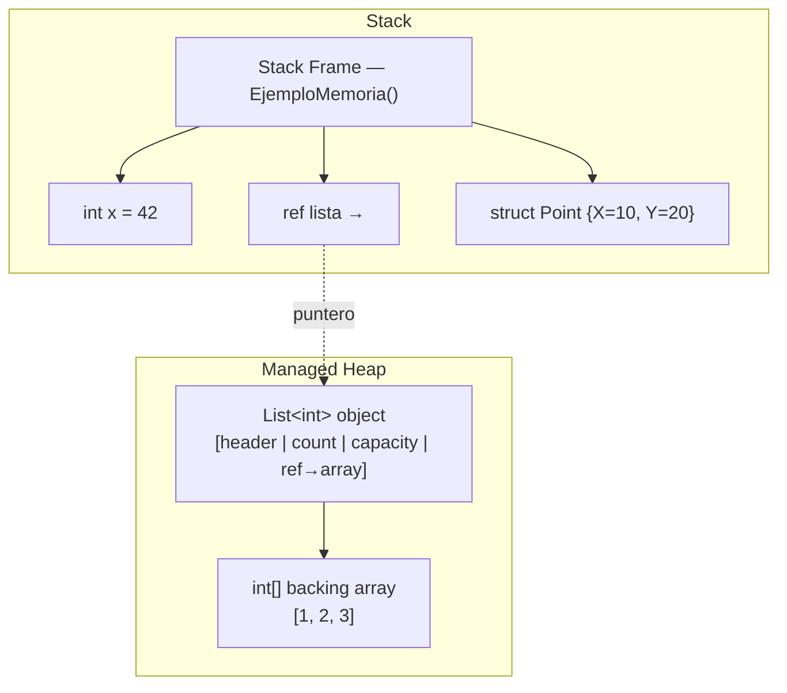
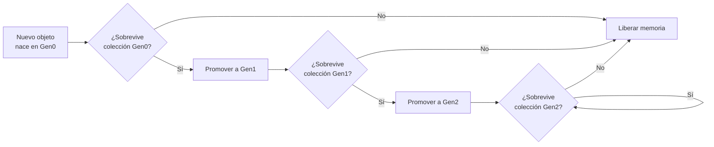
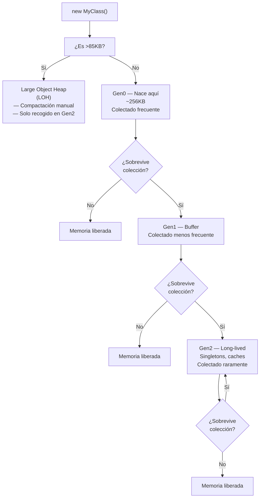

# 01-03 — Memoria y Gestión

> **Prerequisito:** Haber completado [01-02-complejidad-algoritmica.md](./01-02-complejidad-algoritmica.md) y su checkpoint.  
> **Principio de este archivo:** Ya escribes C# todos los días. Este archivo convierte ese conocimiento tácito en conocimiento explícito — lo que ocurre realmente cuando ejecutas tu código.

🎯 **Pluralsight:** Localiza el path **".NET Memory Management"** (autor: Stephen Haunts o Pluralsight author más reciente). Lo abrirás en los puntos indicados inline.

---

## Stack vs Heap — qué va dónde y por qué importa

### La distinción real

Cuando alguien te dice "el stack es rápido y el heap es lento", eso es una simplificación que genera confusión. La distinción real es **quién gestiona el lifetime del dato**.

El **stack** es memoria gestionada por el compilador con precisión de instrucción. Cuando entras a un método, el runtime reserva un bloque de memoria para las variables locales de ese método (el "stack frame"). Cuando el método retorna, ese bloque se libera automáticamente — no hay GC, no hay tracking, solo un puntero de pila que sube y baja. Esto es O(1) real, no amortizado, y sin overhead de ningún tipo.

El **heap** (gestionado) es un pool de memoria donde viven los objetos cuyo lifetime no puede determinarse en tiempo de compilación. El runtime necesita rastrear cuándo un objeto ya no tiene referencias para poder liberar esa memoria. Ese trabajo de rastreo es el Garbage Collector.

La pregunta correcta no es "¿es rápido o lento?" sino **"¿puede el compilador saber exactamente cuándo muere este dato?"** Si sí → stack. Si no → heap.

### Value types vs Reference types

En .NET, esta distinción mapea directamente a la dicotomía stack/heap, pero con una matiz importante:

- **Value types** (`struct`, `int`, `bool`, `double`, `char`, `DateTime`, `Guid`): viven en el stack cuando son variables locales o parámetros de método. Se copian al asignarse.
- **Reference types** (`class`, `string`, `array`, `delegate`): la referencia (puntero) puede vivir en el stack, pero el **objeto en sí** siempre vive en el heap.

```csharp
void EjemploMemoria()
{
    // Stack: x es un int (value type), vive completamente en el stack frame de este método
    int x = 42;
    
    // Stack: la referencia 'lista' vive en el stack
    // Heap: el objeto List<int> y su backing array viven en el heap
    List<int> lista = new List<int> { 1, 2, 3 };
    
    // Stack: el struct Point vive en el stack
    var punto = new Point { X = 10, Y = 20 }; // asumiendo Point es struct
    
} // Al salir: x y punto se "liberan" automáticamente (stack pointer regresa)
  // lista pierde su referencia → objeto en heap es candidato para GC
```

**⚠️ La trampa clásica:** Los value types dentro de un array van al heap. El `int[]` es un objeto (reference type), vive en el heap, y los enteros dentro de él también están en el heap — embebidos directamente en el array, sin boxing, pero en el heap.

```csharp
// El array COMPLETO vive en el heap, incluyendo los ints que contiene
int[] numeros = new int[] { 1, 2, 3, 4, 5 };
// Layout en heap: [header|length|1|2|3|4|5] — todo contiguo
```

### Boxing y Unboxing — cuándo ocurre implícitamente

Boxing es el proceso de empaquetar un value type dentro de un objeto en el heap. Unboxing es lo inverso. Ambos generan allocations y copias — son lentos comparados con acceso directo.

```csharp
// Boxing explícito — el compilador lo ve, tú lo ves
int numero = 42;
object boxed = numero; // Se crea un objeto en el heap que contiene el int 42

// Unboxing — extrae el valor del objeto heap de vuelta al stack
int desempaquetado = (int)boxed; // Cast necesario, exception si el tipo no coincide

// Boxing IMPLÍCITO — el más peligroso porque es invisible
var lista = new ArrayList(); // ArrayList es de la era pre-generics
lista.Add(42); // ← BOXING AQUÍ. ArrayList.Add recibe un object
int valor = (int)lista[0]; // ← UNBOXING AQUÍ

// Solución: usar colecciones genéricas
var listaGenerica = new List<int>();
listaGenerica.Add(42); // Sin boxing — List<int> trabaja con ints directamente
```

⚠️ **Dónde ocurre boxing implícito en código .NET moderno:**
- Pasar un `struct` a un parámetro `object`
- Pasar un value type a una interfaz que implementa (`IComparable`, `IEquatable`)
- String interpolation en algunos casos con value types (aunque el compilador moderno lo optimiza)
- LINQ sobre colecciones no genéricas



---

## .NET Garbage Collector internals

### Por qué existe el GC

El GC existe para resolver el problema que C y C++ tienen en producción: memory leaks manuales. En C++, cada `new` necesita su `delete` correspondiente. Si te olvidas, la memoria se acumula hasta que el proceso explota. Si haces `delete` demasiado pronto, tienes un use-after-free — un crash (en el mejor caso) o una vulnerabilidad de seguridad.

El GC de .NET automatiza este trabajo. El precio: no tienes control determinístico sobre cuándo se libera la memoria. No puedes saber exactamente en qué momento el GC va a correr. Para el 99% de las aplicaciones, este es el trade-off correcto.

### El modelo de generaciones

El GC de .NET es un **generational collector**, basado en una hipótesis estadística verificada empíricamente: la mayoría de los objetos mueren jóvenes. Los que sobreviven tienden a vivir mucho tiempo. Optimizar para este patrón es lo que hace al GC eficiente.



**Gen0 — los recién nacidos:**
- Colectada con mayor frecuencia (puede ocurrir cientos de veces por minuto bajo carga)
- Tamaño pequeño (~256KB en Workstation GC, varía en Server GC)
- La mayoría de los objetos mueren aquí — strings temporales, objetos de scope local, resultados intermedios de LINQ
- Una colección Gen0 es rápida porque el área es pequeña

**Gen1 — el búfer:**
- Actúa como amortiguador entre Gen0 y Gen2
- Colectada menos frecuentemente que Gen0
- Objetos que sobrevivieron Gen0 pero que probablemente no son long-lived

**Gen2 — los sobrevivientes:**
- Objetos long-lived: caché de aplicación, singletons, configuración, diccionarios grandes
- Colectada raramente (puede ser una vez cada varios segundos o menos bajo carga normal)
- Una colección Gen2 es cara — tiene que revisar todo el heap gestionado
- ⚠️ Tener muchos objetos en Gen2 es una señal de arquitectura problemática

**Los thresholds que disparan cada colección:**
El runtime ajusta los thresholds dinámicamente según el comportamiento de la aplicación. Básicamente: cuando Gen0 está llena, se dispara una colección Gen0. Si hay demasiados objetos que sobreviven a Gen0, el threshold de Gen0 aumenta. Si Gen1 se llena, se dispara una colección Gen1 que también recoge Gen0. Una colección Gen2 recoge todo.

### Large Object Heap (LOH)

Cualquier objeto mayor a ~85KB se asigna directamente en el LOH, bypassing completamente el sistema de generaciones.

```csharp
// Este array va al LOH directamente (>85KB)
// 85,000 / 4 bytes por int ≈ 21,250 ints
byte[] bufferGrande = new byte[86_000]; // ← LOH

// Este va a Gen0 normalmente
byte[] bufferPequeño = new byte[1_000]; // ← Gen0
```

**Por qué el LOH es problemático:**

1. **No se compacta por defecto.** Compactar el LOH implicaría mover objetos grandes, lo cual es caro. El resultado es **fragmentación** — huecos entre objetos que no pueden reutilizarse eficientemente.

2. **Se recoge solo durante colecciones Gen2.** Si el LOH se llena, se dispara una Gen2 — la colección más cara.

3. **Stop-the-world.** Durante una colección Gen2 con compactación del LOH, todos los threads de tu aplicación se pausan. En una API, eso se traduce en latencia spikes.

**Cómo evitar presión en el LOH:**

```csharp
// ❌ Crea un nuevo array grande en cada request → presión LOH
public byte[] ProcesarRequest(Stream input)
{
    byte[] buffer = new byte[1_000_000]; // LOH cada vez
    // ...
    return buffer;
}

// ✅ ArrayPool<T> — reutiliza arrays grandes del pool
using System.Buffers;

public byte[] ProcesarRequest(Stream input)
{
    // Pide un array del pool — no nueva allocation en LOH
    byte[] buffer = ArrayPool<byte>.Shared.Rent(1_000_000);
    try
    {
        // Usar buffer
        int bytesLeidos = input.Read(buffer, 0, buffer.Length);
        // procesar...
        return buffer[..bytesLeidos]; // Retornar solo los bytes usados
    }
    finally
    {
        // Devolver al pool cuando termines
        ArrayPool<byte>.Shared.Return(buffer);
    }
}
```

### GC Modes: Server GC vs Workstation GC

Para una API en Azure, esto importa:

| Característica | Workstation GC | Server GC |
|---|---|---|
| Threads de GC | 1 | 1 por CPU core |
| Heaps | 1 | 1 por CPU core |
| Optimizado para | Responsividad de UI | Throughput de servidor |
| Pauses | Más cortas pero más frecuentes | Más largas pero menos frecuentes |
| Default en | Aplicaciones de escritorio | ASP.NET Core en producción |

En ASP.NET Core, Server GC está habilitado automáticamente cuando hay más de un CPU. Puedes configurarlo en el `.csproj`:

```xml
<PropertyGroup>
  <ServerGarbageCollection>true</ServerGarbageCollection>
  <!-- Opcional: GC concurrente reduce pauses a cambio de más CPU -->
  <ConcurrentGarbageCollection>true</ConcurrentGarbageCollection>
</PropertyGroup>
```

### Por qué NO debes llamar GC.Collect() en producción

```csharp
// ❌ Esto es casi siempre un error en producción
GC.Collect();
GC.WaitForPendingFinalizers();
GC.Collect();

// Por qué es un error:
// 1. Fuerza una colección Gen2 — la más cara
// 2. Promueve objetos que iban a morir en Gen0 directamente a Gen2
//    (porque "sobrevivieron" la colección forzada aunque nadie los referencie después)
// 3. Aumenta la presión de Gen2 en el largo plazo
// 4. El GC ya tiene heurísticas para decidir cuándo recolectar — eres menos inteligente que él

// ✅ La única excepción válida: pruebas de benchmarking donde necesitas estado conocido
// antes de medir. Y en ese caso, con comentario explicando por qué.
[Benchmark]
public void MiBenchmark()
{
    // Antes de la medición, estado limpio conocido
    GC.Collect();
    GC.WaitForPendingFinalizers();
    // ahora medir...
}
```

🎯 **Pluralsight → ".NET Memory Management":** Abre el módulo sobre GC internals ahora. Los videos visualizan las generaciones y el proceso de compactación mejor que cualquier texto.

---

## GC Pressure — cómo tu código afecta al GC

GC pressure es la tasa a la que tu código genera garbage (objetos que mueren jóvenes). Alta presión → GC corre más frecuente → pauses más frecuentes → latencia spikes en tu API.

### Patrones que generan presión innecesaria

**1. String concatenation en loops:**

```csharp
// ❌ O(n²) allocations — cada concatenación crea un nuevo string
string resultado = "";
for (int i = 0; i < 10_000; i++)
{
    resultado += $"línea {i}\n"; // Nuevo string en heap en CADA iteración
}

// ✅ StringBuilder — append in-place, una sola allocation al final
var sb = new StringBuilder(capacity: 10_000 * 15); // Capacity hint para evitar resizes internos
for (int i = 0; i < 10_000; i++)
{
    sb.Append("línea ");
    sb.Append(i);
    sb.Append('\n');
}
string resultado = sb.ToString(); // Una sola allocation
```

**2. LINQ con objetos intermedios innecesarios:**

```csharp
// ❌ ToList() fuerza evaluación y crea una nueva lista en heap
var resultado = pedidos
    .Where(p => p.Monto > 1000)
    .OrderBy(p => p.Fecha)
    .ToList() // ← allocation aquí...
    .Take(10) // ← iteración sobre la lista completa innecesaria
    .ToList(); // ← otra allocation

// ✅ Diferir evaluación — LINQ es lazy por defecto
var resultado = pedidos
    .Where(p => p.Monto > 1000)
    .OrderBy(p => p.Fecha)
    .Take(10)
    .ToList(); // Solo una materialización al final, con solo 10 elementos
```

**3. Closures que extienden el lifetime de objetos:**

```csharp
// ❌ El closure captura 'datos' — el objeto grande no puede ser GC'd
// mientras el Func<T> esté vivo
var datos = CargarDatosGrandes(); // 500MB en memoria
Func<string> consulta = () => datos.BuscarAlgo("clave"); // closure captura 'datos'

// Pasamos el Func a algún servicio de larga vida...
_servicioCache.Registrar("mi-consulta", consulta);
// 'datos' (500MB) ahora vive tanto como _servicioCache

// ✅ Capturar solo lo necesario
var indice = datos.GenerarIndice(); // Solo el índice pequeño
datos = null; // Liberar el objeto grande explícitamente antes del closure
Func<string> consulta = () => indice.Buscar("clave");
```

**4. Event handlers que no se desuscriben — el memory leak clásico de .NET:**

```csharp
// ❌ MiServicio (long-lived) mantiene viva a MiVista (debería ser short-lived)
public class MiVista : IDisposable
{
    private readonly MiServicio _servicio;
    
    public MiVista(MiServicio servicio)
    {
        _servicio = servicio;
        _servicio.DatosActualizados += OnDatosActualizados; // ← subscripción
    }
    
    private void OnDatosActualizados(object? sender, EventArgs e) { /* ... */ }
    
    // ❌ Si no implementas IDisposable y te desubscribes,
    // _servicio mantiene una referencia a MiVista via el event handler
    // MiVista nunca será GC'd aunque "nadie más la referencie"
    
    // ✅ Siempre desubscribirse en Dispose
    public void Dispose()
    {
        _servicio.DatosActualizados -= OnDatosActualizados;
    }
}
```

---

## Span\<T\> y Memory\<T\> — zero-allocation patterns

### El problema que resuelven

Considera parsear el header `"Content-Type: application/json"` de un HTTP request. El enfoque naive:

```csharp
// ❌ Naive: 3 allocations de string en heap
string header = "Content-Type: application/json";
string[] partes = header.Split(':');          // allocation: array + 2 strings
string nombre = partes[0].Trim();             // allocation: string "Content-Type"
string valor = partes[1].Trim();              // allocation: string " application/json"
```

En ASP.NET Core bajo carga, esta función puede ejecutarse millones de veces por hora. Cada llamada aloca objetos que el GC tiene que limpiar. Multiplica eso por todos los headers de todos los requests.

### Qué es Span\<T\>

`Span<T>` es una **vista** sobre memoria existente. No posee los datos — simplemente los referencia. Puede apuntar a memoria en el stack, en el heap, o incluso a memoria no gestionada.

La restricción clave: `Span<T>` es un `ref struct` — **solo puede vivir en el stack**. No puede ser campo de una clase, no puede usarse en métodos `async`, no puede ser capturada por closures.

```csharp
using System;

// ✅ Zero-allocation parsing con ReadOnlySpan<char>
void ParsearHeader(string header)
{
    ReadOnlySpan<char> span = header.AsSpan(); // Sin allocation — span referencia el string existente
    
    int colonIndex = span.IndexOf(':');
    if (colonIndex < 0) return;
    
    // Slices — sin copia, sin allocation
    ReadOnlySpan<char> nombre = span[..colonIndex].Trim();
    ReadOnlySpan<char> valor = span[(colonIndex + 1)..].Trim();
    
    // Comparación sin allocation
    if (nombre.Equals("Content-Type", StringComparison.OrdinalIgnoreCase))
    {
        Console.WriteLine($"Valor: {valor.ToString()}"); // Solo aquí, si necesitas un string real
    }
}

// Ejemplo: parsear CSV sin allocations
static int ParsearNumeroDesdeSpan(ReadOnlySpan<char> texto)
{
    // int.Parse tiene overload para Span — sin crear string intermedio
    return int.Parse(texto.Trim());
}

void ProcesarLineasCSV(string csv)
{
    ReadOnlySpan<char> restante = csv.AsSpan();
    
    while (!restante.IsEmpty)
    {
        int indiceNewline = restante.IndexOf('\n');
        ReadOnlySpan<char> linea = indiceNewline >= 0 
            ? restante[..indiceNewline] 
            : restante;
        
        // Procesar cada campo de la línea sin crear strings
        int indiceComa = linea.IndexOf(',');
        if (indiceComa >= 0)
        {
            var campo1 = linea[..indiceComa];
            var campo2 = linea[(indiceComa + 1)..];
            int numero = ParsearNumeroDesdeSpan(campo2);
            // usar campo1, numero...
        }
        
        restante = indiceNewline >= 0 ? restante[(indiceNewline + 1)..] : ReadOnlySpan<char>.Empty;
    }
}
```

### Span\<T\> vs Memory\<T\>

| Característica | `Span<T>` | `Memory<T>` |
|---|---|---|
| ¿Stack-only? | Sí (`ref struct`) | No — puede ser campo de clase |
| ¿Usable en async? | No | Sí |
| ¿Puede ser campo de clase? | No | Sí |
| Overhead | Mínimo | Ligeramente mayor |
| Cuándo usar | Métodos sync, parsing rápido | Cuando necesitas guardar la referencia o usar en async |

```csharp
// Memory<T> para contextos async
public async Task ProcesarBufferAsync(Memory<byte> buffer)
{
    // Memory<T> puede cruzar await — Span<T> no puede
    await _stream.ReadAsync(buffer);
    
    // Para operaciones sync dentro del método async:
    Span<byte> span = buffer.Span; // Obtener Span solo en la sección sync
    // procesar span aquí de forma sync
}
```

**Cuándo NO vale la pena:**
- Código que no es un hot path de performance
- Cuando la complejidad adicional supera el beneficio medible
- Siempre mide con BenchmarkDotNet antes de optimizar — la suposición de que "hay un problema" suele ser incorrecta

🎯 **BenchmarkDotNet:** Para cualquier optimización de memoria, valida el impacto real con `[MemoryDiagnoser]` en tus benchmarks. Lo que parece obvio en papel puede no mover la aguja en práctica.

---

## IDisposable y using — gestión determinista de recursos

### La diferencia fundamental

El GC gestiona **memoria gestionada** (objetos en el heap de .NET). No gestiona **recursos no gestionados** — handles del OS, file descriptors, conexiones de red, conexiones de base de datos, sockets.

Para esos recursos necesitas `IDisposable` — un contrato que le dice al consumidor "este objeto tiene recursos que debes liberar explícitamente cuando termines".

```csharp
// Implementación correcta del patrón Dispose con finalizer
public class RecursoConHandle : IDisposable
{
    private IntPtr _handle;        // Recurso no gestionado
    private bool _disposed = false;

    public RecursoConHandle()
    {
        _handle = ObtenerHandleDelOS(); // Simula abrir un file handle, socket, etc.
    }

    // Dispose público — llamado por el consumidor via using
    public void Dispose()
    {
        Dispose(disposing: true);
        GC.SuppressFinalize(this); // Evitar que el finalizer también corra
    }

    // Finalizer — defensa de último recurso si el consumidor olvidó hacer Dispose
    ~RecursoConHandle()
    {
        Dispose(disposing: false);
    }

    // El método que hace el trabajo real
    protected virtual void Dispose(bool disposing)
    {
        if (_disposed) return;

        if (disposing)
        {
            // Liberar recursos GESTIONADOS (otros IDisposables que poseemos)
            // Solo cuando el consumidor llama Dispose(), no desde el finalizer
        }

        // Liberar recursos NO GESTIONADOS — siempre, incluso desde finalizer
        if (_handle != IntPtr.Zero)
        {
            LiberarHandleDelOS(_handle);
            _handle = IntPtr.Zero;
        }

        _disposed = true;
    }
    
    private IntPtr ObtenerHandleDelOS() => new IntPtr(1); // Simulado
    private void LiberarHandleDelOS(IntPtr handle) { } // Simulado
}
```

### using statement vs using declaration

```csharp
// Estilo clásico — using statement (scope explícito con llaves)
using (var conexion = new SqlConnection(connectionString))
{
    conexion.Open();
    // ... usar conexion
} // Dispose() llamado automáticamente aquí, incluso si hay exception

// C# 8+ — using declaration (Dispose al final del scope del método)
// Más limpio cuando el scope natural es el método completo
using var conexion = new SqlConnection(connectionString);
conexion.Open();
// ... usar conexion
// Dispose() llamado al final del bloque (método, if, etc.) que lo contiene
```

### El bug de producción más común con IDisposable: HttpClient

⚠️ Este es el error que aparece en entrevistas y en producción con consecuencias graves:

```csharp
// ❌ Socket exhaustion — crea y destruye HttpClient por request
public class MiServicio
{
    public async Task<string> ObtenerDatosAsync(string url)
    {
        // Cada request crea UN NUEVO HttpClient y lo destruye
        using var client = new HttpClient();
        return await client.GetStringAsync(url);
    }
    // Problema: Dispose() cierra el socket, pero el OS mantiene la conexión
    // en estado TIME_WAIT por ~4 minutos. Bajo carga, agotamos los sockets disponibles.
    // Resultado en producción: "Unable to connect to the remote server" bajo carga.
}

// ✅ Opción 1: HttpClient como campo estático o singleton
public class MiServicio
{
    // Reusar la misma instancia — el socket pool se gestiona internamente
    private static readonly HttpClient _client = new HttpClient();
    
    public async Task<string> ObtenerDatosAsync(string url)
    {
        return await _client.GetStringAsync(url);
    }
    // Problema con este approach: no respeta cambios de DNS
}

// ✅ Opción 2: IHttpClientFactory (la forma correcta en ASP.NET Core)
// En Program.cs:
// builder.Services.AddHttpClient<MiServicio>();

public class MiServicio
{
    private readonly HttpClient _client;
    
    // ASP.NET Core inyecta un HttpClient gestionado por IHttpClientFactory
    public MiServicio(HttpClient client)
    {
        _client = client;
    }
    
    public async Task<string> ObtenerDatosAsync(string url)
    {
        return await _client.GetStringAsync(url);
    }
    // IHttpClientFactory gestiona el pool de HttpMessageHandler internamente
    // Respeta cambios de DNS, permite configurar policies (Polly), y hace cleanup correcto
}
```

---

## Resumen — Mapa mental de la gestión de memoria en .NET



---

> **🏁 Checkpoint:** Antes de avanzar, debes poder responder:  
> 1. ¿Por qué `int[]` vive en el heap aunque `int` sea un value type?  
> 2. ¿Qué ocurre cuando un objeto de Gen0 sobrevive a una colección GC?  
> 3. ¿Por qué boxing en un loop tight es un problema de performance?  
> 4. ¿Cuándo usas `Span<T>` vs `Memory<T>`?  
> 5. ¿Por qué no debes crear `HttpClient` por cada request?  
>
> **Siguiente archivo:** [01-04-os-y-concurrencia-base.md →](./01-04-os-y-concurrencia-base.md)
