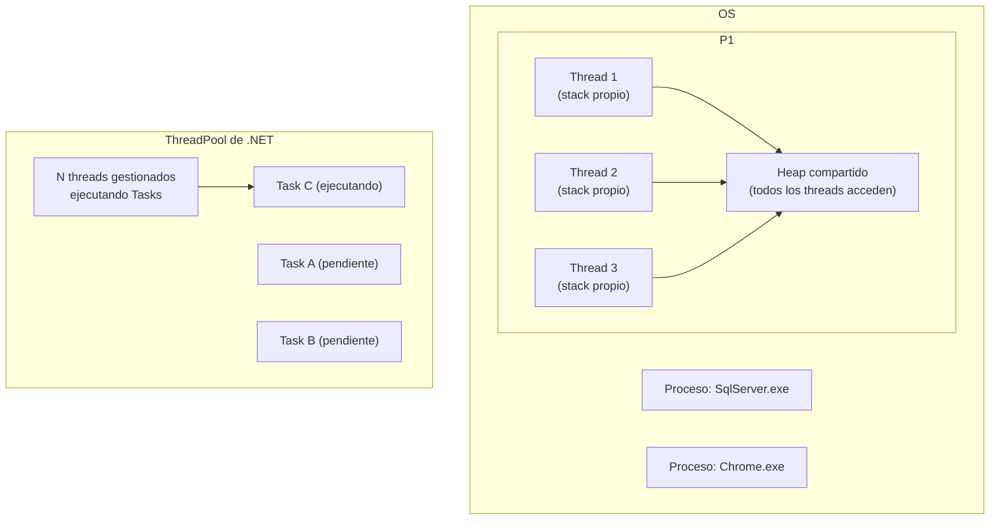
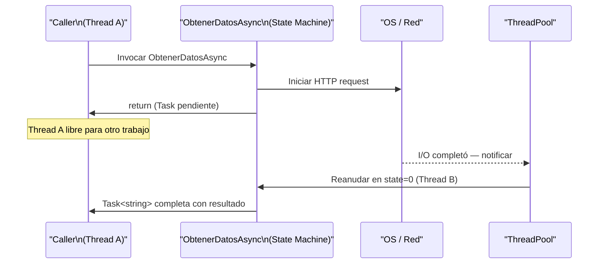

# 01-04 — OS y Concurrencia Base

> **Prerequisito:** Haber completado [01-03-memoria-y-gestion.md](./01-03-memoria-y-gestion.md) y su checkpoint.  
> **Principio de este archivo:** Usas `async/await` todos los días. Este archivo explica qué ocurre realmente cuando lo haces — desde el nivel del OS hasta la máquina de estados generada por el compilador.

🎯 **Pluralsight:** Localiza el path **"Concurrent Programming in C#"** (busca por Bryan Cox o el path más reciente). Lo usarás en la segunda mitad de este archivo.

---

## Procesos vs Threads vs Tasks — la jerarquía de ejecución

### Proceso: la unidad de aislamiento

Un **proceso** es la unidad de aislamiento del OS. Cada proceso tiene su propio espacio de memoria virtual — un proceso no puede leer ni escribir la memoria de otro proceso directamente. Si tu API de ASP.NET Core crashea, el proceso de la base de datos no se ve afectado. Eso es el aislamiento del OS trabajando.

Un proceso contiene:
- Su propio espacio de memoria virtual (ver [01-03-memoria-y-gestion.md](./01-03-memoria-y-gestion.md))
- Al menos un thread
- Handles a recursos del OS (files, sockets, etc.)
- El runtime de .NET (CLR) en su propio espacio

### Thread: la unidad de ejecución

Un **thread** (hilo) es la unidad de ejecución dentro de un proceso. Múltiples threads comparten la memoria del proceso — pueden leer y escribir las mismas variables. Eso los hace eficientes para compartir datos, y peligrosos si no se sincronizan correctamente.

Cada thread tiene su propio:
- Stack (típicamente 1MB en .NET por defecto)
- Registro de CPU (instruction pointer, registros de propósito general)
- Estado de ejecución

### Task/Coroutine: la unidad de concurrencia cooperativa

Un **Task** en .NET (o coroutine en otros runtimes) NO es un thread. Es una unidad de trabajo que puede ser ejecutada por un thread cuando esté disponible. Un thread puede ejecutar miles de Tasks secuencialmente. Esto es fundamental para entender async/await.



---

## Context Switching — qué es y cuánto cuesta

### El mecanismo exacto

El OS es preemptivo: el scheduler decide cuándo cada thread corre, independientemente de lo que el thread quiera hacer. Cuando el OS decide cambiar de Thread A a Thread B, ocurre esto:

1. **Guardar el estado de Thread A:** El OS guarda todos los registros del CPU (instruction pointer, stack pointer, registros generales, floating-point registers) en la estructura del OS para Thread A (PCB/TCB).
2. **Cambiar al espacio del kernel:** Este cambio de user mode a kernel mode ya tiene un costo.
3. **El scheduler decide:** ¿Qué thread corre ahora?
4. **Restaurar el estado de Thread B:** Cargar los registros guardados de Thread B.
5. **Invalidar el TLB:** La Translation Lookaside Buffer cachea las traducciones de memoria virtual a física. Al cambiar de thread, las entradas del TLB del thread anterior pueden ser inválidas.
6. **Cache misses:** Los datos de Thread A estaban calientes en el caché del CPU. Thread B trabaja con datos diferentes — los primeros accesos son cache misses lentos.

**El costo real:** Un context switch tarda entre 1 y 10 microsegundos dependiendo del hardware. Parece poco. Bajo carga con miles de threads cambiando frecuentemente, se convierte en una fracción significativa del tiempo de CPU gastada en overhead puro.

### El problema de demasiados threads

```csharp
// ❌ El antipatrón que destruye el rendimiento bajo carga
// "Parallelizar" creando un thread por tarea
public void ProcesarPedidosMal(List<Pedido> pedidos)
{
    var threads = new List<Thread>();
    foreach (var pedido in pedidos)
    {
        var t = new Thread(() => ProcesarPedido(pedido));
        t.Start();
        threads.Add(t);
    }
    foreach (var t in threads)
        t.Join();
}
// Con 10,000 pedidos: 10,000 threads
// - Cada thread reserva 1MB de stack → 10GB solo en stacks
// - El scheduler tiene que context-switch entre 10,000 threads
// - El throughput CAE bajo carga alta porque el CPU gasta más tiempo
//   en switching que en trabajo real

// ✅ ThreadPool — el OS no, .NET gestiona un pool de threads reutilizables
public void ProcesarPedidosConThreadPool(List<Pedido> pedidos)
{
    using var countdown = new CountdownEvent(pedidos.Count);
    foreach (var pedido in pedidos)
    {
        ThreadPool.QueueUserWorkItem(_ =>
        {
            ProcesarPedido(pedido);
            countdown.Signal();
        });
    }
    countdown.Wait();
}

// ✅✅ La forma moderna — Parallel.ForEach con Tasks
// El runtime calibra el número de threads según CPUs disponibles
public void ProcesarPedidosModerno(List<Pedido> pedidos)
{
    Parallel.ForEach(pedidos, pedido => ProcesarPedido(pedido));
}

// ✅✅✅ Para trabajo I/O-bound — async/await es superior a todo lo anterior
public async Task ProcesarPedidosAsync(List<Pedido> pedidos)
{
    var tasks = pedidos.Select(p => ProcesarPedidoAsync(p));
    await Task.WhenAll(tasks);
    // Sin threads adicionales — un solo thread orquesta todo usando I/O callbacks
}
```

### ThreadPool de .NET: work-stealing

El ThreadPool de .NET no es un simple pool de threads con una cola global. Implementa **work-stealing**: cada thread del pool tiene su propia cola local de trabajo. Cuando un thread termina su cola local, "roba" trabajo de la cola de otro thread.

Beneficio: reduce la contención en la cola global. Los threads trabajan de forma más independiente. El throughput escala mejor con el número de CPUs.

---

## Scheduling — cómo el OS decide quién corre

### Round Robin con preemption

El scheduler más común para hilos de igual prioridad es Round Robin con time quantum. Cada thread recibe un "time slice" (típicamente 15-20ms en Windows). Cuando se agota, el thread es preemptado (sacado del CPU) y el siguiente thread en la cola toma el control.

**Por qué esto importa en entrevistas Staff:** Cuando alguien dice "diseña un task scheduler", necesitas entender:
- ¿Cuánto trabajo hace cada task? (granularidad)
- ¿Qué prioridades tienen? (priority scheduling)
- ¿Hay dependencias entre tasks? (DAG de dependencies)
- ¿El trabajo es CPU-bound o I/O-bound? (estrategia diferente para cada uno)

### Priority Inversion — el bug clásico de scheduling

Priority inversion ocurre cuando un thread de alta prioridad es bloqueado por un thread de baja prioridad que posee un recurso (lock) que el de alta prioridad necesita. Si un thread de prioridad media hace CPU-intensive work, puede prevenir que el thread de baja prioridad libere el lock — el thread de alta prioridad queda hambriento indefinidamente.

En .NET, es raro llegar a este problema porque el GC y el runtime manejan la mayoría de la sincronización. Pero en sistemas de tiempo real es crítico.

---

## Virtual Memory y Paginación — el modelo mental suficiente

### Por qué los procesos ven "toda" la memoria

Tu API en .NET ve 64 bits de espacio de direcciones (16 exabytes teóricos) aunque el servidor tenga 32GB de RAM. Eso es **memoria virtual**: el OS crea la ilusión de memoria abundante para cada proceso.

La memoria real (RAM física) se divide en **páginas** (típicamente 4KB). El OS mantiene una tabla de páginas que traduce las direcciones virtuales que ve tu proceso a páginas físicas en RAM.

### Page Fault

Cuando accedes a una dirección virtual que no está mapeada a RAM actualmente, el CPU genera un **page fault**. El OS:
1. Pausa el thread que causó el fault
2. Encuentra una página de RAM libre (o hace espacio liberando una página menos usada — "swapping")
3. Carga los datos necesarios (desde el disco si estaban swapped)
4. Actualiza la tabla de páginas
5. Reanuda el thread

Un page fault que requiere ir a disco tarda ~10ms. Una instrucción de CPU tarda ~1ns. La diferencia es de 7 órdenes de magnitud.

**Implicación para system design:** Si tu aplicación tiene un working set (conjunto de páginas activamente usadas) mayor que la RAM disponible, el OS constantemente hace swapping → rendimiento destruido. Para APIs de alta carga, el working set debe caber en RAM.

---

## Race Conditions y Deadlocks — desde primeros principios

### Race Condition

Una race condition ocurre cuando el resultado de una operación depende del orden de ejecución no determinístico de múltiples threads.

```csharp
// Ejemplo clásico — dos threads incrementando un contador
public class ContadorInseguro
{
    private int _valor = 0;
    
    public void Incrementar() => _valor++; // NO es atómico
    
    public int Valor => _valor;
}

// Por qué i++ no es atómica — son 3 instrucciones de CPU:
// 1. LOAD:  cargar _valor de memoria al registro del CPU
// 2. ADD:   incrementar el registro
// 3. STORE: guardar el registro de vuelta a memoria

// Timeline con dos threads:
// Thread A: LOAD (lee 5)
// Thread B: LOAD (lee 5)  ← el scheduler cambió antes de que A hiciera STORE
// Thread A: ADD → 6, STORE → _valor = 6
// Thread B: ADD → 6, STORE → _valor = 6
// Resultado: dos incrementos, pero _valor es 6 en lugar de 7
// ← esta es la race condition

void DemostrarRaceCondition()
{
    var contador = new ContadorInseguro();
    var tareas = new List<Task>();
    
    for (int i = 0; i < 1000; i++)
        tareas.Add(Task.Run(() => contador.Incrementar()));
    
    Task.WaitAll(tareas.ToArray());
    
    // Casi nunca será 1000 — el resultado es no determinístico
    Console.WriteLine($"Esperado: 1000, Obtenido: {contador.Valor}");
}
```

### Atomicidad

Una operación es **atómica** si ocurre completamente o no ocurre — no puede ser interrumpida por otro thread en la mitad.

```csharp
// ✅ Interlocked — operaciones atómicas sin lock
public class ContadorSeguro
{
    private int _valor = 0;
    
    // Interlocked.Increment es una sola instrucción de CPU (en x86: LOCK XADD)
    // No puede ser interrumpida entre LOAD y STORE
    public void Incrementar() => Interlocked.Increment(ref _valor);
    
    // Volatile.Read garantiza que leemos el valor más reciente (no una copia cacheada)
    public int Valor => Volatile.Read(ref _valor);
}
```

### Deadlock

Un deadlock ocurre cuando dos (o más) threads esperan mutuamente un recurso que el otro posee — ninguno puede avanzar.

**Las 4 condiciones de Coffman** (todas deben darse simultáneamente para que ocurra un deadlock):
1. **Exclusión mutua:** Los recursos no se comparten — solo un thread puede tener el lock
2. **Hold and wait:** Un thread tiene un recurso y espera otro
3. **No preemption:** El OS no puede quitarle el lock al thread por la fuerza
4. **Espera circular:** Thread A espera a Thread B que espera a Thread A

```csharp
// Deadlock clásico — dos locks en orden inverso
private static readonly object _lockA = new();
private static readonly object _lockB = new();

void Thread1()
{
    lock (_lockA)  // Adquiere A
    {
        Thread.Sleep(100); // Simulamos trabajo
        lock (_lockB) // Espera B — pero Thread2 ya lo tiene
        {
            Console.WriteLine("Thread1 terminó");
        }
    }
}

void Thread2()
{
    lock (_lockB)  // Adquiere B
    {
        Thread.Sleep(100);
        lock (_lockA) // Espera A — pero Thread1 ya lo tiene
        {
            Console.WriteLine("Thread2 terminó");
        }
    }
}

// ✅ Solución: consistencia en el orden de adquisición de locks
// SIEMPRE adquirir locks en el mismo orden en todos los threads
void Thread1Fixed()
{
    lock (_lockA) { lock (_lockB) { /* trabajo */ } }
}

void Thread2Fixed()
{
    lock (_lockA) { lock (_lockB) { /* trabajo */ } } // Mismo orden que Thread1
}
```

### Livelock y Starvation

**Livelock:** Los threads no están bloqueados — están activos, pero no progresan. Como dos personas en un pasillo angosto que cada una se mueve para dejar pasar a la otra, pero en la misma dirección simultáneamente.

**Starvation:** Un thread nunca obtiene el recurso que necesita porque otros threads con mayor prioridad o "más suerte" siempre lo toman antes.

---

## Mutex, Semaphore, Monitor — cuándo usar cada uno

### lock (Monitor) — el más común

`lock` en C# es azúcar sintáctica sobre `Monitor.Enter` y `Monitor.Exit`. El compilador lo expande a:

```csharp
// Esto:
lock (_miObjeto) { /* trabajo crítico */ }

// Se convierte en esto:
bool lockTomado = false;
try
{
    Monitor.Enter(_miObjeto, ref lockTomado);
    /* trabajo crítico */
}
finally
{
    if (lockTomado) Monitor.Exit(_miObjeto);
}
```

⚠️ **`lock(this)` es una mala práctica:** Cualquier código externo puede hacer `lock(miInstancia)` en tu objeto y causar un deadlock. El objeto de lock debe ser privado.

⚠️ **`lock(typeof(MiClase))` también es mala práctica:** El Type object es global y compartido — cualquier código en el AppDomain puede tomarlo.

```csharp
// ✅ Patrón correcto
public class MiClase
{
    // Objeto de lock privado, no expuesto
    private readonly object _lock = new object();
    private int _estado;
    
    public void ModificarEstado(int nuevoValor)
    {
        lock (_lock) // Solo código dentro de esta clase puede tomar este lock
        {
            _estado = nuevoValor;
        }
    }
}
```

### Mutex — sincronización entre procesos

`Mutex` es más pesado que `Monitor`. Se usa cuando necesitas sincronización entre procesos (no solo threads del mismo proceso).

```csharp
// Named mutex — visible entre procesos
using var mutex = new Mutex(initiallyOwned: false, name: "Global\\MiAplicacion");

// Garantizar que solo UNA instancia de la aplicación corre a la vez
bool esNuevaInstancia;
using var singleInstance = new Mutex(true, "MiApp_Instancia_Unica", out esNuevaInstancia);
if (!esNuevaInstancia)
{
    Console.WriteLine("Ya hay una instancia corriendo");
    return;
}
// Continuar con la ejecución normal
```

### SemaphoreSlim — throttling de concurrencia

`SemaphoreSlim` permite que exactamente N threads accedan a una sección crítica simultáneamente. El caso de uso más común en APIs modernas: **throttling de llamadas a servicios externos**.

```csharp
// Limitar a máximo 10 llamadas concurrentes a una API externa
public class ServicioConThrottling
{
    // SemaphoreSlim es la versión async-friendly (tiene WaitAsync)
    private readonly SemaphoreSlim _throttle = new SemaphoreSlim(10, 10);
    private readonly HttpClient _client;
    
    public ServicioConThrottling(HttpClient client)
    {
        _client = client;
    }
    
    public async Task<string> LlamarApiExternaAsync(string url)
    {
        // WaitAsync — async, no bloquea el thread mientras espera el semáforo
        await _throttle.WaitAsync();
        try
        {
            return await _client.GetStringAsync(url);
        }
        finally
        {
            _throttle.Release(); // SIEMPRE en finally — incluso si hay exception
        }
    }
}
```

### ReaderWriterLockSlim — múltiples lectores, un escritor

```csharp
// Para datos que se leen frecuentemente pero se modifican rara vez
public class CacheConRWLock
{
    private readonly ReaderWriterLockSlim _lock = new ReaderWriterLockSlim();
    private readonly Dictionary<string, object> _cache = new();
    
    public object? Leer(string key)
    {
        _lock.EnterReadLock(); // Múltiples lectores simultáneos — no se bloquean entre sí
        try
        {
            return _cache.TryGetValue(key, out var valor) ? valor : null;
        }
        finally
        {
            _lock.ExitReadLock();
        }
    }
    
    public void Escribir(string key, object valor)
    {
        _lock.EnterWriteLock(); // Un solo escritor — bloquea TODOS los lectores
        try
        {
            _cache[key] = valor;
        }
        finally
        {
            _lock.ExitWriteLock();
        }
    }
}
```

---

## Async/Await internals — el modelo mental correcto

Esta es la sección más importante de este archivo. Si ya usas async/await, necesitas entender qué hace el compilador por debajo.

### La máquina de estados

Cuando el compilador de C# encuentra un método `async`, lo **transforma completamente**. El método original se convierte en una clase que implementa una máquina de estados.

```csharp
// LO QUE TÚ ESCRIBES:
public async Task<string> ObtenerDatosAsync(string url)
{
    Console.WriteLine("Antes del await");
    var response = await _client.GetStringAsync(url); // Punto de suspensión
    Console.WriteLine("Después del await");
    return response;
}

// LO QUE EL COMPILADOR GENERA (simplificado conceptualmente):
// Una clase con estado que puede pausarse y reanudarse
private class ObtenerDatosStateMachine : IAsyncStateMachine
{
    public int _state = -1; // -1 = inicio, 0 = esperando GetStringAsync, -2 = terminado
    public AsyncTaskMethodBuilder<string> _builder;
    public string _url;
    private HttpClient _client;
    private string _response;
    private TaskAwaiter<string> _awaiter;
    
    public void MoveNext()
    {
        switch (_state)
        {
            case -1: // Primera entrada
                Console.WriteLine("Antes del await");
                
                var task = _client.GetStringAsync(_url);
                _awaiter = task.GetAwaiter();
                
                if (!_awaiter.IsCompleted) // ¿Ya terminó? (cache hit, respuesta inmediata)
                {
                    _state = 0; // Recordar dónde estábamos
                    // Registrar callback: "cuando termine, llámame de vuelta"
                    _builder.AwaitUnsafeOnCompleted(ref _awaiter, ref this);
                    return; // ← AQUÍ EL MÉTODO RETORNA AL CALLER
                    // El thread queda libre para hacer otro trabajo
                }
                goto case 0; // Si ya terminó, continuar directo
                
            case 0: // Callback — el I/O terminó, un thread del pool nos reanuda
                _response = _awaiter.GetResult();
                Console.WriteLine("Después del await");
                _builder.SetResult(_response); // La Task<string> completa con el resultado
                break;
        }
    }
}
```

**Lo que esto significa en práctica:**

Cuando ejecutas `await _client.GetStringAsync(url)`:
1. El runtime inicia la operación I/O (enviar el HTTP request)
2. **El thread actual es liberado** — regresa al ThreadPool para hacer otro trabajo
3. El OS y el hardware de red manejan el I/O de forma asíncrona (I/O Completion Ports en Windows, epoll en Linux)
4. Cuando la respuesta llega, el OS notifica al runtime
5. Un thread del ThreadPool (puede ser el mismo o uno diferente) reanuda la ejecución después del `await`



### Async NO significa multi-thread

Este es el malentendido más común:

```csharp
// Este código es SINGLE-THREADED en su mayor parte
public async Task DemoAsync()
{
    Console.WriteLine($"1. Thread: {Thread.CurrentThread.ManagedThreadId}");
    
    await Task.Delay(100); // Suspende — libera el thread
    
    // Puede ser un thread diferente, pero probablemente el mismo en ASP.NET Core
    Console.WriteLine($"2. Thread: {Thread.CurrentThread.ManagedThreadId}");
}

// async resuelve el problema de I/O-bound: no bloquear threads mientras se espera I/O
// NO agrega paralelismo — para CPU-bound, necesitas Task.Run() o Parallel
```

### I/O-bound vs CPU-bound — la distinción que define la estrategia

```csharp
// ✅ I/O-bound: async/await — libera el thread durante la espera
public async Task<string> LeerArchivo(string path)
{
    return await File.ReadAllTextAsync(path); // Thread libre mientras el disco trabaja
}

// ✅ CPU-bound: Task.Run — manda trabajo pesado a un thread del pool
// para no bloquear el thread de tu request
public async Task<byte[]> ComprimirDatos(byte[] datos)
{
    return await Task.Run(() =>
    {
        // Compresión intensiva de CPU — corre en un thread del pool
        using var output = new MemoryStream();
        using var gzip = new GZipStream(output, CompressionMode.Compress);
        gzip.Write(datos, 0, datos.Length);
        return output.ToArray();
    });
}

// ❌ Error: usar Task.Run para I/O-bound — desperdicias un thread bloqueado
public async Task<string> MalUsoDeTaskRun(string url)
{
    // Task.Run toma un thread del pool Y lo bloquea durante el I/O
    // Es peor que async/await nativo — usa más threads, no menos
    return await Task.Run(() => _client.GetString(url)); // ← blocking call en Task.Run
}
```

### ConfigureAwait(false) — cuándo y por qué

```csharp
// En ASP.NET Core: NO necesitas ConfigureAwait(false) en la mayoría de los casos
// ASP.NET Core no tiene SynchronizationContext problemático (a diferencia de WPF/WinForms)

// En LIBRERÍAS: SÍ usa ConfigureAwait(false)
// Para evitar deadlocks cuando tu librería es usada desde WPF/WinForms
public static class MiLibreria
{
    public static async Task<string> ObtenerDatosAsync(string url)
    {
        using var client = new HttpClient();
        // ConfigureAwait(false): "no necesito regresar al contexto de sincronización original"
        // Más eficiente — cualquier thread del pool puede reanudar
        return await client.GetStringAsync(url).ConfigureAwait(false);
    }
}
```

### async void — el patrón que debes evitar (casi siempre)

```csharp
// ❌ async void — las excepciones no pueden ser capturadas por el caller
// La excepción va directamente al thread de UI y crashea la aplicación
public async void CargarDatos()
{
    var datos = await ObtenerDatosAsync();
    // Si ObtenerDatosAsync lanza, NADIE puede capturarlo
}

// ✅ async Task — las excepciones se propagan correctamente a través de la Task
public async Task CargarDatosAsync()
{
    var datos = await ObtenerDatosAsync();
}

// La única excepción válida para async void: event handlers
// (porque los event handlers deben retornar void por firma del delegate)
private async void Button_Click(object sender, EventArgs e)
{
    try
    {
        // Envolver TODO en try-catch cuando usas async void
        await CargarDatosAsync();
    }
    catch (Exception ex)
    {
        // Manejar aquí — no puede propagarse a ningún caller
        LogError(ex);
    }
}
```

🎯 **Pluralsight → "Concurrent Programming in C#":** Abre ahora el módulo sobre async/await internals. Visualiza la máquina de estados con Sharplab.io si quieres ver el código exacto generado por el compilador para tu propio código.

---

## Colecciones Concurrentes en .NET

### ConcurrentDictionary — cómo logra thread-safety eficientemente

`Dictionary<K,V>` regular: no es thread-safe. Dos threads escribiendo simultáneamente puede corromper la estructura interna.

`ConcurrentDictionary<K,V>` no usa un lock global sobre todo el diccionario — usa **lock striping**: el diccionario se divide internamente en múltiples segmentos (por defecto, igual al número de CPUs × 4). Cada segmento tiene su propio lock. Dos threads escribiendo en diferentes claves que hashean a diferentes segmentos no se bloquean entre sí.

```csharp
using System.Collections.Concurrent;

var cache = new ConcurrentDictionary<string, int>(
    concurrencyLevel: Environment.ProcessorCount, // Número de segmentos
    capacity: 1000
);

// Thread-safe AddOrUpdate — atomicidad garantizada
cache.AddOrUpdate(
    key: "contador",
    addValue: 1,                          // Valor si la key no existe
    updateValueFactory: (key, viejo) => viejo + 1 // Función si existe
);

// GetOrAdd — el patrón de cache más común
var valor = cache.GetOrAdd("clave", key => ComputarValorCaro(key));

// ⚠️ IMPORTANTE: GetOrAdd con factory puede ejecutar la factory múltiples veces
// si dos threads llegan simultáneamente. No uses GetOrAdd si la factory tiene side effects
// o es cara — usa Lazy<T> para eso.
```

### Channel\<T\> — el primitivo moderno para producer-consumer

`Channel<T>` (introducido en .NET Core 3.0) es la forma correcta de implementar producer-consumer en .NET moderno. Es async-native, eficiente, y expresa la intención claramente.

```csharp
using System.Threading.Channels;

// Canal de capacidad limitada — producer se bloquea si el canal está lleno (backpressure)
var canal = Channel.CreateBounded<string>(new BoundedChannelOptions(100)
{
    FullMode = BoundedChannelFullMode.Wait // Producer espera espacio
});

// Producer — async-safe
async Task ProducirAsync(CancellationToken ct)
{
    for (int i = 0; i < 1000; i++)
    {
        await canal.Writer.WriteAsync($"mensaje-{i}", ct);
    }
    canal.Writer.Complete(); // Señalar que no hay más datos
}

// Consumer — procesa cuando hay datos disponibles
async Task ConsumirAsync(CancellationToken ct)
{
    // ReadAllAsync es la forma idiomática de consumir
    await foreach (var mensaje in canal.Reader.ReadAllAsync(ct))
    {
        await ProcesarMensajeAsync(mensaje);
    }
}

// Ejecutar ambos concurrentemente
await Task.WhenAll(ProducirAsync(CancellationToken.None), 
                   ConsumirAsync(CancellationToken.None));
```

**Cuándo Channel\<T\> supera a otras opciones:**
- Producer y consumer tienen velocidades diferentes (backpressure natural)
- Múltiples producers o múltiples consumers
- Necesitas async-native (no `BlockingCollection` que bloquea threads)

**Cuándo la complejidad de colecciones concurrentes no vale la pena:**
- Si el acceso concurrente ocurre raramente → `lock` simple sobre `Dictionary` regular es más claro y suficientemente eficiente
- Si el problema puede rediseñarse para evitar estado compartido → mejor aún (immutability, message passing)

---

## Resumen de primitivos de sincronización

| Primitivo | Cuándo usarlo | Costo relativo |
|---|---|---|
| `lock` / `Monitor` | Sección crítica corta, solo threads del mismo proceso | Bajo |
| `Interlocked` | Operaciones atómicas simples (increment, add, compare-and-swap) | Mínimo |
| `SemaphoreSlim` | Throttling — limitar N accesos concurrentes, async-compatible | Bajo-Medio |
| `Mutex` | Sincronización entre procesos (named mutex) | Alto |
| `ReaderWriterLockSlim` | Lectura frecuente, escritura rara | Medio |
| `ConcurrentDictionary` | Cache concurrente, counters distribuidos | Bajo (lock striping) |
| `Channel<T>` | Producer-consumer async, backpressure | Bajo-Medio |
| `Task.WhenAll` | Esperar múltiples operaciones async en paralelo | Ninguno (sin lock) |

---

> **🏁 Checkpoint:** Antes de avanzar, debes poder responder:  
> 1. ¿Cuál es la diferencia entre un proceso, un thread y una Task en .NET?  
> 2. ¿Por qué `i++` no es atómica? ¿Cómo la haces atómica?  
> 3. ¿Qué hace el compilador cuando encuentras `async` en un método?  
> 4. ¿Cuándo usas `Task.Run` vs `async/await` directo?  
> 5. ¿Cuándo usas `SemaphoreSlim` vs `lock`?  
> 6. ¿Por qué `async void` es peligroso?  
>
> **Siguiente archivo:** [01-05-redes-y-protocolos.md →](./01-05-redes-y-protocolos.md)
