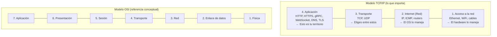
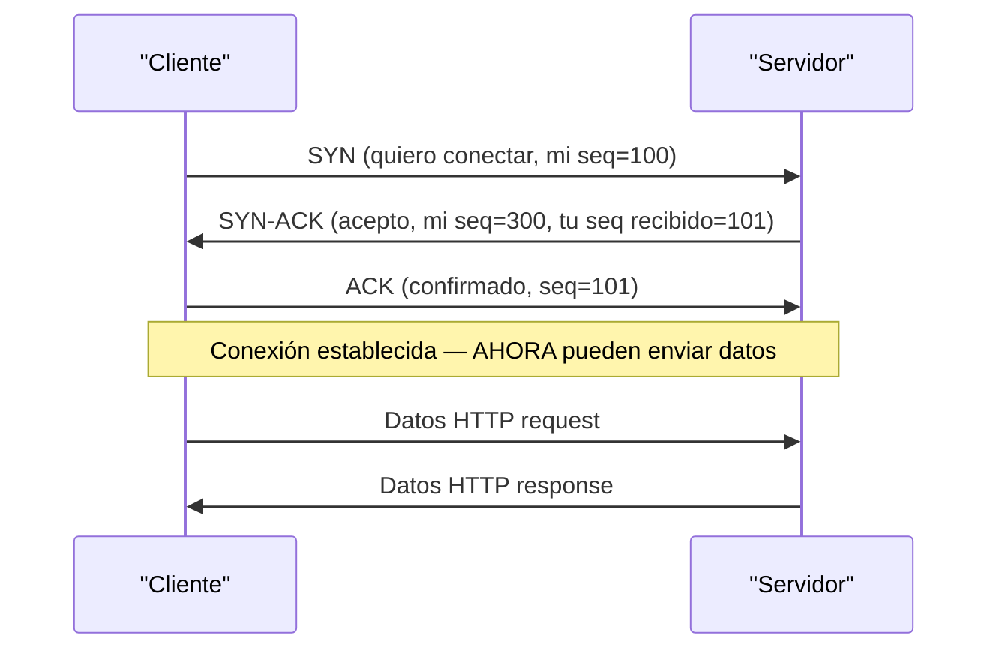
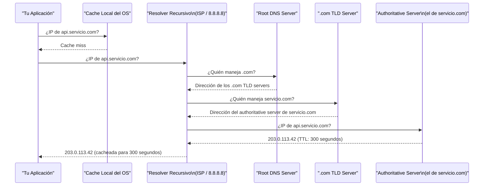
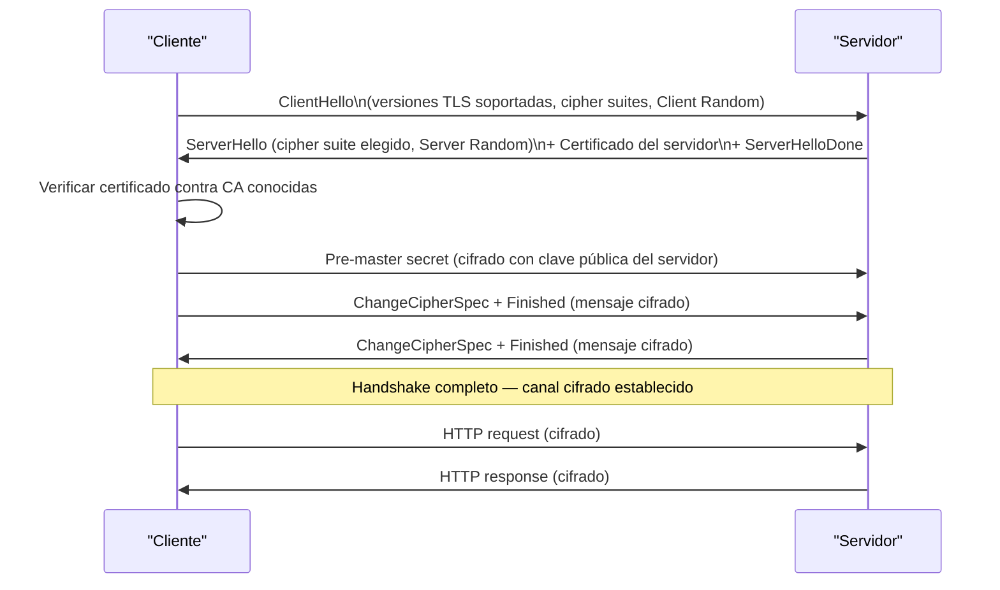

# 01-05 — Redes y Protocolos

> **Prerequisito:** Haber completado [01-04-os-y-concurrencia-base.md](./01-04-os-y-concurrencia-base.md) y su checkpoint.  
> **Objetivo de este archivo:** No ser un network engineer — entender los protocolos lo suficiente para diseñar sistemas distribuidos y tomar decisiones de arquitectura correctas.

🆓 **ByteByteGo — YouTube:** Abre el canal de ByteByteGo. Los videos referenciados inline son gratuitos y de alta calidad visual para cada protocolo.

---

## Modelo OSI vs TCP/IP — por qué existen los modelos de capas

Los modelos de capas son **separación de concerns aplicada a redes**. El mismo principio que usas en Clean Architecture — cada capa tiene una responsabilidad, habla solo con las capas adyacentes, y puede ser reemplazada sin afectar las demás.

El modelo OSI tiene 7 capas (el modelo teórico). El modelo TCP/IP tiene 4 capas (el que realmente se implementa). Como backend engineer, las 4 capas de TCP/IP son tu mapa.



**Tu mapa de responsabilidades:**
- **Capa de Aplicación:** Tu código. HTTP, gRPC, WebSockets, DNS queries, TLS. Tomas decisiones aquí.
- **Capa de Transporte:** Eliges TCP vs UDP según el caso de uso. Rara vez implementas tú mismo — usas librerías que lo hacen.
- **Capa de Internet/Red:** El OS y los routers. No tomas decisiones aquí normalmente.
- **Capa de Acceso:** Hardware y drivers. Completamente transparente para ti.

🆓 **ByteByteGo:** Busca "OSI model explained" — el video de 7 minutos clarifica las capas mejor que cualquier texto.

---

## TCP vs UDP — la decisión de diseño real

### TCP: confiabilidad con costo

TCP (Transmission Control Protocol) garantiza entrega ordenada y sin errores. Para lograrlo, paga estos costos:

**El three-way handshake** — establecer una conexión TCP requiere 3 mensajes antes de poder enviar datos:



Esta negociación introduce una **latencia mínima de 1.5 RTT** (Round-Trip Time) antes de que llegue el primer byte de datos útiles. Si el RTT entre cliente y servidor es 100ms, el handshake tarda 150ms solo en establecer la conexión.

**Después del handshake, TCP garantiza:**
- **Entrega:** Si un paquete se pierde, TCP lo retransmite automáticamente
- **Orden:** Los datos llegan en el orden en que fueron enviados, aunque los paquetes IP lleguen desordenados
- **Control de flujo:** El receptor le dice al emisor cuántos datos puede aceptar (window size)
- **Control de congestión:** TCP reduce su tasa de envío si detecta pérdida de paquetes (señal de congestión de red)

**El costo:** Retransmisiones, buffers de reordenamiento, overhead de acknowledgments, head-of-line blocking.

### UDP: velocidad con responsabilidad

UDP (User Datagram Protocol) no garantiza nada. Dispara el paquete y se olvida. Sin handshake, sin acknowledgment, sin reordenamiento, sin retransmisión.

Eso es una feature, no un bug — en los casos correctos.

**Cuándo UDP es la elección técnicamente correcta:**

| Caso de uso | Por qué UDP | Por qué no TCP |
|---|---|---|
| Streaming de video (Netflix, YouTube) | Un frame retardado es peor que uno perdido — no tiene sentido retransmitir frames viejos | La retransmisión de TCP llevaría frames obsoletos |
| Gaming en tiempo real | Latencia baja es crítica; frame perdido se ignora | El head-of-line blocking de TCP aumenta latencia perceptible |
| DNS queries | Una query/response, sin estado — el overhead de TCP sería mayor que el beneficio | DNS implementa retry en capa de aplicación si es necesario |
| VoIP | Audio en tiempo real — frame perdido = glitch aceptable; frame tardío = lag inaceptable | TCP retrasa todos los datos mientras espera retransmisión |
| QUIC (HTTP/3) | UDP como base, confiabilidad implementada en capa de aplicación con más control | TCP tiene head-of-line blocking a nivel de protocolo |

**La decisión correcta no es "TCP para confiabilidad, UDP para velocidad"** — es: ¿la aplicación puede tolerar pérdida de datos a cambio de menor latencia? ¿La aplicación tiene sus propios mecanismos de detección y recuperación de errores? Si sí a ambas → UDP puede ser correcto.

🆓 **ByteByteGo:** Busca "TCP vs UDP" — explica los trade-offs con ejemplos visuales de gaming y streaming.

---

## HTTP/1.1 vs HTTP/2 vs HTTP/3 — evolución de la capa de aplicación

### HTTP/1.1 — el estándar que construyó la web

HTTP/1.1 es request-response sobre TCP. Un request, espera la response, siguiente request. Simple y funciona para sitios con pocos recursos.

**El problema: Head-of-Line Blocking (HOL blocking)**

Para cargar una página web moderna con 80 recursos (imágenes, CSS, JS), HTTP/1.1 los descarga secuencialmente por conexión. Los navegadores abren múltiples conexiones TCP (típicamente 6 por dominio) para paralelizar — pero eso es un hack costoso: cada conexión tiene su propio handshake y window de congestión.

**Keep-alive:** HTTP/1.1 introdujo conexiones persistentes — la misma conexión TCP puede reusar para múltiples requests. Reduce el costo de handshakes, pero sigue teniendo HOL blocking por request.

### HTTP/2 — multiplexing sobre una conexión

HTTP/2 resuelve el HOL blocking de HTTP/1.1 con **multiplexing**: múltiples requests y responses fluyen simultáneamente sobre **una sola conexión TCP**, interleaved como streams.

**Lo que resolvió:**
- Multiple requests en paralelo sobre una conexión — sin los 6 TCP connections del navegador
- **Header compression (HPACK):** Los headers HTTP se repiten en cada request. HPACK los comprime y los deduplica entre requests del mismo cliente.
- **Server Push:** El servidor puede enviar recursos que sabe que el cliente va a necesitar antes de que los pida (CSS, JS para una página HTML)

**Lo que NO resolvió — HOL blocking a nivel TCP:**

HTTP/2 multiplexó streams sobre TCP. Pero TCP garantiza entrega ordenada de todo el stream. Si un paquete TCP se pierde, **todos los streams HTTP/2 en esa conexión se bloquean** esperando que TCP retransmita el paquete perdido — aunque ese paquete pertenezca a un stream HTTP completamente diferente.

El HOL blocking se movió de la capa de aplicación (HTTP/1.1) a la capa de transporte (TCP). En redes con alta pérdida de paquetes, HTTP/2 puede ser peor que HTTP/1.1.

### HTTP/3 y QUIC — reinventando el transporte

HTTP/3 resuelve el HOL blocking de TCP cambiando el protocolo de transporte: construye sobre **UDP** en lugar de TCP, con toda la confiabilidad implementada en la capa QUIC.

**Cómo QUIC resuelve el HOL blocking:**
- QUIC implementa múltiples streams independientes sobre UDP
- Si se pierde un paquete UDP de Stream A, **solo Stream A se bloquea** — Stream B continúa sin interrupción
- TCP no puede hacer esto porque su garantía de orden es sobre todo el stream de bytes, no por aplicación

**Beneficios adicionales de QUIC:**
- **0-RTT connection establishment:** Para conexiones conocidas, QUIC puede reanudar con 0 RTTs adicionales de handshake (combina el TLS y el transporte handshake)
- **Connection migration:** Si el IP del cliente cambia (móvil cambia de WiFi a LTE), la conexión QUIC puede migrar sin interrumpirse (usando connection IDs en lugar de IP+port tuples como TCP)

**Adopción actual (2026):** HTTP/3 es soportado por todos los browsers modernos, CDNs principales (Cloudflare, Fastly, AWS CloudFront), y .NET 8+ tiene soporte nativo via YARP y Kestrel.

🆓 **ByteByteGo:** Busca "HTTP/1 vs HTTP/2 vs HTTP/3" — la animación del HOL blocking y el stream multiplexing es la mejor explicación visual disponible.

---

## WebSockets vs SSE vs Long Polling — comunicación en tiempo real

### Long Polling — el hack que funciona

Long Polling es HTTP normal con un twist: el cliente hace un request, el servidor **no responde inmediatamente** — mantiene la conexión abierta hasta que hay datos nuevos (o timeout). Cuando el servidor responde, el cliente inmediatamente hace otro request.

```
Cliente → GET /eventos              (request)
Servidor [espera hasta que hay datos...]
Servidor → 200 OK { datos: "evento1" }  (response, 30s después)
Cliente → GET /eventos              (request inmediato)
Servidor [espera...]
```

Es un hack, pero funciona y funciona bien con proxies y firewalls (es HTTP normal). Usar cuando: no puedes usar WebSockets (proxies corporativos que los bloquean), el evento es poco frecuente, la simplicidad de implementación importa más que la eficiencia.

### Server-Sent Events (SSE) — streaming unidireccional sobre HTTP

SSE es una conexión HTTP persistente donde el servidor **hace push de datos** al cliente continuamente. Unidireccional: servidor → cliente únicamente.

```csharp
// Endpoint SSE en ASP.NET Core minimal API
app.MapGet("/eventos", async (HttpContext ctx, CancellationToken ct) =>
{
    ctx.Response.Headers["Content-Type"] = "text/event-stream";
    ctx.Response.Headers["Cache-Control"] = "no-cache";
    
    while (!ct.IsCancellationRequested)
    {
        var datos = await ObtenerEventoAsync();
        
        // Formato SSE: "data: " + contenido + "\n\n"
        await ctx.Response.WriteAsync($"data: {datos}\n\n", ct);
        await ctx.Response.Body.FlushAsync(ct);
        
        await Task.Delay(1000, ct);
    }
});
```

SSE reconecta automáticamente si la conexión se pierde (el navegador lo hace nativo). Funciona sobre HTTP/2 — múltiples SSE streams en una sola conexión TCP.

### WebSockets — bidireccional, full-duplex

WebSockets inician con un HTTP upgrade handshake, luego la conexión se convierte en un canal TCP bidireccional. Cliente y servidor pueden enviar mensajes en cualquier momento.

```csharp
// WebSocket en ASP.NET Core
app.Map("/ws", async (HttpContext ctx) =>
{
    if (!ctx.WebSockets.IsWebSocketRequest)
    {
        ctx.Response.StatusCode = 400;
        return;
    }

    using var ws = await ctx.WebSockets.AcceptWebSocketAsync();
    var buffer = new byte[4096];

    while (ws.State == WebSocketState.Open)
    {
        var resultado = await ws.ReceiveAsync(buffer, CancellationToken.None);
        
        if (resultado.MessageType == WebSocketMessageType.Close)
        {
            await ws.CloseAsync(WebSocketCloseStatus.NormalClosure, "", CancellationToken.None);
            break;
        }
        
        // Echo de vuelta — en producción, aquí procesas el mensaje
        await ws.SendAsync(
            buffer.AsMemory(0, resultado.Count),
            WebSocketMessageType.Text,
            endOfMessage: true,
            CancellationToken.None
        );
    }
});
```

### Tabla de decisión

| Caso de uso | Tecnología correcta | Por qué |
|---|---|---|
| Chat en tiempo real | WebSocket | Bidireccional — cliente también envía mensajes |
| Notificaciones push | SSE | Unidireccional server→client, más simple, reconexión automática |
| Dashboard de métricas en vivo | SSE | Unidireccional, HTTP/2 compatible |
| Juego multijugador | WebSocket o UDP directo | Bidireccional, baja latencia |
| Feed de actividad social | SSE o Long Polling | Depende de latencia requerida |
| APIs sin infraestructura especial | Long Polling | Funciona en cualquier entorno, incluyendo proxies corporativos |

---

## DNS — el directorio telefónico de internet

### Resolución DNS paso a paso

Cuando tu API hace `new HttpClient().GetAsync("https://api.servicio.com")`, antes de abrir el socket, necesita saber la IP de `api.servicio.com`. Este proceso:



En la práctica: la mayoría de las queries DNS se resuelven en el primer o segundo paso (cache del OS o del resolver). El recorrido completo ocurre solo cuando el TTL expira.

### TTL y sus implicaciones para deployments

El **TTL (Time To Live)** indica cuántos segundos los resolvers pueden cachear una respuesta DNS. Un TTL de 300 segundos significa que si cambias la IP de tu servidor, pueden pasar hasta 5 minutos antes de que todos los clientes vean el nuevo IP.

**Estrategia para deployments con cambio de IP:**
1. Reducir el TTL a 60 segundos **horas antes** del deployment
2. Hacer el cambio de IP
3. Esperar 60 segundos para que la mayoría de caches expiren
4. Restaurar el TTL a un valor normal (300-3600 segundos)

**TTL demasiado bajo (< 60s):** Aumenta la carga en los servidores DNS y el overhead de lookups. **TTL demasiado alto:** Cambios de IP tardan mucho en propagarse.

### GeoDNS — routing geográfico a nivel DNS

Los CDNs y servicios globales usan **GeoDNS**: el mismo nombre de dominio resuelve a IPs diferentes dependiendo de dónde está el cliente. Un request desde México resuelve a un servidor en Guadalajara o Ciudad de México; desde Europa resuelve a un servidor en Frankfurt.

Esto se implementa en el servidor DNS authoritative — detecta la IP del resolver que hace la query y retorna la IP del servidor más cercano. Es la base del content delivery de CDNs como Cloudflare y AWS CloudFront.

---

## TLS/SSL — por qué HTTPS no es "solo un candado"

### El TLS handshake

TLS (Transport Layer Security) establece un canal cifrado sobre TCP. El handshake agrega latencia — en TLS 1.3 (el estándar actual), es 1-RTT o 0-RTT para conexiones conocidas.



*Nota: Este es el flujo simplificado de TLS 1.2. TLS 1.3 elimina algunos pasos y reduce a 1-RTT.*

### Certificados y Certificate Authorities

Un certificado TLS vincula un nombre de dominio a una clave pública, firmado por una Certificate Authority (CA) de confianza. El cliente verifica:
1. ¿El certificado está firmado por una CA de confianza? (raíz instalada en el OS)
2. ¿El nombre del dominio en el certificado coincide con el dominio al que me conecto?
3. ¿El certificado no está expirado?
4. ¿El certificado no está revocado? (OCSP)

**Certificate chain:** Los certificados forman una cadena. La CA raíz (root CA) firma certificados intermedios, que a su vez firman los certificados de los dominios. Los browsers solo confían en root CAs preinstaladas en el OS.

### mTLS — autenticación mutua en microservices

En TLS normal, solo el servidor presenta su certificado (el cliente verifica que el servidor es quien dice ser). En **mTLS (mutual TLS)**, **ambos lados** presentan certificados — el servidor también verifica que el cliente es quien dice ser.

```csharp
// Configurar mTLS en ASP.NET Core
builder.Services.AddAuthentication(CertificateAuthenticationDefaults.AuthenticationScheme)
    .AddCertificate(options =>
    {
        options.AllowedCertificateTypes = CertificateTypes.All;
        options.Events = new CertificateAuthenticationEvents
        {
            OnCertificateValidated = context =>
            {
                // Validar que el certificado del cliente pertenece a un servicio conocido
                var allowedThumbprints = new[] { "AA:BB:CC:..." };
                if (!allowedThumbprints.Contains(context.ClientCertificate.Thumbprint))
                {
                    context.Fail("Certificado de cliente no autorizado");
                }
                else
                {
                    context.Success();
                }
                return Task.CompletedTask;
            }
        };
    });
```

mTLS es el estándar para comunicación segura entre microservices — reemplaza API keys o tokens Bearer para autenticación service-to-service. Service meshes como Istio o Linkerd lo implementan automáticamente.

### TLS session resumption — mitigando la latencia

El handshake TLS completo agrega latencia. Para conexiones repetidas del mismo cliente, **TLS session resumption** permite saltar el handshake:
- **Session Tickets:** El servidor envía un ticket cifrado al cliente al final del handshake. El cliente lo presenta en conexiones futuras para reanudar sin re-negociar.
- **TLS 1.3 0-RTT:** En conexiones reanudadas, el cliente puede enviar datos en el primer paquete — cero RTTs adicionales.

⚠️ TLS 1.3 0-RTT tiene una limitación de seguridad: es vulnerable a replay attacks. No usar para requests que no sean idempotentes (GET sí, POST con efecto de lado no).

---

## Proxies, Reverse Proxies y API Gateways

### Forward Proxy

Un **forward proxy** está del lado del cliente. El cliente configura sus requests para que pasen por el proxy, que los reenvía al servidor. El servidor ve la IP del proxy, no la del cliente.

Casos de uso reales:
- Filtrado de contenido corporativo (bloquear redes sociales)
- Anonimización (VPNs son essencialmente proxies)
- Cache de contenido saliente

### Reverse Proxy

Un **reverse proxy** está del lado del servidor. Los clientes piensan que están hablando con el servidor real, pero en realidad hablan con el proxy que reenvía al servidor real (o a uno de varios servidores).

```
Internet → [Reverse Proxy] → [Backend 1]
                           → [Backend 2]  
                           → [Backend 3]
```

El reverse proxy habilita:
- **Load balancing:** Distribuir requests entre múltiples instancias del backend
- **TLS termination:** El proxy maneja TLS; el backend recibe HTTP simple (menos carga)
- **Rate limiting:** Limitar requests por IP antes de que lleguen al backend
- **Caching:** Cachear responses que no cambian frecuentemente
- **Compresión:** Gzip/Brotli en el proxy, no en cada instancia del backend

**YARP (Yet Another Reverse Proxy):** El reverse proxy oficial de .NET, escrito en ASP.NET Core. Embebible directamente en tu aplicación .NET.

```csharp
// YARP como reverse proxy configurable en Program.cs
builder.Services.AddReverseProxy()
    .LoadFromConfig(builder.Configuration.GetSection("ReverseProxy"));

// appsettings.json:
// {
//   "ReverseProxy": {
//     "Routes": {
//       "api-route": {
//         "ClusterId": "api-cluster",
//         "Match": { "Path": "/api/{**catch-all}" }
//       }
//     },
//     "Clusters": {
//       "api-cluster": {
//         "Destinations": {
//           "dest1": { "Address": "http://backend1:8080/" },
//           "dest2": { "Address": "http://backend2:8080/" }
//         }
//       }
//     }
//   }
// }
```

### API Gateway vs Reverse Proxy

Un **API Gateway** es un reverse proxy con lógica de negocio de API:

| Característica | Reverse Proxy | API Gateway |
|---|---|---|
| Load balancing | ✅ | ✅ |
| TLS termination | ✅ | ✅ |
| Rate limiting | Básico | Avanzado (por API key, por plan de suscripción) |
| Autenticación | ❌ | ✅ (JWT, OAuth, API keys) |
| Transformación de requests | ❌ | ✅ (agregar headers, transformar body) |
| Monetización de API | ❌ | ✅ |
| Portal de desarrolladores | ❌ | ✅ |
| Cuándo usarlo | Tráfico interno, microservices internos | APIs públicas, productos de API, múltiples clientes externos |

El API Gateway es overengineering para microservices internos. Un reverse proxy simple (YARP, Nginx) es suficiente y tiene menos overhead.

---

## REST vs gRPC vs GraphQL — la decisión de diseño

### REST — cuando es la elección correcta

REST no es solo "usar verbos HTTP". Los principios reales de REST (Representational State Transfer):
- **Stateless:** Cada request es auto-contenido — el servidor no mantiene estado del cliente
- **Uniform Interface:** Los recursos se identifican por URLs, manipulados via representaciones (JSON/XML)
- **Cacheable:** Las responses deben indicar si son cacheables

```csharp
// REST bien diseñado — recursos y verbos semánticos
// GET    /pedidos        → listar pedidos
// GET    /pedidos/123    → obtener pedido específico
// POST   /pedidos        → crear nuevo pedido
// PUT    /pedidos/123    → reemplazar pedido completo
// PATCH  /pedidos/123    → actualizar campos específicos del pedido
// DELETE /pedidos/123    → eliminar pedido
```

**Limitaciones reales de REST:**
- **Over-fetching:** El endpoint retorna más campos de los que el cliente necesita
- **Under-fetching:** Para mostrar una pantalla, necesitas múltiples requests (N+1 de APIs)
- **Sin contrato tipado:** El cliente no sabe qué campos existen sin documentación o prueba

### gRPC — cuándo supera a REST con criterios concretos

gRPC usa Protocol Buffers (schema binario tipado) sobre HTTP/2.

```protobuf
// PedidoService.proto
service PedidoService {
    rpc ObtenerPedido(ObtenerPedidoRequest) returns (Pedido);
    rpc ListarPedidos(ListarRequest) returns (stream Pedido); // Streaming
    rpc CrearPedido(CrearPedidoRequest) returns (Pedido);
}

message Pedido {
    string id = 1;
    double monto = 2;
    repeated string productos = 3;
}
```

```csharp
// Implementación en ASP.NET Core
public class PedidoServiceImpl : PedidoService.PedidoServiceBase
{
    public override async Task<Pedido> ObtenerPedido(
        ObtenerPedidoRequest request, 
        ServerCallContext context)
    {
        var pedido = await _repo.GetByIdAsync(request.PedidoId);
        return new Pedido { Id = pedido.Id, Monto = pedido.Monto };
    }
    
    // Streaming — el servidor envía múltiples responses
    public override async Task ListarPedidos(
        ListarRequest request,
        IServerStreamWriter<Pedido> responseStream,
        ServerCallContext context)
    {
        await foreach (var pedido in _repo.StreamAsync())
        {
            await responseStream.WriteAsync(new Pedido { /* ... */ });
        }
    }
}
```

**Cuándo elegir gRPC sobre REST:**
- Comunicación **interna** entre microservices (no API pública)
- Necesitas streaming (datos en tiempo real entre servicios)
- El rendimiento de serialización importa (Protobuf es ~3-10x más eficiente que JSON)
- Quieres contratos tipados y generación de código cliente automática
- La red es un cuello de botella (Protobuf binario es mucho más compacto que JSON)

**Cuándo NO elegir gRPC:**
- API pública consumida por browsers (HTTP/2 con gRPC no tiene buen soporte en JS aún sin gRPC-Web)
- Equipo sin experiencia con Protobuf — la curva de aprendizaje tiene costo real
- Debugging — JSON es legible por humanos, Protobuf binario no

### GraphQL — qué problema resuelve exactamente

GraphQL resuelve el over-fetching y under-fetching de REST. El cliente especifica exactamente qué campos quiere:

```graphql
# El cliente pide solo los campos que necesita
query {
  pedido(id: "123") {
    id
    monto
    cliente {
      nombre
      email
    }
    # No pide 'productos', 'metadatos', ni otros campos — no llegan en la response
  }
}
```

**Cuándo GraphQL vale el costo de adopción:**
- Una API sirve a múltiples clientes con necesidades muy diferentes (móvil necesita menos datos que web)
- Los clientes tienen control sobre qué datos consumen (API pública para terceros)
- El backend tiene un grafo rico de relaciones y los clientes necesitan traversal flexible

**Cuándo NO:**
- API interna con pocos clientes — REST o gRPC son más simples
- Equipo sin experiencia — el tooling y la curva de aprendizaje son significativos
- Si tus requests son simples y predecibles, GraphQL agrega complejidad sin beneficio

### Tabla de decisión

| Criterio | REST | gRPC | GraphQL |
|---|---|---|---|
| API pública para terceros | ✅ Ideal | ❌ Difícil en browsers | ✅ Si los clientes son diversos |
| Microservices internos | ✅ Simple | ✅✅ Óptimo | ❌ Overhead innecesario |
| Streaming de datos | ❌ | ✅✅ | ❌ |
| Performance crítica | Medio | ✅✅ | Medio |
| Múltiples clientes con necesidades distintas | ❌ Over-fetching | ❌ Schema rígido | ✅ Ideal |
| Simplicidad de implementación | ✅✅ | Medio | ❌ Más complejo |
| Debugging / observability | ✅✅ (JSON legible) | ❌ (Protobuf binario) | Medio |

---

> **🏁 Checkpoint:** Antes de avanzar, debes poder responder:  
> 1. ¿Cuál es la diferencia entre HOL blocking en HTTP/2 vs HTTP/3?  
> 2. ¿Cuándo elegirías UDP sobre TCP? Da 3 casos concretos con justificación.  
> 3. ¿Qué es el TLS handshake y qué latencia agrega?  
> 4. ¿Cuándo usas WebSockets vs SSE?  
> 5. ¿Cuándo un API Gateway es overengineering?  
> 6. ¿Cuándo gRPC supera a REST? ¿Cuándo no?  
>
> **Siguiente archivo:** [01-06-bases-de-datos-fundamentos-cs.md →](./01-06-bases-de-datos-fundamentos-cs.md)
