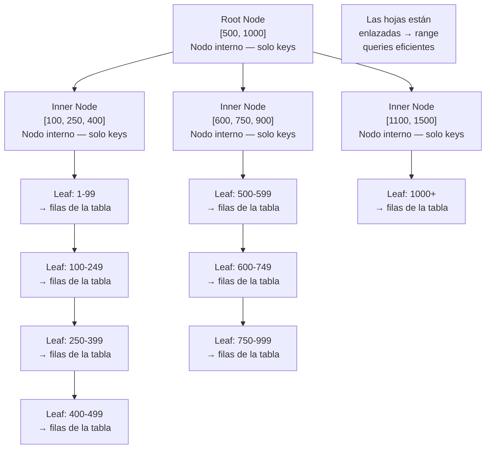
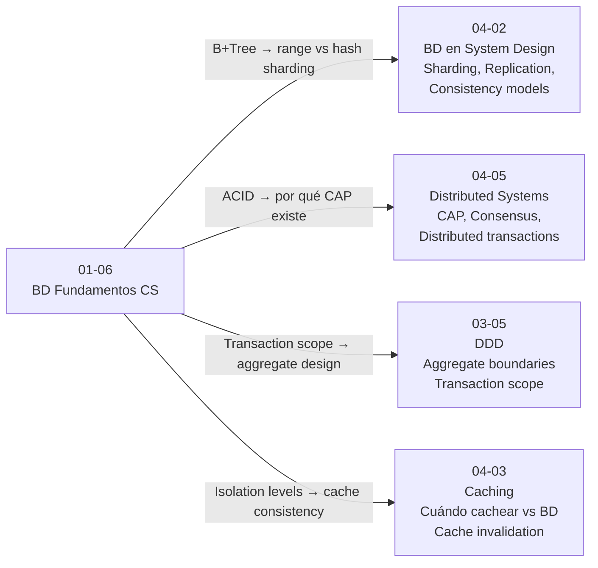

# 01-06 — Bases de Datos: Fundamentos CS

> **Prerequisito:** Haber completado [01-05-redes-y-protocolos.md](./01-05-redes-y-protocolos.md) y su checkpoint.  
> **Conexión directa:** Este archivo es prerequisito directo para [04-02-bases-de-datos-system-design.md](../modulo-04-system-design/04-02-bases-de-datos-system-design.md).

---

## Por qué este archivo pertenece en CS Fundamentals — y no en "cómo usar SQL"

Llevas años usando EF Core. Writes `context.Pedidos.Where(p => p.Monto > 1000).ToListAsync()` y funciona. EF Core genera el SQL, lo ejecuta, y retorna los datos. Perfecto.

El problema: cuando diseñas un sistema a escala, las decisiones que importan no son "cómo escribo este query" sino "¿por qué esta tabla tiene un índice en esa columna?", "¿qué ocurre cuando dos requests concurrentes intentan modificar el mismo registro?", "¿por qué cambiar el nivel de aislamiento de la transacción resuelve este bug de producción?", "¿por qué esta migración de EF Core que agrega un índice va a bloquear la tabla en producción por 20 minutos?".

Esas decisiones requieren entender el motor de base de datos desde adentro. Un Staff Engineer que diseña sistemas de datos sin este conocimiento toma decisiones de arquitectura a ciegas — y paga el precio en producción.

Lo que aprenderás aquí no es conocimiento de "cómo usar SQL". Es conocimiento de estructuras de datos y sistemas que el motor aplica al problema de almacenar y recuperar datos de forma confiable.

📚 **DDIA (Designing Data-Intensive Applications — Martin Kleppmann):** Este libro es la referencia canónica de sistemas de datos. Los Capítulos 1, 2 y 3 son el complemento natural de este archivo. Ábrelo después de completar la Sección 2 de este archivo — tendrás el modelo mental para aprovecharlos al máximo.

---

## Cómo funciona un índice realmente — B-Tree internals

### El problema que resuelve un índice

Sin índice, buscar un registro por cualquier campo que no sea la clave primaria requiere leer **todos** los registros de la tabla — un full table scan. En una tabla con 50 millones de pedidos, `WHERE cliente_id = 12345` sin índice lee todos los 50 millones. Eso es O(n).

Con un índice en `cliente_id`, la búsqueda es O(log n). La diferencia entre buscar en 50 millones de registros O(n) vs O(log n):

```
Sin índice: 50,000,000 registros leídos
Con índice B-Tree de altura 5: ~5 nodos leídos (log base ~200 de 50M ≈ 4-5 niveles)
```

Un índice es esencialmente una estructura de datos auxiliar — separada de la tabla — que mantiene los valores de una columna ordenados y con punteros de vuelta a los registros originales.

### Por qué B-Tree y no Binary Search Tree

Un BST balanceado también tiene O(log n) para búsqueda. ¿Por qué los motores de BD usan B-Trees?

**El problema fundamental: disco vs memoria**

Leer 1 byte de un SSD tarda lo mismo que leer 4KB — porque el hardware lee en bloques (páginas). Un acceso a disco es igual de caro si lees 1 byte o 4,096 bytes. La operación costosa es el acceso en sí, no el número de bytes.

Un BST típico tiene un elemento por nodo. Para encontrar un registro en una tabla de 1 millón de filas, un BST balanceado necesita ~20 niveles de altura → ~20 accesos a disco.

Un **B-Tree** pone múltiples elementos en cada nodo, diseñado para que cada nodo quepa en una página de disco (4KB). Cada nodo puede tener cientos de claves. La altura del árbol se reduce drásticamente:

```
BST con 1M elementos: altura ~20 → ~20 disk I/Os
B-Tree con branching factor de 200, 1M elementos: altura ~3 → ~3 disk I/Os

log₂(1,000,000) ≈ 20     (BST)
log₂₀₀(1,000,000) ≈ 3    (B-Tree)
```

**B-Tree minimiza disk I/Os** — esa es su razón de existir.

### B+Tree — la variante que usan los motores reales

Los motores de bases de datos (PostgreSQL, SQL Server, MySQL InnoDB) usan B+Tree, una variante del B-Tree con dos diferencias clave:

1. **Todos los datos viven en los nodos hoja (leaf nodes)**. Los nodos internos (inner nodes) solo almacenan claves de navegación — sin datos. Esto aumenta el branching factor (más claves por nodo interno → árbol más bajo).

2. **Las hojas están enlazadas entre sí** en una lista enlazada. Esto permite **range queries eficientes**: `WHERE fecha BETWEEN '2024-01-01' AND '2024-12-31'` encuentra el primer leaf node con la fecha inicial y luego recorre los leaf nodes en orden hasta el final del rango. Sin volver a subir al árbol.



### Qué ocurre durante un INSERT — el costo que EF Core oculta

Cuando insertas un registro en una tabla con un índice B+Tree:

1. El motor encuentra el leaf node correcto donde debería ir la nueva clave (O(log n))
2. Inserta la clave en el leaf node
3. **Si el leaf node está lleno:** Split — el nodo se divide en dos, y la clave media sube al nodo padre. Si el nodo padre también está lleno, sube más. En el peor caso, la raíz se divide y el árbol crece en altura.
4. El motor actualiza los punteros entre leaf nodes

**Implicación real:** En una tabla con 5 índices, un INSERT escribe 1 fila de datos + actualiza potencialmente 5 B+Trees. Las escrituras son más caras de lo que parecen. Para tablas write-heavy con alta carga, índices en exceso destruyen el throughput de escritura.

### Índices compuestos — el orden de las columnas importa

Un índice compuesto en `(apellido, nombre)` es útil para:
- `WHERE apellido = 'García'` ✅
- `WHERE apellido = 'García' AND nombre = 'Juan'` ✅
- `WHERE apellido = 'García' ORDER BY nombre` ✅

No es útil para:
- `WHERE nombre = 'Juan'` ❌ (el índice está ordenado por apellido primero — sin apellido, no puede usarlo)

La regla: el índice es usable cuando los predicados incluyen un **prefijo** del índice compuesto. Diseñar índices compuestos requiere entender los patrones de queries reales de la aplicación.

### Cuándo un índice hace más daño que bien

- **Tablas write-heavy con alta concurrencia:** El overhead de mantener el B+Tree en cada INSERT/UPDATE/DELETE supera el beneficio en reads
- **Columnas de baja cardinalidad:** Un índice en una columna `activo` (true/false) en una tabla con 95% de registros activos no ayuda — el motor probablemente prefiere el full scan
- **Tablas pequeñas:** Full scan de 1,000 filas es tan rápido que el índice agrega overhead sin beneficio

📚 **DDIA Capítulo 3:** Después de este punto, abre el Capítulo 3 de DDIA (Storage and Retrieval). Kleppmann explica B-Trees, LSM-Trees y SSTables — las dos familias principales de estructuras de almacenamiento. La distinción entre motores optimizados para reads (B-Trees) vs escrituras (LSM-Trees como RocksDB) tiene implicaciones directas para elegir bases de datos en system design.

---

## ACID desde primeros principios

ACID no es un conjunto de features de SQL — es el contrato que el motor de base de datos hace contigo cuando realiza una transacción. Entender cómo el motor implementa cada letra explica por qué el contrato tiene el costo que tiene.

### A — Atomicidad: todo o nada

**El problema:** Transferir $100 de la cuenta A a la cuenta B requiere dos operaciones: restar de A, sumar a B. ¿Qué ocurre si el servidor crashea entre las dos operaciones? ¿La cuenta A pierde $100 y B no recibe nada?

**La solución: Write-Ahead Log (WAL)**

Antes de modificar cualquier dato en disco, el motor escribe la operación en un log (el WAL). El WAL es append-only — escribir al final de un archivo secuencial es mucho más rápido que writes aleatorios a páginas de datos.

```
WAL entry: [LSN=1001, TxID=42, BEGIN]
WAL entry: [LSN=1002, TxID=42, UPDATE cuentas SET saldo=saldo-100 WHERE id=A]
WAL entry: [LSN=1003, TxID=42, UPDATE cuentas SET saldo=saldo+100 WHERE id=B]
WAL entry: [LSN=1004, TxID=42, COMMIT]
```

Si el sistema crashea en cualquier punto:
- Antes del COMMIT: Al reiniciar, el motor lee el WAL y ve que TxID=42 no tiene COMMIT → **rollback** — como si la transacción nunca hubiera ocurrido.
- Después del COMMIT: El WAL tiene el COMMIT → **redo** — el motor aplica las operaciones que aún no se habían escrito a los archivos de datos.

Atomicidad es implementada por el WAL. El rollback es posible porque tienes el registro exacto de qué cambiar de vuelta.

### C — Consistencia: las constraints del schema se mantienen

Si tienes `FOREIGN KEY (cliente_id) REFERENCES clientes(id)` y haces `DELETE FROM clientes WHERE id = 123` mientras hay pedidos referenciando ese cliente, el motor rechaza la operación. La base de datos no puede quedar en un estado inconsistente donde existe un pedido con un cliente que no existe.

Consistencia es parcialmente un problema del motor (enforce constraints) y parcialmente del desarrollador (diseñar el schema con las constraints correctas).

### I — Isolation: las transacciones no se ven entre sí (en teoría)

Este es el más complejo y el más relevante para el comportamiento que ves en producción.

Sin aislamiento, dos transacciones concurrentes pueden interferir entre sí de formas peligrosas. El estándar SQL define cuatro niveles de aislamiento, cada uno previniendo diferentes anomalías a cambio de diferente impacto en el rendimiento:

**Las anomalías que el aislamiento previene:**

- **Dirty Read:** Transacción A lee datos modificados por Transacción B que aún no hizo COMMIT. Si B hace ROLLBACK, A leyó datos que nunca existieron.
- **Non-repeatable Read:** A lee un registro dos veces en la misma transacción, pero B modificó ese registro entre las dos lecturas. A obtiene resultados diferentes.
- **Phantom Read:** A ejecuta la misma query dos veces, pero B insertó o eliminó registros entre ejecuciones. A ve un conjunto diferente de filas.
- **Serialization Anomaly:** El resultado de ejecutar transacciones concurrentes es diferente al de cualquier ejecución serial posible.

**Los niveles de aislamiento:**

| Nivel | Dirty Read | Non-repeatable Read | Phantom Read | Serialization Anomaly | Impacto en rendimiento |
|---|---|---|---|---|---|
| Read Uncommitted | ✅ ocurre | ✅ ocurre | ✅ ocurre | ✅ ocurre | Mínimo |
| **Read Committed** (default SQL Server, PostgreSQL) | ❌ prevenido | ✅ ocurre | ✅ ocurre | ✅ ocurre | Bajo |
| Repeatable Read | ❌ prevenido | ❌ prevenido | ✅ ocurre | ✅ ocurre | Medio |
| **Serializable** | ❌ prevenido | ❌ prevenido | ❌ prevenido | ❌ prevenido | Alto |

**La implicación práctica:** El nivel default (Read Committed) en SQL Server y PostgreSQL significa que si lees el mismo registro dos veces en la misma transacción, puedes obtener valores diferentes porque otra transacción lo modificó entremedio. Este comportamiento sorprende a muchos developers que asumen que una transacción ve una "foto" consistente de los datos.

```csharp
// Ejemplo en EF Core — configurar nivel de aislamiento
using var transaction = await context.Database
    .BeginTransactionAsync(System.Data.IsolationLevel.RepeatableRead);

try
{
    var pedido = await context.Pedidos.FindAsync(123);
    // Con ReadCommitted: si alguien modifica el pedido aquí, la segunda lectura
    // podría retornar datos diferentes
    // Con RepeatableRead: la segunda lectura garantiza los mismos datos
    
    // ... lógica de negocio ...
    
    await context.SaveChangesAsync();
    await transaction.CommitAsync();
}
catch
{
    await transaction.RollbackAsync();
    throw;
}
```

### D — Durabilidad: los datos sobreviven a crashes

Una vez que la base de datos dice "COMMIT exitoso", los datos deben sobrevivir a cualquier falla posterior — crash del proceso, corte de energía, falla de disco.

**El problema con "guardar en disco":** Los sistemas operativos tienen un buffer de escritura (page cache). Cuando escribes a un archivo, el dato puede quedar en la memoria del OS sin haber llegado al disco físico. Si hay un crash, el dato se pierde.

**La solución: fsync**

El motor de base de datos llama `fsync()` después de escribir el WAL para garantizar que los datos llegaron físicamente al disco antes de confirmar el COMMIT al cliente. `fsync()` es una instrucción al OS de "vacía el buffer al disco, ahora". Es lento — puede tardar varios milisegundos.

**El trade-off de durabilidad:** Algunos sistemas permiten deshabilitar `fsync` para obtener mayor rendimiento (PostgreSQL: `synchronous_commit = off`). Ganas velocidad de escritura, pero si el servidor crashea en el momento equivocado, puedes perder las últimas transacciones confirmadas. Para sistemas donde cada transacción vale dinero (pagos, e-commerce), `fsync` deshabilitado es inaceptable. Para logs de métricas donde perder algunos registros es tolerable, puede ser una decisión válida.

📚 **DDIA Capítulo 1:** Después de esta sección, el Capítulo 1 de DDIA (Reliable, Scalable, and Maintainable Applications) contextualiza ACID dentro del problema más amplio de construir sistemas confiables. Kleppmann articula los trade-offs con precisión que complementa este archivo.

---

## Transacciones y Locking — cómo el motor gestiona concurrencia

### Shared Locks vs Exclusive Locks

El motor de base de datos usa locks para implementar el aislamiento. Dos tipos básicos:

- **Shared Lock (S):** Para leer un dato. Múltiples transacciones pueden tener Shared Lock sobre el mismo dato simultáneamente — las lecturas no se bloquean entre sí.
- **Exclusive Lock (X):** Para escribir un dato. Si una transacción tiene Exclusive Lock, ninguna otra puede leer ni escribir ese dato hasta que el lock se libere.

```
Transacción A (leyendo): Shared Lock en fila 123
Transacción B (leyendo): Shared Lock en fila 123 ← permitido, no hay conflicto
Transacción C (escribiendo): Exclusive Lock en fila 123 ← bloqueada hasta que A y B liberen sus locks
```

### Lock Escalation

El motor puede adquirir locks a diferentes granularidades:
- **Row-level locks:** El más granular, el más concurrente
- **Page-level locks:** Un bloque de disco con muchas filas
- **Table-level locks:** Toda la tabla

Bajo alta carga, mantener miles de row-level locks tiene overhead significativo de memoria. El motor puede hacer **lock escalation**: si una transacción tiene demasiados row-level locks, los "escala" a un table-level lock. Más simple, menos overhead, pero **bloquea todas las operaciones sobre esa tabla** hasta que termine.

⚠️ En SQL Server, lock escalation ocurre por defecto cuando una transacción supera ~5,000 locks o cuando los locks consumen más del 40% de la memoria del lock manager. Una operación que parece "solo actualizar unos pocos registros" puede en la práctica bloquear una tabla completa.

### Deadlocks en bases de datos

El motor detecta deadlocks automáticamente con un algoritmo de detección de ciclos en el grafo de espera (wait-for graph). Cuando detecta un deadlock, elige una víctima (típicamente la transacción con menor costo de rollback) y la mata con un error.

```csharp
// Código que puede causar deadlock en BD si dos requests ejecutan en orden inverso
// Request 1: UPDATE pedidos WHERE id=1, luego UPDATE clientes WHERE id=100
// Request 2: UPDATE clientes WHERE id=100, luego UPDATE pedidos WHERE id=1

// ✅ Estrategia: acceder a recursos en orden consistente (igual que threading)
// Siempre actualizar clientes antes de pedidos, o viceversa
// El motor puede detectarlo, pero la aplicación no debe depender de esa detección
```

### Optimistic vs Pessimistic Concurrency

**Pessimistic concurrency:** Bloquear el recurso antes de leerlo para garantizar que nadie más lo modifica mientras lo procesas.

```csharp
// SQL Server: SELECT ... WITH (UPDLOCK, ROWLOCK)
// EF Core con hint de SQL
var pedido = await context.Pedidos
    .FromSqlRaw("SELECT * FROM Pedidos WITH (UPDLOCK, ROWLOCK) WHERE Id = {0}", id)
    .FirstOrDefaultAsync();

// Ahora nadie más puede modificar este pedido hasta que termines la transacción
pedido.Estado = EstadoPedido.Procesando;
await context.SaveChangesAsync();
```

**Optimistic concurrency:** No bloquear al leer. Al escribir, verificar que nadie modificó el registro entre tu lectura y escritura. Si alguien lo modificó, falla y reintenta.

```csharp
// EF Core — concurrencia optimista con RowVersion
public class Pedido
{
    public int Id { get; set; }
    public string Estado { get; set; } = "";
    
    // RowVersion/Timestamp — el motor actualiza este valor en cada UPDATE
    [Timestamp]
    public byte[] RowVersion { get; set; } = [];
}

// EF Core incluye automáticamente el RowVersion en el WHERE del UPDATE:
// UPDATE Pedidos SET Estado = @estado WHERE Id = @id AND RowVersion = @rowVersion
// Si RowVersion cambió (otro proceso modificó el registro), afecta 0 filas
// → EF Core lanza DbUpdateConcurrencyException

try
{
    var pedido = await context.Pedidos.FindAsync(id);
    pedido!.Estado = "Procesado";
    await context.SaveChangesAsync();
}
catch (DbUpdateConcurrencyException ex)
{
    // Alguien más modificó el pedido mientras lo procesábamos
    // Estrategia: recargar y reintentar, o informar al usuario del conflicto
    var entry = ex.Entries.Single();
    await entry.ReloadAsync(); // Recargar el estado actual desde BD
    // Decidir: ¿client wins, database wins, o merge manual?
}
```

**Cuándo cada uno es correcto:**

| Criterio | Pessimistic | Optimistic |
|---|---|---|
| Conflictos frecuentes | ✅ Mejor | ❌ Muchos reintentos |
| Conflictos raros | ❌ Lock overhead innecesario | ✅ Máximo throughput |
| Operaciones cortas | ✅ Lock corto, bajo impacto | ✅ También funciona |
| Operaciones largas | ⚠️ Lock largo bloquea otros | ✅ No bloquea |
| Caso de uso típico | Inventario (evitar overselling) | Edición de perfiles, contenido |

---

## Por qué este archivo es prerequisito para System Design

Esta sección conecta explícitamente lo aprendido con lo que viene en el Módulo 4.

**B+Tree → Sharding decisions:**
Los índices B+Tree mantienen los datos ordenados por la clave. Cuando diseñas sharding, la elección entre **range-based sharding** (pedidos del 1 al 1M en shard 1, del 1M al 2M en shard 2) vs **hash-based sharding** (shard = hash(pedido_id) % N) tiene consecuencias directas en cómo los índices funcionan en cada shard. Range sharding permite range queries eficientes. Hash sharding distribuye uniformemente pero hace las range queries caras. Sin entender B+Trees, esta decisión parece arbitraria.

**ACID → CAP Theorem:**
ACID garantiza consistencia dentro de una sola base de datos. En un sistema distribuido con múltiples nodos, garantizar ACID completo requiere coordinación entre nodos (protocolos de consenso como Paxos o Raft) que tiene un costo enorme en latencia. El **CAP Theorem** dice que un sistema distribuido solo puede garantizar dos de tres: Consistency (todos los nodos ven los mismos datos), Availability (siempre responde), Partition Tolerance (funciona aunque la red falle entre nodos). Los sistemas que sacrifican consistencia para ganar disponibilidad tienen **consistencia eventual** — eventualmente todos los nodos convergen al mismo estado. Sin entender qué garantiza ACID y por qué es difícil de distribuir, el CAP Theorem parece abstracto.

**Isolation Levels → Eventual Consistency:**
El concepto de "otros niveles de consistencia" — que no todos los reads ven los writes más recientes — es exactamente lo que ocurre en sistemas distribuidos con consistencia eventual. Un read de una réplica secundaria puede retornar datos que son milisegundos o segundos viejos. Read Committed en una sola BD es el análogo: no garantiza que leerás los cambios de una transacción aún no commiteada.

**Locking → Distributed Deadlocks:**
Los deadlocks que viste a nivel de base de datos se vuelven distribuidos en sistemas con múltiples servicios que cada uno posee su propia base de datos. Servicio A llama a Servicio B mientras Servicio B llama a Servicio A — ambos esperando, ninguno avanza. La detección de deadlocks distribuidos es mucho más compleja que la detección en una sola BD. La solución más común es timeouts con retries y diseño que evita la espera circular — el mismo principio de "orden consistente de adquisición de locks", ahora a nivel de servicios.

---

## Mapa de conexiones — este archivo y el resto del curriculum



---

> **🏁 Checkpoint — Módulo 1 completo:** Antes de avanzar al Módulo 2, debes poder responder:  
> 1. ¿Por qué un B-Tree tiene mejor rendimiento que un BST para índices en disco?  
> 2. ¿Qué es el WAL y cómo garantiza atomicidad?  
> 3. ¿Qué anomalía puede ocurrir con Read Committed que no ocurre con Repeatable Read?  
> 4. ¿Cuándo usas concurrencia optimista vs pesimista en EF Core?  
> 5. ¿Por qué un índice en una columna `activo` (true/false) en una tabla grande puede ser inútil?  
> 6. ¿Cómo se relaciona ACID con el CAP Theorem? (respuesta a nivel intuición)  
>
> 📚 **DDIA Capítulos 1-3:** Ahora es el momento de leerlos. Con el modelo mental de este archivo, los capítulos de Kleppmann van a conectar directamente con experiencia real.  
>
> **Siguiente módulo:** [02-00-overview.md →](../modulo-02-algoritmos-patrones/02-00-overview.md)
