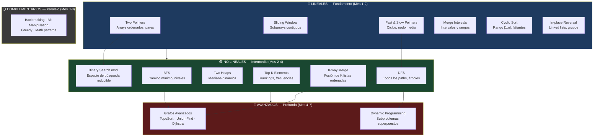

# Módulo 2 — Algoritmos y Patrones: Overview

> **Lee este archivo completo antes de abrir cualquier otro archivo del módulo.**
> Si el Módulo 1 te dio el lenguaje para hablar de complejidad, este módulo te da el armamento para resolver problemas en tiempo real bajo presión.

---

## Por qué patrones y no problemas — el argumento real

Existe una forma de prepararse para entrevistas que la mayoría de developers sigue: abrir LeetCode, empezar por los Easy, subir a los Medium, intentar algunos Hard, resolver sin entender, pasar al siguiente. Después de 300 problemas resueltos, llegar a una entrevista y bloquearse en un Medium que "no has visto antes".

Eso no es un fallo de inteligencia. Es un fallo de metodología.

El cerebro humano no aprende memorizando instancias — aprende reconociendo patrones. Cuando estudias para manejar un auto, no memorizas "en esta curva específica de la calle Reforma gira 23 grados a la derecha". Aprendes a leer las señales visuales de cualquier curva y sabes qué hacer. Los algoritmos funcionan exactamente igual.

**El problema del grinding aleatorio:**

Los datos del análisis de la industria (2024-2026) son contundentes: resolver problemas de LeetCode de forma aleatoria requiere entre 24 y 36 meses para alcanzar fluidez en entrevistas. Con enfoque de patrones, el mismo nivel se alcanza en 5-8 meses. La diferencia no es disciplina — es arquitectura cognitiva.

¿Por qué el grinding falla?
- Memoriza soluciones a instancias específicas, no a familias de problemas
- La retención es episódica (memoria de corto plazo) — se olvida en semanas
- Cuando el entrevistador modifica una restricción del problema conocido, el candidato se paraliza
- Genera ansiedad y fatiga sin progreso real medible
- Con 3,000+ problemas en LeetCode, nunca hay sensación de "terminado"

**Por qué los patrones funcionan:**

Existen ~3,000 problemas en LeetCode. Pero estadísticamente, se reducen a aproximadamente 15 patrones fundamentales. Un candidato que domina esos 15 patrones puede resolver el 85-90% de los problemas de entrevistas que encuentra — incluso los que nunca ha visto — porque reconoce la estructura subyacente.

La diferencia entre un Senior que "estudió LeetCode" y un Staff que domina patrones algorítmicos es exactamente esta:

- El Senior ve el enunciado y busca en su memoria si "ya lo resolvió antes".
- El Staff lee el enunciado, identifica las señales estructurales en el texto, nombra el patrón que aplica, y adapta el template mental a las condiciones específicas del problema.

150-200 problemas bien elegidos con enfoque de patrones equivalen a 700-1000 problemas de grinding aleatorio en términos de preparación real para entrevistas.

---

## Los 15 patrones maestros



**Los 15 patrones con su rol:**

**Lineales (operan sobre arrays, strings, linked lists):**

1. **Two Pointers** — Dos índices que se mueven hacia el centro o en la misma dirección. Elimina un loop completo en arrays ordenados. O(n) en lugar de O(n²).
2. **Sliding Window** — Ventana que se desliza manteniendo estado incremental. Clave para subarrays/substrings con condición. O(n) en lugar de O(n×k).
3. **Fast & Slow Pointers** — Dos punteros a velocidades distintas. Detecta ciclos y encuentra posiciones medias sin conocer el tamaño. O(n), O(1) espacio.
4. **Merge Intervals** — Fusión y detección de solapamientos en intervalos. Ordenar por start primero, luego un solo pass. O(n log n).
5. **Cyclic Sort** — Sort in-place O(n) para arrays en rango [1,n]. Revela faltantes y duplicados por posición incorrecta.
6. **In-place Reversal of Linked List** — Redireccionamiento de punteros sin memoria extra. Reversal completo o por segmentos.

**No lineales (operan sobre árboles, grafos, heaps):**

7. **BFS** — Exploración nivel por nivel con Queue. Garantiza el camino más corto en grafos no ponderados.
8. **DFS** — Exploración de rama completa antes de la siguiente. Pre/in/post-order en árboles, componentes conexas en grafos.
9. **Two Heaps** — Max-heap + min-heap para mantener la mediana dinámica. O(log n) por inserción, O(1) para leer mediana.
10. **Top K Elements** — Min-heap de tamaño K para los K más grandes. O(n log k) vs O(n log n) del sort completo.
11. **K-way Merge** — Min-heap de tamaño K para fusionar K listas ordenadas. O(n log k) donde n es el total de elementos.
12. **Binary Search modificado** — Reducción del espacio de búsqueda en condiciones no triviales: arrays rotados, search on answer, peaks.

**Avanzados:**

13. **Dynamic Programming** — Descomposición en subproblemas superpuestos con memoización o tabulation. El patrón más complejo — requiere base sólida en todos los anteriores.
14. **Grafos avanzados** — Topological Sort para dependencias ordenadas, Union-Find para componentes, Dijkstra para caminos ponderados.

**Complementarios:**

15. **Backtracking + Bit Manipulation + Greedy + Math** — Familia de patrones con señales muy específicas. Backtracking para permutaciones/subsets, Greedy para optimización local que garantiza global, Bit Manipulation para problemas con XOR o masks.

---

## Cómo leer las señales de un problema

Este es el skill más valioso del módulo. Antes de escribir una línea de código, leer el enunciado y nombrar el patrón que aplica. Las señales están siempre presentes — hay que entrenarse para verlas.

**Framework de 3 preguntas:**

1. ¿Qué tipo de estructura de datos tiene el input? (array, string, linked list, árbol, grafo)
2. ¿Qué tipo de output pide? (valor único, subarray, conteo, true/false, lista)
3. ¿Qué palabras clave aparecen en el enunciado?

Las palabras clave son el sistema de señales:

| Señal en el enunciado | Patrón primario | Patrón alternativo |
|---|---|---|
| "Array/string ordenado" + "par/tripla/suma target" | Two Pointers | Binary Search |
| "Subarray/substring contiguo" + "condición o tamaño k" | Sliding Window | — |
| "Linked list" + "ciclo" o "nodo medio" | Fast & Slow Pointers | — |
| "Intervalos", "reuniones", "rangos", "solapamiento" | Merge Intervals | — |
| "Array con n números en [1, n]" + "faltante/duplicado" | Cyclic Sort | — |
| "Revertir linked list" o "grupos de k nodos" | In-place Reversal | — |
| "Camino más corto" o "mínimo pasos" en grafo/matriz | BFS | Dijkstra (si ponderado) |
| "Nivel por nivel" en árbol | BFS | — |
| "Todos los paths" o "si existe path con condición" | DFS | Backtracking |
| "Componentes conexas" en grafo | DFS / BFS | Union-Find |
| "Mediana" de stream de datos | Two Heaps | — |
| "K elementos más grandes/frecuentes" | Top K (Min-Heap) | QuickSelect |
| "K-th largest/smallest" | Top K (Min-Heap) | QuickSelect |
| "Fusionar K listas ordenadas" | K-way Merge | — |
| "Array rotado" + "buscar target" | Binary Search mod. | — |
| "Mínimo X que satisface condición" (rango continuo) | Binary Search mod. (search on answer) | — |
| "Número de formas", "cuántas combinaciones" | DP | Backtracking |
| "Máximo/mínimo" con decisión en cada paso | DP | Greedy |
| "Orden de tareas con dependencias" | Topological Sort | — |
| "Permutaciones", "subsets", "todas las posibles" | Backtracking | — |
| "XOR", "bit a bit", "potencia de 2" | Bit Manipulation | — |

**Regla práctica:** Si el enunciado menciona "contiguo" → Sliding Window antes que Two Pointers. Si menciona "todos los posibles" → Backtracking antes que DP. Si el input es una linked list → Fast & Slow o In-place Reversal, no Two Pointers convencional.

⚠️ **Anti-patrón frecuente:** Ver "array" y asumir automáticamente Two Pointers. El array es solo el vehículo — las señales del problema (ordenado vs desordenado, contiguo vs no, buscar par vs buscar subarray) determinan el patrón.

---

## Cómo usar las plataformas en conjunto

No uses todos los recursos a la vez. Cada uno tiene un rol específico en el flujo de aprendizaje.

**AlgoMonster (recurso primario 🎯):**
1. Abrir la sección del patrón que corresponda al archivo que estás estudiando
2. Leer la explicación del patrón y el árbol de decisión visual
3. Completar los problemas guiados del patrón en orden — no saltar
4. Dejar que el sistema de repetición espaciada incorporado haga su trabajo: si te equivocas en una línea específica, el sistema te la vuelve a mostrar más tarde
5. No avances al siguiente patrón hasta pasar el checkpoint de AlgoMonster del patrón actual

**NeetCode (YouTube + NeetCode.io 🆓):**
1. Ver el video del patrón **después** de leer AlgoMonster y completar al menos 2-3 problemas guiados
2. El video no es el primer paso — es el refuerzo visual después de que ya tienes base
3. Completar los problemas del NeetCode 150 que correspondan al patrón (están agrupados por patrón en NeetCode.io)
4. Los videos de NeetCode en YouTube son la mejor explicación visual gratuita disponible — úsalos cuando estés atorado, no como punto de partida

**AlgoExpert (práctica complementaria 🎯):**
1. Úsalo cuando termines un patrón en AlgoMonster + NeetCode y quieras más volumen de práctica
2. Filtra por patrón/categoría — no lo uses de forma aleatoria
3. No como recurso primario — como extensión cuando un patrón específico se siente débil después de completar los dos anteriores

**LeetCode free (simulación pre-entrevista 🆓):**
1. Solo en las últimas 4-6 semanas antes de una entrevista real
2. Filtrar por empresa objetivo + patrón débil específico (no grinding aleatorio)
3. Usar en modo cronometrado — simular condiciones de entrevista reales
4. No antes — el grinding prematuro sin base sólida de patrones es exactamente lo que este módulo busca evitar

El flujo correcto para cada patrón nuevo:
```
AlgoMonster (leer + problemas guiados)
    → NeetCode video (refuerzo visual)
    → NeetCode 150 (práctica del patrón)
    → AlgoExpert (volumen adicional si necesario)
    → [Semanas finales] LeetCode (simulación empresa-específica)
```

---

## Progresión trimestral realista

Este plan asume 1-1.5 horas de estudio activo diario, 5 días a la semana. Ajusta las fechas según tu disponibilidad real.

**Mes 1-2 — Patrones lineales (este archivo: 02-01)**

Los 6 patrones lineales son los de mayor frecuencia en entrevistas de todos los niveles y son conceptualmente más accesibles que los no lineales. Construyen la base mental de "dos punteros" que aparece en formas distintas a lo largo de todo el módulo.

Resultado al terminar: puedes resolver cualquier Medium de Two Pointers, Sliding Window y Merge Intervals en menos de 30 minutos. Los otros 3 patrones en menos de 25 minutos.

**Mes 2-4 — Patrones no lineales (este archivo: 02-02)**

Requieren que los patrones lineales estén internalizados — no porque haya dependencia directa de código, sino porque el modelo mental de "mantener estado, hacer decisiones, avanzar" es el mismo. BFS y DFS son los más frecuentes en entrevistas Senior/Staff. Two Heaps y Top K son los diferenciadores.

Resultado al terminar: puedes implementar BFS/DFS en árbol y grafo sin dudar, resolver problemas de Heap en menos de 35 minutos.

**Mes 4-6 — Dynamic Programming (archivo: 02-03)**

DP es el patrón más difícil de internalizar. No por la complejidad del código — por el modelo mental de "descomponer en subproblemas superpuestos". Requiere haber dominado DFS porque la recursión con memoización es la forma más natural de pensar en DP antes de pasar a tabulation.

Foco: DP de 1D y 2D. Skip de los Hard DP esotéricos — su ROI es mínimo para entrevistas reales.

**Mes 5-7 — Grafos avanzados (archivo: 02-04)**

Topological Sort, Union-Find y Dijkstra. Requieren BFS/DFS dominados. Aparecen con alta frecuencia en entrevistas Staff donde los problemas de grafos se disfrazan como problemas de dependencias, horarios y redes.

**Mes 3-8 — Temas complementarios (archivo: 02-05) — en paralelo**

Backtracking, Bit Manipulation, Greedy y Math pueden estudiarse en paralelo desde el mes 3. Sus señales de reconocimiento son muy distintas — una vez que las aprendes, nunca las confundirás con otros patrones.

**Mes 6-8 — Simulación intensiva (archivo: 02-07)**

Mockups cronometrados, práctica con empresa específica en LeetCode, entrevistas con peers o plataformas de mock interviews. Este es el período donde el volumen importa — pero volumen de práctica simulada, no más teoría.

---

## Métricas de velocidad por dificultad

Estas son las velocidades objetivo para saber si estás listo para entrevistas reales. No son límites de tiempo arbitrarios — reflejan lo que los entrevistadores esperan implícitamente:

| Dificultad | Objetivo de tiempo | Qué incluye ese tiempo |
|---|---|---|
| Easy | < 15 minutos | Clarificar, identificar patrón, implementar, verificar casos edge |
| Medium | < 30 minutos | Ídem + articular trade-offs durante la implementación |
| Hard | < 45 minutos | Llegar al approach correcto aunque la implementación no sea perfecta |

**Para nivel Staff específicamente:** El tiempo de implementación es solo la mitad del criterio. El entrevistador también evalúa que puedas articular complejidad temporal y espacial, mencionar variantes del problema, y conectar la solución con un escenario de producción real — todo mientras implementas. Si resuelves en 20 minutos pero en silencio, es un rechazo.

**Cómo medir tu progreso semana a semana:**

Al final de cada semana de práctica, toma nota de:
- ¿Cuántos problemas del patrón resolviste sin consultar solución?
- ¿Cuántos identificaste correctamente el patrón antes de empezar a codificar?
- ¿Cuántos completaste dentro del tiempo objetivo?

El criterio de "patrón dominado" no es "puedo resolverlos todos con tiempo infinito". Es "identifico el patrón en menos de 2 minutos de lectura del enunciado y llego a una solución funcional dentro del tiempo objetivo".

---

## Checklist de salida del módulo

El módulo 2 está completo cuando puedes cumplir todos estos criterios sin consultar código de referencia:

### Patrones lineales
- [ ] Identifico en < 2 minutos si un problema de array ordenado aplica Two Pointers o Sliding Window
- [ ] Implemento la variante converging y same-direction de Two Pointers sin errores off-by-one
- [ ] Implemento Sliding Window de tamaño fijo y variable en C# con el template correcto
- [ ] Identifico un problema de ciclo en linked list y aplico Fast & Slow Pointers sin consultar
- [ ] Implemento merge de intervalos con ordenamiento correcto y manejo del edge case de no solapamiento
- [ ] Implemento Cyclic Sort y lo uso para encontrar el número faltante y el duplicado en un solo pass
- [ ] Implemento reversal de linked list completo e implemento reversal de segmento [left, right] correctamente

### Patrones no lineales
- [ ] Implemento BFS en árbol (level order) y en grafo (con visited set) sin errores
- [ ] Implemento DFS recursivo con las 3 variantes (pre/in/post-order) y DFS iterativo con Stack
- [ ] Implemento Two Heaps para mediana dinámica usando PriorityQueue de .NET 6+
- [ ] Implemento Top K con min-heap de tamaño K y sé cuándo usar QuickSelect como alternativa
- [ ] Implemento K-way Merge con heap y manejo correcto de los índices de lista/elemento
- [ ] Implemento Binary Search sobre array rotado y Search on Answer sobre rango continuo

### Dynamic Programming
- [ ] Identifico si un problema tiene subproblemas superpuestos y subestructura óptima
- [ ] Implemento DP de 1D (Fibonacci, Coin Change, House Robber) con memoización y tabulation
- [ ] Implemento DP de 2D (Longest Common Subsequence, Unique Paths) con tabla de estados

### Grafos avanzados
- [ ] Implemento Topological Sort con BFS (Kahn's algorithm) y con DFS
- [ ] Implemento Union-Find con path compression y union by rank
- [ ] Implemento Dijkstra con PriorityQueue y sé cuándo Dijkstra es necesario vs BFS simple

### Velocidad y entrevista
- [ ] Resuelvo Easy en < 15 minutos articulando el approach en voz alta
- [ ] Resuelvo Medium en < 30 minutos con análisis de complejidad incluido
- [ ] Completo al menos 120 problemas del NeetCode 150 con los checkpoints de AlgoMonster

---

> **Siguiente archivo:** [02-01-patrones-lineales.md →](./02-01-patrones-lineales.md)
