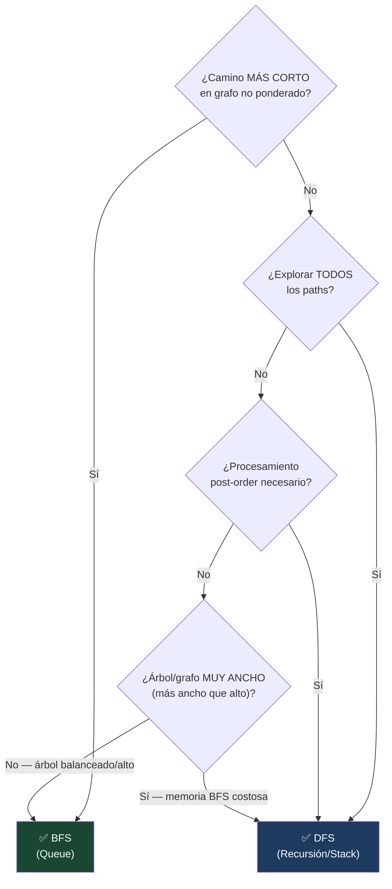

# 02-02 — Patrones No Lineales

> **Prerequisito:** Haber completado [02-01-patrones-lineales.md](./02-01-patrones-lineales.md) y su checklist.  
> **Principio de este archivo:** Los patrones no lineales operan sobre estructuras donde un nodo puede tener múltiples conexiones. El modelo mental de "un paso a la vez en secuencia" se reemplaza por "explorar ramas completas o niveles completos".

🎯 **Antes de empezar:** Abre AlgoMonster y navega a la sección "Tree BFS". Si los patrones lineales son los cimientos, BFS y DFS son las paredes — todo el sistema descansa sobre ellos.

---

## Clases auxiliares para los ejemplos de este archivo

```csharp
// Nodo de árbol binario
public class TreeNode
{
    public int Val;
    public TreeNode? Left;
    public TreeNode? Right;
    public TreeNode(int val = 0, TreeNode? left = null, TreeNode? right = null)
    {
        Val = val; Left = left; Right = right;
    }
}

// Nodo de linked list (ya definido en 02-01, se reutiliza)
public class ListNode
{
    public int Val;
    public ListNode? Next;
    public ListNode(int val = 0, ListNode? next = null) { Val = val; Next = next; }
}
```

---

## Patrón 7 — BFS (Breadth-First Search)

### 1. Intuición

Imagina que estás en el centro de una ciudad y necesitas encontrar el café más cercano. No exploras todo el norte de la ciudad antes de mirar al sur — buscas en todas las direcciones simultáneamente, expandiéndote en círculos concéntricos. Primero los cafés a 1 cuadra, luego a 2, luego a 3. Cuando encuentras el primero, sabes que es el más cercano — no puede haber uno más cercano que aún no hayas revisado.

Eso es BFS: explorar nivel por nivel usando una Queue (FIFO). Cada nivel de la Queue representa todos los nodos a la misma "distancia" del origen. El elemento que entra primero es el primero en ser explorado.

La garantía más importante de BFS: en grafos **no ponderados**, encuentra el **camino más corto** (en número de aristas). Si llegas a un nodo por BFS, la ruta tomada es la más corta posible hasta ese nodo.

### 2. Señales de reconocimiento

- "**Camino más corto**" o "**mínimo número de pasos**" — la señal más fuerte de BFS
- "**Nivel por nivel**" en un árbol (level order traversal)
- "**Spreading**" desde múltiples fuentes simultáneamente (Rotting Oranges — múltiples naranjas podridas al mismo tiempo)
- "**Menor número de transformaciones**" (Word Ladder — menor número de cambios de letras)
- "**Distancia mínima**" desde un punto a otro en una matriz o grafo
- En árboles: "altura", "profundidad mínima", "nodo más cercano"

⚠️ **Señal falsa:** "BFS es más rápido que DFS". No — ambos son O(V+E). La diferencia es la garantía de camino mínimo y el orden de exploración, no la velocidad.

### 3. Templates en C#

```csharp
// ─── BFS en árbol binario — Level Order Traversal ───
public IList<IList<int>> LevelOrder(TreeNode? root)
{
    var result = new List<IList<int>>();
    if (root == null) return result;

    var queue = new Queue<TreeNode>();
    queue.Enqueue(root);

    while (queue.Count > 0)
    {
        int levelSize = queue.Count; // Número de nodos en este nivel
        var currentLevel = new List<int>();

        for (int i = 0; i < levelSize; i++)
        {
            var node = queue.Dequeue();
            currentLevel.Add(node.Val);

            // Agregar hijos para el siguiente nivel
            if (node.Left != null)  queue.Enqueue(node.Left);
            if (node.Right != null) queue.Enqueue(node.Right);
        }

        result.Add(currentLevel);
        // Al salir del for, hemos procesado un nivel completo
    }

    return result;
}

// ─── BFS en grafo — con visited set para evitar ciclos ───
public void BfsGraph(Dictionary<int, List<int>> graph, int start)
{
    var visited = new HashSet<int>();
    var queue = new Queue<int>();

    queue.Enqueue(start);
    visited.Add(start); // Marcar como visitado AL ENQUEUE, no al dequeue
    // ⚠️ Error común: marcar al dequeue → nodo puede enquearse múltiples veces

    while (queue.Count > 0)
    {
        int node = queue.Dequeue();
        // Procesar node aquí

        foreach (int neighbor in graph[node])
        {
            if (!visited.Contains(neighbor))
            {
                visited.Add(neighbor);
                queue.Enqueue(neighbor);
            }
        }
    }
}

// ─── BFS multi-source — múltiples puntos de partida simultáneos ───
// Útil para Rotting Oranges, 0-1 Matrix, etc.
// Inicializar la queue con TODOS los puntos de partida antes del BFS principal
var queue = new Queue<(int row, int col)>();
for (int r = 0; r < rows; r++)
    for (int c = 0; c < cols; c++)
        if (grid[r][c] == /* condición de fuente */)
            queue.Enqueue((r, c));
// Luego el BFS normal — procesa todas las fuentes al mismo tiempo
```

### 4. Problemas representativos

**Problema 1: Binary Tree Level Order Traversal (LeetCode 102)**

```csharp
public IList<IList<int>> LevelOrder(TreeNode? root)
{
    var result = new List<IList<int>>();
    if (root == null) return result;

    var queue = new Queue<TreeNode>();
    queue.Enqueue(root);

    while (queue.Count > 0)
    {
        int levelSize = queue.Count;
        var level = new List<int>();

        for (int i = 0; i < levelSize; i++)
        {
            var node = queue.Dequeue();
            level.Add(node.Val);
            if (node.Left != null)  queue.Enqueue(node.Left);
            if (node.Right != null) queue.Enqueue(node.Right);
        }

        result.Add(level);
    }

    return result;
}
// Tiempo: O(n) | Espacio: O(w) donde w es el ancho máximo del árbol
// En un árbol balanceado, el nivel más ancho es el último → O(n/2) = O(n)
```

---

**Problema 2: Rotting Oranges (LeetCode 994) — BFS multi-source**

Input: matriz donde 0=vacío, 1=naranja fresca, 2=naranja podrida. Cada minuto, naranjas podridas infectan adyacentes. Output: minutos mínimos para pudrir todo, o -1 si imposible.

La clave: hay múltiples naranjas podridas al inicio — todas "infectan" simultáneamente. BFS multi-source trata todos los puntos iniciales como el "nivel 0" y expande en paralelo.

```csharp
public int OrangesRotting(int[][] grid)
{
    int rows = grid.Length, cols = grid[0].Length;
    var queue = new Queue<(int r, int c)>();
    int freshCount = 0;

    // Inicializar: encontrar todas las naranjas podridas (fuentes) y contar frescas
    for (int r = 0; r < rows; r++)
        for (int c = 0; c < cols; c++)
        {
            if (grid[r][c] == 2) queue.Enqueue((r, c)); // Fuente del BFS
            if (grid[r][c] == 1) freshCount++;
        }

    if (freshCount == 0) return 0; // Ya no hay frescas

    int minutes = 0;
    int[][] directions = { new[]{0,1}, new[]{0,-1}, new[]{1,0}, new[]{-1,0} };

    while (queue.Count > 0 && freshCount > 0)
    {
        minutes++;
        int levelSize = queue.Count;

        for (int i = 0; i < levelSize; i++)
        {
            var (r, c) = queue.Dequeue();

            foreach (var dir in directions)
            {
                int nr = r + dir[0], nc = c + dir[1];

                if (nr >= 0 && nr < rows && nc >= 0 && nc < cols && grid[nr][nc] == 1)
                {
                    grid[nr][nc] = 2; // Pudrir la naranja fresca
                    freshCount--;
                    queue.Enqueue((nr, nc));
                }
            }
        }
    }

    return freshCount == 0 ? minutes : -1; // Si quedan frescas → imposible
}
// Tiempo: O(rows × cols) | Espacio: O(rows × cols)
```

---

**Problema 3: Word Ladder (LeetCode 127) — grafo implícito**

Input: palabras `beginWord` y `endWord`, lista de palabras válidas. Output: longitud del camino más corto de transformación cambiando una letra a la vez, donde cada palabra intermedia debe estar en la lista.

El insight: el grafo no está dado explícitamente — dos palabras están "conectadas" si difieren en exactamente una letra. BFS encuentra el camino más corto en este grafo implícito.

```csharp
public int LadderLength(string beginWord, string endWord, IList<string> wordList)
{
    var wordSet = new HashSet<string>(wordList);
    if (!wordSet.Contains(endWord)) return 0;

    var queue = new Queue<string>();
    queue.Enqueue(beginWord);
    var visited = new HashSet<string> { beginWord };
    int steps = 1;

    while (queue.Count > 0)
    {
        int levelSize = queue.Count;
        steps++;

        for (int i = 0; i < levelSize; i++)
        {
            string word = queue.Dequeue();
            char[] wordArr = word.ToCharArray();

            // Generar todas las transformaciones válidas de una letra
            for (int pos = 0; pos < wordArr.Length; pos++)
            {
                char original = wordArr[pos];

                for (char c = 'a'; c <= 'z'; c++)
                {
                    if (c == original) continue;
                    wordArr[pos] = c;
                    string newWord = new string(wordArr);

                    if (newWord == endWord) return steps;

                    if (wordSet.Contains(newWord) && !visited.Contains(newWord))
                    {
                        visited.Add(newWord);
                        queue.Enqueue(newWord);
                    }
                }
                wordArr[pos] = original; // Restaurar para la siguiente posición
            }
        }
    }

    return 0; // No se encontró camino
}
// Tiempo: O(M² × N) donde M = longitud de palabra, N = cantidad de palabras
// Espacio: O(M × N)
```

### 5. Cuándo NO aplica

- Cuando necesitas **explorar todos los paths** o hacer **backtracking** (DFS es más natural)
- **Grafos ponderados** donde el "camino más corto" mide costo, no número de aristas — usa Dijkstra
- Cuando la **memoria es un constraint severo**: BFS almacena todos los nodos del nivel actual en la Queue. Un árbol muy ancho puede tener O(n) nodos en el último nivel. DFS usa O(h) espacio donde h es la altura — mucho mejor en árboles muy anchos
- Cuando el problema pide **post-order processing** (procesar un nodo después de sus hijos) — DFS post-order es más natural

🎯 **AlgoMonster:** Secciones "Tree BFS" y "Graph BFS".  
🆓 **NeetCode 150:** "Trees" → Binary Tree Level Order Traversal, y "Graphs" → Rotting Oranges y Word Ladder.

---

## Patrón 8 — DFS (Depth-First Search)

### 1. Intuición

Si BFS explora en círculos concéntricos, DFS sigue un camino hasta el final antes de retroceder. Como explorar un laberinto: eliges una dirección, sigues hasta que no puedes avanzar, vuelves al último punto donde había otra opción, exploración la siguiente.

DFS es el patrón subyacente de:
- La mayoría de problemas de **árboles** (pre/in/post-order traversal)
- **Backtracking** (generar todas las combinaciones posibles)
- Detección de **componentes conexas** en grafos
- Detección de **ciclos** en grafos dirigidos
- Ordenamiento topológico (DFS-based)

La recursión es DFS con el call stack como stack implícito. La versión iterativa usa un Stack explícito — importante cuando la profundidad del árbol/grafo puede causar stack overflow.

**Pre-order, In-order, Post-order:**
- **Pre-order** (raíz → izquierda → derecha): procesar el nodo ANTES que sus hijos. Útil cuando el padre da contexto a los hijos.
- **In-order** (izquierda → raíz → derecha): para BST produce los valores en orden ascendente.
- **Post-order** (izquierda → derecha → raíz): procesar el nodo DESPUÉS que sus hijos. Útil cuando los hijos contribuyen al resultado del padre.

### 2. Señales de reconocimiento

- "**Todos los paths**" con alguna condición — DFS explora todos
- "**Si existe path**" con suma o condición específica
- Problemas de árbol donde el orden es **pre/in/post-order**
- "**Componentes conexas**" en grafo — contar islas, regiones
- "**Existe ciclo**" en grafo dirigido
- "**Profundidad máxima/mínima**" de un árbol
- Problemas con "**explorar todas las posibilidades**" — señal de backtracking (DFS + poda)

⚠️ **DFS vs BFS para "existe path":** Si el problema pregunta "¿existe algún path?" o "¿cuántos paths hay?", DFS. Si pregunta "¿cuál es el camino más corto?", BFS.

### 3. Templates en C#

```csharp
// ─── DFS recursivo en árbol — 3 órdenes ───
void DfsPreOrder(TreeNode? node)
{
    if (node == null) return; // Base case: nodo nulo → no procesar, no continuar

    // PRE-ORDER: procesar ANTES de los hijos
    Console.Write(node.Val + " ");
    DfsPreOrder(node.Left);
    DfsPreOrder(node.Right);
}

void DfsInOrder(TreeNode? node)
{
    if (node == null) return;
    DfsInOrder(node.Left);
    // IN-ORDER: procesar ENTRE los hijos
    Console.Write(node.Val + " ");
    DfsInOrder(node.Right);
}

void DfsPostOrder(TreeNode? node)
{
    if (node == null) return;
    DfsPostOrder(node.Left);
    DfsPostOrder(node.Right);
    // POST-ORDER: procesar DESPUÉS de los hijos
    Console.Write(node.Val + " ");
}

// ─── DFS recursivo con acumulación de estado ───
// Ejemplo: buscar si existe path con suma = target
bool HasPathSum(TreeNode? node, int remaining)
{
    if (node == null) return false;

    // Hoja y coincide la suma
    if (node.Left == null && node.Right == null)
        return node.Val == remaining;

    // Reducir remaining y buscar en hijos
    return HasPathSum(node.Left, remaining - node.Val)
        || HasPathSum(node.Right, remaining - node.Val);
}

// ─── DFS iterativo en grafo — con Stack explícito ───
void DfsIterative(Dictionary<int, List<int>> graph, int start)
{
    var visited = new HashSet<int>();
    var stack = new Stack<int>();
    stack.Push(start);

    while (stack.Count > 0)
    {
        int node = stack.Pop();
        if (visited.Contains(node)) continue; // Puede enquearse múltiples veces
        visited.Add(node);

        // Procesar node

        foreach (int neighbor in graph[node])
            if (!visited.Contains(neighbor))
                stack.Push(neighbor);
    }
}

// ─── DFS en grid (matriz) — 4 u 8 direcciones ───
int[][] directions = { new[]{0,1}, new[]{0,-1}, new[]{1,0}, new[]{-1,0} };

void DfsGrid(int[][] grid, int r, int c, bool[][] visited)
{
    // Condiciones de base: fuera de límites, ya visitado, celda inválida
    if (r < 0 || r >= grid.Length || c < 0 || c >= grid[0].Length) return;
    if (visited[r][c] || grid[r][c] == 0) return;

    visited[r][c] = true;
    // Procesar grid[r][c]

    foreach (var dir in directions)
        DfsGrid(grid, r + dir[0], c + dir[1], visited);
}
```

### 4. Problemas representativos

**Problema 1: Path Sum (LeetCode 112)**

Input: árbol binario y target. Output: true si existe path desde raíz hasta hoja con suma = target.

```csharp
public bool HasPathSum(TreeNode? root, int targetSum)
{
    if (root == null) return false;

    // Si es hoja, verificar si la suma del path llega al target
    if (root.Left == null && root.Right == null)
        return root.Val == targetSum;

    // Reducir el target en cada nivel y buscar en ambos subárboles
    int remaining = targetSum - root.Val;
    return HasPathSum(root.Left, remaining) || HasPathSum(root.Right, remaining);
}
// Tiempo: O(n) — visita cada nodo una vez | Espacio: O(h) — profundidad del árbol
```

---

**Problema 2: Number of Islands (LeetCode 200) — DFS en grid**

Input: matriz de '1' (tierra) y '0' (agua). Output: número de islas (grupos de '1' conectados horizontal o verticalmente).

```csharp
public int NumIslands(char[][] grid)
{
    int rows = grid.Length, cols = grid[0].Length;
    int islands = 0;

    for (int r = 0; r < rows; r++)
        for (int c = 0; c < cols; c++)
            if (grid[r][c] == '1')
            {
                islands++;
                Sink(grid, r, c); // DFS para "hundir" toda la isla
            }

    return islands;
}

private void Sink(char[][] grid, int r, int c)
{
    // Base cases: fuera de límites o no es tierra
    if (r < 0 || r >= grid.Length || c < 0 || c >= grid[0].Length) return;
    if (grid[r][c] != '1') return;

    grid[r][c] = '0'; // Marcar como visitado hundiéndolo (evita usar visited[][] extra)

    // Explorar los 4 vecinos
    Sink(grid, r + 1, c);
    Sink(grid, r - 1, c);
    Sink(grid, r, c + 1);
    Sink(grid, r, c - 1);
}
// Tiempo: O(rows × cols) | Espacio: O(rows × cols) por el call stack en peor caso (isla en espiral)
```

---

**Problema 3: Clone Graph (LeetCode 133)**

Input: referencia al primer nodo de un grafo no dirigido conectado. Output: deep copy del grafo.

La clave: necesitas rastrear qué nodos ya clonaste para no entrar en ciclos infinitos. Un HashMap de original → clon sirve como "visited" y como mapa de clones.

```csharp
public class Node
{
    public int val;
    public IList<Node> neighbors;
    public Node(int _val = 0) { val = _val; neighbors = new List<Node>(); }
}

public Node? CloneGraph(Node? node)
{
    if (node == null) return null;

    // HashMap: nodo original → nodo clonado
    var cloned = new Dictionary<Node, Node>();
    return DfsClone(node, cloned);
}

private Node DfsClone(Node node, Dictionary<Node, Node> cloned)
{
    if (cloned.ContainsKey(node)) return cloned[node]; // Ya clonado → retornar el clon

    // Crear el clon del nodo actual (sin neighbors aún)
    var clone = new Node(node.val);
    cloned[node] = clone; // Registrar ANTES de la recursión (evita ciclos)

    // Clonar recursivamente cada vecino
    foreach (var neighbor in node.neighbors)
        clone.neighbors.Add(DfsClone(neighbor, cloned));

    return clone;
}
// Tiempo: O(V + E) — visita cada nodo y arista una vez | Espacio: O(V)
```

### 5. Cuándo NO aplica

- **Camino más corto** en grafos no ponderados — usa BFS. DFS no garantiza el camino mínimo
- Árboles/grafos muy profundos donde el **stack overflow** es riesgo real: en C# el stack por defecto es 1MB (~50,000 llamadas recursivas). Para grafos con millones de nodos, usa DFS iterativo con Stack explícito
- Cuando necesitas procesar los nodos en **orden de nivel** — usa BFS
- Problemas de **scheduling con dependencias** donde el orden importa — Topological Sort (DFS-based pero con análisis adicional)

🎯 **AlgoMonster:** Secciones "Tree DFS" y "Graph DFS".  
🆓 **NeetCode 150:** "Trees" → Path Sum, Maximum Depth of Binary Tree; "Graphs" → Number of Islands, Clone Graph.

---

## Comparativa BFS vs DFS — criterios concretos



| Criterio | BFS | DFS |
|---|---|---|
| Camino más corto (no ponderado) | ✅ Garantizado | ❌ No garantiza |
| Todos los paths | ❌ Ineficiente | ✅ Natural |
| Procesamiento nivel por nivel | ✅ Nativo | ❌ Requiere overhead |
| Post-order (hijos antes que padre) | ❌ Difícil | ✅ Natural |
| Espacio en árbol muy ancho | ❌ O(n) en último nivel | ✅ O(h) stack |
| Espacio en árbol muy profundo | ✅ O(w) anchomax | ❌ O(n) stack en degenerado |
| Detección de ciclos en grafo dirigido | ❌ Complejo | ✅ Natural con estado |
| Componentes conexas | ✅ | ✅ (ambos funcionan) |

---

## Patrón 9 — Two Heaps

### 1. Intuición

La mediana de un conjunto de datos es el valor del medio cuando están ordenados. Para datos estáticos, sort y accede al índice del medio — O(n log n) una vez. Pero para un **stream de datos dinámico** donde los números llegan uno a uno, re-sortear en cada inserción es prohibitivo.

La solución: mantener los datos divididos en dos mitades. La mitad inferior (los números pequeños) en un max-heap — su tope es el mayor de los pequeños. La mitad superior (los números grandes) en un min-heap — su tope es el menor de los grandes. La mediana siempre está en los topes de estos dos heaps.

La propiedad que mantener: los dos heaps deben estar balanceados (diferencia de tamaño máxima de 1) y el máximo del lower debe ser ≤ al mínimo del upper.

Costo: inserción O(log n), consulta de mediana O(1).

### 2. Señales de reconocimiento

- "**Mediana**" de un stream de datos — la señal más directa
- Problema donde necesitas el elemento "**del medio**" de datos dinámicos
- "**Mediana deslizante**" (sliding window median) — variante más compleja
- Partición de datos en dos grupos donde importan los **extremos de cada grupo**

### 3. Template en C#

`PriorityQueue<TElement, TPriority>` en .NET 6+ es un min-heap por defecto. Para simular un max-heap, se negatiza la prioridad.

```csharp
public class MedianFinder
{
    // lowerHalf: max-heap — contiene la mitad inferior de los datos
    // Simulamos max-heap negando las prioridades
    private readonly PriorityQueue<int, int> _lowerHalf = new();

    // upperHalf: min-heap — contiene la mitad superior de los datos
    private readonly PriorityQueue<int, int> _upperHalf = new();

    public void AddNum(int num)
    {
        // Paso 1: Insertar en lowerHalf (max-heap)
        _lowerHalf.Enqueue(num, -num); // Prioridad negada = comportamiento max-heap

        // Paso 2: Asegurar que max(lowerHalf) <= min(upperHalf)
        // Si el máximo de lowerHalf es mayor que el mínimo de upperHalf → rebalancear
        if (_upperHalf.Count > 0)
        {
            // Peek en lowerHalf: el elemento con prioridad más negativa = el mayor
            _lowerHalf.TryPeek(out int lowerMax, out int lowerMaxPriority);
            _upperHalf.TryPeek(out int upperMin, out _);

            if (-lowerMaxPriority > upperMin) // lowerMax > upperMin → mover
            {
                _lowerHalf.Dequeue();
                _upperHalf.Enqueue(upperMin == 0 ? lowerMax : lowerMax, lowerMax);
                // Mover el max de lower al upper
                _lowerHalf.Enqueue(-lowerMaxPriority, lowerMaxPriority); // corregir
            }
        }

        // Paso 3: Balancear tamaños (lowerHalf puede tener a lo más 1 elemento más)
        if (_lowerHalf.Count > _upperHalf.Count + 1)
        {
            _lowerHalf.TryDequeue(out _, out int priority);
            int val = -priority;
            _upperHalf.Enqueue(val, val);
        }
        else if (_upperHalf.Count > _lowerHalf.Count)
        {
            _upperHalf.TryDequeue(out int val, out _);
            _lowerHalf.Enqueue(val, -val);
        }
    }

    public double FindMedian()
    {
        if (_lowerHalf.Count == _upperHalf.Count)
        {
            // Cantidad par de elementos → promedio de los dos del medio
            _lowerHalf.TryPeek(out _, out int lowerPriority);
            _upperHalf.TryPeek(out int upperMin, out _);
            return (-lowerPriority + upperMin) / 2.0;
        }
        // lowerHalf tiene un elemento más → su tope es la mediana
        _lowerHalf.TryPeek(out _, out int priority);
        return -priority;
    }
}
```

⚠️ **Nota importante sobre PriorityQueue en .NET:** La implementación de max-heap mediante negación de prioridades funciona correctamente para enteros. Para tipos más complejos, usar un `Comparer<T>` personalizado al crear el `PriorityQueue`.

### 4. Problemas representativos

**Problema 1: Find Median from Data Stream (LeetCode 295)**

La implementación completa es el template de arriba. Complejidad: AddNum O(log n), FindMedian O(1).

```csharp
// Versión simplificada y correcta para entrevista
public class MedianFinder
{
    // Max-heap para la mitad inferior
    private readonly SortedList<int, int> _lower = new(Comparer<int>.Create((a, b) => b.CompareTo(a)));
    // Alternativa más clara: usar dos SortedSets con índices
    // En entrevista, explicar la idea de los dos heaps y el invariante
    // La implementación exacta puede variar — lo que importa es el modelo mental

    // Para la entrevista, la explicación más limpia:
    // 1. lowerHalf (max-heap): números pequeños
    // 2. upperHalf (min-heap): números grandes
    // 3. Invariante: max(lower) <= min(upper)
    // 4. Balanceo: |lower.Count - upper.Count| <= 1
}
// AddNum: O(log n) | FindMedian: O(1)
```

---

**Problema 2: Sliding Window Median (LeetCode 480) — Hard**

Variante donde el stream tiene tamaño fijo k y avanza como ventana. El desafío: además de insertar, necesitas **eliminar** el elemento que sale de la ventana. Los heaps normales no soportan eliminación eficiente.

Approach: "lazy deletion" — marcar el elemento a eliminar en un HashSet/Dictionary, y cuando salga al tope del heap durante un Peek/Dequeue, descartarlo ahí. Complejidad: O(n log k).

```csharp
// La implementación completa de Sliding Window Median es avanzada.
// El concepto clave para la entrevista:
// 1. Mismo invariante de Two Heaps
// 2. Lazy deletion: cuando sale un elemento de la ventana, no lo eliminas inmediatamente
//    del heap — lo marcas en un Dictionary<int, int> de "pendientes de eliminar"
// 3. Antes de cada Peek/Dequeue, verificar si el tope está marcado → descartar
// Este approach mantiene O(n log k) sin necesidad de estructura de datos más compleja
```

### 5. Cuándo NO aplica

- Datos **estáticos** donde puedes sortear una vez — O(n log n) + O(1) acceso al medio es más simple
- Cuando necesitas **percentiles arbitrarios** (no solo la mediana) — considera Order Statistics Tree
- Cuando k es muy pequeño y la ventana es fija — puedes mantener un array ordenado de tamaño k con binary search para inserción O(log k) y acceso O(1)

🎯 **AlgoMonster:** Sección "Two Heaps".  
🆓 **NeetCode 150:** "Heap / Priority Queue" → Find Median from Data Stream.

---

## Patrón 10 — Top K Elements

### 1. Intuición

"¿Cuáles son los 3 empleados con mayor salario?" La solución naive: sortear todos y tomar los primeros 3 — O(n log n). Pero sortear completo es innecesario cuando solo quieres los primeros K.

La insight: mantén un min-heap de tamaño exactamente K. Cuando agregar un nuevo elemento, si es mayor que el mínimo del heap (el "peor" de los K mejores candidatos), el mínimo ya no puede ser top-K — lo reemplazas. Si el nuevo elemento es menor, tampoco puede ser top-K — lo ignoras.

Al final del proceso, el heap contiene exactamente los K elementos más grandes. El tope del heap (el mínimo del heap de tamaño K) es el K-th largest.

El truco del min-heap para los K más grandes: el heap mantiene a los K candidatos actuales, y el mínimo es el "más vulnerable" — el primero en ser eliminado si llega un mejor candidato.

### 2. Señales de reconocimiento

- "**K elementos más grandes/pequeños/frecuentes**"
- "**K-th largest/smallest element**"
- "**Top K**" cualquier cosa — rankings, frecuencias, distancias
- "**Frecuencias**" + necesitas las más altas
- Cuando n es muy grande pero K es manejable — el heap de tamaño K cabe en memoria aunque n no

### 3. Template en C#

```csharp
// ─── Top K elementos más grandes — min-heap de tamaño K ───
public int[] TopKLargest(int[] nums, int k)
{
    var minHeap = new PriorityQueue<int, int>(); // Min-heap: prioridad = valor

    foreach (int num in nums)
    {
        minHeap.Enqueue(num, num); // Prioridad = valor → min-heap elimina el menor

        if (minHeap.Count > k)
            minHeap.Dequeue(); // Eliminar el más pequeño del heap
                               // El heap siempre tiene a los K más grandes
    }

    // El heap contiene los K elementos más grandes
    return minHeap.UnorderedItems.Select(x => x.Element).ToArray();
    // El tope (minHeap.Peek()) es el K-th largest
}

// ─── Top K elementos más frecuentes — combinación con Dictionary ───
public int[] TopKFrequent(int[] nums, int k)
{
    // Paso 1: contar frecuencias
    var freq = new Dictionary<int, int>();
    foreach (int num in nums)
        freq[num] = freq.GetValueOrDefault(num, 0) + 1;

    // Paso 2: min-heap de tamaño K ordenado por frecuencia
    // Heap almacena (número, frecuencia); prioridad = frecuencia
    var minHeap = new PriorityQueue<int, int>();

    foreach (var (num, count) in freq)
    {
        minHeap.Enqueue(num, count); // Prioridad = frecuencia
        if (minHeap.Count > k)
            minHeap.Dequeue(); // Eliminar el de menor frecuencia
    }

    return minHeap.UnorderedItems.Select(x => x.Element).ToArray();
}
```

### 4. Problemas representativos

**Problema 1: Kth Largest Element in an Array (LeetCode 215)**

```csharp
public int FindKthLargest(int[] nums, int k)
{
    var minHeap = new PriorityQueue<int, int>();

    foreach (int num in nums)
    {
        minHeap.Enqueue(num, num);
        if (minHeap.Count > k)
            minHeap.Dequeue();
    }

    minHeap.TryPeek(out int result, out _);
    return result; // El tope del min-heap de tamaño K = K-th largest
}
// Tiempo: O(n log k) | Espacio: O(k)
// vs Sort: O(n log n) tiempo | O(1) espacio
// Cuándo preferir heap: k << n, datos llegan como stream
// Cuándo preferir sort: k ≈ n, datos estáticos
// Alternativa: QuickSelect — O(n) promedio, O(n²) peor caso, O(1) espacio
```

---

**Problema 2: Top K Frequent Elements (LeetCode 347)**

```csharp
public int[] TopKFrequent(int[] nums, int k)
{
    // Frecuencias
    var freq = new Dictionary<int, int>();
    foreach (int num in nums)
        freq[num] = freq.GetValueOrDefault(num, 0) + 1;

    // Min-heap por frecuencia
    var minHeap = new PriorityQueue<int, int>();
    foreach (var (num, count) in freq)
    {
        minHeap.Enqueue(num, count);
        if (minHeap.Count > k)
            minHeap.Dequeue();
    }

    return minHeap.UnorderedItems.Select(x => x.Element).ToArray();
}
// Tiempo: O(n log k) | Espacio: O(n) por el Dictionary de frecuencias

// Alternativa: Bucket Sort — O(n) tiempo, O(n) espacio
// Crear buckets[0..n] donde buckets[f] = lista de números con frecuencia f
// Leer de derecha a izquierda hasta tener k elementos
// Más eficiente en tiempo pero mayor complejidad de implementación
```

---

**Problema 3: K Closest Points to Origin (LeetCode 973)**

```csharp
public int[][] KClosest(int[][] points, int k)
{
    // Max-heap de tamaño K: mantener los K más cercanos
    // El tope es el más lejano de los K — el candidato a reemplazar
    // Prioridad = distancia al cuadrado (negada para simular max-heap)
    var maxHeap = new PriorityQueue<int[], int>();

    foreach (int[] point in points)
    {
        int distSq = point[0] * point[0] + point[1] * point[1]; // No necesitamos sqrt
        maxHeap.Enqueue(point, -distSq); // Negado = max-heap por distancia

        if (maxHeap.Count > k)
            maxHeap.Dequeue(); // Eliminar el más LEJANO (el de menor -distSq = mayor distSq)
    }

    return maxHeap.UnorderedItems.Select(x => x.Element).ToArray();
}
// Tiempo: O(n log k) | Espacio: O(k)
// Nota: para K más CERCANOS usamos MAX-heap (para poder eliminar el más lejano)
// Para K más GRANDES usamos MIN-heap (para poder eliminar el más pequeño)
// La dirección del heap es la opuesta a lo que buscas — el tope es el candidato a eliminar
```

### 5. Cuándo NO aplica

- Cuando K es casi tan grande como n — `Array.Sort()` seguido de tomar los primeros K es más simple y legible: O(n log n) vs O(n log k) con K ≈ n es prácticamente igual
- Cuando necesitas **todos los elementos ordenados** — sort directamente
- Cuando el input tiene **garantía de rango pequeño** — Counting Sort o Bucket Sort pueden ser O(n)

🎯 **AlgoMonster:** Sección "Top K Elements".  
🆓 **NeetCode 150:** "Heap / Priority Queue" → Top K Frequent Elements y K Closest Points.

---

## Patrón 11 — K-way Merge

### 1. Intuición

Tienes K listas ordenadas y necesitas fusionarlas en una sola lista ordenada. Con K=2, el merge clásico con dos punteros es suficiente — O(n). Con K>2, el enfoque naive (merge de a pares) es O(n log K) pero con código más complejo.

La solución elegante: un min-heap de tamaño K. El heap siempre contiene exactamente el elemento actual (el más pequeño no consumido) de cada lista. En cada paso: extraes el mínimo global del heap, lo pones en el resultado, y empujas el siguiente elemento de la lista de la que vino ese mínimo.

El heap mantiene la propiedad de "acceso O(1) al mínimo global" — no necesitas comparar los fronts de las K listas manualmente.

### 2. Señales de reconocimiento

- "**Fusionar K listas ordenadas**" — la señal más directa
- "**K arrays ordenados**" — misma idea aplicada a arrays
- "**Smallest range** que incluye al menos un elemento de cada una de K listas"
- "**K-th smallest** en una matriz ordenada por filas y columnas"
- Cualquier problema donde necesitas el **mínimo global** de múltiples fuentes ordenadas en tiempo real

### 3. Template en C#

```csharp
// ─── Merge K sorted linked lists ───
public ListNode? MergeKLists(ListNode?[] lists)
{
    // Heap de (valor, índice de lista, nodo)
    // Prioridad = valor del nodo (min-heap → siempre acceso al menor)
    var heap = new PriorityQueue<(int val, int listIdx, ListNode node), int>();

    // Inicializar: agregar el primer nodo de cada lista al heap
    for (int i = 0; i < lists.Length; i++)
        if (lists[i] != null)
            heap.Enqueue((lists[i]!.Val, i, lists[i]!), lists[i]!.Val);

    var dummy = new ListNode(0);
    ListNode current = dummy;

    while (heap.Count > 0)
    {
        var (val, listIdx, node) = heap.Dequeue(); // El menor de todos los fronts

        current.Next = node;   // Agregar a la lista resultado
        current = current.Next;

        // Agregar el siguiente nodo de la misma lista al heap
        if (node.Next != null)
            heap.Enqueue((node.Next.Val, listIdx, node.Next), node.Next.Val);
    }

    return dummy.Next;
}
// Tiempo: O(n log k) donde n = total de nodos, k = número de listas
// Espacio: O(k) para el heap
```

### 4. Problemas representativos

**Problema 1: Merge K Sorted Lists (LeetCode 23)**

```csharp
public ListNode? MergeKLists(ListNode?[] lists)
{
    var heap = new PriorityQueue<ListNode, int>();

    foreach (var list in lists)
        if (list != null)
            heap.Enqueue(list, list.Val);

    var dummy = new ListNode(0);
    var current = dummy;

    while (heap.Count > 0)
    {
        var node = heap.Dequeue();
        current.Next = node;
        current = node;

        if (node.Next != null)
            heap.Enqueue(node.Next, node.Next.Val);
    }

    return dummy.Next;
}
// Tiempo: O(n log k) | Espacio: O(k)
```

---

**Problema 2: Find K Pairs with Smallest Sums (LeetCode 373)**

Input: dos arrays ordenados `nums1` y `nums2`. Output: los K pares `(nums1[i], nums2[j])` con la menor suma.

La insight: inicializar el heap solo con `(nums1[i], nums2[0])` para todo i — los K candidatos iniciales más prometedores. Cuando sacamos el par `(nums1[i], nums2[j])`, el siguiente candidato de esa "fila" es `(nums1[i], nums2[j+1])`.

```csharp
public IList<IList<int>> KSmallestPairs(int[] nums1, int[] nums2, int k)
{
    var result = new List<IList<int>>();
    if (nums1.Length == 0 || nums2.Length == 0) return result;

    // Heap: (suma, índice en nums1, índice en nums2)
    var heap = new PriorityQueue<(int i, int j), int>();

    // Inicializar con el primer elemento de nums2 para cada elemento de nums1
    // (solo los primeros k de nums1 para evitar inicializar demasiados)
    for (int i = 0; i < Math.Min(nums1.Length, k); i++)
        heap.Enqueue((i, 0), nums1[i] + nums2[0]);

    while (heap.Count > 0 && result.Count < k)
    {
        var (i, j) = heap.Dequeue();
        result.Add(new List<int> { nums1[i], nums2[j] });

        // El siguiente candidato de esta "fila" es el siguiente elemento de nums2
        if (j + 1 < nums2.Length)
            heap.Enqueue((i, j + 1), nums1[i] + nums2[j + 1]);
    }

    return result;
}
// Tiempo: O(k log k) | Espacio: O(k)
```

---

**Problema 3: Kth Smallest Element in a Sorted Matrix (LeetCode 378)**

Input: matriz n×n donde cada fila y columna está ordenada. Output: el K-th elemento más pequeño.

Modelar la matriz como n "listas ordenadas" (las filas), aplicar K-way Merge.

```csharp
public int KthSmallest(int[][] matrix, int k)
{
    int n = matrix.Length;
    // Heap: (valor, fila, columna)
    var heap = new PriorityQueue<(int row, int col), int>();

    // Inicializar con el primer elemento de cada fila
    for (int r = 0; r < Math.Min(n, k); r++)
        heap.Enqueue((r, 0), matrix[r][0]);

    int result = 0;
    for (int i = 0; i < k; i++)
    {
        var (row, col) = heap.Dequeue();
        result = matrix[row][col];

        if (col + 1 < n)
            heap.Enqueue((row, col + 1), matrix[row][col + 1]);
    }

    return result;
}
// Tiempo: O(k log n) | Espacio: O(n)
// Alternativa: Binary Search sobre el rango de valores — O(n log(max-min)) tiempo, O(1) espacio
// La alternativa de Binary Search es más eficiente cuando k es grande
```

### 5. Cuándo NO aplica

- **K = 2 listas** — el merge simple con dos punteros es más eficiente y legible: O(n), O(1)
- **Listas no ordenadas** — necesitas sortearlas primero, lo que cambia la complejidad
- Cuando la **memoria disponible** no puede contener el heap de tamaño K (poco probable con K razonable)

🎯 **AlgoMonster:** Sección "K-way merge".  
🆓 **NeetCode 150:** "Heap / Priority Queue" → Merge K Sorted Lists y Find K Pairs with Smallest Sums.

---

## Patrón 12 — Binary Search Modificado

### 1. Intuición

Binary Search estándar: array ordenado, buscar target, eliminar la mitad donde el target no puede estar. O(log n).

Las variantes "modificadas" aplican la misma idea de reducción del espacio de búsqueda a situaciones menos obvias:

**Array rotado:** Un array ordenado que fue "rotado" — `[4,5,6,7,0,1,2]`. Ya no puedes comparar directamente con el target, pero puedes saber cuál de las dos mitades está ordenada y si el target cae en esa mitad.

**Search on answer:** En lugar de buscar en el array, buscas en el rango de posibles respuestas. "¿Cuál es el mínimo tiempo para comer todas las bananas?" El tiempo puede ir de 1 a max_bananas. Cada valor `mid` en ese rango tiene una función de validación: "¿puede Koko comer todas con velocidad `mid`?". Binary Search sobre ese rango.

**Peak finding:** Un array que sube y luego baja. Puedes determinar en cuál lado del pico estás con una comparación y eliminar la mitad donde el pico no puede estar.

### 2. Señales de reconocimiento

- Array **ordenado con rotación** o giro
- "**Mínimo X que satisface condición Y**" — search on answer
- "**Encontrar el peak**" o "punto de inflexión"
- Respuesta en un **rango continuo** donde puedes validar una condición en O(n) o menos
- "**Posición de inserción**" correcta en array ordenado (lower/upper bound)
- Problema donde la solución candidata es **monotónica**: si `x` es válido y `y > x`, entonces `y` también es válido (o viceversa)

### 3. Templates en C#

```csharp
// ─── Binary Search clásico ───
public int BinarySearch(int[] nums, int target)
{
    int left = 0, right = nums.Length - 1;

    while (left <= right)
    {
        // Evitar overflow: usar left + (right-left)/2 en lugar de (left+right)/2
        // (left + right) puede overflow para valores grandes de left y right
        int mid = left + (right - left) / 2;

        if (nums[mid] == target) return mid;
        else if (nums[mid] < target) left = mid + 1;  // Target en la mitad derecha
        else right = mid - 1;                          // Target en la mitad izquierda
    }

    return -1; // No encontrado
}

// ─── Search on Answer — buscar la respuesta mínima válida ───
// Template: "encontrar el mínimo X tal que IsValid(X) sea true"
// Precondición: si X es válido, X+1 también lo es (monotónico)
int left = minPossibleAnswer;
int right = maxPossibleAnswer;

while (left < right) // left < right (no <=) porque buscamos el mínimo
{
    int mid = left + (right - left) / 2;

    if (IsValid(mid))
        right = mid;      // mid podría ser la respuesta → buscar algo menor o igual
    else
        left = mid + 1;   // mid no es válido → necesitamos algo mayor
}
// Al terminar: left == right == la respuesta mínima válida

bool IsValid(int candidate)
{
    // Verificar si 'candidate' satisface la condición del problema
    // Esta función debe ser O(n) o mejor — si fuera O(n log n) el total sería O(n log² n)
    return /* alguna condición calculable en O(n) */;
}

// ─── Search in Rotated Sorted Array ───
public int SearchRotated(int[] nums, int target)
{
    int left = 0, right = nums.Length - 1;

    while (left <= right)
    {
        int mid = left + (right - left) / 2;

        if (nums[mid] == target) return mid;

        // Determinar cuál mitad está ordenada
        if (nums[left] <= nums[mid]) // La mitad IZQUIERDA está ordenada
        {
            if (target >= nums[left] && target < nums[mid])
                right = mid - 1; // Target en la mitad izquierda ordenada
            else
                left = mid + 1;  // Target en la mitad derecha
        }
        else // La mitad DERECHA está ordenada
        {
            if (target > nums[mid] && target <= nums[right])
                left = mid + 1;  // Target en la mitad derecha ordenada
            else
                right = mid - 1; // Target en la mitad izquierda
        }
    }

    return -1;
}
```

### 4. Problemas representativos

**Problema 1: Search in Rotated Sorted Array (LeetCode 33)**

```csharp
public int Search(int[] nums, int target)
{
    int left = 0, right = nums.Length - 1;

    while (left <= right)
    {
        int mid = left + (right - left) / 2;
        if (nums[mid] == target) return mid;

        if (nums[left] <= nums[mid]) // Mitad izquierda ordenada
        {
            if (target >= nums[left] && target < nums[mid])
                right = mid - 1;
            else
                left = mid + 1;
        }
        else // Mitad derecha ordenada
        {
            if (target > nums[mid] && target <= nums[right])
                left = mid + 1;
            else
                right = mid - 1;
        }
    }
    return -1;
}
// Tiempo: O(log n) | Espacio: O(1)
```

---

**Problema 2: Find Minimum in Rotated Sorted Array (LeetCode 153)**

```csharp
public int FindMin(int[] nums)
{
    int left = 0, right = nums.Length - 1;

    while (left < right) // Invariante: la respuesta está en [left, right]
    {
        int mid = left + (right - left) / 2;

        if (nums[mid] > nums[right])
            // El mínimo está en la mitad DERECHA (la rotación ocurrió aquí)
            left = mid + 1;
        else
            // nums[mid] <= nums[right]: el mínimo podría ser mid o estar a su izquierda
            right = mid;
    }

    return nums[left]; // left == right → la respuesta
}
// Tiempo: O(log n) | Espacio: O(1)
```

---

**Problema 3: Koko Eating Bananas (LeetCode 875) — Search on Answer**

Input: array `piles` de montones de bananas, entero `h` (horas disponibles). Koko come `k` bananas por hora de un solo montón. Output: velocidad mínima `k` para comer todas en `h` horas.

```csharp
public int MinEatingSpeed(int[] piles, int h)
{
    int left = 1;                    // Mínima velocidad posible
    int right = piles.Max();         // Máxima: en 1 hora come el montón más grande

    while (left < right)
    {
        int mid = left + (right - left) / 2;

        if (CanFinish(piles, mid, h))
            right = mid;      // mid funciona → intentar velocidad menor
        else
            left = mid + 1;   // mid no alcanza → necesitamos velocidad mayor
    }

    return left;
}

private bool CanFinish(int[] piles, int speed, int hours)
{
    int hoursNeeded = 0;
    foreach (int pile in piles)
        hoursNeeded += (int)Math.Ceiling((double)pile / speed);
        // Equivalente sin double: (pile + speed - 1) / speed
    return hoursNeeded <= hours;
}
// Tiempo: O(n log m) donde m = max(piles) | Espacio: O(1)
// La clave del search on answer: el espacio de respuestas [1, max] es ordenado
// y la función CanFinish es monotónica (si puede con speed k, puede con k+1)
```

### 5. Cuándo NO aplica

- Arrays **no ordenados** donde no aplica search on answer (la función de validación no es monotónica)
- Cuando hay **muchos duplicados** en el array rotado que hacen indetectable cuál mitad está ordenada — en ese caso hay que hacer linear scan en la peor situación (LeetCode 81 — Search in Rotated Sorted Array II)
- Cuando la función de validación del search on answer es más costosa que O(n) — evaluar si el total O(n log n) es aceptable

🎯 **AlgoMonster:** Sección "Binary Search".  
🆓 **NeetCode 150:** "Binary Search" → Search in Rotated Sorted Array, Koko Eating Bananas, y Minimum in Rotated Sorted Array.

---

## Tabla resumen — 6 patrones no lineales

| Patrón | Señal principal | Tiempo típico | Espacio típico | Garantía especial |
|---|---|---|---|---|
| BFS | Camino más corto, nivel por nivel | O(V+E) | O(w) anchura | Camino mínimo (no ponderado) |
| DFS | Todos los paths, árbol traversal | O(V+E) | O(h) altura | — |
| Two Heaps | Mediana dinámica | O(log n) insert, O(1) query | O(n) | Mediana en O(1) |
| Top K Elements | K-th o K mejores | O(n log k) | O(k) | Más eficiente que sort completo |
| K-way Merge | Fusión de K listas ordenadas | O(n log k) | O(k) | Merge eficiente multi-fuente |
| Binary Search mod. | Array rotado, search on answer | O(log n) o O(n log m) | O(1) | Reducción logarítmica del espacio |

---

## Checklist del módulo — patrones no lineales

Marca cada ítem solo cuando puedas completarlo sin consultar código de referencia:

- [ ] Implemento BFS level order en árbol con el truco de `levelSize = queue.Count`
- [ ] Implemento BFS en grafo con visited set marcando al **enqueue** (no al dequeue)
- [ ] Implemento BFS multi-source inicializando con múltiples fuentes antes del loop
- [ ] Implemento DFS recursivo pre/in/post-order en árbol sin dudar
- [ ] Implemento DFS iterativo en grafo con Stack explícito
- [ ] Implemento DFS en grid (matriz) con condiciones de base correctas
- [ ] Explico en qué casos usar BFS vs DFS con criterios concretos (no "depende")
- [ ] Implemento MedianFinder con Two Heaps manteniendo el invariante de balanceo
- [ ] Explico por qué para Top K más grandes se usa MIN-heap y no max-heap
- [ ] Implemento Top K con min-heap de tamaño K y el ciclo de dequeue cuando count > k
- [ ] Implemento Top K Frequent Elements combinando Dictionary + heap
- [ ] Implemento K-way Merge inicializando el heap con el primer elemento de cada lista
- [ ] Implemento Binary Search evitando el overflow con `left + (right-left)/2`
- [ ] Implemento Search in Rotated Sorted Array identificando cuál mitad está ordenada
- [ ] Implemento Search on Answer (Koko Eating Bananas) con la función de validación separada

---

> **Siguiente archivo:** [02-03-dynamic-programming.md →](./02-03-dynamic-programming.md)
