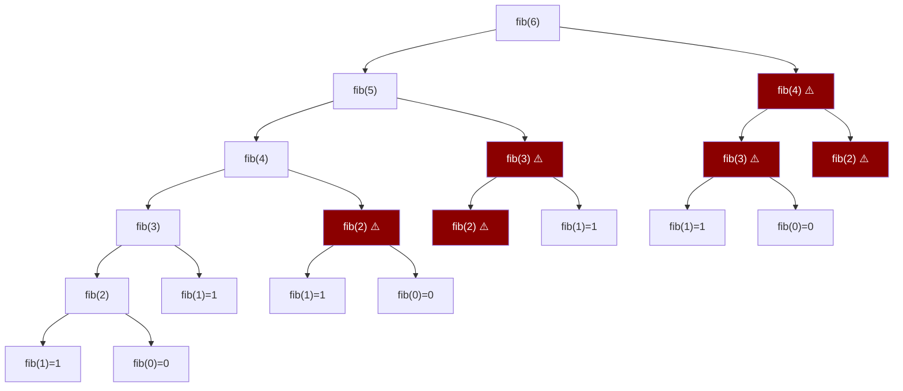

# 02-03 — Dynamic Programming

> **Prerequisito:** Haber leído [02-02-patrones-no-lineales.md](./02-02-patrones-no-lineales.md) — específicamente DFS, porque la recursión con memoización es la forma más natural de pensar en DP antes de pasar a tabulación.  
> **Principio de este archivo:** El 90% de los recursos te enseñan DP mostrando soluciones. Este archivo te enseña DP construyendo el proceso de pensamiento. Al terminar, sabrás cómo llegar a una solución de DP desde un enunciado — no memorizar respuestas.

🎯 **Antes de empezar:** NO abras NeetCode todavía. Lee este archivo completo. Los videos son el refuerzo visual — no el punto de partida. La comprensión del modelo mental va primero.

---

## Sección 1 — El modelo mental correcto de DP

Esta sección es la más importante del archivo. Si solo lees una sección, que sea esta.

Existe una razón por la que Dynamic Programming tiene reputación de ser "el tema más difícil de entrevistas": los recursos lo enseñan mal. Muestran el código de la solución, explican por qué funciona, y te dejan sin saber cómo habrías llegado a ese código tú solo. Eso no es aprender DP — es aprender las respuestas de un examen específico.

Vamos a construir el modelo mental correcto desde cero.

---

### Idea 1 — DP no es un algoritmo. Es una técnica de optimización.

La definición formal dice: "programación dinámica es una técnica para resolver problemas que tienen subproblemas superpuestos y subestructura óptima". Eso no te ayuda. Esta es la definición útil:

> **DP es la observación de que estás resolviendo el mismo subproblema múltiples veces en una solución recursiva, y guardar el resultado en lugar de recalcularlo.**

Eso es todo. La complejidad no viene de DP en sí — viene de dos habilidades previas:
1. Identificar que tienes subproblemas repetidos
2. Definir correctamente cuáles son esos subproblemas

El mecanismo de DP en sí (guardar resultados en un array o diccionario) tiene tres líneas de código. La parte difícil es todo lo que sucede *antes* de esas tres líneas.

**Analogía concreta para fijar la intuición:**

Imagina que te preguntan cuántas rutas hay de la esquina A a la esquina Z en una ciudad con solo movimientos hacia la derecha o hacia abajo. Si lo calculas recursivamente sin DP, cada vez que llegas a la esquina intermedia M, recalculas todas las rutas desde M a Z — aunque ya lo hayas calculado antes. DP dice: "calcula rutas desde M a Z una vez, escríbelo en un papel, y cuando lo necesites otra vez, lee el papel en lugar de recalcular."

El "papel" es tu tabla de DP. Eso es todo.

---

### Idea 2 — Las dos propiedades que definen un problema de DP

Para que DP sea la herramienta correcta, el problema debe tener **ambas** propiedades. Falta una — y DP no aplica o no es la solución óptima.

#### Propiedad 1: Overlapping Subproblems (Subproblemas Superpuestos)

La solución recursiva resuelve los mismos subproblemas múltiples veces.

El ejemplo clásico es Fibonacci. Para calcular `fib(6)`, el árbol de recursión naive se ve así:



Los nodos marcados en rojo son cálculos redundantes. `fib(4)` se calcula 2 veces, `fib(3)` se calcula 3 veces, `fib(2)` se calcula 4 veces. Sin DP, `fib(n)` tiene complejidad O(2ⁿ). Con DP, O(n) — porque cada subproblema se resuelve exactamente una vez.

**La pregunta de diagnóstico:** ¿Si dibujo el árbol de recursión de mi solución naive, hay nodos repetidos? Si la respuesta es sí — es DP.

#### Propiedad 2: Optimal Substructure (Subestructura Óptima)

La solución óptima del problema completo se construye a partir de soluciones óptimas de sus subproblemas.

**Ejemplo:** El camino más corto de Ciudad A a Ciudad C, pasando por Ciudad B, requiere:
- El camino más corto de A a B
- El camino más corto de B a C

Si el camino óptimo de A a C usa un subtramo A→B que no es el más corto posible de A a B, puedes mejorar la solución total reemplazando ese subtramo. Por lo tanto, la solución óptima global se construye de soluciones óptimas locales.

**Contraejemplo — cuándo NO hay subestructura óptima:** El camino más largo simple (sin ciclos) en un grafo. El camino más largo de A a C no necesariamente usa el camino más largo de A a B — puede que el camino más largo de A a B te aleje de C, haciendo imposible un camino largo hasta allá. Los subproblemas no son independientes, así que la subestructura óptima no se mantiene.

**Regla práctica:** Si el problema pide un máximo, mínimo, o conteo acumulativo donde cada paso construye sobre el anterior — probablemente hay subestructura óptima.

---

### Idea 3 — El proceso de 4 pasos para resolver cualquier problema de DP

Este proceso es el núcleo del archivo. Memoriza el proceso, no las soluciones.

```
PASO 1: Definir el estado
PASO 2: Definir la transición (recurrence relation)
PASO 3: Identificar los casos base
PASO 4: Determinar el orden de computación
```

**Paso 1 — Definir el estado: ¿Qué representa dp[i]?**

Esta es la decisión más importante y la que más falla en entrevistas. Si el estado está mal definido, el resto del proceso colapsa.

El estado es la respuesta a la pregunta: "Si solo tuviera que resolver el problema hasta el punto i (o para los parámetros i, j), ¿qué necesito saber?"

Regla de oro: **dp[i] debe ser la respuesta al subproblema para el input truncado hasta i.**

Ejemplo con Fibonacci: `dp[i]` = el i-ésimo número de Fibonacci. Simple. `dp[6]` = 8.

Señal de estado mal definido: si cuando intentas escribir la transición necesitas información que no está en el estado, el estado está incompleto y necesitas agregar más dimensiones.

**Paso 2 — Definir la transición: ¿Cómo se calcula dp[i]?**

La transición es la ecuación que relaciona `dp[i]` con estados anteriores. También llamada "recurrence relation".

Para Fibonacci: `dp[i] = dp[i-1] + dp[i-2]`

Esta ecuación captura la definición recursiva del problema. La pregunta que debes hacerte: "¿De qué estados anteriores depende dp[i], y cómo se combinan?"

**Paso 3 — Identificar los casos base**

Los casos base son los valores de dp que no dependen de otros estados. Son el punto de partida de la computación.

Para Fibonacci: `dp[0] = 0`, `dp[1] = 1`

Un caso base incorrecto corrompe toda la tabla. Verifica siempre dp[0] y dp[1] manualmente antes de confiar en la transición general.

**Paso 4 — Determinar el orden de computación**

Para calcular dp[i] necesitas dp[i-1] y dp[i-2] ya calculados. Por lo tanto, debes calcular en orden creciente: dp[0], dp[1], dp[2], ..., dp[n].

En DP 2D (dp[i][j]), el orden importa más: generalmente de arriba a abajo y de izquierda a derecha, pero depende de la dirección de la transición.

**Fibonacci completo con los 4 pasos:**

```csharp
// PASO 1: dp[i] = el i-ésimo número de Fibonacci
// PASO 2: dp[i] = dp[i-1] + dp[i-2]
// PASO 3: dp[0] = 0, dp[1] = 1
// PASO 4: orden creciente i = 0, 1, 2, ..., n

public int Fibonacci(int n)
{
    if (n <= 1) return n; // casos base
    
    int[] dp = new int[n + 1];
    dp[0] = 0;
    dp[1] = 1;
    
    for (int i = 2; i <= n; i++)
    {
        dp[i] = dp[i - 1] + dp[i - 2]; // transición
    }
    
    return dp[n];
}
// Tiempo: O(n) | Espacio: O(n) → reducible a O(1)
```

---

## Sección 2 — Memoización vs Tabulación

Son las dos implementaciones de DP. No son intercambiables en todos los casos.

### Memoización (Top-Down)

**Qué es:** Tomas tu solución recursiva y agregas un caché (Dictionary o array) para guardar resultados ya calculados. Empiezas desde el problema grande y bajas hacia los casos base.

**Cuándo usar:**
- Ya tienes la solución recursiva y solo necesitas optimizarla
- No todos los subproblemas son necesarios (la memoización solo calcula los que se alcanzan)
- La relación entre subproblemas es compleja y el orden de tabulación no es obvio

**Cuándo NO usar:**
- n > ~8,000 en .NET: el call stack tiene límite y recibirás `StackOverflowException`
- Cuando necesitas optimización de espacio (la tabulación es más fácil de optimizar)

**Fibonacci con memoización:**

```csharp
public class FibMemo
{
    private Dictionary<int, long> _cache = new();

    public long Fibonacci(int n)
    {
        if (n <= 1) return n;
        
        if (_cache.TryGetValue(n, out long cached))
            return cached; // ← HIT: no recalcular
        
        long result = Fibonacci(n - 1) + Fibonacci(n - 2);
        _cache[n] = result; // ← STORE: guardar para futuras llamadas
        return result;
    }
}
// Tiempo: O(n) — cada subproblema se calcula una vez
// Espacio: O(n) — caché + call stack
```

### Tabulación (Bottom-Up)

**Qué es:** Iteras desde los casos base hacia arriba, llenando una tabla explícita. No hay recursión.

**Cuándo usar:**
- n es grande (evita el límite del call stack)
- Puedes determinar el orden correcto de llenado antes de implementar
- Necesitas optimizar el espacio (puedes reducir la tabla a los últimos k estados)

**Cuándo NO usar:**
- La transición tiene dependencias no obvias que hacen el orden de llenado complicado
- Solo un subconjunto pequeño de estados es necesario (memoización es más eficiente)

**Fibonacci con tabulación:**

```csharp
public long FibonacciTabulation(int n)
{
    if (n <= 1) return n;
    
    long[] dp = new long[n + 1];
    dp[0] = 0;
    dp[1] = 1;
    
    for (int i = 2; i <= n; i++)
        dp[i] = dp[i - 1] + dp[i - 2];
    
    return dp[n];
}

// OPTIMIZACIÓN DE ESPACIO: dp[i] solo depende de dp[i-1] y dp[i-2]
// No necesitamos guardar toda la tabla — solo los últimos 2 valores
public long FibonacciO1Space(int n)
{
    if (n <= 1) return n;
    
    long prev2 = 0, prev1 = 1;
    
    for (int i = 2; i <= n; i++)
    {
        long current = prev1 + prev2;
        prev2 = prev1;
        prev1 = current;
    }
    
    return prev1;
}
// Tiempo: O(n) | Espacio: O(1) ← la optimización de espacio típica de DP lineal
```

**Tabla comparativa:**

| Aspecto | Memoización (Top-Down) | Tabulación (Bottom-Up) |
|---|---|---|
| Implementación | Natural si ya tienes recursión | Requiere determinar orden de llenado |
| Subproblemas calculados | Solo los necesarios | Todos (aunque no se usen) |
| Stack overflow | Riesgo con n grande | No aplica |
| Optimización de espacio | Difícil | Natural |
| Debugging | Más difícil (recursión) | Más fácil (loop lineal) |

> **Recomendación para entrevistas:** Si el problema es nuevo para ti, empieza con memoización (más natural de derivar), luego convierte a tabulación si te piden optimizar. Si ya reconoces el patrón, ve directo a tabulación.

---

## Sección 3 — Señales de reconocimiento de DP

Cómo identificar un problema de DP en un enunciado antes de escribir código.

### Señales fuertes de DP

Estas frases en el enunciado son indicadores de alta probabilidad:

| Frase en el enunciado | Por qué sugiere DP |
|---|---|
| "Número de formas de..." | Counting problem — contar caminos/combinaciones con restricciones |
| "Máximo/mínimo posible..." + decisiones | Optimización con decisiones secuenciales |
| "¿Es posible alcanzar...?" + condición acumulativa | Feasibility — ¿puedo llegar a target? |
| "Cuántos caminos existen..." en grids | DP 2D en grilla |
| "Partición" o "subset" que cumpla condición | Knapsack variant |
| "Subcadena/subsequencia más larga/corta" | String DP |

### Señales de que NO es DP (aunque parezca)

**Si el greedy funciona:** La decisión localmente óptima siempre produce la solución globalmente óptima. Ejemplo: Activity Selection Problem. Si puedes demostrar que la elección greedy nunca necesita ser revisitada — no necesitas DP.

**Si los subproblemas son independientes:** Divide and Conquer divide el problema en subproblemas que no se solapan (Merge Sort, por ejemplo). Sin overlap — no hay beneficio en memorizar.

**Si el problema pide todos los caminos, no el óptimo:** Generar todas las permutaciones o combinaciones es Backtracking, no DP. DP cuenta o optimiza — no enumera.

### El test definitivo de la recursión

Escribe la función recursiva naive del problema. Dibuja el árbol de recursión para un input pequeño.

- ¿Hay nodos con los mismos argumentos que aparecen más de una vez? → **Es DP**
- ¿El árbol es perfecto (sin repetición de nodos)? → **Probablemente no es DP**

---

## Sección 4 — Patrones clásicos de DP

Para cada patrón: estado, transición, casos base, y ambas implementaciones en C# donde aplica.

---

### PATRÓN DP-1 — Linear DP (1D)

**Señal de reconocimiento:** El estado depende solo de posiciones anteriores en un array 1D. La transición mira hacia atrás k pasos fijos.

🎯 **Recurso:** Después de leer este patrón completo, abre NeetCode YouTube y busca "NeetCode 1D Dynamic Programming" — ve los videos de Climbing Stairs y House Robber.

---

#### Problema: Climbing Stairs (LeetCode 70)

Estás subiendo una escalera de n escalones. Cada vez puedes subir 1 o 2 escalones. ¿Cuántas formas distintas hay de llegar al escalón n?

**4 pasos:**

1. **Estado:** `dp[i]` = número de formas de llegar al escalón i
2. **Transición:** Para llegar al escalón i, puedo venir del escalón i-1 (di 1 paso) o del escalón i-2 (di 2 pasos). Por tanto: `dp[i] = dp[i-1] + dp[i-2]`
3. **Casos base:** `dp[1] = 1` (solo hay una forma de llegar al escalón 1), `dp[2] = 2` (puedo dar 1+1 o directamente 2)
4. **Orden:** creciente, de 3 a n

```csharp
// ─── MEMOIZACIÓN ───
public int ClimbStairsMemo(int n)
{
    int[] memo = new int[n + 1];
    Array.Fill(memo, -1);
    return Climb(n, memo);
}

private int Climb(int n, int[] memo)
{
    if (n <= 2) return n;
    if (memo[n] != -1) return memo[n];
    
    memo[n] = Climb(n - 1, memo) + Climb(n - 2, memo);
    return memo[n];
}

// ─── TABULACIÓN ───
public int ClimbStairsTabulation(int n)
{
    if (n <= 2) return n;
    
    int[] dp = new int[n + 1];
    dp[1] = 1;
    dp[2] = 2;
    
    for (int i = 3; i <= n; i++)
        dp[i] = dp[i - 1] + dp[i - 2];
    
    return dp[n];
}

// ─── OPTIMIZACIÓN O(1) ESPACIO ───
public int ClimbStairsOptimal(int n)
{
    if (n <= 2) return n;
    
    int prev2 = 1, prev1 = 2;
    for (int i = 3; i <= n; i++)
    {
        int current = prev1 + prev2;
        prev2 = prev1;
        prev1 = current;
    }
    return prev1;
}
// Tiempo: O(n) | Espacio: O(1)
```

> ⚠️ **Nota:** Climbing Stairs es idéntico a Fibonacci con `dp[1]=1, dp[2]=2` en lugar de `dp[0]=0, dp[1]=1`. Reconocer esa equivalencia en una entrevista muestra comprensión del patrón, no memorización del problema.

---

#### Problema: House Robber (LeetCode 198)

Eres un ladrón. No puedes robar casas adyacentes (hay alarma que conecta casas contiguas). Dado un array con el valor de cada casa, ¿cuál es el máximo dinero que puedes robar?

**4 pasos:**

1. **Estado:** `dp[i]` = máximo dinero robable considerando las casas 0 hasta i (no necesariamente incluyendo la casa i)
2. **Transición:** Para la casa i, tomas la mejor decisión: robarla o no robarla.
   - Si **robas** casa i: no puedes robar casa i-1, así que ganas `nums[i] + dp[i-2]`
   - Si **no robas** casa i: el máximo es `dp[i-1]` (la misma respuesta sin considerar casa i)
   - `dp[i] = max(dp[i-1], nums[i] + dp[i-2])`
3. **Casos base:** `dp[0] = nums[0]`, `dp[1] = max(nums[0], nums[1])`
4. **Orden:** creciente

```csharp
// ─── TABULACIÓN ───
public int Rob(int[] nums)
{
    int n = nums.Length;
    if (n == 1) return nums[0];
    
    int[] dp = new int[n];
    dp[0] = nums[0];
    dp[1] = Math.Max(nums[0], nums[1]);
    
    for (int i = 2; i < n; i++)
    {
        // La decisión: robar casa i (gano nums[i] + lo mejor hasta i-2)
        //              vs no robar casa i (lo mejor hasta i-1 sigue igual)
        dp[i] = Math.Max(dp[i - 1], nums[i] + dp[i - 2]);
    }
    
    return dp[n - 1];
}

// ─── OPTIMIZACIÓN O(1) ESPACIO ───
public int RobOptimal(int[] nums)
{
    int n = nums.Length;
    if (n == 1) return nums[0];
    
    int prev2 = nums[0];
    int prev1 = Math.Max(nums[0], nums[1]);
    
    for (int i = 2; i < n; i++)
    {
        int current = Math.Max(prev1, nums[i] + prev2);
        prev2 = prev1;
        prev1 = current;
    }
    
    return prev1;
}
// Tiempo: O(n) | Espacio: O(1)
```

**Por qué esta transición captura la decisión correctamente:** En cada posición i, la transición modela exactamente dos alternativas mutuamente excluyentes: o incluyes la casa actual (y entonces la anterior está prohibida), o no la incluyes (y el máximo hasta i-1 ya captura la mejor opción sin i). No hay tercera alternativa. Eso es subestructura óptima.

---

### PATRÓN DP-2 — 0/1 Knapsack

**Señal de reconocimiento:** Tienes un conjunto de items, cada uno con peso y valor. Necesitas maximizar el valor total sin exceder una capacidad. Cada item se usa máximo una vez.

El estado es 2D: `dp[i][w]` = máximo valor usando los primeros i items con capacidad máxima w.

🎯 **Recurso:** Después de leer este patrón, busca "NeetCode 0/1 Knapsack" en YouTube. Este patrón tiene el mayor número de variantes en entrevistas.

**4 pasos:**

1. **Estado:** `dp[i][w]` = máximo valor usando items 0 hasta i-1, con capacidad w
2. **Transición:**
   - No incluyes item i: `dp[i][w] = dp[i-1][w]` (mismo resultado sin considerar item i)
   - Incluyes item i (si weight[i-1] <= w): `dp[i][w] = dp[i-1][w-weight[i-1]] + value[i-1]`
   - `dp[i][w] = max(las dos opciones anteriores)`
3. **Casos base:** `dp[0][w] = 0` para todo w (con 0 items, no puedes robar nada)
4. **Orden:** i de 1 a n, w de 1 a W

```csharp
public int Knapsack(int[] weights, int[] values, int capacity)
{
    int n = weights.Length;
    int[,] dp = new int[n + 1, capacity + 1];
    
    // dp[0][w] = 0 para todo w — ya inicializado (C# inicializa arrays con 0)
    
    for (int i = 1; i <= n; i++)
    {
        int itemWeight = weights[i - 1];
        int itemValue = values[i - 1];
        
        for (int w = 0; w <= capacity; w++)
        {
            // Opción 1: No incluir item i
            dp[i, w] = dp[i - 1, w];
            
            // Opción 2: Incluir item i (si cabe)
            if (itemWeight <= w)
            {
                int withItem = dp[i - 1, w - itemWeight] + itemValue;
                dp[i, w] = Math.Max(dp[i, w], withItem);
            }
        }
    }
    
    return dp[n, capacity];
    // Tiempo: O(n × W) | Espacio: O(n × W)
}

// ─── OPTIMIZACIÓN DE ESPACIO A O(W) ───
// Observación: dp[i][w] solo depende de la fila i-1.
// Podemos usar un solo array 1D si lo recorremos de DERECHA a IZQUIERDA.
// ¿Por qué de derecha a izquierda? Porque dp[w - weight] usa valores
// de la iteración anterior (fila i-1). Si fuéramos izquierda-derecha,
// dp[w - weight] ya habría sido actualizado en la iteración actual (fila i),
// permitiendo usar el mismo item más de una vez — eso sería Unbounded Knapsack.
public int KnapsackOptimized(int[] weights, int[] values, int capacity)
{
    int n = weights.Length;
    int[] dp = new int[capacity + 1];
    
    for (int i = 0; i < n; i++)
    {
        // CRÍTICO: recorrer de derecha a izquierda
        for (int w = capacity; w >= weights[i]; w--)
        {
            dp[w] = Math.Max(dp[w], dp[w - weights[i]] + values[i]);
        }
    }
    
    return dp[capacity];
    // Tiempo: O(n × W) | Espacio: O(W)
}
```

> ⚠️ **El error más frecuente en 0/1 Knapsack:** Recorrer el array interno de izquierda a derecha cuando optimizas el espacio. Esto convierte el problema en Unbounded Knapsack (el siguiente patrón), permitiendo usar el mismo item múltiples veces. La dirección del loop interno no es un detalle — es la diferencia entre dos problemas distintos.

#### Variante directa: Subset Sum

¿Puede algún subset de `nums` sumar exactamente `target`?

```csharp
public bool CanPartition(int[] nums, int target)
{
    // dp[s] = true si existe un subset de los items procesados que suma s
    bool[] dp = new bool[target + 1];
    dp[0] = true; // subset vacío suma 0
    
    foreach (int num in nums)
    {
        // Derecha a izquierda para no reusar el mismo número
        for (int s = target; s >= num; s--)
        {
            dp[s] = dp[s] || dp[s - num];
        }
    }
    
    return dp[target];
    // Tiempo: O(n × target) | Espacio: O(target)
}
```

---

### PATRÓN DP-3 — Unbounded Knapsack

**Diferencia clave con 0/1 Knapsack:** Cada item puede usarse un número ilimitado de veces.

La diferencia en la implementación es sutil pero crítica: cuando incluyes el item i, te quedas en la misma fila (puedes usarlo otra vez). En espacio optimizado, esto se traduce en recorrer el array de **izquierda a derecha** en lugar de derecha a izquierda.

🎯 **Recurso:** Busca "NeetCode Coin Change" en YouTube para el refuerzo visual de este patrón.

#### Problema: Coin Change (LeetCode 322)

Dado un array de monedas y un monto `amount`, encuentra el mínimo número de monedas necesario para formar `amount`. Cada moneda puede usarse infinitas veces.

**4 pasos:**

1. **Estado:** `dp[i]` = mínimo número de monedas para formar el monto i
2. **Transición:** Para cada moneda `c` en coins: `dp[i] = min(dp[i], dp[i - c] + 1)` si `i >= c`
3. **Casos base:** `dp[0] = 0` (cero monedas para hacer monto 0). `dp[i] = int.MaxValue` para i > 0 (inicialmente imposible)
4. **Orden:** i de 1 a amount (izquierda a derecha — unbounded)

```csharp
// ─── TABULACIÓN (Bottom-Up) ───
public int CoinChange(int[] coins, int amount)
{
    // Inicializar con "imposible" (amount + 1 es mayor que cualquier respuesta válida)
    int[] dp = new int[amount + 1];
    Array.Fill(dp, amount + 1); // valor imposible — ninguna solución válida usa más de amount monedas
    dp[0] = 0; // caso base: 0 monedas para hacer 0
    
    for (int i = 1; i <= amount; i++)
    {
        foreach (int coin in coins)
        {
            if (coin <= i)
            {
                dp[i] = Math.Min(dp[i], dp[i - coin] + 1);
            }
        }
    }
    
    // Si dp[amount] sigue siendo amount + 1, era imposible
    return dp[amount] > amount ? -1 : dp[amount];
}

// ─── MEMOIZACIÓN (Top-Down) ───
public int CoinChangeMemo(int[] coins, int amount)
{
    int[] memo = new int[amount + 1];
    Array.Fill(memo, -1);
    memo[0] = 0;
    
    return Solve(coins, amount, memo);
}

private int Solve(int[] coins, int remaining, int[] memo)
{
    if (remaining < 0) return int.MaxValue; // imposible
    if (memo[remaining] != -1) return memo[remaining];
    
    int minCoins = int.MaxValue;
    foreach (int coin in coins)
    {
        int result = Solve(coins, remaining - coin, memo);
        if (result != int.MaxValue)
            minCoins = Math.Min(minCoins, result + 1);
    }
    
    memo[remaining] = minCoins;
    return memo[remaining];
}
// Tiempo: O(amount × coins.Length) | Espacio: O(amount)
```

**Por qué inicializamos con `amount + 1` y no con `int.MaxValue`:** Si usas `int.MaxValue`, la operación `int.MaxValue + 1` produce overflow en C#. `amount + 1` es un valor centinela seguro que siempre es mayor que cualquier respuesta válida (no puedes necesitar más de `amount` monedas si cada moneda vale mínimo 1).

#### Variante: Coin Change II — Número de formas (LeetCode 518)

El mismo setup, pero ahora quieres contar el número de combinaciones (no permutaciones) que suman exactamente `amount`.

```csharp
public int Change(int amount, int[] coins)
{
    // dp[i] = número de combinaciones que suman i
    int[] dp = new int[amount + 1];
    dp[0] = 1; // 1 forma de hacer 0: no usar nada
    
    // CRÍTICO: El loop externo es por moneda, el interno por monto.
    // Si invirtieras los loops, contarías permutaciones (orden importa),
    // no combinaciones (orden no importa).
    foreach (int coin in coins)
    {
        for (int i = coin; i <= amount; i++)
        {
            dp[i] += dp[i - coin];
        }
    }
    
    return dp[amount];
}
// Tiempo: O(amount × coins.Length) | Espacio: O(amount)
```

**Por qué el orden de los loops importa:** Si iteras `for amount` en el loop externo y `for coins` en el interno, contarías `{1,2}` y `{2,1}` como dos combinaciones distintas (permutaciones). Al iterar por moneda en el externo, garantizas que cada moneda se "considera" antes de pasar a la siguiente, produciendo solo combinaciones únicas sin importar el orden.

---

### PATRÓN DP-4 — DP en Strings (2D)

**Señal de reconocimiento:** El problema involucra dos strings o una sola string con operaciones sobre substrings. El estado depende de dos posiciones — una en cada string. `dp[i][j]` representa algo sobre los primeros i caracteres de s1 y los primeros j caracteres de s2.

🎯 **Recurso:** Busca "NeetCode Longest Common Subsequence" en YouTube. Este es el patrón que más aparece en entrevistas Staff de empresas de producto.

#### Problema: Longest Common Subsequence (LeetCode 1143)

Dadas dos strings s1 y s2, encuentra la longitud de la subsecuencia común más larga. Una subsequence mantiene el orden relativo pero no necesita ser contigua.

**4 pasos:**

1. **Estado:** `dp[i][j]` = longitud del LCS de s1[0..i-1] y s2[0..j-1]
2. **Transición:**
   - Si `s1[i-1] == s2[j-1]`: los caracteres coinciden, extendemos el LCS anterior. `dp[i][j] = dp[i-1][j-1] + 1`
   - Si no coinciden: tomamos el mejor de excluir el último char de s1 o de s2. `dp[i][j] = max(dp[i-1][j], dp[i][j-1])`
3. **Casos base:** `dp[i][0] = 0` para todo i (LCS con string vacía = 0), `dp[0][j] = 0` para todo j
4. **Orden:** i de 1 a len(s1), j de 1 a len(s2)

**Tabla de llenado para s1 = "abcde", s2 = "ace":**

```
     ""  a  c  e
""  [ 0, 0, 0, 0 ]
a   [ 0, 1, 1, 1 ]
b   [ 0, 1, 1, 1 ]
c   [ 0, 1, 2, 2 ]
d   [ 0, 1, 2, 2 ]
e   [ 0, 1, 2, 3 ]  ← LCS = 3 ("ace")
```

Cada celda (i,j):
- Si s1[i-1] == s2[j-1]: diagonal + 1
- Si no: max(celda arriba, celda izquierda)

```csharp
// ─── TABULACIÓN ───
public int LongestCommonSubsequence(string text1, string text2)
{
    int m = text1.Length, n = text2.Length;
    int[,] dp = new int[m + 1, n + 1];
    
    // Casos base: primera fila y columna = 0 (ya inicializadas)
    
    for (int i = 1; i <= m; i++)
    {
        for (int j = 1; j <= n; j++)
        {
            if (text1[i - 1] == text2[j - 1])
                dp[i, j] = dp[i - 1, j - 1] + 1; // char coincide: extender LCS diagonal
            else
                dp[i, j] = Math.Max(dp[i - 1, j], dp[i, j - 1]); // no coincide: mejor sin uno de los chars
        }
    }
    
    return dp[m, n];
    // Tiempo: O(m × n) | Espacio: O(m × n) → optimizable a O(min(m,n))
}

// ─── MEMOIZACIÓN ───
public int LongestCommonSubsequenceMemo(string text1, string text2)
{
    int m = text1.Length, n = text2.Length;
    int[,] memo = new int[m, n];
    // Inicializar con -1 para distinguir "no calculado" de "0"
    for (int i = 0; i < m; i++)
        for (int j = 0; j < n; j++)
            memo[i, j] = -1;
    
    return SolveLCS(text1, text2, m - 1, n - 1, memo);
}

private int SolveLCS(string s1, string s2, int i, int j, int[,] memo)
{
    if (i < 0 || j < 0) return 0; // caso base: string vacía
    if (memo[i, j] != -1) return memo[i, j];
    
    if (s1[i] == s2[j])
        memo[i, j] = SolveLCS(s1, s2, i - 1, j - 1, memo) + 1;
    else
        memo[i, j] = Math.Max(SolveLCS(s1, s2, i - 1, j, memo),
                               SolveLCS(s1, s2, i, j - 1, memo));
    
    return memo[i, j];
}
```

#### Problema: Edit Distance / Levenshtein (LeetCode 72)

Dadas dos strings, encuentra el mínimo número de operaciones (insert, delete, replace) para convertir s1 en s2.

**4 pasos:**

1. **Estado:** `dp[i][j]` = mínimas operaciones para convertir s1[0..i-1] en s2[0..j-1]
2. **Transición:**
   - Si `s1[i-1] == s2[j-1]`: no se necesita operación. `dp[i][j] = dp[i-1][j-1]`
   - Si no coinciden, tomar el mínimo de 3 operaciones:
     - Replace: `dp[i-1][j-1] + 1` (reemplazar s1[i-1] por s2[j-1])
     - Delete: `dp[i-1][j] + 1` (eliminar s1[i-1])
     - Insert: `dp[i][j-1] + 1` (insertar s2[j-1] en s1)
3. **Casos base:** `dp[i][0] = i` (i eliminaciones para hacer string vacía), `dp[0][j] = j` (j inserciones para hacer s2[0..j-1] desde vacío)
4. **Orden:** i de 1 a m, j de 1 a n

```csharp
public int MinDistance(string word1, string word2)
{
    int m = word1.Length, n = word2.Length;
    int[,] dp = new int[m + 1, n + 1];
    
    // Casos base
    for (int i = 0; i <= m; i++) dp[i, 0] = i; // eliminar i chars de word1
    for (int j = 0; j <= n; j++) dp[0, j] = j; // insertar j chars para hacer word2
    
    for (int i = 1; i <= m; i++)
    {
        for (int j = 1; j <= n; j++)
        {
            if (word1[i - 1] == word2[j - 1])
            {
                dp[i, j] = dp[i - 1, j - 1]; // no operación necesaria
            }
            else
            {
                dp[i, j] = 1 + Math.Min(dp[i - 1, j - 1],  // replace
                               Math.Min(dp[i - 1, j],        // delete
                                        dp[i, j - 1]));      // insert
            }
        }
    }
    
    return dp[m, n];
    // Tiempo: O(m × n) | Espacio: O(m × n)
}
```

---

### PATRÓN DP-5 — DP en Grids

**Señal de reconocimiento:** El estado es una posición (i, j) en una grilla. El movimiento generalmente está restringido (solo abajo y derecha). El problema pide contar caminos u optimizar una suma a lo largo de un camino.

🎯 **Recurso:** Busca "NeetCode Unique Paths" en YouTube. Es el problema introductorio más limpio para DP 2D en grids.

#### Problema: Unique Paths (LeetCode 62)

En una grilla m × n, empieza en la esquina superior izquierda. Solo puedes moverte hacia abajo o hacia la derecha. ¿Cuántos caminos únicos hay hasta la esquina inferior derecha?

**4 pasos:**

1. **Estado:** `dp[i][j]` = número de caminos únicos desde (0,0) hasta (i,j)
2. **Transición:** Puedes llegar a (i,j) desde arriba (i-1,j) o desde la izquierda (i,j-1). `dp[i][j] = dp[i-1][j] + dp[i][j-1]`
3. **Casos base:** `dp[0][j] = 1` para todo j (solo un camino en la primera fila: ir recto a la derecha), `dp[i][0] = 1` para todo i (solo un camino en la primera columna: ir recto hacia abajo)
4. **Orden:** i de 0 a m-1, j de 0 a n-1

```csharp
public int UniquePaths(int m, int n)
{
    int[,] dp = new int[m, n];
    
    // Casos base: primera fila y primera columna = 1
    for (int i = 0; i < m; i++) dp[i, 0] = 1;
    for (int j = 0; j < n; j++) dp[0, j] = 1;
    
    for (int i = 1; i < m; i++)
        for (int j = 1; j < n; j++)
            dp[i, j] = dp[i - 1, j] + dp[i, j - 1];
    
    return dp[m - 1, n - 1];
}

// ─── OPTIMIZACIÓN A O(n) ESPACIO ───
// dp[i][j] solo depende de la fila anterior y la columna anterior en la misma fila.
// Podemos usar un solo array y actualizarlo in-place.
public int UniquePathsOptimal(int m, int n)
{
    int[] dp = new int[n];
    Array.Fill(dp, 1); // primera fila: todos 1
    
    for (int i = 1; i < m; i++)
    {
        for (int j = 1; j < n; j++)
        {
            dp[j] += dp[j - 1]; // dp[j] = dp[j] (arriba) + dp[j-1] (izquierda)
        }
    }
    
    return dp[n - 1];
    // Tiempo: O(m × n) | Espacio: O(n)
}
```

#### Problema: Minimum Path Sum (LeetCode 64)

Dada una grilla con valores numéricos, encuentra el camino de la esquina superior izquierda a la inferior derecha (solo abajo y derecha) que minimice la suma total.

```csharp
public int MinPathSum(int[][] grid)
{
    int m = grid.Length, n = grid[0].Length;
    int[,] dp = new int[m, n];
    
    dp[0, 0] = grid[0][0];
    
    // Primera fila: solo puedes venir de la izquierda
    for (int j = 1; j < n; j++)
        dp[0, j] = dp[0, j - 1] + grid[0][j];
    
    // Primera columna: solo puedes venir de arriba
    for (int i = 1; i < m; i++)
        dp[i, 0] = dp[i - 1, 0] + grid[i][0];
    
    // Resto: mejor entre venir de arriba o de la izquierda
    for (int i = 1; i < m; i++)
        for (int j = 1; j < n; j++)
            dp[i, j] = grid[i][j] + Math.Min(dp[i - 1, j], dp[i, j - 1]);
    
    return dp[m - 1, n - 1];
    // Tiempo: O(m × n) | Espacio: O(m × n) → reducible a O(n) con misma técnica
}
```

---

## Sección 5 — Los 4 errores que destruyen soluciones de DP

Esta sección es diferenciadora. La mayoría de recursos no la incluye, pero es donde los candidatos fallan en entrevistas.

### Error 1 — Estado mal definido (el error más costoso)

**Cómo se manifiesta:** La transición necesita información que no está capturada en el estado. Te das cuenta cuando escribes la transición y tienes que decir "pero también necesito saber si..." — esa información faltante debe estar en el estado.

**Ejemplo de error:** Para House Robber, definir `dp[i] = true si robé la casa i`. Con este estado, la transición `dp[i] = !dp[i-1]` es incorrecta — no captura el valor acumulado. El estado debe ser "máximo dinero hasta i", no "si robé o no".

**Diagnóstico:** Antes de codificar, pregúntate: "¿Puedo calcular la respuesta final solo leyendo un valor de dp? ¿Está toda la información relevante en el estado?"

### Error 2 — Confundir DP con Backtracking

| DP | Backtracking |
|---|---|
| "¿Cuántas formas hay?" | "Lista todas las formas" |
| "¿Cuál es la máxima/mínima?" | "¿Cuáles son todas las opciones?" |
| Output: un número o valor | Output: una lista de colecciones |
| Complejidad: O(n²) o O(n×W) | Complejidad: generalmente exponencial |

Si el problema pide generar todas las combinaciones/permutaciones/caminos — es Backtracking. Si pide contar o la mejor — es DP.

### Error 3 — Caso base incorrecto o faltante

Un caso base mal definido corrompe todos los valores derivados de él.

**Ejemplo:** En Coin Change, si inicializas `dp[0] = int.MaxValue` (en lugar de 0), la transición `dp[i - coin] + 1` produce overflow y toda la tabla queda corrupta.

**Práctica recomendada:** Antes de fiar en la transición general, verifica manualmente dp[0], dp[1], y dp[2] con un ejemplo pequeño a mano.

### Error 4 — Orden incorrecto de llenado de tabla 2D

Para DP 2D, el orden de los loops es la diferencia entre correcto e incorrecto.

**Ejemplo concreto:** En LCS, `dp[i][j]` depende de `dp[i-1][j-1]`, `dp[i-1][j]`, y `dp[i][j-1]`. Si calculas en orden i=0..m, j=0..n, todos los valores necesarios ya están calculados cuando llegas a (i,j). Si invirtieras el orden a j=0..n, i=0..m, cuando calculas `dp[i][j-1]`, la fila i aún no está completa para j-1 mayor — los valores que necesitas son de la iteración actual, no de la anterior.

**Regla general:** Dibuja la tabla. Marca de dónde viene cada celda con flechas. El orden de llenado debe garantizar que cuando procesas una celda, todas las celdas de las que depende ya tienen su valor final.

---

## Sección 6 — Framework de identificación rápida para entrevistas

En una entrevista tienes 2-3 minutos para determinar si un problema es DP y qué estado usar. Este es el proceso:

```
1. ¿Pide máximo, mínimo, o conteo de algo?          → Posible DP
2. ¿Hay decisiones secuenciales donde cada una
   afecta las opciones futuras?                      → Señal fuerte de DP
3. Si lo planteo recursivamente, ¿hay
   subproblemas repetidos?                           → Confirma DP
4. ¿Puedo definir el estado con 1-2 variables
   enteras (índice, capacidad, monto)?               → Implementable como DP tabular
5. ¿Cuál es la transición?                           → Escríbela en el whiteboard
                                                        ANTES de codificar
```

Lo que comunica al entrevistador que eres Staff: no saltar al código — articular el estado y la transición antes de escribir una línea.

### Aplicación del framework — 3 problemas reales

**Problema 1: Jump Game II (LeetCode 45)**
"Dado un array donde nums[i] es el máximo número de pasos desde i, encuentra el mínimo número de saltos para llegar al final."

Aplicando el framework:
- ¿Pide mínimo? Sí → posible DP ✓
- ¿Decisiones secuenciales? Sí — desde cada posición decides cuánto saltar ✓
- ¿Subproblemas repetidos? Sí — el mínimo de saltos desde i se calcula múltiples veces en la recursión naive ✓
- Estado: `dp[i]` = mínimo saltos para llegar a la posición i
- Transición: Para cada posición j < i donde puedo llegar a i (j + nums[j] >= i): `dp[i] = min(dp[i], dp[j] + 1)`

*(Nota: Jump Game II se resuelve más eficientemente con Greedy — O(n) vs O(n²) de DP. El framework también te ayuda a identificar cuándo Greedy supera a DP.)*

**Problema 2: Word Break (LeetCode 139)**
"Dado un string s y un diccionario wordDict, ¿puede s segmentarse en palabras del diccionario?"

Aplicando el framework:
- ¿Pide conteo o sí/no? Sí/No → posible DP ✓
- ¿Decisiones secuenciales? Sí — en cada posición decides si cortar aquí o no ✓
- ¿Subproblemas repetidos? Sí — si usas recursión, la misma posición de inicio se evalúa múltiples veces ✓
- Estado: `dp[i]` = true si s[0..i-1] puede segmentarse usando wordDict
- Transición: Para cada j < i: si `dp[j] == true` Y `s[j..i-1]` está en wordDict → `dp[i] = true`

**Problema 3: Longest Increasing Subsequence (LeetCode 300)**
"Encuentra la longitud de la subsecuencia creciente más larga en nums."

Aplicando el framework:
- ¿Pide máximo? Sí → posible DP ✓
- ¿Decisiones secuenciales? Sí — en cada posición decides si incluir el número en la subsequence ✓
- ¿Subproblemas repetidos? Sí — LIS terminando en posición i se necesita para todas las posiciones j > i donde nums[j] > nums[i] ✓
- Estado: `dp[i]` = longitud del LIS que termina exactamente en el índice i
- Transición: `dp[i] = max(dp[j] + 1)` para todo j < i donde nums[j] < nums[i]
- Caso base: `dp[i] = 1` para todo i (la subsequence mínima es el elemento solo)

```csharp
public int LengthOfLIS(int[] nums)
{
    int n = nums.Length;
    int[] dp = new int[n];
    Array.Fill(dp, 1); // caso base: cada elemento forma una subsequence de longitud 1
    
    int maxLIS = 1;
    
    for (int i = 1; i < n; i++)
    {
        for (int j = 0; j < i; j++)
        {
            if (nums[j] < nums[i]) // nums[i] extiende la subsequence que termina en j
            {
                dp[i] = Math.Max(dp[i], dp[j] + 1);
            }
        }
        maxLIS = Math.Max(maxLIS, dp[i]);
    }
    
    return maxLIS;
    // Tiempo: O(n²) | Espacio: O(n)
    // Nota: existe solución O(n log n) con binary search — mencionar en entrevista Staff
}
```

---

## Sección 7 — Recursos y práctica

### Cuándo abrir cada recurso

**NeetCode.io — DP Playlist en YouTube (🆓)**

Abre el video del patrón correspondiente **después** de leer la sección de este archivo:
- Después de Sección 4 DP-1 → ver "Climbing Stairs" y "House Robber"
- Después de Sección 4 DP-2 → ver "0/1 Knapsack" y "Partition Equal Subset Sum"
- Después de Sección 4 DP-3 → ver "Coin Change" y "Coin Change II"
- Después de Sección 4 DP-4 → ver "Longest Common Subsequence" y "Edit Distance"
- Después de Sección 4 DP-5 → ver "Unique Paths" y "Minimum Path Sum"

Los videos de NeetCode son el mejor refuerzo visual gratuito disponible. Pero son refuerzo — no punto de partida. Si los ves antes de intentar el problema, memorizas la solución en lugar de aprender el proceso.

**AlgoExpert — Sección DP (práctica complementaria)**

Úsalo cuando termines todos los videos de NeetCode del patrón y quieras volumen adicional. Filtra por "Dynamic Programming" y trabaja en orden de dificultad. Si después de NeetCode un problema específico sigue sintiéndose inestable — AlgoExpert te da más repeticiones del mismo concepto.

**AlgoMonster — DP Patterns (repetición espaciada)**

Ideal para después de haber practicado todos los patrones una vez. El sistema de repetición espaciada te vuelve a mostrar los problemas donde fallaste — no pierdas tiempo repasando lo que ya dominas.

### Orden de práctica recomendado

Este es el orden óptimo para construir el modelo mental de forma acumulativa. No saltes.

| Orden | Problema | Patrón | Por qué en este orden |
|---|---|---|---|
| 1 | Climbing Stairs | Linear 1D | Calentamiento — Fibonacci disfrazado |
| 2 | House Robber | Linear 1D | Primera decisión binaria real |
| 3 | Coin Change | Unbounded Knapsack | Primer problema de optimización no trivial |
| 4 | Longest Common Subsequence | String 2D | Primer estado 2D |
| 5 | Unique Paths | Grid 2D | Estado 2D con geometría |
| 6 | Jump Game II | Linear + Greedy comparison | Distinguir DP vs Greedy |
| 7 | Partition Equal Subset Sum | 0/1 Knapsack | Variante de Knapsack en subset |
| 8 | Word Break | Linear 1D con HashSet | DP con estructura de datos externa |
| 9 | Longest Increasing Subsequence | Linear 1D con comparación | Transición con loop doble |
| 10 | Edit Distance | String 2D con 3 operaciones | La transición más compleja del patrón |

---

## Tabla resumen — Los 5 patrones de DP

| Patrón | Dimensión del estado | Definición típica de dp[i] | Transición típica | Ejemplo canónico |
|---|---|---|---|---|
| **Linear DP** | 1D | Respuesta óptima hasta el índice i | `dp[i] = max/min(dp[i-1], dp[i-2] + algo)` | House Robber |
| **0/1 Knapsack** | 2D (index, capacity) | Máximo valor con i items y capacidad w | `dp[i][w] = max(dp[i-1][w], dp[i-1][w-wi]+vi)` | Partition Equal Subset Sum |
| **Unbounded Knapsack** | 1D (amount/target) | Óptimo para el monto/target i | `dp[i] = min/max(dp[i-coin]+1)` para cada coin | Coin Change |
| **String DP** | 2D (i chars s1, j chars s2) | Respuesta para s1[0..i-1] y s2[0..j-1] | Basada en igualdad/desigualdad de chars | LCS, Edit Distance |
| **Grid DP** | 2D (fila, columna) | Respuesta óptima para llegar a (i,j) | `dp[i][j] = f(dp[i-1][j], dp[i][j-1])` | Unique Paths, Min Path Sum |

---

## Checklist de salida — Dynamic Programming

Completa este checklist antes de considerar el patrón dominado. "Completar" significa resolver sin consultar solución y dentro del tiempo objetivo.

### Modelo mental
- [ ] Puedo explicar en mis propias palabras qué es "overlapping subproblems" con el árbol de recursión de Fibonacci
- [ ] Puedo identificar en un enunciado nuevo si tiene subestructura óptima antes de escribir código
- [ ] Aplico el proceso de 4 pasos (estado, transición, casos base, orden) en cada problema nuevo

### Implementación
- [ ] Implemento memoización (recursión + caché) para cualquier problema dado su solución recursiva naive
- [ ] Implemento tabulación (bottom-up) con la tabla correctamente inicializada y el orden correcto
- [ ] Optimizo la tabla a O(1) o O(n) de espacio cuando la transición solo mira los últimos k estados
- [ ] Sé cuándo usar memoización vs tabulación y articulo la razón

### Por patrón
- [ ] **Linear DP:** Resuelvo Climbing Stairs y House Robber con ambas implementaciones en < 20 min
- [ ] **0/1 Knapsack:** Implemento la versión 2D y la versión optimizada a O(W), entiendo la dirección del loop
- [ ] **Unbounded Knapsack:** Implemento Coin Change y Coin Change II, entiendo la diferencia en el orden de loops
- [ ] **String DP:** Construyo la tabla de LCS a mano para un ejemplo, implemento Edit Distance
- [ ] **Grid DP:** Implemento Unique Paths y Min Path Sum, optimizo a O(n) de espacio

### Reconocimiento
- [ ] Aplico el framework de 5 preguntas en < 3 minutos para determinar si un problema es DP
- [ ] Distingo cuándo es DP vs Greedy vs Backtracking con justificación técnica

### Velocidad
- [ ] Resuelvo cualquiera de los 10 problemas de práctica dentro del tiempo objetivo (< 30 min para Medium)
- [ ] Articulo complejidad temporal y espacial de mi solución mientras implemento

---

> **Siguiente archivo:** [02-04-grafos-avanzados.md →](./02-04-grafos-avanzados.md)  
> Grafos avanzados requiere BFS/DFS dominados (módulo anterior) y el modelo mental recursivo que acabas de construir con DP. Topological Sort, Union-Find y Dijkstra — los tres algoritmos que más aparecen en entrevistas Staff de nivel avanzado.
