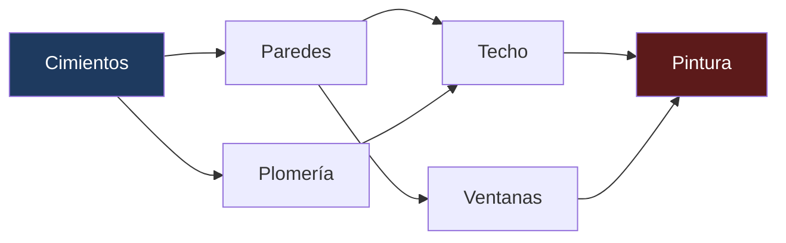
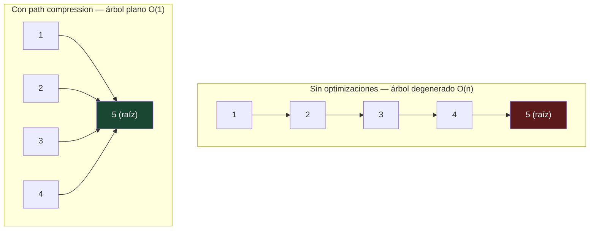
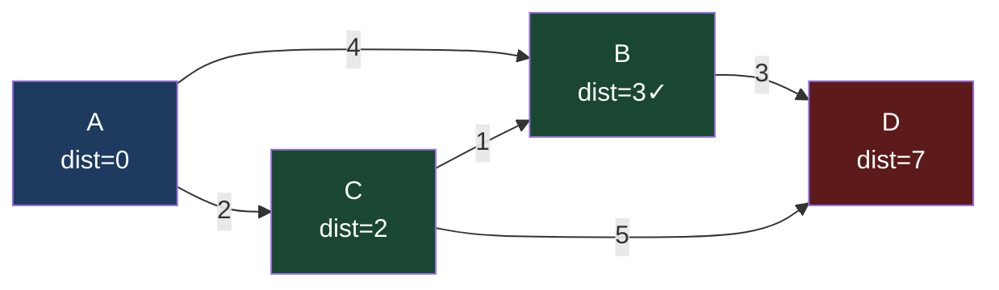

# 02-04 — Grafos Avanzados

> **Prerequisito estricto:** Haber completado [02-02-patrones-no-lineales.md](./02-02-patrones-no-lineales.md) — especialmente BFS y DFS en grafos. Si no puedes implementar BFS con visited set y DFS con detección de ciclo sin consultar notas, regresa ahora. Los algoritmos de este archivo son extensiones directas — no podrás seguir el razonamiento sin esa base.
>
> **Principio de este archivo:** Topological Sort, Union-Find y Dijkstra no son algoritmos independientes. Son respuestas a tres preguntas fundamentales sobre grafos: ¿en qué orden proceso nodos con dependencias? ¿están estos nodos conectados? ¿cuál es el camino más barato? Dominar los tres te permite resolver el 95% de los problemas de grafos en entrevistas Staff.

🎯 **Antes de empezar:** Abre AlgoExpert → sección "Graphs". Completa "Depth-first Search" y "Breadth-first Search" si no los has hecho. Luego regresa aquí para los algoritmos avanzados.

---

## Por qué estos algoritmos separan Senior de Staff

Un candidato Senior puede implementar BFS y DFS. Un candidato Staff puede responder a un problema disfrazado.

Los problemas de grafos avanzados rara vez dicen "implementa Dijkstra". Dicen cosas como:
- "Tienes un sistema de compilación con dependencias entre módulos. ¿En qué orden compilas?" → Topological Sort
- "Dado un grafo de conexiones de red, ¿cuántos clusters de servidores tienes?" → Union-Find
- "Tienes una red de vuelos con costos. ¿Cuál es el vuelo más barato de A a B?" → Dijkstra

El entrevistador no te da el nombre del algoritmo. El trabajo del candidato Staff es escuchar el enunciado, identificar la pregunta subyacente sobre el grafo, y elegir la herramienta correcta.

---

## Algoritmo 1 — Topological Sort

### 1. Intuición

Imagina que tienes que construir una casa. No puedes pintar las paredes antes de levantarlas, ni levantar las paredes antes de poner los cimientos. Hay un orden obligatorio determinado por las dependencias entre tareas.

Topological Sort toma un **DAG** (Directed Acyclic Graph — grafo dirigido sin ciclos) donde las aristas representan dependencias (A→B significa "A debe completarse antes que B") y devuelve un ordenamiento lineal de los nodos tal que para cada arista A→B, A aparece antes que B en el resultado.

**Condición de existencia:** Un ordenamiento topológico existe si y solo si el grafo no tiene ciclos. Si A depende de B que depende de A — hay un deadlock, no hay solución. El algoritmo lo detecta automáticamente.



**Un ordenamiento topológico válido:** Cimientos → Paredes → Plomería → Techo → Ventanas → Pintura

Nota que existen múltiples ordenamientos válidos — Topological Sort no garantiza uno único.

### 2. Señales de reconocimiento

- "Orden de ejecución" con dependencias entre tareas
- "¿Es posible completar todos los cursos?" (dependencias que podrían crear ciclo)
- "Orden de compilación" de módulos con imports
- "Scheduling" de trabajos con prerequisitos
- Cualquier problema donde A debe ocurrir antes que B

⚠️ **Señal falsa:** Un grafo con ciclos no tiene ordenamiento topológico. Si el enunciado implica ciclos posibles, Topological Sort es para detectar el ciclo, no para ordenar.

### 3. Implementación 1 — Kahn's Algorithm (BFS-based)

**Por qué BFS funciona aquí:** El truco es rastrear cuántas aristas "entran" a cada nodo (in-degree). Un nodo con in-degree 0 no tiene prerequisitos — puede procesarse primero. Cuando lo procesas, "eliminas" sus aristas salientes, potencialmente reduciendo el in-degree de sus vecinos a 0. Esos vecinos ahora pueden procesarse. Es BFS sobre el espacio de "nodos sin prerequisitos pendientes".

```csharp
// Problema: Course Schedule II — LeetCode 210
// Dado numCourses y prerequisites[i] = [a, b] que significa "b antes que a",
// devolver el orden de cursos. Si hay ciclo, devolver array vacío.
public int[] FindOrder(int numCourses, int[][] prerequisites)
{
    // Paso 1: Construir lista de adyacencia y calcular in-degrees
    var adj = new List<int>[numCourses];
    var inDegree = new int[numCourses];

    for (int i = 0; i < numCourses; i++)
        adj[i] = new List<int>();

    foreach (var pre in prerequisites)
    {
        // pre[1] → pre[0]: pre[1] debe completarse antes que pre[0]
        adj[pre[1]].Add(pre[0]);
        inDegree[pre[0]]++;
    }

    // Paso 2: Agregar a la queue todos los nodos sin prerequisitos
    var queue = new Queue<int>();
    for (int i = 0; i < numCourses; i++)
        if (inDegree[i] == 0)
            queue.Enqueue(i);

    // Paso 3: BFS — procesar nodos, reducir in-degrees
    var result = new List<int>();
    while (queue.Count > 0)
    {
        int course = queue.Dequeue();
        result.Add(course);

        foreach (int next in adj[course])
        {
            inDegree[next]--;
            if (inDegree[next] == 0)
                queue.Enqueue(next);
        }
    }

    // Paso 4: Detección de ciclo — si no procesamos todos los nodos, hay un ciclo
    // Los nodos con in-degree > 0 que nunca llegaron a 0 forman el ciclo
    return result.Count == numCourses ? result.ToArray() : Array.Empty<int>();
}
// Tiempo: O(V + E) | Espacio: O(V + E) para la lista de adyacencia
```

**Cómo Kahn's detecta ciclos:** Si hay un ciclo A→B→C→A, ninguno de estos nodos llega a in-degree 0 porque siempre hay al menos una arista entrante desde el ciclo. Jamás entran a la queue. El resultado tendrá menos nodos que `numCourses` — esa es la señal del ciclo.

### 4. Implementación 2 — DFS-based Topological Sort

**Intuición del post-order:** Cuando haces DFS post-order, visitas todos los descendientes de un nodo antes de "procesarlo". En Topological Sort, eso significa que antes de agregar el nodo al resultado, ya has agregado todos los nodos que dependen de él. Al reversar el resultado final obtienes el orden topológico.

La clave es el tracking de estado de tres estados: **unvisited** (0), **visiting** (1 — en el stack de recursión actual), **visited** (2 — procesado completamente).

Un nodo en estado "visiting" que volvemos a encontrar → **ciclo detectado** (estamos en un camino que regresa a sí mismo).

```csharp
public int[] FindOrderDFS(int numCourses, int[][] prerequisites)
{
    var adj = new List<int>[numCourses];
    for (int i = 0; i < numCourses; i++)
        adj[i] = new List<int>();

    foreach (var pre in prerequisites)
        adj[pre[1]].Add(pre[0]);

    // 0 = unvisited, 1 = visiting (en stack actual), 2 = visited
    var state = new int[numCourses];
    var result = new List<int>();
    bool hasCycle = false;

    void DFS(int node)
    {
        if (hasCycle) return;         // Propagar: si ya detectamos ciclo, salir
        if (state[node] == 2) return; // Ya procesado completamente — skip
        if (state[node] == 1)         // Volvimos a un nodo en el stack actual
        {
            hasCycle = true;
            return;
        }

        state[node] = 1; // Marcar como "en proceso"

        foreach (int neighbor in adj[node])
            DFS(neighbor);

        state[node] = 2;           // Marcar como "completamente procesado"
        result.Add(node);          // Post-order: agregar DESPUÉS de procesar vecinos
    }

    for (int i = 0; i < numCourses; i++)
        if (state[i] == 0)
            DFS(i);

    if (hasCycle) return Array.Empty<int>();

    // El resultado está en orden inverso al topológico — revertir
    result.Reverse();
    return result.ToArray();
}
```

**¿Cuándo usar Kahn's vs DFS?**

| Criterio | Kahn's (BFS) | DFS |
|---|---|---|
| Detección de ciclo | Implícita (resultado incompleto) | Explícita (estado "visiting") |
| Facilidad de explicar en entrevista | Alta — es BFS con in-degrees | Media — requiere explicar los 3 estados |
| Obtener niveles de dependencia | Natural (por rondas de BFS) | Requiere trabajo adicional |
| Stack overflow en grafos muy profundos | No | Sí (recursión) — usar iterativo en prod |

**Recomendación para entrevistas:** Kahn's es más fácil de articular. DFS es más elegante pero tiene más aristas donde cometer errores.

### 5. Problemas representativos

**Problema 1 — Course Schedule (LeetCode 207):** ¿Es posible completar todos los cursos? → `result.Count == numCourses` en Kahn's. Solo detección de ciclo, no el orden.

**Problema 2 — Course Schedule II (LeetCode 210):** Devolver el orden completo → el array `result` de Kahn's.

**Problema 3 — Alien Dictionary (LeetCode 269 — Premium):**
Este es el que diferencia Staff de Senior. El problema no dice "topological sort". Dice: "dado un diccionario de palabras en orden lexicográfico de un lenguaje alienígena, encuentra el orden del alfabeto".

El truco es construir el grafo: comparar palabras adyacentes para inferir qué letra viene antes que otra. Si "abc" viene antes que "abd", entonces en el alfabeto alienígena 'c' viene antes que 'd'. Cada comparación de letras en la misma posición donde las palabras difieren da una arista del grafo. Luego topological sort sobre ese grafo de letras.

```csharp
public string AlienOrder(string[] words)
{
    // Inicializar todos los caracteres como nodos
    var inDegree = new Dictionary<char, int>();
    var adj = new Dictionary<char, List<char>>();

    foreach (string word in words)
        foreach (char c in word)
        {
            if (!inDegree.ContainsKey(c)) inDegree[c] = 0;
            if (!adj.ContainsKey(c)) adj[c] = new List<char>();
        }

    // Construir aristas comparando palabras adyacentes
    for (int i = 0; i < words.Length - 1; i++)
    {
        string w1 = words[i], w2 = words[i + 1];
        int minLen = Math.Min(w1.Length, w2.Length);
        bool found = false;

        // Caso inválido: "abc" antes de "ab" es imposible en orden lexicográfico
        if (w1.Length > w2.Length && w1.StartsWith(w2))
            return "";

        for (int j = 0; j < minLen; j++)
        {
            if (w1[j] != w2[j])
            {
                adj[w1[j]].Add(w2[j]); // w1[j] viene antes que w2[j]
                inDegree[w2[j]]++;
                found = true;
                break; // Solo la primera diferencia da información
            }
        }
    }

    // Kahn's algorithm sobre el grafo de caracteres
    var queue = new Queue<char>();
    foreach (var (c, degree) in inDegree)
        if (degree == 0) queue.Enqueue(c);

    var sb = new System.Text.StringBuilder();
    while (queue.Count > 0)
    {
        char c = queue.Dequeue();
        sb.Append(c);
        foreach (char next in adj[c])
        {
            inDegree[next]--;
            if (inDegree[next] == 0) queue.Enqueue(next);
        }
    }

    return sb.Length == inDegree.Count ? sb.ToString() : ""; // Ciclo detectado
}
```

### 6. Trade-offs y cuándo NO usar

**Cuándo NO aplica Topological Sort:**
- El grafo tiene ciclos → no existe ordenamiento topológico (el algoritmo lo detecta)
- El grafo es no dirigido → "dependencias" son bidireccionales, el concepto no aplica
- Quieres el camino más corto → BFS o Dijkstra son las herramientas correctas

**El gotcha de producción más común:** ⚠️ En sistemas reales con dependencias circulares (microservicios que se llaman mutuamente), Topological Sort te dice que hay un ciclo pero no *cuál* nodo romper para resolverlo. Para eso necesitas algoritmos de detección de ciclos dirigidos específicos (SCC — Strongly Connected Components con Tarjan o Kosaraju). En entrevistas Staff, mencionar esta extensión te diferencia.

---

## Algoritmo 2 — Union-Find (Disjoint Set Union)

### 1. Intuición

Imagina un mapa de redes sociales. Tienes millones de usuarios y relaciones de amistad. La pregunta que Union-Find responde eficientemente es: **¿estas dos personas están en el mismo grupo de amigos (conectadas transitivamente)?**

La estructura mantiene colecciones de conjuntos disjuntos (sin elementos compartidos) y soporta exactamente dos operaciones:
- **Find(x):** ¿a qué conjunto pertenece x? (devuelve el "representante" del conjunto)
- **Union(x, y):** fusionar el conjunto de x con el conjunto de y

La elegancia de Union-Find es que estas operaciones son prácticamente O(1) amortizado con dos optimizaciones simples.

### 2. La implementación completa con ambas optimizaciones

```csharp
public class UnionFind
{
    private readonly int[] parent;
    private readonly int[] rank;   // Profundidad aproximada del árbol
    public int Components { get; private set; }

    public UnionFind(int n)
    {
        parent = new int[n];
        rank = new int[n];
        Components = n;

        // Inicialmente cada nodo es su propio representante (su propio conjunto)
        for (int i = 0; i < n; i++)
            parent[i] = i;
        // rank empieza en 0 por defecto — todos los árboles tienen altura 0
    }

    // Find con Path Compression:
    // La primera vez que buscamos la raíz de x, hacemos que x apunte
    // directamente a la raíz — acortando el camino para todas las búsquedas futuras.
    // Resultado: los árboles se aplanan progresivamente.
    public int Find(int x)
    {
        if (parent[x] != x)
            parent[x] = Find(parent[x]); // Compresión recursiva de ruta
        return parent[x];
    }

    // Union con Union by Rank:
    // Siempre adjuntamos el árbol más pequeño (por rank) debajo del más grande.
    // Esto mantiene los árboles balanceados — sin esto, Find puede degradarse a O(n).
    // Retorna false si ya estaban en el mismo conjunto (→ la arista crea un ciclo).
    public bool Union(int x, int y)
    {
        int rootX = Find(x);
        int rootY = Find(y);

        if (rootX == rootY)
            return false; // Ya en el mismo conjunto — esta arista crea un ciclo

        // Adjuntar el árbol de menor rank debajo del de mayor rank
        if (rank[rootX] < rank[rootY])
            (rootX, rootY) = (rootY, rootX); // Swap para que rootX siempre sea el mayor

        parent[rootY] = rootX;

        // Solo incrementar rank si ambos tienen el mismo rank — el árbol resultante es más alto
        if (rank[rootX] == rank[rootY])
            rank[rootX]++;

        Components--;
        return true;
    }

    // Conveniencia: ¿están x e y en el mismo conjunto?
    public bool Connected(int x, int y) => Find(x) == Find(y);
}
```

**¿Por qué estas optimizaciones son críticas?**

Sin path compression: Find es O(n) en el peor caso (árbol degenerado como lista).
Sin union by rank: los árboles pueden crecer desbalanceados — Find lento.
Con ambas: la complejidad de m operaciones sobre n elementos es O(m · α(n)) donde α es la función inversa de Ackermann. Para todos los valores prácticos de n (incluso 10⁸⁰ — los átomos del universo), α(n) ≤ 4. Es esencialmente O(1) amortizado.



### 3. Problemas representativos

**Problema 1 — Number of Connected Components (LeetCode 323):**
```csharp
public int CountComponents(int n, int[][] edges)
{
    var uf = new UnionFind(n);
    foreach (var edge in edges)
        uf.Union(edge[0], edge[1]); // Retorno ignorado — solo nos importa el conteo final
    return uf.Components;
}
// Tan simple como esto. Union-Find brilla por su elegancia en problemas de conectividad.
```

**Problema 2 — Redundant Connection (LeetCode 684):**
Encontrar la arista que crea el ciclo en un grafo que debería ser un árbol.
```csharp
public int[] FindRedundantConnection(int[][] edges)
{
    int n = edges.Length;
    var uf = new UnionFind(n + 1); // Nodos numerados desde 1

    foreach (var edge in edges)
    {
        // Si Union retorna false, los nodos ya estaban conectados
        // → esta arista crea el ciclo → es la redundante
        if (!uf.Union(edge[0], edge[1]))
            return edge;
    }

    return Array.Empty<int>(); // Nunca llega aquí si el input es válido
}
```

**Problema 3 — Accounts Merge (LeetCode 721):**
El más complejo. Hay cuentas con listas de emails; dos cuentas pertenecen a la misma persona si comparten al menos un email. Fusionar todas las cuentas del mismo dueño.

```csharp
public IList<IList<string>> AccountsMerge(IList<IList<string>> accounts)
{
    // Mapear cada email a un ID numérico para usar Union-Find
    var emailToId = new Dictionary<string, int>();
    var emailToName = new Dictionary<string, string>();
    int id = 0;

    // Asignar IDs y hacer Union de todos los emails de la misma cuenta
    foreach (var account in accounts)
    {
        string name = account[0];
        for (int i = 1; i < account.Count; i++)
        {
            string email = account[i];
            if (!emailToId.ContainsKey(email))
            {
                emailToId[email] = id++;
                emailToName[email] = name;
            }
            // Unir el primer email de la cuenta con todos los demás
            // → emails del mismo dueño quedan en el mismo conjunto
            // (necesitamos inicializar UF con tamaño final — simplificado aquí)
        }
    }

    var uf = new UnionFind(id);
    foreach (var account in accounts)
    {
        int firstId = emailToId[account[1]];
        for (int i = 2; i < account.Count; i++)
            uf.Union(firstId, emailToId[account[i]]);
    }

    // Agrupar emails por su raíz en Union-Find
    var groups = new Dictionary<int, SortedSet<string>>();
    foreach (var (email, emailId) in emailToId)
    {
        int root = uf.Find(emailId);
        if (!groups.ContainsKey(root))
            groups[root] = new SortedSet<string>(); // SortedSet para orden lexicográfico
        groups[root].Add(email);
    }

    // Construir resultado
    var result = new List<IList<string>>();
    foreach (var (root, emails) in groups)
    {
        var merged = new List<string>();
        string anyEmail = emails.First();
        merged.Add(emailToName[anyEmail]); // Nombre de la persona
        merged.AddRange(emails);
        result.Add(merged);
    }

    return result;
}
```

### 4. Union-Find vs BFS/DFS — cuándo usar cada uno

| Escenario | Herramienta correcta | Por qué |
|---|---|---|
| Conectividad dinámica (aristas se agregan en runtime) | Union-Find | BFS/DFS requiere rerecorrer todo |
| Detección de ciclo en grafo no dirigido | Union-Find | Más simple que DFS con estado |
| Número de componentes conexas | Union-Find | `Components` se mantiene automáticamente |
| Camino más corto entre nodos | BFS/DFS | Union-Find no almacena el camino |
| Traversal completo del grafo | BFS/DFS | Union-Find no "visita" nodos |
| Aristas con pesos | Dijkstra/MST | Union-Find ignora pesos |

⚠️ **Gotcha de producción:** Union-Find con path compression compresión modifica el array `parent` — no es thread-safe. En sistemas concurrentes, necesitas sincronización o una implementación lock-free más compleja.

---

## Algoritmo 3 — Dijkstra

### 1. Intuición

BFS encuentra el camino más corto en grafos no ponderados (donde cada arista tiene el mismo "costo"). Pero en el mundo real, un vuelo de Ciudad de México a Madrid no cuesta lo mismo que uno a Guadalajara. Las aristas tienen pesos.

Dijkstra es la extensión de BFS para grafos con **pesos positivos**. La diferencia clave: BFS usa una Queue normal (FIFO) porque todos los "costos" son iguales. Dijkstra usa una **Priority Queue** (min-heap) para siempre procesar el nodo más barato primero.

**La garantía greedy:** Una vez que extraemos un nodo de la Priority Queue con distancia d, sabemos que d es la distancia mínima final. ¿Por qué? Porque todos los pesos son positivos — cualquier otro camino a ese nodo pasaría por nodos más caros, y agregar aristas positivas solo puede aumentar el costo. Esta propiedad se rompe con pesos negativos.

### 2. Traza visual del algoritmo



Dijkstra desde A: procesa A (dist 0) → actualiza C a 2, B a 4 → procesa C (dist 2) → actualiza B a 3 (mejor que 4), D a 7 → procesa B (dist 3) → actualiza D a 6 → procesa D (dist 6). Resultado: A=0, C=2, B=3, D=6.

### 3. Implementación en C#

```csharp
// Network Delay Time — LeetCode 743
// Grafo dirigido con pesos. ¿Cuánto tiempo para que una señal llegue a todos los nodos?
// Equivalente a: distancia máxima del camino mínimo desde el source a cualquier nodo.
public int NetworkDelayTime(int[][] times, int n, int k)
{
    // Construir lista de adyacencia: nodo → lista de (vecino, peso)
    var adj = new Dictionary<int, List<(int node, int weight)>>();
    for (int i = 1; i <= n; i++)
        adj[i] = new List<(int, int)>();

    foreach (var time in times)
        adj[time[0]].Add((time[1], time[2]));

    // dist[i] = distancia mínima conocida desde k hasta i
    var dist = new Dictionary<int, int>();
    for (int i = 1; i <= n; i++)
        dist[i] = int.MaxValue;
    dist[k] = 0;

    // Min-heap en .NET: PriorityQueue<elemento, prioridad>
    // Prioridad = distancia acumulada (menor = más prioritario)
    var pq = new PriorityQueue<int, int>();
    pq.Enqueue(k, 0);

    while (pq.Count > 0)
    {
        int node = pq.Dequeue(); // Nodo con menor distancia conocida
        int currentDist = dist[node];

        foreach (var (neighbor, weight) in adj[node])
        {
            int newDist = currentDist + weight;

            // Relajación: si encontramos un camino más corto, actualizamos
            if (newDist < dist[neighbor])
            {
                dist[neighbor] = newDist;
                pq.Enqueue(neighbor, newDist); // Puede haber duplicados — no importa
            }
        }
    }

    // Si algún nodo no fue alcanzado, devolver -1
    int maxDist = dist.Values.Max();
    return maxDist == int.MaxValue ? -1 : maxDist;
}
// Tiempo: O((V + E) log V) | Espacio: O(V + E)
```

**Nota sobre duplicados en la PriorityQueue:** Esta implementación puede agregar el mismo nodo múltiples veces a la PQ (con distancias distintas). Cuando procesamos un nodo, su distancia actual en `dist[]` puede ser menor que la prioridad con que fue encolado — en ese caso ya fue procesado con la distancia óptima y podemos simplemente ignorar esa entrada obsoleta. Esto es correcto y es la forma estándar de implementar Dijkstra en entrevistas. La alternativa es marcar nodos como "visitados", pero agrega complejidad innecesaria.

```csharp
// Versión con skip de entradas obsoletas (alternativa explícita):
while (pq.Count > 0)
{
    pq.TryDequeue(out int node, out int priority);

    // Si la distancia en la PQ es mayor que la actual, es una entrada obsoleta
    if (priority > dist[node]) continue; // Saltar

    foreach (var (neighbor, weight) in adj[node])
    {
        int newDist = dist[node] + weight;
        if (newDist < dist[neighbor])
        {
            dist[neighbor] = newDist;
            pq.Enqueue(neighbor, newDist);
        }
    }
}
```

### 4. Variante: Cheapest Flights Within K Stops (LeetCode 787)

Este problema ilustra cuándo Dijkstra estándar no funciona directamente — necesita modificación. La restricción "máximo K escalas" convierte el estado del nodo de `(nodo)` a `(nodo, escalas_usadas)`.

```csharp
public int FindCheapestPrice(int n, int[][] flights, int src, int dst, int k)
{
    var adj = new Dictionary<int, List<(int dest, int price)>>();
    for (int i = 0; i < n; i++) adj[i] = new List<(int, int)>();
    foreach (var f in flights) adj[f[0]].Add((f[1], f[2]));

    // dist[i] = precio mínimo para llegar a i (sin restricción de paradas)
    var dist = new int[n];
    Array.Fill(dist, int.MaxValue);
    dist[src] = 0;

    // Estado: (precio_acumulado, nodo_actual, paradas_usadas)
    var pq = new PriorityQueue<(int node, int stops), int>();
    pq.Enqueue((src, 0), 0);

    while (pq.Count > 0)
    {
        pq.TryDequeue(out var state, out int price);
        var (node, stops) = state;

        if (node == dst) return price; // Llegamos al destino

        if (stops > k) continue; // Excedimos el límite de escalas

        foreach (var (neighbor, cost) in adj[node])
        {
            int newPrice = price + cost;
            if (newPrice < dist[neighbor])
            {
                dist[neighbor] = newPrice;
                pq.Enqueue((neighbor, stops + 1), newPrice);
            }
        }
    }

    return dist[dst] == int.MaxValue ? -1 : dist[dst];
}
```

### 5. Cuándo Dijkstra NO funciona — Bellman-Ford

**El problema con pesos negativos:** Si hay una arista de peso negativo, la garantía greedy de Dijkstra se rompe. Un nodo que ya "procesamos" como óptimo podría tener un camino más corto a través de una arista negativa que todavía no hemos explorado. Dijkstra devolvería resultados incorrectos.

**Bellman-Ford:** Relaja todas las aristas V-1 veces. Después de k iteraciones, garantiza la distancia más corta usando a lo sumo k aristas. Puede detectar ciclos de peso negativo (si tras V-1 iteraciones todavía hay relajaciones posibles, hay un ciclo negativo).

| Característica | Dijkstra | Bellman-Ford |
|---|---|---|
| Pesos positivos | ✅ Correcto y rápido | ✅ Correcto pero lento |
| Pesos negativos | ❌ Incorrecto | ✅ Correcto |
| Ciclos negativos | ❌ Loop infinito | ✅ Los detecta |
| Complejidad | O((V+E) log V) | O(V·E) |
| Cuándo usar | 95% de los casos | Pesos negativos o detección de ciclo negativo |

En entrevistas Staff, mencionar Bellman-Ford cuando hay pesos negativos es la señal que diferencia al candidato que realmente entiende los algoritmos del que memorizó Dijkstra.

---

## Algoritmo 4 — Minimum Spanning Tree (MST)

### 1. Intuición

Tienes n ciudades que quieres conectar con cables de fibra óptica. Cada conexión posible tiene un costo. ¿Cuál es el subconjunto mínimo de conexiones que mantiene todo conectado con el costo total más bajo?

Eso es un Minimum Spanning Tree: un subgrafo que conecta todos los nodos, es un árbol (sin ciclos), y tiene el peso total mínimo posible.

**Propiedades:** Un MST de n nodos siempre tiene exactamente n-1 aristas. Si el grafo es conexo, el MST existe y es único si todos los pesos son distintos.

### 2. Kruskal's Algorithm — implementación completa

```csharp
// Min Cost to Connect All Points — LeetCode 1584
// Puntos en un plano 2D, costo = distancia Manhattan. Conectar todos con costo mínimo.
public int MinCostConnectPoints(int[][] points)
{
    int n = points.Length;

    // Generar todas las aristas posibles con sus costos (distancia Manhattan)
    var edges = new List<(int cost, int u, int v)>();
    for (int i = 0; i < n; i++)
        for (int j = i + 1; j < n; j++)
        {
            int cost = Math.Abs(points[i][0] - points[j][0])
                     + Math.Abs(points[i][1] - points[j][1]);
            edges.Add((cost, i, j));
        }

    // Paso 1: Ordenar aristas por costo (ascending)
    edges.Sort((a, b) => a.cost.CompareTo(b.cost));

    var uf = new UnionFind(n);
    int totalCost = 0;
    int edgesUsed = 0;

    // Paso 2: Agregar la arista más barata que no cree ciclo (Greedy + Union-Find)
    foreach (var (cost, u, v) in edges)
    {
        if (uf.Union(u, v)) // Union retorna false si ya estaban conectados (ciclo)
        {
            totalCost += cost;
            edgesUsed++;
            if (edgesUsed == n - 1) break; // MST completo — n-1 aristas
        }
    }

    return totalCost;
}
// Tiempo: O(E log E) dominado por el sort | Espacio: O(V + E)
```

**Por qué el greedy funciona:** El Cut Property garantiza que la arista más barata que cruza cualquier "corte" (partición de nodos en dos grupos) siempre pertenece a un MST. Kruskal explota esto: en cada paso, la arista más barata que une dos componentes distintos es segura de agregar.

**Prim's Algorithm (conceptual):** Similar a Dijkstra — crece el MST un nodo a la vez desde un punto inicial. Usa Priority Queue para siempre agregar el nodo más barato conectado al MST actual. Mejor que Kruskal cuando el grafo es denso (muchas aristas) porque no necesita procesarlas todas. Kruskal es mejor para grafos dispersos.

---

## Tabla comparativa — elegir el algoritmo correcto

| Pregunta sobre el grafo | Algoritmo | Complejidad | Requisito |
|---|---|---|---|
| ¿Camino mínimo (pasos)? | BFS | O(V+E) | Pesos iguales (no ponderado) |
| ¿Camino mínimo (costo)? | Dijkstra | O((V+E) log V) | Pesos positivos |
| ¿Camino mínimo con negativos? | Bellman-Ford | O(V·E) | Pesos cualquiera |
| ¿En qué orden proceso dependencias? | Topological Sort | O(V+E) | DAG (sin ciclos) |
| ¿Están conectados X e Y? | Union-Find | O(α(n)) ≈ O(1) | — |
| ¿Cuántos grupos/componentes? | Union-Find | O(V·α(V)) | — |
| ¿Detectar ciclo en no-dirigido? | Union-Find | O(E·α(V)) | Grafo no dirigido |
| ¿Detectar ciclo en dirigido? | DFS (3 estados) | O(V+E) | Grafo dirigido |
| ¿Conectar todos con costo mínimo? | MST (Kruskal/Prim) | O(E log E) | Grafo no dirigido con pesos |
| ¿Todos los caminos desde un nodo? | DFS | O(V+E) | — |

---

## Checklist de salida — Grafos Avanzados

- [ ] Implemento Kahn's Algorithm desde cero con detección de ciclo correcta
- [ ] Implemento DFS Topological Sort con los 3 estados (unvisited/visiting/visited)
- [ ] Explico por qué el resultado incompleto en Kahn's indica un ciclo
- [ ] Implemento UnionFind con path compression Y union by rank (ambos, no uno)
- [ ] Explico la complejidad O(α(n)) de Union-Find y por qué es prácticamente O(1)
- [ ] Implemento Dijkstra con PriorityQueue de .NET 6+
- [ ] Explico por qué Dijkstra falla con pesos negativos y cuándo usar Bellman-Ford
- [ ] Identifico en un enunciado si el problema requiere Topological Sort, Union-Find o Dijkstra sin que lo diga explícitamente
- [ ] Implemento Kruskal's MST usando Union-Find

---

> **Recursos para este archivo:**
> - **AlgoExpert Graphs:** "Boggle Board", "Dijkstra's Algorithm", "Topological Sort" — completar en ese orden
> - **NeetCode.io → Graphs:** Videos de Topological Sort y Dijkstra — ver después de leer este archivo
> - **LeetCode:** Course Schedule II (207/210), Redundant Connection (684), Network Delay Time (743)

> **Siguiente archivo:** [02-05-temas-complementarios.md →](./02-05-temas-complementarios.md)
