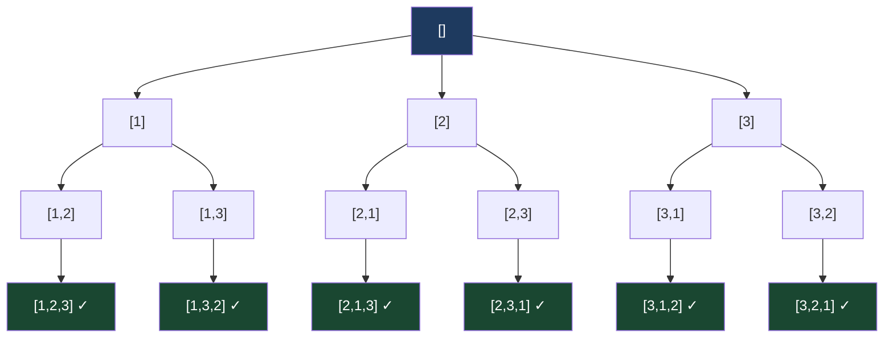
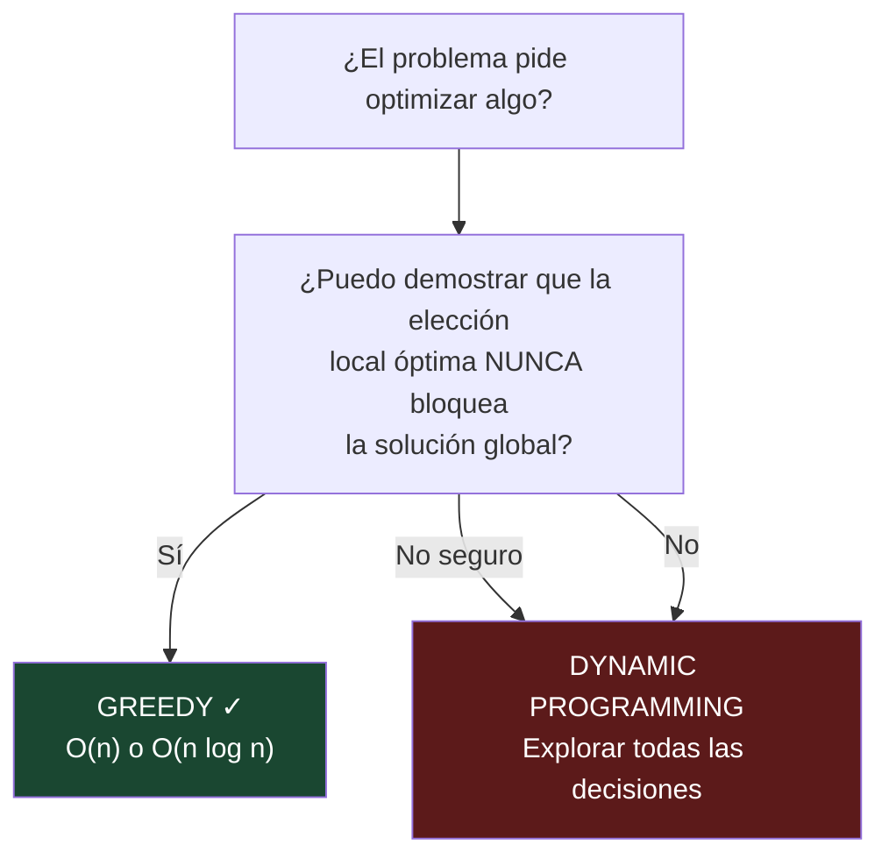

# 02-05 — Temas Complementarios

> **Prerequisito:** Haber completado los patrones lineales ([02-01](./02-01-patrones-lineales.md)) y tener base en DFS ([02-02](./02-02-patrones-no-lineales.md)). Backtracking es DFS con estado mutable — sin esa base, el template no tendrá sentido.
>
> **Principio de este archivo:** Estos temas no son el núcleo del módulo — son el complemento. No esperes la misma profundidad de implementación que en DP o Grafos. Lo que necesitas es: **reconocer la señal en el enunciado, saber cuál herramienta aplicar, y poder implementar la versión básica sin ayuda.** En entrevistas Staff, estos temas aparecen como "segunda parte" del problema — el candidato que no los reconoce pierde puntos en el margen.

🎯 **Puede estudiarse en paralelo desde el mes 3.** Las señales de reconocimiento de estos temas son tan distintas de los demás patrones que no generan confusión cognitiva si se estudian a la vez.

---

## Tema 1 — Backtracking

### 1. Intuición

Backtracking es exploración sistemática de todas las posibilidades con la capacidad de **deshacer** una decisión cuando lleva a un callejón sin salida.

La analogía correcta: resolver un laberinto con lápiz. Avanzas por un camino, marcas donde estuviste, y si llegas a un callejón sin salida, borras la marca y pruebas otra ruta. El "borrar" es el `backtrack` — restaurar el estado al que tenías antes de tomar esa decisión.

Backtracking es DFS sobre un árbol de decisiones donde:
- Cada nodo representa un estado parcial de la solución
- Las ramas son las decisiones disponibles en ese estado
- Las hojas son soluciones completas (válidas o inválidas)
- **El backtrack** es "deshacer la última decisión y probar la siguiente"



*Árbol de backtracking para permutaciones de [1,2,3]. Cada hoja es una permutación válida.*

### 2. El template universal

Este template es la base de todos los problemas de backtracking. Memoriza la estructura — las variantes cambian los detalles, no el esqueleto.

```csharp
IList<IList<int>> result = new List<IList<int>>();
List<int> current = new List<int>(); // Estado mutable que se construye y destruye

void Backtrack(int start, /* otros parámetros de estado */)
{
    // Condición base: la solución está completa — guardar copia y retornar
    if (/* solución completa */)
    {
        result.Add(new List<int>(current)); // ⚠️ COPIA — no guardes la referencia
        return;
    }

    for (int i = start; i < nums.Length; i++)
    {
        // Poda (pruning): si la opción actual no puede llevar a una solución, skip
        if (/* opción inválida */) continue;

        current.Add(nums[i]);              // 1. Hacer la elección
        Backtrack(i + 1, /* nuevo estado */); // 2. Explorar recursivamente
        current.RemoveAt(current.Count - 1);  // 3. DESHACER — el backtrack real
    }
}
```

**El error más común:** Guardar `current` directamente al result sin copiar. Como `current` es mutable, todas las entradas del resultado apuntarán a la misma lista — que al final estará vacía. Siempre `new List<int>(current)`.

### 3. Variante 1 — Subsets (LeetCode 78)

Generar todos los subsets de un array sin duplicados.

```csharp
public IList<IList<int>> Subsets(int[] nums)
{
    var result = new List<IList<int>>();
    var current = new List<int>();

    void Backtrack(int start)
    {
        // Cada estado parcial ES un subset válido — agregar inmediatamente
        result.Add(new List<int>(current));

        for (int i = start; i < nums.Length; i++)
        {
            current.Add(nums[i]);
            Backtrack(i + 1); // i+1: no reutilizar elementos anteriores
            current.RemoveAt(current.Count - 1);
        }
    }

    Backtrack(0);
    return result;
}
// Tiempo: O(n × 2ⁿ) — hay 2ⁿ subsets, cada uno puede tener hasta n elementos
// Espacio: O(n) en el stack de recursión
```

### 4. Variante 2 — Permutations (LeetCode 46)

Todas las permutaciones de un array. La diferencia con Subsets: el orden importa, y cada elemento se usa exactamente una vez (no `start` sino `used` set).

```csharp
public IList<IList<int>> Permute(int[] nums)
{
    var result = new List<IList<int>>();
    var current = new List<int>();
    var used = new bool[nums.Length]; // Rastrea qué elementos ya están en current

    void Backtrack()
    {
        if (current.Count == nums.Length)
        {
            result.Add(new List<int>(current));
            return;
        }

        for (int i = 0; i < nums.Length; i++)
        {
            if (used[i]) continue; // Este elemento ya está en la permutación actual

            used[i] = true;
            current.Add(nums[i]);
            Backtrack();
            current.RemoveAt(current.Count - 1);
            used[i] = false; // Deshacer — devolver el elemento al "pool disponible"
        }
    }

    Backtrack();
    return result;
}
// Tiempo: O(n × n!) | Espacio: O(n) — n! permutaciones, cada una de longitud n
```

### 5. Variante 3 — Combination Sum (LeetCode 39)

Combinaciones de números que sumen exactamente target. Los elementos pueden reutilizarse. Ilustra la poda (pruning) — técnica crítica para eficiencia en backtracking.

```csharp
public IList<IList<int>> CombinationSum(int[] candidates, int target)
{
    Array.Sort(candidates); // Ordenar permite poda temprana
    var result = new List<IList<int>>();
    var current = new List<int>();

    void Backtrack(int start, int remaining)
    {
        if (remaining == 0)
        {
            result.Add(new List<int>(current));
            return;
        }

        for (int i = start; i < candidates.Length; i++)
        {
            // Poda: si el candidato actual ya excede lo que falta,
            // los siguientes (mayores o iguales) también lo harán — stop
            if (candidates[i] > remaining) break;

            current.Add(candidates[i]);
            // i (no i+1): permitir reutilizar el mismo elemento
            Backtrack(i, remaining - candidates[i]);
            current.RemoveAt(current.Count - 1);
        }
    }

    Backtrack(0, target);
    return result;
}
```

**La poda es lo que hace backtracking "inteligente":** Sin el `break`, exploramos ramas que sabemos que no pueden dar solución. Con el `break`, podamos el árbol de búsqueda — de O(n^target) a mucho menos en práctica.

### 6. Señales de reconocimiento críticas

| Si el enunciado dice... | Patrón |
|---|---|
| "Todas las combinaciones que..." | Backtracking (Combination Sum) |
| "Todos los subsets de..." | Backtracking (Subsets) |
| "Todas las permutaciones de..." | Backtracking (Permutations) |
| "Genera todos los..." | Backtracking |
| "¿Existe alguna combinación que...?" | Backtracking o DP (si busca óptimo) |
| "La combinación mínima que..." | Dynamic Programming — no backtracking |
| "¿Cuántas formas de...?" | DP (cuenta) no backtracking (enumera) |

**Regla fundamental:** Si el problema pide **TODOS** los resultados → Backtracking. Si pide **EL MEJOR** resultado o un **CONTEO** → probablemente DP.

---

## Tema 2 — Greedy Algorithms

### 1. Intuición y cuándo funciona

Greedy es tomar la decisión localmente óptima en cada paso con la esperanza (demostrada) de que llevar a la solución globalmente óptima.

La analogía: pagar una deuda con billetes. Para dar cambio de $73 con el mínimo de billetes, usas el billete más grande posible en cada paso: $50 + $20 + $2 + $1 = 4 billetes. Esto es greedy — y funciona porque el sistema monetario tiene la propiedad de que el billete más grande nunca te "bloquea" de un resultado óptimo.

**El problema central de Greedy:** No siempre funciona. Greedy es correcto únicamente cuando puedes demostrar que la elección local óptima nunca te aleja de la solución global. Esto se llama la **propiedad de la subestructura greedy** o **greedy choice property**. Si no puedes demostrarla — aunque sea intuitivamente — usa DP.



### 2. Problema 1 — Jump Game (LeetCode 55)

Array de saltos: `nums[i]` es el máximo de pasos que puedes dar desde la posición `i`. ¿Puedes llegar al último índice?

**Por qué greedy funciona:** En cada posición, mantén el "alcance máximo" que has visto hasta ahora. Si en algún momento el alcance es menor que tu posición actual — estás atrapado. Si llegas al final del array sin estar atrapado — puedes llegar.

```csharp
public bool CanJump(int[] nums)
{
    int maxReach = 0; // El índice máximo al que puedes llegar

    for (int i = 0; i < nums.Length; i++)
    {
        if (i > maxReach) return false; // Estás en una posición inalcanzable

        maxReach = Math.Max(maxReach, i + nums[i]); // Actualizar alcance desde i

        if (maxReach >= nums.Length - 1) return true; // Ya alcanzas el final
    }

    return true;
}
// Tiempo: O(n) | Espacio: O(1)
// DP naive sería O(n²) — Greedy lo lleva a O(n) sin sacrificar correctness
```

### 3. Problema 2 — Meeting Rooms II (LeetCode 253 — Premium)

Dado un array de intervalos `[start, end]`, ¿cuántas salas de reuniones se necesitan como mínimo?

**Por qué greedy funciona:** Ordena reuniones por hora de inicio. Para cada nueva reunión, usa una sala existente que termina lo más pronto posible (min-heap de `end times`). Si ninguna sala está libre, abre una nueva.

```csharp
public int MinMeetingRooms(int[][] intervals)
{
    if (intervals.Length == 0) return 0;

    // Ordenar por hora de inicio
    Array.Sort(intervals, (a, b) => a[0].CompareTo(b[0]));

    // Min-heap de horas de fin de reuniones activas
    // El top del heap = la sala que queda libre más pronto
    var endTimes = new PriorityQueue<int, int>();

    foreach (var interval in intervals)
    {
        int start = interval[0], end = interval[1];

        // Si hay una sala que termina antes o cuando empieza la siguiente reunión,
        // reutilizarla (sacar del heap y volver a agregar con nuevo end time)
        if (endTimes.Count > 0 && endTimes.Peek() <= start)
            endTimes.Dequeue();

        endTimes.Enqueue(end, end); // Agregar esta reunión (nueva sala o reutilizada)
    }

    // El número de elementos en el heap = número de salas en uso simultáneo máximo
    return endTimes.Count;
}
// Tiempo: O(n log n) | Espacio: O(n)
```

### 4. Problema 3 — Gas Station (LeetCode 134)

n gasolineras en un circuito. En cada estación `i`, puedes recargar `gas[i]` litros. Ir de `i` a `i+1` cuesta `cost[i]`. ¿Desde qué estación puedes completar el circuito? (Si hay solución, es única.)

```csharp
public int CanCompleteCircuit(int[] gas, int[] cost)
{
    int totalGas = 0, currentGas = 0, start = 0;

    for (int i = 0; i < gas.Length; i++)
    {
        int net = gas[i] - cost[i]; // Ganancia neta en esta estación
        totalGas += net;
        currentGas += net;

        // Si el gas acumulado se vuelve negativo desde el `start` actual,
        // ninguna estación entre start e i puede ser el punto de inicio válido
        // → probar desde i+1
        if (currentGas < 0)
        {
            start = i + 1;
            currentGas = 0;
        }
    }

    // Si el total de gas es negativo, no hay solución posible
    return totalGas >= 0 ? start : -1;
}
// Tiempo: O(n) | Espacio: O(1)
```

**El insight greedy:** Si llegas a la estación `i` con gas negativo empezando desde `start`, entonces `start` no es válido — ni ninguna estación entre `start` e `i`. ¿Por qué? Porque si la suma acumulada de `start` a `i` es negativa, incluso si empezaras desde una estación intermedia, el tramo final hasta `i` seguiría siendo negativo (tendrías menos gas inicial). Este insight elimina O(n) candidatos por iteración.

### 5. Greedy vs DP — la decisión

| Señal | Greedy | DP |
|---|---|---|
| Elección local óptima demostrable | ✅ | — |
| "Máximo alcance", "mínimo billetes", "scheduling" | ✅ | — |
| Decisiones con consecuencias que dependen de decisiones futuras | — | ✅ |
| "¿Cuántas formas?", "mínimo de operaciones", "máximo beneficio con restricciones" | — | ✅ |
| Complejidad resultante | O(n) o O(n log n) | O(n²) o O(n·m) típicamente |

⚠️ **El gotcha frecuente:** Hay problemas que parecen greedy pero son DP. El ejemplo clásico: "Coin Change" (mínimo de monedas). Greedy (siempre usar la moneda más grande) falla con ciertos sistemas de denominaciones (ej. monedas de 1, 3, 4 — para 6, greedy da 4+1+1=3 monedas, DP da 3+3=2 monedas). No asumas Greedy hasta que puedas demostrar la greedy choice property.

---

## Tema 3 — Bit Manipulation

### 1. Por qué aparece en entrevistas Staff

Flags de permisos en sistemas de autorización, hashing y checksums, optimizaciones de espacio, operaciones en chips y sistemas embebidos, criptografía básica. No es el tema más frecuente — pero cuando aparece y no sabes XOR, es un rechazo automático.

La buena noticia: el conjunto de operaciones útiles en entrevistas es pequeño y las propiedades son memorables.

### 2. Operaciones fundamentales en C#

```csharp
// ─── Las 6 operaciones base ───
int a = 0b1010; // 10 en decimal, 1010 en binario
int b = 0b1100; // 12 en decimal, 1100 en binario

int and  = a & b;   // 0b1000 = 8  — solo bits donde AMBOS son 1
int or   = a | b;   // 0b1110 = 14 — bits donde AL MENOS UNO es 1
int xor  = a ^ b;   // 0b0110 = 6  — bits donde SON DISTINTOS
int not  = ~a;      // Invierte todos los bits (complemento a dos)
int lsh  = a << 2;  // 0b101000 = 40 — multiplica por 2²
int rsh  = a >> 1;  // 0b0101  = 5  — divide por 2¹ (floor)

// ─── Operaciones de bit individuales ───
int i = 2; // bit en posición 2

bool isSet  = (a & (1 << i)) != 0; // ¿El bit i está activo?
int set     = a | (1 << i);        // Activar bit i
int clear   = a & ~(1 << i);       // Desactivar bit i
int toggle  = a ^ (1 << i);        // Invertir bit i

// ─── Propiedades del XOR — las más útiles en entrevistas ───
// a ^ a = 0      (un número XOR consigo mismo = 0)
// a ^ 0 = a      (XOR con 0 no cambia el valor)
// XOR es conmutativo y asociativo: (a^b)^c = a^(b^c)
// Por lo tanto: si todos los números aparecen dos veces excepto uno,
// XOR de todos da el número que aparece una sola vez

// ─── Trucos útiles ───
bool isPowerOf2 = n > 0 && (n & (n - 1)) == 0;
// Intuición: 8 = 1000, 7 = 0111 — AND = 0000. Solo funciona con potencias de 2.

int clearLowestBit = n & (n - 1); // Desactiva el bit más bajo activo
// Útil para contar bits activos: mientras n != 0, n = n & (n-1), count++

int lowestSetBit = n & (-n); // Aísla el bit más bajo activo
// -n en complemento a dos = ~n + 1, que activa exactamente el bit más bajo de n
```

### 3. Problema 1 — Single Number (LeetCode 136)

Array donde todos los números aparecen exactamente dos veces excepto uno. Encontrarlo en O(n) tiempo y O(1) espacio.

```csharp
public int SingleNumber(int[] nums)
{
    int result = 0;
    foreach (int n in nums)
        result ^= n; // XOR de todos — los pares se cancelan (a^a=0), queda el único
    return result;
}
// Tiempo: O(n) | Espacio: O(1) — imposible con sorting (O(n log n)) o HashMap (O(n) espacio)
```

**Por qué funciona:** XOR es conmutativo y asociativo. `2^4^6^4^2 = (2^2)^(4^4)^6 = 0^0^6 = 6`. Los pares se anulan, el solitario permanece.

### 4. Problema 2 — Number of 1 Bits / Hamming Weight (LeetCode 191)

```csharp
public int HammingWeight(uint n)
{
    int count = 0;
    while (n != 0)
    {
        n &= (n - 1); // Desactiva el bit más bajo activo
        count++;
    }
    return count;
}
// Tiempo: O(k) donde k = número de bits activos (no O(32))
// Mejor que iterar bit a bit cuando hay pocos bits activos

// Alternativa en C# moderno:
public int HammingWeightBuiltin(uint n) => BitOperations.PopCount(n);
// En .NET 5+, esto es una instrucción hardware POPCNT — O(1) real
```

### 5. Problema 3 — Power of Two (LeetCode 231)

```csharp
public bool IsPowerOfTwo(int n)
{
    // n > 0: excluir 0 y negativos
    // n & (n-1) == 0: solo las potencias de 2 tienen exactamente un bit activo
    // Ejemplo: 8 = 1000, 7 = 0111, 8 & 7 = 0000 ✓
    // Contraejemplo: 6 = 0110, 5 = 0101, 6 & 5 = 0100 ≠ 0 ✗
    return n > 0 && (n & (n - 1)) == 0;
}
```

⚠️ **Cuidado con `int.MinValue`:** `-2147483648 & (-2147483648 - 1) = 0` porque en complemento a dos, `int.MinValue` tiene solo el bit de signo activo. El check `n > 0` lo excluye correctamente.

---

## Tema 4 — Math para Entrevistas

### 1. Lo que necesitas saber (no más)

Cuatro áreas aparecen con suficiente frecuencia para justificar tiempo de estudio: números primos, GCD/LCM, potenciación eficiente, y aritmética modular. Nada más en el contexto de entrevistas de coding.

### 2. Sieve of Eratosthenes — números primos hasta n

```csharp
// Count Primes — LeetCode 204
// ¿Cuántos primos hay menores que n?
public int CountPrimes(int n)
{
    if (n < 2) return 0;

    // isPrime[i] = true si i es primo
    var isPrime = new bool[n];
    Array.Fill(isPrime, true);
    isPrime[0] = isPrime[1] = false;

    // Para cada primo p, marcar sus múltiplos como no-primos
    // Empezar desde p² (los menores ya fueron marcados por primos menores)
    for (int p = 2; (long)p * p < n; p++)
    {
        if (isPrime[p])
        {
            // p*p, p*(p+1), p*(p+2)... — todos múltiplos de p
            for (int multiple = p * p; multiple < n; multiple += p)
                isPrime[multiple] = false;
        }
    }

    return isPrime.Count(x => x); // LINQ Count con predicado — O(n)
}
// Tiempo: O(n log log n) — casi lineal | Espacio: O(n)
```

**Por qué `p * p`:** Todo múltiplo de p menor que p² ya fue marcado por un primo menor que p. Si p=7, los múltiplos 14=2×7, 21=3×7, 35=5×7 ya fueron marcados cuando procesamos p=2, 3, 5. Empezar desde 49=7×7 evita trabajo redundante.

### 3. GCD y LCM — Algoritmo de Euclides

```csharp
// GCD en O(log min(a,b)) — una de las pocas demos matemáticas que vale la pena entender
// GCD(a, b) = GCD(b, a % b)
// Base: GCD(a, 0) = a
int GCD(int a, int b) => b == 0 ? a : GCD(b, a % b);

// LCM — Dividir primero para evitar overflow
// LCM(a, b) = a * b / GCD(a, b)
// Si multiplicas primero: a*b puede hacer overflow con ints grandes
int LCM(int a, int b) => a / GCD(a, b) * b; // a/GCD primero, luego *b

// En C# moderno (.NET 5+):
using System.Numerics;
int gcd = (int)BigInteger.GreatestCommonDivisor(a, b);
// O con Math en .NET 7+:
int gcd7 = Math.GCD(a, b); // Disponible para tipos numéricos básicos
```

**¿Por qué funciona el algoritmo de Euclides?** Si `d` divide a `a` y a `b`, también divide a `a % b = a - k*b`. Por tanto, los divisores comunes de (a, b) son los mismos que los de (b, a%b). El MCD no cambia — solo los números se hacen más pequeños hasta llegar a 0.

### 4. Fast Exponentiation (Potenciación por cuadrado)

```csharp
// Pow(x, n) — LeetCode 50
// Calcular x^n en O(log n) en lugar de O(n)
public double MyPow(double x, int n)
{
    // Manejar exponentes negativos: x^(-n) = 1 / x^n
    // ⚠️ Caso especial: int.MinValue no tiene representación positiva en int
    //    → convertir a long para manejar el negativo correctamente
    long N = n;
    if (N < 0)
    {
        x = 1.0 / x;
        N = -N;
    }

    return FastPow(x, N);
}

private double FastPow(double x, long n)
{
    if (n == 0) return 1.0; // Base: x^0 = 1

    // Divide y vencerás: x^n = (x^(n/2))^2
    double half = FastPow(x, n / 2);

    if (n % 2 == 0)
        return half * half;          // n par: x^n = (x^(n/2))²
    else
        return half * half * x;      // n impar: x^n = (x^((n-1)/2))² * x
}
// Tiempo: O(log n) — n se divide por 2 en cada llamada recursiva
```

**Potenciación modular — cuándo aparece:**
En problemas de combinatoria y criptografía: `(base^exp) % mod`. La propiedad clave: `(a × b) % mod = ((a % mod) × (b % mod)) % mod`. Aplica módulo en cada multiplicación para evitar overflow.

```csharp
long ModPow(long base_, long exp, long mod)
{
    long result = 1;
    base_ %= mod;

    while (exp > 0)
    {
        if (exp % 2 == 1)        // Bit activo → incluir base en el resultado
            result = result * base_ % mod;
        base_ = base_ * base_ % mod; // Cuadrar la base
        exp >>= 1;                // Siguiente bit
    }

    return result;
}
```

---

## Tabla resumen — señal en enunciado → herramienta

| Señal en el enunciado | Herramienta | Frecuencia Staff | Complejidad típica |
|---|---|---|---|
| "Todas las combinaciones/subsets/permutaciones" | Backtracking | Media | O(n × 2ⁿ) o O(n × n!) |
| "Genera todas las formas de..." | Backtracking | Media | Depende del problema |
| "Mínimo número de X para lograr Y" (local→global) | Greedy | Alta | O(n) o O(n log n) |
| "Scheduling / asignación de recursos" | Greedy | Alta | O(n log n) |
| "El número que aparece solo una vez" | XOR | Media-Baja | O(n) |
| "Potencia de 2 / múltiplo de 2" | Bit ops | Baja | O(1) |
| "Flags de estado / máscara de bits" | Bit ops | Baja-Media | O(1) por operación |
| "Contar primos hasta n" | Sieve | Baja | O(n log log n) |
| "MCD / LCM / simplificar fracción" | Euclides | Media | O(log n) |
| "x^n eficientemente" | Fast exponentiation | Media | O(log n) |

---

## Checklist de salida — Temas Complementarios

- [ ] Implemento el template universal de backtracking con la copia correcta del resultado
- [ ] Implemento Subsets, Permutations, y Combination Sum sin consultar notas
- [ ] Identifico correctamente cuándo usar Backtracking vs DP antes de codificar
- [ ] Explico por qué Greedy funciona en Jump Game y Gas Station (la propiedad local→global)
- [ ] Identifico al menos un caso donde Greedy falla y debo usar DP
- [ ] Conozco las 6 operaciones de bit y las 3 propiedades del XOR
- [ ] Resuelvo Single Number usando solo XOR y explico por qué funciona
- [ ] Implemento el Sieve of Eratosthenes correctamente (empezando desde p²)
- [ ] Implemento GCD con el algoritmo de Euclides de memoria
- [ ] Implemento Fast Exponentiation en O(log n) con manejo de n negativo

---

> **Recursos para este archivo:**
> - **AlgoMonster → Backtracking section:** Completar antes de practicar en LeetCode
> - **NeetCode.io → Backtracking:** Videos de Subsets y Combination Sum — los más claros disponibles
> - **LeetCode:** LeetCode 78 (Subsets), 46 (Permutations), 39 (Combination Sum), 55 (Jump Game), 136 (Single Number), 204 (Count Primes)

> **Siguiente archivo:** [02-06-csharp-especifico-dsa.md →](./02-06-csharp-especifico-dsa.md)
