# 02-07 — Simulación de Entrevistas de Coding

> **Propósito:** Este es el archivo más accionable del módulo. No es teoría — es protocolo de ejecución. Al terminar de leerlo, puedes empezar una mock interview hoy.
>
> **Cuándo abrir este archivo por primera vez:** Cuando hayas completado al menos los patrones lineales (02-01) y no lineales (02-02) con sus checklists. No antes — el framework de aquí asume que tienes patrones que ejecutar. Un framework sin contenido es vacío.
>
> **Cuándo releer activamente:** En las 6-8 semanas de simulación intensiva del módulo. Imprime el framework CTICA o tenlo abierto en una segunda pantalla durante cada mock.

---

## Sección 1 — El framework completo: CTICA

CTICA es el orden de ejecución de toda entrevista de coding de 45 minutos. No es negociable — el entrevistador evalúa implícitamente cada fase aunque no te lo diga. Saltarte una fase no "ahorra tiempo" — comunica que no tienes proceso.

```
C — Clarificar        (3-5 min)
T — Think en voz alta (3-5 min)
I — Implementar       (15-20 min)
C — Comprobar         (3-5 min)
A — Análisis          (2-3 min)
```

---

### C — Clarificar (3-5 minutos)

**Por qué es la fase más importante:**
Los entrevistadores diseñan problemas intencionalmente ambiguos. No para ponerte trampas — para ver si te lanzas a codificar sin entender el problema o si haces las preguntas correctas. Un candidato que empieza a codificar en el minuto 2 sin clarificar es una señal de riesgo: en producción, ese developer implementará la solución equivocada sin preguntar.

**Las preguntas que siempre debes hacer (adaptar según el problema):**

```
Preguntas sobre el input:
- "¿El array puede estar vacío? ¿Qué devuelvo en ese caso?"
- "¿Los valores pueden ser negativos? ¿Pueden haber duplicados?"
- "¿Hay restricciones de tamaño del input? ¿Qué n máximo debo manejar?"
- "¿El array está ordenado o sin ordenar?"
- "¿Puedo modificar el array de input o debo preservarlo?"

Preguntas sobre el output:
- "¿Qué devuelvo si no hay solución? ¿-1, null, array vacío?"
- "¿Los índices son 0-based o 1-based en el resultado?"
- "Si hay múltiples soluciones válidas, ¿devuelvo cualquiera o una específica?"

Preguntas sobre restricciones:
- "¿Hay restricciones de memoria? ¿Puedo usar O(n) espacio extra?"
- "¿Necesito la solución óptima o una aproximación es aceptable?"
```

**Lo que NO preguntar:**
No preguntes cosas que el enunciado ya responde. Leer el enunciado antes de hacer preguntas es parte de la evaluación. Si el enunciado dice "array de enteros positivos", no preguntes "¿pueden ser negativos?".

**Señal de nivel Staff en Clarify:**
El candidato Staff no solo hace preguntas — hace preguntas que revelan que ya está pensando en la solución. "Pregunto si el array está ordenado porque si lo está, Two Pointers daría O(n) en lugar de O(n log n) con sort."

---

### T — Think en voz alta (3-5 minutos)

**Por qué esto separa más que cualquier otra fase:**
El entrevistador no puede darte hints si no sabe dónde estás. Si piensas en silencio durante 5 minutos y luego propones un approach incorrecto, el entrevistador perdió la oportunidad de redirigirte. Si piensas en voz alta y tomas un camino equivocado, el entrevistador interviene — y una intervención exitosa cuenta a tu favor, no en contra.

**El proceso correcto:**

1. **Nombra el patrón que ves** (o di que todavía no lo identificas)
2. **Propón primero el approach subóptimo** — demuestra que entiendes el problema
3. **Razona hacia el approach óptimo** — muestra el pensamiento de optimización
4. **Valida con el entrevistador antes de codificar**

```
Estructura típica de T — en voz alta:

"El problema me pide [objetivo] dado [estructura de datos].
Veo que [observación clave — ej. array ordenado / grafo con pesos].
La solución naive sería [approach O(n²) o similar] porque [razón].
Pero noto que [insight — ej. puedo mantener estado incremental / BFS garantiza mínimo].
Eso me sugiere [patrón — ej. Sliding Window / Dijkstra] con complejidad [O(n log n)].
¿Vas bien con ese approach antes de que empiece a codificar?"
```

**Frases concretas para cada momento:**

Cuando reconoces el patrón inmediatamente:
> "Este problema tiene array ordenado y busca un par con suma target — señal clásica de Two Pointers. Voy a usar punteros en los extremos y moverlos según la suma actual vs target."

Cuando no reconoces el patrón:
> "No tengo el patrón inmediatamente claro. Voy a empezar con la solución naive para entender la estructura del problema — eso me va a dar intuición sobre la optimización."

Cuando identificas múltiples approaches:
> "Veo dos opciones: Sort + Two Pointers en O(n log n), o HashMap en O(n). El HashMap es más rápido pero usa O(n) espacio. Dado que no hay restricción de memoria, prefiero el HashMap. ¿Estás de acuerdo?"

Cuando te das cuenta de que tu approach inicial era incorrecto:
> "Espera — mi approach asumía que los elementos eran únicos, pero el enunciado dice que puede haber duplicados. Eso rompe el Two Pointers directo. Necesito ajustar: [nueva idea]."

---

### I — Implementar (15-20 minutos)

**Cómo estructurar la implementación:**

El error más común es empezar por el primer caso que se ocurre y "construir de ahí". El candidato Staff hace lo opuesto: **escribe la estructura primero, luego llena el detalle**.

```csharp
// PASO 1 — Esqueleto comentado (primeros 3-4 minutos)
public int[] TwoSum(int[] nums, int target)
{
    // 1. Edge case: array vacío
    // 2. Construir mapa valor→índice
    // 3. Por cada elemento, buscar el complemento en el mapa
    // 4. Devolver índices o array vacío si no hay solución
}

// PASO 2 — Implementar sección por sección
public int[] TwoSum(int[] nums, int target)
{
    if (nums == null || nums.Length < 2) return Array.Empty<int>();

    var seen = new Dictionary<int, int>();

    for (int i = 0; i < nums.Length; i++)
    {
        int complement = target - nums[i];

        if (seen.ContainsKey(complement))
            return new[] { seen[complement], i };

        // Si no encontramos, agregar al mapa para búsquedas futuras
        // Nota: si nums[i] ya está en el mapa, no lo sobreescribimos —
        // el índice más temprano es el correcto para la respuesta
        seen.TryAdd(nums[i], i);
    }

    return Array.Empty<int>();
}
```

**Convenciones que comunican madurez:**

```csharp
// ❌ Nombres de variables que no dicen nada
int a, b, c, tmp;
for (int i = 0; i < arr.Length; i++)
    for (int j = i + 1; j < arr.Length; j++) { ... }

// ✅ Nombres que documentan la intención
int left = 0, right = nums.Length - 1;
int windowSum = 0, maxSum = int.MinValue;
int currentNode, neighborNode;
```

**Cómo manejar errores mientras escribes:**

No borres código que no funciona en el whiteboard. Tacha y explica:
> "Iba a hacer X, pero me di cuenta de que no maneja el caso de Y. Voy a cambiar el approach a Z porque [razón]."

Esto muestra que estás verificando tu propio trabajo — exactamente lo que quiere ver un entrevistador Staff.

**Manejar la presión del tiempo durante I:**

Si ves que vas lento, comunícalo:
> "Voy un poco más lento de lo esperado en el parsing de la entrada. Voy a simplificar esa parte y puedo optimizarla después si tenemos tiempo."

Siempre mejor terminar una solución funcional simple que dejar incompleta una solución compleja.

---

### C — Comprobar (3-5 minutos)

**Por qué los candidatos pierden aquí:**
Muchos candidatos dicen "terminé" y esperan que el entrevistador evalue. El candidato Staff hace el trabajo de testing antes de que el entrevistador lo tenga que hacer. Un entrevistador que encuentra un bug que tú mismo deberías haber encontrado es un punto negativo. Un entrevistador que ve que tú lo encuentras y lo corriges es un punto positivo.

**El proceso de testing sin ejecutar código:**

```
Paso 1 — Trazar con el ejemplo del enunciado
    Toma el ejemplo que el problema te da.
    Sigue tu código línea por línea con esos valores.
    Verifica que el output coincide con el esperado.

Paso 2 — Verificar edge cases (los 5 universales)
    - Input vacío / null
    - Un solo elemento
    - Todos los elementos iguales
    - El resultado está en el primer o último elemento
    - Valores en los extremos del rango válido (int.MaxValue, int.MinValue)

Paso 3 — Verificar los límites de los loops (off-by-one)
    Traza manualmente con n=1 y n=2.
    ¿Tu loop se ejecuta 0, 1 o 2 veces? ¿Es el correcto?
    ¿Accedes a indices[-1] o indices[n] en algún caso?
```

**Ejemplo de cómo verbalizar Comprobar:**
> "Voy a trazar con el ejemplo del enunciado: nums=[2,7,11,15], target=9. i=0, complement=7, seen está vacío → no encontramos. Agregamos 2→0 al mapa. i=1, complement=2, seen contiene 2→0 → devolvemos [0,1]. Correcto."
>
> "Ahora los edge cases: array vacío → el check al inicio devuelve [] correctamente. Un elemento → el loop corre una vez, el complemento no está en el mapa → devuelve [] correctamente. ¿Hay algún caso que no cubrí?"

---

### A — Análisis de complejidad (2-3 minutos)

**Cómo articular complejidad claramente en entrevista:**

El entrevistador escucha dos cosas: que sabes la respuesta correcta, y que puedes explicar el razonamiento. La respuesta sin razonamiento es "prometedora pero incompleta". La respuesta con razonamiento es "Staff".

```
Estructura de análisis:

Tiempo:
"El loop principal corre n veces — O(n).
Dentro del loop, el lookup en el HashMap es O(1) amortizado.
Total: O(n)."

Espacio:
"El HashMap en el peor caso tiene n elementos — todos los elementos son únicos
y ningún par suma el target hasta el último.
Espacio: O(n)."

Si hay múltiples componentes:
"El sort inicial es O(n log n).
El single pass posterior es O(n).
El O(n log n) domina — complejidad total: O(n log n) tiempo."
```

**La pregunta de follow-up más común:**
> "¿Puedes hacerlo con O(1) de espacio?"

Si no puedes, dilo honestamente y razona:
> "Para O(1) espacio necesitaría procesar el array in-place, pero el problema no garantiza que esté ordenado. Si pudiera modificar el input y ordenarlo primero, podría usar Two Pointers — pero eso requiere asumir que la modificación es aceptable. En el approach actual, el HashMap es el trade-off necesario para O(n) tiempo."

---

## Sección 2 — Gestión del tiempo en 45 minutos

La distribución incorrecta es el error más costoso — más que no conocer el algoritmo exacto. Un candidato que domina el tiempo puede compensar código no perfecto. Un candidato que pierde el tiempo no puede recuperarse.

```
Distribución objetivo:

00:00 - 05:00  Clarificar (C)          — 5 minutos
05:00 - 10:00  Think en voz alta (T)   — 5 minutos
10:00 - 30:00  Implementar (I)         — 20 minutos
30:00 - 38:00  Comprobar (C)           — 8 minutos
38:00 - 42:00  Análisis de comp. (A)   — 4 minutos
42:00 - 45:00  Variantes y follow-ups  — 3 minutos (si hay tiempo)
```



```mermaid
gantt
    title Distribución de 45 minutos — Entrevista de Coding
    dateFormat mm
    axisFormat %M min

    section Fases
    Clarificar          :crit, c, 00, 5m
    Think en voz alta   :t, 05, 5m
    Implementar         :i, 10, 20m
    Comprobar           :done, ch, 30, 8m
    Análisis            :a, 38, 4m
    Follow-ups          :milestone, f, 42, 3m
```

### Señales de alerta — vas mal en el tiempo

**Minuto 15 y no tienes código funcionando:**
Probablemente sobrecomplicaste el approach. Simplifica — una solución O(n²) que funciona es mejor que una O(n) que no terminas.

**Minuto 25 y sigues implementando sin haber verificado nada:**
Para, traza rápidamente el ejemplo del enunciado en el código que tienes, verifica que la dirección es correcta, y continúa.

**Minuto 35 y no has hecho testing:**
Empieza el testing ahora — incluso si el código no está completo. Un código que funciona para el caso básico con análisis de complejidad es mejor resultado que código completo no probado.

**Minuto 40 y no has dado complejidad:**
Da la complejidad ahora, antes de seguir. El entrevistador la necesita para evaluar tu solución.

### Script para cuando te bloqueas

El bloqueo más común: minuto 20, estás implementando y de repente no sabes cómo continuar. Silencio incómodo.

Lo que **no** debes hacer: quedarte callado mirando el código esperando iluminación.

Lo que **debes** hacer:

> "Me bloqueé en [parte específica del problema]. Lo que tengo hasta ahora es [describe tu estado actual]. Tengo dos ideas: [opción A] o [opción B]. ¿Hay algo en el enunciado que debería estar considerando?"

O si es más vago:
> "Perdí el hilo. Déjame recapitular: el objetivo es [X], mi approach es [Y], y lo que no tengo claro es cómo manejar [Z]. ¿Puedo hacerte una pregunta de clarificación?"

Un entrevistador que te da un hint no te está rechazando — te está evaluando cómo integras la información nueva. Usar el hint correctamente y articular por qué funciona sigue siendo una señal positiva.

---

## Sección 3 — Cómo pensar en voz alta efectivamente

La diferencia entre un candidato que piensa en silencio y uno que piensa en voz alta es la diferencia entre el rechazo y la oferta en muchos casos. No es exageración — los entrevistadores lo dicen explícitamente en sus feedback.

### El modelo mental correcto

Pensar en voz alta no es narrar lo que escribes ("ahora escribo un for loop que..."). Es **externalizar tu proceso de razonamiento** — los mismos pensamientos que tendrías en silencio, pero dichos.

```
❌ Narración — no agrega valor:
"Ahora voy a escribir el for loop desde 0 hasta n. Dentro del loop voy a
calcular el complemento. Luego voy a verificar si está en el dictionary."

✅ Razonamiento en voz alta — agrega valor:
"Para cada elemento, necesito saber si su complemento ya fue procesado.
El HashMap me da eso en O(1) — si el complemento está ahí, encontré el par.
Si no, guardo el elemento actual para que sirva como complemento de los futuros."
```

### Frases para cada momento del problema

**Al leer el enunciado:**
> "Veo que el input es [descripción]. La restricción clave es [X]. El output pide [Y]."

**Al identificar el patrón:**
> "Esto me suena a [patrón] porque [señal específica del enunciado]."

**Al no identificar el patrón:**
> "No tengo el patrón inmediato. Voy a pensar en la solución más naive para entender la estructura — eso típicamente me da la intuición de la optimización."

**Al derivar la optimización:**
> "La solución O(n²) usa dos loops porque compara cada par. Si en lugar de comparar, precalculo [X] y lo guardo, puedo reducir el segundo loop a O(1). Eso da O(n) total."

**Al encontrar un edge case mientras codificas:**
> "Espera — si el array está vacío, este acceso a `nums[0]` lanzaría una excepción. Voy a agregar el check antes del loop."

**Al terminar la implementación:**
> "Creo que tengo la estructura correcta. Déjame trazar con el ejemplo para verificar antes de declararlo terminado."

**Al dar la complejidad:**
> "Tiempo: el loop externo es O(n). El HashMap lookup es O(1) amortizado. Total O(n). Espacio: el HashMap en el peor caso almacena n elementos — O(n). ¿Quieres que lo optimice en espacio o estamos bien con esto?"

---

## Sección 4 — Los 5 errores más comunes y cómo evitarlos

### Error 1 — Off-by-one en los límites de loops

El error más frecuente en entrevistas, sin excepción. Aparece en:
- `while (left < right)` vs `while (left <= right)` en Two Pointers
- `for (int i = 0; i < n; i++)` vs `for (int i = 1; i <= n; i++)` en DP
- `list[list.Count - 1]` vs `list[list.Count]` (IndexOutOfRange)

**Cómo detectarlo antes de que el entrevistador lo vea:**

Traza manualmente con el caso más pequeño posible: n=1 y n=2.
- Con n=1: ¿el loop se ejecuta 0 veces? ¿1 vez? ¿Es el comportamiento correcto?
- Con n=2: ¿el loop termina en el momento correcto?

```csharp
// Ejemplo de Two Pointers — verificar el límite:
// Si left=0, right=0 (un elemento): ¿debería entrar al loop?
// Generalmente no — left < right es correcto, left <= right haría una iteración extra

int left = 0, right = nums.Length - 1;
while (left < right) // ← trace con length=1: left=0, right=0 → NO entra → correcto
{
    // ...
    left++;
    right--;
}
```

### Error 2 — No manejar el caso vacío o null

El entrevistador siempre preguntará "¿qué pasa si el input está vacío?". Si no lo manejaste en el código, es un bug evidente.

**El hábito correcto:** Después de entender el problema y antes de empezar a codificar, pregúntate: "¿qué pasa si el input es null/vacío/tiene un elemento?" Agrega el check al inicio del método — es la primera línea, siempre.

```csharp
public int[] SolveProblema(int[] nums, int target)
{
    // Siempre primero — antes de cualquier otra lógica
    if (nums == null || nums.Length == 0) return Array.Empty<int>();

    // Resto de la solución...
}
```

### Error 3 — Modificar el array de input sin preguntar

En producción, modificar el parámetro de entrada es un side-effect que puede romper al caller. En entrevistas, hacerlo sin preguntar es señal de que no piensas en las implicaciones.

**Siempre pregunta durante Clarificar:**
> "¿Puedo modificar el array de input, o necesito preservarlo?"

Si modificas el input (ej. sorting in-place), menciona que lo estás haciendo y por qué:
> "Voy a ordenar el array in-place — eso requiere que el caller no necesite el orden original. Si eso es un problema, puedo hacer una copia primero."

### Error 4 — Dar complejidad espacial incorrecta por olvidar el call stack

**El error típico:**
> "Tiempo: O(n log n). Espacio: O(1)."

Cuando tienes recursión, el call stack cuenta como espacio. Un DFS sobre un árbol de altura n tiene O(n) de call stack aunque no uses ninguna estructura de datos extra.

```csharp
// DFS recursivo — espacio NO es O(1)
void DFS(TreeNode node, List<int> result)
{
    if (node == null) return;
    result.Add(node.Val);
    DFS(node.Left, result);   // Cada llamada usa espacio en el stack
    DFS(node.Right, result);
}
// Espacio: O(h) donde h = altura del árbol
// En árbol balanceado: O(log n)
// En árbol degenerado (lista): O(n)
```

**La respuesta correcta de Staff:**
> "Espacio: O(h) para el call stack de la recursión, donde h es la altura del árbol. En un árbol balanceado, h = O(log n), que es el mejor caso. En el peor caso con un árbol completamente desbalanceado, h = O(n)."

### Error 5 — Escribir código antes de tener el approach claro

El impulso de empezar a codificar inmediatamente es el instinto equivocado. Un entrevistador que ve código escribirse desde el primer minuto sin análisis previo asume que el candidato "code-first, think-later" — un riesgo en producción.

**La regla:** No escribas una sola línea de código antes de haber articulado el approach en voz alta y recibir confirmación (implícita o explícita) del entrevistador.

5 minutos de diseño + implementación correcta en 15 minutos = mejor resultado que 20 minutos de código incorrecto.

---

## Sección 5 — Plan de práctica para las semanas pre-entrevista

### El principio fundamental: calidad sobre cantidad

200 problemas resueltos descuidadamente valen menos que 50 problemas resueltos con el framework CTICA completo, análisis de complejidad, y reflexión sobre el patrón aprendido.

### Semanas 1-2: Consolidación de patrones

**Objetivo:** Completar NeetCode 150 siguiendo los patrones del módulo

```
Día 1-3:   Two Pointers y Sliding Window (8-10 problemas)
Día 4-6:   BFS y DFS (10-12 problemas)
Día 7-9:   Heaps y Binary Search modificado (8-10 problemas)
Día 10-12: DP 1D y 2D (8-10 problemas)
Día 13-14: Grafos avanzados (6-8 problemas)
```

Para cada problema: usar CTICA incluso cuando practicas solo. Simula que hay un entrevistador escuchando — habla en voz alta.

### Semanas 3-4: Práctica empresa-específica

```
LeetCode → Filters → Company → [empresa objetivo]
```

- Filtrar por los últimos 6 meses para ver los más recientes
- Resolver sin solución, con tiempo cronometrado (45 minutos)
- Si te bloqueas en 20 minutos, ver la solución, entender el patrón, hacerlo de nuevo 2 días después

### Semanas 5-6: Mock interviews completas

**Plataforma 1 — Pramp (gratuito, con otra persona):**
Mock interviews de 45 minutos donde tú interviewing y te entrevistan por turnos. El feedback del peer es sorprendentemente útil — te señalan cosas que no ves cuando practicas solo.

**Plataforma 2 — Interviewing.io:**
Mock interviews con ingenieros reales de empresas tech. Más caro en tiempo (lista de espera) pero el feedback es de mayor calidad.

**Plataforma 3 — Claude como mock interviewer:**
Para práctica diaria sin agenda coordinada. Usa el prompt exacto de la siguiente sección.

---

## Sección 6 — Prompt para mock interviews con Claude

Copia este prompt exacto al inicio de una sesión nueva de Claude. No uses este mismo chat — contexto limpio para cada mock.

```
Eres un entrevistador técnico Senior de [EMPRESA: ej. Microsoft, Mercado Libre, una startup de fintech].

ROL:
- Dame un problema de coding de dificultad Media del patrón [PATRÓN: ej. BFS, DP 1D, Sliding Window]
- Evalúa mi proceso de pensamiento completo, no solo si la solución es correcta
- Intervén con hints si me bloqueo más de 3 minutos sin progresar
- Mantén la presión de tiempo — avísame si me tardo demasiado en cada fase
- No reveles si mi approach es correcto hasta que yo lo haya implementado

AL TERMINAR:
Dame feedback estructurado en estas 4 categorías:
1. Lo que haría que me contrataran (señales positivas)
2. Lo que haría que me rechazaran (señales negativas)
3. Cómo elevar la respuesta al nivel Staff (qué faltó)
4. El análisis de complejidad correcto si el mío fue incorrecto

EMPIEZA: Dame el problema ahora.
```

**Cómo usar el feedback:**
El feedback de "señales negativas" es el más valioso. Si Claude identifica el mismo error en 3 mock interviews consecutivas — es un patrón real, no ruido. Ese es el área que necesita trabajo específico, no práctica general.

---

## Checklist final del Módulo 2

Este es el checklist consolidado de todos los archivos del módulo. El módulo está completo cuando puedes cumplir todos sin consultar código.

### Patrones lineales (02-01)
- [ ] Identifico Two Pointers vs Sliding Window en < 2 minutos de leer el enunciado
- [ ] Implemento la variante converging y same-direction de Two Pointers sin errores off-by-one
- [ ] Implemento Sliding Window de tamaño fijo y variable con el template correcto
- [ ] Identifico ciclo en linked list → Fast & Slow Pointers sin consultar
- [ ] Implemento merge de intervalos con edge case de no solapamiento
- [ ] Implemento Cyclic Sort y lo uso para encontrar faltante y duplicado en un pass
- [ ] Implemento reversal de linked list completo y por segmento [left, right]

### Patrones no lineales (02-02)
- [ ] Implemento BFS en árbol (level order) y en grafo (con visited set) sin errores
- [ ] Implemento DFS recursivo pre/in/post-order y DFS iterativo con Stack
- [ ] Implemento Two Heaps para mediana dinámica con PriorityQueue .NET 6+
- [ ] Implemento Top K con min-heap y sé cuándo usar QuickSelect como alternativa
- [ ] Implemento K-way Merge con heap y manejo correcto de índices
- [ ] Implemento Binary Search sobre array rotado y Search on Answer

### Dynamic Programming (02-03)
- [ ] Identifico subproblemas superpuestos y subestructura óptima antes de codificar
- [ ] Implemento DP 1D (Fibonacci, Coin Change, House Robber) con memoización y tabulation
- [ ] Implemento DP 2D (LCS, Unique Paths) con tabla de estados

### Grafos avanzados (02-04)
- [ ] Implemento Kahn's Algorithm con detección de ciclo correcta
- [ ] Implemento DFS Topological Sort con los 3 estados
- [ ] Implemento UnionFind con path compression Y union by rank
- [ ] Implemento Dijkstra con PriorityQueue, sé cuándo usar Bellman-Ford
- [ ] Identifico el algoritmo correcto (TopoSort / Union-Find / Dijkstra) sin que el enunciado lo diga

### Temas complementarios (02-05)
- [ ] Implemento el template de backtracking con copia correcta del resultado
- [ ] Implemento Subsets, Permutations, Combination Sum sin notas
- [ ] Identifico Backtracking vs DP antes de codificar
- [ ] Explico por qué Greedy funciona en Jump Game y Gas Station
- [ ] Resuelvo Single Number con XOR y explico el razonamiento
- [ ] Implemento Sieve of Eratosthenes y GCD de Euclides de memoria

### C# para DSA (02-06)
- [ ] Digo sin dudar la complejidad de Contains en List, HashSet y SortedSet
- [ ] Justifico la elección de PriorityQueue vs SortedSet con criterios concretos
- [ ] Identifico LINQ que es O(n²) en disguise
- [ ] Uso TryGetValue en lugar de ContainsKey + indexer de forma automática
- [ ] Para cualquier decisión de colección, puedo dar la justificación de Staff en 2-3 oraciones

### Velocidad y simulación (02-07)
- [ ] Ejecuto el framework CTICA completo en cada práctica, incluso solo
- [ ] Resuelvo Easy en < 15 minutos con análisis de complejidad
- [ ] Resuelvo Medium en < 30 minutos con testing y análisis
- [ ] Completé al menos 120 problemas del NeetCode 150 con los checkpoints de AlgoMonster
- [ ] Hice al menos 5 mock interviews completas con cronómetro y feedback

---

> **Recursos para simulación:**
> - **Pramp.com** — mock interviews gratuitas con peers (schedule mínimo 2 por semana en semanas 5-6)
> - **Interviewing.io** — mock interviews con ingenieros reales (opcional, alta calidad)
> - **NeetCode 150** en NeetCode.io — filtrado por patrón, con soluciones en video
> - **LeetCode filtrado por empresa** — solo en las últimas 4-6 semanas pre-entrevista

---

> **Módulo 2 completado.** 🎯
>
> **Siguiente paso — Módulo 3:** [03-00-overview.md →](../modulo-03-software-design/03-00-overview.md)
>
> **Nota de transición:** Los módulos 3 y 4 pueden empezar a estudiarse en paralelo con la práctica de algoritmos. No necesitas tener el módulo 2 perfecto para abrir el 3 — los dominios son distintos y la práctica en paralelo acelera ambos. Lo que no debe hacerse: abandonar la práctica diaria de algoritmos para "estudiar arquitectura primero". Ambas pistas deben correr en paralelo de aquí en adelante.
