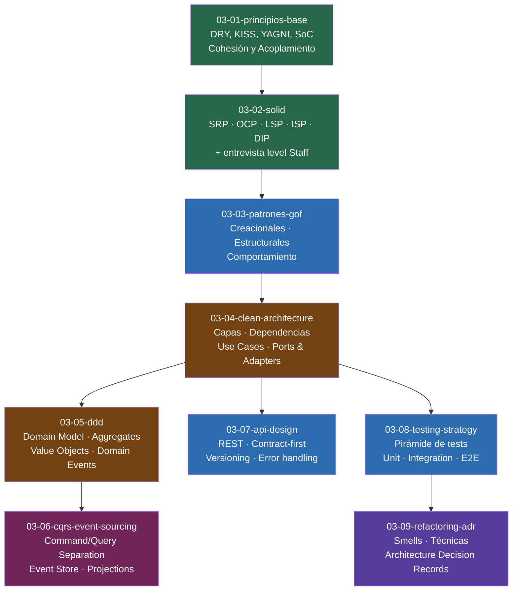

# 03-00 — Software Design: Overview del Módulo

> **Módulo 3 de 7.** Este módulo marca el punto de inflexión del curriculum.
> Los módulos 1 y 2 te enseñaron a resolver problemas algorítmicos con código correcto.
> Este módulo te enseña algo diferente y más difícil: a organizar código que otras personas
> puedan mantener, extender, y entender — sin preguntarte nada.
>
> **Prerequisito:** Módulo 1 completo. El Módulo 2 puede estar en progreso.
>
> **Tiempo estimado del módulo completo:** 8-10 semanas.

---

## Sección 1 — La distinción que define el módulo

Existe una confusión sistémica en el mercado laboral de ingeniería: los términos "coding", "software design" y "system design" se usan de forma intercambiable como si describieran lo mismo. No lo hacen. Operan en niveles de abstracción completamente diferentes, y un candidato Staff debe dominar los tres con claridad. Confundirlos en una entrevista señala falta de madurez técnica antes de responder cualquier pregunta.

### Nivel 1 — Coding (Low-level implementation)

**Pregunta que responde:** ¿Cómo resuelvo este problema algorítmico con código correcto y eficiente?

**Ejemplos de preguntas:**
- "Dado un array de enteros, devuelve los índices de dos números que sumen el target."
- "Implementa un algoritmo para detectar un ciclo en un grafo dirigido."

**Lo que se evalúa:** Claridad algorítmica, complejidad de tiempo/espacio, manejo de casos borde, capacidad de pensar en voz alta. El código puede estar en un archivo de 100 líneas sin clases, sin patrones, sin arquitectura. Solo el algoritmo.

### Nivel 2 — Software Design (Low Level Design / LLD)

**Pregunta que responde:** ¿Cómo diseño la estructura interna de un sistema — sus clases, interfaces, responsabilidades, y relaciones — de forma que sea mantenible, extensible y testeable?

**Ejemplos de preguntas:**
- "Diseña el sistema de clases para una biblioteca de parking con múltiples tipos de vehículo."
- "¿Cómo estructurarías un módulo de notificaciones que soporte Email, SMS y Push?"
- "Tenemos un Controller de 500 líneas. ¿Cómo lo refactorizas?"

**Lo que se evalúa:** Conocimiento de principios SOLID, patrones de diseño (GoF), capacidad de definir responsabilidades claras, uso apropiado de interfaces y abstracciones, decisiones de acoplamiento y cohesión. **Este módulo cubre exactamente este nivel.**

### Nivel 3 — System Design (High Level Design / HLD)

**Pregunta que responde:** ¿Cómo diseño la arquitectura de un sistema distribuido — sus servicios, bases de datos, comunicación, escalabilidad y confiabilidad?

**Ejemplos de preguntas:**
- "Diseña el sistema de Uber."
- "¿Cómo construirías un sistema de notificaciones que maneje 10 millones de mensajes por día?"
- "Diseña una API pública con rate limiting, autenticación y observabilidad."

**Lo que se evalúa:** Bases de datos (SQL vs NoSQL), caching, message queues, load balancing, consistencia vs disponibilidad, estimaciones de capacidad. **Esto es el Módulo 4.**

### ⚠️ El error más costoso en entrevistas

Un candidato que confunde LLD con HLD en una entrevista pierde la oportunidad antes de empezar. Si el entrevistador dice "diseña una biblioteca de estacionamiento" y tú empiezas a hablar de bases de datos distribuidas y CDNs, estás respondiendo a una pregunta diferente. La señal que das: no tienes claridad sobre los niveles de abstracción — una bandera roja para un rol Staff.

La pregunta "¿es esto LLD o HLD?" es la primera pregunta que debes responder internamente antes de cualquier ejercicio de diseño.

---

## Sección 2 — Por qué un Senior necesita estudiar esto

Esta es la pregunta correcta. Llevas 10 años escribiendo C# profesionalmente. Has construido sistemas reales. ¿Por qué necesitas estudiar SOLID y patrones de diseño de forma estructurada?

Porque hay una diferencia crítica entre **aplicar principios tácticamente** y **dominarlos estratégicamente**.

### Lo que un Senior hace tácticamente

Con 10 años de experiencia, probablemente ya haces muchas cosas correctas de forma instintiva:
- Separas la lógica de negocio del acceso a datos en algún nivel
- Usas interfaces para dependencias que necesitas mockear en tests
- Refactorizas métodos largos cuando se vuelven inmanejables
- Reconoces que un Controller de 800 líneas tiene problemas

Eso es experiencia acumulada. Es valiosa. Pero tiene un problema: **no es articulable**.

### Lo que un Staff hace estratégicamente

Un Staff puede hacer exactamente lo mismo que el Senior, pero además puede:

1. **Nombrar exactamente qué principio se está violando y por qué** — no solo "esto está mal", sino "esto viola SRP porque el Controller tiene tres razones de cambio distintas: validación de entrada, lógica de descuentos, y persistencia. Si el equipo de finanzas cambia las reglas de descuento, modificas el mismo archivo que si el equipo de infraestructura cambia cómo persistes. Eso es acoplamiento incidental."

2. **Proponer soluciones con trade-offs explícitos** — "Podemos separar esto en tres clases. El costo es más archivos y un poco más de indirection. El beneficio es que cada clase tiene exactamente una razón para cambiar. Para este sistema con 3 developers que tocan este código, el beneficio supera el costo. En un prototipo de fin de semana, no haría esto."

3. **Defender decisiones bajo presión** — En una entrevista Staff, el entrevistador va a preguntar "¿por qué elegiste este patrón?" y "¿cuándo NO lo usarías?". Si no tienes el vocabulario y el modelo mental, no puedes responder con precisión.

4. **Hacer code review con criterio técnico fundado** — La diferencia entre "esto no me gusta" y "esto viola OCP porque cada vez que agreguemos un nuevo tipo de documento tenemos que modificar este método, en lugar de agregar una nueva implementación".

### La consecuencia práctica

El código que escribes hoy sin dominar este módulo puede funcionar perfectamente. Pero en 2 años, cuando los requerimientos cambien (y siempre cambian), ese código va a requerir cirugía mayor donde debería requerir solo una extensión. El costo no es visible en el día 1 — se acumula hasta que un día la velocidad del equipo cae en picada y nadie sabe exactamente por qué.

Software Design es el módulo que transforma intuición acumulada en criterio articulado y defendible.

---

## Sección 3 — Mapa del módulo con dependencias

**Dependencias críticas:**

- `03-01` y `03-02` son el vocabulario base de todo lo demás. No puedes entender Clean Architecture sin dominar SOLID. No puedes aplicar DDD sin entender separación de responsabilidades.
- `03-03` (GoF) puede estudiarse en paralelo con `03-02`, pero ayuda tener SOLID claro primero porque muchos patrones son aplicaciones directas de OCP, DIP o SRP.
- `03-04` (Clean Architecture) es el punto de síntesis del módulo — ahí es donde todos los principios y patrones anteriores se combinan en una arquitectura coherente.
- `03-05` y `03-06` requieren `03-04`. DDD y CQRS son extensiones naturales de Clean Architecture, no sistemas aislados.
- `03-07`, `03-08`, y `03-09` pueden estudiarse en cualquier orden después de `03-04`.

---

## Sección 4 — Duración y cómo usar este módulo

**Duración estimada:** 8-10 semanas, a razón de 1-1.5 horas diarias de estudio activo.

**Por qué más tiempo que el Módulo 2 (algoritmos):**
Los algoritmos son evaluables de forma binaria — o la solución es correcta o no lo es. El software design no funciona así. Entender SRP en una tarde es fácil. Tener el criterio para identificar una violación de SRP en un codebase de 50,000 líneas y proponer la refactorización correcta es un skill que se construye con práctica repetida sobre código real.

**🎯 Recurso primario para este módulo:**
Pluralsight tiene dos paths directamente relevantes:
- **"SOLID Principles for C# Developers"** (Steve Smith / ardalis) — consumir al llegar a `03-02`
- **"C# Design Patterns"** (multiple authors) — consumir al llegar a `03-03`

Estos paths no reemplazan los archivos del curriculum — los complementan. El curriculum te da el modelo mental y el criterio. Pluralsight te da más ejemplos y variaciones. El orden correcto: leer el archivo del curriculum → abrir Pluralsight para el curso correspondiente → volver al archivo para los ejercicios prácticos.

**Cómo combinar con el trabajo diario:**
Este módulo tiene una ventaja enorme sobre los anteriores: puedes aplicar cada concepto directamente al código que escribes hoy.

Protocolo sugerido:
1. Lee un archivo del módulo (ej: `03-02-solid.md`, sección SRP)
2. Esa misma semana, busca activamente una violación de ese principio en tu codebase actual
3. Propón la refactorización (no necesitas implementarla — diseñarla en papel cuenta)
4. Usa Claude para validar tu análisis: escribe tu diagnóstico con tus propias palabras, pídele feedback de nivel Staff

Esta aplicación activa al código real es lo que separa el conocimiento declarativo ("sé qué es SRP") del conocimiento operacional ("puedo identificar y corregir una violación de SRP bajo presión").

---

## Sección 5 — Checklist de salida del módulo

Estos son los criterios concretos para considerar el Módulo 3 completo. No son decorativos — son la barra mínima para pasar al Módulo 4 con fundamentos sólidos.

**Principios y SOLID:**
- 🏁 Puedo identificar una violación de SRP en un PR review y explicar exactamente qué responsabilidad está mezclada y qué actor la causaría
- 🏁 Dado un switch de tipos en producción, puedo refactorizarlo usando OCP sin necesitar buscar cómo hacerlo
- 🏁 Puedo explicar la diferencia entre LSP y OCP con un ejemplo de código concreto (no con definiciones)
- 🏁 Puedo articular cuándo violar un principio SOLID es la decisión correcta — con justificación técnica, no como excusa

**Patrones GoF:**
- 🏁 Dado un problema de diseño, puedo identificar al menos dos patrones aplicables, comparar sus trade-offs, y elegir uno con justificación
- 🏁 Puedo implementar Strategy, Observer, Factory Method, y Decorator en C# sin buscar la sintaxis
- 🏁 Puedo explicar la diferencia entre Abstract Factory y Factory Method (una pregunta clásica de entrevista)

**Clean Architecture y DDD:**
- 🏁 Puedo diseñar la estructura de capas de un sistema .NET con Clean Architecture, incluyendo la dirección correcta de todas las dependencias
- 🏁 Puedo diseñar un modelo de dominio básico con DDD: identificar Aggregates, Value Objects y al menos un Domain Event
- 🏁 Puedo explicar cuándo Clean Architecture es overengineering y qué arquitectura alternativa usaría en ese caso

**CQRS y API Design:**
- 🏁 Puedo implementar un endpoint con MediatR siguiendo CQRS: Command, Handler, Validator separados
- 🏁 Puedo explicar cuándo CQRS agrega valor y cuándo agrega complejidad innecesaria
- 🏁 Dado un diseño de API, puedo identificar al menos 3 problemas de contract design y proponer correcciones

**Testing y Refactoring:**
- 🏁 Puedo escribir una suite de tests unitarios para un Handler de MediatR que incluya casos de éxito, error de negocio, y error de infraestructura
- 🏁 Dado un "God Class" de 400 líneas, puedo proponer un plan de refactorización incremental sin romper funcionalidad existente

**Entrevista:**
- 🏁 Puedo responder "diseña el sistema de clases para una app de e-commerce básica" en 30 minutos con diagramas de clases e interfaces bien definidas
- 🏁 Puedo responder a "¿cuándo NO usarías X patrón?" para cualquier patrón del módulo

---

> **🔗 Siguiente archivo:** [03-01-principios-base.md](./03-01-principios-base.md)
> El vocabulario base que hace que todo lo demás tenga sentido.
> Sin estos fundamentos, SOLID es un acrónimo y los patrones son recetas sin criterio.
