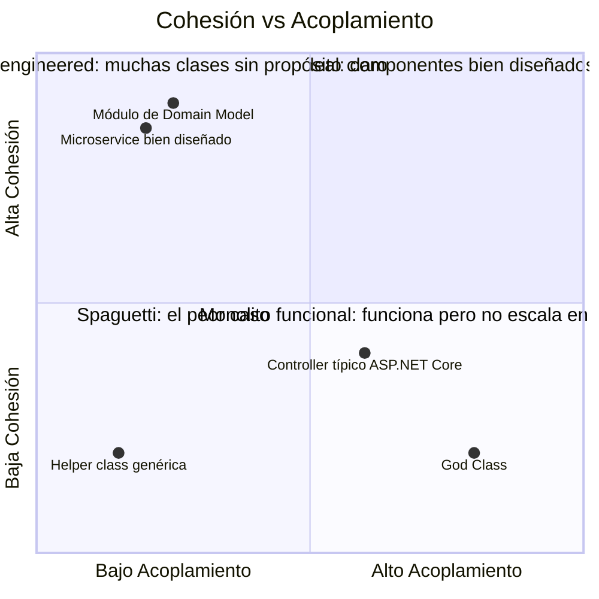
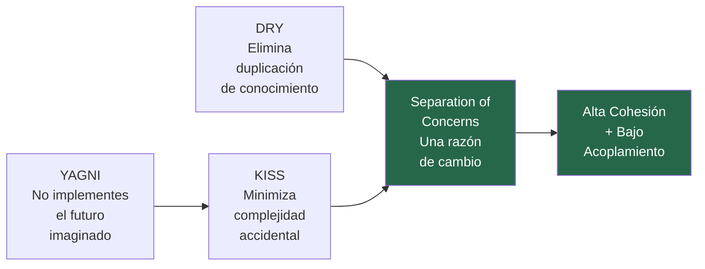

# 03-01 — Principios Base de Software Design

> **Prerequisito:** [03-00-overview.md](./03-00-overview.md)
>
> **Propósito:** Los principios de esta sección son el vocabulario fundamental de toda conversación
> técnica sobre diseño de software. SOLID, Clean Architecture, DDD — todos son aplicaciones
> específicas de estos principios. Si no los entiendes en profundidad, los patrones y arquitecturas
> que vienen después se convierten en recetas que aplicas sin criterio.
>
> **Cuándo volver aquí:** Cada vez que estudies un patrón del módulo y no entiendas por qué existe.
> La respuesta casi siempre está en uno de estos principios.

---

## Principio 1 — DRY (Don't Repeat Yourself)

### La definición real — no la de "no copies y pegues"

La definición superficial de DRY que aprende la mayoría de los developers es: "no dupliques código". Esa definición no solo es incompleta — es peligrosa, porque lleva a unificar cosas que no deberían unificarse.

La definición correcta, de Andy Hunt y Dave Thomas en *The Pragmatic Programmer*:

> "Every piece of knowledge must have a single, unambiguous, authoritative representation within a system."

La palabra clave es **conocimiento**, no **código**. DRY habla sobre la duplicación de conocimiento — de reglas de negocio, de lógica, de verdad — no sobre la duplicación textual de líneas.

### La distinción crítica que la mayoría no aplica

Dos fragmentos de código pueden ser textualmente idénticos y aún así **no** ser una violación de DRY si representan conocimientos diferentes. Unificarlos sería crear acoplamiento donde no debe existir.

```csharp
// Dos validaciones que parecen duplicadas pero NO son violación de DRY
// porque representan reglas de negocio distintas con razones de cambio distintas

// Regla de negocio: edad mínima para crear una cuenta de usuario (regulación COPPA)
private static bool IsValidUserAge(int age) => age >= 18;

// Regla de negocio: edad mínima para acceder a contenido clasificado +18
private static bool IsEligibleForMatureContent(int age) => age >= 18;

// ❌ MAL: Unificarlas porque "son la misma lógica"
private static bool IsValidAge(int age) => age >= 18; // ¿Para qué? ¿Para quién?

// El problema: si México cambia la mayoría de edad digital a 16 para contratos
// pero mantiene 18 para contenido adulto, necesitas cambiar IsValidUserAge
// sin tocar IsEligibleForMatureContent. Con la "unificación" — imposible.
// Ahora tienes un parámetro de contexto que contamina la función:
private static bool IsValidAge(int age, AgeValidationContext context) // ← complejidad innecesaria
    => context == AgeValidationContext.Account ? age >= 16 : age >= 18;
```

La función unificada es más compleja, más difícil de entender, y acopla dos reglas de negocio que deberían cambiar de forma independiente. Eso no es DRY — es acoplamiento disfrazado de reutilización.

### La regla operacional de DRY

Antes de unificar dos fragmentos similares, hazte esta pregunta:

**¿Si esta regla cambia en un dominio, debería cambiar en el otro?**

- Si la respuesta es "sí, siempre cambiarán juntos" → unificar es correcto.
- Si la respuesta es "no sé" o "probablemente no" → no unifiques. La duplicación tiene un costo menor que el acoplamiento accidental.

### Violación DRY que sí debes corregir

```csharp
// ❌ Esto SÍ es violación de DRY — misma regla de negocio, representada en dos lugares
public class OrderService
{
    public bool CanApplyVipDiscount(Customer customer)
    {
        return customer.TotalPurchases >= 10_000m && customer.MembershipYears >= 2;
    }
}

public class ReportingService
{
    public IEnumerable<Customer> GetVipCustomers(IEnumerable<Customer> customers)
    {
        // ❌ La misma regla duplicada — si cambia el criterio de VIP, hay que cambiar en dos lugares
        return customers.Where(c => c.TotalPurchases >= 10_000m && c.MembershipYears >= 2);
    }
}

// ✅ Una sola representación autoritativa de la regla VIP
public class Customer
{
    // La regla de negocio vive en el dominio que le corresponde
    public bool IsVip => TotalPurchases >= 10_000m && MembershipYears >= 2;
}

// Ambos servicios usan customer.IsVip — si el criterio cambia, cambia en un solo lugar
```

### ⚠️ Cuándo violar DRY intencionalmente

- **Entre bounded contexts en DDD:** Cada contexto tiene su propia representación del mundo. El "Customer" en el contexto de Ventas y el "Customer" en el contexto de Soporte pueden tener propiedades idénticas hoy pero divergir mañana. No compartas ese "Customer".
- **Cuando la abstracción costaría más que la duplicación:** Si necesitas 3 parámetros y una interfaz para unificar dos fragmentos de 5 líneas, la duplicación es más limpia.
- **Tests:** Duplicar setup en tests es frecuentemente preferible a abstracciones de test que hacen los tests difíciles de entender aisladamente.

---

## Principio 2 — KISS (Keep It Simple, Stupid)

### Lo que realmente significa

KISS no dice "escribe código simple". Dice algo más preciso: **no agregues complejidad antes de que la necesidad sea real y demostrada**. La complejidad tiene un costo: tiempo de debugging, tiempo de onboarding, tiempo de lectura. Ese costo debe ser justificado por un beneficio concreto.

El problema es que los developers con más experiencia violan KISS más frecuentemente que los juniors. Con más experiencia vienen más ideas de "podría ser necesario generalizar esto", "quizás debería ser configurable", "¿y si mañana necesitamos soportar múltiples implementaciones?". KISS dice: hasta que eso sea real, no.

### Violación de KISS en ASP.NET Core real

```csharp
// ❌ Violación de KISS — generalizando para casos que no existen
// Sistema que tiene exactamente un tipo de reporte: PDF de facturas

public interface IReportGenerator<TData, TOutput, TFormat>
    where TFormat : IReportFormat
    where TData : IReportData
{
    Task<TOutput> GenerateAsync(
        TData data,
        TFormat format,
        ReportOptions options,
        CancellationToken ct = default);
}

public interface IReportFormat { string MimeType { get; } }
public interface IReportData { }
// ... 3 interfaces más para "flexibilidad futura"

// ✅ KISS — resuelve el problema que existe hoy
public class InvoicePdfGenerator
{
    public async Task<byte[]> GenerateAsync(Invoice invoice, CancellationToken ct = default)
    {
        // Genera el PDF de la factura. Eso es todo.
    }
}
// Cuando aparezca el segundo tipo de reporte, refactorizas.
// Hasta ese punto, la abstracción genérica es complejidad sin retorno.
```

### La pregunta KISS

Antes de agregar abstracción, parámetros, o flexibilidad:

**¿Existe hoy un segundo caso de uso concreto que requiera esta generalización?**

- Si no existe → no generalices.
- Si existe → generaliza exactamente para los dos casos que existen, no para los tres que imaginas.

### ⚠️ KISS vs buenos principios de diseño

Hay una tensión real entre KISS y principios como OCP ("abierto para extensión"). La resolución:

- OCP dice: diseña las **interfaces** de forma que puedan extenderse sin modificación
- KISS dice: no implementes las extensiones antes de que alguien las necesite

Diseñar `INotificationSender` como interfaz es KISS + OCP correcto.
Implementar `EmailSender`, `SmsSender`, `PushSender` y `SlackSender` cuando solo tienes email es YAGNI (siguiente sección).

---

## Principio 3 — YAGNI (You Aren't Gonna Need It)

### La trampa de la experiencia

YAGNI es el principio que más violan los developers experimentados. La razón es paradójica: con más experiencia, mejor puedes anticipar casos de uso futuros. Ese anticipo se convierte en una trampa: implementas infraestructura para escenarios que "probablemente van a aparecer".

El problema no es la anticipación — es la implementación. Anticipar es inteligente. Implementar para lo que no existe todavía tiene un costo concreto que se paga hoy:
- El código que escribes para ese futuro debe mantenerse, testearse y debuggearse hoy
- Si el futuro llega pero es diferente a lo que anticipaste, tu implementación es una deuda, no un activo
- Estadísticamente, el futuro imaginado rara vez llega exactamente como lo imaginaste

### YAGNI en código .NET — violación clásica

```csharp
// Sistema de notificaciones. Hoy solo se necesita Email.
// El PM mencionó "quizás SMS en el futuro" en una reunión hace 3 meses.

// ❌ Violación de YAGNI — infraestructura para casos que no existen
public interface INotificationProvider
{
    string ProviderType { get; }
    bool SupportsDeliveryReceipt { get; }
    bool SupportsScheduling { get; }
    Task<NotificationResult> SendAsync(NotificationPayload payload);
    Task<DeliveryStatus> CheckDeliveryAsync(string messageId); // SMS/Push necesitan esto, no Email
    Task<bool> CancelScheduledAsync(string jobId); // Nunca fue pedido
}

public class NotificationService
{
    private readonly IEnumerable<INotificationProvider> _providers;
    private readonly IProviderSelector _selector; // Clase que no tiene casos de uso reales hoy
    private readonly IProviderFallbackPolicy _fallback; // 3 dependencias para mandar un email

    // ...
}

// ✅ YAGNI — lo que existe hoy, con una interfaz diseñada para extenderse si hace falta
public interface IEmailSender
{
    Task SendAsync(string to, string subject, string body, CancellationToken ct = default);
}

public class SmtpEmailSender : IEmailSender
{
    // Implementación directa. Sin abstracción de "provider" que no tiene segundo caso.
}
```

### La distinción YAGNI vs preparación legítima

YAGNI no dice que no diseñes con el futuro en mente. Dice que no lo **implementes** antes de tiempo.

| ✅ Preparación legítima | ❌ Violación de YAGNI |
|---|---|
| Definir `IEmailSender` como interfaz (permite extender sin modificar) | Implementar `SmsSender` antes de que SMS sea un requisito real |
| Diseñar la clase con cohesión clara (fácil de refactorizar después) | Agregar un parámetro `providerType` para futura selección de proveedor |
| Escribir tests que documenten el comportamiento actual | Escribir tests para comportamiento que "probablemente será necesario" |

**💡 Insight Staff:** YAGNI y OCP trabajan juntos correctamente así:
- OCP: diseña la **forma** (interfaz) para que pueda extenderse
- YAGNI: no implementes las extensiones hasta que existan

---

## Principio 4 — Separation of Concerns (SoC)

### Por qué es el principio raíz de todo

SoC no es un principio más — es el principio del que todos los demás derivan:

- **SRP** (de SOLID) = SoC aplicado a clases
- **Clean Architecture** = SoC aplicado a capas
- **Microservices** = SoC aplicado a servicios
- **CQRS** = SoC aplicado a operaciones de lectura vs escritura
- **Hexagonal Architecture** = SoC aplicado a la separación entre dominio e infraestructura

Entender SoC en profundidad es entender por qué todos esos patrones y arquitecturas existen.

### Definición operacional

Un módulo (clase, función, servicio, capa) debe tener **una sola razón para cambiar**. Si un módulo necesita cambiar cuando dos cosas diferentes cambian en el sistema, contiene más de un concern.

La "razón de cambio" no es tecnológica — es organizacional. Un concern es un área de responsabilidad que pertenece a un actor o grupo de stakeholders específico.

### El Controller que hace demasiado — anatomía de una violación real

Este es uno de los patrones más comunes en codebases ASP.NET Core. El Controller empieza pequeño y termina siendo el lugar donde vive todo porque "es lo más fácil".

```csharp
// ❌ Controller con 4 concerns mezclados — cada sección tiene una razón de cambio diferente
[ApiController]
[Route("api/orders")]
public class OrdersController : ControllerBase
{
    private readonly AppDbContext _context;
    private readonly IEmailService _emailService;

    [HttpPost]
    public async Task<IActionResult> CreateOrder(CreateOrderRequest request)
    {
        // ── CONCERN 1: Validación de entrada ──────────────────────────────────
        // Razón de cambio: el equipo de frontend cambia el contrato de API
        if (request.Items == null || request.Items.Count == 0)
            return BadRequest("Order must have at least one item");
        if (request.Items.Any(i => i.Quantity <= 0))
            return BadRequest("Item quantity must be positive");
        if (string.IsNullOrEmpty(request.CustomerId))
            return BadRequest("CustomerId is required");

        // ── CONCERN 2: Lógica de negocio ──────────────────────────────────────
        // Razón de cambio: el equipo de finanzas cambia las reglas de descuento
        decimal subtotal = request.Items.Sum(i => i.UnitPrice * i.Quantity);
        decimal discount = 0;
        if (subtotal > 10_000m) discount = subtotal * 0.10m;
        if (request.IsLoyaltyMember) discount += subtotal * 0.05m;
        decimal total = subtotal - discount;

        // ── CONCERN 3: Persistencia ────────────────────────────────────────────
        // Razón de cambio: el equipo de infraestructura migra a otra base de datos
        var order = new Order
        {
            CustomerId = request.CustomerId,
            Items = request.Items.Select(i => new OrderItem { ... }).ToList(),
            Total = total,
            CreatedAt = DateTime.UtcNow
        };
        _context.Orders.Add(order);
        await _context.SaveChangesAsync();

        // ── CONCERN 4: Notificación ────────────────────────────────────────────
        // Razón de cambio: el equipo de comunicaciones cambia la plantilla del email
        await _emailService.SendOrderConfirmationAsync(
            request.CustomerEmail,
            order.Id,
            total);

        return Ok(new { OrderId = order.Id, Total = total });
    }
}
// Este Controller cambia si cambia: validación, descuentos, persistencia, o notificación.
// 4 razones de cambio = 4 concerns mezclados = violación de SoC.
```

### La versión correcta con SoC aplicado

```csharp
// ✅ Cada concern en su lugar — el Controller solo orquesta
[ApiController]
[Route("api/orders")]
public class OrdersController : ControllerBase
{
    private readonly IMediator _mediator;

    public OrdersController(IMediator mediator) => _mediator = mediator;

    [HttpPost]
    public async Task<IActionResult> CreateOrder(CreateOrderRequest request)
    {
        // El Controller solo hace una cosa: traducir HTTP → Command → HTTP response
        var command = new CreateOrderCommand(request);
        var result = await _mediator.Send(command);
        return result.IsSuccess ? Ok(result.Value) : BadRequest(result.Error);
    }
}

// Concern 1: Validación — cambia cuando el contrato de API cambia
public class CreateOrderCommandValidator : AbstractValidator<CreateOrderCommand>
{
    public CreateOrderCommandValidator()
    {
        RuleFor(x => x.Items).NotEmpty().WithMessage("Order must have at least one item");
        RuleForEach(x => x.Items).ChildRules(item =>
            item.RuleFor(i => i.Quantity).GreaterThan(0));
    }
}

// Concern 2: Lógica de negocio — cambia cuando las reglas de descuento cambian
public class OrderPricingService
{
    public decimal CalculateTotal(IEnumerable<OrderItemDto> items, bool isLoyaltyMember)
    {
        decimal subtotal = items.Sum(i => i.UnitPrice * i.Quantity);
        decimal discount = subtotal > 10_000m ? subtotal * 0.10m : 0;
        if (isLoyaltyMember) discount += subtotal * 0.05m;
        return subtotal - discount;
    }
}

// Concern 3: Persistencia — cambia cuando cambia cómo almacenamos órdenes
public class SqlOrderRepository : IOrderRepository
{
    public async Task<OrderId> SaveAsync(Order order, CancellationToken ct)
    {
        // Lógica de EF Core o cualquier ORM aquí
    }
}

// Concern 4: Handler — orquesta los concerns sin mezclarlos
public class CreateOrderHandler : IRequestHandler<CreateOrderCommand, Result<OrderCreatedDto>>
{
    public async Task<Result<OrderCreatedDto>> Handle(CreateOrderCommand command, CancellationToken ct)
    {
        var total = _pricingService.CalculateTotal(command.Items, command.IsLoyaltyMember);
        var order = Order.Create(command.CustomerId, command.Items, total);
        var orderId = await _repository.SaveAsync(order, ct);
        await _eventBus.PublishAsync(new OrderCreatedEvent(orderId, command.CustomerEmail, total));
        return Result.Ok(new OrderCreatedDto(orderId, total));
    }
}
```

¿Cuánto cambió el Controller? Cero. Si mañana el equipo de finanzas modifica las reglas de descuento, solo toca `OrderPricingService`. Si infraestructura migra la base de datos, solo toca `SqlOrderRepository`. Cada concern tiene su dominio y su razón de cambio aislada.

---

## Principio 5 — Cohesión y Acoplamiento

### El modelo mental correcto

Estos dos conceptos siempre van juntos. Son los indicadores de calidad más importantes del diseño de software a nivel de módulo.

- **Alta cohesión:** todo lo que está dentro de un módulo pertenece ahí — trabajan juntos para una sola purpose
- **Bajo acoplamiento:** los módulos dependen lo menos posible entre sí — un cambio en A no obliga a cambiar B

El objetivo siempre es: **Alta Cohesión + Bajo Acoplamiento**.

El problema es que son fuerzas en tensión. Agregar funcionalidad a un módulo puede aumentar su cohesión interna (todo lo relacionado está junto) pero también puede aumentar su acoplamiento con otros módulos (necesita más dependencias).

### Los cuatro cuadrantes



**Cuadrante ideal (alta cohesión + bajo acoplamiento):**
Un `Order` aggregate en DDD — todo lo relacionado con el comportamiento de una orden está ahí, y el aggregate solo depende de Value Objects y tipos del dominio, no de servicios externos.

**Cuadrante problemático (alta cohesión + alto acoplamiento):**
Un microservicio bien diseñado internamente pero que hace llamadas síncronas a 8 servicios externos. Alta cohesión interna, pero el acoplamiento con el resto del sistema hace que un fallo en cualquiera de los 8 servicios cause su fallo.

**Cuadrante catastrófico (baja cohesión + alto acoplamiento):**
La "God Class" — una clase que hace de todo (validación, negocio, persistencia, logging) y tiene 20 dependencias inyectadas. Es el Controller de 800 líneas que todos hemos visto.

### Cómo medir cohesión en código real

**Test de remoción:** Si remueves un método de una clase, ¿el resto de la clase todavía tiene sentido sin él?
- Si sí → buena cohesión (el método era el outlier)
- Si no → el método pertenece ahí

**Test de responsabilidad:** Describe en una oración qué hace la clase usando el conector "y":
- "Esta clase valida pedidos **y** los persiste **y** manda emails" → tres responsabilidades = baja cohesión
- "Esta clase calcula el precio de un pedido aplicando las reglas de descuento vigentes" → alta cohesión

### Cómo medir acoplamiento en código real

**Test de cambio:** Si cambias la implementación interna de un módulo (sin cambiar su interfaz), ¿cuántas otras clases necesitas modificar?
- 0 clases → bajo acoplamiento (ideal)
- 1-2 clases → acoplamiento manejable
- 5+ clases → acoplamiento alto, señal de riesgo

**Conteo de dependencias:** ¿Cuántas inyecciones tiene el constructor?
- 1-3 → bajo acoplamiento
- 4-5 → manejable, revisar si todas son necesarias
- 6+ → señal de que la clase tiene demasiadas responsabilidades

### DI como mecanismo de bajo acoplamiento en .NET

La Dependency Injection en ASP.NET Core no es solo un patrón de conveniencia — es el mecanismo arquitectónico que hace posible el bajo acoplamiento en el stack .NET.

```csharp
// ❌ Alto acoplamiento — dependencia concreta hardcodeada
public class OrderService
{
    private readonly SqlOrderRepository _repository; // Acoplado a SQL específicamente
    private readonly SmtpEmailService _emailService; // Acoplado a SMTP específicamente

    public OrderService()
    {
        _repository = new SqlOrderRepository("connection-string-hardcoded");
        _emailService = new SmtpEmailService("smtp.company.com", 587);
    }
}
// Si cambias de SQL a Cosmos DB → modificas OrderService
// Si cambias de SMTP a SendGrid → modificas OrderService
// Si quieres testear OrderService sin enviar emails reales → imposible sin mocks

// ✅ Bajo acoplamiento — dependencias de abstracciones vía DI
public class OrderService
{
    private readonly IOrderRepository _repository;  // Abstracción
    private readonly IEmailService _emailService;   // Abstracción

    public OrderService(IOrderRepository repository, IEmailService emailService)
    {
        _repository = repository;
        _emailService = emailService;
    }
}

// Program.cs — el único lugar donde existen los detalles concretos
builder.Services.AddScoped<IOrderRepository, SqlOrderRepository>();
builder.Services.AddScoped<IEmailService, SendGridEmailService>();

// En tests — sin tocar OrderService
services.AddScoped<IOrderRepository, InMemoryOrderRepository>();
services.AddScoped<IEmailService, FakeEmailService>();
```

`OrderService` no sabe que existe `SqlOrderRepository`. No sabe que existe `SendGridEmailService`. Solo conoce las abstracciones. Cambiar cualquier implementación concreta no requiere tocar `OrderService`. Eso es bajo acoplamiento en práctica.

### ⚠️ El anti-patrón de interfaz-por-clase

Un error frecuente al aprender sobre bajo acoplamiento: crear una interfaz para cada clase concreta del sistema, incluso cuando solo existe y existirá una implementación.

```csharp
// ❌ Interface-per-class llevado al absurdo
public interface IOrderPricingService { decimal CalculateTotal(...); }
public class OrderPricingService : IOrderPricingService { ... }
// ¿Para qué existe IOrderPricingService si nunca habrá otra implementación?

// ✅ Interfaz cuando existe una razón concreta
// Razón 1: Necesitas mockear en tests unitarios
// Razón 2: Existen o existirán múltiples implementaciones (regional pricing, A/B test)
// Razón 3: La dependencia cruza un boundary de capa (dominio → infraestructura)
```

La interfaz tiene costo: más archivos, más indirection, más cognitive load. Ese costo debe tener un beneficio proporcional.

---

## Síntesis — Cómo se conectan los cinco principios

Estos principios no son cinco reglas independientes. Son cinco perspectivas sobre el mismo problema central: **cómo organizar código para que los cambios sean locales, predecibles, y baratos**.



- **DRY** elimina la duplicación de conocimiento → reduce el costo de los cambios
- **KISS** y **YAGNI** eliminan la complejidad que no existe todavía → mantienen el codebase navegable
- **SoC** asegura que cada módulo tenga una sola razón de cambio → los cambios son locales
- **Cohesión y Acoplamiento** son las métricas con las que mides si aplicaste correctamente todo lo anterior

Cuando en SOLID leas "SRP", es SoC aplicado a clases.
Cuando en Clean Architecture leas "Dependency Rule", es SoC aplicado a capas.
Cuando en DDD leas "Bounded Context", es SoC aplicado a dominios de negocio.

El principio es siempre el mismo. La aplicación cambia según el nivel de abstracción.

---

## 🧪 Ejercicio práctico obligatorio

Toma un archivo de tu codebase actual — idealmente un Controller o un Service que ya existe en producción.

1. Haz el "test de responsabilidad": describe qué hace la clase con el conector "y". ¿Cuántas responsabilidades identificas?
2. Haz el "test de acoplamiento": cuenta las dependencias en el constructor. ¿Cuántas son interfaces? ¿Cuántas son clases concretas?
3. Identifica si existe alguna violación de DRY — no duplicación de código, sino duplicación de conocimiento (misma regla de negocio en dos lugares)
4. Escribe el análisis con tus propias palabras y tráelo a una sesión de revisión con Claude

No busques el archivo "perfecto" para analizar. El valor está en el análisis, no en encontrar código impecable.

---

> 🏁 **Checkpoint para avanzar:**
> Puedes explicar por qué dos piezas de código textualmente idénticas pueden no ser una violación de DRY, con un ejemplo de tu propio codebase o inventado.
> Puedes identificar cuántas "concerns" tiene un módulo dado, y nombrar la razón de cambio de cada una.

> **🔗 Siguiente archivo:** [03-02-solid.md](./03-02-solid.md)
> Los cinco principios SOLID son aplicaciones directas de lo que acabas de estudiar.
> Sin este contexto, SOLID es un acrónimo. Con este contexto, es un sistema de criterio.

> **🎯 Recurso Pluralsight:** Antes de pasar a `03-02`, si quieres consolidar estos principios con más ejemplos:
> Busca "C# Design Principles" o "Clean Code C#" en Pluralsight.
> No es obligatorio antes de avanzar — pero si algo de esta sección no quedó claro, ahí encontrarás variaciones adicionales.
