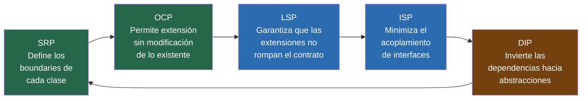

# 03-02 — SOLID: Los Cinco Principios en Producción

> **Prerequisito:** [03-01-principios-base.md](./03-01-principios-base.md)
>
> **Por qué este archivo es el más importante del módulo para entrevistas:**
> SOLID aparece en toda entrevista Staff de software design. No como "define los cinco principios" —
> cualquiera puede memorizar las definiciones. Lo que el entrevistador evalúa es si puedes:
> (a) identificar una violación en código real, (b) proponer la corrección con el patrón correcto,
> (c) articular cuándo el principio aplica y cuándo deliberadamente no aplica.
>
> **🎯 Recurso Pluralsight:** Abrir el path **"SOLID Principles for C# Developers"** (Steve Smith / ardalis)
> después de leer este archivo por primera vez. Los videos consolidan con ejemplos adicionales.
> El orden correcto: leer este archivo → Pluralsight → ejercicios prácticos al final.

---

## SOLID como sistema — antes de los principios individuales

SOLID no son cinco reglas independientes. Son cinco perspectivas sobre un mismo objetivo: **escribir código que pueda cambiar en respuesta a requerimientos cambiantes sin cascada de efectos secundarios**.

Los principios se refuerzan mutuamente. Una clase que viola SRP probablemente también viola OCP — si tiene múltiples responsabilidades, necesitar agregar comportamiento nuevo frecuentemente requiere modificarla. Una clase que viola ISP probablemente viola DIP — sus implementadores dependen de métodos que no usan, lo que crea acoplamiento espurio.

Cuando veas una violación de uno, busca las violaciones de los otros. Casi siempre están.

El acrónimo SOLID fue popularizado por Robert C. Martin (Uncle Bob). Los principios en sí son anteriores: SRP y OCP vienen de los años 80 y 90, antes de que existiera el acrónimo.

---

## SRP — Single Responsibility Principle

### La definición real (no "una sola cosa")

La definición que memoriza la mayoría: "una clase debe hacer una sola cosa".

Esa definición es demasiado vaga para ser útil. ¿Cuántas "cosas" hace `List<T>`? Muchas. ¿Viola SRP? No.

La definición correcta de Robert C. Martin:

> **"Una clase debe tener una sola razón para cambiar."**

Y la razón de cambio está definida por **quién** puede pedirla — el actor o stakeholder que tiene autoridad sobre esa responsabilidad. SRP no es sobre la cantidad de métodos o líneas. Es sobre la cantidad de actores distintos que pueden requerir cambios en esa clase.

### Violación en ASP.NET Core — el Controller que lo hace todo

```csharp
// ❌ Un Controller con tres actores distintos que pueden pedir cambios
[ApiController]
[Route("api/invoices")]
public class InvoicesController : ControllerBase
{
    [HttpPost]
    public async Task<IActionResult> GenerateInvoice(GenerateInvoiceRequest request)
    {
        // Actor 1: Equipo de producto / frontend — cambia cuando cambia el contrato de API
        if (request.ClientId == Guid.Empty)
            return BadRequest("ClientId is required");
        if (request.LineItems.Count == 0)
            return BadRequest("Invoice must have line items");

        // Actor 2: Equipo de finanzas / negocio — cambia cuando cambian las reglas tributarias
        decimal subtotal = request.LineItems.Sum(li => li.Quantity * li.UnitPrice);
        decimal vatRate = request.CountryCode == "MX" ? 0.16m : 0.21m;
        decimal vat = subtotal * vatRate;
        decimal total = subtotal + vat;

        // Actor 3: Equipo de infraestructura — cambia cuando migran la base de datos o el ORM
        var invoice = new Invoice { ClientId = request.ClientId, Total = total, ... };
        await _context.Invoices.AddAsync(invoice);
        await _context.SaveChangesAsync();

        // Actor 4: Equipo de comunicaciones — cambia cuando cambia la estrategia de notificaciones
        await _emailService.SendInvoiceAsync(request.ClientEmail, invoice.Number, total);

        return Ok(new { InvoiceId = invoice.Id, Total = total });
    }
}
// Este Controller cambia cuando cualquiera de los 4 actores cambia sus requisitos.
// Un cambio en las reglas de IVA de México requiere tocar el mismo archivo
// que un cambio en el subject del email de confirmación. Eso es acoplamiento incidental.
```

### Aplicación correcta — Command + Handler + Validator

```csharp
// ✅ Cada clase tiene exactamente un actor que puede pedir su cambio

// Actor: Equipo de producto — valida el contrato de entrada
public class GenerateInvoiceCommandValidator : AbstractValidator<GenerateInvoiceCommand>
{
    public GenerateInvoiceCommandValidator()
    {
        RuleFor(x => x.ClientId).NotEmpty();
        RuleForEach(x => x.LineItems).ChildRules(item => {
            item.RuleFor(i => i.Quantity).GreaterThan(0);
            item.RuleFor(i => i.UnitPrice).GreaterThan(0);
        });
    }
}

// Actor: Equipo de finanzas — calcula impuestos según reglas de negocio
public class TaxCalculationService
{
    private readonly ITaxRuleRepository _taxRules;

    public async Task<TaxBreakdown> CalculateAsync(decimal subtotal, string countryCode)
    {
        var rate = await _taxRules.GetRateAsync(countryCode);
        return new TaxBreakdown(subtotal, rate, subtotal * rate);
    }
}

// Actor: Equipo de infraestructura — persiste la factura
public class SqlInvoiceRepository : IInvoiceRepository
{
    public async Task<InvoiceId> SaveAsync(Invoice invoice, CancellationToken ct) { ... }
}

// El Controller ahora tiene UNA razón de cambio: el protocolo HTTP
[ApiController]
[Route("api/invoices")]
public class InvoicesController : ControllerBase
{
    private readonly IMediator _mediator;

    [HttpPost]
    public async Task<IActionResult> GenerateInvoice(GenerateInvoiceRequest request)
    {
        var result = await _mediator.Send(new GenerateInvoiceCommand(request));
        return result.IsSuccess ? Ok(result.Value) : result.ToProblemDetails();
    }
}
```

### ⚠️ Cuándo violar SRP intencionalmente

**Scripts de migración de datos (one-shot jobs):**
Un script que corre una vez para migrar datos entre esquemas. Crear 5 clases separadas para una lógica que se ejecuta exactamente una vez es más costoso que el beneficio.

**Prototipos y MVPs bajo presión de tiempo:**
Cuando la velocidad de aprendizaje supera el costo del mantenimiento. El truco es reconocerlo y marcarlo con un TODO/FIXME con la deuda técnica explícita.

**Clases de infraestructura simples:**
`EmailService` que tiene `SendAsync`, `SendWithAttachmentAsync` y `SendTemplatedAsync` — todas son responsabilidad de "enviar emails". No hay necesidad de dividir si el actor es el mismo.

### 🎤 Pregunta de entrevista y respuesta nivel Staff

**Pregunta:** "¿Cuándo es aceptable que una clase tenga más de una responsabilidad?"

**Respuesta nivel promedio:**
"Nunca. SRP siempre aplica, una clase siempre debe tener una sola responsabilidad."

**Respuesta nivel Staff:**
"SRP aplica cuando el costo de la separación es menor que el costo de mantener el acoplamiento. La pregunta correcta no es '¿tiene una o más responsabilidades?' sino '¿cuántos actores distintos pueden pedir cambios en esta clase, y con qué frecuencia?'

En un script de migración que corre una vez, el costo de crear cinco clases supera el beneficio. En un servicio de negocio que 4 equipos diferentes modifican mensualmente, el costo del acoplamiento es enorme y la separación se paga sola en semanas.

SRP también tiene granularidad: una clase puede tener alta cohesión internamente (toda la lógica relacionada con calcular impuestos) aunque tenga múltiples métodos. La violación de SRP es tener lógica de cálculo de impuestos *y* lógica de envío de emails *y* lógica de persistencia en la misma clase — diferentes actores, no diferente cantidad de métodos."

---

## OCP — Open/Closed Principle

### La definición real

"Las entidades de software deben estar **abiertas para extensión** pero **cerradas para modificación**."

En práctica: agregar comportamiento nuevo al sistema no debe requerir modificar código existente — solo agregar código nuevo. El código existente que funciona, que tiene tests, que está en producción, no debería tocarse para agregar una feature nueva.

La forma de lograrlo: depender de abstracciones, no de implementaciones concretas.

### Violación clásica — el switch de tipos que crece eternamente

```csharp
// ❌ Cada nuevo tipo de documento requiere modificar este método
public class DocumentExporter
{
    public async Task<byte[]> ExportAsync(Document document, string format)
    {
        return format switch
        {
            "PDF"  => await ExportToPdfAsync(document),
            "DOCX" => await ExportToDocxAsync(document),
            "XLSX" => await ExportToXlsxAsync(document),
            // Cuando llegue "HTML" → modificas este switch
            // Cuando llegue "CSV"  → modificas este switch
            // Cada nueva extensión = riesgo de romper las existentes
            _ => throw new NotSupportedException($"Format {format} not supported")
        };
    }

    private async Task<byte[]> ExportToPdfAsync(Document doc) { ... }
    private async Task<byte[]> ExportToDocxAsync(Document doc) { ... }
    private async Task<byte[]> ExportToXlsxAsync(Document doc) { ... }
}
```

Cada vez que el negocio pide un nuevo formato, modificas `DocumentExporter`. Cada modificación es una oportunidad de romper los formatos existentes. Los tests existentes tienen que correr en cada cambio aunque la lógica de PDF no haya cambiado.

### Aplicación correcta con polimorfismo

```csharp
// ✅ Agregar un nuevo formato = nueva clase, cero modificaciones al código existente

public interface IDocumentExporter
{
    string SupportedFormat { get; }
    Task<byte[]> ExportAsync(Document document, CancellationToken ct = default);
}

public class PdfDocumentExporter : IDocumentExporter
{
    public string SupportedFormat => "PDF";
    public async Task<byte[]> ExportAsync(Document document, CancellationToken ct) { ... }
}

public class DocxDocumentExporter : IDocumentExporter
{
    public string SupportedFormat => "DOCX";
    public async Task<byte[]> ExportAsync(Document document, CancellationToken ct) { ... }
}

// El orquestador nunca cambia — solo crece el conjunto de exportadores
public class DocumentExportService
{
    private readonly IEnumerable<IDocumentExporter> _exporters;

    public DocumentExportService(IEnumerable<IDocumentExporter> exporters)
        => _exporters = exporters;

    public async Task<byte[]> ExportAsync(Document document, string format, CancellationToken ct)
    {
        var exporter = _exporters.FirstOrDefault(e => e.SupportedFormat == format)
            ?? throw new NotSupportedException($"Format '{format}' is not supported");
        return await exporter.ExportAsync(document, ct);
    }
}

// Program.cs — registrar todos los exportadores
builder.Services.AddScoped<IDocumentExporter, PdfDocumentExporter>();
builder.Services.AddScoped<IDocumentExporter, DocxDocumentExporter>();
// Agregar HtmlDocumentExporter = nueva clase + una línea aquí. Cero cambios al resto.
```

### 💡 OCP en System Design (la conexión con el Módulo 4)

OCP a nivel de clase se llama "polimorfismo". A nivel de sistema distribuido se llama "extensibility" y "backward compatibility".

- Agregar un endpoint nuevo a una API sin breaking changes = OCP
- Diseñar un evento de dominio con campos opcionales para extensión futura = OCP
- Un plugin system donde nuevos providers se registran sin modificar el core = OCP

Cuando en system design escuches "diseña esto de forma que sea extensible", estás oyendo OCP a nivel de arquitectura.

### ⚠️ Cuándo OCP puede ser overengineering

Si tienes exactamente dos casos y la probabilidad de un tercero es baja, la abstracción puede costar más de lo que aporta. El if/switch tiene su lugar en código que no va a crecer.

La señal de que OCP aplica: cuando el mismo "punto de extensión" ha crecido más de una vez en el historial del proyecto. Si ya agregaste 3 casos, vas a agregar más.

### 🎤 Pregunta de entrevista y respuesta nivel Staff

**Pregunta:** "¿OCP significa que nunca deberías modificar una clase existente?"

**Respuesta nivel Staff:**
"No. OCP aplica en los puntos de extensión del sistema — los lugares donde los cambios son predecibles y frecuentes. Un switch que ya creció tres veces es una señal de que ese es un punto de extensión.

Pero aplicar OCP a todo el sistema es overengineering. Si creo una interfaz y un sistema de plugins para cada posible extensión, el codebase se vuelve tan abstracto que nadie puede entenderlo.

La decisión correcta: identificar los ejes de variación del sistema — las dimensiones a lo largo de las cuales el negocio probablemente va a pedir cambios — y aplicar OCP ahí. Para el resto, el refactoring cuando llegue el momento es más barato que la abstracción prematura."

---

## LSP — Liskov Substitution Principle

### La definición real

"Si S es subtipo de T, entonces los objetos de tipo T pueden ser reemplazados por objetos de tipo S sin alterar ninguna de las propiedades deseables del programa."

Barbara Liskov, 1987. En lenguaje operacional para 2026:

**Una subclase no debe sorprender al código que usa la clase base.** El código que opera sobre `T` no debería necesitar saber si tiene una instancia de `T` o de `S`. Si necesita saberlo — hay una violación de LSP.

### El problema Rectangle/Square — el ejemplo clásico explicado correctamente

```csharp
// La violación más citada de LSP en la literatura

public class Rectangle
{
    public virtual int Width { get; set; }
    public virtual int Height { get; set; }
    public int Area() => Width * Height;
}

public class Square : Rectangle
{
    // ❌ Square "rompe" el contrato implícito de Rectangle:
    // en un rectángulo, cambiar Width no afecta Height
    public override int Width
    {
        set { base.Width = value; base.Height = value; } // Efecto secundario inesperado
    }
    public override int Height
    {
        set { base.Width = value; base.Height = value; } // Efecto secundario inesperado
    }
}

// El código que usa Rectangle se rompe cuando recibe un Square:
void PrintArea(Rectangle r)
{
    r.Width = 5;
    r.Height = 3;
    // ❌ Con Square: Width = 5 → Height = 5 también. r.Width = 5 → 5 también.
    // El Assert falla — Area() devuelve 9 en lugar de 15
    Debug.Assert(r.Area() == 15, $"Expected 15 but got {r.Area()}");
}

Rectangle rect = new Rectangle();
PrintArea(rect); // ✅ Funciona — Area = 15

Rectangle square = new Square();
PrintArea(square); // ❌ Falla — Area = 9. LSP violado.
```

El problema no es que Square sea una mala clase. El problema es que Square **no puede ser un subtipo de Rectangle** porque un cuadrado matemáticamente no tiene las mismas garantías de comportamiento que un rectángulo. La herencia de implementación aquí no refleja la relación de subtipado correcta.

### Violación LSP real en ASP.NET Core — el repositorio con sorpresa

```csharp
// Un caso más realista que aparece en codebases reales

public interface IOrderRepository
{
    Task<Order?> GetByIdAsync(OrderId id, CancellationToken ct = default);
    Task<IReadOnlyList<Order>> GetByCustomerAsync(CustomerId customerId, CancellationToken ct = default);
    Task SaveAsync(Order order, CancellationToken ct = default);
}

// Implementación SQL — contrato cumplido
public class SqlOrderRepository : IOrderRepository
{
    public async Task<Order?> GetByIdAsync(OrderId id, CancellationToken ct) { ... }
    public async Task<IReadOnlyList<Order>> GetByCustomerAsync(CustomerId id, CancellationToken ct) { ... }
    public async Task SaveAsync(Order order, CancellationToken ct) { ... }
}

// ❌ Implementación "read-only" que viola LSP — sorprende al código que usa la interfaz
public class ReadOnlyOrderRepository : IOrderRepository
{
    public async Task<Order?> GetByIdAsync(OrderId id, CancellationToken ct) { ... }
    public async Task<IReadOnlyList<Order>> GetByCustomerAsync(CustomerId id, CancellationToken ct) { ... }

    // Viola LSP: el código que llama a SaveAsync espera que funcione
    // (ese es el contrato implícito de IOrderRepository)
    public Task SaveAsync(Order order, CancellationToken ct)
        => throw new NotSupportedException("This repository is read-only");
}

// El código que usa IOrderRepository no puede saber si su instancia es read-only:
public class OrderService
{
    private readonly IOrderRepository _repository;

    public async Task TransferOrderAsync(OrderId id, CustomerId newOwner)
    {
        var order = await _repository.GetByIdAsync(id);
        order!.TransferTo(newOwner);
        await _repository.SaveAsync(order); // ❌ Puede explotar en runtime si _repository es ReadOnly
    }
}
```

### La solución correcta a LSP — segregar la interfaz

```csharp
// ✅ Segregar el contrato refleja la realidad de los subtipos
public interface IOrderReader
{
    Task<Order?> GetByIdAsync(OrderId id, CancellationToken ct = default);
    Task<IReadOnlyList<Order>> GetByCustomerAsync(CustomerId id, CancellationToken ct = default);
}

public interface IOrderWriter
{
    Task SaveAsync(Order order, CancellationToken ct = default);
}

public interface IOrderRepository : IOrderReader, IOrderWriter { }

// El repositorio read-only ahora implementa solo IOrderReader — sin sorpresas
public class ReadOnlyOrderRepository : IOrderReader
{
    public async Task<Order?> GetByIdAsync(OrderId id, CancellationToken ct) { ... }
    public async Task<IReadOnlyList<Order>> GetByCustomerAsync(CustomerId id, CancellationToken ct) { ... }
    // SaveAsync no existe — no hay sorpresa posible
}

// Los servicios de solo lectura declaran lo que realmente necesitan
public class OrderReportingService
{
    private readonly IOrderReader _reader; // No puede llamar SaveAsync — por diseño
}
```

Nota: esto también resuelve ISP (el siguiente principio). LSP y ISP se refuerzan mutuamente — resolver uno frecuentemente resuelve el otro.

### Señales de alerta de violación LSP en código real

- Métodos en una subclase que lanzan `NotImplementedException` o `NotSupportedException`
- Código con `if (repository is ReadOnlyOrderRepository) { ... }` — necesitar hacer cast o type-check es una bandera roja
- Postcondiciones reducidas en la subclase: la clase base garantiza que el resultado nunca es null, la subclase puede devolver null
- Precondiciones más estrictas: la clase base acepta cualquier `int`, la subclase solo acepta positivos

### 🎤 Pregunta de entrevista y respuesta nivel Staff

**Pregunta:** "¿Cuál es la diferencia entre LSP y OCP?"

**Respuesta nivel promedio:**
"LSP es sobre herencia, OCP es sobre extensión."

**Respuesta nivel Staff:**
"Son ortogonales pero complementarios. OCP dice cómo deberías diseñar tus abstracciones para que el sistema sea extensible sin modificación. LSP dice qué restricciones deben cumplir esas extensiones para que el sistema siga siendo predecible.

OCP: 'diseña para que puedas agregar comportamiento nuevo sin modificar el existente'.
LSP: 'cuando agregas comportamiento nuevo (una nueva subclase), asegúrate de que cumpla el contrato implícito de la clase base para que el código existente no se rompa'.

Una violación de LSP invalida el beneficio de OCP — de nada sirve diseñar para extensión si las extensiones pueden romper el código existente."

---

## ISP — Interface Segregation Principle

### La definición real

"Los clientes no deben ser forzados a depender de interfaces que no usan."

Una interfaz "gorda" — con muchos métodos — obliga a todos sus implementadores a definir métodos que quizás no necesitan. El resultado: `NotImplementedException` en métodos que "no aplican", o implementaciones vacías que silenciosamente no hacen nada.

### Violación clásica — la interfaz repositorio genérica todo-en-uno

```csharp
// ❌ Interface "dios" — ningún repositorio concreto necesita todos estos métodos

public interface IRepository<T> where T : class
{
    // Operaciones básicas CRUD
    Task<T?> GetByIdAsync(int id);
    Task<IEnumerable<T>> GetAllAsync();
    Task<T> AddAsync(T entity);
    Task UpdateAsync(T entity);
    Task DeleteAsync(int id);

    // Operaciones de búsqueda
    Task<IEnumerable<T>> FindAsync(Expression<Func<T, bool>> predicate);
    Task<int> CountAsync(Expression<Func<T, bool>>? predicate = null);

    // Operaciones de bulk (solo para algunas entidades)
    Task BulkInsertAsync(IEnumerable<T> entities);
    Task BulkUpdateAsync(IEnumerable<T> entities);
    Task BulkDeleteAsync(IEnumerable<int> ids);

    // Paginación
    Task<PagedResult<T>> GetPagedAsync(int page, int pageSize, Expression<Func<T, bool>>? filter = null);

    // Soft delete (solo para entidades con IsDeleted)
    Task SoftDeleteAsync(int id);
    Task RestoreAsync(int id);
}

// ReadOnlyAuditLogRepository — solo necesita leer logs. No escribe, no borra, no hace bulk.
// Pero está obligada a implementar AddAsync, UpdateAsync, DeleteAsync, BulkInsertAsync...
public class ReadOnlyAuditLogRepository : IRepository<AuditLog>
{
    public Task<AuditLog?> GetByIdAsync(int id) { ... }        // ✅ Necesario
    public Task<IEnumerable<AuditLog>> GetAllAsync() { ... }   // ✅ Necesario
    public Task<AuditLog> AddAsync(AuditLog entity)
        => throw new NotSupportedException("Audit logs are read-only"); // ❌ Forzado
    public Task UpdateAsync(AuditLog entity)
        => throw new NotSupportedException("Audit logs are read-only"); // ❌ Forzado
    public Task BulkInsertAsync(IEnumerable<AuditLog> entities)
        => throw new NotSupportedException("Audit logs are read-only"); // ❌ Forzado
    // ... 6 métodos más con NotSupportedException
}
```

El `ReadOnlyAuditLogRepository` tiene 11 métodos. Solo 2 de ellos son reales. Los otros 9 son ruido que miente sobre las capacidades del repositorio.

### Aplicación correcta — interfaces por capacidad

```csharp
// ✅ Interfaces segregadas por capacidad funcional

public interface IReadRepository<T>
{
    Task<T?> GetByIdAsync(int id, CancellationToken ct = default);
    Task<IEnumerable<T>> GetAllAsync(CancellationToken ct = default);
}

public interface IWriteRepository<T>
{
    Task<T> AddAsync(T entity, CancellationToken ct = default);
    Task UpdateAsync(T entity, CancellationToken ct = default);
    Task DeleteAsync(int id, CancellationToken ct = default);
}

public interface ISearchableRepository<T> : IReadRepository<T>
{
    Task<IEnumerable<T>> FindAsync(
        Expression<Func<T, bool>> predicate,
        CancellationToken ct = default);
    Task<int> CountAsync(
        Expression<Func<T, bool>>? predicate = null,
        CancellationToken ct = default);
}

public interface IBulkRepository<T>
{
    Task BulkInsertAsync(IEnumerable<T> entities, CancellationToken ct = default);
    Task BulkUpdateAsync(IEnumerable<T> entities, CancellationToken ct = default);
}

// Repositorio completo implementa lo que necesita
public class OrderRepository : ISearchableRepository<Order>, IWriteRepository<Order>
{
    // Solo implementa los métodos que realmente necesita — sin NotSupportedException
}

// Repositorio read-only implementa solo lectura — sin mentiras sobre capacidades
public class ReadOnlyAuditLogRepository : IReadRepository<AuditLog>
{
    public Task<AuditLog?> GetByIdAsync(int id, CancellationToken ct) { ... }
    public Task<IEnumerable<AuditLog>> GetAllAsync(CancellationToken ct) { ... }
    // No hay AddAsync, no hay DeleteAsync. No son necesarios, no existen.
}

// Los servicios declaran exactamente lo que necesitan
public class AuditReportService
{
    private readonly IReadRepository<AuditLog> _logs; // No puede escribir — por diseño
}

public class OrderImportService
{
    private readonly IBulkRepository<Order> _orders; // Solo bulk — lo que necesita
}
```

### 💡 ISP y CQRS — la conexión directa

ISP es una de las razones por las que CQRS (que estudiarás en `03-06-cqrs-event-sourcing.md`) separa los repositorios de lectura de los de escritura. En CQRS:

- Los **Query Handlers** reciben `IReadRepository<T>` o equivalente — solo lectura
- Los **Command Handlers** reciben `IWriteRepository<T>` — solo escritura
- Nunca un handler tiene acceso a operaciones que no necesita

ISP a nivel de interfaz. CQRS a nivel de arquitectura. El mismo principio aplicado en capas de abstracción diferentes.

### ⚠️ ISP no significa una interfaz por método

El extremo opuesto también es un problema:

```csharp
// ❌ Llevado al absurdo — una interfaz por método
public interface ICanGetOrderById { Task<Order?> GetByIdAsync(int id); }
public interface ICanGetAllOrders { Task<IEnumerable<Order>> GetAllAsync(); }
public interface ICanAddOrder { Task<Order> AddAsync(Order o); }
// ... granularidad que no aporta valor

// ✅ El criterio correcto es: ¿qué conjunto de operaciones siempre se usan juntas?
// Si GetById y GetAll siempre van juntos en los clientes → IReadRepository<T>
// Si Add y Update siempre van juntos → IWriteRepository<T>
// Segregar más allá de eso agrega complejidad sin beneficio
```

### 🎤 Pregunta de entrevista y respuesta nivel Staff

**Pregunta:** "¿Cómo decides qué granularidad tiene una interfaz?"

**Respuesta nivel Staff:**
"El criterio es el cliente, no el servidor. Me pregunto: ¿qué subconjunto de estos métodos usa cada tipo de cliente? Si tengo 5 tipos de clientes y todos usan el mismo conjunto de métodos, no segregues. Si tengo 3 tipos de clientes y cada uno usa un subconjunto diferente, la interfaz gorda está obligando a dependencias innecesarias.

El indicador de que ISP es necesario es la aparición de `NotImplementedException` o métodos vacíos en implementaciones — eso significa que el implementador está siendo forzado a declarar capacidades que no tiene. En C# moderno también puedes usar default interface implementations para mitigar esto, pero eso raramente es la solución correcta — generalmente es una señal de que la interfaz tiene demasiadas responsabilidades."

---

## DIP — Dependency Inversion Principle

### La definición real (completa, no la versión simplificada)

Dos reglas que conforman DIP:

1. **Los módulos de alto nivel no deben depender de módulos de bajo nivel. Ambos deben depender de abstracciones.**
2. **Las abstracciones no deben depender de detalles. Los detalles deben depender de abstracciones.**

"Alto nivel" significa lógica de negocio. "Bajo nivel" significa infraestructura: SQL, SMTP, Redis, HTTP.

Sin DIP, la lógica de negocio depende de la infraestructura. Eso significa que la lógica de negocio no puede existir sin SQL, sin SMTP, sin Redis. No puede ser testeada sin ellos. No puede ser reutilizada en un contexto diferente.

Con DIP, tanto la lógica de negocio como la infraestructura dependen de una abstracción (interfaz). La lógica de negocio define la abstracción que necesita. La infraestructura la implementa. La dependencia "se invierte" — la infraestructura depende del dominio, no al revés.

### La "inversión" que confunde a mucha gente

```
Sin DIP (dependencia natural, hacia abajo):
   OrderService (alto nivel)
        ↓ depende de
   SqlOrderRepository (bajo nivel, concreta)

Con DIP (dependencia invertida):
   OrderService (alto nivel)
        ↓ depende de
   IOrderRepository (abstracción — definida por el negocio)
        ↑ implementada por
   SqlOrderRepository (bajo nivel, concreta)
```

La "inversión" es que `SqlOrderRepository` ahora depende de `IOrderRepository` (que vive en el dominio/negocio), en lugar de que el dominio dependa de `SqlOrderRepository`. El módulo de bajo nivel implementa una abstracción que el módulo de alto nivel define.

### El flujo completo en ASP.NET Core

```csharp
// ── Sin DIP ────────────────────────────────────────────────────────────
// OrderService conoce la existencia de SqlOrderRepository
public class OrderService
{
    private readonly SqlOrderRepository _repository; // ❌ Acoplado a SQL

    public OrderService()
    {
        // ❌ Acoplado a la cadena de conexión, al ORM, a la configuración
        _repository = new SqlOrderRepository("Server=...;Database=...;");
    }

    public async Task<Order?> GetOrderAsync(OrderId id)
        => await _repository.GetByIdAsync(id); // Si migras a CosmosDB → modificas aquí
}

// ── Con DIP ────────────────────────────────────────────────────────────
// El dominio define la abstracción que necesita — no sabe qué la implementa

// En el proyecto de Dominio o Application:
public interface IOrderRepository // ← Abstracción definida por el dominio
{
    Task<Order?> GetByIdAsync(OrderId id, CancellationToken ct = default);
    Task SaveAsync(Order order, CancellationToken ct = default);
}

// En el proyecto de Infrastructure:
public class SqlOrderRepository : IOrderRepository // ← Infraestructura implementa la abstracción
{
    private readonly AppDbContext _context;
    public SqlOrderRepository(AppDbContext context) => _context = context;

    public async Task<Order?> GetByIdAsync(OrderId id, CancellationToken ct)
        => await _context.Orders.FirstOrDefaultAsync(o => o.Id == id, ct);

    public async Task SaveAsync(Order order, CancellationToken ct)
    {
        _context.Orders.Update(order);
        await _context.SaveChangesAsync(ct);
    }
}

// OrderService no sabe que existe SQL, EF Core, ni ningún detalle de infraestructura
public class OrderService
{
    private readonly IOrderRepository _repository; // ← Depende de la abstracción
    private readonly IEmailService _emailService;

    public OrderService(IOrderRepository repository, IEmailService emailService)
    {
        _repository = repository;
        _emailService = emailService;
    }

    public async Task<Order?> GetOrderAsync(OrderId id, CancellationToken ct)
        => await _repository.GetByIdAsync(id, ct);
    // Migrar a CosmosDB = nueva implementación de IOrderRepository. Cero cambios aquí.
}

// Program.cs — el "composition root" — el único lugar donde los detalles concretos existen
builder.Services.AddScoped<IOrderRepository, SqlOrderRepository>();
builder.Services.AddScoped<IEmailService, SendGridEmailService>();
builder.Services.AddScoped<OrderService>();
```

### DIP en los tests — el beneficio más tangible

```csharp
// ✅ En tests, puedes reemplazar cualquier implementación sin tocar el código de producción
public class OrderServiceTests
{
    [Fact]
    public async Task GetOrder_WhenOrderExists_ReturnsOrder()
    {
        // Arrange — sin base de datos, sin SMTP, sin nada de infraestructura
        var orderId = OrderId.New();
        var expectedOrder = new Order(orderId, CustomerId.New());

        var mockRepository = new Mock<IOrderRepository>();
        mockRepository
            .Setup(r => r.GetByIdAsync(orderId, It.IsAny<CancellationToken>()))
            .ReturnsAsync(expectedOrder);

        var mockEmail = new Mock<IEmailService>();
        var service = new OrderService(mockRepository.Object, mockEmail.Object);

        // Act
        var result = await service.GetOrderAsync(orderId, CancellationToken.None);

        // Assert
        result.Should().BeEquivalentTo(expectedOrder);
    }
}
// Este test no necesita una base de datos. No necesita un servidor SMTP.
// Corre en milisegundos. Eso es DIP en acción.
```

### ⚠️ Cuándo DIP crea complejidad innecesaria

DIP tiene un costo: más archivos, más interfaces, más indirection. Ese costo solo se justifica cuando hay un beneficio concreto.

**Una interfaz vale la pena cuando:**
- Necesitas mockear la dependencia en tests unitarios
- Existen o existirán múltiples implementaciones (por configuración, por entorno, por A/B test)
- La dependencia cruza un boundary arquitectónico (dominio → infraestructura)
- Podrías necesitar cambiar la implementación sin modificar el código que la usa

**Una interfaz es YAGNI cuando:**
- Solo existe y existirá una implementación
- La clase concreta nunca va a cruzar un boundary de capa
- No necesitas mockearla (es una clase value o de utilidad)

```csharp
// ❌ Interface innecesaria — EmailValidator solo tiene una implementación posible
public interface IEmailValidator { bool IsValid(string email); }
public class EmailValidator : IEmailValidator { ... }

// ✅ Directo — no hay razón para la interfaz
public class EmailValidator
{
    public bool IsValid(string email)
        => !string.IsNullOrWhiteSpace(email) && email.Contains('@');
}
```

### 🎤 Pregunta de entrevista y respuesta nivel Staff

**Pregunta:** "¿Cuál es la diferencia entre Dependency Injection y Dependency Inversion Principle?"

**Respuesta nivel promedio:**
"Son lo mismo — DI es DIP."

**Respuesta nivel Staff:**
"Son distintos aunque relacionados. DIP es el principio de diseño: los módulos de alto nivel no deben depender de módulos de bajo nivel; ambos deben depender de abstracciones. Es una afirmación sobre cómo organizar las dependencias.

Dependency Injection es el mecanismo de implementación: pasar dependencias a las clases en lugar de que las clases las creen. DI puede implementar DIP, pero no necesariamente. Si inyecto una clase concreta en lugar de una interfaz, estoy usando DI pero violando DIP.

`IServiceCollection` en ASP.NET Core es el contenedor de DI. DIP es la razón por la que el contenedor inyecta `IOrderRepository` en lugar de `SqlOrderRepository`. El contenedor es el mecanismo; DIP es el principio que justifica la decisión de arquitectura de depender de la interfaz."

---

## SOLID como sistema — los cinco principios en conjunto

Los cinco principios no son independientes. Están diseñados para trabajar juntos:



- **SRP** define los límites de responsabilidad de cada clase. Sin límites claros, OCP es imposible — no puedes extender algo que no tiene forma definida.
- **OCP** dice que las clases deben poder extenderse sin modificarse. Para que eso sea posible, necesitan depender de abstracciones (DIP) que permitan polimorfismo (LSP).
- **LSP** garantiza que el polimorfismo de OCP funcione correctamente — que las extensiones no rompan el comportamiento esperado.
- **ISP** garantiza que las abstracciones de DIP sean precisas — que los clientes no dependan de más de lo que necesitan.
- **DIP** cierra el círculo — al depender de abstracciones, permite que SRP, OCP y LSP se apliquen sin acoplamiento entre módulos.

### El síntoma unificado de violar SOLID

Cuando un codebase viola SOLID consistentemente, el síntoma visible es siempre el mismo: **cambiar una cosa rompe otra cosa que no tiene relación aparente**.

- Cambias la lógica de descuentos y se rompe el sistema de emails → SRP violado
- Agregas un nuevo tipo de exportación y tienes que modificar 3 clases existentes → OCP violado
- Cambias una implementación concreta y el código que usa la interfaz base se rompe → LSP violado
- Para agregar una feature simple tienes que implementar 8 métodos que no necesitas → ISP violado
- Para testear la lógica de negocio tienes que levantar una base de datos real → DIP violado

---

## 🧪 Ejercicios prácticos obligatorios

### Ejercicio 1 — SRP: Identifica los actores
Toma un Service o Controller de tu codebase actual. Lista todos los "actores" (stakeholders o equipos) que podrían pedir un cambio en ese archivo. Si son más de uno, tienes una violación de SRP. Diseña la refactorización (en papel o en código).

### Ejercicio 2 — OCP: El switch que creció
Busca en tu codebase un switch/if-else que evalúe un tipo o categoría. ¿Ha crecido en los últimos 6 meses? Si es así, diseña la refactorización con polimorfismo e interfaces.

### Ejercicio 3 — LSP: Los NotImplementedException
Busca cualquier uso de `throw new NotImplementedException()` o `throw new NotSupportedException()` en implementaciones de interfaces. Cada uno es una violación de LSP potencial. Analiza si el problema es la herencia, la interfaz demasiado amplia, o ambos.

### Ejercicio 4 — ISP + DIP: El constructor con demasiadas dependencias
Encuentra una clase con 5 o más dependencias en el constructor. Analiza:
- ¿Alguna de las interfaces podría segregarse más?
- ¿Alguna de las dependencias es una clase concreta en lugar de una interfaz?
- ¿Cuántas de las dependencias realmente usa la clase?

### Ejercicio 5 — Diseño desde cero (nivel entrevista)
Diseña el sistema de clases para un módulo de notificaciones multi-canal (Email, SMS, Push) que:
- Sea extensible a nuevos canales sin modificar el código existente (OCP)
- Tenga cada canal con su propia clase (SRP)
- Permita que los consumidores dependan de lo mínimo que necesitan (ISP)
- Pueda ser testeado sin enviar mensajes reales (DIP)

Escribe el diseño con interfaces e implementaciones en C#. Luego tráelo a una sesión con Claude para revisión de nivel Staff.

---

> 🏁 **Checkpoint para avanzar:**
> Puedes identificar una violación de cada uno de los cinco principios en código real (no en ejemplos de libro).
> Puedes articular cuándo violar cada principio intencionalmente, con una justificación técnica concreta.
> Puedes responder "¿cuál es la diferencia entre X y Y?" para cualquier par de principios SOLID.

> **🔗 Siguiente archivo:** [03-03-patrones-gof.md](./03-03-patrones-gof.md)
> Los patrones GoF son, en su mayoría, aplicaciones concretas de los principios que acabas de estudiar.
> Strategy es OCP + DIP. Observer es SRP + OCP. Factory Method es DIP.
> Estudiarlos después de SOLID cambia completamente la forma en que los entiendes.

> **🎯 Pluralsight — abrir ahora:**
> Path "SOLID Principles for C# Developers" (Steve Smith / ardalis).
> Después de leer este archivo, los videos de Pluralsight consolidan con ejemplos adicionales.
> Consume el path completo antes de pasar a `03-03`.
