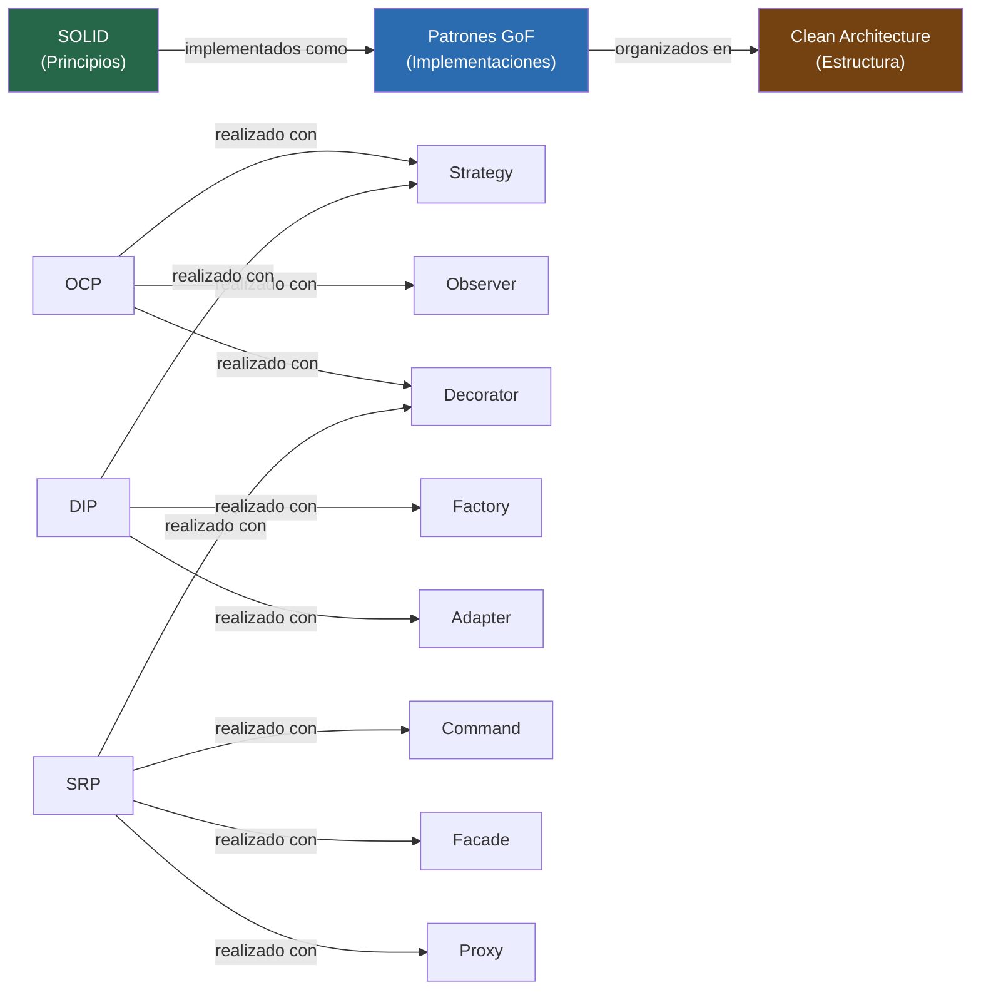

# 03-03 — Patrones GoF: Criterio Real sobre los 23 Patrones

> **Prerequisito:** [03-02-solid.md](./03-02-solid.md) — Los patrones GoF son aplicaciones concretas
> de los principios SOLID. Verás referencias explícitas a OCP, DIP y SRP en casi cada patrón.
> Si SOLID no está claro, los patrones se convierten en recetas que aplicas sin criterio.
>
> **Por qué este archivo importa en entrevistas Staff:**
> En una entrevista de Software Design (LLD), el entrevistador no pregunta "¿qué es el patrón Observer?".
> Pregunta "¿cómo diseñarías un sistema de notificaciones?" y evalúa si tu solución tiene
> el nivel correcto de abstracción, si los patrones aplicados resuelven problemas reales, y —
> especialmente — si sabes cuándo un patrón está haciendo daño en lugar de bien.
>
> **🎯 Recursos Pluralsight:** Abrir el path **"C# Design Patterns"** (Pluralsight, múltiples autores)
> después de leer la Sección 2 de este archivo. El path tiene cursos por patrón — consumir en el
> mismo orden en que están cubiertos aquí.
> **Educative:** El curso **"Grokking Design Patterns for Engineers and Managers"** es complemento
> visual. Útil después de leer este archivo para ver diagramas UML interactivos de cada patrón.

---

## Sección 1 — Mapa de relevancia: los 23 patrones en contexto Staff

No todos los patrones GoF tienen el mismo peso en el mercado de 2026. Memorizar los 23 con la misma
profundidad es una estrategia de estudio incorrecta — distribuyes energía uniformemente donde el
retorno no es uniforme. Esta tabla te dice exactamente dónde invertir.

| Patrón | Categoría | Relevancia Entrevista Staff | Dónde ya lo usas en .NET/ASP.NET Core |
|---|---|---|---|
| **Strategy** | Conductual | 🔴 Alta | `IComparer<T>`, `IAuthorizationHandler`, `HttpMessageHandler` |
| **Observer** | Conductual | 🔴 Alta | `event`/`EventHandler`, `IObservable<T>`, Domain Events en DDD |
| **Decorator** | Estructural | 🔴 Alta | Middleware pipeline, `DelegatingHandler`, `GZipStream` sobre `Stream` |
| **Command** | Conductual | 🔴 Alta | MediatR `IRequest<T>`, eventos de integración, EF Migrations |
| **Chain of Responsibility** | Conductual | 🔴 Alta | ASP.NET Core middleware, MediatR Pipeline Behaviors |
| **Factory Method** | Creacional | 🔴 Alta | `ILoggerFactory`, `DbProviderFactory`, `IHttpClientFactory` |
| **Builder** | Creacional | 🔴 Alta | `WebApplicationBuilder`, `StringBuilder`, `IQueryable<T>` con LINQ |
| **Adapter** | Estructural | 🔴 Alta | Wrappers de SDKs de terceros, `StreamReader` sobre `Stream` |
| **Facade** | Estructural | 🔴 Alta | Services de orquestación, Application Services en Clean Architecture |
| **Proxy** | Estructural | 🔴 Alta | EF Core lazy loading, `DispatchProxy`, Castle.DynamicProxy |
| **Mediator** | Conductual | 🟡 Media | MediatR (implementación directa del patrón) |
| **Abstract Factory** | Creacional | 🟡 Media | `IServiceCollection` families, factories de providers |
| **Composite** | Estructural | 🟡 Media | Expression trees en LINQ, UI trees en Blazor |
| **State** | Conductual | 🟡 Media | State machines, flujos de orden, Stateless library |
| **Template Method** | Conductual | 🟡 Media | Clases base abstractas en ASP.NET Core (`ControllerBase`) |
| **Iterator** | Conductual | 🟡 Media | `IEnumerable<T>`, `yield return`, `IAsyncEnumerable<T>` |
| **Singleton** | Creacional | 🟡 Media* | `AddSingleton` en DI — conocido, pero mal usado frecuentemente |
| **Prototype** | Creacional | 🟢 Baja | `ICloneable` (raramente útil en diseño moderno) |
| **Bridge** | Estructural | 🟢 Baja | Abstracción de plataforma (rara vez diseñado explícitamente) |
| **Flyweight** | Estructural | 🟢 Baja | String interning en .NET (raramente diseñado — ocurre solo) |
| **Memento** | Conductual | 🟢 Baja | Undo stacks (nicho, videojuegos, editores) |
| **Visitor** | Conductual | 🟢 Baja | Expression visitors en Roslyn, compiladores |
| **Interpreter** | Conductual | 🟢 Baja | DSLs caseros — raramente en aplicaciones de negocio |

*Singleton tiene relevancia media porque es el patrón más mal usado — el entrevistador casi seguro preguntará sus problemas, no solo su implementación.

### Los tres grupos de estudio

**Dominar con implementación de memoria** (los 10 críticos):
Strategy, Observer, Decorator, Command, Chain of Responsibility, Factory Method, Builder, Adapter, Facade, Proxy.

**Reconocer y poder explicar su propósito y trade-offs:**
Mediator, Abstract Factory, Composite, State, Template Method, Iterator, Singleton.

**Saber que existen y en qué contexto aparecen:**
Prototype, Bridge, Flyweight, Memento, Visitor, Interpreter.

### Por qué existen los patrones GoF

En 1994, Erich Gamma, Richard Helm, Ralph Johnson y John Vlissides (el "Gang of Four") publicaron
*Design Patterns: Elements of Reusable Object-Oriented Software*. El libro documentó 23 soluciones
recurrentes a problemas recurrentes en software orientado a objetos. No inventaron los patrones —
los catalogaron. Los patrones ya existían en codebases exitosas. El libro les dio nombre.

La idea central es que ciertos problemas de diseño ocurren una y otra vez con diferente superficie pero
igual estructura subyacente. Si tienes el vocabulario, puedes comunicar la solución en segundos:
"necesitamos un Decorator aquí" transmite más información que tres párrafos de descripción.

El peligro, que verás en la Sección 3, es aplicarlos por su nombre en lugar de por el problema que resuelven.

---

## Sección 2 — Los 10 patrones críticos con implementación completa

Cada patrón sigue la misma estructura:
1. **El problema que resuelve** — sin el patrón, qué dolor existe
2. **La solución** — el mecanismo central del patrón
3. **Implementación en C#** — completa y funcional
4. **Dónde ya lo usas** — en .NET/ASP.NET Core sin saberlo
5. **Cuándo NO usarlo** — el criterio que distingue a un Staff

---

### Patrón 1 — Strategy

#### El problema

Tienes un algoritmo que puede variar según contexto. La solución naive es un `switch` o una cadena
de `if/else` dentro de la clase que lo usa. Cada nueva variante requiere modificar esa clase.
Eso es OCP violado: estás modificando código existente para extender comportamiento.

El síntoma en producción: el método más largo del sistema tiene 15 casos en un `switch`, y cada
sprint alguien agrega uno más.

#### La solución

Definir una interfaz que representa el algoritmo. Cada variante del algoritmo es una clase que
implementa esa interfaz. La clase que usa el algoritmo (el "contexto") recibe la estrategia como
dependencia — y no sabe cuál es.

```csharp
// ❌ Sin Strategy — el switch crece con cada nuevo requerimiento
public class TaxCalculator
{
    public decimal Calculate(decimal amount, string countryCode)
    {
        return countryCode switch
        {
            "MX" => amount * 0.16m,
            "US" => amount * 0.0875m,  // promedio estatal
            "ES" => amount * 0.21m,
            "DE" => amount * 0.19m,
            // Cada nuevo país → modificar esta clase
            // El equipo de finanzas y el equipo de desarrollo están acoplados
            _ => throw new ArgumentException($"País no soportado: {countryCode}")
        };
    }
}

// ✅ Con Strategy — OCP respetado
public interface ITaxStrategy
{
    decimal Calculate(decimal amount);
    string CountryCode { get; }
}

public class MexicoTaxStrategy : ITaxStrategy
{
    public string CountryCode => "MX";

    public decimal Calculate(decimal amount)
    {
        // Las reglas de IVA de México pueden ser complejas (exenciones, tasas reducidas)
        // Esta clase puede crecer sin afectar a ninguna otra
        const decimal vatRate = 0.16m;
        return amount * vatRate;
    }
}

public class SpainTaxStrategy : ITaxStrategy
{
    public string CountryCode => "ES";

    public decimal Calculate(decimal amount)
    {
        // IVA español: 21% general, 10% reducido, 4% superreducido
        // Lógica específica de España completamente encapsulada aquí
        const decimal generalVatRate = 0.21m;
        return amount * generalVatRate;
    }
}

public class GermanyTaxStrategy : ITaxStrategy
{
    public string CountryCode => "DE";

    public decimal Calculate(decimal amount)
    {
        const decimal vatRate = 0.19m;
        return amount * vatRate;
    }
}

// El contexto — no sabe ni le importa cuál estrategia tiene
public class OrderPricingService
{
    private readonly IEnumerable<ITaxStrategy> _strategies;

    public OrderPricingService(IEnumerable<ITaxStrategy> strategies)
        => _strategies = strategies;

    public PriceBreakdown CalculatePrice(decimal subtotal, string countryCode)
    {
        var strategy = _strategies.FirstOrDefault(s => s.CountryCode == countryCode)
            ?? throw new ArgumentException($"No tax strategy for country: {countryCode}");

        var tax = strategy.Calculate(subtotal);
        return new PriceBreakdown(subtotal, tax, subtotal + tax);
    }
}

// Registro en DI — agregar un país nuevo = agregar una línea aquí + nueva clase
// Zero modificaciones en OrderPricingService o en otras estrategias
builder.Services.AddScoped<ITaxStrategy, MexicoTaxStrategy>();
builder.Services.AddScoped<ITaxStrategy, SpainTaxStrategy>();
builder.Services.AddScoped<ITaxStrategy, GermanyTaxStrategy>();
builder.Services.AddScoped<OrderPricingService>();

public record PriceBreakdown(decimal Subtotal, decimal Tax, decimal Total);
```

#### Dónde ya lo usas en .NET

- `IComparer<T>` e `IEqualityComparer<T>`: son Strategy para algoritmos de comparación. Cuando haces
  `list.Sort(myComparer)`, le estás inyectando una estrategia al algoritmo de ordenamiento.
- `IAuthorizationHandler` en ASP.NET Core: cada handler es una estrategia de autorización. El framework
  decide cuál ejecutar según el requirement — el Policy Engine es el contexto.
- `HttpMessageHandler` en `HttpClient`: controla cómo se transporta el HTTP. `MockHttpMessageHandler`
  en tests es literalmente Strategy para reemplazar el transporte real.
- `IFormatterResolver` en System.Text.Json y Newtonsoft: strategies de serialización.

#### Cuándo NO usarlo

Si solo tienes dos variantes y es improbable que cambien, el `if/else` es más legible y tiene
cero overhead cognitivo. Strategy agrega indirección: más archivos, más DI registration, más
navegación en el IDE. Esa indirección debe pagar con flexibilidad real, no imaginada.

La señal para usar Strategy: **cuando el número de variantes crece en el tiempo** y cada variante
puede ser desarrollada, testeada, y desplegada por equipos distintos (o al menos por personas distintas).

⚠️ **Error frecuente:** Crear una interfaz con un solo método cuando una `Func<T, TResult>` haría lo mismo.
Si tu estrategia es stateless y no tiene dependencias, considera si un delegate o una expresión lambda
cumple el mismo propósito con menos código.

---

### Patrón 2 — Observer

#### El problema

Un objeto cambia de estado y otros objetos necesitan reaccionar a ese cambio. Si el objeto llama
directamente a esos otros objetos, está acoplado a ellos: debe conocer quiénes son, cómo llamarlos,
y cada nuevo interesado requiere modificar el objeto original. SRP violado (el objeto tiene la
responsabilidad de gestionar sus suscriptores además de su propio estado) y OCP violado (agregar
un nuevo observador requiere modificar el código del objeto observado).

#### La solución

El objeto observado (Subject) expone un mecanismo de suscripción. Los observadores se registran
y desregistran dinámicamente. Cuando el Subject cambia, notifica a todos los suscritos sin saber
quiénes son ni qué hacen con la notificación.

```csharp
// Implementación con eventos de C# — la forma idiomática en .NET

public enum OrderStatus { Pending, Confirmed, Shipped, Delivered, Cancelled }

public class OrderStatusChangedEventArgs : EventArgs
{
    public OrderId OrderId { get; }
    public OrderStatus Previous { get; }
    public OrderStatus Current { get; }
    public DateTime OccurredAt { get; }

    public OrderStatusChangedEventArgs(
        OrderId orderId, OrderStatus previous, OrderStatus current)
    {
        OrderId = orderId;
        Previous = previous;
        Current = current;
        OccurredAt = DateTime.UtcNow;
    }
}

public class Order
{
    public OrderId Id { get; }
    public CustomerId CustomerId { get; }
    public OrderStatus Status { get; private set; } = OrderStatus.Pending;

    // El event ES el mecanismo Observer — C# lo tiene como ciudadano de primera clase
    public event EventHandler<OrderStatusChangedEventArgs>? StatusChanged;

    public void Confirm()
    {
        if (Status != OrderStatus.Pending)
            throw new InvalidOperationException(
                $"Cannot confirm order in status {Status}");

        var previous = Status;
        Status = OrderStatus.Confirmed;

        // Notificar a todos los observadores — sin saber quiénes son
        StatusChanged?.Invoke(this, new OrderStatusChangedEventArgs(
            Id, previous, Status));
    }

    public void Ship()
    {
        if (Status != OrderStatus.Confirmed)
            throw new InvalidOperationException(
                $"Cannot ship order in status {Status}");

        var previous = Status;
        Status = OrderStatus.Shipped;
        StatusChanged?.Invoke(this, new OrderStatusChangedEventArgs(
            Id, previous, Status));
    }
}

// Los observadores — no conocen nada de Order internamente, solo reaccionan al evento
public class EmailNotificationObserver : IDisposable
{
    private readonly IEmailService _emailService;
    private Order? _observedOrder;

    public EmailNotificationObserver(IEmailService emailService)
        => _emailService = emailService;

    public void Subscribe(Order order)
    {
        _observedOrder = order;
        order.StatusChanged += OnStatusChanged; // Registro
    }

    private async void OnStatusChanged(object? sender, OrderStatusChangedEventArgs e)
    {
        if (e.Current == OrderStatus.Confirmed)
            await _emailService.SendOrderConfirmationAsync(e.OrderId);
        else if (e.Current == OrderStatus.Shipped)
            await _emailService.SendShippingNotificationAsync(e.OrderId);
    }

    // ⚠️ CRÍTICO: desregistrar siempre para evitar memory leaks
    public void Dispose()
    {
        if (_observedOrder != null)
            _observedOrder.StatusChanged -= OnStatusChanged;
    }
}

public class InventoryObserver : IDisposable
{
    private readonly IInventoryService _inventory;
    private Order? _observedOrder;

    public InventoryObserver(IInventoryService inventory)
        => _inventory = inventory;

    public void Subscribe(Order order)
    {
        _observedOrder = order;
        order.StatusChanged += OnStatusChanged;
    }

    private async void OnStatusChanged(object? sender, OrderStatusChangedEventArgs e)
    {
        // El inventario solo reacciona a confirmaciones
        if (e.Current == OrderStatus.Confirmed)
            await _inventory.ReserveAsync(e.OrderId);
        else if (e.Current == OrderStatus.Cancelled)
            await _inventory.ReleaseAsync(e.OrderId);
    }

    public void Dispose()
    {
        if (_observedOrder != null)
            _observedOrder.StatusChanged -= OnStatusChanged;
    }
}
```

**Variante moderna — Domain Events con publicación diferida:**

En DDD y Clean Architecture, el Order no dispara el evento directamente a los observadores (eso
crea acoplamiento entre el dominio y la infraestructura). En cambio, registra el evento en una
colección interna. La infraestructura lo publica *después* de persistir, garantizando consistencia:

```csharp
// Domain Event — simple record inmutable
public record OrderConfirmedEvent(OrderId OrderId, CustomerId CustomerId, DateTime OccurredAt);

// El Aggregate registra eventos, no los dispara
public class Order
{
    private readonly List<object> _domainEvents = new();
    public IReadOnlyList<object> DomainEvents => _domainEvents.AsReadOnly();

    public void ClearDomainEvents() => _domainEvents.Clear();

    public void Confirm()
    {
        if (Status != OrderStatus.Pending)
            throw new InvalidOperationException($"Cannot confirm order in status {Status}");

        Status = OrderStatus.Confirmed;
        // Registrar, no disparar — la infraestructura decide cuándo publicar
        _domainEvents.Add(new OrderConfirmedEvent(Id, CustomerId, DateTime.UtcNow));
    }
}

// El handler de MediatR que procesa el Domain Event (publicado después de SaveChangesAsync)
public class OrderConfirmedEventHandler : INotificationHandler<OrderConfirmedEvent>
{
    private readonly IEmailService _emailService;
    private readonly IInventoryService _inventory;

    public OrderConfirmedEventHandler(IEmailService emailService, IInventoryService inventory)
    {
        _emailService = emailService;
        _inventory = inventory;
    }

    public async Task Handle(OrderConfirmedEvent notification, CancellationToken ct)
    {
        // Múltiples reacciones al mismo evento — sin que Order lo sepa
        await Task.WhenAll(
            _emailService.SendOrderConfirmationAsync(notification.OrderId, ct),
            _inventory.ReserveAsync(notification.OrderId, ct));
    }
}
```

#### Dónde ya lo usas en .NET

- Los `event` de C# son Observer. Cada `+=` es una suscripción, cada `-=` una cancelación.
- `IObservable<T>` / `IObserver<T>`: la interfaz formal de Observer en el BCL. Usada extensivamente
  en Reactive Extensions (Rx.NET). Un `Subject<T>` en Rx es literalmente un Subject del patrón.
- SignalR Hubs: los clientes conectados son observadores. El Hub notifica a grupos sin conocer
  la identidad de cada conexión. Observer a escala de red.
- `IChangeToken` en ASP.NET Core: `IConfiguration` usa Observer internamente para detectar cambios
  en archivos de configuración y notificar a los consumidores.

#### Cuándo NO usarlo

Cuando el orden de ejecución de los observadores importa para la corrección del sistema. Los
observadores son notificados en orden de registro, lo cual es un detalle de implementación
frágil. Si Observer A debe ejecutarse antes de Observer B por razones de negocio, ese orden
no está garantizado por el contrato del patrón — está garantizado por el orden de los `+=`.
Para orden determinista: usa Chain of Responsibility o un pipeline explícito.

⚠️ **El memory leak más frecuente en .NET:** Olvidar el `-=`. Si el Subject tiene un ciclo de vida
más largo que el Observer (ej: un servicio Singleton que referencia un objeto Scoped mediante un
evento), el Scoped object nunca será recolectado por el GC mientras el Singleton exista. Siempre:
si registras con `+=`, desregistra con `-=` en `Dispose()`. O usa el patrón de Domain Events
que evita este problema al no mantener referencias directas.

---

### Patrón 3 — Decorator

#### El problema

Necesitas agregar comportamiento a un objeto (logging, caché, autorización, retry) sin modificar
su clase original. Heredar para agregar comportamiento tiene un problema estructural: la herencia
es estática — se decide en tiempo de compilación y no puedes combinar comportamientos libremente.
Si tienes Logging, Caché, y Retry como subclases, no puedes tener una implementación con Logging+Caché
sin crear una cuarta subclase. Con N comportamientos, la explosión es exponencial.

#### La solución

Envolver el objeto en otro objeto que implementa la misma interfaz, agrega el comportamiento
antes/después de la llamada, y delega al objeto original. Los Decorators se pueden componer
libremente porque cada uno solo conoce la interfaz, no la implementación concreta que envuelve.

```csharp
public interface IOrderRepository
{
    Task<Order?> GetByIdAsync(OrderId id, CancellationToken ct = default);
    Task<IReadOnlyList<Order>> GetByCustomerAsync(CustomerId customerId, CancellationToken ct = default);
    Task SaveAsync(Order order, CancellationToken ct = default);
}

// Implementación base — solo SQL, sin preocupaciones transversales
public class SqlOrderRepository : IOrderRepository
{
    private readonly AppDbContext _context;

    public SqlOrderRepository(AppDbContext context) => _context = context;

    public async Task<Order?> GetByIdAsync(OrderId id, CancellationToken ct = default)
        => await _context.Orders.FindAsync(new object[] { id }, ct);

    public async Task<IReadOnlyList<Order>> GetByCustomerAsync(
        CustomerId customerId, CancellationToken ct = default)
        => await _context.Orders
            .Where(o => o.CustomerId == customerId)
            .ToListAsync(ct);

    public async Task SaveAsync(Order order, CancellationToken ct = default)
    {
        _context.Orders.Update(order);
        await _context.SaveChangesAsync(ct);
    }
}

// Decorator de logging — agrega observabilidad sin tocar SqlOrderRepository
public class LoggingOrderRepository : IOrderRepository
{
    private readonly IOrderRepository _inner;
    private readonly ILogger<LoggingOrderRepository> _logger;

    public LoggingOrderRepository(
        IOrderRepository inner,
        ILogger<LoggingOrderRepository> logger)
    {
        _inner = inner;
        _logger = logger;
    }

    public async Task<Order?> GetByIdAsync(OrderId id, CancellationToken ct = default)
    {
        using var scope = _logger.BeginScope("GetOrder {OrderId}", id);
        _logger.LogDebug("Fetching order");
        var order = await _inner.GetByIdAsync(id, ct);
        _logger.LogDebug("Order {Found}", order != null ? "found" : "not found");
        return order;
    }

    public async Task<IReadOnlyList<Order>> GetByCustomerAsync(
        CustomerId customerId, CancellationToken ct = default)
    {
        _logger.LogDebug("Fetching orders for customer {CustomerId}", customerId);
        var orders = await _inner.GetByCustomerAsync(customerId, ct);
        _logger.LogDebug("Found {Count} orders", orders.Count);
        return orders;
    }

    public async Task SaveAsync(Order order, CancellationToken ct = default)
    {
        _logger.LogInformation("Saving order {OrderId}", order.Id);
        await _inner.SaveAsync(order, ct);
        _logger.LogInformation("Order {OrderId} saved", order.Id);
    }
}

// Decorator de caché — se sienta encima del logging
public class CachedOrderRepository : IOrderRepository
{
    private readonly IOrderRepository _inner;
    private readonly IMemoryCache _cache;
    private static readonly TimeSpan CacheDuration = TimeSpan.FromMinutes(5);

    public CachedOrderRepository(IOrderRepository inner, IMemoryCache cache)
    {
        _inner = inner;
        _cache = cache;
    }

    public async Task<Order?> GetByIdAsync(OrderId id, CancellationToken ct = default)
    {
        var key = $"order:{id}";
        if (_cache.TryGetValue(key, out Order? cached))
            return cached;

        var order = await _inner.GetByIdAsync(id, ct);
        if (order != null)
            _cache.Set(key, order, CacheDuration);

        return order;
    }

    public async Task<IReadOnlyList<Order>> GetByCustomerAsync(
        CustomerId customerId, CancellationToken ct = default)
        // Caché de colecciones es más compleja — delegamos directamente
        => await _inner.GetByCustomerAsync(customerId, ct);

    public async Task SaveAsync(Order order, CancellationToken ct = default)
    {
        await _inner.SaveAsync(order, ct);
        // Invalidar caché al escribir — crucial para consistencia
        _cache.Remove($"order:{order.Id}");
    }
}

// Composición en DI — el orden define el stack de ejecución:
// CachedOrderRepository → LoggingOrderRepository → SqlOrderRepository
builder.Services.AddScoped<SqlOrderRepository>();
builder.Services.AddScoped<IOrderRepository>(sp =>
    new CachedOrderRepository(
        new LoggingOrderRepository(
            sp.GetRequiredService<SqlOrderRepository>(),
            sp.GetRequiredService<ILogger<LoggingOrderRepository>>()),
        sp.GetRequiredService<IMemoryCache>()));
```

#### Dónde ya lo usas en .NET

- **El middleware pipeline de ASP.NET Core es una cadena de Decorators.** Cada middleware envuelve
  al siguiente: `app.UseAuthentication()` → `app.UseAuthorization()` → tu handler. Cada middleware
  implementa la misma "interfaz" (recibe `HttpContext` + delegate al siguiente) y puede ejecutar
  antes y después de llamar al `next()`.
- `DelegatingHandler` en `HttpClient`: agrega comportamiento a las peticiones HTTP sin cambiar
  el código que usa el `HttpClient`. Retry, logging, correlación — todos son `DelegatingHandler`.
- Las clases `Stream` y sus derivados (`CryptoStream`, `GZipStream`, `BufferedStream`): son
  Decorators sobre `Stream`. `new GZipStream(new CryptoStream(fileStream, ...))` — Decorator anidado.
- Scrutor (librería NuGet popular): permite registrar Decorators en el DI container de .NET
  con syntax `services.Decorate<IOrderRepository, CachedOrderRepository>()`.

#### Cuándo NO usarlo

Cuando el número de comportamientos combinables es pequeño y fijo, y la composición siempre es
la misma. Si siempre tienes Logging + Caché y nunca nada más, el overhead de tres clases y la
composición explícita supera el beneficio. Agrégalos directamente a la implementación.

Decorator brilla cuando: (1) los comportamientos se componen de forma variable según contexto
(test vs producción, distintos entornos), o (2) el comportamiento a agregar es cross-cutting
y no debe contaminar la lógica de negocio.

---

### Patrón 4 — Command

#### El problema

Necesitas encapsular una operación como objeto para poder: parametrizarla, ponerla en cola,
loguearla, validarla en un pipeline, y potencialmente deshacerla (undo). Cuando una operación
es solo una llamada a un método, no puedes hacer ninguna de estas cosas sin modificar la
implementación original.

#### La solución

Un objeto Command encapsula todo lo necesario para ejecutar la operación: los datos de entrada,
la intención, y (en su handler) la lógica de ejecución. El que crea el Command no sabe cómo
se ejecuta — eso es responsabilidad del Handler.

```csharp
// Command — encapsula la intención y los datos
// record es la elección idiomática en C# moderno: inmutable, value semantics, auto-ToString
public record CreateOrderCommand(
    CustomerId CustomerId,
    IReadOnlyList<OrderItemDto> Items,
    string ShippingAddress) : IRequest<CreateOrderResult>;

public record CreateOrderResult(OrderId OrderId, decimal Total);

// Handler — encapsula la lógica de ejecución
// Una clase, un propósito — SRP respetado
public class CreateOrderCommandHandler
    : IRequestHandler<CreateOrderCommand, CreateOrderResult>
{
    private readonly IOrderRepository _repository;
    private readonly IInventoryService _inventory;
    private readonly ITaxStrategy _taxStrategy;
    private readonly IUnitOfWork _unitOfWork;

    public CreateOrderCommandHandler(
        IOrderRepository repository,
        IInventoryService inventory,
        ITaxStrategy taxStrategy,
        IUnitOfWork unitOfWork)
    {
        _repository = repository;
        _inventory = inventory;
        _taxStrategy = taxStrategy;
        _unitOfWork = unitOfWork;
    }

    public async Task<CreateOrderResult> Handle(
        CreateOrderCommand command,
        CancellationToken ct)
    {
        // 1. Verificar disponibilidad
        await _inventory.EnsureAvailableAsync(command.Items, ct);

        // 2. Crear el aggregate de dominio
        var order = Order.Create(
            command.CustomerId,
            command.Items,
            command.ShippingAddress,
            _taxStrategy);

        // 3. Persistir
        await _repository.SaveAsync(order, ct);
        await _unitOfWork.CommitAsync(ct);

        return new CreateOrderResult(order.Id, order.Total);
    }
}

// Pipeline Behavior de validación — se ejecuta ANTES del handler
// gracias a Chain of Responsibility (ver Patrón 5)
public class ValidationBehavior<TRequest, TResponse>
    : IPipelineBehavior<TRequest, TResponse>
    where TRequest : IRequest<TResponse>
{
    private readonly IEnumerable<IValidator<TRequest>> _validators;

    public ValidationBehavior(IEnumerable<IValidator<TRequest>> validators)
        => _validators = validators;

    public async Task<TResponse> Handle(
        TRequest request,
        RequestHandlerDelegate<TResponse> next,
        CancellationToken ct)
    {
        var failures = _validators
            .Select(v => v.Validate(request))
            .SelectMany(r => r.Errors)
            .Where(f => f is not null)
            .ToList();

        if (failures.Count > 0)
            throw new ValidationException(failures);

        return await next(); // Pasar al siguiente en la cadena
    }
}

// Validator — separado del Handler, separado del Command
public class CreateOrderCommandValidator : AbstractValidator<CreateOrderCommand>
{
    public CreateOrderCommandValidator()
    {
        RuleFor(x => x.CustomerId).NotEmpty();
        RuleFor(x => x.Items).NotEmpty().WithMessage("Order must have at least one item");
        RuleFor(x => x.ShippingAddress).NotEmpty().MaximumLength(500);
        RuleForEach(x => x.Items).ChildRules(item =>
        {
            item.RuleFor(i => i.ProductId).NotEmpty();
            item.RuleFor(i => i.Quantity).GreaterThan(0);
        });
    }
}

// El Controller — orquesta sin implementar
[ApiController]
[Route("api/orders")]
public class OrdersController : ControllerBase
{
    private readonly IMediator _mediator;

    public OrdersController(IMediator mediator) => _mediator = mediator;

    [HttpPost]
    public async Task<IActionResult> CreateOrder(
        CreateOrderRequest request,
        CancellationToken ct)
    {
        // El controller no sabe nada de inventario, impuestos, ni repositorios
        // Solo habla el lenguaje HTTP y delega al dominio
        var command = new CreateOrderCommand(
            new CustomerId(request.CustomerId),
            request.Items,
            request.ShippingAddress);

        var result = await _mediator.Send(command, ct);

        return CreatedAtAction(
            nameof(GetOrder),
            new { id = result.OrderId },
            result);
    }
}
```

#### Relación con CQRS

Command es el patrón GoF subyacente de CQRS. En CQRS, las operaciones se dividen en dos tipos:
Commands (modifican estado, no retornan datos de negocio) y Queries (leen estado, no modifican nada).
MediatR implementa ambos. `IRequest<T>` es Command cuando T es un ID o un resultado de confirmación,
y es Query cuando T es un DTO de datos. La separación es conceptual, no técnica. Ver
[03-06-cqrs-event-sourcing.md](./03-06-cqrs-event-sourcing.md) para la arquitectura completa.

#### Dónde ya lo usas en .NET

- MediatR `IRequest<T>` y `IRequestHandler<TRequest, TResponse>`: implementación directa del patrón.
- Las migrations de EF Core son Commands: `Up()` es el Execute, `Down()` es el Undo. Las migrations
  se pueden encolar, ejecutar en orden, y deshacer — Command completo.
- Los eventos de integración en sistemas distribuidos (mensajes en Service Bus, RabbitMQ) son
  Commands asincrónicos: encapsulan la intención y se entregan a otro sistema para su ejecución.

#### Cuándo NO usarlo

Para CRUD simple sin lógica de negocio, el overhead de Command + Handler + Validator es puro
ruido. Un repositorio con un Service directo en un endpoint CRUD es perfectamente legítimo. Command
brilla cuando: múltiples efectos secundarios (email + inventario + orden), necesidad de pipeline
de validación, o cuando la misma operación puede ser disparada desde múltiples entrypoints
(HTTP, message bus, background job).

---

### Patrón 5 — Chain of Responsibility

#### El problema

Tienes una solicitud que necesita pasar por múltiples handlers en secuencia. Cada handler puede
procesarla, modificarla, o simplemente pasarla al siguiente. Si los conectas directamente,
el orden está hardcodeado en el cliente — cambiar el orden o agregar un handler requiere
modificar el código que los orquesta.

#### La solución

Encadenar los handlers. Cada handler conoce al siguiente pero no al cliente original ni al
resto de la cadena. Puede decidir si procesa la solicitud, la modifica antes de pasarla,
o la detiene completamente.

```csharp
// Implementación con MediatR Pipeline Behaviors — el patrón en .NET moderno

// Behavior 1 — Logging (primero en la cadena)
public class LoggingBehavior<TRequest, TResponse>
    : IPipelineBehavior<TRequest, TResponse>
    where TRequest : IRequest<TResponse>
{
    private readonly ILogger<LoggingBehavior<TRequest, TResponse>> _logger;

    public LoggingBehavior(ILogger<LoggingBehavior<TRequest, TResponse>> logger)
        => _logger = logger;

    public async Task<TResponse> Handle(
        TRequest request,
        RequestHandlerDelegate<TResponse> next,
        CancellationToken ct)
    {
        var requestName = typeof(TRequest).Name;
        _logger.LogInformation("Handling {Request}", requestName);

        var sw = Stopwatch.StartNew();
        try
        {
            var response = await next(); // Pasar al siguiente handler en la cadena
            sw.Stop();
            _logger.LogInformation(
                "Handled {Request} in {ElapsedMs}ms", requestName, sw.ElapsedMilliseconds);
            return response;
        }
        catch (Exception ex)
        {
            sw.Stop();
            _logger.LogError(ex,
                "Error handling {Request} after {ElapsedMs}ms",
                requestName, sw.ElapsedMilliseconds);
            throw;
        }
    }
}

// Behavior 2 — Validación (detiene la cadena si falla)
// (ya mostrado en el patrón Command — aquí es donde encaja en la cadena)

// Behavior 3 — Transacción (envuelve el handler en una transacción)
public class TransactionBehavior<TRequest, TResponse>
    : IPipelineBehavior<TRequest, TResponse>
    where TRequest : IRequest<TResponse>
{
    private readonly IUnitOfWork _unitOfWork;

    public TransactionBehavior(IUnitOfWork unitOfWork)
        => _unitOfWork = unitOfWork;

    public async Task<TResponse> Handle(
        TRequest request,
        RequestHandlerDelegate<TResponse> next,
        CancellationToken ct)
    {
        // Solo aplicar transacción en Commands, no en Queries
        if (request is not ICommand)
            return await next();

        await _unitOfWork.BeginTransactionAsync(ct);
        try
        {
            var response = await next();
            await _unitOfWork.CommitTransactionAsync(ct);
            return response;
        }
        catch
        {
            await _unitOfWork.RollbackTransactionAsync(ct);
            throw;
        }
    }
}

// Registro — el orden de registro define el orden de ejecución
builder.Services.AddMediatR(cfg =>
{
    cfg.RegisterServicesFromAssembly(typeof(Program).Assembly);
    // La cadena resultante: Logging → Validation → Transaction → Handler
    cfg.AddBehavior(typeof(IPipelineBehavior<,>), typeof(LoggingBehavior<,>));
    cfg.AddBehavior(typeof(IPipelineBehavior<,>), typeof(ValidationBehavior<,>));
    cfg.AddBehavior(typeof(IPipelineBehavior<,>), typeof(TransactionBehavior<,>));
});
```

**Diferencia entre Chain of Responsibility y Decorator:**
Son estructuralmente similares (ambos componen objetos con la misma interfaz) pero con intención diferente.
Decorator *siempre* delega al siguiente y siempre retorna. Chain of Responsibility puede *detener* la
cadena — un handler puede decidir que la solicitud está resuelta y no pasar al siguiente. En ASP.NET Core
middleware, si no llamas `await next(context)`, la cadena se detiene — eso es Chain of Responsibility,
no solo Decorator.

#### Dónde ya lo usas en .NET

- El middleware pipeline de ASP.NET Core: cada `Use(...)` agrega un handler a la cadena. Si un
  middleware no llama a `next()` (como `UseAuthentication` cuando falla), la cadena se detiene.
- MediatR Pipeline Behaviors: exactamente el patrón. La cadena termina en el Handler.
- `HttpMessageHandler` chain en `HttpClient`: `AddHttpMessageHandler<RetryHandler>()` agrega
  un handler a la cadena de procesamiento de peticiones HTTP.
- El sistema de filtros de ASP.NET Core (Authorization filters, Action filters, Exception filters)
  es una variante de Chain of Responsibility especializada por tipo de evento.

#### Cuándo NO usarlo

Cuando el orden de los handlers es crítico para la corrección y ese orden puede cambiar.
La cadena es implícita — para entender el flujo completo hay que seguir la cadena handler por
handler. Para flujos de negocio complejos con lógica condicional, considera un proceso explícito
con un orquestador (Saga pattern, state machine) que hace el flujo visible en un solo lugar.

---

### Patrón 6 — Factory Method

#### El problema

Tu código necesita crear objetos de diferentes tipos, pero el tipo exacto depende de configuración,
contexto de runtime, o de decisiones que solo la subclase conoce. Si instancias directamente con
`new TipoConcreto()`, estás acoplado a esa implementación. DIP violado.

#### La solución

Definir una interfaz o método abstracto para crear el objeto. Las subclases o la configuración
deciden qué clase concreta instanciar. El código que usa los objetos solo conoce la interfaz.

```csharp
// Factory Method para crear diferentes tipos de exportadores de reportes
public interface IReportExporter
{
    Task<byte[]> ExportAsync(ReportData data, CancellationToken ct = default);
    string ContentType { get; }
    string FileExtension { get; }
}

public class PdfReportExporter : IReportExporter
{
    public string ContentType => "application/pdf";
    public string FileExtension => ".pdf";

    public async Task<byte[]> ExportAsync(ReportData data, CancellationToken ct = default)
    {
        // Lógica de generación PDF con QuestPDF, iTextSharp, etc.
        throw new NotImplementedException();
    }
}

public class ExcelReportExporter : IReportExporter
{
    public string ContentType => "application/vnd.openxmlformats-officedocument.spreadsheetml.sheet";
    public string FileExtension => ".xlsx";

    public async Task<byte[]> ExportAsync(ReportData data, CancellationToken ct = default)
    {
        // Lógica de generación Excel con ClosedXML, EPPlus, etc.
        throw new NotImplementedException();
    }
}

public class CsvReportExporter : IReportExporter
{
    public string ContentType => "text/csv";
    public string FileExtension => ".csv";

    public async Task<byte[]> ExportAsync(ReportData data, CancellationToken ct = default)
    {
        // Lógica simple de CSV
        throw new NotImplementedException();
    }
}

// La Factory — implementa el Factory Method pattern
public interface IReportExporterFactory
{
    IReportExporter Create(ExportFormat format);
}

public class ReportExporterFactory : IReportExporterFactory
{
    private readonly IServiceProvider _sp;

    public ReportExporterFactory(IServiceProvider sp) => _sp = sp;

    public IReportExporter Create(ExportFormat format) => format switch
    {
        ExportFormat.Pdf => _sp.GetRequiredService<PdfReportExporter>(),
        ExportFormat.Excel => _sp.GetRequiredService<ExcelReportExporter>(),
        ExportFormat.Csv => _sp.GetRequiredService<CsvReportExporter>(),
        _ => throw new ArgumentOutOfRangeException(nameof(format), format, null)
    };
}

public enum ExportFormat { Pdf, Excel, Csv }

// Uso en un handler — el handler no sabe qué exporter concreto tiene
public class ExportReportQueryHandler
    : IRequestHandler<ExportReportQuery, ExportReportResult>
{
    private readonly IReportRepository _repository;
    private readonly IReportExporterFactory _exporterFactory;

    public ExportReportQueryHandler(
        IReportRepository repository,
        IReportExporterFactory exporterFactory)
    {
        _repository = repository;
        _exporterFactory = exporterFactory;
    }

    public async Task<ExportReportResult> Handle(
        ExportReportQuery query,
        CancellationToken ct)
    {
        var data = await _repository.GetReportDataAsync(query.ReportId, ct);
        var exporter = _exporterFactory.Create(query.Format); // Factory Method

        var bytes = await exporter.ExportAsync(data, ct);

        return new ExportReportResult(
            bytes,
            exporter.ContentType,
            $"report{exporter.FileExtension}");
    }
}
```

#### Dónde ya lo usas en .NET

- `ILoggerFactory.CreateLogger<T>()`: la factory más usada en .NET. No creas `ILogger<T>` directamente.
- `IHttpClientFactory.CreateClient(name)`: crea `HttpClient` preconfigurados por nombre. La factory
  gestiona el ciclo de vida de los `HttpMessageHandler` para evitar socket exhaustion.
- `DbProviderFactory` en ADO.NET: factory para crear connections, commands y readers
  específicos de cada base de datos (SQL Server, Postgres, SQLite).
- `WebApplication.CreateBuilder()` en ASP.NET Core: es en realidad una Abstract Factory que
  configura el host, el logging, el DI container y la configuración — todos a la vez.

#### Cuándo NO usarlo

Si solo existe una implementación y no hay planes creíbles de tener más, la factory es YAGNI.
Una factory sin variabilidad real es indirección sin beneficio. La señal para usar Factory:
cuando el tipo concreto a instanciar varía según un dato de runtime (configuración, parámetro
de entrada, feature flag), no según una decisión que ya sabes en tiempo de compilación.

---

### Patrón 7 — Builder

#### El problema

Construir un objeto complejo requiere muchos parámetros, la mayoría opcionales. El constructor
telescópico (con 10 parámetros donde 8 son opcionales) es ilegible, error-prone (¿qué va en el
quinto parámetro?), y viola OCP cuando necesitas agregar un nuevo parámetro opcional.

#### La solución

Un Builder acumula los parámetros de construcción a través de métodos con nombres descriptivos,
y construye el objeto final en un método `Build()`. La interfaz fluent (retornar `this`) hace
la construcción legible.

```csharp
// Objeto complejo a construir
public class EmailMessage
{
    public string From { get; init; } = null!;
    public IReadOnlyList<string> To { get; init; } = null!;
    public IReadOnlyList<string> Cc { get; init; } = Array.Empty<string>();
    public IReadOnlyList<string> Bcc { get; init; } = Array.Empty<string>();
    public string Subject { get; init; } = null!;
    public string Body { get; init; } = null!;
    public bool IsHtml { get; init; }
    public IReadOnlyList<EmailAttachment> Attachments { get; init; } = Array.Empty<EmailAttachment>();
    public EmailPriority Priority { get; init; } = EmailPriority.Normal;
    public Dictionary<string, string> Headers { get; init; } = new();
}

// Builder — acumula parámetros con validación progresiva
public class EmailMessageBuilder
{
    private string? _from;
    private readonly List<string> _to = new();
    private readonly List<string> _cc = new();
    private readonly List<string> _bcc = new();
    private string? _subject;
    private string? _body;
    private bool _isHtml;
    private readonly List<EmailAttachment> _attachments = new();
    private EmailPriority _priority = EmailPriority.Normal;
    private readonly Dictionary<string, string> _headers = new();

    public EmailMessageBuilder From(string address)
    {
        if (!IsValidEmail(address))
            throw new ArgumentException($"Invalid email address: {address}");
        _from = address;
        return this;
    }

    public EmailMessageBuilder To(params string[] addresses)
    {
        _to.AddRange(addresses.Where(IsValidEmail));
        return this;
    }

    public EmailMessageBuilder Cc(params string[] addresses)
    {
        _cc.AddRange(addresses.Where(IsValidEmail));
        return this;
    }

    public EmailMessageBuilder Subject(string subject)
    {
        _subject = subject;
        return this;
    }

    public EmailMessageBuilder HtmlBody(string html)
    {
        _body = html;
        _isHtml = true;
        return this;
    }

    public EmailMessageBuilder TextBody(string text)
    {
        _body = text;
        _isHtml = false;
        return this;
    }

    public EmailMessageBuilder Attach(string fileName, byte[] content, string mimeType)
    {
        _attachments.Add(new EmailAttachment(fileName, content, mimeType));
        return this;
    }

    public EmailMessageBuilder WithPriority(EmailPriority priority)
    {
        _priority = priority;
        return this;
    }

    public EmailMessage Build()
    {
        // Validación en el momento de Build, no durante la acumulación
        if (_from is null) throw new InvalidOperationException("From address is required");
        if (_to.Count == 0) throw new InvalidOperationException("At least one To address is required");
        if (_subject is null) throw new InvalidOperationException("Subject is required");
        if (_body is null) throw new InvalidOperationException("Body is required");

        return new EmailMessage
        {
            From = _from,
            To = _to.AsReadOnly(),
            Cc = _cc.AsReadOnly(),
            Bcc = _bcc.AsReadOnly(),
            Subject = _subject,
            Body = _body,
            IsHtml = _isHtml,
            Attachments = _attachments.AsReadOnly(),
            Priority = _priority,
            Headers = _headers
        };
    }

    private static bool IsValidEmail(string email)
        => email.Contains('@') && email.Contains('.');
}

// Uso — legible, auto-documentado, resistente a cambios
var message = new EmailMessageBuilder()
    .From("sistema@empresa.com")
    .To("cliente@example.com", "supervisor@empresa.com")
    .Cc("auditoria@empresa.com")
    .Subject($"Confirmación de pedido #{orderId}")
    .HtmlBody($"<h1>Tu pedido ha sido confirmado</h1><p>Total: {total:C}</p>")
    .Attach("factura.pdf", pdfBytes, "application/pdf")
    .WithPriority(EmailPriority.High)
    .Build();
```

#### Dónde ya lo usas en .NET

- `WebApplicationBuilder` (`var builder = WebApplication.CreateBuilder(args)`) seguido de
  `builder.Services.AddX(...)`, `builder.Logging.AddX(...)`, `builder.Build()` — Builder exacto.
- `StringBuilder`: acumula strings y construye el resultado en `ToString()`. El Builder más simple
  y más usado de .NET.
- `IQueryable<T>` con LINQ: cada `.Where()`, `.OrderBy()`, `.Select()` agrega a la query sin
  ejecutarla. El `.ToList()` o `await context.ToListAsync()` es el `Build()`. EF Core traduce
  el árbol de expresiones a SQL solo en ese momento.
- `HostBuilder` / `IHostBuilder`: toda la configuración del host de .NET se acumula con extension
  methods antes de llamar `Build()`.
- `UriBuilder` en .NET: construye URLs complejas parte por parte.

#### Cuándo NO usarlo

Para objetos con 3 o menos parámetros, todos requeridos, un constructor estático o un constructor
con nombre es suficiente y más directo. Builder tiene costo cognitivo: hay que seguir toda la
cadena de llamadas para entender qué objeto se crea. Para objetos simples, ese costo no se justifica.

También considera **C# record con init-only properties** como alternativa moderna para objetos
de datos inmutables sin lógica de construcción compleja:

```csharp
// Para objetos simples — record es suficiente
public record CreateOrderRequest(
    Guid CustomerId,
    List<OrderItemDto> Items,
    string ShippingAddress);

// No necesita Builder — simple, inmutable, legible
var request = new CreateOrderRequest(customerId, items, address);
```

---

### Patrón 8 — Adapter

#### El problema

Tu sistema depende de una interfaz bien definida. Una librería de terceros tiene exactamente la
funcionalidad que necesitas, pero con una interfaz incompatible. No puedes modificar la librería.
Si dependes directamente de ella, tu sistema queda acoplado a un provider externo — si cambias
de provider, reescribes todo el código que lo usa.

#### La solución

Una clase Adapter que implementa la interfaz que tu sistema espera y traduce las llamadas al
objeto adaptado (la librería de terceros). Tu sistema solo conoce la interfaz; el Adapter
es el único punto de acoplamiento a la librería externa.

```csharp
// Tu interfaz de dominio — estable, controlada por ti
public interface IPaymentGateway
{
    Task<PaymentResult> ChargeAsync(
        decimal amount,
        string currency,
        PaymentMethod paymentMethod,
        CancellationToken ct = default);

    Task<RefundResult> RefundAsync(
        string transactionId,
        decimal amount,
        CancellationToken ct = default);
}

// La SDK de Stripe — interfaz que no controlas, puede cambiar sin aviso
// (simplificada para el ejemplo)
public class StripeClient
{
    public Task<Stripe.Charge> CreateChargeAsync(Stripe.ChargeCreateOptions options) =>
        throw new NotImplementedException();

    public Task<Stripe.Refund> CreateRefundAsync(Stripe.RefundCreateOptions options) =>
        throw new NotImplementedException();
}

// El Adapter — único punto de contacto con Stripe en todo el sistema
public class StripePaymentGatewayAdapter : IPaymentGateway
{
    private readonly StripeClient _stripe;
    private readonly ILogger<StripePaymentGatewayAdapter> _logger;

    public StripePaymentGatewayAdapter(
        StripeClient stripe,
        ILogger<StripePaymentGatewayAdapter> logger)
    {
        _stripe = stripe;
        _logger = logger;
    }

    public async Task<PaymentResult> ChargeAsync(
        decimal amount,
        string currency,
        PaymentMethod paymentMethod,
        CancellationToken ct = default)
    {
        try
        {
            // Traducción del modelo de dominio al modelo de Stripe
            var options = new Stripe.ChargeCreateOptions
            {
                Amount = (long)(amount * 100), // Stripe trabaja en centavos
                Currency = currency.ToLower(),
                Source = paymentMethod.Token,
                Description = $"Order payment"
            };

            var charge = await _stripe.CreateChargeAsync(options);

            // Traducción del resultado de Stripe al modelo de dominio
            return charge.Status == "succeeded"
                ? PaymentResult.Success(charge.Id, amount)
                : PaymentResult.Failure($"Stripe charge failed: {charge.FailureMessage}");
        }
        catch (Stripe.StripeException ex)
        {
            _logger.LogError(ex, "Stripe error charging {Amount} {Currency}", amount, currency);
            // Mapear excepciones de Stripe a excepciones de dominio
            return PaymentResult.Failure($"Payment processor error: {ex.StripeError?.Message}");
        }
    }

    public async Task<RefundResult> RefundAsync(
        string transactionId,
        decimal amount,
        CancellationToken ct = default)
    {
        var options = new Stripe.RefundCreateOptions
        {
            Charge = transactionId,
            Amount = (long)(amount * 100)
        };

        var refund = await _stripe.CreateRefundAsync(options);
        return refund.Status == "succeeded"
            ? RefundResult.Success(refund.Id)
            : RefundResult.Failure(refund.Status);
    }
}

// Si mañana cambias de Stripe a Conekta (gateway mexicano), solo escribes ConektaPaymentGatewayAdapter.
// Cero cambios en el resto del sistema.
```

#### Dónde ya lo usas en .NET

- `StreamReader` sobre `Stream`: adapta la interfaz de bytes (`Stream`) a la interfaz de
  caracteres (`TextReader`). Clásico Adapter de la BCL.
- `DataAdapter` en ADO.NET: adapta entre el modelo de datos del provider (SQL Server, Postgres)
  y el `DataSet` universal.
- Cualquier wrapper que hayas escrito sobre una SDK de terceros (Azure SDK, SendGrid, Twilio)
  sin darte cuenta era un Adapter.
- `IMemoryCache` / `IDistributedCache` en ASP.NET Core: las implementaciones concretas
  (MemoryCache, StackExchangeRedisCache) son Adapters de sus respectivas librerías.

#### Cuándo NO usarlo

Si tu sistema es el único consumidor de esa librería y es improbable que cambies de provider,
el Adapter agrega una capa de indirección sin beneficio real. En proyectos pequeños o prototipos,
depender directamente de la SDK de terceros es pragmático. La señal para Adapter: cuando la
posibilidad de cambiar de provider es real, o cuando necesitas hacer la dependencia testeable
(en tests, inyectas un `IPaymentGateway` falso, no la SDK de Stripe).

---

### Patrón 9 — Facade

#### El problema

Un subsistema complejo expone muchas clases con interfaces detalladas. Los clientes que necesitan
hacer algo razonablemente simple deben orquestar múltiples objetos en el orden correcto. Cada
cliente repite esa orquestación — si el subsistema cambia, hay que actualizar cada cliente.

#### La solución

Una clase Facade que provee una interfaz simplificada para los casos de uso comunes del subsistema.
El cliente llama a un método del Facade; el Facade coordina internamente los objetos del subsistema.
El subsistema puede seguir siendo accedido directamente cuando se necesita control fino.

```csharp
// Sin Facade — el Handler conoce y coordina 6 servicios
public class CheckoutCommandHandler : IRequestHandler<CheckoutCommand, CheckoutResult>
{
    private readonly ICartService _cart;
    private readonly IInventoryService _inventory;
    private readonly IPaymentGateway _payment;
    private readonly IOrderRepository _orders;
    private readonly IShipmentService _shipment;
    private readonly IEmailService _email;

    // Constructor con 6 dependencias — señal de SRP violado en el handler
    public async Task<CheckoutResult> Handle(CheckoutCommand command, CancellationToken ct)
    {
        var cart = await _cart.GetAsync(command.CartId, ct);
        if (!await _inventory.CheckAvailabilityAsync(cart.Items, ct))
            return CheckoutResult.Failure("Items out of stock");

        var payment = await _payment.ChargeAsync(
            cart.Total, command.Currency, command.PaymentMethod, ct);
        if (!payment.Succeeded)
            return CheckoutResult.Failure($"Payment failed: {payment.Error}");

        var order = Order.CreateFromCart(cart, payment.TransactionId);
        await _orders.SaveAsync(order, ct);

        await _inventory.ReserveAsync(order.Items, ct);
        await _shipment.ScheduleAsync(order, command.ShippingAddress, ct);
        await _email.SendOrderConfirmationAsync(order, ct);

        await _cart.ClearAsync(command.CartId, ct);

        return CheckoutResult.Success(order.Id);
    }
}

// Con Facade — el Handler delega la orquestación
public class CheckoutCommandHandler : IRequestHandler<CheckoutCommand, CheckoutResult>
{
    private readonly ICheckoutFacade _checkout; // Una sola dependencia

    public async Task<CheckoutResult> Handle(CheckoutCommand command, CancellationToken ct)
        => await _checkout.ProcessAsync(command, ct);
}

// El Facade — encapsula la orquestación completa del checkout
public interface ICheckoutFacade
{
    Task<CheckoutResult> ProcessAsync(CheckoutCommand command, CancellationToken ct);
}

public class CheckoutFacade : ICheckoutFacade
{
    private readonly ICartService _cart;
    private readonly IInventoryService _inventory;
    private readonly IPaymentGateway _payment;
    private readonly IOrderRepository _orders;
    private readonly IShipmentService _shipment;
    private readonly IEmailService _email;
    private readonly IUnitOfWork _unitOfWork;

    // El Facade tiene las 6+ dependencias — es el único lugar que las conoce
    public CheckoutFacade(
        ICartService cart,
        IInventoryService inventory,
        IPaymentGateway payment,
        IOrderRepository orders,
        IShipmentService shipment,
        IEmailService email,
        IUnitOfWork unitOfWork)
    {
        _cart = cart;
        _inventory = inventory;
        _payment = payment;
        _orders = orders;
        _shipment = shipment;
        _email = email;
        _unitOfWork = unitOfWork;
    }

    public async Task<CheckoutResult> ProcessAsync(CheckoutCommand command, CancellationToken ct)
    {
        var cart = await _cart.GetAsync(command.CartId, ct);

        if (!await _inventory.CheckAvailabilityAsync(cart.Items, ct))
            return CheckoutResult.Failure("One or more items are out of stock");

        var payment = await _payment.ChargeAsync(
            cart.Total, command.Currency, command.PaymentMethod, ct);
        if (!payment.Succeeded)
            return CheckoutResult.Failure($"Payment declined: {payment.Error}");

        var order = Order.CreateFromCart(cart, payment.TransactionId, command.ShippingAddress);
        await _orders.SaveAsync(order, ct);
        await _unitOfWork.CommitAsync(ct);

        // Efectos secundarios post-commit — pueden fallar sin afectar la transacción
        await Task.WhenAll(
            _inventory.ReserveAsync(order.Items, ct),
            _shipment.ScheduleAsync(order, ct),
            _email.SendOrderConfirmationAsync(order, ct),
            _cart.ClearAsync(command.CartId, ct));

        return CheckoutResult.Success(order.Id);
    }
}
```

**Facade en Clean Architecture:** Los Application Services (los handlers en CQRS) *son* Facades
para el dominio. Coordinan Repositories, Domain Services, y Domain Events. Ver
[03-04-clean-architecture.md](./03-04-clean-architecture.md).

#### Dónde ya lo usas en .NET

- `File.ReadAllText(path)` en .NET es una Facade de `FileStream` + `StreamReader` + manejo de encoding.
- `WebApplication.CreateBuilder()` es una Facade sobre el bootstrapping completo de ASP.NET Core.
- `IConfiguration` es una Facade sobre múltiples fuentes de configuración (JSON, env vars, Key Vault).

#### Cuándo NO usarlo

Cuando el Facade acumula demasiada lógica de negocio y se convierte en un God Object. La señal
de alarma: el Facade tiene más de 8-10 métodos, o uno de sus métodos supera las 40 líneas con
lógica condicional compleja. En ese punto, el problema no es el patrón — es que el dominio
necesita mejor modelado. Considera DDD y Aggregates bien definidos. Ver [03-05-ddd.md](./03-05-ddd.md).

---

### Patrón 10 — Proxy

#### El problema

Necesitas controlar el acceso a un objeto — por razones de seguridad, lazy loading, caché, o
logging — sin modificar el objeto original ni el código que lo consume. La diferencia con
Decorator: el Proxy controla el *acceso* al objeto, mientras que el Decorator *agrega comportamiento*
a la operación. En práctica, la línea es difusa — ambos envuelven un objeto con la misma interfaz.

#### La solución

Un objeto Proxy implementa la misma interfaz que el objeto real. El código cliente accede
solo a través del Proxy, que decide si, cuándo, y cómo delegar al objeto real.

```csharp
// Proxy de autorización — controla quién puede acceder a qué
public class AuthorizationOrderRepositoryProxy : IOrderRepository
{
    private readonly IOrderRepository _inner;
    private readonly ICurrentUser _currentUser;
    private readonly ILogger<AuthorizationOrderRepositoryProxy> _logger;

    public AuthorizationOrderRepositoryProxy(
        IOrderRepository inner,
        ICurrentUser currentUser,
        ILogger<AuthorizationOrderRepositoryProxy> logger)
    {
        _inner = inner;
        _currentUser = currentUser;
        _logger = logger;
    }

    public async Task<Order?> GetByIdAsync(OrderId id, CancellationToken ct = default)
    {
        var order = await _inner.GetByIdAsync(id, ct);

        if (order is null) return null;

        // El Proxy verifica autorización DESPUÉS de cargar el objeto
        // El repositorio base no sabe nada de autorización
        if (order.CustomerId != _currentUser.CustomerId && !_currentUser.HasRole("Admin"))
        {
            _logger.LogWarning(
                "Unauthorized access attempt: User {UserId} tried to access Order {OrderId}",
                _currentUser.UserId, id);
            // No revelamos que el objeto existe — devolvemos null (security through obscurity apropiado)
            return null;
        }

        return order;
    }

    public async Task<IReadOnlyList<Order>> GetByCustomerAsync(
        CustomerId customerId, CancellationToken ct = default)
    {
        // Solo admins pueden ver pedidos de otros clientes
        if (customerId != _currentUser.CustomerId && !_currentUser.HasRole("Admin"))
            throw new UnauthorizedAccessException(
                "Cannot access orders from a different customer");

        return await _inner.GetByCustomerAsync(customerId, ct);
    }

    public async Task SaveAsync(Order order, CancellationToken ct = default)
    {
        // Para escrituras, verificar ANTES de ejecutar
        if (order.CustomerId != _currentUser.CustomerId && !_currentUser.HasRole("Admin"))
            throw new UnauthorizedAccessException("Cannot modify another customer's order");

        await _inner.SaveAsync(order, ct);
    }
}

// Proxy de lazy loading — el objeto real solo se crea cuando se necesita
public class LazyOrderRepository : IOrderRepository
{
    private readonly Lazy<IOrderRepository> _inner;

    public LazyOrderRepository(IServiceProvider sp)
    {
        // El repositorio real solo se instancia cuando se usa por primera vez
        _inner = new Lazy<IOrderRepository>(
            () => sp.GetRequiredService<SqlOrderRepository>());
    }

    public Task<Order?> GetByIdAsync(OrderId id, CancellationToken ct = default)
        => _inner.Value.GetByIdAsync(id, ct);

    public Task<IReadOnlyList<Order>> GetByCustomerAsync(
        CustomerId customerId, CancellationToken ct = default)
        => _inner.Value.GetByCustomerAsync(customerId, ct);

    public Task SaveAsync(Order order, CancellationToken ct = default)
        => _inner.Value.SaveAsync(order, ct);
}
```

#### Dónde ya lo usas en .NET

- **EF Core lazy loading**: cuando marcas una navigation property como `virtual`, EF Core genera
  una subclase proxy en runtime que intercepta el acceso a la propiedad y ejecuta la query SQL.
  Es Proxy dinámico generado con Castle.DynamicProxy.
- `DispatchProxy` en .NET: permite crear proxies dinámicos para cualquier interfaz en runtime.
  Base de muchos frameworks de AOP (Aspect-Oriented Programming).
- Castle.DynamicProxy: usada por NHibernate, Moq, y muchos frameworks de DI para interceptar
  llamadas. Cuando haces `mock.Setup(x => x.Method())` en Moq, el mock es un Proxy.
- Los controllers generados por gRPC en .NET son Proxies dinámicos — traducen llamadas de método
  C# a llamadas de red gRPC.

#### Cuándo NO usarlo

Cuando la lógica de autorización o caché es suficientemente compleja como para justificar su
propia capa explícita (un middleware de autorización, un behavior de MediatR). Los proxies
dinámicos (vía `DispatchProxy` o Castle) tienen overhead de reflection en cada llamada —
en hot paths de alto throughput, ese overhead importa. En esos casos, un Decorator explícito
es más performante porque no usa reflection.

---

## Sección 3 — Anti-patrones: cuándo GoF se convierte en el problema

Esta sección diferencia el criterio Staff del conocimiento de documentación. Saber aplicar
un patrón es insuficiente — saber cuándo **no** aplicarlo, y reconocer cuando uno aplicado
está causando daño, es la marca de madurez de un arquitecto.

### Anti-patrón 1 — Singleton como variable global disfrazada

El Singleton garantiza que solo existe una instancia de una clase y provee un punto de acceso
global. El problema no es el patrón — es cómo se usa.

**El abuso más frecuente:**

```csharp
// ❌ Singleton con estado mutable compartido — receta para race conditions
public class SessionManager
{
    private static SessionManager? _instance;
    private static readonly object _lock = new();
    private readonly Dictionary<string, UserSession> _sessions = new(); // MUTABLE

    private SessionManager() { }

    public static SessionManager Instance
    {
        get
        {
            if (_instance == null)
            {
                lock (_lock)
                {
                    _instance ??= new SessionManager();
                }
            }
            return _instance;
        }
    }

    // ❌ Sin sincronización en las operaciones — crash en producción bajo carga concurrente
    public void AddSession(string token, UserSession session)
        => _sessions[token] = session;

    public UserSession? GetSession(string token)
        => _sessions.TryGetValue(token, out var s) ? s : null;
}

// Código que usa este Singleton — imposible de testear sin modificar la lógica de negocio
public class OrderController
{
    public IActionResult CreateOrder(...)
    {
        var session = SessionManager.Instance.GetSession(Request.Headers["token"]);
        // El test no puede inyectar un SessionManager falso — acoplamiento total
    }
}
```

**Singleton legítimo en .NET:** El contenedor de DI de .NET hace que el Singleton sea raramente
necesario como patrón implementado manualmente. `services.AddSingleton<T>()` provee el mismo
comportamiento sin los problemas del estado estático y con plena testabilidad. Un Singleton
legítimo en .NET es: configuración leída una vez (HttpClient, logging, metrics), registros
inmutables compartidos, o connections pools. La señal de alarma: si tu "Singleton" tiene
estado mutable que múltiples threads modifican — tienes un bug esperando suceder.

### Anti-patrón 2 — Factory para todo

Si creas una Factory para cada clase, incluso aquellas con una sola implementación permanente,
has agregado indirección sin beneficio. DIP dice que el código de alto nivel no debe depender
de concreciones — pero eso no requiere una factory. Requiere depender de abstracciones (interfaces).

```csharp
// ❌ YAGNI — Factory sin variabilidad real ni valor
public interface IUserServiceFactory
{
    IUserService Create();
}

public class UserServiceFactory : IUserServiceFactory
{
    private readonly IUserRepository _repository;
    public UserServiceFactory(IUserRepository repository) => _repository = repository;
    public IUserService Create() => new UserService(_repository);
    // Solo existe una implementación. Solo habrá una implementación.
    // Esta Factory no agrega ningún valor.
}

// ✅ Lo correcto — el DI container es la factory
builder.Services.AddScoped<IUserService, UserService>();
// IUserService se inyecta directamente donde se necesita. Simple, testeable, correcto.
```

La señal para necesitar una Factory real: el tipo concreto a instanciar varía en *runtime*
según datos que solo se conocen en ese momento (no en tiempo de configuración).

### Anti-patrón 3 — Observer sin desregistro (el memory leak silencioso)

Ya mencionado en el patrón, pero merece énfasis adicional porque es el bug más difícil de
diagnosticar en aplicaciones .NET de larga vida (servidores web, servicios de Windows, apps de escritorio).

```csharp
// ❌ Suscripción sin desregistro — memory leak garantizado
public class OrderProcessor
{
    public void ProcessOrder(Order order)
    {
        var emailHandler = new EmailHandler(emailService);
        order.StatusChanged += emailHandler.OnStatusChanged; // Suscripción
        order.Confirm();
        // emailHandler nunca se desregistra
        // Si order vive en caché o en alguna colección de larga vida,
        // emailHandler nunca será recolectado por el GC
    }
}
```

**Cómo diagnosticarlo:** En producción, el síntoma es aumento gradual de memoria sin liberación
(memory pressure). Con dotnet-dump, PerfView, o el Memory Profiler de Visual Studio, puedes
identificar instancias retenidas por referencias de eventos. Busca: objetos que existen en
cantidades desproporcionadas al uso real, retenidos por `EventHandler` delegates.

**La regla sin excepciones:** Si implementas `+=` en un objeto, implementa `IDisposable` y usa
`-=` en `Dispose()`. O usa Domain Events (el Aggregate registra eventos, la infraestructura los
publica y descarta) — elimina el problema por diseño.

### Anti-patrón 4 — Decorator anidado sin límite (el stack de debug imposible)

Decorator es composición poderosa. Pero cuando tienes 8 Decorators anidados, el stack trace
de una excepción se vuelve:

```
at CachedOrderRepository.GetByIdAsync(...)
at LoggingOrderRepository.GetByIdAsync(...)
at AuthorizationOrderRepository.GetByIdAsync(...)
at RetryOrderRepository.GetByIdAsync(...)
at ValidationOrderRepository.GetByIdAsync(...)
at TracingOrderRepository.GetByIdAsync(...)
at MetricsOrderRepository.GetByIdAsync(...)
at CircuitBreakerOrderRepository.GetByIdAsync(...)
at SqlOrderRepository.GetByIdAsync(...) <-- aquí ocurrió el error real
```

En producción bajo presión, navegar 8 capas para encontrar el error real tiene un costo
cognitivo alto. **La alternativa:** cuando los decorators superan 4-5 capas de concerns
similares (resiliencia: retry + circuit breaker + timeout), considera una librería de
resiliencia como Polly que encapsula múltiples concerns en un pipeline de políticas bien
definido — más legible y mantenible.

### Anti-patrón 5 — Patrones como demostración de conocimiento

El anti-patrón más costoso: aplicar un patrón para señalizar que lo conoces, no porque resuelve
un problema real. El resultado es código con indirección adicional, más archivos, más DI
registrations, más ceremonial, y cero beneficio.

**La pregunta que un Staff se hace antes de aplicar cualquier patrón:**
*¿Qué problema de diseño concreto resuelve este patrón en esta situación?
¿Cuál sería la alternativa más simple que también funciona?
¿Cuánto más mantenible es la solución con el patrón vs sin él?*

Si no puedes responder la primera pregunta con un escenario concreto (no "para extensibilidad
futura"), el patrón probablemente es YAGNI. El código más mantenible es el más simple que
cumple los requerimientos actuales. La complejidad prematura tiene el mismo costo que la
optimización prematura — y es más difícil de deshacer.

---

## Sección 4 — Conexión con SOLID

Los patrones GoF no son independientes de SOLID — son implementaciones concretas de sus principios.
Esta tabla cierra el loop entre [03-02-solid.md](./03-02-solid.md) y este archivo:

| Patrón | Principio(s) SOLID que implementa | Cómo |
|---|---|---|
| **Strategy** | OCP | Nuevas estrategias son nuevas clases; el contexto no cambia |
| **Strategy** | DIP | El contexto depende de `IStrategy`, no de `ConcreteStrategy` |
| **Observer** | OCP | Nuevos observadores se agregan sin modificar el Subject |
| **Observer** | SRP | El Subject no gestiona notificaciones — solo las dispara |
| **Decorator** | OCP | Nuevo comportamiento = nueva clase Decorator; la base no cambia |
| **Decorator** | SRP | Cada Decorator tiene una responsabilidad (logging, caché, auth) |
| **Command** | SRP | La operación tiene su propia clase con su propia razón de cambio |
| **Command** | OCP | Nuevos Commands son nuevas clases; el Mediator no cambia |
| **Factory Method** | DIP | El cliente depende de la abstracción `IFactory`, no de `ConcreteProduct` |
| **Adapter** | DIP | Tu dominio depende de `IEmailService`, no de la SDK de SendGrid |
| **Proxy** | SRP | La autorización es responsabilidad del Proxy, no del Repository |
| **Chain of Responsibility** | OCP | Nuevos handlers se agregan a la cadena sin modificar los existentes |
| **Builder** | SRP | La construcción compleja tiene su propia clase separada del objeto |
| **Facade** | SRP | La orquestación del subsistema es responsabilidad de la Facade |



---

## Checklist de salida — criterios para dominar este archivo

Antes de pasar a [03-04-clean-architecture.md](./03-04-clean-architecture.md), valida estos criterios:

**Implementación:**
- [ ] Puedo implementar Strategy, Observer, Decorator, Command, y Factory Method en C# sin buscar la sintaxis
- [ ] Puedo componer Decorators en el DI container de .NET con registro explícito
- [ ] Puedo implementar un Pipeline Behavior de MediatR que actúe como Chain of Responsibility

**Criterio:**
- [ ] Dado un problema de diseño, puedo identificar si aplica Strategy vs State vs Command y justificar por qué
- [ ] Puedo explicar la diferencia entre Decorator y Proxy con un ejemplo concreto de cada uno
- [ ] Puedo articular cuándo una Factory es necesaria vs cuándo el DI container es suficiente

**Anti-patrones:**
- [ ] Puedo identificar un memory leak por Observer en un code review y proponer la corrección
- [ ] Puedo argumentar por qué un Singleton con estado mutable es un bug en sistemas concurrentes
- [ ] Dado un codebase con 6 Decorators anidados, puedo evaluar si el diseño es correcto o hay una abstracción mejor

**Entrevista:**
- [ ] Puedo responder "diseña un sistema de notificaciones multicanal" usando Observer + Strategy correctamente
- [ ] Puedo responder "¿cuándo NO usarías el patrón X?" para cualquier patrón de la lista Alta relevancia
- [ ] Puedo conectar cada patrón con el principio SOLID que implementa sin dudar

---

## Recursos — cuándo y cómo consumirlos

**🎯 Pluralsight — C# Design Patterns path:**
Abrir ahora, después de leer la Sección 2 de este archivo. El path tiene un curso por patrón.
El orden de consumo recomendado sigue el orden de este archivo: Strategy → Observer → Decorator → Command → Chain of Responsibility → Factory → Builder → Adapter → Facade → Proxy.
Usa los videos como complemento de ejemplos adicionales, no como reemplazo de este archivo.
Duración estimada del path: 12-15 horas.

**📚 Educative — Grokking Design Patterns:**
Recurso secundario, ideal para los diagramas UML interactivos de cada patrón. Útil especialmente
para los patrones de relevancia Media que no están implementados aquí (Composite, State, Template Method).
Consultar después de Pluralsight para ver variaciones y diagramas visuales.

**📖 Design Patterns (Gang of Four):**
El libro original — útil como referencia, no como texto de estudio primario. Las implementaciones
originales son en C++ y Smalltalk. La sección de "Motivación" de cada patrón es lo más valioso.
No requieres leerlo completo — consulta los capítulos de los patrones que te generan preguntas
después de Pluralsight.

---

> **🔗 Siguiente archivo:** [03-04-clean-architecture.md](./03-04-clean-architecture.md)
>
> Clean Architecture es donde todos los principios SOLID y los patrones GoF se combinan en una
> estructura de proyecto coherente. El Adapter que diseñaste aquí se convierte en el puerto del
> dominio. El Decorator se convierte en el middleware. El Command se convierte en el Use Case.
> Los patrones tienen más sentido cuando los ves trabajar juntos en una arquitectura completa.
