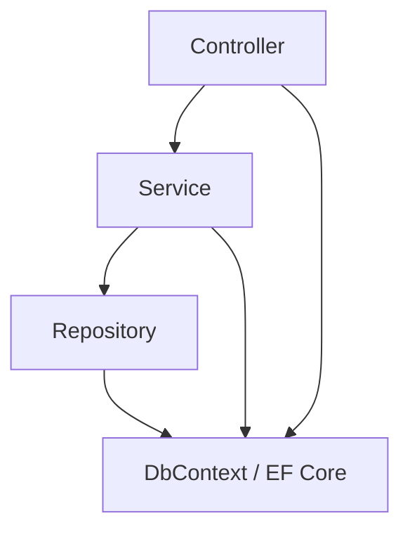
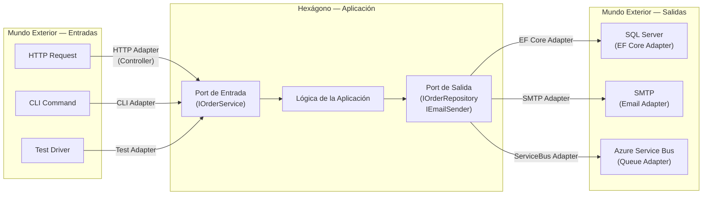
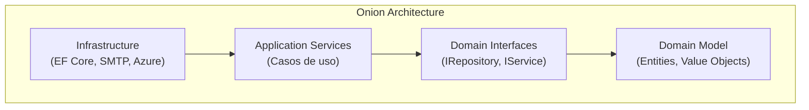
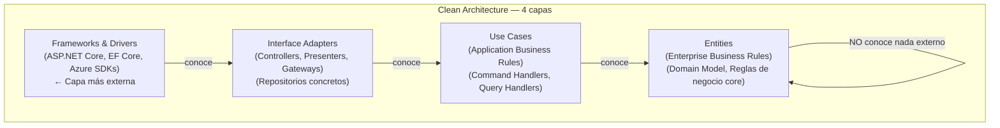
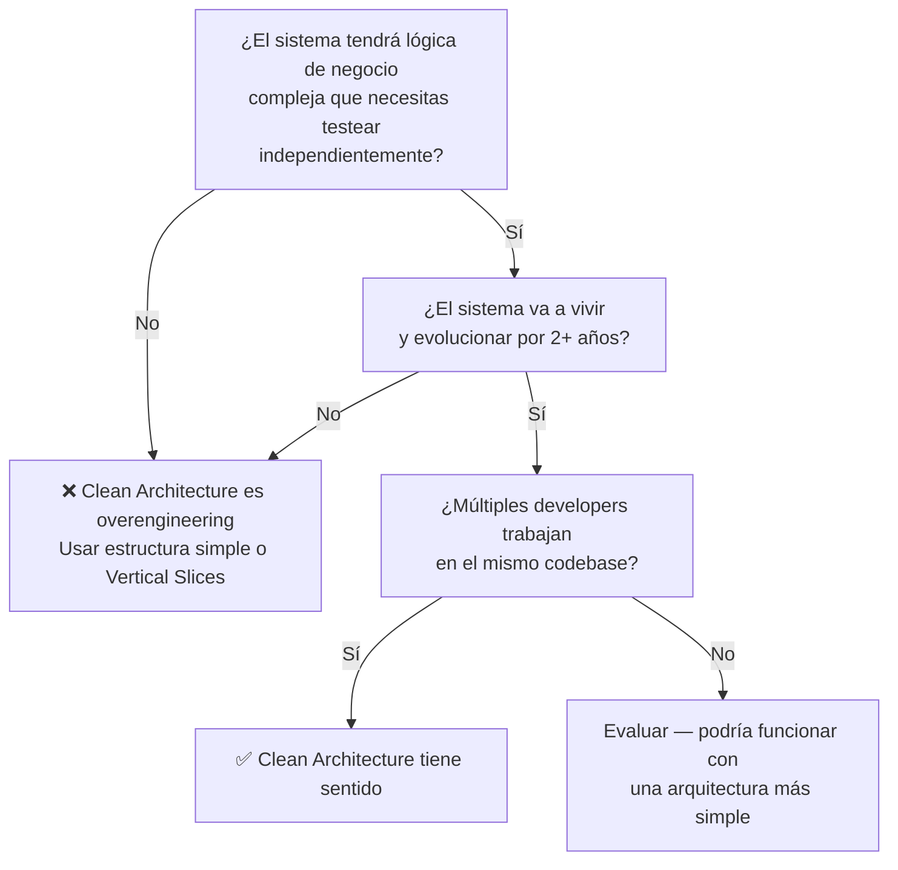

# 03-04 — Clean Architecture: El Problema, la Solución y el Criterio Real

> **Prerequisito:** [03-02-solid.md](./03-02-solid.md) — Clean Architecture es DIP aplicado a la escala de toda una solución. Si DIP no está claro, este archivo no tendrá sentido.
> [03-03-patrones-gof.md](./03-03-patrones-gof.md) — El patrón Adapter, Facade, y Repository que usarás aquí deben estar presentes.
>
> **Por qué este archivo importa en entrevistas Staff:**
> "Clean Architecture" es el término que más se malinterpreta en entrevistas de diseño.
> El candidato promedio dice "separo en capas" y dibuja un monolito con Controller → Service → Repository.
> El candidato Staff dice "la Dependency Rule es la diferencia entre un sistema que puede evolucionar y uno que se oxida". Este archivo te da ese criterio.
>
> **🎯 Recurso Pluralsight:** Path **"Clean Architecture: Patterns, Practices, and Principles"** (Matthew Renze).
> Abrirlo **después** de leer este archivo completo. Este archivo construye el modelo mental — Pluralsight añade variaciones y ejemplos adicionales.

---

## Sección 1 — El problema que Clean Architecture resuelve

### Primero, el proyecto que ya conoces

Llevas años construyendo APIs en ASP.NET Core. La estructura más común en proyectos .NET es esta:

```
MiProyecto/
├── Controllers/          → reciben HTTP, llaman a Services
├── Services/             → lógica de negocio (o lo que sea)
├── Repositories/         → acceso a datos
├── Models/               → entidades de EF Core
└── Program.cs
```

En la práctica, las dependencias van así:



**Esta estructura funciona perfectamente en proyectos pequeños.** No hay nada intrínsecamente malo en ella cuando el equipo es de 2 personas, el sistema tiene 10 entidades, y los requerimientos son estables.

El problema llega cuando el sistema crece. Y no a escala masiva — crece en lógica de negocio, en desarrolladores en el equipo, en años de vida. Entonces aparecen estos síntomas:

---

### Los síntomas reales del sistema que no tiene límites claros

**Síntoma 1 — Los tests unitarios requieren levantar la base de datos**

El Service tiene la lógica de negocio, pero también tiene `IOrderRepository` inyectado, que habla con `AppDbContext`, que necesita SQL Server. Para testear `OrderService.CalculateDiscount()`, tienes que configurar una base de datos completa. Los tests son lentos, frágiles, y nadie los mantiene.

El problema de fondo: la lógica de negocio está acoplada a la infraestructura de persistencia. No puedes separar una de otra porque una conoce a la otra.

**Síntoma 2 — Cambiar de SQL Server a PostgreSQL requiere tocar múltiples capas**

El string de conexión está en `appsettings.json`, pero el código SQL hardcodeado está en los Repositories, los queries de EF Core asumen comportamientos específicos de SQL Server, y algunos Controllers hasta llaman a procedimientos almacenados directamente. Cambiar la base de datos no es un cambio de infraestructura — requiere cirugía en el corazón del sistema.

**Síntoma 3 — La lógica de negocio está mezclada con detalles de infraestructura**

```csharp
// ❌ Esto está en un Service — pero qué parte es negocio y qué parte es infraestructura?
public async Task<OrderDto> CreateOrderAsync(CreateOrderRequest request)
{
    // Lógica de negocio: el cliente no puede tener más de 3 órdenes pendientes
    var pendingOrders = await _context.Orders
        .Where(o => o.CustomerId == request.CustomerId && o.Status == "Pending")
        .CountAsync(); // ← EF Core aquí

    if (pendingOrders >= 3)
        throw new BusinessException("Customer has too many pending orders");

    // Infraestructura: cómo persistir
    var order = new Order { ... };
    _context.Orders.Add(order);
    await _context.SaveChangesAsync(); // ← EF Core aquí también

    // Infraestructura: cómo enviar email
    await _emailService.SendOrderConfirmationAsync(order.Email, order.Id);

    // Mapeo: transformar para el consumidor HTTP
    return _mapper.Map<OrderDto>(order);
}
```

No puedes testear la regla de negocio ("3 órdenes pendientes máximo") sin levantar EF Core. No puedes cambiar cómo se envía el email sin tocar la lógica de negocio. Todo está entrelazado.

**Síntoma 4 — Los Controllers crecen porque "es lo más fácil"**

La ruta de menor resistencia cuando añades lógica es el Controller. Total, ya está ahí, ya tiene acceso al HttpContext, ya tiene el Request deserializado. Después de 2 años, tienes ActionMethods de 150 líneas que mezclan validación HTTP, lógica de negocio, y transformación de respuesta.

---

### La raíz del problema: las dependencias apuntan en la dirección equivocada

El problema no es que uses Controller → Service → Repository. El problema es que cada capa **conoce los detalles de implementación** de la capa que está debajo. El Service sabe que existe EF Core. El Controller sabe que existe el Service concreto. Cuando cambias cualquier detalle de implementación — nueva base de datos, nuevo ORM, nueva librería de validación — el cambio se propaga hacia arriba como una onda de choque.

Clean Architecture, Hexagonal Architecture y Onion Architecture son tres formas de resolver exactamente este problema, con el mismo principio central.

---

## Sección 2 — Las tres arquitecturas y sus diferencias reales

Muchos recursos hablan de estas tres como si fueran lo mismo. Casi lo son — pero entiender sus diferencias te da vocabulario para hablar de arquitectura con precisión. En una entrevista Staff, usar el término correcto en contexto demuestra que entiendes la historia y los matices, no solo el diagrama de círculos.

### Hexagonal Architecture — Ports & Adapters (Alistair Cockburn, 2005)

La idea central: el dominio (la aplicación) está en el centro. El mundo exterior interactúa con él únicamente a través de **ports** — interfaces que el dominio define. Las **adapters** son las implementaciones concretas que traducen entre el mundo exterior y los ports.



**Lo importante:** el dominio define los ports — las interfaces que necesita para funcionar. No conoce EF Core, no conoce SMTP. Solo conoce `IOrderRepository` y `IEmailSender`. Las adapters implementan esas interfaces. Puedes cambiar la base de datos sin tocar el hexágono.

**El término "puerto USB"** es una buena analogía: el puerto es estándar y lo define el dispositivo (tu laptop). Lo que conectas al puerto — disco duro, monitor, auriculares — puede cambiar sin que el laptop cambie.

---

### Onion Architecture (Jeffrey Palermo, 2008)

Palermo formalizó el mismo principio con capas explícitas representadas como una cebolla. Donde Hexagonal habla de "ports y adapters", Onion habla de "capas concéntricas con dependencias solo hacia el centro".



La diferencia conceptual con Hexagonal es que Onion añade más capas explícitas entre el dominio y la infraestructura. En la práctica, ambas resuelven el mismo problema de la misma forma.

---

### Clean Architecture (Robert C. Martin, 2012)

Uncle Bob formalizó y extendió estas ideas con cuatro capas explícitas y un nombre que se volvió el más popular en la comunidad .NET. El diagrama clásico:



**Las flechas van hacia el centro. Nunca hacia afuera. Esta es la Dependency Rule.**

---

### La diferencia práctica entre los tres

En la práctica, en el ecosistema .NET, "Clean Architecture" es el término que usarás en entrevistas y el que encontrarás en los templates de .NET como la plantilla de Jason Taylor (dotnet-clean-architecture). Lo que importa no es el nombre — es entender que los tres comparten la misma idea fundamental:

> **Las dependencias del código fuente siempre apuntan hacia las capas más abstractas y estables. Nunca hacia los detalles de implementación.**

---

## Sección 3 — La Dependency Rule explicada con precisión

Esta es la idea que debes poder articular en una entrevista sin titubear:

> "El código fuente solo puede depender de cosas en capas más internas. Nada en una capa interna puede saber nada sobre algo en una capa externa."

### Qué significa en términos concretos

| Capa | Puede depender de | NO puede depender de |
|---|---|---|
| Entities (Domain) | Nada externo al dominio | Application, Infrastructure, ASP.NET Core, EF Core |
| Use Cases (Application) | Domain | Infrastructure, ASP.NET Core, EF Core, Controllers |
| Interface Adapters | Application, Domain | ASP.NET Core framework internals, EF Core directamente |
| Frameworks & Drivers | Todo | — (es la capa más externa) |

### La inversión de dependencia en la práctica

El problema: el Use Case necesita persistir datos, pero no puede conocer EF Core (capa externa). ¿Cómo?

Mediante DIP — el Use Case define una **interfaz** (port) que la infraestructura implementa (adapter):

```csharp
// En Application layer — Define el contrato que NECESITA
public interface IOrderRepository  // ← el Use Case define esto
{
    Task<Order?> GetByIdAsync(OrderId id, CancellationToken ct = default);
    Task SaveAsync(Order order, CancellationToken ct = default);
}

// En Infrastructure layer — Implementa el contrato
public class SqlOrderRepository : IOrderRepository  // ← Infrastructure implementa esto
{
    private readonly AppDbContext _context;

    public async Task<Order?> GetByIdAsync(OrderId id, CancellationToken ct = default)
        => await _context.Orders
            .Include(o => o.Items)
            .FirstOrDefaultAsync(o => o.Id == id, ct);

    public async Task SaveAsync(Order order, CancellationToken ct = default)
    {
        _context.Orders.Add(order);
        await _context.SaveChangesAsync(ct);
    }
}
```

La capa Application conoce `IOrderRepository`. La capa Infrastructure conoce `IOrderRepository` Y `AppDbContext`. La capa Domain no conoce ninguna de las dos.

Cuando quieres testear el Use Case, inyectas un mock de `IOrderRepository`. No levantas SQL Server.

---

## Sección 4 — Implementación real en ASP.NET Core: estructura de proyectos

### La estructura canónica de solución

```
MiSistema/
├── MiSistema.Domain/               ← Entities, Value Objects, Domain Events, Excepciones
│   ├── Entities/
│   │   ├── Order.cs
│   │   └── Customer.cs
│   ├── ValueObjects/
│   │   ├── OrderId.cs
│   │   ├── Money.cs
│   │   └── Email.cs
│   ├── Events/
│   │   ├── OrderCreatedEvent.cs
│   │   └── OrderConfirmedEvent.cs
│   └── Exceptions/
│       └── DomainException.cs
│
├── MiSistema.Application/          ← Use Cases, Commands, Queries, Interfaces (ports)
│   ├── Commands/
│   │   ├── CreateOrder/
│   │   │   ├── CreateOrderCommand.cs
│   │   │   ├── CreateOrderCommandHandler.cs
│   │   │   └── CreateOrderCommandValidator.cs
│   │   └── ConfirmOrder/
│   │       ├── ConfirmOrderCommand.cs
│   │       └── ConfirmOrderCommandHandler.cs
│   ├── Queries/
│   │   └── GetOrderById/
│   │       ├── GetOrderByIdQuery.cs
│   │       └── GetOrderByIdQueryHandler.cs
│   ├── Interfaces/                 ← Los ports que Infrastructure implementará
│   │   ├── IOrderRepository.cs
│   │   ├── IEmailService.cs
│   │   └── IUnitOfWork.cs
│   └── Behaviors/                  ← Pipeline behaviors de MediatR
│       ├── ValidationBehavior.cs
│       └── TransactionBehavior.cs
│
├── MiSistema.Infrastructure/       ← Adapters: EF Core, SMTP, Azure Storage
│   ├── Persistence/
│   │   ├── AppDbContext.cs
│   │   ├── Configurations/
│   │   │   └── OrderConfiguration.cs  ← IEntityTypeConfiguration<Order>
│   │   └── Repositories/
│   │       └── SqlOrderRepository.cs
│   └── Services/
│       ├── SmtpEmailService.cs
│       └── AzureServiceBusPublisher.cs
│
└── MiSistema.Api/                  ← Controllers, DTOs, Program.cs
    ├── Controllers/
    │   └── OrdersController.cs
    ├── DTOs/
    │   └── CreateOrderRequest.cs
    └── Program.cs
```

### Las dependencias entre proyectos — en los `.csproj`

```xml
<!-- MiSistema.Domain.csproj — SIN dependencias de infraestructura -->
<Project Sdk="Microsoft.NET.Sdk">
  <PropertyGroup>
    <TargetFramework>net9.0</TargetFramework>
  </PropertyGroup>
  <!-- Ningún NuGet package de infraestructura aquí.
       El dominio es el código más estable y más puro del sistema. -->
</Project>

<!-- MiSistema.Application.csproj — solo depende de Domain -->
<Project Sdk="Microsoft.NET.Sdk">
  <ItemGroup>
    <ProjectReference Include="../MiSistema.Domain/MiSistema.Domain.csproj" />
    <!-- MediatR para Commands/Queries, FluentValidation para validación -->
    <PackageReference Include="MediatR" Version="12.*" />
    <PackageReference Include="FluentValidation" Version="11.*" />
  </ItemGroup>
</Project>

<!-- MiSistema.Infrastructure.csproj — implementa las interfaces de Application -->
<Project Sdk="Microsoft.NET.Sdk">
  <ItemGroup>
    <ProjectReference Include="../MiSistema.Application/MiSistema.Application.csproj" />
    <PackageReference Include="Microsoft.EntityFrameworkCore.SqlServer" Version="9.*" />
    <PackageReference Include="Azure.Messaging.ServiceBus" Version="7.*" />
  </ItemGroup>
</Project>

<!-- MiSistema.Api.csproj — depende de Application e Infrastructure (solo para DI) -->
<Project Sdk="Microsoft.NET.Sdk.Web">
  <ItemGroup>
    <ProjectReference Include="../MiSistema.Application/MiSistema.Application.csproj" />
    <ProjectReference Include="../MiSistema.Infrastructure/MiSistema.Infrastructure.csproj" />
    <!-- Api conoce Infrastructure SOLO para registrar las implementaciones en el DI container -->
  </ItemGroup>
</Project>
```

### Por qué Api depende de Infrastructure solo para DI

La única razón por la que el proyecto Api referencia Infrastructure es para registrar las implementaciones concretas en `Program.cs`. En ningún otro lugar del código de Api se menciona `SqlOrderRepository` o `SmtpEmailService`. Solo en el registro del contenedor de dependencias.

```csharp
// Program.cs — el único lugar donde Infrastructure existe en el proyecto Api
var builder = WebApplication.CreateBuilder(args);

// Registro de Application — MediatR, FluentValidation
builder.Services.AddApplication(); // Extension method en Application

// Registro de Infrastructure — EF Core, repositorios concretos
builder.Services.AddInfrastructure(builder.Configuration); // Extension method en Infrastructure

var app = builder.Build();
app.MapControllers();
app.Run();
```

```csharp
// En Infrastructure — DependencyInjection.cs
public static class DependencyInjection
{
    public static IServiceCollection AddInfrastructure(
        this IServiceCollection services,
        IConfiguration configuration)
    {
        services.AddDbContext<AppDbContext>(options =>
            options.UseSqlServer(configuration.GetConnectionString("Default")));

        // Registrar los repositorios concretos contra las interfaces de Application
        services.AddScoped<IOrderRepository, SqlOrderRepository>();
        services.AddScoped<IEmailService, SmtpEmailService>();
        services.AddScoped<IUnitOfWork, UnitOfWork>();

        return services;
    }
}
```

---

## Sección 5 — Ejemplo completo: flujo de un Command a través de todas las capas

Vamos a trazar el flujo completo de `CreateOrder`. Cada paso demuestra que la capa no sabe nada de lo que está fuera de ella.

### Paso 1 — Api Layer: Controller recibe HTTP POST

```csharp
// MiSistema.Api/Controllers/OrdersController.cs
[ApiController]
[Route("api/orders")]
public class OrdersController : ControllerBase
{
    private readonly ISender _sender; // ISender de MediatR — no sabe qué Handler existe

    public OrdersController(ISender sender) => _sender = sender;

    [HttpPost]
    public async Task<IActionResult> CreateOrder(
        [FromBody] CreateOrderRequest request,
        CancellationToken ct)
    {
        // Mapea el DTO HTTP a un Command de Application
        var command = new CreateOrderCommand(
            CustomerId: new CustomerId(request.CustomerId),
            Items: request.Items.Select(i => new OrderItemDto(
                ProductId: new ProductId(i.ProductId),
                Quantity: i.Quantity,
                UnitPrice: Money.Create(i.UnitPrice, i.Currency)
            )).ToList()
        );

        // El Controller no sabe cómo se procesa el Command — eso es Application
        var orderId = await _sender.Send(command, ct);

        return CreatedAtAction(nameof(GetOrder), new { id = orderId.Value }, new { id = orderId.Value });
    }
}
```

### Paso 2 — Application Layer: Command Handler ejecuta el caso de uso

```csharp
// MiSistema.Application/Commands/CreateOrder/CreateOrderCommandHandler.cs
public class CreateOrderCommandHandler : IRequestHandler<CreateOrderCommand, OrderId>
{
    private readonly IOrderRepository _repository; // Interface — no sabe que es SQL
    private readonly IUnitOfWork _unitOfWork;       // Interface — no sabe que es EF Core

    public CreateOrderCommandHandler(
        IOrderRepository repository,
        IUnitOfWork unitOfWork)
    {
        _repository = repository;
        _unitOfWork = unitOfWork;
    }

    public async Task<OrderId> Handle(CreateOrderCommand command, CancellationToken ct)
    {
        // Valida contra el repositorio (reglas de negocio que requieren datos)
        var existingOrders = await _repository.GetPendingCountAsync(command.CustomerId, ct);
        if (existingOrders >= 3)
            throw new DomainException("Customer cannot have more than 3 pending orders");

        // Crea el Aggregate (lógica de dominio pura)
        var order = Order.Create(command.CustomerId, command.Items);

        // Persiste — no sabe cómo, solo que IOrderRepository lo hará
        await _repository.SaveAsync(order, ct);

        // Confirma la transacción
        await _unitOfWork.CommitAsync(ct);

        return order.Id;
    }
}
```

### Paso 3 — Domain Layer: Order.Create() aplica reglas de negocio

```csharp
// MiSistema.Domain/Entities/Order.cs
// IMPORTANTE: ningún using de EF Core, ASP.NET Core, ni infraestructura aquí
public class Order : AggregateRoot<OrderId>
{
    public CustomerId CustomerId { get; private set; } = default!;
    public OrderStatus Status { get; private set; }
    public Money Total { get; private set; } = default!;
    private readonly List<OrderItem> _items = new();
    public IReadOnlyList<OrderItem> Items => _items.AsReadOnly();

    private Order() { } // Constructor privado — EF Core lo necesita para materialización

    public static Order Create(CustomerId customerId, IReadOnlyList<OrderItemDto> items)
    {
        // Regla de dominio: no se puede crear una orden sin items
        if (items is null || items.Count == 0)
            throw new DomainException("Order must have at least one item");

        var order = new Order
        {
            Id = OrderId.NewId(),
            CustomerId = customerId,
            Status = OrderStatus.Pending
        };

        foreach (var item in items)
        {
            var orderItem = OrderItem.Create(item.ProductId, item.Quantity, item.UnitPrice);
            order._items.Add(orderItem);
        }

        // Calcular total (Money es un Value Object — inmutable)
        order.Total = order._items.Aggregate(
            Money.Zero("USD"),
            (acc, item) => acc.Add(item.Subtotal));

        // Registrar el Domain Event — sin saber cómo se publicará
        order.AddDomainEvent(new OrderCreatedEvent(order.Id, customerId, order.Total));

        return order;
    }

    public void Confirm()
    {
        if (Status != OrderStatus.Pending)
            throw new DomainException($"Cannot confirm order with status '{Status}'");

        Status = OrderStatus.Confirmed;
        AddDomainEvent(new OrderConfirmedEvent(Id, CustomerId));
    }
}
```

### Paso 4 — Infrastructure Layer: Repositorio persiste

```csharp
// MiSistema.Infrastructure/Persistence/Repositories/SqlOrderRepository.cs
public class SqlOrderRepository : IOrderRepository
{
    private readonly AppDbContext _context;

    public SqlOrderRepository(AppDbContext context) => _context = context;

    public async Task SaveAsync(Order order, CancellationToken ct = default)
    {
        // ¿Es una entidad nueva o una actualización?
        var exists = await _context.Orders.AnyAsync(o => o.Id == order.Id, ct);
        if (exists)
            _context.Orders.Update(order);
        else
            await _context.Orders.AddAsync(order, ct);
        // SaveChangesAsync se llama desde UnitOfWork
    }

    public async Task<int> GetPendingCountAsync(CustomerId customerId, CancellationToken ct = default)
        => await _context.Orders
            .CountAsync(o => o.CustomerId == customerId && o.Status == OrderStatus.Pending, ct);
}
```

**¿Qué demostró este flujo?**
- El Domain (Order) no conoce EF Core ni SQL Server
- El Application (Handler) no conoce SqlOrderRepository — solo IOrderRepository
- El Infrastructure (SqlOrderRepository) conoce EF Core, pero no conoce el Handler
- El Api (Controller) solo conoce MediatR y los Command DTOs

Cambiar SQL Server por PostgreSQL requiere únicamente cambiar `AppDbContext` y `SqlOrderRepository`. El Domain, Application, y Controllers no se tocan.

---

## Sección 6 — Cuándo Clean Architecture es overengineering

⚠️ **Un Staff que dice "siempre Clean Architecture" no tiene criterio real.** El criterio correcto es el siguiente:

### Casos donde NO usar Clean Architecture

**Caso 1 — Aplicaciones con menos de 5-7 entidades y lógica simple**

El overhead de mantener 4 proyectos, interfaces para todo, y la "ceremonia" del mapeo entre capas — Commands → Handlers → Domain → DTOs — en un sistema de CRUD pequeño supera completamente el beneficio. En una aplicación de backoffice con 3 tablas y 10 endpoints, Minimal API con EF Core directo es la solución correcta.

**Caso 2 — CRUDs puros sin lógica de negocio real**

Si el sistema es esencialmente persistir y recuperar datos sin reglas complejas, la separación en capas de dominio no aporta nada. No hay "invariantes de negocio" que proteger en el dominio. Una arquitectura Vertical Slice (Feature Slices con MediatR, sin separación en proyectos) es más eficiente y más legible.

**Caso 3 — Prototipos y MVPs con timeline de semanas**

Cuando el objetivo es validar si el producto tiene mercado, la velocidad de iteración importa más que la mantenibilidad. Clean Architecture en un MVP es una apuesta prematura por una mantenibilidad que quizás nunca necesites porque el producto puede pivotar radicalmente — o morir.

**Caso 4 — Microservicios muy pequeños (nano-services)**

Un servicio con 2 endpoints, 1 entidad, y ciclo de vida de 6 meses no justifica 4 proyectos. Un proyecto único con estructura interna bien organizada es suficiente.

**Caso 5 — Equipos sin experiencia en el patrón**

Clean Architecture mal implementada es peor que una arquitectura simple bien ejecutada. Si el equipo no tiene experiencia con el patrón, la curva de aprendizaje durante el desarrollo en producción genera más deuda técnica que la que resuelve. El entrenamiento debe preceder a la adopción.

### La regla práctica para tomar la decisión



**El criterio Staff que importa:** Clean Architecture no es un símbolo de sofisticación técnica. Es una inversión en mantenibilidad futura que se justifica cuando el sistema tiene complejidad de dominio suficiente, vida útil larga, y un equipo que la va a mantener. El costo es real: más ceremonial, más clases, más mapeos. El beneficio es real: lógica de negocio testeable, reemplazabilidad de infraestructura, y fronteras claras entre responsabilidades.

---

## Checklist de salida — ¿Qué debes poder hacer antes de continuar?

- [ ] Explicar la Dependency Rule sin mirar notas: qué dirección van las dependencias y por qué
- [ ] Dibujar la estructura de proyectos de una solución Clean Architecture desde memoria
- [ ] Explicar por qué el proyecto Api referencia Infrastructure pero un Controller no usa `SqlOrderRepository` directamente
- [ ] Dado un sistema descrito en una oración, decidir si Clean Architecture es la elección correcta o overengineering — y justificar el razonamiento
- [ ] Identificar qué capa (Domain, Application, Infrastructure, Api) debería contener cada pieza de lógica dada
- [ ] Explicar cómo se testea un Command Handler sin levantar la base de datos

---

## Recursos

**🎯 Pluralsight — "Clean Architecture: Patterns, Practices, and Principles"** (Matthew Renze)
Abrir este path después de terminar este archivo. Los primeros 2 módulos del path refuerzan la teoría. A partir del módulo 3, sigue con el código — tiene un proyecto de ejemplo en C# que puedes comparar con lo que aprendiste aquí.

**Template canónico:** [jasontaylordev/CleanArchitecture](https://github.com/jasontaylordev/CleanArchitecture) en GitHub — el template más usado en la comunidad .NET. Examinar la estructura de proyectos y el `Program.cs` es más valioso que leer documentación adicional.

---

> **Siguiente:** [03-05-ddd.md](./03-05-ddd.md) — Domain-Driven Design construye sobre la base de Domain Layer que acabas de establecer. Las Entities, Value Objects y Aggregates que viste en este archivo tienen reglas específicas de diseño en DDD.
