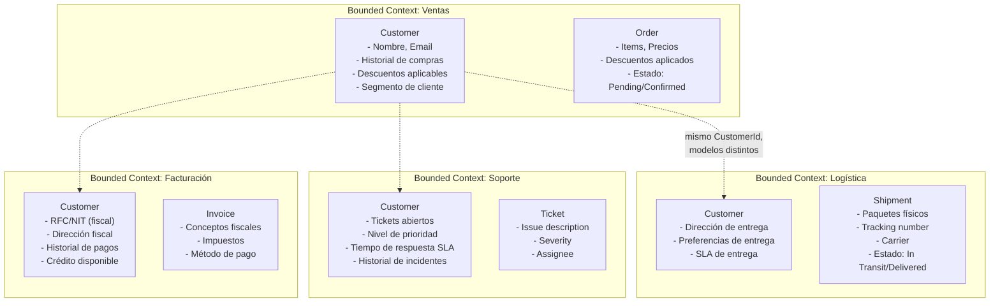
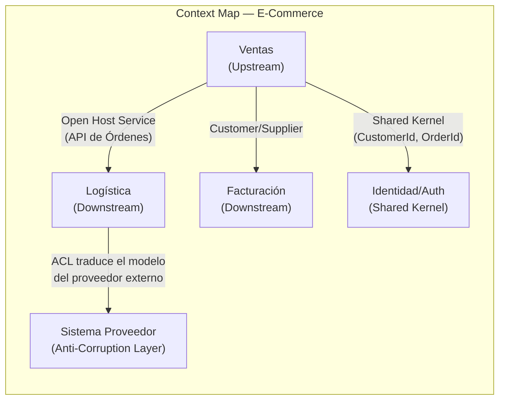
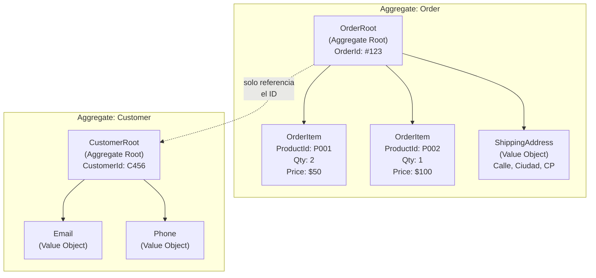

# 03-05 — Domain-Driven Design: Cómo el Código Habla el Idioma del Negocio

> **Prerequisito:** [03-04-clean-architecture.md](./03-04-clean-architecture.md) — La capa Domain que DDD estructura en profundidad es la misma capa interna de Clean Architecture. DDD no reemplaza Clean Architecture — la llena de contenido.
>
> **Por qué este archivo importa en entrevistas Staff:**
> DDD es el tema donde más gap hay entre lo que los candidatos creen saber y lo que realmente saben. La mayoría conoce el vocabulario (Entity, Aggregate, Bounded Context) pero no el modelo mental detrás. En una entrevista Staff, el diferenciador no es saber definir "Aggregate Root" — es saber *por qué existe*, qué problema resuelve, y cuándo *no* tiene sentido usarlo.
>
> El error más común de alguien que ha usado DDD sin entenderlo: confundir las entidades de EF Core con entidades de dominio. Son conceptos en capas distintas que pueden o no coincidir.
>
> **🎯 Recurso Pluralsight:** Path **"Domain-Driven Design in Practice"** (Vladimir Khorikov) — el mejor DDD para .NET en Pluralsight. Abrirlo después de leer este archivo completo. Khorikov es excepcionalmente bueno explicando los matices de Aggregates y Value Objects con C#.

---

## Sección 1 — El problema que DDD resuelve

### El síntoma que ya conoces

Imagina que le preguntas a tu compañero de negocio: "¿cuál es el estado de este pedido?" Y te responde: "está en estado 3". Tú vas al código y ves `order.Status == 3`. No sabes si 3 significa "enviado", "cancelado", o "esperando pago". Vas a la base de datos y ves una columna `Status INT` con valores del 1 al 7 sin documentación.

Ahora imagina que el equipo de ventas te dice "el pedido está *confirmado*", el equipo de logística dice que está "*en preparación*", y el equipo de finanzas lo llama "*aprobado*". Todos hablan del mismo pedido. ¿Cuál es el estado real? ¿En qué parte del código está cada transición?

Este es el síntoma que DDD resuelve: **el código no refleja cómo el negocio habla de sus propios procesos**.

Los developers usan términos técnicos (`User`, `Record`, `Entry`, `Data`), el negocio usa términos de dominio (`Cliente`, `Pedido`, `Contrato`, `Factura`). Hay una traducción mental constante entre "lo que el negocio dice" y "lo que el código hace". Esa traducción genera errores, malentendidos, y un sistema que solo los developers pueden entender.

DDD es la respuesta estructurada a la pregunta: **¿cómo hacemos que el código hable el mismo idioma que el negocio?**

La respuesta tiene dos niveles:
1. **Estratégico** — cómo dividir el sistema en partes con significado propio
2. **Táctico** — cómo implementar el dominio dentro de cada parte

La mayoría de recursos solo enseña el nivel táctico (los building blocks). Este archivo cubre ambos, porque el nivel estratégico es lo que más importa en entrevistas Staff y lo que más se ignora en la práctica.

---

## Sección 2 — DDD Estratégico: la parte que más se ignora

### Ubiquitous Language — el lenguaje que elimina la traducción

**Qué es:** Un vocabulario compartido entre developers y domain experts que se usa tanto en conversaciones cotidianas como en el código fuente. Literalmente — los nombres de las clases, métodos, y variables en el código son los mismos términos que el equipo de negocio usa en sus reuniones.

**Por qué importa más de lo que parece:**

Cuando el código usa el mismo vocabulario que el negocio, hay cero fricción entre "lo que el negocio pidió" y "lo que el código hace". Un bug en lógica de negocio puede ser reportado por alguien de ventas usando exactamente los mismos términos que necesitas para encontrarlo en el código.

```csharp
// ❌ Sin Ubiquitous Language — developer habla su propio idioma
public class OrderProcessor
{
    public void ProcessRecord(DataEntry entry, int typeCode, bool flagX)
    {
        if (typeCode == 2 && flagX)
            entry.StatusCode = 4;
    }
}

// ✅ Con Ubiquitous Language — el código habla el idioma del negocio
public class OrderFulfillmentService
{
    public void ConfirmOrder(Order order)
    {
        if (order.IsPendingApproval && order.HasValidPayment)
            order.Confirm(); // El método se llama como el negocio lo llama
    }
}
```

En el segundo caso, alguien de operaciones puede leer el código y entender qué hace. En el primero, nadie excepto el developer que lo escribió puede interpretarlo.

**Cómo construir y mantener el Ubiquitous Language:**
- Sesiones de Event Storming con domain experts: identifica los eventos del negocio primero, luego los comandos que los disparan, luego los actores que los ejecutan
- Glosario vivo en el repositorio (puede ser un archivo Markdown actualizado): términos del dominio con definición precisa y contexto de uso
- Code reviews que rechacen activamente términos no del dominio: si alguien commit con `ProcessRecord`, la PR no pasa

⚠️ **El anti-patrón más común:** construir el Ubiquitous Language en una reunión, documentarlo en Confluence, y nunca actualizarlo ni reflejarlo en el código. El lenguaje ubicuo está vivo — o está en el código, o no existe.

---

### Bounded Contexts — donde la misma palabra tiene significados distintos

**La intuición:** "Cliente" en el contexto de Ventas no es el mismo "Cliente" en el contexto de Soporte Técnico. Tienen la misma identidad en el mundo real, pero atributos, comportamientos, y reglas completamente distintos en cada dominio.

**Definición precisa:** Un Bounded Context es una frontera explícita dentro de la cual un modelo de dominio es consistente e internamente coherente. Dentro del Bounded Context, cada término tiene un significado único y no ambiguo. Fuera del contexto, el mismo término puede significar algo diferente.

**Ejemplo concreto — sistema de e-commerce:**



**La implicación crucial:** No hay un modelo de datos "Customer" unificado que sirva a todos los contextos. Cada contexto tiene su propio modelo `Customer` que contiene exactamente los atributos que ese contexto necesita. El `CustomerId` es el único elemento compartido — la identidad que une los distintos modelos del mismo cliente real.

**Por qué importa esto en entrevistas:**

Cuando el entrevistador te pide diseñar un sistema de e-commerce y preguntas "¿cómo se define 'cliente' en cada parte del sistema?", eso es una señal de nivel Staff. El candidato promedio asume que hay un solo modelo de cliente y diseña un sistema con una tabla `Customers` gigante. El candidato Staff reconoce que el concepto de "cliente" tiene semánticas distintas en ventas, logística y soporte, y diseña contextos separados con modelos propios.

---

### Context Map — cómo los Bounded Contexts se relacionan entre sí

Los Bounded Contexts no existen en aislamiento. Necesitan comunicarse. El Context Map documenta las relaciones entre ellos.



**Los patrones de integración más importantes:**

| Patrón | Cuándo usar | Ejemplo |
|---|---|---|
| **Shared Kernel** | Dos contextos comparten un subconjunto pequeño del modelo | `CustomerId` compartido entre Ventas y Facturación |
| **Customer/Supplier** | Un contexto produce datos que otro consume, con acuerdo formal | Ventas produce `OrderConfirmed`, Logística lo consume |
| **Anti-Corruption Layer (ACL)** | Integración con un sistema externo cuyo modelo no se controla | Integrar con el sistema de inventario del proveedor |
| **Open Host Service** | Exponer la funcionalidad del contexto como API pública bien definida | API REST de Órdenes que Logística puede consumir |
| **Published Language** | Formato de intercambio explícito y documentado (ej: eventos de integración) | `OrderConfirmedIntegrationEvent` publicado en Azure Service Bus |

---

## Sección 3 — DDD Táctico: los building blocks en C#

Los building blocks son los patrones de implementación dentro de un Bounded Context. Son herramientas, no reglas absolutas — úsalos donde aporten valor.

### Entities — objetos con identidad propia

**La definición que importa:** Una Entity es un objeto cuya identidad persiste en el tiempo, independientemente de sus atributos. Dos entities son la misma si tienen el mismo ID, aunque todos sus atributos sean diferentes.

```csharp
// La Order es siempre la misma Order aunque cambien todos sus atributos
public class Order : AggregateRoot<OrderId>
{
    public CustomerId CustomerId { get; private set; } = default!;
    public OrderStatus Status { get; private set; }
    public Money Total { get; private set; } = default!;
    private readonly List<OrderItem> _items = new();
    public IReadOnlyList<OrderItem> Items => _items.AsReadOnly();

    // Constructor privado — EF Core lo usa para materialización
    // No permites que nadie cree un Order con `new Order()` desde afuera
    private Order() { }

    // Método de fábrica estático — el único punto de entrada válido para crear Orders
    public static Order Create(CustomerId customerId, IReadOnlyList<OrderItemDto> items)
    {
        if (items is null || items.Count == 0)
            throw new DomainException("Order must have at least one item");

        var order = new Order
        {
            Id = OrderId.NewId(),
            CustomerId = customerId,
            Status = OrderStatus.Pending
        };

        foreach (var item in items)
            order._items.Add(OrderItem.Create(item.ProductId, item.Quantity, item.UnitPrice));

        order.Total = order._items.Aggregate(
            Money.Zero("MXN"),
            (acc, i) => acc.Add(i.Subtotal));

        order.AddDomainEvent(new OrderCreatedEvent(order.Id, customerId));
        return order;
    }

    // Los métodos del dominio representan transiciones de estado válidas
    // con nombre del lenguaje del negocio
    public void Confirm()
    {
        if (Status != OrderStatus.Pending)
            throw new DomainException($"Cannot confirm an order with status '{Status}'");

        Status = OrderStatus.Confirmed;
        AddDomainEvent(new OrderConfirmedEvent(Id, CustomerId));
    }

    public void Cancel(string reason)
    {
        if (Status is OrderStatus.Shipped or OrderStatus.Delivered)
            throw new DomainException("Cannot cancel an order that has already shipped");

        Status = OrderStatus.Cancelled;
        AddDomainEvent(new OrderCancelledEvent(Id, reason));
    }
}
```

**Cómo se comparan las Entities:** Por ID, no por atributos.

```csharp
// Dos ordenes son iguales solo si tienen el mismo OrderId
public abstract class Entity<TId> where TId : notnull
{
    public TId Id { get; protected set; } = default!;

    public override bool Equals(object? obj)
    {
        if (obj is not Entity<TId> other) return false;
        if (ReferenceEquals(this, other)) return true;
        return Id.Equals(other.Id);
    }

    public override int GetHashCode() => Id.GetHashCode();
}
```

---

### Value Objects — objetos sin identidad, comparados por valor

**La intuición:** Un billete de $100 MXN no tiene identidad — dos billetes de $100 son intercambiables. Un cliente sí tiene identidad — no es lo mismo el cliente #123 que el cliente #456, aunque tengan el mismo nombre.

**El problema que resuelven los Value Objects:**

```csharp
// ❌ Sin Value Object — el compilador no puede ayudarte
public class Order
{
    public Guid CustomerId { get; set; }
    public Guid ProductId { get; set; }

    // ¿Puedes asignar un ProductId donde va un CustomerId? Sí, y el compilador no te avisa.
}

// ✅ Con Value Objects — el tipo comunica semántica
public class Order
{
    public CustomerId CustomerId { get; private set; } = default!;
    public OrderId Id { get; private set; } = default!;

    // CustomerId y OrderId son tipos distintos — el compilador previene errores de asignación
}
```

**Implementación de un Value Object canónico:**

```csharp
// Value Object para representar dinero con moneda
public sealed class Money : IEquatable<Money>
{
    public decimal Amount { get; }
    public string Currency { get; }

    private Money(decimal amount, string currency)
    {
        Amount = amount;
        Currency = currency;
    }

    public static Money Create(decimal amount, string currency)
    {
        if (amount < 0)
            throw new DomainException("Money amount cannot be negative");
        if (string.IsNullOrWhiteSpace(currency) || currency.Length != 3)
            throw new DomainException($"'{currency}' is not a valid ISO 4217 currency code");
        return new Money(amount, currency.ToUpperInvariant());
    }

    public static Money Zero(string currency) => new(0, currency);

    // Las operaciones retornan nuevas instancias — los Value Objects son inmutables
    public Money Add(Money other)
    {
        if (Currency != other.Currency)
            throw new DomainException($"Cannot add {Currency} and {other.Currency}");
        return new Money(Amount + other.Amount, Currency);
    }

    public Money Multiply(int quantity) => new(Amount * quantity, Currency);

    // Igualdad por valor
    public bool Equals(Money? other)
        => other is not null && Amount == other.Amount && Currency == other.Currency;

    public override bool Equals(object? obj) => obj is Money m && Equals(m);
    public override int GetHashCode() => HashCode.Combine(Amount, Currency);

    // Operadores de comparación — idiomático en C#
    public static bool operator ==(Money? left, Money? right)
        => EqualityComparer<Money>.Default.Equals(left, right);
    public static bool operator !=(Money? left, Money? right) => !(left == right);

    public override string ToString() => $"{Amount:F2} {Currency}";
}
```

**Strongly-typed IDs con Value Objects:**

```csharp
// En lugar de Guid crudo, tipos que el compilador puede distinguir
public sealed record OrderId(Guid Value)
{
    public static OrderId NewId() => new(Guid.NewGuid());
    public static OrderId From(Guid value) => new(value);
    public override string ToString() => Value.ToString();
}

public sealed record CustomerId(Guid Value)
{
    public static CustomerId From(Guid value) => new(value);
}

// EF Core necesita conversores para persistir estos tipos
public class OrderIdConverter : ValueConverter<OrderId, Guid>
{
    public OrderIdConverter() : base(
        id => id.Value,
        value => OrderId.From(value)) { }
}
```

---

### Aggregates y Aggregate Roots — la unidad de consistencia transaccional

**La idea más importante y más malentendida de DDD táctico:**

Un Aggregate es un cluster de Entities y Value Objects que se trata como **una unidad para cambios de datos**. La regla fundamental:

> **Solo puedes referenciar el estado de un Aggregate a través de su Aggregate Root. Solo el Aggregate Root puede ser obtenido directamente de un Repository.**



**Reglas de los Aggregates:**

1. **El Aggregate Root es la única puerta de entrada** — nadie modifica OrderItem directamente, siempre a través de Order
2. **Las referencias entre Aggregates son solo por ID** — Order guarda `CustomerId`, no una referencia al objeto `Customer`
3. **Un Repository por Aggregate Root** — no hay `IOrderItemRepository`, solo `IOrderRepository`
4. **Las invariantes del Aggregate siempre se cumplen** — Order es responsable de que `Total == sum(Items.Subtotal)` en todo momento

```csharp
// ❌ Violar el Aggregate Root — modificar un item directamente
orderItem.Quantity = 5; // Incorrecto — Order no sabe que su total cambió

// ✅ Todo pasa por el Aggregate Root
order.UpdateItemQuantity(productId, newQuantity);
// Order actualiza el item Y recalcula el total — mantiene la invariante

public class Order : AggregateRoot<OrderId>
{
    public void UpdateItemQuantity(ProductId productId, int newQuantity)
    {
        if (Status != OrderStatus.Pending)
            throw new DomainException("Cannot modify a non-pending order");

        var item = _items.FirstOrDefault(i => i.ProductId == productId)
            ?? throw new DomainException($"Product {productId} not found in order");

        item.UpdateQuantity(newQuantity);

        // Recalcular total — la invariante siempre se mantiene
        Total = _items.Aggregate(Money.Zero(Total.Currency), (acc, i) => acc.Add(i.Subtotal));

        AddDomainEvent(new OrderItemUpdatedEvent(Id, productId, newQuantity));
    }
}
```

**⚠️ El error de diseño más frecuente con Aggregates:**

Agregar demasiadas cosas al mismo Aggregate por "conveniencia". Por ejemplo, hacer que `Order` contenga directamente el `Customer` completo porque "siempre los necesito juntos". El resultado: transacciones gigantes, lock contention en la base de datos, y Aggregates que crecen indefinidamente.

**La regla de diseño de Aggregates:** Los límites del Aggregate deben estar definidos por las invariantes de negocio que deben ser consistentes *dentro de la misma transacción*. Si no necesitas que A y B sean consistentes en la misma transacción, no los pongas en el mismo Aggregate.

---

### Domain Events — lo que ocurrió en el dominio

Los Domain Events son la forma de comunicar que algo significativo ocurrió en el dominio, sin que el Aggregate sepa quién reaccionará a ese evento.

```csharp
// Base para Domain Events — inmutables por diseño
public abstract record DomainEvent
{
    public Guid EventId { get; init; } = Guid.NewGuid();
    public DateTime OccurredOn { get; init; } = DateTime.UtcNow;
}

// Evento concreto — el nombre en pasado describe qué ocurrió
public record OrderConfirmedEvent(
    OrderId OrderId,
    CustomerId CustomerId,
    Money Total) : DomainEvent;

// Base para Aggregate Roots con soporte de Domain Events
public abstract class AggregateRoot<TId> : Entity<TId> where TId : notnull
{
    private readonly List<DomainEvent> _domainEvents = new();
    public IReadOnlyList<DomainEvent> DomainEvents => _domainEvents.AsReadOnly();

    protected void AddDomainEvent(DomainEvent domainEvent)
        => _domainEvents.Add(domainEvent);

    public void ClearDomainEvents() => _domainEvents.Clear();
}
```

**La relación entre Domain Events y los handlers que reaccionan:**

```csharp
// En Application layer — handler que reacciona al evento
public class OrderConfirmedEventHandler : INotificationHandler<OrderConfirmedEvent>
{
    private readonly IEmailService _emailService;

    public async Task Handle(OrderConfirmedEvent notification, CancellationToken ct)
    {
        // Reacción al evento — sin que Order supiera que existía este handler
        await _emailService.SendOrderConfirmationAsync(
            notification.CustomerId,
            notification.OrderId,
            notification.Total,
            ct);
    }
}
```

**Cuándo publicar los Domain Events — el timing importa:**

Los Domain Events deben publicarse **después** de que la transacción se haya completado exitosamente. Si publicas antes de persistir y la transacción falla, el evento quedó publicado pero el estado del Aggregate no se guardó — inconsistencia.

```csharp
// En Infrastructure — UnitOfWork publica los eventos DESPUÉS de SaveChangesAsync
public class UnitOfWork : IUnitOfWork
{
    private readonly AppDbContext _context;
    private readonly IPublisher _publisher;

    public async Task CommitAsync(CancellationToken ct = default)
    {
        // 1. Persistir cambios del Aggregate
        await _context.SaveChangesAsync(ct);

        // 2. DESPUÉS de persistir, publicar los Domain Events
        var events = _context.ChangeTracker
            .Entries<AggregateRoot<Guid>>() // ajustar para el tipo de ID
            .SelectMany(e => e.Entity.DomainEvents)
            .ToList();

        foreach (var @event in events)
            await _publisher.Publish(@event, ct);

        // 3. Limpiar los eventos ya publicados
        _context.ChangeTracker
            .Entries<AggregateRoot<Guid>>()
            .ToList()
            .ForEach(e => e.Entity.ClearDomainEvents());
    }
}
```

---

### Domain Services — lógica de dominio que no pertenece a una sola Entity

Un Domain Service es una operación de dominio que involucra múltiples Aggregates y que no pertenece naturalmente a ninguno de ellos.

```csharp
// ❌ Poner la lógica de transferencia en Account — ¿cuál Account tiene la responsabilidad?
public class Account
{
    public void Transfer(Account destination, Money amount) { ... }
    // ¿Tiene sentido que Account sepa de otra Account?
}

// ✅ Domain Service — la operación vive donde conceptualmente pertenece
public class FundsTransferService
{
    public TransferResult Transfer(Account source, Account destination, Money amount)
    {
        if (!source.HasSufficientFunds(amount))
            return TransferResult.InsufficientFunds();

        source.Debit(amount);
        destination.Credit(amount);

        return TransferResult.Success(new TransferCompletedEvent(
            source.Id, destination.Id, amount));
    }
}
```

**Criterios para usar un Domain Service:**
- La operación involucra múltiples Aggregates
- La operación no tiene estado propio (es stateless)
- No pertenece naturalmente a ninguno de los Aggregates involucrados

⚠️ **Anti-patrón — el Anemic Domain Model:** Cuando todas las Entities solo tienen getters/setters y toda la lógica está en Services, estás usando DDD de nombre pero no de espíritu. El resultado es un modelo de datos disfrazado de dominio. Las Entities deben tener comportamiento — métodos que encapsulen las reglas de negocio.

---

## Sección 4 — DDD Estratégico vs Táctico: cuándo necesitas cada nivel

### Solo Táctico (sin Estratégico)

Sistemas con un único Bounded Context donde el equipo tiene buen dominio del negocio. Los building blocks añaden valor:
- Value Objects previenen bugs de tipos
- Aggregates protegen invariantes
- Domain Events desacoplan reacciones

No necesitas el Context Map, el Ubiquitous Language formal, ni la separación en múltiples contextos.

**Señales de que solo táctico es suficiente:**
- Sistema de tamaño medio con un dominio coherente
- Equipo de 3-8 personas trabajando en el mismo codebase
- El negocio tiene reglas claras y estables en un solo dominio

### Estratégico + Táctico

Sistemas con múltiples subdominios que tienen semánticas distintas, múltiples equipos, o dominios donde los mismos términos tienen significados distintos en distintos contextos.

**Señales de que necesitas el nivel estratégico:**
- El mismo término ("cliente", "pedido", "precio") significa cosas distintas en distintas partes del sistema
- Múltiples equipos autónomos trabajando en distintas partes del sistema
- El sistema está siendo dividido en microservicios — los Bounded Contexts son candidatos naturales para los límites de los servicios

---

### Cuándo DDD es overengineering

Esta es la sección más importante del archivo para desarrollar criterio real:

**❌ CRUDs sin lógica de negocio real**

Si el sistema es esencialmente guardar y leer datos sin reglas complejas entre entidades, los building blocks de DDD son ceremonial. No hay invariantes que proteger en los Aggregates, no hay transiciones de estado que modelar, no hay comportamiento de dominio que encapsular. Usar Aggregate Roots en un sistema CRUD es añadir complejidad sin beneficio.

**❌ Cuando el equipo no tiene acceso a domain experts**

DDD sin Ubiquitous Language es solo la parte táctica disfrazada con vocabulario de DDD. El Ubiquitous Language requiere colaboración con personas del negocio que entiendan el dominio profundamente. Sin esa colaboración, los "términos del dominio" que pones en el código son invenciones del equipo técnico, no el lenguaje del negocio.

**❌ Equipos sin experiencia en DDD**

DDD mal implementado es peor que sin DDD. Los errores más comunes — Aggregates mal dimensionados, Domain Services que son glorificados Application Services, Entities anémicas con toda la lógica en Services — generan más complejidad que la que resuelven.

**La pregunta correcta para decidir:**

> "¿Hay suficiente complejidad de reglas de negocio para justificar el modelo de dominio rico? ¿Tengo acceso al conocimiento del negocio para construir un Ubiquitous Language real?"

Si la respuesta a cualquiera de las dos es "no", DDD no es la solución correcta para ese contexto.

---

## Checklist de salida — ¿Qué debes poder hacer antes de continuar?

- [ ] Explicar la diferencia entre una Entity de EF Core y una Entity de DDD sin confundirlas
- [ ] Dado un dominio descrito en una oración (ej: "sistema de reservas de hotel"), identificar al menos 3 Bounded Contexts y describir cómo el concepto "reserva" puede tener significado distinto en cada uno
- [ ] Implementar un Value Object para `Email` con validación encapsulada y comparación por valor
- [ ] Explicar por qué los references entre Aggregates deben ser solo por ID y no por referencia directa al objeto
- [ ] Diferenciar cuándo usar un método en el Aggregate vs cuándo crear un Domain Service
- [ ] Identificar el anti-patrón Anemic Domain Model en un código dado

---

## Recursos

**🎯 Pluralsight — "Domain-Driven Design in Practice"** (Vladimir Khorikov)
El mejor recurso de DDD para C#/.NET disponible. Abrirlo después de terminar este archivo. El módulo de Value Objects y el de Aggregates son especialmente sólidos. Khorikov tiene criterio real sobre cuándo DDD aplica y cuándo no — no es evangelización sin criterio.

**Libro de referencia:** *Domain-Driven Design: Tackling Complexity in the Heart of Software* (Eric Evans, 2003) — el libro original. No es necesario leerlo completo para trabajar con DDD, pero los capítulos sobre Bounded Contexts y Context Maps son insustituibles para la parte estratégica.

---

> **Siguiente:** [03-06-cqrs-event-sourcing.md](./03-06-cqrs-event-sourcing.md) — CQRS usa directamente los Aggregates y Domain Events que acabas de aprender. Los Commands modifican los Aggregates, los Domain Events son la base del Event Sourcing.
