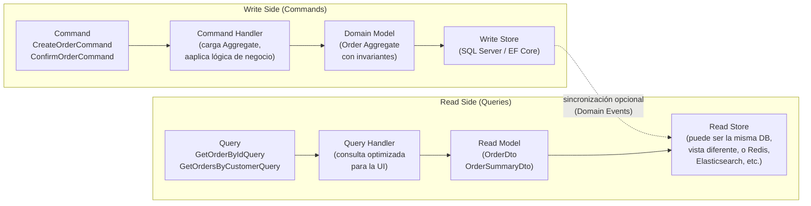
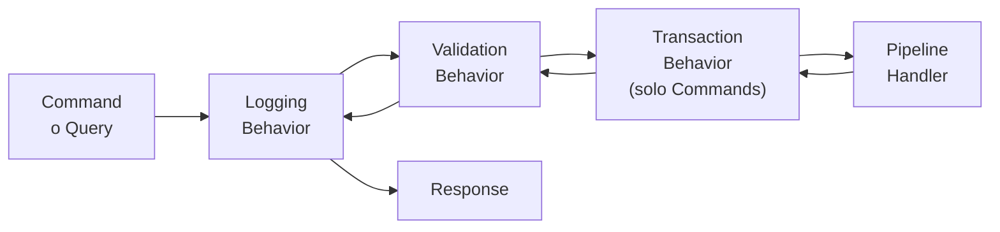
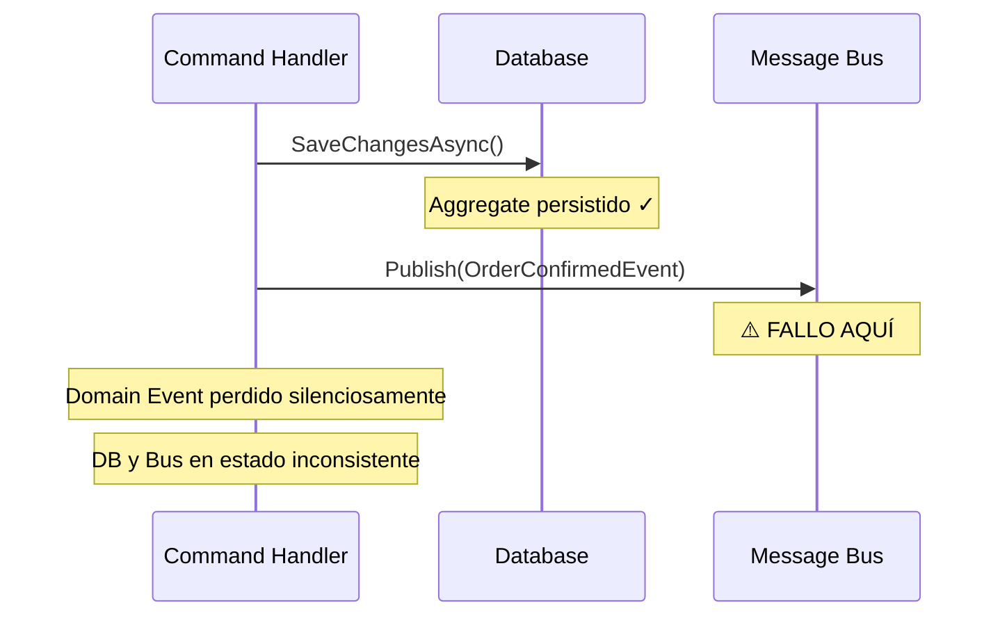
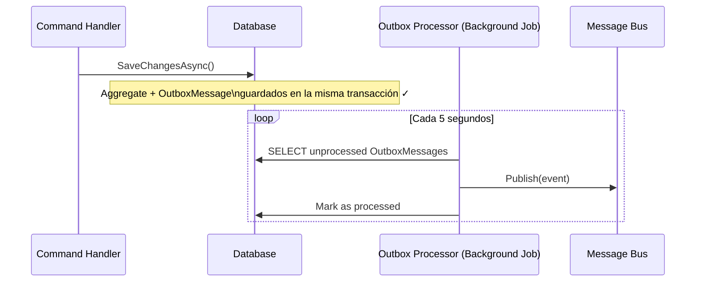
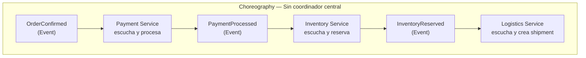
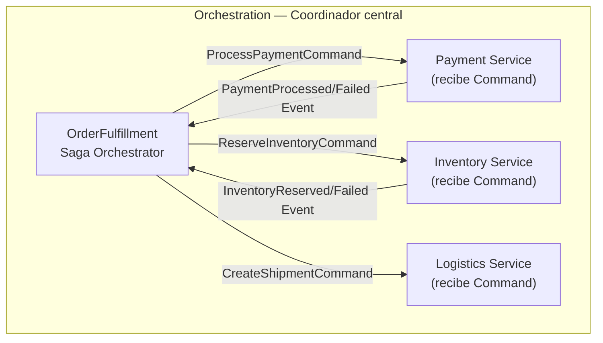

# 03-06 — CQRS y Event Sourcing: Separación de Responsabilidades a Escala

> **Prerequisito:** [03-05-ddd.md](./03-05-ddd.md) — CQRS usa los Aggregates y Domain Events que definiste en DDD. Los Commands modifican Aggregates. Los Domain Events son el fundamento de Event Sourcing. Si los Aggregates no están claros, este archivo no tendrá sentido completo.
>
> **Por qué este archivo importa en entrevistas Staff:**
> CQRS es el patrón que más aparece en entrevistas de arquitectura para roles Staff en 2025-2026. La mayoría de developers que usan MediatR dicen que "usan CQRS" sin saber que eso es lo que están haciendo ni por qué existe la separación. En una entrevista, la diferencia entre el nivel promedio y Staff es poder explicar el problema que CQRS resuelve, cuándo la separación de modelos de lectura/escritura tiene sentido, y por qué Event Sourcing es ortogonal a CQRS y agrega su propia complejidad independiente.
>
> **Aviso crítico:** CQRS y Event Sourcing se presentan frecuentemente juntos, como si fueran inseparables. **No lo son.** Puedes y debes entender cada uno independientemente antes de ver cómo se complementan. Este archivo los explica en ese orden.
>
> **🎯 Recurso Pluralsight:** Path **"CQRS in Practice"** (Vladimir Khorikov) — el mismo autor que DDD. Abrirlo después de terminar este archivo. El módulo sobre la diferencia entre CQRS simple y CQRS con lectura separada es especialmente valioso.

---

## Sección 1 — CQRS: el problema que resuelve

### El modelo único que trata de servir dos propósitos

En un sistema típico, tienes un modelo de datos que sirve tanto para leer como para escribir. La misma clase `Order` que usas para aplicar reglas de negocio en las escrituras es la misma que serializas para responder a una consulta de la UI.

```csharp
// ❌ El mismo modelo para lectura y escritura
public class Order
{
    public Guid Id { get; set; }
    public Guid CustomerId { get; set; }
    public List<OrderItem> Items { get; set; } = new();
    public decimal Total { get; set; }
    public OrderStatus Status { get; set; }
    // ... más propiedades
}

// Para escritura, necesitas el modelo rico con invariantes
var order = await _repository.GetByIdAsync(orderId); // Carga todo el grafo
order.Confirm(); // Aplica reglas de negocio

// Para lectura, necesitas una proyección específica para la UI
var orders = await _repository.GetOrdersByCustomer(customerId); // Carga el mismo grafo pesado
return orders.Select(o => new OrderSummaryDto { ... }); // Y luego descarta la mayoría
```

**El problema a escala:**

Con el tiempo, las consultas se vuelven complejas. La UI de "lista de órdenes" necesita el nombre del cliente, la cantidad de items, el total, y el estado. Eso requiere un JOIN de 4 tablas. La UI de "detalle de orden" necesita los items con imágenes de producto, direcciones de entrega, y el historial de cambios de estado.

Pero el Aggregate `Order` fue diseñado para proteger invariantes de negocio durante las escrituras — tiene lógica de validación, domain events, y reglas de transición de estado. Cargarlo completo para simplemente leer datos es overhead puro: EF Core construye el grafo de objetos, ejecuta el change tracking, y después tiras todo excepto los 3 campos que necesitabas.

### Command Query Separation (CQS) — el principio base

Antes de CQRS, existe CQS: un principio de diseño a nivel de métodos formulado por Bertrand Meyer en los años 80.

> **Un método debe ser un Command (modifica estado, no retorna valor) o una Query (retorna valor, no modifica estado). Nunca ambos.**

```csharp
// ❌ Viola CQS — modifica estado Y retorna valor
public Order CreateAndReturnOrder(OrderData data)
{
    var order = new Order(data);
    _orders.Add(order);
    return order; // ← modifica Y retorna
}

// ✅ CQS — separación limpia
public void CreateOrder(OrderData data) // Command — modifica, no retorna (o retorna solo el ID)
{
    var order = new Order(data);
    _orders.Add(order);
}

public Order? GetOrder(Guid id) // Query — retorna, no modifica
{
    return _orders.FirstOrDefault(o => o.Id == id);
}
```

**CQRS es CQS aplicado a la arquitectura completa** — no solo a métodos individuales, sino a modelos de datos completos y a los flujos de lectura/escritura de un sistema.

---

## Sección 2 — CQRS: la separación de modelos

### Los dos lados del sistema



### CQRS Simple vs CQRS con Read Store separado

**CQRS Simple (mismo store, misma DB):**
La separación es a nivel de código — Commands usan el modelo rico (Aggregates), Queries usan DTOs optimizados y pueden ir directo a SQL o Dapper sin pasar por el modelo de dominio.

```csharp
// COMMANDS — modifican estado, retornan solo el ID o void
public record CreateOrderCommand(
    CustomerId CustomerId,
    IReadOnlyList<OrderItemDto> Items) : IRequest<OrderId>;

public record ConfirmOrderCommand(OrderId OrderId) : IRequest;

public record CancelOrderCommand(
    OrderId OrderId,
    string Reason) : IRequest;

// QUERIES — retornan datos, no modifican estado
public record GetOrderByIdQuery(OrderId OrderId) : IRequest<OrderDetailDto?>;

public record GetOrdersByCustomerQuery(
    CustomerId CustomerId,
    int Page = 1,
    int PageSize = 20) : IRequest<PagedResult<OrderSummaryDto>>;
```

**El separador conceptual más importante:** Los Commands trabajan con el modelo de dominio (Aggregates). Las Queries trabajan con DTOs o projections específicos para la UI. Son lenguajes distintos para propósitos distintos.

### Command Handlers — el modelo rico con invariantes

```csharp
public class ConfirmOrderCommandHandler : IRequestHandler<ConfirmOrderCommand>
{
    private readonly IOrderRepository _repository;
    private readonly IUnitOfWork _unitOfWork;

    public ConfirmOrderCommandHandler(
        IOrderRepository repository,
        IUnitOfWork unitOfWork)
    {
        _repository = repository;
        _unitOfWork = unitOfWork;
    }

    public async Task Handle(ConfirmOrderCommand command, CancellationToken ct)
    {
        // Carga el Aggregate completo — necesitas el modelo rico para las invariantes
        var order = await _repository.GetByIdAsync(command.OrderId, ct)
            ?? throw new NotFoundException($"Order {command.OrderId} not found");

        // Aplica lógica de dominio — el Aggregate protege sus invariantes
        order.Confirm(); // ← lanza DomainException si el estado no es válido

        // Persiste y publica Domain Events
        await _repository.SaveAsync(order, ct);
        await _unitOfWork.CommitAsync(ct);
    }
}
```

### Query Handlers — el modelo optimizado para lectura

```csharp
public class GetOrderByIdQueryHandler : IRequestHandler<GetOrderByIdQuery, OrderDetailDto?>
{
    private readonly IDbConnection _connection; // Dapper — sin el overhead de EF Core

    public GetOrderByIdQueryHandler(IDbConnection connection)
        => _connection = connection;

    public async Task<OrderDetailDto?> Handle(
        GetOrderByIdQuery query, CancellationToken ct)
    {
        // Query directa y optimizada — exactamente los campos que la UI necesita
        // Sin cargar el Aggregate completo, sin change tracking, sin materialización de objetos
        const string sql = """
            SELECT
                o.Id,
                o.Status,
                o.Total,
                o.Currency,
                o.CreatedAt,
                o.ConfirmedAt,
                c.Name AS CustomerName,
                c.Email AS CustomerEmail,
                oi.Id AS ItemId,
                oi.ProductId,
                p.Name AS ProductName,
                oi.Quantity,
                oi.UnitPrice
            FROM Orders o
            JOIN Customers c ON c.Id = o.CustomerId
            LEFT JOIN OrderItems oi ON oi.OrderId = o.Id
            LEFT JOIN Products p ON p.Id = oi.ProductId
            WHERE o.Id = @OrderId
            """;

        // Dapper multi-mapping para construir el DTO con su colección de items
        var orderDict = new Dictionary<Guid, OrderDetailDto>();

        await _connection.QueryAsync<OrderDetailDto, OrderItemDetailDto, OrderDetailDto>(
            sql,
            (order, item) =>
            {
                if (!orderDict.TryGetValue(order.Id, out var existing))
                {
                    existing = order;
                    existing.Items = new List<OrderItemDetailDto>();
                    orderDict.Add(order.Id, existing);
                }
                if (item is not null)
                    existing.Items.Add(item);
                return existing;
            },
            new { OrderId = query.OrderId.Value },
            splitOn: "ItemId");

        return orderDict.Values.FirstOrDefault();
    }
}

// Query para listado — optimizada para paginación sin cargar el Aggregate
public class GetOrdersByCustomerQueryHandler
    : IRequestHandler<GetOrdersByCustomerQuery, PagedResult<OrderSummaryDto>>
{
    private readonly IDbConnection _connection;

    public async Task<PagedResult<OrderSummaryDto>> Handle(
        GetOrdersByCustomerQuery query, CancellationToken ct)
    {
        const string countSql = """
            SELECT COUNT(*) FROM Orders WHERE CustomerId = @CustomerId
            """;

        const string dataSql = """
            SELECT
                o.Id,
                o.Status,
                o.Total,
                o.Currency,
                o.CreatedAt,
                COUNT(oi.Id) AS ItemCount
            FROM Orders o
            LEFT JOIN OrderItems oi ON oi.OrderId = o.Id
            WHERE o.CustomerId = @CustomerId
            GROUP BY o.Id, o.Status, o.Total, o.Currency, o.CreatedAt
            ORDER BY o.CreatedAt DESC
            OFFSET @Offset ROWS FETCH NEXT @PageSize ROWS ONLY
            """;

        var parameters = new
        {
            CustomerId = query.CustomerId.Value,
            Offset = (query.Page - 1) * query.PageSize,
            query.PageSize
        };

        var total = await _connection.ExecuteScalarAsync<int>(countSql, parameters);
        var items = await _connection.QueryAsync<OrderSummaryDto>(dataSql, parameters);

        return new PagedResult<OrderSummaryDto>(
            Items: items.ToList(),
            TotalCount: total,
            Page: query.Page,
            PageSize: query.PageSize);
    }
}
```

**Por qué las Queries pueden ir directo a SQL:**

El modelo de dominio (Aggregate) existe para proteger invariantes durante las escrituras. Para lecturas, no necesitas las invariantes — necesitas los datos en el formato que la UI requiere. Cargar el Aggregate completo para leer 3 campos es overhead sin beneficio. Dapper con SQL directo para las Queries es una práctica establecida y correcta en CQRS.

---

## Sección 3 — MediatR Pipeline Behaviors como middleware de CQRS

Los Pipeline Behaviors de MediatR implementan el patrón Chain of Responsibility aplicado al pipeline de Commands y Queries. Son el equivalente del middleware de ASP.NET Core, pero para los handlers de MediatR.



### Validation Behavior

```csharp
// Se ejecuta ANTES del handler para cualquier Command o Query
public class ValidationBehavior<TRequest, TResponse>
    : IPipelineBehavior<TRequest, TResponse>
    where TRequest : IRequest<TResponse>
{
    private readonly IEnumerable<IValidator<TRequest>> _validators;

    public ValidationBehavior(IEnumerable<IValidator<TRequest>> validators)
        => _validators = validators;

    public async Task<TResponse> Handle(
        TRequest request,
        RequestHandlerDelegate<TResponse> next,
        CancellationToken ct)
    {
        if (!_validators.Any())
            return await next();

        var context = new ValidationContext<TRequest>(request);
        var validationResults = await Task.WhenAll(
            _validators.Select(v => v.ValidateAsync(context, ct)));

        var failures = validationResults
            .SelectMany(r => r.Errors)
            .Where(f => f != null)
            .ToList();

        if (failures.Any())
            throw new ValidationException(failures);

        return await next();
    }
}

// Validator para CreateOrderCommand con FluentValidation
public class CreateOrderCommandValidator : AbstractValidator<CreateOrderCommand>
{
    public CreateOrderCommandValidator()
    {
        RuleFor(x => x.CustomerId)
            .NotEmpty().WithMessage("CustomerId is required");

        RuleFor(x => x.Items)
            .NotEmpty().WithMessage("Order must have at least one item")
            .Must(items => items.Count <= 50)
            .WithMessage("Order cannot have more than 50 items");

        RuleForEach(x => x.Items).ChildRules(item =>
        {
            item.RuleFor(i => i.Quantity)
                .GreaterThan(0).WithMessage("Quantity must be greater than 0");

            item.RuleFor(i => i.UnitPrice)
                .GreaterThan(0).WithMessage("Unit price must be greater than 0");
        });
    }
}
```

### Transaction Behavior — solo para Commands

```csharp
// Los Commands necesitan transacción. Las Queries no.
public class TransactionBehavior<TRequest, TResponse>
    : IPipelineBehavior<TRequest, TResponse>
    where TRequest : IRequest<TResponse>
{
    private readonly IUnitOfWork _unitOfWork;

    public TransactionBehavior(IUnitOfWork unitOfWork)
        => _unitOfWork = unitOfWork;

    public async Task<TResponse> Handle(
        TRequest request,
        RequestHandlerDelegate<TResponse> next,
        CancellationToken ct)
    {
        // Las Queries no necesitan transacción — pasan directo
        if (request is IQuery<TResponse>)
            return await next();

        // Commands se envuelven en transacción
        await using var transaction = await _unitOfWork.BeginTransactionAsync(ct);
        try
        {
            var result = await next();
            await transaction.CommitAsync(ct);
            return result;
        }
        catch
        {
            await transaction.RollbackAsync(ct);
            throw;
        }
    }
}

// Marker interfaces para diferenciar Commands de Queries en el pipeline
public interface ICommand : IRequest { }
public interface ICommand<TResponse> : IRequest<TResponse> { }
public interface IQuery<TResponse> : IRequest<TResponse> { }
```

### Registro en DI

```csharp
// En Application/DependencyInjection.cs
public static IServiceCollection AddApplication(this IServiceCollection services)
{
    services.AddMediatR(cfg =>
    {
        cfg.RegisterServicesFromAssembly(Assembly.GetExecutingAssembly());

        // El orden de los behaviors importa — se ejecutan en este orden
        cfg.AddBehavior(typeof(IPipelineBehavior<,>), typeof(LoggingBehavior<,>));
        cfg.AddBehavior(typeof(IPipelineBehavior<,>), typeof(ValidationBehavior<,>));
        cfg.AddBehavior(typeof(IPipelineBehavior<,>), typeof(TransactionBehavior<,>));
    });

    services.AddValidatorsFromAssembly(Assembly.GetExecutingAssembly());

    return services;
}
```

---

## Sección 4 — Outbox Pattern: garantías de entrega sin 2PC

### El problema que el Outbox resuelve



Después de guardar el Aggregate y antes de publicar el Domain Event, el proceso puede fallar (crash, timeout de red, excepción no manejada). El Aggregate se persistió pero el evento nunca salió. Los sistemas que dependían de ese evento (envío de email, actualización de inventario, notificación de logística) nunca se enteraron.

### La solución: guardar el evento en la misma transacción



### Implementación con EF Core

```csharp
// Entidad del Outbox
public class OutboxMessage
{
    public Guid Id { get; set; }
    public string Type { get; set; } = default!;      // Nombre del tipo del evento
    public string Payload { get; set; } = default!;   // JSON serializado del evento
    public DateTime CreatedAt { get; set; }
    public DateTime? ProcessedAt { get; set; }         // null = pendiente
    public string? Error { get; set; }                 // Para errores de procesamiento
    public int RetryCount { get; set; }
}

// AppDbContext intercepta SaveChangesAsync y convierte Domain Events en OutboxMessages
public class AppDbContext : DbContext
{
    public DbSet<OutboxMessage> OutboxMessages => Set<OutboxMessage>();

    public override async Task<int> SaveChangesAsync(CancellationToken ct = default)
    {
        // Antes de guardar: convertir Domain Events en OutboxMessages
        var aggregates = ChangeTracker
            .Entries<AggregateRoot>()
            .Where(e => e.Entity.DomainEvents.Any())
            .ToList();

        var outboxMessages = aggregates
            .SelectMany(e => e.Entity.DomainEvents)
            .Select(@event => new OutboxMessage
            {
                Id = Guid.NewGuid(),
                Type = @event.GetType().AssemblyQualifiedName!,
                Payload = JsonSerializer.Serialize(@event, @event.GetType()),
                CreatedAt = DateTime.UtcNow
            })
            .ToList();

        OutboxMessages.AddRange(outboxMessages);

        // Limpiar los Domain Events de los Aggregates (ya están en el Outbox)
        aggregates.ForEach(e => e.Entity.ClearDomainEvents());

        // Un solo SaveChangesAsync: Aggregate + OutboxMessages en la misma transacción
        // Si falla: nada se guarda. Si tiene éxito: ambos se guardan.
        return await base.SaveChangesAsync(ct);
    }
}

// Background job que procesa el Outbox periódicamente
public class OutboxProcessor : BackgroundService
{
    private readonly IServiceScopeFactory _scopeFactory;
    private readonly ILogger<OutboxProcessor> _logger;

    protected override async Task ExecuteAsync(CancellationToken stoppingToken)
    {
        while (!stoppingToken.IsCancellationRequested)
        {
            await ProcessOutboxMessages(stoppingToken);
            await Task.Delay(TimeSpan.FromSeconds(5), stoppingToken);
        }
    }

    private async Task ProcessOutboxMessages(CancellationToken ct)
    {
        using var scope = _scopeFactory.CreateScope();
        var context = scope.ServiceProvider.GetRequiredService<AppDbContext>();
        var publisher = scope.ServiceProvider.GetRequiredService<IPublisher>();

        var messages = await context.OutboxMessages
            .Where(m => m.ProcessedAt == null && m.RetryCount < 3)
            .OrderBy(m => m.CreatedAt)
            .Take(20) // Procesar en lotes para no saturar
            .ToListAsync(ct);

        foreach (var message in messages)
        {
            try
            {
                // Deserializar y publicar el evento
                var type = Type.GetType(message.Type)!;
                var @event = (DomainEvent)JsonSerializer.Deserialize(message.Payload, type)!;
                await publisher.Publish(@event, ct);

                message.ProcessedAt = DateTime.UtcNow;
            }
            catch (Exception ex)
            {
                _logger.LogError(ex, "Failed to process outbox message {MessageId}", message.Id);
                message.RetryCount++;
                message.Error = ex.Message;
            }
        }

        await context.SaveChangesAsync(ct);
    }
}
```

**Garantía que provee el Outbox:** At-least-once delivery. El evento puede publicarse más de una vez en casos de fallo del processor justo después de publicar pero antes de marcar como procesado. Los handlers deben ser idempotentes.

---

## Sección 5 — Event Sourcing: cuándo y por qué

### CQRS ≠ Event Sourcing

Este es el malentendido más común. CQRS separa lecturas de escrituras. Event Sourcing cambia **cómo se almacena el estado**. Son ortogonales:

- Puedes tener CQRS **sin** Event Sourcing (el caso más común)
- Puedes tener Event Sourcing **sin** CQRS (aunque raramente tiene sentido)
- Puedes tener ambos juntos (cuando los requerimientos de ambos están presentes)

### Qué es Event Sourcing

En lugar de guardar el **estado actual** del Aggregate:
```
Orders table: { Id: 123, Status: "Shipped", Total: 150.00 }
```

Guardas la **secuencia de eventos** que llevaron a ese estado:
```
event_store:
1. OrderCreated     { orderId: 123, customerId: 456, items: [...] }
2. OrderConfirmed   { orderId: 123, confirmedAt: 2024-01-15 }
3. PaymentReceived  { orderId: 123, amount: 150.00, method: "card" }
4. OrderShipped     { orderId: 123, trackingId: "MX123456" }
```

El estado actual se obtiene **reproduciendo** los eventos en orden (rehydration).

### Implementación básica en C#

```csharp
// Base para Aggregates con Event Sourcing
public abstract class EventSourcedAggregate
{
    private readonly List<DomainEvent> _uncommittedEvents = new();
    public IReadOnlyList<DomainEvent> UncommittedEvents => _uncommittedEvents.AsReadOnly();
    public int Version { get; private set; } = -1; // -1 = no persistido aún

    // Aplicar un evento — modifica el estado interno del Aggregate
    protected void Apply(DomainEvent @event)
    {
        // Dispatch dinámico al método When correspondiente
        ((dynamic)this).When((dynamic)@event);
        Version++;
    }

    // Registrar un nuevo evento (ocurrió ahora)
    protected void Raise(DomainEvent @event)
    {
        Apply(@event);               // Actualiza el estado inmediatamente
        _uncommittedEvents.Add(@event); // Marca para persistencia
    }

    // Reconstruir desde historia de eventos (rehydration)
    public void Rehydrate(IEnumerable<DomainEvent> history)
    {
        foreach (var @event in history)
            Apply(@event);
        _uncommittedEvents.Clear(); // Los eventos históricos no son "nuevos"
    }

    public void ClearUncommittedEvents() => _uncommittedEvents.Clear();
}

// Aggregate con Event Sourcing
public class Order : EventSourcedAggregate
{
    public OrderId Id { get; private set; } = default!;
    public CustomerId CustomerId { get; private set; } = default!;
    public OrderStatus Status { get; private set; }
    public Money Total { get; private set; } = default!;
    private readonly List<OrderItem> _items = new();
    public IReadOnlyList<OrderItem> Items => _items.AsReadOnly();

    private Order() { } // Para rehydration

    // Factory estático — Raise dispara el evento, When actualiza el estado
    public static Order Create(CustomerId customerId, IReadOnlyList<OrderItemDto> items)
    {
        if (items is null || items.Count == 0)
            throw new DomainException("Order must have at least one item");

        var order = new Order();
        order.Raise(new OrderCreatedEvent(OrderId.NewId(), customerId, items));
        return order;
    }

    public void Confirm()
    {
        if (Status != OrderStatus.Pending)
            throw new DomainException($"Cannot confirm order in {Status} status");

        Raise(new OrderConfirmedEvent(Id, DateTime.UtcNow));
    }

    public void Ship(string trackingId)
    {
        if (Status != OrderStatus.Confirmed)
            throw new DomainException("Cannot ship an unconfirmed order");

        Raise(new OrderShippedEvent(Id, trackingId, DateTime.UtcNow));
    }

    // Los métodos When son puros — solo modifican estado, sin efectos secundarios
    // Son privados — solo el Aggregate puede aplicar sus propios eventos
    private void When(OrderCreatedEvent @event)
    {
        Id = @event.OrderId;
        CustomerId = @event.CustomerId;
        Status = OrderStatus.Pending;
        foreach (var item in @event.Items)
            _items.Add(OrderItem.FromDto(item));
        Total = _items.Aggregate(Money.Zero("MXN"), (acc, i) => acc.Add(i.Subtotal));
    }

    private void When(OrderConfirmedEvent @event)
    {
        Status = OrderStatus.Confirmed;
    }

    private void When(OrderShippedEvent @event)
    {
        Status = OrderStatus.Shipped;
    }
}
```

### Repository para Event Sourcing

```csharp
public interface IEventStore
{
    Task<IReadOnlyList<DomainEvent>> GetEventsAsync(
        Guid aggregateId,
        CancellationToken ct = default);

    Task AppendEventsAsync(
        Guid aggregateId,
        int expectedVersion,
        IReadOnlyList<DomainEvent> events,
        CancellationToken ct = default);
}

public class EventSourcedOrderRepository : IOrderRepository
{
    private readonly IEventStore _eventStore;

    public async Task<Order?> GetByIdAsync(OrderId id, CancellationToken ct = default)
    {
        var events = await _eventStore.GetEventsAsync(id.Value, ct);
        if (!events.Any()) return null;

        var order = new Order(); // Constructor privado a través de reflection o patron especial
        order.Rehydrate(events);
        return order;
    }

    public async Task SaveAsync(Order order, CancellationToken ct = default)
    {
        var newEvents = order.UncommittedEvents;
        if (!newEvents.Any()) return;

        // Optimistic concurrency: expectedVersion previene conflictos
        await _eventStore.AppendEventsAsync(
            order.Id.Value,
            order.Version - newEvents.Count, // versión antes de los nuevos eventos
            newEvents,
            ct);

        order.ClearUncommittedEvents();
    }
}
```

### Snapshots — optimización para Aggregates con historia larga

Si un `Order` tiene 500 eventos (modificaciones, actualizaciones de items, cambios de dirección), reconstruirlo reproduciendo 500 eventos en cada lectura es costoso.

La solución: snapshots periódicos del estado actual del Aggregate.

```csharp
// Snapshot — estado completo en un punto en el tiempo
public class OrderSnapshot
{
    public Guid AggregateId { get; set; }
    public int Version { get; set; }
    public string State { get; set; } = default!; // JSON del estado completo
    public DateTime CreatedAt { get; set; }
}

// Rehydration con snapshot + eventos posteriores
public async Task<Order?> GetByIdAsync(OrderId id, CancellationToken ct)
{
    // 1. Obtener el snapshot más reciente
    var snapshot = await _snapshotStore.GetLatestAsync(id.Value, ct);

    // 2. Obtener solo los eventos POSTERIORES al snapshot
    var eventsAfterSnapshot = await _eventStore.GetEventsAsync(
        id.Value,
        fromVersion: snapshot?.Version ?? 0,
        ct);

    if (snapshot is null && !eventsAfterSnapshot.Any())
        return null;

    var order = new Order();

    if (snapshot is not null)
        order.RestoreFromSnapshot(snapshot.State); // Restaurar desde el JSON

    order.Rehydrate(eventsAfterSnapshot); // Aplicar solo los eventos nuevos

    return order;
}
```

---

## Sección 6 — Saga Pattern: transacciones distribuidas sin 2PC

Cuando una operación de negocio involucra múltiples Bounded Contexts o microservicios, no puedes usar una transacción de base de datos distribuida (2PC es frágil, no escala, y bloquea recursos). El Saga Pattern coordina la transacción mediante mensajes.

### Choreography vs Orchestration





| Aspecto | Choreography | Orchestration |
|---|---|---|
| **Acoplamiento** | Bajo — servicios reaccionan a eventos | Mayor — servicios conocen el orquestador |
| **Visibilidad del flujo** | Difícil de seguir — distribuido | Centralizado y visible en el orquestador |
| **Debugging** | Complejo — rastrear eventos entre servicios | Más simple — estado del orquestador es visible |
| **Punto de fallo único** | No tiene | El orquestador puede ser un SPOF |
| **Cuándo usar** | Flujos simples con pocos pasos | Flujos complejos con muchas condiciones y compensaciones |

### Implementación con MediatR — Orchestration

```csharp
// Estado de la Saga — debe ser persistible para sobrevivir reinicios
public class OrderFulfillmentSagaState
{
    public Guid SagaId { get; set; }
    public OrderId OrderId { get; set; } = default!;
    public SagaStatus Status { get; set; }
    public bool PaymentProcessed { get; set; }
    public bool InventoryReserved { get; set; }
    public string? FailureReason { get; set; }
}

public class OrderFulfillmentSaga
{
    private readonly ISender _mediator;
    private readonly ISagaRepository<OrderFulfillmentSagaState> _sagaRepo;
    private readonly ILogger<OrderFulfillmentSaga> _logger;

    // Punto de entrada — cuando se confirma una orden
    public async Task HandleAsync(OrderConfirmedEvent @event, CancellationToken ct)
    {
        var state = new OrderFulfillmentSagaState
        {
            SagaId = Guid.NewGuid(),
            OrderId = @event.OrderId,
            Status = SagaStatus.Processing
        };

        await _sagaRepo.SaveAsync(state, ct);

        // Paso 1: Procesar pago
        await _mediator.Send(new ProcessPaymentCommand(@event.OrderId, @event.Total), ct);
    }

    public async Task HandleAsync(PaymentProcessedEvent @event, CancellationToken ct)
    {
        var state = await _sagaRepo.GetByOrderIdAsync(@event.OrderId, ct);
        state.PaymentProcessed = true;
        await _sagaRepo.SaveAsync(state, ct);

        // Paso 2: Reservar inventario
        await _mediator.Send(new ReserveInventoryCommand(@event.OrderId), ct);
    }

    public async Task HandleAsync(PaymentFailedEvent @event, CancellationToken ct)
    {
        var state = await _sagaRepo.GetByOrderIdAsync(@event.OrderId, ct);
        state.Status = SagaStatus.Failed;
        state.FailureReason = @event.Reason;
        await _sagaRepo.SaveAsync(state, ct);

        // Compensating transaction — deshacer lo ya hecho
        // En este caso, solo cancelar la orden (no se hizo nada más)
        await _mediator.Send(new CancelOrderCommand(@event.OrderId, "Payment failed"), ct);
    }

    public async Task HandleAsync(InventoryReservationFailedEvent @event, CancellationToken ct)
    {
        var state = await _sagaRepo.GetByOrderIdAsync(@event.OrderId, ct);
        state.Status = SagaStatus.Failed;
        await _sagaRepo.SaveAsync(state, ct);

        // Compensating transaction — revertir el pago ya procesado
        await _mediator.Send(new RefundPaymentCommand(@event.OrderId), ct);
        await _mediator.Send(new CancelOrderCommand(@event.OrderId, "Inventory not available"), ct);
    }
}
```

---

## Tabla comparativa — cuándo usar cada combinación

| Combinación | Cuándo tiene sentido | Cuándo NO |
|---|---|---|
| **Sin CQRS, sin Event Sourcing** | CRUD simple, sistema pequeño, lógica mínima | — |
| **CQRS simple** (mismo store, separación de código) | Sistemas con complejidad de dominio, necesitas modelo rico para escrituras y proyecciones para lecturas | CRUDs puros, sistemas pequeños |
| **CQRS + Read Store separado** | Read/write ratio muy diferente, lecturas costosas que se pueden cachear, microservicios con BD separadas | Cuando la sincronización entre stores agrega más complejidad que la que resuelves |
| **CQRS + Event Sourcing** | Necesitas historial completo de cambios (auditoria, compliance, finanzas), temporal queries ("¿cuál era el estado en fecha X?"), necesitas reproducir projections con nueva lógica | La gran mayoría de sistemas. Si no tienes requerimiento explícito de historial, no lo necesitas. |
| **CQRS + Event Sourcing + Sagas** | Sistemas distribuidos con múltiples Bounded Contexts, transacciones que cruzan límites de servicios | Monolitos bien estructurados, sistemas sin distribución real |

---

## Checklist de salida — ¿Qué debes poder hacer antes de continuar?

- [ ] Explicar la diferencia entre CQS (principio de método) y CQRS (patrón arquitectónico)
- [ ] Implementar un Command Handler con MediatR que cargue un Aggregate, lo modifique, y persista
- [ ] Implementar un Query Handler que use Dapper directo sin cargar el Aggregate
- [ ] Explicar por qué Event Sourcing y CQRS son ortogonales — puedes usar uno sin el otro
- [ ] Describir el problema que el Outbox Pattern resuelve y la garantía que provee (at-least-once)
- [ ] Dado un escenario con una transacción que cruza 2 servicios, elegir entre Choreography y Orchestration y justificar

---

## Recursos

**🎯 Pluralsight — "CQRS in Practice"** (Vladimir Khorikov)
Mismo autor que el path de DDD. Abrirlo después de terminar este archivo. El módulo sobre la diferencia entre CQRS con misma base de datos vs lectura separada es particularmente valioso.

**Referencia técnica:** [MediatR documentation](https://github.com/jbogard/MediatR/wiki) — especialmente la sección de Pipeline Behaviors. Es corta y directa.

**Para Event Sourcing en producción:** [EventStoreDB](https://www.eventstore.com/) es la base de datos diseñada específicamente para Event Sourcing. Antes de implementarlo con EF Core, evaluar si los requerimientos justifican una base de datos especializada.

---

> **Siguiente:** [03-07-api-design.md](./03-07-api-design.md) — API Design es el contrato externo de todo lo que construiste en este módulo. Los Commands y Queries que diseñaste en CQRS se exponen como endpoints HTTP con contratos bien definidos.
