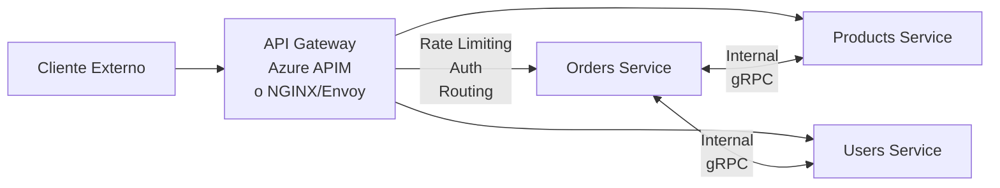

# 03-07 — API Design: Contratos que Duran Años

> **Prerequisito:** [03-06-cqrs-event-sourcing.md](./03-06-cqrs-event-sourcing.md) — Los Commands y Queries de CQRS son la capa de aplicación que tus endpoints van a exponer. La idempotencia de una API REST tiene correspondencia directa con la idempotencia que debes diseñar en tus Command Handlers.
>
> **Por qué este archivo importa en entrevistas Staff:**
> API Design es una de las disciplinas más evaluadas en entrevistas de arquitectura porque los errores de diseño en una API son excepcionalmente costosos: tienes consumidores externos, contratos implícitos, y cualquier breaking change es una operación de coordinación que puede involucrar decenas de equipos. Un candidato Staff debe poder hablar de versionado, idempotencia, y selección de protocolo con criterio de ingeniería, no con opiniones estéticas.
>
> **🎯 Recurso externo:** ByteByteGo API Design Series — disponible gratuitamente en su newsletter y canal de YouTube. Específicamente: "REST API Best Practices", "API Versioning", y "API Gateway" son los videos más directamente aplicables a este archivo. Consumirlos después de terminar esta lectura.

---

## Sección 1 — REST semántico real: más allá de CRUD con HTTP verbs

### El problema de las "REST APIs" que no son REST

Hay una afirmación que escucharás frecuentemente en equipos de backend: "tenemos una API REST". En la práctica, la mayoría de esas APIs son **HTTP APIs** o **RPC sobre HTTP** — un conjunto de endpoints que usan HTTP como transporte pero no aprovechan su modelo semántico.

La distinción importa no por purismo académico, sino porque el modelo REST real te da cachabilidad HTTP, navegabilidad de recursos, y contratos predecibles que los consumidores pueden entender sin documentación adicional.

**Lo que la mayoría llama "REST" (RPC sobre HTTP):**

```http
POST /api/orders/create
POST /api/orders/confirm
POST /api/orders/cancel
GET  /api/orders/getById?id=123
GET  /api/orders/getByCustomer?customerId=456
```

Los verbos están en la URL, HTTP solo mueve datos. Esto es un sistema RPC donde HTTP es el transporte.

**REST semántico real — recursos como sustantivos, HTTP como vocabulario:**

```http
POST   /api/orders              ← crear orden
GET    /api/orders/{id}         ← obtener orden
GET    /api/orders?customerId=x ← filtrar órdenes
PUT    /api/orders/{id}         ← reemplazar orden completa
PATCH  /api/orders/{id}         ← actualizar parcialmente
DELETE /api/orders/{id}         ← eliminar orden
```

Los recursos son sustantivos. Las acciones son los verbos HTTP. El estado del recurso se transfiere en el body.

### El problema real: las transiciones de estado

Aquí es donde el "REST puro" se complica. Una orden no solo se crea o elimina — tiene un ciclo de vida con transiciones de estado: `Pending → Confirmed → Shipped → Delivered`. ¿Cómo modelas "confirmar una orden" en REST?

Hay tres aproximaciones, cada una con trade-offs distintos:

```csharp
// ─────────────────────────────────────────────────────────────────────────────
// Approach 1: Sub-recurso de estado
// PUT /api/orders/{id}/status
// Body: { "status": "confirmed" }
// ─────────────────────────────────────────────────────────────────────────────

// Simple, pero cualquier cliente puede hacer PUT con cualquier status sin
// que la API exprese qué transiciones son válidas. Silenciosamente permite
// transiciones imposibles a nivel de protocolo (Shipped → Pending).

// ─────────────────────────────────────────────────────────────────────────────
// Approach 2: Acciones explícitas como sub-recursos (el más pragmático)
// POST /api/orders/{id}/confirm
// POST /api/orders/{id}/cancel
// POST /api/orders/{id}/ship
// ─────────────────────────────────────────────────────────────────────────────

[ApiController]
[Route("api/v{version:apiVersion}/orders")]
public class OrdersController : ControllerBase
{
    [HttpPost("{id:guid}/confirm")]
    public async Task<IActionResult> ConfirmOrder(
        Guid id,
        CancellationToken ct)
    {
        var command = new ConfirmOrderCommand(new OrderId(id));
        var result = await _mediator.Send(command, ct);

        return result.IsSuccess
            ? NoContent()
            : Problem(detail: result.Error, statusCode: 422);
    }

    [HttpPost("{id:guid}/cancel")]
    public async Task<IActionResult> CancelOrder(
        Guid id,
        [FromBody] CancelOrderRequest request,
        CancellationToken ct)
    {
        var command = new CancelOrderCommand(new OrderId(id), request.Reason);
        var result = await _mediator.Send(command, ct);

        return result.IsSuccess ? NoContent() : Problem(...);
    }
}

// ─────────────────────────────────────────────────────────────────────────────
// Approach 3: Evento de dominio como recurso
// POST /api/orders/{id}/events
// Body: { "type": "OrderConfirmed", "timestamp": "..." }
// ─────────────────────────────────────────────────────────────────────────────

// Más "RESTful" en teoría, pero más abstracto para los consumidores.
// Raramente usado en APIs de producto — más común en sistemas de event sourcing.
```

**La respuesta Staff:** REST es un estilo arquitectónico, no una religión. El Approach 2 es el más pragmático, el más expresivo para los consumidores, y el más común en APIs de producción bien diseñadas. Las acciones tienen significado semántico claro: un cliente puede leer `POST /confirm` y entender exactamente qué pasa. Llamar "violación REST" a este approach sin contexto es trivia académica que no ayuda a diseñar mejores sistemas.

---

## Sección 2 — Versionado de APIs: la decisión que no puedes deshacer

Una vez que tienes consumidores de tu API — externos o internos — cambiar el contrato rompe esos consumidores. El versionado es la solución, pero tiene múltiples estrategias con trade-offs distintos que debes elegir **antes** de que el primer consumidor se conecte.

### Las tres estrategias principales

**Estrategia 1 — URL Path Versioning (la más común en APIs públicas):**

```http
GET /api/v1/orders/{id}
GET /api/v2/orders/{id}
```

- **Ventaja:** Explícita, visible en logs, fácil de entender y testear. El número de versión es parte de la identidad del recurso.
- **Desventaja:** Los clientes deben actualizar la URL al migrar. Más difícil de mantener múltiples versiones activas en paralelo si el código no está bien estructurado.
- **Cuándo usar:** APIs públicas, APIs con breaking changes frecuentes, cuando el debugging es prioridad.

**Estrategia 2 — Header Versioning (más "RESTful"):**

```http
GET /api/orders/{id}
Headers: Api-Version: 2.0
         Accept: application/vnd.myapi.v2+json
```

- **Ventaja:** URLs limpias. Más alineado con el modelo REST teórico donde la URL identifica el recurso, no la versión.
- **Desventaja:** Menos visible para debugging, difícil de testear en browser, los proxies y CDNs no pueden routear por versión basándose en la URL.
- **Cuándo usar:** APIs internas donde todos los clientes están bajo tu control.

**Estrategia 3 — Query Parameter Versioning:**

```http
GET /api/orders/{id}?api-version=2.0
```

- **Ventaja:** Fácil de testear manualmente con Postman o browser.
- **Desventaja:** Contamina las URLs con metadata que no es del recurso. Puede interferir con caching.
- **Cuándo usar:** Como alternativa de fallback o para APIs de desarrollo/documentación.

### Implementación en ASP.NET Core con Asp.Versioning

```csharp
// ─── Program.cs ───────────────────────────────────────────────────────────────
builder.Services.AddApiVersioning(options =>
{
    options.DefaultApiVersion = new ApiVersion(1, 0);
    options.AssumeDefaultVersionWhenUnspecified = true;
    // Añade headers Api-Supported-Versions y Api-Deprecated-Versions en responses
    options.ReportApiVersions = true;
    // Acepta versión por URL segment o por header — estrategia combinada
    options.ApiVersionReader = ApiVersionReader.Combine(
        new UrlSegmentApiVersionReader(),
        new HeaderApiVersionReader("X-Api-Version"));
})
.AddApiExplorer(options =>
{
    options.GroupNameFormat = "'v'VVV";
    options.SubstituteApiVersionInUrl = true;
});

// ─── Controller ───────────────────────────────────────────────────────────────
[ApiController]
[ApiVersion("1.0")]
[ApiVersion("2.0")]
[ApiVersion("1.0", Deprecated = true)] // Marca v1 como deprecated en headers
[Route("api/v{version:apiVersion}/orders")]
public class OrdersController : ControllerBase
{
    [HttpGet("{id:guid}")]
    [MapToApiVersion("1.0")]
    public async Task<IActionResult> GetOrderV1(Guid id)
    {
        // V1: devuelve OrderDto sin campos de auditoría
        var order = await _mediator.Send(new GetOrderByIdQuery(id));
        return order is null ? NotFound() : Ok(order.ToV1Dto());
    }

    [HttpGet("{id:guid}")]
    [MapToApiVersion("2.0")]
    public async Task<IActionResult> GetOrderV2(Guid id)
    {
        // V2: incluye campos de auditoría, links HATEOAS, metadata expandida
        var order = await _mediator.Send(new GetOrderByIdQuery(id));
        return order is null ? NotFound() : Ok(order.ToV2Dto());
    }
}
```

### Breaking vs Non-Breaking Changes — la distinción crítica

Esta tabla es lo que debes tener en la cabeza al diseñar cualquier cambio a una API existente:

| Tipo de cambio | Categoría | Requiere nueva versión |
|---|---|---|
| Agregar campo opcional al response | Non-breaking | ❌ No |
| Agregar nuevo endpoint | Non-breaking | ❌ No |
| Agregar query parameter opcional | Non-breaking | ❌ No |
| Agregar nuevo valor a un enum en response | ⚠️ Gris | Depende del cliente |
| Renombrar un campo | Breaking | ✅ Sí |
| Eliminar un campo del response | Breaking | ✅ Sí |
| Cambiar tipo de dato (string → int) | Breaking | ✅ Sí |
| Hacer obligatorio un campo antes opcional | Breaking | ✅ Sí |
| Cambiar semántica de un endpoint | Breaking | ✅ Sí |
| Cambiar el formato de un campo (ISO 8601 → timestamp) | Breaking | ✅ Sí |

⚠️ **El caso gris que te va a picar en producción:** agregar un nuevo valor a un enum en el response parece non-breaking, pero si algún cliente usa un `switch` exhaustivo sobre ese enum sin un caso `default`, vas a romper ese cliente. Trata los enums en responses como potencialmente breaking si tienes clientes que no controlas.

---

## Sección 3 — Diseño de contratos: request, response, y errores

### Naming conventions consistentes

El problema no es qué convención usar — es ser inconsistente. Una API que mezcla `camelCase` con `snake_case` con `PascalCase` tiene un costo de mantenimiento y frustración de consumidores real.

```csharp
// ✅ Contratos consistentes usando C# records (inmutables por design)
public record CreateOrderRequest(
    Guid CustomerId,
    IReadOnlyList<OrderItemRequest> Items);

public record OrderItemRequest(
    Guid ProductId,
    int Quantity,
    decimal UnitPrice);

// El response incluye solo lo que el consumidor necesita — nunca exponer
// el modelo de dominio directamente
public record OrderResponse(
    Guid Id,
    string Status,
    decimal Total,
    DateTimeOffset CreatedAt,
    IReadOnlyList<OrderItemResponse> Items);

public record OrderItemResponse(
    Guid ProductId,
    string ProductName,
    int Quantity,
    decimal UnitPrice,
    decimal Subtotal);

// ❌ El anti-patrón frecuente — mezcla de convenciones y tipos incorrectos
public class OrderDTO
{
    public int order_id { get; set; }        // snake_case — inconsistente
    public String CustomerName { get; set; } // String boxeado vs string primitivo
    public decimal totalAmount { get; set; } // camelCase mezclado con PascalCase
    public DateTime created { get; set; }    // DateTime vs DateTimeOffset — timezone bug esperando
}
```

### Respuestas de error consistentes (RFC 9457 Problem Details)

Un error 400 con body `"invalid request"` no le dice nada al consumidor. El estándar `ProblemDetails` (RFC 9457, implementado nativamente en ASP.NET Core) resuelve esto:

```csharp
// ASP.NET Core lo soporta nativamente — solo necesitas configurarlo
builder.Services.AddProblemDetails();

// Para errores de validación, ASP.NET Core genera automáticamente:
{
  "type": "https://tools.ietf.org/html/rfc9110#section-15.5.1",
  "title": "One or more validation errors occurred.",
  "status": 400,
  "traceId": "00-abc123-def456-00",
  "errors": {
    "CustomerId": ["The CustomerId field is required."],
    "Items": ["The Items field must contain at least one item."]
  }
}

// Para errores de dominio — extiende ProblemDetails con tu contexto
[HttpPost]
public async Task<IActionResult> CreateOrder([FromBody] CreateOrderRequest request)
{
    var result = await _mediator.Send(new CreateOrderCommand(request));

    return result.Match(
        onSuccess: id => CreatedAtAction(nameof(GetOrder), new { id }, new { Id = id }),
        onFailure: error => Problem(
            detail: error.Description,
            statusCode: error.Type switch
            {
                ErrorType.NotFound => StatusCodes.Status404NotFound,
                ErrorType.Validation => StatusCodes.Status422UnprocessableEntity,
                ErrorType.Conflict => StatusCodes.Status409Conflict,
                _ => StatusCodes.Status500InternalServerError
            },
            title: error.Code));
}
```

### Idempotencia — uno de los conceptos más importantes en API Design

**Intuición:** Una operación idempotente produce el mismo resultado sin importar cuántas veces la ejecutes. Como presionar el botón de un ascensor — una o diez veces, el ascensor llega igual.

**Por qué importa en producción:** En sistemas distribuidos, las redes fallan. Los clientes reintentan requests que "no saben si llegaron". Sin idempotencia, cada reintento puede crear un recurso duplicado, procesar un pago dos veces, o disparar un email múltiples veces.

```
GET    → idempotente por definición (leer no cambia estado)
PUT    → idempotente (reemplazar el recurso siempre con los mismos datos = mismo resultado)
DELETE → idempotente (eliminar algo ya eliminado = el recurso no existe = condición final igual)
POST   → NO idempotente por defecto (cada POST crea un nuevo recurso)
PATCH  → depende de la implementación (increment vs set)
```

**Implementar idempotencia en POST con Idempotency Keys:**

```csharp
// El cliente incluye un UUID único por operación intencional.
// Si reintenta con el mismo UUID, recibe el resultado anterior en lugar de crear duplicado.

[HttpPost]
public async Task<IActionResult> CreateOrder(
    [FromBody] CreateOrderRequest request,
    [FromHeader(Name = "Idempotency-Key")] string? idempotencyKey,
    CancellationToken ct)
{
    if (idempotencyKey is not null)
    {
        var cached = await _idempotencyStore.GetAsync<OrderResponse>(idempotencyKey, ct);
        if (cached is not null)
        {
            // Devuelve exactamente la misma respuesta que la primera vez
            // El header indica que es un resultado de cache de idempotencia
            Response.Headers["Idempotency-Replay"] = "true";
            return Ok(cached);
        }
    }

    var result = await _mediator.Send(new CreateOrderCommand(request), ct);

    if (result.IsSuccess && idempotencyKey is not null)
    {
        // Guarda el resultado por 24 horas — ventana razonable para reintentos
        await _idempotencyStore.SetAsync(
            idempotencyKey,
            result.Value,
            TimeSpan.FromHours(24),
            ct);
    }

    return result.IsSuccess
        ? CreatedAtAction(nameof(GetOrder), new { id = result.Value.Id }, result.Value)
        : Problem(result.Error);
}
```

Este patrón está directamente relacionado con lo que viste en [03-06-cqrs-event-sourcing.md](./03-06-cqrs-event-sourcing.md): los Command Handlers deben ser diseñados con idempotencia en mente, especialmente cuando el Command incluye una `IdempotencyKey` que el Handler verifica antes de ejecutar.

---

## Sección 4 — gRPC vs REST vs GraphQL: la decisión de protocolo

No es "cuál es mejor" — es "cuál resuelve mi problema específico con mis constraints". En una entrevista Staff, responder esta pregunta con "depende" sin inmediatamente especificar de qué depende es una señal de que no tienes el modelo mental formado.

### REST

**Modelo:** recursos identificados por URI, operaciones a través de verbos HTTP estándar, estado transferido en representaciones (JSON, XML).

**Mejor para:**
- APIs públicas con consumidores heterogéneos (web, mobile, partners externos)
- Cuando la cachabilidad HTTP es importante (CDN, browser cache)
- Cuando el debugging y la observabilidad simples importan

**Limitaciones:**
- **Over-fetching:** el endpoint `/api/orders/{id}` devuelve todo el objeto aunque el cliente solo necesite el status
- **Under-fetching:** la UI de "lista de órdenes con nombre de cliente" requiere múltiples requests si no diseñas el endpoint específicamente para ese caso

### gRPC

**Modelo:** llamadas a procedimientos remotos con contratos definidos en Protobuf (IDL), serialización binaria.

**Mejor para:**
- Comunicación interna entre microservicios (latencia baja, throughput alto)
- Cuando el contrato fuertemente tipado es importante y múltiples lenguajes lo consumen
- Streaming bidireccional (notificaciones, feeds de eventos en tiempo real)

**Limitaciones:**
- No navegable directamente desde browser (requiere gRPC-Web o un proxy)
- Más difícil de debuggear que REST (binario, no human-readable)
- Mayor fricción para consumidores externos que esperan JSON

```csharp
// ─── orders.proto ─────────────────────────────────────────────────────────────
// syntax = "proto3";
// service OrderService {
//   rpc GetOrder (GetOrderRequest) returns (OrderResponse);
//   rpc CreateOrder (CreateOrderRequest) returns (CreateOrderResponse);
//   rpc StreamOrderUpdates (StreamRequest) returns (stream OrderEvent);
// }

// ─── Implementación del servicio gRPC en .NET ──────────────────────────────────
public class OrderGrpcService : OrderService.OrderServiceBase
{
    private readonly IMediator _mediator;
    private readonly ILogger<OrderGrpcService> _logger;

    public OrderGrpcService(IMediator mediator, ILogger<OrderGrpcService> logger)
    {
        _mediator = mediator;
        _logger = logger;
    }

    public override async Task<OrderResponse> GetOrder(
        GetOrderRequest request,
        ServerCallContext context)
    {
        if (!Guid.TryParse(request.OrderId, out var orderId))
            throw new RpcException(new Status(StatusCode.InvalidArgument,
                "Invalid order ID format"));

        var query = new GetOrderByIdQuery(new OrderId(orderId));
        var order = await _mediator.Send(query, context.CancellationToken);

        if (order is null)
            throw new RpcException(new Status(StatusCode.NotFound,
                $"Order {request.OrderId} not found"));

        return new OrderResponse
        {
            Id = order.Id.ToString(),
            Status = order.Status.ToString(),
            Total = (double)order.Total.Amount,
            CreatedAt = Timestamp.FromDateTimeOffset(order.CreatedAt)
        };
    }

    // Streaming server-side: cliente recibe eventos de actualización en tiempo real
    public override async Task StreamOrderUpdates(
        StreamRequest request,
        IServerStreamWriter<OrderEvent> responseStream,
        ServerCallContext context)
    {
        await foreach (var update in _orderEventStream
            .GetUpdatesAsync(context.CancellationToken))
        {
            await responseStream.WriteAsync(new OrderEvent
            {
                OrderId = update.OrderId.ToString(),
                EventType = update.Type.ToString(),
                Timestamp = Timestamp.FromDateTimeOffset(update.OccurredAt)
            });
        }
    }
}
```

### GraphQL

**Modelo:** el cliente especifica exactamente qué campos y relaciones necesita en cada request. Un único endpoint, queries declarativas.

**Mejor para:**
- APIs con múltiples tipos de clientes con necesidades de datos muy distintas (mobile vs web vs partner)
- Cuando el over-fetching y under-fetching son problemas reales y medidos
- Cuando el equipo de frontend quiere autonomía para evolucionar sus queries sin tocar el backend

**Limitaciones:**
- Complejidad de implementación y operación significativamente mayor que REST
- **N+1 problem:** sin DataLoader, una query de "100 órdenes con sus clientes" dispara 101 queries a la BD
- Caching más complejo (no puedes cachear en CDN tan fácilmente como REST)
- Más difícil de aplicar rate limiting granular

### Tabla de decisión

| Criterio | REST | gRPC | GraphQL |
|---|---|---|---|
| API pública, clientes variados | ✅ Ideal | ⚠️ Difícil desde browser | ✅ Bueno |
| Microservicios internos (latencia baja) | ✅ Bueno | ✅✅ Ideal | ❌ Overhead |
| Múltiples clientes, necesidades distintas | ⚠️ Over/Under-fetching | ❌ No diseñado para esto | ✅✅ Ideal |
| Streaming bidireccional | ❌ SSE o WebSockets ad-hoc | ✅✅ Nativo | ⚠️ Subscriptions |
| Debugging y observabilidad simple | ✅✅ Human-readable | ⚠️ Binario | ⚠️ Queries complejas |
| Cachabilidad HTTP nativa | ✅✅ GET cacheables | ❌ | ❌ POST por defecto |
| Performance en alta escala interna | ✅ Suficiente | ✅✅ Superior | ⚠️ Depende del N+1 |

**La decisión correcta en la mayoría de sistemas:**
- Frontera externa (mobile, web, partners): REST
- Comunicación interna entre servicios con latencia crítica: gRPC
- Dashboard analytics con necesidades flexibles de datos: GraphQL o REST con endpoints dedicados

---

## Sección 5 — Rate Limiting: protege tu API de sus propios consumidores

Un API sin rate limiting puede ser DDOSeada por un cliente con un bug de reintentos infinitos o saturada por un consumidor legítimo en un ciclo descontrolado. Proteger la API no es solo seguridad — es reliability.

### Algoritmos de rate limiting con sus trade-offs

**Fixed Window:** divide el tiempo en ventanas fijas (ej: 60 segundos), cuenta requests por ventana.
- Simple de implementar. ⚠️ Problema: al borde de la ventana, un cliente puede hacer el doble de requests permitidas (100 al final de la ventana + 100 al inicio de la siguiente).

**Sliding Window:** en lugar de ventanas fijas, cuenta las requests en los últimos N segundos desde ahora.
- Más justo. Más costoso computacionalmente (requiere timestamps individuales por request).

**Token Bucket:** el cliente tiene un "balde" de tokens. Cada request consume un token. El balde se recarga a tasa constante.
- Permite burst controlado: si acumulaste tokens, puedes hacer más requests en un momento. El más común en producción.

**Leaky Bucket:** las requests entran al bucket y salen a tasa constante, independientemente de cuántas entran.
- Útil para smoothing de tráfico: garantiza un output a tasa constante. Raramente usado en APIs REST normales.

### Implementación en ASP.NET Core (.NET 7+)

```csharp
// ─── Program.cs ────────────────────────────────────────────────────────────────
builder.Services.AddRateLimiter(options =>
{
    // Token Bucket: permite burst pero limita el promedio
    options.AddTokenBucketLimiter("api-standard", o =>
    {
        o.TokenLimit = 100;           // Máximo tokens acumulables
        o.TokensPerPeriod = 20;       // Tokens reabastecidos cada período
        o.ReplenishmentPeriod = TimeSpan.FromSeconds(10);
        o.QueueProcessingOrder = QueueProcessingOrder.OldestFirst;
        o.QueueLimit = 5;             // Requests en cola esperando token
    });

    // Sliding Window por cliente autenticado — límite diferenciado
    options.AddSlidingWindowLimiter("api-premium", o =>
    {
        o.PermitLimit = 500;
        o.Window = TimeSpan.FromMinutes(1);
        o.SegmentsPerWindow = 4;      // Divide la ventana en 4 segmentos de 15s
        o.QueueProcessingOrder = QueueProcessingOrder.OldestFirst;
        o.QueueLimit = 10;
    });

    // Rate limiter por cliente (usando el claim del JWT como partition key)
    options.AddPolicy("per-client", context =>
    {
        var clientId = context.User?.FindFirst("client_id")?.Value ?? "anonymous";

        return RateLimitPartition.GetTokenBucketLimiter(clientId, _ =>
            new TokenBucketRateLimiterOptions
            {
                TokenLimit = clientId == "anonymous" ? 20 : 100,
                TokensPerPeriod = clientId == "anonymous" ? 5 : 20,
                ReplenishmentPeriod = TimeSpan.FromSeconds(10)
            });
    });

    options.RejectionStatusCode = StatusCodes.Status429TooManyRequests;

    // Añade Retry-After header — dice al cliente cuándo puede reintentar
    options.OnRejected = async (context, ct) =>
    {
        if (context.Lease.TryGetMetadata(
            MetadataName.RetryAfter, out var retryAfter))
        {
            context.HttpContext.Response.Headers.RetryAfter =
                ((int)retryAfter.TotalSeconds).ToString();
        }
        await context.HttpContext.Response.WriteAsync(
            "Rate limit exceeded. Please retry later.", ct);
    };
});

app.UseRateLimiter();

// Aplicar política específica por endpoint
app.MapControllers()
   .RequireRateLimiting("per-client");

// O por endpoint individual
app.MapPost("/api/v1/orders/bulk", BulkOrderController.CreateBulk)
   .RequireRateLimiting("api-standard");
```

### API Gateway patterns

En arquitecturas de producción, el rate limiting raramente vive en cada servicio individualmente. Lo más común es un API Gateway que centraliza:



**Azure API Management (APIM)** es el gateway más común en ecosistemas .NET/Azure. Permite definir rate limiting, transformaciones de request/response, caching, y observabilidad en políticas declarativas XML sin tocar el código de los servicios.

La regla de oro: rate limiting en el gateway para protección global, rate limiting en el servicio para protección interna (service-to-service calls no pasan por el gateway externo).

---

## Sección 6 — Errores comunes en API Design

Estos son los errores que aparecen con más frecuencia en code review y que distinguen a un diseñador de APIs experimentado de uno que solo "hace que funcione":

**1. Usar 200 OK para todo, incluyendo errores:**
```csharp
// ❌ El anti-patrón "200 con flag de error"
return Ok(new { success = false, error = "Order not found" });

// ✅ HTTP status codes tienen semántica — úsalos
return NotFound(new ProblemDetails
{
    Title = "Order not found",
    Detail = $"No order with ID {id} exists."
});
```

**2. Exponer el modelo de dominio como response:**
```csharp
// ❌ Exponer EF Core entities directamente — acopla la BD con el contrato de API
return Ok(await _context.Orders.Include(o => o.Items).FirstOrDefaultAsync(o => o.Id == id));

// ✅ DTOs dedicados — el contrato de API es independiente del modelo de datos
return Ok(order.ToOrderResponse()); // Método de mapeo explícito
```

**3. Operaciones no idempotentes sin protección:**
Endpoints de pago, creación de recursos, envío de emails — siempre requieren idempotency keys o diseño idempotente en el handler.

**4. No versionar desde el día 1:**
Si tienes más de un consumidor de tu API, versiona desde el primer endpoint. Agregar versionado retroactivamente es doloroso y propenso a breaking changes.

**5. Inconsistencia en paginación:**
```csharp
// ❌ Cada endpoint con su propia convención de paginación
GET /api/orders?page=1&pageSize=20
GET /api/products?offset=0&limit=20
GET /api/customers?start=0&count=20

// ✅ Convención unificada para toda la API — usa cursores para consistencia
public record PagedResponse<T>(
    IReadOnlyList<T> Items,
    int TotalCount,
    string? NextCursor,
    string? PreviousCursor);
```

---

## Checklist de salida

Antes de avanzar al siguiente archivo, confirma:

- [ ] Puedo explicar la diferencia entre REST semántico y RPC sobre HTTP con un ejemplo concreto
- [ ] Puedo justificar por qué el Approach 2 (acciones explícitas) es el más pragmático para transiciones de estado
- [ ] Dado un cambio de API, puedo clasificarlo como breaking o non-breaking correctamente
- [ ] Puedo implementar versioning en ASP.NET Core con `Asp.Versioning` sin buscar la documentación
- [ ] Puedo explicar qué es idempotencia, por qué importa en sistemas distribuidos, y cómo implementar Idempotency Keys
- [ ] Dada una situación de diseño, puedo elegir entre REST, gRPC, y GraphQL con justificación de trade-offs
- [ ] Puedo implementar Token Bucket rate limiting en ASP.NET Core .NET 7+

**🎯 Recursos para profundizar (consumir después de este archivo):**
- ByteByteGo — "REST API Best Practices" (YouTube, gratuito)
- ByteByteGo — "API Versioning" (newsletter + YouTube)
- ByteByteGo — "API Gateway" (newsletter + YouTube)
- RFC 9457 — Problem Details for HTTP APIs (lectura corta, referencia directa)

---

> **🔗 Siguiente archivo:** [03-08-testing-strategy.md](./03-08-testing-strategy.md)
> El diseño de tus APIs determina qué tan fácil o difícil son de testear.
> Un API bien diseñada tiene boundaries claros — eso es exactamente lo que facilita el testing.
