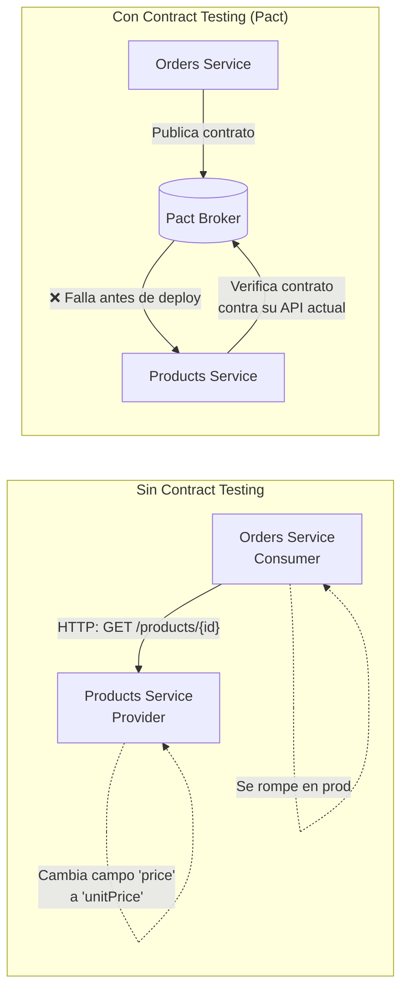

# 03-08 — Testing Strategy: Cobertura Inteligente, No Cobertura Máxima

> **Prerequisito:** [03-04-clean-architecture.md](./03-04-clean-architecture.md) — Clean Architecture separa el dominio de la infraestructura. Esa separación es lo que hace posible testear la lógica de negocio de forma aislada, rápida y sin base de datos. Sin esa separación, todos tus tests terminan siendo tests de integración aunque quieras que sean tests unitarios.
>
> **Por qué este archivo importa en entrevistas Staff:**
> La mayoría de developers escribe tests. Pocos tienen un framework mental de cuándo cada tipo de test agrega valor real versus cuándo agrega overhead de mantenimiento sin confianza proporcional. En una entrevista Staff, la pregunta no es "¿escribes tests?" — es "¿cómo decides qué testear, con qué tipo de test, y cómo mides que tu estrategia está funcionando?"
>
> **🎯 Recurso Pluralsight:** Path **"Testing .NET Applications"** — abrirlo después de terminar este archivo. El módulo sobre integration testing con WebApplicationFactory y el módulo sobre TestContainers son especialmente relevantes para lo que cubre este archivo.

---

## Sección 1 — La pirámide de testing y su significado real

La pirámide de testing es el modelo mental más importante para estructurar una estrategia de tests. La mayoría de developers conoce el diagrama. Pocos entienden qué dice realmente.

```mermaid
pyramid
```

```
                /\
               /  \
              / E2E \          ← pocos, lentos, costosos, máxima confianza end-to-end
             /────────\
            /Integration\      ← moderados, validan contratos entre capas y con infraestructura
           /─────────────\
          /   Unit Tests   \   ← muchos, rápidos, baratos, validan lógica de negocio aislada
         /─────────────────\
```

**Lo que dice la pirámide:** La distribución de tu suite de tests debe reflejar el costo de cada tipo. Unit tests son baratos de escribir, baratos de ejecutar, y fáciles de mantener — deben ser la mayoría. Integration tests son más lentos y más frágiles — moderados. E2E tests son lentos, frágiles, y costosos de mantener — pocos, enfocados en los flujos más críticos del sistema.

**Lo que NO dice la pirámide:** que solo deberías tener unit tests. La pirámide habla de proporción y estrategia, no de exclusividad.

### El anti-patrón: la pirámide invertida (el cono de helado)

```
         /─────────────────\
        /   E2E / Manual    \   ← muchos, lentísimos, frágiles
       /────────────────────\
      /    Integration       \  ← moderados
     /──────────────────────\
    /  Unit Tests (pocos)    \  ← insuficientes
   /──────────────────────────\
```

Este es el estado de muchos proyectos legacy: pocos unit tests porque "la lógica es simple", muchos tests de UI o E2E como "tests reales". El costo: la suite tarda 30 minutos en correr, un cambio pequeño rompe 20 tests frágiles, y el equipo empieza a ignorar los tests.

### La alternativa moderna: Testing Honeycomb

Para sistemas distribuidos (microservicios), la pirámide clásica no aplica perfectamente. El modelo **Testing Honeycomb** (Spotify Engineering) propone una distribución diferente:

- **Tests de integración de servicio** como el centro — testean el servicio completo incluyendo su BD, pero sin depender de otros servicios
- **Unit tests** para lógica de dominio compleja
- **Pocos E2E** para validar los contratos entre servicios

La intuición: en microservicios, el mayor riesgo no es la lógica interna (que puede testearse con units) ni el sistema completo (demasiado caro de testear end-to-end), sino los **contratos entre servicios**. Ahí es donde las cosas se rompen en producción.

---

## Sección 2 — Unit Tests: qué testear y qué no

Un error común: creer que "cobertura del 80%" es el objetivo. El número de cobertura de código no mide la confianza que dan tus tests — mide qué líneas se ejecutaron. Puedes tener 90% de cobertura con tests que no verifican nada útil.

**El criterio correcto:** ¿Si este código tuviera un bug, ¿este test fallaría?

### Qué SÍ testear con unit tests

```
✅ Lógica de dominio pura — métodos en Entities y Value Objects
✅ Use Cases / Command Handlers con dependencias mockeadas
✅ Algoritmos y transformaciones de datos no triviales
✅ FluentValidation validators (reglas de negocio en validadores)
✅ Casos borde: valores null, listas vacías, límites de negocio
✅ Caminos de error de la lógica de negocio
```

### Qué NO testear con unit tests

```
❌ Código que solo delega (un método que llama a otro sin lógica)
❌ Configuración de DI — eso es un integration test
❌ Framework code: controllers básicos sin lógica de negocio
❌ Getters y setters triviales de propiedades
❌ Queries de EF Core — testear el ORM, no tu código
```

La regla: si el "test" que escribirías es básicamente una copia 1:1 de la implementación, no agrega valor. Solo agrega overhead de mantenimiento.

### Setup en .NET: xUnit, Moq y FluentAssertions

```csharp
// ─── El handler a testear ──────────────────────────────────────────────────────
public class CreateOrderCommandHandler : IRequestHandler<CreateOrderCommand, Guid>
{
    private readonly IOrderRepository _repository;
    private readonly IUnitOfWork _unitOfWork;
    private readonly IDateTimeProvider _dateTime;

    public CreateOrderCommandHandler(
        IOrderRepository repository,
        IUnitOfWork unitOfWork,
        IDateTimeProvider dateTime)
    {
        _repository = repository;
        _unitOfWork = unitOfWork;
        _dateTime = dateTime;
    }

    public async Task<Guid> Handle(CreateOrderCommand command, CancellationToken ct)
    {
        if (!command.Items.Any())
            throw new DomainException("Order must contain at least one item");

        var order = Order.Create(
            command.CustomerId,
            command.Items,
            _dateTime.UtcNow);

        await _repository.SaveAsync(order, ct);
        await _unitOfWork.CommitAsync(ct);

        return order.Id.Value;
    }
}

// ─── Tests del handler ────────────────────────────────────────────────────────
public class CreateOrderCommandHandlerTests
{
    private readonly Mock<IOrderRepository> _repositoryMock;
    private readonly Mock<IUnitOfWork> _unitOfWorkMock;
    private readonly Mock<IDateTimeProvider> _dateTimeMock;
    private readonly CreateOrderCommandHandler _handler;

    // Constructor = Arrange compartido (xUnit crea una instancia por test)
    public CreateOrderCommandHandlerTests()
    {
        _repositoryMock = new Mock<IOrderRepository>();
        _unitOfWorkMock = new Mock<IUnitOfWork>();
        _dateTimeMock = new Mock<IDateTimeProvider>();
        _dateTimeMock.Setup(d => d.UtcNow).Returns(new DateTimeOffset(2026, 1, 15, 0, 0, 0, TimeSpan.Zero));

        _handler = new CreateOrderCommandHandler(
            _repositoryMock.Object,
            _unitOfWorkMock.Object,
            _dateTimeMock.Object);
    }

    [Fact]
    public async Task Handle_ValidCommand_SavesOrderAndReturnsId()
    {
        // Arrange
        Order? capturedOrder = null;
        _repositoryMock
            .Setup(r => r.SaveAsync(It.IsAny<Order>(), It.IsAny<CancellationToken>()))
            .Callback<Order, CancellationToken>((order, _) => capturedOrder = order);

        var command = new CreateOrderCommand(
            CustomerId: new CustomerId(Guid.NewGuid()),
            Items: new[]
            {
                new OrderItemDto(
                    ProductId: new ProductId(Guid.NewGuid()),
                    Quantity: 2,
                    Price: new Money(50m, "USD"))
            });

        // Act
        var result = await _handler.Handle(command, CancellationToken.None);

        // Assert — FluentAssertions hace los mensajes de error legibles
        result.Should().NotBeEmpty();

        capturedOrder.Should().NotBeNull();
        capturedOrder!.Items.Should().HaveCount(1);
        capturedOrder.Total.Amount.Should().Be(100m); // 2 * 50 = 100

        // Verifica que las dependencias se llamaron exactamente las veces esperadas
        _repositoryMock.Verify(
            r => r.SaveAsync(It.IsAny<Order>(), It.IsAny<CancellationToken>()),
            Times.Once);
        _unitOfWorkMock.Verify(
            u => u.CommitAsync(It.IsAny<CancellationToken>()),
            Times.Once);
    }

    [Fact]
    public async Task Handle_EmptyItemsList_ThrowsDomainException()
    {
        // Arrange
        var command = new CreateOrderCommand(
            CustomerId: new CustomerId(Guid.NewGuid()),
            Items: Array.Empty<OrderItemDto>()); // Caso borde: lista vacía

        // Act
        var act = () => _handler.Handle(command, CancellationToken.None);

        // Assert — FluentAssertions para excepciones es más expresivo que Assert.ThrowsAsync
        await act.Should().ThrowAsync<DomainException>()
            .WithMessage("*at least one item*");

        // Verificar que el repositorio NO se llamó — no se guardó nada
        _repositoryMock.Verify(
            r => r.SaveAsync(It.IsAny<Order>(), It.IsAny<CancellationToken>()),
            Times.Never);
    }

    [Theory]
    [InlineData(0)]
    [InlineData(-1)]
    [InlineData(-100)]
    public async Task Handle_InvalidQuantity_ThrowsDomainException(int invalidQuantity)
    {
        // Theory: el mismo test con múltiples inputs — evita duplicación de tests
        var command = new CreateOrderCommand(
            CustomerId: new CustomerId(Guid.NewGuid()),
            Items: new[]
            {
                new OrderItemDto(
                    ProductId: new ProductId(Guid.NewGuid()),
                    Quantity: invalidQuantity, // ← el valor que cambia
                    Price: new Money(50m, "USD"))
            });

        var act = () => _handler.Handle(command, CancellationToken.None);
        await act.Should().ThrowAsync<DomainException>();
    }
}
```

### Cómo nombrar los tests: el patrón que funciona

Un buen nombre de test es documentación ejecutable — alguien que lea el nombre debe entender exactamente qué comportamiento está verificando:

```
// Patrón: {Método o escenario}_{Condición}_{ResultadoEsperado}

Handle_ValidCommand_SavesOrderAndReturnsId       ✅
Handle_EmptyItemsList_ThrowsDomainException      ✅
Handle_CustomerNotFound_ReturnsNotFoundError     ✅

// ❌ Nombres que no dicen nada
TestCreateOrder()
HandleTest1()
ShouldWork()
```

---

## Sección 3 — Integration Tests: WebApplicationFactory y TestContainers

Los unit tests validan la lógica aislada. Los integration tests validan que las capas funcionan juntas correctamente — que tu controller recibe la request, la pasa al handler, el handler ejecuta la lógica, y la respuesta tiene el formato correcto.

### WebApplicationFactory: el stack completo sin deployar

```csharp
// WebApplicationFactory levanta tu aplicación ASP.NET Core completa en memoria
// Puedes reemplazar servicios específicos para controlar el entorno de test
public class OrdersIntegrationTests
    : IClassFixture<WebApplicationFactory<Program>>
{
    private readonly HttpClient _client;

    public OrdersIntegrationTests(WebApplicationFactory<Program> factory)
    {
        _client = factory
            .WithWebHostBuilder(builder =>
            {
                builder.ConfigureServices(services =>
                {
                    // Reemplaza la BD real con InMemory para estos tests
                    // (útil para tests de integración de capa API/Controller)
                    var descriptor = services.SingleOrDefault(
                        d => d.ServiceType == typeof(DbContextOptions<AppDbContext>));
                    if (descriptor is not null)
                        services.Remove(descriptor);

                    services.AddDbContext<AppDbContext>(options =>
                        options.UseInMemoryDatabase($"TestDb_{Guid.NewGuid()}"));

                    // GUID aleatorio por instancia — tests paralelos no comparten estado
                });
            })
            .CreateClient();
    }

    [Fact]
    public async Task POST_Orders_ValidRequest_Returns201WithOrderId()
    {
        // Arrange — request real en JSON
        var request = new CreateOrderRequest(
            CustomerId: Guid.NewGuid(),
            Items: new[]
            {
                new OrderItemRequest(
                    ProductId: Guid.NewGuid(),
                    Quantity: 1,
                    UnitPrice: 29.99m)
            });

        // Act — HTTP real contra el stack completo levantado en memoria
        var response = await _client.PostAsJsonAsync("/api/v1/orders", request);

        // Assert — valida el contrato HTTP completo
        response.StatusCode.Should().Be(HttpStatusCode.Created);
        response.Headers.Location.Should().NotBeNull(); // CreatedAtAction genera Location header

        var body = await response.Content.ReadFromJsonAsync<OrderResponse>();
        body.Should().NotBeNull();
        body!.Id.Should().NotBeEmpty();
        body.Status.Should().Be("Pending");
    }

    [Fact]
    public async Task GET_Orders_NonExistentId_Returns404WithProblemDetails()
    {
        var nonExistentId = Guid.NewGuid();
        var response = await _client.GetAsync($"/api/v1/orders/{nonExistentId}");

        response.StatusCode.Should().Be(HttpStatusCode.NotFound);

        // Valida que el error sigue el estándar ProblemDetails (RFC 9457)
        var problem = await response.Content.ReadFromJsonAsync<ProblemDetails>();
        problem.Should().NotBeNull();
        problem!.Status.Should().Be(404);
    }
}
```

### TestContainers: la BD real en tests

⚠️ **El problema con `UseInMemoryDatabase` para tests de repositorio:**

La BD InMemory de EF Core no respeta:
- Constraints de FK (puedes guardar una Order sin Customer existente)
- Comportamiento de transacciones
- Queries SQL específicas (funciones de fecha, tipos específicos de SQL Server)
- Índices y comportamiento de performance

Un test que pasa con InMemory puede fallar silenciosamente en producción con SQL Server real. Para tests de repositorio, necesitas la BD real.

**TestContainers resuelve esto:** levanta un container Docker de SQL Server real para cada test run, ejecuta las migrations, corre los tests, y destruye el container. Cero fricción con la infraestructura compartida.

```csharp
// Requiere: dotnet add package Testcontainers.MsSql
// Requiere: Docker corriendo localmente

public class OrderRepositoryIntegrationTests : IAsyncLifetime
{
    private MsSqlContainer _sqlContainer = default!;
    private AppDbContext _context = default!;
    private SqlOrderRepository _repository = default!;

    // Se ejecuta una vez antes de todos los tests de esta clase
    public async Task InitializeAsync()
    {
        _sqlContainer = new MsSqlBuilder()
            .WithPassword("YourStrong!Passw0rd")
            .WithImage("mcr.microsoft.com/mssql/server:2022-latest")
            .Build();

        await _sqlContainer.StartAsync();

        var options = new DbContextOptionsBuilder<AppDbContext>()
            .UseSqlServer(_sqlContainer.GetConnectionString())
            .Options;

        _context = new AppDbContext(options);
        // Aplica migrations reales — valida que tus migrations están bien
        await _context.Database.MigrateAsync();

        _repository = new SqlOrderRepository(_context);
    }

    [Fact]
    public async Task SaveAsync_ValidOrder_PersistsWithAllRelations()
    {
        // Arrange — crea una orden real con items
        var customerId = new CustomerId(Guid.NewGuid());
        var order = Order.Create(
            customerId,
            new[]
            {
                new OrderItemDto(new ProductId(Guid.NewGuid()), 2, new Money(50m, "USD")),
                new OrderItemDto(new ProductId(Guid.NewGuid()), 1, new Money(30m, "USD"))
            },
            DateTimeOffset.UtcNow);

        // Act
        await _repository.SaveAsync(order, CancellationToken.None);
        await _context.SaveChangesAsync();

        // Limpia el context para forzar que la siguiente query vaya a la BD real
        _context.ChangeTracker.Clear();

        // Assert — verifica que los datos se guardaron y se pueden recuperar
        var retrieved = await _repository.GetByIdAsync(order.Id, CancellationToken.None);

        retrieved.Should().NotBeNull();
        retrieved!.Id.Should().Be(order.Id);
        retrieved.Items.Should().HaveCount(2);
        retrieved.Total.Amount.Should().Be(130m); // 2*50 + 1*30
    }

    [Fact]
    public async Task GetByCustomerId_MultipleOrders_ReturnsAllOrdersForCustomer()
    {
        var customerId = new CustomerId(Guid.NewGuid());
        var otherCustomerId = new CustomerId(Guid.NewGuid());

        // Guarda órdenes de dos clientes distintos
        await _repository.SaveAsync(CreateMinimalOrder(customerId), CancellationToken.None);
        await _repository.SaveAsync(CreateMinimalOrder(customerId), CancellationToken.None);
        await _repository.SaveAsync(CreateMinimalOrder(otherCustomerId), CancellationToken.None);
        await _context.SaveChangesAsync();
        _context.ChangeTracker.Clear();

        var orders = await _repository.GetByCustomerIdAsync(customerId, CancellationToken.None);

        // Solo debe retornar las 2 órdenes del customer correcto
        orders.Should().HaveCount(2);
        orders.Should().OnlyContain(o => o.CustomerId == customerId);
    }

    // Se ejecuta después de todos los tests — destruye el container
    public async Task DisposeAsync()
    {
        await _context.DisposeAsync();
        await _sqlContainer.DisposeAsync();
    }

    private Order CreateMinimalOrder(CustomerId customerId) =>
        Order.Create(
            customerId,
            new[] { new OrderItemDto(new ProductId(Guid.NewGuid()), 1, new Money(10m, "USD")) },
            DateTimeOffset.UtcNow);
}
```

### Custom WebApplicationFactory con TestContainers

Para integration tests completos del stack API + BD real:

```csharp
public class IntegrationTestFactory : WebApplicationFactory<Program>, IAsyncLifetime
{
    private readonly MsSqlContainer _sqlContainer = new MsSqlBuilder()
        .WithPassword("YourStrong!Passw0rd")
        .Build();

    public async Task InitializeAsync() => await _sqlContainer.StartAsync();

    protected override void ConfigureWebHost(IWebHostBuilder builder)
    {
        builder.ConfigureServices(services =>
        {
            // Reemplaza la connection string para apuntar al container de test
            services.RemoveAll(typeof(DbContextOptions<AppDbContext>));
            services.AddDbContext<AppDbContext>(options =>
                options.UseSqlServer(_sqlContainer.GetConnectionString()));
        });

        builder.UseEnvironment("Testing");
    }

    public new async Task DisposeAsync() => await _sqlContainer.DisposeAsync();
}

// Tests que usan la factory personalizada
public class OrdersFullStackTests : IClassFixture<IntegrationTestFactory>
{
    private readonly HttpClient _client;

    public OrdersFullStackTests(IntegrationTestFactory factory)
    {
        _client = factory.CreateClient();
    }

    // Aquí los tests tienen HTTP real + SQL Server real
}
```

---

## Sección 4 — Test-Driven Design: la testabilidad como señal de diseño

TDD (Test-Driven Development) se enseña frecuentemente como "escribe el test primero, luego el código". Eso es correcto, pero incompleto. La verdad más profunda: **TDD es una técnica de diseño que usa los tests como feedback**.

Cuando escribir un test es difícil, el problema no es el test — es el diseño del código que intentas testear.

### Las señales de diseño que te dan los tests

```csharp
// ❌ El test de setup es más largo que el test en sí
// → La clase tiene demasiadas dependencias. Violación de SRP.
var handler = new CreateOrderCommandHandler(
    repositoryMock.Object,
    unitOfWorkMock.Object,
    emailServiceMock.Object,
    inventoryServiceMock.Object,
    pricingServiceMock.Object,
    auditLogMock.Object,
    notificationMock.Object);
// 7 dependencias → señal de God Class. Refactorizar antes de continuar.

// ❌ El test requiere estado global para funcionar
// → Viola DIP. Dependencia implícita de estado compartido.
static int _orderCount = 0;
public static Order Create() => new Order(++_orderCount);
// Imposible testear de forma aislada.

// ❌ El test no puede mockear una dependencia clave
// → Viola DIP. La clase depende de la implementación concreta, no de la abstracción.
public class CreateOrderCommandHandler
{
    private readonly SqlOrderRepository _repository; // ← concreta, no interfaz
    // No se puede mockear SqlOrderRepository sin levantar una BD
}

// ✅ Código que se testea fácilmente = código bien diseñado
public class CreateOrderCommandHandler
{
    private readonly IOrderRepository _repository; // ← interfaz, mockeable
    private readonly IUnitOfWork _unitOfWork;       // ← 2 dependencias: enfocado
}
```

**La regla práctica:**
Si llevas 15 minutos intentando escribir el test y aún no sabes cómo mockar las dependencias — detente. No es un problema de testing. Es una señal de que el diseño tiene un problema. Usa esa fricción como información de diseño antes de proceder.

### El ciclo TDD en la práctica

```
Red → Green → Refactor

1. Red:    escribe el test que falla (define el comportamiento esperado)
2. Green:  escribe el mínimo código para que el test pase (no más)
3. Refactor: mejora el diseño con los tests como red de seguridad
```

El paso 3 es el que más se omite. Es también el más valioso: refactorizar código que ya funciona con una red de tests que verifica que no rompiste nada es fundamentalmente diferente y más seguro que refactorizar sin tests.

---

## Sección 5 — Contract Testing: para cuando los equipos evolucionan en paralelo

Cuando tienes microservicios que se llaman entre sí, los integration tests clásicos no detectan el problema más común en producción: el **Provider cambia su API** y el Consumer se rompe silenciosamente hasta que alguien encuentra el error en producción.



**Contract Testing (Pact)** verifica que el contrato entre consumidor y proveedor se mantiene sin necesitar que ambos estén corriendo simultáneamente:

1. El **Consumer** escribe tests que definen qué espera de la API del Provider y generan un archivo de contrato (el "pact")
2. El **Provider** toma ese contrato y verifica que su API actual lo cumple — sin hacer HTTP real
3. Si el Provider cambia algo que rompe el contrato, el test falla **antes del deploy**

**Cuándo tiene sentido implementar Contract Testing:**
- Múltiples equipos que desarrollan en paralelo con APIs compartidas
- Frequent deploys independientes entre servicios
- Historial de bugs de integración entre servicios

**Cuándo NO tiene sentido:**
- Un solo equipo dueño de todos los servicios
- Pocos servicios con cambios coordinados
- El overhead de mantener el Pact Broker no está justificado por el número de contratos

---

## Sección 6 — Tabla comparativa y cuándo usar cada tipo de test

| Dimensión | Unit Tests | Integration Tests | E2E Tests |
|---|---|---|---|
| **Velocidad de ejecución** | Milisegundos | Segundos (con TestContainers) | Minutos |
| **Costo de escritura** | Bajo | Medio | Alto |
| **Costo de mantenimiento** | Bajo | Medio | Alto (frágiles a cambios de UI/infra) |
| **Confianza en lógica de dominio** | ✅✅ Alta | ✅ Media | ⚠️ Indirecta |
| **Confianza en integración con BD** | ❌ No aplica | ✅✅ Alta | ✅ Alta |
| **Confianza end-to-end** | ❌ No aplica | ⚠️ Parcial | ✅✅ Máxima |
| **Detecta bugs de configuración** | ❌ | ⚠️ Parcial | ✅ |
| **Paralelización** | ✅✅ Fácil | ✅ Con cuidado | ⚠️ Difícil |
| **Feedback inmediato al developer** | ✅✅ | ✅ | ❌ Demasiado lento |
| **Cuándo usar** | Siempre para lógica de negocio | Repositorios, APIs, integraciones externas | Flujos críticos del negocio |

**La distribución pragmática recomendada:**
- ~70% unit tests (lógica de dominio, handlers, validators)
- ~25% integration tests (repositorios con TestContainers, stack HTTP con WebApplicationFactory)
- ~5% E2E tests (happy path de los 2-3 flujos más críticos del negocio: login, compra, pago)

---

## Checklist de salida

Antes de avanzar al siguiente archivo, confirma:

- [ ] Puedo explicar la pirámide de testing y por qué la inversión de la pirámide es un anti-patrón con consecuencias concretas
- [ ] Puedo identificar qué código debe testearse con unit tests y qué código no agrega valor testeado de esa forma
- [ ] Puedo escribir un unit test con xUnit, Moq, y FluentAssertions para un MediatR Handler incluyendo verificación de dependencias (Times.Once)
- [ ] Puedo configurar WebApplicationFactory con servicios reemplazados para integration tests de ASP.NET Core
- [ ] Entiendo por qué `UseInMemoryDatabase` no es suficiente para tests de repositorio y cómo TestContainers soluciona eso
- [ ] Puedo explicar qué señales en los tests indican un problema de diseño en el código (no en el test)
- [ ] Puedo explicar qué problema resuelve Contract Testing y en qué contexto tiene sentido implementarlo

**🎯 Recursos para profundizar (consumir después de este archivo):**
- Pluralsight — "Testing .NET Applications" path (especialmente módulos de WebApplicationFactory y TestContainers)
- Martin Fowler — "Test Pyramid" (artículo en martinfowler.com, corto y autoritativo)
- Testcontainers para .NET — documentación oficial (testcontainers.com/guides/getting-started-with-testcontainers-for-dotnet)

---

> **🔗 Siguiente archivo:** [03-09-refactoring-y-adr.md](./03-09-refactoring-y-adr.md)
> Los tests que escribiste son la red de seguridad que hace posible el refactoring.
> El siguiente archivo conecta esa red de seguridad con el framework para manejar
> deuda técnica sistemáticamente y documentar decisiones arquitectónicas.
