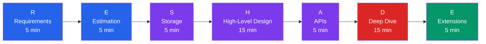
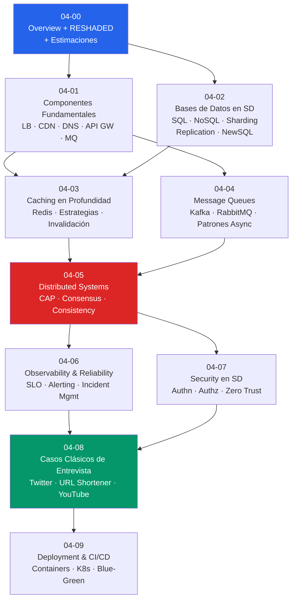

# 04-00 — System Design: Framework Mental y Estimaciones

> **Prerequisito:** [03-09-refactoring-y-adr.md](./03-09-refactoring-y-adr.md) — El Módulo 3 te enseñó a diseñar *dentro* de un servicio. Este módulo te enseña a diseñar *entre* servicios: cómo se dividen, cómo se comunican, cómo escalan, y cómo fallan con gracia.
>
> **Por qué este módulo decide entrevistas Staff:**
> System Design es el filtro más brutal del proceso de entrevistas Senior/Staff. No porque sea difícil de aprender — sino porque la mayoría de los candidatos llegan pensando que saben hacerlo cuando en realidad solo saben dibujar cajas. Un entrevistador FAANG o de empresa tech sólida detecta en los primeros 3 minutos si el candidato tiene el modelo mental correcto o si está improvisando.
>
> Este módulo no te enseña respuestas memorizadas — te enseña el proceso de razonamiento que genera respuestas correctas ante cualquier pregunta que no hayas visto antes.
>
> **🎯 Recurso principal del módulo:** [ByteByteGo](https://bytebytego.com/) — newsletter semanal gratuita + YouTube. Es el recurso visual más denso y actualizado de System Design en 2026. Úsalo como compañero del módulo, no como sustituto. Cada sección de este módulo indica qué leer/ver en ByteByteGo. **Libro base:** *Designing Data-Intensive Applications* (DDIA) de Martin Kleppmann — el libro más citado en entrevistas de distributed systems. No necesitas leerlo completo ahora; cada archivo del módulo señala los capítulos relevantes.

---

## Sección 1 — Qué es System Design y por qué es diferente al Módulo 3

### La distinción que más confunde a candidatos Senior

El Módulo 3 (Software Design) te enseñó a diseñar bien el interior de un sistema:
- Cómo estructurar el código con Clean Architecture
- Cómo modelar el dominio con DDD
- Cómo separar reads de writes con CQRS
- Cómo diseñar APIs limpias

Todo eso es **Low-Level Design (LLD)**: el arte de estructurar código dentro de límites ya definidos.

System Design es **High-Level Design (HLD)**: el arte de definir esos límites en primer lugar.

La diferencia no es solo de escala — es de tipo de problema:

| Dimensión | LLD (Módulo 3) | HLD (Módulo 4) |
|---|---|---|
| Pregunta central | ¿Cómo estructura este servicio su código? | ¿Cómo divido el sistema en servicios? |
| Unidad de análisis | Clases, métodos, módulos | Servicios, bases de datos, redes |
| Preocupación principal | Mantenibilidad, testabilidad | Escalabilidad, disponibilidad, consistencia |
| Falla típica | Bug de lógica, deuda técnica | Cascading failure, split-brain, data loss |
| Tiempo de impacto | Semanas a meses de refactoring | Años de infraestructura inamovible |

La última fila es la más importante. **Las decisiones de HLD son las más costosas de revertir.** Cambiar una clase de C# tarda horas. Cambiar de SQL a NoSQL cuando ya tienes 50M de registros puede tomar 6 meses y poner en riesgo el negocio.

### System Design no es "dibujar cajas"

El error más común de candidatos Senior que llegan sin preparación de System Design: responden con una arquitectura de microservicios, una base de datos, y un load balancer — y asumen que eso es suficiente.

No lo es. Lo que busca un entrevistador Staff no es el *diagrama* — es el *razonamiento* detrás de cada decisión:

- ¿Por qué eligiste SQL y no NoSQL aquí?
- ¿Qué pasa con tus datos cuando el servicio de pagos falla?
- Si el tráfico se multiplica por 10 mañana, ¿qué componente colapsa primero?
- ¿Cómo garantizas que un usuario no sea cobrado dos veces si hay un timeout?

System Design es **tomar decisiones de arquitectura con información incompleta, constraints contradictorios, y consecuencias que viven en producción por años**. El proceso de razonamiento es el producto — el diagrama es solo el artefacto.

---

## Sección 2 — El Framework RESHADED para Entrevistas de System Design

RESHADED es un framework de proceso — una secuencia que garantiza que cubres todas las dimensiones relevantes de un diseño en el tiempo disponible (típicamente 45-60 minutos). No es un template rígido sino un checklist mental.



---

### **R — Requirements (5 minutos)**

Este es el paso que los candidatos más subestiman y donde más se pierden puntos.

No empieces a diseñar. Primero, pregunta. Un entrevistador que te da una pregunta vaga ("diseña Twitter") lo hace intencionalmente — quiere ver si puedes clarificar ambigüedad antes de comprometerte con una arquitectura.

**Functional Requirements — qué hace el sistema:**
- ¿Qué acciones puede hacer un usuario?
- ¿Cuáles son los flujos más críticos? (el "happy path" principal)
- ¿Hay roles diferentes? (usuario regular vs. admin vs. anunciante)

**Non-Functional Requirements — cómo lo hace:**
- **Escala:** ¿Cuántos usuarios activos diarios (DAU)? ¿Usuarios concurrentes?
- **Latencia:** ¿Cuál es la latencia aceptable (p99)? ¿200ms? ¿2s?
- **Disponibilidad:** ¿Necesitamos 99.9% (8.7 horas de downtime/año) o 99.99% (52 minutos)?
- **Consistencia:** ¿Es aceptable eventual consistency o necesitamos strong consistency?
- **Durabilidad:** Si el sistema cae, ¿cuántos datos podemos perder? (RPO — Recovery Point Objective)
- **Geografía:** ¿Es un sistema regional o global?

**Las preguntas que SIEMPRE debes hacer:**

```
"¿Cuántos usuarios activos diarios esperamos?"
"¿Cuál es el ratio read/write del sistema?"
"¿El sistema necesita ser global o es single-region?"
"¿Cuánta consistencia necesitamos? ¿Es aceptable que un usuario vea datos ligeramente desactualizados?"
"¿Hay requerimientos de compliance o regulatorios? (GDPR, PCI, SOC2)"
```

⚠️ **Error crítico:** Diseñar sin preguntar. Si asumes incorrectamente que el sistema es read-heavy cuando es write-heavy, toda tu arquitectura de caché y replication está mal orientada desde el principio.

---

### **E — Estimation (5 minutos)**

*Ver Sección 3 — Back-of-the-Envelope Calculations (este paso merece sección propia por su importancia).*

El objetivo no es precisión — es **orden de magnitud**. La diferencia entre 1,000 RPS y 100,000 RPS cambia completamente la arquitectura. La diferencia entre 1,000 y 1,200 RPS no cambia nada.

---

### **S — Storage (parte del diseño core)**

Antes de dibujar el HLD, decide qué datos necesitas guardar y en qué tipo de almacenamiento:

- ¿Cuáles son las entidades principales del sistema?
- ¿Cuánto espacio necesitas (de la estimación)?
- ¿Qué garantías de consistencia necesitas?
- ¿Cuál es el patrón de acceso dominante? (point lookups, range queries, full-text search)

La decisión SQL vs. NoSQL sale de aquí — no es una preferencia personal, es consecuencia de los datos y el patrón de acceso. Ver [04-02-bases-de-datos-system-design.md](./04-02-bases-de-datos-system-design.md).

---

### **H — High-Level Design (10-15 minutos)**

El diagrama principal. Componentes principales y cómo se conectan.

**Lo que debe aparecer en un HLD de nivel Staff:**
- Clientes (web, mobile, third-party)
- DNS + CDN (si hay contenido estático o tráfico global)
- Load Balancer / API Gateway
- Servicios principales (pueden ser monolito o microservicios — justifica)
- Base(s) de datos con su tipo explícito
- Cache (si aplica)
- Message Queue (si hay procesamiento asíncrono)
- Workers/consumers

**Lo que NO debe aparecer todavía:**
- Detalles de implementación internos de cada servicio
- Configuraciones específicas de infraestructura
- Edge cases — esos van al Deep Dive

---

### **A — APIs (parte del diseño core)**

Define las interfaces principales entre componentes. No necesitas especificar cada endpoint — solo los que revelan decisiones de diseño importantes:

```
POST /api/v1/tweets          → crear tweet
GET  /api/v1/feed/{userId}   → obtener timeline
GET  /api/v1/tweets/{id}     → obtener tweet específico
```

Para APIs internas entre servicios: ¿REST o gRPC o mensajería async? Cada elección tiene implicaciones de latencia, coupling, y garantías de entrega.

---

### **D — Deep Dive (10-15 minutos)**

Aquí se decide si el candidato es Senior o Staff.

El entrevistador elige 1-2 componentes para profundizar. Típicamente los más difíciles: el mecanismo de timeline, el sistema de notificaciones, la consistencia de pagos, el sharding de la base de datos.

**Lo que se evalúa en Deep Dive:**
- ¿Conoces los trade-offs reales de cada alternativa?
- ¿Puedes razonar sobre fallos parciales?
- ¿Entiendes las implicaciones de escala de tu decisión?
- ¿Tienes intuición sobre los bottlenecks del sistema?

Un candidato Senior describe *cómo funciona* el componente.
Un candidato Staff describe *qué pasa cuando falla* y *cómo evoluciona con 10x más carga*.

---

### **E — Extensions (si hay tiempo)**

Evolución del sistema:
- ¿Cómo agregas autenticación federada (OAuth)?
- ¿Cómo expandes a múltiples regiones?
- ¿Cómo agregas machine learning para personalización?

Muestra que piensas el sistema como algo que vive y evoluciona — no como una foto estática.

---

## Sección 3 — Back-of-the-Envelope Calculations

Esta es la habilidad con mayor gap entre candidatos promedio y candidatos Staff. Es también la más entrenable.

Un Staff Engineer puede estimar órdenes de magnitud en voz alta, llegar a conclusiones de diseño concretas, y seguir avanzando — sin calculadora, sin datos perfectos, sin pausas largas.

### Las Latency Numbers que debes memorizar (2026)

No las memorices como datos — memoriza la *relación entre ellas*. Eso es lo que te permite razonar.

```
L1 cache reference:              ~0.5 ns
L2 cache reference:              ~7 ns
Branch misprediction:            ~5 ns
Main memory reference:           ~100 ns
─────────────────────────────────────────
Mutex lock/unlock:               ~25 ns
Compress 1KB (snappy):          ~3 μs
Send 1KB over 1Gbps network:    ~10 μs
Read 4KB from SSD:              ~150 μs       ← SSD es ~1,500x más lento que RAM
─────────────────────────────────────────
Round-trip within same DC:       ~500 μs
Read 1MB sequentially from SSD: ~1 ms
HDD disk seek:                   ~10 ms        ← HDD es ~70x más lento que SSD
Send packet US → Europe → US:   ~150 ms
─────────────────────────────────────────
```

**Las conclusiones que salen de estos números (para entrevistas):**
1. **Redis/Memcached** (in-memory) es 1,500x más rápido que leer de SSD → el argumento para caché
2. **SSD** es 70x más rápido que HDD → usar SSD para bases de datos en producción no es lujo
3. **Round-trip dentro del datacenter** (~0.5ms) es 300x más rápido que cross-DC → microservices en el mismo DC son viables para latencia baja
4. **Cross-continent** (150ms) hace imposible strong consistency global sin pagar un costo enorme en latencia

### Framework de Estimación para Entrevistas

**Paso 1 — Estimar usuarios y tráfico:**

```
Sistema masivo (Twitter/YouTube scale): 300M DAU
Sistema grande (LinkedIn/Reddit scale):  50M DAU
Sistema mediano:                         10M DAU
Sistema pequeño:                          1M DAU
```

**Conversión DAU → RPS (Requests Per Second):**

```
Regla general: si cada usuario hace N acciones por día
RPS promedio = DAU × N / 86,400 segundos

Ejemplo:
10M DAU × 10 acciones/día / 86,400 s = ~1,157 RPS promedio
Pico ≈ 3-5x promedio = ~3,500 - 5,800 RPS en pico
```

⚠️ **Siempre dimensiona para el pico, no para el promedio.** Tu sistema no colapsa en promedio — colapsa en pico.

**Paso 2 — Estimar almacenamiento:**

```
Objeto de texto (tweet, post):            ~1 KB
Perfil de usuario (metadata):             ~1 KB
Imagen miniatura (thumbnail):            ~300 KB
Imagen tamaño completo (foto):            ~3 MB
Video 1 minuto (comprimido 720p):        ~50 MB
```

**Paso 3 — Estimar bandwidth:**

```
Si read:write ratio = 10:1 y tienes 1,000 writes/s:
→ 10,000 reads/s
→ Si cada read devuelve 1 KB: 10,000 KB/s = 10 MB/s outbound
```

### Ejemplo Completo: URL Shortener (el caso clásico de entrevista)

**Pregunta del entrevistador:** "Diseña un sistema como bit.ly"

**Tu proceso de estimación en voz alta:**

```
Funciones principales:
1. Crear URL corta (write)
2. Redirigir URL corta → URL larga (read)

Escala estimada:
- 100M DAU
- Ratio read:write = 100:1 (muchas más visitas que creaciones)

Tráfico:
- Write: 100M users × 1 URL nueva/día / 86,400 = ~1,160 writes/s
- Read: 1,160 × 100 = 116,000 reads/s

Almacenamiento:
- Cada URL: ~500 bytes (URL larga hasta 512 chars + metadata)
- 1,160 writes/s × 86,400 s/día = ~100M URLs/día
- Retención 5 años: 100M × 365 × 5 × 500B = ~182 TB

Bandwidth:
- Writes: 1,160 writes/s × 500B = ~580 KB/s (trivial)
- Reads: 116,000 reads/s × 500B = ~58 MB/s
```

**Conclusiones de diseño que salen de los números:**

1. **116,000 reads/s** → Necesitamos caché agresivo (Redis) — una sola base de datos no puede manejar esto sin caché
2. **182 TB en 5 años** → Necesitamos sharding o una base de datos distribuida para el storage
3. **Ratio 100:1** → El sistema es extremadamente read-heavy → optimizar el path de lectura es la prioridad
4. **La llave (short code) debe ser de 7 chars** → 62^7 = ~3.5 trillones de URLs posibles, suficiente para décadas

Eso es razonamiento de System Design a nivel Staff: cada número genera una decisión de arquitectura.

---

## Sección 4 — Mapa del Módulo 4



**Orden de estudio recomendado:**
1. **04-00 → 04-01 → 04-02** (esta sesión): Framework + componentes + bases de datos → base para todo lo demás
2. **04-03 → 04-04**: Caching y mensajería → los dos sistemas de soporte más comunes en HLD
3. **04-05**: Distributed systems → el tema más denso y el más evaluado en Staff
4. **04-06 → 04-07**: Observabilidad y seguridad → completan la visión de producción
5. **04-08**: Casos clásicos → práctica aplicada con el módulo completo
6. **04-09**: Deployment → cierre del módulo

**Tiempo estimado:** 8-10 semanas (puede solaparse con Módulo 2 de algoritmos)

---

## Sección 5 — Checklist de Salida del Módulo

Criterios medibles. Si no puedes hacer esto al terminar el módulo, no está terminado:

**Framework y proceso:**
- [ ] Puedo aplicar RESHADED en cualquier pregunta de diseño sin consultarlo
- [ ] Puedo clarificar requirements ambiguos con preguntas específicas en menos de 5 minutos
- [ ] Puedo hacer estimaciones de tráfico, storage, y bandwidth en voz alta sin calculadora

**Componentes (de memoria, con trade-offs):**
- [ ] Puedo explicar la diferencia entre L4 y L7 load balancer y cuándo usar cada uno
- [ ] Puedo explicar cómo funciona un CDN internamente (push vs. pull, cache invalidation)
- [ ] Puedo diseñar un API Gateway con rate limiting, auth centralizada, y routing
- [ ] Puedo elegir entre SQL y NoSQL con criterios técnicos concretos, no preferencias

**Bases de datos:**
- [ ] Puedo explicar master-replica replication, los problemas de replica lag, y cómo hacer failover
- [ ] Puedo explicar consistent hashing y por qué resuelve el problema del resharding
- [ ] Puedo comparar los 4 tipos de NoSQL (document, key-value, wide column, graph) con casos de uso

**Distributed systems:**
- [ ] Puedo explicar el teorema CAP y sus implicaciones prácticas en diseño de sistemas
- [ ] Puedo explicar cuándo usar Kafka vs. RabbitMQ y las garantías de entrega de cada uno
- [ ] Puedo diseñar un sistema con eventual consistency y explicar por qué es aceptable

**Práctica de entrevista:**
- [ ] Puedo diseñar Twitter Feed en 45 minutos con estimaciones, HLD completo, y análisis de trade-offs
- [ ] Puedo diseñar un URL Shortener end-to-end en 30 minutos
- [ ] Puedo diseñar un sistema de notificaciones push a escala de 50M usuarios

---

> **Siguiente paso:** [04-01-componentes-fundamentales.md](./04-01-componentes-fundamentales.md) — Los bloques de construcción que aparecen en casi todo diseño de sistema de producción.
>
> **🎯 ByteByteGo:** Antes de continuar, lee el artículo "A Framework For System Design Interviews" en bytebytego.com. Refuerza el framework RESHADED con ejemplos visuales adicionales.
