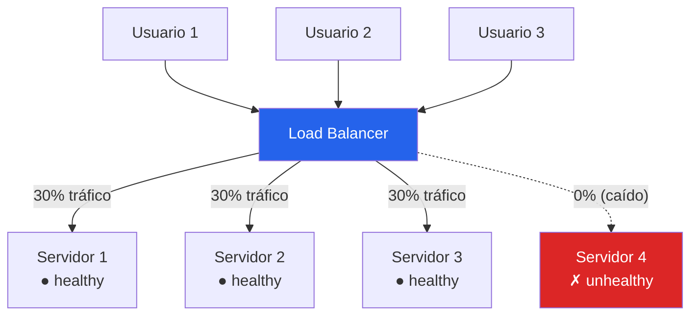
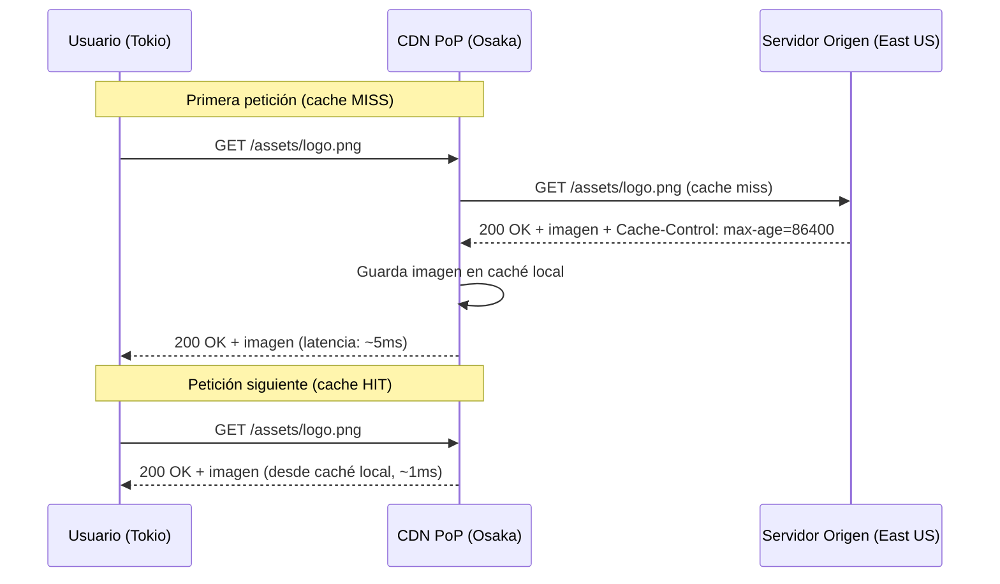
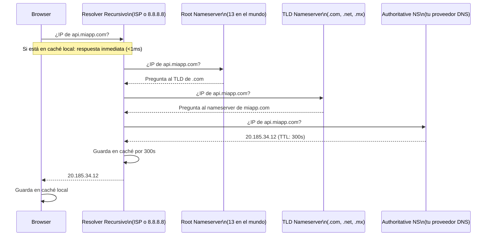
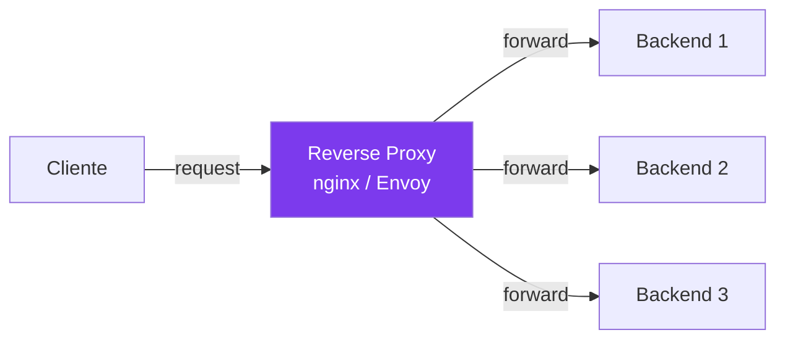
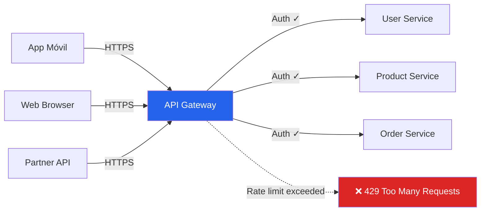
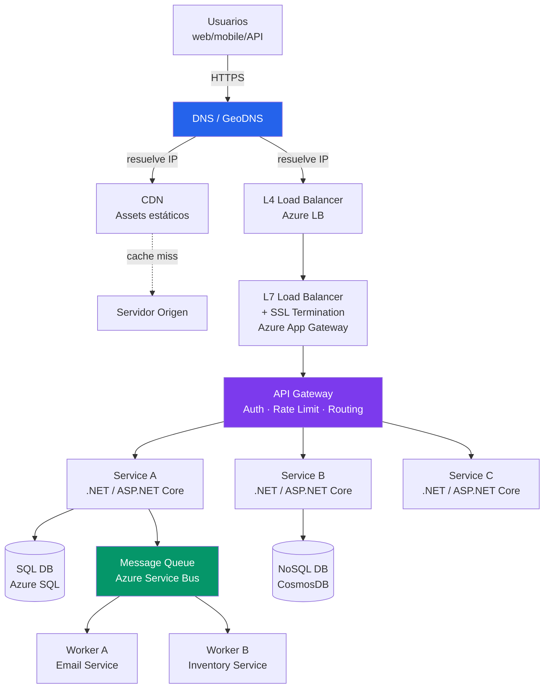

# 04-01 — Componentes Fundamentales de System Design

> **Prerequisito:** [04-00-overview.md](./04-00-overview.md) — Framework RESHADED y estimaciones. Este archivo asume que ya sabes cómo abordar una entrevista de System Design. Aquí aprendes los bloques de construcción específicos.
>
> **Por qué este archivo existe:**
> En casi cualquier HLD que dibujes en una entrevista, van a aparecer estos componentes. Load Balancer, CDN, DNS, API Gateway, Message Queue — son el vocabulario de System Design. Puedes tener el diseño correcto conceptualmente y perder puntos si no sabes explicar cómo funciona cada componente internamente, cuándo usarlo, y cuándo NO usarlo.
>
> La diferencia entre un candidato Senior y uno Staff en esta sección no es si conocen los componentes — es si pueden razonar sobre sus trade-offs y explicar sus internals cuando el entrevistador pregunta "¿y cómo funciona eso por dentro?"

---

## Componente 1 — Load Balancer

### 1.1 Qué es y el problema que resuelve

**El problema:** Tienes un servidor web. A las 9am, cuando los usuarios entran a trabajar, llegan 10,000 requests simultáneos. Tu servidor solo puede manejar 2,000 con tiempo de respuesta aceptable. Resultado: timeouts, errores 503, usuarios que abandonen la aplicación.

**Solución naïve:** Poner un servidor más grande (vertical scaling). Funciona hasta un punto — y es caro, y tiene un techo.

**Solución real:** Poner múltiples servidores idénticos y distribuir el tráfico entre ellos (horizontal scaling). El Load Balancer es el componente que hace esa distribución.

Un Load Balancer tiene dos responsabilidades:
1. **Distribución de carga:** enviar cada request al servidor menos saturado
2. **Health checking:** detectar servidores caídos y sacarlos de rotación automáticamente



### 1.2 L4 vs L7 — La diferencia que más importa en entrevistas

Esta es la pregunta de seguimiento más frecuente después de mencionar un Load Balancer.

**L4 Load Balancer (Transport Layer):**

Opera en la capa de transporte TCP/UDP. Solo ve IPs y puertos — no puede leer el contenido del request HTTP.

- **Cómo decide a dónde mandar el tráfico:** IP de origen, puerto de destino, round robin sobre los backends
- **Ventaja:** extremadamente rápido — procesa paquetes sin leer su contenido
- **Desventaja:** no puede hacer decisiones basadas en el contenido del request
- **Cuándo usar:** tráfico no-HTTP (bases de datos TCP, UDP), cuando la latencia de routing es crítica (< 1ms), sistemas de trading de alta frecuencia

**L7 Load Balancer (Application Layer):**

Opera en la capa de aplicación HTTP/HTTPS. Puede leer headers, URLs, cookies, body.

- **Cómo decide:** contenido del request — puede rutear `/api/v1/users` a un servicio y `/api/v1/payments` a otro
- **Ventaja:** routing inteligente basado en contenido, SSL termination, manipulación de headers, logging de requests HTTP
- **Desventaja:** más lento que L4 (lee y parsea el request), más costoso de operar
- **Cuándo usar:** la gran mayoría de APIs web modernas — APIs REST, microservices HTTP, aplicaciones web

⚠️ **En la práctica:** la mayoría de arquitecturas modernas tienen **dos capas de LB**:
- Un L4 en el borde de la red (maneja tráfico TCP crudo, DDoS mitigation)
- Un L7 interno (hace routing inteligente hacia los microservices)

Azure Application Gateway = L7. Azure Load Balancer = L4. Ninguno reemplaza al otro — son complementarios.

### 1.3 Algoritmos de balanceo con trade-offs

**Round Robin:**
```
Request 1 → Servidor A
Request 2 → Servidor B
Request 3 → Servidor C
Request 4 → Servidor A (vuelve al principio)
```
- ✅ Simple, distribución uniforme cuando todos los servers tienen la misma capacidad
- ❌ No considera la carga real de cada servidor — si el Servidor A ya tiene 500 connections activas y B tiene 10, Round Robin sigue mandando requests iguales a ambos

**Weighted Round Robin:**
```
Server A peso=3: recibe 3 requests por cada 1 de Server B (peso=1)
```
- ✅ Útil cuando los servidores tienen capacidades distintas (diferentes specs de hardware)
- ❌ Requiere configuración manual de pesos — si no se actualiza, puede volverse desbalanceado

**Least Connections:**
- Manda el request al servidor con **menos conexiones activas en este momento**
- ✅ Mejor para requests de duración variable (algunos tardan 10ms, otros 5 segundos)
- ❌ Más costoso de calcular — el LB necesita rastrear conexiones activas de todos los backends en tiempo real

**IP Hash (Sticky Sessions):**
```csharp
// Pseudocódigo del algoritmo
int serverIndex = hash(clientIP) % numberOfServers;
Server target = servers[serverIndex];
```
- ✅ El mismo cliente siempre va al mismo servidor — necesario cuando el servidor guarda estado del cliente (sesiones en memoria)
- ❌ Distribución desigual si algunos IPs concentran mucho tráfico (ej: todos detrás del mismo NAT corporativo tienen el mismo IP de salida)
- ⚠️ **Anti-patrón moderno:** si necesitas IP Hash, es señal de que tus servidores son stateful cuando no deberían serlo. La solución correcta es mover el estado a un store externo (Redis) y volver a round robin

**Least Response Time:**
- Manda al servidor con menor tiempo de respuesta promedio reciente
- ✅ El más inteligente — considera tanto carga como velocidad de respuesta
- ❌ El más complejo de implementar y mantener

### 1.4 Health Checks — cómo el LB sabe que un servidor cayó

Un health check es un request que el LB envía periódicamente a cada servidor para verificar que está vivo y respondiendo.

```
Cada 10 segundos, el LB envía:
GET /health → Server A
GET /health → Server B

Si Server A responde 200 OK: sigue recibiendo tráfico
Si Server A responde 500 o no responde en 5s: el LB lo marca como unhealthy y deja de mandarle requests
Cuando Server A vuelve a responder 200: regresa a rotación
```

**Tipos de health checks:**
- **Shallow check:** solo verifica que el proceso responda HTTP (no que la BD esté conectada)
- **Deep check:** verifica dependencias críticas (conexión a BD, Redis, servicios externos)

⚠️ **Gotcha de producción:** Un deep health check que falla porque la BD está lenta puede causar que el LB quite de rotación TODOS los servidores simultáneamente — si la BD es el cuello de botella, todos los servidores fallan el deep check al mismo tiempo y el sistema se destruye a sí mismo. El health check debe verificar que el servidor **puede procesar requests**, no que todas sus dependencias son perfectas.

### 1.5 Cuándo usar / Cuándo NO usar

**Usar Load Balancer cuando:**
- Tienes más de un servidor backend (siempre)
- Necesitas eliminar single points of failure
- Necesitas escalar horizontalmente bajo demanda

**No usar Load Balancer cuando (o cuándo es overengineering):**
- Sistema de una sola instancia que no va a escalar (MVP/prototipo)
- En ese caso: un simple servidor con un proceso de restart automático (systemd, supervisord) puede ser suficiente

---

## Componente 2 — CDN (Content Delivery Network)

### 2.1 Qué es y el problema que resuelve

**El problema:** Tu servidor está en Azure East US. Un usuario en Tokio descarga una imagen de 3MB desde tu servidor. La latencia física entre Tokio y East US es ~150ms de ida. Para una imagen de 3MB en múltiples request/response cycles, esto se traduce en segundos de tiempo de carga.

**La solución:** Distribuir el contenido en servidores geográficamente cercanos a los usuarios. Un CDN es una red de servidores (llamados **Points of Presence** o **PoPs**) en decenas o cientos de ubicaciones alrededor del mundo.

Cuando el usuario en Tokio pide la imagen, va al PoP más cercano (ej: Osaka) — que está a 5ms, no a 150ms.

### 2.2 Cómo funciona internamente



El ratio de cache hit rate es la métrica más importante de un CDN — idealmente > 90%. Si está por debajo, está cacheando muy poco o invalida demasiado frecuentemente.

### 2.3 Pull CDN vs Push CDN

**Pull CDN (más común — lo que describimos arriba):**
- El CDN "jala" el contenido del servidor de origen cuando un usuario lo pide por primera vez
- El contenido se cachea en el PoP por el tiempo especificado en el header `Cache-Control`
- ✅ Simple de configurar — no necesitas gestionar qué está en el CDN
- ❌ El primer usuario de cada región tiene un cache miss (latencia alta)
- **Cuándo usar:** contenido que cambia con frecuencia impredecible, cuando tienes muchos assets diferentes y no sabes cuáles se van a usar

**Push CDN:**
- Tú subes el contenido al CDN proactivamente antes de que los usuarios lo pidan
- ✅ No hay cache misses — el contenido está disponible desde antes del primer request
- ❌ Tienes que gestionar qué está en el CDN — si cambias un asset, tienes que subirlo a todos los PoPs
- ❌ Ocupa almacenamiento en el CDN aunque nadie lo solicite
- **Cuándo usar:** assets de una app que conoces de antemano (bundles JS/CSS de un frontend), contenido de lanzamiento de producto

### 2.4 Cache Invalidation — el problema difícil

¿Qué pasa cuando cambias un archivo que ya está cacheado en el CDN?

**Opción 1: TTL (Time-To-Live) — la más simple**
```
Cache-Control: max-age=86400  // expira en 24 horas
```
- El CDN sirve el archivo viejo hasta que el TTL expire
- ✅ Simple, sin overhead
- ❌ Eventual consistency — usuarios pueden ver el archivo viejo por hasta 24 horas

**Opción 2: URL Versioning — la más robusta**
```
<script src="/assets/app.abc123.js"></script>  // viejo
<script src="/assets/app.xyz789.js"></script>  // nuevo (diferente URL)
```
- Cada deploy genera URLs con un hash único del contenido
- El CDN trata cada URL como un archivo diferente → nunca hay conflicto de caché
- ✅ Cambios instantáneos garantizados — los usuarios siempre ven el contenido correcto
- ✅ TTL puede ser muy largo (meses) porque la URL cambia con cada versión
- Este es el approach estándar para apps modernas (Webpack, Vite lo hacen automáticamente)

**Opción 3: Invalidación explícita vía API**
- Llamas a la API del CDN para invalidar un path específico
- ✅ Control total
- ❌ Tarda minutos en propagarse a todos los PoPs globalmente

### 2.5 Cuándo usar / Cuándo NO usar

**Usar CDN cuando:**
- Assets estáticos: imágenes, videos, CSS, JavaScript, fuentes
- Usuarios en múltiples regiones geográficas
- Necesitas reducir la carga del servidor de origen

**NO usar CDN cuando:**
- APIs dinámicas con datos por usuario (no cacheable — cada response es diferente)
- Contenido que cambia por segundo (datos de tiempo real, precios de bolsa)
- Sistemas de una sola región con usuarios locales — el overhead no justifica el costo

⚠️ **Gotcha:** cachear respuestas de API con datos privados (perfil de usuario, órdenes) en un CDN compartido puede exponer datos de un usuario a otro si el CDN no respeta los headers de autenticación correctamente. Solo cachear en CDN contenido que sea genuinamente público.

---

## Componente 3 — DNS y GeoDNS

### 3.1 Cómo funciona una resolución DNS completa

DNS (Domain Name System) es el directorio telefónico del internet: convierte `api.miapp.com` en `20.185.34.12`.

Cuando escribes `api.miapp.com` en el browser:



**Latencia total:** 20-120ms para una resolución completa. Pero gracias al caché en múltiples niveles (browser, OS, resolver recursivo), la mayoría de resoluciones son < 1ms.

### 3.2 TTL y sus implicaciones en deployments

El TTL (Time-To-Live) en segundos indica cuánto tiempo puede cachearse una respuesta DNS.

```
miapp.com.  300  IN  A  20.185.34.12
           ↑TTL en segundos
```

**Implicación práctica:** Si cambias la IP de `miapp.com` (ej: migras a una nueva instancia), los usuarios cuyo resolver tiene la respuesta cacheada seguirán yendo a la IP vieja durante TTL segundos.

**Práctica estándar antes de un cambio de IP:**
1. **Horas antes:** Reducir el TTL a 60 segundos (el mínimo práctico)
2. Esperar a que el TTL viejo expire en todos los resolvers
3. Hacer el cambio de IP
4. El nuevo TTL bajo garantiza que la propagación es < 60 segundos
5. **Después del cambio:** Subir el TTL de nuevo a 300-3600 segundos

### 3.3 GeoDNS — routing geográfico automático

GeoDNS es una extensión donde el nameserver autoritative responde con **diferentes IPs según la ubicación del cliente**.

```
Usuario en México  → api.miapp.com → 40.112.72.205 (Azure México Central)
Usuario en Europa  → api.miapp.com → 20.73.12.44   (Azure North Europe)
Usuario en Asia    → api.miapp.com → 20.195.66.10  (Azure Southeast Asia)
```

- ✅ Latencia mínima automáticamente — el usuario va al datacenter más cercano
- ✅ Failover geográfico — si una región falla, puedes redirigir tráfico a otra cambiando el DNS
- ❌ No es routing en tiempo real — los cambios tardan en propagarse (TTL)
- ❌ La "ubicación del usuario" se determina por IP, que puede estar mal (VPNs, proxies)

**En Azure:** Azure Traffic Manager implementa GeoDNS. Soporta múltiples políticas de routing (por latencia, geografía, peso, prioridad).

---

## Componente 4 — Reverse Proxy vs API Gateway

### 4.1 Reverse Proxy

Un **reverse proxy** es un servidor que se sienta frente a los servidores de backend. El cliente habla con el proxy, el proxy habla con el backend — el cliente no sabe qué hay detrás.



**Qué hace un reverse proxy:**
- **SSL Termination:** maneja HTTPS, el backend recibe HTTP plano → simplifica los backends
- **Load Balancing:** distribuye tráfico (es también un LB L7)
- **Caching:** puede cachear responses del backend
- **Compression:** comprime responses con gzip antes de enviar al cliente
- **Static file serving:** sirve assets estáticos directamente sin molestar al backend

**Nginx, Caddy, Envoy** son reverse proxies. YARP (Yet Another Reverse Proxy) es la opción nativa de .NET/C#.

### 4.2 API Gateway

Un **API Gateway** es un reverse proxy con superpoderes específicos para APIs:



**Qué agrega un API Gateway sobre un reverse proxy:**

**Rate Limiting:**
```
Tier gratuito: 100 requests/minuto
Tier pro: 10,000 requests/minuto
Tier enterprise: sin límite
```
El gateway mantiene contadores por API key o usuario y rechaza requests que excedan el límite.

**Autenticación y Autorización centralizadas:**
- El gateway valida el JWT token antes de reenviar el request al backend
- Los backends reciben el request ya autenticado (no necesitan reimplementar auth)
- Si el token es inválido, el gateway rechaza sin que el request llegue al backend

**Request/Response Transformation:**
- Agregar headers antes de reenviar al backend (`X-User-Id: 12345`)
- Quitar información sensible de las responses antes de enviar al cliente
- Transformar formatos (XML → JSON)

**Routing basado en contenido:**
```
GET /v1/users/* → User Service (Puerto 5001)
GET /v1/products/* → Product Service (Puerto 5002)
POST /v1/orders/* → Order Service (Puerto 5003)
```

**Observabilidad centralizada:**
- Logging de todos los requests en un solo lugar
- Métricas de latencia, error rate, throughput por endpoint y por cliente

### 4.3 Comparativa: cuándo usar cada uno

| Necesidad | Reverse Proxy | API Gateway |
|---|---|---|
| Balanceo de carga | ✅ | ✅ |
| SSL termination | ✅ | ✅ |
| Caching de respuestas | ✅ | ✅ |
| Auth centralizada por API key | ❌ | ✅ |
| Rate limiting por plan de suscripción | ❌ básico | ✅✅ |
| Routing por contenido HTTP | ✅ básico | ✅ avanzado |
| APIs públicas con clientes externos | ❌ | ✅ |
| Observabilidad por API key/tenant | ❌ | ✅ |
| Microservices internos simple | ✅ (más simple) | Puede ser overengineering |

**Azure API Management (APIM) — cuándo tiene sentido:**

APIM es el API Gateway de Azure. Es potente pero caro (~$150/mes en el tier básico). Tiene sentido cuando:
- Expones APIs a terceros (partners, developers externos)
- Necesitas monetización de APIs (planes con límites distintos)
- Tienes múltiples equipos consumiendo tus APIs y necesitas governance centralizado

No tiene sentido para:
- Microservices internos que no se exponen externamente
- Equipos pequeños donde el overhead operativo de APIM es mayor que el beneficio
- MVPs — empieza con nginx/Envoy y migra cuando el pain point sea real

---

## Componente 5 — Message Queues (Introducción)

### 5.1 El problema que resuelven

Imagina que tienes un servicio de e-commerce. Cuando un usuario hace checkout:
1. Procesar el pago
2. Actualizar el inventario
3. Enviar email de confirmación
4. Actualizar el historial del usuario
5. Notificar al sistema de logística

Si todo esto sucede en el request HTTP del checkout, el usuario espera hasta que todas esas operaciones terminen. Si cualquiera falla, el checkout falla. Si el servicio de email está caído, el usuario no puede comprar.

**Message Queue al rescate:**

```
Checkout → procesa pago → (si pago OK) → publica mensaje "order_created" → responde 200 al usuario
                                                    ↓
                            Queue procesa asincrónicamente:
                            - Email Service consume → envía email
                            - Inventory Service consume → actualiza stock
                            - Logistics Service consume → notifica almacén
                            - History Service consume → actualiza historial
```

El usuario ve "¡Compra exitosa!" en ~200ms. El email llega en 5 segundos. Si el servicio de email falla temporalmente, el mensaje queda en la queue y se reintenta automáticamente.

### 5.2 Las tres garantías que justifican una queue

**Desacoplamiento temporal:**
El productor no necesita que el consumidor esté disponible en el momento exacto del envío. Puedes desplegar el Email Service sin que el checkout se rompa.

**Buffer para picos de carga:**
Si llegan 100,000 órdenes en un minuto (Black Friday), la queue las absorbe. Los consumers las procesan a su propio ritmo — 5,000/minuto, 10,000/minuto, lo que puedan. Sin queue, esas 100,000 órdenes simultáneas saturarían el Email Service.

**Garantías de entrega:**
HTTP es fire-and-forget — si el request falla, el mensaje se pierde. Una queue bien configurada garantiza que el mensaje se procesará *al menos una vez* (at-least-once delivery). Algunos sistemas garantizan *exactly-once*.

### 5.3 Cuándo incluir una queue en tu HLD

**Señales de que necesitas una queue:**
- La operación puede procesarse de forma asíncrona (el usuario no necesita esperar el resultado)
- El procesamiento es más lento que la generación de eventos (rate mismatch)
- Necesitas garantías de entrega que HTTP no puede dar
- Múltiples servicios necesitan reaccionar al mismo evento
- Necesitas reintentos automáticos ante fallos temporales

**Señales de que NO necesitas una queue (overengineering):**
- El usuario necesita el resultado inmediatamente (login, búsqueda, lectura de datos)
- La operación es simple y el servicio receptor siempre está disponible
- Tu sistema procesa menos de 1,000 eventos/minuto — un simple job de background puede ser suficiente

⚠️ **Añadir una queue tiene un costo real:** debes manejar mensajes duplicados (idempotencia), mensajes en orden incorrecto, y mensajes que fallan repetidamente (dead letter queues). No es complejidad gratis.

La profundidad completa — Kafka vs RabbitMQ vs Azure Service Bus, patrones de mensajería, garantías de entrega, particionamiento — está en [04-04-message-queues.md](./04-04-message-queues.md).

---

## Arquitectura Típica — Todo Junto

Este es el diagrama de referencia que muestra cómo los componentes de este archivo interactúan en un sistema de producción típico:



**Nota importante para entrevistas:** No todos los sistemas necesitan todos estos componentes. Un sistema pequeño puede omitir el CDN, el GeoDNS, y el L4 LB. La habilidad Staff no es incluir todo — es saber **cuáles incluir y por qué**, y **cuáles omitir y por qué**.

---

## Checklist de salida de este archivo

- [ ] Puedo explicar la diferencia entre L4 y L7 load balancer sin dudar
- [ ] Puedo comparar los algoritmos de balanceo (Round Robin, Least Connections, IP Hash) con sus trade-offs
- [ ] Puedo explicar push vs pull CDN y cuándo usar cada uno
- [ ] Puedo describir el problema de cache invalidation y las 3 estrategias para resolverlo
- [ ] Puedo distinguir entre Reverse Proxy y API Gateway y justificar cuándo usar cada uno
- [ ] Puedo explicar en 2 minutos por qué las Message Queues existen y qué problema específico resuelven

---

> **Siguiente:** [04-02-bases-de-datos-system-design.md](./04-02-bases-de-datos-system-design.md) — El archivo más denso de esta sesión. Las decisiones de base de datos son las más costosas de cambiar en producción — este archivo te da el framework para tomarlas con criterio técnico real.
>
> **🎯 ByteByteGo:** Lee "Load Balancing Algorithms Explained" y "CDN — How Does a CDN Work?" en el canal de YouTube de ByteByteGo. Videos de 7-10 minutos que complementan con visualizaciones los internals de este archivo.
