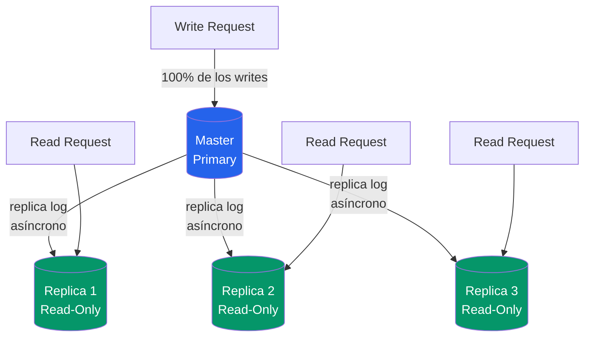
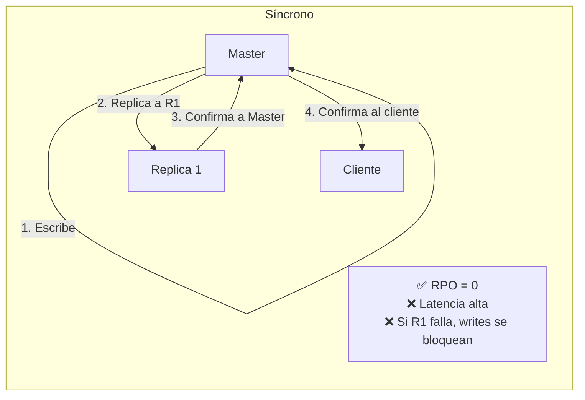
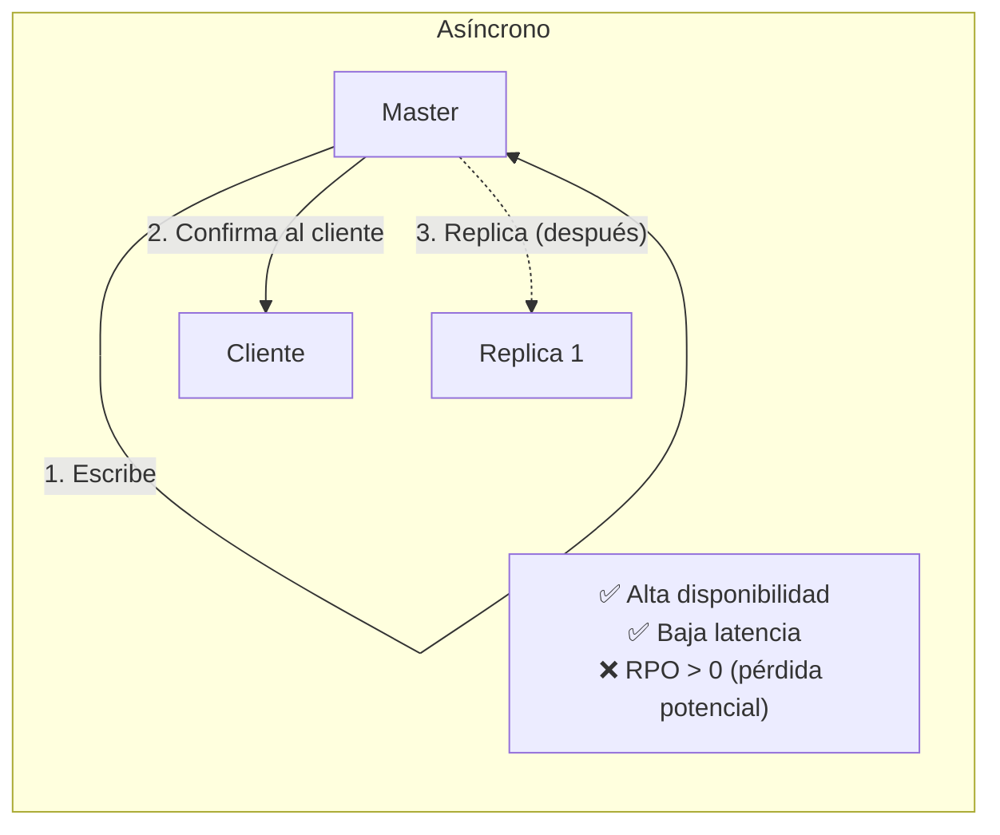
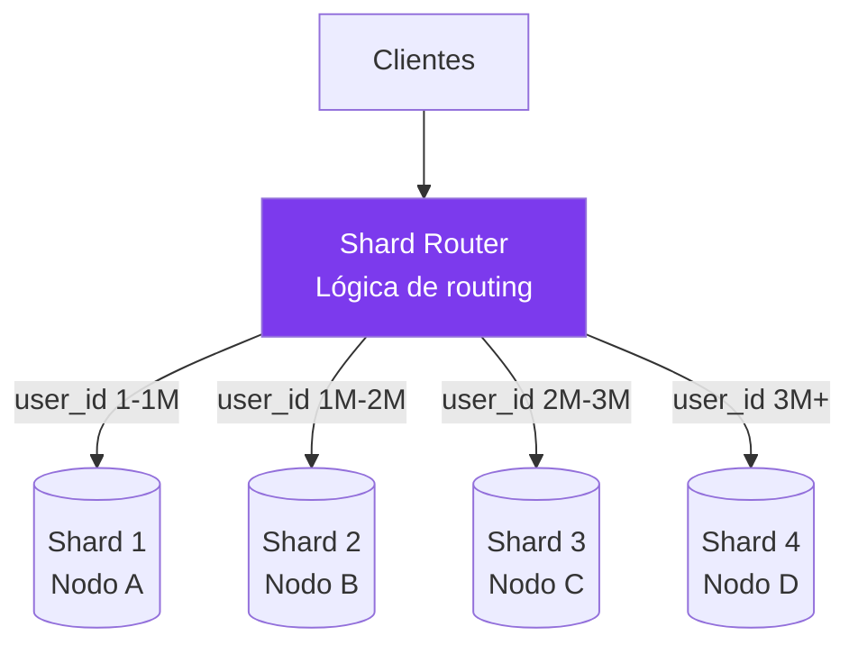
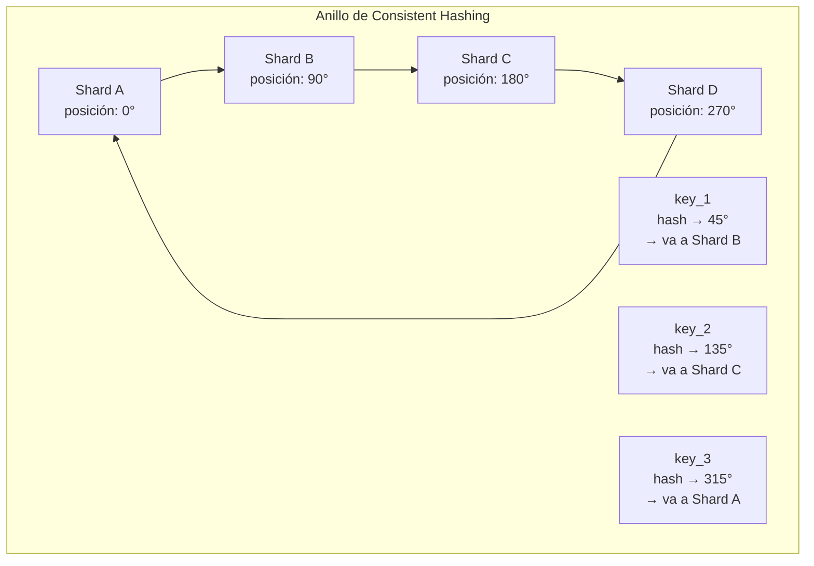
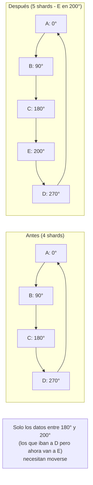
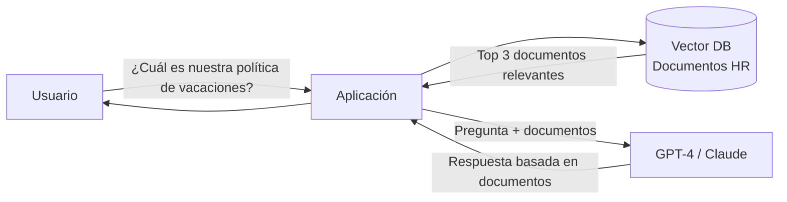

# 04-02 — Bases de Datos en System Design: Decisiones que Viven en Producción por Años

> **Prerequisito:** [01-06-bases-de-datos-fundamentos-cs.md](./01-06-bases-de-datos-fundamentos-cs.md) — Ese archivo cubrió los internals: cómo funcionan los índices B-Tree, qué son las transacciones ACID, qué es el WAL. **Este archivo asume ese conocimiento.** Aquí el enfoque es diferente: no *cómo funcionan* las bases de datos, sino *cuándo elegir cada tipo*, *cómo escalarlas*, y *qué pasa cuando fallan*.
>
> **Por qué este es el archivo más crítico del Módulo 4:**
> Las decisiones de base de datos son las más difíciles de revertir en producción. Cambiar de MongoDB a PostgreSQL con 50 millones de documentos activos puede tomar 6 meses y poner en riesgo el negocio. Elegir mal el esquema de sharding y tener que re-shard en producción puede significar semanas de downtime o migración online compleja. Un Staff Engineer no elige la base de datos por preferencia — la elige porque entiende qué garantías ofrece y cuáles necesita su sistema.
>
> **📚 DDIA:** *Designing Data-Intensive Applications* (Kleppmann) — Capítulos 5, 6, y 7 son el material de referencia de este archivo. Lee este archivo completo primero, luego usa DDIA para profundizar en los temas que más gaps tengas. **ByteByteGo:** Serie "Databases" completa — visualizaciones del proceso de replication y sharding que complementan la explicación textual.

---

## Sección 1 — El Framework de Decisión SQL vs NoSQL

### El error de framing más común

La pregunta NO es "¿SQL es mejor o NoSQL es mejor?" La pregunta ES:

> "¿Qué garantías necesita mi sistema, y qué tipo de base de datos ofrece exactamente esas garantías a ese costo?"

SQL y NoSQL no son generaciones de tecnología (vieja vs. nueva). Son **trade-offs distintos en el mismo espacio de decisiones**.

### Las dimensiones de decisión reales

**Dimensión 1 — Estructura de los datos:**

¿Tus datos tienen estructura predecible y estable, o estructura variable?

```csharp
// Estructura predecible → SQL brilla
public record Order(
    Guid Id,
    Guid UserId,
    DateTime CreatedAt,
    decimal TotalAmount,
    OrderStatus Status
);

// Estructura variable → NoSQL puede tener ventaja
// Un "producto" en un catálogo: electrónico tiene voltaje y consumo,
// ropa tiene talla y material, libro tiene ISBN y número de páginas.
// En SQL: columnas nullable o tabla EAV (Entity-Attribute-Value) — ambas son dolorosas
// En Document DB: cada documento tiene los campos que necesita
```

**Dimensión 2 — Patrón de consultas:**

¿Conoces de antemano cómo vas a consultar los datos?

- **Sí, con joins complejos y queries ad-hoc** → SQL (el planner de queries es tu aliado)
- **No, con patrones muy específicos y conocidos** → NoSQL optimizado para esos patrones

**Dimensión 3 — Garantías de consistencia:**

¿Qué pasa si dos operaciones tocan los mismos datos simultáneamente?

- **Necesito ACID absoluto** (transferencia bancaria: o se debita Y se acredita, o ninguna) → SQL
- **Eventual consistency es aceptable** (contador de "likes" que puede estar off por 1-2 segundos) → NoSQL distribuido

**Dimensión 4 — Escala:**

- **Escala vertical (un servidor más grande)** → SQL maneja esto bien hasta un punto
- **Escala horizontal (más servidores)** → NoSQL fue diseñado para esto desde el principio

### Cuándo SQL es la elección correcta

SQL (PostgreSQL, SQL Server, MySQL) es la elección correcta cuando:

1. **Tus datos tienen relaciones complejas** — `Order → OrderItems → Products → Categories`. Hacer esto en NoSQL requiere denormalización agresiva o múltiples roundtrips.

2. **Necesitas transacciones ACID multi-entidad** — Transferencia bancaria: el débito y el crédito deben ser atómicos. Si el proceso falla a la mitad, necesitas rollback automático.

3. **Necesitas queries ad-hoc sin conocer los patrones de acceso de antemano** — En SQL puedes hacer `SELECT * FROM orders JOIN users WHERE users.country = 'MX' AND orders.total > 1000` sin preparación previa. En la mayoría de NoSQL, esto requiere un índice preparado o un full scan.

4. **La consistencia fuerte es no negociable** — Finanzas, salud, inventario en tiempo real.

5. **Tu equipo necesita tooling maduro** — Décadas de ORMs (EF Core), migration tools, monitoring, BI tools que hablan SQL nativo.

**El error de asumir que SQL no escala:**

PostgreSQL bien configurado con read replicas maneja 100,000 reads/segundo sin problema. SQL Server en Azure puede manejar cargas enormes con el hardware adecuado. El límite de SQL no es teórico — es el write throughput en un solo master y el almacenamiento en un solo nodo. Llegar a ese límite requiere escala que la mayoría de sistemas nunca alcanza.

⚠️ **No abandones SQL por FOMO de NoSQL.** La mayoría de sistemas del mundo funcionan perfectamente con PostgreSQL o SQL Server correctamente diseñado e indexado. Solo migra a NoSQL cuando tengas un pain point concreto y medible que SQL no pueda resolver.

### Los 4 tipos de NoSQL — con cuándo usar cada uno en una entrevista

#### Document Stores (MongoDB, CosmosDB)

**Modelo:** Documentos JSON/BSON. Cada documento es un objeto autocontenido.

```json
// Ejemplo: documento de un producto en catálogo
{
  "_id": "prod_abc123",
  "name": "iPhone 15 Pro",
  "category": "smartphones",
  "price": 1299.99,
  "specs": {
    "storage_gb": 256,
    "color": "Natural Titanium",
    "chip": "A17 Pro"
  },
  "reviews": [
    { "userId": "u_1", "rating": 5, "text": "..." }
  ]
}
```

- ✅ Ideal cuando el objeto completo se lee y escribe junto (catálogo de productos, perfiles de usuario, contenido de CMS)
- ✅ Schema flexible — distintos documentos en la misma colección pueden tener diferentes campos
- ✅ Queries ricas sobre el documento (filtrar por `specs.storage_gb > 128`)
- ❌ Joins son costosos o inexistentes — si necesitas cruzar dos colecciones frecuentemente, el modelo está mal
- ❌ Transacciones multi-documento existen en MongoDB 4.0+ pero con overhead mayor que SQL
- **Cuándo en entrevista:** E-commerce (catálogo), CMS, aplicaciones con datos heterogéneos por usuario

#### Key-Value Stores (Redis, DynamoDB en modo KV)

**Modelo:** Clave → Valor opaco (la BD no sabe qué hay en el valor).

```csharp
// Casos de uso típicos en .NET con Redis
// Caché de sesión
await _redis.SetAsync($"session:{sessionId}", JsonSerializer.Serialize(sessionData), TimeSpan.FromHours(2));

// Rate limiting counter
await _redis.IncrementAsync($"ratelimit:{userId}:{DateTime.UtcNow:yyyyMMddHH}");

// Feature flags
var isEnabled = await _redis.GetAsync($"feature:new_checkout:{userId}");
```

- ✅ Lookup por clave es O(1) — la operación más rápida posible
- ✅ In-memory por defecto (Redis) → latencias sub-milisegundo
- ✅ Estructuras de datos ricas en Redis: Sets, Sorted Sets, Lists, Hashes → habilitan casos como leaderboards
- ❌ No puedes buscar por atributos del valor ("dame todos los usuarios de México") — no hay índices en el value
- ❌ Si el valor es un objeto complejo y necesitas un campo específico, tienes que deserializar todo
- **Cuándo en entrevista:** Caché de cualquier cosa, sesiones de usuario, rate limiting, feature flags, leaderboards en tiempo real

#### Wide Column Stores (Cassandra, HBase, Azure Table Storage)

**Modelo:** Tabla con filas y columnas, pero a diferencia de SQL, las columnas son dinámicas por fila y pueden ser millones. Optimizado masivamente para writes secuenciales.

**El modelo mental correcto:** Imagina un mapa de mapas. La clave primaria determina en qué nodo vive el dato. Dentro de ese nodo, una clave de clustering ordena los datos físicamente en disco.

```
Partition Key: userId (determina en qué nodo del cluster está el dato)
Clustering Key: timestamp (determina el orden dentro de esa partición)

userId: user_123 | timestamp: 2026-01-01 12:00:01 | event: "page_view" | url: "/home"
userId: user_123 | timestamp: 2026-01-01 12:00:05 | event: "click"     | button: "buy"
userId: user_123 | timestamp: 2026-01-01 12:00:08 | event: "page_view" | url: "/checkout"
```

- ✅ Writes masivos a alta velocidad — Cassandra puede manejar millones de writes/segundo
- ✅ Range queries eficientes dentro de una partición ("dame todos los eventos de user_123 en enero")
- ✅ Escala horizontal lineal — agrega nodos y obtienes más throughput
- ❌ Queries complejas (joins, aggregations) son muy costosas o imposibles
- ❌ El modelo de datos debe diseñarse alrededor de los patrones de queries — cambiar una query puede requerir re-modelar la tabla
- **Cuándo en entrevista:** Time-series data (métricas, logs, IoT), historial de eventos a escala masiva, audit logs, analytics en tiempo real

#### Graph Databases (Neo4j, Amazon Neptune)

**Modelo:** Nodos (entidades) y aristas (relaciones). Las relaciones son first-class citizens — no se derivan de joins, están almacenadas explícitamente.

```cypher
// Neo4j Cypher — "¿quiénes son amigos de amigos de Juan que también siguen a María?"
MATCH (juan:User {name: "Juan"})-[:FRIEND]->(friend:User)-[:FRIEND]->(fof:User)
WHERE (fof)-[:FOLLOWS]->(:User {name: "María"})
RETURN fof.name
```

En SQL, esta misma query requiere múltiples self-joins que escalan exponencialmente con la profundidad del grafo. En Neo4j, es una traversal directa del grafo.

- ✅ Queries de relaciones multi-nivel (amigos de amigos, paths entre nodos)
- ✅ Fraud detection (¿esta tarjeta de crédito comparte device fingerprint con tarjetas reportadas como fraudulentas?)
- ✅ Sistemas de recomendación ("usuarios que compraron X también compraron Y")
- ❌ Si los datos no son naturalmente un grafo, estás sobre-ingenieriando
- ❌ Menor adopción y tooling que SQL/Document
- **Cuándo en entrevista:** Redes sociales (relaciones entre usuarios), fraud detection, sistemas de recomendación, knowledge graphs

---

## Sección 2 — Replication: Cómo los Datos Sobreviven a Fallas

La replicación resuelve dos problemas:
1. **Availability:** si el nodo primario falla, un secundario toma su lugar
2. **Read scaling:** distribuir las reads entre múltiples réplicas

### Single-Master Replication (Master-Replica / Primary-Secondary)

Es el modelo más común en SQL (PostgreSQL, MySQL, SQL Server).



**Cómo funciona:**
1. Todas las escrituras van al Master
2. El Master escribe en su WAL (Write-Ahead Log)
3. El log se replica (asíncrona o síncronamente) a las Replicas
4. Las Replicas son read-only y aplican los cambios del log

**Replica Lag — el problema que cambia todo:**

En replicación asíncrona (el default en la mayoría de sistemas), existe un delay entre cuando el Master confirma un write y cuando las Replicas lo tienen. Puede ser milisegundos en condiciones normales, pero puede ser segundos o minutos bajo carga alta o red lenta.

```
Usuario A escribe: "cambia mi email a nuevo@test.com" → Master confirma OK
Usuario A hace refresh inmediato → va a Replica → lee email viejo
```

Esto es **eventual consistency** — el dato será consistente eventualmente, pero hay una ventana de inconsistencia.

**Soluciones al replica lag:**
1. **Read-your-own-writes:** Después de un write, el cliente lee del Master por un tiempo corto (ej: 1 segundo), luego vuelve a leer de replicas
2. **Monotonic reads:** Garantiza que si ves versión X, no puedes ver versión anterior a X (el cliente siempre lee de la misma replica)
3. **Replicación síncrona:** El master espera confirmación de al menos una replica antes de responder al cliente. Mayor durabilidad, menor throughput

**Failover — cuando el Master falla:**

1. El sistema detecta que el Master no responde (health check timeout)
2. Se inicia elección de nueva primary (en PostgreSQL: Patroni gestiona esto; en Azure SQL: automático)
3. Una Replica es promovida a nuevo Master
4. Los clientes deben reconectarse al nuevo Master

⚠️ **El problema del failover con replicación asíncrona:** Si el Master confirmó 1,000 writes que aún no llegaron a las réplicas y luego cae, esos 1,000 writes se pierden cuando se promueve la réplica. Este es el trade-off de asincrónico: mayor throughput vs. posible pérdida de datos en failover.

**RPO (Recovery Point Objective):** cuántos datos puedes perder. Con replicación asíncrona, RPO = replica lag en el momento del fallo.

### Multi-Master Replication

Múltiples nodos aceptan writes simultáneamente.

- ✅ Escala writes horizontalmente
- ✅ Disponibilidad: si un master falla, los otros siguen operando
- ❌ **Conflictos de escritura:** ¿Qué pasa si dos masters reciben writes diferentes al mismo dato en el mismo instante?

```
Master A recibe: user_123.email = "nuevo@a.com"  (timestamp: 12:00:00.001)
Master B recibe: user_123.email = "nuevo@b.com"  (timestamp: 12:00:00.002)
Ambos confirman al cliente. ¿Cuál es el email correcto?
```

**Estrategias de resolución de conflictos:**
- **Last-Write-Wins (LWW):** gana el write con timestamp más reciente. Simple, pero los relojes distribuidos no son perfectos (clock skew)
- **Application-level merge:** la aplicación define cómo combinar conflictos (ej: para un carrito de compras, hacer union de los items)
- **Manual resolution:** el conflicto se guarda y un humano o proceso decide

**Cuándo usar Multi-Master:**
- Aplicaciones geográficamente distribuidas donde el write latency a un master central sería inaceptable
- Sistemas donde la disponibilidad para writes es crítica (no puedes tener downtime de escritura durante failover)
- Cuando los datos por usuario/región son mayormente independientes (reduce conflictos)

### Synchronous vs Asynchronous Replication — el trade-off central





**La elección en la práctica:**
- **Finanzas / pagos:** síncrono — no puedes perder transacciones
- **Aplicaciones generales:** semi-síncrono (confirmación de al menos una réplica) — balance práctico
- **Analytics / logs / time-series:** asíncrono — throughput es prioridad, pérdida de algunos eventos es aceptable

---

## Sección 3 — Sharding: Escalar Writes y Almacenamiento Horizontalmente

**Replicación escala reads.** Si tienes 1 master y 5 réplicas, puedes manejar 6x más reads. Pero todos los writes siguen yendo al master — no escalaste el write throughput, y el almacenamiento sigue siendo limitado por un nodo.

**Sharding escala writes y almacenamiento.** Divide los datos en particiones (shards) distribuidas entre múltiples nodos. Cada nodo es responsable de un subconjunto de los datos.



### Estrategia 1 — Range-based Sharding

```
Shard 1: user_id 1 → 1,000,000
Shard 2: user_id 1,000,001 → 2,000,000
Shard 3: user_id 2,000,001 → 3,000,000
```

- ✅ Range queries eficientes: "dame todos los usuarios con ID entre 500K y 600K" → solo consultas Shard 1
- ✅ Simple de entender y debuggear
- ❌ **Hotspots:** Los usuarios nuevos siempre tienen IDs altos → van al último shard. Si los usuarios nuevos son los más activos (típicamente lo son), el último shard recibe la mayoría del tráfico mientras los primeros están ociosos
- ❌ Distribución desigual por naturaleza si los datos no están distribuidos uniformemente en el espacio de keys

### Estrategia 2 — Hash-based Sharding

```csharp
// El router calcula a qué shard va cada dato
int shardIndex = Math.Abs(userId.GetHashCode()) % numberOfShards;
```

```
userId = 12345  → hash = 6789  → 6789 % 4 = 1 → Shard 2
userId = 99999  → hash = 3421  → 3421 % 4 = 1 → Shard 2
userId = 55555  → hash = 1234  → 1234 % 4 = 2 → Shard 3
```

- ✅ Distribución estadísticamente uniforme — sin hotspots
- ❌ Range queries son ineficientes o imposibles — "dame usuarios con ID entre 500K y 600K" requiere consultar todos los shards
- ❌ **El problema crítico: añadir un shard requiere remapear casi todos los datos**

```
Con 4 shards:  hash(userId) % 4
Con 5 shards:  hash(userId) % 5   ← casi todos los datos cambian de shard!
```

Si tienes 100M de registros y agregas un shard, debes mover ~80% de los datos. Esto es un proceso costoso, disruptivo, y potencialmente de horas o días.

**La solución: Consistent Hashing.**

### Consistent Hashing — La Solución al Problema del Resharding

Este es el concepto más evaluado en entrevistas Staff de System Design relacionado con bases de datos distribuidas.

**La intuición:**

Imagina un anillo circular. Los números del 0 al 2^32-1 están distribuidos en el anillo (360 grados = todos los valores de hash posibles). Los shards (nodos) están ubicados en posiciones fijas en el anillo.

Para asignar un dato a un shard:
1. Calculas el hash del dato → te da una posición en el anillo
2. Avanzas en el anillo en el sentido de las manecillas del reloj
3. El primer shard que encuentras es el responsable de ese dato



**Por qué resuelve el problema del resharding:**

Sin consistent hashing: agregar 1 shard → `N % (K+1)` cambia para casi todos los datos → debes mover ~N*(K/(K+1)) datos.

Con consistent hashing: agregar 1 shard → solo los datos entre el nuevo shard y su vecino anterior necesitan moverse → mueves ~N/K datos.

```
Con 4 shards y 100M registros:
  Sin CH: agregar shard → mover ~80M registros
  Con CH: agregar shard → mover ~25M registros (100M/4)
```

**En la práctica con 4 → 5 shards:**



### Virtual Nodes (VNodes) — Distribución Uniforme en Consistent Hashing

**El problema con consistent hashing puro:** Los nodos no están distribuidos uniformemente en el anillo. Si Shard A está en 0° y Shard B en 90°, A maneja el 25% del anillo. Si Shard B está en 91° y Shard C en 180°, B maneja solo el 0.3% del anillo. Distribución muy desigual.

**La solución: Virtual Nodes**

En lugar de tener 1 posición en el anillo por shard físico, cada shard tiene múltiples posiciones virtuales (VNodes).

```
Shard A (físico) → VNodes en posiciones: 15°, 110°, 200°, 310°
Shard B (físico) → VNodes en posiciones: 45°, 130°, 220°, 350°
Shard C (físico) → VNodes en posiciones: 75°, 160°, 250°, 20°
```

Resultado: distribución estadísticamente uniforme, sin importar dónde caen los shards físicamente en el anillo.

**Ventaja adicional del failover:** Si Shard A falla, sus VNodes (en 4 posiciones del anillo) se redistribuyen entre los shards vecinos en el anillo en cada posición. La carga se distribuye entre todos los shards restantes, no solo en el vecino inmediato.

**Cassandra y Consistent Hashing:**

Cassandra usa consistent hashing con VNodes por defecto. Es una de las razones por las que Cassandra puede agregar o quitar nodos del cluster sin downtime y con redistribución mínima de datos.

### Problemas inherentes al Sharding

El sharding no es gratis. Introduce complejidad que no existía antes:

**Joins cross-shard son ineficientes o imposibles:**
```sql
-- Si users está en Shard 1 y orders en Shard 3:
SELECT u.name, COUNT(o.id) as order_count
FROM users u JOIN orders o ON u.id = o.user_id
GROUP BY u.name
-- Este join requiere coordinar entre shards → costoso
```
Solución: denormalizar los datos (duplicar `user_name` en la tabla `orders`) o aceptar que ciertos joins son operaciones batch asíncronas.

**Hotspot keys:**
Si tu shard key es `celebrity_user_id` y ese usuario tiene 50M de followers, todas las operaciones de ese usuario van al mismo shard → hotspot.
Solución: agregar sufijo aleatorio al shard key para distribuir (`{user_id}_{random_suffix_0_to_N}`) — pero complica las reads.

**Rebalancing es operacionalmente complejo:**
Mover datos entre shards en producción requiere: copiar datos al nuevo shard, verificar integridad, redirigir tráfico, eliminar datos del shard viejo — todo sin downtime. No es trivial.

---

## Sección 4 — NewSQL: ACID + Escala Horizontal

NewSQL es la respuesta a la pregunta: "¿Puedo tener las garantías de SQL y la escalabilidad de NoSQL?"

La respuesta es: sí, pero pagas un costo en latencia y complejidad.

**CockroachDB y Google Spanner:**

- Semántica SQL completa (queries, joins, transactions)
- ACID transactions distribuidas globalmente
- Consistent Hashing para distribución automática de datos
- Escala horizontal agregando nodos

```sql
-- En CockroachDB, esto es una transacción ACID distribuida globalmente
BEGIN;
UPDATE accounts SET balance = balance - 500 WHERE id = 'account_A';
UPDATE accounts SET balance = balance + 500 WHERE id = 'account_B';
COMMIT; -- Si falla, ambas operaciones hacen rollback automático
-- Incluso si account_A y account_B están en shards diferentes en continentes diferentes
```

**El costo real:** Para garantizar ACID en un sistema distribuido, necesitas coordinación entre nodos (protocolo de consenso — Raft o Paxos). Esa coordinación agrega latencia. Una transacción que en PostgreSQL local tarda 1ms, en CockroachDB puede tardar 5-20ms porque necesita coordinar entre réplicas.

**Cuándo usar NewSQL:**
- Aplicaciones financieras que necesitan consistencia fuerte Y escala global
- Cuando has llegado al límite de un PostgreSQL con réplicas y aún necesitas más writes
- Cuando las garantías de SQL son un requerimiento de negocio (auditoría, regulación)

**Cuándo NO usar NewSQL:**
- Si PostgreSQL con réplicas resuelve tu problema → la complejidad adicional no vale
- Si puedes sacrificar consistencia en algunas partes del sistema → Cassandra + PostgreSQL para las partes críticas es más simple
- Si tu equipo no tiene experiencia operando sistemas distribuidos → la curva de aprendizaje es empinada

---

## Sección 5 — Time-Series Databases

Los datos de time-series tienen características únicas que los hacen difíciles de manejar con bases de datos de propósito general.

**Características del dato time-series:**
- **Siempre tienen timestamp** — la dimensión temporal es el eje principal
- **Write-heavy:** métricas de un sistema de 1,000 servidores = 1,000 writes/segundo mínimo
- **Raramente se actualizan:** los datos históricos son inmutables — solo se escriben una vez
- **Queries son siempre sobre rangos de tiempo:** "dame el promedio de CPU de las últimas 2 horas"
- **Alta compresión posible:** datos similares en el tiempo comprime extremadamente bien

**Por qué una BD relacional normal no funciona bien para time-series a escala:**

```sql
-- Esta tabla en PostgreSQL con 1 año de métricas de 1,000 servers
-- a 1 métrica/segundo = 31,536,000,000 rows
-- Un range query de "últimas 2 horas" requiere un índice perfecto
-- y aún así puede tardar segundos a esa escala
SELECT AVG(cpu_usage), timestamp_bucket('5 minutes', measured_at)
FROM server_metrics
WHERE server_id = 'server-001'
  AND measured_at BETWEEN NOW() - INTERVAL '2 hours' AND NOW()
GROUP BY timestamp_bucket('5 minutes', measured_at);
```

**TimescaleDB — PostgreSQL para time-series:**

TimescaleDB es una extensión de PostgreSQL que agrega soporte de primera clase para time-series. Las tablas se convierten en "hypertables" que se particionan automáticamente por tiempo bajo el hood.

```sql
-- Con TimescaleDB
CREATE TABLE server_metrics (
    server_id TEXT NOT NULL,
    measured_at TIMESTAMPTZ NOT NULL,
    cpu_usage DOUBLE PRECISION,
    memory_mb INTEGER
);

-- Convierte a hypertable con particiones automáticas por tiempo
SELECT create_hypertable('server_metrics', 'measured_at');

-- La misma query de arriba es 100-1000x más rápida
-- porque TimescaleDB solo toca las particiones de las últimas 2 horas
```

Ventaja clave: **sigues usando SQL y tus herramientas existentes** — ORMs, pgAdmin, los drivers .NET de PostgreSQL funcionan sin cambios.

**InfluxDB — time-series nativo:**

Diseñado exclusivamente para time-series. Su query language (Flux) está optimizado para análisis temporal.

- ✅ Mayor compresión que TimescaleDB (puede ser 10x menos espacio)
- ✅ Funciones temporales nativas (downsampling, aggregation, retention policies)
- ❌ No es SQL — curva de aprendizaje adicional
- ❌ No sirve para datos que no son time-series

**Azure Data Explorer:**

La opción de Microsoft para time-series y analytics a escala masiva. Optimizado para petabytes de datos de logs y métricas.

**Cuándo usar Time-Series DB:**
- Métricas de infraestructura (CPU, RAM, red)
- Datos de IoT (temperatura, sensores)
- Precios financieros históricos
- Logs de aplicación a escala masiva
- Cualquier dato donde el tiempo es la dimensión principal de análisis

---

## Sección 6 — Vector Databases (2026)

Esta categoría no existía en la conciencia colectiva de System Design hace 3 años. En 2026 es una pregunta frecuente en entrevistas de Staff porque los sistemas con LLMs son ubicuos.

### Por qué existen — el problema de la búsqueda semántica

Una base de datos relacional puede buscar:
```sql
SELECT * FROM documents WHERE title = 'Machine Learning';  -- igualdad exacta
SELECT * FROM documents WHERE title LIKE '%machine%';      -- substring match
```

Lo que NO puede hacer de forma eficiente: "dame los documentos *semánticamente similares* a esta pregunta del usuario, aunque no compartan ninguna palabra exacta".

Un vector database puede hacer eso. El mecanismo:

1. Conviertes textos, imágenes, audio en vectores de alta dimensión (embeddings) usando un LLM o modelo de embeddings
2. El embedding captura el *significado semántico* — oraciones con el mismo significado tienen embeddings cercanos en el espacio vectorial
3. Para buscar, conviertes la query del usuario en un embedding
4. Buscas los embeddings más cercanos en el espacio vectorial (Approximate Nearest Neighbor — ANN)

```csharp
// Ejemplo conceptual en .NET
// 1. Generar embedding del texto del documento
float[] documentEmbedding = await _embeddingModel.EmbedAsync(document.Content);

// 2. Guardar en vector DB
await _vectorDb.UpsertAsync(new VectorEntry {
    Id = document.Id,
    Vector = documentEmbedding,
    Metadata = new { document.Title, document.Category }
});

// 3. Búsqueda semántica
float[] queryEmbedding = await _embeddingModel.EmbedAsync("¿Cómo funciona el aprendizaje automático?");
var results = await _vectorDb.SearchAsync(queryEmbedding, topK: 5, minSimilarity: 0.75f);
// Devuelve los 5 documentos semánticamente más cercanos a la pregunta
// Aunque no contengan las palabras "aprendizaje" o "automático" exactas
```

### Casos de uso en entrevistas

**RAG (Retrieval-Augmented Generation):**
El patrón más importante para sistemas con LLMs. En lugar de hacer fine-tuning del modelo con tu información corporativa (caro, lento), usas un vector DB para recuperar los documentos relevantes en tiempo real y los inyectas en el contexto del LLM.



**Sistemas de recomendación:**
Embeddings de productos + embeddings de historial de usuario → encuentra productos similares a lo que el usuario ha comprado.

**Búsqueda semántica en documentación:**
"¿Cómo configuro la autenticación?" → encuentra el documento relevante aunque diga "setup de OAuth" en lugar de "configurar autenticación".

### Opciones disponibles

**Pinecone:**
- ✅ Totalmente managed — no hay infraestructura que operar
- ✅ API simple, SDK para .NET disponible
- ❌ Costoso a escala — precio por vector almacenado y por query
- ❌ Vendor lock-in

**Weaviate:**
- ✅ Open source, puedes self-hospearlo
- ✅ Más control sobre la infraestructura
- ❌ Más overhead operacional

**pgvector (extensión de PostgreSQL):**

```sql
-- Instalar extensión
CREATE EXTENSION vector;

-- Tabla con columna de vector
CREATE TABLE documents (
    id SERIAL PRIMARY KEY,
    content TEXT,
    embedding vector(1536)  -- 1536 dimensiones (OpenAI text-embedding-3-small)
);

-- Índice para búsqueda eficiente (HNSW - Hierarchical Navigable Small World)
CREATE INDEX ON documents USING hnsw (embedding vector_cosine_ops);

-- Búsqueda de los 5 documentos más similares
SELECT id, content, 1 - (embedding <=> '[0.1, 0.2, ...]'::vector) AS similarity
FROM documents
ORDER BY embedding <=> '[0.1, 0.2, ...]'::vector
LIMIT 5;
```

- ✅ Si ya usas PostgreSQL, **esto es la opción más simple** — misma infraestructura, mismos backups, mismo ORM
- ✅ Puede combinar búsqueda vectorial con queries SQL normales en la misma query
- ❌ Para volúmenes > 10M vectores o latencias de búsqueda < 10ms estrictas, las bases de datos vectoriales especializadas son superiores

⚠️ **Regla práctica:** Si tienes < 1M vectores y ya usas PostgreSQL, `pgvector` es suficiente y elimina una pieza de infraestructura. Para volúmenes mayores o latencias muy estrictas, evalúa Pinecone o Weaviate.

---

## Sección 7 — Tabla de Decisión: Qué Base de Datos Elegir

Usa estas preguntas en orden para tomar la decisión en una entrevista:

**Pregunta 1: ¿Tus datos tienen estructura predecible y relaciones complejas entre entidades?**
- Sí → Considera SQL primero

**Pregunta 2: ¿Necesitas transacciones ACID que afecten múltiples entidades?**
- Sí → SQL (PostgreSQL, SQL Server, Azure SQL)
- No → Continúa

**Pregunta 3: ¿Cuál es el patrón de acceso dominante?**
- Lookup por clave único, latencia sub-ms → **Key-Value (Redis)**
- Objeto completo que se lee/escribe junto, schema variable → **Document (MongoDB, CosmosDB)**
- Writes masivos con timestamp como dimensión principal → **Time-Series (TimescaleDB, InfluxDB)**
- Relaciones multi-nivel entre entidades → **Graph (Neo4j)**
- Búsqueda por similitud semántica → **Vector DB (pgvector, Pinecone)**
- Writes masivos, datos de serie temporal sin relaciones → **Wide Column (Cassandra)**

**Pregunta 4: ¿Necesitas escala horizontal de writes con garantías ACID?**
- Sí → **NewSQL (CockroachDB, Google Spanner)**

**Pregunta 5: ¿El sistema es read-heavy con datos mayormente estáticos?**
- Sí → SQL + Cache (Redis) — esto resuelve el 80% de los casos de "necesito NoSQL para escalar"

| Tipo | Cuándo es correcto | Cuándo NO usarlo |
|---|---|---|
| PostgreSQL / SQL Server | Relaciones, ACID, queries ad-hoc | Writes > 50K/s en un nodo, schema muy variable |
| Redis | Caché, sesiones, rate limiting, leaderboards | Datos primarios que no caben en memoria, queries complejas |
| MongoDB / CosmosDB | Catálogos, perfiles, datos heterogéneos | Transacciones multi-documento frecuentes, joins complejos |
| Cassandra | IoT, logs, time-series de alto volumen | Queries complejas, transacciones |
| Neo4j | Redes sociales, fraud detection, recomendaciones | Datos que no son naturalmente un grafo |
| TimescaleDB | Métricas, monitoring, series temporales | Datos relacionales estándar |
| CockroachDB | ACID + escala global, finanzas distribuidas | Cuando PostgreSQL es suficiente |
| pgvector | RAG, búsqueda semántica, < 1M vectores | > 10M vectores o latencia < 5ms estricta |

---

## Checklist de Salida

- [ ] Puedo comparar SQL vs NoSQL con criterios técnicos, no con preferencias
- [ ] Puedo explicar los 4 tipos de NoSQL con un caso de uso concreto por tipo
- [ ] Puedo describir master-replica replication, replica lag, y cómo hacer failover
- [ ] Puedo explicar la diferencia entre replicación síncrona y asíncrona con sus trade-offs
- [ ] Puedo explicar consistent hashing y por qué resuelve el problema del resharding
- [ ] Puedo explicar Virtual Nodes y por qué son necesarios en consistent hashing
- [ ] Sé cuándo usar pgvector vs una vector DB especializada
- [ ] Puedo usar el framework de decisión de la Sección 7 para elegir una BD en una entrevista

---

> **Siguiente:** [04-03-caching-en-profundidad.md](./04-03-caching-en-profundidad.md) — Caché es la solución para la mayoría de los problemas de performance que parecen requerir NoSQL. Entender caché en profundidad (estrategias, invalidación, Redis internals) cambia cómo ves el 80% de los diseños de sistema.
>
> **📚 DDIA:** Ahora es el momento de leer los Capítulos 5 (Replication) y 6 (Partitioning) de Kleppmann. Este archivo te dio el marco conceptual — DDIA te da los detalles de implementación y los casos edge que los sistemas reales enfrentan.
>
> **🎯 ByteByteGo:** "How does database sharding work?", "What is Consistent Hashing?", y "SQL vs NoSQL" — los tres videos más relevantes de este archivo. Son visualizaciones de 8-12 minutos que solidifican los conceptos de esta sección.
