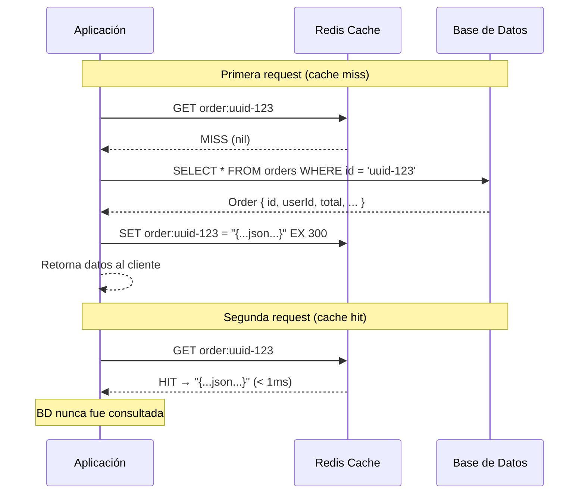
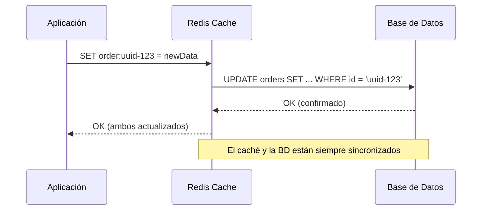
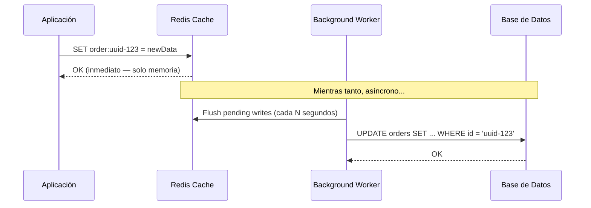
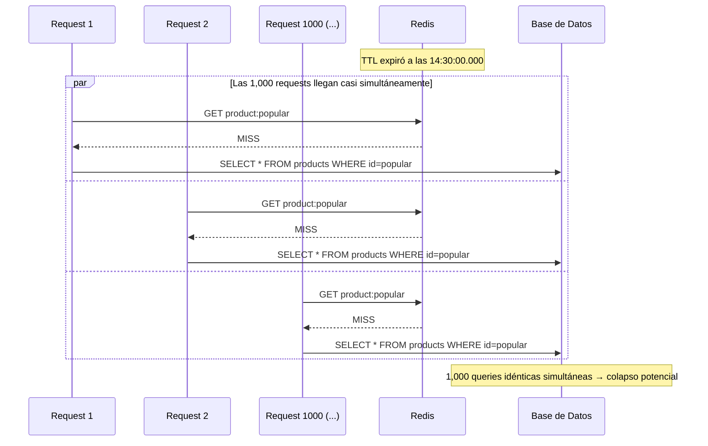
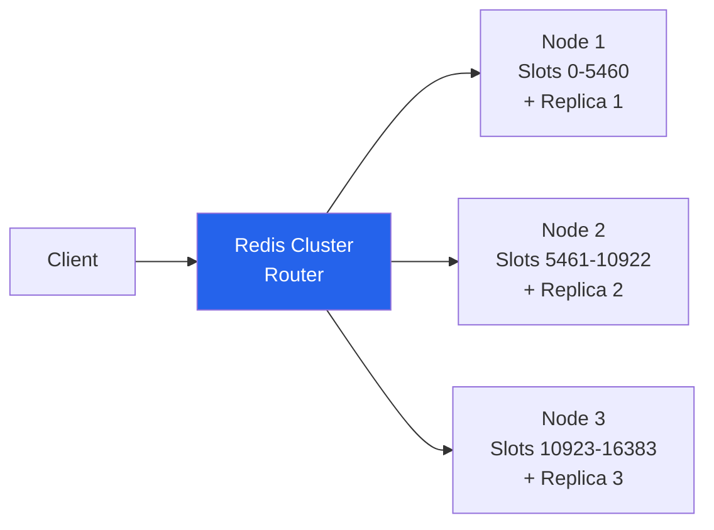
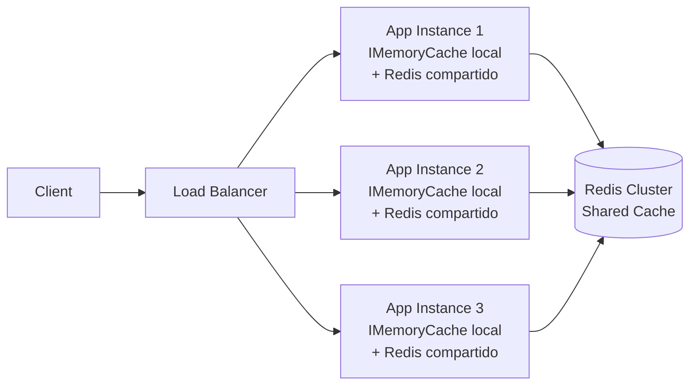

# 04-03 — Caching en Profundidad: Del Key-Value al Sistema de Alta Disponibilidad

> **Prerequisito:** [04-02-bases-de-datos-system-design.md](./04-02-bases-de-datos-system-design.md) — Este archivo parte de que ya entiendes SQL, NoSQL, y las limitaciones de throughput de una base de datos bajo carga. El caché es la respuesta a esas limitaciones.
>
> **Por qué este archivo cambia cómo ves el módulo anterior:**
> En [04-02](./04-02-bases-de-datos-system-design.md) viste cuándo elegir SQL vs NoSQL. La respuesta honesta: el 80% de los casos en los que alguien dice "necesito NoSQL para escalar" se resuelve con un caché bien implementado sobre SQL. No porque NoSQL sea malo — sino porque el problema real era la latencia de lectura, y eso es exactamente lo que el caché resuelve. Entender esto cambia el árbol de decisiones completo.
>
> **🎯 Recursos de esta sección:** [ByteByteGo — Caching series](https://bytebytego.com/) (newsletter + YouTube): el mejor material visual de caching con escenarios de producción reales. AlgoExpert Systems Expert: módulo de caching como complemento práctico. Úsalos *después* de leer este archivo, no como sustituto.

---

## Sección 1 — Por Qué el Caché Existe y Qué Problema Resuelve

### La brecha de velocidad que lo hace necesario

El problema fundamental es físico: la memoria RAM es órdenes de magnitud más rápida que cualquier sistema de almacenamiento persistente, y un proceso de red (llamar a la base de datos) introduce latencia que la aplicación no puede controlar.

Los números concretos que debes tener memorizados para entrevistas:

```
L1 cache (CPU):              ~1 ns
L2 cache (CPU):              ~4 ns
RAM (in-process memory):     ~100 ns         ← IMemoryCache vive aquí
─────────────────────────────────────────────
Redis (local, misma LAN):    ~0.5-1 ms       ← 1,000x más lento que RAM local
─────────────────────────────────────────────
SSD read:                    ~150 μs - 1 ms
Base de datos (query simple, índice):  5-20 ms
Base de datos (query compleja):       20-200 ms
```

Ahora traduce esto a escala real:

- Sistema con **10,000 req/s** donde cada request consulta la base de datos
- Cada query tarda 20ms en promedio
- La base de datos recibe 10,000 queries/segundo simultáneas
- Para manejar 10,000 queries a 20ms necesitas capacidad para 200 queries concurrentes en todo momento
- Con un caché que tenga **80% hit rate**, la base de datos recibe solo 2,000 queries/s — reducción del 80%

Eso no es optimización prematura. Es lo que hace posible que sistemas con millones de usuarios sigan respondiendo en menos de 100ms.

### La regla del 80/20 del caché

En la mayoría de sistemas de producción, el 20% de los datos representa el 80% de las lecturas. Los mismos productos top 100 de un e-commerce. Los mismos perfiles de usuarios famosos en una red social. Los mismos artículos recientes en un portal de noticias.

El caché almacena ese 20% activo en memoria y absorbe el 80% del tráfico de lectura sin tocar la base de datos. La base de datos solo recibe el 20% restante — el tráfico de "larga cola" que no puede ser cacheado efectivamente.

Esta distribución (conocida como distribución de Zipf o power law en acceso a datos) es la razón fundamental por la que el caché funciona tan bien en sistemas reales.

### Cuándo el caché NO es la solución

Antes de entrar a las estrategias, el criterio de un Staff Engineer:

**El caché no ayuda cuando:**
- Los datos se actualizan con la misma frecuencia con la que se leen (baja cache-hit rate)
- El sistema es write-heavy y read-light (el caché añade complejidad sin beneficio)
- Cada usuario accede a datos únicos y personalizados que nunca se repiten
- Los datos son tan críticos en consistencia que cualquier stale data es inaceptable

Si el sistema que estás diseñando tiene estas características, el caché añade complejidad sin el beneficio correspondiente. Primero mide, después cachea.

---

## Sección 2 — Las 4 Estrategias de Lectura/Escritura

Esta es la sección más evaluada en entrevistas sobre caching. Un candidato Senior sabe que existe Redis. Un candidato Staff sabe cuándo usar cada estrategia y por qué — y puede articicular los trade-offs en tiempo real.

### Cache-Aside (Lazy Loading)

La estrategia más común en producción. La aplicación es responsable de gestionar el caché.



Implementación en C# con ASP.NET Core:

```csharp
public class OrderCacheService
{
    private readonly IDistributedCache _cache;
    private readonly IOrderRepository _repository;
    private readonly JsonSerializerOptions _jsonOptions;

    public async Task<Order?> GetOrderAsync(Guid orderId, CancellationToken ct = default)
    {
        var cacheKey = $"order:{orderId}";

        // 1. Intentar obtener del caché
        var bytes = await _cache.GetAsync(cacheKey, ct);
        if (bytes is not null)
        {
            return JsonSerializer.Deserialize<Order>(bytes, _jsonOptions);
        }

        // 2. Cache miss → consultar base de datos
        var order = await _repository.FindByIdAsync(orderId, ct);
        if (order is null) return null;

        // 3. Poblar el caché para futuras requests
        var serialized = JsonSerializer.SerializeToUtf8Bytes(order, _jsonOptions);
        await _cache.SetAsync(cacheKey, serialized, new DistributedCacheEntryOptions
        {
            AbsoluteExpirationRelativeToNow = TimeSpan.FromMinutes(5)
        }, ct);

        return order;
    }
}
```

**Características:**
- La aplicación controla completamente qué se cachea y cuándo
- Resiliente a fallos de Redis: si el caché cae, la aplicación sigue funcionando (más lento, va directo a la BD)
- Solo cachea lo que realmente se solicita (no hay datos "calentados" que nunca se usan)

**Problemas reales de producción:**
- **Cache miss penalty:** la primera request siempre va a la base de datos. En sistemas con datos fríos, esto puede ser costoso.
- **Stale data:** si la BD cambia, el caché puede tener datos viejos hasta que expire el TTL
- **Cache stampede:** ver Sección 3 — este es el problema más serio y está subestimado

### Write-Through

Cada escritura va al caché Y a la base de datos sincrónicamente. El caché actúa como intermediario de escritura.



```csharp
public async Task UpdateOrderAsync(Order order, CancellationToken ct = default)
{
    // 1. Actualizar en la base de datos
    await _repository.UpdateAsync(order, ct);
    await _unitOfWork.CommitAsync(ct);

    // 2. Actualizar el caché inmediatamente (write-through)
    var cacheKey = $"order:{order.Id}";
    var serialized = JsonSerializer.SerializeToUtf8Bytes(order, _jsonOptions);
    await _cache.SetAsync(cacheKey, serialized, new DistributedCacheEntryOptions
    {
        AbsoluteExpirationRelativeToNow = TimeSpan.FromMinutes(5)
    }, ct);
}
```

**Características:**
- El caché siempre está sincronizado con la base de datos — no hay stale data por TTL vencido
- Reads siempre son cache hits (si el dato existe en caché, está actualizado)

**Desventajas:**
- Mayor latencia en writes: cada escritura son dos operaciones (caché + BD) en secuencia
- Cachea datos que quizás nunca se lean — si escribes y nunca lees, desperdicias memoria de Redis
- Si la BD falla durante el write, el caché puede quedar inconsistente si no se maneja la transaccionalidad

**Cuándo usar:** sistemas donde la consistencia entre caché y BD es más importante que la latencia de escritura. Sistemas financieros donde el dato cacheado DEBE ser el más reciente.

### Write-Behind (Write-Back)

La escritura va al caché inmediatamente. El caché sincroniza con la base de datos de forma asíncrona, después.



**Características:**
- Latencia de escritura mínima: la aplicación solo escribe en RAM
- Permite batching: múltiples writes al mismo dato se colapsan en uno solo antes de ir a la BD
- Throughput de escritura dramáticamente mayor

**Riesgos críticos:**
- **Pérdida de datos en fallo:** si Redis cae antes de sincronizar con la BD, esos writes se pierden
- **Complejidad operacional:** necesitas un worker de sincronización robusto con manejo de errores
- **Difícil de debuggear:** el estado entre caché y BD puede ser inconsistente durante el lag de sincronización

**Cuándo usar:** sistemas donde la pérdida de algunos writes es aceptable: contadores de vistas, métricas de engagement, analítica en tiempo real. **Nunca usar** para datos financieros, inventario crítico, o cualquier sistema donde un write perdido tiene consecuencias.

### Read-Through

Similar a Cache-Aside, pero la lógica de ir a la base de datos cuando hay un miss reside en el caché o en una librería de caché, no en la aplicación. La aplicación solo habla con el caché.

```csharp
// Read-Through con MemoryCache en .NET — el caché maneja la lógica de miss
services.AddMemoryCache();

// El patrón GetOrCreateAsync implementa Read-Through
var order = await _memoryCache.GetOrCreateAsync($"order:{orderId}", async entry =>
{
    entry.AbsoluteExpirationRelativeToNow = TimeSpan.FromMinutes(5);
    return await _repository.FindByIdAsync(orderId, ct);
});
```

**Diferencia con Cache-Aside:** en Cache-Aside, la aplicación decide explícitamente consultar el caché, luego la BD, luego poblar el caché. En Read-Through, el caché (o la abstracción que lo encapsula) maneja esa lógica internamente. La aplicación hace una sola llamada.

### Tabla Comparativa para Entrevistas

| Estrategia | Consistencia | Latencia Write | Latencia Read (miss) | Riesgo pérdida | Complejidad |
|---|---|---|---|---|---|
| Cache-Aside | Eventual | Normal (solo BD) | +miss penalty | Ninguno | Baja |
| Write-Through | Fuerte | Alta (caché + BD) | Normal | Ninguno | Media |
| Write-Behind | Eventual | Mínima (solo RAM) | Normal | **Alto** | Alta |
| Read-Through | Eventual | Normal | +miss penalty | Ninguno | Baja-Media |

**La pregunta de entrevista:** "¿Cuándo usas Write-Through vs Cache-Aside?"

**Respuesta nivel Staff:** "Depende de la tolerancia a stale data del sistema. Cache-Aside es mi default porque es simple y resiliente: si Redis cae, la aplicación sigue funcionando. Uso Write-Through cuando el read del dato siempre debe ser del estado más reciente — por ejemplo, saldo de cuenta donde mostrar un saldo viejo puede resultar en fraude. Evito Write-Behind salvo para sistemas de contadores o analítica donde la pérdida eventual de algunos writes es aceptable y documentada como trade-off de negocio."

---

## Sección 3 — Cache Stampede: El Problema que Nadie Menciona

Este es el problema más frecuente y más costoso en sistemas de caching de alta concurrencia. La mayoría de documentación básica no lo menciona. En entrevistas Staff, conocerlo te diferencia.

### Qué es y por qué ocurre

Un dato popular tiene TTL de 5 minutos. Expiró a las 14:30:00.

En el momento exacto de expiración, 1,000 requests simultáneas llegan y todas tienen cache miss. Todas van a la base de datos al mismo tiempo. La base de datos recibe 1,000 queries idénticas en milisegundos. Si cada query tarda 50ms y tienes connection pool de 100 conexiones, tienes 900 queries esperando en cola. La latencia se dispara. En casos extremos, la base de datos colapsa.

Este fenómeno se llama **cache stampede**, **dogpile effect**, o **thundering herd**.



### Solución 1 — Mutex / Distributed Lock

Solo un proceso recalcula el dato. El resto espera.

```csharp
public async Task<Product?> GetProductWithLockAsync(Guid productId, CancellationToken ct)
{
    var cacheKey = $"product:{productId}";
    var lockKey = $"lock:refresh:{cacheKey}";

    // Intento rápido sin lock
    var cached = await _cache.GetAsync(cacheKey, ct);
    if (cached is not null)
        return JsonSerializer.Deserialize<Product>(cached, _jsonOptions);

    // Usar un distributed lock (ejemplo con RedLock.net o similar)
    await using var redisLock = await _lockFactory
        .CreateLockAsync(lockKey, expiryTime: TimeSpan.FromSeconds(30));

    if (!redisLock.IsAcquired)
    {
        // Otro proceso está recalculando — esperar brevemente y reintentar
        await Task.Delay(100, ct);
        var retry = await _cache.GetAsync(cacheKey, ct);
        // Si todavía no está disponible, puede retornar stale data o null según la criticidad
        return retry is not null
            ? JsonSerializer.Deserialize<Product>(retry, _jsonOptions)
            : null;
    }

    // Double-check después de obtener el lock
    cached = await _cache.GetAsync(cacheKey, ct);
    if (cached is not null)
        return JsonSerializer.Deserialize<Product>(cached, _jsonOptions);

    // Solo este proceso recalcula — el resto espera el lock
    var product = await _repository.FindByIdAsync(productId, ct);
    if (product is not null)
    {
        var bytes = JsonSerializer.SerializeToUtf8Bytes(product, _jsonOptions);
        await _cache.SetAsync(cacheKey, bytes, new DistributedCacheEntryOptions
        {
            AbsoluteExpirationRelativeToNow = TimeSpan.FromMinutes(5)
        }, ct);
    }

    return product;
}
```

**Trade-off del lock:** si el proceso que tiene el lock falla, el resto queda esperando hasta que el lock expire. Configura un expiry razonable en el lock.

### Solución 2 — Probabilistic Early Expiration (PER / XFetch)

En lugar de dejar que todos los procesos descubran el miss al mismo tiempo, algunos procesos "anticipan" proactivamente el vencimiento y recalculan antes de que expire.

El algoritmo XFetch: cuanto más cerca está el TTL de expirar, mayor la probabilidad de que un proceso decida recalcular en ese momento (en background), antes de que otros procesos vean el miss.

```csharp
public async Task<T?> GetWithPERAsync<T>(
    string key,
    Func<Task<T>> computeFunc,
    TimeSpan ttl,
    double beta = 1.0) // Beta controla agresividad — 1.0 es el valor estándar
{
    var (value, remainingTtl) = await GetWithRemainingTtlAsync<T>(key);

    if (value is null)
    {
        // Cache miss puro — recalcular sincrónicamente
        return await RefreshAsync(key, computeFunc, ttl);
    }

    // XFetch: probabilidad de early refresh aumenta conforme el TTL se agota
    // La fórmula -delta * beta * log(random) >= remainingTtl determina si refrescamos
    var estimatedComputeTime = TimeSpan.FromMilliseconds(50); // Estimar tiempo de cómputo
    var shouldEarlyRefresh = -estimatedComputeTime.TotalSeconds * beta
        * Math.Log(Random.Shared.NextDouble()) >= remainingTtl.TotalSeconds;

    if (shouldEarlyRefresh)
    {
        // Recalcular en background — este request sigue usando el valor actual
        _ = Task.Run(async () =>
        {
            try { await RefreshAsync(key, computeFunc, ttl); }
            catch { /* log error — no propagar al caller */ }
        });
    }

    return value;
}
```

**Ventaja sobre el lock:** no hay contención. Múltiples procesos pueden hacer early refresh simultáneamente, pero como el dato está cerca de expirar (no expirado todavía), la BD recibe el tráfico distribuido en el tiempo, no en un pico.

### Solución 3 — Staggered TTLs (la más simple)

Cuando cacheas datos similares, añadir un componente aleatorio al TTL. Así los expiries se distribuyen en el tiempo en lugar de sincronizarse.

```csharp
// Sin staggering: todos los productos cacheados expiran exactamente a los 5 minutos
// Con staggering: los expiries se distribuyen entre 5min y 5min 30s
var ttl = TimeSpan.FromMinutes(5) + TimeSpan.FromSeconds(Random.Shared.Next(0, 30));

await _cache.SetAsync(key, bytes, new DistributedCacheEntryOptions
{
    AbsoluteExpirationRelativeToNow = ttl
}, ct);
```

Es la solución más simple y la primera que deberías implementar. No elimina el stampede completamente, pero lo convierte de un pico puntual en un tráfico distribuido manejable.

**En producción:** usa la combinación staggered TTLs + PER para datos muy populares + mutex como último recurso para datos cuya recalculación es extremadamente costosa.

---

## Sección 4 — Eviction Policies: Qué Pasa Cuando el Caché Se Llena

Redis tiene memoria finita. Cuando se llena, debe decidir qué datos remover para hacer espacio a datos nuevos. La política de eviction determina esa decisión.

### LRU — Least Recently Used

Remueve el dato que no fue accedido hace más tiempo. Asume: "si no lo pediste recientemente, probablemente no lo pedirás pronto".

```
Estado del caché (más reciente → más antiguo):
[product:top1] → [product:top2] → [product:rare1] → [user:old_user_profile]
                                                         ↑ evicted primero
```

- **Redis config:** `maxmemory-policy allkeys-lru`
- **Cuándo usar:** la mayoría de sistemas. Acceso temporal localizado — los usuarios tienden a acceder a los mismos datos dentro de una sesión o ventana de tiempo.
- **El más usado en producción.**

### LFU — Least Frequently Used

Remueve el dato que fue accedido menos veces en total. Asume: "el dato que nadie pide es el menos valioso".

- **Redis config:** `maxmemory-policy allkeys-lfu` (disponible desde Redis 4.0)
- **Cuándo usar:** contenido con popularidad estable y medible. Un video viral de hace 2 semanas puede no haber sido accedido recientemente, pero fue accedido millones de veces — LFU lo retiene; LRU lo evictaría.
- **Mejor que LRU para:** plataformas de contenido con distribución de popularidad clara (YouTube, Spotify)

### TTL-Based

Cada dato tiene un tiempo de vida. Cuando expira, es candidato a eviction.

- Se puede combinar con LRU/LFU: cuando el caché está lleno y hay datos expirados, evictar los expirados primero antes de considerar datos aún vigentes.
- **Redis configs:** `volatile-lru`, `volatile-lfu`, `volatile-ttl`

### La Decisión en una Entrevista

```
Pregunta: "¿Qué eviction policy elegirías para el caché de un e-commerce?"

Respuesta nivel Staff:
"Para el catálogo de productos (acceso temporal localizado en sesiones de compra) 
usaría allkeys-lru. Para el sistema de recomendaciones donde la popularidad de un 
producto tiene más peso que su acceso reciente, consideraría allkeys-lfu. La diferencia 
es que LRU puede evictar un producto muy popular que simplemente no fue consultado en 
el último ciclo, mientras LFU lo retiene por su historial completo de accesos."
```

---

## Sección 5 — Redis Internals para System Design

No necesitas ser un DBA de Redis. Sí necesitas entender suficiente para tomar decisiones de diseño informadas y para responder preguntas de profundidad en entrevistas.

### Los Tipos de Datos de Redis y Cuándo Usar Cada Uno

Redis no es solo un key-value store. Es una estructura de datos en memoria con operaciones atómicas. Usar el tipo correcto puede eliminar lógica de aplicación compleja.

**String — el tipo base:**
```
SET order:uuid-123 "{...json...}" EX 300
GET order:uuid-123
INCR counter:page_views   ← atómico, ideal para contadores sin race conditions
```
Usa String para: objetos serializados (JSON), contadores, flags booleanos, valores simples.

**Hash — para objetos con campos independientes:**
```
HSET user:456 name "Omar" email "omar@example.com" role "admin"
HGET user:456 name               → "Omar"
HGETALL user:456                 → { name, email, role }
HINCRBY user:456 login_count 1   → actualiza solo un campo
```
Usa Hash cuando necesites acceder o actualizar campos individuales de un objeto sin deserializar todo. En String, actualizar el email de un usuario requiere GET → deserializar → modificar → serializar → SET. Con Hash, es `HSET user:456 email "nuevo@ejemplo.com"`.

**List — para queues y feeds recientes:**
```
LPUSH user:notifications "Nueva orden procesada"
RPOP  user:notifications   ← FIFO queue
LRANGE user:activity 0 9   ← últimas 10 actividades (O(N) sobre el rango)
```
Usa List para: colas de procesamiento, feeds de actividad reciente, historial acotado.

**Set — para colecciones únicas:**
```
SADD post:likes:123 "user_456" "user_789"
SISMEMBER post:likes:123 "user_456"  → 1 (ya dio like)
SCARD post:likes:123                  → 2 (total de likes)
SUNION set1 set2                      → unión de dos conjuntos
```
Usa Set para: relaciones many-to-many, "usuarios que dieron like", "tags de un artículo", deduplicación.

**Sorted Set (ZSet) — para rankings y leaderboards:**
```csharp
// Leaderboard de jugadores
await _redis.SortedSetAddAsync("leaderboard", "player:omar", 1500);
await _redis.SortedSetAddAsync("leaderboard", "player:ana", 2300);

// Top 10 jugadores (mayor score primero)
var top10 = await _redis.SortedSetRangeByRankWithScoresAsync(
    "leaderboard", 0, 9, Order.Descending);

// Posición de un jugador específico
var rank = await _redis.SortedSetRankAsync("leaderboard", "player:omar", Order.Descending);
```
Usa Sorted Set para: leaderboards, top-N de cualquier cosa, rate limiting por ventana de tiempo, sistemas de scoring.

**HyperLogLog — para conteo de únicos a escala:**
```
PFADD visitors:2024-01-15 "user1" "user2" "user3"
PFCOUNT visitors:2024-01-15  → ~3 (aproximado, error máximo ~0.81%)
```
HyperLogLog puede contar millones de elementos únicos usando solo 12 KB de memoria, con un error de aproximación del 0.81%. Si necesitas saber "cuántos usuarios únicos visitaron esta página hoy" y un 1% de error es aceptable, esto es dramáticamente más eficiente que un Set completo.

### Redis Persistence — RDB vs AOF

En producción, Redis puede perder datos si se reinicia. La persistencia determina cuántos datos se pierden.

**RDB (Redis Database Backup):**
- Snapshot completo del estado a disco en intervalos configurables (cada 5 min, cada hora)
- Restauración rápida — un solo archivo binario compacto
- Pérdida de datos en fallo: todo lo escrito entre el último snapshot y el crash
- Cuándo usar: caché puro donde la BD es la fuente de verdad y perder datos del caché es aceptable

**AOF (Append Only File):**
- Cada comando de escritura se loguea a disco inmediatamente (configurable: `always`, `everysec`, `no`)
- Pérdida de datos mínima: con `fsync=always` prácticamente cero, con `fsync=everysec` máximo 1 segundo de datos
- Restauración más lenta — hay que reproducir todos los comandos
- Cuándo usar: cuando Redis almacena datos que no están en otra fuente de verdad (sesiones, rate limit counters)

**Configuración recomendada para producción en Azure Cache for Redis:**
- Habilitar ambos: RDB para snapshots periódicos + AOF para durabilidad entre snapshots
- El nivel Premium de Azure Cache for Redis soporta persistencia AOF y RDB

### Redis Cluster para Distributed Caching

Un solo nodo Redis tiene límites de memoria (RAM del servidor) y throughput. Cuando necesitas escalar más allá de un nodo:



Redis Cluster usa **consistent hashing** con 16,384 slots. Cada clave se hashea a uno de esos slots. Cada nodo es responsable de un rango de slots. Si un nodo falla, su réplica asume automáticamente.

**Regla para entrevistas:** en Azure, antes de ir a Redis Cluster propio, evalúa **Azure Cache for Redis** en tier Premium — ofrece clustering managed, geo-replication, y hasta 1.2 TB de memoria sin gestionar la infraestructura.

### Integración con ASP.NET Core

```csharp
// Program.cs
builder.Services.AddStackExchangeRedisCache(options =>
{
    options.Configuration = builder.Configuration.GetConnectionString("Redis");
    options.InstanceName = "myapp:"; // Prefijo para namespace aislado
});

// Con SlidingExpiration + AbsoluteExpiration combinados
public async Task SetWithSlidingAsync<T>(string key, T value,
    TimeSpan slidingTtl, TimeSpan absoluteTtl, CancellationToken ct)
{
    var bytes = JsonSerializer.SerializeToUtf8Bytes(value, _jsonOptions);
    await _cache.SetAsync(key, bytes, new DistributedCacheEntryOptions
    {
        // El dato expira si no fue accedido en slidingTtl...
        SlidingExpiration = slidingTtl,
        // ...pero como máximo vive absoluteTtl sin importar cuánto se acceda
        AbsoluteExpirationRelativeToNow = absoluteTtl
    }, ct);
}
// Ejemplo: sesión de usuario que expira después de 30min de inactividad,
// pero siempre se fuerza re-login después de 8 horas
```

---

## Sección 6 — Cache Invalidation: El Problema Más Difícil

Phil Karlton lo dijo hace décadas: "Hay dos cosas difíciles en Computer Science: invalidación de caché y nombrar cosas."

La dificultad no es técnica — es de coordinación. La base de datos cambió. El caché tiene una copia vieja. ¿Cómo sabe el caché que debe actualizarse?

### Estrategia 1 — TTL-Based (Invalidación Implícita)

Simplemente dejar que el dato expire. El caché eventualmente será consistente con la BD.

```csharp
// El dato se invalida automáticamente después de 5 minutos
await _cache.SetAsync(key, bytes, new DistributedCacheEntryOptions
{
    AbsoluteExpirationRelativeToNow = TimeSpan.FromMinutes(5)
}, ct);
```

- **Pro:** simple, sin coordinación entre sistemas
- **Contra:** durante el TTL (hasta 5 minutos), el caché puede tener datos desactualizados
- **Cuándo es aceptable:** datos donde mostrar un valor de hace 5 minutos es irrelevante para el negocio (precios de referencia, perfiles de usuarios, estadísticas de dashboards)

### Estrategia 2 — Explicit Invalidation en el Write Path

Cuando el dato cambia en la BD, invalidar el caché inmediatamente.

```csharp
public async Task UpdateOrderStatusAsync(Guid orderId, OrderStatus newStatus, CancellationToken ct)
{
    // 1. Actualizar en BD
    await _repository.UpdateStatusAsync(orderId, newStatus, ct);
    await _unitOfWork.CommitAsync(ct);

    // 2. Invalidar caché inmediatamente — el próximo read irá a la BD y re-cacheará
    await _cache.RemoveAsync($"order:{orderId}", ct);

    // Si hay múltiples keys relacionadas que deben invalidarse:
    await Task.WhenAll(
        _cache.RemoveAsync($"order:{orderId}", ct),
        _cache.RemoveAsync($"user:orders:{order.UserId}", ct) // Lista de órdenes del usuario
    );
}
```

- **Pro:** consistencia casi inmediata
- **Contra:** requiere que el write path conozca todas las claves de caché relacionadas. Si hay 5 servicios distintos que cachean datos del mismo Order con claves distintas, todos deben coordinar la invalidación.

⚠️ **El anti-patrón más común:** invalidas la clave `order:uuid-123` pero olvidaste que también hay cacheado `user:active-orders:user-456` que incluye ese Order. El usuario ve datos inconsistentes.

### Estrategia 3 — Event-Driven Cache Invalidation

Publicar un evento cuando el dato cambia. Un handler escucha el evento y invalida las entradas correspondientes.

```csharp
// Cuando el Order se actualiza, publicar un evento
public async Task UpdateOrderAsync(Order order, CancellationToken ct)
{
    await _repository.UpdateAsync(order, ct);
    await _unitOfWork.CommitAsync(ct);

    await _messageBus.PublishAsync(new OrderUpdatedEvent
    {
        OrderId = order.Id,
        UserId = order.UserId,
        UpdatedAt = DateTime.UtcNow
    }, ct);
}

// En un handler separado (puede ser en el mismo servicio u otro)
public class OrderCacheInvalidationHandler : IEventHandler<OrderUpdatedEvent>
{
    public async Task HandleAsync(OrderUpdatedEvent evt, CancellationToken ct)
    {
        await Task.WhenAll(
            _cache.RemoveAsync($"order:{evt.OrderId}", ct),
            _cache.RemoveAsync($"user:orders:{evt.UserId}", ct)
        );
    }
}
```

- **Pro:** desacoplado. El servicio que escribe no necesita conocer todos los cachés que deben invalidarse.
- **Pro:** múltiples servicios pueden reaccionar al mismo evento y hacer sus propias invalidaciones.
- **Contra:** **eventual consistency** — hay un lag entre que el evento se publica y cuando todos los handlers lo procesan. Durante ese lag, el caché puede estar desactualizado.
- **Cuándo usar:** arquitecturas de microservicios donde múltiples servicios cachean datos del mismo dominio.

### El Problema de Cache Invalidation Distribuida

En sistemas con múltiples instancias de la aplicación y múltiples capas de caché (in-process cache + Redis), la invalidación se complica:



Si invalidas la clave en Redis, las 3 instancias la invalidarán la próxima vez que hagan cache miss. Pero si cada instancia tiene también un `IMemoryCache` local (in-process, L1), esas copias locales no se invalidan automáticamente.

**Solución:** Redis Pub/Sub para notificar a todas las instancias:

```csharp
// Al invalidar, publicar mensaje de invalidación via Redis Pub/Sub
await _redis.PublishAsync("cache:invalidation", orderId.ToString());

// Cada instancia subscribe y limpia su cache local
await _redis.SubscribeAsync("cache:invalidation", (channel, orderId) =>
{
    _memoryCache.Remove($"order:{orderId}");
});
```

---

## Sección 7 — Caching en System Design Interviews: Cómo Articularlo

Cuando diseñas un sistema en una entrevista y llegas al caché, el entrevistador espera escuchar:

1. **Por qué** necesitas caché (qué problema concreto resuelve en este sistema)
2. **Qué** cacheas (no todo — solo lo que tiene alto hit rate y es costoso de recalcular)
3. **Qué estrategia** usas y por qué (Cache-Aside para datos que se leen mucho, Write-Through para datos críticos de consistencia)
4. **Qué TTL** y por qué ese valor específico
5. **Cómo manejas la invalidación** cuando los datos cambian
6. **Qué pasa si el caché falla** (tu sistema debe ser resiliente al fallo de Redis)

Un candidato promedio dice: "Pongo Redis aquí para cachear las respuestas."

Un candidato Staff dice: "El sistema es read-heavy con ratio 100:1. Los datos más accedidos son los perfiles de usuario y el catálogo de productos. Uso Cache-Aside con TTL de 5 minutos para el catálogo — aceptamos stale data de 5 minutos porque el precio de un producto puede cambiar y mostrarlo con ese lag es aceptable. Para los perfiles de usuario, uso invalidación explícita porque un usuario debe ver sus propios cambios inmediatamente. Distribuyo los TTLs con jitter de ±30 segundos para evitar cache stampede en expiración simultánea. Si Redis cae, la aplicación cae a modo degradado: va directo a PostgreSQL con rate limiting más agresivo para proteger la BD de la carga completa."

Esa diferencia es lo que distingue una respuesta Staff.

---

## Checklist de Salida

Antes de avanzar a [04-04-message-queues.md](./04-04-message-queues.md), debes poder:

- [ ] Explicar las 4 estrategias de caching con sus trade-offs sin consultar notas
- [ ] Describir qué es cache stampede, por qué ocurre, y 3 formas de mitigarlo
- [ ] Decidir entre LRU y LFU dado un sistema concreto con justificación
- [ ] Elegir el tipo de dato Redis correcto (String, Hash, List, Set, ZSet, HyperLogLog) para 6 casos de uso distintos
- [ ] Explicar la diferencia entre RDB y AOF y cuándo usar cada uno
- [ ] Diseñar una estrategia de invalidación para un sistema donde múltiples servicios cachean los mismos datos

---

## Recursos

**ByteByteGo — Caching Series** (consumir en este orden después de este archivo):
1. "A Crash Course in Caching" — newsletter + video: estrategias fundamentales con diagramas
2. "Cache Systems Every Developer Should Know" — video YouTube: tipos de caché y cuándo usar cada uno
3. "Top Caching Strategies" — visualización de cada estrategia con ejemplos de empresas reales

**AlgoExpert Systems Expert:**
- Módulo "Caching": casos de estudio aplicados — usar después de ByteByteGo para consolidar con escenarios de entrevista

**DDIA (Designing Data-Intensive Applications) — Kleppmann:**
- Capítulo 1: el modelo de datos y latencia — context de por qué el caché existe
- No hay un capítulo específico de caché, pero las secciones de replication lag y consistency aplican directamente

---

> **Siguiente:** [04-04-message-queues.md](./04-04-message-queues.md) — Los message queues resuelven el segundo problema de escala: qué pasa cuando dos servicios no pueden procesarse al mismo ritmo, o cuando necesitas garantías de entrega que HTTP sincrónico no puede dar.
>
> **Conexión crítica:** El patrón de event-driven cache invalidation de la Sección 6 es el primer lugar donde caching y message queues se intersectan. En 04-04 vas a ver ese patrón en profundidad desde el lado del mensaje.
