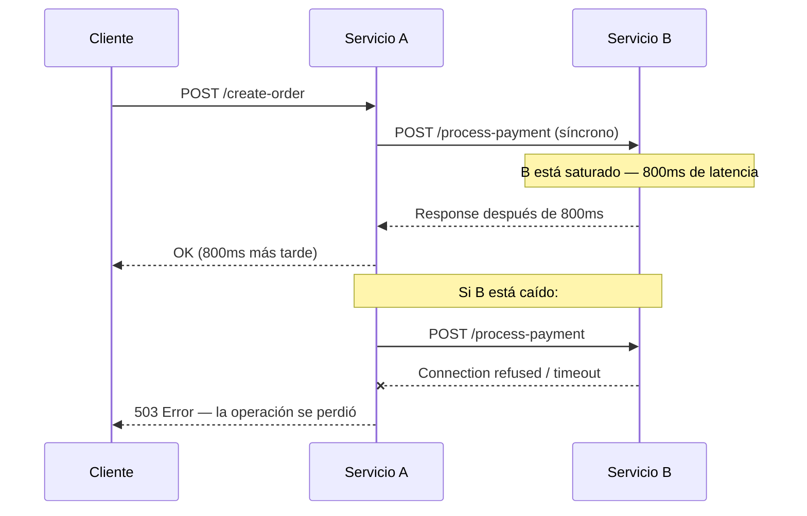
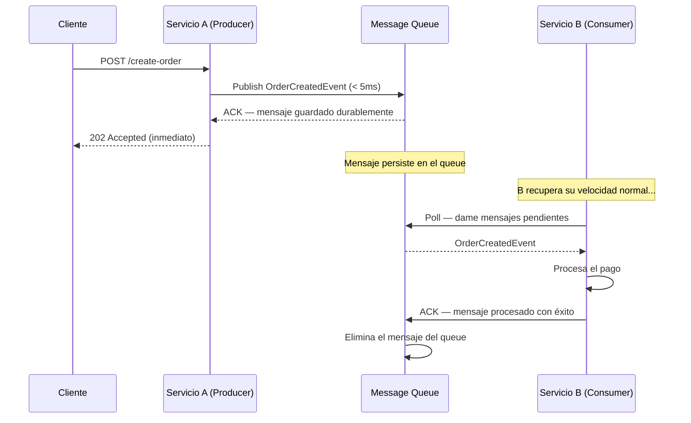
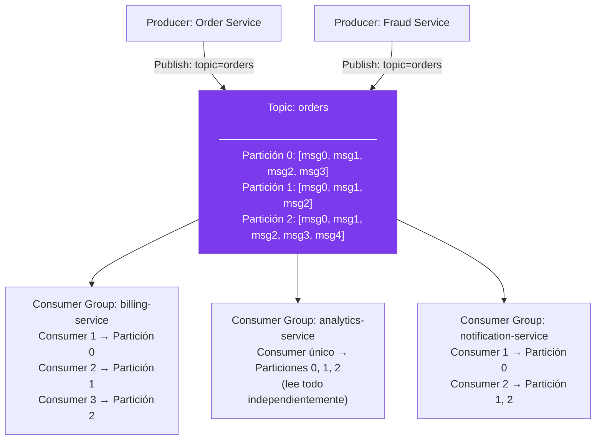
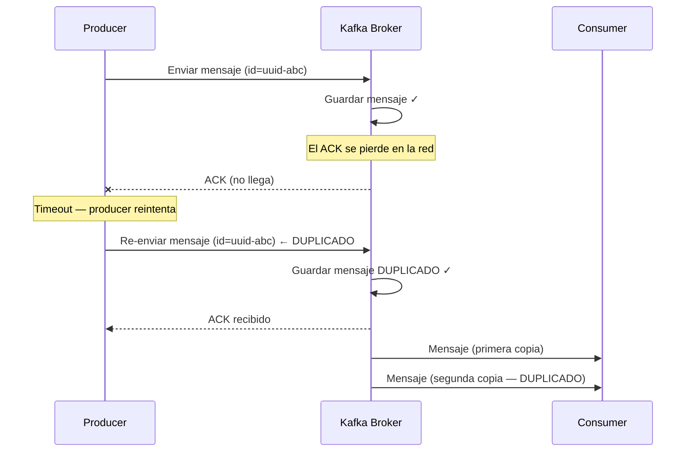
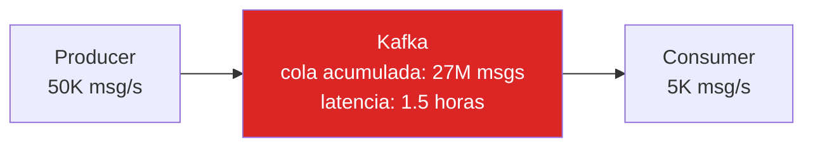
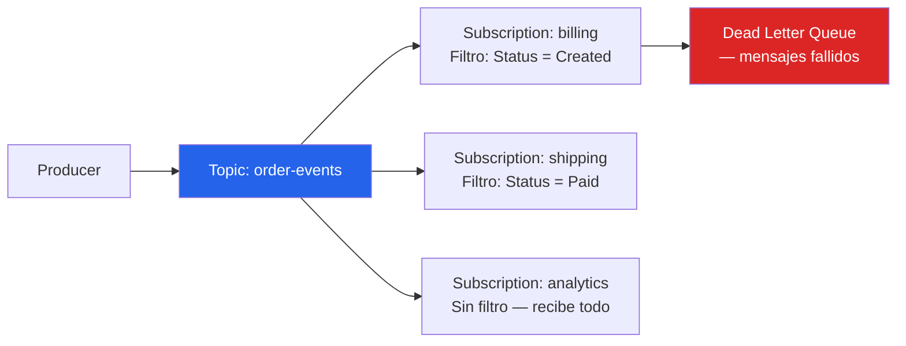
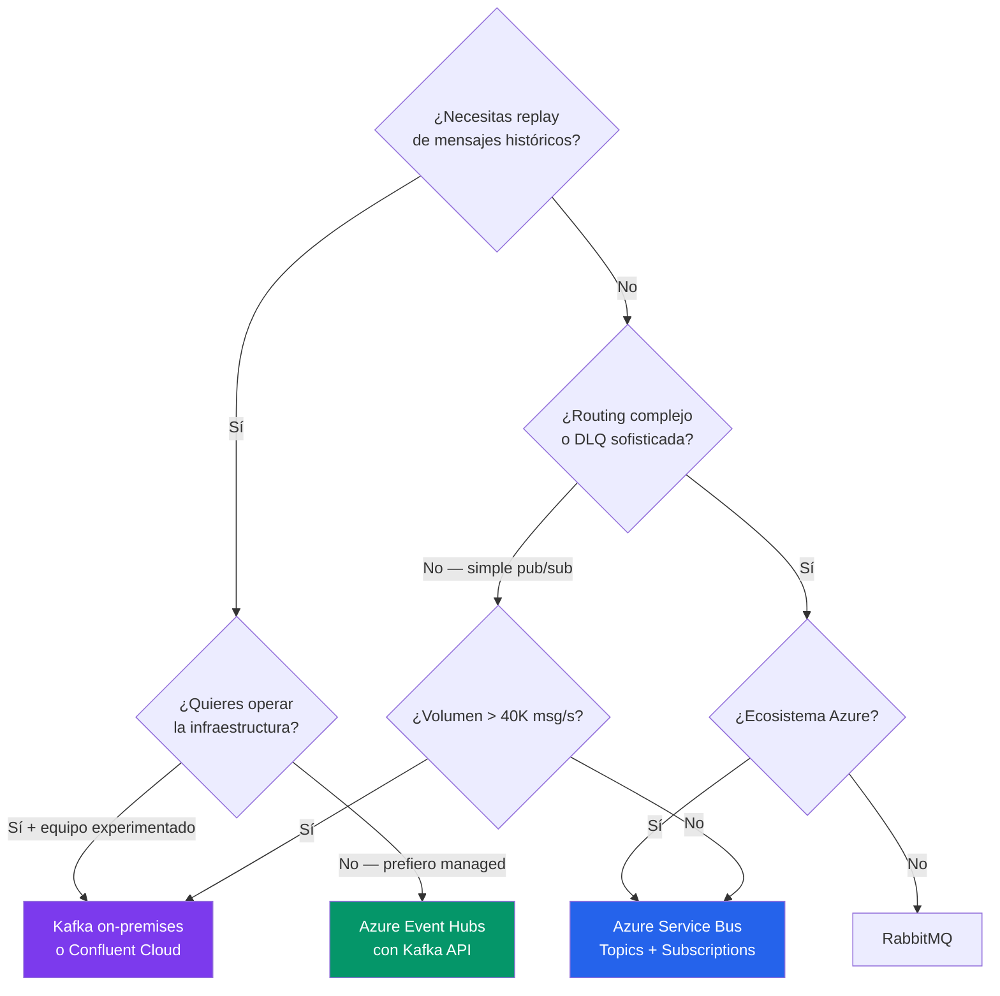
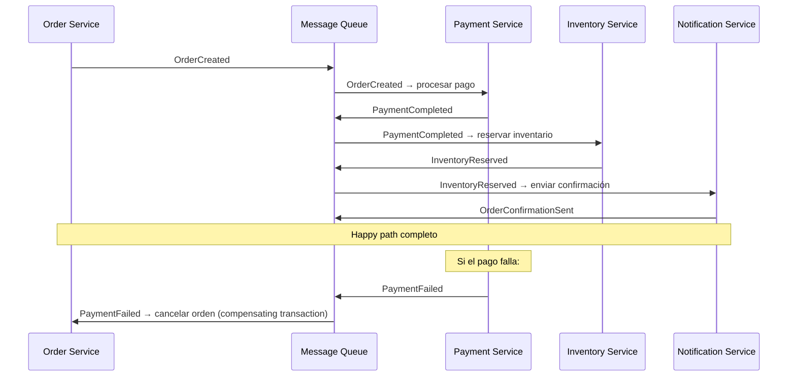

# 04-04 — Message Queues y Event Streaming: Desacoplamiento que Sobrevive a Fallos

> **Prerequisito:** [04-03-caching-en-profundidad.md](./04-03-caching-en-profundidad.md) — Ese archivo cubrió cómo el caché resuelve el problema de latencia de lectura. Este archivo cubre el siguiente problema de escala: qué pasa cuando dos servicios no pueden operar al mismo ritmo, o cuando necesitas garantías de entrega que una llamada HTTP sincrónica no puede dar.
>
> **El cambio de modelo mental que necesitas:**
> Un message queue no es "una base de datos que se elimina sola". Es un componente con semánticas de entrega específicas, modelos de durabilidad configurables, y patrones de uso que cambian la arquitectura del sistema completo. Entender esto desde los internals — no desde la documentación de "cómo empezar" — hace posible diseñar sistemas que sobreviven a fallos sin corrupción de datos.
>
> **🎯 Recursos de esta sección:** [ByteByteGo — Kafka series](https://bytebytego.com/) (YouTube): la mejor visualización de internals de Kafka disponible. Documentación oficial de [Azure Service Bus](https://docs.microsoft.com/azure/service-bus-messaging/): referencia para casos de uso en Azure. DDIA Kleppmann Capítulos 11 y 12 — stream processing y messaging a fondo.

---

## Sección 1 — Por Qué Existen los Message Queues

### El Problema sin Queues

Servicio A necesita que Servicio B procese algo. A llama a B sincrónicamente via HTTP.



Tienes tres problemas en uno:

1. **Acoplamiento temporal:** A y B deben estar disponibles *al mismo tiempo*. Si B se despliega, A tiene downtime por asociación.
2. **Propagación de lentitud:** si B se pone lento, A se pone lento. Si A tiene 100 requests esperando a B, A tiene 100 threads o conexiones bloqueadas.
3. **Pérdida de operaciones en fallo:** si B cae mientras A ya envió el request, la operación se pierde. No hay retry automático, no hay durabilidad.

### Con Message Queue



Los beneficios reales, no la descripción del marketing:

- **Desacoplamiento temporal:** A y B no necesitan estar disponibles simultáneamente. B puede caerse, reiniciarse, y los mensajes lo esperan en el queue.
- **Buffer de carga:** el queue absorbe spikes de tráfico. Si A publica 10,000 mensajes en 1 segundo pero B solo procesa 1,000/segundo, los mensajes se acumulan y B los consume a su ritmo. Sin el queue, B colapsa.
- **Durabilidad:** si B falla en medio del procesamiento, el mensaje permanece en el queue (o regresa a él) para ser reintentado.
- **Retry automático con backoff:** la mayoría de sistemas de mensajería tienen política de retry configurable — si B falla al procesar, el mensaje se reintenta después de un tiempo creciente.
- **Observabilidad natural:** el largo del queue es una métrica directa de si el sistema está al día o acumulando deuda de procesamiento.

### El Costo Real que Nadie Menciona Primero

Antes de entrar a los internals, el criterio de un Staff Engineer:

Un message queue agrega complejidad real:
- Una pieza de infraestructura que operar (o pagar como servicio gestionado)
- Debugging más complejo: los mensajes viajan entre sistemas y el flujo no es síncrono
- Eventual consistency por naturaleza: el procesamiento es asíncrono, el productor no sabe cuándo se procesó
- Los consumers deben ser **idempotentes** (ver Sección 3)
- Necesitas Dead Letter Queues para mensajes que siempre fallan
- El monitoring de un sistema basado en queues requiere métricas adicionales (queue depth, consumer lag)

La sección 6 cubre cuándo esto es overengineering. Léela antes de proponer un queue en una entrevista.

---

## Sección 2 — Kafka Internals en Profundidad

Kafka es el sistema de event streaming más evaluado en entrevistas Staff. La razón: no es solo un queue — es un log distribuido que cambió cómo se piensan los sistemas de datos. Entender sus internals no es opcional.

### La Arquitectura Fundamental

Kafka no es una cola que se vacía. Es un **log distribuido e inmutable** al que múltiples consumidores pueden leer independientemente.



**Lo que hace esto radicalmente diferente a RabbitMQ o Azure Service Bus:**

Tres Consumer Groups distintos leen el *mismo* Topic de órdenes. Billing procesa pagos. Analytics indexa datos. Notification envía emails. Ninguno interfiere con los otros. Cada Consumer Group mantiene su propio cursor (offset) en el log. Si Analytics va lento, no bloquea ni afecta a Billing.

En un queue tradicional (RabbitMQ, Service Bus), un mensaje es consumido por *un* consumer y desaparece. En Kafka, el mensaje persiste en el log y múltiples Consumer Groups lo pueden leer de forma independiente.

### Conceptos Fundamentales

**Topics y Particiones:**

Un Topic es una categoría de mensajes (orders, payments, user-events). Cada Topic se divide en Particiones para permitir paralelismo.

Una Partición es un log ordenado e inmutable: los mensajes se escriben al final y nunca se modifican. Cada mensaje tiene un **offset** — su posición única dentro de la partición.

```
Partición 0 del topic "orders":
[offset=0: OrderCreated{id=1}] [offset=1: OrderCreated{id=5}] [offset=2: OrderShipped{id=1}] [offset=3: ...]
                                                                                                  ↑
                                                                              Próximo offset a escribir
```

**El offset es el mecanismo de coordinación.** Un consumer no "recibe" mensajes pasivamente — activamente hace poll a Kafka y le dice "dame mensajes desde el offset 42 de la partición 0". Kafka responde con los mensajes a partir de ese offset. El consumer luego hace commit de su offset para registrar qué procesó.

Esto permite replay: si un consumer tiene un bug, puedes resetear su offset al inicio y reprocesar todos los mensajes históricos.

**Consumer Groups y la Regla Crítica:**

```
Topic "orders" con 3 particiones:

Consumer Group "billing":
- Consumer 1 → Partición 0 (exclusivo)
- Consumer 2 → Partición 1 (exclusivo)
- Consumer 3 → Partición 2 (exclusivo)
← 3 consumers, 3 particiones: perfecto

Consumer Group "analytics":
- Consumer 1 → Partición 0 (exclusivo)
- Consumer 2 → Partición 1 (exclusivo)
- Consumer 3 → Partición 2 (exclusivo)
- Consumer 4 → IDLE (sin partición asignada)
- Consumer 5 → IDLE (sin partición asignada)
← 5 consumers, 3 particiones: 2 consumers desperdiciados
```

**Regla crítica para entrevistas:** dentro de un Consumer Group, el número máximo de consumers que pueden procesar en paralelo es igual al número de particiones. Si tienes 3 particiones y agregas un 4to consumer al mismo grupo, ese consumer estará ocioso sin trabajo.

Implicación de diseño: cuando escales consumers, también necesitas escalar particiones. Esta es una operación que requiere planificación — cambiar el número de particiones redistribuye los mensajes y puede romper el ordering.

**Replication y Durabilidad:**

```mermaid
graph LR
    subgraph Broker 1 — Leader Partición 0
        L0[Partición 0 Leader\noffsets 0-999]
    end
    subgraph Broker 2 — Follower
        F0a[Partición 0 Replica\noffsets 0-999]
        F1b[Partición 1 Leader\noffsets 0-750]
    end
    subgraph Broker 3 — Follower
        F0b[Partición 0 Replica\noffsets 0-999]
        F1c[Partición 1 Replica\noffsets 0-750]
    end

    P[Producer] -->|"Write"| L0
    L0 -->|"Replicate"| F0a
    L0 -->|"Replicate"| F0b

    style L0 fill:#dc2626,color:#fff
    style F1b fill:#dc2626,color:#fff
```

Con `replication.factor=3`:
- 1 broker es el **leader** de una partición: maneja todas las reads y writes
- 2 brokers son **followers**: replican del leader asíncronamente
- Si el leader falla, Kafka elige automáticamente un follower como nuevo leader
- Los producers pueden configurar `acks=all` para esperar confirmación de todas las replicas antes de considerar el mensaje guardado (máxima durabilidad)

**La decisión de replication factor determina el trade-off durabilidad vs latencia.** Con `acks=1` (solo el leader confirma), el write es más rápido pero puede perderse si el leader falla antes de replicar. Con `acks=all`, el write espera a todas las replicas — más lento pero sin pérdida de datos en fallo del leader.

### Ordering en Kafka

Kafka garantiza ordering **dentro de una partición**, no entre particiones.

Si necesitas que todos los eventos de `orderId=123` lleguen en orden, debes asegurarte de que todos vayan a la misma partición. La forma estándar es usar el `orderId` como partition key:

```csharp
await _producer.ProduceAsync("orders", new Message<string, string>
{
    Key = order.Id.ToString(), // Mismo key → misma partición → ordering garantizado
    Value = JsonSerializer.Serialize(orderEvent)
});
```

Kafka hashea el key para determinar la partición. Todos los mensajes con el mismo key van a la misma partición → mismo consumer (dentro del grupo) → ordering garantizado para ese order.

---

## Sección 3 — At-Least-Once vs Exactly-Once: El Tema Más Importante

Esta es la pregunta conceptual más frecuente en entrevistas Staff sobre messaging. Dominarla te diferencia completamente.

### At-Most-Once (Fire and Forget)

El producer envía el mensaje y no espera confirmación. Si el broker falla antes de guardar → el mensaje se pierde para siempre.

```csharp
var config = new ProducerConfig
{
    BootstrapServers = "localhost:9092",
    Acks = Acks.None // No espera confirmación
};
```

- Cuándo usar: métricas de telemetría, logs de analytics donde perder un 0.1% de datos es aceptable
- Ventaja: mínima latencia, máximo throughput — el producer no bloquea esperando confirmación
- **Nunca usar** para operaciones de negocio que deben completarse

### At-Least-Once

El producer reintenta hasta recibir ACK del broker. Si el broker guardó el mensaje pero el ACK se perdió en la red → el producer reintenta → el broker almacena el mensaje dos veces → el consumer lo recibe dos veces.



**La implicación crítica:** con at-least-once, el consumer DEBE ser **idempotente**. Procesar el mismo mensaje dos veces debe producir el mismo resultado que procesarlo una vez.

```csharp
public class PaymentProcessingConsumer : IHostedService
{
    private readonly IProcessedMessageRepository _processedMessages;
    private readonly IPaymentService _paymentService;

    public async Task HandleAsync(PaymentRequestedMessage message, CancellationToken ct)
    {
        // Idempotencia: verificar si este mensaje ya fue procesado
        // Usar el MessageId único del mensaje como clave de deduplicación
        if (await _processedMessages.ExistsAsync(message.MessageId, ct))
        {
            _logger.LogWarning(
                "Duplicate message {MessageId} for order {OrderId} — skipping",
                message.MessageId, message.OrderId);
            return; // ACK el mensaje sin reprocesarlo
        }

        // Procesar el pago
        await _paymentService.ChargeAsync(message.OrderId, message.Amount, ct);

        // Marcar como procesado ANTES de hacer commit del offset
        // Si falla aquí, el mensaje se reintentará — pero la deduplicación lo manejará
        await _processedMessages.MarkAsync(message.MessageId,
            expiry: TimeSpan.FromDays(7), ct: ct);

        // Si llegamos aquí, el offset se commitea automáticamente
    }
}
```

⚠️ **La trampa de la idempotencia:** marcar el mensaje como procesado DESPUÉS de la operación principal pero ANTES de hacer commit del offset. Si la operación principal falla, no marcas el mensaje — se reintentará. Si marcas antes de la operación y la operación falla, el mensaje no se reintentará (crees que fue procesado) pero en realidad no lo fue.

La secuencia correcta: **Operación → Marcar como procesado → Commit offset.**

### Exactly-Once Semantics (EOS)

Kafka ofrece exactly-once desde la versión 0.11 mediante dos mecanismos:

**1. Idempotent Producers:**
Kafka asigna un Producer ID y un sequence number a cada mensaje. Si el broker recibe dos mensajes del mismo producer con el mismo sequence number, descarta el duplicado automáticamente.

**2. Transactional API:**
El producer puede publicar mensajes y hacer commit de offsets en una transacción atómica. Si la transacción falla, todo se revierte — ni los mensajes se publican ni el offset se actualiza.

```csharp
var config = new ProducerConfig
{
    BootstrapServers = "localhost:9092",
    EnableIdempotence = true,           // Desduplicación automática en el broker
    Acks = Acks.All,                    // Esperar confirmación de todas las replicas
    MaxInFlight = 5,                    // Requerido para idempotencia
    TransactionalId = "payment-producer-1" // Identificador único del producer para transacciones
};

using var producer = new ProducerBuilder<string, string>(config).Build();
producer.InitTransactions(TimeSpan.FromSeconds(30));

try
{
    producer.BeginTransaction();

    await producer.ProduceAsync("payments", new Message<string, string>
    {
        Key = orderId.ToString(),
        Value = JsonSerializer.Serialize(paymentEvent)
    });

    // El commit del offset del consumer y el produce del nuevo mensaje
    // son atómicos — o ambos ocurren, o ninguno
    producer.SendOffsetsToTransaction(
        offsets: consumedOffsets,
        consumerGroupMetadata: consumerGroup.ConsumerGroupMetadata,
        timeout: TimeSpan.FromSeconds(30)
    );

    producer.CommitTransaction(TimeSpan.FromSeconds(30));
}
catch (KafkaException)
{
    producer.AbortTransaction(TimeSpan.FromSeconds(30));
    throw;
}
```

**El costo real de Exactly-Once:** mayor latencia (esperar confirmación de todas las replicas + coordinación de transacciones) y menor throughput (las transacciones añaden overhead). No activar por default — solo cuando la duplicación de mensajes tendría consecuencias de negocio inaceptables (pagos, actualizaciones de inventario críticas).

**Regla de entrevista:** "¿Qué semánticas de entrega usarías para procesar pagos?"

Respuesta nivel Staff: "At-least-once con consumers idempotentes es mi elección para pagos. Exactly-once tiene un overhead de performance significativo y introduce complejidad en el manejo de transacciones. Prefiero diseñar el consumer para ser naturalmente idempotente: verificar si el pago ya fue procesado usando el messageId como clave de deduplicación en la BD. El resultado final es equivalente a exactly-once sin el costo de la coordinación transaccional de Kafka."

---

## Sección 4 — Backpressure: Cuando el Consumer No Puede Seguir el Ritmo

### El Problema

El producer publica 50,000 mensajes/segundo. El consumer procesa 5,000 mensajes/segundo. La diferencia de 45,000 mensajes/segundo se acumula en el queue.

En 10 minutos: 45,000 × 600 = 27 millones de mensajes acumulados. La latencia end-to-end (desde que el producer publica hasta que el consumer procesa) crece de milisegundos a minutos a horas.

Esto se llama **consumer lag** en Kafka — la diferencia en offsets entre lo que el producer publicó y lo que el consumer procesó. Es la métrica más importante para monitorear en un sistema Kafka.



### Estrategias de Manejo

**1. Scale Out los Consumers (la respuesta correcta para Kafka):**

Agregar más consumers al Consumer Group hasta alcanzar el número de particiones.

```
3 particiones, 1 consumer → 50K/1 = cada consumer procesa todo
3 particiones, 3 consumers → paralelismo real, cada consumer procesa 1 partición
3 particiones, 6 consumers → 3 consumers activos, 3 ociosos (límite del número de particiones)
```

Si necesitas más paralelismo que el número de particiones, debes aumentar el número de particiones también. Esto requiere planificación porque redistribuye mensajes y puede romper el ordering garantizado.

En Kubernetes/Azure Container Apps, esto es trivial: ajusta el número de replicas del consumer deployment. Con KEDA (Kubernetes Event Driven Autoscaling), el número de replicas escala automáticamente según el consumer lag:

```yaml
# KEDA ScaledObject para auto-escalar según consumer lag de Kafka
apiVersion: keda.sh/v1alpha1
kind: ScaledObject
metadata:
  name: payment-consumer-scaler
spec:
  scaleTargetRef:
    name: payment-consumer
  minReplicaCount: 1
  maxReplicaCount: 10  # Máximo = número de particiones
  triggers:
  - type: kafka
    metadata:
      topic: payments
      consumerGroup: payment-processors
      lagThreshold: "1000"  # Escalar si el lag supera 1000 mensajes
```

**2. Load Shedding (cuando la pérdida es aceptable):**

Cuando el queue alcanza un tamaño máximo configurado, descartar mensajes nuevos. El producer recibe un error y puede decidir qué hacer (reintentar después, alertar al usuario, o simplemente ignorar).

Cuándo es aceptable: eventos de telemetría, métricas de analytics, logs de debug — donde perder el 1% de eventos bajo alta carga es preferible a que el sistema completo se sature.

**3. Circuit Breaker en el Producer:**

Si el queue supera un threshold (consumer lag > X millones), el producer activa un circuit breaker y empieza a rechazar requests con 429 Too Many Requests en lugar de acumular indefinidamente en el queue.

```csharp
public class OrderProducer
{
    private readonly ICircuitBreaker _circuitBreaker;
    private readonly IKafkaConsumerLagMonitor _lagMonitor;

    public async Task<bool> PublishOrderAsync(Order order, CancellationToken ct)
    {
        // Si el consumer lag es demasiado alto, rechazar para proteger el sistema
        var currentLag = await _lagMonitor.GetLagAsync("orders", ct);
        if (currentLag > 5_000_000) // 5M mensajes en cola
        {
            _logger.LogWarning("Consumer lag {Lag} exceeds threshold — rejecting", currentLag);
            return false; // El controlador retorna 429
        }

        await _kafkaProducer.ProduceAsync("orders",
            new Message<string, string> { Key = order.Id.ToString(), Value = Serialize(order) });
        return true;
    }
}
```

**4. Procesamiento Batch en el Consumer:**

En lugar de procesar cada mensaje individualmente, el consumer acumula mensajes y los procesa en batch. Esto reduce el overhead de operaciones externas (BD, APIs) y puede multiplicar el throughput por 10x-100x.

```csharp
// Consumir en batch de hasta 100 mensajes, esperar máximo 500ms
var messages = new List<ConsumeResult<string, string>>();
var deadline = DateTime.UtcNow.AddMilliseconds(500);

while (messages.Count < 100 && DateTime.UtcNow < deadline)
{
    var result = consumer.Consume(TimeSpan.FromMilliseconds(10));
    if (result is not null) messages.Add(result);
}

if (messages.Any())
{
    // Procesar en bulk — 1 INSERT en BD en lugar de 100
    await _repository.BulkInsertAsync(
        messages.Select(m => Deserialize(m.Message.Value)));

    // Commit el último offset procesado
    consumer.Commit(messages.Last());
}
```

---

## Sección 5 — Kafka vs RabbitMQ vs Azure Service Bus vs Azure Event Hubs

La decisión más frecuente en entrevistas Staff para sistemas Azure. La respuesta correcta no es la que "suena más técnica" — es la que resuelve los requisitos concretos del sistema.

### Kafka

**Modelo:** Log distribuido. Los mensajes persisten por tiempo configurable (días, semanas, indefinidamente). Los consumers leen a su propio ritmo con offsets independientes.

**Fortalezas:**
- Throughput masivo: millones de mensajes por segundo con múltiples particiones
- Replay: los consumers pueden releer mensajes del pasado (resetear offset)
- Múltiples Consumer Groups leen el mismo topic independientemente
- Ordering garantizado dentro de una partición
- Ecosistema rico: Kafka Connect, Kafka Streams, ksqlDB

**Debilidades:**
- Infraestructura compleja: necesitas operar un cluster de brokers, ZooKeeper/KRaft, monitoreo especializado
- Overhead de gestión: ajuste de particiones, retention policies, consumer group rebalancing
- Routing complejo no es su fuerte: no tiene exchanges, binding patterns, o routing por headers
- Dead Letter Queue requiere implementación custom (no nativa como en Service Bus)

**Cuándo usar:**
- Event sourcing donde el replay de eventos históricos es un requisito
- Audit logs que deben sobrevivir indefinidamente
- Pipelines de datos donde múltiples sistemas consumen el mismo stream
- Streaming analytics en tiempo real
- Cuando el throughput supera lo que Service Bus puede manejar

**Cuándo NO usar:**
- El equipo no tiene experiencia operando Kafka
- Necesitas routing complejo entre servicios sin tener un equipo dedicado de plataforma
- El volumen no justifica la complejidad (< 10K msg/s — Service Bus lo maneja perfectamente)

### RabbitMQ

**Modelo:** Message broker clásico orientado a queues y routing flexible. Los mensajes se eliminan después de ser consumidos.

**Fortalezas:**
- Routing extremadamente flexible: exchanges (direct, topic, fanout, headers) + binding keys
- Dead Letter Exchanges (DLX) nativos y configurables con routing sofisticado de mensajes fallidos
- Request/Reply pattern nativo (RPC sobre messaging)
- Lightweight: fácil de instalar y operar para equipos pequeños
- Confirmaciones por mensaje (Acknowledgements) granulares

**Debilidades:**
- Sin replay: un mensaje consumido desaparece — no puedes releer el historial
- Throughput menor que Kafka para cargas masivas
- Clustering en RabbitMQ es más complejo que Kafka para alta disponibilidad

**Cuándo usar:**
- Task queues con routing complejo (diferentes tipos de tareas a diferentes workers)
- RPC patterns donde necesitas request/response sobre messaging
- Sistemas donde el routing por headers/properties es un requisito
- Equipos pequeños que necesitan messaging sin la complejidad operacional de Kafka

### Azure Service Bus

**Modelo:** PaaS managed de Microsoft. Queues (punto a punto) y Topics (pub/sub con subscriptions). Sin infraestructura que operar.



**Fortalezas:**
- **Cero operaciones de infraestructura**: Microsoft gestiona la disponibilidad, escalado, y patches
- **Dead Letter Queue** nativa e integrada en Queues y Topics — mensajes que fallan N veces van automáticamente a la DLQ
- **Sessions**: ordering garantizado por session ID (equivalente a partition key de Kafka pero más simple)
- **Message scheduling**: publicar mensajes para ser entregados en un momento futuro específico
- **Transactions**: atómico entre múltiples envíos o entre send y receive
- **Integración nativa** con Azure Functions, Logic Apps, Event Grid
- **At-least-once garantizado** con message lock durante el procesamiento

```csharp
// Consumir con procesamiento seguro y DLQ automática en Azure Service Bus
var processor = new ServiceBusProcessor(client, "orders");

processor.ProcessMessageAsync += async args =>
{
    var message = JsonSerializer.Deserialize<OrderCreatedEvent>(
        args.Message.Body.ToString());

    try
    {
        await _orderService.ProcessAsync(message!, args.CancellationToken);
        await args.CompleteMessageAsync(args.Message); // ACK — eliminar del queue
    }
    catch (BusinessException ex) when (ex.IsPermanent)
    {
        // Error permanente — enviar a Dead Letter Queue manualmente
        await args.DeadLetterMessageAsync(args.Message, ex.Message);
    }
    // Si lanza cualquier otra excepción → message lock expira → retry automático
};

processor.ProcessErrorAsync += async args =>
{
    _logger.LogError(args.Exception, "Error processing message");
    // Service Bus reintentará automáticamente hasta MaxDeliveryCount
};
```

**Debilidades:**
- Sin replay: similar a RabbitMQ, los mensajes se eliminan al ser consumidos
- Throughput limitado comparado con Kafka: el tier Standard soporta hasta ~1,000 msg/s, Premium hasta ~40,000 msg/s por unidad de mensajería
- Más caro que operar Kafka propio a muy alto volumen

**Cuándo usar:**
- Arquitecturas Azure donde el equipo no tiene experiencia con Kafka
- Integración con Azure Functions, Logic Apps, o workflows serverless
- Cuando necesitas DLQ sofisticada sin implementarla desde cero
- Sistemas empresariales con routing moderado y volumen manejable

### Azure Event Hubs

**Modelo:** Kafka-compatible en PaaS Azure. Diseñado para ingesta de eventos a muy alto volumen (IoT, telemetría, logs).

**Fortalezas:**
- **Kafka API compatible**: puedes apuntar el SDK de Kafka directo a Event Hubs con cambio mínimo de configuración
- Retención de hasta 90 días en tier Premium
- Escala gestionada para cargas masivas: hasta millones de eventos por segundo
- Integración nativa con Azure Stream Analytics, Azure Data Lake, Azure Functions
- **Capture**: guardar automáticamente todos los eventos a Azure Blob Storage o Data Lake

```csharp
// Configurar productor Kafka para apuntar a Azure Event Hubs
var config = new ProducerConfig
{
    BootstrapServers = "my-event-hub.servicebus.windows.net:9093",
    SecurityProtocol = SecurityProtocol.SaslSsl,
    SaslMechanism = SaslMechanism.Plain,
    SaslUsername = "$ConnectionString",
    SaslPassword = connectionString
};
// El resto del código Kafka funciona sin cambios
```

**Debilidades:**
- No tiene las semánticas de messaging empresarial de Service Bus: sin DLQ, sin message scheduling, sin sessions
- Particiones máximas limitadas por tier (hasta 2,048 en Dedicated)

**Cuándo usar:**
- Ingesta de telemetría IoT a escala masiva
- Streaming analytics con Azure Stream Analytics
- Cuando quieres la compatibilidad de Kafka sin operar infraestructura Kafka
- Migración gradual de Kafka on-premises a Azure

### Tabla de Decisión para Entrevistas

| Criterio | Kafka | RabbitMQ | Azure Service Bus | Azure Event Hubs |
|---|---|---|---|---|
| Throughput masivo (> 100K msg/s) | ✅✅ | ⚠️ | ⚠️ | ✅✅ |
| Replay de mensajes históricos | ✅✅ | ❌ | ❌ | ✅ (hasta 90 días) |
| Routing complejo (por tipo, headers) | ⚠️ (básico) | ✅✅ | ✅ | ❌ |
| Dead Letter Queue sofisticada | ⚠️ (custom) | ✅✅ | ✅✅ | ❌ |
| Sin operaciones de infraestructura | ❌ (o Confluent/$$$) | ❌ | ✅✅ | ✅✅ |
| Integración nativa Azure | ❌ | ❌ | ✅✅ | ✅✅ |
| Kafka API compatible | ✅✅ | ❌ | ❌ | ✅ |
| Ordering garantizado | Por partición | Por queue | Con sessions | Por partición |
| Exactly-once nativo | ✅ | ⚠️ | ⚠️ | ⚠️ |
| Message scheduling | ❌ | ❌ | ✅ | ❌ |
| Costo a bajo volumen | Alto (infra) | Bajo | Bajo | Bajo |

### El Decision Tree para Entrevistas



---

## Sección 6 — Patrones de Messaging para Entrevistas Staff

### Pub/Sub vs Point-to-Point

**Point-to-Point (Queue):** un mensaje va de un producer a exactamente un consumer. Usado para distribución de trabajo (task queue): tienes 1,000 tareas y 10 workers — cada tarea la procesa exactamente 1 worker.

**Pub/Sub (Topic):** un mensaje va del producer a todos los consumers suscritos. Usado para propagación de eventos: "un Order fue creado" debe notificarse a Billing, Shipping, Notifications, Analytics — todos de forma independiente.

En Azure Service Bus: **Queue** para point-to-point, **Topic + Subscriptions** para pub/sub.
En Kafka: **Consumer Groups** determinan el comportamiento — un Consumer Group = point-to-point entre sus members; múltiples Consumer Groups leyendo el mismo Topic = pub/sub.

### Saga Pattern para Transacciones Distribuidas

Cuando una operación de negocio atraviesa múltiples servicios y necesitas "transaccionalidad" sin una transacción ACID distribuida (que es impráctica en microservicios):



Cada paso publica un evento. El siguiente servicio reacciona. Si algo falla, se publican eventos de compensación para revertir los pasos anteriores. Esto reemplaza las transacciones distribuidas (2PC) con eventual consistency orquestada.

### Outbox Pattern: Garantizando At-Least-Once en el Write Path

Un problema sutil: ¿cómo garantizas que si guardas en BD Y publicas un evento, ambos siempre ocurran?

```csharp
// Sin Outbox Pattern — el problema:
await _repository.SaveOrderAsync(order, ct);   // BD actualizada ✓
// ← Si la aplicación cae aquí, el evento nunca se publica
await _messageBus.PublishAsync(orderCreatedEvent, ct); // ← Puede no ejecutarse
```

**Outbox Pattern:**

```csharp
// Con Outbox Pattern — atómico:
await using var transaction = await _db.BeginTransactionAsync(ct);

await _repository.SaveOrderAsync(order, ct);

// El "outbox" es una tabla en la misma BD — parte de la misma transacción
await _outboxRepository.AddAsync(new OutboxMessage
{
    Id = Guid.NewGuid(),
    EventType = "OrderCreated",
    Payload = JsonSerializer.Serialize(orderCreatedEvent),
    CreatedAt = DateTime.UtcNow,
    ProcessedAt = null // Pendiente de publicar
}, ct);

await transaction.CommitAsync(ct); // Ambos en la misma transacción ACID

// Un background worker (ej: Quartz.NET job) lee la tabla outbox periódicamente
// y publica los mensajes pendientes al bus de mensajes
// Una vez publicado con éxito, marca ProcessedAt = now
```

El Outbox Pattern garantiza que si el Order se guarda, el evento eventualmente se publica — incluso si la aplicación cae entre el save y el publish. La tabla outbox es el buffer durable.

---

## Sección 7 — Cuándo un Message Queue es Overengineering

Esta sección diferencia el criterio Staff del entusiasmo técnico. Un Staff Engineer no propone queues porque son "interesantes" — los propone porque resuelven un problema concreto que no tiene solución más simple.

### No Necesitas una Queue Cuando:

- **La operación puede ser síncrona sin impacto real en UX:** si la operación tarda < 200ms y el usuario puede esperar ese tiempo, una llamada HTTP directa es más simple, más debuggeable, y más fácil de operar.

- **El sistema tiene un solo servicio:** si todo vive en un monolito, la "messaging interna" es simplemente una llamada a un método o un event dispatcher in-process. No necesitas Kafka para comunicación dentro del mismo proceso.

- **El volumen es bajo y la BD puede manejarlo:** si tienes 100 usuarios concurrentes y quieres "desacoplar" el envío de emails, un simple `Task.Run` o Hangfire en la misma aplicación es suficiente.

- **El equipo no tiene experiencia operando el sistema de mensajería:** operar Kafka mal es peor que no tenerlo. Un Service Bus mal configurado con DLQ lleno que nadie monitorea es una deuda de confiabilidad masiva.

### Sí Necesitas una Queue Cuando:

- **Dos servicios tienen tasas de procesamiento diferentes y el buffer es necesario:** el spike de writes no puede ser absorbido por el consumer en tiempo real.

- **La operación puede fallar y necesitas retry automático sin que el usuario espere:** un pago que falla por timeout de la pasarela debe reintentarse — el usuario no debe esperar los 3 reintentos.

- **Múltiples sistemas necesitan reaccionar al mismo evento:** si cuando se crea un Order, Billing, Shipping, Notifications y Analytics deben reaccionar, un queue desacopla esas dependencias.

- **Necesitas garantías de entrega que HTTP no puede dar:** si el receptor puede estar caído durante horas y el mensaje debe llegar eventualmente, necesitas un queue con durabilidad.

### El Anti-patrón Más Costoso

Usar una queue para comunicación síncrona request/response donde antes había una llamada HTTP:

```
Antes: OrderService → HTTP POST → PaymentService → Response
Después: OrderService → Publish mensaje → Queue → Consumer → HTTP POST de vuelta? → ???
```

Esto agrega toda la complejidad de la queue (idempotencia, DLQ, consumer lag, monitoring) sin ninguno de los beneficios de desacoplamiento. El sistema sigue siendo síncrono en semántica (OrderService espera el resultado del pago antes de continuar) pero ahora es asíncrono en implementación — lo peor de ambos mundos.

Si necesitas el resultado del procesamiento sincrónicamente, usa HTTP. Si puedes operar con "el procesamiento ocurrirá eventualmente", usa messaging.

---

## Sección 8 — Messaging en System Design Interviews

La señal más clara de nivel Staff al diseñar un sistema con messaging:

**Candidato promedio:** "Voy a poner Kafka aquí para desacoplar los servicios."

**Candidato Staff:** "El servicio de órdenes publica un `OrderCreatedEvent` en un Topic de Service Bus. Billing, Shipping y Notifications están suscritos como subscriptions independientes con filtros de correlación. Cada subscription tiene su propia DLQ — si Billing falla al procesar un pago después de 10 reintentos, el mensaje va a la DLQ de Billing específicamente, no afecta a Shipping ni Notifications. Los consumers son idempotentes: verifican si el `OrderId` ya fue procesado antes de actuar. Para el Outbox Pattern, la publicación del evento es parte de la misma transacción de BD que guarda el Order — garantizando que si el Order se guarda, el evento eventualmente se publica. El consumer lag de cada subscription está monitorado con alertas a los 5,000 mensajes pendientes. Si Service Bus estuviera bajo una carga que justificara Kafka, evaluaría Azure Event Hubs primero — Kafka API compatible sin infraestructura que operar."

Esa respuesta articula: qué sistema elegiste y por qué, cómo manejas fallos, cómo garantizas at-least-once, cómo monitorizas, y cuándo considerarías una alternativa. Eso es lo que diferencia Staff de Senior en system design.

---

## Checklist de Salida

Antes de avanzar a [04-05-distributed-systems.md](./04-05-distributed-systems.md), debes poder:

- [ ] Explicar la diferencia entre at-most-once, at-least-once y exactly-once con sus trade-offs reales
- [ ] Describir por qué un consumer bajo at-least-once debe ser idempotente, con un ejemplo concreto de implementación
- [ ] Explicar qué es consumer lag, cómo medirlo, y qué estrategias tienes cuando el consumer no sigue el ritmo
- [ ] Decidir entre Kafka, RabbitMQ, Azure Service Bus y Azure Event Hubs dado un set concreto de requisitos
- [ ] Explicar el Outbox Pattern y qué problema resuelve que el write + publish simple no puede garantizar
- [ ] Articular cuándo proponer un message queue es overengineering con al menos 3 ejemplos concretos
- [ ] Explicar qué es el ordering garantizado de Kafka, cuál es su límite, y cómo garantizar ordering para un conjunto de mensajes relacionados (partition key)

---

## Recursos

**ByteByteGo — Kafka Series** (consumir en este orden):
1. "What is Apache Kafka?" — video YouTube: arquitectura visual desde cero, excelente para fijar el modelo mental
2. "Kafka vs RabbitMQ vs Messaging Middleware" — newsletter: la comparativa más completa con casos de uso reales
3. "Why is Kafka so Fast?" — video YouTube: internals de performance — log sequential writes, page cache, zero-copy

**Documentación oficial Azure Service Bus:**
- [Conceptos fundamentales](https://docs.microsoft.com/azure/service-bus-messaging/service-bus-messaging-overview): Queues vs Topics, Sessions, DLQ
- [Patrones de mensajería](https://docs.microsoft.com/azure/service-bus-messaging/service-bus-messaging-exceptions): manejo de errores y DLQ en producción

**DDIA — Designing Data-Intensive Applications (Kleppmann):**
- Capítulo 11: Stream Processing — event streams, message brokers, y stream joins
- Capítulo 12: The Future of Data Systems — integración de batch y stream, exactly-once semantics

**AlgoExpert Systems Expert:**
- Módulo "Publish/Subscribe Pattern": casos de estudio aplicados para consolidar con escenarios de entrevista

---

> **Siguiente:** [04-05-distributed-systems.md](./04-05-distributed-systems.md) — El archivo más denso del módulo. Caching y messaging son *herramientas* de systems design. Distributed systems es el **marco conceptual** que determina cuándo y cómo usarlas: CAP theorem, consensus algorithms, y los trade-offs de consistencia vs disponibilidad que definen la arquitectura de cualquier sistema a escala.
>
> **Conexión crítica:** El Saga Pattern de la Sección 6 y el Outbox Pattern son los puentes exactos entre lo que viste aquí y lo que verás en 04-05 sobre transacciones distribuidas y eventual consistency. Cuando leas sobre two-phase commit en distributed systems, recuerda por qué el Saga Pattern es preferible en la mayoría de sistemas modernos.
