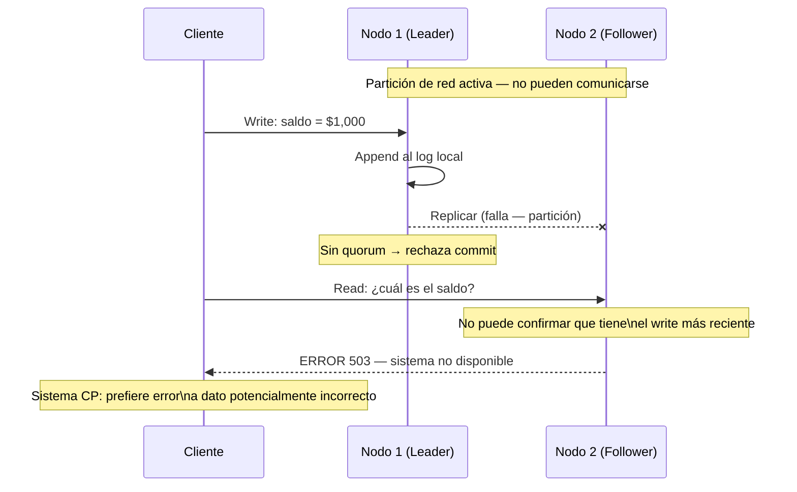
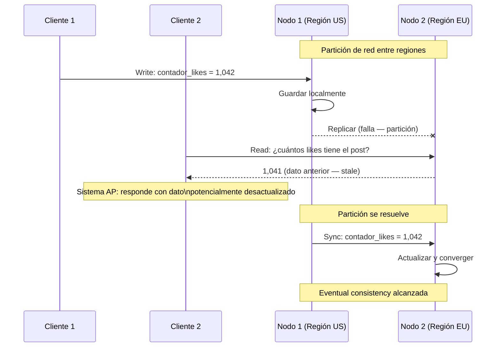
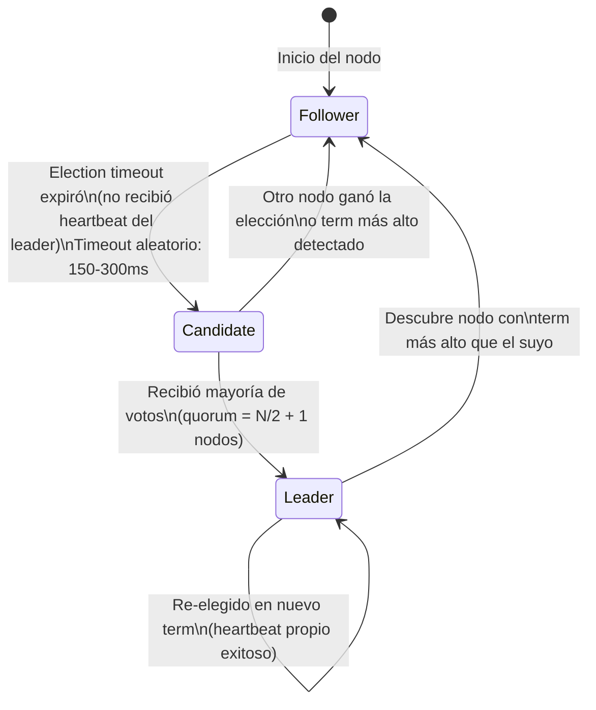
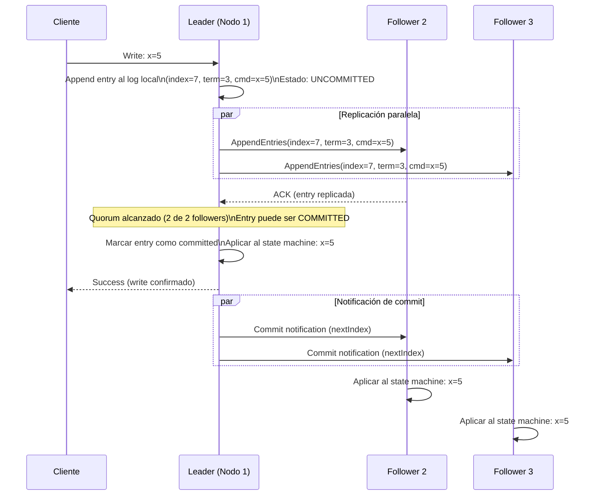
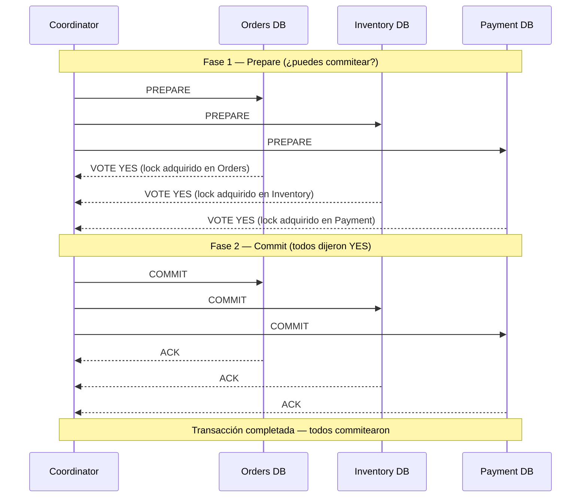
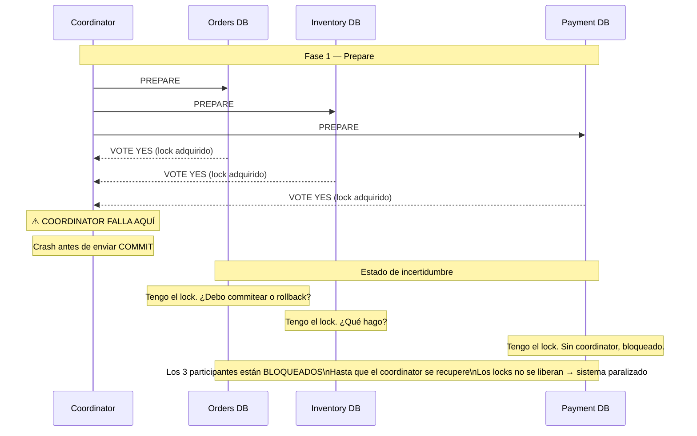
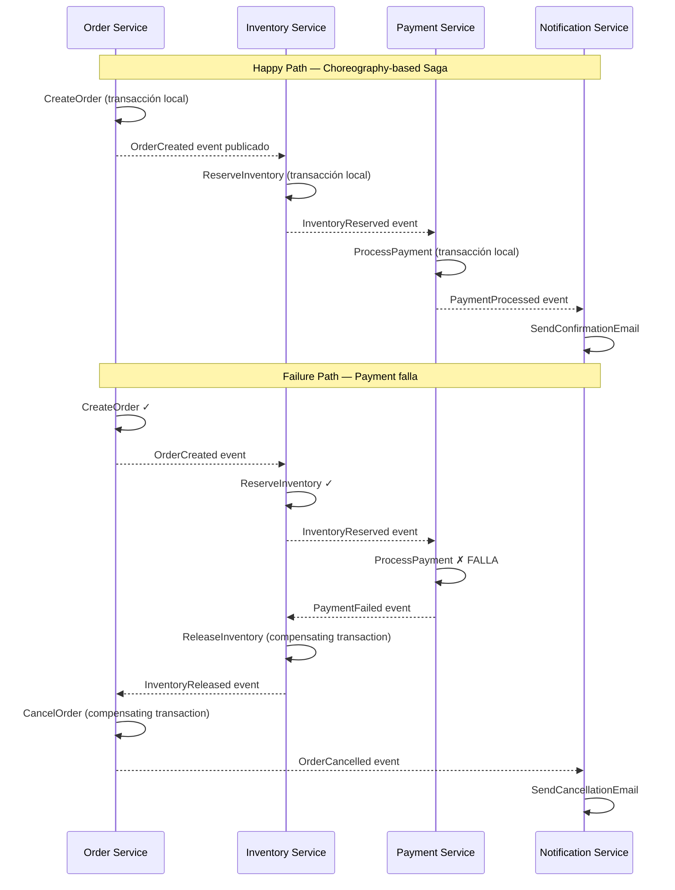
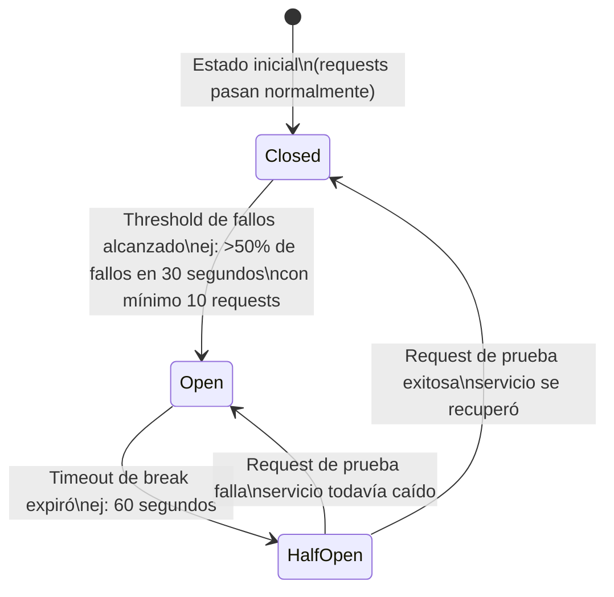

# 04-05 — Distributed Systems: El Modelo Mental que Separa Senior de Staff

> **Prerequisito:** [04-02-bases-de-datos-system-design.md](./04-02-bases-de-datos-system-design.md) — Ese archivo cubrió replication y consistency a nivel de base de datos. Este archivo construye sobre eso y lo generaliza: los mismos problemas de replicación, consistencia, y coordinación aparecen en todo sistema distribuido, no solo en bases de datos. También requiere [04-04-message-queues.md](./04-04-message-queues.md) — los conceptos de exactly-once y at-least-once delivery son casos específicos de los modelos de consistencia que exploraremos aquí.
>
> **Por qué este archivo decide entrevistas Staff:**
> Distributed systems es el tema que más diferencia a un candidato Senior de uno Staff en entrevistas de system design. Un Senior dice "usaría Kafka para desacoplamiento". Un Staff dice "el sistema tiene que elegir entre consistencia y disponibilidad durante particiones de red, y dado que los pagos son el flujo crítico, elegiría CP con eventual consistency para el feed, lo que implica..." Esa diferencia en el nivel de razonamiento es exactamente lo que evalúan en deep dives de entrevistas Staff en 2026.
>
> **📚 Recursos de esta sección:**
> - **DDIA Kleppmann, Capítulos 8-9** — El material de referencia. Capítulo 8: los problemas de los sistemas distribuidos (falacias, relojes, redes). Capítulo 9: consistency y consensus. Lee este archivo completo primero, luego DDIA profundiza cada sección.
> - **Raft Paper (Ongaro & Ousterhout, 2014)** — "In Search of an Understandable Consensus Algorithm". La lectura opcional que marca diferencia en entrevistas de empresas que tienen infraestructura propia.
> - **Amazon Dynamo Paper (DeCandia et al., 2007)** — El caso de estudio real de eventual consistency a escala planetaria. Gratis online.
> - **ByteByteGo — "CAP Theorem Explained"** — Video de 8 minutos. Ver antes de la primera entrevista de system design.

---

## Sección 1 — Por Qué los Sistemas Distribuidos Son Fundamentalmente Diferentes

### La garantía que das por sentada en un monolito

Un sistema que corre en una sola máquina tiene garantías que parecen obvias:

- Si escribes un dato, la siguiente lectura **ve ese dato** (consistencia instantánea)
- Si una operación falla, **sabes** si falló o tuvo éxito (el proceso retorna error o éxito)
- El tiempo es **consistente** en toda la aplicación — dos eventos en la misma máquina tienen un orden temporal claro

En cuanto agregas una segunda máquina y conectas las dos por red, las tres garantías desaparecen. No se degradan — desaparecen. El segundo nodo puede tener datos distintos al primero. Una operación puede fallar *sin que sepas si el otro nodo la procesó*. Dos nodos pueden tener relojes que difieren en cientos de milisegundos.

Esto no es un bug de implementación — es la naturaleza física de los sistemas distribuidos. Entender por qué requiere internalizar las 8 falacias.

### Las 8 Falacias de los Sistemas Distribuidos (Peter Deutsch, Sun Microsystems)

Estas falacias son los supuestos incorrectos que hacen que el código que funciona en desarrollo se rompa en producción. Cada decisión de diseño en sistemas distribuidos es una respuesta defensiva a una o más de estas falacias.

**1. La red es confiable.**
En producción, los cables se desconectan, los switches fallan, los cloud providers tienen outages parciales. AWS, GCP y Azure tienen incidentes de red parciales múltiples veces al mes en producción. Tu sistema debe asumir que *cualquier* llamada de red puede fallar.

**Impacto en diseño:** Toda llamada remota necesita timeout, retry con backoff exponencial, y circuit breaker. Un `HttpClient` sin timeout en .NET puede bloquear un thread indefinidamente.

**2. La latencia es cero.**
Una llamada en memoria tarda nanosegundos. Una llamada al mismo datacenter tarda ~0.5ms. Cross-continent tarda ~150ms. Esto no es un detalle de implementación — es un constraint de arquitectura. Si tu diseño requiere 10 llamadas síncronas en serie para una operación de usuario, estás garantizando latencia percibida de 10 × 150ms = 1.5 segundos como piso mínimo.

**Impacto en diseño:** Batch operations, caché agresivo, llamadas paralelas con `Task.WhenAll`, y diseño async-first.

**3. El ancho de banda es infinito.**
Serializar objetos grandes, enviar payloads sin comprimir, polling frecuente — todo esto colapsa bajo carga real. En sistemas de microservicios con tráfico real, el ancho de banda interno puede ser un cuello de botella inesperado.

**Impacto en diseño:** Protocolos binarios eficientes (gRPC sobre Protobuf vs JSON), compresión, paginación, y events con solo los campos necesarios (no full entity).

**4. La red es segura.**
El tráfico interno entre servicios también puede ser interceptado, especialmente en entornos cloud compartidos o con segmentación deficiente. Zero Trust Network Access (ZTNA) parte de este principio.

**Impacto en diseño:** mTLS entre servicios, no solo TLS externo. Autenticación de servicio a servicio (no solo de usuario a servicio).

**5. La topología no cambia.**
Los nodos se agregan, se eliminan, se despliegan en diferentes zonas. Kubernetes mata y recrea pods. Auto-scaling agrega instancias bajo carga. Tu código que asume que hay exactamente 3 réplicas de una base de datos se rompe cuando hay un failover.

**Impacto en diseño:** Service discovery dinámico (no IPs hardcodeadas), health checks, graceful degradation cuando nodos cambian.

**6. Hay un solo administrador.**
En sistemas distribuidos reales — especialmente microservicios — múltiples equipos operan partes del sistema con políticas distintas. No puedes asumir consistencia operacional.

**Impacto en diseño:** Contratos de API versionados, tolerancia a versiones distintas de servicios coexistiendo (blue-green deployments), y comunicación de cambios breaking.

**7. El costo de transporte es cero.**
En cloud, cada byte transferido entre zonas de disponibilidad o regiones tiene costo real en dinero. Un sistema que transfiere TB de datos entre regiones puede generar facturas inesperadas.

**Impacto en diseño:** Data locality — procesar datos cerca de donde se generan, no mover datos innecesariamente, considerar costos de egress en decisiones de arquitectura.

**8. La red es homogénea.**
En sistemas reales hay mezcla de tecnologías: servicios .NET, Python, Go, bases de datos de múltiples vendors, CDNs de terceros. No puedes asumir que todos hablan el mismo protocolo o tienen las mismas capacidades.

**Impacto en diseño:** Protocolos estándar (HTTP/2, gRPC, AMQP), formats interoperables (JSON, Protobuf), y contratos explícitos.

> **💡 Para la entrevista:** Si te preguntan "¿qué desafíos tienen los sistemas distribuidos?", no listes tecnologías. Enumera las falacias con sus impactos reales. Eso demuestra que entiendes el *problema fundamental*, no solo que conoces Kafka y Redis.

---

## Sección 2 — CAP Theorem: Más Allá de la Definición

### La definición precisa (y las palabras que importan)

El CAP Theorem (Brewer, 2000; formalizado por Gilbert & Lynch, 2002) establece:

> **En un sistema distribuido que experimenta una Partición de red, debes elegir entre Consistencia y Disponibilidad. No puedes tener ambas.**

Cada palabra importa:

- **"sistema distribuido"**: aplica a cualquier sistema con múltiples nodos conectados por red
- **"partición de red"**: los nodos no pueden comunicarse entre sí (ya sea por fallo de red, lentitud extrema, o timeout)
- **"consistencia"**: todas las lecturas ven el write más reciente — esto es lo que los sistemas distribuidos llaman **linearizability**
- **"disponibilidad"**: todas las requests reciben una respuesta (no necesariamente con el dato más reciente)

### ⚠️ Error crítico en entrevistas: La C de CAP ≠ La C de ACID

Este es el error que más cometen los candidatos Senior sin preparación en distributed systems. Es el gotcha que los entrevistadores esperan y que distingue inmediatamente el nivel de comprensión.

| Propiedad | ACID Consistency | CAP Consistency |
|---|---|---|
| ¿Qué garantiza? | Las constraints de la BD nunca se violan (foreign keys, unique constraints, etc.) | Todos los nodos ven los mismos datos al mismo tiempo |
| ¿Dónde aplica? | Dentro de una base de datos (transacciones) | Entre nodos de un sistema distribuido |
| Término técnico preciso | ACID Consistency | Linearizability |
| Ejemplo de violación | Saldo negativo permitido por un bug en la constraint | Un nodo responde con saldo desactualizado porque no recibió el último write |

Cuando dices "consistencia" en una entrevista de distributed systems, siempre significa **linearizability** — la garantía de que el sistema parece operar en una sola máquina con un orden total de operaciones.

### Por qué la partición de red no es opcional

La P de CAP (Partición) no es un caso edge que puedes decidir no tener. En redes reales de producción, las particiones ocurren:

- Por fallos de hardware de red
- Por picos de tráfico que saturan interfaces
- Por bugs en configuración de routing
- Por deployments que crean momentos de asimetría entre versiones
- Por timeouts de red que los protocolos no pueden distinguir de fallos reales

AWS, GCP, Azure tienen particiones parciales documentadas múltiples veces al año. **Si despliegas en múltiples nodos, tienes que asumir que habrá particiones.** La elección real siempre es entre C y A durante esas particiones.

### Sistemas CP — Consistencia sobre Disponibilidad

Cuando ocurre una partición, los nodos que no pueden confirmar que tienen el dato más reciente **rechazan servir requests** en lugar de responder con datos potencialmente obsoletos.



**Cuándo CP es la elección correcta:**
- Coordinación distribuida: quién tiene el lock, quién es el leader de un cluster
- Configuración de sistemas: todos los nodos deben tener la misma config o ninguno actúa
- Datos financieros críticos: un saldo incorrecto es peor que un servicio no disponible temporalmente
- Metadata de sistemas: etcd guarda la configuración de Kubernetes — un nodo con config incorrecta puede destruir un cluster

**Sistemas CP reales:** HBase, Zookeeper, etcd, Redis en modo cluster con quorum habilitado, Google Spanner, CockroachDB

### Sistemas AP — Disponibilidad sobre Consistencia

Cuando ocurre una partición, los nodos responden con lo que tienen aunque pueda estar desactualizado. Cuando la partición se resuelve, los nodos convergen (eventual consistency).



**Cuándo AP es la elección correcta:**
- La mayoría de aplicaciones web y móviles donde un dato ligeramente desactualizado es aceptable
- Feeds, timelines, contadores de interacciones sociales
- Catálogos de productos (el precio puede estar desactualizado por segundos sin consecuencias severas)
- Perfiles de usuario, preferencias, configuraciones personales

**Sistemas AP reales:** DynamoDB (por defecto), Cassandra, CouchDB, Riak, DNS

### La tabla CAP para usar en entrevistas

| Sistema | C o A | Por qué |
|---|---|---|
| etcd / Zookeeper | CP | Coordinación de clusters — un dato incorrecto rompe el sistema |
| HBase | CP | Usa HDFS + HDFS NameNode es CP |
| Google Spanner | CP | TrueTime API garantiza linearizability global |
| CockroachDB | CP | Raft consensus per-range |
| DynamoDB (eventual) | AP | Optimizado para disponibilidad, ofrece strong consistency opcional con costo adicional |
| Cassandra | AP | Configurable pero diseñado para AP |
| MongoDB (default) | AP | Primary puede servir reads stale |
| Redis Sentinel | AP en partición | El sentinel puede elegir un nuevo master con datos no replicados |

---

## Sección 3 — PACELC: El Modelo Más Útil para Decisiones Reales

### El problema de CAP

CAP solo describe el comportamiento **durante particiones**. En producción, las particiones son raras — la mayoría del tiempo el sistema opera normalmente. CAP no dice nada sobre el trade-off en operación normal.

**PACELC** (Daniel Abadi, 2012) completa el modelo:

> **PAC**: en caso de **P**artición → elige entre **A**vailability y **C**onsistency  
> **ELC**: **E**lse (sin partición) → elige entre **L**atency y **C**onsistency

La segunda parte es la que más importa para diseño de sistemas reales:

**Para tener consistencia fuerte (linearizability) en operación normal, necesitas coordinación entre nodos para cada operación.** Esa coordinación tiene costo en latencia. Spanner hace sincronización global usando relojes atómicos (TrueTime) y aún así tiene latencia de escritura de ~5-15ms entre regiones. DynamoDB acepta eventual consistency y tiene latencia de escritura de ~1-3ms.

Este es el trade-off que aparece en el diseño de sistemas reales: ¿cuánta latencia adicional estás dispuesto a pagar por consistencia fuerte en el path normal?

### Tabla PACELC de sistemas reales

| Sistema | Partición | Normal (sin partición) |
|---|---|---|
| DynamoDB | AP — responde con datos potencialmente stale | EL — optimiza latencia sobre consistencia |
| Cassandra | AP — configurable, default AP | EL — tunable (LOCAL_QUORUM vs ALL) |
| Google Spanner | CP — rechaza durante partición | EC — consistencia fuerte, ~5-15ms latencia entre regiones |
| CockroachDB | CP — Raft requiere quorum | EC — serializable isolation, mayor latencia vs eventual |
| MongoDB (default w/ majority) | CP — no commitea sin mayoría | EC — readConcern majority agrega latencia |
| etcd | CP — Raft consensus requerido | EC — cada write requiere quorum |
| Redis (single) | — (no distribuido) | EL — en memoria, latencia sub-ms |

### Por qué PACELC es más útil en entrevistas Staff

Cuando diseñas un sistema, la pregunta no es solo "¿qué pasa en una partición?" (que es rara), sino también "¿qué latencia adicional paga cada write para garantizar consistencia en operación normal?" PACELC captura ambas dimensiones.

Si un entrevistador te pregunta por qué elegiste DynamoDB sobre Spanner, la respuesta PACELC es: "DynamoDB prioriza latencia sobre consistencia en operación normal (EL en PACELC) y disponibilidad sobre consistencia en particiones (AP). Spanner hace el trade-off inverso en ambas dimensiones (EC, CP). Para un sistema de carrito de compras donde el usuario espera respuesta inmediata y podemos tolerar que el inventario esté ligeramente desactualizado, DynamoDB es la elección correcta. Para un sistema financiero donde un centavo de inconsistencia es un problema de compliance, Spanner justifica la latencia adicional."

---

## Sección 4 — Consistency Models: El Espectro Completo

Entre "consistencia perfecta" y "cualquier dato" hay un espectro de modelos con nombres precisos. En entrevistas Staff, usar los términos correctos marca la diferencia entre un candidato que "leyó sobre distributed systems" y uno que los entiende.

### Linearizability (Strong Consistency)

El modelo más fuerte. Cada operación parece ejecutarse instantáneamente en algún punto entre su inicio y su fin. El sistema parece una sola máquina con un único reloj.

```
Timeline:
T1─────────────────T2    Write(x=1) [T1: inicio, T2: fin]
                T3─────────────────T4    Read(x) [T3: inicio, T4: fin]

Con linearizability: Read SIEMPRE retorna 1
El write terminó (T2) antes de que el read empezara (T3) → el read debe ver el write.
```

**Costo:** Requiere coordinación entre nodos para cada operación. En práctica, esto significa:
- Raft/Paxos: quorum write — el write no se confirma hasta que la mayoría de nodos lo tiene
- Latencia proporcional al número de nodos y la latencia de red entre ellos

**Sistemas que lo garantizan:** Google Spanner (via TrueTime), etcd, Zookeeper, CockroachDB

**Cuándo es necesario:** Saldos de cuentas bancarias, metadata de sistemas críticos, locks distribuidos, configuración de sistemas donde todos los nodos deben ver el mismo valor.

### Sequential Consistency

Más relajado que linearizability. Las operaciones parecen ejecutarse en algún orden secuencial consistente con el orden visto por **cada proceso individual** — pero ese orden global puede diferir del orden de tiempo real entre diferentes procesos.

En práctica, raramente implementado en sistemas modernos porque es costoso sin los beneficios completos de linearizability. Aparece en la literatura (es el modelo de los procesadores multi-core sin memory barriers), pero en entrevistas de distributed systems no es el término más importante.

### Causal Consistency

Si la operación A causalmente precede a la operación B (B ocurre después de que A fue observada), todos los nodos deben ver A antes que B. Operaciones sin relación causal pueden verse en orden diferente en distintos nodos.

```
Ejemplo real (red social):
  Usuario 1: Escribe post "Proyecto terminado 🎉"
  Usuario 2: Lee el post → Escribe comentario "Felicidades!"

Con Causal Consistency:
  Cualquier nodo que sirva el comentario DEBE también servir el post original.
  La relación causal: el comentario depende causalmente del post.

Sin Causal Consistency (eventual puro):
  Un tercero podría ver el comentario sin ver el post.
  UX broken: aparece una respuesta a algo que no existe.
```

**Sistemas reales:** Facebook garantiza causal consistency para posts y comentarios en la misma "conversación" — si ves una respuesta, verás el post original. MongoDB ofrece causal consistency como opción con sessions causally consistent.

**Cuándo usar:** Sistemas de mensajería, redes sociales, documentos colaborativos donde el orden de causa-efecto importa para UX pero la consistencia fuerte global sería demasiado costosa.

### Eventual Consistency

Si no se realizan nuevas escrituras, todos los nodos eventualmente convergerán al mismo valor. No hay garantía de cuándo ocurrirá esa convergencia — puede ser milisegundos o segundos.

El paper de Amazon Dynamo (2007) formalizó este modelo como la solución para sistemas AP a escala planetaria. La idea central: la mayoría de operaciones de usuario toleran datos ligeramente desactualizados, y esa tolerancia permite escala y disponibilidad que consistencia fuerte no puede dar.

**Sistemas reales:** DNS (la propagación de cambios de DNS puede tardar hasta 48 horas en propagarse globalmente — eventual consistency deliberada), DynamoDB, Cassandra, los likes/contadores de Twitter.

**Mecanismo de convergencia:** Los sistemas AP usan diferentes estrategias para resolver conflictos cuando los nodos vuelven a sincronizarse:
- **Last-Write-Wins (LWW):** el timestamp más reciente gana — simple pero puede perder writes
- **Vector Clocks:** detectan conflictos y los exponen a la aplicación para resolución (DynamoDB, Riak)
- **CRDTs:** estructuras de datos diseñadas para converger automáticamente sin conflictos (ver Sección 6)

### Monotonic Read Consistency

Una vez que lees un valor X en tiempo T, en todas las lecturas posteriores nunca verás un valor anterior a X. No puedes "ver el pasado".

**Por qué importa para UX:** Si un usuario ve su propio tweet en el timeline, no debería hacer refresh y ver que el tweet "desapareció" (porque el request cayó en una réplica más atrasada).

**Implementación práctica:** Sticky sessions — cada usuario siempre lee de la misma réplica. O: el token de sesión incluye un timestamp del último write, y el sistema garantiza que las lecturas van a réplicas que tienen datos más recientes que ese timestamp (session tokens en DynamoDB).

### Read-Your-Writes (Read-Your-Own-Writes)

Después de escribir un valor, **tú** siempre ves el valor actualizado en lecturas posteriores. Otros usuarios pueden no verlo todavía — pero tú sí.

**Por qué importa:** Después de cambiar tu foto de perfil, siempre ves la nueva foto cuando navegas tu propio perfil. Otros usuarios pueden ver la foto vieja por algunos segundos — aceptable. Pero tú ver tu propia foto vieja es una UX rota.

**Implementación:** Writes síncronos a la réplica primaria con posterior confirmación, reads también contra la réplica primaria (con costo en latencia) o con tracking del write timestamp en el token de sesión.

### Tabla resumen de consistency models

| Modelo | Latencia | Disponibilidad | Casos de uso ideales |
|---|---|---|---|
| Linearizability | Alta | Baja (CP) | Locks distribuidos, saldos financieros, metadata crítica |
| Sequential | Alta | Baja | Raramente usado en práctica |
| Causal | Media | Media | Redes sociales, mensajería, documentos colaborativos |
| Eventual | Baja | Alta (AP) | Contadores, feeds, catálogos, la mayoría de UX web |
| Monotonic Read | Baja-Media | Alta | Timelines, feeds paginados |
| Read-Your-Writes | Baja-Media | Alta | Cualquier UI donde el usuario ve sus propios cambios |

---

## Sección 5 — Consensus Algorithms: Cómo los Nodos Se Ponen de Acuerdo

### El problema del consenso — y por qué es difícil

En un sistema distribuido, ¿cómo se ponen de acuerdo múltiples nodos sobre un valor cuando cualquiera de ellos puede fallar en cualquier momento?

El problema específico: imagina un cluster de 5 nodos de base de datos. Todos tienen que saber quién es el "leader" que acepta writes. Si no hay consenso:

- **Split brain:** dos nodos creen que son líderes simultáneamente
- Ambos aceptan writes contradictorios
- Cuando el split se resuelve, hay datos corruptos en el sistema

El FLP Impossibility Theorem (Fischer, Lynch, Paterson, 1985) prueba que en un sistema asíncrono con la posibilidad de un solo proceso que falla, no existe un algoritmo que garantice consenso en tiempo finito. En práctica, los algoritmos de consenso trabajan con timeouts y probabilidades — y en condiciones normales convergen rápido.

### Raft — El Algoritmo de Consenso que Debes Entender

Paxos (Lamport, 1998) fue el primer algoritmo de consenso práctico, pero es notoriamente difícil de entender e implementar correctamente. Raft (Ongaro & Ousterhout, 2014) fue diseñado explícitamente para ser comprensible sin sacrificar correctitud. El paper se llama "In Search of an Understandable Consensus Algorithm" — el nombre dice todo.

Raft divide el problema en tres subproblemas independientes:
1. **Leader Election:** seleccionar un único leader entre los nodos
2. **Log Replication:** el leader acepta client requests y replica las entries a followers
3. **Safety:** garantizar que dos líderes nunca apliquen entries diferentes en el mismo índice del log

#### Leader Election en Raft



El proceso completo:

1. **Todos los nodos inician como Followers**. Cada Follower tiene un temporizador de elección (election timeout) configurado con un valor aleatorio entre 150ms y 300ms.

2. **Si un Follower no recibe un heartbeat del leader** durante su timeout, asume que el leader falló y se convierte en **Candidate**. El timeout aleatorio garantiza que generalmente un solo nodo se convierte en Candidate primero — si todos tuvieran el mismo timeout, todos votarían simultáneamente por sí mismos y nunca nadie ganaría.

3. **El Candidate incrementa su term** (número de elección global monotonicamente creciente), **vota por sí mismo**, y envía `RequestVote` a todos los otros nodos.

4. **Los Followers votan** por el primer Candidate que reciben (en ese term), siempre que el log del Candidate sea al menos tan actualizado como el propio.

5. **Si el Candidate recibe votos de la mayoría** (N/2 + 1 en un cluster de N nodos), se convierte en **Leader** y empieza a enviar heartbeats.

**¿Por qué quorum = mayoría?**
Con 5 nodos, la mayoría es 3. Incluso si 2 nodos fallan, los 3 restantes pueden elegir un leader y continuar. Pero si un nodo tiene datos más recientes que otro, la mayoría garantiza que al menos un nodo del quorum tiene los datos más recientes — por solapamiento de conjuntos.

#### Log Replication en Raft

Una vez elegido, el Leader es el único que acepta writes de clientes. Cada write es una "entry" que se agrega al log del Leader y luego se replica.



**La garantía crítica:** Una entry se considera **committed** cuando la mayoría de nodos la tienen en su log. Esto garantiza que si el Leader falla después del commit, cualquier nuevo Leader que se elija habrá visto esa entry — porque el nuevo Leader necesita ganar una elección con mayoría de votos, y la mayoría siempre tiene al menos un nodo con la entry committed.

**Safety en Raft:** Un Candidate solo puede ganar una elección si su log tiene todas las entries committed. Los Followers rechazan votar por un Candidate cuyo log esté más atrasado que el propio (verificado por el último term y último index en el log).

### Paxos vs Raft — la respuesta en entrevistas

Ambos resuelven el mismo problema: consenso en un sistema distribuido con fallos arbitrarios. Paxos fue el primero (1998) y está probado matemáticamente. Raft (2014) fue diseñado explícitamente como alternativa más comprensible.

En entrevistas Staff: "Conozco Raft — Leader Election, Log Replication, y las garantías de Safety. Paxos resuelve el mismo problema pero tiene reputación de ser más difícil de implementar correctamente — de ahí que Raft fuera diseñado como alternativa más legible. En práctica, etcd usa Raft, que es el backing store de Kubernetes, así que Raft tiene prueba de producción a enorme escala."

**Sistemas que usan Raft en producción:**
- **etcd** — backing store de Kubernetes; cada write al API server de K8s pasa por Raft
- **CockroachDB** — Raft per-range para cada rango de datos
- **TiKV** — base de datos distribuida de TiDB, usa Raft multi-group
- **Consul** — service mesh y service discovery de HashiCorp
- **Kafka KRaft mode** — desde Kafka 3.3, reemplaza ZooKeeper con Raft interno

---

## Sección 6 — Logical Clocks: Por Qué el Tiempo Físico No Funciona

### El problema fundamental

Los relojes físicos de máquinas distintas nunca están perfectamente sincronizados. NTP (Network Time Protocol) tiene precisión de ~1ms en LAN y ~100ms en internet. Si dos eventos ocurren dentro de ese margen de imprecisión, no puedes determinar cuál ocurrió primero usando timestamps de sistema.

**El escenario concreto:**
- Nodo A registra evento en timestamp 1000ms
- Nodo B registra evento en timestamp 999ms
- ¿El evento de B ocurrió antes? Imposible saberlo — los relojes pueden diferir más de 1ms

Google Spanner resuelve esto con TrueTime — relojes atómicos y GPS en cada datacenter, con incertidumbre de ~7ms garantizada. Pero eso es hardware especializado. Para el resto del mundo, necesitamos clocks lógicos.

### Lamport Clocks

Leslie Lamport (1978) — el mismo Lamport de Paxos — definió el concepto de "happened-before" y el algoritmo de Lamport Clocks.

**La regla de Lamport:**
1. Cada proceso mantiene un contador entero (Lamport clock), inicializado en 0
2. Antes de cada evento local: `clock++`
3. Antes de enviar un mensaje: incluir el clock actual
4. Al recibir un mensaje con timestamp T: `clock = max(clock_local, T) + 1`

```
Proceso A        Proceso B        Proceso C
  a1 (c=1)   ──────────────────────────────
  a2 (c=2)                         
  a3 (c=3) ──→ b1 (c=4)           
                b2 (c=5)  ──────→ c1 (c=6)
                b3 (c=6)           c2 (c=7)
```

**Lo que garantiza:** Si `happened-before(A, B)`, entonces `clock(A) < clock(B)`.  
**Lo que NO garantiza:** Si `clock(A) < clock(B)`, NO puedes concluir que A ocurrió antes que B.

**La limitación crítica:** Lamport Clocks no pueden detectar eventos concurrentes. Si dos eventos tienen Lamport timestamps distintos, no sabes si uno causó al otro o si fueron concurrentes.

### Vector Clocks

La solución: en lugar de un único número, cada proceso mantiene un **vector** de contadores — uno por cada proceso en el sistema.

**Reglas:**
1. Cada proceso P_i mantiene un vector V donde V[i] es el contador propio y V[j] es el contador más reciente que P_i conoce de P_j
2. Antes de cada evento local: `V[i]++`
3. Antes de enviar un mensaje: incluir el vector V completo
4. Al recibir un mensaje con vector V': `V[j] = max(V[j], V'[j])` para cada j, luego `V[i]++`

```
Nodo A (A:_, B:_, C:_)    Nodo B (A:_, B:_, C:_)    Nodo C (A:_, B:_, C:_)

A: evento local  → [1,0,0]
A envía a B      → [1,0,0] ────────────────→ B recibe: [1,1,0] (max de vectores + B++)
                                              B evento local: [1,2,0]
                                              B envía a C: [1,2,0] ──→ C recibe: [1,2,1]
                                                                        C evento local: [1,2,2]
```

**Comparación de vectores:**
- `[2,1,0]` **causalmente precede a** `[3,2,1]` (todos los componentes del primero ≤ los del segundo, y al menos uno es estrictamente menor)
- `[2,1,0]` y `[1,3,0]` son **concurrentes** — ninguno domina al otro componente a componente → no hay relación causal entre ellos

**La potencia:** Vector Clocks permiten detectar exactamente cuándo dos eventos son concurrentes — información que Lamport Clocks no puede dar. Esto es crítico para detectar conflictos en sistemas AP.

### CRDTs — Estructuras de Datos que Convergen Sin Coordinación

**Conflict-Free Replicated Data Types** son estructuras de datos diseñadas para que múltiples réplicas puedan ser modificadas concurrentemente y siempre convergen a un estado consistente sin necesidad de coordinación o resolución manual de conflictos.

**Ejemplo clásico — G-Counter (Grow-only Counter):**
Cada nodo tiene su propio contador. Para incrementar, incrementas tu propio contador. El valor global es la suma de todos los contadores. Nunca hay conflicto porque cada nodo solo modifica su parte.

```csharp
// Concepto de G-Counter con CRDTs
public class GCounter
{
    private readonly Dictionary<string, long> _counters = new();
    private readonly string _nodeId;

    public GCounter(string nodeId) => _nodeId = nodeId;

    // Solo incrementar el propio contador — nunca conflicto
    public void Increment() => _counters[_nodeId] = (_counters.GetValueOrDefault(_nodeId)) + 1;

    // El valor global es la suma de todos los nodos
    public long Value => _counters.Values.Sum();

    // Merge: toma el máximo de cada nodo — converge siempre al mismo resultado
    public void Merge(GCounter other)
    {
        foreach (var (nodeId, count) in other._counters)
            _counters[nodeId] = Math.Max(_counters.GetValueOrDefault(nodeId), count);
    }
}
```

**Uso real:** Google Docs usa CRDTs para la edición colaborativa de documentos — múltiples usuarios pueden editar simultáneamente sin bloqueos, y los cambios convergen automáticamente. Redis Enterprise tiene soporte de CRDTs para geo-replication activa-activa.

---

## Sección 7 — Distributed Transactions: 2PC vs Saga

Cuando una operación de negocio necesita actualizar datos en **múltiples servicios o bases de datos**, necesitas coordinar para mantener consistencia. Esta es la pregunta de system design más común en fintech, e-commerce, y cualquier dominio con operaciones multi-servicio.

### Two-Phase Commit (2PC)

El protocolo clásico para transacciones distribuidas. Un Coordinator orquesta a múltiples Participants.



**El happy path funciona.** El problema aparece en el failure path.

**El problema fatal de 2PC — Coordinator Failure:**



Este es el **blocking problem** de 2PC: si el coordinator falla en el momento incorrecto, todos los participants quedan bloqueados indefinidamente con sus locks adquiridos. En un sistema de producción con miles de transacciones por segundo, un coordinator caído puede bloquear el sistema completo durante minutos.

**Cuándo usar 2PC a pesar del riesgo:**
- Transacciones dentro del mismo sistema de BD (SQL Server o PostgreSQL con Distributed Transactions internos)
- Sistemas donde el bloqueo temporal es aceptable y hay planes de recovery claros
- Transacciones entre servicios del mismo team con SLAs alineados
- Cuando la consistencia fuerte es absolutamente requerida y el volumen de transacciones distribuidas es bajo

### Saga Pattern — La Alternativa Sin Bloqueo

Una Saga es una secuencia de transacciones locales coordinadas. Si una transacción falla, ejecuta **compensating transactions** para deshacer los pasos anteriores de forma explícita.



**Choreography vs Orchestration:**

**Choreography:** cada servicio reacciona a eventos y emite los propios. Sin coordinador central.
- ✅ Bajo acoplamiento — cada servicio solo conoce los eventos que le importan
- ✅ Sin single point of failure
- ❌ Difícil visualizar el flujo completo del negocio
- ❌ Testing complejo — hay que simular múltiples servicios

**Orchestration:** un Saga Orchestrator central envía comandos explícitos y espera respuestas.
- ✅ Flujo de negocio visible y centralizado — fácil de debuggear
- ✅ Testing más simple — solo testeas el orchestrator
- ❌ El orchestrator es un punto de acoplamiento
- ❌ Si el orchestrator falla, el proceso se detiene

En .NET, Orchestration se implementa frecuentemente con **MassTransit Sagas** o **Wolverine**. Choreography con eventos en Azure Service Bus o Kafka.

### Trade-offs 2PC vs Saga

| Aspecto | 2PC | Saga |
|---|---|---|
| Modelo de consistencia | ACID fuerte (C de ACID) | Eventual consistency (BASE) |
| Disponibilidad durante fallos | Baja — blocking en coordinator failure | Alta — sin locks distribuidos |
| Complejidad de implementación | Media | Alta — compensating transactions son difíciles |
| Latencia | Alta — todas las fases son síncronas | Baja — transacciones locales, asíncronas |
| Debugging | Simple — un log de transacción | Complejo — eventos distribuidos en múltiples servicios |
| Cuándo usar | Misma BD o mismo sistema transaccional | Microservicios con alta disponibilidad requerida |

**La regla Staff para entrevistas:**
- Para transacciones **dentro de una única base de datos** → ACID nativo (sin 2PC ni Saga)
- Para operaciones **entre microservicios independientes** → Saga (Orchestration si el flujo es complejo, Choreography si es simple)
- Para 2PC **entre servicios independientes en producción** → evitar; el blocking problem en producción no vale la consistencia que aporta

---

## Sección 8 — Patrones de Resiliencia en Sistemas Distribuidos

Estos patrones aparecen en preguntas de deep dive en entrevistas Staff de cualquier empresa con sistemas distribuidos reales.

### Circuit Breaker

El problema: si un servicio downstream está lento o caído, cada request tuyo espera el timeout configurado. Con 1,000 requests/segundo y timeout de 5 segundos, en 5 segundos tienes 5,000 requests bloqueados. Tu servicio colapsa por cascada.

Circuit Breaker detecta este patrón y "abre el circuito" — falla rápido sin esperar el timeout, dando tiempo al servicio downstream para recuperarse.



**Implementación en .NET con Polly v8 (API moderna):**

```csharp
using Polly;
using Polly.CircuitBreaker;
using Polly.Retry;

// Polly v8 usa ResiliencePipelineBuilder
var pipeline = new ResiliencePipelineBuilder<HttpResponseMessage>()
    .AddCircuitBreaker(new CircuitBreakerStrategyOptions<HttpResponseMessage>
    {
        // Abrir si más del 50% de requests fallan
        FailureRatio = 0.5,
        // Evaluar sobre mínimo 10 requests (evita abrir con 1 fallo de 1 request)
        MinimumThroughput = 10,
        // Ventana de tiempo para evaluar el ratio
        SamplingDuration = TimeSpan.FromSeconds(30),
        // Permanecer abierto 60 segundos antes de ir a HalfOpen
        BreakDuration = TimeSpan.FromSeconds(60),
        // Qué cuenta como fallo
        ShouldHandle = new PredicateBuilder<HttpResponseMessage>()
            .Handle<HttpRequestException>()
            .HandleResult(r => r.StatusCode >= System.Net.HttpStatusCode.InternalServerError),
        OnOpened = args =>
        {
            _logger.LogWarning(
                "Circuit breaker abierto. Fallo ratio: {FailureRate:P}. " +
                "Break hasta: {BreakUntil:HH:mm:ss}",
                args.Outcome.Exception?.Message,
                DateTimeOffset.UtcNow.Add(args.BreakDuration));
            return ValueTask.CompletedTask;
        },
        OnClosed = args =>
        {
            _logger.LogInformation("Circuit breaker cerrado — servicio recuperado");
            return ValueTask.CompletedTask;
        }
    })
    .AddRetry(new RetryStrategyOptions<HttpResponseMessage>
    {
        MaxRetryAttempts = 3,
        Delay = TimeSpan.FromMilliseconds(200),
        BackoffType = DelayBackoffType.Exponential,
        // UseJitter evita thundering herd: todos los clientes reintentan al mismo tiempo
        UseJitter = true,
        ShouldHandle = new PredicateBuilder<HttpResponseMessage>()
            .Handle<HttpRequestException>()
            .HandleResult(r => r.StatusCode == System.Net.HttpStatusCode.ServiceUnavailable)
    })
    .Build();

// Registrar como servicio en DI
services.AddResiliencePipeline<string, HttpResponseMessage>("payment-api", builder =>
{
    // Configuración extraída a método reutilizable para consistencia entre servicios
    builder.AddCircuitBreaker(GetCircuitBreakerOptions())
           .AddRetry(GetRetryOptions());
});
```

> ⚠️ **El orden importa en Polly:** el Circuit Breaker debe ir **antes** que Retry en el pipeline. Si pones Retry primero, Polly intentará 3 reintentos antes de que el Circuit Breaker vea el fallo — y el Circuit Breaker nunca abrirá correctamente bajo presión real.

### Bulkhead Pattern

Aislar diferentes partes del sistema para que el fallo de una no cascade a las otras. El nombre viene de los compartimentos estancos de un barco — si uno se llena de agua, los otros permanecen secos.

```csharp
// Bulkhead con SemaphoreSlim — limitar concurrencia por servicio externo
public class PaymentBulkheadService
{
    // Máximo 10 requests simultáneas al servicio de pagos
    // Si hay más, falla rápido en lugar de acumular threads bloqueados
    private readonly SemaphoreSlim _paymentBulkhead = new(initialCount: 10, maxCount: 10);
    private readonly IPaymentClient _paymentClient;
    private readonly ILogger<PaymentBulkheadService> _logger;

    public async Task<PaymentResult> ProcessPaymentAsync(
        PaymentRequest request,
        CancellationToken cancellationToken = default)
    {
        // WaitAsync(TimeSpan.Zero) = intento inmediato, no bloquea
        if (!await _paymentBulkhead.WaitAsync(TimeSpan.Zero, cancellationToken))
        {
            _logger.LogWarning(
                "Bulkhead rechazó request — payment service al límite de concurrencia. " +
                "Requests actuales: {Current}",
                10 - _paymentBulkhead.CurrentCount);

            throw new BulkheadRejectedException(
                "Payment service at capacity. Retry after backoff.");
        }

        try
        {
            return await _paymentClient.ProcessAsync(request, cancellationToken);
        }
        finally
        {
            // SIEMPRE liberar, incluso en excepción
            _paymentBulkhead.Release();
        }
    }
}
```

**Por qué Bulkhead importa en sistemas distribuidos:**
Sin Bulkhead, si el servicio de pagos se pone lento, todos los threads de tu API empiezan a esperar. Con suficiente tráfico, agotás el thread pool completo — y ahora tu API no puede servir ni los endpoints que no dependen de pagos. El Bulkhead limita el "radio de explosión" (blast radius) del fallo.

### Idempotency Keys

En sistemas distribuidos, los reintentos son inevitables — timeouts de red, failovers, retries del cliente. Si tu operación no es idempotente, un reintento puede crear un duplicado (cobrar dos veces al usuario, crear dos órdenes).

**La solución:** cada operación que modifica estado lleva un **Idempotency Key** — un identificador único generado por el cliente que el servidor usa para detectar y deduplicar reintentos.

```csharp
// Implementación de idempotency key en ASP.NET Core
[ApiController]
[Route("api/v1/payments")]
public class PaymentsController : ControllerBase
{
    [HttpPost]
    public async Task<IActionResult> ProcessPayment(
        [FromBody] PaymentRequest request,
        [FromHeader(Name = "Idempotency-Key")] string? idempotencyKey,
        CancellationToken ct)
    {
        if (string.IsNullOrEmpty(idempotencyKey))
            return BadRequest("Idempotency-Key header es requerido para operaciones de pago");

        // Verificar si ya existe una respuesta cacheada para este key
        var cached = await _idempotencyStore.GetAsync(idempotencyKey, ct);
        if (cached != null)
        {
            // Reintento detectado — devolver misma respuesta sin procesar de nuevo
            _logger.LogInformation("Reintento detectado para idempotency key {Key}", idempotencyKey);
            return Ok(cached);
        }

        // Procesar el pago por primera vez
        var result = await _paymentService.ProcessAsync(request, ct);

        // Guardar respuesta para futuros reintentos (TTL: 24 horas es común)
        await _idempotencyStore.SetAsync(idempotencyKey, result, TimeSpan.FromHours(24), ct);

        return Ok(result);
    }
}
```

Ver implementación completa en [03-07-api-design.md](./03-07-api-design.md) — la idempotencia en APIs es el complemento de la idempotencia en sistemas distribuidos.

---

## Sección 9 — Aplicación en Entrevistas Staff: Cómo Usar Este Conocimiento

### El framework de razonamiento para preguntas de distributed systems

Cuando en una entrevista te preguntan sobre consistencia, sigue este flujo:

```
1. ¿Cuál es el dato que puede ser inconsistente?
   → No todo el sistema tiene el mismo requirement. Identifica el dato crítico.

2. ¿Qué pasa si un usuario lee un dato desactualizado?
   → ¿Consecuencias financieras? ¿Sólo UX degradada?

3. ¿Cuál es el patrón de acceso?
   → Read-heavy: tolerar más inconsistencia en reads para ganar latencia
   → Write-heavy: las garantías de write importan más

4. ¿Cuál es la tolerancia al downtime vs datos incorrectos?
   → CP: prefiero error a dato incorrecto (pagos, inventario crítico)
   → AP: prefiero dato ligeramente desactualizado a error (feed, likes)

5. ¿Qué consistency model necesito en operación normal (no solo en partición)?
   → ¿Linearizability? ¿Causal? ¿Eventual? Cada uno tiene costo diferente en latencia.
```

### Respuesta nivel promedio vs nivel Staff

**Pregunta:** "Diseña el sistema de inventario para un e-commerce. ¿Cómo manejas la consistencia?"

**Respuesta nivel promedio:**
"Usaría una base de datos SQL con transacciones para garantizar que el inventario sea consistente. Cuando alguien compra, decremento el stock en una transacción."

**Respuesta nivel Staff:**
"Primero necesito distinguir dos flujos: la *visualización* de inventario (cuántos quedan en la página del producto) y el *checkout* (reservar y decrementar al comprar).

Para visualización: eventual consistency es completamente aceptable. Que el usuario vea '5 disponibles' cuando en realidad quedan 4 no tiene consecuencias críticas. Usaría un cache con TTL de 30-60 segundos servido desde Redis — AP, baja latencia, alta disponibilidad.

Para checkout: aquí SÍ necesito garantías más fuertes. El riesgo es overselling — vender 10 unidades cuando solo hay 5. Pero linearizability estricta en cada checkout crea un cuello de botella. La solución es **reservas temporales con timeout**: cuando un usuario inicia checkout, reservo el stock por 10 minutos (una transacción local en la DB). Si completa el pago, confirmo. Si no, libero después del timeout. Esto me da consistency suficiente sin bloqueos globales.

Para el sistema de pagos: usaría Saga con Orchestration — si el pago falla, la compensating transaction libera la reserva de inventario. No 2PC entre servicios independientes — el blocking problem en producción no vale la consistencia extra.

El CAP choice aquí: AP para reads, con consistency reforzada solo en el momento crítico del checkout a través de reservas temporales."

**La diferencia:** el candidato Staff distingue los diferentes datos con diferentes requirements en el mismo sistema, articula el trade-off específico de cada decisión, y usa terminología precisa (CP/AP, Saga, compensating transactions) de forma natural.

---

## Tabla Resumen: CAP × Sistemas Reales

| Sistema | C o A | Consistency Model | Cuándo usarlo en diseño |
|---|---|---|---|
| Google Spanner | CP | Linearizability (TrueTime) | Datos financieros globales, compliance estricto |
| CockroachDB | CP | Serializable | SQL con escala horizontal, datos críticos |
| etcd | CP | Linearizability | Metadata de clusters, coordination, locks |
| Zookeeper | CP | Sequential Consistency | Leader election, distributed locks (legado) |
| DynamoDB (eventual) | AP | Eventual | Carrito de compras, sessions, perfiles de usuario |
| DynamoDB (strong) | CP | Linearizability | Pagando precio en latencia — para datos críticos específicos |
| Cassandra | AP | Eventual (tunable) | Timelines, logs, IoT data, write-heavy |
| MongoDB | AP/CP | Tunable (majority/local) | Documentos, catalogs — según readConcern |
| Redis (standalone) | — | Strong (single node) | Cache, sessions, rate limiting |
| Kafka | AP | Eventual (configurable) | Event streaming, log ingestion |

---

## Checklist de Salida — Criterios Medibles

Criterios exigentes. Si no puedes hacer esto, el archivo no está asimilado:

**Fundamentos:**
- [ ] Puedo explicar las 8 falacias de los sistemas distribuidos con un impacto de diseño concreto para cada una
- [ ] Puedo explicar por qué la C de CAP y la C de ACID son conceptos diferentes, con el término técnico correcto para cada una
- [ ] Puedo explicar el PACELC theorem y por qué es más útil que CAP para decisiones de diseño cotidianas
- [ ] Puedo ubicar DynamoDB, Cassandra, Spanner, etcd, y CockroachDB en el espectro CAP y PACELC

**Consistency models:**
- [ ] Puedo explicar la diferencia entre linearizability, causal consistency, y eventual consistency con ejemplos de sistemas reales
- [ ] Puedo explicar Read-Your-Writes y Monotonic Read con un caso de uso de UX concreto
- [ ] Puedo decir qué consistency model usar dado un scenario concreto de negocio

**Consensus:**
- [ ] Puedo explicar el Leader Election de Raft paso a paso, incluyendo por qué el timeout es aleatorio
- [ ] Puedo explicar Log Replication en Raft y qué significa que una entry esté "committed"
- [ ] Puedo nombrar 3 sistemas de producción que usan Raft

**Transactions distribuidas:**
- [ ] Puedo dibujar el 2PC happy path y el 2PC failure path con coordinator crash
- [ ] Puedo explicar el blocking problem de 2PC y por qué es problemático en microservicios
- [ ] Puedo diseñar una Saga para un flujo de e-commerce (orden → inventario → pago) con compensating transactions
- [ ] Puedo elegir entre Choreography y Orchestration con criterios técnicos concretos

**Resiliencia:**
- [ ] Puedo implementar un Circuit Breaker con Polly v8 (ResiliencePipelineBuilder) de memoria
- [ ] Puedo explicar por qué Bulkhead limita el blast radius de un fallo de servicio
- [ ] Puedo implementar idempotency keys en una API endpoint de .NET

**Entrevista:**
- [ ] Puedo articular la diferencia entre respuesta nivel Senior y nivel Staff en una pregunta de consistency
- [ ] Puedo usar el framework de razonamiento (5 preguntas) para analizar cualquier sistema y determinar qué consistency model necesita cada componente
- [ ] Dado un sistema (e-commerce, red social, sistema de pagos), puedo identificar qué partes necesitan CP y qué partes pueden ser AP

---

## Recursos

**Obligatorios ahora:**
- **DDIA Kleppmann Capítulo 8** — "The Trouble with Distributed Systems" — las falacias con rigor matemático
- **DDIA Kleppmann Capítulo 9** — "Consistency and Consensus" — el espectro completo con ejemplos reales
- **ByteByteGo — "CAP Theorem Explained"** (YouTube) — ver antes de cualquier entrevista de system design

**Recomendados (marcan diferencia en entrevistas de empresas con infraestructura propia):**
- **Raft Paper** (ongaro.github.io/raft) — "In Search of an Understandable Consensus Algorithm" — 18 páginas, lectura de 2-3 horas
- **Amazon Dynamo Paper** (2007) — el documento fundacional de eventual consistency a escala real

**Complementarios:**
- **Martin Fowler — "Saga"** (martinfowler.com) — la referencia de facto para el patrón Saga con Orchestration y Choreography
- **Polly v8 Documentation** (pollydocs.org) — API moderna de ResiliencePipelineBuilder

---

> **Siguiente paso:** [04-06-observability-reliability.md](./04-06-observability-reliability.md) — Una vez que entiendes por qué los sistemas distribuidos fallan (este archivo), el siguiente tema es cómo detectar esos fallos antes de que los usuarios los reporten: SLOs, alerting, distributed tracing, y gestión de incidentes.
>
> **Conexión con módulos anteriores:**
> - Los conceptos de exactly-once y at-least-once delivery de [04-04-message-queues.md](./04-04-message-queues.md) son aplicaciones específicas del modelo AP con eventual consistency
> - El master-replica replication de [04-02-bases-de-datos-system-design.md](./04-02-bases-de-datos-system-design.md) es un ejemplo concreto de CP (primary) con eventual consistency en réplicas
> - Las Sagas se implementan sobre los patrones CQRS y event sourcing de [03-06-cqrs-event-sourcing.md](./03-06-cqrs-event-sourcing.md)
