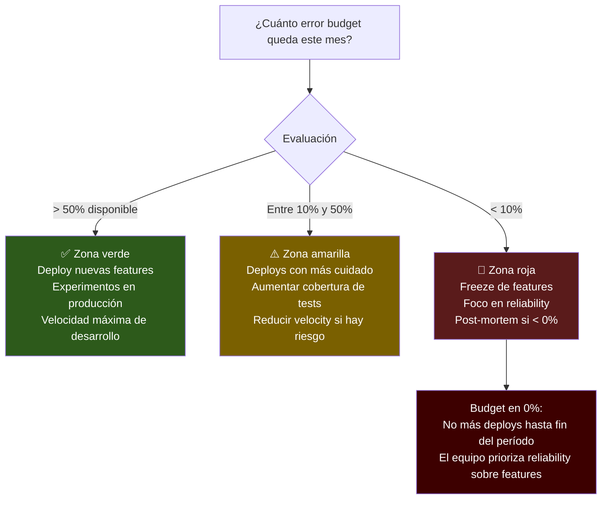
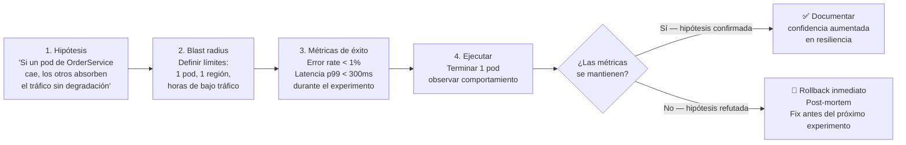
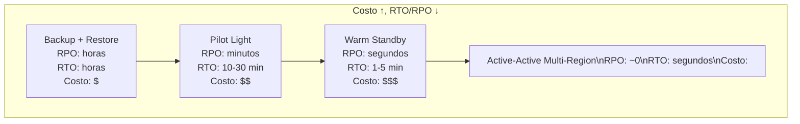

# 04-06 — Observability y Reliability: Diseñar Sistemas que se Pueden Operar

> **Prerequisito:** [04-05-distributed-systems.md](./04-05-distributed-systems.md) — Ese archivo cubrió los modos de fallo de sistemas distribuidos: particiones de red, fallas de nodos, inconsistencia temporal. Este archivo responde la pregunta que inevitablemente sigue: una vez que el sistema falla, ¿cómo lo sabes? ¿Cómo lo debuggeas? ¿Cómo defines qué tan disponible debe ser antes de que el fallo sea inaceptable?
>
> **Por qué este archivo decide entrevistas Staff:**
> Un Senior puede implementar un sistema que funciona. Un Staff puede implementar un sistema que es *operable*: que falla de forma predecible, que comunica su estado interno, y que permite tomar decisiones de ingeniería objetivas basadas en datos. En 2026, ninguna empresa contrata Staff Engineers para sistemas que no se pueden operar en producción. Los conceptos de este archivo —SLOs, error budgets, los tres pilares— son el lenguaje que usan los Engineering Managers y Staff Engineers para tomar decisiones de reliability.
>
> **📚 Recursos de esta sección:**
> - **Google SRE Book, Capítulos 4-7** — El material definitivo. Gratuito en [sre.google/sre-book](https://sre.google/sre-book/table-of-contents/). Capítulo 4: SLOs. Capítulo 5: Eliminating Toil. Capítulo 6: Monitoring. Capítulo 7: Automation.
> - **OpenTelemetry .NET** — [opentelemetry.io/docs/languages/dotnet](https://opentelemetry.io/docs/languages/dotnet/) — La API moderna para instrumentación. No uses el SDK legacy de Application Insights directamente cuando puedes usar OpenTelemetry con el exporter de Azure Monitor.
> - **ByteByteGo — "Observability Series"** — Newsletter + videos. Visual, conciso, con escenarios de producción reales.
> - **Azure Monitor / Application Insights** — La implementación práctica para el stack de Omar. OpenTelemetry → Azure Monitor Exporter.

---

## Sección 1 — Por Qué Observability es una Decisión de Arquitectura

### El sistema que no puedes observar no puedes operar

Aquí está el error conceptual más común: pensar que la observability es algo que agregas *después* de que el sistema está en producción, cuando empiezan los problemas. Es exactamente al revés.

Cuando diseñas un sistema sin pensar en observability desde el inicio, lo que estás haciendo es diseñar un sistema que vas a tener que operar a ciegas. El primer incidente grave en producción te va a costar horas de debugging en lugar de minutos, y en sistemas con SLAs reales, esas horas tienen un costo medible en dinero y en confianza de clientes.

**La observability es una decisión de diseño del mismo nivel que la elección de base de datos o el modelo de comunicación entre servicios.**

### Monitoring vs Observability — la distinción que importa en entrevistas

Esta distinción aparece constantemente en entrevistas Staff y muchos candidatos la confunden:

**Monitoring** es la práctica de verificar que el sistema cumple con expectativas *predefinidas*. Preparas dashboards con métricas conocidas, defines umbrales, y recibes alertas cuando algo supera esos umbrales. Funciona bien cuando ya sabes qué preguntas vas a necesitar hacer.

**Observability** es la capacidad de entender el estado interno del sistema a partir de sus *outputs externos*, incluyendo preguntas que nunca anticipaste. Un sistema observable te permite responder "¿por qué la request del usuario X tardó 3 segundos el martes a las 2pm?" sin haber preparado un dashboard específico para esa pregunta de antemano.

La diferencia no es tecnológica — es conceptual. Puedes tener Prometheus, Grafana, Elasticsearch, y Jaeger y seguir teniendo solo monitoring si solo buscas en esos sistemas las preguntas que ya sabías hacer. La observabilidad real viene de instrumentar el sistema con la riqueza de datos suficiente para responder preguntas arbitrarias.

> **En entrevistas Staff:** Cuando diseñas un sistema, siempre incluye estas dos preguntas en tu diseño: "¿cómo sabemos si este sistema está funcionando correctamente?" y "¿cómo debuggeamos cuando falla a las 3am?" Si no tienes respuesta para ambas, el diseño está incompleto.

### La observability como constraint de diseño en microservicios

En un monolito, debuggear es relativamente directo: tienes un stack trace con la línea exacta donde falló. En un sistema de 15 microservicios, una request pasa por múltiples servicios, bases de datos, colas de mensajes, y caché. Sin instrumentación adecuada, cuando algo falla no puedes saber en qué servicio falló, qué llamada específica fue el problema, ni cuánto tiempo tardó cada paso.

Esto tiene consecuencias de diseño concretas:

- Cada servicio debe propagar un **Correlation ID** / Trace ID en todas sus llamadas
- Los logs de múltiples servicios deben poder correlacionarse por ese ID
- Las métricas de latencia deben poder desglosarse por servicio y operación
- Las alertas deben apuntar al síntoma que experimenta el usuario, no solo a métricas de infraestructura

---

## Sección 2 — Los Tres Pilares: Logs, Metrics, Traces

El error más común de los desarrolladores que no piensan en observability: usar logging para todo. Logs para errores, logs para latencia, logs para contadores. El resultado es un sistema caro de almacenar, lento de consultar, y difícil de alertar. Cada pilar tiene un propósito específico y un costo diferente.

### Logs — Eventos Discretos

**Qué son:** Registros de eventos específicos que ocurrieron en un momento dado. Texto estructurado con contexto.

**Para qué sirven:**
- Errores con stack traces y contexto de negocio
- Eventos de auditoría (quién hizo qué, cuándo)
- Eventos de negocio importantes que necesitan rastreo individual
- Debugging de casos específicos

**Para qué NO sirven:**
- Medir performance (usa métricas)
- Contar eventos (usa contadores)
- Trazar el flujo de una request entre servicios (usa traces)

Usar logs para lo que deberían ser métricas genera costo de storage desproporcionado y hace que los queries de análisis sean lentos y caros.

```csharp
// ✅ Structured logging — búsqueda eficiente en Elastic/Azure Monitor
// Los placeholders {OrderId}, {CustomerId} se indexan como campos separados
_logger.LogInformation(
    "Order {OrderId} confirmed for customer {CustomerId} — total: {Total:C}",
    order.Id, order.CustomerId, order.Total);

// ✅ Warning para situaciones anormales pero recuperables
_logger.LogWarning(
    "Payment retry {RetryCount}/{MaxRetries} for order {OrderId} — provider: {Provider}",
    retryCount, maxRetries, orderId, provider);

// ✅ Error con excepción completa — el stack trace se preserva
_logger.LogError(ex,
    "Payment failed for order {OrderId} after {RetryCount} retries. Total: {Total:C}",
    orderId, retryCount, total);

// ❌ NO usar logs para métricas de performance — caro y difícil de alertar
_logger.LogInformation("Request processed in {ElapsedMs}ms"); // → Usar Histogram
_logger.LogInformation("Cache hit for key {Key}");             // → Usar Counter
_logger.LogInformation("Active connections: {Count}");          // → Usar Gauge

// ✅ Critical solo para fallos del sistema completo — requiere acción inmediata
_logger.LogCritical(
    "Database connection pool exhausted. Service degraded. {ActiveConnections}/{MaxConnections}",
    activeConnections, maxConnections);
```

**Niveles de log y cuándo usar cada uno:**

| Nivel | Cuándo usar | En producción |
|---|---|---|
| `Trace` | Detalle máximo de ejecución, flujo interno | ❌ Desactivado — demasiado volumen |
| `Debug` | Información útil para debugging local | ❌ Desactivado por defecto |
| `Information` | Eventos normales del flujo de negocio | ✅ Selectivo — solo eventos relevantes |
| `Warning` | Situación anormal pero recuperable (retry, degradación) | ✅ Siempre |
| `Error` | Fallo en una operación específica — requiere atención | ✅ Siempre |
| `Critical` | Fallo del sistema completo — acción inmediata requerida | ✅ Siempre + alerta |

⚠️ **Gotcha de producción:** El log estructurado (`{OrderId}`) es fundamental. Si usas interpolación de string (`$"Order {order.Id}"`) estás generando strings y perdiendo la capacidad de buscar por campo en Azure Monitor o Elastic. Usa siempre los placeholders nombrados de `ILogger<T>`.

### Metrics — Mediciones Numéricas en el Tiempo

**Qué son:** Valores numéricos agregados con timestamp. Eficientes, comprimibles, ideales para alerting y dashboards.

**Para qué sirven:**
- Alerting: "error rate > 1% en los últimos 5 minutos"
- Dashboards de estado del sistema
- Capacity planning
- SLI tracking (ver Sección 3)

**Ventaja clave sobre logs:** El costo de almacenar una métrica es órdenes de magnitud menor que el de un log. Puedes tener millones de requests y guardar solo la distribución de latencias sin guardar un log por cada request.

```csharp
// OpenTelemetry Metrics en .NET — API moderna (no legacy ApplicationInsights SDK)
using System.Diagnostics.Metrics;

public class OrderMetrics
{
    private readonly Counter<long> _ordersCreated;
    private readonly Counter<long> _ordersFailed;
    private readonly Histogram<double> _orderProcessingTime;
    private readonly ObservableGauge<int> _pendingOrders;
    private int _currentPendingOrders;

    public OrderMetrics(IMeterFactory meterFactory)
    {
        var meter = meterFactory.Create("OrderService", "1.0.0");

        // Counter: solo sube — requests totales, errores totales
        _ordersCreated = meter.CreateCounter<long>(
            "orders.created.total",
            description: "Total number of orders successfully created");

        _ordersFailed = meter.CreateCounter<long>(
            "orders.failed.total",
            description: "Total number of orders that failed during processing");

        // Histogram: distribución de valores — la herramienta correcta para latencia
        // Permite calcular p50, p95, p99 sin guardar cada datapoint
        _orderProcessingTime = meter.CreateHistogram<double>(
            "orders.processing.duration.milliseconds",
            unit: "ms",
            description: "End-to-end time to process an order from receipt to confirmation");

        // Gauge: sube y baja — conexiones activas, items en cola
        _pendingOrders = meter.CreateObservableGauge<int>(
            "orders.pending.count",
            () => _currentPendingOrders,
            description: "Number of orders currently in processing pipeline");
    }

    public void RecordOrderCreated(string region, string paymentMethod)
    {
        // Tags/labels permiten filtrar y agrupar en dashboards
        _ordersCreated.Add(1,
            new TagList
            {
                { "region", region },
                { "payment_method", paymentMethod }
            });
    }

    public void RecordOrderFailed(string region, string failureReason)
    {
        _ordersFailed.Add(1,
            new TagList
            {
                { "region", region },
                { "failure_reason", failureReason }
            });
    }

    public void RecordProcessingTime(double milliseconds, bool success, string region)
    {
        _orderProcessingTime.Record(milliseconds,
            new TagList
            {
                { "success", success },
                { "region", region }
            });
    }

    public void SetPendingOrders(int count) => _currentPendingOrders = count;
}
```

**Los 4 tipos de métricas que debes conocer para entrevistas:**

| Tipo | Comportamiento | Ejemplo | Cuándo usar |
|---|---|---|---|
| **Counter** | Solo sube | requests totales, errores totales | Contar eventos que se acumulan |
| **Gauge** | Sube y baja | conexiones activas, uso de memoria | Estado actual de algo |
| **Histogram** | Distribución de valores | latencia de requests | Cuando necesitas percentiles (p50, p95, p99) |
| **Summary** | Percentiles pre-calculados | latencia p99 pre-agregada | Cuando el cliente calcula percentiles localmente |

> **Nota importante sobre Histogram vs Summary:** Histograms calculan percentiles en el servidor de métricas (Prometheus, Azure Monitor). Summaries los calculan en el cliente. Para sistemas distribuidos, Histograms son preferibles porque permiten agregar percentiles de múltiples instancias. Un p99 de Summary de 5 instancias no se puede agregar correctamente — son percentiles independientes.

### Traces — Seguimiento de Requests Distribuidos

**Qué son:** El recorrido completo de una request a través de múltiples servicios, con timing de cada paso.

**Para qué sirven:**
- Entender qué servicio o operación es el bottleneck
- Debugging de latencia end-to-end
- Visualizar dependencias entre servicios
- Encontrar el paso exacto donde falló una request específica

**Conceptos fundamentales:**

- **Trace:** El recorrido completo de una request de principio a fin. Tiene un único Trace ID que se propaga por todos los servicios.
- **Span:** Una operación individual dentro de un trace (llamada HTTP, query a BD, operación en caché). Los spans forman un árbol: el span raíz y sus hijos.
- **Context Propagation:** El mecanismo por el que el Trace ID viaja de servicio en servicio. En HTTP: headers `traceparent` y `tracestate` (W3C Trace Context standard). En mensajería: metadatos del mensaje.

```csharp
// OpenTelemetry Tracing en .NET — API moderna
using System.Diagnostics;

public class OrderService
{
    // ActivitySource es el punto de entrada para crear spans
    // El nombre debe ser único por servicio o librería
    private static readonly ActivitySource ActivitySource =
        new("OrderService", "1.0.0");

    private readonly IOrderRepository _repository;
    private readonly IPaymentService _paymentService;
    private readonly OrderMetrics _metrics;

    public async Task<OrderResult> CreateOrderAsync(
        CreateOrderCommand command,
        CancellationToken ct = default)
    {
        // StartActivity crea un span hijo del span actual (si existe)
        // Si no hay span activo, este se convierte en el span raíz del trace
        using var activity = ActivitySource.StartActivity(
            "OrderService.CreateOrder",
            ActivityKind.Internal);

        // Agregar atributos enriquece el span para búsquedas posteriores
        activity?.SetTag("order.customer_id", command.CustomerId.ToString());
        activity?.SetTag("order.item_count", command.Items.Count);
        activity?.SetTag("order.total_amount", command.Items.Sum(i => i.Price));

        var sw = Stopwatch.StartNew();

        try
        {
            var order = Order.Create(command.CustomerId, command.Items);

            // Esta llamada crea automáticamente un span hijo si el repositorio
            // está instrumentado con OpenTelemetry (AddEntityFrameworkCoreInstrumentation)
            await _repository.SaveAsync(order, ct);

            // El payment service también crea su propio span — todo queda en el mismo trace
            var paymentResult = await _paymentService.ProcessAsync(
                order.Id, order.Total, ct);

            if (!paymentResult.Success)
                throw new PaymentFailedException(paymentResult.FailureReason);

            activity?.SetTag("order.id", order.Id.ToString());
            activity?.SetTag("order.payment_id", paymentResult.PaymentId);
            activity?.SetStatus(ActivityStatusCode.Ok);

            sw.Stop();
            _metrics.RecordOrderCreated(command.Region, command.PaymentMethod);
            _metrics.RecordProcessingTime(sw.ElapsedMilliseconds, true, command.Region);

            return OrderResult.Success(order.Id, paymentResult.PaymentId);
        }
        catch (Exception ex)
        {
            // Marcar el span como error — aparece resaltado en los dashboards de trazas
            activity?.SetStatus(ActivityStatusCode.Error, ex.Message);
            activity?.RecordException(ex); // Agrega el stack trace al span

            sw.Stop();
            _metrics.RecordOrderFailed(command.Region, ex.GetType().Name);
            _metrics.RecordProcessingTime(sw.ElapsedMilliseconds, false, command.Region);

            throw;
        }
    }
}

// Program.cs — configurar OpenTelemetry una sola vez
builder.Services.AddOpenTelemetry()
    .WithTracing(tracing => tracing
        .SetResourceBuilder(ResourceBuilder.CreateDefault()
            .AddService("OrderService", serviceVersion: "1.0.0"))
        .AddSource("OrderService")
        .AddAspNetCoreInstrumentation(opts =>
        {
            // Filtrar health checks del tracing — generan ruido
            opts.Filter = ctx => !ctx.Request.Path.StartsWithSegments("/health");
        })
        .AddHttpClientInstrumentation()
        .AddEntityFrameworkCoreInstrumentation(opts =>
        {
            opts.SetDbStatementForText = true; // Incluye la query SQL en el span
        })
        .AddAzureMonitorTraceExporter(options =>
            options.ConnectionString = builder.Configuration
                ["ApplicationInsights:ConnectionString"]))
    .WithMetrics(metrics => metrics
        .SetResourceBuilder(ResourceBuilder.CreateDefault()
            .AddService("OrderService"))
        .AddMeter("OrderService")
        .AddAspNetCoreInstrumentation()
        .AddRuntimeInstrumentation() // GC, thread pool, memory
        .AddAzureMonitorMetricExporter());

// Registrar IMeterFactory para inyección en OrderMetrics
builder.Services.AddSingleton<OrderMetrics>();
```

### Cuándo usar qué pilar

La tabla de decisión que deberías tener clara en una entrevista:

| Pregunta que necesitas responder | Usar |
|---|---|
| ¿Qué error ocurrió exactamente en el order 123? | **Logs** |
| ¿Cuántos orders se crean por segundo ahora mismo? | **Metrics** |
| ¿Por qué el order 123 tardó 3.5 segundos? | **Traces** |
| ¿El sistema está degradado en este momento? | **Metrics + Alerting** |
| ¿Qué stack trace causó este error? | **Logs** |
| ¿Qué servicio es el bottleneck en el checkout? | **Traces** |
| ¿La latencia empeoró en los últimos 30 minutos? | **Metrics (Histogram p99)** |
| ¿Cuáles son los errores más frecuentes este mes? | **Logs + agregación** |
| ¿Cuántas conexiones de BD hay activas ahora? | **Metrics (Gauge)** |

---

## Sección 3 — SLI, SLO, SLA y Error Budgets

Esta sección es la que más diferencia a un Staff Engineer de un Senior en conversaciones de reliability. Los SLOs y error budgets no son métricas de DevOps — son la herramienta de decisión de ingeniería más objetiva que existe para balancear velocidad de desarrollo con reliability.

### SLI — Service Level Indicator

**Definición:** Una métrica específica que mide un aspecto del servicio que los usuarios experimentan.

La clave: el SLI mide algo desde la perspectiva del *usuario*, no desde la perspectiva de la infraestructura.

**Ejemplos de SLIs bien definidos:**

```
Disponibilidad:
  SLI = (requests que retornan 2xx o 3xx) / (total de requests) × 100%

Latencia:
  SLI = % de requests que completan en < 200ms (medido como percentil p99)

Error rate:
  SLI = (requests que retornan 5xx) / (total de requests) × 100%

Freshness (para sistemas de datos):
  SLI = % de queries que retornan datos actualizados en los últimos 5 minutos

Throughput:
  SLI = requests procesadas exitosamente por segundo
```

**Qué hace un buen SLI:**
- Es medible objetivamente — no "el sistema se siente lento"
- Refleja la experiencia del usuario directamente
- Es lo suficientemente simple para que el equipo lo entienda sin explicación
- Está basado en datos que el sistema ya puede generar

### SLO — Service Level Objective

**Definición:** El objetivo interno que el equipo se compromete a mantener. Es una promesa interna, no contractual.

```
Ejemplos de SLOs bien definidos:

Disponibilidad:   ≥ 99.9%  de requests exitosas en una ventana rolling de 30 días
Latencia p99:     ≤ 200ms  para el 99% de requests en cualquier periodo de 5 minutos
Error rate:       ≤ 0.1%   de requests con error 5xx en rolling 30 días
Freshness:        ≥ 99.5%  de queries con datos actualizados en < 5 minutos
```

**La tabla de disponibilidad que debes memorizar:**

| SLO | Downtime anual | Downtime mensual | Para qué tipo de sistema |
|---|---|---|---|
| 99.0% | ~87.6 horas | ~7.3 horas | Sistemas internos no críticos |
| 99.5% | ~43.8 horas | ~3.6 horas | Herramientas internas con usuarios reales |
| 99.9% | ~8.76 horas | ~43.8 minutos | Mayoría de aplicaciones de producción |
| 99.95% | ~4.38 horas | ~21.9 minutos | Sistemas críticos de negocio |
| 99.99% | ~52.6 minutos | ~4.4 minutos | Sistemas financieros, infraestructura crítica |
| 99.999% | ~5.26 minutos | ~26 segundos | Telecomunicaciones, sistemas de control industrial |

> **⚠️ Gotcha de entrevista:** Cuando alguien pide un SLO de 99.999%, la primera pregunta de un Staff es "¿cuánto cuesta eso y cuánto vale el negocio de tenerlo?" Cinco nueves requiere arquitectura active-active multi-region, deployment sin downtime, testing exhaustivo, y on-call 24/7. Para la mayoría de sistemas, 99.9% o 99.95% es el punto óptimo de costo-beneficio.

### SLA — Service Level Agreement

**Definición:** El contrato externo con clientes o partners, con consecuencias económicas si no se cumple (typically créditos de servicio o penalizaciones contractuales).

**La relación correcta entre SLO y SLA:**

```
SLO interno:  99.95%  ← tu objetivo real de ingeniería
SLA externo:  99.9%   ← lo que prometes al cliente

El margen (0.05%) existe para absorber:
- Mantenimientos programados
- Incidentes menores resueltos rápidamente
- La diferencia entre tu medición y la del cliente
- Variabilidad estadística normal
```

Si tu SLO interno y tu SLA externo son iguales, no tienes margen para operaciones normales. Cualquier incidente menor rompe el SLA.

### Error Budget — La Herramienta de Decisión Más Poderosa

**Definición:** La cantidad de tiempo (o porcentaje de requests) que el servicio puede estar "fuera del SLO" en un período dado.

**Cálculo:**

```
SLO: 99.9% disponibilidad en 30 días

Error Budget = (1 - SLO) × período
             = (1 - 0.999) × 30 días × 24 horas × 60 minutos
             = 0.001 × 43,200 minutos
             = 43.2 minutos de downtime permitido en 30 días

Si el sistema estuvo caído 20 minutos este mes:
  Budget restante = 43.2 - 20 = 23.2 minutos (53.7% disponible)

Si el sistema estuvo caído 50 minutos este mes:
  Budget restante = 43.2 - 50 = -6.8 minutos (0% disponible, ROTO EL SLO)
```

**Por qué el error budget es superior al SLO solo:**

El SLO responde "¿cumplimos el objetivo este mes?" — binario, útil después del hecho.

El error budget responde "¿cuánto margen nos queda para tomar riesgos?" — continuo, útil para tomar decisiones en tiempo real.



**Conversaciones reales que el error budget hace posibles:**

Sin error budget, "¿podemos deployar esta feature?" se decide por intuición, jerarquía, o política. Con error budget:

- "Tenemos 8 minutos de budget restantes en los próximos 15 días. Este deploy tiene riesgo de introducir 10 minutos de degradación si falla el rollback. No podemos hacerlo."
- "Llevamos 3 semanas sin usar budget. Podemos hacer el experimento de cambio de base de datos en producción — si algo falla, tenemos 40 minutos de margen."
- "El equipo de pagos está usando su error budget 3x más rápido que los otros equipos. Hay algo sistemáticamente inestable en ese servicio — necesitamos investigar antes de añadir más features."

Estas conversaciones son objetivas, no políticas. Eso es exactamente lo que hace el error budget valioso.

---

## Sección 4 — Los Golden Signals

El Google SRE Book identifica 4 métricas que son suficientes para monitorear *cualquier* sistema. Si en una entrevista te preguntan "¿qué métricas medirías?", empezar con los golden signals y construir desde ahí demuestra que tienes un framework mental, no una lista memorizada.

### Signal 1 — Latency (Latencia)

Cuánto tiempo tardan las requests en completarse.

**Por qué el promedio miente:** Si tienes 99% de requests a 50ms y 1% a 5,000ms, el promedio es ~99ms. Parece razonable. Pero el 1% que experimenta 5 segundos es 1,000 usuarios de cada 100,000 — y ellos no vuelven.

**Siempre medir percentiles:** p50 (mediana), p95, p99. Para sistemas críticos: p99.9.

```
p50: 45ms   → "la mitad de los usuarios ven esta latencia o menos"
p95: 180ms  → "el 95% de usuarios ven esto o menos"
p99: 450ms  → "99 de cada 100 usuarios ven esto o menos"
p99.9: 2s   → "solo 1 de 1,000 usuarios ve esto o más" — pero son los que van a Twitter

Si tu p50 es 45ms y tu p99.9 es 2s, tienes un problema de cola larga
que el promedio completamente oculta.
```

**Separar latencia de requests exitosas vs fallidas:** Los errores rápidos pueden hacer que la latencia promedio *mejore* estadísticamente cuando el sistema está fallando — porque las requests que fallan rápido reducen el promedio aunque el usuario esté experimentando errores.

### Signal 2 — Traffic (Tráfico)

Cuántas requests recibe el sistema por unidad de tiempo.

Sirve para:
- Detectar spikes inesperados (posible ataque DDoS o viral moment)
- Detectar drops inesperados (posible fallo upstream o en el cliente)
- Capacity planning (¿cuándo necesito escalar?)
- Correlacionar con latencia y error rate (¿la latencia subió porque el tráfico subió?)

### Signal 3 — Errors (Errores)

Tasa de requests que fallan, y de qué tipo.

**Errores explícitos:** HTTP 5xx, excepciones no manejadas — fáciles de detectar.

**Errores implícitos:** HTTP 200 pero con datos incorrectos, response vacío cuando debería tener datos, operación que "completó" pero no hizo nada. Estos son más difíciles de detectar y requieren health checks de negocio.

```csharp
// Detección de error implícito — el sistema retorna 200 pero el negocio falló
[HttpGet("orders/{orderId}")]
public async Task<IActionResult> GetOrder(Guid orderId)
{
    var order = await _repository.FindAsync(orderId);

    if (order == null)
    {
        // ¿Esto es un 404 esperado o un error de negocio?
        // Depende del contexto — los errores implícitos requieren contexto de negocio
        _metrics.RecordOrderNotFound(orderId);
        return NotFound();
    }

    // Error implícito: el order existe pero tiene estado inconsistente
    if (order.Status == OrderStatus.Processing && order.CreatedAt < DateTime.UtcNow.AddHours(-24))
    {
        // Un order en "processing" por más de 24 horas es un error silencioso
        // El usuario no ve un error, pero el negocio está perdiendo dinero
        _logger.LogError(
            "Order {OrderId} stuck in Processing for {Hours} hours — potential data inconsistency",
            orderId, (DateTime.UtcNow - order.CreatedAt).TotalHours);
        _metrics.RecordStuckOrder(orderId);
    }

    return Ok(order.ToDto());
}
```

### Signal 4 — Saturation (Saturación)

Cuán "lleno" está el sistema — qué tan cerca está de sus límites.

**Por qué es el más predictivo:** La saturación anticipa fallos antes de que los usuarios los reporten. Si el connection pool está al 90%, la latencia va a subir en los próximos minutos aunque todavía no lo haya hecho.

```csharp
// Métricas de saturación que debes exponer
var meter = meterFactory.Create("Infrastructure");

// Pool de conexiones de base de datos
var dbConnections = meter.CreateObservableGauge<double>(
    "db.connection_pool.utilization",
    () => (double)activeConnections / maxConnections * 100,
    unit: "%",
    description: "Database connection pool utilization percentage");

// Thread pool del runtime
var threadPoolPending = meter.CreateObservableGauge<long>(
    "runtime.thread_pool.pending_work_items",
    () => ThreadPool.PendingWorkItemCount,
    description: "Pending items in the .NET thread pool — signals CPU saturation");

// Uso de memoria
var memoryUsage = meter.CreateObservableGauge<long>(
    "process.memory.working_set",
    () => Process.GetCurrentProcess().WorkingSet64,
    unit: "bytes",
    description: "Process working set memory");
```

---

## Sección 5 — Alerting: Síntomas vs Causas

El error más costoso en alerting: configurar alertas basadas en *causas* en lugar de *síntomas*. El resultado es alert fatigue — el equipo ignora alertas porque la mayoría no indican un problema que el usuario esté experimentando.

### Cause-Based Alerting — El Patrón Problemático

```yaml
# ❌ Alertas típicas de un equipo sin framework de alerting
- name: HighCPU
  condition: cpu_usage > 80%
  
- name: LowDisk
  condition: disk_usage > 90%
  
- name: HighMemory
  condition: memory_usage > 85%
  
- name: DatabaseConnections
  condition: db_connections > 80

# Problemas:
# 1. Alta CPU no significa que el usuario esté experimentando un problema
# 2. 90% de disco puede ser normal en un sistema de logs
# 3. Muchos servicios tienen alta memoria por diseño (caché)
# 4. El equipo aprende a ignorar estas alertas → alert fatigue
# 5. Puedes tener todas normales y el usuario todavía experimenta errores
```

### Symptom-Based Alerting — El Patrón Correcto

```yaml
# ✅ Alertas que corresponden directamente a experiencia de usuario degradada
- name: HighErrorRate
  condition: http_5xx_rate > 1% durante 5 minutos
  severity: critical
  # Un usuario está recibiendo errores AHORA. Esto SIEMPRE requiere acción.

- name: HighLatency
  condition: http_request_duration_p99 > 500ms durante 10 minutos
  severity: warning
  # El 1% peor de los usuarios está experimentando latencia >500ms

- name: SLOBreach
  condition: error_budget_remaining < 10%
  severity: warning
  # El budget del mes se está agotando — necesitamos investigar antes de que llegue a 0

- name: ServiceDown
  condition: http_success_rate < 95% durante 2 minutos
  severity: critical
  # Degradación severa — posiblemente el servicio está caído
```

### Las Tres Preguntas para Validar una Alerta

Antes de crear una nueva alerta, hazlas pasar por este filtro:

1. **¿Un usuario está siendo afectado actualmente?** Si no, no debe ser una página (PD: "página" = alerta que despierta a alguien a las 3am).

2. **¿La situación va a empeorar sin intervención humana?** Si el sistema se va a recuperar solo (un spike temporal de CPU), no es una página.

3. **¿La intervención humana puede mejorar la situación?** Si el problema requiere que un tercero resuelva algo (outage del cloud provider), no sirve de nada despertar a alguien.

Si alguna de las tres no se cumple, la alerta debería ser una notificación al dashboard, no una página.

---

## Sección 6 — Chaos Engineering

Chaos Engineering es la práctica de hacer fallar el sistema intencionalmente — en producción o en un ambiente idéntico — para descubrir debilidades antes de que las descubra un incidente real.

**El principio de base:** Todo componente va a fallar eventualmente. La pregunta no es *si* va a fallar, sino *cuándo* — y si prefieres descubrirlo en un experimento controlado a las 2pm un martes, o en un incidente a las 2am un viernes con un cliente ejecutivo mirando el dashboard.

### El Proceso de un Experimento de Chaos



**Herramientas:**
- **Azure Chaos Studio** — Chaos engineering en Azure: fallas de red, latencia inyectada, kill de procesos, fallo de zonas de disponibilidad.
- **Netflix Chaos Monkey** — El original. Termina instancias aleatorias en producción durante horas de trabajo.

**Cómo proponer chaos engineering en una entrevista (respuesta nivel Staff):**

*"Para validar la resiliencia del sistema, implementaría chaos engineering gradual: primero en staging con tráfico sintético, luego en producción durante horas de bajo tráfico (2-5am), con blast radius explícitamente limitado: máximo 1 instancia, 1 región, por experimento. Cada experimento tiene una hipótesis clara ('si el servicio de inventario responde con latencia alta, el checkout debería degradarse gracefully'), métricas de éxito pre-definidas, y rollback automático si las métricas de SLO se superan. Los resultados se documentan y se usan para priorizar mejoras de resiliencia — no como teatro de seguridad sino como inversión medible en reliability."*

---

## Sección 7 — Disaster Recovery: RPO y RTO

Cuando el sistema falla de forma catastrófica — corrupción de datos, fallo de región cloud, incident crítico — las preguntas que importan son dos: ¿cuántos datos perdemos? ¿cuánto tiempo estamos caídos?

RPO y RTO son las métricas que responden esas preguntas, y las estrategias de DR son los trade-offs de costo vs tolerancia al fallo.

### RPO — Recovery Point Objective

**Definición:** La cantidad máxima de pérdida de datos que es aceptable, medida en tiempo.

"Si el sistema falla *ahora*, ¿hasta cuándo atrás podemos recuperar los datos sin que sea inaceptable para el negocio?"

- RPO = 0: No se puede perder ninguna transacción (sistemas financieros, bases de datos de registro médico)
- RPO = 1 hora: Podemos perder hasta una hora de datos (sistemas analíticos, logs)
- RPO = 24 horas: Podemos perder un día de datos (sistemas de archivos de archivo, backups secundarios)

### RTO — Recovery Time Objective

**Definición:** El tiempo máximo que el sistema puede estar no disponible después de un fallo catastrófico.

"Si el sistema falla ahora, ¿en cuánto tiempo debe estar operando de nuevo para que el impacto sea aceptable?"

- RTO = segundos: Failover automático sin intervención humana
- RTO = 30 minutos: Un ingeniero puede responder, diagnosticar, y activar el DR
- RTO = 4 horas: Proceso de restauración complejo pero aceptable para sistemas internos

### Estrategias de DR y sus Trade-offs



**Backup + Restore:**
- Qué es: Backups periódicos (diarios, horarios) restaurados en caso de desastre
- RPO: Desde el último backup exitoso hasta el momento del fallo
- RTO: El tiempo de restaurar el backup + validar + redirigir tráfico (horas)
- Costo: Bajo — solo el costo de almacenamiento de backups
- Cuándo usar: Datos históricos, sistemas de archivos de archivos, donde el downtime es aceptable

**Pilot Light:**
- Qué es: Infraestructura mínima corriendo en la región de DR con datos replicados. Requiere "encender" el resto de la infraestructura en caso de desastre.
- RPO: Minutos (depende del replication lag)
- RTO: 10-30 minutos (tiempo de warm-up de la infraestructura apagada)
- En Azure: Azure Site Recovery + geo-replication de Azure SQL
- Cuándo usar: Sistemas críticos de negocio con budget moderado

**Warm Standby:**
- Qué es: Una versión reducida del sistema corriendo continuamente en la región de DR, listo para aceptar tráfico con ramp-up
- RPO: Segundos (replication casi real-time)
- RTO: 1-5 minutos (redirigir tráfico + verificar salud)
- Costo: Alto — infraestructura parcialmente duplicada corriendo 24/7
- Cuándo usar: Sistemas donde 30 minutos de RTO es inaceptable pero el costo de active-active no se justifica

**Active-Active Multi-Region:**
- Qué es: El sistema corre completamente en múltiples regiones simultáneamente. El tráfico se distribuye. Un failover es simplemente dejar de enviar tráfico a la región afectada.
- RPO: ~0 (sin pérdida de datos — los datos ya están en múltiples regiones)
- RTO: Segundos (health checks automáticos + traffic routing)
- Costo: Muy alto — infraestructura completa duplicada (o triplicada) + complejidad de datos distribuidos
- Cuándo usar: Sistemas de misión crítica donde cualquier pérdida de datos o downtime tiene consecuencias legales o financieras severas (procesamiento de pagos, sistemas de trading, telecomunicaciones)

**En Azure específicamente:**
- Azure Traffic Manager o Azure Front Door: routing global con failover automático
- Cosmos DB: replicación multi-región con RPO ~0 por diseño
- Azure SQL Geo-Replication: RPO de segundos, RTO de segundos-minutos
- Azure Site Recovery: automatiza el failover para VMs y servicios PaaS

---

## Sección 8 — Health Checks y Readiness vs Liveness

Un detalle de implementación que en entrevistas Staff demuestra que has operado sistemas reales:

**Liveness probe:** "¿El proceso está vivo?" Si falla, Kubernetes mata el pod y crea uno nuevo.

**Readiness probe:** "¿El servicio está listo para recibir tráfico?" Si falla, Kubernetes deja de enviarle tráfico pero no mata el pod. Esencial durante el startup (mientras la app carga configuración, calienta caché, etc.).

```csharp
// Health checks diferenciados en ASP.NET Core
builder.Services.AddHealthChecks()
    // Liveness: solo verifica que el proceso está funcionando
    .AddCheck("self", () => HealthCheckResult.Healthy(), tags: new[] { "liveness" })

    // Readiness: verifica dependencias críticas
    .AddSqlServer(
        connectionString: builder.Configuration.GetConnectionString("Default")!,
        name: "database",
        failureStatus: HealthStatus.Unhealthy,
        tags: new[] { "readiness" })
    .AddRedis(
        builder.Configuration["Redis:ConnectionString"]!,
        name: "redis-cache",
        failureStatus: HealthStatus.Degraded, // Degraded, no Unhealthy — el sistema puede funcionar sin caché
        tags: new[] { "readiness" });

// Endpoints separados por tipo
app.MapHealthChecks("/health/live", new HealthCheckOptions
{
    Predicate = check => check.Tags.Contains("liveness"),
    ResultStatusCodes =
    {
        [HealthStatus.Healthy] = StatusCodes.Status200OK,
        [HealthStatus.Unhealthy] = StatusCodes.Status503ServiceUnavailable
    }
});

app.MapHealthChecks("/health/ready", new HealthCheckOptions
{
    Predicate = check => check.Tags.Contains("readiness"),
    ResponseWriter = UIResponseWriter.WriteHealthCheckUIResponse // JSON detallado
});
```

⚠️ **Error común:** Un health check que hace una query compleja a la base de datos para "verificar" la salud puede ser más lento que el timeout del probe, causando que el pod entre en un loop de restarts bajo carga alta — exactamente cuando más lo necesitas funcionando.

---

## Checklist de Salida

Antes de avanzar al siguiente archivo, verifica que puedes responder estas preguntas sin consultar notas:

- [ ] ¿Cuál es la diferencia entre monitoring y observability? ¿Por qué importa en entrevistas?
- [ ] ¿Cuándo usar un Log vs una Metric vs un Trace? Da un ejemplo de cada uno en un sistema de e-commerce.
- [ ] ¿Qué es un SLI? ¿Un SLO? ¿Un SLA? ¿Cuál es la diferencia entre ellos y cómo se relacionan?
- [ ] Si el SLO es 99.9% en 30 días, ¿cuántos minutos de error budget tienes? Calcula el número.
- [ ] ¿Cómo usas el error budget para decidir si puedes hacer un deploy arriesgado?
- [ ] ¿Cuáles son los 4 Golden Signals? ¿Por qué el promedio de latencia no es suficiente?
- [ ] ¿Por qué el alerting basado en causas produce alert fatigue? ¿Cuál es el patrón correcto?
- [ ] ¿Cuál es la diferencia entre RPO y RTO? ¿Qué estrategia usarías para un sistema con RPO=0?
- [ ] ¿Cuál es la diferencia entre una liveness probe y una readiness probe?

---

## Recursos

- **[Google SRE Book, Capítulos 4-7](https://sre.google/sre-book/table-of-contents/)** — Gratuito online. El material de referencia que define estos conceptos. Léelo después de dominar este archivo.
- **[OpenTelemetry .NET](https://opentelemetry.io/docs/languages/dotnet/)** — Implementación práctica. Guías de getting started con ASP.NET Core.
- **[ByteByteGo — Observability Series](https://bytebytego.com/)** — Newsletter y YouTube. Material visual de alta calidad para consolidar el modelo mental.
- **[Azure Monitor + Application Insights](https://docs.microsoft.com/azure/azure-monitor/)** — La implementación específica para el stack de Omar. OpenTelemetry → Azure Monitor Exporter es el patrón moderno.

---

**Siguiente:** [04-07-security-en-system-design.md](./04-07-security-en-system-design.md) — Security como decisión de arquitectura: OAuth flows completos, JWT y su problema de revocación, Zero Trust en microservicios, y OWASP desde la perspectiva de quien diseña el sistema, no de quien escribe el código.
