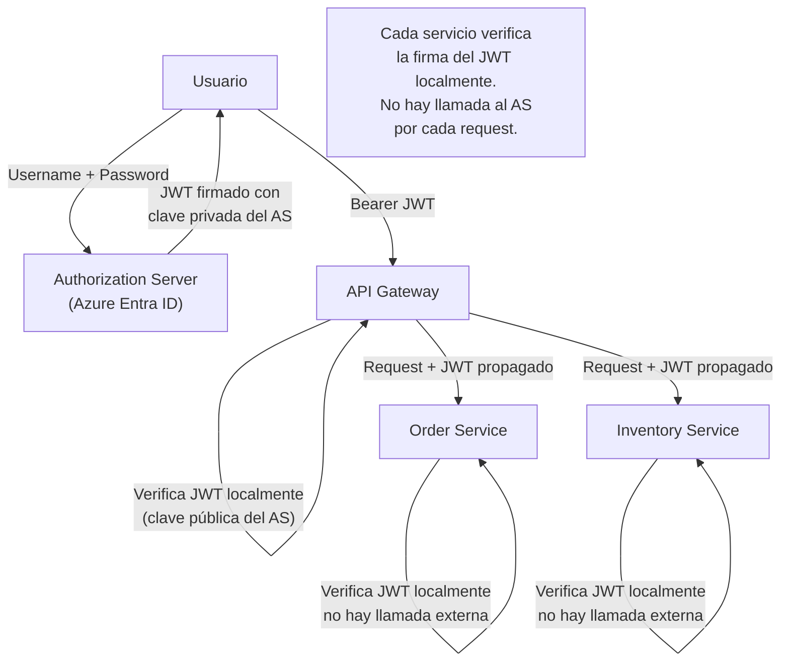
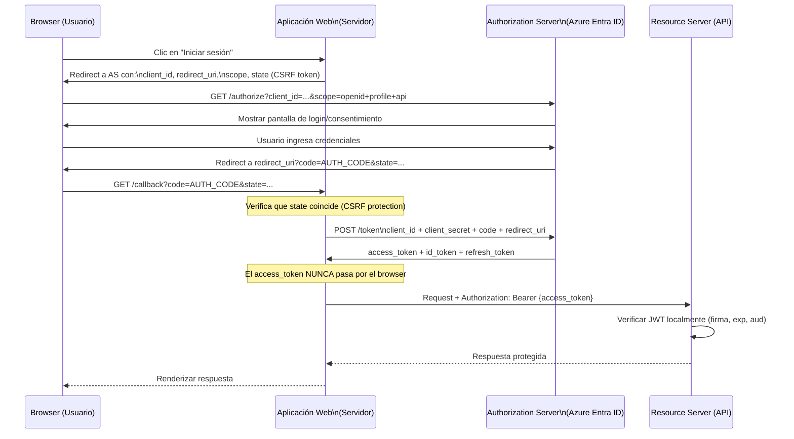
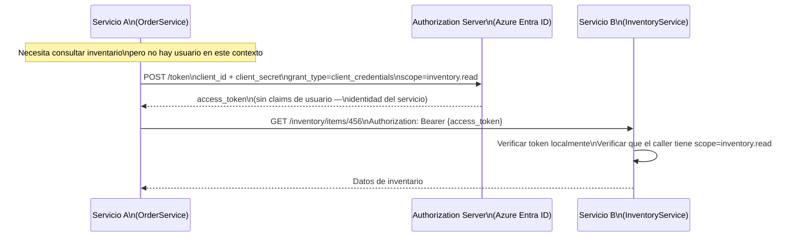
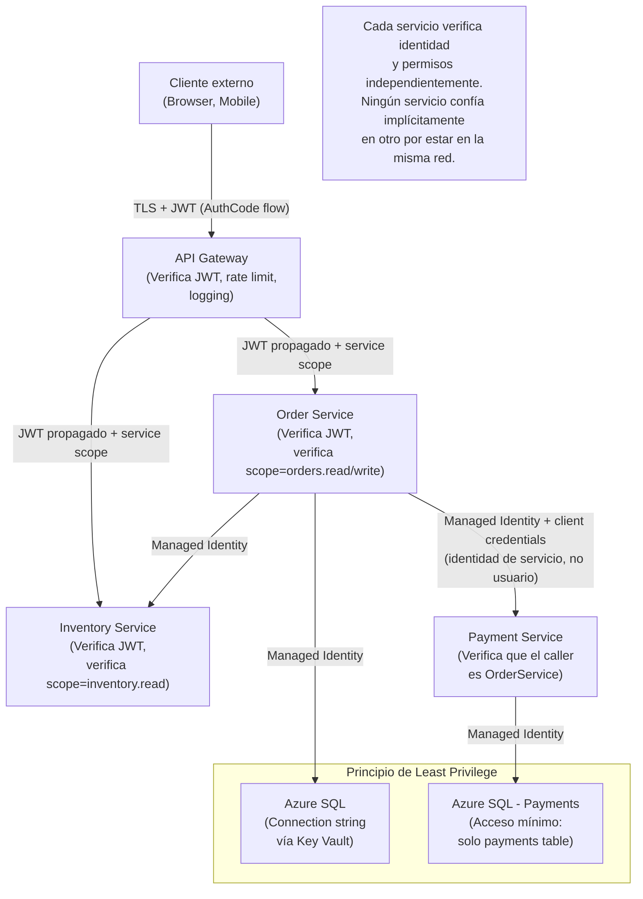
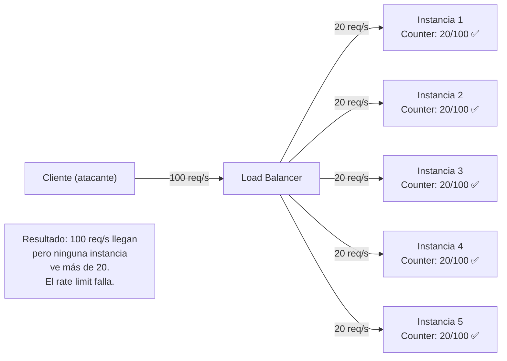
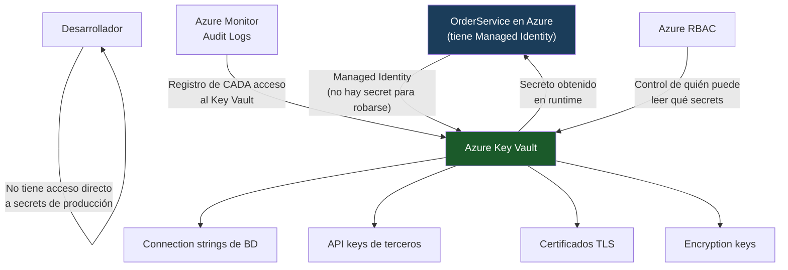

# 04-07 — Security en System Design: Decisiones de Arquitectura, No Checklist

> **Prerequisito:** [04-06-observability-reliability.md](./04-06-observability-reliability.md) — Ese archivo cubrió cómo saber si el sistema funciona correctamente. Este archivo responde la pregunta complementaria: ¿cómo diseñas el sistema para que los actores maliciosos no puedan subvertirlo? La conexión directa: sin observability adecuada, los ataques exitosos no se detectan. La security y la observability son dos caras del mismo problema de confianza.
>
> **Por qué este archivo decide entrevistas Staff:**
> Security no es responsabilidad exclusiva del equipo de seguridad — es una decisión de arquitectura que se toma en el diseño inicial. Cuando un Staff Engineer diseña un sistema en una entrevista y no menciona authentication, authorization, o cómo se manejan los secrets, la señal es clara: ese candidato no ha operado sistemas de producción en un entorno adversarial. En 2026, con Zero Trust como estándar de facto en entornos cloud, articular estos conceptos con precisión es un requisito, no un diferenciador.
>
> **📚 Recursos de esta sección:**
> - **[OWASP Top 10](https://owasp.org/Top10/)** — El estándar de facto para vulnerabilidades de aplicaciones web. Actualizado en 2021, sigue siendo la referencia de la industria.
> - **[Auth0 Blog — Identity Fundamentals](https://auth0.com/blog/)** — La mejor colección de artículos sobre OAuth, OIDC, y JWT con profundidad técnica real.
> - **[Microsoft Security Documentation](https://docs.microsoft.com/azure/security/)** — Azure-specific: Managed Identities, Key Vault, Entra ID (Azure AD). La referencia práctica para el stack de Omar.
> - **[RFC 6749 — OAuth 2.0](https://datatracker.ietf.org/doc/html/rfc6749)** — La especificación original. Árida, pero leerla una vez elimina todas las confusiones sobre "¿qué hace exactamente OAuth?".

---

## Sección 1 — Authentication vs Authorization en Sistemas Distribuidos

### La confusión que aparece en casi toda entrevista

Estos dos conceptos se mezclan constantemente, incluso en devs con años de experiencia:

**Authentication (AuthN):** ¿*Quién* eres?  
Verificar la identidad de quien hace la request — usuario, servicio, o dispositivo.

**Authorization (AuthZ):** ¿*Qué* puedes hacer?  
Verificar qué recursos y operaciones tiene permitidos esa identidad.

El orden importa: primero autenticas (¿quién eres?), luego autorizas (¿puedes hacer esto?). No puedes autorizar a alguien cuya identidad no has verificado.

**El ejemplo que lo hace concreto:**

```
Usuario intenta GET /api/orders/123

Authentication: ¿Tiene un JWT válido, firmado por nuestro AS, no expirado?
                → Si no: 401 Unauthorized ("no sé quién eres")

Authorization:  ¿El usuario con id=456 tiene permiso para ver el order 123?
                → Si no: 403 Forbidden ("sé quién eres, pero no puedes hacer esto")
```

Un 401 y un 403 significan cosas completamente diferentes. Devolver 401 cuando deberías devolver 403 es un leak de información: le estás diciendo al atacante que el recurso existe pero que no tiene acceso, en lugar de decirle que no está autenticado.

### La complejidad en sistemas distribuidos

En un monolito, verificas la identidad una vez en la sesión y confías en ella para toda la request. En un sistema de 15 microservicios, cada servicio recibe requests que llegaron a través de otros servicios. El problema:

1. Cada servicio necesita saber quién originó la request (el usuario final)
2. Cada servicio necesita saber qué puede hacer ese usuario
3. Si cada servicio llama a un servicio central de auth para verificar, ese servicio central es un **bottleneck** y un **single point of failure**

La solución: tokens que llevan la identidad y los permisos codificados — el servicio verifica el token localmente con criptografía, sin llamadas externas.



---

## Sección 2 — OAuth 2.0 Flows Completos

OAuth 2.0 no es un protocolo de autenticación — es un protocolo de *autorización*. Esta confusión es frecuente. OAuth 2.0 permite a una aplicación obtener acceso limitado a recursos en nombre de un usuario, sin que la aplicación necesite conocer las credenciales del usuario.

Para autenticación de usuarios (¿quién eres?), se usa **OpenID Connect (OIDC)**, que es una capa de identidad construida *sobre* OAuth 2.0.

Un Staff Engineer debe poder dibujar estos flows en una pizarra durante una entrevista.

### Authorization Code Flow — Para Aplicaciones Web con Backend

El flow más seguro para aplicaciones web que tienen un servidor backend capaz de guardar secrets de forma segura.



**Por qué el authorization_code intermedio en lugar de el access_token directamente:**

Si el AS redirigiera directamente con el access_token en la URL, ese token quedaría en el historial del browser, en los logs del servidor, y potencialmente en el header `Referer` si el usuario navega desde ahí. El authorization_code es de un solo uso, de vida muy corta (minutos), y solo puede canjearse por el access_token en una llamada server-to-server donde el client_secret también se envía — lo que garantiza que solo el servidor legítimo puede obtener el token real.

### Client Credentials Flow — Para Comunicación Service-to-Service

Cuando no hay usuario involucrado — el servicio actúa en su propio nombre, no en nombre de un usuario.



En Azure, este flow se implementa idealmente con **Managed Identities** — la identidad del servicio es administrada por Azure, sin client_secrets que rotar manualmente.

```csharp
// Con Managed Identity — sin secrets en el código ni en configuración
// Azure asigna automáticamente una identidad al servicio
// El token se obtiene del Azure Instance Metadata Service (IMDS) internamente
builder.Services.AddHttpClient<IInventoryClient, InventoryClient>()
    .AddHttpMessageHandler<ManagedIdentityAuthHandler>();

public class ManagedIdentityAuthHandler : DelegatingHandler
{
    private readonly TokenCredential _credential;
    private readonly string _scope;

    public ManagedIdentityAuthHandler(TokenCredential credential, IConfiguration config)
    {
        // DefaultAzureCredential prueba múltiples métodos en orden:
        // Managed Identity → Visual Studio → Azure CLI → etc.
        _credential = credential;
        _scope = config["InventoryService:Scope"]!; // "api://inventory-service/.default"
    }

    protected override async Task<HttpResponseMessage> SendAsync(
        HttpRequestMessage request,
        CancellationToken ct)
    {
        // TokenCredential cachea y renueva automáticamente el token
        var tokenResult = await _credential.GetTokenAsync(
            new TokenRequestContext(new[] { _scope }), ct);

        request.Headers.Authorization =
            new AuthenticationHeaderValue("Bearer", tokenResult.Token);

        return await base.SendAsync(request, ct);
    }
}
```

### PKCE — Para SPAs y Aplicaciones Móviles

El problema con Authorization Code Flow en Single Page Applications y apps móviles: no pueden guardar un `client_secret` de forma segura. El código JavaScript es visible para cualquiera, y el storage del dispositivo puede ser comprometido.

**PKCE** (Proof Key for Code Exchange, pronunciado "pixy") resuelve esto reemplazando el `client_secret` con un secreto efímero generado en runtime:

```
1. La app genera un code_verifier aleatorio (43-128 caracteres, URL-safe)
   code_verifier = "dBjftJeZ4CVP-mB92K27uhbUJU1p1r_wW1gFWFOEjXk"

2. Calcula el code_challenge = Base64URL(SHA256(code_verifier))
   code_challenge = "E9Melhoa2OwvFrEMTJguCHaoeK1t8URWbuGJSstw-cM"

3. Envía el code_challenge al AS con la request de autorización
   (No el code_verifier — si el AS es interceptado, el verifier sigue siendo secreto)

4. El AS guarda el code_challenge asociado al authorization_code

5. Al canjear el authorization_code, la app envía el code_verifier original
   El AS verifica: SHA256(code_verifier) == code_challenge almacenado
   Solo la app que generó el code_verifier puede canjear el code
```

Esto significa que incluso si un atacante intercepta el `authorization_code`, no puede canjearlo sin el `code_verifier` que nunca salió del dispositivo legítimo.

---

## Sección 3 — JWT: Estructura, Validación y el Problema de Revocación

### Anatomía de un JWT

Un JWT (JSON Web Token) tiene tres partes separadas por puntos, cada una en Base64URL encoding:

```
Header.Payload.Signature
```

**Header** — Metadatos del token:
```json
{
  "alg": "RS256",  // Algoritmo: RS256 (asimétrico) recomendado sobre HS256 (simétrico)
  "typ": "JWT",
  "kid": "key-id-2024-01"  // Key ID — permite al receptor saber qué clave pública usar
}
```

**Payload** — Claims (afirmaciones sobre el sujeto):
```json
{
  "sub": "user-a3f2b8c1",           // Subject: identificador único del usuario
  "name": "Omar Hernández",
  "email": "omar@company.com",
  "roles": ["engineer", "team-lead"],
  "iss": "https://auth.company.com", // Issuer: quién emitió el token
  "aud": "api://order-service",      // Audience: para qué API es este token
  "exp": 1735689600,                  // Expiration: cuándo expira (Unix timestamp)
  "iat": 1735686000,                  // Issued at: cuándo fue emitido
  "jti": "a1b2c3d4-unique-id"        // JWT ID: identificador único (para revocación)
}
```

⚠️ **Crítico:** El payload está en Base64URL, **no cifrado**. Cualquiera puede decodificarlo. Nunca pongas información sensible (passwords, números de tarjeta, etc.) en el payload de un JWT. Si necesitas confidencialidad del payload, usa JWE (JSON Web Encryption), no JWT.

**Signature** — Verificación criptográfica:
```
Si alg = RS256:
  Signature = RSA_SHA256(
    base64url(header) + "." + base64url(payload),
    privateKey  // El AS firma con su clave privada
  )

El receptor verifica con la clave pública del AS.
Si alguien modifica el payload, la firma no coincide → token inválido.
```

**Por qué RS256 sobre HS256:**
- **HS256** usa una clave simétrica — el mismo secret para firmar y verificar. Si cada servicio necesita verificar tokens, cada servicio necesita tener el secret. Un secret compartido por 15 servicios ya no es un secret.
- **RS256** usa un par de claves asimétricas — el AS firma con la clave privada (que guarda solo él), y cualquier servicio puede verificar con la clave pública (que el AS publica en un endpoint JWKS). Los servicios solo necesitan la clave pública — nunca tienen acceso a la clave privada.

### Validación de JWT en ASP.NET Core

```csharp
// Program.cs — configuración completa y correcta
builder.Services.AddAuthentication(JwtBearerDefaults.AuthenticationScheme)
    .AddJwtBearer(options =>
    {
        // Authority: el AS descubre automáticamente las claves públicas
        // desde {Authority}/.well-known/openid-configuration
        options.Authority = "https://login.microsoftonline.com/{tenantId}/v2.0";

        // Audience: el token debe haber sido emitido para esta API específica
        // Sin esto, un token válido para otra API podría usarse aquí
        options.Audience = "api://your-order-service-id";

        options.TokenValidationParameters = new TokenValidationParameters
        {
            ValidateIssuer = true,           // Verifica que el token viene del AS correcto
            ValidateAudience = true,          // Verifica que el token es para esta API
            ValidateLifetime = true,          // Verifica que no expiró (compara con exp)
            ValidateIssuerSigningKey = true,  // Verifica la firma criptográfica
            ClockSkew = TimeSpan.FromMinutes(1) // Tolerancia para diferencias de reloj entre servidores
            // ⚠️ No aumentar ClockSkew más de 5 minutos — expands attack window
        };

        options.Events = new JwtBearerEvents
        {
            OnAuthenticationFailed = context =>
            {
                // Log del fallo de autenticación con detalles (no exponerlos al cliente)
                var logger = context.HttpContext.RequestServices
                    .GetRequiredService<ILogger<Program>>();
                logger.LogWarning(context.Exception,
                    "JWT authentication failed for request to {Path}",
                    context.Request.Path);
                return Task.CompletedTask;
            }
        };
    });

// Autorización con policies — más flexible que roles directos
builder.Services.AddAuthorization(options =>
{
    options.AddPolicy("CanCreateOrders", policy =>
        policy.RequireClaim("roles", "engineer", "admin")
              .RequireClaim("iss", "https://login.microsoftonline.com/{tenantId}/v2.0"));

    options.AddPolicy("AdminOnly", policy =>
        policy.RequireRole("admin"));

    // Requirement custom para lógica compleja
    options.AddPolicy("CanAccessOrder", policy =>
        policy.Requirements.Add(new OrderOwnershipRequirement()));
});

// Controller
[ApiController]
[Route("api/[controller]")]
[Authorize] // Requiere token válido para todos los endpoints
public class OrdersController : ControllerBase
{
    [HttpPost]
    [Authorize(Policy = "CanCreateOrders")] // Requiere policy específica
    public async Task<IActionResult> CreateOrder(CreateOrderRequest request)
    {
        // User.FindFirst("sub")?.Value — el subject claim del JWT
        var userId = User.FindFirst(ClaimTypes.NameIdentifier)?.Value;
        // ...
    }

    [HttpGet("{orderId:guid}")]
    [Authorize(Policy = "CanAccessOrder")] // Lógica: solo el dueño o un admin
    public async Task<IActionResult> GetOrder(Guid orderId)
    {
        // ...
    }
}
```

### El Problema de Revocación — El Talón de Aquiles de JWT

Los JWTs son **stateless** por diseño. Una vez emitidos, son válidos hasta que expiran — el servidor no guarda estado sobre ellos. Esto es exactamente lo que los hace escalables, y también lo que los hace problemáticos cuando necesitas revocarlos.

**Escenarios donde necesitas revocar antes de la expiración:**
- El usuario cierra sesión (quiere acceso revocado inmediatamente)
- Un usuario con acceso privilegiado es despedido
- Se detecta un token comprometido
- Un usuario cambia su contraseña (todos los tokens anteriores deben invalidarse)

Con access tokens de vida larga (1 hora, 8 horas), un atacante que roba un token tiene hasta esa ventana de acceso sin importar qué hagas en el servidor.

**Solución 1 — Short-lived tokens + refresh tokens (recomendado):**

```
Access token TTL: 5-15 minutos  ← ventana de ataque pequeña
Refresh token TTL: días/semanas ← guardado en el servidor

Flujo de revocación:
1. Usuario hace logout → invalidar el refresh token en el servidor
2. El access token actual sigue siendo válido por 5-15 min máximo
3. El sistema no puede obtener un nuevo access token sin el refresh token
4. El acceso efectivo se revoca en 5-15 minutos
```

```csharp
// Manejo de refresh tokens en el servidor
public class RefreshTokenService
{
    private readonly IRefreshTokenRepository _repository;

    public async Task<TokenPair> RefreshAsync(string refreshToken, CancellationToken ct)
    {
        var storedToken = await _repository.FindAsync(refreshToken, ct);

        if (storedToken == null)
            throw new InvalidTokenException("Refresh token not found");

        if (storedToken.ExpiresAt < DateTime.UtcNow)
            throw new TokenExpiredException("Refresh token expired");

        if (storedToken.IsRevoked)
            throw new RevokedTokenException("Refresh token has been revoked");

        // Refresh token rotation — cada uso genera un nuevo refresh token
        // El anterior se invalida. Si alguien roba el token y lo usa primero,
        // el usuario legítimo obtiene un error cuando intenta renovar → alerta temprana.
        await _repository.RevokeAsync(storedToken.Id, ct);

        var newRefreshToken = GenerateSecureRefreshToken();
        await _repository.StoreAsync(storedToken.UserId, newRefreshToken, ct);

        var newAccessToken = _jwtGenerator.Generate(storedToken.UserId);

        return new TokenPair(newAccessToken, newRefreshToken);
    }

    public async Task RevokeAllForUserAsync(Guid userId, CancellationToken ct)
    {
        // En logout, compromiso de contraseña, o acceso revocado
        await _repository.RevokeAllByUserAsync(userId, ct);
    }
}
```

**Solución 2 — Token blacklist con Redis:**

Cada token tiene un `jti` (JWT ID) único. Al revocar, guardar ese `jti` en Redis. En cada request, verificar que el `jti` no está en la blacklist.

```csharp
public class TokenRevocationMiddleware
{
    private readonly RequestDelegate _next;
    private readonly IDistributedCache _cache;
    private readonly ILogger<TokenRevocationMiddleware> _logger;

    public TokenRevocationMiddleware(
        RequestDelegate next,
        IDistributedCache cache,
        ILogger<TokenRevocationMiddleware> logger)
    {
        _next = next;
        _cache = cache;
        _logger = logger;
    }

    public async Task InvokeAsync(HttpContext context)
    {
        var authHeader = context.Request.Headers.Authorization.ToString();
        if (authHeader.StartsWith("Bearer "))
        {
            var token = authHeader["Bearer ".Length..];
            var jti = ExtractJti(token);

            if (!string.IsNullOrEmpty(jti))
            {
                var isRevoked = await _cache.GetAsync($"revoked:jti:{jti}");
                if (isRevoked != null)
                {
                    _logger.LogWarning(
                        "Revoked token used: JTI={Jti}, IP={Ip}",
                        jti, context.Connection.RemoteIpAddress);
                    context.Response.StatusCode = 401;
                    return;
                }
            }
        }

        await _next(context);
    }

    private static string? ExtractJti(string token)
    {
        try
        {
            var handler = new JwtSecurityTokenHandler();
            if (!handler.CanReadToken(token)) return null;
            var jwt = handler.ReadJwtToken(token);
            return jwt.Id; // El claim "jti"
        }
        catch
        {
            return null;
        }
    }
}

// Para revocar un token:
public class TokenRevocationService
{
    private readonly IDistributedCache _cache;

    public async Task RevokeAsync(string jti, DateTime expiresAt, CancellationToken ct)
    {
        // Guardar el JTI en la blacklist hasta que el token hubiera expirado de todas formas
        var ttl = expiresAt - DateTime.UtcNow;
        if (ttl <= TimeSpan.Zero) return; // Ya expiró — no hace falta blacklistear

        await _cache.SetAsync(
            $"revoked:jti:{jti}",
            Array.Empty<byte>(), // El valor no importa — solo nos interesa si la clave existe
            new DistributedCacheEntryOptions { AbsoluteExpirationRelativeToNow = ttl },
            ct);
    }
}
```

**Trade-off de la blacklist:** Agrega una llamada a Redis por cada request autenticada. Hace el JWT parcialmente stateful — exactamente lo que querías evitar. Para tokens de vida corta (5-15 minutos), la Solución 1 es superior en la mayoría de casos.

---

## Sección 4 — Zero Trust Architecture

### El Modelo Perimetral — Por Qué Ya No Funciona

El modelo de seguridad perimetral tradicional asume:

```
Red interna = confiable
Red externa = no confiable

Implementación: firewall en el borde, VPN para acceso remoto.
Todo lo que pase el firewall tiene acceso a todo internamente.
```

El problema es fundamental: cuando hay una brecha (y las habrá), el atacante que está "adentro" del perímetro tiene acceso prácticamente ilimitado a sistemas internos. El modelo asume que el perímetro nunca se rompe — un supuesto que el 100% de las empresas con brechas significativas tenían.

**Con microservicios y cloud, el problema empeora:** No hay un "adentro" claro. Los servicios corren en múltiples clouds, los devs acceden desde casa, los servicios se comunican entre regiones y providers. El concepto de perímetro ya no tiene sentido físico.

### Zero Trust — Nunca Confiar, Siempre Verificar

**Los tres principios:**

1. **Verificar explícitamente:** Siempre autenticar y autorizar, usando todos los datos disponibles (identidad, ubicación, dispositivo, servicio, hora, comportamiento). Nunca asumir confianza.

2. **Least Privilege Access:** Dar el acceso mínimo necesario para la tarea específica. Un servicio que solo lee órdenes no debe tener acceso de escritura ni a otras colecciones.

3. **Assume Breach:** Diseñar como si el atacante ya estuviera dentro de la red. Segmentar accesos, cifrar comunicaciones internas, monitorear movimiento lateral.

### Implementación en Microservicios



**En Azure específicamente — Managed Identities como implementación de Zero Trust:**

```csharp
// ✅ Zero Trust en práctica: OrderService accede a Storage sin secrets
// Managed Identity = identidad que Azure asigna y gestiona al servicio
// No hay client_secret, no hay connection string con credenciales en el código

builder.Services.AddSingleton(_ =>
{
    var credential = new DefaultAzureCredential();
    // En Azure: usa la Managed Identity del servicio
    // En desarrollo: usa las credenciales del desarrollador (Azure CLI, VS)
    return new BlobServiceClient(
        new Uri("https://orderstorage.blob.core.windows.net"),
        credential);
});

// Key Vault — acceso a secrets sin tener el secret en el código
builder.Configuration.AddAzureKeyVault(
    new Uri("https://company-vault.vault.azure.net/"),
    new DefaultAzureCredential());

// El connection string de BD llega desde Key Vault, no desde appsettings
var connectionString = builder.Configuration["SqlServer:ConnectionString"];
// Internamente: va al Key Vault con Managed Identity, obtiene el secret, sin que el dev lo vea nunca

// Least Privilege en la Managed Identity:
// La Managed Identity de OrderService tiene acceso a:
//   - Key Vault: Secret (GET/LIST) — solo leer secrets, no crear/eliminar
//   - Azure SQL: solo los permisos que necesita (ej: SELECT en orders, INSERT/UPDATE en orders)
//   - Storage: solo el container específico que usa
//   NO tiene acceso a: otros Key Vaults, otras BDs, otros Storage accounts
```

**mTLS para comunicación service-to-service:**

En entornos de alta seguridad, además de JWT, se implementa mTLS (mutual TLS) donde ambos lados de la conexión presentan certificados. El servicio que llama prueba su identidad con su certificado, no solo con un token.

En Kubernetes: service meshes como Istio o Linkerd implementan mTLS automáticamente entre pods, sin que el código del servicio necesite cambiar.

---

## Sección 5 — Rate Limiting Distribuido

Ya cubierto en [04-01](./04-01-componentes-fundamentales.md) y [03-07](../modulo-03-software-design/03-07-api-design.md) a nivel de implementación en ASP.NET Core. En esta sección: el problema de arquitectura que aparece cuando tienes múltiples instancias.

### El Problema del Rate Limiting Local

Con 5 instancias del servicio, un rate limiter local de 100 req/segundo por instancia permite efectivamente 500 req/segundo desde el mismo cliente — probablemente no lo que querías.

El load balancer distribuye las requests entre instancias, y cada instancia mantiene su propio contador independiente. Un cliente malicioso puede simplemente abrir múltiples conexiones y aprovechar que cada instancia cree que el cliente ha enviado menos requests de las que realmente ha enviado.



**Solución: Rate limiter distribuido con Redis como estado compartido:**

```csharp
public class DistributedRateLimiter
{
    private readonly IDatabase _redis;
    private readonly ILogger<DistributedRateLimiter> _logger;

    public async Task<RateLimitResult> IsAllowedAsync(
        string clientKey,
        int maxRequests,
        TimeSpan window,
        CancellationToken ct = default)
    {
        var now = DateTimeOffset.UtcNow.ToUnixTimeMilliseconds();
        var windowMs = (long)window.TotalMilliseconds;
        var windowStart = now - windowMs;
        var redisKey = $"ratelimit:{clientKey}";

        // Lua script ejecutado atómicamente en Redis — no hay race conditions
        // entre el check y el increment
        const string luaScript = @"
            local key = KEYS[1]
            local now = tonumber(ARGV[1])
            local window_start = tonumber(ARGV[2])
            local max = tonumber(ARGV[3])
            local ttl = tonumber(ARGV[4])

            -- Remover entradas fuera de la ventana deslizante
            redis.call('ZREMRANGEBYSCORE', key, '-inf', window_start)

            -- Contar requests en la ventana actual
            local current = redis.call('ZCARD', key)

            if current < max then
                -- Agregar la request actual con timestamp como score
                redis.call('ZADD', key, now, now .. '-' .. math.random())
                -- TTL = tamaño de la ventana para auto-limpieza
                redis.call('PEXPIRE', key, ttl)
                return {1, max - current - 1}  -- allowed, remaining
            else
                return {0, 0}  -- denied, remaining
            end";

        var result = (RedisResult[])await _redis.ScriptEvaluateAsync(
            luaScript,
            new RedisKey[] { redisKey },
            new RedisValue[] { now, windowStart, maxRequests, windowMs });

        var allowed = (int)result[0] == 1;
        var remaining = (int)result[1];

        if (!allowed)
        {
            _logger.LogWarning(
                "Rate limit exceeded for client {ClientKey} — {MaxRequests} req/{Window}",
                clientKey, maxRequests, window);
        }

        return new RateLimitResult(allowed, remaining, window);
    }
}

// Middleware que lo usa
public class RateLimitingMiddleware
{
    private readonly RequestDelegate _next;
    private readonly DistributedRateLimiter _limiter;

    public async Task InvokeAsync(HttpContext context)
    {
        // La clave de rate limiting puede ser: IP, API key, User ID, o combinación
        // Para APIs públicas: usar IP + endpoint
        // Para APIs autenticadas: usar User ID + endpoint (más justo)
        var clientKey = GetClientKey(context);
        var endpoint = context.GetEndpoint();
        var rateLimitAttr = endpoint?.Metadata.GetMetadata<RateLimitAttribute>();

        if (rateLimitAttr != null)
        {
            var result = await _limiter.IsAllowedAsync(
                $"{clientKey}:{endpoint!.DisplayName}",
                rateLimitAttr.MaxRequests,
                rateLimitAttr.Window);

            context.Response.Headers["X-RateLimit-Limit"] =
                rateLimitAttr.MaxRequests.ToString();
            context.Response.Headers["X-RateLimit-Remaining"] =
                result.Remaining.ToString();
            context.Response.Headers["X-RateLimit-Window"] =
                rateLimitAttr.Window.TotalSeconds.ToString();

            if (!result.Allowed)
            {
                context.Response.StatusCode = 429; // Too Many Requests
                context.Response.Headers["Retry-After"] =
                    ((int)rateLimitAttr.Window.TotalSeconds).ToString();
                return;
            }
        }

        await _next(context);
    }

    private static string GetClientKey(HttpContext context)
    {
        // Preferir User ID si está autenticado — más justo que IP
        // (usuarios detrás del mismo NAT/proxy no comparten límite)
        var userId = context.User.FindFirst(ClaimTypes.NameIdentifier)?.Value;
        if (userId != null) return $"user:{userId}";

        // API key si la tienen
        var apiKey = context.Request.Headers["X-Api-Key"].ToString();
        if (!string.IsNullOrEmpty(apiKey)) return $"apikey:{apiKey}";

        // Fallback a IP
        var ip = context.Connection.RemoteIpAddress?.ToString() ?? "unknown";
        return $"ip:{ip}";
    }
}
```

---

## Sección 6 — Secrets Management

Los secrets (API keys, connection strings, certificates, private keys) son el activo más valioso y más frecuentemente mal manejado en sistemas de producción.

### Dónde No Deberían Estar los Secrets (pero frecuentemente están)

```
❌ En el código fuente (hardcoded):
   var connectionString = "Server=prod-db;Password=SuperSecret123!";

❌ En repositorios Git (aunque sea en commits "eliminados"):
   appsettings.Production.json commiteado al repo
   .env files en el repo

❌ En variables de entorno expuestas:
   Environment.SetEnvironmentVariable("DB_PASSWORD", "...") visible en logs de CI/CD

❌ En Slack, Teams, emails, tickets de Jira:
   "aquí te paso la connection string de producción: ..."

❌ En configuración de CI/CD sin restricción:
   Secrets disponibles para todos los pipelines del repositorio
```

### El Modelo Correcto en Azure



```csharp
// Integración completa de Key Vault en ASP.NET Core
// Los secrets aparecen como configuración normal, completamente transparente al código

var builder = WebApplication.CreateBuilder(args);

// En producción: la Managed Identity tiene permisos de lectura en el Key Vault
// En desarrollo: usa credenciales del desarrollador (Azure CLI login)
if (!builder.Environment.IsDevelopment())
{
    builder.Configuration.AddAzureKeyVault(
        new Uri(builder.Configuration["AzureKeyVault:Uri"]!),
        new ManagedIdentityCredential()); // Managed Identity específica del servicio
}

// El código que usa los secrets no sabe de dónde vienen — Key Vault o appsettings local
builder.Services.AddDbContext<OrderDbContext>(options =>
    options.UseSqlServer(builder.Configuration["SqlServer:ConnectionString"]));
    // En producción: este valor viene de Key Vault automáticamente
    // En desarrollo: viene de appsettings.Development.json o user secrets

// User Secrets para desarrollo local — nunca en el repo
// dotnet user-secrets set "SqlServer:ConnectionString" "Server=local;..."
```

**Rotación de secrets — el principio de vida finita:**

Todo secret debe tener un tiempo de vida máximo definido. Azure Key Vault soporta:
- Rotación automática de certificados TLS (integración con DigiCert, GlobalSign)
- Near-expiry notifications para secrets que requieren rotación manual
- Versiones de secrets — el sistema puede referenciar `@latest` o una versión específica

```
Tiempos de vida recomendados por tipo de secret:
- Certificados TLS: 90 días (Let's Encrypt), 1 año (CA comerciales)
- API keys de terceros: 90 días, rotación manual con proceso automatizable
- Connection strings de BD: indefinidos si usan autenticación de AD integrada
  (no hay password que rotar — la autenticación es la Managed Identity)
- Tokens de CI/CD: 30-90 días máximo
```

---

## Sección 7 — OWASP Top 10 desde Perspectiva de System Design

El OWASP Top 10 es una lista de vulnerabilidades de código. Pero cada vulnerabilidad tiene implicaciones de *arquitectura* — decisiones de diseño que las previenen o las hacen inevitables. Un Staff Engineer piensa en OWASP a nivel de arquitectura, no de implementación.

### A01 — Broken Access Control

**El problema de código:** Un endpoint retorna datos sin verificar si el usuario tiene acceso.

**El problema de arquitectura:** La autorización está implementada solo en el API Gateway. Si un servicio interno es accesible por otro vector (un bug, una mala configuración de red), no hay segunda línea de defensa.

**La decisión de arquitectura correcta:**

```
❌ Autorización solo en el gateway:
   Gateway → [verificar JWT] → OrderService → Base de datos

✅ Autorización en cada servicio (defense in depth):
   Gateway → [verificar JWT] → OrderService → [verificar: ¿puede este usuario acceder a esta order?] → Base de datos
```

La autorización debe ser verificada en el servicio que tiene el dato, no solo en el intermediario. Si alguien bypasea el gateway (por un error de configuración, un bug, o movimiento lateral de un atacante), cada servicio debe ser la última línea de defensa.

```csharp
// ✅ Authorization en el servicio, no solo en el middleware de autenticación
public class OrdersController : ControllerBase
{
    [HttpGet("{orderId:guid}")]
    [Authorize]
    public async Task<IActionResult> GetOrder(Guid orderId)
    {
        var order = await _orderRepository.FindAsync(orderId);
        if (order == null) return NotFound();

        // Verificación de autorización a nivel de recurso — el middleware no puede hacer esto
        // porque no sabe a qué order específica se accede hasta que se resuelve el parámetro
        var currentUserId = Guid.Parse(User.FindFirst(ClaimTypes.NameIdentifier)!.Value);
        var isAdmin = User.IsInRole("admin");

        if (order.CustomerId != currentUserId && !isAdmin)
            return Forbid(); // 403 — sé quién eres, pero no puedes acceder a esto

        return Ok(order.ToDto());
    }
}
```

### A03 — Injection (SQL, NoSQL, Command)

**La decisión de arquitectura:** Los servicios que aceptan input de usuarios deben estar aislados de los servicios con acceso directo a bases de datos o sistemas de archivos. Un servicio que recibe input sin validación no debe tener también el poder de ejecutar comandos en la base de datos.

En práctica: EF Core con LINQ previene SQL injection por diseño (parametriza automáticamente). El problema aparece cuando se usa `FromSqlRaw` o `ExecuteSqlRaw` con concatenación de strings.

```csharp
// ❌ SQL injection posible — aunque raro con EF Core, aparece en código heredado
var orders = await _context.Orders
    .FromSqlRaw($"SELECT * FROM Orders WHERE CustomerId = '{customerId}'") // ❌ NUNCA
    .ToListAsync();

// ✅ Parametrizado — EF Core lo hace automáticamente con LINQ
var orders = await _context.Orders
    .Where(o => o.CustomerId == customerId) // ✅ Automáticamente parametrizado
    .ToListAsync();

// ✅ Si necesitas SQL raw, usar FormattableString o parámetros explícitos
var orders = await _context.Orders
    .FromSqlInterpolated($"SELECT * FROM Orders WHERE CustomerId = {customerId}") // ✅
    .ToListAsync();
```

### A07 — Identification and Authentication Failures

**El problema más relevante para system design:** Tokens JWT con vida demasiado larga, refresh tokens sin rotación, PKCE no implementado en SPAs, o secrets de servicios que nunca rotan.

La decisión de arquitectura: definir explícitamente el TTL de cada tipo de token y mecanismo de revocación desde el diseño inicial, no como un afterthought.

### A09 — Security Logging and Monitoring Failures

La conexión directa con [04-06](./04-06-observability-reliability.md): sin logging estructurado de eventos de seguridad, los ataques exitosos no se detectan. Esta vulnerabilidad de OWASP es un fallo de observability aplicado a seguridad.

**Eventos de seguridad que deben loggearse siempre:**

```csharp
public class SecurityAuditLogger
{
    private readonly ILogger<SecurityAuditLogger> _logger;

    public void LogAuthenticationFailure(string? userId, string ip, string reason)
    {
        // Structured log — indexable, searchable, alertable
        _logger.LogWarning(
            "AuthFailure | User={UserId} IP={Ip} Reason={Reason} Time={Time}",
            userId ?? "unknown", ip, reason, DateTime.UtcNow);
    }

    public void LogAuthorizationFailure(string userId, string resource, string action)
    {
        _logger.LogWarning(
            "AuthzFailure | User={UserId} Resource={Resource} Action={Action}",
            userId, resource, action);
    }

    public void LogSuspiciousActivity(string userId, string ip, string activity)
    {
        // Esto puede disparar una alerta de seguridad automática
        _logger.LogError(
            "SuspiciousActivity | User={UserId} IP={Ip} Activity={Activity}",
            userId, ip, activity);
    }

    public void LogPrivilegedAction(string userId, string action, object context)
    {
        // Audit trail para acciones de alto impacto
        _logger.LogInformation(
            "PrivilegedAction | User={UserId} Action={Action} Context={Context}",
            userId, action, System.Text.Json.JsonSerializer.Serialize(context));
    }
}
```

### A10 — Server-Side Request Forgery (SSRF)

**Por qué importa especialmente en cloud:** Un atacante que logra SSRF en un servicio que corre en Azure puede hacer que ese servicio llame a `http://169.254.169.254/metadata/...` (el Azure Instance Metadata Service), que retorna las credenciales de la Managed Identity del servicio. Con esas credenciales, el atacante tiene acceso a todo lo que la Managed Identity tiene acceso — Key Vault, Storage, bases de datos.

**La decisión de arquitectura:** Cualquier servicio que hace requests HTTP basadas en input del usuario necesita una allowlist explícita de destinos permitidos.

```csharp
public class SsrfProtectedHttpClient
{
    private static readonly HashSet<string> AllowedHosts = new(
        StringComparer.OrdinalIgnoreCase)
    {
        "api.partner.com",
        "webhook.customer.com",
        "cdn.assets.com"
    };

    // Rangos de IP que deben ser bloqueados siempre
    private static readonly IPNetwork[] BlockedRanges = new[]
    {
        IPNetwork.Parse("169.254.0.0/16"), // Link-local (Azure IMDS, AWS IMDS)
        IPNetwork.Parse("10.0.0.0/8"),     // Red privada
        IPNetwork.Parse("172.16.0.0/12"),  // Red privada
        IPNetwork.Parse("192.168.0.0/16"), // Red privada
        IPNetwork.Parse("127.0.0.0/8"),    // Loopback
    };

    private readonly HttpClient _httpClient;
    private readonly ILogger<SsrfProtectedHttpClient> _logger;

    public async Task<HttpResponseMessage> GetAsync(string url, CancellationToken ct)
    {
        Uri uri;
        try
        {
            uri = new Uri(url);
        }
        catch (UriFormatException)
        {
            throw new SecurityException("Invalid URL format");
        }

        // 1. Verificar esquema — solo HTTPS
        if (uri.Scheme != "https")
            throw new SecurityException($"Only HTTPS is allowed. Got: {uri.Scheme}");

        // 2. Verificar host contra allowlist
        if (!AllowedHosts.Contains(uri.Host))
            throw new SecurityException($"Host '{uri.Host}' is not in the allowlist");

        // 3. Resolver DNS y verificar que la IP no es privada/metadata
        // (protege contra DNS rebinding attacks)
        var addresses = await Dns.GetHostAddressesAsync(uri.Host, ct);
        foreach (var address in addresses)
        {
            if (IsBlockedAddress(address))
            {
                _logger.LogWarning(
                    "SSRF attempt blocked: Host={Host} resolved to IP={Ip}",
                    uri.Host, address);
                throw new SecurityException($"Host '{uri.Host}' resolves to a blocked IP address");
            }
        }

        return await _httpClient.GetAsync(url, ct);
    }

    private static bool IsBlockedAddress(IPAddress address)
    {
        return BlockedRanges.Any(range => range.Contains(address));
    }
}
```

---

## Checklist de Salida

Antes de avanzar al siguiente archivo, verifica que puedes responder estas preguntas sin consultar notas:

- [ ] ¿Cuál es la diferencia entre Authentication y Authorization? ¿Qué responde cada una? ¿Qué código HTTP retorna cada fallo?
- [ ] Dibuja de memoria el Authorization Code Flow de OAuth 2.0. ¿Por qué el authorization_code intermedio en lugar del access_token directamente?
- [ ] ¿Cuándo usas Client Credentials Flow en lugar de Authorization Code Flow?
- [ ] ¿Qué información va en el Header y en el Payload de un JWT? ¿Qué NO debe ir ahí?
- [ ] ¿Por qué RS256 es preferible a HS256 en sistemas con múltiples servicios?
- [ ] ¿Cuál es el problema fundamental de revocar JWTs? ¿Cuáles son las dos soluciones y sus trade-offs?
- [ ] ¿Qué es Zero Trust y en qué se diferencia del modelo perimetral? ¿Cuáles son sus tres principios?
- [ ] ¿Por qué el rate limiting local falla en sistemas con múltiples instancias? ¿Cómo se resuelve?
- [ ] ¿Por qué un atacante exitoso de SSRF en un servicio cloud puede escalar a robo de credenciales?

---

## Recursos

- **[OWASP Top 10 (2021)](https://owasp.org/Top10/)** — La referencia. Leer con la pregunta "¿cómo afecta esto al diseño del sistema?" en mente, no solo "¿cómo lo evito en el código?".
- **[Auth0 Blog — Identity Fundamentals](https://auth0.com/blog/identity/)** — La mejor colección de artículos sobre OAuth 2.0, OIDC, JWT. Técnicamente correcto y bien explicado.
- **[Microsoft Identity Platform docs](https://docs.microsoft.com/azure/active-directory/develop/)** — Azure Entra ID (Azure AD), Managed Identities, MSAL. La implementación práctica para el stack de Omar.
- **[Azure Key Vault Best Practices](https://docs.microsoft.com/azure/key-vault/general/best-practices)** — Secrets management en Azure con ejemplos de producción.

---

**Siguiente:** [04-08-casos-clasicos.md](./04-08-casos-clasicos.md) — Casos clásicos de system design con el framework completo: Twitter feed, URL shortener, sistema de pagos distribuido. Donde todo lo del módulo 4 se aplica en conjunto.
