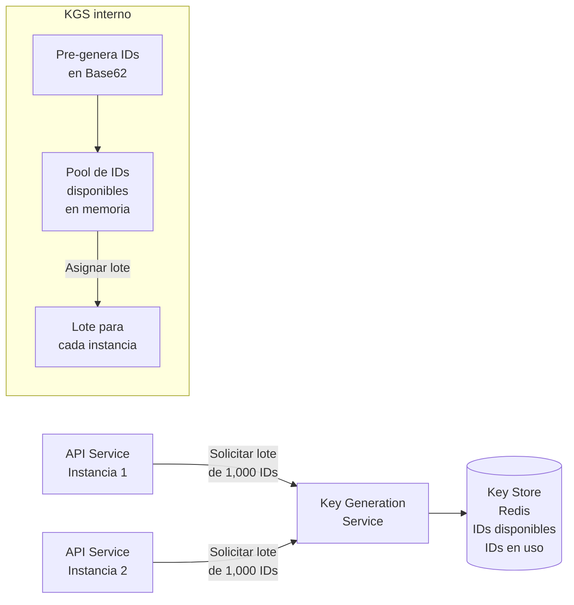
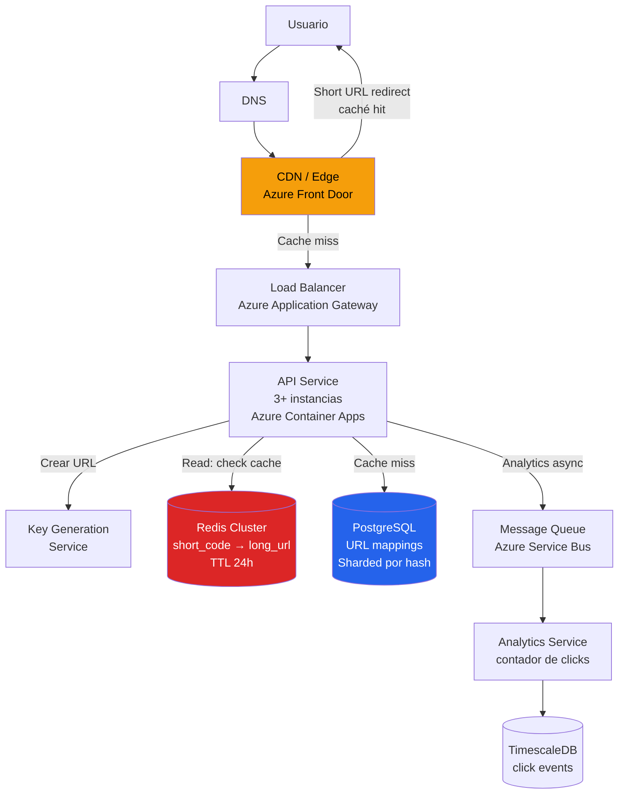
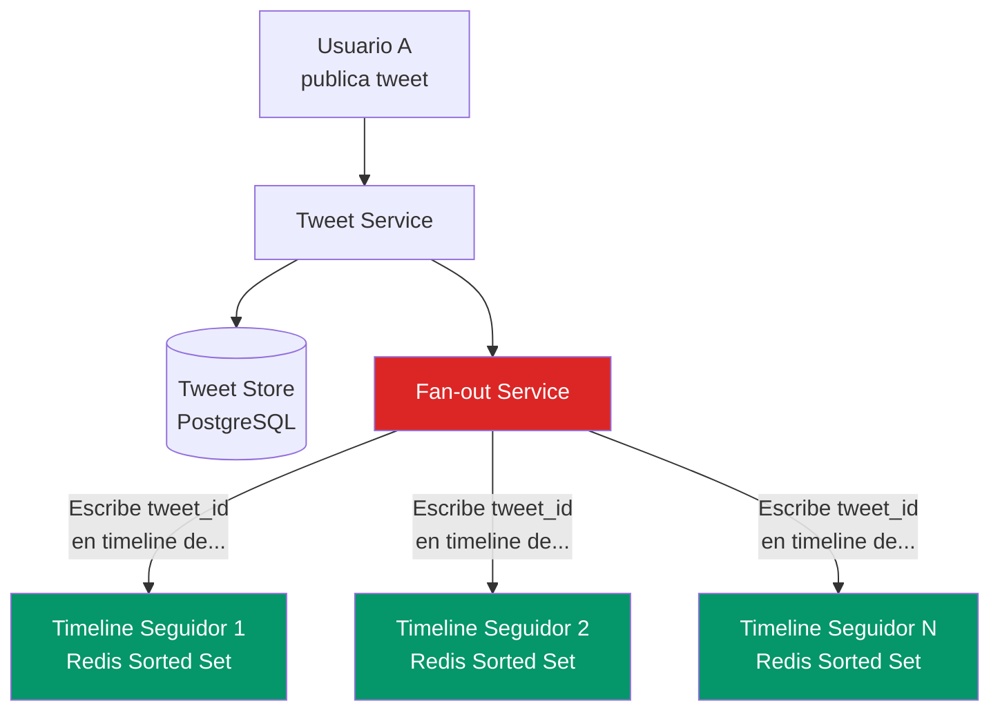
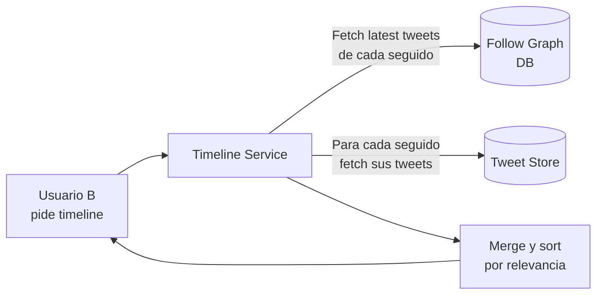
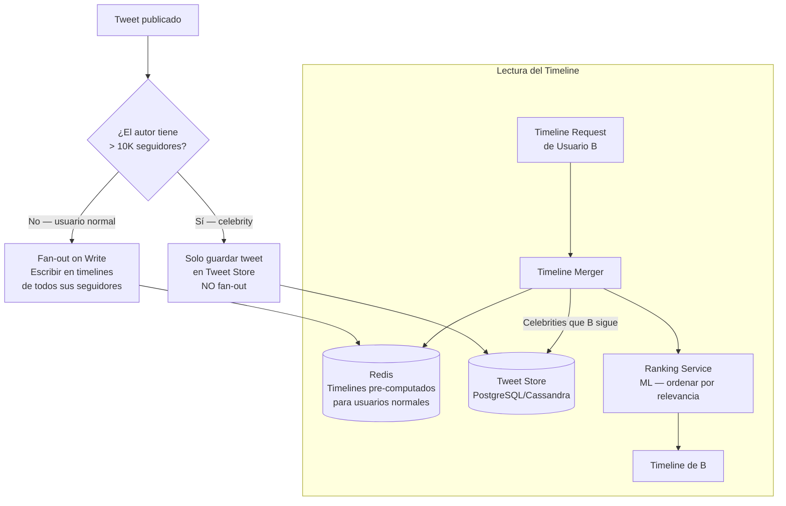
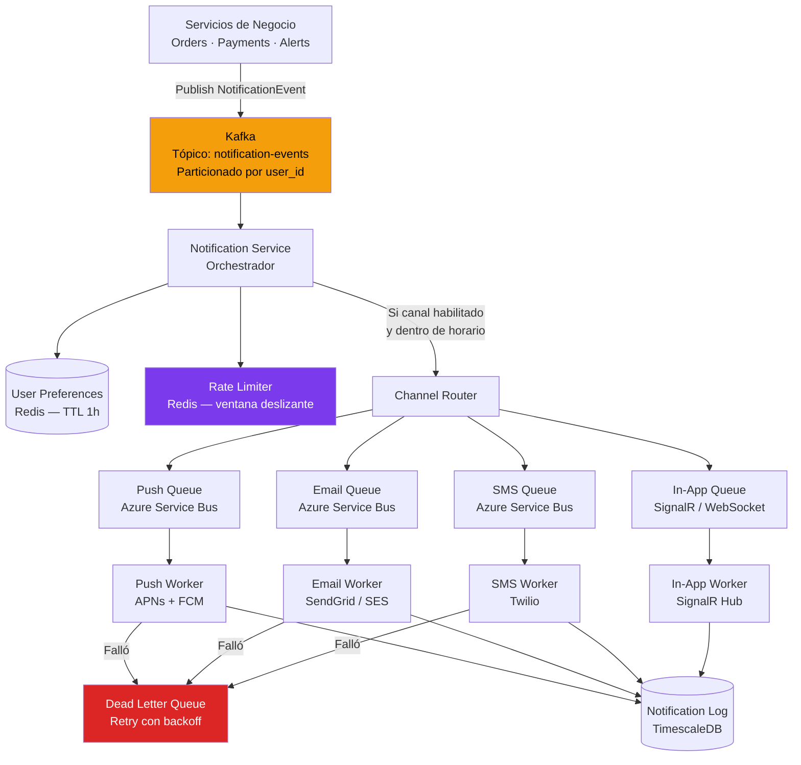
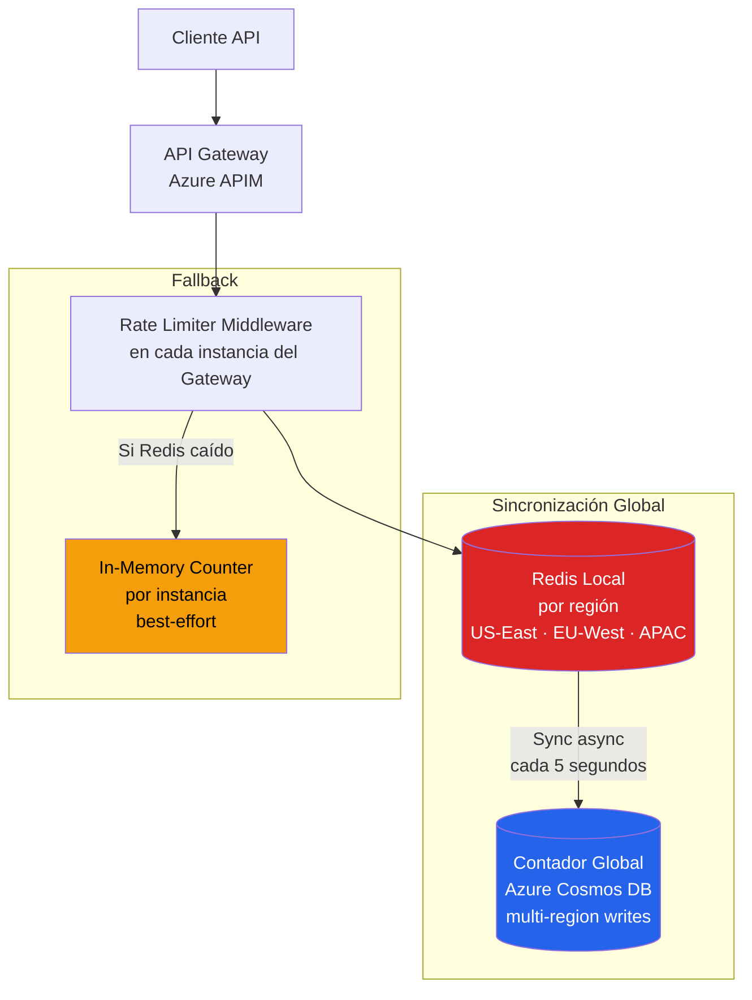
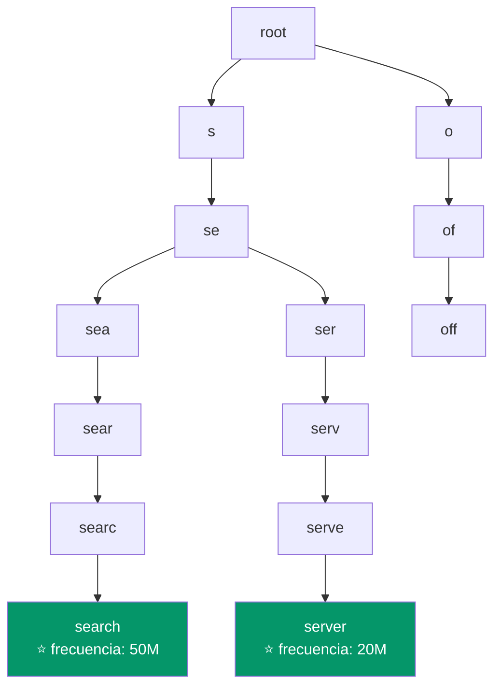

# 04-08 — Casos Clásicos de System Design: El Proceso que Separa Candidatos

> **Prerequisito:** Todo el Módulo 4 — este archivo es la síntesis aplicada. Si llegaste aquí saltando archivos, regresa a [04-00-overview.md](./04-00-overview.md) y sigue el orden. Los 5 casos de este archivo asumen que conoces RESHADED, estimaciones, sharding, caching, message queues, CAP theorem, y observabilidad. Sin esa base, los casos se convierten en soluciones memorizadas en lugar de razonamiento aplicado.
>
> **Por qué este archivo existe:**
> La diferencia entre un candidato que estudia system design y uno que lo domina no es la cantidad de casos que memorizó — es la calidad del proceso que aplica a cualquier caso que no ha visto antes. Este archivo no es un catálogo de respuestas correctas. Es una demostración de cómo un Staff Engineer piensa en voz alta durante una entrevista: qué preguntas hace, cómo convierte números en decisiones, y qué trade-offs articula para demostrar profundidad real.
>
> **🎯 Recursos de práctica adicional:**
> - **ByteByteGo** — cada uno de estos casos tiene un video o newsletter específico en bytebytego.com. Después de trabajar un caso aquí, busca la versión ByteByteGo para reforzar con diagramas visuales alternativos.
> - **AlgoExpert Systems Expert** — casos completos con entrevistador simulado. Usar después de dominar el proceso en este archivo.
> - **"System Design Interview" de Alex Xu (Volumen 1 y 2)** — los casos más completos en formato de libro. ByteByteGo es el mismo autor.

---

## Cómo Usar Este Archivo

**El valor está en el proceso, no en la solución final.**

Antes de leer cada caso, dedica 10-15 minutos a resolverlo tú mismo. Escribe tu versión. Luego compara. Lo que te faltó es tu gap de aprendizaje actual — más valioso que la solución en sí.

Para cada caso, el archivo muestra:
1. **Requirements** (5 min en entrevista real) — qué preguntas hacer y por qué
2. **Estimaciones** — cómo los números generan decisiones
3. **High-Level Design** — el diagrama y el razonamiento detrás de cada componente
4. **Deep Dive** — el componente más crítico con profundidad real
5. **Trade-offs** — las decisiones difíciles articuladas claramente
6. **Failure Modes** — cómo el sistema falla y cómo lo maneja

**Señal de nivel Staff:** En una entrevista real, el entrevistador no espera que termines todos los componentes — espera ver que priorizas correctamente, que reconoces las decisiones difíciles, y que articulas trade-offs con evidencia. Un diseño incompleto con razonamiento sólido supera a un diseño completo sin razonamiento.

---

## CASO 1 — URL Shortener: El "Hello World" de System Design

### Por Qué Este Caso Importa

El URL Shortener es el caso con el que los entrevistadores calibran si el candidato conoce el framework básico. A nivel Junior/Mid, se espera el diseño superficial. A nivel Senior, se espera profundidad en los componentes. A nivel Staff, se espera que el candidato identifique los problemas no obvios: la generación de IDs distribuida, el trade-off de redirección, y la estrategia de caché correcta para un sistema extremadamente read-heavy.

Si no puedes resolver este caso con profundidad en 30 minutos, los demás casos serán imposibles en el tiempo de una entrevista real.

### Requirements (5 minutos)

**Preguntas que DEBES hacer antes de diseñar:**

> *"¿El sistema necesita analytics de clicks, o solo redirección?"*

Esta pregunta es crítica porque cambia la decisión de 301 vs 302 (veremos por qué en el Deep Dive). La mayoría de candidatos no la hacen.

> *"¿Las URLs tienen expiración o son permanentes?"*

Si expiran, necesitas un job de limpieza y la estrategia de storage cambia.

> *"¿Es un sistema de uso general o interno para una empresa?"*

Cambia la escala y los requerimientos de autenticación.

**Functional Requirements (acordados):**
- Dado una URL larga, generar una URL corta única
- Dado una URL corta, redirigir al usuario a la URL larga
- Las URLs son permanentes (sin expiración por ahora)
- Analytics básico: contar clicks por URL

**Non-Functional Requirements:**
- Alta disponibilidad (99.99% — máximo 52 minutos de downtime/año)
- Latencia de redirección: < 10ms en el percentil 99
- Durabilidad de datos: no podemos perder URLs creadas
- Escala: 100M URLs creadas por día, ratio read:write = 10:1

### Estimaciones

```
TRÁFICO:
Writes: 100M URLs/día ÷ 86,400 s/día ≈ 1,160 writes/segundo
Reads:  1,160 × 10 = 11,600 reads/segundo
Pico:   3x el promedio = 34,800 reads/segundo en pico

STORAGE:
Componentes por URL:
  - short_code: 7 bytes (Base62, 7 caracteres)
  - long_url: promedio 150 bytes (URLs reales son largas)
  - user_id: 8 bytes
  - created_at: 8 bytes
  - click_count: 8 bytes
  Total: ~200 bytes por registro

Retención 5 años:
  100M URLs/día × 365 × 5 × 200 bytes ≈ 36 TB total

CONCLUSIONES DE LOS NÚMEROS:
→ 11,600 reads/s pico → una sola base de datos no alcanza sin caché
→ 36 TB → sharding necesario, pero no urgente en año 1
→ Read:Write = 10:1 → optimizar el path de lectura es la prioridad absoluta
→ Latencia < 10ms → el redirect debe servirse desde memoria, no disco
```

**En una entrevista real, estos cálculos guían explícitamente tu diseño.** Cuando el entrevistador pregunte "¿por qué usas Redis aquí?", la respuesta correcta es "porque tenemos 11,600 reads/segundo y necesitamos latencia < 10ms, y una base de datos relacional sin caché no puede cumplir ese SLO."

### El Problema No Obvio: Generación de IDs Únicos

La mayoría de candidatos dicen "uso un UUID" y siguen. Eso es un error a nivel Senior.

**¿Por qué UUID está mal aquí?**
- UUID tiene 36 caracteres — demasiado largo para una URL corta
- UUID no es ordenable por tiempo — el index de la BD se fragmenta
- UUID no garantiza ausencia de colisiones en Base62 truncado

**Análisis real de opciones:**

**Opción 1 — Auto-increment en BD + Base62 encoding:**
```
ID numérico: 1,000,000 (decimal)
Base62 = [0-9, a-z, A-Z] = 62 caracteres
1,000,000 en Base62 = "4c92" (4 caracteres)

Para 7 caracteres: 62^7 = 3.5 trillones de IDs posibles
→ Con 100M URLs/día, dura: 3.5T ÷ 100M = 35,000 días = ~95 años ✓
```

**Problema:** auto-increment en una sola BD es un SPOF. Con sharding, múltiples nodos generan el mismo número.

**Opción 2 — Hash del URL largo (MD5/SHA256):**
```
MD5("https://longurl.com/...") → "a1b2c3d4e5f6..." (32 hex chars)
Tomar primeros 7 chars en Base62 → "aB3kX2m"
```
**Problema:** colisiones posibles cuando el hash truncado coincide para dos URLs diferentes. Necesitas verificar en BD y regenerar — lógica compleja.

**Opción 3 — Key Generation Service (KGS) — La solución correcta a escala:**



**Cómo funciona:**
- El KGS pre-genera millones de short codes únicos y los almacena en Redis
- Cuando un API Server necesita crear una URL, solicita un lote de 1,000 IDs
- El API Server mantiene esos 1,000 IDs en memoria — sin llamada al KGS por cada request
- El KGS mueve IDs del bucket "disponibles" al bucket "en uso" atómicamente
- Si el API Server muere antes de usar sus 1,000 IDs → esos IDs se pierden → aceptable (tenemos 3.5T)

**Trade-off del KGS:** Es un componente adicional con su propio SPOF. Mitigación: KGS con replica standby + los API Servers mantienen lotes en memoria (buffer), por lo que pueden seguir operando varios minutos si el KGS está temporalmente caído.

### High-Level Design



**Por qué cada componente:**
- **CDN/Edge:** Los redirects son el caso perfecto para edge caching. La URL corta no cambia → podemos cachear agresivamente en el edge y servir < 5ms globalmente.
- **Redis:** 11,600 reads/s requieren in-memory. Cache-Aside pattern: verifica caché, si miss → BD → llena caché.
- **PostgreSQL sharded:** El volumen es manejable con sharding simple por hash del short_code. NoSQL no agrega valor aquí — las queries son simples point lookups.
- **Analytics async:** El click analytics NO debe estar en el path crítico de redirección. Si el analytics service está lento, la redirección no debe verse afectada. Por eso: enqueue en Azure Service Bus y procesar async.

### Deep Dive: 301 vs 302 Redirect

Esta decisión tiene más impacto en el sistema del que parece:

**301 — Moved Permanently:**
```
HTTP/1.1 301 Moved Permanently
Location: https://longurl.com/the-actual-page
```
- El browser cachea este redirect **permanentemente**
- El usuario hace la segunda visita → el browser va directo a `longurl.com` sin pasar por tu sistema
- ✅ Ventaja: **reduce carga en tus servidores drásticamente**
- ❌ Desventaja: **no puedes contar clicks** — el segundo request nunca llega a ti

**302 — Found (Temporary Redirect):**
```
HTTP/1.1 302 Found
Location: https://longurl.com/the-actual-page
```
- El browser **no** cachea permanentemente — pregunta al servidor en cada visita
- ✅ Ventaja: **analytics preciso** — cada click llega a tu sistema
- ❌ Desventaja: **más carga en servidores** — cada visita genera un request

**La decisión:**
Para un URL shortener comercial (bit.ly, tinyurl), el analytics es el producto. Sin click tracking, no hay propuesta de valor. Usamos **302**.

Si quisiéramos optimizar para carga de servidor (caso interno corporativo sin analytics), usaríamos 301 con caché en el browser más CDN caching.

### Trade-offs Principales

| Decisión | Elegida | Alternativa | Por qué no la alternativa |
|---|---|---|---|
| ID generation | KGS con lotes | Auto-increment | SPOF en escrituras distribuidas |
| Storage | PostgreSQL + sharding | Cassandra | Cassandra agrega complejidad innecesaria para queries simples |
| Redirect type | 302 | 301 | Analytics es el producto — necesitamos cada click |
| Cache TTL | 24 horas | Permanente | Permite cambiar el destino si hay error o abuso |
| Analytics path | Async (Service Bus) | Sync | Analytics no puede bloquear el redirect |

### Failure Modes y Mitigaciones

**Escenario 1: Redis cae**
- El API Service detecta el fallo → sirve directamente desde PostgreSQL
- Latencia sube de ~5ms a ~50ms — aceptable temporalmente
- Redis Cluster (3 nodos) reduce la probabilidad de outage total
- Auto-recovery: cuando Redis vuelve, el caché se llena gradualmente (no hay cache stampede porque usamos probabilistic early expiration)

**Escenario 2: KGS cae**
- Los API Servers tienen lotes de 1,000 IDs en memoria → continúan operando
- Si el lote se agota y KGS sigue caído → fallback a UUID truncado (menos óptimo pero funcional)
- RTO del KGS: < 2 minutos (replica standby con failover automático)

**Escenario 3: PostgreSQL (primary) cae**
- Reads: servidos desde caché Redis (90%+ de reads son cache hits) → sin impacto perceptible
- Writes: fallan — no podemos crear nuevas URLs durante el failover
- Failover automático a read replica → RTO ~60 segundos
- Durante ese minuto: queue de requests de creación con retry automático

---

## CASO 2 — Twitter/X Feed: El Fan-Out Problem

### Por Qué Este Caso es el Favorito de Entrevistadores Staff

El Twitter feed es el caso más instructivo porque no hay una respuesta "correcta". Hay trade-offs que el candidato debe articular bajo presión. El entrevistador sabe la respuesta — lo que evalúa es si puedes razonar sobre el problema fundamental (fan-out) y elegir la solución correcta para el contexto correcto.

Si no mencionas el problema de las celebrities, tu respuesta es nivel Junior. Si lo mencionas pero no articuladas el hybrid approach, es nivel Senior. Si describes el hybrid con los trade-offs de consistencia eventual, es nivel Staff.

### Requirements

**Preguntas críticas:**

> *"¿El timeline es cronológico o algorítmico (ordenado por relevancia)?"*

Cambia completamente el componente de ranking. Un timeline cronológico es más simple pero peor producto. Twitter/X usa ranking algorítmico — decisión de producto con consecuencias de arquitectura.

> *"¿Hay celebrities o cuentas con millones de seguidores?"*

Esta es la pregunta que desbloquea el fan-out problem. Si el entrevistador dice "asume distribución uniforme de seguidores", el caso se simplifica mucho. Si dice "hay celebrities", necesitas el hybrid approach.

**Functional Requirements:**
- Publicar tweets (texto, imágenes)
- Ver home timeline: tweets de usuarios que sigues, ordenados por relevancia
- Ver profile timeline: tweets de un usuario específico
- Seguir/dejar de seguir usuarios

**Non-Functional Requirements:**
- Alta disponibilidad (Twitter usa 99.99%)
- Latencia de lectura del timeline: < 200ms p99
- Eventual consistency aceptable (el timeline puede estar 10-30 segundos desactualizado)
- Escala: 300M DAU, 500M tweets/día

### Estimaciones

```
TRÁFICO:
Writes (tweets): 500M/día ÷ 86,400 ≈ 5,800 tweets/segundo
Reads (timelines): 300M × 10 refreshes/día ÷ 86,400 ≈ 34,700 reads/segundo

Read:Write ratio ≈ 6,000:1 — sistema extremadamente read-heavy

STORAGE:
Tweet: ~300 bytes (texto + metadata + IDs)
Imágenes: ~3 MB promedio por imagen (con compresión)
- 500M tweets/día × 300 bytes = 150 GB/día solo en texto
- Si 10% incluye imagen: 50M × 3 MB = 150 TB/día en imágenes

CONCLUSIONES:
→ 34,700 reads/s → Redis es obligatorio para timelines
→ 150 TB/día en imágenes → Azure Blob Storage + CDN (no guardar en BD)
→ Read:Write 6,000:1 → optimizar absolutamente todo para lectura
→ "El problema es leer timelines de forma eficiente, no escribir tweets"
```

### El Problema Central: Fan-Out

Cuando el usuario A publica un tweet, ¿cómo llega ese tweet al timeline de sus N seguidores?

Este es el problema de fan-out (distribución de un evento a N receptores) y tiene dos enfoques opuestos:

**Fan-out on Write (Push Model):**



- ✅ **Lectura O(1):** cuando B pide su timeline, solo lee su sorted set de Redis — instantáneo
- ❌ **Escritura O(N):** si A tiene 10M seguidores, el fan-out service hace 10M escrituras en Redis. Eso tarda minutos — inaceptable para celebrities

**Fan-out on Read (Pull Model):**



- ✅ **Escritura O(1):** un tweet se escribe una sola vez
- ❌ **Lectura O(F):** si B sigue a 500 personas, el timeline service hace 500 queries — demasiado lento

**La Solución Real: Hybrid Fan-out (Lo que Twitter/X realmente usa)**



**Por qué el umbral de 10K seguidores:**
- Es un valor heurístico, no científico
- Por debajo: fan-out es manejable en tiempo real
- Por encima: fan-out asíncrono o pull en el momento de lectura

### Deep Dive: Storage de Tweets

Un tweet es un objeto simple, pero el sistema de storage tiene complejidad no obvia:

**Tweet metadata (PostgreSQL — sharded):**
```
tweet_id: BIGINT (Twitter Snowflake ID)
user_id: BIGINT
content: VARCHAR(280)
media_urls: JSONB  -- referencias a Azure Blob, no el contenido
created_at: TIMESTAMP WITH TIME ZONE
reply_to_id: BIGINT NULLABLE
retweet_of_id: BIGINT NULLABLE
like_count: BIGINT  -- desnormalizado para lectura rápida
retweet_count: BIGINT
```

**Twitter Snowflake ID — por qué no usar UUID:**
```
Snowflake ID (64 bits):
[41 bits timestamp][10 bits machine ID][12 bits sequence]

Ventajas:
- Ordenable por tiempo (los IDs más nuevos son numéricamente mayores)
- Generado localmente (sin coordinación entre nodos)
- 4,096 IDs por milisegundo por máquina
- 1,024 máquinas posibles

Para Redis Sorted Set: usar Snowflake ID como score → el sort automático
da orden cronológico sin necesidad de guardar timestamp separado.
```

**Media (Azure Blob Storage + CDN):**
- Las imágenes y videos NO se guardan en PostgreSQL
- El tweet guarda solo la URL del blob
- Azure Blob Storage → Azure CDN → usuario (latencia < 50ms globalmente)
- Transcoding de video asíncrono: cola → workers → múltiples resoluciones

### Trade-offs Principales

| Decisión | Elegida | Alternativa | Consecuencia si cambias |
|---|---|---|---|
| Timeline model | Hybrid fan-out | Solo push | Celebrities bloquean el sistema de escritura |
| Tweet IDs | Snowflake | UUID | UUID no es sortable — Redis sorted sets serían más lentos |
| Consistency | Eventual | Strong | Strong consistency requeriría coordinación cross-DC — latencia +150ms |
| Media storage | Blob + CDN | BD | Guardar imágenes en BD es anti-patrón — mata el storage y la latencia |
| Ranking | ML asíncrono | Cronológico | Cronológico es más simple pero peor engagement (Twitter aprendió esto) |

### Failure Modes

**Redis cluster parcialmente caído (1 de 3 nodos):**
- Consistent hashing → solo los timelines en ese nodo no están disponibles
- Fallback: fan-out on read para esos usuarios durante la recuperación
- MTTR: ~10 minutos con auto-provisioning

**Tweet Store degradado:**
- Los timelines pre-computados en Redis siguen funcionando para usuarios normales
- Solo las celebrities y tweets nuevos tienen problemas
- Sistema diseñado para que el 95% del tráfico de lectura pase por Redis — degradación graceful

**Fan-out service atrasado (backlog en cola):**
- Los timelines se actualizan con retraso — eventual consistency en acción
- Usuarios con muchos seguidores (pero no celebrities) pueden tardar minutos en que sus tweets aparezcan
- Aceptable: Twitter tiene SLA de "shortly after" — no "instantáneamente"

---

## CASO 3 — Sistema de Notificaciones: Más Complejo de lo que Parece

### Por Qué Este Caso Engaña

Los candidatos Junior lo ven como "enviar emails y push notifications". Los candidatos Staff ven el problema real: garantías de entrega en un sistema distribuido con múltiples canales externos poco confiables, rate limiting por usuario, y la explosión de escala cuando un evento de negocio genera millones de notificaciones simultáneas.

### Requirements

**Preguntas críticas:**

> *"¿Qué garantías de entrega necesitamos? ¿At-least-once, exactly-once, o best-effort?"*

Para notificaciones críticas (pago confirmado, alerta de seguridad): at-least-once (preferimos un duplicado a que no llegue). Para marketing/engagement: best-effort.

> *"¿Los usuarios pueden configurar sus preferencias de canal y horario?"*

Sí → necesitas un sistema de preferencias consultado en cada notificación.

> *"¿Cómo definimos 'éxito'? ¿Entregado al provider (APNs/FCM/SendGrid) o confirmado como leído?"*

Esta distinción cambia el sistema radicalmente. La mayoría de sistemas define éxito como entrega al provider externo — confirmar lectura requiere un sistema bidireccional mucho más complejo.

**Functional Requirements:**
- Enviar notificaciones por: push mobile (iOS/Android), email, SMS, in-app
- Los usuarios configuran preferencias por tipo de notificación y canal
- Respetar horarios (no notificar entre 22:00 y 08:00 salvo crítico)
- Log auditable de toda notificación enviada

**Non-Functional Requirements:**
- At-least-once delivery para notificaciones críticas
- Alta disponibilidad del sistema de envío
- Escala: 100M usuarios, hasta 10M notificaciones/hora en picos (lanzamiento de producto, Black Friday)

### Estimaciones

```
TRÁFICO NORMAL:
Si cada usuario recibe 5 notificaciones/día en promedio:
100M × 5 ÷ 86,400 ≈ 5,800 notificaciones/segundo promedio

PICO (Black Friday):
10M notificaciones/hora ÷ 3,600 ≈ 2,780/segundo sostenido durante 1 hora
Pero con burst: puede llegar a 50,000/segundo en los primeros segundos
→ El sistema debe ser capaz de absorber bursts con queuing

STORAGE:
Log de notificaciones: ~500 bytes por evento
5,800/s × 86,400 × 365 ≈ 182B eventos/año = ~91 TB/año
→ Retention policy: 90 días en hot storage, archivado después
→ TimescaleDB para time-series queries ("¿cuántas notificaciones se enviaron ayer?")
```

### High-Level Design



### Deep Dive: Delivery Garantizada con Retry y DLQ

Los providers externos (APNs, FCM, SendGrid, Twilio) no son 100% confiables. Necesitas una estrategia de retry que no genere spam al usuario:

```csharp
// Política de retry con exponential backoff en Azure Service Bus
public class NotificationWorker : BackgroundService
{
    private readonly ServiceBusProcessor _processor;
    private readonly INotificationSender _sender;
    private readonly INotificationLogRepository _log;

    protected override async Task ExecuteAsync(CancellationToken ct)
    {
        // Azure Service Bus maneja los reintentos automáticamente
        // con dead-lettering después de MaxDeliveryCount intentos
        _processor.ProcessMessageAsync += async args =>
        {
            var notification = JsonSerializer.Deserialize<NotificationMessage>(
                args.Message.Body);

            try
            {
                var result = await _sender.SendAsync(notification, ct);

                if (result.IsSuccess)
                {
                    await args.CompleteMessageAsync(args.Message, ct);
                    await _log.RecordSuccessAsync(notification, result);
                }
                else if (result.IsTransient)
                {
                    // Error transitorio (provider temporalmente caído)
                    // Abandon → Service Bus reintentará con backoff
                    await args.AbandonMessageAsync(args.Message, ct);
                }
                else
                {
                    // Error permanente (token push inválido, email inválido)
                    // Dead-letter → no tiene sentido reintentar
                    await args.DeadLetterMessageAsync(
                        args.Message,
                        deadLetterReason: result.FailureReason,
                        deadLetterErrorDescription: result.ErrorDetail,
                        ct);
                    await _log.RecordPermanentFailureAsync(notification, result);
                }
            }
            catch (Exception ex)
            {
                // Error inesperado → abandon para reintento
                await args.AbandonMessageAsync(args.Message, ct);
                _logger.LogError(ex, "Unexpected error processing notification {Id}",
                    notification.Id);
            }
        };

        await _processor.StartProcessingAsync(ct);
    }
}
```

**Política de reintentos (Azure Service Bus built-in):**
```
MaxDeliveryCount = 4 (configurable por cola)
Intento 1: inmediato
Intento 2: ~30 segundos después
Intento 3: ~5 minutos después
Intento 4: ~30 minutos después
→ Mensaje a Dead Letter Queue: inspección manual o descarte
```

### El Problema de Fanout Masivo (Black Friday)

Un evento de marketing puede generar 50M notificaciones en segundos (campaña para todos los usuarios). El Notification Service no puede procesar eso síncronamente.

**Solución: particionamiento del fanout con Kafka:**

```mermaid
flowchart LR
    Marketing[Marketing Service\n"Enviar promo\na todos los usuarios"] --> Kafka[Kafka\nTópico: bulk-notification-jobs]

    Kafka --> FanOutWorker1[Fan-out Worker 1\nUsuarios 0-25M]
    Kafka --> FanOutWorker2[Fan-out Worker 2\nUsuarios 25M-50M]
    Kafka --> FanOutWorker3[Fan-out Worker 3\nUsuarios 50M-75M]
    Kafka --> FanOutWorker4[Fan-out Worker 4\nUsuarios 75M-100M]

    FanOutWorker1 & FanOutWorker2 & FanOutWorker3 & FanOutWorker4 --> ChannelQueues[Channel Queues\nPush · Email · SMS]
```

**El fanout no es instantáneo — y eso está bien:**
Un email de marketing que llega en 30 segundos vs 5 minutos no tiene impacto en el negocio. El sistema diseña para throughput sostenido, no latencia mínima.

### Trade-offs Principales

| Decisión | Por qué |
|---|---|
| Kafka para ingestión | Desacopla servicios de negocio del processing. Si el sistema de notificaciones está lento, los servicios de negocio no se ven afectados. |
| Cola por canal | Permite escalar workers de email independientemente de workers de push. El SMS puede estar caído sin afectar el push. |
| Redis para preferencias | Las preferencias se consultan en CADA notificación — necesitan latencia < 1ms. PostgreSQL no alcanza a esa escala. |
| At-least-once (no exactly-once) | Exactly-once en sistemas distribuidos es extremadamente costoso. At-least-once con idempotency key en el log es suficiente — un duplicado ocasional es aceptable. |

---

## CASO 4 — Distributed Rate Limiter: Infraestructura de Producción

### Por Qué Este Caso Es Diferente

Los casos anteriores diseñan aplicaciones. Este caso diseña un componente de infraestructura que otras aplicaciones usan. La diferencia en perspectiva es importante: las aplicaciones pueden tolerar segundos de downtime; el rate limiter está en el path crítico de CADA request — si falla, impacta todo.

Este caso evalúa si el candidato puede razonar sobre algoritmos concretos de rate limiting, no solo la arquitectura general.

### Requirements

**Preguntas críticas:**

> *"¿El límite es global (cross-región) o por instancia?"*

Global es más justo pero requiere coordinación entre regiones (latencia). Por instancia es más rápido pero permite burst cross-región. Esta es la decisión más importante del diseño.

> *"¿Qué hacemos cuando el rate limiter está caído? ¿Fail open (allow-all) o fail closed (deny-all)?"*

Respuesta correcta a nivel Staff: depende del contexto. Para una API pública con riesgo de abuso → fail closed. Para un API interno donde los clientes son confiables → fail open (no degradar la disponibilidad del servicio).

**Functional Requirements:**
- Limitar requests por API key + endpoint a N requests por ventana de tiempo
- Retornar HTTP 429 con headers `X-RateLimit-Limit`, `X-RateLimit-Remaining`, `Retry-After`
- Los límites son configurables por cliente sin redeploy

**Non-Functional Requirements:**
- Latencia adicional por el rate limiter: < 5ms en p99
- Alta disponibilidad: si el rate limiter falla, el comportamiento debe ser predecible (configurable)
- Precisión: el límite debe ser razonablemente preciso — pequeños bursts son aceptables

### Los Algoritmos de Rate Limiting

**Token Bucket — el más flexible:**
```
Bucket con capacidad máxima C tokens.
Se agregan R tokens por segundo (rate).
Cada request consume 1 token.
Si el bucket está vacío → 429.

Ventaja: permite bursts hasta C requests instantáneos.
Ejemplo: límite 100 req/min con burst de 20 → token bucket C=20, R=100/60
```

**Fixed Window Counter — el más simple:**
```
Ventana de 60 segundos. Contador por ventana.
Si contador < límite → allow. Sino → 429.

Problema: el "borde" de ventana permite el doble del límite.
Ejemplo: 100 req/min. Un cliente hace 100 req en el segundo 59,
y otros 100 req en el segundo 61 (nueva ventana) → 200 req en 2 segundos.
```

**Sliding Window Log — el más preciso:**

```csharp
// Implementación con Redis Sorted Set — el más preciso pero más costoso en memoria
public async Task<RateLimitResult> CheckRateLimitAsync(
    string clientId,
    string endpoint,
    int maxRequests,
    TimeSpan window)
{
    var key = $"rl:{clientId}:{endpoint}";
    var now = DateTimeOffset.UtcNow.ToUnixTimeMilliseconds();
    var windowStart = now - (long)window.TotalMilliseconds;

    // Script Lua para atomicidad — CRÍTICO: sin Lua, hay race conditions
    // entre ZREMRANGEBYSCORE y ZCARD en concurrencia alta
    const string script = @"
        local key = KEYS[1]
        local now = tonumber(ARGV[1])
        local window_start = tonumber(ARGV[2])
        local max_requests = tonumber(ARGV[3])
        local window_ms = tonumber(ARGV[4])

        -- Remover timestamps fuera de la ventana deslizante
        redis.call('ZREMRANGEBYSCORE', key, 0, window_start)

        -- Contar requests dentro de la ventana actual
        local count = redis.call('ZCARD', key)

        if count < max_requests then
            -- Agregar timestamp del request actual como score y member
            redis.call('ZADD', key, now, now .. '-' .. math.random(1000000))
            redis.call('PEXPIRE', key, window_ms)
            return {1, count + 1, max_requests}
        else
            return {0, count, max_requests}
        end
    ";

    var result = (long[])await _redis.ScriptEvaluateAsync(
        script,
        new RedisKey[] { key },
        new RedisValue[] { now, windowStart, maxRequests, (long)window.TotalMilliseconds });

    var allowed = result[0] == 1;
    return new RateLimitResult(
        Allowed: allowed,
        Current: (int)result[1],
        Maximum: (int)result[2],
        RetryAfter: allowed ? TimeSpan.Zero : window);
}
```

**⚠️ Por qué el script Lua es obligatorio:**
Sin Lua, el flujo es: ZREMRANGEBYSCORE → ZCARD → ZADD — tres operaciones separadas. En concurrencia alta, dos threads pueden pasar el ZCARD simultáneamente cuando el contador está en el límite, y ambos hacen ZADD → se supera el límite. Lua ejecuta las tres operaciones atómicamente en el hilo del Redis server.

**Sliding Window Counter — el balance correcto (usa esto en producción):**

En lugar de guardar cada timestamp (costoso en memoria), mantener dos contadores:
```
Ventana actual (60s): 45 requests
Ventana anterior (60s): 80 requests
Tiempo transcurrido en ventana actual: 30s (50% de la ventana)

Rate estimado = (80 × 0.5) + 45 = 40 + 45 = 85 requests efectivos
Si límite = 100 → permitir.

Memoria: O(1) por cliente (solo 2 contadores) vs O(N) del sliding log
Precisión: ~1-2% de error vs 0% del sliding log — aceptable para rate limiting
```

### High-Level Design Multi-Región



### Trade-off Crítico: Consistencia Global vs Latencia

**Opción A — Rate Limiting Estrictamente Global:**
- Cada check de rate limit requiere coordinación cross-región
- Latencia adicional: 30-150ms (tiempo de round-trip cross-región)
- Inaceptable cuando el SLA del rate limiter es < 5ms adicionales

**Opción B — Rate Limiting Regional + Límite Global Holgado:**
- Límite por región: 70 req/min (70% del límite global de 100)
- Si el cliente está en una sola región → límite efectivo es 70 (conservador)
- Si el cliente hace requests desde N regiones → puede llegar a 70×N (brief burst posible)
- Sincronización async cada 5 segundos con Cosmos DB para awareness global
- Latencia adicional: < 1ms (solo consulta Redis local)

**La respuesta de nivel Staff:** "Para la mayoría de casos de abuso, el rate limiting regional es suficiente. Un atacante que pueda distribuir tráfico entre 3 regiones simultáneamente es un problema de seguridad que el WAF y el equipo de seguridad deben manejar, no el rate limiter. El rate limiter previene uso accidental excesivo y ataques simples — para ataques sofisticados hay otras capas de defensa."

---

## CASO 5 — Search Autocomplete: Estructuras de Datos en System Design

### Por Qué Este Caso Evalúa Profundidad Real

Autocomplete combina una estructura de datos específica (Trie) con los problemas clásicos de escala: cómo actualizar datos en tiempo real sin afectar la latencia de lectura, y cómo distribuir una estructura que no es naturalmente particionable.

### Requirements

**Functional Requirements:**
- Dado un prefijo de búsqueda, retornar los 10 términos más frecuentes que empiezan con ese prefijo
- Las sugerencias reflejan la frecuencia real de búsquedas (términos más buscados primero)
- Soporte para múltiples idiomas

**Non-Functional Requirements:**
- Latencia: < 100ms para sugerencias (el usuario espera respuesta mientras escribe)
- Las frecuencias pueden estar hasta 1 hora desactualizadas (eventual consistency)
- Escala: 10M DAU, 5 búsquedas/día por usuario, promedio 3 keystrokes por búsqueda = 150M requests de autocomplete/día

### Estimaciones

```
TRÁFICO:
150M requests/día ÷ 86,400 ≈ 1,735 requests/segundo promedio
Pico: 5x = ~8,700 requests/segundo

Datos de búsqueda:
10M usuarios × 5 búsquedas = 50M búsquedas/día a agregar al Trie

VOCABULARIO DEL TRIE:
Términos únicos en español/inglés: ~1M palabras relevantes
Trie completo: estimamos ~10-50 GB en memoria
→ No cabe en una sola instancia → sharding del Trie necesario
```

### La Estructura de Datos: Trie



**Estructura de un nodo del Trie:**
```csharp
public class TrieNode
{
    public Dictionary<char, TrieNode> Children { get; } = new();
    public bool IsEndOfWord { get; set; }
    public long Frequency { get; set; }

    // Optimización clave: cada nodo cachea los top-K términos
    // que pasan por él — evita recorrer el sub-trie en cada lookup
    public List<(string Term, long Frequency)> TopK { get; set; } = new();
}
```

**Con la optimización de TopK por nodo:**
- Lookup por prefijo "sea": O(p) donde p = longitud del prefijo (3)
- Sin la optimización: O(p + sub-árbol) — potencialmente O(millones de nodos)
- Trade-off: cada nodo guarda K términos extra en memoria (aceptable)

### El Problema: Actualización de Frecuencias

Actualizar el Trie en cada búsqueda en tiempo real es imposible a esta escala:
- Locks en el Trie durante escrituras → bloquear lecturas (inaceptable para latencia)
- 1,735 req/s de actualizaciones + recalcular TopK por nodo = muy costoso

**Solución: Pipeline de actualización batch asíncrona:**

```mermaid
flowchart LR
    Search[Búsqueda del usuario\n"javascript tutorial"] --> Log[Search Log\nKafka\ntópico: search-queries]

    Log --> Agg[Aggregator Service\nventana de 1 hora\nconteo por término]
    Agg --> FreqStore[(Frequency Store\nPostgreSQL\ntérmino → conteo)]

    FreqStore --> Builder[Trie Builder Service\nreconstruye el Trie\ncada hora]
    Builder --> TrieBlob[Trie serializado\nAzure Blob Storage]

    TrieBlob -->|Descarga periódica| API[Autocomplete API\nTrie en memoria\nde cada instancia]

    style Agg fill:#f59e0b,color:#000
    style Builder fill:#7c3aed,color:#fff
```

**Rotación del Trie sin downtime:**
```csharp
public class TrieManager
{
    // Dos instancias del Trie — una activa, una en actualización
    private volatile TrieNode _activeTrie;
    private TrieNode _pendingTrie;

    public async Task RotateTrieAsync(CancellationToken ct)
    {
        // Construir nuevo Trie en background (puede tardar minutos)
        _pendingTrie = await _trieBuilder.BuildFromBlobAsync(ct);

        // Swap atómico — las lecturas continúan en _activeTrie durante la construcción
        // Solo en este momento hay un breve lock
        Interlocked.Exchange(ref _activeTrie, _pendingTrie);

        // El GC limpiará el Trie antiguo
        _pendingTrie = null;
    }

    public IReadOnlyList<string> GetSuggestions(string prefix)
    {
        // Lectura siempre desde _activeTrie — sin locks necesarios gracias al volatile
        var trie = _activeTrie;
        return trie.Search(prefix, topK: 10);
    }
}
```

### High-Level Design

```mermaid
flowchart LR
    User[Usuario escribe\n"sea..."] --> LB[Load Balancer]
    LB --> API1[Autocomplete API\nInstancia 1\nTrie "a-m" en memoria]
    LB --> API2[Autocomplete API\nInstancia 2\nTrie "n-z" en memoria]

    API1 & API2 -->|Prefix "sea"\nva a instancia con "s"| Router[Prefix Router\nen el LB]

    Builder[Trie Builder\nejecutado cada hora] --> Blob[(Azure Blob Storage\nTrie serializado\npor shard)]
    Blob -->|Pull cada hora| API1
    Blob -->|Pull cada hora| API2

    SearchLog[Search Event Stream\nKafka] --> Builder

    style API1 fill:#059669,color:#fff
    style API2 fill:#059669,color:#fff
```

### Trade-offs Principales

| Decisión | Implicación |
|---|---|
| Trie en memoria (no Redis) | Redis Sorted Set puede hacer prefix queries pero no es tan eficiente como Trie en memoria para autocompletado. Para < 100ms, Trie in-process es superior. |
| Actualización batch cada hora | Las búsquedas trending tardan hasta 1 hora en aparecer en sugerencias. Aceptable — los usuarios esperan que el autocomplete refleje "términos populares", no métricas en tiempo real. |
| Sharding por prefijo | Simplifica el routing (el LB sabe qué instancia tiene qué shard) pero hace la rebalanceo complejo si un shard crece más que otros. Alternativa: consistent hashing por prefijo. |
| Rebuild completo vs updates incrementales | Rebuild completo es más simple y garantiza consistencia. Updates incrementales son más eficientes pero requieren lógica de merge compleja con riesgo de inconsistencias acumuladas. |

---

## Tabla de Referencia: Casos y Patrones

| Caso | Componente Crítico | Patrón Principal | Algoritmo/Estructura Clave |
|---|---|---|---|
| URL Shortener | Generación de IDs únicos | KGS + Cache-Aside | Base62 encoding, Redis TTL |
| Twitter Feed | Fan-out | Hybrid Push/Pull | Snowflake IDs, Redis Sorted Sets |
| Notificaciones | Delivery garantizada | At-least-once + DLQ | Retry con exponential backoff |
| Rate Limiter | Consistencia vs latencia | Sliding window regional | Script Lua en Redis, Sorted Sets |
| Autocomplete | Update sin downtime | Batch + Blue/Green Trie | Trie con TopK por nodo |

---

## Checklist de Salida — Casos Clásicos

Criterios medibles. Si no puedes hacer esto, el módulo de casos no está terminado:

**Proceso general:**
- [ ] Puedo aplicar RESHADED a cualquier caso en < 5 minutos sin consultarlo
- [ ] Puedo hacer estimaciones de tráfico en voz alta con razonamiento explícito
- [ ] Mis estimaciones generan decisiones de arquitectura, no son solo números

**Por caso:**
- [ ] URL Shortener: puedo explicar la diferencia entre 301 y 302 y cuándo usar cada uno
- [ ] URL Shortener: puedo diseñar el KGS y explicar por qué es superior a auto-increment distribuido
- [ ] Twitter Feed: puedo explicar fan-out on write vs on read y articular cuándo usar cada uno
- [ ] Twitter Feed: puedo explicar el hybrid approach para celebrities sin que me lo sugieran
- [ ] Notificaciones: puedo diseñar la retry policy con DLQ y explicar at-least-once vs exactly-once
- [ ] Rate Limiter: puedo explicar los 4 algoritmos de rate limiting con sus trade-offs
- [ ] Rate Limiter: puedo articular el trade-off de consistencia global vs latencia regional
- [ ] Autocomplete: puedo explicar la estructura del Trie con TopK y por qué no usaría Redis para esto
- [ ] Autocomplete: puedo diseñar la rotación del Trie sin downtime

**Señales de nivel Staff:**
- [ ] Identifico el problema no obvio en cada caso sin que el entrevistador me lo señale
- [ ] Articulo trade-offs antes de que el entrevistador los pregunte
- [ ] Mis failure modes son concretos (qué pasa exactamente) no genéricos ("podría fallar")

---

> **Siguiente paso:** [04-09-deployment-y-cicd.md](./04-09-deployment-y-cicd.md) — El último archivo del Módulo 4. Un Staff no solo diseña el sistema — sabe cómo desplegarlo de forma segura a producción.
>
> **🎯 Práctica obligatoria antes de continuar:** Elige uno de los 5 casos y resuélvelo desde cero en papel o en un doc en blanco. Sin mirar este archivo. Cronométrate (objetivo: 35-40 minutos). Luego compara. Lo que faltó es tu gap actual.
>
> **📚 ByteByteGo:** Busca el video específico de cada caso en el canal de ByteByteGo en YouTube. Los diagramas visuales de Alex Xu complementan perfectamente el razonamiento escrito de este archivo.
