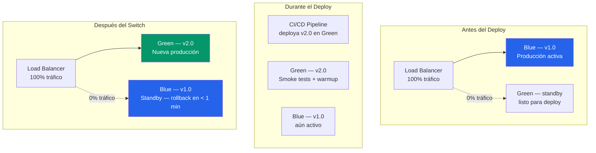
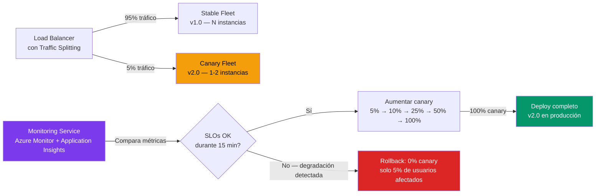
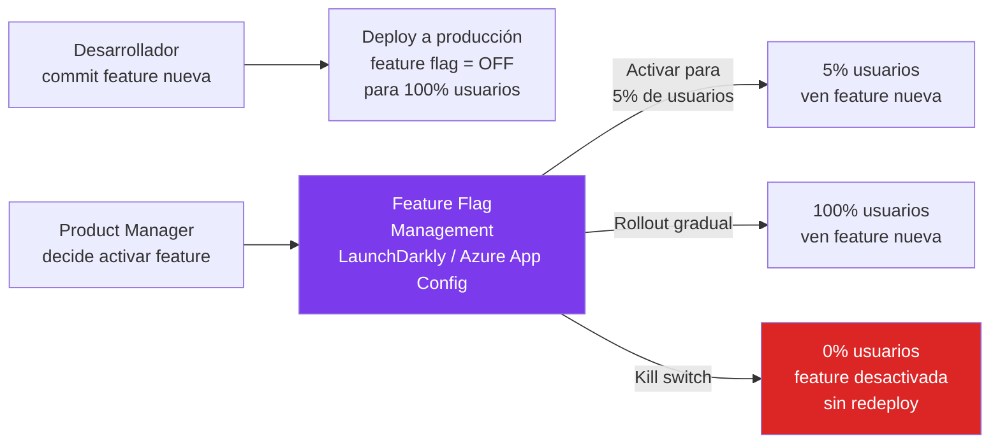
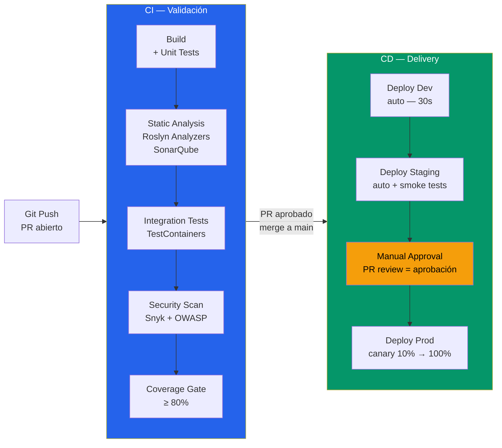

# 04-09 — Deployment y CI/CD: Del Código a Producción de Forma Segura

> **Prerequisito:** [04-08-casos-clasicos.md](./04-08-casos-clasicos.md) — Los casos anteriores diseñaron sistemas. Este archivo responde la pregunta que sigue inevitablemente: ¿cómo llegas de "diseño en papel" a "funcionando en producción" de forma segura, repetible, y reversible?
>
> **Por qué esto importa en entrevistas Staff:**
> Un candidato Junior sabe implementar features. Un candidato Senior sabe deployarlas. Un candidato Staff sabe cómo deployarlas de forma que si algo sale mal, el impacto sea mínimo y el rollback sea inmediato. La pregunta "¿cómo garantizas zero-downtime deployments?" aparece frecuentemente en entrevistas Staff de empresas con SLAs de producción reales. No tener respuesta estructurada es una señal de que el candidato nunca ha operado sistemas a escala.
>
> **📚 Recursos de esta sección:**
> - **Pluralsight — Azure DevOps path** — Pipelines completos con YAML. El path más completo para CI/CD en Azure.
> - **Microsoft Learn — Bicep paths** — [learn.microsoft.com/azure/azure-resource-manager/bicep](https://learn.microsoft.com/azure/azure-resource-manager/bicep). Gratuito, completo, con módulos de certificación.
> - **GitHub Actions Documentation** — [docs.github.com/actions](https://docs.github.com/actions). Para el pipeline de esta sección.
> - **"Continuous Delivery" de Jez Humble y David Farley** — El libro base de CD. Los conceptos de deployment pipeline, feature flags, y blue-green vienen de aquí.

---

## Sección 1 — Deployment Strategies: Seguridad vs Velocidad

### El Trade-off Fundamental

Todo deployment tiene un trade-off entre dos ejes:

```
SEGURIDAD (capacidad de rollback) ←————————→ VELOCIDAD (tiempo hasta producción)
```

Cuanto más segura es la estrategia (más capacidad de detectar problemas y revertir), más lenta es. El objetivo no es maximizar la velocidad — es encontrar el punto correcto del trade-off según el riesgo de cada cambio.

Un Staff Engineer elige la estrategia según tres factores:
1. **Riesgo del cambio:** ¿Es un bug fix de una línea o un rediseño de la BD?
2. **Capacidad de observability:** ¿Puedo detectar rápidamente si algo salió mal?
3. **Costo de un rollback manual:** ¿Cuánto tiempo tarda revertir si sale mal?

### Blue-Green Deployment

**La intuición:** Dos entornos idénticos de producción — el verde está activo, el azul está en standby. Cuando quieres deployar, actualizas el azul con la nueva versión, lo pruebas, y luego cambias el switch del load balancer de verde a azul. Si algo sale mal, cambias el switch de vuelta — rollback instantáneo.



**Ventajas:**
- **Rollback instantáneo:** cambiar el load balancer tarda segundos — sin redeploy, sin downtime
- **Zero downtime:** el switch es atómico desde la perspectiva del cliente
- **Testing en producción real:** puedes enviar tráfico sintético al Green antes del switch para validar

**Desventajas y problemas reales:**
- **Costo de infraestructura doble:** necesitas pagar por dos entornos completos en todo momento
- **El problema del estado compartido:** si Blue y Green comparten la base de datos, el schema de la BD debe ser compatible con **ambas versiones simultáneamente** durante el switch. Esto significa que las migraciones de BD deben seguir el patrón expand-contract:

```
❌ INCORRECTO (rompe Blue durante la transición):
  Migración: DROP COLUMN email_legacy

✅ CORRECTO (expand-contract):
  Semana 1: ADD COLUMN email_new (nullable) → ambas versiones coexisten
  Semana 2: Backfill email_new con datos de email_legacy
  Semana 3: Deploy que ya no lee email_legacy
  Semana 4: DROP COLUMN email_legacy (ahora es seguro)
```

**Cuándo usar Blue-Green:**
- Aplicaciones stateless (APIs, workers sin estado local)
- Cuando el rollback instantáneo es un requerimiento duro (sistemas de pagos, autenticación)
- Cuando el presupuesto de infraestructura lo permite

**Cuándo NO usar Blue-Green:**
- Aplicaciones stateful con estado local (bases de datos en el mismo host)
- Entornos de costo-bajo donde pagar doble infraestructura es inviable
- Cuando los cambios de schema son frecuentes y el equipo no tiene disciplina de expand-contract

---

### Canary Deployment

**La intuición:** En lugar de cambiar el switch de 0% a 100% instantáneamente, aumentas el tráfico hacia la nueva versión gradualmente: 5% → 10% → 25% → 50% → 100%. En cada paso, monitorizas las métricas antes de avanzar. Si detectas una degradación, retrocedes a 0% — el 95% de usuarios nunca notó nada.



**Las métricas que monitoreas durante el canary:**
- **Error rate:** ¿El canary tiene más 5xx que el stable?
- **Latencia p99:** ¿El canary es más lento?
- **Business metrics:** ¿La tasa de conversión cayó en el canary? ¿Más abandono del carrito?
- **SLO compliance:** ¿El canary cumple los SLOs definidos en [04-06](./04-06-observability-reliability.md)?

**Ventajas:**
- Riesgo limitado y cuantificado: solo el N% del tráfico está expuesto al riesgo
- Datos reales de producción para validar la nueva versión (no puedes simular esto en staging)
- El rollback es quirúrgico: el 95% de usuarios nunca tuvo problemas

**Desventajas:**
- Múltiples versiones en producción simultáneamente → debugging más complejo ("¿el bug es en v1 o v2?")
- Requiere infraestructura de traffic splitting (no todos los load balancers lo soportan nativamente)
- El análisis de las métricas del canary requiere criterios explícitos — si no defines qué es "OK", ¿cómo decides avanzar?

**Cuándo usar Canary:**
- Deploys de alto riesgo (cambios en lógica de negocio crítica, reformas de schema significativas)
- Cuando quieres A/B testing natural entre versiones (medir impacto real en el negocio)
- Sistemas con SLOs estrictos donde un rollout defectuoso al 100% es inaceptable

**Cuándo NO usar Canary:**
- Hotfixes urgentes donde la velocidad importa más que la cautela
- Cambios triviales (actualizar una dependencia menor, fix de typo en mensajes de error)
- Cuando el equipo no tiene la capacidad de monitorear activamente el progreso del canary

---

### Feature Flags: Desacoplando Deploy de Release

**El problema que resuelven:** En Blue-Green y Canary, el código nuevo llega a producción y se activa simultáneamente. Feature Flags separan estos dos eventos: el código se deploya a todos los usuarios, pero la funcionalidad nueva está *desactivada* hasta que la activas explícitamente — sin redeploy.



**Implementación en ASP.NET Core con Microsoft.FeatureManagement:**

```csharp
// Program.cs
builder.Services.AddFeatureManagement()
    .AddFeatureFilter<PercentageFilter>()   // Rollout por porcentaje
    .AddFeatureFilter<TargetingFilter>();   // Rollout por usuario/grupo/región

// appsettings.json — o configurado via Azure App Configuration (mejor para producción)
{
  "FeatureManagement": {
    "NewCheckoutFlow": {
      "EnabledFor": [
        {
          "Name": "Targeting",
          "Parameters": {
            "Audience": {
              "Users": ["omar@empresa.com", "qa-team@empresa.com"],
              "Groups": [
                { "Name": "BetaTesters", "RolloutPercentage": 100 },
                { "Name": "Premium", "RolloutPercentage": 50 }
              ],
              "DefaultRolloutPercentage": 5
            }
          }
        }
      ]
    },
    "MaintenanceMode": false  // Kill switch simple — true bloquea la feature
  }
}

// Controller — usando feature flag
public class CheckoutController : ControllerBase
{
    private readonly IFeatureManager _featureManager;
    private readonly INewCheckoutService _newCheckout;
    private readonly ILegacyCheckoutService _legacyCheckout;

    [HttpPost("checkout")]
    public async Task<IActionResult> Checkout(CheckoutRequest request)
    {
        if (await _featureManager.IsEnabledAsync("NewCheckoutFlow"))
        {
            _telemetry.TrackEvent("NewCheckoutFlowUsed", new { UserId = request.UserId });
            return await _newCheckout.ProcessAsync(request);
        }

        return await _legacyCheckout.ProcessAsync(request);
    }
}
```

**Tipos de Feature Flags — no todos son iguales:**

| Tipo | Duración | Propósito | Ejemplo |
|---|---|---|---|
| **Release flags** | Semanas | Activar/desactivar features en producción | Nueva UI de checkout |
| **Experiment flags** | Semanas-meses | A/B testing con analytics | Botón azul vs verde |
| **Ops flags** | Permanente | Kill switches para degradar bajo carga | Deshabilitar recomendaciones si la BD está lenta |
| **Permission flags** | Permanente | Features solo para ciertos usuarios | Panel de admin, features Enterprise |

**⚠️ La deuda técnica de los feature flags:**
Los feature flags tienen un ciclo de vida. Un flag que existe desde hace 2 años y nadie sabe si se puede eliminar es deuda técnica. Las empresas maduras tienen un proceso de cleanup: cuando un flag lleva N semanas al 100%, se elimina del código en el siguiente sprint.

**Cuándo usar Feature Flags:**
- Cuando quieres deployar código sin activarlo (trunk-based development)
- Para A/B testing con control granular por segmento de usuarios
- Como kill switch de emergencia para features problemáticas
- Para reducir el tamaño de los PRs (puedes integrar código incompleto detrás de un flag desactivado)

---

### Comparativa: ¿Cuándo Usar Cada Estrategia?

| Dimensión | Blue-Green | Canary | Feature Flags |
|---|---|---|---|
| Velocidad de rollout | Instantánea (100% de golpe) | Gradual (horas) | Instantánea (el code ya está deployado) |
| Riesgo máximo de impacto | Alto (100% si el switch es incorrecto) | Bajo (N% configurable) | Muy bajo (toggle sin redeploy) |
| Rollback | Instantáneo (cambiar LB) | Instantáneo (0% canary) | Instantáneo (apagar flag) |
| Complejidad de infraestructura | Alta (doble infraestructura) | Media (traffic splitting) | Baja (solo config) |
| Costo | Alto | Medio | Bajo |
| Mejor para | Cambios de infraestructura, zero-downtime crítico | Cambios de lógica de negocio de alto riesgo | Releases de features, A/B testing |

**La respuesta de nivel Staff en entrevista:** "Usaría los tres en capas. Feature flags para controlar la activación de features sin redeploy. Canary deployment para los releases principales (cada sprint o semana). Blue-green para los cambios de infraestructura o actualizaciones del runtime. No son mutuamente excluyentes — son capas de seguridad en el pipeline."

---

## Sección 2 — CI/CD Pipeline: De Commit a Producción

### El Pipeline Completo



**Principio de diseño del pipeline:**
- **CI es automático y sin fricción:** Un PR que falla CI tiene el problema claramente identificado. No hay ambigüedad.
- **CD a Dev y Staging es automático:** Si el CI pasa, el deploy a entornos no-productivos sucede sin intervención humana.
- **CD a Producción tiene un gate de aprobación:** No porque el proceso técnico lo requiera — sino porque alguien debe asumir la responsabilidad del release.

### GitHub Actions para .NET — Pipeline Completo y Funcional

```yaml
# .github/workflows/ci-cd.yml
name: CI/CD Pipeline

on:
  push:
    branches: [ main, develop ]
  pull_request:
    branches: [ main ]

env:
  DOTNET_VERSION: '9.0.x'
  REGISTRY: myregistry.azurecr.io
  IMAGE_NAME: my-api

jobs:
  # ===== CI =====
  ci:
    name: Build, Test & Analyze
    runs-on: ubuntu-latest
    outputs:
      image-tag: ${{ steps.meta.outputs.version }}

    steps:
      - name: Checkout
        uses: actions/checkout@v4
        with:
          fetch-depth: 0  # SonarQube necesita el historial completo

      - name: Setup .NET
        uses: actions/setup-dotnet@v4
        with:
          dotnet-version: ${{ env.DOTNET_VERSION }}

      - name: Cache NuGet packages
        uses: actions/cache@v4
        with:
          path: ~/.nuget/packages
          key: ${{ runner.os }}-nuget-${{ hashFiles('**/*.csproj') }}
          restore-keys: ${{ runner.os }}-nuget-

      - name: Restore
        run: dotnet restore

      - name: Build
        run: dotnet build --no-restore --configuration Release

      - name: Unit Tests
        run: |
          dotnet test \
            --no-build \
            --configuration Release \
            --filter "Category=Unit" \
            --collect:"XPlat Code Coverage" \
            --results-directory ./coverage \
            --logger "trx;LogFileName=unit-tests.trx"

      - name: Integration Tests
        run: |
          dotnet test \
            --no-build \
            --configuration Release \
            --filter "Category=Integration" \
            --logger "trx;LogFileName=integration-tests.trx"
        # TestContainers levanta Docker automáticamente para BD, Redis, etc.
        # No necesitas mocks — los tests usan infraestructura real en Docker

      - name: Publish Test Results
        uses: dorny/test-reporter@v1
        if: always()  # Publicar resultados incluso si los tests fallan
        with:
          name: Test Results
          path: '**/*.trx'
          reporter: dotnet-trx

      - name: Code Coverage Gate
        uses: codecov/codecov-action@v4
        with:
          directory: ./coverage
          fail_ci_if_error: true
          # El archivo codecov.yml define minimum_coverage: 80
          token: ${{ secrets.CODECOV_TOKEN }}

      - name: Security Scan — Dependencies
        uses: snyk/actions/dotnet@master
        env:
          SNYK_TOKEN: ${{ secrets.SNYK_TOKEN }}
        with:
          args: --severity-threshold=high  # Solo falla en vulnerabilidades HIGH/CRITICAL

      - name: Build Docker Image
        uses: docker/build-push-action@v5
        with:
          context: .
          push: false
          tags: ${{ env.REGISTRY }}/${{ env.IMAGE_NAME }}:${{ github.sha }}
          cache-from: type=gha
          cache-to: type=gha,mode=max

      - name: Push to ACR
        if: github.ref == 'refs/heads/main'
        uses: docker/build-push-action@v5
        with:
          context: .
          push: true
          tags: |
            ${{ env.REGISTRY }}/${{ env.IMAGE_NAME }}:${{ github.sha }}
            ${{ env.REGISTRY }}/${{ env.IMAGE_NAME }}:latest
          cache-from: type=gha

  # ===== CD — STAGING =====
  deploy-staging:
    name: Deploy to Staging
    needs: ci
    runs-on: ubuntu-latest
    if: github.ref == 'refs/heads/main'
    environment: staging

    steps:
      - name: Azure Login
        uses: azure/login@v2
        with:
          creds: ${{ secrets.AZURE_CREDENTIALS }}

      - name: Deploy to Azure Container Apps (Staging)
        uses: azure/container-apps-deploy-action@v1
        with:
          resourceGroup: my-app-staging-rg
          containerAppName: my-api-staging
          imageToDeploy: ${{ env.REGISTRY }}/${{ env.IMAGE_NAME }}:${{ github.sha }}

      - name: Wait for deployment health
        run: |
          sleep 30  # Dar tiempo al pod para arrancar

      - name: Smoke Tests
        run: |
          BASE_URL="https://my-api-staging.azurecontainerapps.io"

          # Health check básico
          echo "Verificando health endpoint..."
          curl -f "${BASE_URL}/health/ready" || { echo "❌ Health check falló"; exit 1; }

          # Verificar que la API responde
          echo "Verificando respuesta de API..."
          STATUS=$(curl -s -o /dev/null -w "%{http_code}" "${BASE_URL}/api/v1/status")
          if [ "$STATUS" != "200" ]; then
            echo "❌ API retornó $STATUS, esperado 200"
            exit 1
          fi

          echo "✅ Smoke tests pasaron"

  # ===== CD — PRODUCCIÓN =====
  deploy-production:
    name: Deploy to Production (Canary)
    needs: deploy-staging
    runs-on: ubuntu-latest
    environment: production  # GitHub Environments — requiere aprobación manual configurada en el repo

    steps:
      - name: Azure Login
        uses: azure/login@v2
        with:
          creds: ${{ secrets.AZURE_CREDENTIALS_PROD }}

      - name: Deploy Canary — 10% traffic
        run: |
          az containerapp update \
            --name my-api-prod \
            --resource-group my-app-prod-rg \
            --image ${{ env.REGISTRY }}/${{ env.IMAGE_NAME }}:${{ github.sha }} \
            --revision-suffix "canary-${{ github.run_number }}"

          # Dividir tráfico: 90% a la revisión estable, 10% al canary
          STABLE_REVISION=$(az containerapp revision list \
            --name my-api-prod \
            --resource-group my-app-prod-rg \
            --query "[?properties.active && !contains(name, 'canary')].name | [0]" \
            --output tsv)

          az containerapp ingress traffic set \
            --name my-api-prod \
            --resource-group my-app-prod-rg \
            --revision-weight \
              "$STABLE_REVISION=90" \
              "my-api-prod--canary-${{ github.run_number }}=10"

      - name: Monitor Canary — 15 minutos
        run: |
          echo "Monitoreando canary durante 15 minutos..."
          END_TIME=$(($(date +%s) + 900))  # 15 minutos

          while [ $(date +%s) -lt $END_TIME ]; do
            # Consultar Azure Monitor para la revisión canary
            ERROR_RATE=$(az monitor metrics list \
              --resource "/subscriptions/.../my-api-prod" \
              --metric "Requests" \
              --filter "ResponseCode ge 500" \
              --interval PT1M \
              --query "value[0].timeseries[0].data[-1].total" \
              --output tsv 2>/dev/null || echo "0")

            TOTAL_REQUESTS=$(az monitor metrics list \
              --resource "/subscriptions/.../my-api-prod" \
              --metric "Requests" \
              --interval PT1M \
              --query "value[0].timeseries[0].data[-1].total" \
              --output tsv 2>/dev/null || echo "1")

            # Si error rate > 1%, rollback automático
            if [ "$TOTAL_REQUESTS" -gt 0 ]; then
              RATE=$(echo "scale=4; $ERROR_RATE / $TOTAL_REQUESTS" | bc)
              if (( $(echo "$RATE > 0.01" | bc -l) )); then
                echo "❌ Error rate en canary: $RATE — ROLLBACK AUTOMÁTICO"
                exit 1  # El siguiente step maneja el rollback
              fi
            fi

            echo "✅ Error rate OK ($RATE). Tiempo restante: $((END_TIME - $(date +%s)))s"
            sleep 60
          done

          echo "✅ 15 minutos sin degradación — procediendo al 100%"

      - name: Rollback on failure
        if: failure()
        run: |
          echo "🔄 Iniciando rollback..."
          STABLE_REVISION=$(az containerapp revision list \
            --name my-api-prod \
            --resource-group my-app-prod-rg \
            --query "[?properties.active && !contains(name, 'canary')].name | [0]" \
            --output tsv)

          # Devolver 100% del tráfico a la revisión estable
          az containerapp ingress traffic set \
            --name my-api-prod \
            --resource-group my-app-prod-rg \
            --revision-weight "$STABLE_REVISION=100"

          echo "✅ Rollback completado. 100% tráfico en revisión estable."

      - name: Promote to 100%
        if: success()
        run: |
          CANARY_REVISION="my-api-prod--canary-${{ github.run_number }}"

          az containerapp ingress traffic set \
            --name my-api-prod \
            --resource-group my-app-prod-rg \
            --revision-weight "${CANARY_REVISION}=100"

          echo "✅ Deploy completado. 100% tráfico en v${{ github.sha }}"
```

**Por qué cada decisión en este pipeline:**

- **`fetch-depth: 0` para SonarQube:** SonarQube necesita el historial de git para calcular métricas de deuda técnica comparativas. Sin esto, solo analiza el commit actual.
- **TestContainers en lugar de mocks para Integration Tests:** Los mocks mienten. Una BD de Postgres en Docker da confianza real de que el código funciona con la infraestructura real. El costo en tiempo (30-60 segundos) vale la calidad.
- **`environment: production` con aprobación manual:** GitHub Environments permite configurar "required reviewers" — nadie puede deployar a producción sin que alguien apruebe explícitamente. Esto no es burocracia — es accountability.
- **Rollback automático en el canary:** Si el monitoring detecta degradación, el pipeline revierte sin intervención humana. A las 3am, nadie quiere esperar a que alguien se conecte para hacer rollback.

---

## Sección 3 — Infrastructure as Code con Bicep

### Por Qué IaC es una Decisión de Arquitectura

**El problema sin IaC:** La infraestructura se configura manualmente en el portal de Azure. Con el tiempo, nadie sabe exactamente qué está configurado, por qué, y si el entorno de staging refleja producción. El primer desastre ocurre cuando hay que recrear el entorno: ¿qué configuración exactamente tenía?

**El principio de IaC:** La infraestructura debe tratarse como código — versionada en git, revisada en PR antes de aplicar, y reproducible desde cero en cualquier momento. Si pierdes toda la infraestructura de producción esta noche, ¿puedes recrearla exactamente mañana? Con IaC: sí. Sin IaC: probablemente no.

### Bicep vs Terraform vs ARM Templates

| Herramienta | Cuándo usar |
|---|---|
| **Bicep** | Stacks 100% Azure. Sintaxis limpia, validación nativa, soporte de Microsoft directo. |
| **Terraform** | Multi-cloud (Azure + AWS + GCP) o equipos que ya tienen expertise en Terraform. |
| **ARM Templates** | Solo si heredas infraestructura existente. Para proyectos nuevos, siempre Bicep sobre ARM. |
| **Pulumi** | Si el equipo prefiere definir infraestructura en C# o TypeScript en lugar de un DSL específico. |

**La respuesta de nivel Staff:** "Bicep para Azure puro. Si el negocio requiere multi-cloud en el futuro, Terraform. ARM Templates solo para migrar infraestructura existente — son demasiado verbosos para mantener."

### Bicep para Azure Container Apps — Ejemplo Completo

```bicep
// main.bicep
// Ejecutar con: az deployment group create --resource-group my-rg --template-file main.bicep

@description('Ambiente de deployment')
@allowed(['dev', 'staging', 'prod'])
param environment string

@description('Nombre base de la aplicación')
param appName string = 'my-api'

@description('Región de Azure')
param location string = resourceGroup().location

@description('Tag de la imagen Docker a deployar')
param imageTag string = 'latest'

// ===== VARIABLES DERIVADAS =====
var isProd = environment == 'prod'
var resourcePrefix = '${appName}-${environment}'

// ===== KEY VAULT — secretos, nunca en código =====
resource keyVault 'Microsoft.KeyVault/vaults@2023-07-01' = {
  name: 'kv-${resourcePrefix}'
  location: location
  properties: {
    sku: { family: 'A', name: 'standard' }
    tenantId: subscription().tenantId
    enableRbacAuthorization: true  // RBAC en lugar de access policies — más seguro
    enableSoftDelete: true
    softDeleteRetentionInDays: isProd ? 90 : 7  // Prod: 90 días de retención
  }
}

// ===== MANAGED IDENTITY — sin credenciales hardcodeadas =====
resource managedIdentity 'Microsoft.ManagedIdentity/userAssignedIdentities@2023-01-31' = {
  name: 'id-${resourcePrefix}'
  location: location
}

// Dar acceso de lectura de secretos al Managed Identity
resource kvSecretsReaderRole 'Microsoft.Authorization/roleAssignments@2022-04-01' = {
  name: guid(keyVault.id, managedIdentity.id, 'Key Vault Secrets User')
  scope: keyVault
  properties: {
    roleDefinitionId: subscriptionResourceId(
      'Microsoft.Authorization/roleDefinitions',
      '4633458b-17de-408a-b874-0445c86b69e6'  // Key Vault Secrets User
    )
    principalId: managedIdentity.properties.principalId
    principalType: 'ServicePrincipal'
  }
}

// ===== CONTAINER APPS ENVIRONMENT =====
resource logAnalytics 'Microsoft.OperationalInsights/workspaces@2022-10-01' = {
  name: 'log-${resourcePrefix}'
  location: location
  properties: {
    sku: { name: 'PerGB2018' }
    retentionInDays: isProd ? 90 : 30
  }
}

resource containerAppEnv 'Microsoft.App/managedEnvironments@2023-11-02-preview' = {
  name: 'cae-${resourcePrefix}'
  location: location
  properties: {
    appLogsConfiguration: {
      destination: 'log-analytics'
      logAnalyticsConfiguration: {
        customerId: logAnalytics.properties.customerId
        sharedKey: logAnalytics.listKeys().primarySharedKey
      }
    }
    // Workload profiles para prod — mejor aislamiento y recursos garantizados
    workloadProfiles: isProd ? [
      {
        name: 'Consumption'
        workloadProfileType: 'Consumption'
      }
      {
        name: 'D4'
        workloadProfileType: 'D4'
        minimumCount: 2
        maximumCount: 10
      }
    ] : [
      {
        name: 'Consumption'
        workloadProfileType: 'Consumption'
      }
    ]
  }
}

// ===== CONTAINER APP =====
resource containerApp 'Microsoft.App/containerApps@2023-11-02-preview' = {
  name: 'ca-${resourcePrefix}'
  location: location
  identity: {
    type: 'UserAssigned'
    userAssignedIdentities: {
      '${managedIdentity.id}': {}
    }
  }
  properties: {
    environmentId: containerAppEnv.id
    workloadProfileName: isProd ? 'D4' : 'Consumption'

    configuration: {
      ingress: {
        external: true
        targetPort: 8080
        transport: 'http2'  // HTTP/2 para mejor performance con gRPC si aplica
        corsPolicy: {
          allowedOrigins: isProd
            ? ['https://myapp.com', 'https://www.myapp.com']
            : ['*']
          allowedMethods: ['GET', 'POST', 'PUT', 'DELETE', 'OPTIONS']
        }
      }

      // Secretos leídos de Key Vault — el Container App usa el Managed Identity
      secrets: [
        {
          name: 'db-connection-string'
          keyVaultUrl: 'https://${keyVault.name}.vault.azure.net/secrets/DbConnectionString'
          identity: managedIdentity.id
        }
        {
          name: 'redis-connection-string'
          keyVaultUrl: 'https://${keyVault.name}.vault.azure.net/secrets/RedisConnectionString'
          identity: managedIdentity.id
        }
      ]

      // Configuración del registry de contenedores
      registries: [
        {
          server: 'myregistry.azurecr.io'
          identity: managedIdentity.id  // Sin credenciales — Managed Identity accede al ACR
        }
      ]
    }

    template: {
      containers: [
        {
          name: appName
          image: 'myregistry.azurecr.io/${appName}:${imageTag}'

          resources: isProd ? {
            cpu: json('1.0')
            memory: '2Gi'
          } : {
            cpu: json('0.25')
            memory: '0.5Gi'
          }

          env: [
            { name: 'ASPNETCORE_ENVIRONMENT', value: isProd ? 'Production' : 'Staging' }
            { name: 'ConnectionStrings__Default', secretRef: 'db-connection-string' }
            { name: 'ConnectionStrings__Redis', secretRef: 'redis-connection-string' }
            { name: 'APPLICATIONINSIGHTS_CONNECTION_STRING', value: appInsights.properties.ConnectionString }
          ]

          // Probes — obligatorios para zero-downtime deployments
          probes: [
            {
              type: 'Readiness'  // El Container App no envía tráfico hasta que esto pase
              httpGet: { path: '/health/ready', port: 8080 }
              initialDelaySeconds: 10
              periodSeconds: 5
              failureThreshold: 3
            }
            {
              type: 'Liveness'   // Si esto falla, el container se reinicia
              httpGet: { path: '/health/live', port: 8080 }
              initialDelaySeconds: 30
              periodSeconds: 10
              failureThreshold: 3
            }
            {
              type: 'Startup'    // Da tiempo al app para arrancar antes de los otros probes
              httpGet: { path: '/health/startup', port: 8080 }
              initialDelaySeconds: 5
              periodSeconds: 5
              failureThreshold: 12  // 12 × 5s = 60 segundos para arrancar
            }
          ]
        }
      ]

      scale: {
        minReplicas: isProd ? 2 : 1   // Prod: siempre 2 para HA (zona de disponibilidad)
        maxReplicas: isProd ? 20 : 3
        rules: [
          {
            name: 'http-scaling'
            http: {
              metadata: {
                concurrentRequests: '100'  // Escalar cuando > 100 requests concurrentes por réplica
              }
            }
          }
        ]
      }
    }
  }
}

// ===== APPLICATION INSIGHTS — observabilidad integrada =====
resource appInsights 'Microsoft.Insights/components@2020-02-02' = {
  name: 'appi-${resourcePrefix}'
  location: location
  kind: 'web'
  properties: {
    Application_Type: 'web'
    WorkspaceResourceId: logAnalytics.id
    IngestionMode: 'LogAnalytics'  // Mejor para queries en Log Analytics
    RetentionInDays: isProd ? 90 : 30
  }
}

// ===== OUTPUTS — usados por el pipeline de CD =====
output containerAppUrl string = 'https://${containerApp.properties.configuration.ingress.fqdn}'
output containerAppName string = containerApp.name
output resourceGroupName string = resourceGroup().name
```

**Por qué este Bicep está bien diseñado:**
- **`isProd ? ... : ...`** para configuración diferenciada — un solo template, múltiples entornos
- **Managed Identity sobre credenciales:** el Container App accede al Key Vault y al ACR sin ninguna contraseña en el código o en las variables de entorno
- **Los tres tipos de probes** (`Readiness`, `Liveness`, `Startup`) — sin ellos, los rolling updates pueden causar errores 502 durante el deploy
- **`minReplicas: 2` en prod** — con una sola réplica, cuando Azure la reinicia (mantenimiento de la plataforma, update del runtime) tienes downtime

---

## Sección 4 — Deployment en Kubernetes/AKS

### Cuándo AKS sobre Azure Container Apps

Azure Container Apps es la abstracción correcta para el 80% de los casos. AKS tiene sentido cuando:
- Necesitas control granular sobre el scheduler de pods (node affinity, taints, tolerations)
- Tienes workloads mixtos: APIs stateless + servicios stateful + batch jobs en el mismo cluster
- El equipo tiene expertise en Kubernetes y el overhead operacional es justificado
- Necesitas capacidades que Container Apps no expone: daemonsets, custom resource definitions, Istio service mesh

**Rolling Update en Kubernetes — la estrategia por defecto:**

```yaml
# deployment.yaml
apiVersion: apps/v1
kind: Deployment
metadata:
  name: order-api
  namespace: production
spec:
  replicas: 3
  strategy:
    type: RollingUpdate
    rollingUpdate:
      maxSurge: 1         # Kubernetes puede crear 1 pod adicional durante el update
      maxUnavailable: 0   # Nunca reducir por debajo de 3 pods disponibles
                          # → Zero-downtime garantizado durante el rollout

  selector:
    matchLabels:
      app: order-api
      version: stable

  template:
    metadata:
      labels:
        app: order-api
        version: stable

    spec:
      # Graceful shutdown — esperar N segundos antes de matar el pod
      terminationGracePeriodSeconds: 60

      containers:
      - name: order-api
        image: myregistry.azurecr.io/order-api:2.0.0
        ports:
        - containerPort: 8080

        resources:
          requests:           # Kubernetes garantiza estos recursos al pod
            memory: "256Mi"
            cpu: "250m"       # 0.25 CPU cores
          limits:             # Kubernetes mata el pod si supera estos límites
            memory: "512Mi"
            cpu: "500m"

        # Sin estos probes, Kubernetes envía tráfico antes de que el app esté listo
        readinessProbe:
          httpGet:
            path: /health/ready
            port: 8080
          initialDelaySeconds: 10
          periodSeconds: 5
          failureThreshold: 3
          successThreshold: 1

        livenessProbe:
          httpGet:
            path: /health/live
            port: 8080
          initialDelaySeconds: 30   # Dar tiempo al app para arrancar completamente
          periodSeconds: 10
          failureThreshold: 3

        startupProbe:
          httpGet:
            path: /health/startup
            port: 8080
          initialDelaySeconds: 5
          periodSeconds: 5
          failureThreshold: 12     # 12 × 5s = 60s máximo para arrancar

        # Variables de entorno desde Kubernetes Secrets (encriptados en etcd)
        env:
        - name: ConnectionStrings__Default
          valueFrom:
            secretKeyRef:
              name: order-api-secrets
              key: db-connection-string
        - name: ASPNETCORE_ENVIRONMENT
          value: "Production"

---
# Horizontal Pod Autoscaler — escalar basado en métricas
apiVersion: autoscaling/v2
kind: HorizontalPodAutoscaler
metadata:
  name: order-api-hpa
  namespace: production
spec:
  scaleTargetRef:
    apiVersion: apps/v1
    kind: Deployment
    name: order-api
  minReplicas: 3   # Nunca menos de 3 para HA
  maxReplicas: 20
  metrics:
  - type: Resource
    resource:
      name: cpu
      target:
        type: Utilization
        averageUtilization: 70   # Escalar cuando CPU > 70% promedio
  - type: Resource
    resource:
      name: memory
      target:
        type: Utilization
        averageUtilization: 80
```

**⚠️ El error más común con los probes en producción:**

No configurar `startupProbe`. Sin él, si el app tarda 45 segundos en arrancar (calentar el JIT de .NET, cargar datos en caché, conectar a la BD), el `livenessProbe` con `initialDelaySeconds: 30` va a detectar el app "no respondiendo" y lo va a matar antes de que termine de arrancar. Resulta en un loop de CrashBackOff. La solución: `startupProbe` con un `failureThreshold` generoso que da suficiente tiempo para el arranque inicial.

---

## Checklist de Salida — Deployment y CI/CD

- [ ] Puedo explicar Blue-Green vs Canary vs Feature Flags con sus trade-offs en < 3 minutos
- [ ] Puedo articular por qué las migraciones de BD en Blue-Green requieren expand-contract
- [ ] Puedo escribir un GitHub Actions pipeline funcional para .NET con CI y CD por etapas
- [ ] Puedo explicar por qué TestContainers es superior a mocks en integration tests
- [ ] Puedo escribir un Bicep básico para deployar una API en Azure Container Apps
- [ ] Puedo explicar la diferencia entre `readinessProbe`, `livenessProbe`, y `startupProbe`
- [ ] Puedo articular cuándo usar AKS vs Azure Container Apps con criterios técnicos

---

## ✅ Checklist de Salida del Módulo 4 — System Design

Este es el gate de salida del módulo más extenso del curriculum. Si no puedes hacer todo esto, el módulo no está completo — estás listo para revisarlo y practicar.

### Framework y Proceso

- [ ] Aplico RESHADED en cualquier pregunta de diseño sin consultarlo — el proceso es automático
- [ ] Hago estimaciones de tráfico, storage, y bandwidth en voz alta con razonamiento explícito
- [ ] Mis estimaciones generan decisiones de arquitectura concretas
- [ ] Clarfico requirements ambiguos en < 5 minutos con preguntas específicas
- [ ] Identifico el failure mode más probable de cualquier diseño sin que me lo señalen

### Componentes Fundamentales (04-01)

- [ ] Explico la diferencia entre L4 y L7 load balancer y cuándo usar cada uno
- [ ] Diseño un API Gateway con rate limiting, auth centralizada, y routing
- [ ] Explico cómo funciona un CDN internamente: push vs pull, cache invalidation

### Bases de Datos (04-02)

- [ ] Elijo entre SQL y NoSQL con criterios técnicos, no preferencias
- [ ] Explico consistent hashing y por qué resuelve el problema del resharding
- [ ] Diseño una estrategia de sharding para una tabla de 50M registros
- [ ] Explico master-replica replication y los problemas de replica lag

### Caching (04-03)

- [ ] Explico Cache-Aside vs Read-Through vs Write-Behind con cuándo usar cada uno
- [ ] Diseño una estrategia de invalidación de caché para un sistema de inventory

### Message Queues (04-04)

- [ ] Explico la diferencia entre at-most-once, at-least-once, y exactly-once
- [ ] Elijo entre Kafka y RabbitMQ con justificación técnica para un caso dado

### Distributed Systems (04-05)

- [ ] Explico CAP theorem con un ejemplo concreto de una decisión de diseño real
- [ ] Diseño un sistema con eventual consistency y justifico por qué es aceptable
- [ ] Explico las 8 falacias de los sistemas distribuidos con sus impactos de diseño

### Observability y Reliability (04-06)

- [ ] Diseño SLOs para un sistema dado con SLIs y error budget
- [ ] Explico la diferencia entre monitoring y observability con consecuencias prácticas
- [ ] Diseño una estrategia de alerting que minimiza false positives

### Security (04-07)

- [ ] Explico Zero Trust y sus implicaciones de diseño en microservicios
- [ ] Diseño autenticación JWT con rotación de tokens y revocación

### Casos Clásicos (04-08)

- [ ] Diseño URL Shortener en 30 minutos con KGS, 302 vs 301, y failure modes
- [ ] Diseño Twitter Feed en 40 minutos articulando el hybrid fan-out sin que me lo sugieran
- [ ] Diseño un sistema de notificaciones con retry policy y DLQ

### Deployment y CI/CD (04-09)

- [ ] Explico Blue-Green vs Canary vs Feature Flags con cuándo usar cada uno
- [ ] Escribo un pipeline de CI/CD funcional para una API .NET en GitHub Actions
- [ ] Diseño infraestructura como código con Bicep para Azure

---

> **Módulo completado.** Has cubierto todo el espectro de System Design: desde los componentes fundamentales hasta los casos clásicos de entrevista y el deployment a producción.
>
> **Siguiente módulo:** [05-00-overview.md](../modulo-05-stack-especifico/05-00-overview.md) — El Módulo 5 aterriza todo lo universal de este módulo en el stack específico de Omar: .NET/C#, ASP.NET Core, EF Core, y Azure. El conocimiento de System Design ya está construido — ahora lo aplicas con las herramientas que usas en producción diariamente.
>
> **📚 Para practicar antes de continuar:**
> - **AlgoExpert Systems Expert:** ahora que tienes el framework, los casos de Systems Expert serán mucho más productivos. Completa 5-10 casos usando RESHADED.
> - **ByteByteGo Newsletter:** suscríbete y lee las ediciones de los últimos 3 meses. Cada edición refuerza un componente o caso del módulo con visualizaciones adicionales.
> - **Mock Interview real:** encuentra un compañero y simula una entrevista de 45 minutos. El objetivo no es hacerlo perfecto — es acostumbrarte a pensar en voz alta bajo presión.
