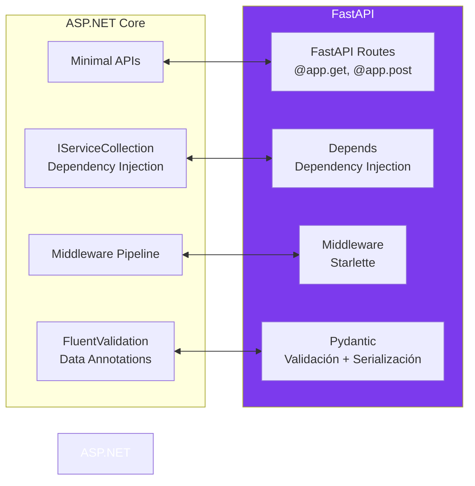

# 05-03 — Python Suficiente: Lo que un Staff .NET Necesita en 2026

> **Prerequisito:** No hay prerequisito técnico de Python. Pero sí de mentalidad: este archivo no te convierte en Python developer. Te convierte en alguien que puede leer código Python con criterio, escribir scripts y automatizaciones funcionales, construir APIs con FastAPI, y discutir integraciones de IA sin depender de otros. El puente es tu experiencia en C# — cada concepto aquí se ancla a algo que ya conoces.
>
> **Lo que este archivo NO es:** Un curso de Python. No cubriremos NumPy, Pandas, Matplotlib, ni Machine Learning. Eso es territorio de Data Scientists y ML Engineers. Tu territorio es el Python de un backend developer: APIs, scripts, async, y tooling de IA.
>
> **🎯 Recurso Codecademy:** El path **"Learn Python 3"** de Codecademy — específicamente los módulos *Functions*, *Loops*, *Dictionaries*, y el módulo *Intermediate Python*. Úsalos como práctica activa **después** de leer las secciones correspondientes aquí. Este archivo construye el modelo mental comparativo — Codecademy te da los ejercicios con retroalimentación inmediata.

---

## Sección 1 — Por qué Python importa para un Staff .NET en 2026

No es una tendencia pasajera. Son tres razones estructurales que no van a desaparecer:

### 1. El ecosistema de IA vive en Python

LangChain, LlamaIndex, Hugging Face Transformers, LlamaIndex, CrewAI, OpenAI SDK, Anthropic SDK — la mayoría de la tooling crítica de IA tiene Python como ciudadano de primera clase y .NET como ciudadano de segunda (o directamente no existe SDK oficial). Incluso si construyes tu arquitectura completa en .NET, hay escenarios donde necesitarás:

- Leer e integrar un script de Python que preprocesa datos para tu pipeline de IA
- Evaluar si una librería de Python tiene equivalente en .NET antes de decidir el stack
- Hacer scripting rápido para experimentar con un LLM o un modelo de embeddings
- Escribir el componente de evaluación de un RAG pipeline en Python porque las librerías de eval (RAGAS, TruLens) no tienen equivalente .NET

**Un Staff que no puede leer Python es ciego en la mitad de las conversaciones de arquitectura de IA en 2026.**

### 2. Scripts y automatización: Python domina donde C# no llega

DevOps scripts, procesamiento de archivos, automatización de pipelines de datos, generación de reportes, integración con APIs externas de forma rápida — Python tiene librerías maduras y una curva de setup casi inexistente. Lo que en .NET requiere un proyecto de consola con su `.csproj` y 10 líneas de boilerplate, en Python es un script de 20 líneas que ejecutas directamente.

Cuando necesitas automatizar algo rápido, Python gana en velocidad de escritura. Un Staff que puede escribir ese script en 30 minutos no necesita bloquear a un Python developer.

### 3. Entrevistas: más opciones = más flexibilidad

Muchas empresas permiten Python como alternativa a C# en coding interviews. Si un problema tiene una solución más elegante en Python (collection comprehensions, itertools), tenerlo disponible te da ventaja. También es señal de amplitud técnica — un candidato Staff que solo conoce C# transmite especialización; uno que puede razonar en múltiples lenguajes transmite madurez.

### Lo que explícitamente NO necesitas dominar

- NumPy, Pandas, Matplotlib — territorio de ML Engineers y Data Scientists
- Entrenamiento de modelos de ML — scikit-learn, PyTorch, TensorFlow
- Configuración de entornos conda, Jupyter notebooks, data pipelines complejos
- Python avanzado: metaclasses, descriptors, C extensions

---

## Sección 2 — Python para un Developer de C#: Las Diferencias que Importan

Llevas 10 años en C#. El riesgo no es que Python sea difícil — es que parece tan familiar que subestimas las diferencias que sí importan.

### Tipado dinámico vs estático: la diferencia más profunda

```python
# Python — tipado dinámico, sin declaración de tipo obligatoria
name = "Omar"    # str inferido en runtime
age = 30         # int inferido en runtime
name = 42        # VÁLIDO — reasignación a tipo diferente. Sin error.

# Esta línea en C# sería un error de compilación:
# string name = "Omar";
# name = 42; // CS0029: Cannot implicitly convert type 'int' to 'string'

# En Python, los tipos existen — pero se verifican en runtime, no en compilación
```

**Type Hints (Python 3.5+) — parecen tipos de C# pero NO lo son:**

```python
# Con type hints: la sintaxis se parece a C# pero es solo anotación documental
def greet(name: str, age: int) -> str:
    return f"Hello {name}, you are {age} years old"

# Equivalente C#:
# string Greet(string name, int age) => $"Hello {name}, you are {age} years old";

# La diferencia crítica:
greet("Omar", "thirty")  # ¡Python NO lanza error! El tipo hint es ignorado en runtime
# C# no compilaría esto — type safety en compilación

# Para enforcement real en runtime, necesitas mypy (herramienta externa) o Pydantic
```

**⚠️ Gotcha de producción:** Developers de C# asumen que los type hints dan type safety. No es así. En Python, los type hints son contratos documentales que necesitas validar activamente con herramientas como `mypy` o con Pydantic en el boundary de entrada de datos.

### Indentación como sintaxis — no hay llaves

```python
# En Python, la indentación define los bloques — NO las llaves {}
# Una indentación incorrecta es un SyntaxError, no un style issue

def process_order(order):
    if order.total > 1000:
        apply_discount(order)     # Pertenece al if — 4 espacios
        send_notification(order)  # También pertenece al if
    else:
        process_normally(order)   # Pertenece al else

    log_order(order)  # Fuera del if/else — nivel del método. Siempre ejecuta.

# Error típico de developer de C#:
def broken_function():
    x = 10
      y = 20  # IndentationError — indentación inconsistente
```

**La convención es 4 espacios** — no tabs. Mixear causa errores silenciosos que son brutales de debuggear.

### Colecciones — las equivalencias exactas con C#

```python
# ============== LIST == List<T> ==============
orders = [1, 2, 3, 4, 5]
orders.append(6)           # .Add()
orders.remove(3)           # .Remove() — elimina primera ocurrencia
orders.insert(0, 99)       # .Insert(0, 99)
first = orders[0]          # Indexer normal
last = orders[-1]          # Último elemento — -1 es el último. No existe en C# nativo.
slice = orders[1:3]        # orders[1..3] — sublist del índice 1 al 2 (3 exclusivo)
length = len(orders)       # .Count o .Length

# ============== DICTIONARY == Dictionary<K,V> ==============
user = {"name": "Omar", "age": 30, "active": True}
user["email"] = "omar@example.com"      # Agregar o actualizar
name = user.get("name", "Unknown")      # GetValueOrDefault
exists = "name" in user                 # ContainsKey
del user["active"]                      # Remove
for key, value in user.items():         # foreach (KeyValuePair)
    print(f"{key}: {value}")

# ============== TUPLE == (T1, T2) en C# ==============
point = (10, 20)
x, y = point    # Destructuring — como (var x, var y) = point en C#
# Los tuples son INMUTABLES en Python — no puedes asignar point[0] = 99

# ============== SET == HashSet<T> ==============
unique_ids = {1, 2, 3, 4}      # Nota: {} vacío es dict, no set — usa set()
unique_ids.add(5)              # .Add()
unique_ids.discard(3)          # Remove sin error si no existe
exists = 3 in unique_ids       # .Contains()
intersection = {1,2,3} & {2,3,4}  # HashSet.IntersectWith — resultado: {2,3}
```

### List Comprehensions — la feature de Python sin equivalente directo en C#

Esta es la feature que más confunde a developers de C# la primera vez. Es LINQ pero en una sola expresión inline:

```python
numbers = [1, 2, 3, 4, 5, 6, 7, 8, 9, 10]

# Equivalente exacto de: numbers.Where(n => n % 2 == 0).Select(n => n * n).ToList()
even_squares = [n * n for n in numbers if n % 2 == 0]
# Resultado: [4, 16, 36, 64, 100]

# Leerlo como: [expresión para cada elemento si condición]

# Dictionary comprehension — sin equivalente LINQ directo
word_lengths = {word: len(word) for word in ["hello", "world", "python"]}
# Resultado: {"hello": 5, "world": 5, "python": 6}
# Equivalente a: words.ToDictionary(w => w, w => w.Length)

# Set comprehension
unique_lengths = {len(word) for word in ["hello", "world", "hi"]}
# Resultado: {5, 2} — sin duplicados

# Generator expression — como IEnumerable lazy en C# (no materializa en memoria)
total = sum(n * n for n in numbers if n % 2 == 0)
# Equivalente a: numbers.Where(n => n % 2 == 0).Select(n => n * n).Sum()
```

### Funciones de primera clase y lambdas

```python
# Lambda — equivalente a expresiones lambda en C#
square = lambda x: x * x
result = square(5)  # 25

# C#: Func<int, int> square = x => x * x;

# Pero las lambdas de Python son limitadas — solo una expresión, sin statements
# Para lógica compleja, usa funciones nombradas

def transform_order(order, transformer):
    """Equivalente a un método que recibe Func<Order, Order>"""
    return transformer(order)

# map, filter, reduce — equivalentes a LINQ
numbers = [1, 2, 3, 4, 5]
doubled = list(map(lambda x: x * 2, numbers))          # Select
evens = list(filter(lambda x: x % 2 == 0, numbers))    # Where

# En Python moderno, se prefiere list comprehensions sobre map/filter
# Son más legibles y más "Pythonic"
doubled_modern = [x * 2 for x in numbers]              # Prefer this
evens_modern = [x for x in numbers if x % 2 == 0]      # Over map/filter
```

### Manejo de errores — familiar pero con diferencias

```python
# Try/except — equivalente a try/catch en C#
try:
    result = 10 / 0
except ZeroDivisionError as e:
    print(f"Math error: {e}")
except (TypeError, ValueError) as e:  # Multiple exceptions — catch con múltiples tipos
    print(f"Type/value error: {e}")
except Exception as e:                # Base exception — como catch (Exception e)
    print(f"Unexpected: {e}")
else:
    # Se ejecuta SOLO si no hubo excepción — no existe en C#
    print("Operation succeeded")
finally:
    print("Always runs")              # Igual que finally en C#

# Context managers con 'with' — equivalente a using en C#
# En C#: using var file = new FileStream(...)
with open("data.json", "r") as f:
    data = f.read()  # f se cierra automáticamente al salir del bloque with
```

---

## Sección 3 — Async en Python: Diferencias Críticas con C#

Este es el área donde la mayoría de developers de C# se confunden más. La sintaxis es casi idéntica — el modelo de ejecución es radicalmente diferente.

### El modelo de concurrencia de Python

```
C# (ASP.NET Core):
┌─────────────────────────────────────────────────────────┐
│  ThreadPool con múltiples threads reales                 │
│  async/await = liberar thread mientras espera I/O        │
│  await en varios tasks = true paralelismo en múltiples  │
│  threads del pool                                        │
└─────────────────────────────────────────────────────────┘

Python (asyncio):
┌─────────────────────────────────────────────────────────┐
│  Single-threaded event loop (como Node.js)              │
│  async/await = cooperative multitasking                  │
│  await libera el control al event loop, no al ThreadPool│
│  Para I/O: excelente — el event loop maneja la espera   │
│  Para CPU: NO — bloquea el único thread disponible       │
└─────────────────────────────────────────────────────────┘
```

**El GIL (Global Interpreter Lock) — la diferencia más importante para entrevistas:**

Python tiene un lock a nivel de intérprete que previene que múltiples threads ejecuten bytecode de Python simultáneamente. El GIL es real y tiene consecuencias arquitectónicas:

- **I/O bound (HTTP, BD, archivos):** asyncio o threading funcionan bien — el GIL se libera durante operaciones de I/O
- **CPU bound (computación intensa):** threading NO da paralelismo real — el GIL previene ejecución simultánea. Debes usar `multiprocessing`

**⚠️ Esta es una pregunta frecuente en entrevistas Staff sobre Python: "¿Por qué threading en Python no da paralelismo real para CPU-bound tasks?" — La respuesta es el GIL.**

```python
import asyncio
import aiohttp  # pip install aiohttp — equivalente a HttpClient

# Función async básica — idéntica sintaxis a C#
async def fetch_order(order_id: int) -> dict:
    async with aiohttp.ClientSession() as session:
        async with session.get(f"https://api.example.com/orders/{order_id}") as response:
            return await response.json()

# Ejecutar múltiples requests concurrentemente — como Task.WhenAll en C#
async def fetch_all_orders(order_ids: list[int]) -> list[dict]:
    tasks = [fetch_order(oid) for oid in order_ids]
    results = await asyncio.gather(*tasks)  # Task.WhenAll equivalente
    return results

# Para CPU-bound: ProcessPoolExecutor — no threads
import asyncio
from concurrent.futures import ProcessPoolExecutor

def heavy_computation(data: list) -> list:
    """Función síncrona — corre en proceso separado"""
    return [x * x for x in data]  # Ejemplo simplificado

async def process_async(data: list) -> list:
    loop = asyncio.get_event_loop()
    with ProcessPoolExecutor(max_workers=4) as executor:
        # Ejecuta heavy_computation en un proceso separado — true paralelismo
        result = await loop.run_in_executor(executor, heavy_computation, data)
    return result

# Entry point de una app async
if __name__ == "__main__":
    asyncio.run(fetch_all_orders([1, 2, 3, 4, 5]))  # Equivalente a .GetAwaiter().GetResult()
```

### Cuándo usar qué mecanismo de concurrencia

| Tipo de tarea | Mecanismo correcto | Equivalente C# |
|---|---|---|
| I/O bound (HTTP, BD) | `asyncio` con `await` | `async/await` con HttpClient/EF Core |
| I/O bound simple en script | `threading` | Background threads simples |
| CPU bound (procesamiento) | `multiprocessing` | Parallel.ForEach / Task.Run con real threads |
| CPU bound en contexto async | `ProcessPoolExecutor` + `run_in_executor` | `await Task.Run(() => ...)` |

---

## Sección 4 — FastAPI para Developers de C#: ASP.NET Core Minimal APIs en Python

FastAPI es el framework Python más relevante para un Staff .NET en 2026. La comparación directa con ASP.NET Core Minimal APIs es la forma más rápida de entenderlo.



### Pydantic — el equivalente a Records + FluentValidation + System.Text.Json

```python
from pydantic import BaseModel, field_validator, Field
from typing import Optional
from decimal import Decimal
import uuid
from datetime import datetime

# BaseModel es como un C# record con validación integrada
class OrderItem(BaseModel):
    product_id: uuid.UUID
    quantity: int = Field(gt=0, le=10000, description="Debe ser entre 1 y 10,000")
    unit_price: Decimal = Field(gt=0, decimal_places=2)

    # Validator — equivalente a FluentValidation rule
    @field_validator('quantity')
    @classmethod
    def quantity_must_be_stock_compatible(cls, v: int) -> int:
        if v % 1 != 0:  # Solo ejemplo de validación de negocio
            raise ValueError('Quantity must be a whole number')
        return v

class CreateOrderRequest(BaseModel):
    customer_id: uuid.UUID
    items: list[OrderItem] = Field(min_length=1)  # Al menos un item
    notes: Optional[str] = None                    # Optional property

    model_config = {"from_attributes": True}  # Permite crear desde ORM objects

class OrderResponse(BaseModel):
    id: uuid.UUID
    status: str
    total: float
    created_at: datetime

    model_config = {"from_attributes": True}

# Pydantic valida en el momento de construcción — lanza ValidationError si falla
# C# equivalente: FluentValidation validator.ValidateAndThrowAsync(request)
try:
    item = OrderItem(product_id=uuid.uuid4(), quantity=-5, unit_price=10.99)
except Exception as e:
    print(e)  # validation error — quantity must be greater than 0
```

### FastAPI endpoints — comparación directa con Minimal APIs

```python
from fastapi import FastAPI, HTTPException, Depends, status
from fastapi.middleware.cors import CORSMiddleware
import uuid

app = FastAPI(
    title="Order API",
    version="1.0.0",
    description="Order management service"
)

# Middleware — equivalente a app.UseCors() en ASP.NET Core
app.add_middleware(
    CORSMiddleware,
    allow_origins=["https://myapp.com"],
    allow_methods=["GET", "POST", "PUT", "DELETE"],
)

# Dependency Injection — equivalente a services.AddScoped<IOrderRepository>()
# En FastAPI, Depends() inyecta dependencias en el endpoint
async def get_order_repository() -> "OrderRepository":
    """Factory function — se ejecuta por cada request (como Scoped en C#)"""
    return OrderRepository(connection_string=settings.DATABASE_URL)

async def get_current_user(token: str = Depends(oauth2_scheme)) -> User:
    """Equivalente a [Authorize] — se ejecuta antes del handler"""
    user = await verify_token(token)
    if not user:
        raise HTTPException(
            status_code=status.HTTP_401_UNAUTHORIZED,
            detail="Invalid authentication credentials"
        )
    return user

# POST — equivalente a app.MapPost("/api/orders", handler)
@app.post(
    "/api/orders",
    response_model=OrderResponse,      # Tipo de retorno — como ProducesResponseType en C#
    status_code=status.HTTP_201_CREATED,
    summary="Create a new order",
    tags=["orders"]
)
async def create_order(
    request: CreateOrderRequest,                              # [FromBody] — inferido de BaseModel
    repository: OrderRepository = Depends(get_order_repository),  # DI
    current_user: User = Depends(get_current_user)           # Auth — equivalente a [Authorize]
) -> OrderResponse:
    try:
        order = await repository.create(request, user_id=current_user.id)
        return OrderResponse.model_validate(order)
    except ValueError as e:
        raise HTTPException(status_code=422, detail=str(e))

# GET con path parameter
@app.get("/api/orders/{order_id}", response_model=OrderResponse)
async def get_order(
    order_id: uuid.UUID,   # Path parameter — como [FromRoute] en C#
    repository: OrderRepository = Depends(get_order_repository)
) -> OrderResponse:
    order = await repository.get_by_id(order_id)
    if order is None:
        raise HTTPException(
            status_code=status.HTTP_404_NOT_FOUND,
            detail=f"Order {order_id} not found"
        )
    return OrderResponse.model_validate(order)

# GET con query parameters
@app.get("/api/orders", response_model=list[OrderResponse])
async def list_orders(
    status: Optional[str] = None,         # [FromQuery] — parámetros opcionales con default
    page: int = 1,
    page_size: int = 20,
    repository: OrderRepository = Depends(get_order_repository)
) -> list[OrderResponse]:
    orders = await repository.list(status=status, page=page, page_size=page_size)
    return [OrderResponse.model_validate(o) for o in orders]
```

### Estructura de proyecto FastAPI — equivalente a una solución ASP.NET Core

```
order-service/
├── main.py                 # Program.cs — entry point, app setup
├── api/
│   ├── __init__.py
│   ├── orders.py           # OrdersController / router
│   └── customers.py        # CustomersController / router
├── domain/
│   ├── __init__.py
│   ├── models.py           # Domain entities
│   └── repositories.py     # Repository interfaces
├── infrastructure/
│   ├── __init__.py
│   └── database.py         # EF Core equivalent — SQLAlchemy
├── schemas/                # DTOs — equivalente a tu carpeta de DTOs en C#
│   ├── orders.py           # Request/Response models (Pydantic)
│   └── customers.py
├── core/
│   ├── config.py           # IConfiguration — settings
│   └── dependencies.py     # IServiceCollection registrations
└── requirements.txt        # .csproj packages
```

```python
# main.py — equivalente a Program.cs
from fastapi import FastAPI
from api import orders, customers
from core.config import get_settings

settings = get_settings()

app = FastAPI(title="Order Service")

# Registrar routers — equivalente a MapControllers() o MapGroup()
app.include_router(orders.router, prefix="/api/orders", tags=["orders"])
app.include_router(customers.router, prefix="/api/customers", tags=["customers"])

# api/orders.py
from fastapi import APIRouter

router = APIRouter()

@router.get("/{order_id}")
async def get_order(order_id: str):
    ...
```

---

## Sección 5 — Python para Scripting y Automatización

Esta es la segunda razón más importante de tener Python. Un Staff que puede escribir scripts de automatización sin depender de nadie es más efectivo.

```python
# ============== Lectura y escritura de archivos ==============
import json
import csv
from pathlib import Path  # Equivalente a System.IO.Path — más elegante

# JSON — como System.Text.Json
with open("orders.json", "r", encoding="utf-8") as f:
    data = json.load(f)  # Deserializa JSON a dict/list

with open("processed.json", "w", encoding="utf-8") as f:
    json.dump(data, f, indent=2, default=str)  # default=str maneja datetime

# CSV
with open("orders.csv", "r") as f:
    reader = csv.DictReader(f)  # Lee como lista de dicts con headers
    rows = list(reader)

# Path — más elegante que concatenar strings
base_path = Path("/data/exports")
file_path = base_path / "orders" / "2026-01.json"  # / como operador para paths
file_path.mkdir(parents=True, exist_ok=True)        # CreateDirectory si no existe

# ============== HTTP requests ==============
import httpx  # pip install httpx — async http client, mejor que requests

# Síncrono (scripts simples)
with httpx.Client(timeout=30.0) as client:
    response = client.post(
        "https://api.example.com/orders",
        json={"customer_id": "123", "items": []},
        headers={"Authorization": f"Bearer {token}"}
    )
    response.raise_for_status()  # Lanza si status >= 400
    result = response.json()

# Asíncrono (en contexto async)
async def call_api(url: str, payload: dict, token: str) -> dict:
    async with httpx.AsyncClient(timeout=30.0) as client:
        response = await client.post(
            url,
            json=payload,
            headers={"Authorization": f"Bearer {token}"}
        )
        response.raise_for_status()
        return response.json()

# ============== Variables de entorno y configuración ==============
import os
from dotenv import load_dotenv  # pip install python-dotenv

load_dotenv()  # Carga .env file — equivalente a dotnet user-secrets

# Con default value
database_url = os.getenv("DATABASE_URL", "postgresql://localhost/mydb")

# Sin default — KeyError si no existe (como Configuration.GetRequiredSection())
api_key = os.environ["API_KEY"]

# ============== Script de ejemplo completo: migración de datos ==============
import asyncio
import httpx
import json
from pathlib import Path
from datetime import datetime

async def migrate_orders(source_api: str, dest_api: str, batch_size: int = 100):
    """
    Script de migración — este tipo de tarea es perfecta para Python.
    En C# necesitarías un proyecto completo; aquí es un script de 30 líneas.
    """
    migrated = 0
    errors = []

    async with httpx.AsyncClient(timeout=60.0) as client:
        # Fetch all orders from source
        response = await client.get(f"{source_api}/orders")
        orders = response.json()

        # Process in batches
        for i in range(0, len(orders), batch_size):
            batch = orders[i:i + batch_size]
            tasks = [
                client.post(f"{dest_api}/orders", json=order)
                for order in batch
            ]
            results = await asyncio.gather(*tasks, return_exceptions=True)

            for order, result in zip(batch, results):
                if isinstance(result, Exception):
                    errors.append({"order_id": order["id"], "error": str(result)})
                else:
                    migrated += 1

    # Report
    report = {
        "migrated": migrated,
        "errors": len(errors),
        "error_details": errors,
        "timestamp": datetime.utcnow().isoformat()
    }

    Path("migration_report.json").write_text(json.dumps(report, indent=2))
    print(f"Migration complete: {migrated} orders migrated, {len(errors)} errors")

if __name__ == "__main__":
    asyncio.run(migrate_orders(
        source_api=os.environ["SOURCE_API"],
        dest_api=os.environ["DEST_API"]
    ))
```

---

## Sección 6 — Python e Integración con IA: El Caso de Uso Real en 2026

Este es el escenario más probable donde un Staff .NET necesita Python:

```python
# Usar OpenAI/Anthropic SDK para experimentación rápida
# (el SDK de Python es más maduro y tiene más features que el de .NET)
from anthropic import Anthropic
from openai import AsyncOpenAI

client = Anthropic()

# RAG pipeline simple — evaluar antes de construir en .NET
from anthropic import Anthropic

def simple_rag_query(question: str, documents: list[str]) -> str:
    """
    RAG pipeline de 10 líneas — para prototipado y evaluación.
    Si funciona aquí, se implementa en .NET/C# con Semantic Kernel.
    """
    context = "\n\n".join(documents[:5])  # Top 5 documentos

    message = client.messages.create(
        model="claude-opus-4-5",
        max_tokens=1024,
        messages=[{
            "role": "user",
            "content": f"Context:\n{context}\n\nQuestion: {question}"
        }]
    )
    return message.content[0].text

# LangChain para prototipos de agentes
from langchain_openai import ChatOpenAI
from langchain.agents import create_react_agent

# Este tipo de prototipo en Python te ayuda a entender el patrón
# antes de implementarlo con Semantic Kernel en .NET
```

**El workflow correcto para un Staff .NET con IA:**

1. **Prototipar en Python** — LangChain, LlamaIndex, o SDK directo. Rápido, pocas dependencias, ecosistema maduro.
2. **Validar el approach** — ¿El RAG pipeline da buenos resultados? ¿El prompt funciona?
3. **Implementar en .NET** — Semantic Kernel, Azure OpenAI SDK. Producción, observabilidad, integración con el sistema existente.
4. **Mantener scripts Python** — Para eval, para procesamiento offline, para tareas que no justifican un servicio .NET completo.

---

## Recursos

**Codecademy — Python path:**
- ✅ **Usar:** *Learn Python 3* — módulos de Functions, Loops, Dictionaries, List Comprehensions
- ✅ **Usar:** *Intermediate Python* — módulos de async, context managers, file I/O
- ⏭️ **Skip:** Data Science with Python, Machine Learning paths — fuera de tu objetivo

**FastAPI:**
- 📖 Documentación oficial: [fastapi.tiangolo.com](https://fastapi.tiangolo.com) — está entre las mejores docs de cualquier framework
- El tutorial de FastAPI cubre en 2 horas lo que aquí está condensado con contexto de C#

**Para IA tooling:**
- 📖 Anthropic SDK docs: [docs.anthropic.com/sdk](https://docs.anthropic.com)
- 📖 OpenAI Python Cookbook: [cookbook.openai.com](https://cookbook.openai.com)

---

## Checklist de Salida — 05-03

Antes de considerar este archivo completo, debes poder hacer esto sin asistencia:

- [ ] Leer un snippet de Python de nivel intermedio y explicar qué hace, incluyendo type hints, comprehensions y async/await
- [ ] Explicar por qué el GIL previene paralelismo CPU-bound con threads y qué se usa en su lugar
- [ ] Escribir un endpoint básico de FastAPI con Pydantic validation, dependency injection y manejo de errores
- [ ] Explicar la diferencia entre `asyncio` en Python y `async/await` en C# (single-threaded event loop vs ThreadPool)
- [ ] Escribir un script de Python para leer/escribir archivos JSON, hacer llamadas HTTP y manejar variables de entorno
- [ ] Explicar en qué fase del workflow de IA un Staff .NET usa Python vs cuándo implementa en .NET

---

→ Siguiente: [05-04-typescript-suficiente.md](./05-04-typescript-suficiente.md)
