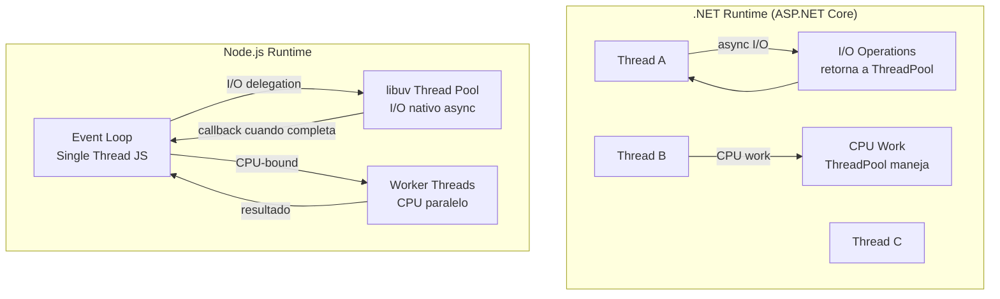

# 05-04 — TypeScript Suficiente: El Type System que un Staff .NET Necesita

> **Prerequisito:** [03-07-api-design.md](../modulo-03-software-design/03-07-api-design.md) — Los contratos de API que defines en el backend tienen consecuencias directas en cómo el frontend tipea los datos. Entender API design primero hace que el type system de TypeScript tenga contexto real.
>
> **Lo que este archivo NO es:** Un curso de TypeScript. No cubriremos configuración de Webpack, bundlers, testing de componentes, o Node.js deployment en profundidad. El objetivo es que puedas leer y entender proyectos TypeScript/Node.js con criterio, discutir arquitectura con equipos de frontend y backend JavaScript, y entender NestJS cuando lo veas en entrevistas de stack mixto.
>
> **Tu ventaja:** TypeScript es el lenguaje que más se parece a C# de todos los que existen fuera del ecosistema Microsoft. Anders Hejlsberg (el creador de C# y Delphi) también es el creador de TypeScript. El type system tiene ADN compartido. Las diferencias que importan son las diferencias — no las similitudes.
>
> **🎯 Recurso Codecademy:** El path **"Learn TypeScript"** de Codecademy — módulos de *Type Narrowing*, *Union Types*, *Generics*, y *Utility Types*. Ese path asume que ya sabes JavaScript básico — este archivo te da el modelo mental antes de entrar al path.

---

## Sección 1 — Por qué TypeScript Importa para un Staff .NET

### Las tres razones reales

**1. Fullstack decisions son inevitables a nivel Staff**

Un Staff Engineer que diseña una plataforma no puede decir "el frontend es problema del equipo de frontend". Decisions como:
- ¿Usamos SSR o SPA? (con consecuencias en el backend de API design)
- ¿Cómo manejamos auth tokens en el cliente? (con consecuencias de seguridad)
- ¿Qué tan gruesa hace la API? ¿BFF pattern tiene sentido aquí? (Backend for Frontend)

...requieren entender el stack de frontend suficientemente para razonar sobre los trade-offs. Y en 2026, el frontend de cualquier empresa seria es TypeScript.

**2. Node.js es backend real — no solo frontend tooling**

Muchas empresas tienen servicios en Node.js/TypeScript en producción. En entrevistas Staff de plataformas con stack mixto, te van a preguntar sobre arquitectura de servicios Node.js. "No sé Node.js" es una señal de especialización estrecha, no de breadth técnica.

**3. NestJS es el ASP.NET Core del mundo JavaScript**

Si sabes ASP.NET Core, entiendes NestJS en 30 minutos. Controladores, DI, módulos, interceptors, guards — el mapping es casi 1:1. Entenderlo te hace más efectivo en entrevistas donde el stack es parcialmente Node.js.

### Lo que explícitamente NO necesitas

- Configuración de Webpack, Vite, esbuild — tooling de build
- CSS-in-JS, styled-components, CSS modules — styling approaches
- Testing de componentes React con Jest/Testing Library — eso es trabajo del frontend developer
- Node.js deployment, PM2, clustering — operaciones de Node.js
- TypeScript compiler internals — decorators avanzados, transformer API

---

## Sección 2 — El Type System de TypeScript: Diferencias con C#

Anders Hejlsberg diseñó ambos. Pero el contexto importa: C# fue diseñado para un ecosistema tipado desde el inicio. TypeScript fue diseñado para agregar tipos a JavaScript — un lenguaje dinámico que ya existía con millones de líneas de código. Esa tensión fundamental explica las diferencias.

### Structural Typing vs Nominal Typing — la diferencia más profunda

```typescript
// C# usa Nominal Typing — una clase debe declarar EXPLÍCITAMENTE que implementa una interfaz
// C#:
// interface IOrder { string Id { get; } }
// class Order : IOrder { public string Id { get; set; } } // Debe declarar : IOrder
// class Invoice { public string Id { get; set; } }        // NO es IOrder aunque tenga Id

// TypeScript usa Structural Typing — si tiene la forma correcta, ES ese tipo
interface Order {
    id: string;
    total: number;
}

interface Invoice {
    id: string;
    total: number;
    taxRate: number; // Campo extra
}

function processOrder(order: Order): void {
    console.log(order.id, order.total);
}

const invoice: Invoice = { id: "INV-001", total: 1500, taxRate: 0.16 };
processOrder(invoice); // ✅ VÁLIDO — Invoice tiene todos los campos de Order
// En C# esto fallaría porque Invoice no declara que implementa IOrder

// Implicación arquitectónica: en TypeScript, dos tipos con la misma estructura
// son intercambiables aunque tengan nombres distintos y no haya relación explícita
```

**Por qué esto importa en práctica:** En C# puedes controlar exactamente qué puede usarse en lugar de qué. En TypeScript, cualquier objeto con la forma correcta satisface un tipo. Esto es más flexible pero requiere más cuidado en el diseño de contratos públicos.

### Tipos básicos — las diferencias que no son obvias

```typescript
// Tipos primitivos — similares a C# pero con el sistema JS debajo
let name: string = "Omar";      // lowercase string — no String
let age: number = 30;           // number cubre int, float, double — NO hay int separado
let active: boolean = true;
let id: bigint = 9007199254740991n; // Para integers más grandes que Number.MAX_SAFE_INTEGER

// undefined vs null — ambos existen, tienen semántica diferente
let optional: string | undefined = undefined;  // La variable puede no estar asignada
let nullable: string | null = null;            // Asignada explícitamente como nada

// any — el escape hatch del type system (señal de deuda técnica)
let data: any = "could be anything"; // Equivalente a dynamic en C# — evitar
// any desactiva el type checking completo — compila con cualquier cosa

// unknown — como any pero seguro (requiere type guard antes de usar)
let userInput: unknown = getUserInput();
if (typeof userInput === "string") {
    userInput.toUpperCase(); // ✅ Válido — TypeScript sabe que es string aquí
}
// sin el type guard: userInput.toUpperCase() // ❌ Error — unknown no tiene métodos

// never — tipo que nunca puede ocurrir (útil para exhaustive checks)
type Status = 'active' | 'inactive' | 'pending';
function handleStatus(status: Status): string {
    switch (status) {
        case 'active': return "Active";
        case 'inactive': return "Inactive";
        case 'pending': return "Pending";
        default:
            const _exhaustive: never = status; // TypeScript error si falta un caso
            return _exhaustive;
    }
}
```

### Interfaces y Types — más flexible que C#

```typescript
// Interface — puede extenderse y declararse múltiples veces (declaration merging)
interface Order {
    id: string;
    customerId: string;
    total: number;
    status: OrderStatus;
    createdAt: Date;
    notes?: string;           // Opcional — como string? en C# nullable reference types
    readonly version: number; // readonly — como getter sin setter en C#
}

// Type alias — para tipos complejos, uniones, e intersecciones
type OrderStatus = 'pending' | 'confirmed' | 'shipped' | 'cancelled'; // Union literal type
type OrderId = string; // Alias semántico — mejora legibilidad del código

// Diferencia entre interface y type:
// - Interface: se puede extender con extends, declaration merging
// - Type: más flexible para uniones, intersecciones, mapped types
// Regla práctica: usa interface para formas de objetos, type para todo lo demás

// Intersección de tipos — como herencia múltiple de interfaces en C#
type AuditedOrder = Order & {
    createdBy: string;
    updatedAt: Date;
    version: number;
};
// Equivalente C#: class AuditedOrder : Order, IAuditInfo { ... }
```

### Utility Types — no tienen equivalente en C#, son esenciales en TypeScript

Estos tipos built-in son fundamentales. Los verás en cualquier codebase TypeScript serio:

```typescript
interface Order {
    id: string;
    customerId: string;
    total: number;
    status: string;
    createdAt: Date;
}

// ─────────────────────────────────────────────
// Partial<T> — todos los campos opcionales
// Uso típico: DTOs de update parcial (PATCH endpoints)
type UpdateOrderDto = Partial<Order>;
// Resultado: { id?: string; customerId?: string; total?: number; ... }
// Equivalente C# approximado: record class con todos los campos nullable

// ─────────────────────────────────────────────
// Required<T> — todos los campos requeridos (inverso de Partial)
type StrictOrder = Required<Order>; // Elimina todos los ? de los campos

// ─────────────────────────────────────────────
// Pick<T, K> — seleccionar solo campos específicos
type OrderSummary = Pick<Order, 'id' | 'status' | 'total'>;
// Resultado: { id: string; status: string; total: number }
// Equivalente C#: select new { o.Id, o.Status, o.Total } en LINQ

// ─────────────────────────────────────────────
// Omit<T, K> — excluir campos (complementario de Pick)
type CreateOrderDto = Omit<Order, 'id' | 'createdAt'>;
// Sin id ni createdAt — el servidor los genera
// Muy común para DTOs de creación

// ─────────────────────────────────────────────
// Readonly<T> — todos los campos son readonly
type ImmutableOrder = Readonly<Order>;
// Equivalente C#: record con init-only setters

// ─────────────────────────────────────────────
// Record<K, V> — diccionario tipado
type OrdersByStatus = Record<OrderStatus, Order[]>;
// Equivalente C#: Dictionary<OrderStatus, List<Order>>
// Garantiza que todas las keys del enum están presentes

// Uso real de Record — mapas de configuración
type FeatureFlags = Record<string, boolean>;
const flags: FeatureFlags = { "new-checkout": true, "beta-api": false };

// ─────────────────────────────────────────────
// ReturnType<T> — extrae el tipo de retorno de una función
async function fetchOrder(id: string): Promise<Order> { ... }
type FetchOrderReturn = Awaited<ReturnType<typeof fetchOrder>>; // Order
// Útil cuando no controlas el tipo de retorno — lo extraes del source
```

### Discriminated Unions — la feature más poderosa que C# no tiene (todavía)

```typescript
// Discriminated Union — modelado de estados con seguridad de tipos
// Cada variante tiene un campo discriminador (status, type, kind)
type PaymentResult =
    | { status: 'success'; transactionId: string; amount: number; fee: number }
    | { status: 'failed'; errorCode: string; message: string; retryable: boolean }
    | { status: 'pending'; estimatedTime: number; checkUrl: string };

function handlePayment(result: PaymentResult): string {
    switch (result.status) {
        case 'success':
            // TypeScript SABE que aquí result tiene transactionId, amount, fee
            // No necesitas cast — es type-safe automáticamente
            return `Paid ${result.amount} (fee: ${result.fee}). TxID: ${result.transactionId}`;

        case 'failed':
            // TypeScript SABE que aquí result tiene errorCode, message, retryable
            const retry = result.retryable ? "Will retry" : "No retry";
            return `Error ${result.errorCode}: ${result.message}. ${retry}`;

        case 'pending':
            return `Pending. Check in ${result.estimatedTime}min at ${result.checkUrl}`;

        // Si olvidas un caso, TypeScript lo detecta en compilación (con noImplicitReturns)
        // Esto es exhaustiveness checking — C# lo tiene solo con pattern matching en algunos casos
    }
}

// Caso de uso real — modelar resultados de operaciones sin excepciones
type Result<T, E = Error> =
    | { success: true; data: T }
    | { success: false; error: E };

async function getOrder(id: string): Promise<Result<Order>> {
    try {
        const order = await repository.findById(id);
        if (!order) return { success: false, error: new Error("Not found") };
        return { success: true, data: order };
    } catch (e) {
        return { success: false, error: e as Error };
    }
}

// Consumo — sin try/catch en el caller
const result = await getOrder("123");
if (result.success) {
    console.log(result.data.total); // TypeScript sabe que data existe aquí
} else {
    console.log(result.error.message); // TypeScript sabe que error existe aquí
}
```

### Generics — familiar para un developer de C#

```typescript
// Generic function — casi idéntica a C#
function getFirst<T>(array: T[]): T | undefined {
    return array[0];
}
// C#: T? GetFirst<T>(IEnumerable<T> array) => array.FirstOrDefault();

// Generic interface — equivalente a interfaz genérica en C#
interface Repository<T, TId = string> {
    findById(id: TId): Promise<T | null>;
    findAll(filter?: Partial<T>): Promise<T[]>;
    save(entity: T): Promise<T>;
    delete(id: TId): Promise<void>;
}

// Constraints — como where T : class, IComparable en C#
function merge<T extends object, U extends object>(first: T, second: U): T & U {
    return { ...first, ...second }; // Spread operator — Object.assign moderno
}
// C#: T Merge<T, U>(T first, U second) where T : class where U : class

// Conditional types — no tienen equivalente directo en C#
type NonNullable<T> = T extends null | undefined ? never : T;
// Si T puede ser null/undefined, el tipo resultante es never (eliminado)
// Si T es string | null, NonNullable<string | null> = string

type IsArray<T> = T extends any[] ? true : false;
// IsArray<string[]> = true, IsArray<string> = false
```

---

## Sección 3 — Node.js: El Modelo de Ejecución para Developers .NET

Este es el modelo mental que necesitas para razonar sobre arquitectura de servicios Node.js.



**Las implicaciones para el diseño de APIs en Node.js:**

```typescript
import express from 'express';
const app = express();

// ✅ Correcto — I/O async no bloquea el event loop
app.get('/orders/:id', async (req, res) => {
    // Durante el await, el event loop procesa otros requests
    const order = await orderRepository.findById(req.params.id);
    res.json(order);
});

// ❌ Incorrecto — CPU-bound bloquea el event loop completo
// Mientras esta función corre, NINGÚN otro request puede ser procesado
app.get('/reports/heavy', (req, res) => {
    const report = generateHeavyReport(allData); // Bloquea todo
    res.json(report);
});

// ✅ Correcto — CPU-bound en Worker Thread
import { Worker, isMainThread, parentPort, workerData } from 'worker_threads';

app.get('/reports/heavy', async (req, res) => {
    const report = await runInWorker('./report-worker.js', allData);
    res.json(report);
});

function runInWorker(workerFile: string, data: any): Promise<any> {
    return new Promise((resolve, reject) => {
        const worker = new Worker(workerFile, { workerData: data });
        worker.on('message', resolve);
        worker.on('error', reject);
    });
}
```

**⚠️ Gotcha crítico de producción en Node.js:** Un `JSON.parse()` de un payload muy grande, o un loop de 50,000 iteraciones sin await, bloquea el event loop completo. En .NET esto solo bloquearía el thread actual — el ThreadPool tiene otros disponibles. En Node.js bloquea TODOS los requests entrantes. Este es el error de performance más frecuente en APIs Node.js de developers que vienen de .NET.

---

## Sección 4 — NestJS: ASP.NET Core en el Ecosistema JavaScript

NestJS es el framework de Node.js más cercano a ASP.NET Core que existe. Fue diseñado explícitamente para traer la experiencia de frameworks opinados (Spring Boot, ASP.NET Core) al ecosistema Node.js. El mapping es casi 1:1:

| ASP.NET Core | NestJS | Concepto |
|---|---|---|
| `[ApiController]` + `[Route]` | `@Controller('path')` | Definir un controlador |
| `[HttpGet("{id}")]` | `@Get(':id')` | Método HTTP + ruta |
| `[FromBody]` | `@Body()` | Parameter binding del body |
| `[FromRoute]` | `@Param()` | Parameter binding de ruta |
| `[Authorize]` | `@UseGuards(AuthGuard)` | Autorización |
| `IServiceCollection` | `@Module providers` | Registro de dependencias |
| `services.AddScoped<T>()` | `@Injectable()` + providers | Ciclo de vida |
| Middleware | Interceptors / Guards | Cross-cutting concerns |

```typescript
// ============== CONTROLLER — idéntico a ASP.NET Core Controller ==============
import {
    Controller, Get, Post, Body, Param, UseGuards,
    HttpCode, HttpStatus, NotFoundException, ParseUUIDPipe
} from '@nestjs/common';

@Controller('orders')                       // Equivalente a [Route("api/[controller]")]
@UseGuards(JwtAuthGuard)                    // Equivalente a [Authorize]
export class OrdersController {
    constructor(
        private readonly ordersService: OrdersService  // DI — constructor injection
    ) {}

    @Get(':id')                             // Equivalente a [HttpGet("{id}")]
    @HttpCode(HttpStatus.OK)
    async getOrder(
        @Param('id', ParseUUIDPipe) id: string  // [FromRoute] + validation pipe
    ): Promise<OrderDto> {
        const order = await this.ordersService.findById(id);
        if (!order) throw new NotFoundException(`Order ${id} not found`);
        return OrderDto.fromEntity(order);
    }

    @Post()                                 // Equivalente a [HttpPost]
    @HttpCode(HttpStatus.CREATED)
    async createOrder(
        @Body() createOrderDto: CreateOrderDto  // [FromBody] — inferido por decorador
    ): Promise<OrderDto> {
        return this.ordersService.create(createOrderDto);
    }
}

// ============== SERVICE — equivalente a Application Service ==============
import { Injectable } from '@nestjs/common';

@Injectable()   // Marca como injectable — equivalente a registrar en IServiceCollection
export class OrdersService {
    constructor(
        @InjectRepository(OrderEntity)
        private orderRepository: Repository<OrderEntity>  // TypeORM repository — EF Core equivalent
    ) {}

    async findById(id: string): Promise<Order | null> {
        const entity = await this.orderRepository.findOne({ where: { id } });
        return entity ? Order.fromEntity(entity) : null;
    }

    async create(dto: CreateOrderDto): Promise<OrderDto> {
        const entity = this.orderRepository.create(dto);
        const saved = await this.orderRepository.save(entity);
        return OrderDto.fromEntity(saved);
    }
}

// ============== MODULE — sin equivalente directo en C# ==============
// En ASP.NET Core el wiring está todo en Program.cs
// En NestJS, cada "feature area" tiene su Module que agrupa todo
import { Module } from '@nestjs/common';
import { TypeOrmModule } from '@nestjs/typeorm';

@Module({
    imports: [
        TypeOrmModule.forFeature([OrderEntity])  // Registrar entities — como dbContext.Set<T>
    ],
    controllers: [OrdersController],             // Equivalente a MapControllers para este grupo
    providers: [OrdersService],                  // Equivalente a services.AddScoped<>
    exports: [OrdersService]                     // Disponible para otros módulos que importen este
})
export class OrdersModule {}

// ============== GUARDS — equivalente a authorization middleware ==============
import { Injectable, CanActivate, ExecutionContext } from '@nestjs/common';
import { JwtService } from '@nestjs/jwt';

@Injectable()
export class JwtAuthGuard implements CanActivate {
    constructor(private jwtService: JwtService) {}

    canActivate(context: ExecutionContext): boolean {
        const request = context.switchToHttp().getRequest();
        const token = request.headers.authorization?.split(' ')[1];

        if (!token) return false;
        try {
            request.user = this.jwtService.verify(token);
            return true;
        } catch {
            return false;
        }
    }
}

// ============== PIPES — equivalente a model validation ==============
// NestJS valida automáticamente DTOs usando class-validator
import { IsString, IsNumber, IsUUID, Min, IsOptional } from 'class-validator';

export class CreateOrderDto {
    @IsUUID()
    customerId: string;

    @IsNumber()
    @Min(0)
    total: number;

    @IsOptional()
    @IsString()
    notes?: string;
}
// En Program.cs: app.UseValidation() o equivalente
// En NestJS: app.useGlobalPipes(new ValidationPipe()) en main.ts
```

---

## Sección 5 — Async/Await en TypeScript vs C#

La sintaxis es casi idéntica. El comportamiento tiene diferencias importantes:

```typescript
// ============== Promise === Task en C# ==============
// Promise<T> es exactamente Task<T> en términos de concepto

// Async function — siempre retorna Promise<T>
async function fetchOrder(id: string): Promise<Order> {
    const response = await fetch(`/api/orders/${id}`); // await = como await en C#
    if (!response.ok) throw new Error(`HTTP ${response.status}`);
    return response.json() as Promise<Order>;
}

// Promise.all — equivalente a Task.WhenAll
async function fetchMultipleOrders(ids: string[]): Promise<Order[]> {
    const promises = ids.map(id => fetchOrder(id));
    return Promise.all(promises); // Espera TODOS — falla si UNO falla
}

// Promise.allSettled — como Task.WhenAll pero sin fallo si alguno falla
async function fetchOrdersSafely(ids: string[]): Promise<Order[]> {
    const results = await Promise.allSettled(ids.map(id => fetchOrder(id)));
    return results
        .filter(r => r.status === 'fulfilled')
        .map(r => (r as PromiseFulfilledResult<Order>).value);
}

// Promise.race — como Task.WhenAny — retorna el primero que resuelve
async function fetchWithTimeout(id: string, timeoutMs: number): Promise<Order> {
    const timeout = new Promise<never>((_, reject) =>
        setTimeout(() => reject(new Error('Timeout')), timeoutMs)
    );
    return Promise.race([fetchOrder(id), timeout]);
}
```

**Diferencia crítica con C#:** En C#, `ConfigureAwait(false)` importa en librerías porque el awaiter puede capturar el SynchronizationContext. En Node.js/TypeScript no existe el concepto de SynchronizationContext — el contexto de ejecución es el event loop y no hay equivalente al contexto de UI thread o ASP.NET Core request context en ese sentido. No necesitas preocuparte por `ConfigureAwait` en TypeScript.

---

## Tabla Comparativa — TypeScript vs C#

Esta tabla es la respuesta rápida cuando alguien te pregunta sobre las diferencias en una entrevista:

| Concepto | C# | TypeScript | Diferencia clave |
|---|---|---|---|
| Tipo del sistema | Nominal — debes declarar implementación | Structural — si tiene la forma, es el tipo | C# más estricto en contratos |
| `null` handling | `string?` nullable reference types | `string \| null` o `string \| undefined` | Ambos soportan, TS más explícito |
| `any` equivalente | `dynamic` | `any` | Ambos deshabilitan type checking |
| Genéricos | `List<T>`, `where T : class` | `Array<T>`, `T extends object` | Sintaxis diferente, concepto igual |
| Async/await | Task<T>, async Task | Promise<T>, async function | Misma semántica, API diferente |
| Interfaces | Nominal, requiere : InterfaceName | Structural, duck typing | C# más explícito |
| Enums | Type-safe, backing type | Strings o números, less safe | C# más robusto |
| DI nativa | IServiceCollection built-in | No nativa — via NestJS, InversifyJS | .NET ventaja en DI |
| Null checking | ?., ??, ??= operators | ?., ??, ??= operators | Prácticamente idénticos |
| Destructuring | `var (x, y) = tuple` | `const { x, y } = obj` | TypeScript más flexible |
| Union types | No existe | `string \| number \| boolean` | TypeScript ventaja única |
| Discriminated unions | Pattern matching parcial | Full discriminated union support | TypeScript ventaja clara |
| Compiled to | IL / Native | JavaScript | TypeScript no corre directo |

---

## Recursos

**Codecademy — TypeScript path:**
- ✅ **Usar:** *Learn TypeScript* completo — todos los módulos
- ✅ **Usar:** *Intermediate TypeScript* — Utility Types, Generics, Declaration Files
- ⏭️ **Skip:** Proyectos de React en TypeScript — eso va en 05-05

**Pluralsight:**
- ✅ **"TypeScript 5 Fundamentals"** — para ir más rápido y con más profundidad que Codecademy
- ✅ **"NestJS: Building Enterprise Grade REST APIs"** — si quieres ver NestJS en acción

**TypeScript Docs:**
- 📖 [TypeScript Handbook](https://www.typescriptlang.org/docs/handbook/) — la mejor documentación de cualquier lenguaje. Léela directamente.
- 📖 [TypeScript Utility Types](https://www.typescriptlang.org/docs/handbook/utility-types.html) — referencia para Partial, Pick, Omit, etc.

---

## Checklist de Salida — 05-04

Antes de considerar este archivo completo, debes poder hacer esto sin asistencia:

- [ ] Explicar la diferencia entre structural typing (TypeScript) y nominal typing (C#) con un ejemplo concreto
- [ ] Usar Partial, Pick, Omit, Record y Readonly correctamente en contextos reales
- [ ] Escribir un Discriminated Union y explicar por qué es más seguro que un enum con campos opcionales
- [ ] Explicar por qué CPU-bound work en Node.js bloquea todos los requests y qué se usa en su lugar
- [ ] Leer un controlador de NestJS y mapear cada decorador al equivalente de ASP.NET Core
- [ ] Explicar la diferencia entre `any` y `unknown` y cuándo usar cada uno
- [ ] Escribir una generic function con constraints en TypeScript y explicar el equivalente en C#

---

→ Siguiente: [05-05-react-frontend-arquitectura.md](./05-05-react-frontend-arquitectura.md)
