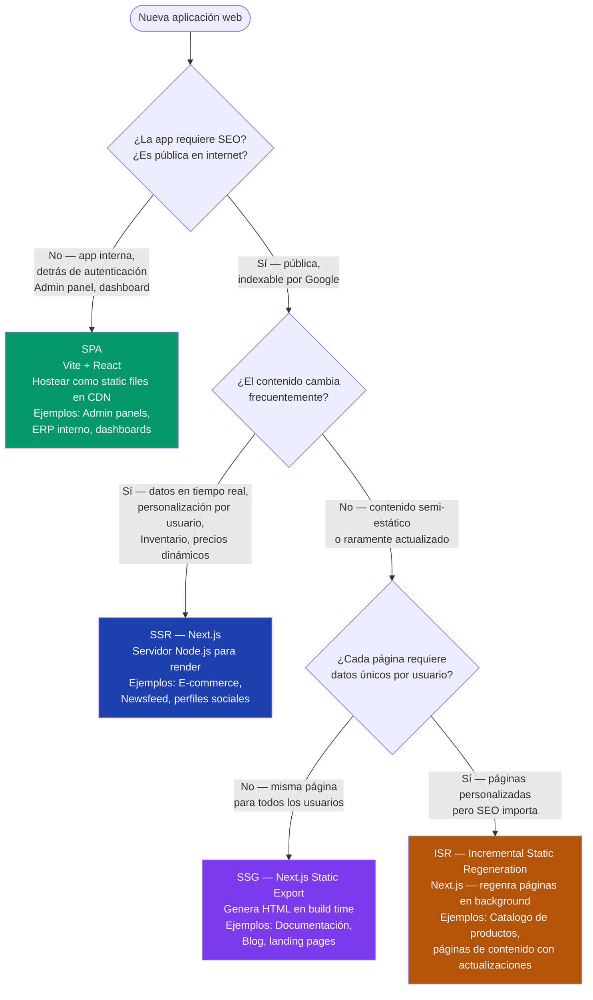
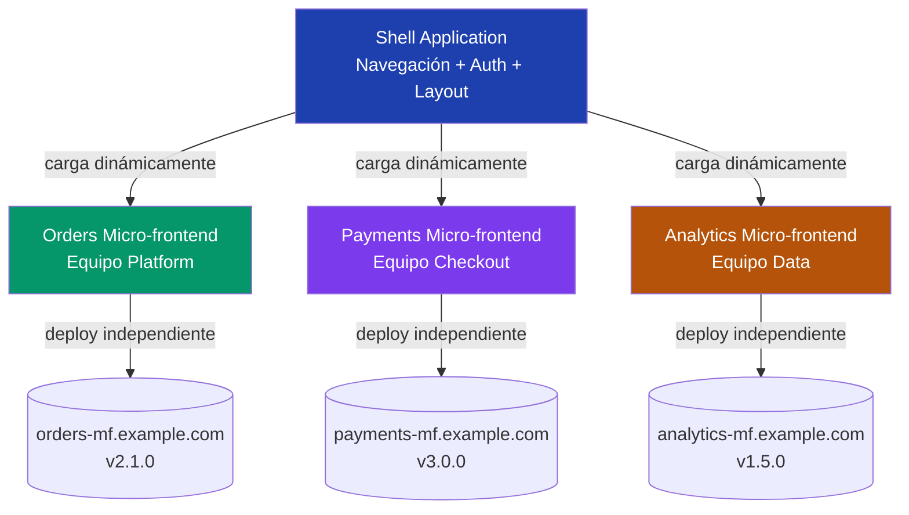

# 05-05 — React para Arquitectos: Decisiones que Importan sin Ser Frontend Developer

> **Prerequisito:** [05-04-typescript-suficiente.md](./05-04-typescript-suficiente.md) — React moderno es TypeScript. Los generic types, union types y utility types del archivo anterior son el lenguaje en el que está escrito React. Leer código React sin TypeScript sólido es leer con ruido constante.
>
> **Lo que este archivo NO es:** Un tutorial de React. No aprenderás a hacer animaciones, a configurar React Router en detalle, ni a hacer CSS-in-JS. El objetivo es que puedas leer código React con criterio, tomar decisiones arquitectónicas que involucran el frontend, y discutir state management, SSR/CSR, y micro-frontends desde la perspectiva de un arquitecto, no de un frontend developer.
>
> **La pregunta que guía este archivo:** En cada sección, la pregunta no es "¿cómo implemento esto?" sino "¿cuándo elijo esto y qué consecuencias tiene?"
>
> **🎯 Recurso Pluralsight:** El path **"React 18 Fundamentals"** — específicamente los módulos de *Component Architecture*, *State Management*, y *Performance Optimization*. Úsalos después de este archivo para ver los conceptos en código real.

---

## Sección 1 — React para Arquitectos de Backend: La Perspectiva Correcta

Un Staff Engineer no puede ignorar el frontend cuando:

**Diseña APIs que el frontend consume.** Cada decisión de granularidad de API tiene consecuencias en el frontend. Una API que retorna demasiado data causa problemas de payload. Una que retorna muy poco causa el problema de N+1 en el cliente (múltiples requests en cascada). Si no entiendes cómo React fetches data, no puedes diseñar APIs con criterio real.

**Decide la arquitectura de autenticación.** ¿Dónde vive el token JWT? ¿En memoria, en localStorage, en cookie HttpOnly? Cada opción tiene trade-offs de seguridad que afectan tanto al frontend como al backend. Un Staff que no entiende el ciclo de vida de la sesión en una SPA no puede tomar esa decisión correctamente.

**Evalúa si SSR, SSG, o SPA es la elección correcta.** Esto determina la infraestructura completa: ¿necesitas un servidor Node.js para el frontend? ¿CDN puro? ¿Cómo afecta esto el costo, la latencia, el SEO? Esta es decisión arquitectónica, no de frontend developer.

**Diseña sistemas con micro-frontends.** Saber cuándo esta complejidad adicional vale la pena requiere entender la arquitectura de React suficientemente para evaluar los trade-offs reales.

### Lo que explícitamente NO necesitas

- Implementar animaciones, transiciones, o efectos visuales
- Configurar React Router, rutas anidadas, rutas protegidas
- CSS modules, styled-components, Tailwind — approaches de styling
- Testing de componentes con React Testing Library o Cypress
- Optimización de bundle size con code splitting manual
- Server Components de React 19 en detalle de implementación

---

## Sección 2 — El Component Model: La Idea Central de React

React tiene una idea central: **la UI es una función del estado**. Si el estado es X, la UI se ve Y. Cuando el estado cambia a X', la UI se actualiza a Y'. Sin manipulación manual del DOM — React calcula los cambios y los aplica.

```typescript
// Un componente React es una función que retorna JSX
// JSX no es HTML — es sintaxis que se compila a React.createElement()

// Esto:
const element = <div className="card">Hello {name}</div>;

// Compila a:
const element = React.createElement('div', { className: 'card' }, `Hello ${name}`);

// El compilador (Babel/TSC) hace esta transformación en build time
// En runtime, el browser solo ve JavaScript — no hay JSX
```

### Anatomía de un componente funcional

```typescript
// Props — el contrato del componente (equivalente a parámetros de un método)
interface OrderCardProps {
    order: Order;
    onConfirm: (orderId: string) => Promise<void>; // Callback — delegate en C#
    onCancel?: (orderId: string) => void;           // Optional callback
    isLoading?: boolean;
}

// Functional component — la forma moderna (desde React Hooks, 2018)
// Los class components existen pero son legado — no los verás en código nuevo
const OrderCard: React.FC<OrderCardProps> = ({
    order,           // Destructuring de props — convención estándar
    onConfirm,
    onCancel,
    isLoading = false // Default value para prop opcional
}) => {
    // Hooks aquí — useState, useEffect, etc.
    const [confirming, setConfirming] = React.useState(false);

    const handleConfirm = async () => {
        setConfirming(true);
        try {
            await onConfirm(order.id);
        } finally {
            setConfirming(false);
        }
    };

    // JSX — retorna la representación visual del componente
    return (
        <div className="order-card">
            <h3>Order #{order.id}</h3>
            <p>Total: ${order.total.toFixed(2)}</p>
            <p>Status: <span className={`status-${order.status}`}>{order.status}</span></p>

            {/* Conditional rendering — && es "si true, render esto" */}
            {order.status === 'pending' && (
                <div className="actions">
                    <button
                        onClick={handleConfirm}
                        disabled={confirming || isLoading}
                    >
                        {confirming ? 'Confirming...' : 'Confirm Order'}
                    </button>

                    {/* Optional callback — solo renderiza el botón si existe */}
                    {onCancel && (
                        <button onClick={() => onCancel(order.id)}>
                            Cancel
                        </button>
                    )}
                </div>
            )}
        </div>
    );
};
```

### El Virtual DOM: Por qué React es eficiente

React mantiene dos representaciones del DOM en memoria: el Virtual DOM anterior y el nuevo. Cuando el estado cambia:

1. React ejecuta la función del componente → nuevo Virtual DOM
2. Diffing algorithm (Reconciliation) — compara nuevo vs anterior
3. Calcula el conjunto mínimo de cambios al DOM real
4. Aplica solo esos cambios

**Implicación arquitectónica:** La manipulación directa del DOM real es cara (causa reflow y repaint del browser). React la minimiza. Pero si abusas de actualizaciones de estado frecuentes e innecesarias, el reconciliation overhead se acumula. Por eso existen React.memo, useMemo, y useCallback.

### Composición de componentes

```typescript
// React favorece composición sobre herencia — diferente a C# con herencia de clases
// Un componente padre compone componentes hijos

const OrderList: React.FC<{ customerId: string }> = ({ customerId }) => {
    const { orders, loading, error } = useOrders(customerId); // Custom hook

    if (loading) return <LoadingSpinner />;
    if (error) return <ErrorMessage error={error} />;
    if (orders.length === 0) return <EmptyState message="No orders found" />;

    return (
        <div className="order-list">
            {orders.map(order => (
                <OrderCard
                    key={order.id}              // key — React lo necesita para el diff de listas
                    order={order}
                    onConfirm={handleConfirm}  // Pasando callbacks como props (prop drilling básico)
                />
            ))}
        </div>
    );
};

// La prop 'key' es crítica en listas — React la usa para identificar elementos durante reconciliation
// ❌ No uses el índice del array como key — causa bugs cuando el orden cambia
// ✅ Usa un ID único estable del dominio
```

---

## Sección 3 — State Management: El Problema Central de React

El state management es la pregunta de arquitectura más frecuente en React. En entrevistas Staff sobre React, el 80% de las preguntas de arquitectura giran alrededor de esto.

### useState — estado local de un componente

```typescript
const OrderForm: React.FC = () => {
    // useState retorna [valor_actual, función_para_actualizar]
    // Cada llamada a la función actualizadora desencadena un re-render del componente
    const [quantity, setQuantity] = React.useState<number>(1);
    const [submitting, setSubmitting] = React.useState(false);
    const [error, setError] = React.useState<string | null>(null);

    // Los updates de estado son ASÍNCRONOS — React puede batchearlos
    // No puedes asumir que el estado cambió inmediatamente después de setQuantity()
    const handleQuantityChange = (e: React.ChangeEvent<HTMLInputElement>) => {
        const value = parseInt(e.target.value);
        if (!isNaN(value) && value > 0) {
            setQuantity(value);
            setError(null); // Batch con el update anterior — un solo re-render
        }
    };

    return (
        <form onSubmit={handleSubmit}>
            <input
                type="number"
                value={quantity}
                onChange={handleQuantityChange}
                min={1}
            />
            {error && <p className="error">{error}</p>}
            <button type="submit" disabled={submitting}>
                {submitting ? 'Submitting...' : 'Submit Order'}
            </button>
        </form>
    );
};
```

### El problema de Prop Drilling

Cuando múltiples componentes necesitan el mismo estado, el estado sube al componente padre común (state lifting). Cuando los componentes están muy anidados, el estado pasa por capas de componentes que no lo usan — esto es **prop drilling**:

```
App (tiene orders state)
  ↓ orders prop
  Dashboard
    ↓ orders prop (no usa orders directamente)
    Sidebar
      ↓ orders prop (no usa orders directamente)
      OrderCounter (aquí finalmente usa orders)
```

Sidebar y Dashboard solo existen como "tuberías" para pasar el estado. Esto es el problema que cada solución de state management resuelve de diferente manera.

### Cuatro Soluciones con Sus Trade-offs Reales

#### 1. Context API — para estado global simple

```typescript
// Context API — elimina prop drilling para estado que cambia poco frecuente
// Equivalente conceptual: un Singleton registrado en DI, disponible en todo el árbol

interface OrderContextType {
    orders: Order[];
    addOrder: (order: Order) => void;
    removeOrder: (id: string) => void;
}

const OrderContext = React.createContext<OrderContextType | null>(null);

// Provider — envuelve el árbol de componentes que necesitan acceso
const OrderProvider: React.FC<{ children: React.ReactNode }> = ({ children }) => {
    const [orders, setOrders] = React.useState<Order[]>([]);

    const addOrder = (order: Order) => setOrders(prev => [...prev, order]);
    const removeOrder = (id: string) => setOrders(prev => prev.filter(o => o.id !== id));

    return (
        <OrderContext.Provider value={{ orders, addOrder, removeOrder }}>
            {children}
        </OrderContext.Provider>
    );
};

// Hook personalizado para consumir el contexto — mejor práctica
function useOrderContext() {
    const context = React.useContext(OrderContext);
    if (!context) throw new Error("useOrderContext must be inside OrderProvider");
    return context;
}

// Cualquier componente en el árbol puede acceder sin prop drilling
const OrderCounter: React.FC = () => {
    const { orders } = useOrderContext(); // Sin props — acceso directo
    return <span>{orders.length} orders</span>;
};
```

**⚠️ Problema de Context con updates frecuentes:** Cuando el valor del contexto cambia, TODOS los componentes que lo consumen re-renderizan, incluso si la parte del estado que les importa no cambió. Para estado que cambia muchas veces por segundo (formularios, animaciones, time series data) Context es una mala elección — causa renders en cascada.

#### 2. Zustand — state management moderno sin boilerplate

```typescript
import { create } from 'zustand';
import { devtools, persist } from 'zustand/middleware';

// Zustand: un store global como función — sin Actions, Reducers, ni Dispatch
// Es la alternativa moderna a Redux para la mayoría de casos
interface OrderStore {
    orders: Order[];
    loading: boolean;
    error: string | null;
    fetchOrders: (customerId: string) => Promise<void>;
    addOrder: (order: Order) => void;
    updateOrderStatus: (id: string, status: string) => void;
}

const useOrderStore = create<OrderStore>()(
    devtools( // Redux DevTools integration
        persist( // Persistencia en localStorage automática
            (set, get) => ({
                orders: [],
                loading: false,
                error: null,

                fetchOrders: async (customerId: string) => {
                    set({ loading: true, error: null });
                    try {
                        const orders = await api.getOrders(customerId);
                        set({ orders, loading: false });
                    } catch (e) {
                        set({ error: e.message, loading: false });
                    }
                },

                addOrder: (order: Order) =>
                    set(state => ({ orders: [...state.orders, order] })),

                updateOrderStatus: (id: string, status: string) =>
                    set(state => ({
                        orders: state.orders.map(o =>
                            o.id === id ? { ...o, status } : o
                        )
                    })),
            }),
            { name: 'order-store' } // Key para localStorage
        )
    )
);

// Uso — componentes se suscriben solo a la parte del store que necesitan
// Si orders cambia, OrderCounter re-renderiza — si solo loading cambia, NO
const OrderCounter: React.FC = () => {
    const ordersCount = useOrderStore(state => state.orders.length); // Selector
    return <span>{ordersCount} orders</span>;
};

const OrderList: React.FC<{ customerId: string }> = ({ customerId }) => {
    const { orders, loading, error, fetchOrders } = useOrderStore();

    React.useEffect(() => { fetchOrders(customerId); }, [customerId]);

    if (loading) return <LoadingSpinner />;
    if (error) return <ErrorMessage error={error} />;
    return <div>{orders.map(o => <OrderCard key={o.id} order={o} />)}</div>;
};
```

#### 3. Redux Toolkit — para apps enterprise con equipos grandes

Redux Toolkit (RTK) es Redux moderno — el Redux clásico tiene demasiado boilerplate. RTK lo reduce pero sigue siendo más verboso que Zustand:

```typescript
import { createSlice, createAsyncThunk } from '@reduxjs/toolkit';

// Thunk — acción asíncrona tipada
export const fetchOrders = createAsyncThunk(
    'orders/fetchAll',
    async (customerId: string) => {
        const orders = await api.getOrders(customerId);
        return orders;
    }
);

// Slice — combina actions + reducer en un lugar
const ordersSlice = createSlice({
    name: 'orders',
    initialState: { orders: [], loading: false, error: null } as OrderState,
    reducers: {
        addOrder: (state, action: PayloadAction<Order>) => {
            state.orders.push(action.payload); // Immer permite mutación aparente
        },
    },
    extraReducers: (builder) => {
        builder
            .addCase(fetchOrders.pending, (state) => { state.loading = true; })
            .addCase(fetchOrders.fulfilled, (state, action) => {
                state.loading = false;
                state.orders = action.payload;
            })
            .addCase(fetchOrders.rejected, (state, action) => {
                state.loading = false;
                state.error = action.error.message ?? 'Unknown error';
            });
    },
});
```

#### 4. React Query (TanStack Query) — para estado del servidor

React Query no es state management general — es state management específico para **estado del servidor** (datos fetched de APIs). Y es donde brilla:

```typescript
import { useQuery, useMutation, useQueryClient } from '@tanstack/react-query';

const OrderList: React.FC<{ customerId: string }> = ({ customerId }) => {
    // useQuery maneja: loading, error, caching, refetch, background sync
    const { data: orders, isLoading, error } = useQuery({
        queryKey: ['orders', customerId],  // Cache key — como una cache key en Redis
        queryFn: () => api.getOrders(customerId),
        staleTime: 5 * 60 * 1000,         // Cache válido por 5 minutos
        retry: 3,                          // Retry automático en error
    });

    const queryClient = useQueryClient();
    const { mutate: createOrder } = useMutation({
        mutationFn: api.createOrder,
        onSuccess: () => {
            // Invalidar cache — como invalidar una entry en IMemoryCache en C#
            queryClient.invalidateQueries({ queryKey: ['orders', customerId] });
        }
    });

    if (isLoading) return <LoadingSpinner />;
    if (error) return <ErrorMessage error={error} />;

    return (
        <div>
            {orders?.map(order => <OrderCard key={order.id} order={order} />)}
        </div>
    );
};
```

### Tabla de Decisión — State Management

| Solución | Cuándo es la elección correcta | Cuándo NO usar |
|---|---|---|
| **useState** | Estado local a un componente, sin sharing | Cuando múltiples componentes lo necesitan |
| **Context API** | Estado global de configuración o tema, pocas actualizaciones | Updates frecuentes — causa re-renders en cascade |
| **Zustand** | Estado global de app, solución moderna sin boilerplate | Cuando el equipo ya está en Redux y migrar no vale |
| **Redux Toolkit** | Apps enterprise grandes, equipo con experiencia Redux, DevTools crítico | Apps pequeñas/medianas — exceso de boilerplate para el beneficio |
| **React Query** | Estado del servidor — datos fetched de APIs | Estado UI local (formularios, modals, etc.) |
| **Combinación Zustand + React Query** | La combinación más eficiente en 2026 — RQ para server state, Zustand para UI state | Cuando solo necesitas uno de los dos |

**La respuesta de Staff en una entrevista sobre state management:**
> "En 2026, la distinción entre server state y client state es fundamental. Para server state — datos de APIs — React Query es la solución correcta porque maneja caching, invalidación, background refresh, y loading/error states automáticamente. Para client state — estado UI que no viene de un servidor — Zustand es la solución más efectiva para equipos modernos. Redux tiene su lugar en aplicaciones enterprise grandes donde el time-travel debugging y la predictibilidad estricta del flujo de datos justifican el boilerplate adicional."

---

## Sección 4 — Performance Patterns que un Arquitecto Debe Conocer

Estos no son detalles de implementación — son conceptos arquitectónicos que afectan la experiencia del usuario a escala.

### Memoization: Evitar Re-renders Innecesarios

```typescript
// Sin memoization: OrderCard re-renderiza en cada render del padre
// aunque order y onConfirm no hayan cambiado
const OrderCard = ({ order, onConfirm }) => { ... };

// Con React.memo: solo re-renderiza si las props cambian (shallow comparison)
// Equivalente a: IEquatable<T> para que el componente decida si re-renderar
const OrderCard = React.memo<OrderCardProps>(({ order, onConfirm }) => {
    return (/* JSX */);
});

// Problema: si el padre crea una nueva función en cada render, la referencia cambia
// y React.memo no ayuda — el componente re-renderiza igual
const ParentComponent = () => {
    // ❌ Nueva función en cada render — React.memo no ayuda
    const handleConfirm = async (orderId: string) => {
        await api.confirmOrder(orderId);
    };

    // ✅ useCallback — memoiza la función, misma referencia si dependencies no cambian
    const handleConfirm = React.useCallback(
        async (orderId: string) => { await api.confirmOrder(orderId); },
        [] // Sin dependencies — la función nunca cambia
    );
};

// useMemo — memoizar valores calculados costosos
const OrderList: React.FC<{ orders: Order[] }> = ({ orders }) => {
    // Sin useMemo: se recalcula en CADA render aunque orders no cambie
    // Con useMemo: solo recalcula cuando orders cambia
    const expensiveFilteredOrders = React.useMemo(
        () => orders
            .filter(o => o.total > 1000)
            .sort((a, b) => b.total - a.total)
            .slice(0, 100),
        [orders]
    );

    return <div>{expensiveFilteredOrders.map(o => <OrderCard key={o.id} order={o} />)}</div>;
};
```

**⚠️ Anti-patrón frecuente:** Usar useMemo y useCallback en todo "por si acaso" es contraproducente. La memoization tiene overhead propio (comparación de dependencies en cada render). Solo úsala cuando tienes evidencia de que un cálculo o re-render es el bottleneck real. **Mide antes de optimizar.**

### Code Splitting y Lazy Loading

```typescript
// Sin code splitting: todo el código se incluye en el bundle inicial
// Con un bundle de 2MB, el usuario espera hasta que descarga todo antes de ver algo

// React.lazy — divide el bundle, carga el componente solo cuando se necesita
const OrderAnalytics = React.lazy(() => import('./components/OrderAnalytics'));
const AdminPanel = React.lazy(() => import('./components/AdminPanel'));

const App: React.FC = () => {
    const { user } = useAuth();

    return (
        // Suspense muestra fallback mientras el componente lazy se carga
        <React.Suspense fallback={<LoadingSpinner />}>
            <Routes>
                <Route path="/orders" element={<OrderList />} />
                {/* OrderAnalytics se descarga solo cuando el usuario navega a /analytics */}
                <Route path="/analytics" element={<OrderAnalytics />} />
                {/* AdminPanel se descarga solo si el usuario es admin */}
                {user?.isAdmin && (
                    <Route path="/admin" element={<AdminPanel />} />
                )}
            </Routes>
        </React.Suspense>
    );
};
```

**Implicación arquitectónica:** El code splitting reduce el bundle inicial y mejora el Time to Interactive (TTI) — la métrica que más importa para el usuario. En apps enterprise, la diferencia puede ser de segundos en la primera carga.

---

## Sección 5 — SSR vs SPA vs SSG: La Decisión Arquitectónica

Esta es la pregunta que un Staff debe poder responder con criterio técnico real — no con preferencia de framework.



### SPA — Single Page Application

```typescript
// Toda la lógica en el browser. El servidor sirve solo index.html + JS bundle.
// El backend es una API JSON pura.

// main.tsx — entry point de una SPA
import React from 'react';
import ReactDOM from 'react-dom/client';
import App from './App';

ReactDOM.createRoot(document.getElementById('root')!).render(<App />);
```

**Cuándo es la elección correcta:**
- Aplicaciones internas detrás de autenticación — admin panels, ERPs, dashboards
- Cuando el SEO no importa (los crawlers de Google no ejecutan JavaScript bien)
- Cuando quieres el menor costo de infraestructura — archivos estáticos en un CDN o Azure Static Web Apps, sin servidor
- Interacciones complejas tipo aplicación desktop — drag-and-drop, real-time updates, estados complejos

**Cuándo NO usar:**
- E-commerce — Google necesita indexar páginas de productos para search
- Blogs, landing pages, contenido que debe aparecer en búsquedas orgánicas
- Cuando el Time to First Meaningful Paint es crítico — SPAs tienen cold start visible mientras carga el JS

### SSR — Server-Side Rendering con Next.js

```typescript
// Next.js page con SSR — el servidor renderiza el HTML antes de enviarlo al browser
// Cada request renderiza en el servidor — como un MVC tradicional pero React

// app/orders/[id]/page.tsx — Next.js 14+ App Router
interface OrderPageProps {
    params: { id: string };
}

// Esta función corre en el SERVIDOR — no en el browser
// Equivalente a un método de Controller en ASP.NET Core que retorna una View
async function OrderPage({ params }: OrderPageProps) {
    // Fetch directo a la BD o a la API — en el servidor, sin roundtrip al browser
    const order = await fetch(`http://internal-api/orders/${params.id}`, {
        headers: { Authorization: `Bearer ${getServerToken()}` }
    }).then(r => r.json());

    if (!order) return <NotFound />;

    return (
        <div>
            <h1>Order #{order.id}</h1>
            {/* El HTML llega completo al browser — Google puede indexarlo */}
            <OrderDetails order={order} />
        </div>
    );
}

export default OrderPage;
```

**Trade-offs de SSR:**
- ✅ SEO excelente — HTML completo al primer request
- ✅ First Contentful Paint más rápido — el usuario ve contenido antes de que JS cargue
- ✅ Datos siempre frescos — cada request va al servidor
- ❌ Más costo — necesitas un servidor Node.js siempre corriendo (no solo CDN)
- ❌ Mayor latencia por request — servidor → BD/API → render → respuesta
- ❌ Escalabilidad más compleja — el servidor de Node.js se convierte en un bottleneck

**En Azure:** Azure App Service o Azure Container Apps para el servidor Next.js. No puedes hospedar SSR en Azure Static Web Apps.

### SSG — Static Site Generation

```typescript
// Next.js genera HTML en BUILD TIME — no en request time
// Los archivos HTML resultantes se sirven desde CDN

// app/blog/[slug]/page.tsx
// generateStaticParams le dice a Next.js qué páginas generar en build
export async function generateStaticParams() {
    const posts = await db.getAllBlogPosts();
    return posts.map(post => ({ slug: post.slug }));
}

// Esta función corre UNA VEZ en build — no en cada request
async function BlogPost({ params }: { params: { slug: string } }) {
    const post = await db.getPost(params.slug);
    return <Article post={post} />;
}
```

**Trade-offs de SSG:**
- ✅ Rendimiento máximo — HTML pre-generado en CDN, latencia mínima
- ✅ Sin servidor de runtime — solo archivos estáticos, máxima disponibilidad
- ✅ Costo más bajo — CDN es más barato que compute
- ❌ Build time se escala con el número de páginas — 10,000 productos = build lento
- ❌ Datos estáticos hasta el próximo build — no es opción para datos en tiempo real

### ISR — Incremental Static Regeneration (el sweet spot)

ISR resuelve el problema principal de SSG: permite que páginas estáticas se regeneren en background sin un rebuild completo:

```typescript
// Next.js ISR — genera estático pero revalida en background
async function ProductPage({ params }: { params: { id: string } }) {
    const product = await fetch(`/api/products/${params.id}`, {
        next: { revalidate: 60 } // Revalida esta página cada 60 segundos en background
    }).then(r => r.json());

    return <ProductDetails product={product} />;
}
```

**ISR en la práctica:** La primera vez un usuario visita `/products/123`, Next.js sirve la versión estática cacheada. En background, si han pasado más de 60 segundos desde la última generación, regenera la página con datos frescos. El siguiente usuario ya verá la versión actualizada. Es el modelo "stale-while-revalidate" aplicado a páginas completas.

---

## Sección 6 — Micro-frontends: Cuándo es Arquitectura Real vs Overengineering

### Qué son realmente

La aplicación del principio de microservicios al frontend: cada equipo es dueño de un fragmento del frontend con deploy independiente. Los fragmentos se componen en una "shell" application en runtime.



**La implementación técnica — Module Federation (Webpack 5):**

Cada micro-frontend expone componentes que otros consumen en runtime. Sin rebuild — cada micro-frontend tiene su propio bundle y versión:

```typescript
// webpack.config.js del micro-frontend de Orders
module.exports = {
    plugins: [
        new ModuleFederationPlugin({
            name: 'orders',
            filename: 'remoteEntry.js',  // Entry point que la shell consume
            exposes: {
                './OrderList': './src/components/OrderList',  // Lo que expone
                './OrderForm': './src/components/OrderForm',
            },
        }),
    ],
};

// Shell app — consume el micro-frontend de Orders en runtime
const OrderList = React.lazy(() =>
    import('orders/OrderList')  // Importación dinámica — carga el bundle remoto
);
```

### Cuándo micro-frontends es la decisión correcta

- **Múltiples equipos con ciclos de release independientes** — si el equipo de Payments hace 10 deploys por día y el de Analytics hace 1 por semana, un monorepo con deploy conjunto los bloquea mutuamente
- **Diferentes tecnologías por área** — una parte legacy en Angular, la nueva en React — Module Federation permite coexistencia sin rewrite completo
- **Escalabilidad de equipo** — organización > 50 engineers trabajando en el mismo producto, donde el costo de coordinación supera el costo de la complejidad adicional

### Cuándo es overengineering (la mayoría de casos)

- **Equipos pequeños** (< 20 engineers en frontend total) — la coordinación entre micro-frontends agrega más fricción que la que resuelve
- **Un solo equipo frontend** — un equipo no se beneficia de la autonomía de deploy que micro-frontends proporciona
- **Sin problemas claros de release conflicts** — si el monolito de frontend no tiene problemas de coordinación entre equipos, micro-frontends no resuelve nada real
- **Sin experiencia en el equipo** — Module Federation tiene bugs sutiles en shared dependencies, versioning de contratos, y testing end-to-end que requieren experiencia para manejar

**⚠️ La trampa frecuente:** Equipos adoptan micro-frontends porque "parece la arquitectura moderna" sin tener los problemas que resuelve. El resultado es la complejidad de microservicios (contratos, versioning, integración) en el frontend, sin los beneficios reales (porque no hay suficiente autonomía de equipo para justificarlo).

**La respuesta de Staff en una entrevista:**
> "Micro-frontends resuelve un problema de organización, no un problema técnico. La pregunta no es '¿puedo implementar micro-frontends?' sino '¿tengo el tamaño de equipo y los conflictos de release que justifican su complejidad?' Para la mayoría de empresas, un monorepo bien organizado con Module Boundaries en Nx o Turborepo da el 80% de los beneficios con el 20% de la complejidad."

---

## Sección 7 — Custom Hooks: El Patrón de Reutilización en React

Los custom hooks son la forma de extraer lógica reutilizable de los componentes — equivalente a extraer un service o un helper en C#:

```typescript
// Custom hook — convención: nombre comienza con 'use'
// Extrae fetch logic + state management del componente
function useOrders(customerId: string) {
    const [orders, setOrders] = React.useState<Order[]>([]);
    const [loading, setLoading] = React.useState(true);
    const [error, setError] = React.useState<Error | null>(null);

    React.useEffect(() => {
        let cancelled = false; // Para evitar state updates si el componente unmonta

        const fetch = async () => {
            try {
                setLoading(true);
                const data = await api.getOrders(customerId);
                if (!cancelled) setOrders(data);
            } catch (e) {
                if (!cancelled) setError(e as Error);
            } finally {
                if (!cancelled) setLoading(false);
            }
        };

        fetch();
        return () => { cancelled = true; }; // Cleanup — equivalente a CancellationToken
    }, [customerId]); // Re-ejecuta si customerId cambia

    return { orders, loading, error };
}

// Uso en múltiples componentes sin duplicar lógica
const OrderList: React.FC<{ customerId: string }> = ({ customerId }) => {
    const { orders, loading, error } = useOrders(customerId); // Reutilizable
    ...
};
```

**useEffect — el hook más mal entendido:**

```typescript
React.useEffect(() => {
    // Código que corre DESPUÉS del render — como eventos de lifecycle en C# (OnAfterRenderAsync en Blazor)

    const subscription = eventBus.subscribe('orders-updated', handleUpdate);

    // Función de cleanup — corre cuando el componente desmonta o antes del próximo effect
    // Equivalente a IDisposable.Dispose() en C#
    return () => subscription.unsubscribe();

}, [handleUpdate]); // Dependencies — el effect re-corre si handleUpdate cambia

// Dependencies array:
// [] — corre solo una vez al montar (como constructor en Blazor)
// [dep1, dep2] — corre cuando dep1 o dep2 cambian
// Sin array — corre en CADA render (casi nunca lo que quieres)
```

---

## Recursos

**Pluralsight — React path:**
- ✅ **"React 18 Fundamentals"** — módulos de Component Architecture y State Management
- ✅ **"Building Applications with React and Redux"** — para entender Redux Toolkit en profundidad
- ✅ **"Next.js 14 Fundamentals"** — SSR, SSG, App Router — esencial para las decisiones SSR/SPA/SSG

**Documentación oficial:**
- 📖 [react.dev](https://react.dev) — la documentación oficial de React reescrita en 2023, excelente
- 📖 [nextjs.org/docs](https://nextjs.org/docs) — referencia para SSR/SSG/ISR con ejemplos
- 📖 [zustand docs](https://zustand.docs.pmnd.rs) — simple y directa

---

## Checklist de Salida — 05-05

Antes de considerar este archivo completo, debes poder hacer esto sin asistencia:

- [ ] Leer un componente funcional de React y explicar su flujo: props, hooks, renderizado, callbacks
- [ ] Explicar la diferencia entre SSR, SPA, SSG, e ISR con sus trade-offs reales — cuándo usar cada uno
- [ ] Tomar la decisión de state management correcta dado un escenario: useState vs Context vs Zustand vs Redux
- [ ] Explicar qué es el Virtual DOM y por qué React.memo/useMemo/useCallback existen y cuándo usarlos
- [ ] Articular cuándo micro-frontends es la elección correcta vs cuándo es overengineering
- [ ] Explicar qué es prop drilling y por qué es un problema arquitectónico, no solo de código

---

## Checklist de Salida — Módulo 5 Completo

Para considerar el Módulo 5 completamente terminado, debes poder hacer todo esto:

**Stack primario — .NET/C# (05-01):**
- [ ] Explicar el middleware pipeline como cadena de delegados y por qué el orden importa
- [ ] Identificar un Captive Dependency en código y articular por qué es un bug silencioso
- [ ] Explicar qué genera el compilador con async/await y qué implica para ConfigureAwait(false)
- [ ] Diagnosticar un N+1 en EF Core con las herramientas correctas

**Stack secundario — Azure (05-02):**
- [ ] Trazar el árbol de decisión de compute (Functions vs Container Apps vs AKS) con argumentos técnicos
- [ ] Argumentar cuándo Service Bus vs Event Hubs vs Event Grid con casos concretos
- [ ] Implementar el patrón Managed Identity correctamente

**Stacks de apoyo — Python, TypeScript, React (05-03, 05-04, 05-05):**
- [ ] Leer código Python de nivel intermedio y explicar qué hace, incluyendo async
- [ ] Explicar el GIL de Python y sus consecuencias para CPU-bound vs I/O-bound
- [ ] Explicar structural vs nominal typing y la implicación práctica en contratos de API
- [ ] Usar Utility Types de TypeScript (Partial, Pick, Omit) en contextos reales
- [ ] Tomar la decisión SSR/SPA/SSG dada la descripción de un sistema
- [ ] Articular cuándo micro-frontends vale y cuándo no

---

→ Siguiente módulo: [06-00-overview.md](../modulo-06-ia-integrada/06-00-overview.md)

> **Nota de transición:** El Módulo 6 cubre IA integrada — tanto IA como herramienta de desarrollo como IA como componente de sistema. Python del Módulo 5 es prerequisito directo: LangChain, LlamaIndex, y los SDKs de OpenAI/Anthropic están en Python. TypeScript del Módulo 5 también aplica: muchos proyectos de IA tienen capas de orquestación en Node.js/TypeScript. Llegar al Módulo 6 con Python y TypeScript funcionando te permite entender los ejemplos de código sin fricción.
