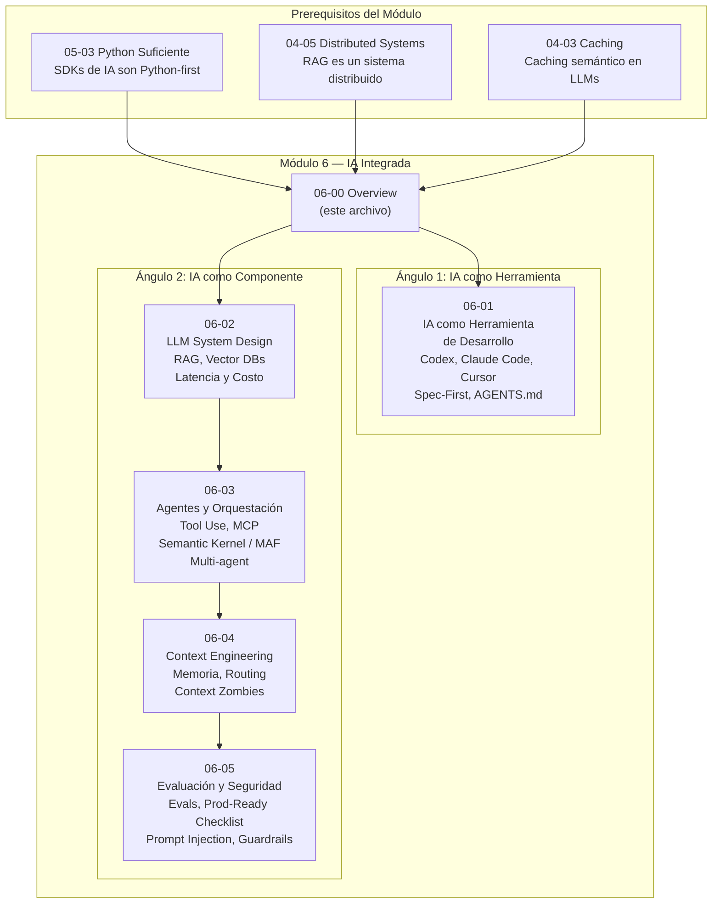

# 06-00 — IA Integrada: Overview del Módulo

> **Posición en el sistema:** Módulo 6 de 7. Llegas aquí habiendo completado
> arquitectura de software (Módulo 3), system design distribuido (Módulo 4),
> y tu stack específico .NET/Python (Módulo 5). Este módulo toma todo eso
> y le suma la capa que define al Staff Engineer de 2026: saber qué hacer
> con la IA — tanto como herramienta personal como componente de arquitectura.
>
> **Prerequisitos directos:** `05-03-python-suficiente.md` (obligatorio),
> `04-05-distributed-systems.md` (crítico para RAG y agentes), `04-03-caching-en-profundidad.md`
> (aplica directamente en estrategias de costo LLM).

---

## La Distinción que Define Este Módulo

Existe una confusión fundamental cuando los developers hablan de "usar IA":
están mezclando dos cosas completamente distintas. Este módulo las separa.

### IA como Herramienta de Desarrollo

Hablamos de Codex, Claude Code, Cursor, GitHub Copilot.

**Quién la usa:** Tú — el developer.
**Para qué:** Escribir código más rápido, refactorizar, analizar corebases, generar tests.
**El output:** Código, documentación, análisis.
**Tu rol:** Usuario de la herramienta.
**La pregunta que debes hacerte:** ¿Cómo uso estas herramientas para multiplicar
mi productividad sin comprometer la calidad arquitectónica?

Ejemplo concreto: usas Claude Code para analizar por qué un test de integración
falla en un codebase de 200,000 líneas. El agente navega el código, encuentra
el problema, propone el fix. Tú evalúas si la solución es correcta y si no
introduce una regresión arquitectónica. Tú decides — el agente ejecuta.

### IA como Componente de Sistema

Hablamos de RAG pipelines, LLM APIs en producción, agentes autónomos integrados
en un producto.

**Quién la usa:** El usuario final de tu sistema.
**Para qué:** Responder preguntas sobre los datos de la empresa, automatizar
workflows, tomar decisiones en nombre del usuario.
**El output:** Una feature que el usuario experimenta.
**Tu rol:** Arquitecto del sistema.
**La pregunta que debes hacerte:** ¿Cómo diseño, evalúo, y opero un sistema
que incluye LLMs como componentes, con las mismas garantías de calidad
que cualquier sistema de producción?

Ejemplo concreto: diseñas un chatbot corporativo que responde preguntas
sobre políticas de la empresa consultando documentos internos via RAG.
Tú decides la arquitectura — el LLM es uno de los componentes.

### Por Qué un Staff Necesita Ambos en 2026

No es una elección. Son dos competencias distintas y ambas son requeridas.

**El primero multiplica tu productividad individual.** Un Staff que no domina
las herramientas de IA agéntico en 2026 trabaja a 0.5x la velocidad de
uno que sí las domina. El mercado ya ha recalibrado las expectativas de
velocidad de entrega a la nueva realidad. Ignorar estas herramientas no es
una posición neutra — es una desventaja activa.

**El segundo define si puedes diseñar productos relevantes.** El 70% de los
roadmaps de producto en empresas tech incluyen features que dependen de LLMs.
Un Staff que no puede articular cómo diseñar un RAG pipeline, evaluar si
un sistema de IA está listo para producción, o mitigar prompt injection,
no puede liderar esos proyectos. Y si no puede liderarlos, otro lo hará.

La paradoja del mercado actual: muchos developers *usan* IA como herramienta
(Copilot, ChatGPT), pero muy pocos pueden *diseñar* sistemas que la integren
correctamente. La segunda competencia es la que diferencia un Senior del
pasado de un Staff del presente.

---

## Mapa del Módulo

**Lectura obligatoria antes de este módulo:**

- `05-03-python-suficiente.md` — Los SDKs de IA (LangChain, RAGAS, Anthropic SDK,
  OpenAI SDK) son Python-first. Si no puedes leer código Python con criterio,
  este módulo te va a resultar opaco. No necesitas ser fluido en Python —
  necesitas no perderte en un snippet de 20 líneas.

- `04-05-distributed-systems.md` — Un pipeline RAG es un sistema distribuido.
  Tiene componentes que fallan de forma independiente, latencias que se acumulan,
  y problemas de consistencia. Si no tienes el modelo mental de sistemas
  distribuidos, no puedes diseñar RAG para producción.

- `04-03-caching-en-profundidad.md` — El caching semántico y el prompt caching
  son las estrategias de reducción de costo más impactantes en sistemas LLM.
  Sin entender caching en general, no vas a entender cómo aplicarlo a LLMs.

---

## La Evidencia que Motiva Este Módulo

Vale la pena entender por qué esto no es tendencia — es realidad de mercado.

**El estudio METR (2025):** Un ensayo controlado mostró que engineers experimentados
trabajando en repositorios masivos tardaron 19% más con herramientas de IA
agénticas que sin ellas. Esto contradice la narrativa de "siempre más rápido".
La conclusión no es "la IA no funciona" — es que **la IA sin el framework
mental correcto no ayuda, y en proyectos complejos puede perjudicar**.
El módulo 06-01 aborda exactamente este problema.

**El dato de adopción asimétrica:** El 32% de los Staff/Senior engineers reportan
que más de la mitad del código en producción es generado por IA.
Solo el 13% de los juniors reportan lo mismo. La paradoja: los que más
se benefician de la IA son los que ya tienen criterio para evaluarla.
La IA es un multiplicador — si no tienes base técnica sólida, multiplica por 0.6.
Si tienes base Staff-level, multiplica por 1.5 o más.

**El mandato de producto 2026:** El 70%+ de los roadmaps de producto tech
incluyen features que dependen de LLMs. Un Staff que no puede articular
cómo diseñar estos sistemas no puede liderar estos proyectos.

---

## Prerequisitos del Módulo

### ¿Por qué 05-03 Python es prerequisito directo?

El ecosistema de IA vive principalmente en Python. LangChain, LlamaIndex,
RAGAS, OpenAI SDK, Anthropic SDK — todos tienen Python como ciudadano
de primera clase. Incluso si tu integración final es en .NET, necesitas
poder leer y entender los ejemplos de arquitectura, los pipelines de evaluación,
y los patrones de RAG que están documentados en Python.

Esto no significa que este módulo ignore .NET. El archivo 06-03 cubre
Semantic Kernel / Microsoft Agent Framework, que es el stack .NET equivalente.
Pero la mayoría de los ejemplos de RAG y evaluación están en Python porque
así es como la industria los documenta.

### ¿Por qué 04-05 Distributed Systems es prerequisito?

Un pipeline RAG involucra: un vector store, un reranker, un LLM API externo,
posiblemente Redis para caching, y tu aplicación orquestando todo esto.
Cada uno puede fallar. Cada uno tiene latencia variable. El LLM API en particular
tiene una confiabilidad más baja que tus servicios internos y una latencia
mucho más alta (1-4 segundos por llamada).

Sin el modelo mental de sistemas distribuidos — circuit breakers, fallbacks,
timeouts, retry con backoff exponencial — no puedes diseñar un sistema LLM
que sea robusto en producción. Puedes hacer un demo que funciona. No puedes
hacer un sistema que sobrevive a un outage de OpenAI a las 2am.

### ¿Por qué 04-03 Caching es prerequisito?

En sistemas LLM, el costo es una constraint de primer orden. El caching
reduce el costo de forma dramática:

- **Prompt caching** (Anthropic): 90% de descuento en tokens de input que se repiten
  (el system prompt, el contexto de la conversación anterior).
- **Caching semántico**: Cachear respuestas completas del LLM cuando la query
  es semánticamente similar a una anterior — sin llegar al LLM.
- **Redis como KV store** para resultados del pipeline RAG.

Sin entender los fundamentos del caching, no puedes implementar estas
estrategias ni articular su impacto en una entrevista o en un diseño de sistema.

---

## Duración y Checklist de Salida

**Duración estimada:** 6-8 semanas de estudio activo.
Este módulo puede trabajarse en paralelo con práctica de entrevistas (Módulo 7)
porque son skills complementarias, no prerequisito lineal.

**La secuencia recomendada dentro del módulo:**
1. Lee 06-01 primero — cambia cómo usas las herramientas en tu trabajo diario
   de forma inmediata. El ROI es inmediato.
2. Lee 06-02 — la arquitectura teórica de RAG y LLMs en producción.
3. Lee 06-03 — los patrones de agentes y cómo implementarlos en .NET.
4. Lee 06-04 — context engineering como framework mental unificador.
5. Lee 06-05 — evals y seguridad: lo que determina si va a producción.

### Checklist de Salida del Módulo 6

Al terminar, deberías poder hacer esto sin dudar:

**Herramienta:**
- [ ] Escribir un AGENTS.md funcional para un proyecto .NET con Clean Architecture
- [ ] Articular la diferencia real entre Codex, Claude Code, y Cursor — no según marketing, sino según casos de uso
- [ ] Explicar por qué el 80% del output de un agente es bueno y el 20% restante es el problema
- [ ] Implementar Spec-First Development para una tarea real en tu trabajo

**Componente de Sistema:**
- [ ] Diseñar la arquitectura de un pipeline RAG de 3 capas en una pizarra
- [ ] Decidir entre RAG, Fine-tuning, y Long Context dado un caso de uso específico
- [ ] Calcular el costo estimado de un sistema LLM dado un volumen de queries
- [ ] Implementar tool use / function calling básico en Python o C#
- [ ] Identificar los 4 anti-patrones de cuándo NO usar IA en un sistema

**Evaluación y Seguridad:**
- [ ] Diseñar una eval suite básica para un sistema LLM
- [ ] Identificar un intento de prompt injection en un input de usuario
- [ ] Completar el checklist de "listo para producción" de 06-05 para un sistema LLM hipotético

**Entrevista:**
- [ ] Responder "¿Cómo diseñarías un chatbot corporativo con RAG?" a nivel Staff
- [ ] Articular trade-offs entre RAG vs Fine-tuning en 2 minutos sin dudar
- [ ] Explicar qué es MCP y por qué importa para integración de herramientas

---

> **Siguiente archivo:** [[06-01-ia-herramienta-desarrollo]]
>
> **Módulo anterior:** [[05-00-overview]] — Stack Específico
>
> **Módulo siguiente:** [[07-00-overview]] — Entrevistas Técnicas
