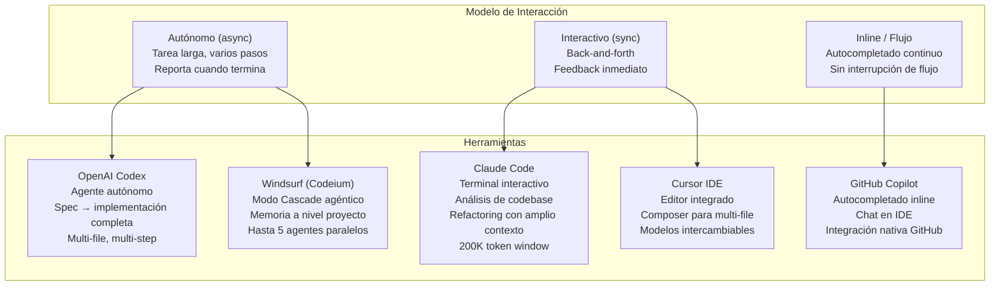

# 06-01 — IA como Herramienta de Desarrollo

> **Ángulo 1 del Módulo 6.** Este archivo trata sobre cómo *tú* usas la IA para
> trabajar mejor — no sobre sistemas que construyes para que otros usen.
> El output de este ángulo es código, análisis, documentación. El usuario eres tú.
>
> **Prerequisito inmediato:** Haber leído `06-00-overview.md`.
> **Conexión con trabajo real:** Esto cambia cómo trabajas hoy, no en 6 meses.

---

## Sección 1 — La Paradoja de la Productividad con IA

Antes de hablar de herramientas específicas, necesitas entender algo
contraintuitivo que el estudio METR (2025) documentó con datos reales:

**Engineers experimentados trabajando en repositorios grandes de producción
tardaron 19% más usando agentes de IA que sin ellos.**

Esto no significa que la IA sea inútil. Significa que **la IA usada de forma
incorrecta en el contexto incorrecto perjudica la productividad real**. Y significa
que la mayoría de los developers están usando estas herramientas mal.

El mismo estudio mostró que los engineers *creían* que eran 20% más rápidos,
incluso cuando objetivamente eran 19% más lentos. Esta brecha de percepción
es importante: la IA hace que el trabajo se *sienta* más fluido aunque
no sea más eficiente, porque hay más movimiento visible aunque el movimiento
útil sea menor.

### El problema raíz: costo cognitivo de integración asimétrica

Los engineers del estudio reportaron que el mayor costo de tiempo era:
1. Escribir especificaciones suficientemente detalladas para que el agente funcione
2. Reconstruir el contexto del sistema al inicio de cada sesión
3. Auditar código generado que "casi" es correcto pero tiene problemas sutiles

El punto 3 es el más crítico. El 66% reportó que su mayor frustración era
"soluciones que son casi correctas, pero no del todo". Auditar código
de un agente que no entiendes toma más tiempo que haberlo escrito tú mismo.

### La regla del Staff: la IA ejecuta, tú decides

Este es el modelo mental que separa el uso efectivo del inefectivo:

```
INEFECTIVO: "IA, dime qué hacer y hazlo"
EFECTIVO:   "Yo decido qué hacer y por qué. IA ejecuta lo que decidí."
```

La IA es excepcional en:
- Implementar una decisión ya tomada (escribir el código para un patrón que decidiste usar)
- Generar código repetitivo y predecible (tests con estructura similar, DTOs, mappers)
- Navegar y analizar código que no escribiste (debugging en corebases grandes)
- Generar alternativas para un trade-off que tú evaluarás

La IA es deficiente en:
- Tomar decisiones arquitectónicas (no tiene contexto de tu sistema, tus constraints, tu equipo)
- Decidir qué patrón usar cuando hay múltiples opciones válidas
- Entender deuda técnica intencional vs accidental
- Evaluar si una solución es correcta para tu dominio específico

---

## Sección 2 — Codex, Claude Code, Cursor, Copilot: Diferencias Reales

El marketing de todas estas herramientas suena similar. Las diferencias reales
están en el modelo de interacción, el contexto que pueden utilizar, y el tipo
de tarea donde brillan.



### OpenAI Codex — el agente más autónomo

**Modelo de uso:** Le das una tarea bien especificada, el agente trabaja de forma
autónoma (a veces minutos, a veces horas), y te entrega el resultado.

**Cuándo es la elección correcta:**
- Implementar una spec completa en múltiples archivos: "Implementa el módulo de
  notificaciones según este ADR"
- Generar todos los tests para un módulo según una spec de cobertura
- Refactorizar un componente completo para adoptar un patrón nuevo
- Tareas que tienen criterios claros de validación (build exitoso, tests passing)

**Su superpoder:** Puede completar tareas largas sin que tú estés presente.
Lanzas la tarea, haces otra cosa, revisas el resultado.

**Su punto débil:** Requiere una spec muy bien escrita para producir un resultado
aceptable. Con una spec vaga, produce código genérico que no se integra bien
con tu sistema específico. La inversión en escribir la spec es alta — si no la haces,
el resultado no vale el tiempo de revisión.

**Configurado con:** `AGENTS.md` — un archivo de contexto del proyecto que el
agente lee al inicio de cada tarea. (Ver Sección 4.)

### Claude Code — el analista más profundo

**Modelo de uso:** Terminal interactivo. Conversación fluida con el agente
mientras exploras el codebase juntos.

**Cuándo es la elección correcta:**
- Debugging complejo: "¿Por qué este test de integración falla de forma intermitente?"
- Análisis de codebase que nunca has visto: "¿Cuáles son los puntos de extensión
  de este sistema? ¿Qué cambiaría si necesito agregar un nuevo tipo de proveedor de pago?"
- Refactoring que requiere entender relaciones entre múltiples archivos antes de actuar
- Explicación de código legacy: "¿Qué hace realmente este servicio de 800 líneas?"

**Su superpoder:** La ventana de contexto de 200K tokens le permite mantener
en mente una cantidad enorme de código simultáneamente. Para repositorios grandes,
puede razonar sobre interacciones entre archivos que ningún modelo anterior podía manejar.

**Su punto débil:** Requiere que tú estés presente y participando en la conversación.
No es bueno para tareas autónomas largas — es bueno para análisis interactivo profundo.

**Configurado con:** `CLAUDE.md` — archivo de contexto específico para Claude Code.

### Cursor — el IDE agéntico

**Modelo de uso:** Editor de código (fork de VS Code) con IA profundamente integrada.
El modo "Composer" permite editar múltiples archivos simultáneamente con instrucciones
en lenguaje natural.

**Cuándo es la elección correcta:**
- Cuando quieres IA integrada en tu flujo normal de desarrollo sin cambiar de herramienta
- Prototipado rápido donde estás en el IDE de todas formas
- Tasks que involucran un módulo o feature específica (no el codebase completo)
- Cuando prefieres ver los cambios propuestos antes de aplicarlos

**Su superpoder:** La integración en el editor elimina el context-switching.
Puedes ver el código, chatear sobre él, aplicar cambios, y seguir editando
en el mismo lugar. La curva de adopción es baja para alguien que ya usa VS Code.

**Su punto débil:** El contexto está limitado a lo que el IDE puede indexar
localmente. Para repositorios muy grandes, puede perder contexto que Claude Code
mantendría.

### GitHub Copilot — el autocompletado más maduro

**Modelo de uso:** Sugerencias inline mientras escribes. Chat integrado en el IDE.

**Cuándo es la elección correcta:**
- Autocompletado continuo durante escritura normal (su caso de uso original)
- Cuando el contexto relevante es el archivo actual o los archivos abiertos
- Organizaciones donde el compliance empresarial requiere herramientas de Microsoft
- Integración nativa con GitHub Actions y flujo de PR

**Su superpoder:** La integración con el ecosistema GitHub es genuina. Puede
entender el contexto de un PR, un issue, o una Action para dar sugerencias
más relevantes. Para equipos ya en el ecosistema Microsoft, la integración SSO
y la gobernanza de datos son ventajas reales.

**Su punto débil:** Es la herramienta menos "agéntica" de la lista. Excelente
para autocompletado, más limitado para tareas autónomas complejas.

### Windsurf (Codeium) — el agente paralelo

**Modelo de uso:** Modo Cascade permite que múltiples agentes trabajen en paralelo
en diferentes partes del codebase, con memoria persistente del proyecto.

**Cuándo es la elección correcta:**
- Proyectos de alta volatilidad donde el agente necesita recordar el contexto
  entre sesiones largas de refactoring
- Cuando necesitas exploración paralela de múltiples enfoques simultáneamente
- Startups sin restricciones de compliance que priorizan velocidad de iteración

---

## Sección 3 — Spec-First Development: El Cambio de Paradigma

El mayor error con agentes de IA es darles tareas vagas.
"Implementa el módulo de autenticación" → el agente produce código genérico
que no considera tus patrones específicos, tu infraestructura, tus convenciones.

El resultado: pasas más tiempo corrigiendo el output del agente que haberlo
escrito tú mismo.

**Spec-First Development** invierte el proceso:

```
ANTES (Tarea-First):
  Developer: "Implementa X"
  → Agente produce algo genérico
  → Developer pasa horas corrigiendo

DESPUÉS (Spec-First):
  Developer: Invierte 30 minutos escribiendo la spec
  → Agente implementa la spec
  → Developer pasa 20 minutos validando
  → Resultado: 50 minutos total vs 3+ horas antes
```

La spec hace explícito todo lo que el agente necesita saber pero no puede
inferir: tu arquitectura, tus patrones, tus constraints, tus convenciones.

### Anatomía de una spec efectiva para agentes

```markdown
# Task: Implementar OrderService con CQRS

## Context
- Clean Architecture: proyectos Domain, Application, Infrastructure, Api
- MediatR para Commands/Queries (ya instalado: MediatR 12.x)
- EF Core 9 con SQL Server (IOrderRepository ya existe en Infrastructure)
- Tests con xUnit + FluentAssertions + Moq
- El proyecto sigue el patrón Outbox para garantía de eventos de dominio

## What to build
1. CreateOrderCommand (record en Application/Orders/Commands)
2. CreateOrderCommandHandler con validación de FluentValidation
3. GetOrderByIdQuery + GetOrderByIdQueryHandler
4. OrderCreatedDomainEvent publicado desde el aggregate (Domain)
5. Outbox entry creado automáticamente en CreateOrderCommandHandler

## Constraints (CRÍTICO — lo que NO hacer)
- No agregar NuGets que no estén ya en el proyecto
- No modificar migraciones existentes — Order table ya existe
- No agregar logging directo — existe LoggingBehavior en el pipeline de MediatR
- Los handlers NO deben conocer HttpContext — son agnósticos a la capa de transporte
- No usar AutoMapper — los mapeos son manuales (ver OrderDto en Application/DTOs)
- No usar var — tipos explícitos siempre

## Validation criteria (cómo sé que está bien)
- dotnet build sin warnings
- Al menos 7 tests unitarios para CreateOrderCommandHandler:
  - Orden creada correctamente → devuelve OrderId
  - Customer inválido (null/empty) → ValidationException
  - Items vacíos → ValidationException
  - Precio negativo en item → ValidationException
  - Outbox entry es creado cuando la orden es válida
  - El repositorio recibe el aggregate correcto
  - El dominio event es publicado (verificar con Moq)
- Al menos 3 tests para GetOrderByIdQueryHandler:
  - Orden encontrada → OrderDto correcto
  - Orden no encontrada → null
  - Id inválido (Guid.Empty) → ArgumentException

## Files to create/modify
CREATE:
- MiSistema.Domain/Aggregates/Orders/OrderCreatedDomainEvent.cs
- MiSistema.Application/Orders/Commands/CreateOrder/CreateOrderCommand.cs
- MiSistema.Application/Orders/Commands/CreateOrder/CreateOrderCommandHandler.cs
- MiSistema.Application/Orders/Commands/CreateOrder/CreateOrderCommandValidator.cs
- MiSistema.Application/Orders/Queries/GetOrderById/GetOrderByIdQuery.cs
- MiSistema.Application/Orders/Queries/GetOrderById/GetOrderByIdQueryHandler.cs
- MiSistema.Tests/Orders/Commands/CreateOrderCommandHandlerTests.cs
- MiSistema.Tests/Orders/Queries/GetOrderByIdQueryHandlerTests.cs

MODIFY:
- MiSistema.Api/Controllers/OrdersController.cs (agregar 2 endpoints)
```

Nota lo que hace esta spec:
- Especifica versiones exactas de dependencias (no asume que el agente las conoce)
- Lista explícitamente qué NO hacer (constraints negativos son tan importantes como los positivos)
- Define criterios de validación concretos y medibles
- Indica exactamente qué archivos crear y cuáles modificar

El tiempo que inviertes en la spec es tiempo que ahorras en correcciones.
Para una tarea de 2-3 días de trabajo, una buena spec toma 30-60 minutos.

---

## Sección 4 — AGENTS.md y CLAUDE.md: Configurar el Agente Correctamente

El AGENTS.md y el CLAUDE.md son archivos de configuración que le dan al agente
el contexto del proyecto que necesita para trabajar bien sin que tú lo expliques
en cada sesión.

Un AGENTS.md mal escrito es peor que no tener ninguno: puede causar que el
agente produzca código inconsistente con tu codebase. Un estudio de ETH Zurich
(2025) mostró que context files mal estructurados reducen la tasa de éxito
del agente en tareas complejas respecto al caso sin context file.

### AGENTS.md — Para Codex

Este archivo va en la raíz del proyecto. Codex lo lee automáticamente
al inicio de cada tarea.

```markdown
# AGENTS.md — MiSistema Order Service

## Project Overview
ASP.NET Core 9 API following Clean Architecture (4-project structure):
- MiSistema.Domain: Aggregates, Value Objects, Domain Events, Repository interfaces
- MiSistema.Application: Commands, Queries, DTOs, Validators (MediatR 12.x)
- MiSistema.Infrastructure: EF Core repositories, outbox, external services
- MiSistema.Api: Controllers, middleware, DI registration

## Architecture Decisions
- CQRS via MediatR — ALL business logic goes through Commands/Queries
- Outbox Pattern for domain events — implemented in Infrastructure/Outbox/
- No AutoMapper — manual mapping methods in Application/Mapping/
- Repository pattern — interfaces in Domain, implementations in Infrastructure
- FluentValidation for all Commands (validators are co-located with commands)

## Code Style
- File-scoped namespaces (namespace MiSistema.Application.Orders;)
- Records for Commands, Queries, and DTOs (immutable by design)
- Explicit types, never var
- All public APIs must have XML documentation (///)
- Async all the way down — no .Result or .Wait()
- CancellationToken in all async methods

## Testing Requirements
- All handlers (Commands and Queries) must have unit tests in MiSistema.Tests
- Test file naming: {HandlerName}Tests.cs, co-located in Tests/{same folder structure}
- Test method naming: {MethodName}_{Scenario}_{ExpectedResult}
  (e.g., Handle_WhenCustomerIdIsEmpty_ThrowsValidationException)
- Always use FluentAssertions (never Assert.Equal)
- Mock with Moq — repositories always mocked, domain services always mocked
- Integration tests go in MiSistema.IntegrationTests (do not create unless asked)

## What to NEVER do
- Never use dynamic or object types in production code
- Never add Console.WriteLine or Debug.WriteLine — use ILogger<T> injected
- Never catch Exception base type — always specific exception types
- Never use synchronous EF Core methods (ToList, First, etc.) — always async
- Never add NuGet packages without checking with the user first
- Never modify existing migrations — always create new ones if schema changes needed
- Never add HTTP client code to domain or application layers

## NuGet packages already installed (use these, don't add others)
- MediatR 12.x
- FluentValidation.DependencyInjectionExtensions 11.x
- FluentAssertions 6.x
- Moq 4.x
- xUnit 2.x
- Npgsql.EntityFrameworkCore.PostgreSQL 9.x (NOT SQL Server)
- Polly 8.x (for resilience in Infrastructure)

## Commands to run after every change
dotnet build --no-restore  # Must pass with 0 errors, 0 warnings
dotnet test MiSistema.Tests  # Must pass 100%
dotnet format --verify-no-changes  # Must report no formatting issues
```

### CLAUDE.md — Para Claude Code

Similar al AGENTS.md pero con meta-instrucciones sobre cómo razonar
sobre el codebase. Claude Code lo usa para entender tu intención de diseño,
no solo las reglas de código.

```markdown
# CLAUDE.md — MiSistema

## How to reason about this codebase
Start by reading these files in order:
1. MiSistema.Domain/Aggregates/ — understand the domain model first
2. MiSistema.Application/Common/Behaviors/ — understand the MediatR pipeline
3. MiSistema.Infrastructure/Outbox/ — understand the event publishing pattern
4. MiSistema.Api/Controllers/ — understand how the API layer is thin

## Known technical debt (intentional — do not "fix" without asking)
- UserService in Infrastructure is 600 lines — intentional while we migrate to a new identity provider
- Some repositories have synchronous methods — legacy, being migrated gradually
- The Order aggregate has a "Status" string field instead of enum — migration planned for Q3

## Current active work
- We are migrating from ASP.NET Core 8 to 9 — DO NOT use any deprecated APIs from Core 8
- We are NOT yet using .NET 10 features (no file-based apps, no new LINQ methods)

## How domain events work here
Domain events are raised in the aggregate (via AddDomainEvent()), captured by
the SaveChangesInterceptor in Infrastructure, and written to the OutboxMessages
table. A background service polls the table and publishes to the message bus.
Never publish domain events directly to the bus from handlers.

## When in doubt about architecture
Ask before implementing if you're unsure about:
- Where a new class belongs (Domain vs Application vs Infrastructure)
- Whether to create a new repository method or use a different aggregate
- Any change that affects the database schema
```

---

## Sección 5 — Cómo un Staff usa IA Diferente a un Junior

La diferencia más importante no es cuántas herramientas usa — es cuándo
y cómo las aplica. Y más importante: cuándo NO las usa.

### El developer promedio con IA

```
1. Tiene un problema
2. Lo describe a ChatGPT/Copilot de forma vaga
3. Acepta el primer output que parece razonable
4. Hace merge sin revisión profunda
5. Descubre el bug en producción
```

Resultado: la IA es un generador de deuda técnica a alta velocidad.

### El Staff con IA

```
1. Tiene un problema → Lo analiza. Entiende exactamente qué necesita.
2. Toma la decisión arquitectónica → La IA NO toma decisiones de diseño
3. Describe la implementación con precisión → Spec-First
4. Revisa el output con criterio arquitectónico → No solo "¿funciona?"
5. Hace merge cuando entiende cada línea del diff → Merges conscientes
```

Resultado: la IA ejecuta decisiones que el Staff ya tomó. La velocidad
viene de no tener que implementar lo mecánico — no de delegar el pensamiento.

### Las preguntas que un Staff hace antes de hacer merge

Cuando revisas código generado por IA, estas preguntas son el filtro:

**Correctitud arquitectónica:**
- ¿Este código viola algún principio que decidimos seguir?
- ¿Está en la capa correcta? (¿Lógica de negocio en un controller? ¿Infraestructura en el dominio?)
- ¿Introduce una dependencia que va en la dirección incorrecta?

**Seguridad:**
- ¿Hay input de usuario concatenado directamente en SQL, comandos, o queries?
- ¿Hay secrets hardcodeados o en variables de entorno sin validación de null?
- ¿Hay logging de información sensible?

**Resiliencia:**
- ¿Las llamadas a servicios externos tienen timeouts definidos?
- ¿Las excepciones son específicas o se captura `Exception` base?
- ¿El código asume que un servicio externo siempre responde?

**Testabilidad:**
- ¿El código nuevo es testeable sin modificarlo?
- ¿Las dependencias son inyectadas o hardcodeadas?

### Cuándo NO delegar a la IA

Esto es tan importante como saber cuándo sí delegar:

- **Decisiones de arquitectura críticas:** La IA no tiene contexto de tus constraints
  de negocio, tu equipo, tu historia de fallos. No le preguntes "¿qué arquitectura
  debo usar?" — decide tú y pídele que implemente.

- **Security-sensitive code:** Auth flows, manejo de secrets, sanitización de
  inputs críticos — revisa esto línea a línea. La IA genera vulnerabilidades
  con la misma fluidez que genera código correcto.

- **Código de dominio complejo:** Si el código encapsula reglas de negocio que
  solo tú entiendes porque has trabajado años en el dominio, la IA va a
  generar algo que parece correcto pero falla en edge cases del negocio.

- **Decisiones de deuda técnica:** "¿Debo refactorizar esto ahora o después?"
  La IA siempre dice "hazlo ahora" porque no tiene contexto de qué hay en el backlog,
  qué fecha es el release, ni cuánto ancho de banda tiene el equipo.

---

## Sección 6 — Riesgos Reales y Cómo Mitigarlos

### Over-reliance — el riesgo más importante a largo plazo

Si usas IA para implementar código que no entiendes, eventualmente tendrás
un codebase que no entiendes. Cuando ese codebase falle en producción a las 3am,
no podrás debuggearlo porque nunca construiste el modelo mental para hacerlo.

⚠️ **Señal de alarma:** Si haces merge de un diff de 200 líneas en menos de
10 minutos, probablemente no lo revisaste con suficiente profundidad.

**Mitigación:** La regla del "puedo explicarlo" — antes de hacer merge, debes
poder explicar qué hace cada función nueva y por qué está implementada así.
Si no puedes, no hagas merge todavía.

### Context Zombies — la degradación silenciosa

Un "context zombie" es una conversación de IA que acumuló tanto contexto
incorrecto, contradictorio, o irrelevante que el modelo empieza a producir
outputs degradados:
- Contradice lo que dijo 10 mensajes antes
- "Olvida" constraints que definiste al inicio de la conversación
- Empieza a alucinár detalles del codebase que no existen
- Las respuestas se vuelven genéricas aunque hayas dado contexto específico

**Señal de alarma:** El agente empieza a contradecirse o a ignorar constraints
que diste explícitamente.

**Mitigación:** Una sesión = un problema. Cuando la tarea cambia significativamente,
nueva sesión con contexto limpio. Un contexto limpio con buena spec supera
siempre a un contexto acumulado con información contradictoria.

### Falsa Velocidad — la trampa de la percepción

El agente genera código en segundos. Hace que el trabajo se *sienta* más rápido.
Pero si no revisas el código con el rigor correcto, lo que ganaste en generación
lo pierdes en debugging posterior.

**Cálculo real de velocidad con IA:**
```
Tiempo total = Tiempo de spec + Tiempo de generación + Tiempo de revisión
              + Tiempo de fixes + Tiempo de tests
```

La ganancia real está en los items donde el agente acelera la parte mecánica
mientras el developer diseña. Si el developer no tiene la decisión clara antes
de invocar el agente, el costo de spec + revisión + corrección puede exceder
el de escribir el código directamente.

**Cuándo la IA sí multiplica productividad real:**
- Tests repetitivos con estructura similar (5 tests donde el patrón es claro)
- DTOs y mappers que son transformaciones predecibles de un modelo a otro
- Boilerplate de scaffolding (controllers, endpoints) para un patrón ya decidido
- Documentación XML de métodos públicos en código que ya existe
- Migrations de EF Core cuando tienes la spec clara del schema

**Cuándo la IA no ayuda:**
- Diseñar la arquitectura de un feature nuevo
- Debuggear un problema de concurrencia sutil
- Refactorizar código legacy con semántica de negocio compleja
- Tomar decisiones sobre deuda técnica

### Security Pass en Code Review con IA

El código generado por agentes introduce vulnerabilidades con la misma
fluidez que genera código correcto. Todo merge de código generado por IA
debe incluir un pass explícito de security:

```
Security checklist para código generado:
□ SQL queries usan parámetros, no concatenación de strings
□ Inputs de usuario son validados antes de procesar
□ No hay secrets hardcodeados (connection strings, API keys, passwords)
□ No se loggea información sensible (PII, tokens, passwords)
□ Manejo de archivos no usa path del usuario directamente (path traversal)
□ Deserialización de JSON no es de fuentes no confiables sin validación
□ Headers de seguridad presentes donde aplica (CORS, CSP)
```

---

## Checklist de Salida

Al terminar de estudiar este archivo, deberías poder:

- [ ] Escribir un AGENTS.md funcional para un proyecto .NET propio
- [ ] Escribir una spec completa para una tarea de implementación real
- [ ] Elegir entre Codex, Claude Code, Cursor, y Copilot dado un caso de uso específico
- [ ] Articular la diferencia entre usar IA para ejecutar vs para decidir
- [ ] Identificar al menos 3 señales de que estás usando IA de forma inefectiva

---

> **Recurso complementario:** La guía de Omar sobre "El Desarrollador Aumentado"
> en el directorio del proyecto cubre workflows de agentes en mayor detalle,
> incluyendo integración de MCP en Claude Code y Codex en el contexto de desarrollo diario.
>
> **Siguiente archivo:** [[06-02-llm-system-design]]
