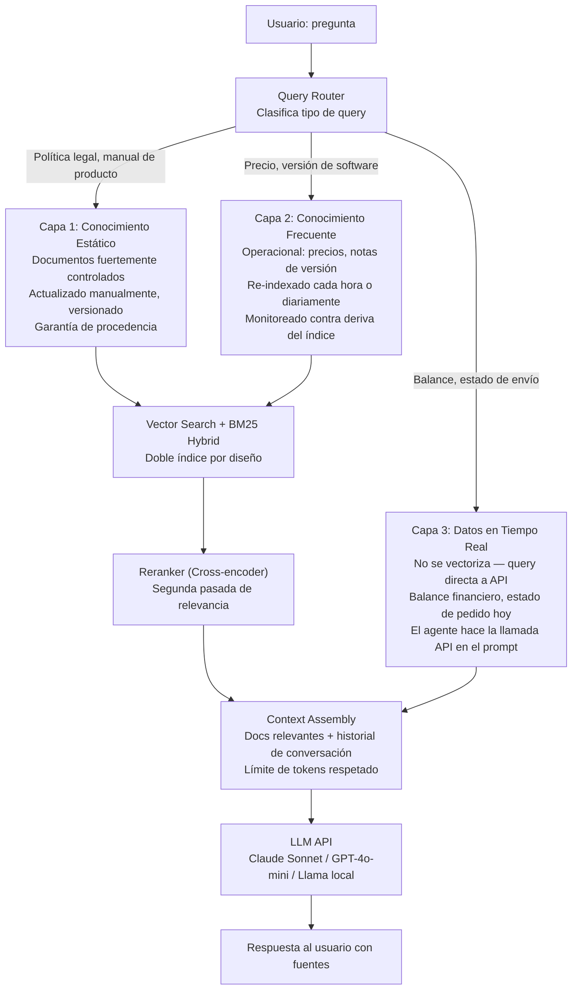
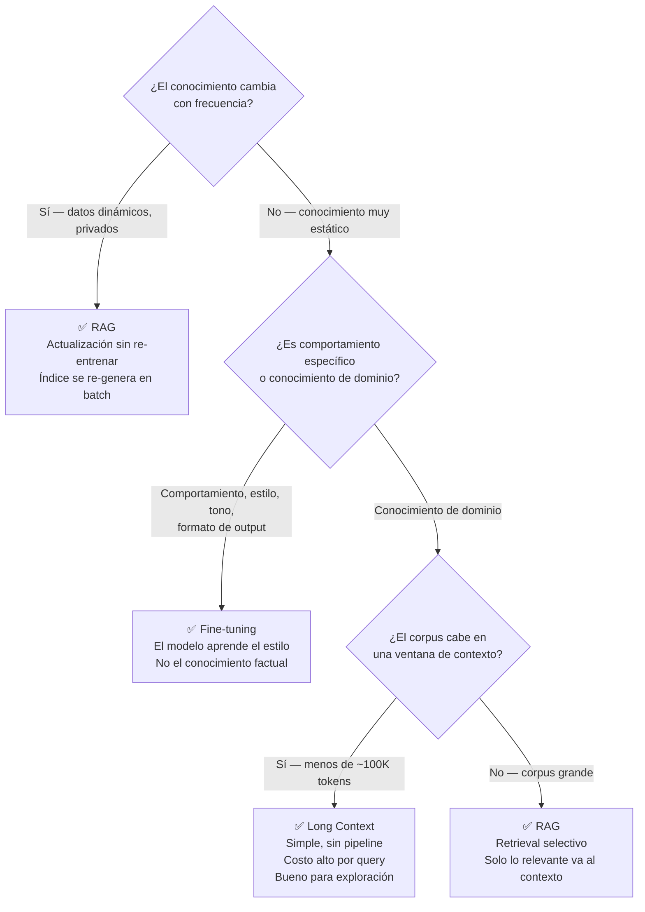
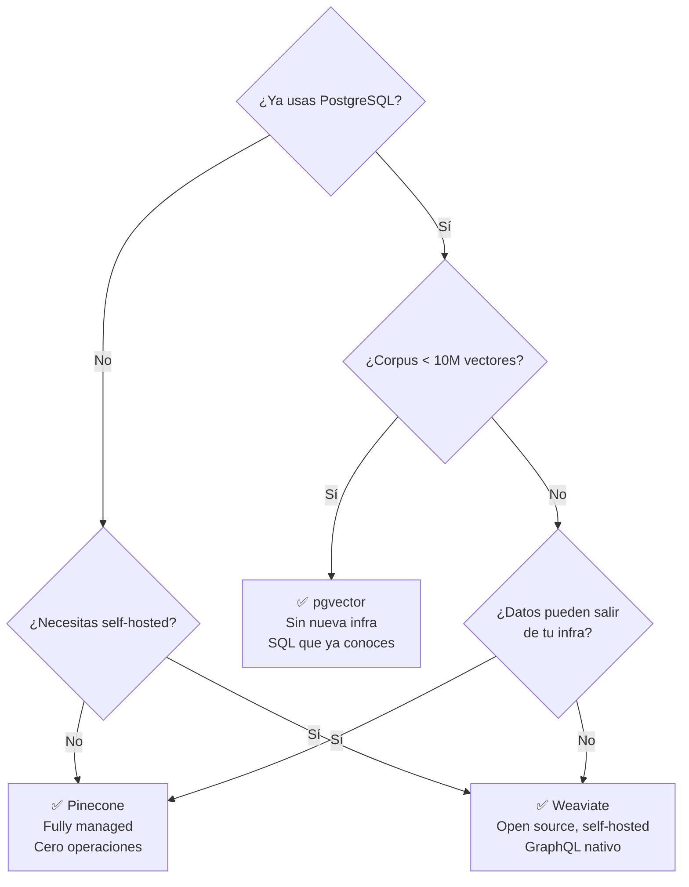
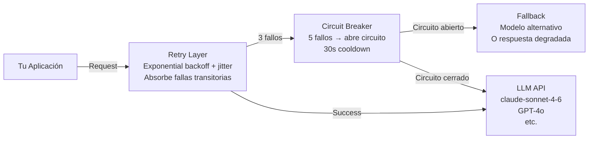

# 06-02 — LLM System Design: Diseñar Sistemas con IA en Producción

> **Ángulo 2 del Módulo 6 — comienza aquí.** Este archivo cubre cómo diseñar,
> construir, y operar sistemas que usan LLMs como componentes de producción.
> Es el archivo más técnico del módulo y el más crítico para entrevistas de
> AI System Design en 2026.
>
> **Prerequisitos:** `06-00-overview.md`, `05-03-python-suficiente.md`,
> `04-05-distributed-systems.md` (los LLMs son servicios externos con alta latencia
> y baja confiabilidad — necesitas el modelo mental de sistemas distribuidos).
>
> **Recurso de referencia:** *AI Engineering* (Chip Huyen) — el libro base
> de este archivo. *LLM Engineering Handbook* (Iusztin & Labonne) para profundidad
> en RAG y pipelines. Ambos en tu lista de recursos del proyecto.

---

## Sección 1 — RAG Architecture: El Patrón Más Importante

### El problema que RAG resuelve

Los LLMs tienen dos limitaciones fundamentales para uso empresarial:

1. **Conocimiento estático hasta la fecha de corte:** GPT-4o fue entrenado
   hasta cierta fecha. No sabe nada de lo que pasó después. No sabe nada
   de tus datos internos.

2. **Sin acceso a información privada:** El modelo no conoce los documentos
   internos de tu empresa, las órdenes de tus clientes, las políticas actuales.

RAG (Retrieval-Augmented Generation) resuelve ambos problemas: en lugar de
pedirle al LLM que "recuerde" la información, se la inyectas en el contexto
en el momento de la query. El modelo no necesita haber sido entrenado con
tus datos — solo necesita poder razonar sobre ellos cuando se los das.

### La arquitectura de RAG en producción: 3 capas

La arquitectura de un RAG de producción no es un solo vector store.
Es una jerarquía de 3 capas con características muy distintas:



**Por qué 3 capas y no 1 vector store masivo:**

La capa estática (políticas, contratos, manuales) cambia rara vez y
requiere garantías de procedencia estrictas. La capa frecuente (precios,
notas de versión) cambia más seguido y tolera re-indexado automático.
La capa de tiempo real no se puede vectorizar — el precio de una acción
a las 3pm no es el mismo que a las 3:01pm. Mezclarlo todo en un solo índice
crea problemas de frescura de datos y de control de cambios.

### El pipeline de indexación (offline — no en tiempo de respuesta)

```python
from langchain_text_splitters import RecursiveCharacterTextSplitter
from langchain_openai import OpenAIEmbeddings
from langchain_community.vectorstores.pgvector import PGVector
from typing import List
from langchain_core.documents import Document

# 1. CHUNKING — la decisión más crítica del pipeline RAG
# El error más común: chunk size incorrecto para el tipo de consulta
splitter = RecursiveCharacterTextSplitter(
    chunk_size=1000,        # tokens aprox — calibrar según granularidad de queries
    chunk_overlap=200,      # 15-20% de overlap para no perder contexto en fronteras
    separators=["\n\n", "\n", ". ", " ", ""],  # Respetar estructura semántica
    # Para código: usar separadores de código, no de texto
    # Para JSONs con estructura rígida: overlap=0 para no generar datos sintéticos
)

# ANTI-PATRÓN: chunk_size fijo en caracteres para todo tipo de documento.
# La granularidad del chunk debe correlacionarse con la granularidad de la query.
# Si el usuario busca "¿cuál es el paso 3 de configuración?", el chunk debe ser
# ese paso específico — no el PDF de 50 páginas entero.

chunks: List[Document] = splitter.split_documents(documents)

# Agregar metadata que permita filtrar posteriormente
for chunk in chunks:
    chunk.metadata.update({
        "source_type": "policy",  # Para filtrado en retrieval
        "version": "2026-Q1",
        "department": "legal",
        "visibility": "internal",  # Para control de acceso
    })

# 2. EMBEDDING — convertir texto a vectores
# text-embedding-3-large: 3072 dimensiones, mayor calidad, mayor costo
# text-embedding-3-small: 1536 dimensiones, buena calidad, ~5x más barato
embeddings = OpenAIEmbeddings(model="text-embedding-3-small")  # $0.02/1M tokens

# 3. VECTOR STORE — pgvector para empezar (ver Sección 3 para cuándo escalar)
vector_store = PGVector(
    embeddings=embeddings,
    collection_name="knowledge_base",
    connection=CONNECTION_STRING,
    use_jsonb=True,  # Metadata como JSONB para filtrado eficiente
)
vector_store.add_documents(chunks)
```

### El pipeline de retrieval (online — en tiempo de respuesta del usuario)

Este pipeline sucede en ~150-400ms antes de llamar al LLM:

```python
from anthropic import Anthropic
import json
from typing import List, Tuple

async def rag_pipeline(
    query: str,
    user_id: str,
    user_roles: List[str],
    conversation_history: List[dict]
) -> str:

    # PASO 1: Reformulación de query (opcional pero mejora precisión)
    # El usuario pregunta en lenguaje natural — transformar a query de búsqueda más precisa
    # Solo hace sentido si las queries del usuario son ambiguas o conversacionales
    refined_query = await reformulate_query(query, conversation_history)

    # PASO 2: HYBRID SEARCH — vector + BM25 simultáneamente
    # Vector search: captura similitud semántica (busca "precio" encuentra "costo", "tarifa")
    # BM25: captura keywords exactos (busca "ORD-12345" encuentra exactamente ese ID)
    # Ninguno solo es suficiente — la combinación supera a cualquiera por separado
    vector_results = await vector_store.asimilarity_search_with_score(
        refined_query,
        k=20,  # Buscar más candidatos, luego filtrar
        filter={
            "$or": [
                {"visibility": "public"},
                {"owner_id": user_id},
                {"allowed_roles": {"$in": user_roles}}
            ]
        }
    )

    bm25_results = await bm25_index.search(refined_query, k=10)

    # Combinar y deduplicar por source_id
    all_candidates = merge_and_deduplicate(vector_results, bm25_results)

    # PASO 3: RERANKING — segunda pasada de relevancia con cross-encoder
    # El bi-encoder (vector search) es rápido pero impreciso — captura similitud global
    # El cross-encoder (reranker) es lento pero preciso — evalúa query+documento juntos
    # Por eso: bi-encoder para los top-20, cross-encoder para los top-5 finales
    reranked_results = await reranker.arerank(
        query=refined_query,
        documents=[doc for doc, score in all_candidates],
        top_k=5
    )

    # PASO 4: CONTEXT ASSEMBLY — construir el contexto para el LLM
    context = build_context(
        documents=reranked_results,
        conversation_history=conversation_history[-6:],  # Últimos 3 turnos
        max_tokens=6000  # Reservar tokens para la respuesta
    )

    # PASO 5: LLAMADA AL LLM con el contexto inyectado
    client = Anthropic()
    response = client.messages.create(
        model="claude-sonnet-4-20250514",
        max_tokens=1000,
        system="""You are a helpful assistant. Answer questions based ONLY
        on the provided context. If the answer is not in the context,
        say so explicitly — never fabricate information.
        Always cite the source document for your answer.""",
        messages=[
            *conversation_history[-6:],
            {
                "role": "user",
                "content": f"""Context:\n{context}\n\nQuestion: {query}"""
            }
        ]
    )

    return response.content[0].text
```

---

## Sección 2 — RAG vs Fine-tuning vs Long Context

Esta es la decisión más importante que tomas antes de construir un sistema con LLMs.
Equivocarte aquí cuesta semanas de trabajo y miles de dólares de compute.



### Tabla comparativa detallada

| Dimensión | RAG | Fine-tuning | Long Context |
|---|---|---|---|
| Actualización del conocimiento | Inmediata (re-indexar) | Requiere re-entrenar ($$$) | Cambiar el prompt |
| Costo de setup | Medio | Alto (GPU compute de training) | Bajo |
| Costo de inference | Bajo (solo chunks relevantes) | Bajo (modelo más pequeño) | Alto (toda la ventana = $) |
| Latencia por query | +150-400ms (retrieval) | Baja (inferencia pura) | Alta (contexto largo = lento) |
| Alucinaciones | Bajo (con fuentes relevantes) | Puede crear memorias falsas | Bajo |
| Debugging de errores | Medio (¿qué se recuperó?) | Difícil (¿qué aprendió?) | Fácil (todo el contexto visible) |
| Trazabilidad de fuentes | Alta (citas a documentos) | Nula | Alta (todo en el prompt) |
| Cuándo usar | Datos dinámicos o privados | Estilo/formato corporativo | Corpus pequeño, prototipado |

### Combinación híbrida — el patrón de producción más avanzado

Las arquitecturas empresariales más sofisticadas combinan los tres:
- **Fine-tuning** para fijar patrones de respuesta estilísticos (el tono de la empresa,
  el formato de los outputs, restricciones de dominio estrechas)
- **RAG** para inyección de conocimiento factual en tiempo real
- **Long context** para análisis profundo de documentos cuando el volumen lo permite

Esta combinación logra >96% de accuracy en dominios específicos según benchmarks
de producción reportados en 2025-2026.

---

## Sección 3 — Vector Databases: Cuándo y Cuál

### pgvector — el punto de partida correcto para .NET shops

Si ya usas PostgreSQL (y el 80% de los sistemas empresariales lo hacen),
pgvector es casi siempre la decisión correcta para empezar.

**Por qué pgvector primero:**
- Elimina una pieza de infraestructura (no hay que operar un vector DB separado)
- ACID transaccional con tu data relacional
- SQL familiar para filtrado + vector search combinado
- Escala bien hasta ~5-10M vectores con configuración correcta

```sql
-- Habilitar la extensión
CREATE EXTENSION IF NOT EXISTS vector;

-- Tabla con embeddings integrados a tu schema relacional
CREATE TABLE document_chunks (
    id          UUID PRIMARY KEY DEFAULT gen_random_uuid(),
    document_id UUID NOT NULL REFERENCES documents(id) ON DELETE CASCADE,
    content     TEXT NOT NULL,
    metadata    JSONB DEFAULT '{}',
    embedding   vector(1536),    -- text-embedding-3-small: 1536 dimensiones
    created_at  TIMESTAMPTZ DEFAULT NOW()
);

-- Índice ANN (Approximate Nearest Neighbor) para búsqueda eficiente
-- IVFFlat: bueno para la mayoría de casos, requiere entrenamiento
-- HNSW: más rápido en queries pero más memoria — para producción con alto QPS
CREATE INDEX ON document_chunks
    USING ivfflat (embedding vector_cosine_ops)
    WITH (lists = 100);  -- sqrt(n_rows) es un buen punto de partida

-- Para producción con >1M vectores, preferir HNSW:
-- CREATE INDEX ON document_chunks
--     USING hnsw (embedding vector_cosine_ops)
--     WITH (m = 16, ef_construction = 64);

-- Búsqueda híbrida: vector + filtrado por metadata en una sola query
SELECT
    content,
    metadata,
    1 - (embedding <=> $1::vector) AS similarity,  -- $1 = query embedding
    document_id
FROM document_chunks
WHERE
    metadata->>'visibility' = 'public'              -- Filtro de metadata primero
    OR metadata->>'department' = $2                 -- $2 = user department
ORDER BY embedding <=> $1::vector                   -- <=> = coseno distance
LIMIT 20;
-- Nota: el filtro de metadata ANTES del ORDER BY reduce el espacio de búsqueda
```

### Cuándo escalar a un vector DB dedicado

Señales de que pgvector ya no es suficiente:
- Corpus > 10M vectores y latencias de búsqueda > 100ms en p95
- Necesitas filtrado por metadata + vector search híbrido con alta cardinalidad
- Multi-tenancy con aislamiento estricto entre tenants (pgvector puede hacerlo pero se complica)
- Necesitas features avanzadas: búsqueda multimodal, índices distribuidos, auto-embedding

**Pinecone** — fully managed, sin operaciones:
- Pros: cero overhead operativo, filtrado de metadata nativo, multi-región
- Contras: costo alto a escala, datos salen de tu infraestructura, vendor lock-in
- Cuándo: prototipado rápido, startup sin DevOps budget, MVP que necesita estar vivo ya

**Weaviate** — open source, más control:
- Pros: GraphQL + REST, auto-embedding opcional, multi-tenancy nativo, self-hosted
- Contras: más complejo de operar que pgvector si ya tienes PostgreSQL
- Cuándo: cuando necesitas features avanzadas y quieres datos en tu infraestructura

**Qdrant** — escrito en Rust, alta performance:
- Pros: payload filtering muy eficiente, bajo consumo de memoria, API REST limpia
- Contras: ecosistema más pequeño, menos integraciones que Weaviate/Pinecone
- Cuándo: cuando la performance de retrieval es el constraint principal



---

## Sección 4 — Latencia y Costo como Constraints de Primer Orden

Este es el error más común en sistemas LLM: tratar la latencia y el costo
como afterthoughts en lugar de constraints de diseño desde el inicio.

### Los números que necesitas conocer (Mayo 2026)

| Modelo | Input (por 1M tokens) | Output (por 1M tokens) | Latencia típica |
|---|---|---|---|
| Claude Opus 4.6 | $5.00 | $25.00 | 2-5s |
| Claude Sonnet 4.6 | $3.00 | $15.00 | 1-3s |
| Claude Haiku 4.5 | $1.00 | $5.00 | 0.5-1.5s |
| GPT-4o (mini) | ~$0.15 | ~$0.60 | 0.5-1s |
| text-embedding-3-small | $0.02 | N/A | <100ms |

**Cómo leer esta tabla para decisiones de diseño:**

Si tienes 1M queries al mes con un prompt de 2000 tokens y respuesta de 500 tokens:
- Con Haiku 4.5: (2000 × $1 + 500 × $5) / 1M = $4,500/mes
- Con Sonnet 4.6: (2000 × $3 + 500 × $15) / 1M = $13,500/mes
- Con Opus 4.6: (2000 × $5 + 500 × $25) / 1M = $22,500/mes

El Sonnet cuesta 3x más que el Haiku para el mismo volumen. Si el Haiku
resuelve el 80% de tus casos con calidad aceptable, el routing inteligente
puede reducir el costo total en 60-70%.

### Estrategia 1 — Prompt Caching (reducción de hasta 90% en input)

Anthropic ofrece prompt caching: si repites el mismo bloque de tokens
(system prompt, contexto largo) en múltiples requests, el costo de los
tokens cacheados baja un 90%.

```python
from anthropic import Anthropic

client = Anthropic()

# El system prompt se cachea automáticamente si es suficientemente largo
# (>1024 tokens para Sonnet/Opus, >2048 para Haiku)
# y se repite en múltiples requests
response = client.messages.create(
    model="claude-sonnet-4-20250514",
    max_tokens=1000,
    system=[
        {
            "type": "text",
            "text": """Eres un asistente de soporte técnico para MiEmpresa.
            [... 2000 tokens de instrucciones y contexto de empresa ...]""",
            "cache_control": {"type": "ephemeral"}  # Marcar para cacheo
        }
    ],
    messages=[{"role": "user", "content": user_query}]
)
# Primera request: paga tokens normales
# Requests subsiguientes con el mismo system: 90% descuento en esos tokens
```

**Cuándo aplica:** Cuando el mismo system prompt o contexto largo se repite
en múltiples requests del mismo tipo. Chatbots corporativos, Q&A sobre documentación.

### Estrategia 2 — Routing por Complejidad

No todas las queries necesitan el modelo más capaz. Un clasificador ligero
al inicio determina qué modelo usar:

```python
async def smart_route_query(query: str, conversation_history: list) -> str:
    # PASO 1: Clasificar complejidad con el modelo más barato (Haiku)
    # Esta clasificación cuesta ~200 tokens = $0.00000020
    complexity_response = await anthropic_client.messages.create(
        model="claude-haiku-4-5-20251001",
        max_tokens=50,
        messages=[{
            "role": "user",
            "content": f"""Classify this query complexity:
            SIMPLE = factual question, single-step lookup, FAQ
            COMPLEX = multi-step reasoning, analysis, comparison, ambiguous

            Query: {query}
            Return only: SIMPLE or COMPLEX"""
        }]
    )
    complexity = complexity_response.content[0].text.strip()

    # PASO 2: Enviar al modelo correcto según clasificación
    if complexity == "SIMPLE":
        # 80% de queries típicas son simples → modelo barato
        model = "claude-haiku-4-5-20251001"
    else:
        # 20% requieren capacidad completa
        model = "claude-sonnet-4-20250514"

    return await rag_pipeline(query, conversation_history, model=model)
```

**Resultado típico:** 80/20 split = 80% queries al modelo barato.
Costo total = 0.80 × Haiku + 0.20 × Sonnet = ahorro de 60-70% vs todo en Sonnet.

### Estrategia 3 — Caching semántico de respuestas

Para queries idénticas o muy similares, cachear la respuesta completa:

```python
import hashlib
import redis.asyncio as redis

async def cached_rag_call(query: str, user_context: dict) -> str:
    # Crear cache key combinando la query con contexto relevante
    # No incluir user_id si la respuesta es la misma para todos los usuarios
    cache_key = hashlib.sha256(
        f"{query}:{user_context.get('department', 'all')}".encode()
    ).hexdigest()

    redis_client = redis.from_url("redis://localhost:6379")

    # Intentar cache hit
    cached = await redis_client.get(f"rag:{cache_key}")
    if cached:
        return cached.decode()

    # Cache miss — llamar al pipeline completo
    response = await rag_pipeline(query, user_context)

    # Cachear con TTL según volatilidad del conocimiento
    ttl_seconds = 3600  # 1 hora para conocimiento frecuente
    await redis_client.setex(f"rag:{cache_key}", ttl_seconds, response)

    return response
```

---

## Sección 5 — Patrones de Integración LLM

Los 4 patrones fundamentales. Conocerlos y saber cuándo elegir cada uno
es lo que el entrevistador evalúa cuando pregunta "¿cómo diseñarías X?".

### Patrón 1: Prompt Chaining

La salida de un LLM es la entrada del siguiente. Cada paso hace UNA cosa bien.

```python
async def analyze_support_ticket(ticket: str) -> dict:
    # Paso 1: Extraer información estructurada
    extraction = await llm_call(
        f"""Extract from this support ticket:
        - Type: (billing|technical|shipping|returns|other)
        - Priority: (low|medium|high|critical)
        - Customer tone: (neutral|frustrated|angry|satisfied)

        Ticket: {ticket}
        Return valid JSON only.""",
        model="claude-haiku-4-5-20251001"  # Modelo barato para extracción estructurada
    )
    extracted = json.loads(extraction)

    # Paso 2: Buscar soluciones relevantes (solo si es técnico)
    solutions = []
    if extracted["type"] == "technical":
        solutions = await search_knowledge_base(ticket, top_k=3)

    # Paso 3: Generar respuesta con contexto completo
    response = await llm_call(
        f"""You are a support agent. Generate a helpful response.

        Ticket type: {extracted['type']}
        Priority: {extracted['priority']}
        Customer tone: {extracted['tone']}

        Relevant solutions from knowledge base:
        {json.dumps(solutions)}

        Original ticket: {ticket}""",
        model="claude-sonnet-4-20250514"  # Modelo más capaz para generación
    )

    return {"extracted": extracted, "response": response}
```

**Cuándo usar:** Cuando el problema tiene etapas claramente separables donde
el output de cada etapa es determinista y verificable. El "gate" entre pasos
puede incluir validación programática (parse JSON, verificar que el tipo
extraído es válido, etc.).

**Trade-off:** Más latencia total (una llamada LLM por paso), pero errores
son detectables entre pasos y el sistema es más debuggeable.

### Patrón 2: Routing

Una primera LLM call clasifica, el resultado determina qué handler procesa:

```python
async def route_query(query: str, context: dict) -> str:
    # Router: modelo barato, tarea simple, output predecible
    route = await llm_call(
        f"""Classify this query into exactly one category:
        ORDER_STATUS, BILLING, TECHNICAL, RETURNS, ESCALATE

        Query: {query}

        Return only the category name.""",
        model="claude-haiku-4-5-20251001"
    )

    handlers = {
        "ORDER_STATUS": order_status_agent,
        "BILLING":      billing_agent,
        "TECHNICAL":    technical_support_rag,
        "RETURNS":      returns_policy_agent,
        "ESCALATE":     human_handoff_handler,  # No LLM — workflow determinista
    }

    handler = handlers.get(route.strip(), general_handler)
    return await handler(query, context)
```

**Cuándo usar:** Sistemas con múltiples tipos de queries donde los handlers
son significativamente diferentes (distintas herramientas, distintos contextos,
distintos modelos). El routing crea claridad de responsabilidades.

**Trade-off:** Si el clasificador comete errores, la query va al handler
incorrecto. Monitorear la tasa de error del router es obligatorio en producción.

### Patrón 3: Evaluador-Optimizador

Un LLM genera, otro evalúa y critica. El primer LLM mejora basado en el feedback.
Continúa hasta que la evaluación es aceptable o se alcanza el número máximo de iteraciones.

```python
async def generate_with_quality_loop(
    task: str,
    quality_criteria: list[str],
    max_iterations: int = 3
) -> str:

    draft = await llm_call(
        f"Complete this task with high quality: {task}",
        model="claude-sonnet-4-20250514"
    )

    for iteration in range(max_iterations):
        # Evaluador: un LLM diferente evalúa el output del generador
        # Usar el mismo modelo o uno más capaz para evaluación
        evaluation_prompt = f"""
        Evaluate this output for the following task: {task}

        Output to evaluate:
        {draft}

        Evaluate against these criteria:
        {json.dumps(quality_criteria)}

        Return JSON:
        {{
            "scores": {{"criterion_name": 1-10, ...}},
            "overall_score": 1-10,
            "is_acceptable": boolean (true if all scores >= 7),
            "critical_issues": ["issue1", "issue2"],
            "improvement_suggestions": ["suggestion1", ...]
        }}
        """

        evaluation = json.loads(
            await llm_call(evaluation_prompt, model="claude-sonnet-4-20250514")
        )

        if evaluation["is_acceptable"]:
            break  # El evaluador dice que el output es aceptable

        # Mejorar el draft basado en el feedback específico
        draft = await llm_call(
            f"""Improve this output based on these specific issues:

            Original task: {task}
            Current output: {draft}
            Critical issues to fix: {json.dumps(evaluation['critical_issues'])}
            Suggestions: {json.dumps(evaluation['improvement_suggestions'])}

            Generate an improved version that addresses all issues.""",
            model="claude-sonnet-4-20250514"
        )

    return draft
```

**Cuándo usar:** Cuando la calidad del output importa más que la latencia.
Generación de documentos legales, emails de marketing, código crítico donde
los errores son costosos.

**Trade-off:** 2-4x el costo de una sola llamada. 2-4x la latencia. Solo vale
si el output de alta calidad justifica el costo.

### Patrón 4: Orchestrator-Workers

Un LLM orquestador recibe una tarea compleja, la descompone en subtareas,
y delega cada subtarea a workers especializados que pueden ejecutarse en paralelo.

```python
import asyncio

async def orchestrated_research(research_topic: str) -> str:

    # PASO 1: El orquestador analiza la tarea y crea el plan
    # Modelo más capaz para planificación estratégica
    plan_response = await llm_call(
        f"""You are a research coordinator. Break this research topic into
        specific subtasks that can be researched independently and in parallel.

        Research topic: {research_topic}

        Return JSON:
        {{
            "subtasks": [
                {{"id": "1", "description": "...", "search_query": "..."}},
                ...
            ],
            "synthesis_instructions": "How to combine the research..."
        }}""",
        model="claude-opus-4-20250514"  # Modelo más capaz para planificación
    )
    plan = json.loads(plan_response)

    # PASO 2: Workers ejecutan subtareas en paralelo
    # Cada worker es independiente — pueden usar distintas herramientas
    async def research_subtask(subtask: dict) -> dict:
        results = await search_web(subtask["search_query"])
        analysis = await llm_call(
            f"Analyze this research for subtask: {subtask['description']}\n{results}",
            model="claude-haiku-4-5-20251001"  # Modelo barato para análisis individual
        )
        return {"subtask_id": subtask["id"], "findings": analysis}

    subtask_results = await asyncio.gather(
        *[research_subtask(s) for s in plan["subtasks"]]
    )

    # PASO 3: El orquestador sintetiza los resultados
    synthesis = await llm_call(
        f"""Synthesize these research findings following these instructions:
        {plan['synthesis_instructions']}

        Findings:
        {json.dumps(subtask_results)}""",
        model="claude-opus-4-20250514"
    )

    return synthesis
```

**Cuándo usar:** Tareas complejas donde las subtareas son independientes
y el paralelismo reduce la latencia total significativamente. Research,
análisis de mercado, due diligence.

**Trade-off:** Costo elevado (múltiples llamadas LLM). Alta complejidad
de debugging cuando algo falla en un worker. Latencia del orquestador
se suma al tiempo total. No usar si un solo agente bien promoteado puede
hacer el trabajo.

---

## Sección 6 — Resiliencia en Sistemas LLM

Los LLMs son APIs externas con confiabilidad más baja que tu infraestructura interna.
Tratar un LLM API como si fuera una base de datos transaccional es un error de diseño.



```python
import asyncio
import time
from enum import Enum
from tenacity import retry, stop_after_attempt, wait_exponential, retry_if_exception_type

class CircuitState(Enum):
    CLOSED = "closed"      # Normal — permite requests
    OPEN = "open"          # Cortado — rechaza requests
    HALF_OPEN = "half_open"  # Probando si se recuperó

class LLMCircuitBreaker:
    def __init__(self, failure_threshold: int = 5, cooldown_seconds: int = 30):
        self.state = CircuitState.CLOSED
        self.failure_count = 0
        self.failure_threshold = failure_threshold
        self.last_failure_time: float | None = None
        self.cooldown_seconds = cooldown_seconds

    async def call(self, llm_func, *args, **kwargs):
        if self.state == CircuitState.OPEN:
            if time.time() - self.last_failure_time > self.cooldown_seconds:
                self.state = CircuitState.HALF_OPEN
            else:
                # Circuito abierto — usar fallback inmediatamente
                return await self._fallback(*args, **kwargs)

        try:
            result = await llm_func(*args, **kwargs)
            if self.state == CircuitState.HALF_OPEN:
                self._reset()  # Se recuperó — cerrar el circuito
            return result
        except Exception as e:
            self._record_failure()
            if self.failure_count >= self.failure_threshold:
                self.state = CircuitState.OPEN
                self.last_failure_time = time.time()
            raise

    async def _fallback(self, *args, **kwargs) -> str:
        """Intenta con modelo alternativo o devuelve respuesta degradada"""
        try:
            # Intentar con modelo alternativo (diferente proveedor)
            return await alternative_llm_call(*args, **kwargs)
        except Exception:
            # Respuesta degradada — al menos el sistema no cae
            return "El servicio de IA no está disponible en este momento. Por favor intenta más tarde."

    def _reset(self):
        self.state = CircuitState.CLOSED
        self.failure_count = 0
        self.last_failure_time = None

    def _record_failure(self):
        self.failure_count += 1

# Retry con backoff exponencial para fallas transitorias
@retry(
    stop=stop_after_attempt(3),
    wait=wait_exponential(multiplier=1, min=1, max=10),
    retry=retry_if_exception_type((TimeoutError, ConnectionError))
)
async def resilient_llm_call(prompt: str, model: str) -> str:
    circuit_breaker = get_circuit_breaker(model)  # Singleton por modelo
    return await circuit_breaker.call(raw_llm_call, prompt=prompt, model=model)
```

---

## Sección 7 — Anti-patrones: Cuándo NO usar LLMs en el Sistema

Un Staff articula esto con precisión. El entrevistador espera que sepas decir "no".

### Las 4 puertas (The Four Gates)

Descartar IA si el sistema cruza CUALQUIERA de estos umbrales:

**Puerta 1 — Lógica completamente determinista:**
Si el universo de respuestas puede enumerarse exhaustivamente con tests unitarios,
la IA es complejidad innecesaria. Un motor de reglas evalúa en nanosegundos
sin costo de inference y sin riesgo de alucinaciones.

**Puerta 2 — Tolerancia cero a errores en dominio sensible:**
Cálculo de transacciones financieras, determinaciones legales, diagnósticos médicos.
Un LLM probabilístico que "casi siempre" es correcto no es aceptable cuando
"casi siempre" significa un caso legal de gravedad una vez al mes.

**Puerta 3 — SLA por debajo de 100ms:**
Motores de fraude, trading de alta frecuencia, gestión de inventario en tiempo real.
La inferencia de un LLM + la latencia de red son incompatibles con SLAs de <100ms.

**Puerta 4 — Explicabilidad regulatoria mandatoria:**
Normativas financieras y médicas requieren reproducción exacta de la cadena
de decisión. Un LLM con temperatura >0 produce outputs no-reproducibles por diseño.

---

## Checklist de Salida

- [ ] Puedo diseñar un RAG de 3 capas en una pizarra con los componentes correctos
- [ ] Puedo elegir entre RAG, Fine-tuning, y Long Context dado un caso de uso
- [ ] Puedo calcular el costo aproximado de un sistema LLM dado un volumen
- [ ] Puedo explicar cuándo pgvector es suficiente y cuándo necesito un vector DB dedicado
- [ ] Puedo implementar los 4 patrones de integración (Chaining, Routing, Eval-Opt, Orchestrator)
- [ ] Puedo articular las 4 puertas de cuándo NO usar IA

---

> **Recursos:**
> - *AI Engineering* (Chip Huyen) — Capítulos 3-6 cubren RAG, fine-tuning, y evaluación
> - *LLM Engineering Handbook* (Iusztin & Labonne) — Capítulos de RAG pipelines y vector stores
> - DeepLearning.AI: "Building and Evaluating Advanced RAG" (curso corto, ~2h)
> - DeepLearning.AI: "LangChain for LLM Application Development"
>
> **Siguiente archivo:** [[06-03-agentes-y-orquestacion]]
