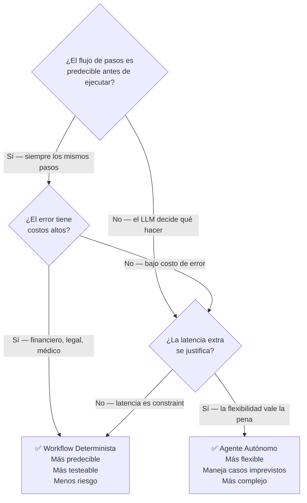
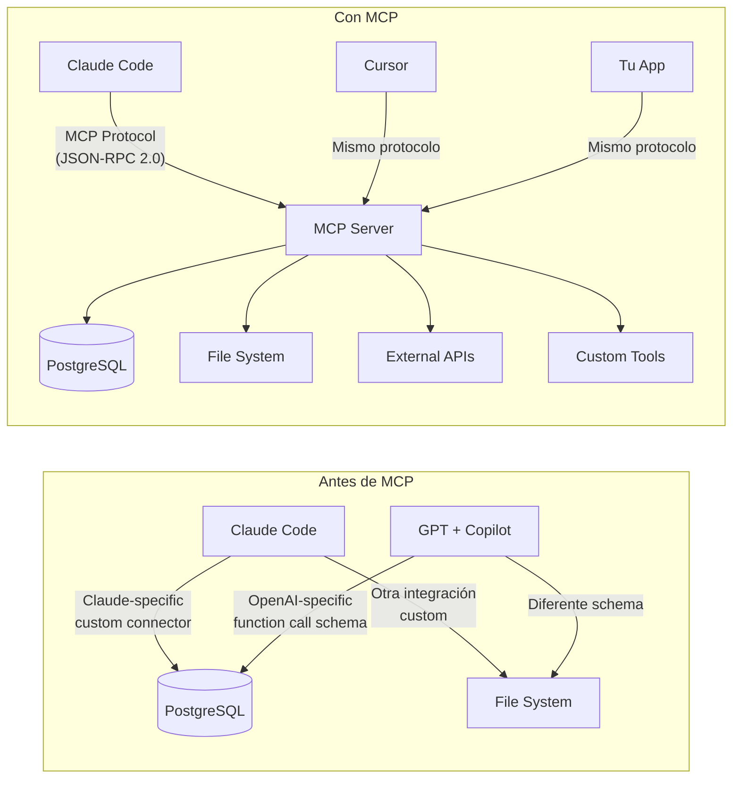

# 06-03 — Agentes y Orquestación

> **Prerequisito:** `06-02-llm-system-design.md` — los agentes son una extensión
> de los patrones de integración LLM que viste ahí. Si los patrones son capítulos
> de una historia, los agentes son cuando la historia escribe su propio final.
>
> **Stack cubierto:** Python para los conceptos (es donde vive el ecosistema),
> C# con **Microsoft Agent Framework (MAF)** — el sucesor de Semantic Kernel, GA desde abril 2026 —
> para integración en producción .NET.

---

## Sección 1 — Workflows Deterministas vs Agentes Autónomos

La distinción más importante antes de construir cualquier sistema agéntico.
Equivocarte aquí y construir un agente autónomo cuando necesitas un workflow
es como usar una motosierra para abrir un sobre.

### Workflow Determinista — el LLM como herramienta dentro de un flujo fijo

```python
async def process_document_workflow(document: str, doc_type: str) -> ProcessingResult:
    """
    Flujo determinista: siempre 4 pasos, en este orden, sin desvíos.
    El código decide la secuencia — el LLM ejecuta pasos específicos dentro de ella.
    """

    # Paso 1: Extraer resumen
    summary = await llm_call(
        f"Summarize this {doc_type} in 3 sentences: {document}",
        model="claude-haiku-4-5-20251001"
    )

    # Paso 2: Extraer entidades nombradas
    entities = await llm_call(
        f"Extract all named entities (people, companies, dates, amounts) "
        f"from: {summary}\nReturn as JSON list.",
        model="claude-haiku-4-5-20251001"
    )

    # Paso 3: Clasificar categoría — siempre se ejecuta, sin importar el contenido
    category = await llm_call(
        f"Classify this document: {summary}\n"
        f"Categories: contract, invoice, report, correspondence, other\n"
        f"Return only the category name.",
        model="claude-haiku-4-5-20251001"
    )

    # Paso 4: Almacenar — siempre se ejecuta
    await document_store.save(summary, entities, category)

    return ProcessingResult(summary=summary, entities=entities, category=category)
    # El flujo NUNCA decide saltarse un paso o agregar uno nuevo
```

**Características del workflow determinista:**
- El código decide qué pasos existen y en qué orden
- El LLM ejecuta acciones específicas dentro del flujo
- Predecible, auditable, fácil de testear
- Latencia acotada (N LLM calls × latencia media)

### Agente Autónomo — el LLM decide qué hacer en cada paso

```python
import anthropic
import json
from typing import Any

tools_definition = [
    {
        "name": "search_orders",
        "description": "Search for orders by customer, date range, or status",
        "input_schema": {
            "type": "object",
            "properties": {
                "customer_email": {"type": "string"},
                "date_from": {"type": "string", "format": "date"},
                "status": {"type": "string", "enum": ["pending", "shipped", "delivered", "cancelled"]}
            }
        }
    },
    {
        "name": "get_order_details",
        "description": "Get complete details for a specific order",
        "input_schema": {
            "type": "object",
            "properties": {"order_id": {"type": "string"}},
            "required": ["order_id"]
        }
    },
    {
        "name": "update_order_status",
        "description": "Update the status of an order. Only use for cancellations or status corrections.",
        "input_schema": {
            "type": "object",
            "properties": {
                "order_id": {"type": "string"},
                "new_status": {"type": "string", "enum": ["cancelled"]},
                "reason": {"type": "string"}
            },
            "required": ["order_id", "new_status", "reason"]
        }
    },
    {
        "name": "escalate_to_human",
        "description": "Escalate a complex case to a human agent. Use when: refunds > $500, customer very unhappy, legal mentions, or situation unclear.",
        "input_schema": {
            "type": "object",
            "properties": {
                "reason": {"type": "string"},
                "case_summary": {"type": "string"}
            },
            "required": ["reason", "case_summary"]
        }
    }
]

async def customer_support_agent(user_message: str, customer_id: str) -> str:
    """Agente autónomo: el LLM decide qué herramientas usar y en qué orden."""
    client = anthropic.Anthropic()

    messages = [{"role": "user", "content": user_message}]
    system_prompt = f"""You are a customer support agent for MiTienda.
    Customer ID: {customer_id}
    You have access to order management tools. Use them to resolve the customer's issue.
    Always be helpful, empathetic, and solution-focused.
    If you cannot resolve the issue, escalate to a human agent."""

    max_iterations = 10  # ⚠️ CRÍTICO: límite de iteraciones para evitar loops infinitos
    iteration = 0

    while iteration < max_iterations:
        response = client.messages.create(
            model="claude-sonnet-4-20250514",
            max_tokens=2000,
            system=system_prompt,
            tools=tools_definition,
            messages=messages
        )

        # El agente decidió que terminó (no necesita más herramientas)
        if response.stop_reason == "end_turn":
            # Extraer el texto final de la respuesta
            text_blocks = [b.text for b in response.content if hasattr(b, "text")]
            return " ".join(text_blocks)

        # El agente eligió usar una herramienta
        if response.stop_reason == "tool_use":
            # Agregar la respuesta del agente al historial
            messages.append({"role": "assistant", "content": response.content})

            # Ejecutar las herramientas que el agente pidió
            tool_results = []
            for block in response.content:
                if block.type == "tool_use":
                    result = await execute_tool(block.name, block.input)
                    tool_results.append({
                        "type": "tool_result",
                        "tool_use_id": block.id,
                        "content": result
                    })

            # Devolver los resultados al agente para que continúe razonando
            messages.append({"role": "user", "content": tool_results})

        iteration += 1

    # Si llegamos aquí, el agente no terminó en el límite de iteraciones
    return "Lo siento, no pude resolver tu caso. Un agente humano se comunicará contigo."

async def execute_tool(tool_name: str, tool_input: dict) -> str:
    """Dispatcher de herramientas — mantiene el control fuera del LLM."""
    match tool_name:
        case "search_orders":
            orders = await order_repo.search(**tool_input)
            return json.dumps([o.to_dict() for o in orders])
        case "get_order_details":
            order = await order_repo.get_by_id(tool_input["order_id"])
            return json.dumps(order.to_dict() if order else {"error": "Order not found"})
        case "update_order_status":
            # ⚠️ Acción de escritura — considerar si el agente debe poder hacer esto
            # sin aprobación humana. Ver Sección "Human-in-the-Loop"
            await order_service.update_status(
                tool_input["order_id"],
                tool_input["new_status"],
                tool_input["reason"]
            )
            return json.dumps({"success": True, "message": "Status updated"})
        case "escalate_to_human":
            ticket_id = await support_service.create_ticket(
                customer_id=None,  # viene del contexto
                reason=tool_input["reason"],
                summary=tool_input["case_summary"]
            )
            return json.dumps({"ticket_id": ticket_id, "escalated": True})
        case _:
            return json.dumps({"error": f"Unknown tool: {tool_name}"})
```

### La regla de decisión: ¿workflow o agente?



**Cuándo agentes son la respuesta correcta:**
- El problema no puede descomponerse en pasos fijos de antemano (casos de soporte impredecibles)
- El agente necesita adaptarse basado en lo que encuentra (research, exploración de datos)
- La flexibilidad de manejar casos edge justifica la complejidad adicional

**Cuándo NO usar agentes autónomos:**
- Errores tienen costo alto (finanzas, compliance)
- Latencia es constraint crítico (<500ms no es viable con agentes multi-step)
- El flujo es predecible — un workflow es más barato, testeable, y confiable
- No tienes un límite de iteraciones → riesgo de loop infinito y costos desbocados

---

## Sección 2 — MCP (Model Context Protocol)

MCP es el estándar emergente para integración de herramientas con LLMs.
Antes de MCP, cada integración era ad-hoc: un connector custom por cada
herramienta, incompatible entre clientes.

**La analogía correcta:** MCP es a los agentes LLM lo que HTTP es a la web.
Un protocolo estándar que permite que cualquier cliente LLM hable con cualquier
servidor de herramientas, sin que el cliente necesite saber cómo está implementado
el servidor.



**Por qué importa para un Staff en 2026:**

Un MCP Server que construyes una vez es reutilizable por cualquier cliente
que implemente el protocolo: Claude Code, Cursor, tu propia app, el IDE de
tu equipo. En lugar de integrar cada herramienta con cada cliente, integras
la herramienta una sola vez via MCP y todos los clientes la usan.

**Casos de uso donde MCP brilla:**
- Exponer la BD de producción a Claude Code para debugging (con restricciones de seguridad)
- Hacer que el agente de soporte pueda consultar el CRM sin código ad-hoc
- Integrar herramientas internas del equipo (Jira, Confluence, Grafana) con múltiples agentes

**El riesgo de MCP:** Al ser un protocolo de red, introduce superficie de ataque.
Un MCP server mal asegurado es un vector de acceso a tus sistemas. Ver `06-05` para
patrones de seguridad en MCP.

---

## Sección 3 — Microsoft Agent Framework para .NET

**Nota importante (Mayo 2026):** Semantic Kernel evolucionó a **Microsoft Agent
Framework (MAF)**, que alcanzó GA (v1.0) en abril 2026. MAF unifica Semantic Kernel
y AutoGen en un framework único. El código aquí usa las APIs actuales de MAF/SK v1.75+.
Para proyectos nuevos en .NET, MAF es el camino correcto.

### Setup y configuración

```csharp
// NuGet: Microsoft.SemanticKernel 1.75.0
// NuGet: Microsoft.SemanticKernel.Agents.Core
// NuGet: Microsoft.SemanticKernel.Connectors.AzureOpenAI

using Microsoft.SemanticKernel;
using Microsoft.SemanticKernel.Agents;
using Microsoft.SemanticKernel.ChatCompletion;
using Microsoft.SemanticKernel.Connectors.AzureOpenAI;
using System.ComponentModel;

// Configuración del Kernel — el núcleo de todo
var kernel = Kernel.CreateBuilder()
    .AddAzureOpenAIChatCompletion(
        deploymentName: configuration["AzureOpenAI:Deployment"]!,
        endpoint: configuration["AzureOpenAI:Endpoint"]!,
        apiKey: configuration["AzureOpenAI:ApiKey"]!)
    .Build();
```

### Plugins (equivalente a Tools en Python)

```csharp
/// <summary>Plugin de gestión de órdenes para el agente de soporte.</summary>
public sealed class OrderManagementPlugin
{
    private readonly IOrderRepository _orderRepository;
    private readonly IOrderService _orderService;

    public OrderManagementPlugin(
        IOrderRepository orderRepository,
        IOrderService orderService)
    {
        _orderRepository = orderRepository;
        _orderService = orderService;
    }

    [KernelFunction, Description("Search for orders by customer email or order ID")]
    public async Task<string> SearchOrdersAsync(
        [Description("Customer email address to search orders for")] string customerEmail,
        [Description("Optional: filter by status (pending, shipped, delivered, cancelled)")] string? status = null,
        CancellationToken cancellationToken = default)
    {
        IEnumerable<Order> orders = await _orderRepository.SearchAsync(
            customerEmail: customerEmail,
            status: status,
            cancellationToken: cancellationToken);

        return orders.Any()
            ? System.Text.Json.JsonSerializer.Serialize(orders.Select(o => new
                {
                    o.Id,
                    o.Status,
                    o.TotalAmount,
                    o.CreatedAt,
                    o.EstimatedDelivery
                }))
            : "No orders found for this customer.";
    }

    [KernelFunction, Description("Get complete details for a specific order by its ID")]
    public async Task<string> GetOrderDetailsAsync(
        [Description("The unique order ID (GUID format)")] string orderId,
        CancellationToken cancellationToken = default)
    {
        if (!Guid.TryParse(orderId, out Guid orderGuid))
            return "Invalid order ID format. Expected a GUID.";

        Order? order = await _orderRepository.GetByIdAsync(orderGuid, cancellationToken);

        return order is not null
            ? System.Text.Json.JsonSerializer.Serialize(order)
            : $"Order {orderId} not found.";
    }

    [KernelFunction, Description("Cancel an order. Only use when customer explicitly requests cancellation.")]
    public async Task<string> CancelOrderAsync(
        [Description("The order ID to cancel")] string orderId,
        [Description("Reason for cancellation")] string reason,
        CancellationToken cancellationToken = default)
    {
        if (!Guid.TryParse(orderId, out Guid orderGuid))
            return "Invalid order ID format.";

        try
        {
            await _orderService.CancelOrderAsync(orderGuid, reason, cancellationToken);
            return $"Order {orderId} has been cancelled. Reason recorded: {reason}";
        }
        catch (InvalidOperationException ex)
        {
            return $"Cannot cancel order: {ex.Message}";
        }
    }
}
```

### Agente con function calling automático (MAF v1.0+)

```csharp
// Registrar el plugin con las dependencias inyectadas
kernel.ImportPluginFromObject(
    new OrderManagementPlugin(
        kernel.GetRequiredService<IOrderRepository>(),
        kernel.GetRequiredService<IOrderService>()),
    pluginName: "OrderManagement");

// Crear el agente con instrucciones específicas
ChatCompletionAgent supportAgent = new()
{
    Name = "CustomerSupportAgent",
    Instructions = """
        You are a customer support agent for MiTienda.
        You have access to order management tools.
        Always:
        - Verify the order belongs to the customer before sharing details
        - Be empathetic and solution-focused
        - Explain what you're doing before taking actions
        - Ask for confirmation before cancelling any order
        If you cannot resolve the issue, clearly say so and suggest contacting human support.
        """,
    Kernel = kernel,
    Arguments = new KernelArguments(new AzureOpenAIPromptExecutionSettings
    {
        FunctionChoiceBehavior = FunctionChoiceBehavior.Auto() // El agente elige las tools automáticamente
    })
};

// Ejecutar el agente con historial de conversación
async Task<string> ProcessCustomerMessageAsync(
    string userMessage,
    ChatHistory history,
    CancellationToken cancellationToken)
{
    history.AddUserMessage(userMessage);

    StringBuilder responseBuilder = new();

    // InvokeAsync retorna un stream de mensajes (el agente puede producir múltiples)
    await foreach (AgentResponseItem<ChatMessageContent> response
        in supportAgent.InvokeAsync(history, cancellationToken: cancellationToken))
    {
        if (response.Message.Role == AuthorRole.Assistant)
        {
            responseBuilder.Append(response.Message.Content);
            history.Add(response.Message);
        }
    }

    return responseBuilder.ToString();
}
```

### Integración en ASP.NET Core (el contexto real)

```csharp
// Program.cs
builder.Services.AddSingleton<Kernel>(sp =>
{
    IConfiguration config = sp.GetRequiredService<IConfiguration>();
    return Kernel.CreateBuilder()
        .AddAzureOpenAIChatCompletion(
            config["AzureOpenAI:Deployment"]!,
            config["AzureOpenAI:Endpoint"]!,
            config["AzureOpenAI:ApiKey"]!)
        .Build();
});

builder.Services.AddScoped<OrderManagementPlugin>();
builder.Services.AddScoped<CustomerSupportAgentService>();

// CustomerSupportAgentService.cs — el servicio que orquesta el agente
public sealed class CustomerSupportAgentService
{
    private readonly Kernel _kernel;
    private readonly OrderManagementPlugin _orderPlugin;

    public CustomerSupportAgentService(Kernel kernel, OrderManagementPlugin orderPlugin)
    {
        _kernel = kernel;
        _orderPlugin = orderPlugin;
    }

    public async Task<string> HandleMessageAsync(
        string customerId,
        string userMessage,
        IEnumerable<ConversationMessage> previousMessages,
        CancellationToken cancellationToken = default)
    {
        // Crear una copia del kernel con el plugin para este request
        // (el kernel es singleton, pero queremos contexto de cliente por request)
        Kernel requestKernel = _kernel.Clone();
        requestKernel.ImportPluginFromObject(_orderPlugin, "OrderManagement");

        ChatCompletionAgent agent = new()
        {
            Name = "SupportAgent",
            Instructions = $"""
                You are helping customer with ID: {customerId}.
                Only provide information about orders belonging to this customer.
                """,
            Kernel = requestKernel,
            Arguments = new KernelArguments(new AzureOpenAIPromptExecutionSettings
            {
                FunctionChoiceBehavior = FunctionChoiceBehavior.Auto()
            })
        };

        ChatHistory history = BuildHistory(previousMessages);
        return await ProcessCustomerMessageAsync(userMessage, history, agent, cancellationToken);
    }

    private static ChatHistory BuildHistory(IEnumerable<ConversationMessage> messages)
    {
        ChatHistory history = new();
        foreach (ConversationMessage msg in messages)
        {
            if (msg.Role == "user") history.AddUserMessage(msg.Content);
            else history.AddAssistantMessage(msg.Content);
        }
        return history;
    }
}
```

---

## Sección 4 — Multi-Agent Systems

Los sistemas multi-agente son la respuesta cuando UNA de estas condiciones es verdadera:

1. La tarea tiene partes genuinamente independientes que pueden ejecutarse en paralelo
2. Partes diferentes de la tarea requieren herramientas o contexto radicalmente distintos
3. La tarea excede el context window práctico de un solo agente

Si ninguna de estas condiciones aplica, un solo agente bien configurado es más simple,
más barato, y más fácil de debuggear.

### Patrón Supervisor-Worker

```python
import asyncio
from dataclasses import dataclass
from typing import List

@dataclass
class WorkerResult:
    worker_name: str
    task: str
    findings: str
    sources: List[str]

async def supervisor_agent(business_question: str) -> str:
    """
    Supervisor: descompone el problema y coordina workers especializados.
    Workers: ejecutan tareas independientes en paralelo.
    """

    # FASE 1: El supervisor analiza y descompone
    decomposition = await llm_call(
        f"""You are a research coordinator. Given this business question,
        create a research plan with independent subtasks.

        Question: {business_question}

        Return JSON:
        {{
            "subtasks": [
                {{
                    "worker_name": "market_analyst",
                    "task": "...",
                    "data_sources": ["web_search", "financial_db"]
                }},
                {{
                    "worker_name": "competitor_analyst",
                    "task": "...",
                    "data_sources": ["web_search", "company_db"]
                }}
            ],
            "synthesis_instructions": "How to combine and present findings"
        }}""",
        model="claude-opus-4-20250514"  # Modelo más capaz para planificación estratégica
    )
    plan = json.loads(decomposition)

    # FASE 2: Workers ejecutan en paralelo — asyncio.gather para verdadero paralelismo
    worker_tasks = [
        run_worker(subtask["worker_name"], subtask["task"], subtask["data_sources"])
        for subtask in plan["subtasks"]
    ]

    results: List[WorkerResult] = await asyncio.gather(*worker_tasks)
    # ⚠️ Si un worker falla, asyncio.gather por defecto propaga la excepción
    # Para resiliencia: await asyncio.gather(*tasks, return_exceptions=True)
    # y manejar excepciones individualmente

    # FASE 3: El supervisor sintetiza los resultados de todos los workers
    synthesis = await llm_call(
        f"""Synthesize these research findings to answer the original question.

        Original question: {business_question}
        Synthesis instructions: {plan['synthesis_instructions']}

        Findings from workers:
        {json.dumps([{"worker": r.worker_name, "findings": r.findings} for r in results])}

        Provide a comprehensive, well-structured answer with citations.""",
        model="claude-opus-4-20250514"
    )

    return synthesis

async def run_worker(
    worker_name: str,
    task: str,
    data_sources: List[str]
) -> WorkerResult:
    """Worker especializado — tiene acceso solo a las herramientas que necesita."""
    available_tools = get_tools_for_sources(data_sources)

    result = await agent_loop(
        task=task,
        tools=available_tools,
        system=f"You are a {worker_name}. Complete this specific research task with precision.",
        model="claude-haiku-4-5-20251001"  # Modelo barato para workers individuales
    )

    return WorkerResult(
        worker_name=worker_name,
        task=task,
        findings=result,
        sources=data_sources
    )
```

### Human-in-the-Loop: control de acciones irreversibles

Un agente completamente autónomo que puede ejecutar acciones irreversibles
(cancelar una orden, enviar un email, modificar datos en producción) es un riesgo
inaceptable sin un mecanismo de aprobación humana.

```python
from enum import Enum

class ActionRisk(Enum):
    LOW = "low"          # Lectura, búsqueda — ejecutar inmediatamente
    MEDIUM = "medium"    # Escritura reversible — pedir confirmación al usuario
    HIGH = "high"        # Irreversible, monetario — requiere aprobación humana

TOOL_RISK_LEVELS = {
    "search_orders": ActionRisk.LOW,
    "get_order_details": ActionRisk.LOW,
    "update_order_status": ActionRisk.MEDIUM,  # Requiere confirmación del usuario
    "issue_refund": ActionRisk.HIGH,             # Requiere aprobación de supervisor
    "delete_customer": ActionRisk.HIGH,
}

async def safe_tool_execution(
    tool_name: str,
    tool_input: dict,
    conversation_context: dict
) -> str:
    """Dispatcher con control de riesgo — el LLM no ejecuta directamente."""
    risk = TOOL_RISK_LEVELS.get(tool_name, ActionRisk.HIGH)  # Default alto si desconocido

    if risk == ActionRisk.LOW:
        return await execute_tool(tool_name, tool_input)

    elif risk == ActionRisk.MEDIUM:
        # Pedir confirmación al usuario antes de ejecutar
        # Esto rompe el loop del agente y espera respuesta del usuario
        confirmation = await request_user_confirmation(
            action_description=format_action_description(tool_name, tool_input),
            conversation_context=conversation_context
        )
        if confirmation.approved:
            return await execute_tool(tool_name, tool_input)
        else:
            return f"Action cancelled by user: {confirmation.reason}"

    elif risk == ActionRisk.HIGH:
        # Crear ticket de aprobación — el humano autoriza asincrónicamente
        ticket_id = await create_approval_ticket(
            tool_name=tool_name,
            tool_input=tool_input,
            conversation_context=conversation_context
        )
        return f"This action requires human approval. Ticket #{ticket_id} created. Expected response: 1-2 business hours."
```

---

## Sección 5 — CI/CD con Agentes como Workers del Pipeline

Una aplicación práctica que los entrevistadores valoran: usar agentes de IA
como workers dentro de pipelines de CI/CD.

**Casos de uso reales en producción:**
- Code review automático con un agente especializado en seguridad
- Análisis de cambios de schema de BD antes de merge
- Generación automática de tests para código nuevo
- Análisis de impacto de un PR en el sistema

```yaml
# .github/workflows/ai-review.yml
name: AI Code Review

on:
  pull_request:
    types: [opened, synchronize]

jobs:
  ai-security-review:
    runs-on: ubuntu-latest
    steps:
      - uses: actions/checkout@v4
        with:
          fetch-depth: 0  # Necesario para obtener el diff completo

      - name: Run AI Security Review
        env:
          ANTHROPIC_API_KEY: ${{ secrets.ANTHROPIC_API_KEY }}
          GITHUB_TOKEN: ${{ secrets.GITHUB_TOKEN }}
        run: |
          python scripts/ai_security_review.py \
            --pr-number ${{ github.event.pull_request.number }} \
            --base-sha ${{ github.event.pull_request.base.sha }} \
            --head-sha ${{ github.event.pull_request.head.sha }}
```

```python
# scripts/ai_security_review.py
import subprocess
import anthropic
import argparse
from github import Github  # PyGithub

def get_pr_diff(base_sha: str, head_sha: str) -> str:
    """Obtener el diff del PR para análisis."""
    result = subprocess.run(
        ["git", "diff", f"{base_sha}...{head_sha}", "--unified=5"],
        capture_output=True, text=True
    )
    return result.stdout[:50000]  # Limitar a 50K chars para no exceder context window

def review_for_security(diff: str) -> dict:
    """El agente de seguridad analiza el diff."""
    client = anthropic.Anthropic()

    response = client.messages.create(
        model="claude-sonnet-4-20250514",
        max_tokens=2000,
        system="""You are a security code reviewer specializing in:
        - SQL injection and query injection vulnerabilities
        - Authentication and authorization bypasses
        - Secrets and credentials in code
        - Path traversal vulnerabilities
        - Insecure deserialization
        - Missing input validation

        Be concise. Only report actual issues, not theoretical ones.
        For each issue: provide the file, line number, severity (high/medium/low), and remediation.""",
        messages=[{
            "role": "user",
            "content": f"Review this PR diff for security issues:\n\n{diff}"
        }]
    )

    return {
        "findings": response.content[0].text,
        "has_issues": "HIGH" in response.content[0].text or "CRITICAL" in response.content[0].text
    }

def post_review_comment(pr_number: int, review: dict) -> None:
    """Publicar el review como comentario en el PR."""
    github = Github(os.environ["GITHUB_TOKEN"])
    repo = github.get_repo(os.environ["GITHUB_REPOSITORY"])
    pr = repo.get_pull(pr_number)

    body = f"""## 🤖 AI Security Review

{review['findings']}

*Powered by Claude Sonnet — review automated, requires human validation*"""

    pr.create_issue_comment(body)

    # Si hay issues de alta severidad, bloquear el merge
    if review["has_issues"]:
        pr.create_review(
            body="High severity security issues found. Please review before merging.",
            event="REQUEST_CHANGES"
        )

if __name__ == "__main__":
    parser = argparse.ArgumentParser()
    parser.add_argument("--pr-number", type=int, required=True)
    parser.add_argument("--base-sha", required=True)
    parser.add_argument("--head-sha", required=True)
    args = parser.parse_args()

    diff = get_pr_diff(args.base_sha, args.head_sha)
    review = review_for_security(diff)
    post_review_comment(args.pr_number, review)
```

---

## Checklist de Salida

- [ ] Puedo articular la diferencia entre workflow determinista y agente autónomo
- [ ] Sé cuándo NO usar un agente (errores costosos, latencia crítica, flujo predecible)
- [ ] Puedo implementar tool use básico en Python (ver Sección 1)
- [ ] Puedo implementar un plugin de MAF/Semantic Kernel en C# (ver Sección 3)
- [ ] Entiendo qué es MCP y por qué resuelve el problema de integración de herramientas
- [ ] Puedo diseñar un sistema Supervisor-Worker para paralelizar tareas
- [ ] Sé implementar Human-in-the-Loop para acciones irreversibles

---

> **Recursos:**
> - DeepLearning.AI: "Multi AI Agent Systems with crewAI" (curso corto)
> - Microsoft Agent Framework: https://github.com/microsoft/semantic-kernel (README actualizado)
> - Anthropic: Tool Use documentation en docs.anthropic.com
>
> **Siguiente archivo:** [[06-04-context-engineering]]
