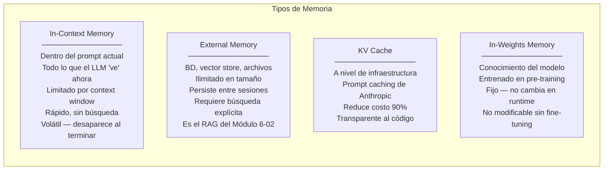

# 06-04 — Context Engineering

> **El archivo más conceptual del Módulo 6.** Aquí se sistematiza el skill que
> ya tienes intuición sobre (de tu trabajo diario con Claude Code y Codex),
> pero que la mayoría de los developers no puede articular con precisión.
> Context engineering es la diferencia entre alguien que *usa* IA y alguien
> que sabe *diseñar* cómo la IA usa la información.
>
> **Prerequisito:** Los archivos anteriores del módulo, especialmente `06-03` para
> entender los sistemas agénticos en los que se aplica este framework.

---

## Sección 1 — Context Engineering vs Prompt Engineering

En 2023-2024, "prompt engineering" era la habilidad de moda. En 2026, es una habilidad
necesaria pero insuficiente. La distinción:

### Prompt Engineering — el nivel de entrada

El arte de escribir instrucciones efectivas para un LLM en un único prompt:

```python
# Esto ES prompt engineering:
# - Elegir el tono
# - Estructurar la instrucción
# - Dar ejemplos (few-shot)
# - Especificar el formato del output

prompt = """Eres un experto en finanzas. Analiza este reporte con rigor.
Usa un tono profesional pero accesible.
Estructura la respuesta en: Resumen ejecutivo, Hallazgos clave, Recomendaciones.
Ejemplo de formato esperado:
  ## Resumen ejecutivo
  [2-3 oraciones...]

Reporte: {report_text}"""
```

Prompt engineering es importante. Pero es solo uno de los inputs.

### Context Engineering — el nivel Staff

Context engineering es el **diseño completo del sistema de información** que fluye
hacia y desde el LLM a lo largo de toda la interacción:

```
Context Engineering incluye:
  ✓ Prompt engineering (instrucciones del sistema)
  ✓ Qué documentos incluir (RAG retrieval)
  ✓ Qué excluir (límite de tokens, relevancia)
  ✓ Cómo estructurar la información para máxima efectividad
  ✓ Cómo manejar el estado entre múltiples llamadas
  ✓ Qué recordar en memoria externa
  ✓ Cómo hacer routing semántico al agente correcto
  ✓ Cuándo resetear el contexto
  ✓ Cómo gestionar el context window como recurso escaso
```

La formulación más precisa que existe en la industria es de Simon Willison (2025):
*"Context engineering es el arte de diseñar el contexto que el modelo recibe,
no solo las instrucciones que le das."*

**La analogía arquitectónica:**
Prompt engineering es diseñar una función.
Context engineering es diseñar el sistema completo que llama a esa función,
incluido qué datos le pasa, cuándo la llama, qué hace con el resultado,
y cómo maneja el estado entre llamadas.

Un Staff diseña sistemas. Por eso context engineering es la habilidad correcta.

---

## Sección 2 — Los 4 Tipos de Memoria en Sistemas Agénticos



### In-Context Memory — gestionarlo como recurso escaso

El context window es el recurso más escaso de un sistema agéntico. Cada token
que incluyes desplaza otro que podría ser más relevante.

**El error más común:** Incluir todo por si acaso.
**El principio correcto:** Solo incluir lo que el modelo necesita para el paso *actual*.

```python
from dataclasses import dataclass, field
from typing import List, Optional
import tiktoken  # O cualquier tokenizer para el modelo en uso

@dataclass
class ConversationManager:
    """
    Gestiona el contexto de conversación como recurso escaso.
    Estrategia: preservar el system prompt + resumen de historia + últimos N mensajes.
    """
    system_prompt: str
    max_context_tokens: int = 80_000  # Dejar 20K para el output del modelo
    messages: List[dict] = field(default_factory=list)
    _encoder: tiktoken.Encoding = field(
        default_factory=lambda: tiktoken.encoding_for_model("gpt-4o"),
        repr=False
    )

    def add_message(self, role: str, content: str) -> None:
        self.messages.append({"role": role, "content": content})
        self._prune_if_needed()

    def get_messages_for_api(self) -> List[dict]:
        """Devuelve los mensajes optimizados para la llamada API."""
        return self.messages

    def _count_tokens(self, text: str) -> int:
        # Aproximación: para producción, usar el tokenizer del modelo exacto
        return len(self._encoder.encode(text))

    def _estimate_total_tokens(self) -> int:
        system_tokens = self._count_tokens(self.system_prompt)
        message_tokens = sum(
            self._count_tokens(m["content"])
            for m in self.messages
        )
        return system_tokens + message_tokens

    def _prune_if_needed(self) -> None:
        """
        Estrategia de pruning:
        1. Si cabe, no hacer nada
        2. Si no cabe, resumir los mensajes más viejos
        3. Siempre preservar: system prompt, último mensaje del usuario,
           y los últimos 4 turnos de conversación
        """
        while self._estimate_total_tokens() > self.max_context_tokens:
            if len(self.messages) <= 4:
                # No podemos resumir más — la conversación es demasiado larga
                # El sistema debería haber detectado esto antes
                break

            # Resumir los 4 mensajes más viejos (excepto el system)
            old_messages = self.messages[:4]
            summary = self._summarize_messages(old_messages)

            # Reemplazar los mensajes viejos con el resumen
            self.messages = [
                {"role": "system", "content": f"[Previous conversation summary]: {summary}"}
            ] + self.messages[4:]

    def _summarize_messages(self, messages: List[dict]) -> str:
        """Resumir mensajes para comprimir el contexto."""
        # Esta llamada al LLM tiene costo — considerar caching del resumen
        import anthropic
        client = anthropic.Anthropic()
        response = client.messages.create(
            model="claude-haiku-4-5-20251001",  # Modelo barato para summarización
            max_tokens=500,
            messages=[{
                "role": "user",
                "content": f"Summarize this conversation history in 2-3 sentences, "
                           f"preserving key facts and decisions:\n"
                           f"{[m['content'] for m in messages]}"
            }]
        )
        return response.content[0].text
```

### External Memory — RAG como sistema de memoria a largo plazo

El RAG que viste en `06-02` es, desde la perspectiva de context engineering,
el sistema de **memoria a largo plazo** del agente. La conexión es directa:

```python
class AgentMemorySystem:
    """
    Combina memoria a corto plazo (in-context) con memoria a largo plazo (external).
    """

    def __init__(self, vector_store, conversation_manager: ConversationManager):
        self.vector_store = vector_store
        self.conversation = conversation_manager

    async def prepare_context_for_query(self, user_query: str) -> List[dict]:
        """
        Construir el contexto óptimo para responder la query del usuario.
        Combina: historial de conversación + recuperación de memoria a largo plazo.
        """

        # 1. Recuperar recuerdos relevantes de la memoria externa
        relevant_memories = await self.vector_store.asimilarity_search(
            user_query, k=5
        )

        # 2. Calcular cuántos tokens disponibles hay para memorias externas
        current_context_tokens = self.conversation._estimate_total_tokens()
        available_for_memories = self.conversation.max_context_tokens - current_context_tokens - 10_000  # Buffer

        # 3. Seleccionar memorias que caben en el espacio disponible
        selected_memories = []
        memory_tokens_used = 0
        for memory in relevant_memories:
            memory_tokens = self.conversation._count_tokens(memory.page_content)
            if memory_tokens_used + memory_tokens <= available_for_memories:
                selected_memories.append(memory)
                memory_tokens_used += memory_tokens
            else:
                break  # No hay más espacio

        # 4. Construir el mensaje con el contexto completo
        memory_context = "\n\n".join([m.page_content for m in selected_memories])

        messages = self.conversation.get_messages_for_api()
        if memory_context:
            # Inyectar el contexto recuperado como parte del mensaje del usuario
            messages = messages[:-1] + [{
                "role": "user",
                "content": f"""Relevant context from knowledge base:
                ---
                {memory_context}
                ---

                User question: {user_query}"""
            }]

        return messages
```

---

## Sección 3 — Context Zombies y Cómo Evitarlos

Un "context zombie" es una conversación que acumuló suficiente información
incorrecta, contradictoria, o irrelevante que el modelo empieza a degradarse
de forma silenciosa.

### Las señales que debes reconocer

**Señal 1 — Contradicción interna:**
El modelo dice algo en el mensaje 15 que contradice lo que estableció en el mensaje 5.
Esto sucede porque los mensajes del medio "compiten" con el contexto inicial
a medida que el prompt se vuelve más largo.

**Señal 2 — Drift de instrucciones:**
El sistema prompt dice "no hagas X". Al principio el modelo obedece. En el mensaje 20,
ya lo hace. Las instrucciones del system prompt se "diluyen" en contextos muy largos.

**Señal 3 — Alucinación de contexto:**
El modelo empieza a inventar detalles que no están en ningún mensaje previo,
como si "recordara" cosas que no se dijeron. El modelo rellena los gaps del
contexto degradado con sus priors.

**Señal 4 — Respuestas genéricas:**
A pesar de haber dado contexto muy específico al inicio, las respuestas se
vuelven genéricas y desconectadas del problema concreto. La "atención" del modelo
está distribuida entre demasiados tokens para mantenerse enfocada.

**Señal 5 — Latencia aumentada:**
Un síntoma técnico, no de calidad, pero correlacionado. Contextos más largos
= más tokens de input = más tiempo de procesamiento y mayor costo.

### Estrategias de mitigación

**Estrategia 1 — Dump-and-Reset (la más efectiva)**

Cuando la tarea cambia significativamente o cuando detectas las señales de arriba:
nueva sesión, contexto limpio, spec bien estructurada.

```python
def should_reset_context(conversation: ConversationManager, new_task: str) -> bool:
    """
    Heurística para decidir si resetear el contexto.
    Mejor resetear preventivamente que esperar a que se degrade.
    """
    # Reset si la conversación es demasiado larga
    if len(conversation.messages) > 20:
        return True

    # Reset si el contexto está casi lleno
    token_usage = conversation._estimate_total_tokens() / conversation.max_context_tokens
    if token_usage > 0.75:
        return True

    # Reset si la nueva tarea es muy diferente a la conversación actual
    # (requiere clasificación semántica — simplificado aquí)
    if is_semantically_different_task(new_task, conversation.messages):
        return True

    return False

def start_fresh_session(task_spec: str, system_prompt: str) -> ConversationManager:
    """
    Nueva sesión con contexto limpio.
    La spec bien escrita reemplaza el historial de conversación.
    """
    manager = ConversationManager(system_prompt=system_prompt)
    # El primer mensaje es la spec completa del estado actual
    manager.add_message("user", task_spec)
    return manager
```

**Estrategia 2 — Contexto Estructurado (State Block)**

En lugar de acumular conversación libre, mantener un bloque de estado estructurado
que se actualiza explícitamente en cada turno:

```python
import json
from dataclasses import dataclass, asdict

@dataclass
class ConversationState:
    """Estado explícito de la conversación — evita que el modelo infiera el estado del historial."""
    task: str
    completed_steps: list[str]
    current_focus: str
    key_decisions: dict[str, str]  # {decision: rationale}
    pending_items: list[str]
    constraints: list[str]  # Restricciones que no deben olvidarse

def build_stateful_prompt(state: ConversationState, user_message: str) -> str:
    """
    En lugar de pasar el historial completo, pasar el estado estructurado.
    El estado es mucho más denso en información que el historial de conversación.
    """
    return f"""
## Current Conversation State
{json.dumps(asdict(state), indent=2)}

## User Message
{user_message}

## Instructions
Always maintain and update the state as you work. When you complete a step,
add it to completed_steps. When you make a key decision, record it in key_decisions.
"""

def update_state_after_response(state: ConversationState, response: str) -> ConversationState:
    """
    El model actualiza el estado como parte de su respuesta (structured output).
    Esto es más confiable que inferir el estado del historial de conversación.
    """
    # En producción: pedir al modelo que devuelva el estado actualizado en JSON
    # y parsearlo para la próxima iteración
    pass
```

**Estrategia 3 — Checkpointing**

Guardar el estado en external memory y re-inyectarlo en cada sesión:

```python
import redis.asyncio as redis
import json
from datetime import timedelta

async def save_conversation_checkpoint(
    session_id: str,
    state: ConversationState,
    summary: str
) -> None:
    """Guardar checkpoint en Redis para recuperación en la próxima sesión."""
    redis_client = redis.from_url("redis://localhost:6379")
    checkpoint = {
        "state": asdict(state),
        "summary": summary,
        "timestamp": time.time()
    }
    # TTL: 24 horas por defecto — ajustar según el caso de uso
    await redis_client.setex(
        f"conversation:{session_id}",
        int(timedelta(hours=24).total_seconds()),
        json.dumps(checkpoint)
    )

async def restore_conversation_checkpoint(session_id: str) -> Optional[dict]:
    """Recuperar checkpoint para continuar una conversación previa."""
    redis_client = redis.from_url("redis://localhost:6379")
    data = await redis_client.get(f"conversation:{session_id}")
    return json.loads(data) if data else None

# En el inicio de cada sesión:
async def initialize_session(session_id: str, user_message: str) -> ConversationManager:
    checkpoint = await restore_conversation_checkpoint(session_id)

    if checkpoint:
        # Continuar desde donde se dejó — sin context zombie acumulado
        state = ConversationState(**checkpoint["state"])
        system_prompt = build_system_with_checkpoint(state, checkpoint["summary"])
    else:
        # Nueva sesión
        state = ConversationState(task="", completed_steps=[], ...)
        system_prompt = BASE_SYSTEM_PROMPT

    return ConversationManager(system_prompt=system_prompt)
```

---

## Sección 4 — Routing Semántico

Para sistemas con múltiples agentes o modelos, el router determina a qué agente
va cada query. La efectividad del router define la efectividad del sistema entero.

```python
from dataclasses import dataclass
from typing import Callable, Awaitable
import anthropic

@dataclass
class Route:
    name: str
    description: str           # Para el clasificador LLM
    keywords: list[str]        # Para clasificación por keywords (fallback rápido)
    handler: Callable[[str, dict], Awaitable[str]]
    model_preference: str      # Qué modelo prefiere este handler

async def semantic_router(
    query: str,
    context: dict,
    routes: list[Route]
) -> str:
    """
    Router de dos capas:
    1. Keywords (rápido, determinista, cero costo)
    2. LLM (preciso, 200ms, micro-costo)
    """

    # CAPA 1: Keyword matching para casos obvios
    query_lower = query.lower()
    for route in routes:
        if any(keyword in query_lower for keyword in route.keywords):
            return await route.handler(query, context)

    # CAPA 2: LLM para clasificación semántica de casos ambiguos
    route_descriptions = "\n".join([
        f"- {r.name}: {r.description}"
        for r in routes
    ])

    client = anthropic.Anthropic()
    classification = client.messages.create(
        model="claude-haiku-4-5-20251001",  # Modelo más barato para routing
        max_tokens=50,
        messages=[{
            "role": "user",
            "content": f"""Classify this query into exactly one route.
            Available routes:
            {route_descriptions}

            Query: {query}

            Return only the route name, nothing else."""
        }]
    )

    selected_route_name = classification.content[0].text.strip()
    selected_route = next(
        (r for r in routes if r.name == selected_route_name),
        None
    )

    if selected_route is None:
        # Fallback: usar el handler genérico
        return await routes[-1].handler(query, context)  # El último es el fallback

    return await selected_route.handler(query, context)

# Configuración del router para un sistema de soporte:
support_routes = [
    Route(
        name="ORDER_STATUS",
        description="Questions about order status, tracking, delivery time, where is my order",
        keywords=["order", "tracking", "shipped", "delivery", "arrive", "pedido", "envío"],
        handler=order_status_agent,
        model_preference="claude-haiku-4-5-20251001"
    ),
    Route(
        name="BILLING",
        description="Questions about charges, invoices, refunds, payment methods, price discrepancy",
        keywords=["billing", "charge", "refund", "invoice", "price", "cobro", "reembolso"],
        handler=billing_agent,
        model_preference="claude-sonnet-4-20250514"  # Billing es más sensible, modelo mejor
    ),
    Route(
        name="TECHNICAL",
        description="Technical product questions, setup guides, compatibility, troubleshooting",
        keywords=["how to", "setup", "configure", "error", "not working", "install"],
        handler=technical_support_rag,
        model_preference="claude-sonnet-4-20250514"
    ),
    Route(
        name="GENERAL",
        description="General inquiries, anything that doesn't fit the above categories",
        keywords=[],  # Sin keywords — es el fallback
        handler=general_agent,
        model_preference="claude-haiku-4-5-20251001"
    ),
]
```

### Monitoring del router

El router es crítico — sus errores de clasificación se amplifican hacia los handlers incorrectos.

```python
import time
from collections import defaultdict

class RouterMetrics:
    """Track routing decisions para detectar problemas en producción."""

    def __init__(self):
        self.route_counts = defaultdict(int)
        self.routing_layer_used = defaultdict(int)  # keyword vs llm
        self.routing_latency = []
        self.misrouted_samples = []  # Para revisión manual

    def record_routing(self, query: str, route: str, layer: str, latency_ms: float):
        self.route_counts[route] += 1
        self.routing_layer_used[layer] += 1
        self.routing_latency.append(latency_ms)

        # Si el 100% del tráfico va a un solo route, probablemente hay un bug
        total = sum(self.route_counts.values())
        if total > 100:
            dominant_route_pct = max(self.route_counts.values()) / total
            if dominant_route_pct > 0.90:
                # Alerta: el router está enviando casi todo a un route
                pass  # Integrar con tu sistema de alertas (Datadog, etc.)

    @property
    def keyword_hit_rate(self) -> float:
        total = sum(self.routing_layer_used.values())
        return self.routing_layer_used["keyword"] / total if total > 0 else 0
        # Una tasa alta de keyword hits es buena — es rápida y barata
        # Una tasa baja indica que los keywords son insuficientes
```

---

## Sección 5 — Context Engineering en la Práctica de un Staff

### Qué significa en tu trabajo diario con Claude Code / Codex

El context engineering no es solo para sistemas que construyes — también aplica
a cómo tú usas las herramientas de IA en tu trabajo.

**CLAUDE.md como context engineering:**
El CLAUDE.md que viste en `06-01` es context engineering aplicado a Claude Code.
Defines explícitamente qué información necesita el modelo para trabajar efectivamente
en tu codebase: la arquitectura, los patrones intencionados, la deuda técnica conocida.
Sin eso, el modelo infiere desde sus priors (código genérico de internet) en lugar
de desde tu contexto específico.

**La regla de una tarea = una sesión:**
Esta es context engineering aplicada a tu productividad. Cada sesión tiene un
contexto limpio. Si la tarea cambia, empiezas una sesión nueva con una spec
que captura el estado actual. No acumulas contexto zombie.

**Inversión en estructurar la información antes de la query:**
Un Staff invierte tiempo en estructurar la información que le da al agente —
el problema bien articulado, los constraints explícitos, los criterios de validación.
Esto es context engineering: diseñar el contexto para que el agente produzca
el output correcto, no rezar para que adivine qué quieres.

---

## Checklist de Salida

- [ ] Puedo articular la diferencia entre prompt engineering y context engineering
- [ ] Sé identificar los 4 tipos de memoria en un sistema agéntico
- [ ] Puedo implementar un ConversationManager con estrategia de pruning
- [ ] Reconozco las 5 señales de un context zombie
- [ ] Sé cuándo y cómo aplicar dump-and-reset, contexto estructurado, y checkpointing
- [ ] Puedo implementar un router de dos capas (keywords + LLM)
- [ ] Puedo conectar context engineering con mi uso diario de Claude Code y Codex

---

> **Recursos:**
> - Documentación de Anthropic sobre context window management (docs.anthropic.com)
> - OpenAI Cookbook: "Conversation history management" (github.com/openai/openai-cookbook)
> - Simon Willison's blog: posts sobre context engineering (simonwillison.net)
>
> **Siguiente archivo:** [[06-05-evaluacion-seguridad-llm]]
