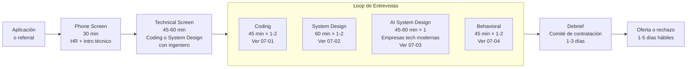
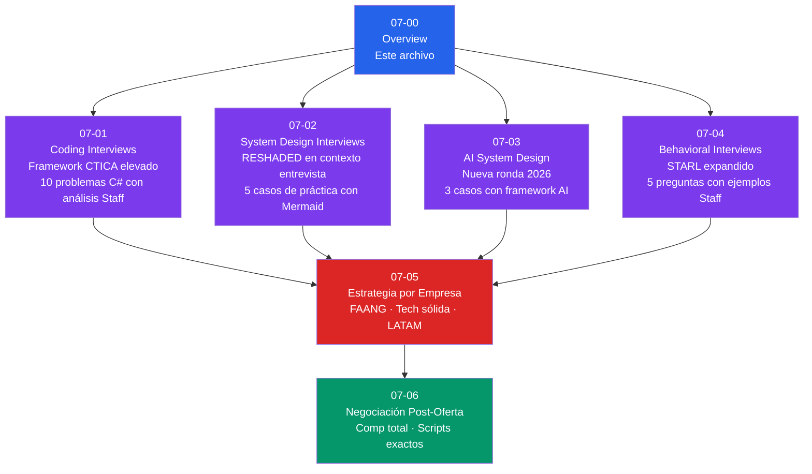

# 07-00 — Módulo 7: Entrevistas — Overview y Plan de Ejecución

> **Prerequisito:** Módulos 1-6 completos o en progreso avanzado. Este módulo no enseña más conocimiento técnico — convierte el conocimiento ya adquirido en capacidad de demostración bajo presión en 45-60 minutos reales.
>
> **El enemigo de este módulo no es la falta de conocimiento — es la brecha entre "sé hacerlo" y "lo demuestro bien bajo presión en tiempo limitado".** Ese gap es real, tiene nombre, y se resuelve con práctica estructurada, no con más estudio.

---

## Sección 1 — La Anatomía del Proceso de Entrevistas Staff en 2026

El mercado de ingeniería Staff en 2026 tiene procesos bien establecidos. No hay sorpresas en la estructura — solo en la ejecución.



### La diferencia estructural entre Tech sólida no-FAANG y FAANG

Entender esto antes de prepararte determina en qué invertir tiempo:

| Dimensión | Tech sólida no-FAANG | FAANG |
|---|---|---|
| Rondas totales | 3-4 típicamente | 4-6 (+ Bar Raiser en Amazon) |
| Peso de algoritmos | Medio — LC Medium común, Hard raro | Alto — LC Medium/Hard frecuente |
| System Design | La ronda más importante, siempre | Igual peso, mayor profundidad esperada |
| AI System Design | Creciente — mínimo 1 ronda en 2026 | Frecuente, especialmente en empresas con productos IA |
| Behavioral | Importante, menos estructurado | Muy estructurado (Amazon LPs explícitos) |
| Bar Raiser | No estándar | Amazon: sí. Google, Meta: equivalente informal |
| Timeline total | 2-4 semanas desde aplicación | 4-8 semanas |
| Feedback post-rechazo | Variable — a veces nada | Usualmente genérico o nada |
| Foco en stack específico | Puede importar | Agnóstico al stack |

**Implicación práctica para Omar:** Tu target inicial son empresas tech sólidas no-FAANG (incluyendo Nubank, Mercado Libre si aplica al contexto LATAM). El proceso es menos extremo en algoritmos pero igual de riguroso en System Design y Behavioral. El investment de preparación en esas áreas paga en ambos tracks.

---

## Sección 2 — Las Señales de Nivel Staff que Buscan los Entrevistadores

Este es el núcleo del módulo. No son las mismas señales que buscan para Senior. Un candidato Senior que ejecuta bien pasa la barra Senior. Para pasar la barra Staff, el entrevistador necesita ver comportamientos cualitativamente distintos.

### En Coding Interviews

| Señal | Senior | Staff |
|---|---|---|
| Clarificación | Pregunta el input/output edge cases | Además cuestiona el problema en términos de producción: ¿qué tan grande es n en producción real? |
| Análisis de approach | Propone la solución y la implementa | Articula explícitamente por qué descarta alternativas antes de implementar |
| Manejo de complejidad | La calcula al final | La menciona durante el diseño como constraint que guía decisiones |
| Edge cases | Los maneja si el entrevistador los señala | Los detecta y maneja antes de que el entrevistador intervenga |
| Bloqueos | Silencio o pide hints | Articula en voz alta dónde está atascado y qué está explorando |

### En System Design Interviews

| Señal | Senior | Staff |
|---|---|---|
| Inicio de la entrevista | Empieza a dibujar componentes | Dedica 5 minutos a clarificar requirements antes de dibujar |
| Trade-offs | Los menciona si se le pregunta | Los articula proactivamente con "Elegí X porque Y, la alternativa Z tendría este costo" |
| Failure modes | No los menciona a menos que se le pregunte | Describe cómo falla el sistema y cómo degrada con gracia |
| Scope del diseño | Resuelve el problema dado | Cuestiona si el problema está bien definido antes de diseñarlo |
| Profundidad | Se queda en el High Level | Anticipa qué componente querrá profundizar el entrevistador y llega ahí proactivamente |

### En Behavioral Interviews

| Señal | Senior | Staff |
|---|---|---|
| Radio de influencia en historias | "Mi equipo" | "Otros equipos, stakeholders, la organización" |
| Métricas en historias | Vagas o ausentes | Concretas: "tiempo de deploy bajó de 2h a 15 min" |
| Conflictos | Los resuelve o los evita | Los navega con criterio explícito y proceso transparente |
| Failures | Los minimiza o justifica | Los describe con honestidad y aprendizaje demostrable |
| Impacto reportado | Individual | Organizacional — "esto cambió cómo el equipo toma decisiones" |

---

## Sección 3 — Plan de Preparación 4-6 Semanas

Este plan asume que tienes el conocimiento de los módulos 1-6. No es un plan de estudio — es un plan de conversión de conocimiento en desempeño bajo presión.

### Semanas 1-2: Consolidación y Diagnóstico

**Objetivo:** Identificar gaps reales de ejecución, no de conocimiento.

```
Día 1-3: Revisa los checklists de salida de todos los módulos
         Identifica qué no puedes hacer sin consultar — eso es el gap real

Día 4-7: Coding — 5 problemas LC Medium por día con timer estricto de 45 min
         Usa el framework CTICA de 02-07 incluso practicando solo
         Si tardas > 30 min en un Medium, es señal de gap en ese patrón

Día 8-10: System Design — diseña 2-3 casos completos con RESHADED
          Sin notas. Timer de 45 min. Grábate en audio si puedes.
          El objetivo es encontrar dónde te bloqueas, no producir un diseño perfecto

Día 11-14: Behavioral — escribe tus 5 historias STARL
           Tiempo de escritura, no improvisation
           Las historias que no puedes escribir no las puedes contar bien bajo presión
```

### Semanas 3-4: Práctica Intensiva

```
Coding:
- 5-8 problemas Medium/día, algunos Hard
- Foco en los patrones donde el diagnóstico mostró gaps
- Empezar mock interviews completas con cronómetro estricto

System Design:
- Un caso de práctica completo al día (45-60 min)
- Rotar entre los 5 casos de 07-02 y los 3 de 07-03
- Practicar en voz alta aunque estés solo — la verbalización es diferente al pensamiento

Behavioral:
- Refinar las 5 historias STARL con métricas concretas
- Practicar el delivery en voz alta (no en papel)
- Cronometrar — cada historia debe tomar 2-3 minutos, no 5+
```

### Semanas 5-6 (si aplica): Simulación y Empresa Específica

```
Mock interviews completos:
- Coding + System Design + Behavioral en un mismo día
- Simula la fatiga real del loop de entrevistas
- Usa el prompt de mock interview de 02-07 con Claude

Investigación de empresa:
- Glassdoor y Blind para el proceso específico
- Stack tecnológico del equipo (GitHub, job descriptions)
- Si es FAANG: mapear tus historias a los LPs de la empresa (ver 07-05)

Negociación:
- Investigar comp range en Levels.fyi antes de recibir la oferta
- Tener número objetivo claro — sin este dato, no puedes negociar bien (ver 07-06)
```

---

## Sección 4 — Criterios de "Listo para Entrevistar"

No "me siento seguro" — criterios medibles. Esta distinción importa porque la sensación de seguridad no correlaciona con el desempeño real bajo presión.

### Listo para entrevistar en Coding cuando:
- [ ] Resuelves LC Medium en < 25 minutos (incluyendo clarificación, análisis, testing, complejidad)
- [ ] Articulas el análisis de complejidad de tiempo Y espacio sin que te lo pregunten
- [ ] Cuando te bloqueas, tienes protocolo de deblocking activo (ver 07-01 Sección 3)
- [ ] No tienes silencio de > 2 minutos sin comentario durante la resolución

### Listo para entrevistar en System Design cuando:
- [ ] Diseñas Twitter Feed con Hybrid Fan-Out sin que el entrevistador lo sugiera
- [ ] Articulas trade-offs proactivamente en al menos 3 componentes de cualquier diseño
- [ ] Haces estimaciones de tráfico, storage y bandwidth en voz alta en < 5 minutos
- [ ] Describes failure modes de tu diseño sin que te pregunten

### Listo para entrevistar en Behavioral cuando:
- [ ] Tienes 5 historias STARL escritas con métricas concretas
- [ ] Cada historia toma 2-3 minutos en el delivery, no más
- [ ] Tienes al menos 1 historia de failure con aprendizaje real (no maquillada)
- [ ] Puedes mapear cada historia a múltiples preguntas diferentes

### Señal de no-listo (aunque sientas que sí):
- Describes el proceso técnico de Raft en > 5 minutos cuando debería ser 2 minutos
- Empiezas a diseñar un sistema antes de preguntar requirements
- Tus historias behavioral no tienen métricas o el impacto es solo individual
- Tardas > 15 minutos en un LC Easy

---

## Sección 5 — La Psicología de la Entrevista Staff

Un aspecto que raramente se discute en guías técnicas pero que impacta el desempeño real:

### El entrevistador está de tu lado (mayoritariamente)

Los entrevistadores están entrenados para ayudarte a mostrar tu mejor nivel. Un entrevistador que te da hints no está siendo condescendiente — está haciendo su trabajo. Negarte a recibir hints, o recibirlos pero ignorarlos por orgullo, es una señal negativa.

**La actitud correcta:** "El entrevistador quiere que pase — mi trabajo es darle las señales que necesita para justificar una contratación."

### La señal más destructiva que puedes dar

Silencio de 3+ minutos mirando la pantalla. Cualquier cosa es mejor: describir dónde estás atascado, proponer un approach subóptimo, pedir clarificación innecesaria. El silencio comunica que no tienes proceso — que eres el tipo de developer que en producción se bloquea y no escala el problema.

### La diferencia entre nervios y falta de preparación

Los nervios son normales y el entrevistador los conoce. La falta de preparación se ve diferente: es cuando la persona puede responder preguntas teóricas pero no puede ejecutar el proceso bajo tiempo. El único antídoto para la segunda es práctica con timer real, no más estudio.

---

## Sección 6 — Mapa del Módulo 7



**Orden de estudio dentro del módulo:**
1. Este archivo — una sola lectura para tener el mapa
2. 07-01 + 07-02 en paralelo con práctica diaria (son independientes)
3. 07-03 después de tener 07-02 sólido (es una extensión)
4. 07-04 en cualquier momento — no tiene dependencias técnicas
5. 07-05 cuando tengas empresa objetivo concreta
6. 07-06 cuando tengas oferta o proceso avanzado

---

## Checklist de Salida del Overview

- [ ] Entiendes la diferencia entre el proceso FAANG y tech sólida no-FAANG
- [ ] Tienes claro en qué semana de preparación estás
- [ ] Puedes articular 2 señales Staff vs Senior en cada tipo de entrevista
- [ ] Tienes los criterios de "listo para entrevistar" memorizados

---

> **Siguiente paso:** [07-01-coding-interviews.md](./07-01-coding-interviews.md) — El framework completo con los 10 problemas que todo Staff debe resolver con fluidez, y el proceso que diferencia una respuesta promedio de una respuesta que genera oferta.
