# 07-01 — Coding Interviews: Framework de Ejecución Staff

> **Referencia base:** [02-07-simulacion-entrevistas-coding.md](../modulo-02-algoritmos-patrones/02-07-simulacion-entrevistas-coding.md) — Este archivo extiende ese framework con el lens de nivel Staff. Si no has leído 02-07, lee ese primero. Aquí se asume que ya conoces CTICA y se profundiza en qué hace diferente a un candidato que recibe oferta Staff vs uno que la pierde por milímetros.
>
> **Propósito:** No memorizar soluciones — internalizar el proceso que genera soluciones correctas bajo presión con un entrevistador mirando.

---

## Sección 1 — El Framework CTICA en Modo Staff

El framework CTICA (Clarificar → Think → Implementar → Comprobar → Análisis) está cubierto en detalle en 02-07. El análisis de nivel Staff aplica a cada fase: la diferencia no es el qué sino el cómo y el por qué.

### C — Clarificar: El Staff va más allá de los edge cases del input

**Nivel promedio clarifica:**
- "¿El array puede estar vacío?"
- "¿Los números pueden ser negativos?"
- "¿Hay duplicados?"

Estas preguntas son necesarias pero no suficientes. Son las preguntas que cualquier dev que estudió LeetCode hace. El entrevistador ya las espera.

**Nivel Staff además hace:**
- "¿Necesito optimizar para tiempo o espacio? ¿Hay un constraint de memoria del entorno de ejecución?"
- "¿Qué tan grande puede ser n en producción real? ¿Estamos hablando de miles o millones de elementos?"
- "¿Este problema tiene un caso de uso real que deba considerar? ¿Hay patrones de acceso o distribución que cambien el approach óptimo?"
- "¿Puedo modificar el input o debo preservarlo? [Pregunta si el contexto lo hace relevante]"

La última pregunta — sobre el caso de uso real — sorprende sistemáticamente a los entrevistadores. Muestra que piensas en producción, no en LeetCode. Un entrevistador de nivel Staff va a notar esa pregunta y va a responder con información que hace el problema más rico.

⚠️ **Anti-patrón:** Hacer 8 preguntas de clarificación antes de mostrar que entendiste el problema. Clarifica lo esencial (2-4 preguntas), luego avanza. El entrevistador quiere ver que puedes trabajar con ambigüedad razonable.

### T — Think: El Staff articula por qué descarta opciones

**Nivel promedio:**
> "Voy a usar un HashMap para O(1) lookup."

El entrevistador no sabe por qué llegaste ahí. No puede darte crédito por el razonamiento que no vocalizaste.

**Nivel Staff:**
> "La solución naive con fuerza bruta busca todos los pares — dos loops anidados, O(n²) tiempo. 
> Puedo mejorarlo porque estoy buscando el complemento de cada elemento — eso significa que puedo 
> guardar lo que ya vi y buscar el complemento en O(1). HashMap es la estructura correcta para eso.
> Total: O(n) tiempo, O(n) espacio. Si hubiera restricción de memoria, tendría que ver una 
> alternativa con sorting — O(n log n) tiempo, O(1) espacio — pero con dos variables como 
> Two Pointers si el array estuviera ordenado. Sin esa restricción, voy con HashMap."

Eso es lo que diferencia. El entrevistador vio que:
1. Sabes identificar la complejidad naive
2. Sabes identificar el insight que permite mejorarlo
3. Consideras alternativas y las descartaste con criterio (no por desconocimiento)
4. Sabes el trade-off espacio-tiempo antes de implementar

### I — Implementar: El Staff escribe la estructura antes que el código

El error más común: empezar a escribir código sin el skeleton mental claro. El candidato Staff hace lo opuesto: escribe comentarios de la estructura primero, luego llena el detalle.

```csharp
// ANTI-PATRÓN: código de inmediato sin estructura
public int[] TwoSum(int[] nums, int target)
{
    var map = new Dictionary<int, int>(); // ¿qué guarda exactamente?
    for (int i = 0; i < nums.Length; i++)
    {
        if (map.ContainsKey(target - nums[i])) // funciona, pero ¿el entrevistador sabe por qué?
            return new[] { map[target - nums[i]], i };
        map[nums[i]] = i;
    }
    return Array.Empty<int>();
}

// PATRÓN STAFF: estructura primero, luego código
public int[] TwoSum(int[] nums, int target)
{
    // Mapa: valor → índice. Guardamos lo que ya vimos para buscar complemento en O(1)
    var seen = new Dictionary<int, int>();

    for (int i = 0; i < nums.Length; i++)
    {
        int complement = target - nums[i]; // El valor que busco para completar el par

        // ¿Ya vi el complemento antes? Si sí, tengo mi respuesta
        if (seen.TryGetValue(complement, out int complementIndex))
            return new[] { complementIndex, i };

        // Si no, guardo el actual para búsquedas futuras
        seen[nums[i]] = i;
    }

    return Array.Empty<int>(); // Garantizado que hay solución según el problema — este caso no debería ocurrir
}
```

La versión Staff no solo funciona — comunica la intención. El entrevistador puede seguir tu razonamiento.

### C — Comprobar: El Staff prueba con casos que pueden romper la solución

**Nivel promedio:** Corre el ejemplo del enunciado.

**Nivel Staff:** Identifica los casos que podrían romper la lógica:
- El caso del enunciado (sanity check)
- Array de 1 elemento si aplica
- Todos los elementos iguales
- El resultado en los extremos del array (índice 0 y último índice)
- Si hay duplicados y el problema dice que puede haberlos

### A — Análisis: El Staff es específico sobre las constantes

**Nivel promedio:** "Es O(n log n)."

**Nivel Staff:**
> "El sort inicial es O(n log n). El single pass posterior es O(n). 
> La complejidad total está dominada por el sort: O(n log n) en tiempo.
> En espacio: O(1) si el sort es in-place — Array.Sort de .NET usa introsort que es in-place — 
> o O(log n) por el call stack de la recursión interna. Si usáramos LINQ OrderBy, sería O(n) 
> porque crea una nueva secuencia."

Mencionar las constantes de la plataforma específica (C# en este caso) sin que te lo pregunten es una señal clara de madurez.

---

## Sección 2 — Los 10 Problemas que Todo Staff Debe Resolver con Fluidez

Estos 10 problemas son la práctica de calibración. No son los únicos que debes saber — son los que verifican que los patrones fundamentales están internalizados. Si tardas más de los tiempos indicados, hay un gap en ese patrón que necesita trabajo específico antes de entrevistar.

### Problema 1 — Two Sum (Calibración de HashMap)

**Patrón:** HashMap para complemento en O(1)  
**Tiempo objetivo:** < 10 minutos completo (incluyendo clarificación y análisis)  
**Señal Staff:** Si tardas > 10 min en este problema, hay problemas de base urgentes.

```csharp
public int[] TwoSum(int[] nums, int target)
{
    // Invariante: seen[v] = índice donde vimos v por primera vez
    var seen = new Dictionary<int, int>();

    for (int i = 0; i < nums.Length; i++)
    {
        int complement = target - nums[i];

        // TryGetValue en lugar de ContainsKey + indexer: una sola lookup en el HashMap
        if (seen.TryGetValue(complement, out int j))
            return new[] { j, i };

        // TryAdd: no sobreescribe si ya existe. El primer índice es el correcto.
        seen.TryAdd(nums[i], i);
    }

    return Array.Empty<int>(); // El problema garantiza solución única — este path no ocurre
}
// Tiempo: O(n) | Espacio: O(n)
```

**Señal Staff en la ejecución:** Mencionar proactivamente por qué `TryGetValue` es preferible a `ContainsKey + indexer` — evita dos lookups en el HashMap en lugar de una.

---

### Problema 2 — Longest Substring Without Repeating Characters (Sliding Window Variable)

**Patrón:** Sliding Window con ventana variable  
**Tiempo objetivo:** < 20 minutos

```csharp
public int LengthOfLongestSubstring(string s)
{
    // seen[c] = última posición donde vimos c
    var seen = new Dictionary<char, int>();
    int maxLen = 0;
    int left = 0; // Inicio de la ventana actual

    for (int right = 0; right < s.Length; right++)
    {
        char c = s[right];

        // El char está en la ventana actual (no solo en el diccionario)
        // lastPos >= left es la condición crítica — puede estar en el dic pero fuera de la ventana
        if (seen.TryGetValue(c, out int lastPos) && lastPos >= left)
            left = lastPos + 1; // Mover el inicio más allá de la última ocurrencia

        seen[c] = right; // Actualizar (o insertar) la última posición
        maxLen = Math.Max(maxLen, right - left + 1);
    }

    return maxLen;
}
// Tiempo: O(n) | Espacio: O(min(n, charset_size))
```

**Señal Staff:** Articular por qué `lastPos >= left` es necesario. Sin esa condición, el código haría `left = lastPos + 1` aunque el char esté antes del inicio de la ventana actual, reduciendo la ventana incorrectamente.

---

### Problema 3 — Binary Search (Base + Variante de Overflow)

**Patrón:** Binary Search  
**Tiempo objetivo:** < 10 minutos

```csharp
public int Search(int[] nums, int target)
{
    int left = 0, right = nums.Length - 1;

    while (left <= right)
    {
        // left + (right - left) / 2 evita overflow vs (left + right) / 2
        // (left + right) puede superar int.MaxValue si ambos son grandes
        // En C# no hay overflow silencioso en int por defecto en modo checked
        // pero el patrón es correcto y universal
        int mid = left + (right - left) / 2;

        if (nums[mid] == target) return mid;
        if (nums[mid] < target)  left = mid + 1;
        else                     right = mid - 1;
    }

    return -1;
}
// Tiempo: O(log n) | Espacio: O(1)
```

**Señal Staff:** Mencionar el overflow sin que te lo pregunten. En Java e idiomas de 32-bit, `(left + right)` con valores cercanos a `int.MaxValue` puede desbordarse. En C# el comportamiento depende del contexto checked/unchecked, pero la práctica de usar `left + (right - left) / 2` es universalmente correcta y demuestra conciencia del problema.

---

### Problema 4 — Merge Intervals

**Patrón:** Merge Intervals (sort + single pass)  
**Tiempo objetivo:** < 20 minutos

```csharp
public int[][] Merge(int[][] intervals)
{
    if (intervals.Length <= 1) return intervals;

    // Ordenar por start. Sin este paso, no podemos comparar con el last de merged.
    Array.Sort(intervals, (a, b) => a[0].CompareTo(b[0]));

    var merged = new List<int[]> { intervals[0] };

    for (int i = 1; i < intervals.Length; i++)
    {
        var last = merged[^1]; // El último intervalo en merged — C# ^1 = last index

        if (intervals[i][0] <= last[1])
        {
            // Solapamiento — extender el end si es necesario
            last[1] = Math.Max(last[1], intervals[i][1]);
        }
        else
        {
            // Sin solapamiento — agregar como nuevo intervalo
            merged.Add(intervals[i]);
        }
    }

    return merged.ToArray();
}
// Tiempo: O(n log n) por el sort. Single pass posterior: O(n). Total: O(n log n)
// Espacio: O(n) para el resultado — O(log n) si contamos solo el sort
```

**Señal Staff:** Articular antes de codificar por qué el sort es necesario. Sin orden, un intervalo `[3,5]` seguido de `[1,4]` no se detectaría como solapamiento porque no estaríamos comparando con el correcto.

---

### Problema 5 — Binary Tree Level Order Traversal (BFS con Level Tracking)

**Patrón:** BFS con snapshot de nivel  
**Tiempo objetivo:** < 20 minutos

```csharp
public IList<IList<int>> LevelOrder(TreeNode root)
{
    var result = new List<IList<int>>();
    if (root is null) return result;

    var queue = new Queue<TreeNode>();
    queue.Enqueue(root);

    while (queue.Count > 0)
    {
        // Snapshot del tamaño del nivel ANTES de procesar
        // Crítico: si no guardamos esto, los nodos del nivel siguiente
        // que agregamos al queue durante el loop contaminarían la cuenta
        int levelSize = queue.Count;
        var level = new List<int>();

        for (int i = 0; i < levelSize; i++)
        {
            var node = queue.Dequeue();
            level.Add(node.val);

            if (node.left is not null)  queue.Enqueue(node.left);
            if (node.right is not null) queue.Enqueue(node.right);
        }

        result.Add(level);
    }

    return result;
}
// Tiempo: O(n) — visitamos cada nodo una vez | Espacio: O(n) — el nivel más ancho puede tener n/2 nodos
```

**Señal Staff:** Explicar el `levelSize = queue.Count` snapshot antes de codificarlo. El entrevistador quiere oír "guardo el tamaño del nivel antes de empezar a procesar porque voy a agregar nodos al queue durante el loop — sin ese snapshot, no puedo separar niveles".

---

### Problema 6 — Coin Change (DP Unbounded Knapsack)

**Patrón:** Dynamic Programming — estado y transición explícitos  
**Tiempo objetivo:** < 25 minutos

```csharp
public int CoinChange(int[] coins, int amount)
{
    // dp[i] = mínimas monedas para hacer la cantidad exacta i
    // Estado: cantidad actual i
    // Transición: dp[i] = min(dp[i], dp[i - coin] + 1) para cada coin ≤ i
    var dp = new int[amount + 1];

    // Inicializar con "infinito" — ningún valor real puede ser mayor que amount + 1
    // (necesitaríamos al menos amount monedas de valor 1 para hacer 'amount')
    Array.Fill(dp, amount + 1);

    dp[0] = 0; // Base case: 0 monedas para hacer 0

    for (int i = 1; i <= amount; i++)
    {
        foreach (int coin in coins)
        {
            if (coin <= i) // Solo podemos usar esta moneda si no excede el amount actual
                dp[i] = Math.Min(dp[i], dp[i - coin] + 1);
        }
    }

    // Si dp[amount] > amount, no hay solución (infinito no se actualizó)
    return dp[amount] > amount ? -1 : dp[amount];
}
// Tiempo: O(amount × coins.Length) | Espacio: O(amount)
```

**Señal Staff:** Articular el estado y la transición antes de codificar. "dp[i] representa el mínimo número de monedas para hacer exactamente i. La transición es: para cada moneda, si puedo usarla (coin ≤ i), considero si dp[i - coin] + 1 es mejor que lo que tengo. Esto cubre el caso unbounded porque puedo reusar la misma moneda múltiples veces."

---

### Problema 7 — Number of Islands (DFS en Grid)

**Patrón:** DFS en grid con modificación del input  
**Tiempo objetivo:** < 20 minutos

```csharp
public int NumIslands(char[][] grid)
{
    int islands = 0;

    for (int r = 0; r < grid.Length; r++)
    {
        for (int c = 0; c < grid[0].Length; c++)
        {
            if (grid[r][c] == '1')
            {
                islands++;
                Sink(grid, r, c); // "Hundir" toda la isla conectada
            }
        }
    }

    return islands;
}

// Modifica el grid — preguntar al entrevistador si esto es aceptable
private void Sink(char[][] grid, int r, int c)
{
    // Condición de salida: fuera de bounds o ya agua (incluye celdas ya visitadas marcadas '0')
    if (r < 0 || r >= grid.Length ||
        c < 0 || c >= grid[0].Length ||
        grid[r][c] != '1') return;

    grid[r][c] = '0'; // Marcar como visitada — "hundir" la celda

    // Explorar los 4 vecinos
    Sink(grid, r + 1, c);
    Sink(grid, r - 1, c);
    Sink(grid, r, c + 1);
    Sink(grid, r, c - 1);
}
// Tiempo: O(m × n) — visitamos cada celda como máximo una vez | Espacio: O(m × n) por call stack en caso degenerado
```

**Señal Staff:** Antes de escribir `grid[r][c] = '0'`, decir explícitamente "voy a modificar el input para marcar las celdas visitadas — ¿es esto aceptable o necesito un visited set separado?". Esta pregunta demuestra conciencia de side effects, que en producción es crítico.

---

### Problema 8 — Course Schedule II (Topological Sort — Kahn's)

**Patrón:** Topological Sort con detección de ciclo  
**Tiempo objetivo:** < 30 minutos

```csharp
public int[] FindOrder(int numCourses, int[][] prerequisites)
{
    // Construir grafo y calcular in-degrees
    var inDegree = new int[numCourses];
    var adj = new List<int>[numCourses];
    for (int i = 0; i < numCourses; i++)
        adj[i] = new List<int>();

    foreach (var pre in prerequisites)
    {
        // pre[1] → pre[0]: para tomar pre[0], necesitas pre[1] primero
        adj[pre[1]].Add(pre[0]);
        inDegree[pre[0]]++;
    }

    // Empezar con todos los nodos sin prerequisito
    var queue = new Queue<int>();
    for (int i = 0; i < numCourses; i++)
        if (inDegree[i] == 0) queue.Enqueue(i);

    var order = new List<int>();
    while (queue.Count > 0)
    {
        int course = queue.Dequeue();
        order.Add(course);

        foreach (int next in adj[course])
        {
            inDegree[next]--;
            if (inDegree[next] == 0) // Ya no tiene prerequisitos pendientes
                queue.Enqueue(next);
        }
    }

    // Si no procesamos todos los cursos, hay un ciclo (cursos con dependencia circular)
    return order.Count == numCourses ? order.ToArray() : Array.Empty<int>();
}
// Tiempo: O(V + E) donde V = cursos, E = prerequisites | Espacio: O(V + E)
```

**Señal Staff:** Articular antes de codificar cómo se detecta el ciclo: "Al final, si `order.Count != numCourses`, significa que hay cursos que nunca llegaron a in-degree 0 — están en un ciclo. En ese caso el orden topológico no existe y devuelvo array vacío."

---

### Problema 9 — Find Median from Data Stream (Two Heaps)

**Patrón:** Two Heaps para mediana dinámica  
**Tiempo objetivo:** < 35 minutos (es el problema más complejo de los 10)

```csharp
public class MedianFinder
{
    // Invariante:
    // _lower contiene la mitad inferior de los números — queremos el MAX (simular max-heap negando prioridades)
    // _upper contiene la mitad superior — queremos el MIN (min-heap natural de PriorityQueue .NET)
    // Condición: _lower.Count == _upper.Count  O  _lower.Count == _upper.Count + 1
    // Condición: max(_lower) ≤ min(_upper) — siempre

    private readonly PriorityQueue<int, int> _lower = new(); // Max-heap simulado (prioridad negada)
    private readonly PriorityQueue<int, int> _upper = new(); // Min-heap natural

    public void AddNum(int num)
    {
        // Por defecto, agregar a _lower (mitad inferior)
        _lower.Enqueue(num, -num); // Negar para simular max-heap

        // Verificar que el invariante max(_lower) ≤ min(_upper) se mantiene
        // Si el máximo de _lower es mayor que el mínimo de _upper, mover el max de _lower a _upper
        if (_upper.Count > 0 && -_lower.Peek() > _upper.Peek())
        {
            (int val, _) = _lower.Dequeue(); // val es el elemento (PQ en C# devuelve (element, priority))
            _upper.Enqueue(-val, -val);       // Revertir la negación al moverlo
        }

        // Rebalancear si los tamaños están muy desbalanceados
        // _lower puede tener a lo más 1 elemento más que _upper
        if (_lower.Count > _upper.Count + 1)
        {
            (int val, _) = _lower.Dequeue();
            _upper.Enqueue(-val, -val);
        }
        else if (_upper.Count > _lower.Count)
        {
            (int val, _) = _upper.Dequeue();
            _lower.Enqueue(-val, val); // Negar para max-heap
        }
    }

    public double FindMedian()
    {
        if (_lower.Count == _upper.Count)
            return (-_lower.Peek() + _upper.Peek()) / 2.0;

        // _lower tiene 1 elemento más — la mediana es su máximo
        return -_lower.Peek();
    }
}
// AddNum: O(log n) | FindMedian: O(1)
// Espacio: O(n) para los dos heaps
```

**Señal Staff:** Antes de escribir una línea, articular el invariante: "Voy a mantener dos heaps: _lower con la mitad inferior (quiero su máximo para la mediana) y _upper con la mitad superior (quiero su mínimo). El invariante es que max(_lower) ≤ min(_upper) siempre, y los tamaños difieren en a lo más 1. La mediana es el máximo de _lower si son de distinto tamaño, o el promedio de los tops si son iguales."

⚠️ **Nota de C#:** `PriorityQueue<TElement, TPriority>` en .NET 6+ es un min-heap por defecto. Para simular max-heap, negamos la prioridad. El método `Dequeue()` retorna el elemento (no la prioridad), y `Peek()` retorna el elemento del nodo con la prioridad más baja. Esto puede causar confusión — aclararlo con el entrevistador.

---

### Problema 10 — Word Break (DP con HashSet)

**Patrón:** Dynamic Programming 1D  
**Tiempo objetivo:** < 25 minutos

```csharp
public bool WordBreak(string s, IList<string> wordDict)
{
    // dp[i] = true si s[0..i-1] puede segmentarse completamente con palabras del diccionario
    // Base case: dp[0] = true (string vacío siempre es válido)
    var wordSet = new HashSet<string>(wordDict); // O(1) lookup
    var dp = new bool[s.Length + 1];
    dp[0] = true;

    for (int i = 1; i <= s.Length; i++)
    {
        // Probar todos los posibles puntos de corte j (0 a i)
        // Si dp[j] es true Y s[j..i-1] es una palabra válida → dp[i] = true
        for (int j = 0; j < i; j++)
        {
            if (dp[j] && wordSet.Contains(s[j..i]))
            {
                dp[i] = true;
                break; // Ya encontramos una segmentación válida hasta i — no necesitamos más
            }
        }
    }

    return dp[s.Length];
}
// Tiempo: O(n² × m) donde m = longitud promedio de palabras (por el Contains que es O(m))
// Simplificado: O(n²) si asumimos palabras cortas | Espacio: O(n)
```

**Señal Staff:** Articular el estado antes de codificar: "`dp[i]` representa si podemos segmentar perfectamente el substring `s[0..i-1]`. La transición es: `dp[i]` es true si existe algún `j` tal que `dp[j]` es true Y la palabra `s[j..i]` está en el diccionario. El caso base `dp[0] = true` representa que el string vacío siempre es válido."

---

## Sección 3 — Cuando te Bloqueas: El Protocolo Exacto

El silencio de 3 minutos mirando la pantalla es la señal más destructiva que puedes dar. No importa que eventualmente llegues a la solución — el entrevistador ya decidió que no tienes proceso.

### Lo que dice el candidato que recibe oferta cuando se bloquea:

> "Me está costando ver la solución óptima directamente. Voy a explorar el caso más simple 
> primero para ganar intuición — si el array tuviera solo 2 elementos, ¿cómo lo resolvería?"
> [trabaja el caso de 2 elementos en voz alta]
> "Bien. ¿Y si agrego un tercer elemento? El mismo approach, ¿funciona?"
> [trabaja hacia el caso general]
> "Veo el patrón: [describe el insight que encontró]. Eso me sugiere [estructura/patrón]."

### El protocolo de deblocking en 4 pasos:

1. **Declara que estás atascado (no en silencio):** "No tengo la solución óptima inmediatamente clara."
2. **Regresa al caso más simple:** "Déjame resolver el caso con n=2 para ganar intuición."
3. **Trabaja hacia arriba:** "¿Funciona si agrego n=3? ¿n=4?"
4. **Identifica el patrón emergente:** "El patrón que veo es... eso sugiere..."

### Lo que nunca decir:

- Silencio de > 2 minutos
- "No sé." (sin seguimiento inmediato de exploración)
- "Creo que es DP" sin poder articular el estado y la transición

### Si el entrevistador te da un hint:

Recíbelo. Usarlo bien es señal positiva. "Ah, eso me sugiere que [implicación del hint] — entonces podría [approach]." Ignorarlo o resistirlo por orgullo es una señal negativa.

---

## Sección 4 — Gestión del Tiempo: Los 45 Minutos

```mermaid
gantt
    title 45 Minutos de Coding Interview
    dateFormat mm
    axisFormat %M min

    Clarificar (CTICA: C)    : 00, 5m
    Think en voz alta (T)    : 05, 5m
    Implementar (I)          : 10, 20m
    Comprobar (C)            : 30, 7m
    Análisis de complejidad  : 37, 5m
    Buffer / Follow-up       : 42, 3m
```



**Si ves que vas lento en Implementar:**
> "Voy un poco más lento de lo esperado en [parte específica]. Voy a simplificar 
> esta sección ahora y puedo refinarlo si tenemos tiempo."

Siempre mejor: solución funcional incompleta en estilo > solución correcta pero incomprensible.

**Si terminas antes:**
El entrevistador casi siempre tiene un follow-up preparado: "¿Cómo cambiaría si el input pudiera ser de 10M elementos?", "¿Cómo lo harías sin espacio extra?", "¿Qué pasa si el array está parcialmente ordenado?". Anticípate: "¿Hay alguna optimización adicional que quieras explorar o alguna variante?"

---

## Sección 5 — Señales de Nivel Staff en Coding: El Resumen Ejecutivo

Lo que separa una entrevista que genera oferta de una que genera rechazo, en orden de impacto:

1. **Pensar en voz alta todo el tiempo** — el entrevistador necesita escuchar tu proceso, no solo ver el resultado
2. **Articular trade-offs antes de implementar** — no después de que el entrevistador te pregunte
3. **Detectar edge cases antes de que el entrevistador los señale** — marca que supervisas tu propio trabajo
4. **Protocolo de deblocking activo** — cero silencio, siempre avanzando aunque sea explorando
5. **Análisis de complejidad con especificidad** — mencionar las constantes relevantes de la plataforma (C#/.NET en tu caso)
6. **Hacer preguntas de clarificación que revelan que piensas en producción** — el diferenciador más escaso

---

## Checklist de Salida

- [ ] Resuelvo los 10 problemas de este archivo en los tiempos objetivo sin consultar código
- [ ] Ejecuto CTICA completo en cada práctica, incluso solo
- [ ] Tengo protocolo de deblocking activo — nunca silencio de > 2 minutos
- [ ] Articulo complejidad de tiempo Y espacio con especificidad de plataforma C#
- [ ] Hago preguntas de clarificación que revelan pensamiento de producción, no solo de LeetCode
- [ ] Completé NeetCode 150 con el framework CTICA aplicado

---

> **Recursos de práctica:**
> - **NeetCode 150** en [neetcode.io](https://neetcode.io) — lista curada por patrón, soluciones en video
> - **LeetCode filtrado por empresa** — solo en las últimas 2-4 semanas pre-entrevista específica
> - **Pramp.com** — mock interviews gratuitas con peers para práctica con presión real
> - **Prompt de mock interview** en [02-07-simulacion-entrevistas-coding.md](../modulo-02-algoritmos-patrones/02-07-simulacion-entrevistas-coding.md) Sección 6

---

> **Siguiente paso:** [07-02-system-design-interviews.md](./07-02-system-design-interviews.md) — El framework RESHADED aplicado al contexto de entrevista, con los 5 casos de práctica que los entrevistadores Staff usan más frecuentemente.
