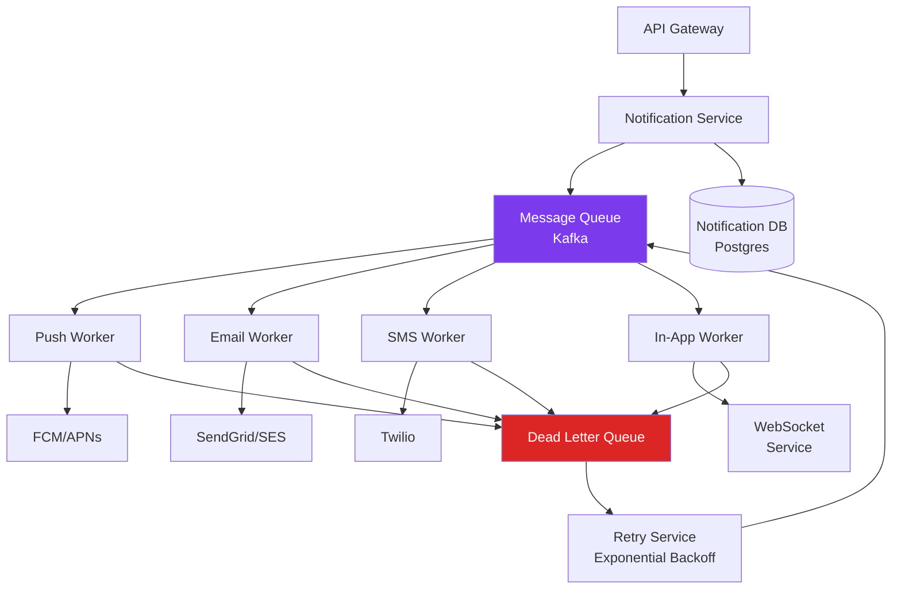
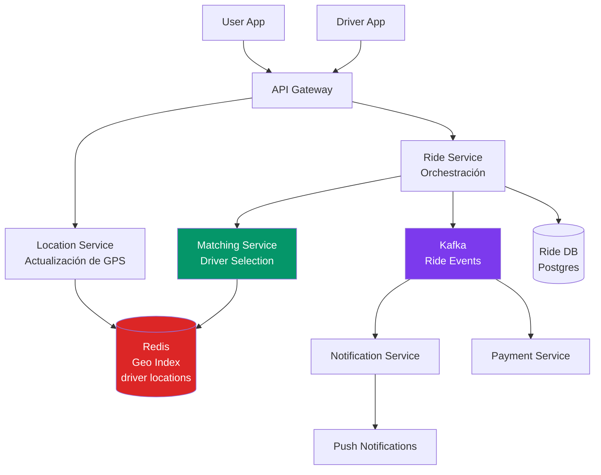
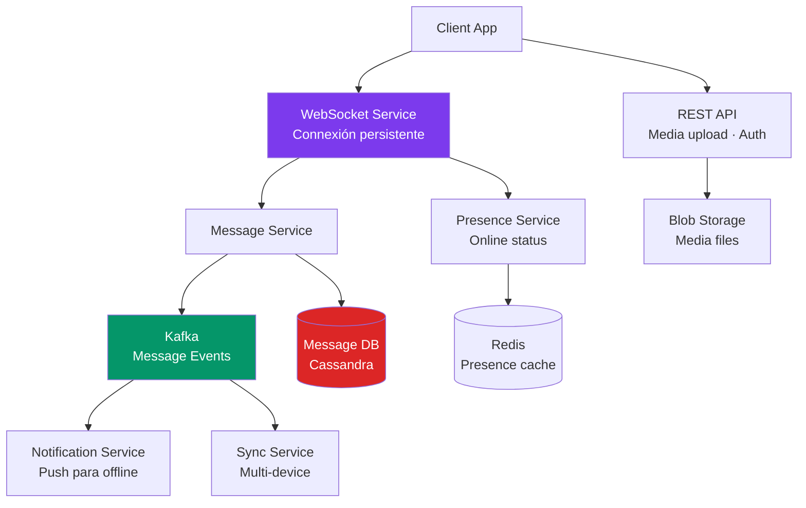
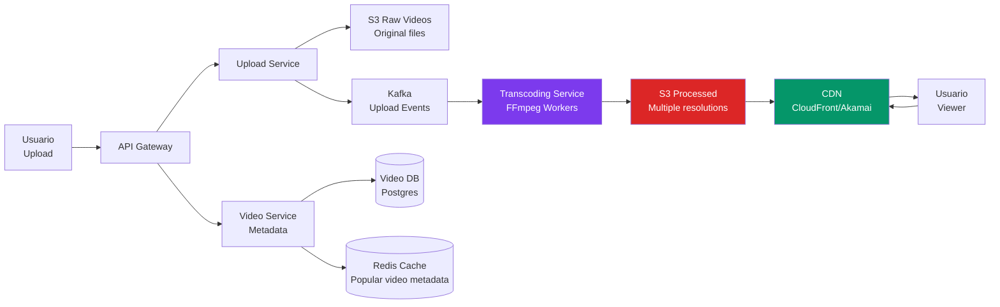
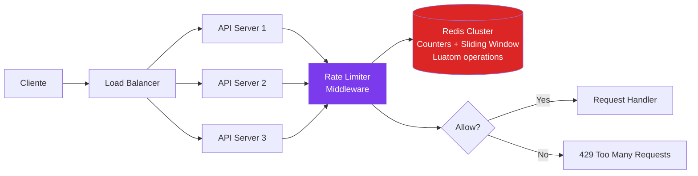

# 07-02 — System Design Interviews: RESHADED en Contexto de Entrevista

> **Base de conocimiento:** [04-00-overview.md](../modulo-04-system-design/04-00-overview.md) — El framework RESHADED completo y las estimaciones back-of-the-envelope están ahí. Este archivo no los duplica — enseña a aplicarlos en el contexto específico de una entrevista de 45-60 minutos con un entrevistador mirando.
>
> **La diferencia que importa:** Puedes conocer Kafka, consistent hashing, y el CAP Theorem perfectamente y aun así fallar la entrevista. El gap no es de conocimiento — es de proceso. Este archivo cierra ese gap.

---

## Sección 1 — La Diferencia entre Saber y Demostrar

Un error sistémico de candidatos Senior con conocimiento real: llegan a la entrevista de System Design con arquitecturas correctas en la cabeza y las vacían en el pizarrón sin proceso visible. El entrevistador no puede distinguir si el candidato diseñó ese sistema o si lo memorizó.

Lo que evalúa el entrevistador de nivel Staff no es si tu arquitectura es correcta — es si puedes **razonar desde requirements hacia arquitectura** en tiempo real, con información incompleta, y articular los trade-offs de cada decisión.

```
Nivel promedio: empieza a dibujar cajas a los 2 minutos
Nivel Staff: empieza con preguntas a los 2 minutos, dibuja a los 8
```

Los primeros 5 minutos de una entrevista de System Design determinan si el entrevistador te ve como alguien que diseña sistemas o alguien que dibuja diagramas que memorizó. Son los 5 minutos más importantes de la entrevista.

---

## Sección 2 — RESHADED Aplicado a Entrevista: Tiempo y Errores

El framework RESHADED está definido en 04-00. Aquí el foco es la distribución de tiempo y los errores de ejecución más comunes.

```mermaid
gantt
    title 50 Minutos de System Design Interview (Staff)
    dateFormat mm
    axisFormat %M min

    R - Requirements      : 00, 6m
    E - Estimation        : 06, 5m
    S - Storage / Data    : 11, 4m
    H - High Level Design : 15, 12m
    A - APIs              : 27, 4m
    D - Deep Dive         : 31, 14m
    E - Extensions        : 45, 5m
```



### Error #1 — Saltar al diseño sin requirements (el más común y el más costoso)

**Por qué pasa:** La ansiedad de "mostrar que sabes" hace que el candidato empiece a dibujar inmediatamente.

**Por qué es fatal:** El entrevistador tiene un caso de uso específico en mente. Si asumes mal el ratio read/write, el diseño completo está optimizado para el problema equivocado. Descubrir esto a los 30 minutos significa empezar de cero.

**La corrección:** Dedica 5-6 minutos completos a requirements. Sé explícito: "Antes de diseñar, necesito clarificar algunos requirements funcionales y no-funcionales."

### Error #2 — Estimaciones que no generan decisiones

**Nivel promedio:** "Habrá 100M usuarios. [Sigue diseñando]"

**Nivel Staff:** "100M DAU, ratio read/write de 20:1, lo que significa aproximadamente 1,160 writes/segundo y 23,000 reads/segundo en promedio — pico probablemente 5x eso para reads: ~115,000 reads/s. Eso me dice que necesito caching agresivo en el read path — una sola base de datos no puede manejar 115K reads/s sin caché. Y para writes, 1,160/s es manejable con una sola instancia primary pero necesitamos replicación para el failover."

Las estimaciones tienen valor si y solo si generan decisiones de arquitectura. Si calculas números y luego los ignoras, estás perdiendo tiempo y señalando que no entiendes para qué sirven.

### Error #3 — No llegar al Deep Dive

El entrevistador tiene 14 minutos reservados para que elija un componente y lo profundices. Si te quedas en el High Level Design hasta el minuto 45, no llegaron al Deep Dive — y el Deep Dive es donde se decide si eres Senior o Staff.

**La corrección:** A los 30-32 minutos, deja espacio para el Deep Dive activamente: "Tengo el High Level Design listo. ¿Qué componente quieres explorar en profundidad? Yo sugeriría el mecanismo de [componente más complejo] porque tiene los trade-offs más interesantes."

### Error #4 — Defender una sola arquitectura sin articular alternativas

**Nivel promedio:** "Voy a usar Kafka para la mensajería."

**Nivel Staff:** "Para la mensajería tengo dos opciones principales: Kafka para throughput masivo con retención de mensajes, o Azure Service Bus si estamos en Azure y necesitamos integración más simple con at-least-once garantizado y dead-letter queue nativo. Dado que mencionaste que el sistema procesa 50M eventos/día y necesitamos capacidad de replay para auditoría, voy con Kafka — aunque el costo operacional es mayor."

La diferencia: el Staff menciona que consideró alternativas y por qué las descartó. Sin eso, el entrevistador no sabe si elegiste Kafka porque es la única opción que conoces o porque es la correcta para este caso.

---

## Sección 3 — Cómo Hablar Durante un System Design

Esta es la habilidad que menos se practica y más diferencia al candidato Staff. El contenido técnico importa, pero la narración del proceso importa igual.

### Al clarificar requirements (primeros 5-6 minutos)

**Frame explícito:** "Voy a hacer algunas preguntas para entender bien el scope antes de empezar a diseñar."

```
Functional requirements:
"¿Qué puede hacer un usuario? ¿Cuáles son los flows principales?"
"¿Hay roles diferentes — usuario regular vs admin vs anunciante?"
"¿Cuáles son los casos de uso más críticos para el negocio?"

Non-functional requirements:
"¿Cuántos usuarios activos diarios esperamos? ¿En qué escala estamos — millones o cientos de millones?"
"¿El sistema es más read-heavy o write-heavy?"
"¿Cuánta consistencia necesitamos? ¿Es aceptable eventual consistency?"
"¿Es un sistema global o regional?"
"¿Hay requirements de compliance? (PCI, GDPR, HIPAA)"
```

**Al terminar:** "Basado en esto, voy a asumir: [lista de 3-4 assumptions explícitas]. ¿Eso está alineado?"

### Al hacer estimaciones (5 minutos)

Hacerlas en voz alta, lentamente, con las decisiones que generan:

```
"300M DAU. Asumiendo que cada usuario hace 5 acciones relevantes por día:
300M × 5 / 86,400 segundos = aproximadamente 17,000 operaciones por segundo en promedio.
Pico: 3-5x promedio = 50,000-85,000 ops/s.

Para storage: cada record es ~1KB. 300M × 5 = 1,500M records/día.
En 5 años: 1,500M × 365 × 5 × 1KB ≈ 2.7 PB. Necesitamos sharding.

Read/write ratio: 80:20. Eso significa ~14,000 reads/s y 3,400 writes/s en promedio.
Esto me dice: el read path es el problema principal, no el write path. Priorizo caching."
```

### Al presentar el High Level Design

Narrativa primero, componentes después:

```
"El sistema tiene dos flows principales: el write path y el read path.
En el write path: el cliente llega al API Gateway → Tweet Service → escribe en la BD 
y publica en Kafka → el Fan-out Service consume y actualiza timelines en Redis.
En el read path: el cliente pide el timeline → Timeline Service → Redis cache → 
si miss, va a la BD.
[Dibuja mientras explica]
¿Tiene sentido esta estructura general? ¿Quieres que clarifique algún componente 
antes de que profundice?"
```

### Al hacer Deep Dive

Tomar ownership del componente elegido:

```
"El componente más complejo aquí es el Fan-out. El problema es que cuando 
Justin Bieber con 100M seguidores tuitea, necesitamos actualizar 100M timelines.
Si lo hacemos síncronamente en el write, la respuesta al usuario tarda minutos.
Tengo tres opciones: [explica cada una con su trade-off]
Para este caso, voy a usar Hybrid Fan-out: push para la mayoría de usuarios,
pull para usuarios con > 1M seguidores como celebrities. [Elabora la implementación]"
```

---

## Sección 4 — 5 Casos de Práctica con Estructura de Mock Interview

### Caso 1 — Design a Notification System

**Enunciado (como lo daría el entrevistador):**
> "Design a notification system that can send millions of notifications per day across multiple channels: push, email, SMS, and in-app."

**Requirements a clarificar (los que el Staff hace):**
- Escala: cuántos usuarios, cuántas notificaciones/día, pico
- Channels: todos los 4 o subset, ¿hay fallback si uno falla?
- Delivery guarantee: at-least-once o exactly-once ¿cuánta duplicación es aceptable?
- Ordering: ¿importa que "tu paquete fue enviado" llegue antes que "tu paquete fue entregado"?
- User preferences: opt-out por canal, horarios de no-molestar (DND)
- Latencia: ¿notificaciones críticas (MFA) deben llegar en < 1s? ¿notificaciones de marketing en < 5 min?

**Estimaciones que cambian el diseño:**
```
50M DAU × 5 notificaciones/día = 250M notificaciones/día
250M / 86,400 = ~2,900 notificaciones/segundo promedio
Pico: 5x = 14,500/segundo (eventos globales como breaking news)
```
→ Ningún canal de envío síncrono sobrevive el pico. Queue es obligatorio.

**HLD:**



**Deep Dive que el entrevistador suele elegir:** Exactly-once delivery vs idempotencia.

**Trade-off que el Staff articula proactivamente:**
> "Elegí at-least-once delivery con idempotency keys en lugar de exactly-once porque el overhead de exactly-once con distributed transactions es significativo. Para notificaciones, recibir el mismo push notification dos veces es menos dañino que no recibirlo. El trade-off es que cada consumer debe ser idempotente — guardamos el `notification_id` en Redis con TTL de 24h y descartamos duplicados en el consumer."

**Referencia de profundidad:** El Outbox Pattern para garantizar que la notificación se publica en Kafka incluso si el servicio cae después de escribir en BD está en `04-08-casos-clasicos.md`.

---

### Caso 2 — Design a Ride-Sharing System (Uber/DiDi)

**Enunciado:**
> "Design a ride-sharing platform where users can request rides and drivers can accept them."

**Requirements críticos a clarificar:**
- Flujos principales: request ride, match driver, tracking en tiempo real, payment
- Escala: cuántos usuarios, cuántas ciudades, cuántos drivers activos concurrentemente
- Latencia del matching: ¿cuánto tiempo es aceptable para asignar un driver?
- Consistencia: ¿puede asignarse el mismo driver a dos riders simultáneamente?

**Estimaciones que cambian el diseño:**
```
50M usuarios, 5M drivers activos en hora punta
Drivers envían ubicación cada 3-5 segundos → 5M / 4 = 1.25M actualizaciones de ubicación/segundo
Rides activos: ~1M concurrentemente durante pico
```
→ La actualización de ubicación de drivers es el bottleneck de write. Necesita almacenamiento especializado para geo-queries.

**HLD con componentes clave:**



**Deep Dive típico: Matching Algorithm**

El entrevistador quiere ver cómo asignas el driver correcto evitando race conditions:

```
Aproximación naive: buscar driver más cercano, intentar asignar, si el driver ya tiene ride, buscar el siguiente.
Problema: a 1.25M actualizaciones/seg, dos riders pueden intentar asignar el mismo driver simultáneamente.

Solución Staff:
1. Location Service mantiene los drivers en Redis con GEOSEARCH (O(n + m log m))
2. Matching Service selecciona top-k candidatos (k=5-10)
3. Distributed lock en Redis (SETNX con TTL) al intentar asignar un driver específico
4. Si el lock falla (driver ya asignado), intentar siguiente candidato
5. El lock tiene TTL de 30s — si el driver no acepta, se libera automáticamente
```

**Trade-off que el Staff articula:**
> "El GEOSEARCH de Redis con índices geoespaciales es O(n + m log m) donde n = drivers en el radio y m = resultados. Funciona para ciudades individuales, pero para escala global necesitaríamos sharding por ciudad/región en Redis. La alternativa es un servicio especializado de geo-queries como PostGIS o H3 (Uber's hexagonal grid), que es más costoso en infraestructura pero más escalable geográficamente."

---

### Caso 3 — Design a Chat Application (WhatsApp)

**Enunciado:**
> "Design a chat application that supports 1-to-1 and group messaging with message delivery guarantees."

**Requirements críticos:**
- 1-on-1 y grupos: ¿cuál es el límite de un grupo? ¿100, 1000, 10000 miembros?
- Delivery guarantees: at-least-once delivery + read receipts (✓✓)
- Media: ¿solo texto o también imágenes/video?
- Online/offline: ¿qué pasa con mensajes cuando el receptor está offline?
- History: ¿cuánto tiempo se retienen los mensajes?

**HLD:**



**Deep Dive típico: Delivery con Read Receipts**

```
Estado de cada mensaje: sent → delivered → read

Implementación:
1. Sender → WebSocket → Message Service → guarda en Cassandra → ACK al sender (✓)
2. Si receptor online: Message Service → WebSocket del receptor → ACK de entrega → actualiza estado en Cassandra (✓✓)
3. Si receptor offline: Message Service → Kafka → Notification Service → push notification
   Cuando receptor se conecta: WebSocket Service pide pending messages → entrega → ACK (✓✓)
4. Receptor abre el mensaje: cliente envía "read" event → WebSocket → Message Service → 
   actualiza estado → notifica al sender (✓✓ azul)

Por qué Cassandra para messages:
- Write-heavy (cada mensaje es un write)
- Access pattern: "dame mensajes de este conversation_id después de este timestamp" → range query por partition key = conversation_id
- Cassandra está optimizado para este pattern exacto
- Las messages no se actualizan (solo el estado) → append-only workload
```

**Trade-off Staff:**
> "Usé Cassandra porque el access pattern principal — 'dame los últimos N mensajes de esta conversación' — mapea perfectamente a la partition key de Cassandra (conversation_id) con sort por timestamp. La alternativa en PostgreSQL con un índice compuesto (conversation_id, created_at) funciona bien hasta ~1B mensajes pero empieza a degradarse. Para la escala de WhatsApp (100B mensajes históricos), Cassandra's compaction y wide-row storage es la elección correcta."

---

### Caso 4 — Design a Video Streaming Service (YouTube)

**Enunciado:**
> "Design a video streaming platform where users can upload and watch videos."

**Requirements críticos:**
- Upload: formatos soportados, tamaño máximo, ¿transcoding a múltiples resoluciones?
- Streaming: adaptive bitrate, CDN para distribución global
- Escala: cuántos videos/día de upload, cuántos views concurrentes
- Storage: ¿videos se retienen indefinidamente?

**Estimaciones:**
```
500K uploads/día × 300MB promedio = 150 TB/día de storage de video
10M concurrent viewers × 5 Mbps promedio = 50 Tbps de bandwidth
→ CDN no es opcional — es el componente principal del read path
```

**HLD:**



**Deep Dive típico: Transcoding Pipeline**

```
El problema: un video de 1 hora en 4K puede tardar 4-8 horas en transcodar a todas las resoluciones.
No podemos bloquear la API esperando el transcoding.

Arquitectura asíncrona:
1. Upload Service recibe el video → guarda en S3 Raw → publica UploadEvent en Kafka → responde 200 al uploader
2. Transcoding Workers consumen el evento → obtienen el raw video de S3 → 
   transcodan en paralelo (360p, 720p, 1080p, 4K si aplica)
3. Cada worker guarda el resultado en S3 Processed → actualiza el estado en la DB
4. Cuando todos los formatos están listos → notifica al uploader via WebSocket o email
5. Video pasa de estado "processing" a "available"

Paralelización: cada resolución puede transcodarse en un worker independiente.
Un video de 1 hora en 4K: 4 workers en paralelo → 4K tarda 8h, pero 360p puede estar 
disponible en 30 min. Mostrar la versión baja resolución mientras las demás transcodan.
```

**Trade-off Staff:**
> "El transcoding es CPU-intensivo y variable en duración. Por eso no uso compute fijo — uso instancias spot de EC2 (o Azure Spot VMs) escaladas automáticamente según la queue de Kafka. El costo de transcoding se reduce 70% con spot. El riesgo es que el spot puede interrumpirse — pero el worker hace checkpointing del progreso cada 5 minutos, así que si la instancia muere, otro worker retoma desde el último checkpoint."

---

### Caso 5 — Design a Distributed Rate Limiter

**Enunciado:**
> "Design a rate limiter that works across multiple API servers to enforce limits per user."

**Requirements críticos:**
- Granularidad: per-user, per-IP, per-API-key, o combinación
- Algoritmo: fixed window, sliding window, token bucket, leaky bucket — ¿el entrevistador tiene preferencia?
- Distributed: múltiples API servers necesitan un estado compartido
- Latencia: el rate limiter está en el critical path — latencia < 1ms idealmente
- Consistency: ¿es aceptable que un usuario haga 10% más requests del límite si hay race conditions?

**HLD:**



**Deep Dive: Sliding Window Log con Redis**

```csharp
// Redis Lua script para atomic check-and-increment (sliding window log)
// Lua garantiza atomicidad — no hay race conditions entre check e increment
const string luaScript = @"
    local key = KEYS[1]
    local now = tonumber(ARGV[1])
    local window = tonumber(ARGV[2])
    local limit = tonumber(ARGV[3])
    
    -- Remover entradas fuera de la ventana
    redis.call('ZREMRANGEBYSCORE', key, '-inf', now - window)
    
    -- Contar entradas en la ventana actual
    local count = redis.call('ZCARD', key)
    
    if count < limit then
        -- Agregar esta request
        redis.call('ZADD', key, now, now .. '-' .. math.random())
        redis.call('EXPIRE', key, window / 1000 + 1)
        return 1  -- Permitido
    end
    
    return 0  -- Rate limited
";
```

**Trade-offs que el Staff articula:**
> "Sliding Window Log es el más preciso pero O(max_requests) en memoria por usuario. Para 1000 req/min, cada usuario usa 1000 entries en Redis. A 10M usuarios activos: 10B entries — potencialmente problemático. Token Bucket es O(1) por usuario pero puede tener burst attacks en los límites de ventana. Elegí Sliding Window Log porque la precisión es crítica en este caso — un rate limiter que ocasionalmente permite bursts es peor que uno que usa más memoria. Con TTL en las claves, la memoria se libera automáticamente."

---

## Sección 5 — Señales de Nivel Staff que los Entrevistadores Buscan

Compilado de feedback real de entrevistadores en empresas top. En orden de impacto:

**1. Proactive trade-offs** — La señal más valorada y más escasa.
No espera que el entrevistador pregunte "¿por qué elegiste X?" — lo articula antes.
> "Estoy eligiendo eventual consistency aquí porque la alternativa de strong consistency requeriría coordinación entre nodos con un costo de latencia de ~50ms adicionales por write. Para un feed de redes sociales, esto es aceptable — el usuario puede ver un tweet con 2 segundos de delay. Para un sistema de pagos, no lo sería."

**2. Failure modes** — Muestra que piensa en producción, no en el happy path.
> "Si Redis cae en el read path, el fallback va directo a la BD. Eso va a aumentar la latencia p99 de 50ms a ~300ms y puede generar picos en la BD. Pero el sistema sigue disponible. Para mitigarlo, el Redis debería tener réplicas — la latencia del failover sería < 30 segundos."

**3. Scale transitions** — Demuestra que el diseño es evolutivo, no estático.
> "Este diseño funciona hasta ~10M usuarios. Para 100M, necesitaría sharding en la BD de users por user_id. Para 1B, la arquitectura de Fan-out cambiaría completamente — probablemente a pull-based con pre-computation."

**4. Data model clarity** — Definir las entidades antes de los servicios.
> "Las entidades principales son User, Tweet, Follow, y Timeline. El access pattern más frecuente es leer el timeline de un user — así que el modelo debe optimizar para ese query. Eso me dice que el Timeline debe estar desnormalizado en Redis, no construirse en tiempo real."

**5. Honest scope reduction** — Saber qué no diseñar.
> "Voy a enfocarme en el core del sistema: ingestion y querying de posts. Voy a dejar fuera search, monetización, y abuse detection — son sistemas separados y complejizarían el diseño sin añadir valor a lo que quieres evaluar hoy. ¿Estás de acuerdo?"

---

## Checklist de Salida

- [ ] Aplico RESHADED completo en cualquier pregunta de diseño sin consultarlo
- [ ] Mis estimaciones generan decisiones de arquitectura — no son ejercicios de matemáticas
- [ ] Articulo trade-offs proactivamente en al menos 3 componentes de cualquier diseño
- [ ] Describo failure modes de mis componentes principales sin que me pregunten
- [ ] Diseño Twitter Feed con Hybrid Fan-Out en < 45 minutos con diagrama y estimaciones
- [ ] Diseño Notification System con at-least-once y DLQ en < 45 minutos
- [ ] Completo al menos 5 mock interviews de System Design completas con cronómetro

---

> **Recursos:**
> - **ByteByteGo** — [bytebytego.com](https://bytebytego.com) — newsletter semanal + YouTube. Compañero de práctica obligatorio
> - **AlgoExpert Systems Expert** — mock interviews de system design con evaluación estructurada
> - **DDIA** (Designing Data-Intensive Applications, Kleppmann) — los capítulos 5, 7, y 9 son críticos para Deep Dives

---

> **Siguiente paso:** [07-03-ai-system-design-interviews.md](./07-03-ai-system-design-interviews.md) — La nueva categoría de ronda que apareció en procesos Staff en 2025-2026, y cómo prepararse para ella con el mismo rigor.
