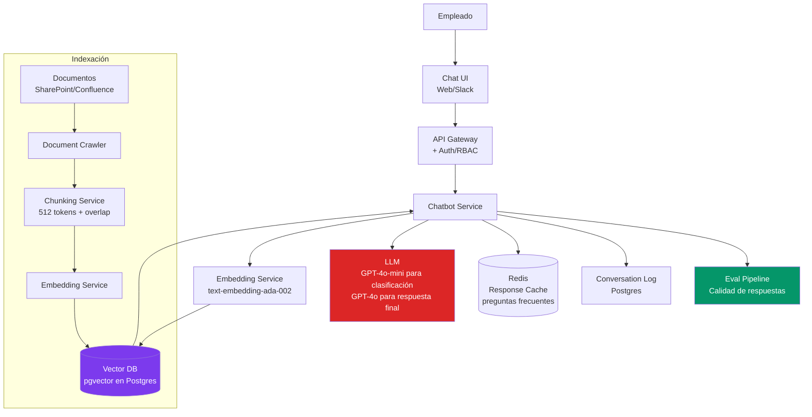
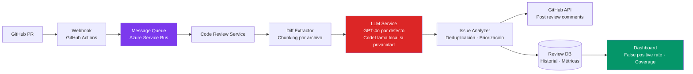
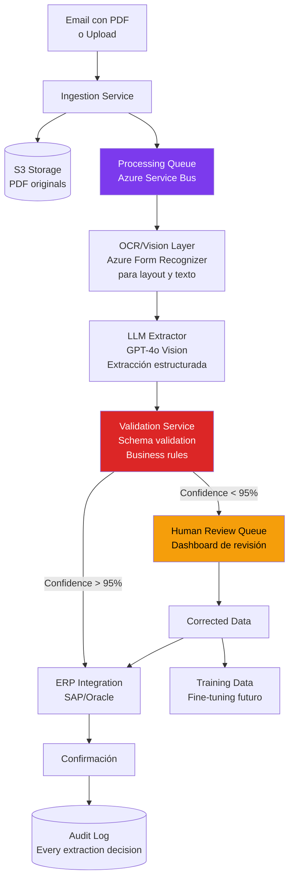

# 07-03 — AI System Design Interviews: La Nueva Ronda de 2026

> **Prerequisito:** [07-02-system-design-interviews.md](./07-02-system-design-interviews.md) — Este archivo asume que tienes RESHADED sólido. La ronda de AI System Design no reemplaza el System Design clásico — lo extiende con constraints y trade-offs específicos de sistemas que usan LLMs.
>
> **Base técnica:** [06-02-llm-system-design.md](../modulo-06-ia-integrada/06-02-llm-system-design.md) — RAG, vector databases, trade-offs de modelos. Si no tienes eso sólido, este archivo es difícil de aplicar.

---

## Sección 1 — Por Qué Existe Esta Ronda en 2026

Las empresas tech en 2026 necesitan Staff Engineers que puedan hacer preguntas que antes solo hacían los ML Engineers: ¿Cuándo usar RAG vs fine-tuning? ¿Cómo manejas la latencia de 2-4 segundos de un LLM en un sistema que tiene SLA de < 500ms? ¿Cómo detectas que el sistema de IA está degradando en producción?

No están buscando ML Engineers disfrazados de Software Engineers. Están buscando **Software Engineers que entienden cuándo y cómo integrar IA correctamente**, con los mismos estándares de ingeniería que aplicarían a cualquier otro subsistema: latencia, costo, reliability, observabilidad, seguridad.

**El perfil que no pasa esta ronda:**
- El developer que dice "usamos GPT-4 para todo" sin hablar de costo, latencia, o fallback
- El developer que copia arquitecturas de tutoriales de LangChain sin entender sus trade-offs
- El developer que trata el LLM como una caja negra que "simplemente funciona"

**El perfil que sí pasa:**
- El Staff Engineer que aplica exactamente el mismo rigor de trade-offs que en un sistema sin IA
- El que articula: "El LLM añade ~2s de latencia — eso requiere streaming o async. El costo por query es $0.02 — a 100K queries/día son $2K/día, ¿el presupuesto lo soporta?"
- El que describe cómo el sistema falla cuando el LLM da alucinaciones, y cómo lo detecta

---

## Sección 2 — Framework para AI System Design

RESHADED aplica igual. Las extensiones están en los Requirements y en el Deep Dive:

### Requirements adicionales para sistemas con IA

Las preguntas que el entrevistador espera que hagas y que distinguen a alguien que ha trabajado con estos sistemas en producción:

```
Latencia:
"¿Cuánta latencia es aceptable para el usuario? Los LLMs toman 1-4 segundos 
para el primer token — ¿el sistema puede usar streaming para UX mejor?"

Costo:
"¿Cuál es el presupuesto por query? ¿Por día? Con GPT-4o a $0.01-0.03/1K tokens,
¿cuántos tokens por query son aceptables?"

Accuracy:
"¿Qué nivel de accuracy es aceptable? ¿Hay tolerance para alucinaciones o el 
sistema necesita 100% de fidelidad a las fuentes?"

Explainability:
"¿El sistema necesita explicar su razonamiento o citar las fuentes? 
¿Hay requirements de auditoría?"

Privacidad:
"¿Hay PII en los datos que se envían al LLM? ¿Se puede enviar eso a una API externa 
o necesitamos un modelo on-premise?"

Freshness:
"¿El conocimiento del sistema necesita actualizarse? ¿Cada día, hora, en tiempo real?"
```

### Preguntas que demuestran nivel Staff en AI design

Estas preguntas son las que separan al candidato que copió tutoriales del que diseñó sistemas reales:

- "¿Los datos caben en el context window de una llamada o necesitamos RAG?"
- "¿El comportamiento del sistema necesita ser fine-tuned o RAG con buenos prompts es suficiente?"
- "¿Cómo manejamos el fallback cuando la API del LLM está caída o supera el rate limit?"
- "¿Cómo evaluamos que el sistema sigue funcionando bien después de que el proveedor actualiza el modelo?"
- "¿Hay usuarios que podrían intentar prompt injection para extraer información del sistema?"

---

## Sección 3 — Decisiones Clave en AI System Design

Antes de los casos, estas son las decisiones de arquitectura recurrentes con sus trade-offs reales. Un candidato Staff debe poder articularlas en 2 minutos.

### RAG vs Fine-tuning vs Long Context

```
RAG (Retrieval-Augmented Generation):
✅ Mejor cuando: el conocimiento cambia frecuentemente, el dataset es grande (> 100K docs),
   necesitas citar fuentes, o los datos son sensibles (no salen de tu infraestructura)
❌ Peor cuando: el conocimiento es estable, la latencia adicional del retrieval es inaceptable,
   el volumen de queries es muy bajo

Fine-tuning:
✅ Mejor cuando: necesitas un estilo/tono muy específico, el modelo necesita aprender 
   nuevas capabilities (no solo nuevo conocimiento), tienes > 1000 ejemplos de alta calidad
❌ Peor cuando: el conocimiento cambia (el modelo queda desactualizado), 
   el dataset de entrenamiento es < 100 ejemplos (overfitting), o necesitas auditoría de fuentes

Long Context (GPT-4.1 con 1M tokens, Gemini 1.5 con 2M):
✅ Mejor cuando: el documento cabe en el contexto, la latencia extra es aceptable,
   la simplicidad importa más que la eficiencia
❌ Peor cuando: la latencia es crítica (1M tokens de contexto = 10-30s más lento),
   el costo por llamada se multiplica, o los documentos cambian frecuentemente
```

### Modelo grande vs modelo pequeño

```
GPT-4o / Claude Opus / Gemini 1.5 Pro:
✅ Razonamiento complejo, tareas abiertas, alta accuracy requerida
❌ $0.01-0.05 por 1K tokens, 2-4 segundos de latencia

GPT-4o-mini / Claude Haiku / Gemini Flash:
✅ Clasificación, extracción estructurada, routing, tareas bien definidas
   $0.0001-0.001 por 1K tokens (100x más barato), < 500ms latencia
❌ Menor accuracy en razonamiento complejo

Patrón Staff: usar el modelo más pequeño posible para cada subtarea.
Clasificar intent con Haiku ($0.0001/query) → responder con Opus solo cuando sea necesario ($0.05/query)
```

### Streaming vs Batch

```
Streaming (SSE / WebSockets):
- El primer token llega en < 200ms aunque el completion completo tarde 3 segundos
- La UX percibida mejora radicalmente — el usuario ve que "está escribiendo"
- Ideal para chatbots, cualquier sistema interactivo

Batch / Async:
- El resultado no se necesita en tiempo real — se procesa en background
- Ideal para pipelines de procesamiento de documentos, análisis de datos, generación de reportes
- Puede usar modelos más lentos y baratos porque la latencia no importa
```

---

## Sección 4 — 3 Casos de Práctica Completos

### Caso 1 — Chatbot Corporativo con RAG

**Enunciado:**
> "Design an internal chatbot for a company with 10,000 employees that can answer questions about HR policies, IT procedures, and company benefits. The chatbot should use internal documents as its knowledge base."

**Requirements a clarificar:**
- Escala: 10,000 empleados, ¿cuántas queries/día? ¿Concurrentes?
- Documentos: ¿PDFs, Word, wikis? ¿Cuántos? ¿Qué tan frecuente se actualizan?
- Latencia: ¿< 3 segundos es aceptable para primera respuesta?
- Accuracy crítica: HR policies afectan compliance — ¿tolerancia cero para alucinaciones?
- Access control: ¿todos ven todo o hay documentos por departamento?
- Fallback: ¿qué pasa cuando el chatbot no sabe la respuesta? ¿Escala a humano?

**Estimaciones:**
```
10,000 empleados × 5 queries/día = 50,000 queries/día
50,000 / 86,400 ≈ 0.6 queries/segundo promedio
Pico (9am-11am): 10x = 6 queries/segundo

Documents: ~5,000 docs × 50KB promedio = 250 MB de texto
Con chunking de 512 tokens: ~25,000 chunks
Embeddings: 25,000 × 1,536 dimensiones (OpenAI ada-002) = ~150 MB de vectores
→ Cabe perfectamente en pgvector o un vector DB local
```

**HLD:**



**Deep Dive: Pipeline de RAG con Access Control**

```
1. Query llega → clasificación de intent (Haiku, < 100ms): 
   ¿Es una pregunta de HR/IT/Benefits o out-of-scope?

2. Si out-of-scope: respuesta directa sin RAG ("Soy un chatbot de HR/IT...")

3. Si in-scope:
   a. Generar embedding del query (ada-002, ~50ms)
   b. Buscar top-k chunks más similares en pgvector filtrados por RBAC del usuario
      (usuario de Finanzas solo ve docs de Finanzas + docs globales)
   c. Construir prompt con los chunks recuperados + query
   d. Llamada a GPT-4o con streaming → respuesta aparece en < 500ms primer token
   e. En la respuesta, incluir fuentes: "Basado en [Policy Document v3.2, pág 5]"

4. Logging: guardar query, chunks recuperados, respuesta, feedback del usuario
   → Alimenta el eval pipeline
```

**Componente crítico: Eval Pipeline**

> Sin métricas de calidad no puedes saber si el sistema está funcionando bien o si las alucinaciones están aumentando después de una actualización del modelo del proveedor.

```
Métricas automáticas:
- Answer Faithfulness: ¿la respuesta está soportada por los chunks recuperados?
  → LLM-as-judge: le preguntamos a un LLM si la respuesta es fiel a las fuentes
- Retrieval Precision: ¿los chunks recuperados son relevantes para la pregunta?
- No-answer rate: ¿con qué frecuencia el chatbot dice "no sé"? 
  Muy alto → hay gaps en el knowledge base
  Muy bajo → puede estar alucinando respuestas sin soportar con fuentes

Métricas manuales (muestra semanal):
- 50 queries/semana evaluados manualmente por alguien de HR
- Ground truth para calibrar las métricas automáticas
```

**Trade-offs que el Staff articula:**

> "Para documentos de HR policy que son críticos para compliance, diseñé el sistema para incluir siempre las fuentes en cada respuesta — qué documento, qué sección. Esto tiene dos beneficios: el usuario puede verificar la respuesta, y nosotros tenemos auditoría completa de qué información generó qué respuesta. La alternativa sería una respuesta más fluida sin citas, pero en un contexto de HR policies donde el error puede tener consecuencias legales, la trazabilidad vale más que la fluidez."

---

### Caso 2 — Sistema de Code Review Automatizado con IA

**Enunciado:**
> "Design an automated code review system that integrates with your CI/CD pipeline and uses LLMs to review pull requests."

**Requirements críticos:**
- ¿Review de qué? ¿Bugs, security issues, style, o todo?
- Latencia: ¿debe bloquear el merge o es asíncrono?
- False positive rate aceptable: mucho ruido → devs ignoran los comentarios
- Costo: cuántos PRs por día, líneas de código promedio
- Privacidad: ¿el código puede enviarse a una API externa?

**Estimaciones:**
```
100 devs × 3 PRs/semana = 300 PRs/semana = 43 PRs/día
Promedio 200 líneas cambiadas por PR × 10 tokens/línea = 2,000 tokens por PR
Con 200 tokens de contexto adicional (prompt, instrucciones) = 2,200 tokens por llamada
Con GPT-4o: $0.005 per 1K input tokens → 2.2K tokens × $0.005 = $0.011 por PR
43 PRs/día × $0.011 = $0.47/día = ~$14/mes → trivial
```

**HLD:**



**Trade-offs que el Staff articula:**

> "El mayor riesgo operacional es el false positive rate. Si el sistema comenta cosas incorrectas o irrelevantes con frecuencia, los devs aprenden a ignorar todos los comentarios — incluyendo los válidos. Por eso el sistema tiene dos capas: el LLM genera candidatos de issues, y un segundo paso de clasificación (puede ser un LLM más pequeño o reglas deterministas) filtra los que tienen baja confianza. Solo publicamos comentarios con confidence > 0.85. El threshold es configurable y se ajusta basado en feedback de los devs (👍/👎 en cada comentario)."

> "Para privacidad: por defecto usamos GPT-4o, pero si el código contiene secretos o IP sensible, hay un switch para usar CodeLlama (modelo open-source) en infraestructura propia. La latencia aumenta de 2s a 8s, pero ninguna línea de código sale del datacenter."

---

### Caso 3 — Sistema de Procesamiento de Documentos con IA (Extracción Estructurada)

**Enunciado:**
> "Design a system that receives invoices in PDF and extracts structured data (vendor, amount, date, line items) for insertion into an ERP system. Accuracy required: 99.5%."

**Requirements críticos:**
- Volumen: cuántas facturas/día, tamaño promedio, variedad de formatos
- Accuracy 99.5%: el 0.5% va a revisión humana — ¿cómo identifies el 0.5%?
- Latencia: ¿procesamiento en tiempo real o batch está bien?
- Formatos: solo PDF o también escaneados (OCR necesario)?
- ERP integration: ¿qué pasa si el ERP rechaza el dato (validación falla)?

**Estimaciones:**
```
1,000 facturas/día × 5 páginas promedio × 2,000 tokens/página = 10M tokens/día
Con GPT-4o Vision: ~$0.01/1K tokens → $100/día = $3,000/mes
Con modelo especializado (Document AI, Azure Form Recognizer): 
$1.50 per 1,000 pages = $7.50/día → 93% más barato
```

**HLD:**



**Deep Dive: Alcanzar 99.5% de Accuracy**

```
El LLM extrae, pero el 99.5% de accuracy no viene solo del LLM — viene del pipeline completo.

Estrategia en capas:
1. Azure Form Recognizer primero: extrae el layout y texto con alta confianza para facturas 
   de formatos conocidos (templates específicos de proveedores). Accuracy: ~97% en formatos vistos.

2. GPT-4o Vision como fallback para formatos desconocidos o cuando Form Recognizer tiene 
   baja confianza. Accuracy adicional: +1.5-2%.

3. Validation layer (determinista, no LLM):
   - El total debe ser = sum(line_items) ± tolerancia del 0.01%
   - La fecha debe ser parseable y razonable (no en el futuro, no > 2 años atrás)
   - El RFC/EIN del proveedor debe existir en la base de proveedores conocidos

4. Confidence scoring: cada campo tiene una confianza individual. Si algún campo crítico
   (amount_total, vendor_id) tiene confianza < 95%, la factura va a human review.

5. Human review enriches el modelo: cada corrección manual se guarda para fine-tuning
   trimestral del modelo de extracción. El sistema mejora con el tiempo.

Resultado: 99.5% de facturas se procesan sin intervención humana.
0.5% va a revisión → no es un fallo del sistema, es la arquitectura correcta para ese level de accuracy.
```

**Trade-offs Staff:**

> "El 99.5% de accuracy suena como un threshold alto pero el 0.5% de revisión humana es intencional — es más barato que intentar llegar al 99.9% con el LLM solo, lo cual requeriría un pipeline más complejo o un modelo más grande con 5x el costo. Los 0.5% de casos que van a revisión humana son exactamente los casos ambiguos donde un humano añade valor real. Y esa revisión humana alimenta el loop de mejora del modelo."

---

## Sección 5 — Trade-offs que los Entrevistadores Esperan en AI Design

Los trade-offs específicos de sistemas con IA que demuestran nivel Staff:

| Trade-off | Respuesta nivel promedio | Respuesta nivel Staff |
|---|---|---|
| Modelo grande vs pequeño | "El grande es más preciso, usaría GPT-4o" | "Para clasificación de intent, Haiku a $0.0001/query. Solo escalo a Opus para razonamiento complejo. El diferencial de costo es 500x." |
| RAG vs Fine-tuning | "RAG es más fácil de implementar" | "RAG cuando el conocimiento cambia frecuentemente o necesito citar fuentes. Fine-tuning cuando el *comportamiento* necesita cambiar, no solo el conocimiento, y tengo > 1K ejemplos de calidad." |
| Latencia vs calidad | "El modelo más lento es más preciso" | "Streaming permite mostrar el primer token en < 200ms aunque el completion total tarde 3s. La UX percibida mejora radicalmente. Para batch processing, no me importa la latencia — puedo usar modelos más lentos y baratos." |
| Evals de calidad | "Revisamos manualmente periódicamente" | "LLM-as-judge para regression testing continuo + evals humanas como ground truth. Sin automated evals, no detectamos degradación cuando el proveedor cambia el modelo." |
| API externa vs on-premise | "API externa es más simple" | "API externa si el data no es sensible y el costo es aceptable. On-premise (Ollama, vLLM) si hay PII, si el costo a escala es prohibitivo, o si necesitamos latencia < 100ms — imposible con APIs externas." |
| Alucinaciones | "El modelo a veces se equivoca" | "Alucinaciones son el riesgo principal. Mitigación: RAG con fuentes verificables, citar la fuente en cada respuesta, validation layer determinista para datos estructurados, confidence threshold para human review." |

---

## Checklist de Salida

- [ ] Puedo articular cuándo usar RAG vs fine-tuning vs long context con criterios concretos
- [ ] Calculo el costo y la latencia de un sistema LLM en las estimaciones
- [ ] Diseño el eval pipeline antes de que el entrevistador lo pregunte
- [ ] Articulo cómo el sistema falla cuando el LLM da alucinaciones y cómo lo detecto
- [ ] Tengo estrategia de fallback cuando la API del LLM está caída o rate-limited
- [ ] Distingo cuándo usar un modelo grande vs pequeño con criterio de costo/accuracy

---

> **Recursos:**
> - [06-02-llm-system-design.md](../modulo-06-ia-integrada/06-02-llm-system-design.md) — Base técnica de RAG, vector databases, y patrones de integración LLM
> - [06-05-evaluacion-seguridad-llm.md](../modulo-06-ia-integrada/06-05-evaluacion-seguridad-llm.md) — Evals, LLM-as-judge, guardrails
> - **AI Engineering** (Chip Huyen) — capítulos de production ML systems

---

> **Siguiente paso:** [07-04-behavioral-interviews.md](./07-04-behavioral-interviews.md) — El tipo de ronda que más se subestima y que en posiciones Staff tiene el mayor peso relativo.
